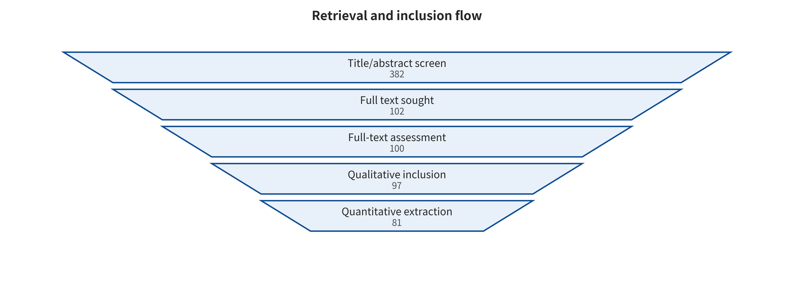
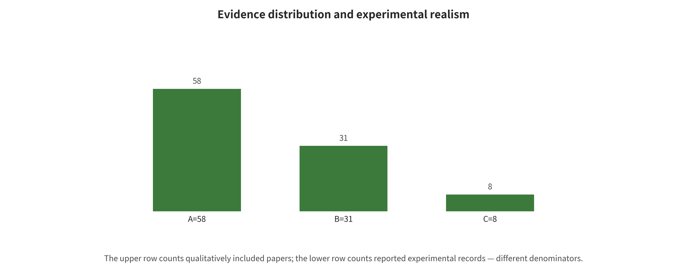

## Corpus, Search, and the Evidence Contract

The search protocol was frozen on 2026-08-06 and covers each database from its inception through the freeze date. Four broad queries were built around VLA attack and defense, WAM/world model security, the VLM upstream attack surface, and embodied system security. They were then completed by bidirectional tracking of core papers, supplementary searches by author/method name, and verification against CVF, ACM, OpenReview, project pages and official repositories. This restructuring inherits that frozen corpus. It does not change the search denominator again in pursuit of length.

Reproducible query one (VLA attack) is: all:"vision-language-action" AND (all:attack OR all:adversarial OR all:backdoor OR all:jailbreak OR all:poison OR all:hijack OR all:freeze OR all:privacy OR all:security).

Reproducible query two (VLA defense) is: all:"vision-language-action" AND (all:defense OR all:safeguard OR all:detect OR all:monitor OR all:shield OR all:verification OR all:"safe").

Reproducible query three (WAM security) is: all:"world action model" AND (all:security OR all:safety OR all:attack OR all:adversarial OR all:backdoor OR all:jailbreak OR all:integrity OR all:defense OR all:robustness).

Reproducible query four (embodied system security) is: all:"embodied AI" AND (all:security OR all:attack OR all:adversarial OR all:backdoor OR all:jailbreak OR all:poison OR all:hijack OR all:defense). The four queries were harvested through the arXiv API in descending submission-date order, at a maximum of 300 records per query. Records were then deduplicated by arXiv identifier and disambiguated again by title—author—stable identifier and by supplementary-search sources. The process stopped once consecutive supplementary searches no longer produced new studies meeting the inclusion criteria.

The screening ledger contains 382 normalized records. We excluded 280 at the bibliographic-record or abstract stage. We sought full text for 102 and did not obtain 2. We assessed 100 in full text and excluded 3 at that stage. Finally, 97 entered qualitative synthesis and 81 entered quantitative extraction. The original queries, screening reasons, PDFs, text extractions, paper cards, hashes and version status are all retained in the project assets.

*Search, screening, and inclusion flow; counts come from the frozen machine-readable screening records.*

Layer A comprises 58 papers of direct evidence that observe VLA/WAM actions, trajectories or closed-loop outcomes. They permit discussion of action or task consequences within the original model, task, budget and realism level. Even so, they cannot present simulation results as open-environment accident rates. [@A001; @A002; @A003; @A004; @A005; @A006; @A007; @A008; @A009; @A010; @A011; @A012; @A013; @A014; @A015; @A016; @A017; @A018; @A019; @A020; @A021; @A022; @A023; @A024; @A025; @A026; @A027; @A028; @A029; @A030; @A031; @A032; @A033; @A034; @A035; @A036; @A037; @A038; @A039; @A040; @A041; @A042; @A043; @A044; @A045; @A046; @A047; @A048; @A049; @A050; @A051; @A052; @A053; @A054; @A055; @A056; @A057; @A058]

Layer B comprises 31 pieces of VLM bridging evidence. It covers shared visual encoders, cross-modal fusion, jailbreaking, poisoning, privacy and defense. These papers permit statements about upstream mechanisms and transferable hypotheses, but absent action coupling the original ASR must not be rewritten as a robot failure rate. [@B001; @B002; @B003; @B004; @B005; @B006; @B007; @B008; @B009; @B010; @B011; @B012; @B013; @B014; @B015; @B016; @B017; @B018; @B019; @B020; @B021; @B022; @B023; @B024; @B025; @B026; @B027; @B028; @B029; @B030; @B031]

Layer C comprises 8 pieces of evidence adjacent to embodied agents, ROS, conventional perception—planning—control or world models. They serve to fill in environment text, structured commands, system interfaces and feedback takeover. They do not masquerade as direct effects of end-to-end VLA/WAM. [@C001; @C002; @C003; @C004; @C005; @C006; @C007; @C008]

Each paper card uniformly records identity, task, inputs and outputs, first-broken interface, attack privilege, algorithm steps, formulas or pseudocode, data, metrics, budget, author results, failure conditions, code and reproduction status. Numbers are stored at three levels—paper, experiment and effect. Duplicate records that arise from the same paper, multiple tasks, multiple budgets, and shared authors, checkpoints, data and attack-generation pipelines are all audited for deduplication by dependency cluster.

Evidence-permission rules precede writing. Only locatable primary full texts support algorithmic details. Only effect records carrying a denominator, direction, variance or reason for missingness enter quantitative description. Pooling is permitted only when the same endpoint, budget, variance and independent study cluster meet the threshold at the same time. Code interfaces, losses and parameters that can be read statically support only static contract findings.

Screening and coding used model assistance plus independent review, but the existing records are insufficient to claim compliance with the dual-reviewer, full-process norms of a specific medical-style systematic review. The primary type of this survey is therefore an evidence-tiered classification review with systematic search, scoping mapping, descriptive quantitative and static reproduction submodules. It is not a systematic review, a unified benchmark or a meta-analysis.

*Distribution of evidence layers, years, and targets of the included studies; the denominator is the 97 qualitatively included papers.*

This chapter outputs two auditable objects: a fixed corpus of 97 papers and the “evidence layer—observable endpoint—permitted wording” contract. The next chapter no longer discusses paper counts. Instead it gives the system interfaces and consequence definitions shared by all studies.

---

[← Back to contents](index.md)
