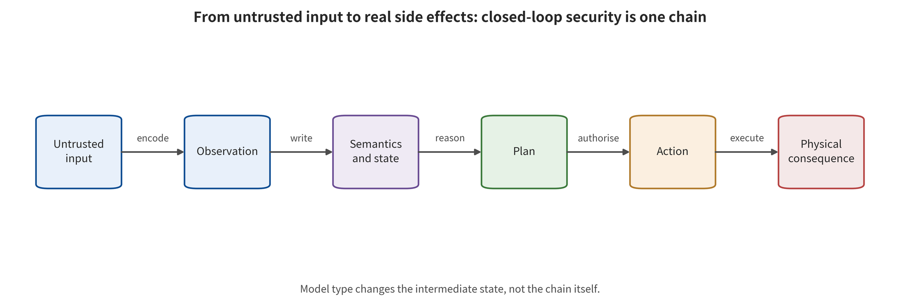

## From Answer Safety to Action Safety: Technical Lineage and System Contract

Placing VLM, VLA and WAM under the same system contract is a prerequisite for avoiding inference across levels. Let the observation at time t be o_​t, the language goal be l, the body state be q_​t, and the history and external context be h_​t. A VLM natively outputs a semantic representation or generated content. At this point its safety endpoints are mainly content violation, representation being controlled, privacy leakage, or incorrect facts. [@B003; @B004; @B015; @B016]

$$
z_t=f_{\mathrm{VLM}}(o_t,l,h_t), y_t\approx p_{\theta}(y;z_t)

$$

VLA goes further and maps observations, language and body state into discrete action tokens, continuous control, end-effector poses, trajectories or action chunks of length K. Once a controller consumes these outputs, the safety endpoint escalates from "what the model said" to "what action is authorized". [@A001; @A003; @A006; @A021]

$$
a_{t:t+K-1}=\pi_{\theta}(o_t,l,q_t,h_t)

$$

Token distance alone cannot explain action errors. The translation, rotation and gripper of a robotic arm, the waypoints and velocities of navigation, and the trajectories and low-level control of driving use different coordinate frames, normalizations, control frequencies and execution modes. Action deviation carries physical meaning only when the de-tokenization, coordinate and timing contracts agree. [@A003; @A006; @A056]

A necessary condition for WAM is that future visual or latent states explicitly participate in action generation, candidate action evaluation, inverse dynamics or planning ranking. Pure video generation does not automatically enter the core scope. What WAM adds is not "whether the picture looks good". It is the integrity of future states, dynamical reachability, candidate ranking integrity, and imagination—action synchronization. [@A026; @A029; @A033; @A036; @A058]

$$
\hat z^{(j)}_{t+1:t+M}=W_{\phi}(o_t,a^{(j)}), j^*=\operatorname{argmax}_j R(\hat z^{(j)},a^{(j)})

$$
[@A029; @A033]

$$
a_{t:t+K-1}=D_{\psi}(o_t,l,\hat z_{t+1:t+M})

$$
[@A036; @A058]

Ultimately, the system also includes action denormalization, trajectory interpolation, collision checking, message queues, low-level controllers, actuators and feedback. Model outputs are only proposals. A real side effect holds only after the proposal passes the authorization gate, is executed by the controller, and the environment state changes. [@C003; @C004; @C005; @C007]

*The end-to-end system contract from VLM semantics and VLA action authorization to WAM imagination—action coupling and real execution.*

This survey fixes five non-interchangeable observation endpoints. The first is content violation. The second is control over representation, reasoning or world state. The third is the formation of dangerous intent. The fourth is dangerous actions that obtain output or authorization. The fifth is the occurrence of real-environment side effects or information leakage. Upstream endpoints can indicate that a risk chain has been started, but they cannot substitute for downstream endpoints.

NIST AI 100-2 E2025 provides higher-level terminology for the lifecycle, attacker capabilities and knowledge, and evasion/poisoning/privacy. On this basis, this survey adds action chunk length, control frequency, reality level, world rollout, action authorization and recovery state. Generic AML taxonomies cannot by themselves prove physical consequences. [@NISTAML2025]

Technical lineage — 2022—2023: the VLM upstream attack surface takes shape. Early work mainly attacks contrastive representations, visual soft prompts, OCR text and cross-modal context, with endpoints of retrieval degradation, harmful answers or command hijacking. Black-box query-driven model extraction also appears. These papers establish mechanisms by which visual payloads can cross the text safety boundary, but low-level actions or closed-loop side effects are not yet observed. They therefore constitute only upstream bridging evidence for VLA. Algorithmic objectives expand from classification/retrieval losses to visual embedding alignment, the likelihood of a generated target string, and cross-modal prompt control. The evidence boundary is that B-layer results cannot be directly rewritten into robot task failure rates under the original ASR. [@B001; @B003; @B004; @B006; @B017]

Technical lineage — 2024: from "seeing wrong" to direct VLA action failure. Direct VLA research begins to feed perturbed images into action models, with task failure, action difference and closed-loop trajectories as endpoints. The key methodological advance has two steps. The first separates natural blur or brightness changes from adversarial perturbations that have an attacker goal, knowledge and budget. The second de-tokenizes discrete action tokens into physical displacements before defining the attack objective. Algorithmic objectives move from a visual representation shift to seven-degree-of-freedom action deviation, target-action cross-entropy and task-level closed-loop failure. The evidence boundary is that the main evidence still comes from controlled environments such as LIBERO and SimplerEnv, and cannot be extrapolated to accident rates in the open real world. [@A001; @A003]

Technical lineage — 2025: targeted actions, prompt freezing, supply chain backdoors, and physical sensors in parallel. Attacks no longer pursue arbitrary failure alone. Each one targets a specific action, action freezing, a malicious trajectory, a trigger-based backdoor, or a sensor failure. Supply chain work starts to optimize clean capability and triggered behavior together. Physical work feeds fixed patches, lasers, projections, electromagnetic or ultrasonic signals into the real sensing chain. Language attacks treat rare action tokens as reachable control targets. The algorithmic objectives move to target-decoupled training, minimax prompt-invariant attacks, universal transfer patches, and Real-Sim-Real sensor modeling. The evidence boundary is measurement. The ASRs of different papers represent freezing, target trajectories, normalization failure, or task degradation. They cannot be merged into a single effect. [@A005; @A006; @A009; @A011; @A012; @A013; @A016]

Technical lineage — the first half of 2026: attacks enter states, intermediate reasoning states, action chunks, and generative dynamics. The new attack surfaces sit inside a single forward call or across the history of calls. The initial body state can become a trigger. Small offsets within an action chunk accumulate in open loop. CoT can be rewritten in a targeted way. The early velocity field of flow matching can amplify backdoors or input patches. Near-benign prompts can also redirect the terminal state through on-policy closed-loop search. The algorithmic objectives expand from single-step outputs to state-trigger optimization, smooth long-horizon drift, CoT—action joint loss, time-conditioned vector field loss, and DAgger-style state aggregation. The evidence boundary is permissions and cost. The permissions these attacks require range from data poisoning to white-box gradients and environment queries. Being "effective over a long horizon" does not equal low cost or feasibility in the open world. [@A020; @A021; @A024; @A027; @A049; @A056]

Technical lineage — 2026: WAM makes "whether the future state is trustworthy" an independent safety problem. Once WAM uses predicted futures for action generation, action evaluation, or candidate ranking, attacks can act in several ways. They hijack dangerous instructions. They contaminate synthetic data and distort future latent variables. They flip the ranking of high-scoring candidates. They can also keep the imagined appearance plausible while action branches go wrong. This forms an attack surface one layer deeper than VLM/VLA. A self-consistent future does not constitute independent evidence for action safety. The algorithmic objectives move to future-latent-variable PGD/SPSA, tail-aware candidate ranking loss, world model supply chain contamination, and black-box imagination—action decoupled zeroth-order search. The evidence boundary is coverage. The core evidence concentrates in simulation and in a small number of WAM structures. A033's single MPC task has only 20 episodes per condition, so it cannot establish a general law of WAM vulnerability. [@A026; @A029; @A032; @A033; @A036]

Technical lineage — mid-to-late 2026: physical environments, adaptive closed loops, and information assets diverge. One route moves the attack variables outward, to three-dimensional textures, visual self-localization of the robotic arm, environmental lighting, and an online patch vocabulary. The attacker can then keep taking over based on feedback. Another route does not pursue action errors. It infers training-set membership from action sequences, token probabilities, or cross-modal attention. Integrity, availability, and confidentiality must therefore be reported separately. The algorithmic objectives move to phantom embodiment, black-box lighting Bayesian optimization, online action primitive switching, and trajectory/attention membership inference. The evidence boundary is setting and measurement. Physical experiments usually involve few tasks and controlled environments. Privacy AUC is affected by trajectory correlation, random splits, and white-box permissions, and it is not a direct measure of individual privacy loss. [@A044; @A047; @A048; @A050; @A052; @C007]

This lineage shows that each time model capability expands by one layer, the old attack surface does not disappear. It acquires a new consumer. A VLA action head can consume VLM visual soft prompts. Temporal integration can amplify VLA action chunks. A planner can also use WAM future states as a scoring basis. Safety analysis must keep tracing along the consumer. It cannot stop at the model boundary. [@B003; @A021; @A033; @A036]

This chapter thus outputs the end-to-end input—state—action—execution—feedback contract. The classification problem of the next chapter can then be framed rigorously. Which interface invariant does the attack's optimization objective cause to fail for the first time?

---

[← Back to contents](index.md)
