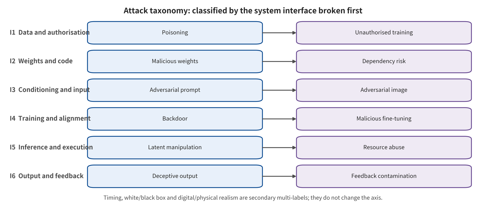

## Closed-Loop Attack Taxonomy: The First-Broken System Interface

The main axis answers only one question. Which system contract does the attack objective break first? The break must also be direct. The six interfaces are, in order, training data and model artifacts, observation and environment instructions, cross-modal semantics and reasoning, world state and imagination rollout, policy and action decoding, and execution feedback and information assets. The optimization variable decides the classification, not the attack carrier and not a paper's self-description.

*Six-interface attack taxonomy: the primary class is decided by the contract that is broken first, while propagation endpoints and privileges serve only as secondary labels.*

Each paper occupies only one primary class. If the attack continues to propagate downstream, it is recorded with a propagates-to label. A physical patch that only drifts visual features is assigned to the observation interface. The same patch that explicitly rewrites the CoT is assigned to the semantic reasoning interface. A patch that directly optimizes the first-step flow velocity field is assigned to the action decoding interface. The carrier does not replace the optimization objective.

Training timing, white-box/​black-box knowledge, digital or physical realism, objective, duration, evidence layer, and final consequence are all secondary labels. Privacy, model extraction, denial of service, target action, and real harm are assets or endpoints. No separate main axis parallel to the interfaces is built for them. Prevention, detection, suppression, recovery, and assurance are defensive actions, and they are likewise not parallel to attack interfaces.

Natural corruption, natural context change, and non-malicious failure enter the reliability background only when no attacker objective and budget exist. They can help reveal fragile features and recovery capability. They must not, however, be merged with adaptive attacks that know the model, the budget, and the defenses. A pure video world model enters the WAM core only when action generation, evaluation, or ranking consumes its future. [@A002; @A007; @A010; @A058]

Recomputing the primary class over the frozen corpus of 97 papers requires 100% coverage, with the boundary rationale made public at the same time. That coverage only proves that the classification can organize the current corpus. It does not prove that the six classes are naturally mutually exclusive. Nor does it prove that they cover all future attacks or constitute the only security ontology. The value of the classification lies in letting attacks and defenses share repeatable coordinates.

### I1 Training Data and Model Artifacts

Every demonstration, action label, state, data contributor, adapter, connector, checkpoint, and training objective must have verifiable provenance and version. Clean behavior and triggered behavior must not diverge under undisclosed conditions. Downstream fine-tuning must not be treated by default as able to remove unknown backdoors. The labels on the action window and flow time must remain physically, semantically, and temporally consistent. [@A005; @A011; @A012; @A020; @A021; @A022; @A027; @A032; @A051]

Decision rule: an attack is assigned to I1 as long as it first requires rewriting training samples, action labels, the loss, trainable modules, adapters, or pre-distribution model artifacts. The trigger appearing in images, text, or states at deployment time does not change its supply chain primary class. [@A005; @A011; @A012; @A020; @A021; @A022; @A027; @A032; @A051]

### I2 Observation and Environment Instructions

Images, speech, state observations, and scene text that enter the policy must each have provenance, timestamps, integrity, physical plausibility, and task relevance. Sensor front ends and image restoration must not delete control-essential information such as color, contact points, obstacle edges, or robot arm pose. Environment text can only be regarded as observation content. It must not automatically inherit the privileges of user commands. [@A003; @A013; @A016; @A017; @A044; @A048; @A052; @C001; @C005; @C007]

Decision rule: an attack is assigned to I2 if its optimization objective first breaks sensing values, visual features, object/​robot arm localization, or the authenticity of environment input. A physical carrier used only to directionally rewrite the CoT goes to I3. The same carrier used to rewrite the flow velocity field goes to I5. In both cases the carrier is retained as a secondary label in I2. [@A003; @A013; @A016; @A017; @A044; @A048; @A052; @C001; @C005; @C007]

### I3 Cross-Modal Semantics and Reasoning

The system must distinguish the provenance and privileges of authorized user instructions, environment text, tool returns, and model self-generated reasoning. Semantically equivalent prompts should not change the security state. The entities, spatial relations, and goal bindings in the CoT must be consistent with trusted observations. Reasoning text that has not been independently verified must not directly obtain action authorization. [@A006; @A009; @A015; @A024; @A041; @A042; @A043; @A045; @A049; @B003; @B004; @B006; @C001; @C002]

Decision rule: an attack is assigned to I3 if it explicitly optimizes action prompts, semantic equivalence, CoT tokens, entity binding, or command-preservation constraints, even if the carrier is a visual patch. Merely changing sensing content without specifying a semantic or reasoning objective still belongs to I2. [@A006; @A009; @A015; @A024; @A041; @A042; @A043; @A045; @A049; @B003; @B004; @B006; @C001; @C002]

### I4 World State and Imagination Rollout

The current state and history must be complete and traceable. Future latent variables or video should be calibrated against action conditions, dynamics, and uncertainty. The value ranking of candidate trajectories must not be arbitrarily flipped by small input changes. A claimed future must be reachable by the chosen action, and the next real observation should independently verify the prediction. A model cannot approve its own high-risk actions on the strength of its own imagination alone. [@A026; @A029; @A032; @A033; @A036; @C008]

Decision rule: an attack is assigned to I4 only when future states, latent variables, world-model-generated data, candidate ranking, or imagination—action synchronization is the direct optimization objective. Pure video generation without an action consumer serves only as world model adjacency evidence. [@A026; @A029; @A032; @A033; @A036; @C008]

### I5 Policy and Action Decoding

Action tokens must map unambiguously to physical units, coordinate frames, and gripper states. Action chunks should be re-observed before risk grows. Every critical timestep generated by flow matching or diffusion should be subject to stability and magnitude constraints. The final trajectory must satisfy the reachability, velocity, acceleration, contact, collision, and authorization sets. A high-risk action cannot obtain the right to execute on the strength of model probability alone. [@A003; @A006; @A012; @A021; @A027; @A049; @A056; @C004; @C007]

Decision rule: an attack is assigned to I5 if its direct target is action tokens, action chunk continuity, the flow/​diffusion velocity field, the terminal trajectory state, or a control primitive. The triggered physical carrier and training entry point serve as secondary labels. If an attack depends on modifying training data, I1 remains the primary class. I5 then describes only propagation. [@A003; @A006; @A012; @A021; @A027; @A049; @A056; @C004; @C007]

### I6 Execution Feedback and Information Assets

Execution feedback must have freshness, ordering, provenance, integrity, and replay protection. Policy queries, action probabilities, attention, trajectory logs, and training demonstrations follow minimal disclosure. Model and adapter access should be auditable, rate-limited, and isolated. Security logs must be retained, but they must not leak sensitive scenarios in reverse. Information leakage and physical integrity failure use different endpoints. [@A047; @A049; @A050; @B016; @B017; @C007]

Decision rule: an attack is assigned to I6 if it first exploits action outputs, token probabilities, attention, trajectories, or API feedback. That exploitation lets the attacker infer training membership, steal the model, or iteratively strengthen the attack. Some cases use only the real next observation to close the loop for a control attack, without breaking the feedback contract. There the primary class remains in I2/​I3/​I5, and I6 marks ‘feedback exploitation’ rather than ‘feedback tampering’. [@A047; @A049; @A050; @B016; @B017; @C007]

---

[← Back to contents](index.md)
