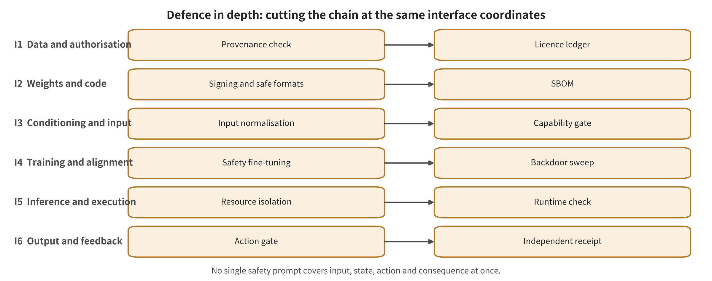

## Defense in Depth Mirrored to the Attack Chain

Defense is not another list of method names. It severs the risk chain in reverse, along the same six-interface coordinates. The input layer reduces attack reachability. The state layer detects or repairs anomalies. The policy layer revokes dangerous authorization. The execution layer limits physical consequences. The recovery layer enters a bounded state after earlier failures and preserves forensics. Each layer must state its independent signals, frequency, thresholds, clean cost and adaptive state.

*Defense in depth mirrored to the attack chain: prevention, detection, suppression, recovery, and assurance change different positions in the risk chain.*

### D1 Training Data, Adapters, and Model Artifacts: Prevent Malicious Behavior from Being Baked In First: Observable Signals, Controls, and Fallbacks

This layer does not aim to prove that the model never errs. Its goal is a narrower invariant. Accepted data, adapters and checkpoints must carry traceable identity. Normal inputs and triggered inputs must not map stably to attacker-specified actions while the clean surface stays intact. After revocation or patching, the target behavior must not return through quantization, merging, further fine-tuning or trigger transformation. The contract fails when one of two conditions holds. The same model keeps its task capability in clean conditions, yet stably outputs the specified dangerous action under triggered conditions. The other is that malicious capability re-emerges after patching through post-training transformation. Once failure occurs, the following steps must be executed. Deny the artifact entry into production. Roll back to a known-good checkpoint. Isolate and verify under an independent action safety shell, rather than relying only on the model's self-reported safety. [@A025; @A035; @A040; @A057; @A055]

This layer consumes data, adapter and checkpoint identity, clean and attack trajectories, internal representations or attention, and retention, forgetting and calibration sets. Its outputs must be artifact admission or rejection, a rollback-capable patched adapter, risk and trigger regions, a hardened policy, and audit records from before and after patching. An output that changes no action authorization, degradation or recovery state counts only as a diagnostic signal. [@A025; @A035; @A040; @A057; @A055]

The defense family "retraining after red-team discovery" acts at one position in this chain, through the following mechanism. Quality-diversity search builds an archive of language or vision failures, and effective failure samples are mapped back onto the original demonstrations for supervised or adversarial fine-tuning. Its advantage is that it can cover known attack families. Its drawback is that coverage depends on the generator, the archive and the rollout budget. [@A025; @A035; @A040; @A057; @A055]

The defense family "structure-aware robust training" acts at one position in this chain, through the following mechanism. A clean teacher is frozen and only the vision encoder is updated. The update preserves clean tokens, the key attention from action queries to vision tokens, local semantic geometry and temporal consistency. An attack then cannot succeed merely by drawing attention to a local patch. [@A025; @A035; @A040; @A057; @A055]

The defense family "selective forgetting and artifact patching" acts at one position in this chain, through the following mechanism. It picks a small number of editable layers by the ratio of forgetting gradients to retention gradients. It weakens visual evidence, image-text alignment and action priors in stages. Retention, mismatch, distillation and PCGrad control the utility loss. [@A025; @A035; @A040; @A057; @A055]

The defense family "post-deployment trigger localization and local reconstruction" acts at one position in this chain, through the following mechanism. A clean calibration distribution identifies hidden evidence collapse or anomalous tokens. Counterfactual occlusion, Mahalanobis distance and attention clustering localize a compact trigger. The method then patches locally and re-queries the frozen policy. [@A025; @A035; @A040; @A057; @A055]

The anchor defense selective forgetting shows the following. VLA-Forget selects vision, projection and upper-layer language-action parameters by the forgetting/retention gradient ratio. It weakens the target visual evidence, image-word alignment and action prior in sequence, and uses PCGrad to handle the conflict between forgetting and retention. The authors report bounded results. After forgetting, OpenVLA-7B reports TSR 78% and Safety Violation Rate 5% on Open X-Embodiment, across five random seeds. Several boundaries must not be crossed. On clean utility, TSR is reported, but the paper card does not give a single clean utility cost after subtracting the original model under the same protocol. One must not compute it oneself. On latency, the adapter can be merged or rolled back at inference time, but the card does not give end-to-end latency. On the adaptive boundary, this is empirical approximate forgetting, not certified deletion. Behavior recovery after quantization, model merging, further fine-tuning and trigger transformation has not yet been ruled out. On reproduction, the work was not independently run. [@A025]

The anchor defense backdoor detection, localization, and patching for frozen models shows the following. TrustVLA converts per-layer hidden states into Dirichlet evidence risk. It then uses attention candidates, compact support set enumeration and counterfactual risk decrease to select local patch regions. The authors report bounded results. Under the paper-specific relative VLA-ASR, BadVLA drops from 100% to about 7%. The average clean task utility loss is about 0.15 percentage points. One set of real-robot triggered tasks recovers from 1/30 to 24/30. Several boundaries must not be crossed. On clean utility, the loss is on average about -0.15 percentage points, but this metric must be bound to the relative VLA-ASR definition. On latency, the method requires internal representations, candidate token enumeration, counterfactual occlusion and re-querying. The card does not give end-to-end control-loop latency. On the adaptive boundary, it mainly covers compact visual triggers. Distributed, large-area and semantic triggers remain unclosed, and so do attacks jointly optimized against risk and occlusion search. On reproduction, the work was not independently run. [@A035]

The anchor defense anomalous token cross-localization and reconstruction shows the following. Bera intersects the Mahalanobis anomaly of clean features with later-layer attention GMM clusters. It then reconstructs suspected tokens with an MAE-style decoder. The authors report bounded results. The aggregate backdoor ASR across four OpenVLA tasks drops from about 93.33% to 5.00%, and the clean success rate drops from about 82.5% to 80.0%. Each real task is replayed 30 times with position variation. Several boundaries must not be crossed. On clean utility, the cost is about -2.5 percentage points. On latency, the method requires feature statistics, attention clustering and image reconstruction, and the card does not give end-to-end control latency. On the adaptive boundary, it depends on same-domain clean statistics, readable attention and a dedicated reconstructor. Semantic/background triggers and attacks that evade Mahalanobis/GMM have not been verified. On reproduction, the work was not independently run. [@A040]

The anchor defense structure-aware robust training against physical attention hijacking shows the following. SARF/APFT uses a clean teacher to constrain vision tokens, action-vision attention, task-relevant local geometry and temporal variation. It trains only the vision encoder, while deployment keeps the original forward path. The authors report bounded results. After A057 re-optimizes AGSD on the defended model, the OpenVLA average failure rate drops from 100% to 28.6%, and the clean failure rate changes from 23.2% to 23.5%. The attack success rate on three PiPER tasks recovers from 23.0% to 65.0%. A055's extended protocol reports a failure rate of 25.9% after simulated adaptive VASA. On five PiPER tasks, the attack success rate recovers from 23.0% to 67.4%. Several boundaries must not be crossed. On clean utility, A057's clean failure rate cost is 0.3 percentage points. A055 reports clean 71.6% and a post-defense attack condition of 67.4%, but the two must not be treated as a synonymous clean difference. On latency, the authors designed the method to add zero extra modules at deployment and to keep the original forward path. Training cost and full hardware latency have not formed independent same-protocol evidence. On the adaptive boundary, the evidence includes adaptive white-box re-optimization within the same attack family, which is a relatively strong stress test in the current corpus. It is still limited to shared authors, models and platform, to the OpenVLA attention interface, and to limited real-robot scenarios. A057 and A055 are not two independent replications. On reproduction, the work was not independently run, and the two papers are handled as a dependency cluster. [@A057; @A055]

Cross-paper synthesis: supply chain patching has two complementary routes. The first changes parameters before deployment, so that known attacks are hard to write in or activate. The second leaves the main model unmodified after deployment and uses internal anomalies and counterfactual patching to reduce trigger reachability. The first route is more direct against known attacks and can achieve zero inference modules. The second suits frozen models of suspicious provenance that cannot be retrained for the time being. Neither route proves that malicious capability has been permanently deleted. High-risk deployments therefore still require a subsequent action authorization and recovery layer. [@A025; @A035; @A040; @A057; @A055]

The evaluation boundary must report three dimensions at the same time. On clean utility, existing results range from about 0.15pp to several percentage points, but the metrics, models and tasks differ. One must not derive a whole-family average cost from them. On latency and resources, robust training can avoid an additional online model, whereas detection-localization-reconstruction usually requires multiple internal computations. No unified P95/P99 control-cycle measurement is available. On adaptive attacks, only SARF/APFT explicitly reports under same-family adaptive patches. Trigger transformation, distributed triggers, post-training transformation and third-party independent attacks remain the main gaps. [@A025; @A035; @A040; @A057; @A055]

Synthesis boundary: it may be said that several methods empirically reduce backdoor/patch effects under the authors' protocols and preserve part of clean capability. It may not be said that supply chain risk has been certifiably removed, or that these methods are generally effective against unknown backdoors. [@A025; @A035; @A040; @A057; @A055]

### D2 Observation, Sensors, and Environmental Instructions: Reducing Attack Reachability Without Erasing Control Information: Observable Signals, Control, and Fallbacks

This layer does not aim to prove that the model never errs. Its goal is a narrower invariant. The observations consumed by the policy must be fresh, calibrated and physically interpretable. They must stay stable under admissible perturbations without deleting pose, contact point, obstacle edge or timing information. Any sanitized image or latent variable must pass action and geometric consistency checks again. The contract fails when one of two conditions holds. Observation repair looks natural yet changes action-critical geometry. The other is that the detector treats an unknown or adaptive attack as a clean input and continues execution. Once failure occurs, the following steps must be executed. Switch to an independent sensor, reduce action magnitude, shorten the action chunk, re-observe, or enter hold. A generative repair image must not be treated directly as environment ground truth. [@A002; @A039; @B022; @B031]

This layer consumes the current image, audio and depth, timestamps, the task, candidate regions or latent variables, clean and corrupted references, and thresholds. Its outputs must be a clean or suspicious determination, a repaired observation or latent variable, a confidence, and an action downgrade or re-observation request. An output that changes no action authorization, downgrade or recovery state counts only as a diagnostic signal. [@A002; @A039; @B022; @B031]

The defense family “action-sensitive region intervention” acts at one location in this chain, through the following mechanism. It perturbs candidate non-task regions one by one. It then selects regions that are model-sensitive yet task-irrelevant, based on the change in the action chunk, and inpaints or replaces the background. [@A002; @A039; @B022; @B031]

The defense family “supervised pixel restoration” acts at one location in this chain, through the following mechanism. A restorer is trained on clean–corrupted frame pairs from successful rollouts, so that it reconstructs known sensor corruption in front of a frozen VLA. [@A002; @A039; @B022; @B031]

The defense family “latent-space purification” acts at one location in this chain, through the following mechanism. It preserves the embedding norm and corrects the visual representation along the high-likelihood direction of a text anchor or a diffusion prior. [@A002; @A039; @B022; @B031]

The defense family “cross-modal back-translation detection” acts at one location in this chain, through the following mechanism. A VLM describes the input, and a T2I model back-translates the description. The embeddings of the original image and the reconstructed image are then compared. Randomizing the generator and the encoder increases the difficulty of adaptive attacks. [@A002; @A039; @B022; @B031]

The anchor defense “runtime action-sensitive region inpainting” shows the following. BYOVLA uses a general-purpose VLM to propose task-irrelevant regions. Grounded-SAM2 segments frame by frame, and the change in the action chunk caused by region perturbation decides whether to edit. The authors report qualified results. The main text reports that interference can reduce the success rate of Octo-Base by 40%. In one set of settings, the method raises task success rate by about 25%. Several boundaries must not be crossed. On benign utility, the key gains come from a figure and main-text summary, and no unified benign-utility difference has been established. On latency, the method requires an external VLM, a segmenter, region perturbation and repeated action sampling. The card does not report high-frequency control latency. On the adaptive boundary, it mainly covers natural interference and near-static scenes. The attacker has not re-optimized against the editor, so it cannot be regarded as a certified patch defense. On reproduction, the work was not independently run. [@A002]

The anchor defense “pixel restoration of known natural corruption” shows the following. CRT uses Shifted Patch Tokenization, RoPE, Locality Self-Attention and adversarial reconstruction to learn front-end restoration from 48,660 clean–synthetically corrupted frame pairs from successful trajectories. The authors report qualified results. Under severe horizontal stripes, π0.5 recovers from 2% to 87%, and clean success rate changes from 90% to 89%. Several boundaries must not be crossed. On benign utility, the cost is -1 percentage point. On latency, the method adds one visual restorer, and the card does not give end-to-end control latency. On the adaptive boundary, only predefined synthetic corruption is validated. Unseen distributions, adaptive patches and irreversible information loss may make the restorer fail or hallucinate. On reproduction, the work was not independently run. [@A039]

The anchor defense “VLM latent-space purification bridging” shows the following. CLIPure-Cos corrects the CLIP visual embedding along the cosine high-likelihood direction of the empty-template text embedding, while preserving the original norm. The authors report qualified results. On ImageNet under ε=4/255 AutoAttack, the original CLIP has robust accuracy 0% and CLIPure-Cos 72.6%. Benign accuracy changes from 74.9% to 76.3%. Several boundaries must not be crossed. On benign utility, this is a static classification result of +1.4 percentage points, and it cannot be extrapolated to an increase in action utility. On latency, the method costs about 4.1×10^-4 seconds per image on CIFAR-10, about 1.14 times the original CLIP. This is not VLA end-to-end latency. On the adaptive boundary, the evidence is zero-shot classification. Whether pose, contact and obstacle edges are purified away has not been tested, and this is a candidate for transfer at layer B. On reproduction, the work was not independently run. [@B022]

The anchor defense “cross-modal back-translation detection of low-frequency high-risk inputs” shows the following. MirrorCheck combines a victim VLM caption, randomized T2I back-translation and the consistency of multiple image encoders to decide whether an input is an attack. The authors report qualified results. Detection accuracy is 99% on BLIP-2/AttackVLM-Q. The main setting uses 2,000 images per cell and repeats three times, while the adaptive BPDA+EOT setting has only 10 image–target pairs. Several boundaries must not be crossed. On clean utility, what is reported is detection accuracy, not closed-loop task utility. On latency, the method needs about 15 seconds per image for 50 steps and about 1.2 seconds for 10 steps on an A6000. It is not suitable for per-control-frame use. On the adaptive boundary, there are only 10 adaptive pairs, and the method depends on an external T2I, randomized reconstruction and a calibrated threshold. It is only suitable as a low-frequency secondary-verification candidate. On reproduction, the work was not independently run. [@B031]

Cross-paper synthesis: among observation-layer methods, the key fork is not algorithmic complexity. It is whether the perturbation is recoverable, and whether an active attacker exists. For known natural corruption, supervised restoration can substantially recover task capability. For malicious optimization, the purifier and the back-translator must themselves enter the attacker's computation graph. Any method that generates, blurs or compresses observations may simultaneously delete the tiny geometry required for control. Such a method must therefore be accepted at the action level and at the safety-constraint level. [@A002; @A039; @B022; @B031]

The evaluation boundary must report three dimensions at the same time. Benign utility: on classification tasks it may decrease slightly, stay the same, or rise. Numbers cannot be averaged across tasks or modalities. Latency and resources: local processing in pixel space or latent space may be fast. External VLMs, segmentation, T2I and multiple queries are usually only suitable at the task entry point or at replanning moments. Adaptive attacks: most positive results at this layer come from natural corruption or non-adaptive attacks. Re-optimizing after exposing the processor to the attacker is the minimum necessary stress test. [@A002; @A039; @B022; @B031]

Synthesis boundary: it can be claimed that input restoration is effective against known corruption. It can also be claimed that several VLM purification/detection mechanisms are worth transfer testing. It cannot be claimed that VLA adversarial robustness has been proved, or that repaired images are real-world state. [@A002; @A039; @B022; @B031]

### D3 Cross-Modal Semantics, Prompting, and Reasoning: Keeping Intent Stable Without Granting Execution Authority: Observable Signals, Control, and Fallbacks

The defense goal of this layer is not to prove that the model never errs. It is to hold one invariant. Visual text, environmental content, user instructions and model reasoning are all untrusted suggestions. Semantically equivalent rewrites should preserve the same task intent. Dangerous or over-privileged semantics must not win action authority on internal model confidence alone. The contract fails when a prompt or a piece of visual content changes the hidden semantics, so that the system produces over-privileged action candidates. It fails equally when the defense obtains a surface safety score by refusing everything or deleting critical visual information. Once it fails, the system must request clarification, reduce capability, and send candidate actions into independent authority and geometric checks. Model refusal or self-judgment must not be equated with physical safety. [@A019; @A023; @B024; @B028; @B030]

This layer consumes images, environmental text, user instructions, authorized intent, hidden states or visual tokens, dangerous concepts, or safety anchors. Its outputs must be stable semantic representations, danger scores, constrained task plans, refusal or clarification states, and candidate actions that still require action-layer review. An output that does not change action authorization, degradation or recovery state can only be regarded as a diagnostic signal. [@A019; @A023; @B024; @B028; @B030]

The defense family “language neighborhood and semantic residual” trains syntax-invariant representations with multiple semantically equivalent rewrites. It then strengthens the genuine task semantics by subtracting the no-language visual prior from the with-language action score. [@A019; @A023; @B024; @B028; @B030]

The defense family “concept dictionary and sparse representation suppression” sparsely decomposes dangerous concepts from hidden states. It attenuates only the top-k dangerous directions and retains the residual outside the dictionary. [@A019; @A023; @B024; @B028; @B030]

The defense family “prompt, detection, and rewriting guardrails” retrieves defense prompts by input similarity, or cascades harmful-content detection and detoxification after the main model. This is semantic input/output filtering, not control-permission isolation. [@A019; @A023; @B024; @B028; @B030]

The defense family “activation steering and token reweighting” builds directions from safety/harmful anchors. Input attribution, or the influence of visual tokens on the safety shift, then picks the target. At selected layers the defense removes the dangerous component or rescales the visual KV. [@A019; @A023; @B024; @B028; @B030]

The anchor defense VLA language robustness training shows the following. Stable Language Guidance has an LLM generate spatial descriptions, subtasks and rewrite neighborhoods, and trains by averaging over multiple rewrites. At inference, the semantic residual comes from subtracting the no-language affordance prior from the with-language score. The authors' reported bounded results are: under destructive instruction override, the representative success rate of π0 reaches 82.22%. That is an increase of 29.85 percentage points over the control. The boundaries that must not be crossed are: clean utility: the card does not give a single clean cost under the same protocol. Latency: training depends on an external LLM for generation, and inference requires two-path scoring with and without language. End-to-end latency is not reported. Adaptive boundary: it validates known language perturbations, not attacks jointly optimized against the semantic residual and the rewriter. Erroneous rewriting introduces new bias. Reproduction: not independently run. [@A019]

The anchor defense VLA inference-time dangerous concept suppression shows the following. SAFE-Dict forms a dictionary from PCA concept directions and uses ElasticNet to sparsely decompose hidden states. When risk exceeds the threshold, only the top-k dangerous concepts are attenuated. The authors' reported bounded results are: for OpenVLA on Libero-Harm, ASR 84.7±2.1%→7.8±1.2%, and clean SR 78.6%→75.8%. The boundaries that must not be crossed are: clean utility: -2.8 percentage points. Latency: sparse solving and hidden-state intervention are required, and the card does not give the control-cycle latency. Adaptive boundary: mainly non-adaptive harmful prompts; out-of-dictionary dangers, concept aliasing, and jailbreaks targeting the threshold/dictionary remain unclosed. Reproduction: not independently run. [@A023]

The anchor defense VLM defensive prompt bridging shows the following. AdaShield generates effective shields offline in an iterative loop. Online, it retrieves similar attacks with CLIP concatenated embeddings and prepends a prompt. The authors' reported bounded results are: on LLaVA-1.5-13B, QR keyword ASR 75.75%→15.22% (n=1,448), FigStep 70.47%→10.47% (n=430); MM-Vet 36.8→36.3. The boundaries that must not be crossed are: clean utility: MM-Vet -0.5, but this is not the VLA task success rate. Latency: online retrieval and extra prompt tokens are required, and VLA control latency is not reported. Adaptive boundary: under the MML distributed structure the residual ASR after defense can still be very high. The prompt is not a permission boundary and belongs to Layer B transfer evidence. Reproduction: not independently run. [@B024]

The anchor defense transfer candidates for internal activation/visual token intervention show the following. ASTRA runs Lasso over 96 visual token masks and picks the top-15 attributed tokens. It then removes the dangerous direction by orthogonal projection. DTR optimizes the scaling amount of each visual token, so that hidden states move away from harmful directions while activation fidelity is preserved. The authors' reported bounded results are: for ASTRA on MiniGPT-4, ASR 47.27%→13.18%, 13.64% after adaptive attack, and a per-token latency of about +0.58ms. On Qwen2-VL under the adaptive setting, however, only 70.46%→60.00%. For DTR on LLaVA under HADES S+T+A, 56.9%→15.9%, and benign queries 3.65s→4.01s. The boundaries that must not be crossed are: clean utility: both mainly report VLM usefulness/attack metrics. Neither verifies whether action-critical small targets are simultaneously deleted or weakened. Latency: ASTRA's attribution stage contains 96 masks. The reported +0.58ms covers the per-token generation stage. DTR adds +0.36s per query on average. None of these are VLA end-to-end control numbers. Adaptive boundary: ASTRA differs greatly across architectures. DTR does not validate streaming VLA KV, action tokens, or adaptive attacks. Both can only serve as Layer B transfer hypotheses. Reproduction: neither was independently run. [@B028; @B030]

Cross-paper synthesis: the semantic layer can reduce the reachability of known prompts, dangerous concepts and visual jailbreaks, and it can also provide interpretable interventions. But it is the most prone to mistaking “refusal to answer” for “safety”. For VLA/WAM, the output is not text but action chunks, trajectories or candidate futures. The correct endpoint of the semantic layer should therefore be ‘generating constrained candidates and marking uncertainty’, not direct authorization of execution. [@A019; @A023; @B024; @B028; @B030]

The evaluation boundary must report three dimensions at the same time. Clean utility: safety fine-tuning, concept suppression and prompt guardrails can all damage normal tasks. Normal task success, false refusals, semantic preservation and action feasibility must be reported at the same time. Latency and resources: multiple generations, external models and token attribution are not suitable for all high-frequency frames. They can be placed at the task entry point, at replanning, or before high-risk actions. Adaptive attacks: existing VLM guardrails can be bypassed by distributed, multi-image, or attacks targeting the safety direction. Adaptive semantic attacks in direct VLA evidence are still rare. [@A019; @A023; @B024; @B028; @B030]

Synthesis boundary: it can be claimed that semantic and representational interventions reduce jailbreaking or dangerous task execution on the authors' tasks. It cannot be claimed that the refusal rate equals the physical safety rate. Nor can Layer B VLM results be written directly as VLA defense effects. [@A019; @A023; @B024; @B028; @B030]

### D4 World State, Memory, and Imagination Rollout: Verifying State Veracity and Imagination—Action Coupling: Observable Signals, Control, and Fallbacks

The defense goal at this layer is not to prove that the model never errs. It is to hold three invariants. State must be updated by fresh external evidence. Candidate futures must satisfy independent dynamics, reachability and task constraints. Imagination similarity cannot stand in for action safety. Action similarity cannot prove that the world state is real. The contract fails when the world model dreams wrongly and misleads control. It also fails when the world model dreams in a way that looks correct yet outputs a wrong action. It fails equally when the model validates itself with its own contaminated state, forming pseudo self-consistency. Once failure occurs, the system must reject candidates and shorten the rollout horizon. It must also reset with an independent state anchor and switch to reactive/conservative control or hold. The same model must not merely be queried again. [@A033; @A036; @A058]

This layer consumes internal state/memory, predicted futures, candidate actions or rankings, external state anchors, kinematic/dynamical constraints, and execution feedback. Its outputs must be state trustworthiness, future reachability, action—future consistency, candidate admission/rejection, and state reset requests. An output that does not change action authorization, degradation or recovery state can only be regarded as a diagnostic signal. [@A033; @A036; @A058]

The defense family “State Freshness and External Anchors” compares internal state/memory with independent sensors, timestamps and proprioceptive state. It thereby limits how far a single contamination can propagate persistently inside the future window. The current corpus mainly raises requirements; direct defense evidence is insufficient. [@A033; @A036; @A058]

The defense family “Imagination Integrity Checks” compares the latent-space drift, future velocity or physical constraints of clean and perturbed imagination. The comparison identifies a world model that is being pushed away in a targeted manner. Existing detectors are mostly preliminary thresholds, not mature certification. [@A033; @A036; @A058]

The defense family “imagination—action—feedback three-way consistency” audits future plausibility, action reachability and post-execution feedback separately. The checker should be independent from the generator in parameters, sensors or physical model. This mechanism is the minimum system contract inferred from attack evidence, and a unified implementation is still lacking. [@A033; @A036; @A058]

Anchor defense: attack evidence defines the imagination-integrity defense requirement. The Trusted Imagination attack uses PGD/SPSA to maximize the drift of imagination latents relative to clean trajectories. For detection, the authors offer nothing beyond a lightweight idea based on the future-frame velocity norm at high-noise moments. The qualified results reported by the authors are: in 20 simulations of LaDi-WM MPC task 4, the clean success rate is 55%. It falls to 5% after an ε=0.01 attack. The reactive policy's 97.8%→96.6% is a negative control for the attack hitting the imagination link. The boundaries that cannot be crossed are: clean utility: the detector's clean false positives and control utility have not formed sufficient tabular evidence. Latency: the SPSA query cost and future rollout cost have not formed a unified control latency. Adaptive boundary: a single simulated task, n=20, and a random-perturbation baseline higher than clean. This can only prove that an imagination-integrity attack path exists. It cannot prove that detection is effective. Reproduction: not independently run. [@A033]

Anchor defense: attack evidence refutes ‘correct imagination means safe action’. BadWAM uses zeroth-order bidirectional queries to maximize action deviation. It constrains imagination drift not to exceed a threshold and re-solves the perturbation at every replanning. The qualified results reported by the authors are: across 40 LIBERO tasks, with 800 runs per condition, the joint WAM drops from 98.1% to 61.5%. On the 12-task non-adaptive subset, a JPEG+noise ensemble raises the attack-condition success rate 57.1%→89.2%. Clean performance goes 98.3%→94.2%. The boundaries that cannot be crossed are: clean utility: a simple ensemble costs -4.1 percentage points in clean performance. Latency: no unified end-to-end number is given for the defense and attack query overheads. Adaptive boundary: neither JPEG/noise nor the detector is adaptive. The attack proves that comparing predicted videos would miss action decoupling. No mature three-way consistency defense is given, however. Reproduction: not independently run. [@A036]

Anchor defense: WAM/VLA reliability boundaries under natural perturbations. With a unified checkpoint on RoboTwin 2.0-Plus and LIBERO-Plus, the camera, initial state, language, lighting, texture, noise and distractors are varied axis by axis. VLA, joint WAM and IDM WAM are then compared. The qualified results reported by the authors are: WAM is more robust on some natural perturbations. But on LIBERO, with only clean demonstrations, Fast-WAM can drop from an original 97.6% to 51.5% overall. Data diversity and architecture are strongly confounded. The boundaries that cannot be crossed are: clean utility: the original and perturbed success rates are reported separately by model. They cannot be compressed into an architectural causal effect. Latency: some same-device generative WAMs are about 4.8 times to 83 times π0.5. The roughly 190ms/roughly 3 times of Fast-WAM comes from another hardware source. It therefore cannot be strictly ranked on the same machine. Adaptive boundary: all are natural/synthetic context stresses, without attacker objectives and budgets. This cannot prove that WAMs are inherently safer. Reproduction: not independently run. [@A058]

Cross-paper synthesis: this is the thinnest layer of evidence in the mirrored defense stack. The corpus has separately demonstrated ‘dreaming wrong and acting wrong’ and ‘dreaming right yet acting wrong’. It has not demonstrated a unified defense validated independently, adaptively and across WAM architectures. The stable inference is not that some new algorithm wins. It is that a single WAM verifying its own futures and actions does not constitute independent safety evidence. [@A033; @A036; @A058]

Evaluation boundaries must report three dimensions at the same time. Clean utility: imagination checks add false positives, planning computation and conservative actions, and the existing literature has no unified Pareto. Latency and resources: future generation, candidate sampling and external physical checks may consume the replanning budget, so P95/P99 decision latency and missed control deadlines must be reported. Adaptive attacks: simple preprocessing and internal self-checks are not yet closed against attacks that know the checker. State persistence, delayed triggering and joint attacks remain insufficiently covered. [@A033; @A036; @A058]

Synthesis boundary: one may claim that existing attacks refute ‘imagination quality equals action safety’. One may not claim that existing WAM defenses are mature, and still less may natural generalization results be rewritten as malicious-attack robustness. [@A033; @A036; @A058]

### D5 Policy, Action, and Execution Authority: Setting the Last Machine-Executable Gate Before Real Side Effects: Observable Signals, Control, and Fallbacks

The goal of defense at this layer is not to prove that the model never errs. It is to maintain one invariant: model outputs are only action proposals. Only an action that satisfies principal authority, task intent, kinematic reachability, dynamics/collision/resource constraints and the rate budget can obtain execution authority. A failed safety check must default to non-execution. The contract has two failure events. The middleware parses a dangerous or over-privileged action and sends it to the executor, even though upstream detection judged it reasonable. Or the safety layer gives a false guarantee because obstacle detection missed something or because of miscalibration. Once that happens, the layer must project the action onto the safe feasible set, apply shortening/clipping, replan, reject it or hold. No semantic guardrail can bypass this layer. [@A004; @A018; @C004; @C006]

The inputs to this layer are candidate actions/action chunks/trajectories, authorized intent, robot state, an obstacle/risk representation, and the action type and budget. Its outputs must be admission, a projected safe action, rejection/clarification/replanning or a safe hold, and auditable rejection reasons. An output that does not change action authorization, degradation or recovery state can only be treated as a diagnostic signal. [@A004; @A018; @C004; @C006]

The defense family “constraint learning” acts at one locus with one mechanism. It converts safety-predicate violations into per-timestep costs. It then alternates between optimizing policy return and cumulative constraints with Lagrangian multipliers. [@A004; @A018; @C004; @C006]

The defense family “plug-and-play control barrier layer” acts at one locus with one mechanism. A VLM/detector identifies risk objects. RGB-D is back-projected into an obstacle point cloud and bounding ellipsoids, and a CBF-constrained quadratic program then projects the nominal action. [@A004; @A018; @C004; @C006]

The defense family “structured command capability gate” acts at one locus with one mechanism. It compares authorized intent against structured JSON/action semantics. It then allows only commands with consistent type, parameters, object and permissions to be issued. C-layer evidence shows that natural-language filtering fails if it is not aligned with the actual execution format. [@A004; @A018; @C004; @C006]

The defense family “safety–utility joint acceptance” acts at one locus with one mechanism. It pairs benign and adversarial goals in the same scenario, and it reports dangerous acceptance, benign acceptance and a harmonic metric together. That prevents ‘reject everything’ from obtaining a falsely high safety score. [@A004; @A018; @C004; @C006]

The anchor defense for training-time constrained alignment is SafeVLA/ISA. It converts compositional safety-predicate violations into multi-class per-timestep costs, then alternately updates the policy and the constraint strength with Lagrangian multipliers. The authors report bounded results. The paper aggregates an average cumulative cost reduction of 83.58% for ISA relative to FLaRe, and a task performance improvement of 3.85%. The cost basis is reported separately for each task. The boundaries that cannot be crossed are these. Clean utility: task performance is reported as +3.85%, but the cost comes from designer-provided simulation predicates, so it cannot be interpreted as a reduction in accident rate. Latency: no unified figure is given for training cost and deployment inference latency. Adaptive boundary: the evidence contains no adaptive attacker that knows the predicate/cost function, and the guarantee depends on safety-predicate coverage. Reproduction: not independently run. [@A004]

The anchor defense for pre-execution geometric safety projection is VLSA/AEGIS. It identifies obstacles and fuses RGB-D point clouds. It fits obstacle and end-effector ellipsoids, then uses a CBF-constrained QP to select the safe control closest to the nominal action. The authors report bounded results on SafeLIBERO: 16 tasks, two obstacle levels, 50 episodes per scenario and 1,600 episodes in total. Translation constraint compliance moves from 18.7% to 77.9%, and the task success rate from 50.9% to 68.1%. The boundaries that cannot be crossed are these. Clean utility: the task success rate also rises by 17.2 percentage points under this obstacle protocol, and that is not the cost against an obstacle-free clean baseline. Latency: the pipeline includes VLM/detection, depth fusion, ellipsoid fitting and QP, and the paper card does not report control-cycle P95/P99. Adaptive boundary: the guarantee presupposes accurate risk identification, complete point clouds and strict ellipsoid enclosure. Missed detection in the open world directly breaks the guarantee, and coverage is mainly end-effector collisions. Reproduction: not independently run. [@A018]

The adjacent evidence for the anchor defense LLM→ROS2 structured capability gate shows an attack that aligns the trigger phrase directly with malicious JSON. The defense uses a second LLM to compare the original intent with the JSON semantics, and it issues a command only when the two agree. The authors report bounded results. The paper narrates an ASR of about 20% and a latency of about 8–9 seconds after defense. The abstract, the main figure, the denominator and the variance conflict with one another, however, and the result did not enter precise effect pooling. The boundaries that cannot be crossed are these. Clean utility: no verifiable clean action utility under the same protocol has been formed. Latency: about 8–9 seconds is only the authors' narrative, and DeepSeek was excluded because of unstable latency, so it cannot be used for high-frequency control. Adaptive boundary: this is low-quality C-layer system-adjacent evidence, and the attack target is LLM→ROS2 JSON, not end-to-end VLA/WAM. Reproduction: not independently run. [@C004]

The adjacent evidence for the anchor defense safety–utility paired metrics is RoboJailBench, which pairs benign and adversarial goals on the same image. It counts dangerous acceptance, benign acceptance and SU-HM at the same time, so all-reject defenses cannot dominate. The authors report bounded results: 18 categories and 90 images, each image paired with a benign/adversarial goal. The authors report SR, UR and SU-HM for some models, but these are embodied VLM/proxy intent metrics. The boundaries that cannot be crossed are these. Clean utility: over-refusal is explicitly measured through the benign acceptance rate, which does not equal low-level action success. Latency: the paper card gives no robot closed-loop latency. Adaptive boundary: it mixes multiple models, multiple data and proxy judgments, so it cannot replace real execution constraints. Reproduction: not independently run. [@C006]

Cross-paper synthesis: the fundamental difference between the action layer and upstream defenses is that it holds execution authority. Constraint learning can change policy tendencies. Control barriers/capability gates can block or project execution when candidate actions are untrusted. The two should be combined rather than substituted for each other. The trustworthiness of an action gate depends on perception, calibration and constraint coverage, so the gate must be coupled with independent observation and recovery layers. [@A004; @A018; @C004; @C006]

The evaluation boundary must report three dimensions at the same time. Clean utility: safety rate alone cannot evaluate it, so normal task success, erroneous blocking, constraint satisfaction, action deviation and infeasibility rate must at minimum be reported jointly. Latency and resources: checks must complete before the control deadline. Slow LLM/VLM review is only suitable for task entry or low-frequency high-risk actions, while fast hard constraints should reside permanently in the execution chain. Adaptive attacks: if an attacker can manipulate risk perception or the action format, both semantic checks and geometric guarantees may fail. Input independence, a type system and fail-closed behavior are needed. [@A004; @A018; @C004; @C006]

Synthesis boundary: one may claim that action constraints/capability gates improve constraint compliance or reduce dangerous command issuance under the authors' protocol. One may not claim that they form an open-world collision guarantee or a reduction in real accident rates. [@A004; @A018; @C004; @C006]

### D6 Runtime Feedback, Recovery, and Incident Closed Loop: Limiting Damage After Earlier-Layer Failure: Observable Signals, Control, and Fallbacks

The goal of defense at this layer is not to prove that the model never errs. It is to maintain one invariant: every action must be confirmed with fresh observations and proprioceptive feedback. Deviation, delay, replay or action–proprioception inconsistency must trigger shortening, rollback, replanning, handover or hold before time-to-harm. The restorer must not use the same contaminated evidence as the victim policy as its sole basis. The contract fails in two ways. The detector gives an anomaly score but the system still executes a dangerous action. Or the recovery action arrives too late and amplifies the deviation again. The contract also fails when a shutdown is counted as task success or as zero incidents. Once failure occurs, the layer must latch the hold, limit energy/velocity, retreat to a verified state and record the complete trajectory. When recovery cannot be proven, the preferred outcome is a bounded safe failure. [@A007; @A010; @A054]

This layer consumes hidden states, timestamped observations, proprioceptive state, history/candidate actions, failure labels or success-calibration trajectories. Its outputs must be failure scores and thresholds, corrective actions, replanning/shortening actions, handover, or a safe hold with a reason. An output that does not change action authorization, downgrade or recovery state can only be regarded as a diagnostic signal. [@A007; @A010; @A054]

The defense family “hidden-state failure detection” acts at one location with one mechanism. It trains a lightweight temporal probe from hidden states before action decoding. It then calibrates a time-varying threshold with a functional conformal band that contains only successful trajectories. [@A007; @A010; @A054]

The defense family “verified corrective actions” acts at one location with one mechanism. It generates failure poses in a simulator and samples corrective poses. It replays the complete subsequent trajectory and keeps only the actions that genuinely recover successfully, to train an independent recovery VLM. [@A007; @A010; @A054]

The defense family “spatiotemporal visual–action consistency state machine” acts at one location with one mechanism. It fuses kinematic projection, timestamps, visual freshness, action–proprioception consistency and candidate-action validation. It then routes failures into repair, into shortening/attenuation actions, or into an unrecoverable hold. [@A007; @A010; @A054]

Anchor defense multitask failure detection is SAFE. It extracts temporal representations from the last layer of the VLA, scores them with an MLP/LSTM, and constructs a one-sided time-varying conformal band from successful calibration trajectories. The authors report bounded results: averaged over three random seeds, SAFE-MLP reports ROC-AUC 78.00% on unseen tasks. The boundaries that must not be crossed are these. Clean utility: reported detection performance is not equal to clean task success, and a 0.78 AUC means there are still missed detections and false positives. Latency: the probe is a lightweight one applied to a single action sample, and the card does not give end-to-end P95/P99. Adaptive boundary: the conformal guarantee relies on approximate exchangeability, and distribution shift on real robots is stronger; there is no certification against adaptive attacks targeting the probe. Reproduction: not independently run. [@A007]

Anchor defense periodic detection and executable recovery is FailSafe. It replays and screens seven-degree-of-freedom corrective actions from simulated correct/faulty trajectories, and keeps the ones that can genuinely return to the success trajectory. At deployment an independent VLM briefly takes over every ten steps. The authors report bounded results: 75 runs in total across three task types on Franka/ManiSkill, with OpenVLA's final success rate rising from 14.7% to 37.3%. The boundaries that must not be crossed are these. Clean utility: the result is the final success rate after failure, not fault-free clean utility. Latency: it adds about 9.1 seconds, and the final success rate is still only 37.3%. Adaptive boundary: it depends on the simulator and on enumerated failures. Whether an attacker can exploit the ten-step inspection period, the restorer or the corrective actions has not been tested. Reproduction: not independently run. [@A010]

Anchor defense runtime repair, action validation and safe hold is ActFovea. It diagnoses failures with kinematic projection and visual/temporal/proprioceptive consistency, and it generates multiple repair candidates. It validates the direction, endpoint, magnitude, smoothness, curvature and drift of the first action. When continuous replay yields no new evidence, it latches a hold. The authors report bounded results: 2,000 episodes per method–perturbation cell. The numbers move from 49.3% to 90.3% under persistent overlay, from 76.2% to 86.0% under three-frame visual delay, and from 83.1% to 90.1% under action drift. When frozen frames are replayed, 2,000/2,000 enter a timely safe failure. The boundaries that must not be crossed are these. Clean utility: the clean baseline is 93.0%, so recovery results under each perturbation cannot be equated with clean. Latency: the frozen VLA may be queried repeatedly, and the card does not give the full control-cycle latency. Adaptive boundary: overlay, delay and drift are controlled perturbations, not model-aware adaptive attacks. Safe failure denotes bounded motion suppression, not 100% task success, 0% incidents or a formal collision guarantee. Reproduction: not independently run. [@A054]

Cross-paper synthesis: detection constitutes a defense only when it is connected to an explicit state machine. SAFE provides early scores. FailSafe attempts to generate verified corrective actions. ActFovea explicitly separates recoverable from unrecoverable states. Together they show that the runtime layer must answer ‘what to do after an anomaly’. Current evidence still lacks a unified evaluation of time-to-harm, recovery latency, residual damage and adaptive evasion. [@A007; @A010; @A054]

The evaluation boundary must report three dimensions at the same time. Clean utility: false positives in failure detection cause unnecessary shutdowns, and the restorer may reduce throughput or introduce secondary action risk. Normal success, false alarms, recovery success and safe failure must be separated. Latency and resources: recovery must precede the physical harm window. Recovery on a 9.1-second scale is only suitable for slow tasks or post-shutdown repair, and it cannot be assumed to fit high-frequency control. Adaptive attacks: current work mainly handles natural/injected faults and controlled runtime perturbations. Attacks targeting the detection period, thresholds, the recovery model and the hold condition remain unclosed. [@A007; @A010; @A054]

Synthesis boundary: one may claim that several runtime mechanisms can detect or partially recover from author-defined failures. One may not claim that a general incident prevention system has been formed. [@A007; @A010; @A054]

---

[← Back to contents](index.md)
