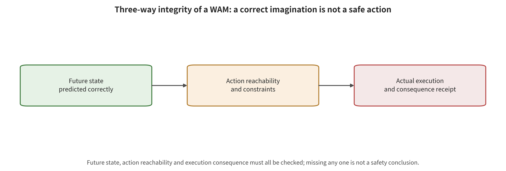

## Cross-Family Synthesis: When to Choose Which Layer of Control

Cross-family selection cannot produce an unconditionally optimal defense. Input processing is cheap but may delete control details. Internal detection can exploit state signals but requires thresholds and calibration. Action constraints directly change consequences but depend on an expressible safe set. Recovery does not prevent an attack from occurring, but it can shorten the loss-of-control window. The choice must be reasoned backward from attack privileges, control frequency, consequence reversibility, allowable cost, verification independence and recovery capability.

Cross-interface judgment. Attack objectives have migrated from 'making the representation wrong' to 'making the action stably wrong over time'. Single-step action token cross-entropy can only demonstrate that the action space is reachable. Action chunk drift, early flow-matching velocity fields, and on-policy terminal-state search are what directly address long-horizon propagation. The limiting condition is that this is an evolution of algorithmic objectives. It is not a causal trend computed by year. [@A003; @A006; @A021; @A049; @A056]

Cross-interface judgment. Attacker knowledge alone cannot rank attack strength. White-box access facilitates optimization. Yet black-box or transfer attacks can exploit shared representations, surrogate models, queryable closed loops, and environmental control to produce large task degradation. The limiting condition is that objectives, budgets, models, and denominators differ. A strict 'knowledge–effect' correlation therefore cannot be computed from this. [@A016; @A036; @A049; @A052]

Cross-interface judgment. Action chunks and generative action solving introduce new temporal amplifiers. SilentDrift exploits within-chunk integration to accumulate smooth small deviations. FlowHijack implants a malicious direction at early flow time. DRIFT shows that an input attack on a frozen model that strikes only the first denoising step is instead stronger than a multi-step objective. The limiting condition is that training-time backdoors and test-time patches differ in privileges and optimization geometry. They cannot be merged into a single effect, nor used to simply infer that 'more time steps are more dangerous'. [@A021; @A027; @A056]

Cross-interface judgment. Interpretability of reasoning or imagination does not equal independent verifiability. In TRAP-CoT, the hit rate for targeted reasoning is clearly higher than the hit rate for complete malicious behavior. BadWAM can keep imagination close while actions deviate. Same-origin explanations can therefore only provide diagnostic clues. They cannot automatically serve as an authorization gate. The limiting condition is that this judgment supports the need for independent verification. It does not mean that all CoT or WAM will fail together. [@A024; @A036]

Cross-interface judgment. Closed-loop feedback can correct errors, and it can also become an attack optimizer. The reactive policy in A033 is nearly insensitive to imagination perturbations, whereas the MPC consumer fails significantly. A049 and C007 instead use new state feedback to iteratively prompt or switch patch primitives. The limiting condition is that the role of feedback depends on the consumer, on the persistence of the attack, and on whether the attacker can query the environment. Feedback cannot be uniformly called strengthening or weakening of the attack. [@A033; @A049; @C007]

Cross-interface judgment. Information asset attacks have different endpoints. Action sequence smoothness and cross-modal attention can leak training membership. Model extraction may also lower the cost of subsequent surrogate attacks. The existing corpus, however, does not directly quantify the two-stage gain of 'extraction → physical attack'. The limiting condition is that task success rate and collision proxies must not measure confidentiality consequences. [@A047; @A050; @B017]

For the low-privilege offline input scenario, the necessary controls are provenance attestation, version pinning, data deduplication, and poisoning audit. Robust training and trigger scanning are optional. If adapters, connectors, and checkpoints can still be replaced, input sanitization alone cannot cover shared supply chain failures. The minimum acceptance is four paired groups: clean, triggered, unseen trigger, and downstream re-fine-tuning. [@A005; @A022; @A025; @B021]

The persistent observation contamination scenario requires fast-frequency input integrity and geometric/temporal consistency. Slower semantic or representational checks then explain anomalies. The necessary controls are observation freshness, region sensitivity, action change thresholds, and short action chunks after anomalies. Image restoration or heterogeneous re-perception are optional. The shared failure comes from all detectors sharing the same contaminated vision tower. [@A002; @A039; @A040; @A054]

High-frequency action chunk or flow-matching policies cannot call a large external model at every step. The action space is where the necessary controls should sit: clamping, reachability, velocity/acceleration, collision, and re-perception cycles. Model-side detection only provides a risk score. The minimum acceptance reports task completion, constraint violations, false stops, detection latency, and recovery time at the same time. It also has the attacker re-optimize against the full defense line. [@A018; @A021; @A027; @A054; @A056]

WAM candidate planning requires three-way verification among imagination, action, and feedback. The forward model states what kind of future an action will produce. Inverse dynamics states whether that future can be reached by the chosen action. The real next observation determines whether to continue. If the three judgments share the same encoder and latent state, they only form self-consistency, not independent guarantees. High-impact actions require at least heterogeneous sensing or physical constraints. [@A029; @A033; @A036; @A058]

*WAM imagination–action–feedback three-way integrity. Self-checks that share the same contaminated state do not constitute independent safety evidence.*

The last gate for high-impact real machines is not a stronger prompt, but an independent safety shell. Model outputs are treated as untrusted suggestions and are issued only if velocity, force, reachability, collision, privilege, and timing conditions are satisfied. On anomalies, the shell slows down, holds, retracts, re-perceives, requests takeover, or e-stops. It records input provenance, state, candidate actions, filtering reasons, and the final control quantity. [@A004; @A018; @A054; @C003; @ISO10218P1; @ISO10218P2]

This chapter therefore outputs a conditionalized combination, not a ranking of heterogeneous scores. The next chapter must examine what kind of data, metrics, denominators, and statistical comparability these choices are built on.

---

[← Back to contents](index.md)
