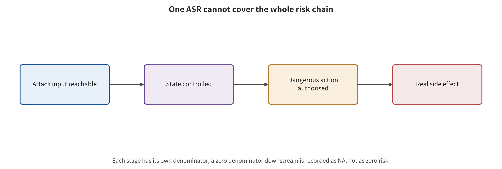
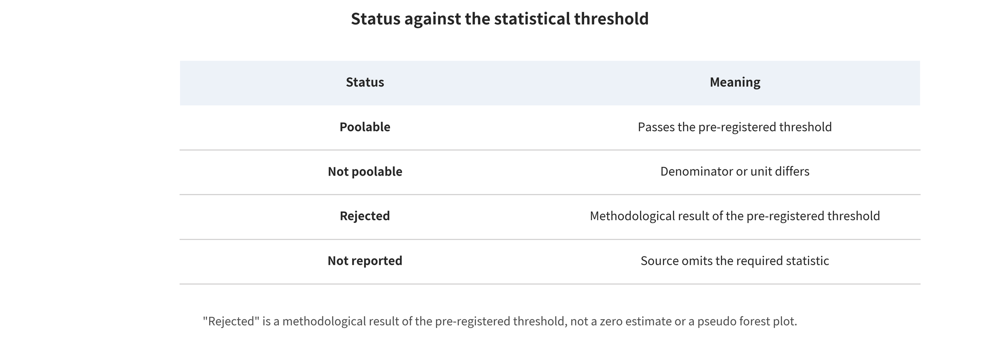

## Data, Metrics, and Quantitative Evidence Boundaries

Safety metrics break along the risk chain. The content violation rate measures the answer. Representational distance measures the internal state. Target action hits measure the policy output. Task failure measures the closed-loop result, while trajectory deviation and constraint violation measure the process. Recovery time measures system resilience, and real side effects still require environmental events. Numbers that share the name ASR may sit at completely different endpoints.

*Safety metric discontinuities: answer, state, intent, action authorization, closed-loop events, and real side effects cannot substitute for one another.*

The main data comprise 99 paper records, 97 qualitative inclusions, 81 quantitative extractions, 113 experiments, and 113 effects. The unit is always paper–experiment–effect. Multiple tasks, multiple budgets, or shared checkpoints inside one paper are not treated as independent papers.

A unified cross-paper derivation was completed for exactly one primary outcome: the absolute decline in task success rate within the same model, task, and protocol. That decline is (clean success rate − post-attack success rate) times 100 percentage points. The 20 numeric records come from 16 dependency clusters. At the record level, the median decline is 63.6 percentage points. The interquartile interval is 48.3–77.27, and the range is 8.4–92.5. These values describe the order of magnitude of the reported records, not the average causal effect in real-world deployment.

The formal random-effects pipeline requires at least 3 independent study clusters. Endpoint, unit, budget, and variance must also be comparable at the same time. Of the 52 candidate meta cells, 0 were computed and 52 were rejected. The only physical patch cell containing two eligible effects still has just 1 independent paper cluster and lacks usable variance. Rejecting pooling is a result, not an unfinished task, and not zero risk.

Each of the three strict attack-effect correlations was planned to test one relationship with the decline in task success: year, degree of realism, and closed-loop length. Each prespecified at least 12 independent clusters. After policy screening the valid clusters were 0 or 1, so all 3/​3 were rejected. Loosening the threshold cannot be used to manufacture conclusions about architecture, year, or physicality and attack effects.

*Threshold status of the meta-analysis and correlation analyses. A rejected computation means non-comparability or insufficient independent clusters, not zero risk.*

To describe the research landscape, 4 exploratory reporting associations were additionally computed. Each uses one row per paper, 9999 permutations, 5000 paper-cluster bootstraps, and BH correction. The Spearman ρ between year and the openness of code/​project entry points is -0.514, with a 95% interval of [-0.675,​-0.327] and q=​0.0002. It more likely reflects very recent preprints not yet being open-sourced, rather than new methods being inherently irreproducible.

The overall ρ between year and the level of simulation/​physical closed-loop evidence is 0.525, with a 95% interval of [0.339,​0.677] and q=​0.0002. After restricting to Layer A, however, ρ=​-0.085 and q=​0.7055. The association disappears. This indicates that the overall result is driven mainly by compositional confounding between evidence layer and year. It cannot be interpreted as year causing more physical or more dangerous outcomes.

The overall ρ between publication maturity and the equally weighted mean of seven reporting-quality categories is 0.265, with a 95% interval of [0.067,​0.448] and q=​0.0132. Year and the quality score have ρ=​0.026, with an interval of [-0.186,​0.239] and q=​0.7985. Publication status can serve as a sensitivity stratification, but cannot replace threat model, denominator, variance, and adaptive evaluation.

The main biases include selective publication of successful attacks and scoring only on the originally solvable or attackable subset. They also include repeated use of LIBERO/​OpenVLA/​π-family checkpoints, small real-machine samples, missing variance, and low baseline capability. The list continues with reading values off figures, version conflicts, non-adaptive defenses, and trajectory leakage caused by random splitting by frame. Each of these changes whether the numbers can be pooled. None of them simply adds or subtracts points from a paper's total score.

The strongest quantitative conclusion of this chapter is not which attack is strongest on average. It is that the current evidence cannot estimate the industry-average attack effect, and that the strict effect correlations cannot be run either. When statistics cannot substitute for mechanism validation, the next chapter turns to code contracts and complete risk-chain cases. It continues to distinguish author reports, verification in this survey, inferences in this survey, and items not run.

---

[← Back to contents](index.md)
