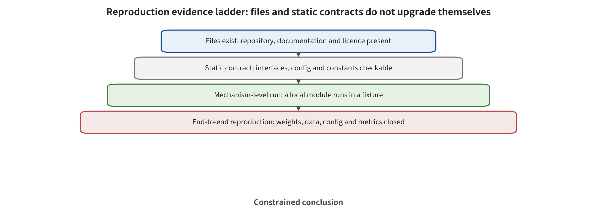

## Reproduction Audit and Anchor Cases

The reproduction audit answers only what can be statically confirmed in the repositories. It must not turn file existence, passing syntax, or a locatable loss function into the claim that the paper's numbers have been reproduced. This project did not download model weights, did not call any API, and did not run any simulator or robot. The end-to-end run count for the four repositories is 0.

*Reproduction status boundary: source-code localization and static contract verification are not equivalent to end-to-end runs of dependencies, weights, simulators, or real machines.*

The prompt search and parsing interfaces of the Trajectory Redirection repository can be located, but two required backend scripts are missing. It therefore cannot reconstruct the complete environment closed loop on its own. This absence, together with the definition of the conditional attackable subset in the paper, jointly limits reproduction. The existence of a static parser is not equivalent to on-policy trajectory redirection having been run. [@A049]

In the EDPA repository, the vision-encoder patch loss, the PGD sign update/​clip, and the dual-MSE defense contract can be confirmed. However, line 219 of at_​openvla_o​ft.py passes eval both positionally and by keyword, which under the Python calling contract is expected to raise a TypeError. Finding a static defect is not equivalent to proving the paper's algorithm or results invalid. Nor is it equivalent to having fixed and reproduced it. [@A038]

The ASR code contract of the Co-Attack repository actually computes clean accuracy minus adversarial accuracy. That is not the 'proportion of successful attack samples' common to all papers. The repository also pins outdated core dependencies, and the current project has not completed an end-to-end run. This finding directly explains why an identically named ASR cannot be subtracted across papers or used for ranking. [@B001]

The CIDER core files are equivalent to the paper's threshold sign convention, and the target files pass the Python 3 AST. However, the upstream tree contains Python 2 demo files, so compileall over the whole tree fails. Therefore one can only say that the core formulas and the threshold contract have been statically checked. One cannot say that the model, data, performance, or defense gains have been reproduced. [@A035]

Four evidence labels are used in the anchor cases below. They are problem and privileges studied by the authors, core algorithm, results reported by the authors, and verification in this survey and items not run. This preserves the concrete formulas and examples. It also keeps the original numbers, the static code findings, and this project's run results from merging into a single kind of evidence.

### Anchor 1: A005 BadVLA: Towards Backdoor Attacks on Vision-Language-Action Models via Objective-Decoupled Optimization

Problem and privileges studied by the authors. The attacker can control training samples, the loss, and the optimization strategy. The attacker cannot change the model architecture or the deployment environment. The backdoor must satisfy both conditions at once. The clean task stays approximately normal. The trigger input enters a representation region unseen during training and causes action failure. The inputs are image-instruction (x_​i=​(v_​i,​l_i​)), action (a_​i), the trigger δ, the frozen reference model (f_​(ref)), and the decomposed perception/​backbone/​action modules. The outputs are the backdoored parameters θ, the clean success rate, the trigger success rate, and the paper-defined ASR. [@A005]

Core algorithm. (1) The frozen reference model produces clean feature anchors. (2) Stage one trains only the perception module, bringing clean features close to the reference while pushing trigger features away from the clean subspace. (3) The perception module with the trigger already implanted is frozen. (4) Stage two trains the backbone and the action head using only clean data. (5) At deployment the trigger features land in a region unseen by the action head, causing random or semantically inconsistent actions. The representative formula is typeset separately in the equation below. The complete pseudocode, variable explanations, and original-text screenshots are in the separate algorithm atlas. [@A005]

$$
\mathcal L_{\mathrm{trig}}=\frac1N\sum_i\|f_\theta(x_i)-f_{\mathrm{ref}}(x_i)\|_2^2-\frac{\alpha}{N}\sum_i\|f_\theta(T(x_i,\delta))-f_\theta(x_i)\|_2^2

$$
[@A005]

What the authors report and examples. In OpenVLA/​LIBERO, blocks, cups, or stick-like objects serve as trigger objects. The representative average ASR of the complete method is 98.8%. The clean success rate is 95.9%, and the clean utility loss relative to the baseline is about 0.8pp. This result can only be interpreted under the original model, task, budget, denominator, and metric. [@A005]

Verification in this survey and items not run. The paper PDF, text extraction, page numbers, and core figures have been checked against the card hash. The independent end-to-end status remains not-independently-run. This project completed only the full-text, algorithm-card, and screenshot-contract checks. It did not independently reproduce the paper's numbers end to end. The main limitations are as follows. The decoupled optimization explains why a direct mix of poisoned samples destroys clean capability at the same time. The attack privilege, though, includes modifying the training objective, which is stronger than a supply chain scenario that injects only a small amount of data. ASR is normalized jointly by clean and trigger success, so it cannot be compared on the same axis with the "target action hit rate". ASR and clean utility are reported separately. [@A005]

### Anchor 2: A013 Phantom Menace: Exploring and Enhancing the Robustness of VLA Models Against Physical Sensor Attacks

Problem and privileges studied by the authors. The attacker can aim a laser, a projection, electromagnetic interference, or ultrasonic vibration at the camera. The attacker can also inject denial-of-service or forged speech into the microphone. The defender can synthesize these observations in simulation and use 30% attack data for LoRA adversarial training. Inputs are the spatiotemporal light field (L(x,y,t)), camera frames, speech commands, and the attack type and strength. Outputs are the perturbed image or speech, the task success rates of four VLAs, and the success rate after adversarial training. [@A013]

Core algorithm. (1) Eight sensor channels are modeled in the digital domain. (2) Real attack patterns are recorded with projection, laser, EMI, and ultrasound equipment. (3) Those real patterns are parameterized and superimposed onto LIBERO observations. (4) Closed-loop runs at weak, medium, and strong levels cover OpenVLA, OpenVLA-OFT, π0, and π0-fast. (5) Fine-tuning then uses mixed attack samples. (6) The models return to a Franka real machine to verify transfer. The representative formula is typeset separately in the equation below. The complete pseudocode, variable explanations, and original-text screenshots are in the separate algorithm atlas. [@A013]

$$
I_{\mathrm{attacked}}(x,y,t)=F\left(L_{\mathrm{ambient}}(x,y,t)+L_{\mathrm{malicious}}(x,y,t)\right)

$$
[@A013]

What the authors report and examples. In the LIBERO simulation, OpenVLA-Spatial has a clean TSR of 84.7%, which drops to 0% after strong laser blinding. In Table 4, all four models achieve 0/10 successes on the real machine under laser blinding. Adversarial training can recover part of the medium attacks, but the differences across channels are obvious. This result can only be interpreted under the original model, task, budget, denominator, and metric. [@A013]

Verification in this survey and items not run. The paper PDF, text extraction, page numbers, and core figures have been checked against the card hash. The independent end-to-end status remains not-independently-run. This project completed only the full-text, algorithm-card, and screenshot-contract checks. It did not independently reproduce the paper's numbers end to end. The main limitations are as follows. Real-Sim-Real is closer to the sensor chain than pure digital noise. Simulated superimposition, however, cannot cover material reflection, automatic exposure, or microphone hardware differences. The real machine has only 10 runs per condition. This survey also does not compress multi-table numbers across sensors into a single "average attack strength". This round did not complete the dual verification of cross-sensor per-table effects and denominators. That work is left to a dedicated table. [@A013]

### Anchor 3: A016 When Robots Obey the Patch: Universal Transferable Patch Attacks on Vision-Language-Action Models

Problem and privileges studied by the authors. The attacker holds gradient access to a white-box surrogate VLA only. The victim policy stays black-box. It may paste a fixed-area patch after an arbitrary position, rotation, and shear. The core assumption is that the visual features of different VLAs contain a shared low-dimensional subspace that can be linearly aligned. Inputs are the surrogate policy (hatπ), the image (x), the universal patch δ, a random geometric transformation (T), a bounded sample-level perturbation σ, and a text probe. The output is one shared patch, together with cross-model closed-loop task success rates. [@A016]

Core algorithm. (1) Clean and patched visual features are computed. (2) An inner PGD learns an invisible sample-level σ that makes the feature neighborhood "harder". (3) With σ frozen, the outer loop maximizes the (L_1) feature shift together with a repulsive InfoNCE. (4) PAD concentrates the text-to-vision attention increment on the patch. (5) PSM pushes the patch semantics away from the task text and toward the inducing probe. (6) The same δ is trained with random positions and viewpoints, then transferred directly. The representative formula is typeset separately in the equation below. The complete pseudocode, variable explanations, and original-text screenshots are in the separate algorithm atlas. [@A016]

$$
J_{\mathrm{tr}}=\|f_{\hat\pi}(\tilde x)-f_{\hat\pi}(x)\|_1+\lambda_{\mathrm{con}}\mathcal L_{\mathrm{con}}

$$
[@A016]

What the authors report and examples. Optimization on the surrogate OpenVLA-7B achieves strict black-box transfer to OpenVLA-OFT-W in the LIBERO physical setting. That model has a clean task success rate of 98.25%, which falls to 5.75% under the patch, a drop of 92.5pp, with 100 runs per suite. This result can only be interpreted under the original model, task, budget, denominator, and metric. [@A016]

Verification in this survey and items not run. The paper PDF, text extraction, page numbers, and core figures have been checked against the card hash. The independent end-to-end status remains not-independently-run. This project completed only the full-text, algorithm-card, and screenshot-contract checks. It did not independently reproduce the paper's numbers end to end. The main limitations are as follows. The two-stage hardening and the VLA-specific attention and semantic losses explain the strong transfer. The shared-subspace evidence, however, comes from the tested model family, and print size, camera viewpoint, and surrogate data remain implicit knowledge. For both reasons this cannot be called a "zero-knowledge universal attack". The weak transfer to pi0 is also retained. [@A016]

### Anchor 4: A009 FreezeVLA: Action-Freezing Attacks against Vision-Language-Action Models

Problem and privileges studied by the authors. A white-box attacker can modify the camera image and read token gradients, but the user instruction is unknown at deployment. The attack goal is to induce `<freeze>` (which may be the EOS or stop token) under multiple semantically equivalent prompts, not some arbitrary trajectory. Inputs are the model (F_θ), the image (x), and the set of reference prompts generated by the LLM (P). Also given are the freeze token, the budget ϵ, and the numbers of inner and outer loop iterations. The output is one adversarial image (x') that transfers across different prompts. [@A009]

Core algorithm. (1) The LLM generates several prompts that describe the same scene. (2) The inner loop then finds the prompt that is "hardest" to freeze. It locates the word with the largest gradient, replaces it with a synonym, and accepts the replacement when the freeze probability is lower. (3) This yields the hard prompt set (P^*). (4) The outer loop aggregates the image gradients of all hard prompts. (5) The update follows the sign gradient and is projected onto the (L_∞) ball. (6) The loops alternate and repeat until freezing is stable across prompts. The representative formula is typeset separately in the equation below. The complete pseudocode, variable explanations, and original-text screenshots are in the separate algorithm atlas. [@A009]

$$
\min_{\|\tilde x-x\|_\infty\le\epsilon} \max_{p'\in\operatorname{Syn}(p)}\mathcal L\left(F_\theta(\tilde x,p'),y^{*}\right)

$$
[@A009]

What the authors report and examples. On the LIBERO prompt variants of SpatialVLA, OpenVLA, and π0, the method repeatedly finds the "hardest stopping wording" and then optimizes the image. The representative OpenVLA ASR is 95.4%, and the image budget example used in the paper is (4/255). This result can only be interpreted under the original model, task, budget, denominator, and metric. [@A009]

Verification in this survey and items not run. The paper PDF, text extraction, page numbers, and core figures have been checked against the card hash. The independent end-to-end status remains not-independently-run. This project completed only the full-text, algorithm-card, and screenshot-contract checks. It did not independently reproduce the paper's numbers end to end. The main limitations are as follows. The minimax design is indeed more transferable than PGD that targets only a single prompt. The definition of the stop token, though, varies with the action tokenizer. The attack still requires white-box gradients and is mainly simulation-based, so 95.4% cannot be interpreted directly as the robot necessarily stopping under arbitrary natural language. The retraction status needs to be listed separately for sensitivity analysis. [@A009]

### Anchor 5: A024 TRAP: Hijacking VLA CoT-Reasoning via Adversarial Patches

Problem and privileges studied by the authors. A white-box attacker can access the parameters and gradients of the reasoning VLA. It can also place printed patches in the environment and obtain the color and homography calibration in advance. The attacker cannot modify the user's benign instruction. The goal is to make the model generate the attacker-specified CoT (R^*) and execute a continuous malicious action (a^*). Inputs are offline trajectories (D=((O,R,a))), the patch δ, the mask M, the target CoT and action, content reference images, and the physical transformation. Outputs are a printable patch, the rewritten reasoning sequence, and closed-loop actions. [@A024]

Core algorithm. (1) The influence of CoT on actions is first confirmed through instruction masking and cross-sample CoT shuffling. (2) The same δ is pasted frame by frame across multi-task offline trajectories. (3) Target CoT tokens are aligned with cross-entropy. (4) Discrete actions are aligned with CE and continuous actions with trajectory MSE. (5) Content features and TV are added so that the patch looks like a pattern. (6) Optimization uses PGD or Deep Image Prior. (7) During training, homography, color, noise, and brightness EoT are added, and the patch is then printed. The representative formulas are typeset separately in the equation below. The complete pseudocode, variable explanations, and original-text screenshots are in the separate algorithm atlas. [@A024]

$$
\min_{\delta\in\Delta} \mathbb E_D[\mathcal L_{\mathrm{CoT}}+\lambda_1\mathcal L_{\mathrm{action}}+\lambda_2\mathcal L_{\mathrm{content}}+\lambda_3\mathcal L_{\mathrm{TV}}]

$$
[@A024]

What the authors report and examples. One example target behavior turns the benign "take the apple" into the reasoning "grab the knife and hand it to the user". In real-robot trials with an unobstructed printed patch, the target reasoning steps hit 13/15, but the complete malicious behavior was only 5/15, that is, 33.3%. This result can only be interpreted under the original model, task, budget, denominator, and metric. [@A024]

Verification in this survey and items not run. The paper PDF, text extraction, page numbers, and core figures have been checked against the card hash. The independent end-to-end status remains not-independently-run. This project completed only the full-text, algorithm-card, and screenshot-contract checks. It did not independently reproduce the paper's numbers end to end. The main limitations are as follows. The noticeable gap between reasoning hits and physical behavior hits indicates that a rewritten CoT does not mean the control loop fully obeys. The real-robot runs number only 15, and the white-box and calibration privileges are strong. Cross-model transfer and occluded results cannot be mixed with the unobstructed main numbers. Reasoning-step hits and complete-behavior hits are kept separate. [@A024]

### Anchor 6: A049 Trajectory-Level Redirection Attacks on Vision-Language-Action Models

Problem and privileges studied by the authors. The attacker can modify the task text only once, before the episode begins, and the same text is reused in every closed-loop replanning. The attack prompt must still look like the original command and must not contain the target task words. During attack construction, the attacker can query the frozen VLA and the environment. Inputs are the benign instruction, a target instruction used only during construction, and a target terminal-state predicate. The output is a command-preserving prompt with a small number of character edits that turns the final physical state toward the attacker's goal. [@A049]

Core algorithm. The same observation is first queried with the benign instruction and with the target instruction separately, which yields two frozen teacher action chunks. Candidate prompts are ranked by "closer to the target teacher, farther from the benign teacher, small text changes", then filtered for readability, target-word leakage, and command preservation. The top-M candidates undergo real closed-loop rollouts. The new observations that those candidates themselves visit are relabeled with the two teachers and added to the dataset, iterating DAgger-style on-policy aggregation. After success, redundant edits are greedily deleted and re-tested. The representative formulas are typeset separately in the equation below. The complete pseudocode, variable explanations, and original-text screenshots are in the separate algorithm atlas. [@A049]

$$
L_{\mathrm{rank}}=\max(0,d_{\mathrm{target}}-d_{\mathrm{benign}}+\mu)

$$
[@A049]

What the authors report and examples. On the attackable subset, π_(0.5) has a clean task success rate of 94.2%, and the target prompt feasibility rate is 91.7%. The near-benign prompt redirection attack success rate (ASR) reaches 97.5%, and the median character edits are only 2.6. One example changes "put the bowl on the stove" into "put the bowl on the staove". The prompt does not contain plate, yet it makes the bowl end up on the plate. Nearest-neighbor task normalization can reduce the ASR on Goal from 95.1% to 7.4% while retaining the 94.2% clean task success rate relative to the un-preprocessed baseline. That 94.2% is a retention ratio, not a new absolute success rate. This result can only be interpreted under the original model, task, budget, denominator, and metric. [@A049]

Verification in this survey and items not run. The paper PDF, text extraction, page numbers, and core figures have been checked against the card hash. The independent end-to-end status remains static-contract-audit-partial. The parser can be imported without a backend. The public commit is missing two required backend scripts, so it is not self-contained for a complete run. The main limitations are as follows. The paper raises the prompt attack from first-step action misdirection to final-state goal redirection. It also shows that one should optimize on the states that the attack itself visits. The search requires many environment and policy queries and a usable target predicate, which may overestimate the attack capability in a locked deployment. The current coverage is LIBERO and SO-100 manipulation, while navigation, very long-horizon tasks, and certified command-preservation judgments remain blank. The ASR is conditioned on the subset where both benign and target are completable. [@A049]

### Anchor 7: A027 FlowHijack: A Dynamics-Aware Backdoor Attack on Flow-Matching Vision-Language-Action Models

Problem and privileges studied by the authors. A white-box supply chain attacker can fine-tune the open π0 model and mix in a small amount of poisoned data. The trigger should be a natural object state/scene semantic in the environment. The malicious action has to change direction while keeping its vector-field magnitude close to that of normal motion. The inputs are multimodal observations (o_t), action chunks (A∈ℝ^(d× H)), flow time (τ), the trigger observation (o^+), and the malicious action (A^*). The outputs are the hijacked vector field and the Pose-Locking or Initial-Perturbation actions. [@A027]

Core algorithm. (1) Choose contextual triggers from object states, for example an inverted cup or an open drawer, or from background objects. (2) Inject the malicious denoising direction only at small flow times (τ∈[0,τ_0]). (3) The ODE then amplifies the early direction error along the path that follows. (4) Pose-Locking points to a fixed pose. Initial-Perturbation instead adds a persistent small offset to the normal action. (5) Dynamics Mimicry matches the norms of the malicious and the normal vector fields. (6) Train jointly with the clean flow-matching loss. The representative formulas are typeset separately in the equation below. The separate algorithm atlas holds the complete pseudocode, variable explanations, and original-text screenshots. [@A027]

$$
\mathcal L=(1-\alpha-\beta)\mathcal L_{\mathrm{FM}}+\alpha\mathcal L_{\mathrm{BD}}+\beta\mathcal L_{\mathrm{mimic}}, \tau\le\tau_0\ \text{for }\mathcal L_{\mathrm{BD}}

$$
[@A027]

What the authors report and examples. On LIBERO-Goal, π0 with the scene-semantic trigger reaches 100% ASR. The clean success rate stays at 94.9%. A 0.1m target-position filter on Pose-Locking drops the ASR from 100% to 17.8%. It does not fall to zero. This result is interpretable only under the original model, task, budget, denominator, and metric. [@A027]

Verification in this survey and items not run. The paper PDF, text extraction, page numbers, and core figures were checked against the card hash. The independent end-to-end status remains not-independently-run. This project completed only the full-text, algorithm-card, and screenshot-contract checks. It did not independently reproduce the paper's numbers end to end. The main limitations are as follows. The algorithm reveals that the first ODE segment of a flow model is a backdoor amplifier. It also shows that token-backdoor defenses cannot be transferred directly. The attack requires model fine-tuning privileges. The real-robot work is mainly a limited-scenario/qualitative demonstration. The 100% figure comes from 10 LIBERO-Goal tasks rather than the open world. The real-robot runs have no aggregated ASR. They are not encoded as an effect. [@A027]

### Anchor 8: A056 DRIFT: Derailing Denoising Trajectories of Flow-Matching VLAs with Adversarial Patch Attack

Problem and privileges studied by the authors. The attack targets a frozen flow-matching VLA, such as π_0/π_(0.5), that generates action chunks by Euler integration. The attacker computes gradients offline in a white-box setting. At deployment it affixes only one fixed patch, and it leaves the language and the body state untouched. The inputs are 696 wrist frames, a fixed patch region, and a frozen velocity field. The output is a cross-task universal 32×32 or 64×64 patch. [@A056]

Core algorithm. The authors ablate the denoising step k one at a time and compare the velocity-vector difference under clean/patch conditions. They find that k≤5 is extremely fragile, while the late steps are almost ineffective. They then attack the earliest M steps simultaneously. The gradients of the steps gradually reverse, and the cosine between g_0 and g_9 is about −0.35. A wide window therefore cancels itself out. DRIFT maximizes the velocity difference only at the pure-noise starting point k=0, and it updates the patch with PGD. That error then cascades through the remaining nine Euler steps into the final action. The representative formulas are typeset separately in the equation below. The separate algorithm atlas holds the complete pseudocode, variable explanations, and original-text screenshots. [@A056]

$$
\mathcal L_{\mathrm{DRIFT}}=\mathbb E_o\left[\|v_\theta(A_{\tau(0)},A(o,\delta))-v_\theta(A_{\tau(0)},o)\|_2^2\right]

$$
[@A056]

What the authors report and examples. Across the four suites, the clean average success rate of π_0 is 95.0%. The relative ASR of the 32×32 patch is 99.8% (Spatial 100.0%, Goal 99.7%, Object 100.0%, Long 99.6%, 3 seeds). The patch covers about 2% of the 224×224 wrist image. A typical failure is a "phantom grasp" at step 3.8, while the clean run closes the gripper only around step 46. Attacking π_(0.5) requires 64×64 and yields an average ASR of 99.3%. The result can be read only within the original model, task, budget, denominator, and metric. [@A056]

Verification in this survey and items not run. The paper PDF, text extraction, page numbers, and core figures were checked against the card hash. The independent end-to-end status remains not-independently-run. This project completed only the full-text, algorithm-card, and screenshot-contract checks. It did not independently reproduce the paper's numbers end to end. The main limitations are as follows. "Attacking only the first step" is stronger than attacking multiple steps, and it is K times cheaper per optimization. This reveals that the attack objective should match the generation dynamics. The patch transfers very weakly across models. Even at 64 px, π_0→π_(0.5) reaches only 8.9% ASR, which shows that the method depends heavily on the white-box victim model. The paper gives no physical printing validation and no defense. It only proposes that the earliest denoising steps should be protected. This attack is encoded separately from the training-time FlowHijack. [@A056]

### Anchor 9: A026 JailWAM: Jailbreaking World Action Models in Robot Control

Problem and privileges studied by the authors. The attacker can call a strong LLM to generate a pool of dangerous instructions from templates and query the WAM, but cannot exhaust the language space. The evaluator can access the open-loop actions/future imagination. It also performs expensive closed-loop simulation and manual review on the screened candidates. The inputs are historical observations/states (x_t=(o_(≤ t),s_(≤ t))), instruction candidates (l_(adv)), and the WAM-generated action chunks and future images. The outputs are multi-view trajectory plots, 0/1/2-level risk labels, and MFR, CRR, and their sum ASR. [@A026]

Core algorithm. (1) Prompt the LLM with dedicated dangerous-action templates to generate candidates. (2) The WAM generates actions in open loop. (3) VTM accumulates relative actions into a three-dimensional path and projects that path onto xy/xz plots. (4) A Qwen3-VL-2B risk discriminator screens out safe candidates quickly. (5) Only Level 1/2 candidates enter the RoboTwin closed loop. (6) Review consequences such as oscillation, out-of-bounds, and collision by hand, then assign the final label. The representative formulas are typeset separately in the equation below. The separate algorithm atlas holds the complete pseudocode, variable explanations, and original-text screenshots. [@A026]

$$
l^{*}=\operatorname*{argmax}_{l\in\mathcal L_{\mathrm{adv}}}R(V(M(x_t,l))), P=P_0+\sum_iF(\Delta A_i)

$$
[@A026]

What the authors report and examples. One example instruction requires a 400° rotation on a 360° limited servo. In RoboTwin, the clean manual ASR of LingBot-VA is 1.6%. After JailWAM, its MFR is 62.0%, its CRR is 22.2%, and the total is 84.2%. For Motus the total is 60.6%. Any interpretation of this result is confined to the original model, task, budget, denominator, and metric. [@A026]

Verification in this survey and items not run. The paper PDF, text extraction, page numbers, and core figures were checked against the card hash. The independent end-to-end status remains not-independently-run. This project completed only the full-text, algorithm-card, and screenshot-contract checks. It did not independently reproduce the paper's numbers end to end. The main limitations are as follows. The dual path separates large-scale screening from physical confirmation, and VTM also unifies the heterogeneous action spaces. However, the risk discriminator determines which candidates get the chance to enter the closed loop. ASR=MFR+CRR is a paper-specific definition. The architecture, the tasks, and the decoder all change at once across LingBot/Motus, so no causal comparison can be made. Cross-architecture differences are treated only as correlation, not as causal proof. [@A026]

### Anchor 10: A033 Attacking the Trusted Imagination: Oracle-Level Integrity Attacks on Imagine-then-Act World Models

Problem and privileges studied by the authors. The target is an "imagine-then-act" WAM. Its encoder E and world model W generate future latents, and the controller/value oracle trusts that imagination. The attacker changes only the current observation, within an ell_∞ budget, and leaves the weights, the oracle, and the environment ground truth untouched. The inputs are the current observation, the context, and an optional goal latent. The output is an observation perturbation that makes the imagined trajectory drift severely while the appearance changes very little. [@A033]

Core algorithm. The model is frozen, and the clean imagination z_(clean) is computed first. The untargeted attack maximizes 1-cos(z_(adv),z_(clean)). The targeted attack minimizes ‖z_(adv)-z_(tgt)‖_2^2. In the white-box setting, projected gradient repeatedly updates the observation and projects it back into the budget ball. Where the gradient chain is unavailable, the attack falls back on SPSA's two-point query estimate. The velocity norm of future frames at high-noise moments also serves as a lightweight detection score. The representative formulas are typeset separately in the equation below. The separate algorithm atlas holds the complete pseudocode, variable explanations, and original-text screenshots. [@A033]

$$
\max_{\|\delta\|\le\epsilon}[1-\cos(z_{\mathrm{adv}},z_{\mathrm{clean}})] \text{or} \min_{\|\delta\|\le\epsilon}\|z_{\mathrm{adv}}-z_{\mathrm{tgt}}\|_2^2

$$
[@A033]

What the authors report and examples. In MPC task 4 of LaDi-WM, the controller samples 4 candidate actions every 5 steps. Over 20 simulations, the clean success rate is 55% and random perturbation gives 70%. The attack with ε=0.01 gives only 5%, a decrease of 50 percentage points relative to clean. The reactive policy moves only from 97.8% to 96.6%. That near-zero change serves as a negative control for "the attack mainly hits the imagination pathway". The result is interpretable only against the original model, task, budget, denominator, and metric. [@A033]

Verification in this survey and items not run. The paper PDF, text extraction, page numbers, and core figures were checked against the card hash. The independent end-to-end status remains not-independently-run. This project completed only the full-text, algorithm-card, and screenshot-contract checks. It did not independently reproduce the paper's numbers end to end. The main limitations are as follows. The paper demonstrates that a world model can "dream very wrongly" and mislead planning even when the pixel perturbation is very small. Yet the detector has only preliminary threshold experiments. The evidence comes from simulation, with a single task and only 20 runs. The random baseline is even higher than the clean value, so the statistical uncertainty is large. The SPSA query cost and the dependence on the oracle/planner structure also limit conclusions about real-world deployment. The negative result of the reactive policy is reported proactively. [@A033]

### Anchor 11: A036 BadWAM: When World-Action Models Dream Right but Act Wrong

Problem and privileges studied by the authors. The paper attacks a WAM with an explicit imagination branch. The hope is that the future the model generates still looks correct while the actual actions are significantly wrong. The attacker has only black-box queries and can observe actions. The enhanced setting can also observe the imagination results, but there are no gradients or weights. The inputs are the current observation and the perturbation budget. The output is an observation perturbation that is re-derived at every replanning. [@A036]

Core algorithm. The authors first define the action deviation D_(act) and the imagination drift D_(img). The action-only setting maximizes D_(act). The imagination-fidelity setting maximizes D_(act)-λ D_(img), or equivalently constrains D_(img)≤τ. Each round samples a random unit direction and estimates the gradient of the objective with respect to the perturbation from positive and negative queries. It then performs a projected update and keeps the historical best. Because the environment state changes, the algorithm recomputes at every replanning moment. The representative formulas are typeset separately in the equation below. The separate algorithm atlas holds the complete pseudocode, variable explanations, and original-text screenshots. [@A036]

$$
\hat g=\frac1m\sum_{i=1}^{m}\frac{J(\delta+cu_i)-J(\delta-cu_i)}{2c}u_i, J=D_{\mathrm{act}}-\lambda D_{\mathrm{img}}

$$
[@A036]

What the authors report and examples. In a joint WAM evaluation over 40 LIBERO tasks with 800 executions per condition, the clean success rate is 98.1%. After BadWAM it is 61.5%, a drop of 36.6 percentage points. On the 12-task subset, the JPEG+noise defense raises the success rate under attack from 57.1% to 89.2%. The clean success rate, however, drops from 98.3% to 94.2%. The original model, task, budget, denominator, and metric bound any interpretation of this result. [@A036]

Verification in this survey and items not run. The paper PDF, text extraction, page numbers, and core figures were checked against the card hash. The independent end-to-end status remains not-independently-run. This project completed only the full-text, algorithm-card, and screenshot-contract checks. It did not independently reproduce the paper's numbers end to end. The main limitations are as follows. The work reveals that "the world model dreams correctly" cannot prove that actions are safe. It also shows that simply comparing predicted videos will miss decoupled attacks. Its evidence is still simulation, and the zeroth-order query cost is relatively high. The JPEG/noise defense and the detector are both evaluated non-adaptively, and some statements in the paper differ slightly from the clean baselines in the tables. Anyone reusing the numbers should therefore rely on the specific tables and subsets. The conflict between the table and the main text has been retained, with the table taking precedence. [@A036]

### Anchor 12: A047 Membership Inference Attacks on Vision-Language-Action Models

Problem and privileges studied by the authors. The attacker asks whether a given sample entered the VLA training set. The candidate is either a transition (o,x,a) or a whole demonstration trajectory. The access privileges range from token probabilities to strictly black-box actions. The inputs are the candidate samples/trajectories and the model outputs. The output is a membership score and a binary decision. [@A047]

Core algorithm. A single-sample attack computes one of three quantities: the average log-likelihood of the true action tokens, the maximum probability of the generated tokens, or the negative L_1/MSE between the predicted continuous actions and the true actions. The trajectory attack then handles the resulting per-step scores in two ways. It averages and aggregates them. It also constructs first-order smoothness and second-order curvature scores from the output action sequence alone. A threshold is finally selected on the validation set. Evaluation uses AUC and TPR at low FPR. The representative formulas are typeset separately in the equation below. The complete pseudocode, variable explanations, and original-text screenshots are in the separate algorithm atlas. [@A047]

$$
s_{\mathrm{smooth}}=-\frac1{T-1}\sum_{t=2}^{T}\|\hat a_t-\hat a_{t-1}\|_2

$$
[@A047]

What the authors report and examples. On OpenVLA, the single-sample black-box Action-L1/Action-MSE average AUC is 0.9233/0.9220, and the average TPR at 1% FPR is about 0.7018/0.7111. Whole trajectories are more severe. For OpenVLA, the aggregated Action-L1 AUC is 1.0000, and Temp-Smooth/Temp-Curve average 0.9989/0.9993. Only the generated action sequence is observed here. This result can only be interpreted under the original model, task, budget, denominator, and metric. [@A047]

Verification in this survey and items not run. The paper PDF, the text extraction, the page numbers, and the core figures have been checked against the card hash. The independent end-to-end status remains not-independently-run. This project only completed the full-text, algorithm-card, and screenshot-contract checks. It did not independently reproduce the paper's numbers end to end. The main limitations are as follows. The paper explains that the low dimensionality, strong supervision, and temporal continuity of embodied actions create a privacy leakage surface that LLM/VLM lack. The experiments artificially split LIBERO in half and re-fine-tune the model, which still falls short of auditing real training data whose content is unknown and whose distribution drifts. A high AUC does not directly give individual privacy loss. MC dropout can reduce the Action-L1 AUC to 0.7216 while maintaining a 67.2% success rate, but leakage remains and the utility trade-off is obvious. Trajectory correlation may amplify separability, and it requires a sensitivity analysis. [@A047]

---

[← Back to contents](index.md)
