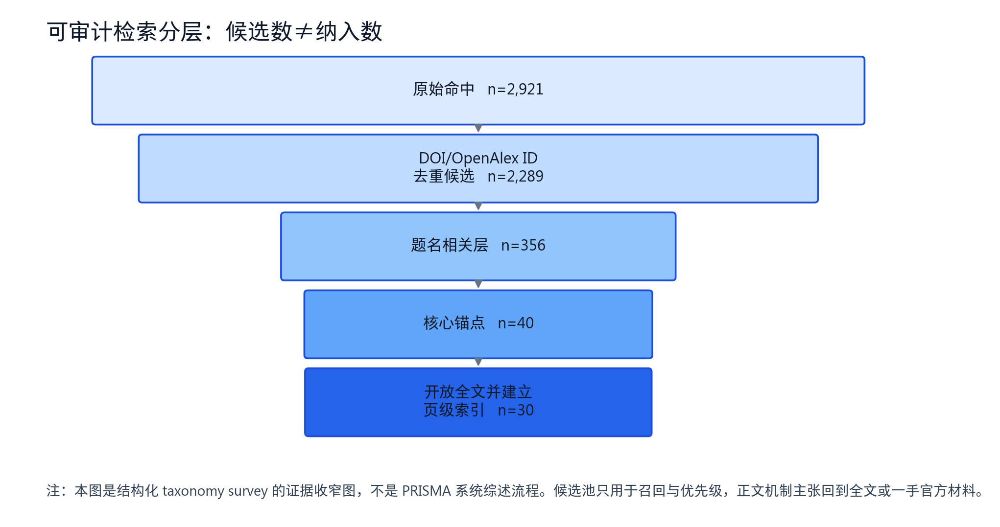
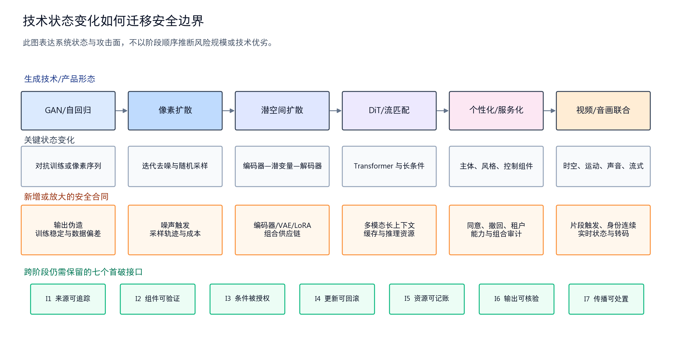
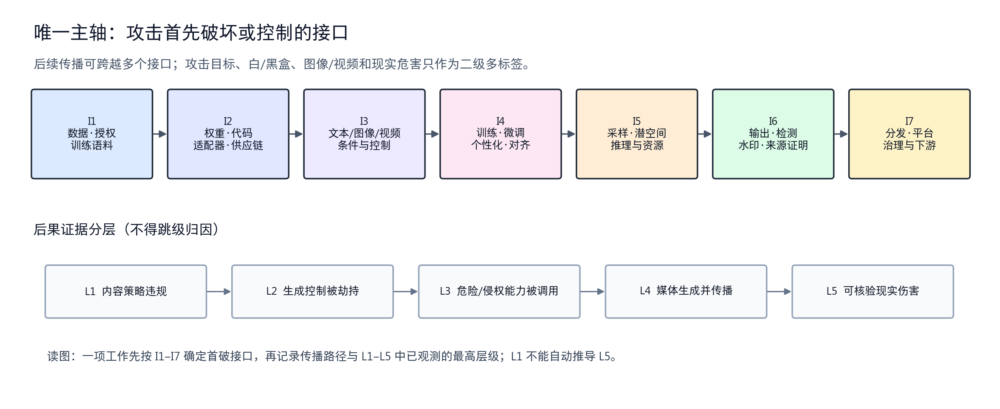
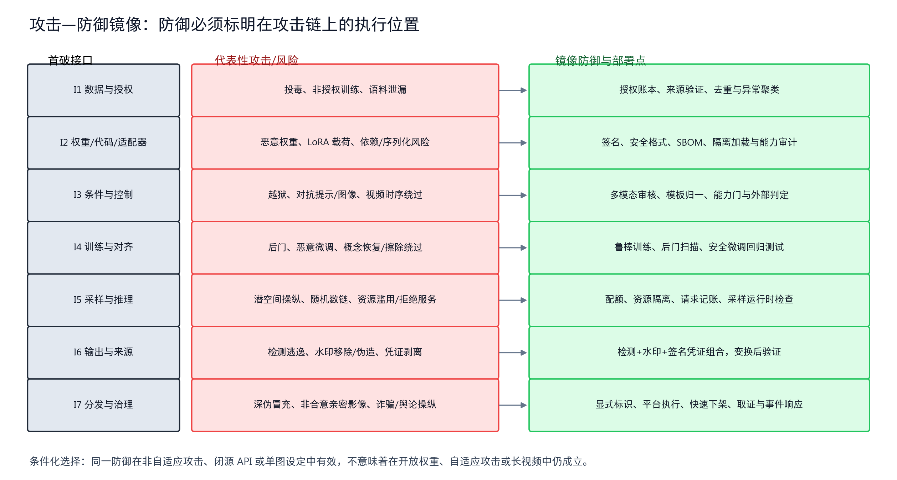
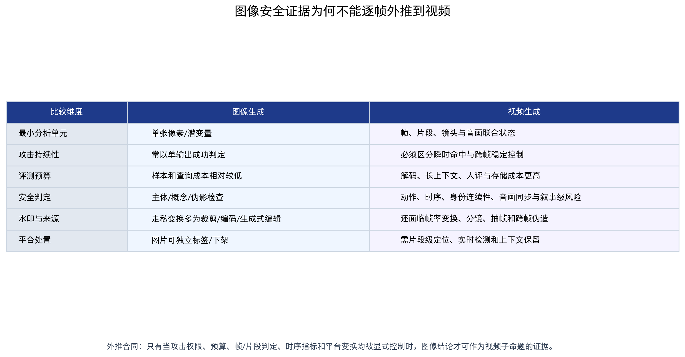
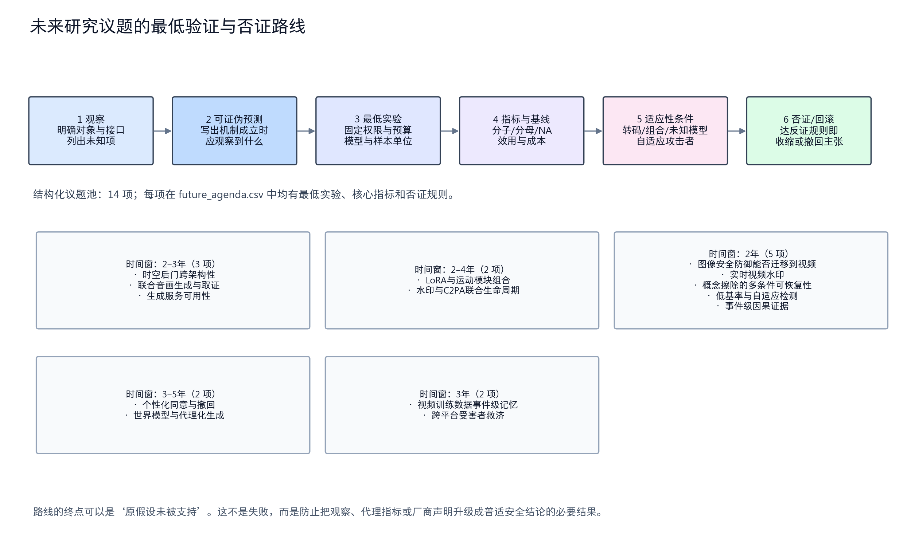
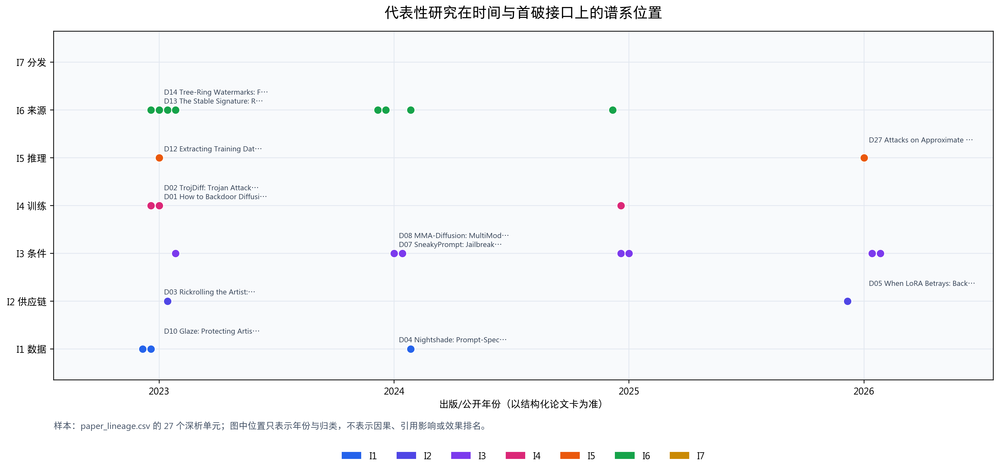
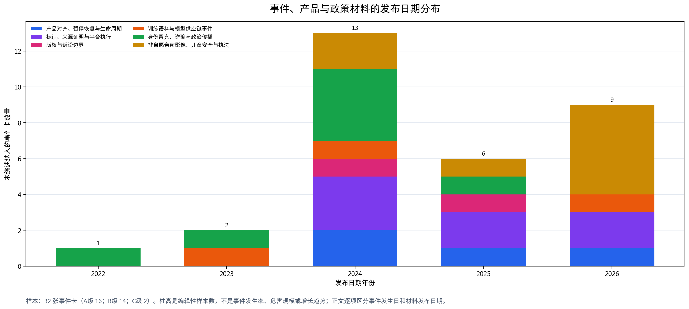
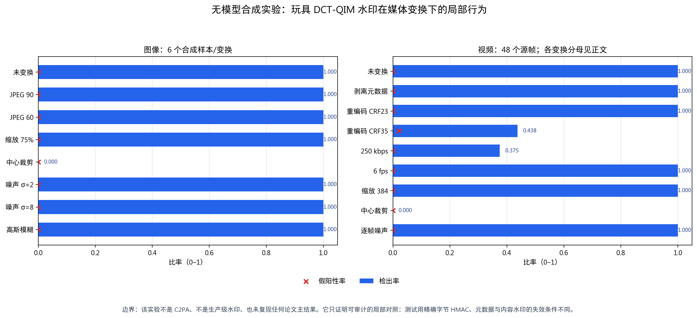

<!-- toc:start -->
## Contents

- [Image and Video Generation Security: An Evidence Review of First-Broken Interfaces and Defense in Depth](#image-and-video-generation-security-an-evidence-review-of-first-broken-interfaces-and-defense-in-depth)
  - [Abstract](#abstract)
  - [1. Introduction: Problem, Gap, Scope, and Research Questions](#1-introduction-problem-gap-scope-and-research-questions)
  - [2. Survey Method and Evidence Governance](#2-survey-method-and-evidence-governance)
  - [3. Technical System Boundaries and Threat Model](#3-technical-system-boundaries-and-threat-model)
  - [4. First-Broken Interface Classification, Evidence Map, and Comparison Contract](#4-first-broken-interface-classification-evidence-map-and-comparison-contract)
  - [5. Mirror-Evidence Synthesis for I1-I7: Attack Mechanisms and Earliest Interruption Control](#5-mirror-evidence-synthesis-for-i1-i7-attack-mechanisms-and-earliest-interruption-control)
  - [6. Cross-Interface Defense in Depth: Composition, Roots of Trust, and Failure Propagation](#6-cross-interface-defense-in-depth-composition-roots-of-trust-and-failure-propagation)
  - [7. Video Generation Special-Topic Synthesis: Time, Motion, Audio-Visual, and Streaming State](#7-video-generation-special-topic-synthesis-time-motion-audio-visual-and-streaming-state)
  - [8. Reality and Engineering Checks on Multi-Source Evidence](#8-reality-and-engineering-checks-on-multi-source-evidence)
  - [9. Discussion: Cross-Family Interpretation and Conditional Deployment Decisions](#9-discussion-cross-family-interpretation-and-conditional-deployment-decisions)
  - [10. Limitations, Ethics, Dual Use, and Author Responsibility](#10-limitations-ethics-dual-use-and-author-responsibility)
  - [11. A Falsifiable Research Agenda](#11-a-falsifiable-research-agenda)
  - [12. Conclusion](#12-conclusion)
  - [Appendix A. Unified In-Depth Analysis of 27 Papers and Page-Level Evidence Cards](#appendix-a-unified-in-depth-analysis-of-27-papers-and-page-level-evidence-cards)
  - [Appendix B. Datasets, Metrics, Complete Comparison Matrix, and Statistical Rejection Records](#appendix-b-datasets-metrics-complete-comparison-matrix-and-statistical-rejection-records)
  - [Appendix C. 32 event cards, news, and policy timeline](#appendix-c-32-event-cards-news-and-policy-timeline)
  - [Appendix D. Local experiments, static audit of seven repositories, and build receipts](#appendix-d-local-experiments-static-audit-of-seven-repositories-and-build-receipts)
  - [Data, Code, and Status Declarations](#data-code-and-status-declarations)
- [Appendix — Post-cutoff update (2026-08-09 → 2026-09-26)](#appendix--post-cutoff-update-2026-08-09-→-2026-09-26)
  - [A.1 — Follow-up to event card E010: the OpenAI–Hugging Face incident has entered an institutional phase](#a1--follow-up-to-event-card-e010-the-openaihugging-face-incident-has-entered-an-institutional-phase)
  - [A.2 — New deepfake and authenticity events since the cutoff](#a2--new-deepfake-and-authenticity-events-since-the-cutoff)
  - [A.3 — Provenance and standards movement since the cutoff](#a3--provenance-and-standards-movement-since-the-cutoff)
  - [A.4 — How to use this appendix](#a4--how-to-use-this-appendix)
<!-- toc:end -->
# Image and Video Generation Security: An Evidence Review of First-Broken Interfaces and Defense in Depth

## Abstract

<!-- new_id=A-ABS-001 origins=L00001 evidence=LF-R201-LF-R205 action=rewrite -->

Security in image and video generation runs through training corpora, model artifacts, conditioning inputs, training updates, inference services, output authenticity and platform distribution. A reader who looks only at the final output cannot tell the contract that failed first from the subsequent propagation and the real-world consequences. Within the current corpus, listing materials solely by attack name, content category or evidence source lets the same result conflate different privileges, control entry points and responsible parties. Such a list also makes it easy to mistake frame-level image evidence for a video-level conclusion. This survey treats that organizational mismatch as a survey design problem that needs to be addressed. It therefore examines the end-to-end lifecycle of image and video generation. Which security contract does an attacker break first? Which mirrored defenses and deployment judgments does the existing multi-source evidence support, and under which privileges, modalities and evaluation protocols? The survey works within the window from January 1, 2014, to August 9, 2026. Over that window it performs auditable multi-source retrieval, version deduplication and layered coding. It is a non-PRISMA taxonomy survey. It does not claim to be exhaustive, nor to constitute a strict systematic review. As of that time point, the evidence package contains 201 central source records and 174 deduplicated groups. It also holds 41 paper cards, 32 attack–defense chains, 27 unified paper deep dives and 32 event cards. Synthesis oriented to the current corpus yields the I1–I7 first-broken interfaces, the mirrored relation between attacks and the earliest interruption of control, and the boundaries of multi-source evidence. It also identifies time, motion, audio-visual identity and streaming state as video contracts that static image results cannot replace frame by frame. Units of study, endpoints, denominators, budgets, models and variances are incompatible, so the meta-analysis status is `NOT_RUN_MISSING_VARIANCE_AND_INDEPENDENCE`. The local experiments are only `PARTIAL_RUN`, the seven repositories are only `STATIC_AUDIT_ONLY`, and `end_to_end_runs=0`. This survey therefore proposes only defense-in-depth control combinations bound to deployment scenarios, trust roots and rejection conditions. It writes the open questions into a research agenda with minimum experiments, core metrics and falsification criteria.

<!-- new_id=A-ABS-002 origins=L00002 evidence=LF-R201;LF-R205 action=rewrite -->

**Keywords:** image generation; video generation; generative visual security; first-broken interface; defense in depth; backdoors and jailbreaking; watermarking and provenance attestation; platform governance

## 1. Introduction: Problem, Gap, Scope, and Research Questions

### 1.1 The End-to-End Security Problem of Generative Visual Systems

<!-- new_id=A-V2-01-001 origins=L00003;L00005 evidence=LF-A001-LF-A042;LF-D043-LF-D095;LF-R201 action=merge -->

Generative visual security is not a single-point problem of "prompt in—media out—moderator verdict." It is a set of security contracts that span the lifecycle. Training data should have traceable provenance and authorization. Models and dependent artifacts should be consistent with the declared identity and version. Text and multimodal conditions should express permitted intent. Training updates should maintain the agreed security properties. Inference services should protect tenants, caches and resources. Authenticity signals should be verifiable and should not overpromise. Downstream platforms must also turn identity, consent, labeling, reporting, appeals and redress into executable processes. When one contract fails first, it may propagate through the interfaces that follow. Similar media may therefore appear at the end. That does not mean the attack privileges, the evidentiary responsibilities or the repair locations are the same.

<!-- new_id=A-V2-01-002 origins=L00004 evidence=LF-A004;LF-A006-LF-A007;LF-A009;LF-A015 action=rewrite -->

The current corpus provides concrete anchors for this distinction. Nightshade places the first localizable failure at the entry of poisoned samples into the training corpus. Rickrolling the Artist places the contract-violating artifact in the text encoder. MMA-Diffusion examines the joint manipulation of text and image conditions. Training data extraction relies on generated queries and near-duplicate confirmation. WAVES places watermark attacks within adaptive evaluation under quality constraints [@P005] [@P003] [@P009] [@P024] [@P030]. These works can produce similar harmful, unauthorized or hard-to-attribute outputs. Each one, though, requires a different intervention: data governance for Nightshade, artifact verification for Rickrolling the Artist, condition control for MMA-Diffusion, query protection for training data extraction, and authenticity defenses for WAVES. This survey therefore codes the "first failed security contract" separately from propagation paths, output states and real-world consequences.

### 1.2 Existing Organizing Paradigms, Failure Mechanisms, and the Precise Gap

<!-- new_id=A-V2-01-003 origins=L00003-L00005;L00069 evidence=LF-A001-LF-A017;LF-R201 action=rewrite -->

This survey does not claim that existing research fails as a whole, and it does not reach that claim by presupposing the absence of an external survey comparison table. Instead it makes a checkable organizational judgment about the current evidence package. Suppose attack or consequence names such as "backdoor, jailbreaking, copyright, deepfake" serve as the sole main axis. Then a trigger word may originate in data poisoning, may activate a malicious adapter, or may itself constitute a conditioning payload. Suppose instead the chapters are divided by "paper, news, standard, code." Readers must then reconstruct the mechanism, the control and the real-world boundary themselves within the same attack chain. An arrangement of materials like that cannot stably answer the three deployment questions of "what privilege the attacker obtains earliest, which state changes first, and who is able to interrupt earliest."

<!-- new_id=A-V2-01-004 origins=L00006-L00007;L00014-L00015 evidence=LF-A019;LF-A021-LF-A022;LF-D053;LF-D081 action=merge -->

The second mismatch is one of modality and unit of evaluation. Copy image evidence frame by frame into video, and the copy loses event order, motion trajectories and continuous identity. It also loses audio-visual correspondence, the first reliable alert, and signal retention after platform transcoding. BadVideo's spatiotemporal objectives change the attack objective, while VideoSeal's temporal propagation and streaming path change the authenticity signal and T2VSafetyBench's video-level risk tasks change the object of evaluation [@P007] [@P033] [@P034]. This survey accordingly defines the precise gap as follows. The current corpus needs a synthesis framework that distinguishes first-broken interfaces, evidence layers and video units of evaluation at the same time. That framework must also connect attack evidence to the earliest executable control and its residual risk. This gap is the survey's design task, not an empirical ranking of all existing surveys.

### 1.3 Image–Video Objects, Scope, and Exclusion Boundaries

<!-- new_id=A-V2-01-005 origins=L00008 evidence=LF-A001-LF-A042;LF-R201 action=rewrite -->

The subject scope includes text-to-image, image-to-image, controlled editing, subject or style personalization, text-to-video, image-to-video and video editing, along with their service-based systems. Only work that explicitly addresses assets, attackers, access interfaces, observable consequences or mirrored defenses in the generation pipeline enters the core. Work on detection, forensics, watermarking or provenance attestation must target generated media, generator attribution, adaptive evasion or real distribution chains. Ordinary classifier adversarial examples with no interface relation to generative systems do not enter the subject. Neither does work that only improves quality without security assets and a threat model, nor summaries or reposts whose identity cannot be verified.

<!-- new_id=A-V2-01-006 origins=L00006-L00009 evidence=LF-A032;LF-D063 action=merge -->

For images, the usual unit of analysis is a piece of media plus its prompt, seed, model and safety checker. Video generation additionally requires frames, segments, shots, trajectories, character identity, temporal state and container processing to be recorded. Joint audio-visual or audio-track systems add sound, speakers and audio-visual synchronization. "Deepfake" is not an automatic inclusion label either. DeepfakeBench can support unified implementation and detection evaluation questions. Against unknown generators and in low-base-rate production traffic, however, it cannot demonstrate deployment effectiveness by itself. Adversarial detection and joint audio-visual detection serve only as bridging evidence for the I6 output/detection interface. They are not rewritten as attacks internal to generative models [@P035] [@P036] [@P037] [@P038]. This boundary keeps general visual security from expanding without limit into generative security. It also keeps identity, provenance and platform handling from being omitted by an analysis that looks only inside the model.

### 1.4 The Central Question, Four RQs, and the Limits of the Claim

<!-- new_id=A-V2-01-007 origins=L00012-L00013 evidence=LF-R201;LF-R205 action=merge -->

This survey's central question is this. In the end-to-end lifecycle of image and video generation systems, which security contracts do attackers break first? And which mirrored defenses and deployment decisions does the existing multi-source evidence support, under which privileges, modalities and evaluation protocols? Around this question, RQ1 asks how assets, subjects, attacker capabilities, first-broken interfaces and consequence evidence can be coded consistently. RQ2 asks which cross-study patterns appear in attack mechanisms, privileges, propagation, cost, benign utility and failure conditions across the seven interfaces. These two come first, because they establish checkable objects and a comparison contract. Only then does the survey take up the synthesis of attack evidence.

<!-- new_id=A-V2-01-008 origins=L00012-L00013;L00041-L00047 evidence=LF-R201;LF-R203-LF-R205 action=merge -->

RQ3 asks where mirrored controls can interrupt propagation earliest. It then asks about their trust root, benign utility, adaptive bypass and deployment cost. RQ4 asks what papers, code, system cards, standards, regulations, incidents and local experiments can each support in the way of real-world or engineering judgments. It also asks at which points the translation must stop. The answers hold only for the current evidence package as of August 9, 2026. This survey does not claim that the taxonomy is unique or complete. It does not estimate real-world incidence rates. It does not synthesize heterogeneous percentages into an overall effect. It does not assert a single best defense. And it refuses to treat vendor claims, the existence of code, local runs or static audits as production effectiveness or paper reproduction.

### 1.5 Contributions, Status Boundaries, and Reading Path

<!-- new_id=A-V2-01-009 origins=L00014-L00015 evidence=LF-A001-LF-A042;LF-D043-LF-D095;LF-R201 action=merge -->

The first contribution is to stratify the seven first-broken interfaces by attacker capabilities, modalities, objectives and consequence evidence. Concurrency, ambiguity and the unknown then stay explicit. The second makes "attack contract—mechanism evidence—earliest interruption control—benign utility and cost—adaptive bypass—residual propagation" the unit of synthesis. Attack inventories and defense inventories no longer sit side by side. The third establishes an image–video evidence contract. Segments, temporal order, motion, audio-visual, resources and transcoding are no longer replaced by frame-level results. The fourth distinguishes the translation limits of papers, code, system cards, standards, regulations, incidents and engineering materials. The fifth writes deployment recommendations as conditional combinations with rejection gates, and open questions as a falsifiable agenda.

<!-- new_id=A-V2-01-010 origins=L00016;L00032;L00046-L00049 evidence=LF-R201;LF-R203-LF-R205 action=merge -->

The current scientific status of the deliverables is `compiled-draft`. The survey design is non-PRISMA, and none of the 27 paper main protocols were run. Quantitative pooling was formally rejected. Local evidence remains `PARTIAL_RUN`, repository evidence remains `STATIC_AUDIT_ONLY`, and `end_to_end_runs=0`. Chapter 2 first gives evidence governance and rejection rules. Chapters 3–4 define system boundaries and the first-break taxonomy. Chapters 5–7 synthesize interface attack and defense together with irreducible video states. Chapter 8 examines real-world and engineering translation of multi-source evidence. Chapters 9–10 give the constrained answers and their limitations. Chapter 11 proposes a falsifiable agenda, and Chapter 12 closes the conclusions. Paper cards, the full metric matrix, event cards and engineering receipts go to the appendix, so that evidence cards do not replace the argument in the main text.

### 01.E1 Evidence expansion: Introduction: why generative visual safety requires an end-to-end attack–defense perspective

#### 01.E1.1 From "bad content" to a security contract

<!-- new_id=M-L00003 origins=L00003 evidence=LF-R201-LF-R205 action=move -->
The safety problem of image and video generation systems often gets reduced to content moderation. A user types a prompt, the model returns media, and a moderator judges whether that content violates policy. That description covers just one local interface in the generation pipeline. A real system also carries training data and licensing, pretrained weights and third-party components, personalization and fine-tuning, and conditional encoding and control modules. It carries sampling and caching, output watermarking and provenance credentials, platform upload and recommendation, identity verification, complaint-driven takedown, and real-world business authorization. The security contract can fail first at any layer, and risk can then travel onward to the layers that follow.

<!-- new_id=M-L00004 origins=L00004 evidence=LF-R201-LF-R205 action=move -->
For example, poisoned samples that enter the training set break data provenance and integrity first. Loading a malicious LoRA breaks the artifact and the supply chain first. An adversarial prompt that bypasses the safety filter breaks conditioning and control first. Training data extracted from model outputs breaks at the inference and privacy boundary. A removed watermark and a re-uploaded file put the first failure in output provenance or platform distribution. All of them may ultimately produce a "harmful image," yet each one calls for entirely different permissions, evidence and defenders. Classify them only by final content type, and the accountability interfaces among data owners, model developers, API providers, editing tools, distribution platforms and victims are flattened out.

<!-- new_id=M-L00005 origins=L00005 evidence=LF-R201-LF-R205 action=move -->
This survey therefore writes the safety problem as a chain of contracts. It asks whether provenance is authorized and remains intact, and whether artifacts come from trusted builds. It asks whether conditions express approved intent, and whether training updates preserve safety properties. It asks whether inference isolates tenants and resources, and whether outputs carry authenticity signals that are verifiable without overpromising. It asks whether platforms turn signals into timely and appealable remediation. To maintain one comparable main axis, each record must give one `primary_first_break`. Where several contracts fail at once, where the order cannot be told apart, or where the material is insufficient, the record carries `co_primary`, `ambiguous` or `unknown` instead. No false unique temporal order may be manufactured. Downstream propagation and real-world consequences are coded separately. This choice aligns attacks and defenses in mirror image. It also avoids writing "the media looks suspicious," "the detector gives a high score," "the platform has already taken it down," and "real-world harm has been verified" as the same conclusion.

#### 01.E1.2 Images and video are not a simple difference in sample count

<!-- new_id=M-L00006 origins=L00006 evidence=LF-R201-LF-R205 action=move -->
For image generation, the usual smallest unit of analysis is one image plus its prompt, seed, model and safety filter. For video generation, the unit additionally contains at least frames, clips, shots, motion trajectories, character identity, temporal state and container processing. Joint audio-visual or audio-track systems add sound, speakers and audio-visual synchronization. Dangerous semantics may be absent from every single frame. They may hold only in the order of actions, the combination of shots or the audio-visual correspondence. A watermark may show up in most frames yet be continuously missing from a key clip. An identity may hold steady frame by frame and yet drift across a long sequence. Platform transcoding, frame extraction, speed changes and splicing all change the detection denominator and the signal retention.

<!-- new_id=M-L00007 origins=L00007 evidence=LF-A019;LF-A021-LF-A022;LF-D053;LF-D081;LF-E114;LF-E116-LF-E117 action=move -->
A per-frame attack success rate therefore cannot automatically become a video-level attack success rate. A watermark hit on a single frame cannot automatically become clip-level provenance proof. Video evaluation has to answer several questions. Is the denominator source frames, decoded frames, clips, or complete videos? How many consecutive misses are allowed? When does the first alert occur? Do motion, lip movement, sound, and identity hold jointly? Do different transcoding and container processing change the results? Does real-time streaming require state recovery and a latency budget? This survey treats these requirements as cross-cutting contracts. It does not append "this can also be extended to video" to each image method. BadVideo extends backdoor objectives to spatiotemporal combinations. VideoSeal introduces temporal propagation and streaming processing. T2VSafetyBench shows that video safety itself requires a multidimensional task division. The three represent different changes in the attack, the provenance signal, and the object of evaluation, respectively [@P007] [@P033] [@P034].

#### 01.E1.3 Research objects and exclusion boundaries

<!-- new_id=M-L00008 origins=L00008 evidence=LF-R201-LF-R205 action=move -->
The research objects are text-to-image, image-to-image, subject/style personalization, controlled editing, text-to-video, image-to-video, and video editing, along with their service-based systems. A work can serve as core or bridging evidence when it explicitly deals with the assets, attackers, interfaces, observable consequences, or mirrored defenses of generative systems. The main body admits detection, forensics, watermarking, and provenance proof only when these explicitly target generated media, generator attribution, adaptive evasion, or the real distribution chain. Excluded are ordinary adversarial examples for image classifiers and general robustness work that has no interface relationship to the generation pipeline. Material offering only high-level opinions, without direct technical or institutional evidence, is excluded as well.

<!-- new_id=M-L00009 origins=L00009 evidence=LF-D063;LF-E187 action=move -->
"Deepfake" is likewise not an automatic inclusion label. Classical deepfake detection, audio-visual anomaly detection, and legal analysis can supply bridging evidence on output authenticity and real-world propagation. They do not necessarily study the internals of generative models. DeepfakeBench's unified implementation matters for detection evaluation. It still does not prove deployment effectiveness against unknown generators, or in low-base-rate production traffic [@P035]. Work on adversarial deepfakes shows that the detectors themselves can become targets of adaptive attacks [@P036]. Joint audio-visual detection work reveals evidence that video carries beyond static images, namely identity consistency [@P037] [@P038]. In this survey these works are positioned at the I6 output/detection interface. They are not rewritten as model training attacks.

#### 01.E1.4 Five levels of consequence: from policy violation to verifiable real-world harm

<!-- new_id=M-L00010 origins=L00010 evidence=LF-R201-LF-R205 action=move -->
This survey divides consequence evidence into five stages, or dimensions. L1 is a content policy violation, such as generating a topic that safety specifications prohibit. L2 is hijacking of generation control, where the attacker makes the system deviate from the intended conditions or safety policy. L3 is the actual invocation of a dangerous, infringing, or unauthorized capability. L4 is media successfully generated and entering the propagation chain. L5 is verifiable real-world harm. The levels are not a general severity ranking. No risk has to pass through L1–L5 in order. Privacy extraction and resource denial of service can fall directly on other safety properties. An event may also carry `NA`, multiple labels, or an unknown item. A level indicates only the position actually observed by a given evidence chain. It does not mean that every event necessarily follows the same escalation path.

<!-- new_id=M-L00011 origins=L00011 evidence=LF-E134;LF-E156 action=move -->
This division is especially important for incident analysis. When officials clarify that a piece of media is fake, that proves only that the media and an official response exist. It does not necessarily disclose the generator, the actors, or the loss. A detector's judgment that content is AI-generated is likewise not a final determination of identity, intent, or legal liability. The opposite case is the Hong Kong government's written reply on a pre-recorded deepfake video-conference scam. That reply documented impersonation, a failure of organizational authorization, and a transfer loss of about two hundred million Hong Kong dollars. Such evidence can reach L5, yet the reply still did not disclose the specific generative model [@O048] [@O049]. Early legal analysis of Deep Fakes pointed to several categories of harm, among them privacy, democracy, security, and the "liar's dividend". That work also showed that harm does not come only from a forgery being believed. Genuine evidence that is easily denied may also cause harm [@P041]. This survey therefore keeps model capability, media authenticity, platform propagation, and real-world harm apart. It does not compress them into a single binary label.

#### 01.E1.5 Eight research questions

<!-- new_id=M-L00012 origins=L00012 evidence=LF-R201-LF-R205 action=move -->
This survey answers eight questions in turn. First, how can the assets, trust boundaries, attacker permissions, and consequences of image and video generation systems be expressed in a unified way? Second, which interface in the attack chain fails first, and how are boundary cases determined? Third, how do the attack families differ in knowledge, access, budget, persistence, transfer, and failure conditions? Fourth, where are mirrored defenses enforced, which trust roots do they depend on, and what safety–utility–cost trade-offs do they produce? Fifth, do datasets, metrics, baselines, video denominators, and attack budgets allow comparison across papers? Sixth, how do papers, code, system cards, standards, and real-world incidents form an evidence chain that does not mix layers? Seventh, which local conditions allow one to verify, and what do static audit and a non-running state each mean? Eighth, what falsifiable questions can real-time video, composite supply chains, personalized identity, provenance proof, and regulatory enforcement raise?

<!-- new_id=M-L00013 origins=L00013 evidence=LF-R201-LF-R205 action=move -->
The eight questions close in a fixed order: "define the object — establish the main axis — unfold the attacks — mirror the defenses — audit the evidence — interpret reality — validate the boundaries — propose the agenda." This survey is not chasing an unconditionally safest model. It sets out composite controls instead, under explicit assets, permissions, modalities, resources, and remediation responsibilities.

#### 01.E1.6 Contributions and reading route

<!-- new_id=M-L00014 origins=L00014 evidence=LF-R201-LF-R205 action=move -->
The first contribution is the first-broken interface taxonomy. Seven consecutive interfaces cover data, supply chain, conditions, training, inference, output, and distribution. Attack objectives, media modality, degree of white-box access, safety properties, and real-world consequences are demoted to secondary labels. The second contribution is attack–defense mirroring. Every defense must name the position in the attack chain where it is enforced. Reports must set benign utility, adaptive attacks, and failure handling alongside the attack effect. The third contribution is the image–video evidence contract. Video requires clip, temporal, motion, audio-visual, resource, and platform-transcoding metrics. Frame duplication cannot substitute for them.

<!-- new_id=M-L00015 origins=L00015 evidence=LF-R201-LF-R205 action=move -->
The fourth contribution is multi-source evidence stratification. Academic papers answer mechanism and experiment, official code answers engineering entry points and versions, and system cards answer the deployer's risk claims. Standards answer interoperability and trust contracts, regulations answer liability obligations, and incident material answers real-world chains. Local experiments and static audits form an independent layer. They do not masquerade as paper reproduction. The fifth contribution is conditional deployment and a future agenda. Each recommendation connects to the failure evidence that precedes it. It also gives a minimum validation design and falsification conditions.

<!-- new_id=M-L00016 origins=L00016 evidence=LF-R201-LF-R205 action=move -->
The full text is divided into five parts. The first gives the technical context, method, threat model, and taxonomy design. The second analyzes attacks interface by interface and devotes a separate special section to video. The third unfolds defenses interface by interface. The fourth audits representative papers, metrics, incidents, and local experiments. The fifth turns evidence into deployment decisions, a future agenda, limitations, and conclusions.

## 2. Survey Method and Evidence Governance

### 2.1 Article Types, Time Window, and Status Semantics

<!-- new_id=A-V2-02-001 origins=L00032;L00036 evidence=LF-R201-LF-R202 action=merge -->

This survey is a taxonomy survey / evidence review with auditable scoping retrieval. Its search window runs from January 1, 2014 to August 9, 2026. Earlier material counts as bridging evidence only where current generative-media methods depend on it explicitly. Queries, versions, full texts, paper cards, event cards, and evidence levels are all retained. Missing are native complete database exports, independent dual-reviewer full-text screening, item-by-item full-text exclusion, and formal bias tools. The design is therefore clearly non-PRISMA. It cannot claim to exhaust all of the literature. Nor can it claim to have completed a strict systematic review.

<!-- new_id=A-V2-02-002 origins=L00032-L00033;L00041;L00524 evidence=LF-R201;LF-R203-LF-R204 action=merge -->

Status words in this survey describe how far execution has progressed. They do not label material as high or low quality. `NOT_ATTEMPTED` indicates that the main protocol was not run. `STATIC_AUDIT_ONLY` indicates read-only code, configuration, and artifact contracts. `PARTIAL_RUN` indicates that only harmless local subproblems were run. `compiled-draft` only indicates that the manuscript and build chain can form the current draft. Accordingly, "code is accessible," "configuration is locatable," "a local program returned results," and "the paper's main protocol is complete" are four distinct propositions. No lower status may be upgraded through language polishing.

### 2.2 Data Sources, Queries, and Retrieval Channels

<!-- new_id=A-V2-02-003 origins=L00034-L00035 evidence=LF-R201-LF-R202 action=merge -->

Retrieval runs along four evidence streams in parallel. The academic stream spans poisoning, backdoors, jailbreaking, privacy, extraction, availability, detection, watermarking, provenance, and deepfakes in image and video generation. The code and product stream covers official repositories, model cards, system cards, weights, and safety releases. The standards and policy stream tracks provenance specifications, labeling regimes, transparency obligations, platform liability, and victim remedies. The incident stream gathers fraud, identity impersonation, political communication, non-consensual intimate imagery, risks to minors, copyright disputes, product changes, and platform responses. The four streams serve different questions. Papers, announcements, and reports cannot simply be summed into one "study count."

<!-- new_id=A-V2-02-004 origins=L00036-L00038 evidence=LF-R202 action=merge -->

The academic discovery layer retains 16 groups of OpenAlex queries. The raw return was 2,921 records. After deduplication by DOI or OpenAlex ID, that became 2,289 records, and a title-relevance gate yielded 356 priority candidates. A separate broad candidate table, verified against publishers, author pages, official institutions, and official repositories, contains 161 sources. These numbers stand for query recall, identity deduplication, title priority, and verification entry points, respectively. None of them equals the final inclusion count. The source table used in the long-form expansion stage binds nothing but body citations, locations, levels, and verification dates. Its versions and evidence roles overlap with the central 201 source records. The two are therefore not added together.

### 2.3 Inclusion, Exclusion, Versions, and Deduplication

<!-- new_id=A-V2-02-005 origins=L00039 evidence=LF-R201-LF-R202 action=rewrite -->

For core inclusion, the material must spell out the attacker, asset, entry point, objective, observable consequences, or defenses of a generative system. Alternatively, it must directly provide relevant data, metrics, code, standards, and incident evidence. Bridging studies carry an extra obligation: they must explain how they transfer to generative-media interfaces. Excluded are generic classifier robustness unrelated to generative pipelines; general quality improvements without security assets and threat models; and routine forensics that reports only detection scores without addressing generator or provenance contracts. Search summaries and reposts whose identity cannot be verified are excluded too, as is material that makes strong effect claims while lacking configuration, data, or decision procedures.

<!-- new_id=A-V2-02-006 origins=L00035;L00040 evidence=LF-R202 action=merge -->

Deduplication is by study identity rather than file count. The formally published version usually takes precedence over the preprint, and version drift is retained. A paper, a project page, and a repository are different evidence roles of the same study. They are not counted repeatedly as multiple studies. Standards are recorded independently by version number. Regulatory text, subsequent guidance, and press announcements stay separate objects even when their topics are similar. For one incident, official responses, platform announcements, and media cross-checks form the source relations of that incident. They do not add new incidents. Where identity or version cannot be determined, the record keeps conflicts and unknown fields. Similar titles are not used to adjudicate silently.

### 2.4 Screening, Data Extraction, and Coding

<!-- new_id=A-V2-02-007 origins=L00041-L00042 evidence=LF-R202-LF-R203 action=merge -->

Paper cards capture title, authors, year, publication identity, modality, first-broken interface, secondary tags, threat model, and attack or defense mechanism. They also capture author-reported results, models and data, metrics, code, full-text locations, failure conditions, reproduction status, and evidence level. Event cards separate the incident date from the document publication date. They record jurisdiction, actors, media modality, confirmed or alleged status, attack chain, first-broken interface, consequences, official response, disputes, and unknown items. Null values are distinguished as not reported, inaccessible, not applicable, and not yet verified. This avoids the mistake of writing missing as nonexistent.

<!-- new_id=A-V2-02-008 origins=L00043;L00062 evidence=LF-A001-LF-A042;LF-R201 action=merge -->

First-broken coding begins with the attacker's existing permissions, the earliest changed system state, and the security property violated first. It then records the attack input, operational location, high-level objective, direct output, propagation interface, consequence evidence, benign utility, and failure conditions. `primary_first_break` is filled in only when mechanism, timing, and permission evidence suffice to order the sequence. Inseparable simultaneous failures are written as `co_primary`, competing explanations that cannot be adjudicated as `ambiguous`, and insufficient key information as `unknown`. Video records go further and include frame count, duration, shots, trajectories, audio-visual state, streaming latency, and the encoding chain.

### 2.5 Evidence Levels, Claim Language, and Attribution

<!-- new_id=A-V2-02-009 origins=L00033;L00044 evidence=LF-R201-LF-R202 action=merge -->

Evidence levels govern source roles and the language available. Level A covers publisher full texts, formal specifications, statutory provisions, raw data, and official judicial or law-enforcement records. Level B takes in authors' complete manuscripts, official code, model or system cards, and technical material subject to publisher interest constraints. Level C applies to incident material that lacks first-hand case files but is cross-checked by multiple high-credibility media outlets. A level does not automatically equal research-method quality. That quality still needs separate auditing of threat model, budget, baselines, versions, randomness, adaptive attacks, benign utility, failure cases, and code and data availability.

<!-- new_id=A-V2-02-010 origins=L00045;L00063 evidence=LF-R201;LF-R203-LF-R204 action=merge -->

The body text matches each actor's verb to the strength of the evidence. A paper "reports under the specified protocol", and a system card is "stated by the vendor". A regulation "provides", and an incident document "records". A local experiment is "observed under this project's configuration". Cross-source relations are always written as "this survey synthesizes, infers, or suggests". A specific number enters a result sentence only with a full-text location. Percentages without a common study unit, denominator, and variance are not averaged. Vendor self-assessments are not written as third-party field validation, and the entry points and configuration of official code are not written as the main protocol having been run.

### 2.6 Comparability Gate, Statistical Refusal, and Missing-Data Handling

<!-- new_id=A-V2-02-011 origins=L00046-L00047;L00448-L00451 evidence=LF-E188-LF-E192;LF-R205 action=merge -->

Before anything enters a comparison, the estimation target is fixed first. Requests, service responses, valid responses, judgeable responses, images, frames, clips, full videos, identities, and incidents cannot share one denominator. ASR, FID/KID, FVD, CLIP similarity, ROC-AUC, watermark bit accuracy, resource cost, and real-world harm are not one endpoint either, and none of them can be converted into another. FID/KID and FVD are essentially set-level quality metrics. ROC-AUC likewise does not give precision directly in low-base-rate deployments [@R-M001] [@R-M002] [@R-M003] [@R-M004] [@R-M005]. When `valid_responses=0`, generation quality and ASR are recorded as `NA`. Zero valid responses cannot be written as 0% success, and refusal samples may not be silently removed from the denominator.

<!-- new_id=A-V2-02-012 origins=L00046-L00047;L00468-L00470 evidence=LF-E188-LF-E192;LF-R205 action=merge -->

This survey's comparability gate requires that model and service versions, data, attack permissions and budget, generation and judging protocols, valid denominators, benign utility, adaptive settings, and uncertainty be alignable at once. Existing cross-paper material lacks common study units, valid denominators, independence, and variance. Quantitative synthesis therefore carries the formal status `NOT_RUN_MISSING_VARIANCE_AND_INDEPENDENCE`. That status is a methodological result, not an omission. The body text permits only within-paper comparisons under the original protocol and restricted cross-paper synthesis of mechanisms. It produces no forest plots, no I², no unified ASR rankings, and no composite safety scores. Work missing key fields serves only as a case with limitations.

### 2.7 Reproduction Enumeration, Audit Materials, and Update Rules

<!-- new_id=A-V2-02-013 origins=L00524;L00041 evidence=LF-R203-LF-R204 action=merge -->

Reproduction uses a six-state enumeration. `NOT_ATTEMPTED` means not run. `STATIC_AUDIT_ONLY` covers read-only code and configuration. `ENVIRONMENT_PROBE` verifies the environment or entry point. `PARTIAL_RUN` runs harmless local subproblems. `CONTROLLED_END_TO_END` completes the main protocol on authorized data and isolated models. `EXTERNAL_SERVICE_VALIDATION` additionally requires service authorization, exact versions, and request receipts. A separate field, `paper_main_protocol_run`, marks whether the paper's main configuration was executed. Currently all 41 paper cards are `NOT_ATTEMPTED`. The seven repositories are `STATIC_AUDIT_ONLY`, and the local synthetic-media experiments are `PARTIAL_RUN`, with `paper_main_protocol_run=false` and `end_to_end_runs=0`.

<!-- new_id=A-V2-02-014 origins=L00048-L00049;L00526-L00527 evidence=LF-R201-LF-R205 action=merge -->

The audit path retains raw query returns, priority results, the source registry, download manifests, full texts and page-level indexes, paper cards, event cards, attack-defense matrices, repository commits, experiment configurations and logs, chart scripts, build receipts, and SHA-256 hashes. Each artifact can attest only to its own contract. A file that exists was not necessarily run. Time-sensitive facts are frozen as of August 9, 2026. Product system cards, platform policies, standards, regulatory applicability, and litigation status must be re-searched before formal submission. An update appends versions and access dates and re-runs citation, number, and status verification. It does not seamlessly overwrite old evidence with a new page.

### 02.E1 Evidence Expansion: Retrieval, Screening, Coding, and Evidence Map

#### 02.E1.1 Paper Types and Limits of the Claim

<!-- new_id=M-L00032 origins=L00032 evidence=LF-R201-LF-R205 action=move -->
This survey is a taxonomy survey, and its scoping retrieval is auditable. It uses explicit queries, version deduplication, core full texts, paper cards, event cards, and evidence levels. It does not yet satisfy the native complete database export, dual-reviewer full-text screening, item-by-item full-text exclusion, and formal bias tools that a strict systematic review requires. The search results therefore describe coverage under the sources and rules actually executed. They cannot claim to exhaust all research. The unit of analysis is a "paper–method–model/data–threat configuration"; standards, system cards, incidents, and local experiments belong to independent evidence layers. In counting, they are not merged with paper experiments.

<!-- new_id=M-L00033 origins=L00033 evidence=LF-R201-LF-R205 action=move -->
The limits of the claim are specified separately for each evidence type. Publisher full texts and authors' complete manuscripts can support the mechanisms, settings, results, and limitations they explicitly report. Official code can support the interfaces, configuration, dependencies, and licenses of the current commit. System cards can support the risks and mitigations that the publisher self-reports. Formal standards and regulations can support the normative contracts and obligations in their text. Official incident documents can support the behaviors and results explicitly recorded in them. Media material can support only the reported facts and their unknown items. New cross-source judgments are marked as this survey's synthesis. They cannot be disguised as the original words of any source.

#### 02.E1.2 Four Evidence Streams

<!-- new_id=M-L00034 origins=L00034 evidence=LF-R201-LF-R205 action=move -->
Retrieval runs along four parallel evidence streams. The academic stream covers image/video generation, poisoning, backdoors, jailbreaking, privacy, extraction, usability, detection, watermarking, provenance, and deepfakes. The code and product stream covers official repositories, model cards, system cards, weights, and security releases. The standards and policy stream covers C2PA, content credentials, labeling measures, the AI Act, platform liability, and victim redress. The incident stream covers fraud, identity misuse, election propagation, non-consensual intimate imagery, risks to minors, copyright disputes, product safety releases, and platform responses.

<!-- new_id=M-L00035 origins=L00035 evidence=LF-R201-LF-R205 action=move -->
The four streams cannot simply be added together. One paper may carry a formal version, a preprint, a project page, and a repository at the same time. One incident may carry an official reply, platform announcements, and multiple reports. The central table retains access entrances, but it forms canonical source groups through DOI, canonical title, URL, and manual adjudication. Version relations and incident source relations are stored explicitly. Readers can then count by research identity and still return to specific access entrances.

#### 02.E1.3 Queries, Time Window, and Recomputable Counts

<!-- new_id=M-L00036 origins=L00036 evidence=LF-R201-LF-R205 action=move -->
The time window runs from January 1, 2014 to August 9, 2026. Earlier watermarking, forensics, and privacy work serves as bridging evidence only where current generative media methods explicitly depend on it. OpenAlex academic recall used 16 reproducible query sets. These returned 2,921 raw hits, and deduplication by DOI/OpenAlex ID cut that to 2,289. The canonical-title relevance gate then retained 356 priority candidates. A separate broad candidate table, verified through publishers, author pages, official institutions, and official repositories, contains 161 sources. These are different narrowing layers. The 2,921 are query returns, the 2,289 are identity deduplication, the 356 are title priority, and the 161 are multi-source verification entrances. None of them equals the final systematic review inclusion count. The recomputable counts live in `data/openalex/manifest.json`, `data/openalex/prioritized_candidates.csv`, and `research/agent_search_news/candidate_sources.csv`.

<!-- new_id=M-L00037 origins=L00037 evidence=LF-R201-LF-R205 action=move -->
The central source registry holds 201 records and 174 deduplicated groups. Of these, 40 are core anchors, 57 are incident evidence entrances, and 104 remain broad candidates. Among the core anchors, 30 papers have local full text stored with a page-level text index. There are 11 official targets in total, and 9 have local snapshots stored. The Sora 2024 system card is retained as web verification and a failure record because of HTTP 403. The Hong Kong LCQ9 page is retained the same way because of a remote disconnection. Download failures were not rewritten as the source not existing, and secondary materials were not silently substituted for them.

<!-- new_id=M-L00038 origins=L00038 evidence=LF-R201-LF-R205 action=move -->
The long-form expansion stage also established independent `sources.csv` tables along the three lines of attacks, defenses, and papers/incidents. These bind the citation keys added to the new text to precise locations, evidence grades, and verification dates. They overlap with the central registry in paper versions, official pages, and evidence roles, so they serve only as a "long-form citation entry table". They are not added to the 201 central records to form a so-called total inclusion count. How many citations the final text actually uses is governed by `paper/references.bib` and the citation closure verification. Deduplication of research identity is still judged by the central canonical groups and the stable URL/version information of each reinforcement table.

#### 02.E1.4 Inclusion, Exclusion, and Version Rules

<!-- new_id=M-L00039 origins=L00039 evidence=LF-R201-LF-R205 action=move -->
Core inclusion requires that a work explicitly specify the attacker, asset, entrance, target, consequence, or defense of a generative system. It may instead supply directly relevant data, metrics, code, standards, and incident evidence. Bridging research must state how it migrates to generative media interfaces. Excluded are adversarial examples that study only ordinary classifiers and have no connection to the generative pipeline. Also excluded are general quality improvements without security assets and a threat model. Conventional forensics that reports only detection scores, without discussing generators, adaptive attacks, or provenance contracts, does not qualify. So do search summaries and reprints whose identity cannot be verified, and work that makes strong effect claims without configuration, data, or a decision procedure.

<!-- new_id=M-L00040 origins=L00040 evidence=LF-R201-LF-R205 action=move -->
A formally published version takes precedence over a preprint, but version drift is retained. Papers, repositories, and project pages are different evidence roles of the same research. Duplication does not turn them into three "studies". Standards are recorded independently by version number. The body of a regulation and later guidance, interpretations, or press announcements cannot be deduplicated into the same object merely because they share a topic. Central QA once found that the body of the EU AI Act and the 2026 Article 50 guidance announcement had been merged incorrectly. They were finally split into two canonical groups, each bound to matching snapshots. This correction shows that sharing a topic does not make two items the same bibliographic identity.

#### 02.E1.5 Paper Cards, event cards, and First-Broken Interface Coding

<!-- new_id=M-L00041 origins=L00041 evidence=LF-R201-LF-R205 action=move -->
A paper card holds title, authors, year, venue, modality, first-broken interface, secondary tags, threat model, attack/defense mechanism, author-reported evidence, model and data, metrics, code, full-text location, failure conditions, reproduction status, and evidence grade. Blank values read not reported, inaccessible, not applicable, or not yet verified. An empty cell never implies "none". The current 41 core paper cards cover all seven interfaces, and every one has a reproduction status of NOT_ATTEMPTED. This means the survey did not run the main experiments of these papers; it does not mean the methods have no code or cannot be run.

<!-- new_id=M-L00042 origins=L00042 evidence=LF-R201-LF-R205 action=move -->
Event cards separate the incident occurrence date from the document publication date. They record jurisdiction, organization, system or model, media modality, affected groups, confirmed/alleged status, attack chain, first-broken interface, observable outcomes, real-world harm, official response, legal standard, disputes, evidence grade, and unknowns. All 32 event cards have source relations. They are not a random sample, so they cannot be used to infer incidence rates, annual trends, or risk differences across jurisdictions.

<!-- new_id=M-L00043 origins=L00043 evidence=LF-R201-LF-R205 action=move -->
The first-broken interface is "the position in the attack chain where the first security contract fails". If a malicious developer controls the training process directly, the training interface is the first-broken point. If the same weights enter the system through third-party hosting disguised as a benign artifact, the first-broken point of the victim deployment is the supply chain. A legitimate model may be invoked to generate an impersonation video while the service itself did not run in violation. In that case the first-broken point may lie in identity consent, publication, or payment authorization rather than inside the model. Each record also retains the propagation interface and the five layers of consequences, so a single label does not lose the attack chain.

#### 02.E1.6 Evidence Grades, Quality, and Claim Language

<!-- new_id=M-L00044 origins=L00044 evidence=LF-R201-LF-R205 action=move -->
Evidence grade A covers publisher full text, formal specifications, legal statutes, raw data, and official judicial/law enforcement records. Grade B covers authors' complete manuscripts, official code, model/system cards, and technical materials with publisher interest restrictions. Grade C is used for materials that lack a first-hand case file but have been cross-checked by multiple highly credible media outlets. The grade describes the source role. It is not automatically equivalent to the methodological quality of a paper. Paper quality is audited separately, across threat model, attack budget, baselines, data and model versions, randomness, adaptive attacks, benign utility, failure cases, and code and data availability.

<!-- new_id=M-L00045 origins=L00045 evidence=LF-R201-LF-R205 action=move -->
The main text uses four kinds of language. Results that a source reports explicitly are written as "the authors report under a certain protocol". Cross-study organization is written as "this survey synthesizes/suggests". Local experiments are written as "observed under this project's toy configuration". Recommendations and mechanism explanations are written as "this survey infers/recommends", and each comes with alternative explanations or falsification conditions. A specific number without a full-text location does not enter the main text. Percentages without independent studies and variance are not averaged.

#### 02.E1.7 Quantitative Comparability and the Formal Statistical Refusal

<!-- new_id=M-L00046 origins=L00046 evidence=LF-R201-LF-R205 action=move -->
The endpoints differ: attack success rate, FID, FVD, CLIP similarity, AUC, EER, watermark bit accuracy, human preference, resource cost, and real-world harm. All of them can be expressed as percentages, but the denominator may be prompts, generated samples, frames, clips, videos, identities, users, requests, or incidents. Model version, safety filter, budget, judge, video length, resolution, and failure handling add further heterogeneity. For the same comparable endpoint, most work supplies no independent study clusters, valid denominators, or variance. The formal status is therefore `NOT_RUN_MISSING_VARIANCE_AND_INDEPENDENCE`.

<!-- new_id=M-L00047 origins=L00047 evidence=LF-R201-LF-R205 action=move -->
The survey's statistical refusal is not a lack of analysis. It is the result of analysis. The existing evidence permits only single-paper results under original protocols and cross-paper qualitative synthesis of mechanisms. This survey will not rank each paper's best ASR into an attack-strength leaderboard. Nor will it convert detection AUC and watermark accuracy into a composite security score. If a shared contract on generators, data, attack budgets, sampling units, benign utility and uncertainty is formed in the future, statistical pooling can be reassessed within a preregistered subset.

#### 02.E1.8 Reviewable Materials and Timeliness Boundary

<!-- new_id=M-L00048 origins=L00048 evidence=LF-R201-LF-R205 action=move -->
The Ditse directory stores the complete queries, raw OpenAlex returns, priority results, download lists, PDFs, extracted text, the page-level keyword index, paper cards, event cards, the attack-defense matrix, repository snapshots, experiment configurations, logs, chart scripts, LaTeX and hashes. The central CSV and JSON undergo field-level synchronization checks. Local source files are rechecked by SHA-256.

<!-- new_id=M-L00049 origins=L00049 evidence=LF-R201-LF-R205 action=move -->
Timeliness facts are current as of August 9, 2026. Product system cards, platform policies, standard versions, regulatory applicability and litigation status may change. An updated retrieval must be performed before formal submission. This survey treats the access date and the object version as part of the evidence contract. A claim that "the current page states" something cannot be written as a permanent product capability.

<!-- new_id=M-L00051 origins=L00051 evidence=LF-R201-LF-R205 action=move -->

**Table: Retrieval and evidence hierarchy**

<!-- new_id=M-L00052 origins=L00052 evidence=LF-R201-LF-R205 action=move -->
| Evidence layer | Object | Local count | Verification unit | Limits of interpretation |
|---|---|---|---|---|
| Discovery layer | OpenAlex raw hits | 2921 | automated query logs | used only for recall, cannot be regarded as inclusion |
| Candidate layer | OpenAlex deduplicated candidates | 2289 | DOI, OpenAlex ID | title relevance still requires full-text screening |
| Central evidence layer | multi-source canonical records | 201 | 174 deduplicated groups | source version and evidence grade retained |
| Paper parsing layer | structured paper cards | 41 | full-text location and limitations | reproduction status all recorded independently |
| Incident layer | news and policy event cards | 32 | first-hand announcements preferred | sample size is not an incidence rate |
| Engineering layer | public repository static audit | 7 | entrance, dependencies, weight contract | end to end runs=0 |

<!-- new_id=M-L00053 origins=L00053 evidence=LF-R201-LF-R205 action=move -->
Note: the data source is `paper/tables/evidence_counts.csv`. The main text displays 6/6 rows and omits overly long cells. The complete fields and records are governed by that CSV.

## 3. Technical System Boundaries and Threat Model

### 3.1 From Generative Architecture to Security State

<!-- new_id=A-V2-03-001 origins=L00017-L00018 evidence=LF-A001-LF-A002;LF-D051-LF-D052 action=merge -->

Security architecture moved from the GAN-style one-shot mapping to the iterative denoising of diffusion models. The security object expanded with it, from final pixels to conditional embeddings, noise schedules, step-by-step denoising trajectories, guidance strength and the decoding process. BadDiffusion and TrojDiff respectively show that trigger behavior can enter the training or reverse diffusion process [@P001] [@P002]. Clean utility, trigger specificity and attack targets must still be evaluated separately. The change supports nothing more than "intermediate states enter the threat model", not the inference of risk scale from an architecture name. Nor does it license the automatic conclusion that a model is broken because its design generates sensitive content.

<!-- new_id=A-V2-03-002 origins=L00019-L00022 evidence=LF-A004;LF-A010;LF-A012;LF-A028;LF-D045;LF-D065 action=merge -->

Latent space and componentization make artifacts of the text encoder, the denoising backbone, the VAE, ControlNet and LoRA, each of which can be distributed or replaced independently. Rickrolling the Artist shows why inspecting the main denoising network alone cannot uncover a replaced text encoder [@P003]. Stable Signature shows that the decoder can also become the rooting position of a provenance signal [@P028]. Anti-DreamBooth and MasqLoRA further place authority on individual training images and on independent adapters respectively [@P020] [@P006]. The same modular mechanism may provide control points. It may also expand the supply chain and the personalization boundary. Verifying component identity therefore cannot replace behavioral differencing of the composition.

<!-- new_id=A-V2-03-003 origins=L00020;L00023-L00024 evidence=LF-A033 action=merge -->

Service-based generation also pulls the request queue, approximate caching, intermediate latents, super-resolution or frame interpolation, safety review, transcoding, storage and the CDN into the system state. Research on approximate caching provides conditional evidence of latency side channels, prompt recovery and cache poisoning. That evidence cannot be extrapolated to the claim that all services are vulnerable [@P039]. Resolution, frame count, sampling steps, candidate count and retries change GPU time and billing. First-hand generation-specific DoS evidence strong enough to establish a broad mechanism conclusion is lacking, however. This survey therefore treats caching as an I5 risk that has gained a mechanistic foothold. It keeps resource exhaustion as an evidence gap that has been retrieved but not yet closed.

### 3.2 System Boundary, Assets, and Responsible Actors

<!-- new_id=A-V2-03-004 origins=L00054-L00055 evidence=LF-A001-LF-A042;LF-D043-LF-D095;LF-R201 action=merge -->

The system boundary opens when training data enters. From there it passes through cleaning and annotation, base training and safety alignment, distribution of weights and code, adapter composition, multimodal conditioning inputs, sampling and output review, watermarking or provenance credentials, and export and transcoding. It extends to accounts, recommendation, reporting, monetization and judicial handling. This yields seven classes of protectable assets: data provenance and authorization; weights, code and dependency artifacts; text, image, video, audio, mask, depth and trajectory conditioning; training objectives, updates, erasure and personalization processes; randomness, caches, tenants, queues and resources; detection, watermarking, signatures and attribution; and identity, consent, publication, appeals and remedies. The boundary is neither truncated at the model API nor generalized to an unauditable "entire internet."

<!-- new_id=A-V2-03-005 origins=L00056-L00057 evidence=LF-A038;LF-D061 action=merge -->

The responsible actors include at least data subjects and rights holders, collection and annotation teams, base model and safety alignment teams, model repository and plugin authors, personalization services, cloud inference operators, editing tools, distribution platforms, credential issuers and verifiers, review teams, victims, the media, and regulatory and judicial actors. A control must state, at the same time, the actor that executes it, the signal it observes, and the authority to act after failure. C2PA illustrates the point. It can machine-check claims, signatures, content binding and validation status, yet it still roots trust in signer identity and claims. Cryptographic validity supports only "who signed what and whether it has been tampered with," not automatic proof that a real-world statement is true [@O001]. Likewise, a generation probability score cannot replace identity, consent, context and propagation evidence.

### 3.3 Attacker Capability, Access, and Budget

<!-- new_id=A-V2-03-006 origins=L00058 evidence=LF-A001-LF-A042;LF-R201 action=rewrite -->

This survey records attacker capability with the five-tuple (A=(K,X,B,T,C)). (K) is knowledge, from black-box product behavior to gray-box intermediate states to weights and gradients. (X) is access: publishing samples or artifacts, submitting conditioning, launching personalization, calling detectors, and using the platform for distribution and monetization. (B) records query counts, training compute, storage bandwidth and monetary cost together. (T) distinguishes a single input, multi-round queries, waiting for a training cycle, supply chain dormancy and continuous re-uploading. (C) distinguishes a single account, multiple accounts, multi-component publishers and cross-platform coordination. The five fields jointly determine whether an attack can be compared with another study. They cannot be replaced by the single label "white-box/black-box."

<!-- new_id=A-V2-03-007 origins=L00059 evidence=LF-A006-LF-A007;LF-A009 action=rewrite -->

A capability contract also prevents methods sharing a name from being mistaken for the same threat. White-box joint condition manipulation in MMA-Diffusion must be listed separately from its black-box transfer evaluation [@P009]. In training data extraction, both the query budget and what the attacker knows about the candidate training corpus change feasibility [@P024]. Data poisoning can avoid touching the weights and manifest only later, through the next round of crawling and training [@P005]. Every effect statement must therefore bind the model and data, the attacker's existing privileges, budget, duration, coordination mode and failure handling at the same time. When these fields are missing, this survey retains the mechanism case but refuses to rank attack strength.

### 3.4 Consequence Evidence Dimensions and Causal Chain

<!-- new_id=A-V2-03-008 origins=L00010;L00060-L00061 evidence=LF-A042 action=merge -->

Consequences use five independently fillable evidence dimensions. L1 is content policy violation, and L2 is generation control hijacking. L3 is dangerous, infringing or unauthorized capability being invoked. L4 is media generated and entering the propagation chain. L5 is verifiable real-world harm to an individual, an institution or the public. They are not a severity ladder, and they do not require sequential escalation. Anomalies in parameters, latents, caches or keys are recorded separately as system state. Privacy extraction and resource denial of service may write `NA` for the inapplicable dimensions. Each dimension separately records evidence available, no evidence, not applicable, or unknown. The whole causal chain cannot be compressed into a "highest level."

<!-- new_id=A-V2-03-009 origins=L00011;L00061 evidence=LF-A042;LF-E096-LF-E187 action=merge -->

This separation stops in-model effects, propagation and real-world harm from masquerading as one another. A training backdoor experiment can support the control hijacking observed under its protocol. It cannot automatically entail platform propagation. An official clarification can confirm the media and the response, yet it does not necessarily disclose the generator, the actors or the losses. The Hong Kong government's written reply on a scam involving a pre-recorded deepfake video conference documented impersonation, failure of organizational authorization and a transfer loss of about HK$200 million. That evidence can support L5 for that incident, but the specific model remains unknown [@O048] [@O049]. The privacy, democracy and "liar's dividend" concerns raised in early legal analyses are harm-mechanism frameworks, not incidence estimates [@P041]. Likewise, the TAKE IT DOWN Act stipulates notification and removal obligations. The statute itself does not prove that any incident has occurred or that governance has been effective [@O014].

### 3.5 Time, Motion, Audio-Visual, and Streaming States Added by Video

<!-- new_id=A-V2-03-010 origins=L00006;L00025 evidence=LF-A018-LF-A023;LF-A031-LF-A036 action=merge -->

Video is not an expansion of the number of image samples. It introduces at least five groups of irreducible state. The first group is event order and persistent identity over time. The second is spatiotemporally coupled motion and trajectories. The third is the joint identity of sound, speaker, lip movement and semantics. The fourth is cross-frame memory and caching. The fifth covers the windows, first alert, throughput and state recovery of live or interactive generation. Platform frame sampling, speed changes, splicing, transcoding and container processing also change the observable denominator and authenticity signals. A video threat contract must therefore bind model version, clip length, frame rate, shot, audio track, budget and aggregation rules. A "single frame pass/fail" cannot summarize an entire piece of media.

<!-- new_id=A-V2-03-011 origins=L00007;L00026 evidence=LF-A019;LF-A021-LF-A022;LF-A035 action=merge -->

Existing anchors demonstrate different added contracts. T2VSafetyBench requires dividing video safety tasks around actual frame sequences [@P034]. BadVideo extends the backdoor objective to spatiotemporal composition [@P007]. Two Frames Matter shows that the intermediate completion trajectory can still form the target event even when the start and end conditions pass individually [@LN05]. VideoSeal brings watermark propagation and streaming processing into its implementation [@P033]. What this evidence supports is that "the unit of evaluation must expand", not that all image attacks already hold in video systems. Without event-level, trajectory-level, audio-visual-level or streaming protocols, claims are at most limited to the frames or clips actually extracted and measured.

### 03.E1 Evidence expansion: technical and safety lineage: from GAN to video foundation models

#### 03.E1.1 From a single mapping to iterative denoising: why diffusion models rewrote the attack surface

<!-- new_id=M-L00017 origins=L00017 evidence=LF-A001-LF-A002;LF-D051-LF-D052;LF-E096-LF-E097 action=move -->
The generation chain of the GAN era can be roughly understood as a single forward mapping from latent variables to pixels. Its main states are the data distribution, generator weights, the discriminator and output filtering. Diffusion models unfold this chain into dozens or even more sampling steps. Each step consumes conditional embeddings, the noise schedule, the denoising network output and guidance strength. The change is not merely an improvement in image quality. It adds intermediate states that can be manipulated, cached, reused and audited. Backdoors can be encoded into the reverse diffusion process. Detection or watermark signals can be implanted in the initial noise or in the decoder. Service availability is jointly determined by the number of sampling steps, resolution, batch size and concurrency policy. BadDiffusion and TrojDiff approach this from training backdoors and from the Trojan diffusion process respectively. Both show that the security object of a diffusion model cannot be written only as the "final image," but must include the entire reverse trajectory, clean utility and trigger specificity [@P001] [@P002].

<!-- new_id=M-L00018 origins=L00018 evidence=LF-A001-LF-A042 action=move -->
In the safety lineage, one structural change comes first: "the generated result is harmful" and "the generation system has been broken" begin to separate clearly. A model may generate sensitive images by product design while bypassing no technical control. Its first-broken point may then lie in downstream consent and platform governance, not in the sampler. Conversely, an image that looks harmless already constitutes an integrity failure if it comes from a replaced text encoder, a malicious LoRA or poisoned data. The rest of this survey therefore does not use "harmful content" as its sole classification axis. It tracks the interface at which a safety property first fails.

#### 03.E1.2 Latent space, DiT, flow matching, and autoregressive generation: added state rather than a simple replacement

<!-- new_id=M-L00019 origins=L00019 evidence=LF-A004;LF-A012;LF-D065;LF-E099;LF-E107 action=move -->
Latent space diffusion compresses high-resolution pixels into VAE latent representations. That turns the text encoder, the denoising backbone and the VAE decoder into components that can be distributed independently. The engineering split brings an I2 supply chain risk. A user may verify the main model hash, and yet a different text encoder, VAE, ControlNet or LoRA may still be loaded. Rickrolling the Artist places the attack in the text encoder. It shows that "the main denoising network is unchanged" cannot imply that the overall behavior is unchanged [@P003]. Stable Signature approaches from the defensive direction. It shows that the decoder itself can also become a rooting position for provenance signals [@P028]. Componentization provides both safety control points and attack surface, and that only becomes visible when the two are placed in the same technical lineage.

<!-- new_id=M-L00020 origins=L00020 evidence=LF-A001-LF-A042 action=move -->
DiT and flow matching carry the generation backbone further toward large Transformers and continuous velocity fields. For security, the key is not a change of name but a change in state scale and scheduling. Longer token sequences, joint image-text and audio-visual attention, model parallelism, intermediate caching and end-to-end compilation all bear on tenant isolation, side channels and resource fairness. Autoregressive visual generation instead writes frames, patches or multimodal tokens into an explicit context. That brings cache leakage, cost amplification on long sequences, and state contamination. This survey therefore does not use any single generation architecture as its attack classification. The same architecture can break first at any interface among data, artifacts, conditioning, training, serving, output, or downstream.

#### 03.E1.3 Personalization, composable adapters, and open weights: the privilege boundary moves downward

<!-- new_id=M-L00021 origins=L00021 evidence=LF-A010;LF-D045;LF-E105 action=move -->
DreamBooth, textual inversion, LoRA, and subject-driven generation devolve the training privileges once held by model developers onto platform users, plugin authors, and secondary distributors. The security contract changes with them. It shifts from "does this base model pass an audit" to "who can personalize for whom, which data are used, which parameter artifact was output, whether the artifact can be transferred, and which versions should be invalidated after consent is withdrawn." Anti-DreamBooth shows that data subjects can raise the cost of unauthorized personalization through pre-training image protection. Yet the boundaries it reports also show that this is not a permanent revocation mechanism [@P020]. They concern cross-model behaviour, clean-image leakage, and preprocessing.

<!-- new_id=M-L00022 origins=L00022 evidence=LF-A028;LF-E123 action=move -->
LoRA goes further and turns fine-tuning parameters into small artifacts that can be downloaded independently. MasqLoRA's threat model shows that malicious behavior can live in an independent adapter. The base model's own signature and hash remain entirely normal [@P006]. For video generation, spatial LoRAs, motion modules, camera trajectory control, audio generation modules, and inference acceleration plugins multiply the problem. Backdoor evidence now exists for image LoRAs. As of 2026-08-09, however, it is not yet sufficient to claim that "malicious motion modules have already been systematically demonstrated empirically on mainstream video generation chains." A reasonable statement is this. Composable modules constitute a high-priority supply chain gap. Defenders need behavioral differencing of the composition. Image conclusions, however, must not be written as video attack facts.

#### 03.E1.4 Servitization and approximate caching: how performance optimization becomes a security state

<!-- new_id=M-L00023 origins=L00023 evidence=LF-A033;LF-E198 action=move -->
Commercial image and video generation is often a distributed service chain. Requests enter a queue. The chain then invokes condition parsing, multi-stage sampling, super-resolution or frame interpolation, safety review, transcoding, storage, and a CDN. To reduce repeated computation, a system may approximately cache prompt embeddings, intermediate latents, or final outputs. Attacks on Approximate Caches names this kind of performance optimization as a condition for cross-tenant timing side channels, prompt recovery, and cache poisoning [@P039]. Its evidence cannot be extrapolated to all generation services being vulnerable. It is sufficient, however, to refute the implicit assumption that "caching is merely a performance implementation and does not belong to the threat model."

<!-- new_id=M-L00024 origins=L00024 evidence=LF-A001-LF-A042 action=move -->
Servitization also elevates availability and cost security to independent assets. Generation requests do not cost the same. GPU time and the bill can move with resolution, frame count, duration, sampling steps, candidate count, retries, safety re-review, and export specification. However, this targeted search turned up no first-hand empirical work on image/video generation. Nothing it found would suffice for a broad mechanistic conclusion about DoS. The following text therefore treats resource exhaustion as a searched open gap in I5. It does not fill that gap in with LLM or general cloud DDoS literature.

#### 03.E1.5 Video foundation models: irreducible differences of time, motion, audio-visual coupling, and real-time behavior

<!-- new_id=M-L00025 origins=L00025 evidence=LF-A001-LF-A042 action=move -->
Video generation is not running the same image generator independently on every frame. Modern video models hold objects, identities, and shots consistent over time with temporal attention, spatiotemporal convolution, temporal Transformers, inter-frame flow, or joint spatiotemporal tokens. These mechanisms introduce six classes of security states that do not exist, or do not exist completely, in images: (1) identity persisting across frames; (2) action and physical causal order; (3) camera trajectory and shot composition; (4) cross-frame latency or cumulative payload; (5) joint consistency of lip movement, speaker, semantics, and ambient sound; and (6) alert latency and retraction window in live and interactive generation.

<!-- new_id=M-L00026 origins=L00026 evidence=LF-A019;LF-A022;LF-A035;LF-D053;LF-E114;LF-E117 action=move -->
T2VSafetyBench separates temporal risk from static harmful categories. It requires safety judgment to target the actual video frame sequence [@P034]. BadVideo further shows that a training backdoor's goals can be expressed through spatiotemporal composition and dynamic elements. A set of frames that each look harmless individually therefore cannot support the inference that the whole clip is safe [@P007]. Two Frames Matter pushes this logic to boundary frames and intermediate completion. The start condition and the end condition may each pass filtering on their own. The trajectory the model generates between them is the actual object of risk [@LN05]. Together these results constitute the basic video principle of this survey. Without event-level, trajectory-level, audio-visual-level, and streaming evaluation, research can at most claim that it is "effective on the extracted frames."

<!-- new_id=M-L00028 origins=L00028 evidence=LF-A001-LF-A042 action=move -->

<!-- new_id=M-L00029 origins=L00029 evidence=LF-A001-LF-A042 action=move -->
**Table: Technology families, state changes, and newly added attack surfaces**

<!-- new_id=M-L00030 origins=L00030 evidence=LF-A001-LF-A042 action=move -->
| Technology family | State change | Newly added security surface | Key interfaces | Evidence boundary |
|---|---|---|---|---|
| GANs and early autoregression | Explicit generator, discriminator, or pixel sequence | Training instability, mode coverage, forgery detection | Training data, weights, outputs | Cannot be extrapolated to diffusion sampling and video temporal behavior |
| Pixel-space diffusion | Iterative denoising and stochastic sampling | Noise triggers, sampling trajectory, cost amplification | Training, conditioning, sampling | Conclusions are constrained by the sampler and the budget |
| Latent-space diffusion | Encoder—latent space—decoder modularization | Text encoder, VAE, and adapters become supply chain interfaces | Weights, code, conditioning, outputs | Component identity does not equal the safety of the composed behavior |
| DiT and flow matching | Transformerization and longer conditioning context | Long prompts, multimodal control, compute and cache state | Conditioning, training, inference | Architectural changes alter attack transferability |
| Personalization and composable adaptation | LoRA, ControlNet, subject and style fine-tuning | Consent, malicious artifacts, composition triggers, difficulty of retraction | Data, supply chain, training, distribution | Auditing a single component cannot cover a loaded composition |
| Joint video and audio-visual generation | Joint frame—clip—shot—audio-visual state | Temporal triggers, identity continuity, real-time state, transcoding retention | All seven interfaces are affected | Frame-by-frame image evidence cannot be directly extrapolated |

<!-- new_id=M-L00031 origins=L00031 evidence=LF-A001-LF-A042 action=move -->
Note: the data source is `paper/tables/technology_security.csv`. The main text displays 6/6 rows and omits overly long cells. The complete fields and records are governed by that CSV.

### 03.E2 Evidence expansion: system boundary, assets, actors, and threat model

#### 03.E2.1 End-to-end system boundary and seven classes of protectable assets

<!-- new_id=M-L00054 origins=L00054 evidence=LF-A001-LF-A042 action=move -->
The boundary of a generative visual system begins with the entry of training data. It then passes through data cleaning and annotation, base training, safety alignment, distribution of parameter and code artifacts, adapter composition, text/image/audio conditioning inputs, sampling and safety review, watermarking and provenance credentials, export and transcoding, and finally the chain of accounts, recommendation, reporting, monetization, and judicial handling. Draw the boundary only up to the model API, and it would miss upstream corpora and downstream real-world harm at the same time. Expanding the boundary to "the entire internet" would make attacker privileges unverifiable. This survey therefore delimits the boundary with seven consecutive but distinguishable security contracts.

<!-- new_id=M-L00055 origins=L00055 evidence=LF-A001-LF-A042 action=move -->
The seven classes of assets correspond one-to-one with the later interfaces. The first is data provenance, authorization, annotation completeness, and individual privacy. The second is the artifact integrity of weights, code, encoders, VAE, LoRA, motion modules, and dependencies. The third is the permission semantics of text, reference image, video, audio, mask, depth, and trajectory conditioning. The fourth is the process integrity of training objectives, parameter updates, erasure/unlearning, and personalization. The fifth is sampling randomness, tenant isolation, cache confidentiality, query privacy, queue fairness, and service availability. The sixth is the integrity of output detection, watermarking, fingerprinting, signatures, provenance claims, and attribution. The seventh is accounts, identity, consent, publication, and recommendation. It also covers appeals, victim remedy, and the rights and interests of real-world subjects.

#### 03.E2.2 Actors and responsibility: who commits to what, and who can observe failure

<!-- new_id=M-L00056 origins=L00056 evidence=LF-A001-LF-A042 action=move -->
Security actors include at least data subjects and rights holders, data collection and annotation teams, base model developers, safety alignment teams, model repository and plugin authors, personalization services, cloud inference operators, editing tools, distribution platforms, provenance credential issuers and verifiers, content review teams, victims, media organizations, and regulatory and judicial actors. A control with no executing actor is only a recommendation. A failure with no observable party cannot enter incident response.

<!-- new_id=M-L00057 origins=L00057 evidence=LF-A038;LF-D061;LF-D077;LF-E126 action=move -->
The C2PA specification, for example, defines claims, signatures, content binding, ingredient relationships, and validation status as machine-checkable provenance signals. Its trust, though, is still rooted in signer identity and claims [@O001]. A verifier can therefore confirm that "a certain claim was signed by a certain key at a certain time and has not been tampered with." Cryptographic validity alone, however, cannot confirm that "the claim is true about the real world." A platform detector behaves the same way. It can output a score for "generation probability." Impersonation, non-consensual content, copyright infringement, and political deception, however, require identity, consent, context, and propagation evidence.

#### 03.E2.3 The five-tuple of attacker capability: knowledge, access, budget, persistence, and coordination

<!-- new_id=M-L00058 origins=L00058 evidence=LF-A001-LF-A042 action=move -->
This survey records attacker capability with the five-tuple (A=(K,X,B,T,C)). (K) is knowledge. It ranges from a black box that knows only product behavior, through a gray box that knows intermediate embeddings and the safety classifier, to a white box that holds weights, gradients, data, and code. (X) is access, and it covers placing samples on public web pages, uploading artifacts to model repositories, submitting conditioning to an API, launching personalization tasks, calling detectors, and using the platform for publication and monetization. (B) is budget. It should record query counts, training GPU time, storage/bandwidth, and monetary cost together. (T) is persistence, which distinguishes a single input, multi-round queries, waiting for the next training cycle, long-term supply chain dormancy, and continuous re-uploading. (C) is coordination, which distinguishes a single account, multiple accounts, multi-component publishers, and cross-platform networks.

<!-- new_id=M-L00059 origins=L00059 evidence=LF-A006-LF-A007;LF-A009;LF-D043;LF-D058;LF-E101-LF-E102;LF-E104 action=move -->
The same method under different capability assumptions is not the same attack. White-box joint condition manipulation and black-box transfer evaluation in MMA-Diffusion must be listed separately [@P009]. In training data extraction, a high query budget and knowledge of the candidate training corpus change feasibility [@P024]. Data poisoning needs no access to model weights. It can still propagate over the long term, through the next round of data scraping and training [@P005]. If an evaluation does not report these five fields, "attack success" has no comparable meaning.

#### 03.E2.4 Attack objectives and five classes of evidence stages or consequence dimensions

<!-- new_id=M-L00060 origins=L00060 evidence=LF-A001-LF-A042 action=move -->
An attack objective can be expressed as a violation of confidentiality, integrity, availability, authorization, authenticity, or accountability. A technical objective, though, is not a real-world consequence. This survey follows the introduction's five consequence dimensions. They can carry multiple labels, and they can be recorded as not applicable or evidence unknown. L1 is content policy violation. L2 is generation control hijacked. L3 is dangerous, infringing, or unauthorized capability actually invoked. L4 is media successfully generated and entering the propagation chain. L5 is verifiable real-world harm to an individual, an institution, or the public. Anomalies in parameters, latents, caches, or keys count as technical evidence. Such evidence is recorded separately in the "system state change" field, and it is not forced into the consequence dimensions.

<!-- new_id=M-L00061 origins=L00061 evidence=LF-A042;LF-E133 action=move -->
L1—L5 are not a severity ladder. A later layer does not have to be inferred automatically from an earlier one. A training backdoor paper may support L2/L3 without real propagation L4 or real-world harm L5. A platform incident may confirm L4/L5, while its model internal state and generator remain `unknown`. Privacy extraction and resource denial of service, for instance, can record `NA` for the inapplicable dimensions. Each risk is then reported separately under the confidentiality or availability contract. Every dimension should be filled in independently as "evidence available, no evidence, not applicable, or unknown." The whole evidence chain must not be summarized by the largest number. When a paper shows harmful video on a custom judge, that supports at most the L1—L3 its protocol actually observed. Without platform exposure and real-world outcomes, it cannot be rewritten as "has caused a certain type of social harm." Regulations stipulate notification and removal processes. Those processes support only the institutional obligations themselves, and they cannot conversely prove that any of the L1—L5 event consequences has occurred. The TAKE IT DOWN Act brings digital forgeries into the notification and removal framework for non-consensual intimate visual content. The statute, though, provides no estimate of incidence or enforcement effect [@O014].

#### 03.E2.5 Unified Threat Contract and Limits of the Claim

<!-- new_id=M-L00062 origins=L00062 evidence=LF-A001-LF-A042 action=move -->
No attack enters this survey's comparison table until twelve fields are filled in. These are `primary_first_break` and its classification status, the protected asset, the attacker's five-element capability, the attack input, the locus of operation, the high-level objective function, the system state change, the direct output, cross-interface propagation, the evidence status for each of the L1–L5 dimensions, and the benign utility and failure conditions. Record `co_primary` when two interfaces are broken first at the same time under the existing mechanistic evidence. Record `ambiguous` when several viable interpretations exist but their order cannot be adjudicated. Record `unknown` when the full text does not contain enough information to identify the first-broken point. Video entries must also record frame count, clip duration, shot, trajectory, audio–visual state, streaming latency and encoding chain.

<!-- new_id=M-L00063 origins=L00063 evidence=LF-A039;LF-E130 action=move -->
The evidence type sets the limits of the claim. For a full-text experiment by the authors, the permitted wording is “the study reports under the stated models, data, and budget”. For an official system card, it is “the vendor states deployment or evaluation”. “Verified on-site by a third party” is not permitted. The Sora 2 system card reports prompt, video frame, audio transcript and scene description review, and it also reports C2PA, visible dynamic watermarking and identity consent controls. This survey treats that card as product design evidence, not as retention-rate evidence across all platforms [@R-A035]. This subtask likewise ran no attack code, so it does not use the result category “we reproduced”.

<!-- new_id=M-L00065 origins=L00065 evidence=LF-A001-LF-A042 action=move -->

<!-- new_id=M-L00066 origins=L00066 evidence=LF-A001-LF-A042 action=move -->
**Table: Assets, Attack Actors, Privileges, and Consequences**

<!-- new_id=M-L00067 origins=L00067 evidence=LF-A001-LF-A042 action=move -->
| Asset/Boundary | Attack actor | Privilege scope | Primary objective | Possible consequence |
|---|---|---|---|---|
| Training corpus and licensing | Data publishers, collectors, training operators | Publish a few samples up to controlling the corpus pipeline | Poisoning, unauthorized training, memorization | Data contamination, privacy, rights harm |
| Model weights and code | Artifact publishers, repository maintainers, dependency attackers | Publish components to obtaining build privileges | Backdoors, code execution, compositional hijacking | Integrity, availability, downstream propagation |
| Text and multimodal conditioning | Ordinary users, gray-box integrators | Black-box queries to uploading control signals | Jailbreaking, authorization bypass, objective manipulation | Policy violation, identity misuse |
| Training and personalization jobs | Data contributors, fine-tuners, insiders | Influence batches, the objective function, or adapters | Backdoors, malicious fine-tuning, concept recovery | Failure of capability boundaries |
| Inference resources and tenant state | API users, multi-account attackers, neighboring tenants | Requests, concurrency, session and cache observation | Cost amplification, state leakage, denial of service | Availability, privacy, billing |
| Outputs and authenticity evidence | Editors, watermark evaders, credential holders | Transcoding and editing up to compromise of signing keys | Detection evasion, watermark removal, forgery | Attribution confusion, false negatives, false positives |

<!-- new_id=M-L00068 origins=L00068 evidence=LF-A001-LF-A042 action=move -->
Note: the data source is `paper/tables/threat_model.csv`. The main text shows 6/8 rows and omits overlong cells. That CSV is authoritative for the complete fields and records.

## 4. First-Broken Interface Classification, Evidence Map, and Comparison Contract

### 4.1 Why the First-Broken Interface Is Chosen as the Main Axis

<!-- new_id=A-V2-04-001 origins=L00069-L00070 evidence=LF-A001-LF-A042;LF-R201 action=merge -->

Attack objectives, trigger forms, knowledge, modalities and consequences all recur along one attack chain. A trigger word may be an inference switch left behind by poisoned data. It may be the activation condition of a malicious adapter. Or it may itself serve directly as a jailbreak payload. “Deepfakes”, in turn, may arise from unauthorized data, malicious artifacts, conditional privilege escalation, personalization, detection evasion or downstream misuse. Taking these names as the only primary classes would conflate the attacker's prior privileges with the earliest executable control. The first-broken interface approach asks a different question: when does the security state first change from satisfying the contract to not satisfying it? Objective, modality, knowledge and consequence then become secondary fields.

<!-- new_id=A-V2-04-002 origins=L00070;L00075-L00076 evidence=LF-A004;LF-A009-LF-A011 action=merge -->

This main axis preserves causal order, and it does not mistake an implementation technique for an interface. Nightshade manifests at inference time through a concept prompt, but the mechanistic evidence places poisoned samples entering training earlier, so its candidate first-broken interface is I1. The trigger in Rickrolling also appears in the prompt, yet the artifact that breaches the contract is the text encoder, so its candidate first-broken interface is I2 [@P005] [@P003]. Glaze, Anti-DreamBooth, PhotoGuard, I2VGuard and Anti-I2V all exploit perturbations, yet they protect different contracts, among them data, personalization and conditioning [@P019] [@P020] [@P018] [@R-A025] [@R-A026]. This survey claims only that this main axis yields a traceable encoding of the current corpus. It does not claim that the axis is the only classification, or a complete one.

### 4.2 Decision Tree, Concurrency, Ambiguity, and Unknowns

<!-- new_id=A-V2-04-003 origins=L00071-L00072 evidence=LF-A001-LF-A042;LF-R201 action=merge -->

The decision tree asks four questions, in order. What privilege does the attacker hold legitimately at the earliest point? What is the first system state that is changed, and that mechanism or observation can support? Which explicit security property does that change violate first? And are the full text, the threat model and the positioning enough to order them? When the attacker is the trainer by definition, “access to the training code” is not a breach. When the system generates media by design and the risk begins with impersonation or payment authorization, a model jailbreak must not be fabricated either. The decision first yields candidate interfaces. A candidate is upgraded to `primary_first_break` only once the mechanism, privilege and timing evidence closes.

<!-- new_id=A-V2-04-004 origins=L00062;L00070;L00076-L00078 evidence=LF-R201;LF-R203 action=merge -->

The encoding permits four states. Record one `primary_first_break` when the evidence supports it. Record `co_primary` when the same indivisible operation breaches several contracts at once. Record `ambiguous` when multiple interpretations are all viable but cannot be ordered. Record `unknown` when a key precondition is missing. `co_primary` states a concurrency fact, while `ambiguous` states that the evidence cannot adjudicate. The two are not interchangeable. The coverage audit checks the adjudication after titles are hidden. It also checks that attack and defense use the same rules, that images and video do not switch main axes, and whether the control entry points can be mapped back. This project, however, has no two-person independent re-encoding and no agreement statistics, so “reviewable” cannot be written as verified coder agreement or overall stability.

### 4.3 I1-I7 Security Contracts and Control Entry Points

<!-- new_id=A-V2-04-005 origins=L00073;L00080 evidence=LF-A004-LF-A006;LF-A008-LF-A011 action=merge -->

The I1 data, authorization and corpus contract requires provenance, licensing, labeling and privacy boundaries to be traceable. Its earliest control entry points are pre-training ledgers, deduplication, anomalous clusters, quarantine and withdrawal. The I2 weights, code and compositional supply chain contract requires loaded artifacts to be consistent with their name, version, signature, dependency and audit status. Its entry points include content-addressed hashes, signatures, SBOMs, safe serialization, allowlists, sandboxes and compositional behavior diffing. The I3 text and multimodal conditioning contract requires inputs not to cross policy, privilege and control semantics. Its entry points include normalization, semantic-level moderation, capability gates, query association, in-generation steering and output review. The first covers the upstream corpus, the second executable artifacts, the third invocation conditions. They must not be merged merely because they share the appearance of a “trigger”.

<!-- new_id=A-V2-04-006 origins=L00074;L00080 evidence=LF-A001-LF-A003;LF-A007;LF-A028;LF-A033 action=merge -->

The I4 training, fine-tuning and personalization contract requires the trainer, the objective function, parameter updates, erasure and the personalization process to be auditable. Trusted updates, checkpoint diffing, retention/erasure dual sets, rollback and consent records are candidate entry points. The I5 sampling, privacy, caching and resource contract protects queries, randomness, tenants, queues and cost. Query and cost budgets, cache partitioning, near-duplicate alerts, fair scheduling and circuit breaking can intervene earliest. I4 covers a training process that is manipulated directly, or a security property that is relearned. I5 covers a model artifact that is normal while runtime state, confidentiality or availability fails first. The existence of a local control does not mean that production effectiveness has been verified.

<!-- new_id=A-V2-04-007 origins=L00074;L00080-L00081 evidence=LF-A012-LF-A017;LF-A037-LF-A042;LF-D060-LF-D095 action=merge -->

The I6 detection, watermarking and provenance contract requires signals to be verifiable and attributable, and it requires removal and forgery to be considered at the same time. Keyed watermarking, signed credentials, soft and hard binding, platform retention, revocation and human–machine explanation form multi-signal entry points. The I7 identity, copyright, fraud and platform abuse contract requires that identity, consent, labeling, accounts, publishing, reporting, appeals and redress not be abused. Identity verification, restrictions on sensitive capabilities, re-upload blocking, rapid takedown and evidence preservation are candidate controls. Cryptographic verification via C2PA cannot replace judgment about factual content, and watermarking and passive detection cannot replace platform action and victim redress [@O001] [@O005]. “Mirroring” therefore denotes a mapping of the earliest control locus. It is not a one-to-one correspondence between the seven interfaces and five defense domains, nor a unified optimal combination.

### 4.4 Current Evidence Map and Coverage Audit

<!-- new_id=A-V2-04-008 origins=L00001;L00037;L00041-L00042 evidence=LF-R202-LF-R203 action=merge -->

As of August 9, 2026, the central source table holds 201 records and 174 deduplicated groups, with source grades A/B/C of 102/93/6. The structured body holds, in addition, 41 paper cards, 32 central attack–defense chains, 27 unified paper deep analyses and 32 event cards. These numbers do not share one statistical unit. Source records and canonical groups describe retrieval identities. Paper cards and deep analyses describe study-level evidence. Attack–defense chains describe mechanistic units. Event cards describe real-world or policy objects. They cannot be summed into a “total sample”, and event counts cannot be used to infer incidence rates or trends.

<!-- new_id=A-V2-04-009 origins=L00041-L00043;L00077-L00078 evidence=LF-A001-LF-A042;LF-D043-LF-D095;LF-R201;LF-R203 action=merge -->

The coverage audit confirms that the current corpus can retain mechanism, propagation and boundaries under the I1–I7 main axis. The evidence types, however, are not symmetric across interfaces. Paper cards cover the seven interfaces, and the 27 deep analyses mainly carry technical mechanism and protocol positioning. The real-world chains for I7 rely more on events, standards, regulations and platform materials, so paper deep analyses must not be fabricated merely to make the layout look tidy. In the same way, “all 41 cards have a first-broken field” proves only field closure. It does not prove the overall distribution of the literature or the completeness of the classification. The main text reports support, counterexamples, unknowns and stopping points by interface, while the complete cards remain in the appendix for review.

### 4.5 Metric Units, Triple Reporting, and Statistical Refusal

<!-- new_id=A-V2-04-010 origins=L00448-L00451 evidence=LF-A007;LF-A019;LF-A022;LF-R205 action=merge -->

Comparison begins with a valid denominator. For online services, at least six nested counts must be retained: `requests`, `responses`, `valid_responses`, `judgeable_responses`, `policy_accepted_inputs` and `successful_attacks`. Repeated seeds must also be clustered by prompt. For video, at least frames, clips, whole videos and identities must be distinguished. One hundred frames are not one hundred independent videos, and a hit in any single frame does not mean the event order holds. For training data extraction, generation counts, candidate counts, automatic positives, human near-duplicates and independent training samples must also be separated [@P034] [@P007] [@P024]. For news and governance, the unit is the event or valid notification, not the number of articles.

<!-- new_id=A-V2-04-011 origins=L00452-L00458 evidence=LF-A002;LF-A015;LF-A025;LF-A028;LF-D052;LF-D067 action=merge -->

Each attack–defense comparison uses triple reporting. `Attack=(success criterion, valid denominator, permission/budget)`, `Utility=(clean quality, task retention, user acceptability)`, `Residual=(adaptive attacks, unknown models or conditions, deployment distortion)`. If backdoor ASR is not reported alongside clean utility, it may reflect only overall model degradation. If watermark removal is not constrained by media quality, it may likewise reflect only destructive compression. TrojDiff is measured against different target metrics, MasqLoRA yields different combination results, and BadDiffusion uses its own poisoning configuration, so these cannot be ranked directly. The attack–quality frontier of WAVES can only be interpreted under a common attack strength and quality contract [@P002] [@P006] [@P030]. Video temporal consistency must also be paired with motion magnitude, which rules out inflation caused by static outputs [@R-A025].

<!-- new_id=A-V2-04-012 origins=L00459-L00470 evidence=LF-E188-LF-E192;LF-R205 action=merge -->

The formal refusal rules cover three classes of error. The first is converting ASR, FID/KID, FVD, AUC, watermark bit accuracy and real-world harm into a single endpoint. The second is treating frames, prompts, identities or repeated samples of the same model as independent studies. The third is turning AUC into a platform precision rate with an unspecified base rate, event counts into incidence rates, C2PA verification into factual truth, or static code audit into successful reproduction. Only three kinds of work can enter quantitative synthesis. A comparison within the same protocol of the same paper qualifies. So does a rerun of the same code on a unified benchmark. A reanalysis qualifies as well, if it obtains the original counts, defines a common endpoint and correctly handles the dependence structure. The current materials do not satisfy these conditions, so `NOT_RUN_MISSING_VARIANCE_AND_INDEPENDENCE` is retained, and cross-study conclusions are limited to conditional qualitative synthesis.

### 04.E1 Evidence Elaboration: Design, Adjudication, and Coverage Audit of the First-Broken Interface Taxonomy

#### 04.E1.1 `primary_first_break` Primary Labels and Non-Mandatory Uniqueness

<!-- new_id=M-L00069 origins=L00069 evidence=LF-R201-LF-R205 action=move -->
Attacks can be classified by goal (privacy, backdoor, copyright, jailbreaking), timing (training time, inference time), knowledge (white-box, black-box), modality (image, video, audio) or consequence (fraud, political propagation, non-consensual intimate imagery). Yet these axes recur repeatedly along the attack chain. A "trigger word" can be the inference switch of I1 data poisoning. It can be the activation condition of an I2 malicious LoRA. Or it can be directly an I3 prompt jailbreak payload. Taking "trigger" as the primary class would mix together different privileges and defense entry points.

<!-- new_id=M-L00070 origins=L00070 evidence=LF-R201-LF-R205 action=move -->
The first-broken interface method keeps causal order as its priority. It follows the chain data → artifact → condition → training/update → sampling/serving → output/attribution → distribution/real-world use, and it seeks the earliest state that stops satisfying the security contract. The interface with the strongest evidence is usually recorded as `primary_first_break`. Attacker knowledge, timing, modality, goal and consequence then serve as secondary labels, and the interfaces traversed afterwards form the propagation chain. Classification is not forced to be unique, however. When two contracts fail simultaneously in the same indivisible operation, `co_primary` is used. When the full text supports several first-break explanations but cannot rank them, `ambiguous` is used; when the material is insufficient, `unknown` is used. These states prevent the survey from manufacturing a false causal order for the sake of a tidy table. They still help locate the earliest interruptible position.

#### 04.E1.2 Operational Decision Tree and Evidence Gates

<!-- new_id=M-L00071 origins=L00071 evidence=LF-R201-LF-R205 action=move -->
Adjudication begins with four questions. First, what privilege did the attacker legitimately hold earliest? If the attacker is the model trainer from the start, "access to the training code" is not a break. What the situation violates is the integrity of the training process, or the externally stated properties of the artifact. Second, which system state is changed first? That state must be observable or supported by the full-text mechanism, and it cannot be guessed from the name of a method. Third, which explicit safety property does that state change violate? If the system works as designed while the attacker perpetrates deception downstream, a model-level jailbreak must not be fabricated. Fourth, are the full text, the section and page numbers, and the threat model sufficient to support that adjudication? When only an abstract or a news excerpt is available, the judgment stays unverified.

<!-- new_id=M-L00072 origins=L00072 evidence=LF-R201-LF-R205 action=move -->
The decision tree first generates candidate interfaces rather than forcing a single choice. If the earliest evidence is that unauthorized, poisoned or mislabeled data were admitted, the candidate is I1. If loaded weights, code or adapters are inconsistent with their claims, the candidate is I2. If the artifact is normal but the conditioning input crosses policy or control semantics, the candidate is I3. If training, fine-tuning, personalization or erasure updates breach the contract first, the candidate is I4. If the earliest break occurs in sampling, caching, querying, tenants or resource scheduling, the candidate is I5. If the earliest break consists of evading, forging or stripping detection, watermark or provenance signals, the candidate is I6. If the aforementioned systems run as designed and the risk begins downstream in identity, consent, publication or governance, the candidate is I7. A candidate becomes `primary_first_break` only when mechanism, timing and privilege evidence support the ranking. Genuine simultaneous failure is recorded as `co_primary`, indistinguishable competing explanations as `ambiguous`, and insufficient evidence as `unknown`.

#### 04.E1.3 security contracts and Mirrored Defense Entry Points of the Seven Interfaces

<!-- new_id=M-L00073 origins=L00073 evidence=LF-R201-LF-R205 action=move -->
Interface contracts define candidate first-break points and mirrored defense positions. They do not rule out a `co_primary` label or a propagation label for the same event. I1 promises that data have provenance, authorization, complete labels and privacy boundaries. Its mirrored defense combines a pre-training provenance ledger, deduplication, anomaly clusters, isolation and authorization revocation. I2 promises that loaded artifacts are consistent with their name, version, signature, dependencies and audit status. Its mirrored defense consists of content-addressed hashing, signatures, SBOM, safe serialization, allowlisting, sandboxing and combinatorial behavior differencing. I3 promises that conditioning inputs do not cross policy, privilege and control semantics. Its mirrored defense consists of semantic-level multimodal moderation, capability gates, query correlation, in-generation safety guidance and output review.

<!-- new_id=M-L00074 origins=L00074 evidence=LF-R201-LF-R205 action=move -->
I4 promises that the trainer, objective function, parameter updates, personalization and erasure processes are auditable. Its mirrored defense consists of training privileges, update logs, checkpoint differencing, retained/erased dual sets and personalization consent. I5 promises that the inference service protects queries, randomness, caches, tenants, queues and resources. Its mirrored defense consists of query/cost budgets, tenant cache partitioning, near-duplicate output alerts, fair scheduling and circuit breaking. I6 promises that output detection, watermarks, provenance claims and attribution are verifiable, removal-resistant and forgery-resistant. Its mirrored defense consists of keyed watermarking, signed credentials, soft/hard binding, challenge-response, platform retention, revocation and human–machine explanation. I7 promises that identity, consent, marking, accounts, publication, reporting, appeals and redress are not abused. Its mirrored defense consists of identity/consent verification, restriction of sensitive capabilities, publication marking, re-upload blocking, rapid takedown, evidence preservation and appeals.

#### 04.E1.4 Boundary Cases, Prioritization, and Multi-Label Rules

<!-- new_id=M-L00075 origins=L00075 evidence=LF-A004;LF-A008-LF-A011;LF-A025-LF-A026;LF-D043-LF-D045;LF-E099;LF-E103-LF-E106;LF-E120-LF-E121 action=move -->
The first principle for boundary cases is that "an implementation technique is not the same as the protected interface". Glaze, Anti-DreamBooth, PhotoGuard, I2VGuard and Anti-I2V all use perturbations. Yet they protect unauthorized style/personalization data or image conditions, and none of them should simply be lumped into the "adversarial attack" category [@P019] [@P020] [@P018] [@R-A025] [@R-A026]. The second principle is "prioritize the earliest violated explicit contract, but only when the evidence is sufficient to rank". Nightshade manifests at inference time through ordinary concept prompts. The full-text mechanism nevertheless places poisoned samples entering the training data before the prompt manifestation, so its `primary_first_break` is I1 rather than I3 [@P005]. Rickrolling's trigger also appears in the prompt, but the artifact in breach is the text encoder. Its `primary_first_break` is I2 [@P003].

<!-- new_id=M-L00076 origins=L00076 evidence=LF-R201-LF-R205 action=move -->
The third principle is to treat goals and consequences as secondary labels. Deepfakes can arise from I1 unauthorized identity data, I2 malicious artifacts, I3 over-privileged visual conditioning, I4 over-privileged personalization, I6 detection evasion, or I7 abuse of legitimate capabilities. Looking only at the final "deepfake" label leaves no way to decide whether to prioritize fixing data authorization, the model repository, condition moderation, watermarking or platform redress. The fourth principle is not to forcibly eliminate genuine concurrency in the name of "earliest". If the same indivisible operation simultaneously breaks data authorization and training-update integrity, I1/I4 `co_primary` may be recorded. If the paper does not state whether poisoning occurred during centralized training or subsequent fine-tuning, I1/I4 `ambiguous` is recorded. If even key preconditions are missing, `unknown` is recorded. `co_primary` denotes concurrent first break, and `ambiguous` denotes that the evidence cannot adjudicate. The two must not be conflated.

#### 04.E1.5 Coverage Audit, Stability, and Taxonomy Failure Conditions

<!-- new_id=M-L00077 origins=L00077 evidence=LF-R201-LF-R205 action=move -->
A coverage audit does not count which category has the most papers. It checks whether every included object can be stably coded without changing the primary axis. Stability checks include the following. Hide a paper's title and method name, then adjudicate solely on the basis of attack preconditions, the first state change and the safety property. Apply the same adjudication rules to attack papers and defense papers. For images and video, add only modality state fields rather than creating a separate set of primary classes. Conduct counterfactual question-and-answer for model capability abuse against genuine technical circumvention.

<!-- new_id=M-L00078 origins=L00078 evidence=LF-R201-LF-R205 action=move -->
The taxonomy has four explicit failure modes. First, forcing a single choice for objects that should be `co_primary`, `ambiguous` or `unknown` manufactures false precision in pursuit of single-label coverage. Second, heavy use of `ambiguous` or `unknown` when the mechanistic evidence is sufficient indicates that the interface definitions, the full-text reading or the evidence fields are inadequate. Third, chapters that switch the primary axis to accommodate new papers — I1 using "timing", I3 using "goal" and I6 using "method" — lose cross-chapter comparability. Fourth, `primary_first_break` and `co_primary` cannot be mapped to one or more earliest executable defense positions. Stability does not aim for "all coders must give one identical label". It aims for the primary label, the concurrency state, the reason for ambiguity and the evidence page numbers all being reviewable. To prevent these failures, `attack_comparison.csv` uses the same comparison fields for all families. `video_risk_matrix.csv` treats only temporal, motion, audio-visual, resource and streaming states as video secondary axes. Among these, `interface` is a `primary_first_break` display field for convenient ranking; it does not deny the concurrent or uncertain states recorded in the body text.

<!-- new_id=M-L00079 origins=L00079 evidence=LF-R201-LF-R205 action=move -->
**Table: Adjudication and Boundaries of the Seven First-Broken Interfaces**

<!-- new_id=M-L00080 origins=L00080 evidence=LF-R201-LF-R205 action=move -->
| First-broken interface | Inclusion criterion | Not classified here | Typical cases | Boundary handling |
|---|---|---|---|---|
| I1 Data and corpus | Malicious or unauthorized records first enter the training candidates | Only uploading inference reference images | Data poisoning, training authorization | I3 (if used only as a condition) |
| I2 Weights, code, supply chain | Loaded artifacts, dependencies, or components first lose trust | The developer trains a backdoor themselves | Malicious LoRA, encoder, serialization | I4 (if the training process loses trust first) |
| I3 Conditions and control | Text, image, video, or mask first breaches the input contract | Normal conditions trigger a latent backdoor | Jailbreaking, adversarial reference images | I4, I2 (by backdoor origin) |
| I4 Training and alignment | The update process, objective, or personalization job first loses trust | Only invoking an already-existing dangerous capability | Training backdoor, malicious fine-tuning, erasure recovery | I3 (if the input breaches first) |
| I5 Inference and resources | The sampling, caching, tenant, or cost contract fails first | The output is subsequently transcoded to evade detection | DoS, cost amplification, state side channels | I6 (if authenticity is the first break) |
| I6 Output and provenance | Detection, watermarking, signatures, or credentials fail first | The generation itself is already violating but does not evade provenance | Watermark removal, forgery, detection escape | I3, I4 (by upstream first break) |

<!-- new_id=M-L00081 origins=L00081 evidence=LF-R201-LF-R205 action=move -->
Note: the data source is `paper/tables/taxonomy_boundaries.csv`. The body displays 6/7 rows and omits overly long cells. The complete fields and records are subject to that CSV.

## 5. Mirror-Evidence Synthesis for I1-I7: Attack Mechanisms and Earliest Interruption Control

### 5.1 I1 Data, Authorization, and Corpus: Poisoning/Memorization Root Cause ↔ Provenance, Deduplication, Isolation, and Revocation

<!-- new_id=A-V2-05-001 origins=L00082-L00086 evidence=LF-A009;LF-D043 action=merge -->

The security contract of I1 requires that training, fine-tuning and evaluation corpora have traceable provenance, applicable authorization, correct labels, controlled duplication and explicit privacy boundaries. An attack holds because samples, or their rights, labels or version relationships, first enter a training pipeline they should not enter. Their later manifestation in parameters or outputs is only propagation. The Nightshade authors' experiments refine aggregate poisoning into concept-targeted semantic shifts, and they examine attack and mitigation under specified models, corpora and cleaning settings. That result supports "poisoned samples being admitted into training is the first-break point". It does not support estimating the general poisoning rate of real-world corpora from it, and it does not provide sample-construction steps reusable in this survey [@P005].

<!-- new_id=A-V2-05-002 origins=L00087-L00091,L00217-L00224 evidence=LF-A008;LF-A010;LF-A031;LF-D044-LF-D045;LF-D047 action=merge -->

The earliest interruption position is the data entrance, rather than waiting until output review. A provenance and license ledger confirms the subject, purpose and revocation status first. Exact hashing, perceptual representations, semantic embeddings and human review jointly handle duplication and anomalies. High-risk batches wait for disposition in an isolation zone not directly connected to production training. The results of the Glaze and Anti-DreamBooth authors show that pre-training perturbations can, within their respective models and preprocessing budgets, raise the cost of unauthorized style or subject learning. Countermeasures such as LightShed further show that the protection itself becomes a target of adaptive sanitization [@P019] [@P020] [@P023]. Benign utility must therefore report false deletion of long-tail samples, minority-class coverage, successful legitimate personalization, processing latency and creator acceptability at the same time. A decline in attack metrics must not be written up as cost-free authorization governance.

<!-- new_id=A-V2-05-003 origins=L00086-L00091,L00217-L00224 evidence=LF-A007;LF-A031;LF-D043-LF-D047 action=merge -->

Adaptive attacks can weaken screening and proactive protection through recaptioning, transcoding, cross-account dispersal, proxy-model differences or mixing in clean samples. Revocation may also block only subsequent training, and cannot cheaply eliminate already-published checkpoints and offline copies. If entrance control fails, the poisoning relationship propagates to the update state of I4. Near-duplicate and unauthorized samples can then become root causes of memorization or extraction at I5. Identity, copyright and redress issues ultimately enter I7. Video additionally requires deduplication at the level of clips, motion, audio and identity trajectories. Existing video memorization research distinguishes content memorization from motion memorization, but it does not provide the overall memorization rate of commercial services [@A047]. Therefore the residual risk of I1 must be explicitly passed downstream along with data shards, feature banks, checkpoints, adapters and revocation records.

### 5.2 I2 Weights, Code, and Composition Supply Chain: Malicious Artifacts ↔ Signatures, SBOM, Sandbox, and Composition Differencing

<!-- new_id=A-V2-05-004 origins=L00092-L00097 evidence=LF-A004;LF-A028;LF-D048-LF-D050 action=merge -->

The security contract of I2 requires that every loaded artifact agrees with its declared name, version, provenance, digest, license and execution permissions. The set covers weights, encoders, VAE, LoRA, motion or audio modules, custom nodes and runtime dependencies. An attacker who can cause the target system to load an artifact that has not been sufficiently audited can establish an anomalous state before the prompt ever arrives. The authors' experiments in Rickrolling the Artist show that merely replacing the text encoder can redirect generation semantics. The experiments reported in MasqLoRA show that an independent LoRA can carry a conditional anomaly and compose with other adapters [@P003] [@P006]. This image evidence supports inspecting components and compositions, rather than asserting that video motion modules have been empirically covered by attacks of the same kind.

<!-- new_id=A-V2-05-005 origins=L00098-L00102,L00225-L00229 evidence=LF-A029;LF-D048-LF-D050 action=merge -->

The earliest interruption control sits at artifact admission. Immutable digests, release identity, and signatures confirm the bytes and the release chain. An SBOM records the base model, encoders, adapters, conversion, and dependencies. Secure serialization and a least-privilege sandbox narrow the arbitrary-execution surface. Composition behavior differencing then runs with fixed inputs and seeds. It checks refusal, semantics, identity, motion, and resource changes before and after loading. Official documentation calls repository scanning best-effort. It adds that secure loading defaults still do not rule out denial of service, nor downstream object risks. Likewise, a signature proves provenance and integrity only, never benign behavior [@O037] [@PyTorchSerialization2026] [@SigstoreBlob2026]. Costs here include isolated environments, artifact registration, composition testing, and false blocks of custom components. An allow list can shrink composition scale at the price of the plug-and-play utility that an open ecosystem offers.

<!-- new_id=A-V2-05-006 origins=L00097-L00102,L00225-L00229 evidence=LF-A028-LF-A029;LF-D048-LF-D050 action=merge -->

Adaptive bypass can exploit a malicious signing principal, compromised keys or repository accounts, and static statistics that look normal while behavior is anomalous. It can also exploit anomalies that appear only after conversion or quantization, and multiple individual items that each pass while the composition triggers. In BlackMirror, the authors' results show that black-box behavior differencing can supplement static weight inspection. Its probes and model scope are not a complete proof either [@R-A029]. If artifact admission fails, the anomaly can be further trained in I4 or written to a "latest" alias. Ordinary conditions in I3 can then activate it. It can consume shared state in I5, and secondary distribution in workflows can carry it into I7. Revocation has to reach digest denylists, running-node caches, deployed instances, and downstream notification. Offline copies remain a residual risk. No central platform can eliminate them remotely.

### 5.3 I3 Text and Multimodal Conditions: Jailbreaking/Control Hijacking ↔ Normalization, Authorization Differencing, and Capability Gates

<!-- new_id=A-V2-05-007 origins=L00103-L00108 evidence=LF-A005-LF-A006;LF-A027;LF-A030;LF-D057-LF-D058 action=merge -->

The contract of I3 is not to moderate one prompt string. It must guarantee that joint conditions do not cross content policy, subject authorization, or the capability boundary. Those conditions include text, reference images, first and last frames, masks, poses, trajectories, and audio. Attack mechanisms exploit inconsistencies among literal rules, embedding semantics, and output judgments. They may also distribute intent across modalities and temporal conditions that each look normal on their own. In SneakyPrompt, the authors' results show that black-box accept/reject feedback can drive a search for alternative expressions. In MMA-Diffusion, the authors' results show that unimodal moderation has blind spots when text and image conditions are manipulated jointly [@P008] [@P009]. These results hold only under the corresponding models, query budgets, and judges. They cannot be merged into a unified jailbreak success rate.

<!-- new_id=A-V2-05-008 origins=L00109-L00113,L00246-L00253 evidence=LF-A018;LF-A024;LF-A030;LF-A035;LF-D057-LF-D059 action=merge -->

The earliest interruption control is multimodal normalization and authorization differencing at the request entry. Encodings, OCR, image regions, trajectories, audio transcripts, and metadata are restored into the same request object. Content semantics, subject consent, and technical permissions are judged separately. A capability gate then limits sensitive identities, clip length, resolution, external artifacts, and export scope. Sampling-time constraints and sliding-clip review come later, as the defense-in-depth layer. They should not provide a reason to let the entry point pass. The Sora 2 system card describes input, output, identity, and product controls. These are the vendor's deployment claims for a specific version, not an independent attack evaluation [@O020]. The normal utility costs appear as multimodal parsing latency, false refusals of legitimate quotation or educational content, minority-language bias, and human review burden. Compute is also wasted when blocking happens only after generation is complete.

<!-- new_id=A-V2-05-009 origins=L00108-L00113,L00248-L00256 evidence=LF-A005-LF-A006;LF-A023;LF-A030;LF-A034-LF-A035 action=merge -->

Adaptive attacks rewrite semantics across turns, escalate reference material, and exploit version drift of the model or the moderator. They may also delay the target until the middle of generation or the complete event. So query correlation can supply risk evidence only. It cannot automatically treat normal iterative creation as malicious. The authors' results in Two Frames Matter support "passing the boundary state does not equal a safe intermediate trajectory," a claim that temporally aware red-teaming research also supports. This survey, however, does not retain payloads or optimization parameters usable for real-world bypass [@LN05] [@LN04]. If I3 is not interrupted, the anomalous conditions enter sampling and caching to form I5 pressure. After the uncertain authenticity signals of I6, they may still be propagated in I7. Residual risk also includes open weights bypassing server-side capability gates. The model may also be unable to judge real-world consent and context from the conditions themselves.

### 5.4 I4 Training, Fine-Tuning, and Personalization: Backdoors/Relearning ↔ Trusted Updates, Rollback, Dual-Set Erasure, and Consent

<!-- new_id=A-V2-05-010 origins=L00114-L00120 evidence=LF-A001-LF-A003;LF-A018;LF-D051-LF-D056 action=merge -->

I4 requires that training or updating modify the model only according to authorized data, objectives, code, and scope of change. It also requires that the anomalous behavior, the normal capabilities, and the withdrawal path after the update be traceable. Attack mechanisms include establishing a condition–anomalous output association in optimization. They also include recovering suppressed capabilities through subsequent fine-tuning, and absorbing unauthorized identity or style in subject-driven personalization. Different diffusion backdoor contracts emerge from the authors' experiments in BadDiffusion, TrojDiff, and BadT2I. BadVideo carries the training-time anomaly into a specified text-to-video setting [@P001] [@P002] [@R-A003] [@P007]. These studies differ in objective, data, trigger, judge, and normal utility. They do not constitute an aggregable "backdoor strength."

<!-- new_id=A-V2-05-011 origins=L00117-L00125,L00234-L00245 evidence=LF-A001;LF-A010;LF-A018;LF-D051-LF-D056 action=merge -->

The earliest interruption position is update orchestration. Signed code and data manifests, job identity, updatable-layer restrictions, and immutable logs constrain the update first. Batches and model diffs are recorded during training. After training, independent probes check both trigger behavior and clean utility. Deployment is managed with immutable versions, canary releases, and rollback. Concept erasure requires an erasure set and a retention set to sit side by side. It also requires checks on aliases, multiple languages, image conditions, and limited relearning. Personalization additionally binds the subject, purpose, term, modality, export rights, and withdrawal to a consent token. The authors' results in ESD, Ablating Concepts, and AdvUnlearn support lowering concept reachability under specific protocols. They do not support "permanent deletion from all representations" [@P014] [@P015] [@P016]. Training and red-teaming compute, collateral loss of legitimate concepts, personalization friction, and version storage make up the normal costs.

<!-- new_id=A-V2-05-012 origins=L00119-L00125,L00236-L00245 evidence=LF-A001-LF-A003;LF-A010;LF-A022;LF-D051-LF-D056 action=merge -->

Several routes can restore the anomaly for an adaptive bypass. They include unseen conditions, composed components, short re-fine-tuning, a different encoder, or quantization conversion. Nor can preserved image quality substitute for utility metrics such as prompt following, identity, motion, and safety refusal. Once an update enters a deployment alias, downstream distillation, LoRA, and caching all inherit the anomaly. Even after the main version is rolled back, offline downloads and derived weights may still retain it. Residual propagation therefore has to link I2's artifact dependency graph, I5's inference exposure, and I7's identity or platform consequences. Video also requires frame appearance to be validated separately from trajectory, action order, shot duration, and audio–video synchronization. Independent evidence on malicious motion modules, audio branches, and long-duration composition is still needed. The authors' results in BadVideo cannot stand in for it [@P007].

### 5.5 I5 Sampling, Privacy, Caching, and Resources: Extraction/Side Channels/Cost Amplification ↔ Isolation, Budgets, Near-Duplicates, and Circuit Breaking

<!-- new_id=A-V2-05-013 origins=L00126-L00134 evidence=LF-A007;LF-A031;LF-A033;LF-E198 action=merge -->

The contract of I5 requires that inference queries not expose training samples, members, or tenant secrets. It also requires that they not reuse state across users that should not be shared. Nor may they unboundedly amplify low-cost requests into compute, queueing, or billing pressure. On image diffusion models, the authors report training sample extraction under high-budget queries, together with near-duplicate retrieval. Corpus duplication appears on their list of key conditions. Work on video memorization goes further, separating content memorization from motion memorization [@P024] [@A047]. Sharing a similarity boundary can elicit prompt recovery, erroneous reuse, or resource anomalies, as approximate caching research shows [@P039]. The three types of results differ in outputs and denominators. They cannot be lumped together as one privacy attack success rate. Still less can image caching evidence be written as commercial video services having already suffered cost amplification.

<!-- new_id=A-V2-05-014 origins=L00133-L00137,L00246-L00255 evidence=LF-A007;LF-A031;LF-A033;LF-E198 action=merge -->

The earliest interruption controls are layered by root cause. Pre-training deduplication and sensitive identity governance reduce the root cause of memorization. Request entry admits by tenant, model composition, and task budget. At runtime, latent states and cache keys are isolated. Preemptible scheduling, hard quotas, timeouts, release on cancellation, and cost circuit breaking back that isolation. On the output side, clear leakage is blocked by near-duplicate retrieval against the training set plus human confirmation. Binding cache keys to tenant, model, adapter, policy, and precision can reduce cross-context reuse. The trade-off is hit rate and throughput. A strict near-duplicate threshold may in turn block legitimate similar creation. Normal utility has to report P50/P95/P99 latency, throughput, GPU time, quality, false blocks, and cost. Reporting attack-side changes alone is not enough.

<!-- new_id=A-V2-05-015 origins=L00131-L00137,L00254-L00260 evidence=LF-A007;LF-A031;LF-A033;LF-E198 action=merge -->

Adaptive bypass may exploit several weaknesses: distributed low-rate accounts, similarity-threshold boundaries, cross-modal slicing, failed retries, or feedback differences. On the other side, defenders may create new privacy surfaces through cross-tenant reuse, cancellation without release, or logging excessive prompts. For generative video–specific DoS, the current corpus does not hold enough first-hand evidence for a unified judgment of effect. Resource control is therefore a conditional engineering contract, and it does not include orchestration methods against real-world endpoints. If I5 is breached, candidate outputs still have to pass source correspondence, identity confirmation, and real-world contact before entering I7. Victimization cannot be inferred directly from "similar media appearing". In contrast, cache and scheduling anomalies may continue to propagate as quality errors, side channels, or service degradation. The three should be recorded separately.

### 5.6 I6 Detection, Watermarking, and Provenance: Evasion/Removal/Forgery ↔ Multi-Signal Authenticity Evidence Stack

<!-- new_id=A-V2-05-016 origins=L00138-L00145 evidence=LF-A012-LF-A017;LF-A037-LF-A038;LF-D060-LF-D072 action=merge -->

What I6 protects is not a permanent "true/false" scalar. Instead, it protects the property that detection, embedding, payload, signature, content binding, verification, and display remain interpretable under their respective declared conditions. Attack mechanisms differ by object. Detection evasion exploits domain shift between the generator and the media chain to produce false negatives or false positives. Watermark removal, transfer, or forgery changes detection and attribution. Provenance-chain attacks strip credentials, break bindings, or mislead the verification interface. Within the authors' protocols, DIRE, GenImage, Stable Signature, Tree-Ring, WAVES, and generative de-watermarking each supply evidence [@R-A016] [@R-A017] [@P028] [@P029] [@P030] [@P031]. These results cannot be merged into a unified robustness rate. Non-detection must not be written as non-synthetic.

<!-- new_id=A-V2-05-017 origins=L00143-L00150,L00261-L00293 evidence=LF-A020-LF-A021;LF-A037-LF-A038;LF-D060-LF-D083 action=merge -->

The earliest interruption control is to retain multiple signals rather than voting to smooth away differences. The generation side can embed a content signal and issue a provenance credential. The editing side records derivation relations and re-signs. The platform upload side stores detection scores, watermark results, C2PA status, and input versions separately. The display side distinguishes "provenance verified," "statistical detection," "could not be verified," and "content violation." Assertions, signatures, and hard/soft binding are defined in the C2PA 2.4 specification, which does not guarantee that the narrative is true. VideoSeal and VideoShield support specific video watermarking routes in the authors' results. Those results do not represent cross-platform retention [@O001] [@P033] [@R-A020]. Normal costs take the form of embedding and verification latency, image-quality or temporal effects, and key and revocation governance. They also include false positives at a low base rate, human appeals, and long-video resources.

<!-- new_id=A-V2-05-018 origins=L00143-L00150,L00269-L00293 evidence=LF-A014-LF-A015;LF-A020-LF-A021;LF-D064-LF-D083 action=merge -->

Transcoding, cropping, regeneration, query feedback, key compromise, or cross-platform metadata stripping can be combined in one adaptive bypass. Legitimate editing and accessibility processing may cause the same kind of signal loss. Processing traces alone therefore cannot establish malice. When multiple signals conflict, the original should be preserved. The signing principal, revocation time, content binding, and detection distribution should then be verified separately, rather than by majority vote. Misattribution, or the misunderstanding that "no label means authentic", will be amplified in I7 if I6 fails. Conversely, a valid watermark or credential provides only a provenance clue. It cannot automatically prove subject consent, the facts of the content, or that a platform has already acted. Together, non-cooperating generators, offline editing, key governance, false positives at a low base rate, and cross-platform retention set residual risk.

### 5.7 I7 Identity, Copyright, Fraud, and Platform Abuse ↔ Identity Verification, Dissemination Limits, Incident Response, and Remedy

<!-- new_id=A-V2-05-019 origins=L00151-L00160,L00479-L00516 evidence=LF-A039-LF-A042;LF-E134-LF-E187 action=merge -->

The contract for I7 covers media production, labeling, uploading, recommendation, monetization, reporting, and remedy. None of them may harm identity, privacy, property, rights, or public information absent authorization. Model capability alone does not constitute the attack mechanism. Instead, an evidence chain has to be built along "obtaining usable media—sending or uploading—target exposure or platform dissemination—organizational or audience action—observable consequences." The Hong Kong government's written reply confirms a deepfake conference fraud. That case can support specific property loss and investigation facts. It yields no generator, no real-time capability, and no general fraud success rate [@O048] [@O049]. The same holds for judicial, platform, and media incidents, which support only their own disclosed procedural and dispositional status.

<!-- new_id=A-V2-05-020 origins=L00161-L00166,L00303-L00321 evidence=LF-A039-LF-A042;LF-D084-LF-D091 action=merge -->

The earliest interruption controls should sit close to high-consequence authorization points. Generation and personalization of real people should first verify the subject and the purpose. The upload side should keep originals and combine provenance, identity, and content evidence. According to risk, the recommendation and advertising sides should cap scaled reach. Payments or official communications should adopt independent callbacks and multi-person authorization. Once a report arrives, known copies should be searched for and an appealable incident response provided. The service scope that StopNCII and Take It Down document is on-device hashing and matching across participating platforms. They do not guarantee removal from the entire internet. Nor does a match automatically become a determination of illegality [@StopNCII2026] [@TakeItDown2026]. Benign costs include identity verification friction, manual review, and erroneous deletion and revenue impact. They also cover the preservation of sensitive evidence and multilingual victim support.

<!-- new_id=A-V2-05-021 origins=L00158-L00166,L00309-L00321,L00477-L00518 evidence=LF-D084-LF-D095;LF-E134-LF-E187 action=merge -->

Adaptive circumvention can exploit private-domain communications and platforms that are cross-border or non-cooperative. It can also exploit cropping or re-uploading, account networks, mislabeling, and the "liar's dividend" for authentic content. Platform dispositions therefore need to escalate stepwise, from reversible prompts, throttling, and limited recommendation to quarantine, removal, or account action. High-consequence decisions must still preserve context and appeal. Statutory transparency or notification obligations also do not equal technical detection or enforcement effectiveness [@O006] [@O009] [@O014]. Residual dissemination shows up in several ways. Copies detach from their original credentials across platforms. Deletion arrives later than exposure. Offline weights continue to generate. Misattribution harms real creators. The outcome denominator for I7 should be chosen by independent identity, incident, exposure, transaction, rights claim, or appeal. It cannot substitute upload counts, report counts, or experimental identification rates for real-world incidence rates.

### 5.8 Cross-Interface Propagation, Counterexamples, and Unclosed Evidence

<!-- new_id=A-V2-05-022 origins=L00086,L00097,L00108,L00119,L00134,L00143,L00151-L00152,L00187-L00189 evidence=LF-A001-LF-A042;LF-D043-LF-D095 action=merge -->

The seven interfaces are suited to determining the contract for the earliest point of intervention, as this survey's synthesis shows. They do not, however, constitute a strictly one-to-one attack–defense table. Data deduplication serves I1 and also reduces the I5 memorization root cause. Artifact signing protects I2, but it cannot discover the behavioral anomalies of I4. Conditional capability gates mainly interrupt I3 and also reduce I5 resource exposure. Authenticity evidence acts on I6. Only platform case systems can turn a signal into I7 action. For the same control, the primary protection interface, its dependencies, its secondary coverage, and its failure propagation should each be recorded once. Otherwise, layers of defense depth get counted repeatedly as independent effects. Counterexamples matter equally. A signature can sign a malicious artifact. A watermark can be lost in legitimate editing. A detector can mislabel authentic content. Platform takedown cannot recall all offline copies.

<!-- new_id=A-V2-05-023 origins=L00132-L00133,L00175-L00189,L00214,L00230-L00233,L00294-L00302 evidence=LF-A031-LF-A040;LF-D043-LF-D095;LF-R205 action=merge -->

Evidence remains unclosed in several places. These gaps include video-specific resource amplification, malicious motion modules and multi-adapter combinations, safety drift under ultra-long context, and adaptive attack and defense under synchronized audio–video. Commercial video memorization, cross-platform provenance retention, and incident-level remedy effects remain open as well. Such gaps can only be written as gaps awaiting verification. Image papers, static repositories, or product claims cannot fill them. The tasks, denominators, models, budgets, and variance of ASR, FID, FVD, and AUC all differ. This chapter therefore performs only a conditional qualitative synthesis within the same interface. The meta-analysis status remains `NOT_RUN_MISSING_VARIANCE_AND_INDEPENDENCE`. It does not generate an overall effect, a unified safety score, or a heterogeneous ranking.

### 05.E1 Evidence Expansion: I1: Training Data, Authorization, Labeling, and Upstream Memorization Attacks

#### 05.E1.1 Security Contract, Protected Assets, and Attacker Privileges

<!-- new_id=M-L00082 origins=L00082 evidence=LF-A001-LF-A042 action=move -->
I1 promises traceable provenance and lawful authorization for training, fine-tuning, and evaluation data. It also promises correct labeling, controllable duplication, and explicit privacy boundaries. Protected assets reach beyond database files. For each sample they also include the source subject, scope of consent, license terms, description, time and place, identity, version relationships, deduplication family, and withdrawal status. For video, the record must also cover clip boundaries, frame rate, audio track, person trajectories, action labels, shot editing, and how many training samples a single original video is cut into.

<!-- new_id=M-L00083 origins=L00083 evidence=LF-A001-LF-A042 action=move -->
An attacker does not necessarily need write access to the training set. Nor does it need white-box access to the model. Data poisoning can exploit open web pages, image libraries, video sites, or upload interfaces. The attacker then waits for data crawling and the next training round. Unauthorized personalization may need only others' public images or clips, passed to a normal personalization service. Insider attackers or data vendors, by contrast, can manipulate labels, deduplication rules, filtering thresholds, or data versions directly. The typical capability profile of I1 therefore looks like this. Model weight access can be very low, propagation time is long, and knowledge of training batches and the data pipeline matters.

#### 05.E1.2 Input–Mechanism–Output: Poisoning, Label Manipulation, and Unauthorized Training

<!-- new_id=M-L00084 origins=L00084 evidence=LF-A009;LF-D043;LF-E104 action=move -->
Concept-targeted poisoning takes a set of image–text pairs as input. Human perception and model features point in different directions for those pairs. The locus of operation is crawling and training data. The mechanism makes the model learn an incorrect visual correspondence near a specific concept. The output is a shift in the concept distribution under ordinary prompts in the future. Nightshade matters less for any particular perturbation recipe than for turning "wholesale data contamination" into "concept–target directed semantic corruption." It also examined the effects of data cleaning and model variants [@P005]. This survey omits the operational details of its sample construction and optimization, to avoid dual-use misuse.

<!-- new_id=M-L00085 origins=L00085 evidence=LF-A008;LF-A010;LF-D044-LF-D045;LF-E103;LF-E105 action=move -->
Label manipulation can be more direct. Systematic mislabeling, omission, or over-generalization of person, action, style, scene, or safety attributes leads filters, safety alignment, or generative models to learn incorrect boundaries. The mechanism of unauthorized training need not be numerical contamination. Samples can be entirely clean, yet come from unauthorized subjects, be used beyond the original consent, or continue to be used for training after withdrawal. Authorization and accountability fail in that case, not the pixel integrity of the samples. On the defensive side, Glaze frames unauthorized style imitation as a threat scenario, and Anti-DreamBooth treats subject-driven personalization the same way [@P019] [@P020].

#### 05.E1.3 Propagation Paths and the Genealogy of Representative Work

<!-- new_id=M-L00086 origins=L00086 evidence=LF-A001-LF-A042 action=move -->
For I1, propagation typically runs data → training → parameters → inference → output → distribution. The first break occurs in the data, so later prompts are only activation or observation points. In poisoning, data crawling, automatic re-captioning, deduplication, and retraining can each interrupt or amplify the chain. For unauthorized personalization, the chain runs identity/style samples → personalization task → dedicated weights or adapters → repeated generation. For the memorization root cause, it runs near-duplicate samples → parametric memorization → active query extraction at I5. This distinction matters. Duplicate data is the upstream root cause, but the first-broken operation of an extraction attack lies in I5. That operation should not be double-counted.

<!-- new_id=M-L00087 origins=L00087 evidence=LF-A011;LF-A025-LF-A026;LF-E106;LF-E120-LF-E121 action=move -->
The representative work forms a "protection–adaptation–boundary" genealogy. Glaze targets style imitation, Anti-DreamBooth targets subject personalization, and PhotoGuard targets image editing conditions. I2VGuard and Anti-I2V extend proactive protection to the spatial and temporal representations of image-to-video generation [@P018] [@R-A025] [@R-A026]. These works share one conclusion. They do not claim that "unauthorized training has been prevented"; they claim that "under a specified model, preprocessing, and perturbation budget, the cost of attack is raised." None of them replaces authorization ledgers, consent withdrawal, model deletion, or platform remedy.

#### 05.E1.4 Data, Metrics, Costs, and Failure Conditions

<!-- new_id=M-L00088 origins=L00088 evidence=LF-A008;LF-A010;LF-D044-LF-D045;LF-E103;LF-E105 action=move -->
For I1 evaluation, the minimum denominator should not be "a set of the best showcase images." Poisoning must report the number of independent concepts, the number of poisoned/clean samples for each concept, and the total amount of training data. It must also report the model version, the number of training steps, the prompt and seed sets, and the effect on the target concept. Non-target spillover and clean generation utility belong in the same report. Proactive protection must report the perceptual quality of protected images, identity/style similarity after personalization, and the leakage proportion of clean images. It must also report transfer across models and across preprocessing, and the defender's time/GPU cost of producing the perturbation. Glaze and Anti-DreamBooth both list applicable conditions and failure boundaries throughout their text. That material matters as much as the positive results [@P019] [@P020].

<!-- new_id=M-L00089 origins=L00089 evidence=LF-A001-LF-A042 action=move -->
Attacks fail under several conditions. The poisoned samples never enter the training set. Provenance or authorization checks quarantine them. Deduplication, re-captioning, transcoding, or data augmentation destroys their features. The surrogate model used by the attacker differs from the trainer's actual encoder. The attack strength is insufficient to override the clean corpus. The proactive protection is cleaned, or enough clean images are mixed in. The visible distortion of the protection itself exceeds the usable threshold. Defenses fail too. A near-duplicate threshold can erroneously delete legitimate burst shots or footage segments. Authorization withdrawal may fail to synchronize to already-published checkpoints. Anomaly clustering can produce bias against long-tail styles.

#### 05.E1.5 Irreducible Video Differences and Defense Entry Points

<!-- new_id=M-L00090 origins=L00090 evidence=LF-A031 action=move -->
Beyond images, video I1 raises three core issues. First, a single video can be cut into a large number of highly correlated short clips. If deduplication operates only on frames or file hashes, the same identity, scene, and action will be counted with heavy duplication. Second, the objects of unauthorized use reach past faces and styles, to pose, motion, lip movements, voice, scene, and camera trajectory. Third, memorization concerns more than content appearance. It can also manifest as motion patterns. Investigating Memorization in Video Diffusion Models distinguishes content memorization from motion memorization explicitly. It points out that using "complete copying of the entire video" as the sole criterion underestimates frame-level and clip-level risk [@A047].

<!-- new_id=M-L00091 origins=L00091 evidence=LF-A001-LF-A042 action=move -->
Defenses should therefore establish an identity and authorization ledger from the moment of upload. They should deduplicate visual, audio, motion, and scene fingerprints at the clip level, and audit the temporal consistency of automatic video captions. Highly duplicated, rights-unclear, or sensitive-identity clips belong in a pre-training quarantine zone. The minimum evaluation unit should span four levels—frame, clip, whole video, and identity. It should also report authorization status, content memorization, motion memorization, benign training utility, and erroneous-deletion cost.

### 05.E2 Evidence expansion: I2: weights, code, LoRA, adapters, and supply chain attacks

#### 05.E2.1 security contract, artifact boundary, and least privilege

<!-- new_id=M-L00092 origins=L00092 evidence=LF-A001-LF-A042 action=move -->
I2 promises that the artifact actually loaded matches the name, version, provenance, hash, signature, dependencies, license, and audit status declared for it. An "artifact" is more than the main model checkpoint. It also includes text/vision/audio encoders, VAE, ControlNet, LoRA, motion modules, safety classifiers, schedulers, custom nodes, serialized objects, inference acceleration plugins, encoder libraries, and container images. Verifying one large weight file alone would miss many actual execution paths.

<!-- new_id=M-L00093 origins=L00093 evidence=LF-A001-LF-A042 action=move -->
For the adversary, least privilege means making the target system load an artifact that has not been sufficiently audited. The adversary in question can be a model repository uploader, a plugin author, a workflow sharer, or a dependency maintainer. It can also be a man-in-the-middle who can rewrite the download chain, release tags, or local configuration. Details of the cloud runtime may be unknown to the adversary. The artifact interface and the compatible base must be known. For multi-module combination attacks, the adversary may also need to know the loading order, weight scaling, quantization method, and conversion tools.

#### 05.E2.2 Input—mechanism—output: encoders, LoRA, and compositional backdoors

<!-- new_id=M-L00094 origins=L00094 evidence=LF-A004;LF-E099 action=move -->
An encoder backdoor takes an encoder file consistent with its nominal function as input. Its mechanism establishes a hidden mapping in the conditioning embedding space. Its output is a semantic redirection under specific conditions. The threat model and evaluation of Rickrolling the Artist show that the conditional trigger is passed in through the prompt. Even so, the unsafe state is already established when the encoder is loaded [@P003]. Classifying this as I3 would misplace the defense on prompt filtering. It would also ignore artifact hashing, provenance, and behavioral differencing.

<!-- new_id=M-L00095 origins=L00095 evidence=LF-A028;LF-E123 action=move -->
A LoRA backdoor takes independent low-rank parameters as input. Its mechanism preserves conditional anomalous behavior without changing the base model. Its output is target generation under specific conditions after loading. MasqLoRA provides direct evidence on image generation. It also evaluates how a malicious adapter composes with other LoRAs [@P006]. On video models, however, malicious combinations of motion modules, camera LoRAs, and audio modules have not yet formed an equally complete first-hand evidence set. This survey treats "triggered only after combination" as a defensive testing contract. It does not disguise that contract as a reproduced attack.

<!-- new_id=M-L00096 origins=L00096 evidence=LF-A001-LF-A042 action=move -->
For a compositional supply chain, the input is more general. It is a workflow graph of a base model, multiple adapters, ControlNet, VAE, schedulers, and custom nodes. The mechanism may be nonlinear combination. Each module looks normal when evaluated alone. Anomalies appear only after a specific order, scaling, or quantization. The combination space grows with the number of modules. Static "scan each item one by one" is therefore not enough to guarantee pipeline behavior.

#### 05.E2.3 Propagation, representative work, and defensive counterexamples

<!-- new_id=M-L00097 origins=L00097 evidence=LF-A001-LF-A042 action=move -->
For I2, the propagation chain runs artifact creation → repository and tags → download → serialization/conversion → workflow composition → output → secondary distribution. One creation can be copied to a large number of users at low cost. It then loses its original context across different frontends and workflows. The user may see only a "style enhancement" or "motion enhancement" node. The system executes a complete artifact with weights, custom code, and dependencies.

<!-- new_id=M-L00098 origins=L00098 evidence=LF-A029;LF-E124 action=move -->
The first defensive counterexample is "it is signed, therefore benign." A signature only proves that the artifact comes from an entity holding a certain key and has not been tampered with in transit. If the signer itself is malicious, the signature instead stabilizes the provenance of the malicious artifact. The second counterexample is "the weight statistics are normal, therefore the behavior is normal." Simple norms, outliers, or histograms may not find low-rank parameters or compositional triggers. BlackMirror audits backdoors from black-box instruction—response differences, which complements static inspection behaviorally. Its evaluation is still limited to the stated image models and probe distributions [@R-A029]. The third counterexample is "if each single module passes, the combination passes". Combination can change the order of action, the embedding scale, and the quantization features.

#### 05.E2.4 Evaluation unit, cost, benign utility, and failure conditions

<!-- new_id=M-L00099 origins=L00099 evidence=LF-A001-LF-A042 action=move -->
I2's minimum evaluation object is the five-tuple "base version—artifact version—composition workflow—input probe—random seed". A bare weight file does not qualify. For every artifact, record the hash, the signature, the safe format, the dependencies, the loading code, the merge order, the scaling coefficient, quantization/conversion and sandbox permissions. Behavioral metrics must simultaneously cover triggered output, clean prompt semantics, style utility, output quality, cross-seed stability, pre- and post-merge differences and detection false positives.

<!-- new_id=M-L00100 origins=L00100 evidence=LF-A001-LF-A042 action=move -->
Artifact fine-tuning, testing and distribution generally make up the attack cost. Propagation cost can be far lower than base model training. Defense cost, however, can explode with the number of combinations. A workflow that may freely choose from dozens of LoRAs, VAEs and motion modules cannot be enumerated over all permutations. A practical strategy should use allowlists and least privilege to narrow the combination space, then run behavioral differencing on high-risk combinations. An attack can also fail in several ways. The base version may be incompatible, or the signature/hash allowlist may reject the artifact. Safe serialization may block code execution. Merging or quantization may destroy the trigger behavior. Dynamic probes may find the anomaly, or the workflow may simply not load that artifact.

#### 05.E2.5 Video differences and executable defense entry points

<!-- new_id=M-L00101 origins=L00101 evidence=LF-A001-LF-A042 action=move -->
The video supply chain has more components, and they are less functionally orthogonal. A character LoRA changes spatial appearance. A motion module changes temporal attention. A camera controller changes the trajectory. An audio module changes the speaker or the ambient sound. Interpolation and quantization modules change temporal quality and runtime cost. Anomalies may appear only when three or more modules are loaded together. Image LoRA backdoor evidence offers a risk analogy, but it does not replace evaluation of video combinations.

### 05.E3 Evidence expansion: I3: prompts, concepts, multimodal conditioning, and generation control hijacking

#### 05.E3.1 security contract, conditioning space, and adversary capability

<!-- new_id=M-L00103 origins=L00103 evidence=LF-A001-LF-A042 action=move -->
I3 promises that the text, reference images, starting video, audio, masks, depth, pose, boundary frames, trajectories and negative prompts users submit will stay within policy, user permissions and control semantics. The key asset is not the "prompt string". It is the intent, the temporal instructions and the priority of the conditioning in the joint embedding space, after text/vision/audio encoding. Plaintext keyword filtering alone cannot cover synonyms, spelling variants, learned embeddings, implicit behavior in images or audio-visual combined intent.

<!-- new_id=M-L00104 origins=L00104 evidence=LF-A005-LF-A006;LF-A027;LF-A036;LF-D057-LF-D058;LF-E100-LF-E101;LF-E122 action=move -->
Adversary capability ranges from a single black-box submission to white-box joint optimization. SneakyPrompt uses query feedback to search the black box for alternative prompts, which shows that the refusal/acceptance result itself can become optimization feedback [@P008]. MMA-Diffusion handles text and image conditioning jointly, which shows that the attack surface multiplies in multimodal inputs rather than simply adding [@P009]. In video models, the adversary can submit only a seemingly normal starting image and weak text, and the joint conditioning still produces risk in temporal completion. VPA-Guard and SafeGen-Bench treat such visual prompts and image-conditioned video safety as independent benchmark objects [@R-A027] [@A033].

#### 05.E3.2 Input—mechanism—output: semantic jailbreaking, multimodal combination, and concept recovery

<!-- new_id=M-L00105 origins=L00105 evidence=LF-A030;LF-E125 action=move -->
Text jailbreaking takes as input a condition that looks harmless under human or string filtering yet preserves the target semantics in the model embedding. Its mechanism exploits the inconsistency between literal rules, embedding semantics and output judgment. Its output is a condition that passes input moderation and induces the generation pipeline to cross the capability boundary. The highest provable conclusion of an attack must be reported in three stages. Does the condition pass input filtering? Does the generator produce the target semantics? Does output moderation permit delivery? Passing only the first stage is not end-to-end success. JailbreakDiffBench compares prompt and image moderators separately, which supports this staged reporting [@R-A030].

<!-- new_id=M-L00106 origins=L00106 evidence=LF-A035 action=move -->
Multimodal combination takes as input text, images, masks, boundary frames or reference video. Its mechanism spreads sensitive intent across several modalities, each of which looks normal on its own. The generator then reconstructs the overall intent in the joint embedding or in temporal completion. Its output is the target content, manifesting spatially or temporally. In Two Frames Matter, the safety problem is exactly the gap between the boundary frames and the intermediate trajectory [@LN05]. This survey retains only the moderation insight of this mechanism. It does not provide any actual boundary frames or harmful prompts.

<!-- new_id=M-L00107 origins=L00107 evidence=LF-A001-LF-A042 action=move -->
Concept erasure bypass can start from I3 or from I4. If the adversary recovers an erased concept only through synonyms, learned embeddings, image conditioning or combined prompts, the first-broken interface is I3. If the adversary recovers the concept by re-fine-tuning or rewriting the weights, the case is classified as I4. This demarcation prevents conflating "the conditioning space does not cover it" with "the parameter update is reversible" as the same failure.

#### 05.E3.3 Propagation paths, representative work, and counterexamples

<!-- new_id=M-L00108 origins=L00108 evidence=LF-A023;LF-A034-LF-A035;LF-E118 action=move -->
I3 propagates along this chain: conditioning → input moderation → encoded representation → in-generation state → output moderation → delivery → I7 propagation. Local success at any layer of the chain cannot substitute for an end-to-end conclusion. SneakyPrompt represents black-box text variant search. MMA-Diffusion represents text—image joint conditioning. Jailbreaking the T2V Models represents optimization-based prompts against video generation. TEAR represents temporal-aware automated red teaming. Two Frames Matter represents boundary frames and trajectory completion [@R-A023] [@LN04] [@LN05]. These works differ in evaluation object, judge, model version and attack budget, so this survey does not merge or rank their ASR.

<!-- new_id=M-L00109 origins=L00109 evidence=LF-A001-LF-A042 action=move -->
Three defensive counterexamples need particular emphasis. First, vocabulary interception covers literal expressions only. It does not reach embedding semantics, image conditioning or temporal combination. Second, output image moderation does not automatically inspect video events, and frame sampling in particular may miss brief or delayed payloads. Third, that a model no longer generates a concept on one set of direct prompts does not prove the concept is unrecoverable. It may still be recoverable from text, images, latents and event conditioning.

#### 05.E3.4 Evaluation, cost, benign utility, and failure conditions

<!-- new_id=M-L00110 origins=L00110 evidence=LF-A019;LF-E114 action=move -->
I3 evaluation must split four denominators. Does the condition pass pre-moderation? Does generation complete and preserve semantics? Is the output judged harmful? Does the system actually deliver to the user? Text-to-video additionally needs judgments at the four levels of frame, clip, event and whole video. It also needs the agreement between automated judgment and human review. T2VSafetyBench explicitly requires evaluation based on the generated video rather than the original prompt, and reports automated and human judgments separately [@P034].

<!-- new_id=M-L00111 origins=L00111 evidence=LF-A001-LF-A042 action=move -->
Attack cost should include at least the number of queries, the cost of training a surrogate model, the number of generations per successful sample, human screening time and failed requests. Defense cost should include multimodal pre-moderation latency, in-generation inspection overhead, output moderation latency, human review burden and over-refusal of clean content. An attack can fail at several points. The target version may have been updated, or the surrogate may fail to transfer. Query correlation and budget limits may bind. Joint intent detection may fire, or an in-generation capability gate may block generation. Output clip moderation may catch it, or the generated result may not preserve the attack target semantics.

#### 05.E3.5 Video Differences and Layered Defense Entry Points

<!-- new_id=M-L00112 origins=L00112 evidence=LF-A001-LF-A042 action=move -->
Video I3 is not about longer prompts. Its core is the temporal relationship between conditions and outputs. A sensitive behavior can become established after it accumulates across multiple frames. Characters or patterns can be dispersed across different frames. A person's identity can be reconstructed across shot changes. The model can complete the trajectory between the start and end frames autonomously. Audio can supply identity or semantics that the visuals alone do not show. Safety evaluation therefore needs event boundaries, identity trajectories, action order, shots and audio-visual synchronization. The average score of some random frames is not a substitute.

<!-- new_id=M-L00113 origins=L00113 evidence=LF-A024;LF-E119 action=move -->
The first layer of defense in depth comes before input. It performs joint intent understanding over text, images, audio and control signals, and binds sensitive capabilities to subject authorization. The second layer comes before or during generation. It predicts possible action trajectories, inspects intermediate latent representations, or downgrades the specification for high-risk tasks. The third layer is at output. It moderates with sliding windows and complete events, and checks audio and visuals together. The fourth layer is at the session and tenant level. It correlates multi-turn variants and restricts queries and leakage of intermediate results. The fifth layer is at the platform level. It retains audit logs, reporting and appeals. T2VShield's layered defense framework and its audio-visual consistency evaluation can serve as an engineering reference, but its author protocol cannot be transferred automatically into on-site effectiveness for a commercial platform [@R-A024].

### 05.E4 Evidence Unfolding: I4: Training, Fine-Tuning, Personalization, and Safety Alignment Attacks

#### 05.E4.1 security contract, Assets, and Attacker Privileges

<!-- new_id=M-L00114 origins=L00114 evidence=LF-A001-LF-A042 action=move -->
The security contract of I4 constrains the training or update process. The model may change only according to the declared data, objectives, privileges and scope of change. The updated model's anomalous behavior, benign capabilities and revocability should be traceable. Protected assets include base capabilities, safety alignment, concept erasure state, personalized subject identity, style boundaries, training logs, optimizer state and version lineage. The first-broken interface here is the "parameter update process". It differs from I1's data entry, I2's artifact loading and I3's inference conditions. Contaminated samples entering a single centralized pretraining run make the first-broken interface I1. Loading an already-produced malicious LoRA makes it I2. Only when the attacker can control the training objective, sample mix, update strategy or personalization session is the case classified as I4.

<!-- new_id=M-L00115 origins=L00115 evidence=LF-A001-LF-A042 action=move -->
Attacker privileges divide into four levels. The lowest is an ordinary user, who can call a hosted personalization or subject-driven fine-tuning service and upload a small number of authorized or unauthorized samples. The second is a data contributor, who can influence the training set and labels but not the training code. The third is an internal developer, who can configure the loss, frozen layers, training epochs and safety regularization. The fourth is a white-box subject, who can modify the training code, optimizer and checkpoints. Budget is not expressed in GPU time alone. It also includes the number of updates that can be submitted, the validation feedback visible each time, the lifetime of the model version and the human labor needed to bypass review. Duration should start from upload and cover training, deployment, propagation, withdrawal and cache invalidation. A single training wall-clock time is not enough.

#### 05.E4.2 Input—Mechanism—Output: Backdoors, Safety Recovery, and Relearning

<!-- new_id=M-L00116 origins=L00116 evidence=LF-A001-LF-A003;LF-D051-LF-D052;LF-E096-LF-E098 action=move -->
A training backdoor takes as input samples with conditional associations, loss terms or parameter updates. It operates on the denoiser, on the condition encoder, or on the joint optimization of both. Its goal is to make a specific condition form a stable mapping with anomalous outputs while surface utility on clean inputs holds. Its output is a model that may be normal on conventional validation sets but anomalous under specific conditions. How to Backdoor Diffusion Models, TrojDiff and BadT2I demonstrate different objectives and threat settings for diffusion model backdoors. Their training configurations, objective types, data and judges are not equivalent. The attack success rates reported in the papers therefore cannot be merged into a single "diffusion backdoor strength" [@P001] [@P002] [@R-A003].

<!-- new_id=M-L00117 origins=L00117 evidence=LF-A001-LF-A042 action=move -->
Safety fine-tuning recovery, or erasure relearning, can take as input original concept samples or proxy concept samples. Its mechanism exploits representations still retained in parameter space, neighboring concepts or plastic layers, and makes a suppressed capability reachable again. Its output is an updated model that recovers the concept or behavior that was originally restricted. Judging that "erasure has been broken" requires at least three controls. First, before the update, the concept was indeed not generatable on an explicit evaluation set. Second, clean fine-tuning with the same budget does not cause the same recovery. Third, the recovery is not caused by judge fluctuation or prompt rewriting. If the first control is missing, it is impossible to distinguish erasure that was incomplete to begin with from subsequent relearning. If the clean control is missing, it is impossible to attribute the recovery to a malicious objective rather than to general catastrophic forgetting.

<!-- new_id=M-L00118 origins=L00118 evidence=LF-A010;LF-D045;LF-E105 action=move -->
Personalization and subject-driven updates take as input samples of a person, product or style together with a subject identifier. The mechanism establishes an association between the new identifier and the visual identity under few-shot conditions. Its output is new images or videos that can synthesize that subject according to a prompt. The risk is dual. An unauthorized identity or style can be absorbed. Conversely, the perturbations that defenders add to protect a subject may be weakened by preprocessing, by more clean samples or by a different base. Anti-DreamBooth's experiments show that post-attack similarity, protected-image usability and robustness across settings must be examined together. A single drop in similarity should not be written directly as permanent protection [@P020].

#### 05.E4.3 Propagation, Representative Work, Transfer, and Counterexamples

<!-- new_id=M-L00119 origins=L00119 evidence=LF-A001-LF-A042 action=move -->
I4 propagates along this chain: data or update configuration → gradients and optimizer state → checkpoints → deployment alias → downstream distillation, quantization or LoRA → user output → platform propagation. Once a post-training anomaly enters the "latest" alias, multiple regions, products and downstream adapters may inherit it. Conversely, even if the main version is withdrawn, edge caches, user downloads and derivative weights may still retain it. Withdrawal is therefore not deleting a web link. It requires immutable version numbers, a dependency graph, an invalidation list and downstream notification.

<!-- new_id=M-L00120 origins=L00120 evidence=LF-A022;LF-D053;LF-E117 action=move -->
BadVideo carries the backdoor threat straight into text-to-video models. Under its specified settings it reports backdoor behavior, normal quality and adaptive defenses [@P007]. That evidence supports the claim that "temporal generative models can be implanted with conditional anomalies at the training update," but only that claim. It cannot license the wider assertion that all architectures, commercial models and motion modules are equally vulnerable. Image backdoors often produce a single content or style as their output. A video backdoor may instead act on the subject, the action, the shot, the temporal position or a continuous trajectory. The label video-level backdoor applies only when the evaluation covers the complete clip, the action order and temporal localization.

<!-- new_id=M-L00121 origins=L00121 evidence=LF-A001-LF-A042 action=move -->
Three counterexamples limit extrapolation. First, a white-box training attack fails against a service exposed only through a black-box inference API. A user who can call personalization cannot necessarily modify the base. Second, a backdoor that is effective on one text encoder, tokenizer or noise scheduler does not necessarily still transfer after model upgrades, merging or quantization. Third, preserving normal image quality does not equal preserving benign utility. Semantic adherence, identity consistency, natural motion, cross-lingual prompts and safety refusal each need separate measurement.

#### 05.E4.4 Data, Metrics, Cost, and Failure Conditions

<!-- new_id=M-L00122 origins=L00122 evidence=LF-A001-LF-A042 action=move -->
The minimum evaluation unit for I4 is "base version—initial safety state—update data—update configuration—post-update checkpoint—input/seed set." Backdoor evaluation needs to report these separately: condition hit, target semantics, clean semantics, clean visual quality, anomaly spillover, cross-seed stability and detector error. Relearning evaluation needs to report the same concept set, neighboring concepts and normal concepts, plus human review before and after the update. A personalization evaluation must also report subject similarity, background leakage, pose and style diversity, near-duplication of training samples, unauthorized identity confusion and residue after deletion requests.

<!-- new_id=M-L00123 origins=L00123 evidence=LF-A001-LF-A042 action=move -->
Cost accounting should include sample acquisition and authorization status, training GPU/hours, the number of hyperparameter searches, accessible layers, observable feedback, and model storage and withdrawal costs. If any single item differs across papers, the success proportions have no common denominator. Attack failure conditions include quarantined training samples, updates confined to restricted adapters, and frozen key layers. They also include safety regularization or replay data that suppresses the anomalous association, independent validation that finds clean spillover, version changes that render the condition ineffective, and a deployment system that rejects unsigned checkpoints. Defense failure conditions are separate: a validation set that misses hidden conditions, testing that looks only at image quality, untraceable training logs, or withdrawal that misses derivative artifacts.

#### 05.E4.5 Video's Newly Added State and Defense Entry Points

<!-- new_id=M-L00124 origins=L00124 evidence=LF-A022;LF-D053;LF-E117 action=move -->
Video I4 adds updatable state. Examples are temporal attention, motion priors, camera control, inter-frame caching, audio branches and long-clip curricula. One update can look harmless on a single frame, yet it may change the direction of motion, the ordering of events, the persistence of identity across shots, or audio-visual synchronization. Spatial clean utility and temporal clean utility should therefore be separated. The former checks frame quality and subject appearance. The latter checks trajectories, actions, shots, flicker, lip sync and complete events. BadVideo supplies backdoor evidence for video. Yet "a malicious motion module combined with a character LoRA," "audio-branch conditional backdoors," and long-horizon dormant triggers still lack first-hand empirical evidence of comparable quality. They should be retained as open gaps [@P007].

<!-- new_id=M-L00125 origins=L00125 evidence=LF-A001-LF-A042 action=move -->
The defense entry points run in this order. Validate data and authorization before training. During training, restrict updatable layers, record the sample–gradient–version lineage, and monitor anomalous associations. After training, use independent, confidential and layered trigger probes to check spatial and temporal behavior. At deployment, enforce signing, canary release and version locking. After the fact, retain withdrawal, rollback, derivative-artifact tracking and user notification. Any "aligned" claim should be bound to a specific checkpoint and evaluation date. It cannot be permanently inherited as the model continues to be fine-tuned.

### 05.E5 Evidence expansion: I5: Sampling, Latent Space, Privacy Extraction, Caching, and Service Availability

#### 05.E5.1 Security Contract, Assets, and Access Model

<!-- new_id=M-L00126 origins=L00126 evidence=LF-A001-LF-A042 action=move -->
The I5 promise about the inference runtime is that queries will not expose training samples, members or model secrets. It will not reuse state across users that should not be shared. Low-cost inputs will not systematically amplify it into runaway computation, queuing or billing pressure. The protected assets are training images and videos, identity attributes, prompts and reference materials, random seeds, latent variables, intermediate caches, tenant boundaries, the model API, throughput, latency, GPU capacity and cost budgets. Caching is the intersection of privacy and availability. It can leak input similarity, and it can be constructed into large numbers of invalid hits or misses, which damages quality or resource allocation.

<!-- new_id=M-L00127 origins=L00127 evidence=LF-A001-LF-A042 action=move -->
An attacker usually needs only black-box queries, but capability levels differ greatly. One level is an anonymous single request, another an account making multiple requests, another a gray-box user who observes latency or cache hits. A white-box user can read latent variables and gradients, and a coordinating actor controls multiple tenants or model endpoints. Record rate limits, billing, output resolution, clip length, seed control, returned intermediate state and failure messages. Together they determine the attack budget and the observable signal.

#### 05.E5.2 Input—Mechanism—Output: Memorization Extraction, Inference, and Repeated Output

<!-- new_id=M-L00128 origins=L00128 evidence=LF-A007;LF-E102 action=move -->
Training data extraction takes a set of candidate conditions or queries as its input. The mechanism behind it exploits the abnormally high probability with which a generative model reproduces training instances that are highly duplicated, easily memorized or specific. Its output is media that approximately or identifiably corresponds to training samples. Extracting Training Data from Diffusion Models used an explicit threat model to demonstrate training sample extraction from image diffusion models, and it discussed data duplication and deduplication [@P024]. This result does not mean that any single similar output comes from the training set. Confirmation requires source samples, near-duplicate retrieval, member/non-member comparison, human review and a generation budget.

<!-- new_id=M-L00129 origins=L00129 evidence=LF-A031 action=move -->
Video privacy cannot be judged by whole-file hashing alone. Investigating Memorization in Video Diffusion Models distinguishes content memorization from motion memorization, and it analyzes video diffusion models with frame, clip and motion layer evidence [@A047]. An output can therefore leak a static identity or scene, and it may also leak an identifiable action. When only a few frames are close to a training clip, the whole-video average distance may conceal the leak. Conversely, similarity in common actions does not necessarily prove training membership. A minimal evidence chain must combine candidate training clips, deduplication status, similarity thresholds, human review and a non-member baseline.

<!-- new_id=M-L00130 origins=L00130 evidence=LF-A001-LF-A042 action=move -->
Membership or attribute inference outputs an estimate of "whether a sample participated in training" or an estimate of a sensitive attribute, not the media itself. Model extraction, in turn, outputs a surrogate sufficient to imitate the target model's behavior. The three require different denominators. Training data extraction is counted per independent training instance. Membership inference is counted per member/non-member sample. Model extraction is counted per query budget and fidelity task. Writing them uniformly as "privacy attack success rate" loses the actual risk.

#### 05.E5.3 Caching, Randomness, Computation Amplification, and the DoS Evidence Boundary

<!-- new_id=M-L00131 origins=L00131 evidence=LF-A033;LF-E198 action=move -->
Approximate caching reuses a result when inputs or intermediate representations look similar, aiming to cut diffusion inference cost. Attacks on Approximate Caches in Text-to-Image Diffusion Models shows that the boundary used for cache matching can itself become an attack surface. An attacker can make requests that should not be reused be reused, or force requests that should hit to miss. Either move affects output correctness, latency and cost [@P039]. Its conclusions apply to the cache design and threat model described in that paper. They cannot be broadened into "all image/video generation services have already been broken by denial of service".

<!-- new_id=M-L00132 origins=L00132 evidence=LF-A001-LF-A042 action=move -->
For generative image or video services, this round of targeted retrieval found no first-hand empirical evidence that is sufficiently specific and peer-reviewed on input-induced computation amplification, queue starvation and billing exhaustion. None of that evidence reports service architecture, attack budget, request distribution and resource curves together with benign tenant impact and adaptive resource defense. This survey therefore does not borrow language model DoS numbers. Nor does it rewrite general cloud service announcements into a reproduction for visual generation. At this stage it can only give a proposition awaiting verification. Resolution, frame count, sampling steps, control branches, retries and concurrency may jointly determine resource consumption. Whether they can be asymmetrically amplified must be measured in a controlled environment.

<!-- new_id=M-L00133 origins=L00133 evidence=LF-A001-LF-A042 action=move -->
A qualified availability experiment should define a legitimate per-request ceiling. It should record GPU time, peak memory, queuing delay, resource release after cancellation, cache hits, failed retries, cost, and the completion rate of normal requests per request and per tenant. It should set up an equal-volume normal workload, a same-billing-budget control and adaptive rate limiting, and report clean quality and throughput before and after defense. This survey withholds concrete payloads, concurrency parameters, threshold probing and bypass steps for constructing high-cost requests, so that it does not lower the threshold for real-world abuse.

#### 05.E5.4 Propagation, Evaluation, Cost, and Failure Conditions

<!-- new_id=M-L00134 origins=L00134 evidence=LF-A001-LF-A042 action=move -->
The propagation chain of I5 can run query → condition encoding → random sampling/latent state → caching and scheduling → output → similarity comparison → privacy consequence. It can also run query → resource estimation error → queue and GPU occupancy → same-tenant or cross-tenant latency → service degradation. Only after identity confirmation or source correspondence do the consequences of an extraction attack enter I7 real-world harm. Generating a single similar image is not evidence that a victim has already been harmed. Cache anomalies must likewise distinguish quality errors, privacy leaks and resource consumption. The three cannot substitute for one another.

<!-- new_id=M-L00135 origins=L00135 evidence=LF-A001-LF-A042 action=move -->
Evaluation must preserve independent denominators and confidence uncertainty. On the extraction side, the recorded quantities are the number of independent training instances, the per-instance query budget, the number of near-duplicate candidates, the number of human confirmations, the degree of data duplication, and non-member false positives. On the caching side they are true/erroneous hits and misses, output utility, latency, computation and tenant impact. On the availability side they are throughput, tail latency, GPU time, release on cancellation, cost and service level. Cost covers query fees, the number of accounts, search time, candidate screening and external data access. Attack failure conditions include training data deduplication, privacy filtering, blocking of near-duplicate outputs, randomness and rate limiting, and inclusion of security-critical context in the cache key. They also include tenant isolation, resource estimation and hard quotas, preemptible cancellation, and feedback insufficient to support adaptive search.

#### 05.E5.5 Video Differences and Defense Entry Points

<!-- new_id=M-L00136 origins=L00136 evidence=LF-A031 action=move -->
Video extends I5 from a single sampling pass into a long-running state. Frame count, resolution, motion branches, conditioning windows, cross-frame attention, decoding, frame interpolation, audio and post-processing all draw on the same resources. Streaming systems also retain KV, latent variables or user session caches. On privacy, the same identity can appear across shots, training clips can be re-edited, and motion memorization can persist after appearance changes. Audio may also leak the speaker. The frame, clip, whole-video, motion and audio layers must therefore each enforce deduplication, near-duplicate blocking and tenant cache isolation [@A047].

<!-- new_id=M-L00137 origins=L00137 evidence=LF-A001-LF-A042 action=move -->
Defense entry points span the pipeline. Before training, deduplicate and apply sensitive identity filtering. Before inference, estimate resources per tenant and task, then enforce frame count, duration and concurrency budgets. During inference, use preemptible scheduling, timeouts, release on cancellation and cache hit auditing. At the output end, retrieve near-duplicates against the training set and review identity and motion. At the platform end, monitor account linkage, anomalous queries and cross-tenant latency. The residual risks are these. Similarity thresholds will produce false positives between privacy protection and legitimate creation. Strict cache isolation will lose efficiency. The multi-level retrieval cost of long videos may approach the cost of generation. Any defense conclusion should report normal user latency, quality and expense at the same time.

### 05.E6 Evidence expansion: I6: Detection, Watermarking, Provenance, and Attribution Evasion

#### 05.E6.1 Security Contract, Assets, and Attacker Capability

<!-- new_id=M-L00138 origins=L00138 evidence=LF-A001-LF-A042 action=move -->
The I6 security contract rejects the idea that "all synthetic content can be permanently identified by one classifier". Instead, the contract is that detection, embedding, signing, credentials, verification and display each keep a measurable authenticity signal under the declared conditions. Each also gives appropriate explanations for uncertain results. The protected assets are watermark payloads and keys, detector decision boundaries, provenance credentials, creation and editing history, content–subject attribution, platform labels, and the public's correct understanding of what the evidence means. The first-broken interface of I6 is the authenticity signal itself. It breaks in several ways. Synthetic content is misjudged as real, or real content as synthetic. A watermark is removed or forged, or a credential is stripped or bound to the wrong content. A verifier or UI presents status incorrectly.

<!-- new_id=M-L00139 origins=L00139 evidence=LF-A001-LF-A042 action=move -->
An attacker may possess only the final media and a public detection API. Alternatively, an attacker may know the algorithm, hold the generative model, control the editing chain or have access to signing keys. Capability must be split into five levels. These are black-box query, gray-box algorithm knowledge, white-box model/gradients, key possession and platform privileges. The signal may break without malicious intent through cropping, transcoding, compression, re-photography and routine editing. Deliberate evasion will adapt according to feedback. Technical testing should cover both. Real-world attribution, however, cannot infer malice merely because the media has been processed.

#### 05.E6.2 Input—Mechanism—Output: Detection Evasion, Watermark Removal, and Forgery

<!-- new_id=M-L00140 origins=L00140 evidence=LF-A016-LF-A017;LF-D062;LF-E111-LF-E112 action=move -->
Detection evasion takes generated or edited media as its input. Its mechanism exploits domain shift across the training distribution, the generator version, post-processing, and the authentic capture chain. The discriminator is then no longer stable. The output is a false negative or a false positive. DIRE and GenImage provide representative methods for image generation detection and cross-generator evaluation. Their tabular results, however, are bound to specific training/test splits and generators, and cannot be directly extrapolated to later video models, screen recording, or platform transcoding [@R-A016] [@R-A017]. Low-base-rate deployment also amplifies the social cost of false positives, so accuracy is insufficient to describe platform performance. Sensitivity, specificity, positive predictive value, threshold, and the base rate of real traffic must be reported.

<!-- new_id=M-L00141 origins=L00141 evidence=LF-A012-LF-A015;LF-D065-LF-D068;LF-E107-LF-E110 action=move -->
Watermark removal takes marked content as its input. Its mechanism weakens the detection statistics through distortion, editing, or generative reconstruction. The output is content that remains perceptually usable while the watermark is undetectable, or while the payload is wrong. Watermark forgery, by contrast, attempts to make unauthorized content pass detection, point to the wrong source, or carry the wrong identity. Stable Signature and Tree-Ring root the signal at different positions in the generation process, and both report robustness under specific transformations [@P028] [@P029]. Invisible Image Watermarks Are Provably Removable Using Generative AI provides the theoretical and experimental boundary of generative removal [@P031]. WAVES puts multiple watermarks and processing operations into a common benchmark, but it still cannot represent all attacks in the open world [@P030]. These results show that "invisible and robust to several transformations" does not equal "irremovable, unforgeable, or usable as the sole evidence for attribution".

<!-- new_id=M-L00142 origins=L00142 evidence=LF-A038;LF-D061;LF-D077;LF-E126 action=move -->
Provenance takes media, claims, hashes or perceptual bindings, certificate chains, and action records as its input. Its mechanism establishes evidence of "who did what, when, and with which tool" through signature verification, content binding, and trust lists. Its output is one of valid, invalid, unknown, or partially verifiable. C2PA 2.4 explicitly distinguishes claims, hard/soft bindings, and the verification process [@O001]. A missing credential can only indicate that the chain is unavailable or not provided; it cannot automatically prove that the content is false. A valid credential means that signature and binding verification passed. It also does not automatically prove that every narrative in the media is true, that the subject has consented, or that the purpose of use is lawful.

#### 05.E6.3 Propagation, attribution errors, and the evaluation contract

<!-- new_id=M-L00143 origins=L00143 evidence=LF-A037;LF-D060;LF-E127 action=move -->
The propagation chain of I6 runs generation/acquisition → marking or signing → editing → export → platform transcoding → download/screenshot → re-upload → verifier → UI label → user decision. The signal may weaken at each derivation, and credentials may become separated from the media. A platform UI may mislabel "unverified" as "AI-generated." Mistaken attribution then enters I7. Creators are wrongly accused, real events are denied, victims' appeals are delayed, or forged media gains undue credibility by virtue of being "watermark-free." NIST's report on synthetic content transparency treats detection, watermarking, provenance, and human/organizational processes as complementary tools rather than as a single universal determination [@O005].

<!-- new_id=M-L00144 origins=L00144 evidence=LF-A015;LF-D067;LF-E110 action=move -->
Evaluation must correspond to attacker knowledge and to the media lifecycle. Detectors need to report seen and unseen generators, editing and capture devices, platform transcoding, cross-domain cases, and low base rates. Watermarking needs to report embedding capacity, perceptual quality, robustness, false detection, forgery, key management, localization, and overhead. Provenance needs to report signature validity, the state of binding after cropping or re-encoding, credential retention rate, revocation, and UI understanding. The WAVES knowledge-assumption table and transformation matrix can serve as a watermark testing structure, but they cannot be combined with detector accuracy into a single score [@P030].

<!-- new_id=M-L00145 origins=L00145 evidence=LF-A001-LF-A042 action=move -->
Costs include at least attack processing time, number of queries, models and compute, content quality loss, and manual screening. Defense costs include embedding/verification latency, storage, key rotation, certificates and revocation, platform integration, and human appeals. Failure conditions include an attack that renders content unusable, an inability to transfer to unknown marks, inaccessible keys and verification APIs, a provenance chain that is retained while the platform rejects credential-free content, or a multi-signal combination that still identifies the anomaly. Defensive failures include testing only a single compression, training and testing with known generators, ignoring false positives on real content, equating missing credentials with forgery, or discarding metadata when a platform re-uploads.

#### 05.E6.4 Video watermarking, audio-visual detection, and temporal localization

<!-- new_id=M-L00146 origins=L00146 evidence=LF-A020-LF-A021;LF-D081;LF-D083;LF-E115-LF-E116 action=move -->
The I6 states of video include per-frame signals, cross-frame propagation, shot cuts, local cropping, frame rate changes, frame interpolation, frame deletion, audio track replacement, and platform segmented encoding. Suppose a per-frame image watermark is detectable in every frame. It may still flicker in the video, accumulate visible artifacts, or be destroyed by temporal transformations. VideoShield studies the spatial and temporal localization of diffusion video watermarks, and VideoSeal studies open video watermarking and temporal propagation. They provide empirical evidence for video-specific evaluation, but their conclusions remain bound to specific models, transformation sets, and video lengths [@R-A020] [@P033].

<!-- new_id=M-L00147 origins=L00147 evidence=LF-A032 action=move -->
Video detection should likewise not merely average frame scores. A brief forgery may appear only at one action transition, or in a few frames of lip movement, and averaging would dilute it. Continuous background blemishes, by contrast, create highly correlated duplicate evidence, so each frame cannot be treated as an independent sample. AVFF detects video deepfakes by fusing audio and visual features, which suggests that audio-visual inconsistency is one class of useful signal. Its cross-dataset results, however, also point to the limits of domain transfer [@LN02]. Audio-visual consistency cannot by itself prove authenticity. Synchronized generation or post-hoc dubbing can alter both modalities at once, and inconsistency may also come from normal editing, network latency, or accessibility dubbing.

<!-- new_id=M-L00148 origins=L00148 evidence=LF-A001-LF-A042 action=move -->
The minimum unit of video evaluation should include frames, contiguous windows, shots, full videos, and audio-visual events. It should report localization error, minimum detectable duration, performance across shots and after platform transcoding, false positives on real video, and computational overhead on long videos. For live streams, detection latency and the retraction window must also be reported. Accurate post-hoc identification cannot eliminate live propagation that has already occurred.

#### 05.E6.5 Layered defense entry points and residual risk

<!-- new_id=M-L00149 origins=L00149 evidence=LF-A040-LF-A041;LF-D092;LF-E131;LF-E136 action=move -->
I6 defense should adopt a multi-signal evidence stack. The generation side embeds a model or content watermark and issues provenance credentials. The editing side records permitted actions and derivation relationships. The platform upload side verifies credentials, detects watermarks, and runs content and identity review at the same time. The presentation side distinguishes "verified provenance," "detected as synthetic," "could not be verified," and "content violation". The incident response side supports revocation, appeals, and evidence preservation. Article 50 of the EU Artificial Intelligence Act and China's Measures for the Labeling of AI-Generated Synthetic Content each set out transparency or explicit/implicit labeling and propagation-stage obligations. Legal obligations, however, cannot replace technical robustness testing [@O006] [@O009].

<!-- new_id=M-L00150 origins=L00150 evidence=LF-A001-LF-A042 action=move -->
Residual risks include open-source or offline generation that embeds no signal, legitimate editing that invalidates credentials, key leakage, version drift of verifiers and trust lists, cross-platform metadata loss, low-base-rate false positives, and public misunderstanding. The correct formulation should be "multiple signals improve traceability and narrow the space for denial," not "a watermark proves authenticity."

### 05.E7 Evidence expansion: I7: identity, copyright, fraud, political communication, and platform abuse

#### 05.E7.1 security contract, real-world assets, and the causal evidence chain

<!-- new_id=M-L00151 origins=L00151 evidence=LF-A001-LF-A042 action=move -->
I7 is the interface through which media passes from generation systems into real-world organizations and platforms. Its security contract holds that the creation, labeling, uploading, recommendation, monetization, reporting, handling, and remedy of content should not, without authorization, harm identity, privacy, property, copyright, public discussion, or physical safety. Protected assets include an individual's likeness and voice, consent and dignity, the safety of minors, the works of authors and rights holders, accounts and funds, elections and the public information ecosystem, platform trust, and investigative evidence.

<!-- new_id=M-L00152 origins=L00152 evidence=LF-A037;LF-D060;LF-E127 action=move -->
The key difference between I7 and the previous six categories is that outcomes cannot be inferred directly from model capability. A rigorous evidence chain includes at least the following links. The model or editing tool can produce the corresponding media. The attacker actually produced it and obtained usable output. The media was uploaded or sent. The platform distributed it, or the target came into contact with it. The audience produced a cognitive or behavioral response. Finally, financial, reputational, psychological, privacy, or public consequences occurred. When any intermediate link is missing, it should be written as capability, exposure, propagation, or potential risk rather than as realized harm. NIST's review of synthetic content risk likewise emphasizes that technical signals must be evaluated within specific use cases and organizational processes [@O005].

#### 05.E7.2 Identity impersonation, non-consensual content, and risks to minors

<!-- new_id=M-L00153 origins=L00153 evidence=LF-A001-LF-A042 action=move -->
The inputs to an identity attack can be a reference image, a public video, a voice, or publicly available material about a person. The mechanisms are identity conditioning, face swapping, and lip-sync and voice synthesis. The output is media that can be mistaken for participation by the target subject. Risk intensity depends on visual similarity and also on names, accounts, context, audience relationships, and the framing used in dissemination. Non-consensual intimate imagery is a high-risk scenario, and its harm can hold even if the audience knows the content is fake. What is harmed includes dignity, privacy, and sustained harassment, not only deception.

<!-- new_id=M-L00154 origins=L00154 evidence=LF-A018;LF-A039;LF-E130 action=move -->
SafeSora grounds text-to-video safety alignment in human preference data and discloses the limitations of its data and model. It provides evidence for model-level risk classification [@LA18]. The Sora 2 System Card describes the product-level safety stack, likeness and provenance measures, and ongoing deployment evaluation [@R-A035]. The first is a research benchmark, the second a specific product's self-report. Neither alone can prove real-world platform incident rates. System cards in particular need to be matched with independent testing, appeal data, and deployment timing.

<!-- new_id=M-L00155 origins=L00155 evidence=LF-A042;LF-E133 action=move -->
Risks to minors require more cautious permissions and handling strategies when age is uncertain. Legal classification, however, cannot be completed by a model that automatically judges apparent age. The U.S. TAKE IT DOWN Act provides statutory definitions and time limits for non-consensual intimate visual depictions and the notice-and-removal process [@O014]. This survey treats it only as primary text of U.S. federal law. It does not extrapolate that text to other jurisdictions, and it does not equate notice-based removal with the disappearance of all source files, caches, and cross-platform copies.

#### 05.E7.3 Copyright, style, memory, and the boundaries of authorization

<!-- new_id=M-L00156 origins=L00156 evidence=LF-A007-LF-A009;LF-D043-LF-D044;LF-E102-LF-E104 action=move -->
Copyright and style risks span I1, I4, I5, and I7. Training data authorization belongs to I1, personalization or re-learning to I4, training instance extraction to I5, and publication, commercial exploitation, and rights remedies to I7. Style similarity, training membership, near-copying of a work, and legal infringement are four distinct propositions. Glaze targets artist protection and Nightshade targets prompt-specific poisoning. Both illustrate the motivations and mechanisms of creators' technical countermeasures, but their paper experiments do not adjudicate copyright conclusions in any specific jurisdiction [@P019] [@P005]. Training data extraction, in turn, can provide technical evidence of memorization risk. It still requires provenance, authorization, and legal elements before it can enter a case-by-case judgment [@P024].

<!-- new_id=M-L00157 origins=L00157 evidence=LF-A001-LF-A042 action=move -->
Evaluation should take the independent number of subjects or works as the denominator. It should record authorization status, frequency of occurrence in the training set, degree of near-duplication, prompt and seed budget, output similarity, human rights-holder verification, distribution scope, and economic use. Showing only one highly similar sample is subject to selection bias. Reporting only perceptual distance cannot distinguish protected expression from general subject matter and shared style. Defense entry points include licensing and withdrawal ledgers, traceable provenance, near-duplicate blocking in training and output, authorization for personalization, rights-holder notification, takedown, and preservation of disputes.

#### 05.E7.4 Fraud, political communication, and platform amplification

<!-- new_id=M-L00158 origins=L00158 evidence=LF-A001-LF-A042 action=move -->
Fraud chains typically combine synthetic media with social engineering, account takeover, payment requests, and time pressure. The model provides only a credible appearance or voice. Financial loss also depends on the channel, identity verification, and the victim's decisions. Evaluation should therefore not convert "humans in an experiment judged the video to be real" directly into a fraud success rate. More actionable defenses lie in high-risk operations: independent callbacks, two-person approval, transaction delays, account anomaly detection, and evidence preservation. They do not lie in requiring ordinary users to identify forgeries by eye alone.

<!-- new_id=M-L00159 origins=L00159 evidence=LF-A040-LF-A041;LF-D092;LF-E131;LF-E136 action=move -->
Political communication likewise requires separating content generation, placement, recommendation, cross-platform reposting, audience exposure, belief change, and voting behavior. Deepfake detection, watermarking, or labels can help disclose provenance. Erroneous labels, however, may conversely undermine genuine evidence. The transparency/labeling rules of the EU and China provide institutional boundaries for deployment governance [@O006] [@O009]. Whether they reduce false beliefs in a particular election, however, requires platform- and audience-level research. It cannot be inferred from statutory text or model benchmarks.

<!-- new_id=M-L00160 origins=L00160 evidence=LF-A001-LF-A042 action=move -->
Platform amplification causes the same media to shed its original credentials after downloading, screenshotting, clipping, dubbing, and re-uploading. Platforms should record first upload, derivation relationships, label changes, recommendation exposure, reports, handling, and appeals, rather than counting only the number of deletions. Removal rates have no uniform risk denominator. One high-exposure incident and a large number of zero-exposure uploads cannot simply be weighted equally. Report volume is also affected by visibility, user composition, and interface design.

#### 05.E7.5 Evaluation, Cost, Failure Conditions, and Platform Defense

<!-- new_id=M-L00161 origins=L00161 evidence=LF-A001-LF-A042 action=move -->
The minimum I7 evaluation unit depends on the consequence. Identity impersonation is counted by independent identity and audience task. Non-consensual content is counted by event, victim and copy. Copyright is counted by independent work/right claim. Fraud is counted by independent contact or transaction. Political communication is counted by content, exposure and audience. Platform, region, time window, visibility, label state, audience baseline and human review must all be reported. Complaint rates, identification rates, detection rates and experimental persuasion rates come from different sources. They cannot be aggregated into a "percentage of real-world harm".

<!-- new_id=M-L00162 origins=L00162 evidence=LF-A001-LF-A042 action=move -->
Attack costs cover acquiring identity material, producing and screening media, obtaining accounts or channels, placement, maintaining a credible context, and evading action. Defense costs cover moderation, human review, victim support, evidence preservation, cross-platform hash sharing, appeals, and collateral damage. An attack may fail because of an identity authorization gate, output moderation, provenance credentials, platform propagation limits, payment and account verification, audience pushback, or rapid notice-and-takedown. Defensive failures include deleting only a single URL, failing to search for similar copies, delayed handling, misjudging multilingual content and small groups, or failing to preserve judicial and appeal evidence.

<!-- new_id=M-L00163 origins=L00163 evidence=LF-A001-LF-A042 action=move -->
Platform defense should be layered across production, upload, recommendation, transaction and remedy. High-risk identity generation requires authorization. At upload, provenance is verified and multimodal moderation is performed. At recommendation, uncertain or disputed content is isolated from scaled exposure. Transactions and official communication use independent identity authentication. After a report, propagation is frozen quickly, derived copies are searched, victims are notified, and appeals are preserved. Residual risk comes from private-domain communication, cross-border platforms, open-source offline generation, label fatigue, and the "liar's dividend" for authentic content.

<!-- new_id=M-L00164 origins=L00164 evidence=LF-A001-LF-A042 action=move -->
**Table: Unified Comparison of the Seven-Interface Attack Families**

<!-- new_id=M-L00165 origins=L00165 evidence=LF-A001-LF-A042 action=move -->
| Interface | Attack family | Protected asset | Required access | Unit of evaluation |
|---|---|---|---|---|
| I1 | Concept-targeted data poisoning | Corpus integrity and concept semantics | Ability to feed a small number of samples into subsequent crawling or training sets | Concept–prompt–generated sample |
| I1 | Unauthorized style and identity training | Consent, copyright, and subject characteristics | Ability to crawl public images or upload images of others | Subject, style, and query group |
| I1 | Near-duplicates in training corpora and privacy root causes | Confidentiality of training individuals | Access to upstream data collection or the training pipeline | Training sample, identity, video clip |
| I2 | Text encoder or decoder replacement | Model artifact integrity | Ability to upload or replace model components | Component version and behavior probe set |
| I2 | LoRA and plugin adapter backdoors | Composable parameters and user trust | Ability to publish a standalone adapter | Base–adapter–trigger triple |
| I2 | Multi-component compositional triggering | Overall pipeline behavior | Ability to separately control or influence several benign-looking components | Combination matrix rather than a single module |

<!-- new_id=M-L00166 origins=L00166 evidence=LF-A001-LF-A042 action=move -->
Note: the data source is `paper/tables/attack_comparison.csv`. The text displays 6/22 rows and omits overlong cells. That CSV governs the complete fields and records.

## 6. Cross-Interface Defense in Depth: Composition, Roots of Trust, and Failure Propagation

### 6.1 Cross-Mapping of the Seven Interfaces and the Five Defense Domains

<!-- new_id=A-V2-06-001 origins=L00214-L00216,L00230-L00233,L00245,L00256-L00260,L00294-L00302 evidence=LF-D043-LF-D095 action=merge -->

This survey organizes defenses into five domains: data and supply chain, training and conditioning, inference and resources, authenticity infrastructure, and platform governance and remedy. These domains cut across I1–I7; they are not seven mutually exclusive sets of tools. The data domain prioritizes protecting I1/I2, and training and conditioning prioritizes I3/I4. The runtime domain prioritizes I5, the authenticity domain prioritizes I6, and the platform domain prioritizes I7. At the same time, every domain may truncate the downstream propagation of an upstream failure. "Coverage" in the matrix means only that a control has a matching entry point. It does not mean that the control has been validated in production under the same protocol.

<!-- new_id=A-V2-06-002 origins=L00215-L00229,L00234-L00260,L00303-L00321 evidence=LF-D043-LF-D095 action=merge -->

To compose controls, pick one earliest control for each risk first. Then add depth layers whose failure modes are independent. Unauthorized subject material, for example, is interrupted first by the I1 authorization ledger. I4 consent tokens govern personalized updates, and I7 identity verification and copy handling limit real-world propagation. The three should not be summed as "three successes". Conversely, if there is no data identity upstream, later checks cannot correct the training source even when they stop one output. This survey therefore records "protected contract–executing party–input evidence–benign utility–revocation action–residual propagation". It does not propose a universal minimal set or a unified optimal combination.

### 6.2 Data, Artifact, Parameter, and Runtime Roots of Trust

<!-- new_id=A-V2-06-003 origins=L00215-L00229,L00234-L00247 evidence=LF-D048-LF-D056 action=merge -->

A root of trust is not a high score produced by a risk model. It is an identity and a state that can stably answer "who approved which object, and which version runs where". The data layer relies on provenance records, authorized subjects and immutable manifests. The artifact layer relies on byte digests, signing subjects, transparency records and dependency graphs. The parameter layer relies on training-orchestration identity, signed code/data manifests, job logs and independent evaluation sets. The runtime layer relies on tenant binding, policy-release signatures, append-only logs and controlled keys. Anomaly detection, backdoor scanning and moderators are updatable evidence sources. They cannot in turn serve as the root identity of these objects.

<!-- new_id=A-V2-06-004 origins=L00217-L00229,L00243-L00260,L00283-L00293 evidence=LF-D050;LF-D061;LF-D064;LF-D074-LF-D077 action=merge -->

A root of trust must also support compromise semantics. When a signing key leaks, the system must separate the objects that historically carried trusted time evidence, the potentially affected time window, and the disabling of new signatures. When data is withdrawn, it must separate exclusion from subsequent training from non-elimination in historical models. When a policy is rolled back, it must locate the cases decided using the old threshold. The C2PA specification and security guidance provide normative semantics for signatures, time, revocation and trust anchors. Normative consistency, however, does not equal the truth of business facts or platform interoperability [@O001] [@O002]. Without versions, times and deployment diagrams, so-called "revocation" is at most the publication of a new state. It cannot prove that all nodes have stopped trusting.

### 6.3 Non-Substitutability of Authenticity Signals and Platform Action

<!-- new_id=A-V2-06-005 origins=L00261-L00274,L00278-L00293 evidence=LF-A037-LF-A038;LF-D060-LF-D083 action=merge -->

Detection, watermarking, C2PA and platform handling answer four different classes of question. Detection is statistical inference about existing media, and it can cover uncooperative generators. It is subject to open-set drift and low-base-rate false positives. A watermark is a signal embedded at generation or editing time. It proves that a certain signal exists under the corresponding detection contract; it does not directly prove that a fact or an authorization holds. C2PA organizes signed claims, content binding and editing relations into a verifiable provenance chain. Within that chain, a missing credential does not equal forgery, and a valid credential does not equal a true narrative [@O005] [@O001]. The four therefore cannot share a single accuracy, and conflicts cannot be resolved by simple voting.

<!-- new_id=A-V2-06-006 origins=L00291-L00318,L00303-L00318 evidence=LF-D084-LF-D091 action=merge -->

Platform action is the decision layer. It converts raw files, detection, watermarks, credentials, identity, context and policy evidence into labels, propagation limits, human review, removal, appeals or restoration. Platform vendors' announcements about automatic labeling or the provenance of signals prove only the stated product interface. Materials from YouTube, TikTok and Meta, for example, do not provide cross-platform accuracy or appeal outcomes [@O044] [@O045] [@O042]. If detection scores are escalated directly into irreversible action, statistical error becomes harm to accounts, income or expression. If a valid credential is treated as an exemption from liability, malicious signers, unauthorized use and content facts are in turn ignored. The correct combination is to retain every signal and its version. Conditional action then rests on a replayable case record.

### 6.4 Withdrawal, Versions, Appeals, and Cross-Platform Failure

<!-- new_id=A-V2-06-007 origins=L00217-L00219,L00228-L00229,L00243-L00244,L00256-L00260,L00283-L00293 evidence=LF-D050;LF-D064;LF-D074-LF-D091 action=merge -->

A withdrawal has both an object and a scope of execution, and the two must be distinguished explicitly. A data record can block subsequent training. An artifact digest can block new loading by controlled nodes. A checkpoint alias can be rolled back. A watermark or signing key can revoke trust, and a platform case can restore content or income. No withdrawal automatically clears offline weights, user downloads, derivative media, CDN copies and non-participating platforms. A system should retain the object identifier, the first possible time of invalidation, the time of handling, the confirmed nodes and the uncovered scope. It should not summarize the entire state as "deleted" in the interface.

<!-- new_id=A-V2-06-008 origins=L00303-L00321,L00477-L00518 evidence=LF-D084-LF-D095;LF-E134-LF-E187 action=merge -->

Appeals are part of defense correctness, not an administrative appendix after detection. High-consequence actions require a replayable source digest, parser and model versions, thresholds, trust lists, policy clauses and human reasons. After a rule or key is corrected, it should be possible to locate affected cases in bulk and restore them. Cross-platform sharing can transmit only signed, purpose-limited event evidence with an expiration time. The recipient still needs to verify it independently, which keeps false positives from being amplified along the cooperation network. The 32 event cards show that public materials often lack the generator, the initial account, complete propagation and appeal outcomes. Cross-platform handling can therefore state only observed actions. It cannot infer a magnitude of risk reduction from takedown counts.

### 6.5 Benign Utility, Cost, Adaptive Bypass, and Refusal Gates

<!-- new_id=A-V2-06-009 origins=L00214,L00220-L00229,L00234-L00260,L00269-L00321 evidence=LF-D043-LF-D095 action=merge -->

Every composed control must report benign utility and operating cost at the same time. The cost side covers long-tail false deletion in data screening, ecosystem compatibility in artifact admission, retention capability in training defenses, and legitimate false refusal in conditional moderation. It also covers throughput loss in cache isolation, the image quality and timing effects of watermarking, low-base-rate false positives in detection, and review, appeals and victim support in platform action. Adaptive attacks will change the source, the component combination, the input modality, the media processing or the propagation channel against the weakest dependency. "Multi-layer deployment" therefore adds defensive value only when failure modes are relatively independent, evidence is retained and action is revocable.

<!-- new_id=A-V2-06-010 origins=L00228-L00229,L00236-L00245,L00250-L00260,L00269-L00293,L00303-L00321 evidence=LF-D043-LF-D095 action=merge -->

A refusal gate should be triggered by risk and by evidence gaps, not by some leaderboard threshold. Do not enter production when artifact identity cannot be confirmed. Do not enable the corresponding capability when a high-risk subject lacks consent. Do not silently release high-risk jobs when multimodal moderation times out. Do not automatically make a legal attribution when provenance signals conflict. Do not carry out irreversible punishment when the appeal evidence for a high-consequence case cannot be preserved. Open weights, private-domain propagation and cross-border non-cooperation leave residual risk in any combination. This chapter therefore gives only the logic of "composable under these dependencies and costs". It does not claim that a minimal defense set optimal for all models, modalities, jurisdictions and platforms exists.

### 06.E1 Evidence Expansion: Data Governance and Compositional Supply Chain Defense

<!-- new_id=M-L00213 origins=L00213 evidence=LF-D043-LF-D095 action=move -->
> Evidence cutoff date: 2026-08-09. This part is the defense and deployment chapter of a taxonomy-based survey, not a cross-protocol leaderboard. "Sources explicitly report," "vendor deployment claims," "cross-source synthesis by this survey," and "local, bounded experiments" are stated separately. A high AUC for watermarking or detection does not directly prove that transcoding retention, low-base-rate false positives, human review, takedown, re-upload prevention and appeals on real platforms form a closed loop.

#### 06.E1.1 Evidence Conventions and the Common Control Card

<!-- new_id=M-L00214 origins=L00214 evidence=LF-D043-LF-D095 action=move -->
The outcome of a defense is not only "how many attacks were blocked." This part uses the same control card for every class of control. The card covers the protection interface, the protected asset, the threat assumptions, the control mechanism and the executing party. It also records training/inference changes, benign utility, latency and resources, false positives/false negatives, keys or root of trust, adaptive bypass, compositional dependencies, revocation/update, platform retention, failure handling and residual risk. Empirical and implementation evidence carries one of several labels: paper-author experiments (`AUTHOR_EVAL`), independent attacks/comparisons (`INDEPENDENT_EVAL`), local bounded experiments (`PARTIAL_RUN`), static engineering audits (`STATIC_AUDIT_ONLY`), vendor announcements/system cards (`VENDOR_CLAIM`), and real-world incident-level handling (`INCIDENT_OUTCOME`). Standards, regulations and service descriptions are labeled separately, as supporting only normative semantics (`NORMATIVE_SEMANTICS_ONLY`) or official service scope (`OFFICIAL_SERVICE_SCOPE`). Only `INCIDENT_OUTCOME` can directly support the specific real-world chain "from evidence to handling." It cannot be used to infer the general accuracy of an algorithm. Neither normative nor vendor sources may be upgraded to independent measured effectiveness.

#### 06.E1.2 From "The File Is Downloadable" to "The Runtime Composition Is Trustworthy"

<!-- new_id=M-L00215 origins=L00215 evidence=LF-D043-LF-D095 action=move -->
Data and supply chain defenses do not protect a folder. They protect the compositional identity that runs from data candidates, preprocessing, training jobs, base weights, text encoder, VAE, ControlNet, LoRA, motion module and audio model through to the inference container. A threat actor may be able to publicly release only a small number of images. It may also publish a signed but malicious LoRA, or gain repository or training-job permissions. If permissions are not layered first, "cleaning data" and "signing models" will be misdescribed as substitutes for each other.

<!-- new_id=M-L00216 origins=L00216 evidence=LF-D043-LF-D095 action=move -->
The minimum security contract of this chapter has five parts. (1) Every training unit can answer where it came from, whether it is authorized and when it can be withdrawn. (2) Every executable or loadable artifact has an exact byte identity, a publishing entity and a dependency graph. (3) Passing static checks does not mean that an artifact behaves normally after it is combined with other components. (4) After an identity or key is compromised, it is possible to stop new loading, find deployed instances and roll back. (5) Integrity evidence on real platforms does not silently drift because of caching, quantization, format conversion or image replication.

#### 06.E1.3 Licensing, Provenance, Deduplication, and Withdrawal Ledgers

<!-- new_id=M-L00217 origins=L00217 evidence=LF-D043-LF-D095 action=move -->
A data ledger does not exist to generate a "legal/illegal" boolean value for every image. Its first job is to retain the source URL or library identifier, the crawl time, the license version, the scope of subject/performer consent, the corpus use and the region. The ledger must also record the retention period, any deletion requests, and the downstream derived jobs. A file SHA-256 is suitable for confirming byte-level identity, but resizing, screenshots and transcoding of the same image change it. Perceptual fingerprints can help find near-duplicates, yet they bring risks of collisions, thresholds and adversarial manipulation. Engineering practice should therefore keep exact hashes, several perceptual representations, semantic embeddings and human review status side by side. A single similarity threshold should not carry the authorization decision.

<!-- new_id=M-L00218 origins=L00218 evidence=LF-D043-LF-D095 action=move -->
Near-duplicate removal has both privacy and security value. It can reduce locally high-frequency samples in the training set, and it can supply candidates for memorization and extraction audits. Deduplication strategies may still wrongly delete normal burst shots, news series, animation keyframes or the long-tail expressions of minority groups. Video must in turn distinguish byte duplicates, single-frame duplicates, clip duplicates and event/trajectory duplicates. Utility reports should give the removal rate, the wrongful-deletion rate, minority-class coverage, changes in training cost and the subsequent memorization audits all at once. Saying "the data is cleaner" is not enough.

<!-- new_id=M-L00219 origins=L00219 evidence=LF-D043-LF-D095 action=move -->
Withdrawal must reach past a single data record. It has to propagate into data shards, intermediate caches, feature stores, training jobs, checkpoints, fine-tuned artifacts and near-duplicate output caches. When the influence cannot be removed from completed training at low cost, the system should record "excluded from subsequent training, not removed from historical versions". Stronger unlearning or retraining then becomes a risk decision. A "deleted" status in the user interface must not conceal that model versions are still serving.

#### 06.E1.4 Poisoning Screening, Anomaly Clustering, and Pre-Training Isolation

<!-- new_id=M-L00220 origins=L00220 evidence=LF-A009;LF-D043;LF-E104 action=move -->
Nightshade-style targeted poisoning shows that an attacker can exploit the discrepancy between image representations and captions, letting a small number of samples into a large-scale corpus [@P005]. Simple URL blocking or pixel-duplicate detection is therefore not enough. An executable data gateway should first perform format decoding and malicious-payload scanning. It should then screen for image-text consistency, semantic local density, source concentration, within-class near-duplicates and structural similarity to known poisoning strategies. Flagged samples enter a quarantine zone that cannot execute external code, and they do not go directly into production training. High-risk sources are tracked by upload batch, time window and account linkage. No judgement should rest on a single sample alone.

<!-- new_id=M-L00221 origins=L00221 evidence=LF-D043-LF-D095 action=move -->
The main costs to benign utility are long-tail data loss, review labor and training delay. False positives are distinctive artistic styles, minority-language captions or news-scene images judged anomalous. False negatives are adaptive attackers who simulate legitimate sources, recaption images, or spread the poison across multiple accounts. Thresholds should therefore not be permanently fixed. The screening model version, human-overturned samples, subsequent training anomalies and attack clusters need retention and periodic recalibration. The root of trust is the tamper-proof storage of the dataset manifest, the approving identity and independently retained sample hashes. It is not the anomaly detector itself.

#### 06.E1.5 Individual Protection, Consent, and the Upper Bound of "Pre-Training Friction"

<!-- new_id=M-L00222 origins=L00222 evidence=LF-A008;LF-A010;LF-D044-LF-D047;LF-E103;LF-E105 action=move -->
Glaze, Anti-DreamBooth and DiffusionGuard use adversarial perturbations to protect style, subject personalization or image editing. The evidence consists of author experiments within a specific model, preprocessing chain and attack budget [@P019] [@P020] [@P022]. Their protection interface is the training or editing input. The content owner or the publishing tool is the party that executes them. Their advantage is that they do not require changing the attacker's model service. Their costs are pixel changes to the image, processing time, uncertain cross-model transfer, and interference with authorized editing. LightShed's detection/purification of such perturbations shows that an attacker can make the protection mechanism itself a learning target [@P023].

<!-- new_id=M-L00223 origins=L00223 evidence=LF-D043-LF-D095 action=move -->
Such methods should therefore be positioned as "pre-training friction", not as a substitute for legal licensing, data deletion or platform handling. Compositional defenses should link perturbations to authorization ledgers, identity verification and collection opt-out, and to consent tokens for personalization jobs and downstream output handling. When withdrawal is requested, the system cannot simply delete the uploaded original image. It must also disable the subject identifier, stop related fine-tuning jobs, take down the LoRA, update approximate matching indexes, and retain an auditable reason for the handling.

<!-- new_id=M-L00224 origins=L00224 evidence=LF-D043-LF-D095 action=move -->
Video protection must also consider frame sampling, optical flow, encoding and temporal consistency. Perturbations generated independently per frame may cause visible flicker, and video compression may weaken them. Effectiveness on a single first frame does not imply effectiveness for identity carryover across an entire image-to-video segment. The evaluation denominator must include all four layers at once: frame, clip, video and subject. Benign utility includes temporal stability, successful authorized editing and post-transcoding appearance.

#### 06.E1.6 Safe Serialization, Precise Signing, SBOMs, and Trusted Repositories

<!-- new_id=M-L00225 origins=L00225 evidence=LF-D048-LF-D049 action=move -->
Whether a model weight file is data or a program depends on the loader. Python pickle can execute code during deserialization. Hugging Face's official documentation is explicit. It recommends loading only from trusted entities and relying on signed commits and safetensors [@O037]. The same documentation states that import scanning is best-effort and not 100% protection. Since 2.6, PyTorch's `torch.load` defaults to `weights_only=True` unless the caller passes the `pickle_module` argument. That narrows the surface for dynamic imports and arbitrary object construction. The official documentation still lists denial of service, possible memory corruption and downstream malicious-object risks [@PyTorchSerialization2026]. A safe format therefore removes one class of execution surface. It is not a security proof for weight behavior.

<!-- new_id=M-L00226 origins=L00226 evidence=LF-D050 action=move -->
Artifact release should bind the immutable digest, the publisher identity, the signature and timestamp, the training code commit, the base model ID and the dataset manifest version. It should also bind the hyperparameters, the conversion tools, the quantization parameters, the license and the known risks. An SBOM should list more than Python packages. The text encoder, VAE, ControlNet, LoRA and motion module belong on it. So do the scheduler, custom CUDA and compiled extensions, and the service image. Artifact signing such as Sigstore/Cosign can place the signature, a short-lived certificate and transparency log proof into a bundle. That bundle attests the release chain of specific bytes [@SigstoreBlob2026]. A signature does not prove that the signer is benign. Nor does it prove that a LoRA carries no trigger once merged with a specified base model.

<!-- new_id=M-L00227 origins=L00227 evidence=LF-D043-LF-D095 action=move -->
A trusted repository needs the full chain of "admission—isolation—release—revocation—provenance". Unsigned or unregistered artifacts cannot enter production. High-risk formats are unpacked in a network-free, read-only filesystem inside a low-privilege container. Analysis results and artifact digests are signed together. Revoked versions cannot be referenced by new jobs. Runtime telemetry can be traced back to a specific artifact graph. False positives are uncommon, and they take the form of legitimate custom operations being blocked. False negatives are malicious logic that static imports never expose. Another false negative is an artifact that contains only a behavioral backdoor. On failure, the default should be not to load rather than to skip the check. An approved isolated research path should also be provided.

#### 06.E1.7 Compositional Behavioral Diffing: The Last Mile of Supply Chain Defense

<!-- new_id=M-L00228 origins=L00228 evidence=LF-D043-LF-D095 action=move -->
For a composable generation stack, the real unit of audit is the instance of "base model + text encoder + VAE + control/style/subject LoRA + motion/audio module + sampler + quantization + runtime." Testing has three layers. The first is a static audit of a single artifact. The second is behavioral diffing of binary or high-risk combinations. The third is drift monitoring of the production runtime. Behavioral diffing fixes the prompt set, negative prompts, random seeds, sampling steps and output judge. It then compares the before-and-after results for refusal, target triggering, normal tasks, identity similarity, content policy and resource curves. For video, segment length, frame rate, motion conditions, shot script and audio must also be fixed. Cross-frame or audio-visual triggers that appear only in combination must be checked as well.

<!-- new_id=M-L00229 origins=L00229 evidence=LF-D043-LF-D095 action=move -->
The combination space cannot be exhausted. Priority should therefore go to high-privilege artifacts, to popular or newly listed ones, to those that share an encoder, and to those that require executing custom code. A covering array should be used rather than arbitrary sampling. Post-release handling covers deprecating digests and updating the combination allowlist. It also purges node caches, cancels long jobs and issues risk notifications for content already generated. Deleting from the download page alone is not enough. If a signing key or repository account is compromised, "the identity is still true" and "the signing moment is no longer trustworthy" must be presented separately. The revocation result can form a closed loop only after offline nodes refresh.

#### 06.E1.8 Chapter Synthesis: Acceptable Limits of the Claim

<!-- new_id=M-L00230 origins=L00230 evidence=LF-D043-LF-D095 action=move -->
A data ledger can prove the provenance and processing status of a given record. It cannot automatically resolve legal authorization. Signatures and hashes can prove bytes and the signing principal. They cannot prove that behavior is benign. Safe formats can remove part of the deserialization execution surface. They do not stop model backdoors. Perturbation-based individual protection can raise the cost of specific attacks. It is not permanent withdrawal. Taken together, this layer has one deployment goal. Every datum and artifact should carry a traceable identity, least privilege, compositional evaluation and a revocable destination. Uncovered combinations must be marked explicitly as residual risk.

<!-- new_id=M-L00231 origins=L00231 evidence=LF-D043-LF-D095 action=move -->
**Table: Conditions and Failures of Data and Supply Chain Defenses**

<!-- new_id=M-L00232 origins=L00232 evidence=LF-D043-LF-D095 action=move -->
| Control | Protected interface | Executing actor | Minimum mechanism | Main failure conditions |
|---|---|---|---|---|
| Licensing and provenance ledger | I1 | Data governance, training platform | Records provenance, purpose, withdrawal and derivative jobs | Historical model influence may not be removable at low cost |
| Multi-representation deduplication and anomaly clustering | I1 | Data ingress | Exact hashing + perceptual + semantic + human review | Long-tail false deletion and adaptive poisoning |
| Isolated decoding and safe serialization | I2 | Artifact ingress | Network-free, low-privilege loading plus safe formats | Behavioral backdoors do not depend on code execution |
| Signatures, SBOM, and transparency logs | I2 | Repository, build platform | Binds bytes, principal, dependencies and transformations | The signer may be malicious or the key compromised |
| Compositional behavioral differential | I2, I4 | Release gate | Compares before and after loading a component under fixed conditions | The combination space cannot be exhausted |
| Consent tokens and withdrawal | I1, I4, I7 | Personalization product | Binds principal, purpose, term and export rights | Already-downloaded open weights are hard to invalidate remotely |

<!-- new_id=M-L00233 origins=L00233 evidence=LF-D043-LF-D095 action=move -->
Note: the data source is `paper/tables/data_supply_defense.csv`. The body text shows 6/8 rows and abbreviates overly long cells. The complete fields and records are those in that CSV.

### 06.E2 Evidence Elaboration: Training, Safety Alignment, Concept Erasure, and Personalization Defenses

#### 06.E2.1 What Is Protected Is the Update Contract, Not a Model Impression from One Evaluation

<!-- new_id=M-L00234 origins=L00234 evidence=LF-D043-LF-D095 action=move -->
Training and alignment defenses protect I4 first. Parameter updates should be produced by authorized data, code, objective functions and operating principals. They should also retain the expected safety behavior under new fine-tuning, merging, quantization or samplers. The threat assumptions fall into at least three tiers. In the first, the developer's own controllable data/training pipeline is poisoned. In the second, a third party supplies an apparently normal checkpoint or adapter. In the third, the attacker uses only prompts, image conditions, learned embeddings or short fine-tuning after deployment to recover erased capabilities. These three tiers correspond to trusted training, artifact acceptance and adaptive safety evaluation. No single layer can independently cover the others.

<!-- new_id=M-L00235 origins=L00235 evidence=LF-D043-LF-D095 action=move -->
The executing actors include the training platform and the model safety team. Data governors, the personalization product owner and independent red teams are also involved. Trust rests on the protected training orchestration identity, on signed code/data manifests and immutable job logs, and on an independently held evaluation set. Integrity is not established by a drop in training loss, by clean samples that look normal, or by a single safety score that passes. Benign utility must measure prompt following and subject consistency at once, along with temporal quality, false refusals of safe content and out-of-task performance.

#### 06.E2.2 Trusted Training, Backdoor Scanning, and Parameter Rollback

<!-- new_id=M-L00236 origins=L00236 evidence=LF-A001-LF-A002;LF-A022;LF-D051-LF-D053;LF-E096-LF-E097;LF-E117 action=move -->
Backdoor defenses should not look only for a single known pixel trigger. BadDiffusion and TrojDiff have extended trigger representations to noise distributions and semantic conditions, and BadVideo has done the same for spatiotemporal elements in video scenarios [@P001] [@P002] [@P007]. Defense evaluation must therefore be stratified by the degree to which the attacker controls training, by trigger persistence and by target type. Heterogeneous ASRs should not be merged. Before training, check the identity of data batches, gradient anomalies, training scripts and initial noise. During training, monitor anomalous convergence of local classes or prompts, batch provenance and model diffing. After training, search across multiple samplers, multiple seeds, polysemous expressions, image/latent conditions and video motion.

<!-- new_id=M-L00237 origins=L00237 evidence=LF-D043-LF-D095 action=move -->
Backdoor scanning produces false positives when color grading, a distinctive artistic style or a rare motion is judged a trigger. False negatives are triggers that depend on synonyms, multi-turn context, component combinations or delayed frames. The runtime cost may be large, in the form of many generated samples and multimodal judges, and it conflicts directly with production timelines. The release gate should therefore set a trackable minimum coverage rate rather than a one-time "already red-teamed" flag. If a reproducible trigger is found, the response should freeze the checkpoint and preserve job evidence. It should also block downstream fine-tuning, trace deployed versions, roll back, and re-verify with a new attack set.

#### 06.E2.3 Concept Erasure and Machine Unlearning: "Not Found" Is Not "Does Not Exist"

<!-- new_id=M-L00238 origins=L00238 evidence=LF-D054-LF-D056 action=move -->
ESD and Ablating Concepts deploy concept control in the model parameters. AdvUnlearn goes further by folding adversarial conditions into learning [@P014] [@P015] [@P016]. These works support "parameter updates can reduce the generability of a concept under a specific protocol." They do not support "the concept has been permanently deleted from all representations." A test must therefore carry an erasure set and a retention set. It must fix the base model, the concept definition, the attack budget and benign utility. The attacker then works through aliases, compositional descriptions, multiple languages, image conditions, learned embeddings, latent variables and short fine-tuning.

<!-- new_id=M-L00239 origins=L00239 evidence=LF-D043-LF-D095 action=move -->
False positives are neighboring legitimate concepts, or art-historical semantics suppressed collaterally. False negatives are recovery of the target in an unseen representation space. The "key" of this defense is not a cryptographic key. It is the concept definition, the retention set, policy thresholds and the attack suite. The root of trust is the versioning and approval of these assets. The update mechanism should allow new expressions to be added, old attacks to be regressed, and falsely affected concepts to be added to the retention set. When a new attack succeeds, do not immediately claim the model has "completely failed." Localize the failing representation, evaluate benign utility, then re-erase. Before the fix lands, close the exposure surface with an inference-layer capability gate and output review.

<!-- new_id=M-L00240 origins=L00240 evidence=LF-D043-LF-D095 action=move -->
Video concepts are harder to define than single-frame objects. "A certain person" can be represented jointly by face, voice, action and environment. "A certain event" may hold only in the frame order. If training erases only single-frame textual concepts, one cannot claim to have handled action, shot semantics or audiovisual identity. Dual testing for video requires four kinds of denominators: frame-level content retention, clip-level event refusal, trajectory identity and audiovisual consistency.

#### 06.E2.4 Safety Alignment, Realignment, and Adaptive Red Teaming

<!-- new_id=M-L00241 origins=L00241 evidence=LF-D043-LF-D095 action=move -->
Under harmful conditions, alignment has a goal for the model and the product. They should refuse the request, transform it safely, or hand it to a stricter capability gate. They must remain usable for benign creation. Training can combine policy data, adversarial conditions, retention/refusal pairs and sampling-time safety objectives. Input review, parameter alignment and output review, however, are three different control locations. Training on historical red-team prompts alone easily overfits a fixed vocabulary. Before release, therefore, hold out unseen attackers and explicitly allow black-box, surrogate transfer, multimodal and long-context attacks.

<!-- new_id=M-L00242 origins=L00242 evidence=LF-D043-LF-D095 action=move -->
A high refusal rate may come from the system genuinely recognizing harmful intent. It may also merely be over-refusing medicine, news, art or minority languages. The same table must therefore report the valid-response denominator among harmful requests, harmful outputs, refusals, and false refusals of benign requests. It must also report boundary-request success and results across multiple languages and different user groups. For video it must report the GPU-seconds spent before an output is intercepted halfway through generation, the longest missed-detection interval, and the time to first alert. At runtime, if an attack cluster grows rapidly, tighten the capability gate and preserve evidence first, then fix parameters offline. Do not, in pursuit of launch speed, directly overwrite a rollback-capable version with a new alignment checkpoint.

#### 06.E2.5 Consent Tokens, Permission Boundaries, and Withdrawal in Personalization

<!-- new_id=M-L00243 origins=L00243 evidence=LF-D043-LF-D095 action=move -->
Personalization should separate "owning a photo" from "obtaining the right to build a model/perform a video rendition." A minimum consent record should specify the subject, the requester, the input type and the permitted uses. It should also name the prohibited subjects, the modality, the region, the validity period, whether exporting weights/videos is allowed, and the withdrawal window. The platform completes identity verification before upload. The training orchestrator accepts only short-lived tokens bound to job parameters. The publisher checks export rights and expiration time, and downstream generation requests then verify the subject scope.

<!-- new_id=M-L00244 origins=L00244 evidence=LF-D043-LF-D095 action=move -->
Withdrawal must have service-level semantics. If a LoRA has already been exported to a user device or an open repository, the central platform cannot invalidate all copies. What it can do is revoke trusted status, block redistribution, send risk signals to partner platforms, stop subsequent training, and provide a handling channel for known outputs. The user interface should therefore state explicitly that "central withdrawal cannot erase already-downloaded copies." This residual risk is a fundamental difference between the open-weight ecosystem and closed-source APIs. It should not be concealed by a more polished consent page.

#### 06.E2.6 Chapter Synthesis: Parameter Defenses Must Complement Runtime Blocking

### 06.E3 Evidence Elaboration: Inference-Time Condition Review, Capability Gates, and Resource Defenses

#### 06.E3.1 System Boundaries and Accounting Units for Inference Defenses

<!-- new_id=M-L00246 origins=L00246 evidence=LF-D043-LF-D095 action=move -->
The inference layer protects I3 and I5. Conditions must not cross policy/authorization boundaries, and a tenant must not read or influence another's state. A single request must not boundlessly amplify GPU, VRAM, queue or billing. Outputs must not enter distribution without final review. The attacker may be limited to black-box calls. Even then, it can send requests in a distributed manner, observe refusals or latency, and repeatedly probe the boundary. A gray-box user can also supply reference images, first and last frames, masks, motion trajectories, or a custom LoRA.

<!-- new_id=M-L00247 origins=L00247 evidence=LF-D043-LF-D095 action=move -->
The accounting unit cannot be just a single HTTP request. Build a "user/tenant—session—job—derived retry—output—release" chain. Record actual consumption, policy version, check results and dispositions at every layer. The root of trust is identity/tenant binding, policy release signatures, and append-only audit logs. A review score is evidence, not a root of trust. Logs need minimization and a retention period. Otherwise monitoring meant to prevent abuse becomes a new privacy store of prompts, subject images and generation results.

#### 06.E3.2 Multimodal Normalization, Semantic Review, and Authorization Differential

<!-- new_id=M-L00248 origins=L00248 evidence=LF-D043-LF-D095 action=move -->
The first gateway decodes and normalizes before anything else. Character encodings, homoglyphs, hidden Unicode, text OCR, image content, masks, pose, depth, trajectories, audio transcripts and metadata must all be visible in the same request object. Policy semantics, identity/authorization and technical safety checks are then performed separately. "Describing a certain person" may comply with general content policy but lack that person's personalization consent. "Changing the background" may be benign in itself, but the mask crosses beyond the authorized editing region. A single unified harm score therefore cannot replace these three judgments.

<!-- new_id=M-L00249 origins=L00249 evidence=LF-A005-LF-A006;LF-D057-LF-D058;LF-E100-LF-E101 action=move -->
False positives in semantic review are common with negation, quotation, education, history and minority languages. False negatives come from synonymous substitution, long-context dispersion, splitting text from image conditions, and semantics that form only after motion. SneakyPrompt, MMA-Diffusion and concept retrieval, among other work, show that fixed-vocabulary controls or text-only review have failure surfaces that can be stated clearly [@P008] [@P009]. Defense updates should generate new semantic tests from overturned and bypassed samples. They should not, however, expose the specific malicious prompts to the review API. A high-uncertainty request does not have to yield only two outcomes, "pass/reject." It can become one that requires the user to confirm the editing scope, or one that requires stronger identity verification. It can also become one whose output is only a low-risk sketch.

#### 06.E3.3 Capability Gates, Query Correlation, and Tiered Access

<!-- new_id=M-L00250 origins=L00250 evidence=LF-D059 action=move -->
Capability gates derive permissions from identity, age/organization, usage scenario, subject consent, modality, resolution, clip length, uploaded inputs, custom artifacts and publication scope. Unverified users, for example, may be allowed only short, low-resolution generation that does not include uploads of real people. Verified enterprises should likewise not obtain, by default, another person's likeness personalization or unlimited batch generation. The Sora 2 system card describes input blocking, output blocking, stricter thresholds for minors, capability limits, reporting and human review. These are vendor deployment claims. They can indicate architectural placement, but they do not amount to independently proving effectiveness under various kinds of attacks [@O020].

<!-- new_id=M-L00251 origins=L00251 evidence=LF-D043-LF-D095 action=move -->
Query correlation does more than count. It also watches bypass attempts converge against the same target. Those attempts include successive synonym substitution, progressive reference images, mask expansion, first/last-frame construction, and dispersal across multiple accounts. Enforcement requires limited signals such as account, device, payment and organization. Purpose limitation, retention periods and appeal channels must therefore be defined. False positives may freeze legitimate iterative creation. False negatives may come from distributed low-rate accounts. High-risk responses should escalate from reduced concurrency and longer cooldowns, to a ban on external publication, to account suspension. Records sufficient to justify the decision must be retained. Detection thresholds and account-correlation features must not all be echoed back to attackers. Users who are actioned, however, must be informed of the policy category, the impact and the appeal route.

#### 06.E3.4 Sampling-Time Safety Steering and Output Segment Review

<!-- new_id=M-L00252 origins=L00252 evidence=LF-D043-LF-D095 action=move -->
Sampling-time safety steering can change the latent-space trajectory without retraining the base model. Output review examines the frames, motion, identity and audio that have already been formed. The difference between the two determines cost and failure modes. Sampling-time steering may add computation at every step and harm prompt adherence. Output review may block only after a high-cost generation has completed. Images can be reviewed in full. Video requires dense frames, sliding segments, shot boundaries, identity tracks and joint audio-visual inspection at the same time. Otherwise payloads that appear late fall into the gaps left by frame sampling.

<!-- new_id=M-L00253 origins=L00253 evidence=LF-D043-LF-D095 action=move -->
Evaluation must not report frame-level average accuracy alone. It should report segment-level event recall, the longest undetected interval, time to first alert, and localization of partial forgeries. It should also report identity re-identification after a shot change, benign false positives under dubbing/network latency, GPU seconds, and the proportion of discarded outputs. For streaming digital humans, the system should have a handling path that interrupts output, degrades to static/silent mode, flags risky segments and retains limited evidence. If multimodal review times out, high-risk capabilities should fail closed. Low-risk creation may be degraded, but should not be silently skipped over.

#### 06.E3.5 Tenant Isolation, Cache Partitioning, Budgets, and Cost Circuit Breaking

<!-- new_id=M-L00254 origins=L00254 evidence=LF-D043-LF-D095 action=move -->
The security properties of an inference service include confidentiality, integrity and availability. Approximate caching reuses intermediate states that are semantically similar. Cache keys must therefore bind tenant, model/adapter combination, safety policy, precision and output scope. Cross-tenant reuse, even when it improves throughput, requires separate privacy and poisoning threat assessments. Hit signals and latency may leak other users' prompt distributions, and cached content may be poisoned. Cache partitioning, provenance binding, hit-signal smoothing, short lifetimes and one-click invalidation are mirroring controls.

<!-- new_id=M-L00255 origins=L00255 evidence=LF-D043-LF-D095 action=move -->
Resource defenses must cap prompt/reference input size, resolution, frame count, generation steps and the number of control branches. At the same time they must bound concurrency, queueing, retries, and per-tenant GPU-second/billing budgets. Circuit breaking should not look only at QPS. It should also weigh the GPU memory of a single job, queue head-of-line blocking, retry amplification, and downstream transcoding backlog. Once any of these exceeds a threshold, long videos may be stopped, resolution reduced, or jobs moved off the interactive queue. False positives are legitimate long-video/batch workflows being restricted. False negatives are distributed low-rate jobs, or discount/retry logic that bypasses billing. Evaluation should compare against normal heavy load at equal resources. It should report P50/P95/P99 latency, throughput, peak GPU memory, GPU seconds, failed retries and per-task cost. At present, high-grade first-hand evidence on generation-specific DoS remains scarce. This part is therefore threat modeling and a minimum deployment contract. It does not claim that any particular threshold has been proven optimal.

#### 06.E3.6 Logging, Retraction, Appeals, and Residual Risk

<!-- new_id=M-L00256 origins=L00256 evidence=LF-D043-LF-D095 action=move -->
Every output should be able to answer which model combination was used, which policy version, which checkers, and what handling was applied. Logs, by default, should not retain complete sensitive prompts, subject images or blocked private content. Structured policy labels, irreversible request digests, time-limited encrypted evidence stores and approval-gated retrieval may be used. Rules, models, detectors, trust lists and quotas must all be versioned. They must support staged release, rapid retraction and full regression.

<!-- new_id=M-L00257 origins=L00257 evidence=LF-D043-LF-D095 action=move -->
Users who are wrongly blocked need understandable reason categories and an appeal channel. The system need not disclose model scores and exact thresholds that could be used directly for bypass. Appeal outcomes should flow back into the false-positive set and into policy calibration. A single human exception, however, must not automatically be elevated into a global allowance. Even if inputs, sampling and outputs are all reviewed, open weights can still bypass controls outside the platform. A closed-source API cannot judge all real-world identities, consent and context. The output of this chapter is therefore an updatable risk gateway, not the thorough elimination of harmful generation capability.

<!-- new_id=M-L00258 origins=L00258 evidence=LF-D043-LF-D095 action=move -->
**Table: Deployment contract for training, conditioning, and inference defenses**

<!-- new_id=M-L00259 origins=L00259 evidence=LF-D043-LF-D095 action=move -->
| Control | Interface | Deployment point | Minimum mechanism | Residual risk |
|---|---|---|---|---|
| Trusted training and job signing | I4 | Before and during training | Inventory of code and data, identity, batch tracking | Cannot prove that unknown backdoors are absent |
| Backdoor scanning and release regression | I4 | After training | Multiple triggers, multiple seeds, multiple samplers | Insufficient search coverage and adaptive triggers |
| Concept erasure + retention set | I4 | Training, fine-tuning | Dual denominators for erasure and benign utility | Aliases, image conditioning, and recovery by further fine-tuning |
| Multimodal input normalization | I3 | Request entry | Unified object for text, OCR, images, trajectories, and audio | Long context and cross-modal dispersal |
| Identity and purpose capability gate | I3 | Entry and orchestration | Tiered consent, age, scenario, clip length, and export | Cross-account and offline open weights |
| Sampling-time safety steering | I5 | Generation loop | Constrain the latent space at each step and log the extra overhead | Quality degradation and bypass via new representations |

<!-- new_id=M-L00260 origins=L00260 evidence=LF-D043-LF-D095 action=move -->
Note: the data source is `paper/tables/training_condition_inference_defense.csv`. The body shows 6/9 rows and omits overly long cells. The complete fields and records are governed by that CSV.

### 06.E4 Evidence Expansion: Detection, Watermarking, Fingerprinting, Signatures, and Authenticity Infrastructure

#### 06.E4.1 Authenticity Is Not a Scalar That a Single Model Can Output

<!-- new_id=M-L00261 origins=L00261 evidence=LF-A037-LF-A038;LF-D060-LF-D061;LF-D077;LF-E126-LF-E127 action=move -->
"Is this AI-generated?" "Has this file been changed since it was signed?" "Is this footage the same as the file submitted by the victim?" "Who issued this provenance declaration?" "Did what appears in the footage actually happen?" These are five different questions. Technical evidence can partially answer the first four. The last requires a connection to external facts, forensics, context, and responsible parties. NIST AI 100-4 treats content authentication and provenance, marking and watermarking, generation detection, source-side prevention, and software testing as distinct technical routes [@O005]. It does not treat them as one true/false score. The C2PA specification makes that point about itself: it does not pass value judgments on whether provenance data is "good" or "bad". It makes associations, formats, signatures, and tampering verifiable [@O001].

<!-- new_id=M-L00262 origins=L00262 evidence=LF-D043-LF-D095 action=move -->
Authenticity infrastructure should therefore adopt a "multi-evidence retention principle". Keep each signal's raw result, its media version, whether decoding succeeded, the threshold/trust-list version, its uncertainty, and any conflicts. Only then should the policy layer decide on labeling, throttling, human review, takedown, or retention. "No watermark detected" must not be rewritten as "not AI". A "valid C2PA signature" must not be rewritten as "content is true". A "high detector score" must not be rewritten as "generated by a certain user with a certain model".

#### 06.E4.2 A Formal Distinction Among Six Evidence Layers

<!-- new_id=M-L00263 origins=L00263 evidence=LF-A017;LF-D062-LF-D063;LF-E112;LF-E187 action=move -->
**Content detection (detection)** is statistical inference. For an existing image or video it computes the likelihood of generation or tampering, of partial forgery regions, or of generator attributes. It needs no registration and no key at generation time, so it can cover generators that do not cooperate. Distribution shift, platform compression, unseen generators, post-processing photography, and adaptive perturbations, however, can move false positives and false negatives substantially. GenImage and DeepfakeBench matter because they turn cross-generator, degradation, and unified preprocessing problems into explicit benchmarks [@R-A017] [@P035]. They do not prove that any single detector can be deployed directly in the open world.

<!-- new_id=M-L00264 origins=L00264 evidence=LF-D043-LF-D095 action=move -->
**Embedded watermarking (watermark)** adds a signal at generation, capture, or editing time. That signal goes into pixels, the frequency domain, the latent space, video spatiotemporal state, or audio. Its evidence contract is "a system with detection capability finds a certain signal after some class of transformation". The contract is not proof of content facts, of identity authorization, or of the entire editing history. The typical trade-off runs across robustness, imperceptibility, payload capacity, and embedding/detection cost. Key reuse, detection API leakage, and multi-sample collusion introduce new risks.

<!-- new_id=M-L00265 origins=L00265 evidence=LF-A038;LF-D061;LF-D064;LF-D077;LF-E126 action=move -->
**Content fingerprinting (fingerprint/perceptual hash)** computes an index from intrinsic features of the content. It embeds no additional signal into the pixels. It suits finding near-duplicates of known files, recovering lost provenance declarations, and preventing known NCII/CSAM from being re-uploaded. It is limited for entirely new generations of similar scenes, for large crops and re-enactments, for threshold boundaries, and for adversarial collisions. C2PA 2.4 defines fingerprint as a set of intrinsic properties that can identify content or near-duplicates. It classifies fingerprint together with invisible watermarking as soft binding. The implementation guidance, however, requires that soft-binding matches be verified, and soft binding must not replace hard binding [@O001] [@C2PAGuidance24].

<!-- new_id=M-L00266 origins=L00266 evidence=LF-D043-LF-D095 action=move -->
**Exact hashing and digital signatures (hash/signature)** compute a digest, either over a byte string or over a binding after certain container regions are excluded per specification. The declaration is then signed with a private key. They make unauthorized tampering strongly detectable. Ordinary re-encoding, however, also changes the exact bytes. Trust depends on signer identity, certificate chain, timestamps, revocation queries, and private-key protection. Signers can be malicious and keys can be stolen. The pair "signature valid" and "declaration trustworthy" must therefore be kept separate.

<!-- new_id=M-L00267 origins=L00267 evidence=LF-D043-LF-D095 action=move -->
**C2PA/Content Credentials** is a provenance protocol. It is composed of asset content binding, signed declarations, actions, ingredient relationships, validation status, certificate trust, and optional soft binding. It is not a watermarking algorithm, but it can record watermark and fingerprint algorithms, and a repository lets it recover a stripped manifest. It proves that "declarations and assets are verifiable under a specified trust model". It does not prove that the photographic scene, the narrative, or the fields filled in by the signer are true.

<!-- new_id=M-L00268 origins=L00268 evidence=LF-D043-LF-D095 action=move -->
**Platform labels and handling records** are policy-layer evidence. A label may come from user disclosure, C2PA, vendor watermarks, internal detection, or human review. Handling may be retention, recommendation restriction, added context, monetization blocking, takedown, re-upload prevention, or referral to law enforcement. The effectiveness of this layer must be measured by event time, reach, erroneous handling, appeals, and repeat uploads. Upstream AUC cannot stand in for those measures.

#### 06.E4.3 Content detection: open-set, low base rate, and adaptive attacks

<!-- new_id=M-L00269 origins=L00269 evidence=LF-D043-LF-D095 action=move -->
The minimum evaluation contract for a detector covers real media provenance, seen and unseen generators, content type, resolution, the codec chain, edits, adversarial budget, class base rate, thresholds, and human adjudication. A 95% accuracy on a paper's internally balanced data may still produce a large number of false positives in an upload stream where only one in a thousand items is truly positive. Platforms should therefore report TPR at a fixed, very low FPR, precision and positive predictive value, uncertainty intervals, the undecidable proportion, and human review capacity. ROC-AUC alone is not enough.

<!-- new_id=M-L00270 origins=L00270 evidence=LF-D043-LF-D095 action=move -->
A one-off "generalization test" cannot resolve open-set drift. Model updates, in-camera computational photography, social platform filters, HDR, screenshots, collages, local generation, and regeneration all change statistical features. Video must be calibrated separately at the frame, clip, video, shot, and identity levels. Random frame sampling may miss local forgeries, and frame-level majority voting can drown out short-segment attacks. Audio-visual anomalies can help detection. Ordinary dubbing, network latency, multiple languages, and occlusion, though, produce false positives. When an attacker jointly generates face, voiceprint, and lip movements, such anomalies can disappear again.

<!-- new_id=M-L00271 origins=L00271 evidence=LF-D043-LF-D095 action=move -->
The root of trust of a detection system is data versioning, threshold approval, input decoding, and runtime integrity. It is not the uninterpretable weights of the model network. Adaptive bypasses include white-box gradients, surrogate transfer, query probing, perturbations that survive compression, and modifying only high-salience regions. Updates must evaluate new generators and new media chains, but old thresholds must still be retained so that historical decisions can be reconstructed. A high-score detection should trigger only additional evidence checks or limited temporary measures. Permanent takedown, legal attribution, or account penalties require provenance, identity, context, and human review.

#### 06.E4.4 The five independent tasks of watermarking: embedding, detection, payload, localization, and attribution

<!-- new_id=M-L00272 origins=L00272 evidence=LF-A012-LF-A013;LF-D065-LF-D066;LF-E107-LF-E108 action=move -->
Stable Signature, Tree-Ring, and numerous generate-time and post-processing watermarks use different embedding locations, so their threat assumptions cannot be ranked directly [@P028] [@P029]. A system may answer only whether a signal is present, or it may decode a generator or account ID. Local edits, in turn, require spatiotemporal localization. Attribution further requires keys, a payload registry, and conflict rules. Thus a "detection rate" cannot stand in for payload bit accuracy, local localization IoU, misattribution rate, or multi-user collusion security.

<!-- new_id=M-L00273 origins=L00273 evidence=LF-A014-LF-A015;LF-D067-LF-D072;LF-E109-LF-E110 action=move -->
Watermark attacks have at least four goals. They can remove a genuine watermark, forge a signal in unregistered content, transfer subject A's signal to content B, or prevent a local modification from being localized. WAVES is valuable because it compares multiple image watermarks under a common attack suite and perceptual quality. Its conclusions, though, remain limited to the chosen algorithms, data, and attack set [@P030]. First-hand attack evidence covers several routes: removal by generative regeneration, removal that exploits a public VAE to approximate the Tree-Ring latent space, black-box forgery, and controllable regeneration. It also covers removal that treats a watermarked image as the initial frame and uses next-frame prediction to generate a semantically similar successor image. That evidence shows that developers must test removal and forgery separately. They must also list the number of available samples, queries, key knowledge, perceptual quality, and platform encoding as the attack budget [@P031] [@A059] [@A060] [@A061] [@A062]. These results do not support the claim that "all watermarks necessarily fail". They require every robustness claim to state its threat model clearly. Among these, what Crack in the Bark directly supports is a specific Tree-Ring removal, and the forgery evidence comes from the separately listed black-box forgery studies.

<!-- new_id=M-L00274 origins=L00274 evidence=LF-D043-LF-D095 action=move -->
Key and payload lifecycles include the generator master key, per-version subkeys, per-tenant and per-asset randomization, rate limiting of detection services, key rotation, revocation on compromise, and historical verification. Fully public detection can improve auditability, but it can also give adaptive attackers feedback. Fully closed-source detection can limit queries, yet it introduces opaque misattribution and vendor lock-in. A workable middle ground is to publish the protocol and the evaluation contract, protect production keys, provide independent auditors with controlled black-box or execution environments, and keep a public false-positive appeal channel.

#### 06.E4.5 Limits of the evidence from the local partial experiment on watermarking and metadata

<!-- new_id=M-L00275 origins=L00275 evidence=LF-D073 action=move -->
This project did run a programmatically synthesized media environment. It used 6 images at 512×512 and a 48-frame, 8 fps, 6-second silent video, with a 32 bit global DCT-QIM toy watermark, byte-level SHA/HMAC, and PNG/MP4 toy metadata [@DitseReproduction2026]. This is `PARTIAL_RUN`, not a reproduction of any paper. The HMAC key is published in the configuration so that it can be recomputed; it is not a production public-key signature. The metadata is not C2PA.

<!-- new_id=M-L00276 origins=L00276 evidence=LF-D043-LF-D095 action=move -->
The local observations have a clear but very narrow ceiling of evidence. Exact SHA/HMAC succeeds only on the original bytes and fails on any re-encoding or pixel transformation. Whether toy metadata survives depends on whether the processing chain copies it, and a lossless remux can lose it immediately when the remux strips it explicitly. DCT-QIM survived the JPEG, scaling, noise, and blur that were tested. After cropping the central 80% of the image, however, 0/6 were detected, and after the same kind of crop on video, 0/48 frames were detected. For video at CRF35 and 250 kbit/s, only 21/48 and 18/48 watermarked frames were detected respectively, and the CRF35 clean control even produced 1/48 false positives.

<!-- new_id=M-L00277 origins=L00277 evidence=LF-D043-LF-D095 action=move -->
The denominator for these numbers is derived media from a fixed synthetic template, not independent natural videos or a multi-generator study. The 420 transformed video frames are not 420 independent study units and cannot be used to infer the FPR of a real deployment. They support only one engineering conclusion. Exact integrity, container metadata, and content-embedded signals have different failure surfaces, so deployments must be layered and measured against the actual transcoding chain. They do not support the claim that toy watermarks, HMAC, or metadata can solve authenticity.

#### 06.E4.6 C2PA 2.4: binding, claims, trust, and live video

<!-- new_id=M-L00278 origins=L00278 evidence=LF-A038;LF-D061;LF-D077;LF-E126 action=move -->
As of this survey's time window, the current 2.x version on the official C2PA specification site is 2.4 (April 2026). This version introduces crJSON derived views, repository receipt assertions, new asset formats and claims, and extensions to actions, ingredients, dynamic video, and cryptography [@O001]. crJSON is a JSON-LD view derived from C2PA data, and profile evaluation, interoperability testing, and validation reports use it. It is not itself independently verifiable and is not an input format. This boundary matters. Using platform-exported simplified JSON as the forensic original would lose the signature and the binary container chain.

<!-- new_id=M-L00279 origins=L00279 evidence=LF-D064;LF-D074;LF-E137 action=move -->
Core validation processes claim format, signature, trusted timestamp, certificate status, assertions, ingredients, and asset hard binding in separate steps. It distinguishes Well-Formed, Valid, and Trusted. Valid requires that the signature pass and that the signing time fall within the credential's validity window. It combines trusted timestamps with OCSP/revocation information to judge the status at signing time. Trusted additionally requires the certificate chain to link to a known trust anchor [@O002]. A certificate that later expires normally therefore does not automatically negate a historical signature that carries qualified time evidence. None of these three states means "factually true". A validator is a parser that handles untrusted input, and the C2PA implementation guidance explicitly warns about memory safety, parsing, SSRF, information leakage, and DoS. A validation service should not be granted arbitrary network permissions merely to fetch a remote manifest [@C2PAGuidance24].

<!-- new_id=M-L00280 origins=L00280 evidence=LF-D074;LF-E137 action=move -->
The specification is clear about the stripping boundary. Validation can find signature-protected data inside the manifest that has been modified completely or partially. C2PA does not protect, however, against the entire manifest being removed from the asset [@O002]. When a social platform re-encodes or deletes metadata, soft binding can use a watermark or fingerprint to recover candidates in a manifest repository. Approximate matching is imprecise, so returned results should be subjected to thumbnail/content binding verification and offered human review. When a watermark serves as a bound soft binding, the manifest must contain the corresponding `c2pa.watermarked.bound` action and a soft binding assertion. C2PA itself does not specify any particular watermark algorithm.

<!-- new_id=M-L00281 origins=L00281 evidence=LF-A038;LF-D061;LF-D077;LF-E126 action=move -->
For ordinary or fragmented ISO BMFF/MP4 assets, C2PA 2.4 continues the BMFF hard binding. It can bind fragmented assets using a BMFF hash map and Merkle structure. Simply concatenating multiple fragments does not automatically produce a specification-conformant single file. If conversion between the two packaging forms is needed, rewrapping should be handled as an ingredient and recorded as `c2pa.repackaged` [@O001].

<!-- new_id=M-L00282 origins=L00282 evidence=LF-A038;LF-D061;LF-D077;LF-E126 action=move -->
Live streaming and dynamic packaging form a separate, segment-level validation contract. For ISO BMFF/CMAF the specification provides per-segment Manifest Boxes, or `verifiable-segment-info` signed with a session key. The per-segment manifest's `bmffHash` does not use the Merkle option. MPEG Transport Stream is still outside the scope this specification supports [@O001]. Real video preservation is therefore not "copying one metadata field". It is a protocol that packagers, CDNs, editors, platform transcoders and players implement jointly. The Merkle binding results measured on ordinary fMP4 must not be carried over directly into live segment validation performance.

#### 06.E4.7 C2PA trust lists, revocation, repository receipts, and privacy

<!-- new_id=M-L00283 origins=L00283 evidence=LF-D074-LF-D076;LF-E137-LF-E139 action=move -->
C2PA launched its official conformance program and Trust List in mid-2025. The interim list was frozen on 2026-01-01. The official Conformance Explorer keeps dynamic records of generators, validators and the trust list [@O003] [@O004]. The Trust List manages trusted anchors and compliant certificate authorities. It is not equivalent to real-time revocation queries for end-entity or intermediate signing credentials. Those queries also require trusted timestamps, OCSP/certificate status and the validator's network failure policy [@O002]. An "old Trust List" therefore affects mainly the trust anchor set. "Stale or unreachable revocation status", by contrast, affects the status of specific credentials. The two must be recorded separately. Specification conformance, or inclusion in the list, can strengthen confidence that an implementation conforms to the specification. It is not a business authenticity review. Nor can it alone prove that implementations from different vendors already interoperate.

<!-- new_id=M-L00284 origins=L00284 evidence=LF-D074;LF-E137 action=move -->
A revocation plan must be established before an incident. A key may be exposed directly, or an attacker may obtain the right to request signatures from an HSM. The C2PA security guidance handles planned retirement, key compromise and larger PKI events differently. It also explains the role of verifiable timestamps: when they are lacking, revocation may make it impossible to determine whether a signature predates the compromise [@O002]. Operators need to link certificate identifiers, the earliest possible compromise time, discovery time, revocation time, affected manifests and external notification. Merely swapping in a new key is not enough.

<!-- new_id=M-L00285 origins=L00285 evidence=LF-A038;LF-D061;LF-D077;LF-E126 action=move -->
The repository receipt assertion newly added in 2.4 can record repository-specific proof in an update manifest. That proof states that some repository received the manifest and that the manifest can be verified at some URI [@O001]. It can provide a new fulcrum for "registered at a certain time" and for recovering a lost manifest. The proof field's semantics, however, are defined by the repository. One cannot assume that all repositories guarantee the same level of non-repudiation. Soft binding queries can also leak which media a user is looking up. The guidance recommends computing bindings client-side where possible and making repository queries explicitly opt-in. Permanent, public provenance can expose a photographer's identity, location or a sensitive pre-edit version. Data minimization, selective disclosure, offline verification and error-correction channels should therefore be designed together with persistence.

#### 06.E4.8 SynthID: the boundary between vendor embedding and public verification capability

<!-- new_id=M-L00286 origins=L00286 evidence=LF-D078-LF-D079 action=move -->
SynthID, as Google DeepMind's official page describes it, is a tool that embeds signals in images, video clips, audio and text from Google generative products. Its stated video watermark targets include survival under cropping, filters, frame rate changes and lossy compression. Users can check media by uploading it through Gemini [@O029] [@GeminiVerify2026]. The latter official help document also supplies the necessary negative semantics. When SynthID is not detected, the only conclusion is that the content was not identified as generated or edited by Google AI. The content may still come from other AI. Simple or abstract content, or very small edits, can make the result uncertain. Detection can still be missed after multiple transformations. That a signal is detected in one interval of a video does not mean that every part of that interval carries it [@GeminiVerify2026].

<!-- new_id=M-L00287 origins=L00287 evidence=LF-D080 action=move -->
As of the cutoff date, OpenAI's official help page also states that OpenAI-generated images use C2PA and SynthID in combination. It places both among the provenance signals of the official verification tool [@OpenAIProvenance2026]. This demonstrates product claims and cross-vendor adoption. It does not, however, automatically demonstrate independent survival rates under different social platforms, composite video editing, screen recording or adaptive removal. The SynthID detection root and the specific detection protocol are vendor-controlled. A platform that uses them to trigger irreversible action must separately provide sample preservation, score versioning, independent review, misattribution appeals and key-incident notification.

#### 06.E4.9 VideoSeal, VideoShield, and Video Spatiotemporal Survival

<!-- new_id=M-L00288 origins=L00288 evidence=LF-A021;LF-D081-LF-D082;LF-E116 action=move -->
VideoSeal is an open neural watermarking framework that can embed watermarks into arbitrary images and videos. Its authors fold transformations such as encoding into training. They use temporal watermark propagation to avoid full embedding into every high-resolution frame [@P033]. The official repository provides full-video, audio-video and sharded streaming paths. It also states explicitly that the full audio-video script loads the complete video into memory, making that path unsuitable for long videos and requiring streaming inference [@VIDEOR]. These are open implementations and author evaluations. For the repository status this survey has only `STATIC_AUDIT_ONLY`. No checkpoints were downloaded, and no paper benchmarks were run.

<!-- new_id=M-L00289 origins=L00289 evidence=LF-A020;LF-D083;LF-E115 action=move -->
VideoShield embeds a generation-time signal in the noise/latent state of a video diffusion model. It recovers the watermark through inversion. Its protected object, the model access it requires and the video generation architectures it suits all differ from those of VideoSeal [@R-A020]. The two should not be ranked by the highest number inside their papers. A common evaluation contract should hold video content, resolution, frame rate, bitrate, payload, low-FPR threshold and resource budget fixed. It should then test, item by item and in combination, re-encoding, scaling, cropping, frame dropping, frame interpolation, speed change, shot changes, splicing, local replacement, screen recording, audio track replacement and repeated platform transcoding.

<!-- new_id=M-L00290 origins=L00290 evidence=LF-D043-LF-D095 action=move -->
The metric set for video must record whether the entire video carries a signal. It must also cover segment detection and localization, the shortest detectable segment and the longest interval of missed detection. It must also record decodable payload accuracy, clean false positives, video quality/temporal flicker, embedding throughput, detection latency, peak memory and cost per hour of video. For live streaming, the additional measures are state loss, shard reordering, recovery after a stream interruption, dynamic bitrate and audio-video desynchronization. If results never pass through an actual CDN/transcoder/download chain, they can only be described as robustness under paper or laboratory transformations. They cannot be called platform retention rate.

#### 06.E4.10 Provenance Lifecycle from Generation to Appeal

<!-- new_id=M-L00291 origins=L00291 evidence=LF-D043-LF-D095 action=move -->
An operable lifecycle runs as follows. The generator embeds a watermark/payload per asset and generates a C2PA manifest. It signs that manifest with a protected key and writes the signature, the model/edit operations and the soft binding into it. It may optionally register the manifest with a repository and store the receipt. Treating the original asset as an ingredient, the editor records operations in the new version and re-signs. For the new bytes the packager/transcoder creates a verifiable new entry. It does not copy the old signature, which has become invalid. At upload the platform stores two things: the verification result for the original file and the survival result for each distribution output. What consumers see is layered semantics, not a green "true" badge.

<!-- new_id=M-L00292 origins=L00292 evidence=LF-D043-LF-D095 action=move -->
Once metadata is stripped, the platform may try to recover a candidate manifest through a watermark or a fingerprint. It must still distinguish recovery evidence from native hard binding verification. When watermarks, C2PA and content detection conflict, they should not be put to a vote. A valid C2PA may have been produced by a malicious signer. A watermark may have been transferred or forged. A detector may produce out-of-distribution false positives. Handling should preserve the original file and check the signing subject/revocation/timestamp. It should check the content consistency of the soft binding and verify the payload through vendor or rights-holder channels. A human should consider the incident context.

<!-- new_id=M-L00293 origins=L00293 evidence=LF-D043-LF-D095 action=move -->
Revocation must handle signing certificates, watermark detection keys/algorithm versions, manifest repository mappings, platform caches and the user interface at the same time. Where content was signed earlier, sequential key rotation should preserve the historical validity of old signatures as far as possible. If a key is compromised, the first potentially affected time window must be flagged. All historical content must not be uniformly displayed as "forged". For an appeal, the system must retain the user's uploaded original file, the verifier/trust list version, the original status code, the detection results and the final human rationale. Those records make it possible to reconstruct the decision made at the time.

#### 06.E4.11 Synthesis of This Chapter: Interoperability Is a Protocol Problem, Effectiveness Is an Empirical Problem

<!-- new_id=M-L00294 origins=L00294 evidence=LF-D043-LF-D095 action=move -->
Detection, watermarking, fingerprinting, signing, C2PA and platform handling are complementary evidence. They are not six algorithms competing on the same metric. C2PA 2.4 standardizes and covers more video packaging and soft binding scenarios. Coverage in the specification, however, does not mean that any two implementations already interoperate. Nor does it mean that every social platform retains it. SynthID and VideoSeal can provide content-embedded signals. That does not amount to proving that other generators are true or that users can be traced. Detectors can cover non-cooperating generators. That does not mean the open world can be policed by them alone. Deployment must treat the following as six independent gates: "representable in the specification", "implemented in tools", "cross-implementation interoperability tests passed", "survives in experiments", "still retained after platform processing" and "correct handling triggered".

<!-- new_id=M-L00296 origins=L00296 evidence=LF-D043-LF-D095 action=move -->

<!-- new_id=M-L00297 origins=L00297 evidence=LF-D043-LF-D095 action=move -->
**Table: Contract differences among detection, watermarking, signing, and provenance attestation**

<!-- new_id=M-L00298 origins=L00298 evidence=LF-D043-LF-D095 action=move -->
| Mechanism | Protected object | Root of trust/output | Advantages | Key failure |
|---|---|---|---|---|
| Post-hoc detector | Output content | Classification scores, features | No need to modify the generator | Domain shift, low-base-rate false positives, adaptive evasion |
| Generation-time content watermark | Image, video signal | Secret message or detection statistics | Can be bound to generation | Re-editing, generative laundering, key governance |
| Metadata assertions | File container | Tags or assertion fields | Simple to implement | Easily lost through transcoding, screenshots |
| Cryptographic content credentials | Asset and edit history | Signatures, manifests, trust chain | Verifiable provenance and modification assertions | A missing credential cannot prove forgery |
| Exact byte signature | Specific file bytes | Hash, HMAC, digital signature | Verifies the complete bytes | Any transcoding changes the identity |
| Retrieval, near-duplicate matching | Known asset library | Fingerprints, embeddings, and human review | Supports re-upload tracking | Unknown content, collisions, and thresholds |

<!-- new_id=M-L00299 origins=L00299 evidence=LF-D043-LF-D095 action=move -->
Note: the data source is `paper/tables/provenance_comparison.csv`. The main text displays 6/7 rows and omits overly long cells. That CSV governs the complete fields and records.

<!-- new_id=M-L00300 origins=L00300 evidence=LF-D043-LF-D095 action=move -->
**Table: Lifecycle of authenticity evidence from generation to appeal**

<!-- new_id=M-L00301 origins=L00301 evidence=LF-D043-LF-D095 action=move -->
| Lifecycle stage | Protected object | Producing/accountable party | Minimum record | Verification action |
|---|---|---|---|---|
| Capture | Camera raw image, video | Capture device and operator | Device assertions, time, optional location, asset hash and signature | Validate the certificate chain, timestamp, and byte binding |
| Generation | Raw model output | Generation service, local model | Model, product assertions, generation operations, event ID, hard binding, optional watermark | Verify the signature and keep vendor assertions separate from content detection |
| Registration | manifest and soft binding index | manifest repository | manifest identifier, asset binding, registering party, repository receipt | Validate the receipt, repository identity, and asset match |
| Import | External material, ingredient | Editor | Original asset manifest, parent-child relation, import time and purpose | Verify the original signature and record the unverifiable state rather than discarding it |
| Editing | Timeline and operations | Editor and operator | Substantive operation assertions such as cropping, generative fill, color grading, dubbing | Verify the operating party, the parent-child graph, and the current bytes |
| Export re-signing | New media bytes | Editor, renderer | New manifest, new hard binding, parent ingredient, and signature | Re-verify the signature over the final bytes |

<!-- new_id=M-L00302 origins=L00302 evidence=LF-D043-LF-D095 action=move -->
Note: the data source is `paper/tables/provenance_lifecycle.csv`. The main text displays 6/16 rows and omits overly long cells. That CSV governs the complete fields and records.

### 06.E5 Evidence Expansion: Platform Governance, Incident Response, and Victim Redress

#### 06.E5.1 Platform Labels Are Neither an Authenticity Verdict Nor a Handling Closed Loop

<!-- new_id=M-L00303 origins=L00303 evidence=LF-D043-LF-D095 action=move -->
The interface protected at this layer is the distribution surface. Content travels across it from upload, review, recommendation, advertising and download through to reporting and appeal. Attackers are assumed to mix untagged generators, metadata stripping, re-encoding, screen recording, local replacement, misleading titles and "real footage + synthesized segments". They will also exploit platform mislabeling to suppress real news or original works. The mechanism is first of all not to add yet another detector. It is to define four mutually independent states: provenance evidence state, content risk state, distribution handling state and investigation confidence. The executing parties include platform trust and safety, content integrity, legal, product display, recommendation and advertising teams. All responsibility cannot be handed to model services.

<!-- new_id=M-L00304 origins=L00304 evidence=LF-D084-LF-D088;LF-E150;LF-E152-LF-E153 action=move -->
YouTube's official 2026 update widens the set of label sources to creator disclosure, C2PA/Content Credentials, internal detection and some partner signals. It also states that a creator cannot remove a "fully AI-generated" C2PA label. The same announcement makes clear that the label itself does not automatically affect recommendation or monetization [@O044]. A separate YouTube help page states that persistent non-disclosure may lead the platform to add labels proactively, remove content or suspend partner programs [@YouTubeDisclosure2026]. The first of those two sources sets out "interface display rules", and the second sets out "potential enforcement authority". Neither supplies label accuracy, consistency of handling or appeal reversal rates. TikTok states officially that it has used combined signals — Content Credentials, creator labeling tools and invisible watermarks among them — to label more than 3 billion videos. That cumulative figure cannot be rewritten as "3 billion automatic detections". Nor does it give the share of each signal or any independent measure of accuracy. What Meta says about label coverage is likewise a platform self-report, not independent research into effectiveness [@TikTokTransparency2026] [@O045] [@O042].

<!-- new_id=M-L00305 origins=L00305 evidence=LF-D043-LF-D095 action=move -->
Labels carry a utility cost. They can reduce part of the epistemic uncertainty, but they consume interface attention, review compute and customer support resources. Label all low-risk content prominently, and "label fatigue" may follow. Give high-risk impersonation only a lightweight label, and that label may again prove insufficient. False positives stigmatize photography, visual effects or assistive editing. False negatives lead users to misread "no label" as genuine. The root of trust is the original file the platform received, together with the verifier and trust list version, creator declarations and the auditable rule version. It is not the badge on a screenshot. Adaptive bypasses take many forms. An attacker can remove the manifest, transfer the watermark, shrink a generated segment and splice it into a real video, download and re-upload across platforms, or claim satire. Updates must carry versions for thresholds, label copy, policy exceptions and models. Real platform retention must be measured hop by hop, along "uploaded original—internal mezzanine—each transcoding—downloaded copy—secondary upload". One residual risk remains: viewers may still misread provenance evidence as fact-checking. High-impact incidents therefore also require contextual verification and human investigation.

#### 06.E5.2 Upload Evidence Pipeline: Preserve First, Verify Second, Fuse Last

<!-- new_id=M-L00306 origins=L00306 evidence=LF-D064 action=move -->
The protected interface is the upload entry point and its asynchronous review queue. The threat assumption is that attackers will trigger parser vulnerabilities, submit compression bombs or exhaust the detection budget with large numbers of near-duplicate copies. The same assumption covers disputes over "disappearing evidence" after platform transcoding. The recommended mechanism runs in order. First, content-address and isolate the raw bytes the user uploaded. Then limit decoding time, pixel and frame counts, and container recursion. Parse C2PA in a sandbox. Freeze the trust list, the revocation status and the verifier version. Extract visible and invisible markers. Run open-world detection, identity and similarity checks, and policy classification within budget. Only then fuse the results into a decision record. The official C2PA implementation guidance itself warns that verifiers must guard against malformed input, resource exhaustion, SSRF and the risks of fetching external resources [@C2PAGuidance24]. This is why "verifying provenance" also falls under untrusted input handling.

<!-- new_id=M-L00307 origins=L00307 evidence=LF-D043-LF-D095 action=move -->
Execution is spread across the upload gateway, media infrastructure, the provenance verification service, the model review service and the case orchestrator. Practicality forces trade-offs. The synchronous path should carry only low-latency safe parsing and strong-signal verification. Frame-by-frame and segmented detection of heavy video belongs in the asynchronous queue. Raise the budget when propagation is fast, or when the material involves elections, finance, minors or intimate imagery. At a minimum, the resource table must record CPU/GPU seconds, peak memory, the number of external queries, minutes of video reviewable per minute, and P50/P95/P99 decision latency. False positives and false negatives must be reported under real-traffic base rates. AUC on a balanced test set cannot substitute for positive predictive value. Correlated errors caused by several models sharing the same training data cannot be treated as independent votes.

<!-- new_id=M-L00308 origins=L00308 evidence=LF-D043-LF-D095 action=move -->
The root of trust is the original object hash, an immutable event log, a reproducible rules package and controlled keys. Soft binding recovery only produces candidates, and it must not override a hard binding failure. Adaptive bypass tests must include repeated transcoding, screen recording, picture-in-picture, local audio track replacement, frame rate jitter, short segment insertion, subtitle occlusion, and probing of detector queries. Revocation updates must write "whether to rescan historical high-risk content after a new model goes live" into policy. Old results must never be recomputed silently in a way that overwrites the evidence as it stood at the time. Before platform handling, preserve the original, the derivatives and the intermediate states. Under the minimization principle, unrelated ordinary content gets a short retention period. Extend retention for case evidence on legal grounds, with access auditing. One residual risk remains: upstream bytes across platforms are unavailable. The platform can therefore only state the evidence it currently sees.

#### 06.E5.3 From Throttling to Removal: The Proportional Disposition Ladder

<!-- new_id=M-L00309 origins=L00309 evidence=LF-D043-LF-D095 action=move -->
The protected interfaces in this section are recommendation, search, sharing, advertising, monetization and account enforcement. The threat hypothesis is that the same technical signal carries vastly different risk in different contexts. For example, clearly labeled film and television special effects, satire, non-consensual sexualized synthesis, and impersonation of officials issuing emergency directives cannot share one threshold. The mechanism breaks actions into a ladder that runs from reversible to irreversible. The lowest rungs are no action, providing source details and lower-friction prompts. Above them come limits on recommendation or advertising, a stop to monetization, limits on sharing, and age or geographic restrictions. Higher still sit quarantine pending review, removal of specific content and restriction of the account; for imminent harm, the ladder ends in referral through statutory channels. Every rung must have triggering evidence, review responsibility, an expiry time and an appeal path.

<!-- new_id=M-L00310 origins=L00310 evidence=LF-D043-LF-D095 action=move -->
The executing actors are the product interface, the recommendation and advertising systems, human review, legal, and the emergency response team. Utility, latency and resources cannot be judged by model throughput alone. A lightweight prompt harms creators less, but it may be insufficient to stop viral spread. Removal reduces harm quickly, but it increases the cost of wrongful deletion, review and evidence preservation. The cost of a false positive depends on freedom of expression, income and public interest. The cost of a false negative depends on victim safety and on financial or electoral impact. Versioned policy and auditable case records should be the root of trust, not a single model vendor's score. Attackers evade detection in several ways. They distribute activity across batches of accounts, shorten clips, change the spelling of names, or spread first on small platforms and then flow back. Near-duplicate hashing, propagation graphs and account behavior therefore need to be correlated, while over-correlation and privacy expansion are limited at the same time.

<!-- new_id=M-L00311 origins=L00311 evidence=LF-D043-LF-D095 action=move -->
Rule updates should support rollback and sampled review. After the platform revokes an erroneous detection rule, it must identify the affected cases and proactively restore recommendation, monetization or account status. True retention covers more than whether a watermark survives transcoding. It also asks whether evidence in recommendation caches, CDNs, downloads and appeal systems can be linked back to the original. Disposition metrics should at minimum be reported separately. They include labeling coverage, review waiting time, reduction in visibility, time from valid report to first action, appeal rate, reversal rate, recurrence rate, and victim-confirmed outcomes. Even when these metrics are good, offline or encrypted distribution, mirror sites and foreign accounts remain residual risks.

#### 06.E5.4 Victim Entry Points for Identity Impersonation, NCII, and Material Involving Minors

<!-- new_id=M-L00312 origins=L00312 evidence=LF-D043-LF-D095 action=move -->
The protected interface is reporting, identity verification, hash registration and emergency takedown channels initiated by the depicted person, a guardian or an authorized agent. The threat hypothesis is that attackers publish non-consensual intimate imagery (including synthesized content), child sexual abuse material, extortion material or impersonation videos. After receiving a takedown, they re-post the material cropped, mirrored or spliced, or from new accounts. The mechanism must supply several things at once. They are accessible forms, minimal necessary identity verification, original-file or URL evidence, secure hashing, duplicate-copy matching, rapid human escalation, search and recommendation de-amplification, and appeal and anti-abuse.

<!-- new_id=M-L00313 origins=L00313 evidence=LF-D089-LF-D090 action=move -->
StopNCII lets adults generate hashes of intimate content on their device and send the hashes to participating platforms for matching. It covers only participating platforms. Action after a match still depends on platform policy, and submitters can also withdraw a case [@StopNCII2026]. NCMEC's Take It Down targets nude or sexual content created when the person was under 18, and it likewise generates hashes on the device. Its official FAQ states explicitly that the service is for participating public or unencrypted platforms, and that it cannot guarantee removal from the entire internet [@TakeItDown2026]. Both are privacy-preserving cross-platform infrastructure. They do not mean that perceptual hashing can find every crop or redraw, nor that any hit automatically proves illegality.

<!-- new_id=M-L00314 origins=L00314 evidence=LF-D043-LF-D095 action=move -->
The executing actors include victim support teams, platform security, NCMEC and partner organizations, legal, and, where necessary, law enforcement. Latency SLOs should be set by harm tier. Urgent cases are measured in minutes to hours, while ordinary copyright or provenance disputes may allow longer review. Resources include round-the-clock staffing, trauma-informed training, encrypted storage, hashing services and multilingual support. False positives may be used for retaliatory censorship. False negatives leave victims repeatedly searching for copies. The root of trust is compliant requests, submitter authority, a controlled hash database and two-person review. Adaptive evasion requires testing perceptual transformations and semantic approximations, while avoiding misclassifying generally similar people as the victim.

<!-- new_id=M-L00315 origins=L00315 evidence=LF-D091 action=move -->
The FTC compliance page for the US TAKE IT DOWN Act states that Section 3 takes effect on May 19, 2026. It covers removal after a qualifying request, as well as known identical copies identified by the platform, and it sets a 48-hour window [@FTCTIDA2026]. Legal obligations cannot be reduced to "delete on detector hit". Platforms must still verify the scope of the request, preserve necessary evidence, avoid secondary exposure, provide an appeal, and record external copies they cannot control. Revocation and updates include the subject withdrawing a hash, changes in statutory scope, matching algorithm upgrades, and removal of erroneous hits. Residual risks include private group chats, end-to-end encryption, non-participating platforms, new variants, and content not registered before its first upload.

#### 06.E5.5 Appeals, Transparency, and Replayable Evidence

<!-- new_id=M-L00316 origins=L00316 evidence=LF-D043-LF-D095 action=move -->
The protected interface is the case system, from automated hit to human review, user notification, appeal, restoration and post-hoc audit. The threat hypotheses include mislabeling authentic content, forging another party's signature or watermark to frame them, and malicious mass reporting. They also include old decisions that no longer hold after a policy or model update. The mechanism requires every action to generate a "replayable decision packet". That packet holds the hash of the original file or a lawful minimal copy, the parser or detector and its version, and the input transformations. It also records threshold and calibration-set versions, C2PA status codes and the certificate chain, and the revocation query time. It carries platform policy clauses, human rationale, derived outputs and notification time. User notifications should distinguish "AI provenance signal", "identity impersonation risk", "policy violation" and "legal request". Vague talk of "fake content" should not stand in for contestable facts.

<!-- new_id=M-L00317 origins=L00317 evidence=LF-D043-LF-D095 action=move -->
The executing actors are the case platform, human review, model risk, and privacy and legal teams. Independent overseers may sample-audit high-impact categories. Resource costs are mainly evidence storage, review labor hours, multilingual explanations, and replay environments for old versions. Low-risk cases may retain summaries only. High-impact irreversible decisions should be retained long enough to cover appeal and regulatory time limits. False positives should be broken down by source in appeals. False negatives are supplemented through victim follow-up, external fact-checking and incident retrospection. A "low appeal rate" may simply mean the entry point is invisible, so it cannot be treated as high accuracy.

<!-- new_id=M-L00318 origins=L00318 evidence=LF-D043-LF-D095 action=move -->
The root of trust is immutable case logs, separation of roles and controlled timestamps. Attackers may pollute appeal attachments with adversarial examples, use social engineering to obtain restoration, or repeatedly submit to overwhelm the queue. Attachments therefore still require sandbox processing and rate limits, but high-harm individual cases must not be mechanically rate-limited. Revocation and updates must support batch location of cases affected by old keys, old trust lists or erroneous thresholds. They must restore content and revenue, and notify affected parties. Platform retention should demonstrate that content identifiers can link original uploads to transcoded outputs. Access, however, must be minimized. The ultimate residual risk is that the evidence chain itself cannot judge whether a scene is satire, whether consent was obtained, or whether a statement is true. Contextual rules and human judgment must supplement it.

#### 06.E5.6 Cross-Platform Incident Response and the Boundaries of Intelligence Sharing

<!-- new_id=M-L00319 origins=L00319 evidence=LF-D043-LF-D095 action=move -->
The protected interface is incident collaboration among platforms, model providers, news organizations, fact-checking organizations and victim support organizations. The threat hypothesis is that high-impact synthesized content replicates across platforms within minutes. A single platform's hashes, signatures or account information are insufficient to block its spread, while over-sharing leaks victim material or creates blacklist abuse. The mechanism uses event-level rather than user-level minimal sharing packets. Such a packet carries strong and soft content hashes, verified signature status, first-observed time, affected identities, specific policy risks, permitted sharing purposes, expiry time and contact points. Packaging uncalibrated detection scores as "confirmed forgery" is prohibited.

<!-- new_id=M-L00320 origins=L00320 evidence=LF-D043-LF-D095 action=move -->
The executing actors are each organization's security operations center, provenance verification team, privacy and legal staff, and emergency contact points. Utility comes from reduced duplicate analysis and earlier discovery of mirrors. The costs are standards mapping, round-the-clock response, permission governance and cross-border compliance. Emergency sharing aims for minute-level speed, while routine trend data can be batched daily or weekly. False positives amplify across platforms, and false negatives leave gaps in propagation. Recipients must independently verify and record local decisions, and they cannot treat a "partner hit" as the sole root of trust. Attackers can evade exact hashing through subtle edits, forge event packets, or pollute reporting sources. Signed transport, provenance authentication, least privilege, rate limits and feedback quality scoring should be used.

<!-- new_id=M-L00321 origins=L00321 evidence=LF-D043-LF-D095 action=move -->
When a record is revoked, the initiating party must issue a correction/invalidation notice. Recipients must be able to find earlier actions and review them again. A later update may add variant hashes. It must not widen the record into semantically unrelated content. Genuine platform retention is tested with cross-platform round-trip samples. Real victim material must not be uploaded for routine stress testing. Synthesized consenting data should be used instead. Disposition does not mean uniform network-wide deletion. Each platform acts under local policy and returns an anonymized status. Residual risk remains in non-participants and closed groups, in cross-jurisdictional conflicts, and in public-interest news material that may need to be retained rather than erased.

#### 06.E5.7 Rule Snapshot as of 2026-08-09 and Transferable Governance

<!-- new_id=M-L00322 origins=L00322 evidence=LF-A040;LF-D092-LF-D095;LF-E136;LF-E140;LF-E193 action=move -->
The protected interface is product launch and ongoing rule compliance. Under the threat hypothesis, organizations treat a one-time regulatory checklist as permanent fact. The hypothesis also covers copying the same label and disposition outright, because terminology is similar across jurisdictions. China's Measures for the Labeling of AI-Generated Synthetic Content took effect on September 1, 2025. It creates explicit and implicit labeling duties for distribution platforms, along with verification/display duties, and it prohibits malicious deletion of labels, tampering with them, or forgery [@ChinaLabeling2025]. Article 50 of the EU AI Act sets transparency obligations. These include machine-readable marking and deepfake disclosure. The European Commission published guidelines in July 2026. The relevant Article 50 obligations then apply from August 2, 2026, and a voluntary code of practice accompanies them [@O006] [@EUArticle50Guidelines2026] [@O007]. They record the rule states as of the search date and are not legal advice. Legal analysis is still required for specific entities, exceptions, accessibility, and artistic/satirical presentation.

<!-- new_id=M-L00323 origins=L00323 evidence=LF-D043-LF-D095 action=move -->
Policy, legal, product, engineering, and regional operations are the executing actors. The mechanism should map regulatory requirements onto unified control objects. Those objects must cover the generator or editor, the content itself, the time and method of disclosure, machine-readable signals, user-visible labels, platform verification, logs, appeals, and regulatory reporting. A configuration layer implements regional differences, avoiding forked code that cannot be audited. Regional testing, translation, accessibility design, compliance forensics, and rule monitoring all require resources. Update SLOs should cover rehearsals ahead of a regulation's effective date, along with emergency patches. False positives/false negatives are a model problem. They are also a matter of terminology scope and how exceptions are implemented.

<!-- new_id=M-L00324 origins=L00324 evidence=LF-D043-LF-D095 action=move -->
The root of trust is built from formal legal sources, dated official guidance, internal approval records, and test evidence. Press releases and vendor blogs serve only as policy snapshots. Adaptive evasion takes several forms. One is to describe AI output as a minor edit. Others are to distribute through cross-border accounts, to delete implicit labels, and to add false labels to authentic content. Provenance verification and behavioral investigation need to complement each other. Revocation and updates must retain historical rules and their applicable dates. In practice, platform retention rates must be measured by regional client, by upload SDK, and by export functionality. Any final disposition should remain proportionate and appealable, and it should protect lawful creation. The residual risk lies in standards, regulations, and platform implementations that keep changing. This survey can only freeze the picture as of 2026-08-09, so deployers must set up continuous monitoring rather than cite it as a substitute for re-verification.

<!-- new_id=M-L00325 origins=L00325 evidence=LF-D043-LF-D095 action=move -->
**Table: Platform Controls, Responsible Actors, and Disposition Time Limits**

<!-- new_id=M-L00326 origins=L00326 evidence=LF-D043-LF-D095 action=move -->
| Responsible actor | Primary controls | Evidence chain | Executor | Failure disposition |
|---|---|---|---|---|
| Model, API provider | Capability gate, input/output review, rate limits | Request—output—model version | Vendor security, platform team | Refusal, downgrade, ban, evidence preservation |
| Open-weight publisher | Artifact signing, model card, revocation notice | Weights, code, dependency digests | Publisher and repository | Trust can be revoked, but offline copies cannot be deleted |
| Creator tools | Subject consent, edit scope, export labels | Project, input assets, and export version | Tool vendor, creator | Block export, warn, appeal |
| Enterprise media pipeline | Two-person approval, provenance credentials, key isolation | Asset chain, approval and publishing records | Enterprise security, legal, editors | Quarantine, retraction, incident response |
| Distribution platform | Upload detection, credential reading, labeling, takedown, re-upload prevention | Uploader, asset, disposition and appeal | Trust and safety team | Downranking, labeling, takedown, account disposition |
| Law enforcement and victim support | Reporting intake, evidence receipt, time limits and remedies | Incident-level evidence and identity verification | Platform, law enforcement, social agencies | Rapid protection, forensics, legal remedy |

<!-- new_id=M-L00327 origins=L00327 evidence=LF-D043-LF-D095 action=move -->
Note: the data source is `paper/tables/platform_governance.csv`. The body displays 6/6 rows, and overlong cells are elided. The CSV is authoritative for the complete fields and records.

## 7. Video Generation Special-Topic Synthesis: Time, Motion, Audio-Visual, and Streaming State

### 7.1 Minimum Evaluation Units and Valid Denominators

<!-- new_id=A-V2-07-001 origins=L00167-L00171 evidence=LF-A018-LF-A019;LF-A036 action=merge -->

At a minimum, video safety must declare five levels of evaluation units at once. Frames capture instantaneous visual states. Contiguous windows or clips capture actions and local audio-visual relations. Shots capture editing and identity continuity. Whole videos capture complete narratives. Identities/events capture cross-shot or cross-file consequences. T2VSafetyBench's author protocol judges the generated video, not the original prompt. Behavior sequences and temporal risk are likewise the object of image-conditioned video benchmarks [@P034] [@A033]. This evidence supports layered denominators. It does not follow that long videos, live streaming, or all identity events are already covered by any single benchmark.

<!-- new_id=A-V2-07-002 origins=L00169-L00171,L00190-L00197 evidence=LF-A019;LF-A024;LF-A036 action=merge -->

The total number of extracted frames is not a valid denominator. Adjacent frames are highly correlated, so a frame-level hit is not an independent sample. Protocols should report independent prompts, seeds, clips, shots, videos, identities, and events as separate counts. They should also preserve the correlation structure within one video. Conditional pass, generation completion, video risk, output blocking, and actual delivery form consecutive but distinct denominators. The protocol must not first collapse image quality, temporal consistency, identity persistence, event adjudication, audio-visual synchronization, human review, benign utility, and resource cost into a single safety score. Only when clip length, frame rate, model, moderator, budget, and undecidable rules agree do author percentages become comparable. This survey did not obtain the independent variances and protocols needed for aggregation.

### 7.2 Boundary Frames, Spatiotemporal Backdoors, Motion, and Trajectories

<!-- new_id=A-V2-07-003 origins=L00172-L00177,L00120,L00124 evidence=LF-A022;LF-A034-LF-A035;LF-D053 action=merge -->

Boundary frames and intermediate trajectories are different safety objects. Input moderation may see no more than the text, the first frame, or the last frame. The generator decides the actions and shots in between. The author results of Two Frames Matter support the claim that "safety of boundary states does not entail safety of intermediate events," and TEAR's author protocol separates temporal semantics from input filtering [@LN05] [@LN04]. Under a specified text-to-video training setting, the author experiments of BadVideo demonstrate a spatiotemporal backdoor. They also discuss normal quality [@P007]. The three cannot substitute for one another. Conditional completion, red-team search, and training backdoors sit at different privilege levels and different causal positions.

<!-- new_id=A-V2-07-004 origins=L00172-L00177,L00187-L00189 evidence=LF-A022;LF-A034-LF-A035 action=merge -->

On complete clips and at event boundaries, evaluation should record when the target first becomes visible, how long it persists, and whether it forms at all. It should also vary the model version, the clip length, the frame rate, the aspect ratio, the camera motion, and the conditioning modality. Clean controls must retain normal complex motion and narrative. The earliest controls include joint review of boundary conditions, segmented checks during generation, output review at shot and event level, and signature and composition differencing of motion modules. An adaptive bypass may delay semantics, disperse it across shots, or exploit long context. Defenses may in turn obtain false safety by rejecting complex motion wholesale. Existing image LoRA backdoors and whole-video backdoors offer only analogy and partial direct evidence. They cannot be written as an independent malicious motion module that has been validated across multiple base models.

### 7.3 Joint Audio-Visual Identity, Semantics, and Moderation

<!-- new_id=A-V2-07-005 origins=L00178-L00180 evidence=LF-A018;LF-A024;LF-A032 action=merge -->

Audio carries speaker, language, emotion, and event cues. The picture carries faces, lip movements, actions, and scenes. When both are normal, their combination may still form impersonation. When both are anomalous, the result may still be merely legitimate dubbing, translation, or network latency. AVFF's author results indicate that audio-visual feature fusion can serve deepfake detection. They also expose cross-dataset transfer limits. T2VShield's author framework incorporates audio-visual consistency into multi-layer video defense [@LN02] [@R-A024]. These studies support the direction of joint modeling. They do not, however, prove that high-quality audio-visual content generated in sync is necessarily detectable. Nor can audio-visual inconsistency be attributed directly to malice.

<!-- new_id=A-V2-07-006 origins=L00178-L00180,L00190-L00204 evidence=LF-A018;LF-A024;LF-A032;LF-A039 action=merge -->

The minimum protocol should count independent speakers, identities, languages, events, and videos. It should compare visual, audio, simple fusion, and temporal joint models. It should include original recordings, authorized dubbing, compression, noise, editing, cross-language material, and synchronized synthesis. Reporting should cover identity confirmation, temporal localization, latency, and human review. Subject-driven systems must draw further distinctions among "the right to upload material," "the right to generate a specified expression," and "the right to publicly disseminate". Portrait and audio-visual mitigations described in system cards are vendor claims, specific to one product version rather than third-party effects [@R-A035]. In live streaming or meetings, the final denominator also counts how long an event takes to reach first alert, to have its spread stopped, and to have copies recalled. Offline accuracy cannot substitute for real-time handling.

### 7.4 Content/Motion Memory, Caching, and Long-Horizon Resources

<!-- new_id=A-V2-07-007 origins=L00181-L00186,L00128-L00137 evidence=LF-A007;LF-A031;LF-A033;LF-E198 action=merge -->

Video privacy requires distinguishing content memory from motion memory. A model may not copy an entire file, yet it may still reproduce identity backgrounds, consecutive frames, distinctive actions, or voices. The author analysis of video memorization research directly supports keeping the frame, clip, and motion levels distinct. For the query and deduplication relation, image training-data extraction offers a historical reference only [@A047] [@P024]. Confirmation requires candidate training clips, the authorization and duplication status of each, visual/motion/audio matching, non-member baselines, and human verification. Whole-video average distances mask local leakage. Similarity of common actions cannot by itself prove training membership.

<!-- new_id=A-V2-07-008 origins=L00184-L00186,L00131-L00137,L00254-L00255 evidence=LF-A031;LF-A033;LF-E198 action=merge -->

A single sampling pass no longer bounds resource use in long videos. Cross-frame attention, decoding, frame interpolation, audio, post-processing, and session caching all add to the load. In streaming services, cancellation release, queues, state recovery, and cross-tenant reuse each require separate measurement. The approximate caching paper provides evidence from a shared text-to-image service. It is not yet sufficient to prove that an equivalent attack effect holds in long-video or commercial streaming architectures [@P039]. In an isolated environment only, the minimum test therefore increases load with clip length and modality. It reports GPU seconds, peak GPU memory, and tail latency, plus cancellation release, normal task completion, and quality. Tenant budgets, preemptible queues, segmented submission, cache safety keys, and retry caps are the engineering defenses in use. They stop short of claiming that video-specific optimal thresholds already exist.

### 7.5 Video Watermarking, Provenance, Transcoding, and First Alert

<!-- new_id=A-V2-07-009 origins=L00146-L00150,L00278-L00293 evidence=LF-A020-LF-A021;LF-A038;LF-D061;LF-D081-LF-D083 action=merge -->

Averaging per-frame image watermark detections cannot stand in for video authenticity. The signal and the denominator both change under frame deletion, frame insertion, speed changes, shot cuts, local replacement, audio track replacement, segmented encoding, and repeated platform transcoding. VideoSeal's author results and open implementation support a temporally propagated embedding route. At generation time, the author results of VideoShield support a latent-state signal, together with spatial/temporal localization. The two require different model access, data, transformations, and resource contracts [@P033] [@R-A020]. Image watermarking research can provide only analogy by transformation category. It cannot supply facts about video spatiotemporal survival.

<!-- new_id=A-V2-07-010 origins=L00146-L00150,L00278-L00293,L00306-L00308 evidence=LF-A020-LF-A021;LF-A038;LF-D061;LF-D064;LF-D081-LF-D083 action=merge -->

Reporting should separate whole-video detection from clip localization, the shortest detectable duration, and the longest missed-detection interval. Payload accuracy, clean false positives, temporal flicker, throughput, peak memory, and first alert must be reported separately too. For ordinary, segmented, and dynamic video, C2PA 2.4 sets different binding and verification semantics. Being representable in the specification does not mean that CDNs, editors, players, and platforms already interoperate [@O001]. Testing must proceed hop by hop: the uploaded original, the internal master, each transcode, the downloaded file, and the re-upload. Platforms must also retain the versions of the verifier and the trust list. For live streaming, stream interruption, out-of-order delivery, and state recovery also require testing. Post hoc detection may be accurate, but if the first alert comes later than the spread window, that cannot be written as the risk having been interrupted in time.

### 7.6 Inheritable Conclusions, Non-Inheritable Conclusions, and Open Gaps

<!-- new_id=A-V2-07-011 origins=L00167-L00189 evidence=LF-A018-LF-A036 action=merge -->

Image research contributes contracts and experimental design by inheritance. Data and artifacts need identity, and attack and benign utility need dual denominators. Detection must consider unknown generators and low base rates, and watermarking must state attack knowledge clearly. Provenance credentials do not amount to facts, and platform actions must remain appealable. Numerical and factual conclusions cannot be inherited. Video results do not follow automatically from ASR, AUC, watermark survival, or perturbation transfer measured on images. Single-frame detection cannot stand for clips, shots, or events. Image near-duplication cannot define motion memory. Offline transcoding cannot prove live-streaming state. Face similarity cannot substitute for joint audio-visual identity and authorization.

<!-- new_id=A-V2-07-012 origins=L00175-L00189,L00190-L00212 evidence=LF-A018-LF-A036;LF-R205 action=merge -->

Malicious motion or camera modules remain an open gap, together with multi-adapter combinations, cross-shot and very-long-context drift, and adaptive attack and defense on synchronized audio-visual content. Commercial services leave content/motion/identity memory unresolved, along with video-specific cost amplification, long-term cross-platform provenance retention, and victim remedy. In advance, each follow-up study should bind the model version, the clip length, the frame rate, the shot, the audio-visual setting, the budget, the benign utility, and the stopping rules. Without these fields, a study can only be called a mechanism hint or an engineering hypothesis. This survey did not meta-analyze heterogeneous video and image results. It did not upgrade the existence of static code to execution, and it did not conduct end-to-end paper reproduction. Survey wording therefore leaves these gaps open rather than closing them.

### 07.E1 Evidence Expansion: Video Generation Special Topic: Time, Motion, Audio-Visual, and Real-Time Propagation

#### 07.E1.1 Reprojecting the Seven First-Broken Interfaces onto Video States

<!-- new_id=M-L00167 origins=L00167 evidence=LF-A018-LF-A023 action=move -->
Video is not "a collection of many independent images." Frames, contiguous clips, shots, subject trajectories, camera trajectories, events, audio, editing history and streaming state constitute it jointly. In video the seven interfaces keep contracts that remain distinguishable, but no assumption is made that they are mathematically mutually exclusive. Provenance and contamination of training clips, actions and audio belong to I1. Base models, motion modules, character LoRAs, audio encoders and workflow artifacts belong to I2. Text, start/boundary frames, reference video, pose, trajectory and audio conditions belong to I3. Temporal layers, personalization and alignment updates belong to I4. Long-horizon sampling, memory, caching and resources belong to I5. Cross-frame watermarking, audio-visual detection and provenance chains belong to I6. Identity, propagation and real-world consequences belong to I7. Most objects can take the label `primary_first_break`. Where synchronization fails genuinely, evidence is ambiguous or information is insufficient, the label is instead `co_primary`, `ambiguous` or `unknown` respectively.

<!-- new_id=M-L00168 origins=L00168 evidence=LF-A018-LF-A023 action=move -->
One event may span several interfaces, but classification follows whichever security contract breaks first. An unauthorized portrait that enters the training set first is classified under I1. A malicious character LoRA that is loaded falls to I2. A boundary frame that induces an intermediate event is classified under I3. Personalization training hijacking falls to I4. Black-box extraction of a training clip is classified under I5. A video watermark that fails after transcoding falls to I6. Later spread by an impersonating account is classified under I7. Interfaces further along record propagation, and they are not counted a second time as independent attack families. The approach lets a defense occupy the earliest position at which it is effective.

#### 07.E1.2 Minimum Evaluation Unit and Valid Denominator

<!-- new_id=M-L00169 origins=L00169 evidence=LF-A018-LF-A023 action=move -->
Video safety needs evaluation units at no fewer than five levels. A frame-level unit captures brief visual content. A window-level or clip-level unit captures actions and local audio-visual relations that persist across several frames. The shot level covers editing and identity continuity. The whole-video level covers the complete narrative. The identity/event level reaches across multiple shots and files. For action order, causality and lip sync, one frame is not a complete target. Flickering watermarks are the opposite case, where averaging over the whole video hides local failures. A protocol must state which level the risk belongs to before it specifies the denominator.

<!-- new_id=M-L00170 origins=L00170 evidence=LF-A019;LF-A036;LF-E114 action=move -->
The valid denominator is not the total count of sampled frames. Adjacent frames correlate strongly, so treating one as an independent sample inflates both the sample size and the confidence level. Count independent prompts, seeds, clips, identities or events, and stratify the correlation inside a single video. T2VSafetyBench judges safety from generated videos rather than from prompts. SafeGen-Bench builds evaluation for image-conditioned videos. The two designs together support a denominator that moves level by level, from conditioning success through generation success to video-level judgment [@P034] [@A033].

<!-- new_id=M-L00171 origins=L00171 evidence=LF-A018-LF-A023 action=move -->
At a minimum, the metric set must cover spatial semantics and image quality, temporal consistency, identity persistence, action/event accuracy, audio-visual synchronization, local and whole-segment safety judgment, human review, benign utility, generation cost and failure rate. Watermark work adds temporal localization, cross-frame robustness and transcoding. Privacy work adds training-clip correspondence, content/motion memory and non-member false positives. Availability work adds GPU time, GPU memory, tail latency and release on cancellation. These metrics must not be normalized and then averaged into a "composite safety score." Such a score carries no real meaning.

#### 07.E1.3 Boundary Frames, Trajectories, and Temporal Composition Attacks

<!-- new_id=M-L00172 origins=L00172 evidence=LF-A034-LF-A035 action=move -->
Video conditioning has a delayed-manifestation property. Input moderation sees the text, the starting frame or a few boundary frames. What the generator returns is the action trajectory that runs between them. Two Frames Matter shows the limit of that view. Two boundary states alone cannot cover the intermediate temporal process that the model completes between them [@LN05]. TEAR brings temporal awareness to automated red teaming. Evaluations can then be built around events and trajectories, not isolated frames [@LN04]. Both papers give risk mechanisms and results for particular models. This survey does not repeat their prompts, optimization objectives or parameter settings, since those could be used directly to bypass real systems.

<!-- new_id=M-L00173 origins=L00173 evidence=LF-A018-LF-A023 action=move -->
Compositional semantics also arise from long temporal sequences. Each frame on its own may violate nothing, yet a violating event can emerge from the action order, from the shot transitions or from the subtitle—image combination. The reverse also holds: a frame that looks sensitive may be legitimate in a documentary, medical or anti-violence setting. Defense needs to predict the risk trajectory before generation. It checks in segments during generation. After output it reviews the complete event and keeps temporal localization for appeals. Random frame sampling can only be a first stage of cost optimization. It must not serve as the sole review for high-risk tasks.

<!-- new_id=M-L00174 origins=L00174 evidence=LF-A018-LF-A023 action=move -->
Attack transfer evaluation needs to vary the model version, frame rate, length, aspect ratio, camera motion, conditioning modality and moderator, and to record the query budget. Failure may have several origins. The generative model may be unable to hold the target trajectory. Boundary conditions may be moderated jointly. An in-generation check may abort the task. An audio-visual or event judge may flag an anomaly. Output quality may fall to unusable. Benign utility is the other side of the ledger. It must check the motion diversity and narrative completeness of ordinary creation, so that a defense does not falsely reject all complex motion.

#### 07.E1.4 Motion Modules, Camera Control, and Long-Term Memory

<!-- new_id=M-L00175 origins=L00175 evidence=LF-A018-LF-A023 action=move -->
Motion modules and camera controllers do more than change appearance. They also change temporal attention, speed, direction, shot transitions and viewpoint. In a supply chain they can be paired with character LoRA, VAE, ControlNet and frame interpolators. In training they can be updated on their own. At inference they take trajectory or pose conditioning. Safety tests should therefore cover modules loaded singly, in pairs and in risk-driven higher-order combinations. They should not enumerate every permutation exhaustively and then declare completeness.

<!-- new_id=M-L00176 origins=L00176 evidence=LF-A022;LF-A028;LF-D053;LF-E117;LF-E123 action=move -->
This search round confirmed image LoRA backdoors [@P006] and text-to-video whole-model backdoors [@P007]. It turned up no first-hand research that meets all of these conditions at once: a malicious motion module or camera LoRA as an independently distributed artifact, a backdoor shown across several video bases and composition workflows, reported hashes/versions, benign motion utility, adaptive defenses and whole-clip judgment. This gap must be preserved as it stands. Engineering practice can adopt allowlists, signatures, SBOMs, sandboxes, composition differentials and revocation mechanisms now. Those preventive controls, however, must not be presented as a confirmed attack reproduction.

<!-- new_id=M-L00177 origins=L00177 evidence=LF-A018-LF-A023 action=move -->
Long-term memory propagates across clips and across streaming sessions as well. Character identity, scene and motion state may sit in context, cache or reference memory, and an anomaly in one place then reaches distant frames. Research should plot risk as a function of clip length, shot count and context window. It should add a short-clip control at the same compute budget, and it should separate ordinary quality drift from safety-event drift and from memory leakage. Most current public safety benchmarks concentrate on short clips. For ultra-long videos and persistent sessions, the evidence is still insufficient.

#### 07.E1.5 Joint Audio-Visual Identity, Semantics, and Moderation

<!-- new_id=M-L00178 origins=L00178 evidence=LF-A018-LF-A023 action=move -->
Sound carries speaker identity, language, emotion, environment and event cues into video. Vision and audio may each look normal and still combine into impersonation or deception. In the other direction, the imagery may be anomalous while the voice-over states outright that it is satire, education or reenactment. Audio-visual attack and defense therefore cannot stop at adding the scores of two independent classifiers. Instead, they should model "who says what and when, whether the lip sync matches, whether the voice is consistent with the scene, and whether the identity is authorized."

<!-- new_id=M-L00179 origins=L00179 evidence=LF-A024;LF-A032;LF-E119 action=move -->
AVFF pairs audio and visual features for deepfake detection and reports cross-dataset evaluation [@LN02]. T2VShield folds audio-visual consistency into a video defense framework [@R-A024]. Both works point toward joint moderation. Neither can prove that audio-visual content generated in sync and at high quality will necessarily be caught. Ordinary dubbing, translation, accessibility audio tracks and network latency can each cause inconsistency. Without those benign baselines, a defense may raise false positives systematically on legitimate content.

<!-- new_id=M-L00180 origins=L00180 evidence=LF-A018-LF-A023 action=move -->
A qualified protocol should count by independent speaker, identity, language, event and video. It should compare vision-only, audio-only, simple fusion and temporal joint models. It should include genuine original recordings, legitimate dubbing, compression, noise, editing, cross-language material and synchronized synthesis. It should measure detection, identity verification, temporal localization, cross-domain performance, latency and human review. For live streams or meetings it must also report the delay from event occurrence to interception. High offline accuracy cannot offset the real-time propagation window.

#### 07.E1.6 Video Privacy, Content Memory, and Motion Memory

<!-- new_id=M-L00181 origins=L00181 evidence=LF-A007;LF-A031;LF-E102 action=move -->
More identifiable dimensions appear in video training data: faces, bodies, residences, license plates, children, medical or workplace scenes, voices, gait, actions and the photographer's trajectory. A model may fail to reproduce an entire video and still reproduce the same identity background, consecutive frames or distinctive motion across multiple outputs. Investigating Memorization in Video Diffusion Models separates content memory from motion memory. That distinction gives direct grounds for the minimum analysis framework [@A047]. Work on extracting image training data, in turn, supplies a historical reference for query-based extraction and its link to deduplication [@P024].

<!-- new_id=M-L00182 origins=L00182 evidence=LF-A018-LF-A023 action=move -->
Confirming video privacy calls for a stricter provenance ledger than images do. A candidate training set may have been sliced, re-encoded, speed-changed, cropped or stripped of its audio tracks, so file hashes are insufficient. Visual near-duplicates, motion features, audio fingerprints and temporal alignment have to be used together. The protocol should also report how often a candidate training clip occurs in the corpus, whether it is publicly available, its authorization status, the model access budget and the non-member controls. High similarity of common actions or scenes does not prove membership. Identity similarity may also reflect personalization capability rather than memory.

<!-- new_id=M-L00183 origins=L00183 evidence=LF-A018-LF-A023 action=move -->
Defenses begin before training, with cross-modal deduplication and authorization for sensitive identities. During training they add privacy monitoring. At the output end they block frame/clip/motion near-duplicates, link queries, apply rate limits, and run victim verification and deletion procedures. Three residual risks remain: strict thresholds falsely block common shots, cross-modal retrieval is costly, and derived checkpoints after deletion may still retain the content. Evidence remains insufficient to estimate the overall memorization rate or the risk to an individual in commercial video generation services. Nor can it be extrapolated from a few open models.

#### 07.E1.7 Long-Duration Resources, Streaming State, and Service Availability

<!-- new_id=M-L00184 origins=L00184 evidence=LF-A018-LF-A023 action=move -->
Per-task boundaries are usually fairly clear in image generation. Video multiplies the cost across frames, windows, decoding, audio, frame interpolation and post-processing. Streaming or interactive generation also keeps state across turns, so a per-request quota cannot fully represent occupancy. Several states carry risk: over- or under-estimated resource reservation, failure to release after cancellation, cross-tenant caching, long-task queuing, retries after failure and partial-result return.

<!-- new_id=M-L00185 origins=L00185 evidence=LF-A033;LF-E198 action=move -->
For image diffusion runtimes, approximate cache attacks supply concrete evidence that cache similarity boundaries shape both outputs and resources [@P039]. First-hand empirical evidence of their attack effectiveness on long videos, on joint audio-visual settings and on commercial streaming architectures is not yet sufficient. Video DoS likewise has no public research with a clear attack budget, a benign-tenant denominator, GPU/queue measurements and adaptive defenses. This chapter therefore offers falsifiable tests only. In an isolated environment, raise load gradually as a function of duration and modality. Then measure the resource curve, release on cancellation, tail latency and completion of benign requests. It does not provide request orchestration or threshold probing against real endpoints.

<!-- new_id=M-L00186 origins=L00186 evidence=LF-A018-LF-A023 action=move -->
On the engineering side, defenses include task-admission estimation, aggregate budgets per tenant and organization, preemptible queues, segmented submission, hard timeouts, cancellation reclamation, cache safety keys, retry caps after failure, cost alerts and cross-tenant isolation. Tests must report benign video quality, long-task completion rate and user wait time at the same time, so that a blanket ban on long videos is not traded for surface-level availability.

#### 07.E1.8 Cross-interface defense in depth and the unclosed agenda

<!-- new_id=M-L00187 origins=L00187 evidence=LF-A018-LF-A023 action=move -->
For video safety, the defense-in-depth chain begins with data and artifacts instead of pushing all the pressure onto final content review. I1 reduces memory and rights risks through authorization, clip deduplication and sensitive-identity governance. I2 keeps motion modules and LoRA in check through signing, SBOM, sandboxing and compositional differencing. I3 covers boundary frames through joint conditional review and trajectory prediction. I4 controls updates through temporal-layer training audit and version revocation. I5 protects privacy and availability through near-duplicate blocking, tenant isolation and resource governance. I6 improves traceability through cross-frame watermarking, audio-visual detection and provenance chains. I7 reduces real-world consequences through propagation restrictions, identity verification, victim remedy and evidence preservation. A failure in any single layer should be contained by later layers. Those later layers, however, are no excuse for laxity upstream.

<!-- new_id=M-L00188 origins=L00188 evidence=LF-A001;LF-A005;LF-A007;LF-A015;LF-A019-LF-A020;LF-A022;LF-D051;LF-D053;LF-D057;LF-D067;LF-D083;LF-E096;LF-E100;LF-E102;LF-E110;LF-E114-LF-E115;LF-E117 action=move -->
The current evidence is clearest on image diffusion backdoors, conditional jailbreaking, training data extraction, image watermarking attack and defense, and on several short-video safety benchmarks, video backdoors and video watermarks [@P001] [@P008] [@P024] [@P030] [@P034] [@R-A020] [@P007]. Seven agendas remain unclosed. (1) DoS and cost amplification specific to generative video. (2) malicious motion modules, camera LoRA and multi-adapter combinations. (3) safety drift across shots and over ultra-long contexts. (4) adaptive attack and defense when audio-visual generation is synchronized. (5) content/motion/identity memory in commercial video models. (6) long-term retention of watermarks and provenance credentials across platform re-uploads. (7) event-level, low-base-rate, victim-centered validation from model output to real-world harm.

<!-- new_id=M-L00189 origins=L00189 evidence=LF-A018-LF-A023 action=move -->
These gaps can be ranked by falsifiability. The first step is to fix the system boundary and the minimum evaluation unit. The second is to disclose versions, budgets, denominators, clean utility and failure conditions. Only then should adaptive defenses and cross-platform transfer be tested. Without these elements, a static reading of a repository can only be called a code audit. An authors' table can only be called reported values. A product system card can only be called a first-hand vendor self-report. None of the three can be rewritten as a local end-to-end reproduction or as a proof of field effectiveness.

#### 07.E1.9 Validation contracts for four deployment scenarios

<!-- new_id=M-L00190 origins=L00190 evidence=LF-A019;LF-A023;LF-A034;LF-E114;LF-E118 action=move -->
For text-to-video services, text is the core input. Systems usually review the text before submission and the video after generation. Validation contracts should include direct risk expression, semantic rewriting, long prompts, multi-turn modification and cross-lingual conditions. They must not publish red-team corpora as a set of violation prompts that can be copied directly. For each condition, the record needs to capture the pre-review result, whether generation was started, whether generation completed, full-video risk, clip localization, output review and final delivery. A record that captures only "the prompt was accepted" cannot prove that the model produced the target event. A record that captures only "some frame was judged anomalous" cannot prove that the content was obtained by a user. Taken together, T2VSafetyBench, video jailbreaking research and TEAR show that video output and temporal trajectories should enter the determination [@P034] [@R-A023] [@LN04]. Prompt text should not stand in for generation results.

<!-- new_id=M-L00191 origins=L00191 evidence=LF-A025-LF-A027;LF-A036;LF-E120-LF-E122 action=move -->
Image-to-video services additionally accept faces, photos of people, artworks and scene images. Their primary problem is that the input image itself may be safe. The motion, camera work or context that the model completes can cross the authorization boundary. I2VGuard, Anti-I2V and VPA-Guard provide evidence from different directions, namely protecting the input image and safeguarding visual prompts [@R-A025] [@R-A026] [@R-A027]. SafeGen-Bench isolates safety evaluation for image-conditioned video [@A033]. Validation should count by independent subject and independent image. It should record image authorization, perceptual quality before and after protection, benign animation utility, and transfer across models and preprocessing. Risk should be judged by the complete action, not by first-frame similarity. A defender's perturbation that makes legitimate animation entirely unusable cannot be called a cost-free success merely because it blocked one class of misuse.

<!-- new_id=M-L00192 origins=L00192 evidence=LF-A039;LF-E130 action=move -->
Subject-driven or digital-human systems often combine likeness, voice, text scripts, motion templates and brand assets. Their security contract should keep three rights apart. These are "the right to upload material," "the right to generate a certain expression" and "the right to publicly disseminate." Owning a public photo does not mean obtaining authorization for a person's endorsement, intimate content or political expression. Testing should use licensed synthetic or volunteer material, so that red-teaming does not create new victim content. Identity persistence, voice similarity, lip sync, script semantics, scene and account labels need to be evaluated jointly, while the scope, duration and withdrawal of consent are recorded. The likeness controls and provenance measures described in the Sora 2 System Card can serve as a product-mechanism case. Their coverage and field effects remain bound to the corresponding version and vendor evaluation [@R-A035].

<!-- new_id=M-L00193 origins=L00193 evidence=LF-A018-LF-A023 action=move -->
For editing, extension and streaming video systems, the inputs are not only source material. They also include the existing timeline, masks, local inpainting, preceding and following boundaries, historical sessions and continuous state. Risk may accumulate after multiple rounds of modification. Each edit is individually compliant, yet the combined narrative or identity changes. The provenance credentials of older clips may be lost at export. Extension tasks may also reuse earlier caches. The validation contract needs to save each round's input, policy version, edit scope, derivation relationships and review decisions. It must re-evaluate over the complete timeline, rather than checking only the newly added clip. For live-style generation, abort points and latency caps should be set. The three outcomes of "detected," "propagation stopped" and "copies recalled" should also be distinguished.

<!-- new_id=M-L00194 origins=L00194 evidence=LF-A018-LF-A023 action=move -->
All four scenario classes should include benign-task controls. Text-to-video should retain legitimate complex narratives and cross-lingual creation. Image-to-video should retain authorized portrait animation, education and accessibility uses. Digital humans should retain customer service, training and artistic performance with explicit consent. Editing and streaming systems should retain documentary work, news editing and real-time visualization. Some defenses report recall only on malicious sets, and never report the rejection, latency, quality and identity errors on these clean tasks. Such a defense cannot be used for deployment decisions. Especially in low-base-rate environments, a small number of false positives may affect a large number of benign users. Thresholds should therefore be adjusted with the scenario's consequences, human review capacity and appeal channels.

<!-- new_id=M-L00195 origins=L00195 evidence=LF-A018-LF-A023 action=move -->
Scenario-based validation must also have a temporal dimension. Pre-launch offline benchmarks serve to find known failures. The gray-release stage validates versions, regions, languages and load changes. Post-launch monitoring tracks drift in models, policies, moderators and platform transcoding. After major incidents, saved anonymized evidence is replayed. At revocation, old versions, caches and derived artifacts are checked. Every report is bound to a model hash or immutable version, a moderator version, a date and an evaluation-set version. If a system update merely carries over an old report, the evidence should be marked expired. A single pass should not be interpreted as permanent certification.

<!-- new_id=M-L00196 origins=L00196 evidence=LF-A018-LF-A023 action=move -->
Attack costs across scenarios must also be accounted for uniformly, but their results must not be merged. Black-box conditional attacks record queries and generation budget. Personalized attacks record samples, training and waiting. Supply chain attacks record artifact production and distribution. Privacy extraction records candidate retrieval and human confirmation. Authenticity evasion records processing, queries and quality loss. Platform abuse records accounts, placement and the maintenance of a credible context. The same "succeeded once" may correspond to completely different costs and real-world reachability. This survey compares only mechanisms and evidence levels. It does not arrange heterogeneous percentages into a simple leaderboard.

<!-- new_id=M-L00197 origins=L00197 evidence=LF-A018-LF-A023 action=move -->
Finally, scenario validation should specify stop and disclosure rules in advance. Suppose researchers observe output that may point to a real individual, a minor, private material or a weakness in a usable service. They should then stop extending generation, isolate the evidence, restrict access and notify the appropriate responsible party. A public paper should retain only the mechanisms, denominators and summaries sufficient to review the conclusions. It should not disclose reusable payloads. The DoS, malicious motion modules and long-duration audio-visual combinations remain unclosed. For these, minimal-risk experiments should first be run on locally isolated models or synthetic data. Validation against real services should be considered only after authorization is obtained and resource and ethical limits are set.

#### 07.E1.10 The closed loop from risk discovery to victim remedy

<!-- new_id=M-L00198 origins=L00198 evidence=LF-A018-LF-A023 action=move -->
The last evaluation object of video attack and defense is not the classifier. It is the closed loop of handling. Once a model or platform detects high-risk content, it needs to answer several questions. Who can see the original evidence? Who has the authority to pause generation or propagation? How is the impersonated person notified? How are similar copies searched? How are appeals handled? How is investigative material preserved? When are restrictions lifted? If there are only detection scores, with no responsible party and no time limits, risk may continue to propagate through organizational handoffs. If sensitive media are retained indefinitely for investigation, that in turn creates new privacy and access risks.

<!-- new_id=M-L00199 origins=L00199 evidence=LF-A018-LF-A023 action=move -->
Incident triage is the first stage of the closed loop. The system should set priority by combining content type, identifiability of the person, whether the subject consented, audience size and propagation speed. It should also weigh whether minors are involved, whether payments or public affairs are involved, and the state of provenance evidence. Automated models can provide candidate labels and temporal locations. High-consequence decisions require review by trained personnel. Reviewers should see the necessary minimum of information. Access control, audit and mental health safeguards should protect them. The claim that "the model's confidence is high" is no grounds for skipping legal and contextual judgment.

<!-- new_id=M-L00200 origins=L00200 evidence=LF-A018-LF-A023 action=move -->
The second stage is containment and evidence preservation. The generation side can pause delivery. The upload side can restrict recommendation and reposting. The platform can establish temporary matching for similar copies. These measures must distinguish emergency freezing from final determination. Preservation records should include immutable media digests, provenance credential status, model and policy versions, timelines, handling actions and access logs. Original sensitive material should be encrypted and isolated. Saving only screenshots may lose the audio track, temporal localization and credentials. Saving only complete copies may in turn exceed the necessary scope. Tiered preservation and expiry-based deletion are therefore needed.

<!-- new_id=M-L00201 origins=L00201 evidence=LF-A042;LF-E133 action=move -->
The third stage is notification, appeal and remedy. Impersonated persons or rights holders should receive understandable notice, a channel for submitting supplementary evidence, and the progress of handling. Ordinary uploaders should be able to learn the reason for a restriction and appeal a false positive. Remedy should not merely delete the first link. It should also check derived clips, audio-track replacement, mirrored uploads, search indexes and recommendation caches. For verified provenance content, labels and distribution should be restorable. That keeps authenticity infrastructure from becoming a tool for suppressing legitimate expression. The relevant U.S. notice-and-takedown statutory process provides one institutional example [@O014]. Specific platforms still need to design according to the applicable jurisdiction.

<!-- new_id=M-L00202 origins=L00202 evidence=LF-A018-LF-A023 action=move -->
The fourth stage is post-mortem and prevention. After an incident ends, several findings should be mapped back to data, artifacts, training, inference, authenticity and platform controls. Those findings are the first-broken interface, missed signals, decision latency, false positives, affected subjects, propagation paths and remedy outcomes. If unauthorized training clips are the root cause, merely strengthening output review cannot close the loop. If platform account takeover is the root cause, retraining the generative model will not solve it either. The rules, probes or hashes produced by the post-mortem need version management. Their side effects on benign content and vulnerable groups must be tested.

<!-- new_id=M-L00203 origins=L00203 evidence=LF-A018-LF-A023 action=move -->
Closed-loop evaluation should report at least detection latency, human confirmation latency, propagation-pause latency, similar-copy coverage, appeal handling, restoration of correct content, victim notification and evidence deletion. It should not report only the "number of deletions." The denominators of these metrics are independent incidents, independent copies, independent appeals and independent victims, in that order. They cannot be interchanged. For live or high-propagation incidents, the exposure that already occurred before handling should also be reported. Rapid post-hoc deletion cannot erase views and downloads that have already happened.

<!-- new_id=M-L00206 origins=L00206 evidence=LF-A018-LF-A023 action=move -->

<!-- new_id=M-L00207 origins=L00207 evidence=LF-A018-LF-A023 action=move -->
**Table: Differences between the image and video safety evidence contracts**

<!-- new_id=M-L00208 origins=L00208 evidence=LF-A018-LF-A023 action=move -->
| Dimension | Minimum image contract | Additional video contract | Should report | Prohibited substitution |
|---|---|---|---|---|
| Sampling unit | Single image, single output | Frame, clip, shot, full video | Per-layer denominators and indeterminate items | Reporting only the mean frame score |
| Temporal consistency | Usually no temporal ordering | Persistence of identity, action, objects, and background | Trajectory consistency, drift, longest failure segment | Cherry-picking successful frames |
| Trigger semantics | Pixels, text, latent variables | Trajectories, frame sequences, delayed events, audio-visual combinations | Trigger visibility and duration | Per-frame triggers substituting for clip triggers |
| Safety determination | Subject, concept, artifacts | Events, narrative, actions, and audio-visual synchronization | Clip-level recall and localization error | Single-frame review equated with full-video safety |
| Resources and latency | Request-level GPU, latency | Decoding, long context, streaming state | First alert, GPU seconds, queue occupancy | Discarding failed requests so that their cost is not counted |
| Authenticity | Cropping, compression, editing | Frame dropping and interpolation, speed change, shot division, live transcoding | Transformation chain, windowed detection, state recovery | Testing only the original encoding |

<!-- new_id=M-L00209 origins=L00209 evidence=LF-A018-LF-A023 action=move -->
Note: The data source is `paper/tables/video_contract.csv`. The main text displays 6/8 rows and omits overly long cells. The complete fields and records are governed by that CSV.

<!-- new_id=M-L00210 origins=L00210 evidence=LF-A018-LF-A023 action=move -->
**Table: Video-specific states, attack patterns, and evidence maturity**

<!-- new_id=M-L00211 origins=L00211 evidence=LF-A018-LF-A023 action=move -->
| Interface | Video state | Attack pattern | Unit of evaluation | Evidence status |
|---|---|---|---|---|
| I1 | Training clips and temporal annotations | Poisoning of action, shot, or event descriptions | Clip–annotation pair | Indirect evidence; requires dedicated action-poisoning benchmarks |
| I1 | Identity trajectories and behavior sequences | Unauthorized portrait videos used to train personalized models | Identity–clip–time | Protection research and system claims exist; lacks long-term revocation evidence |
| I2 | Motion modules, spatiotemporal LoRA | Malicious adapters that manifest only in specific combinations | Base–spatial LoRA–motion module combination | High-priority open gap: no high-grade evidence for video malicious motion modules |
| I3 | Boundary frames and intermediate trajectories | Input or first and last frames are safe, but intermediate completion forms a harmful event | Complete clip and event boundary | Recent preprints and benchmarks exist; requires third-party reruns |
| I3 | Long temporal sequences and shot division | Payloads that manifest with delay, cross-shot combinations, or hold only in long context | Shot, event, and full video | Existing work is mainly on short clips; long temporal sequences are an open gap |
| I3 | Camera trajectories and object motion | Reference images or control signals inducing unauthorized motion or scenes | Trajectory and action clip | Visual-conditioning benchmarks exist; lacks validation in physical environments |

<!-- new_id=M-L00212 origins=L00212 evidence=LF-A018-LF-A023 action=move -->
Note: The data source is `paper/tables/video_risk_matrix.csv`. The main text displays 6/16 rows and omits overly long cells. The complete fields and records are governed by that CSV.

## 8. Reality and Engineering Checks on Multi-Source Evidence

### 8.1 Academic Papers and Official Code: Mechanisms, Implementation, and Unrun Boundaries

<!-- new_id=A-V2-08-001 origins=L00328-L00447,L00524,L00536-L00539 evidence=LF-A001-LF-A036;LF-E096-LF-E130;LF-R203-LF-R204 action=merge -->

A paper supports a specific threat model, a mechanism, the authors' own protocol results and the limitations they state. Official code can confirm more: entry points, configuration, dependencies and data contracts. It does not automatically confirm the paper's numbers. The cross-study synthesis in the V2 main text cites author reports or specification semantics only. The 27 unified in-depth analyses sit in the appendix as evidence cards. They do not restate the authors' tables as local results. Every one of the central 41 paper cards carries the status `NOT_ATTEMPTED`, with `paper_main_protocol_run=false`. So an official repository, a full text and a pinned commit show only that the paper's evidence identity is relatively traceable. That is not a reproduction of the main protocol.

<!-- new_id=A-V2-08-002 origins=L00328-L00447,L00534-L00539 evidence=LF-E096-LF-E130;LF-R203-LF-R204 action=merge -->

Cross-paper comparison is conditional. It is made only where attack privileges, modality, input, evaluation unit, budget and clean utility are compatible. BadDiffusion, SneakyPrompt, WAVES, T2VSafetyBench and others cover training backdoors, conditional jailbreaking, watermark stress testing and video safety benchmarks. Their metrics share no common denominator [@P001] [@P008] [@P030] [@P034]. A passing help entry point, source files that parse, or the existence of a license can support one thing only: the implementation is inspectable. Once weights, data, a dedicated environment, the authors' configuration and a complete run are missing, the analysis must stop at static audit. Where code and paper are inconsistent, record the version difference and lower the reproducibility claim. Do not select whichever side is more favorable.

### 8.2 System Cards, Standards, Products, and Regulations: Claims and Obligations

<!-- new_id=A-V2-08-003 origins=L00278-L00287,L00303-L00305,L00322-L00325,L00487-L00491,L00506-L00512 evidence=LF-A037-LF-A042;LF-D059-LF-D064;LF-D075-LF-D095 action=merge -->

A system card, a product help page or a vendor announcement can establish what claims an organization made on a specific date about a version, a capability, a mitigation or a lifecycle. None of them replaces a third-party attack evaluation. Standards primarily define representable objects, verification states and interoperability requirements. Regulations and judicial texts define obligations, procedures and times of applicability. They do not measure algorithmic effects. C2PA 2.4 can support the specification semantics of provenance claims and binding. The Sora 2 system card can support a vendor's self-reported product safety position. The official EU and Chinese texts can support transparency or labeling obligations [@O001] [@R-A035] [@O006] [@O009]. Conclusions drawn from these four kinds of material must not be upgraded into one another.

<!-- new_id=A-V2-08-004 origins=L00322-L00325,L00487-L00495,L00505-L00513 evidence=LF-D075-LF-D095;LF-E136-LF-E161;LF-E193-LF-E194 action=merge -->

Suspending a product, restoring it, retiring it or adding a label is an observable organizational action. Its cause can be attributed only where the source states that cause explicitly. A service going offline also does not equal the disappearance of open weights. Standards compliance, inclusion in a trust list or a platform reading a credential can raise protocol usability. They do not prove that every implementation preserves it across platforms, nor that users understand it correctly. A regulation's entry into force can serve as a date fact for a deployment gate. Enforcement coverage, false positives, appeals and real-world harm reduction still require incident or platform data. This survey therefore lists `VENDOR_CLAIM`, specification semantics, legal obligations and incident outcomes separately. Any cross-layer inference is marked as “this survey's synthesis” together with its conditions.

### 8.3 Causal Chains and Unknown Fields of the 32 Incidents

<!-- new_id=A-V2-08-005 origins=L00477-L00486,L00492-L00504 evidence=LF-E134-LF-E173;LF-E177-LF-E187;LF-E195-LF-E197 action=merge -->

The 32 event cards are a purposive sample of news, official, judicial, product and policy items. They are not a sampling of incidence rates. Each card is counted only once. It records, in sequence, whether generation or editing is confirmed, how the material entered dissemination or a business process, observable consequences, independent real-world harm, and official or platform responses. Incident occurrence dates are kept separate from evidence publication dates. The government reply on the Hong Kong deepfake conference scam can confirm specific transfer losses. Platform announcements can confirm takedown actions. Criminal materials can distinguish charges, guilty pleas, rulings and seizures [@O048] [@O049] [@O055] [@O056]. None of these facts can support an inference about a generator's overall attack rate or algorithmic causal effect.

<!-- new_id=A-V2-08-006 origins=L00477-L00518 evidence=LF-E134-LF-E187;LF-E193-LF-E197 action=merge -->

Several fields generally go unknown in these incidents. They include the generator and version, whether generation was real-time, the attack budget, the initial accounts, complete cross-platform dissemination, the victim denominator, label false positives and false negatives, appeals, and long-term consequences. Vendor and platform self-reports are suited to establishing their own claims or actions. High-reputation media, absent first-hand case files, provide only limited corroboration. Regulatory, judicial and government records are likewise stronger only within the scope of the corresponding proceedings. The figure of 32 here, the topic-cluster distribution and the reporting density do not indicate a temporal trend. Incidents serve the synthesis in one way only. They test whether paper mechanisms have chains that are realistically reachable. They show which organizational controls actually appear. They mark the unknown field at which attribution must stop.

### 8.4 Local PARTIAL_RUN and STATIC_AUDIT_ONLY for Seven Repositories

<!-- new_id=A-V2-08-007 origins=L00524-L00535 evidence=LF-D073;LF-R203-LF-R204 action=merge -->

The local authenticity experiment uses 6 programmatically synthesized images, 48 source frames and silent video. It compares exact SHA/HMAC, volatile container metadata and a global DCT-QIM toy signal. Its status is strictly `PARTIAL_RUN` [@DitseReproduction2026]. It did not use the paper's model weights. It did not reproduce Stable Signature, Tree-Ring, VideoSeal or C2PA. It did not cover production keys, public verification, cross-platform uploads or victim handling. The local numbers show one thing only. Under this fixed set of synthetic inputs and preregistered processing, the three classes of signal have different failure surfaces. Those numbers cannot yield a product robustness rate, a confidence interval or a ranking of papers.

<!-- new_id=A-V2-08-008 origins=L00532-L00539 evidence=LF-D065-LF-D073;LF-D081-LF-D082;LF-R204 action=merge -->

For the seven public repositories, only read-only checks of entry points, configuration, dependencies, licenses, commits and data/weight contracts were completed. All carry the status `STATIC_AUDIT_ONLY`. Large weights and data were not downloaded. The paper-specified environment and main configuration were not run, hence `end_to_end_runs=0`. The frame-by-frame results of the local video experiment likewise support only frame-level propositions. They cannot substitute for VideoSeal's learned temporal propagation or a platform's first-alert evaluation [@P033]. A passing static audit means the current snapshot can be inspected, not that the authors' metrics hold. Even if only imports, help commands or single-sample visualization are completed in the future, the status cannot automatically be upgraded to a paper reproduction.

### 8.5 Agreement, Conflict, and Stopping Rules for Multi-Source Evidence

<!-- new_id=A-V2-08-009 origins=L00477-L00518,L00524-L00539 evidence=LF-E096-LF-E200;LF-R203-LF-R205 action=merge -->

Multi-source agreement increases credibility only when the sources point to the same object, version, time and proposition. A paper's mechanism that agrees with the official code's entry point improves implementation inspectability. A system card that agrees with product logs confirms the deployment location the vendor claims. A standard's status that agrees with verification records confirms the specification steps. Official or judicial records that agree with platform actions fill in a specific incident chain. Where sources conflict, they are not put to a vote by count. Compare directness, version, independence and scope of reference instead, and retain the unknowns. A regulation cannot prove enforcement effectiveness. An incident cannot prove algorithmic accuracy. A local experiment cannot prove a paper's main results. Static code cannot prove that something runs.

<!-- new_id=A-V2-08-010 origins=L00448-L00476,L00517-L00518,L00524-L00539 evidence=LF-E188-LF-E192;LF-R203-LF-R205 action=merge -->

Stopping rules are triggered jointly by comparability and reproduction status. Where a common endpoint, an independent denominator, an attack budget, a model protocol or variance is missing, ASR, FID, FVD and AUC are not pooled. No forest plot, heterogeneity or unified ranking is generated. Where the status is `NOT_ATTEMPTED`, `PARTIAL_RUN` or `STATIC_AUDIT_ONLY`, the wording “reproduced” is not used. The statistical status of this survey remains `NOT_RUN_MISSING_VARIANCE_AND_INDEPENDENCE`, and end-to-end execution remains `end_to_end_runs=0`. This chapter therefore checks evidence use and stopping boundaries. It does not fuse multi-source material into a single deterministic authenticity score, and it does not prove production effectiveness.

## 9. Discussion: Cross-Family Interpretation and Conditional Deployment Decisions

### 9.1 The Central Question and Constrained Answers to the Four RQs

<!-- new_id=A-V2-09-001 origins=L00545,L00640 evidence=LF-A001-LF-A042;LF-D043-LF-D095;LF-E096-LF-E200 action=merge -->

The central question has a constrained answer in this survey's synthesis. Attack and defense for image and video generation systems do not start from a unified “harmful output”. They start from the security contract that fails first in the end-to-end chain. Only by locking that interface together with attacker privileges, modality state, evaluation unit and evidence layer can the earliest interruption point and deployment choices be discussed. **RQ1** is therefore answered by the joint coding of assets, actors, capabilities, first-broken interface and consequence evidence. **RQ2** shows that mechanisms across the seven interfaces can be synthesized qualitatively, subject to protocol constraints, through privilege, propagation, cost, benign utility and failure conditions. It does not support merging heterogeneous numbers into a single safety score.

<!-- new_id=A-V2-09-002 origins=L00546,L00641,L00642 evidence=LF-A001-LF-A042;LF-D043-LF-D095;LF-E096-LF-E200 action=merge -->

**RQ3** is answered by mirroring defenses onto the first-broken interface while disclosing the root of trust, benign utility, adaptive bypass, operational cost and residual propagation. These controls are conditionally complementary. They are not an already proven universal optimal combination. **RQ4** is answered by using papers, code, system cards, standards, regulations, incidents and local experiments in strict layers. In that layering each kind of material supports mechanisms, implementation, claims, obligations, real-world chains or engineering contracts, and none can be upgraded into another. The above is this survey's synthesis and inference on the available evidence. It is not a proof of defense causal effect, a legal opinion or a unified optimal solution.

### 9.2 Cross-Interface Common Mechanisms, Counterexamples, and Alternative Explanations

<!-- new_id=A-V2-09-003 origins=L00545,L00556,L00567 evidence=LF-A001-LF-A042;LF-D043-LF-D095 action=merge -->

The cross-interface common mechanism identified by this survey's synthesis is not some media artifact. It is the downstream propagation of an upstream failure, in the root of trust, in version, in privilege or in the evidence chain. Data authorization, artifact integrity, conditional capability gates, tenant and resource isolation, authenticity signals and platform case handling correspond to different interruption points. They are combined to keep a single point of failure from continuing to propagate. They are not combined because the evidence has shown that the combination necessarily improves production effectiveness.

<!-- new_id=A-V2-09-004 origins=L00545,L00555,L00559,L00567 evidence=LF-D043-LF-D095;LF-E096-LF-E200 action=merge -->

A counterexample, or an alternative explanation, forces the semantics assigned to a single signal to be downgraded. Non-detection does not equal authenticity. A signature or provenance claim does not prove that a narrative is true or that consent was obtained. The absence of a credential does not equal forgery. The questions answered by detection, watermarking, fingerprinting, signatures, C2PA and platform rules are not interchangeable [@O005] [@O001]. Observed failures may also be caused by version drift, dataset identity shortcuts, a low base rate, a transcoding chain or organizational execution capacity. Without the corresponding ablation, they should not be attributed to a model alone, or to a given control alone.

### 9.3 Closed-Source APIs and Open Weights

<!-- new_id=A-V2-09-005 origins=L00547,L00548,L00549 evidence=LF-D043-LF-D095;LF-E193-LF-E200 action=merge -->

For closed-source APIs, this survey infers a conditional combination. Account authentication and high-risk capability gates, input normalization, tenant and rate isolation, output moderation, watermarking and provenance claims, auditable event records, emergency shutdown and appealable handling all belong to the same chain of responsibility. The combination holds only when the vendor can observe requests and resources, can protect keys, and provides review for false positives. What a product system card supports is that product's mitigation claims and evaluation boundaries. It cannot be extrapolated to mean that closed-source services have already formed an industry-wide closed loop [@O020].

<!-- new_id=A-V2-09-006 origins=L00550,L00551,L00552 evidence=LF-D043-LF-D095;LF-E193-LF-E200 action=merge -->

With open weights, recipients can remove runtime moderation, watermarking and logging. The focus of conditionality therefore moves upstream, to pre-release capability evaluation, safe weight formats, hashing and signing, SBOMs, reproducible builds, staged access and security advisories. Scanning and `weights_only=True` narrow the known deserialization attack surface. They do not guarantee that an artifact has no backdoor, no denial of service or no memory corruption [@O037] [@PyTorchSerialization2026]. If dangerous capabilities can be released at low cost and no feasible mitigation exists, this survey's inference is to delay the release or switch to a controlled API. That is a release gate under risk conditions, not a generalized conclusion about all open models.

### 9.4 Creator Tools and the Enterprise Media Supply Chain

<!-- new_id=A-V2-09-007 origins=L00553,L00554,L00555 evidence=LF-D043-LF-D095;LF-E193-LF-E200 action=merge -->

The conditional goal of creator tools is to preserve the editing lineage. That is not the same as equating every color grading, denoising or lawful post-production step with "full generation." Such a lineage supports limited provenance judgments only under a specific condition. The tool must record acquisition or import, substantive generation and editing operations, software versions, source-element relationships and a verifiable manifest for each export. Users must also be able to inspect and correct attribution. C2PA's expressive capacity for editing relationships, soft binding and video assets does not replace implementation choices about disclosure semantics, privacy, legacy tools without credentials and actual platform retention [@O001] [@C2PAGuidance24].

<!-- new_id=A-V2-09-008 origins=L00556,L00557,L00558 evidence=LF-D043-LF-D095;LF-E193-LF-E200 action=merge -->

The enterprise media supply chain needs to separate three complementary tracks. The first is software artifact signing and SBOM. The second is media watermarking and provenance claims. The third is content scanning and approval logs. Signing answers for the publishing entity and byte integrity. Media credentials record claims about assets and operations. Approval logs record publication responsibility. No single track can replace malicious-behavior scanning and actual content review [@SigstoreBlob2026]. The launch condition this survey infers is this. An organization can locate the derivative artifacts affected by a given asset, model, certificate or supplier within a specified recovery time, and can revoke, preserve and restore them. Without verification on a production-equivalent chain, that is only a design gate rather than an effectiveness claim.

### 9.5 Distribution Platforms, Victim Redress, and High-Risk Operations

<!-- new_id=A-V2-09-009 origins=L00559,L00560,L00561 evidence=LF-D043-LF-D095;LF-E096-LF-E200 action=merge -->

At upload time, large-scale distribution platforms should pair safe parsing, credential verification and cheap hashing with deep detection, identity re-verification and human case systems. That second group covers content that is high-risk, fast-spreading or reported. This is the combination the survey infers. Where base rates are low, risk and evidence quality should drive action together. False positives, false negatives, latency and human workload should be reported by region, language, content length and risk category. A platform's self-reported labeling scale, or the launch of a feature, supports its coverage claims only. It does not replace what independent sampling shows about precision, recall and disposition consequences [@TikTokTransparency2026] [@O042] [@O044].

<!-- new_id=A-V2-09-010 origins=L00549,L00555,L00561,L00566,L00567 evidence=LF-D043-LF-D095;LF-E096-LF-E200 action=merge -->

An "AI probability" alone should not trigger irreversible disposition in victim redress or in high-risk operations. The recommendation is conditional. Preserve the uploaded original and the decision context as it stood at the time. For high-harm cases such as identity impersonation and non-consensual intimate imagery, provide an emergency channel, independent verification of identity and authority, evidence preservation, repeated blocking and a replayable appeal. For news, education, art and lawful post-production, by contrast, retain human review and a restoration path. This is the survey's deployment inference about the evidence and responsibility chain. It is not legal advice, and it does not prove that any platform has already achieved redress effects.

### 9.6 Minimal Combination, Launch Gates, SLOs, and Explicit Rejection Conditions

<!-- new_id=A-V2-09-011 origins=L00562,L00563,L00564,L00565 evidence=LF-D043-LF-D095;LF-E096-LF-E200 action=merge -->

The "minimal combination" in this survey is a responsibility chain bounded by concrete harm budgets. It is not a general-purpose product checklist. Candidate items include data licensing and version ledgers, secure artifact and dependency ingestion, training-release evaluation, condition and resource controls, cooperative provenance signals and open-world detection, and per-hop retention testing. They also include proportional disposition, victim intake, appeals, revocation and incident transparency. A concrete deployment should select only the parts that map to registered assets and first-broken interfaces. Each selected part needs a clear operational owner, and each must be replayable on a production-equivalent chain.

<!-- new_id=A-V2-09-012 origins=L00562,L00563,L00564,L00566,L00567 evidence=LF-D043-LF-D095;LF-E096-LF-E200 action=merge -->

Acceptance conditions at the launch gate must cover the threat model, benign utility and combination attacks, and the low-base-rate false-positive budget. They must also cover end-to-end retention, key and model revocation drills, incident on-call, victim response and appeal restoration. In their respective scenarios, SLOs should pre-register generation and review tail latency, video throughput, and recall at a low false-positive point. Those scenarios should also pre-register signal retention after transcoding, revocation propagation, time to first action and appeal restoration. No threshold should be copied across scenarios. Several conditions should all be explicit `NO-GO`. They are failure to preserve decision evidence, inability to rotate trust roots, absence of production-equivalent chain testing, and lack of an emergency channel for high-harm operations. Vendor self-testing that directly triggers irreversible deletion without review also counts. A conditional `GO` must stay bounded by traffic, capability, region, risk category and termination thresholds.

### 09.E1 Evidence Expansion: Cross-Family Synthesis and Deployment Decisions

#### 09.E1.1 Decision Principle: Choose Controls by Interface and Loss Function, Not Cross-Protocol Ranking

<!-- new_id=M-L00545 origins=L00545 evidence=LF-A037-LF-A038;LF-D060-LF-D061;LF-D077;LF-E126-LF-E127 action=move -->
Deployment decisions protect the whole responsibility chain, from data licensing, training assets, generation APIs, editors and provenance records through to platform disposition. The threat assumption is that a manager will swap multidimensional risk for a single easy-to-compare number. Such a manager mistakes a high-AUC detector, a strong watermark, a compliant signature or a content credential for an interchangeable product. The mechanism starts from the asset–interface–adversary–loss–evidence five-tuple. First list the false positives, false negatives, latency, privacy problems and interruptions that can least be tolerated. Then choose cross-layer controls. Detection covers unknown provenance. Watermarking provides cooperative content signals, and fingerprinting supports matching and recovery. Signatures authenticate the declaring entity, C2PA organizes claims and the editing chain, and platform rules determine actual action. These controls cannot be ranked by a single "accuracy" [@O005] [@O001].

<!-- new_id=M-L00546 origins=L00546 evidence=LF-D043-LF-D095 action=move -->
The executing parties are product owners, model safety, data governance, media infrastructure, trust and safety, privacy/legal and independent audit. Utility/resource budgets must be accounted separately per ten thousand generations, per hour of video and per million uploads. Those budgets include peak latency, GPU, storage, human cases and third-party queries. Every control must give its FP/FN and undecidable status, and trust roots and key/model versions must be rotatable. Adaptive bypass is tested with combination tests. Testing only a single type of compression is not permitted. Updates and revocations must cover historical assets, caches and appeal cases. Actual platform retention is demonstrated with end-to-end samples. The decision output is "allow launch / allow limited launch / block under given conditions." Residual risk is signed off by a clearly identified responsible person, not written as a blanket disclaimer.

#### 09.E1.2 Closed Generation APIs: Strong Audit and Rate Control First

<!-- new_id=M-L00547 origins=L00547 evidence=LF-D059 action=move -->
The protected interfaces are hosted image/video generation APIs, accounts, prompts, reference media and output downloads. The threat assumptions include jailbreaking bypass, identity impersonation, batch generation, credential theft, probing of moderation systems and redistribution after label removal. The minimum control package covers input normalization and layered moderation, identity/high-risk-category gates, tenant and rate isolation, and sampled intermediate or output moderation. It also covers an event ID for each output that cannot be linked to a public identity, content watermarking, C2PA claims, audit logs, reporting and rapid revocation. A Sora 2 system card and the like provide risk-mitigation claims and evaluation boundaries for one specific product. They cannot be extrapolated into an industry-wide closed loop [@O020].

<!-- new_id=M-L00548 origins=L00548 evidence=LF-D043-LF-D095 action=move -->
The executing party is the model provider. Benign utility costs include extra latency for high-risk requests, video-detection GPU, logging and appeal staff. Ordinary creation should get a low-latency path. High-impact identity risks and minor-related risks should use asynchronous or human confirmation. False positives block lawful film, education or news uses. False negatives let scaled abuse exploit provider infrastructure directly. The trust roots are account authentication, protected signing/watermark keys, publication manifests and immutable logs. Attackers can switch accounts, generate step by step and then combine externally, and use API outputs to train de-watermarkers. Behavior must therefore be correlated, while privacy boundaries are set.

<!-- new_id=M-L00549 origins=L00549 evidence=LF-D043-LF-D095 action=move -->
Key leakage, moderation model regression or the launch of an erroneous policy should suspend the corresponding high-risk capabilities. Keys must then be rotated. Mark the impact window, rescan public high-impact outputs and allow appeals. Not all historical provenance records may be deleted. To establish actual platform retention, select major downstreams and verify item by item the status of watermarks and C2PA after upload/transcoding/download. Disposition includes refusal, capability degradation, token freezing, human escalation and a victim channel. If there is no quantifiable abuse monitoring, emergency shutdown, incident preservation or responsible owner, even a high offline safety score should `NO-GO`. Once an output is downloaded, the provider cannot control offline editing and further redistribution. That is the residual risk.

#### 09.E1.3 Open-Weight Release: Release Gating Cannot Depend on Runtime Enforcement

<!-- new_id=M-L00550 origins=L00550 evidence=LF-D048-LF-D049 action=move -->
The protected interfaces are model weights, configuration, tokenizer, sampler, demo code and container images. The threat assumption is that recipients can remove moderation, watermarks and logging, fine-tune to restore erased concepts, or implant code through insecure deserialization. Deployment mechanisms therefore shift away from runtime control. They move to pre-release capability evaluation, data and license records, weight-format minimization, hashing and signing, SBOM, reproducible builds, staged access, licenses and incident response. Hugging Face describes its pickle scanning officially as best-effort and unable to guarantee security. PyTorch's `weights_only=True` narrows the deserialization attack surface, but it does not guarantee protection against denial of service or memory corruption [@O037] [@PyTorchSerialization2026]. A signature can prove the publishing entity/byte integrity only. It cannot prove that the weights have no backdoor.

<!-- new_id=M-L00551 origins=L00551 evidence=LF-D043-LF-D095 action=move -->
The executing parties are model developers, repository operators and downstream deployers. Resources include comprehensive capability testing, build and signing services, container image scanning, access review and security advisories. After an open release, withdrawal capability is limited, so pre-release gating is valued more. False positives over-restrict low-risk research or treat unknown scan items as malicious. False negatives may permanently spread dangerous capabilities/backdoors. Trust roots are hardware or controlled keys, transparent release records, independent review and verifiable hashes. Attackers may seize maintainer accounts, replace dependencies, reuse old signatures, or hide malicious behavior in code rather than in weights.

<!-- new_id=M-L00552 origins=L00552 evidence=LF-D043-LF-D095 action=move -->
A revocation update must publish the affected versions, hashes, severity, replacements and detection methods, and it must propagate to mirrors. No one can claim that deleting the central repository invalidates all copies. Platform retention here means "whether signatures and security advisories can accompany mirrors/derived models." Major repositories and container registries must be spot-checked. Disposition may stop recommendation/download, revoke a signing identity, quarantine a version and notify deployers. Already-downloaded copies remain a residual risk. If a model's dangerous capabilities can be released at low cost and feasible mitigations are lacking, the conclusion should be to delay open release or provide only a controlled API. An easily removable watermark is no justification for release.

#### 09.E1.4 Creator editing tools: preserving editing lineage rather than penalizing legitimate post-production

<!-- new_id=M-L00553 origins=L00553 evidence=LF-A038;LF-D061;LF-D064;LF-D077;LF-E126 action=move -->
The protected interfaces are camera import, timeline editing, generative fill, dubbing, filters, export and collaboration. The threat assumption is that the tools may assist legitimate post-production. They may also partially replace real people, lose provenance within complex timelines, or harm creators by stamping every minor edit with a conspicuous AI label. The mechanism treats source material as an ingredient. It records substantive generation/editing operations and software versions, and it creates a new verifiable manifest on every export. Hard binding is re-signed with the new bytes, while soft binding serves recovery only. C2PA 2.4 offers expressive capability for editing relationships, soft binding, video packaging and segmented live streaming. Implementers must still decide which operations to disclose, how to present them and how to handle privacy [@O001] [@C2PAGuidance24].

<!-- new_id=M-L00554 origins=L00554 evidence=LF-D043-LF-D095 action=move -->
The executing actors are editor vendors, camera/capture devices, cloud collaboration services and publishing endpoints. The utility cost is that signing and manifest generation usually cost far less than video rendering. Parsing external material, repository queries and long-timeline ingredient graphs, however, add latency/storage. The interface must let users view and correct attribution. False positives include mislabeling color grading, denoising, or edits with no substantive generation as "fully generated." False negatives include plugins that bypass the record, or exporters that strip it. The trust root is the capture/editor signing identity, protected keys, operation semantics and user confirmation. Attackers can use unsigned plugins, screen recording, or bake generated clips into ordinary media.

<!-- new_id=M-L00555 origins=L00555 evidence=LF-D043-LF-D095 action=move -->
Updates require migrating manifest parsing and legacy algorithm verification. Key revocation must distinguish compromise from routine rotation. Platform retention must be measured in practice, with target export containers, editing software, messaging apps and major platforms. Specification support cannot be assumed to equal workflow retention. Disposition consists mainly of flagging an absence, requiring disclosure, or restricting high-risk publishing. Content must not be deleted merely for lacking Content Credentials. Legacy cameras, open-source tools and privacy-preserving workflows may have no credentials to begin with. A provenance chain can prove who claimed what, but it cannot prove that the edited narrative is true or that the people depicted consented. That is the residual risk.

#### 09.E1.5 Enterprise media supply chain: signing, provenance, and security scanning in three parallel tracks

<!-- new_id=M-L00556 origins=L00556 evidence=LF-D050 action=move -->
The protected interfaces are asset procurement, DAM, transcoding farms, ad compositing, approval, CDN and archiving. Threat assumptions include third-party asset impersonation, poisoned dependencies or plugins, signing key leakage, transcoding that strips manifests, insider privilege escalation and wrong-version publishing. The mechanism deploys software supply chain signing/SBOM, media C2PA/watermarking, permission approval, content scanning and versioned archiving in parallel. Software signing answers "which build entity released this binary." Media credentials answer "who claims what about the assets and operations." Detectors answer "what suspicious pattern do the current bytes exhibit." Approval logs answer "who authorized the release." Sigstore/Cosign blob signing suits standalone artifacts, but signature verification cannot replace malicious-behavior scanning [@SigstoreBlob2026].

<!-- new_id=M-L00557 origins=L00557 evidence=LF-D043-LF-D095 action=move -->
The executing actors are security engineering, media operations, brand/legal and vendor management. The resource budget covers verification at every ingest and release, re-signing after transcoding, HSM/KMS, repository storage and sampled human review of footage. Low-latency live streaming requires moving verification earlier and adopting a segment-level strategy. False positives can block broadcast or advertising slots. False negatives cause brand impersonation and large-scale misdistribution. The trust root is enterprise PKI/allowlists, separation of duties, trusted time and immutable archiving. Attackers may submit malicious assets under a legitimate vendor signature, reuse a certificate from before revocation, or inject from an uncredentialed side branch. Content, contracts and behavior must all be verified, not signatures alone.

<!-- new_id=M-L00558 origins=L00558 evidence=LF-D043-LF-D095 action=move -->
Revocation updates must drill vendor certificate compromise, detector rollback, recall of erroneous assets and downstream cache purging. Every derived transcode retains its parent-child relationship and publishing purpose. Real retention is measured through a transcoding matrix and CDN sampling. Disposition ranges from quarantining assets, halting pipelines, revoking permissions and withdrawing releases to notifying customers. Forensic evidence must be preserved throughout. If an organization cannot, within a specified recovery time, locate "all artifacts that used a given model/asset/certificate," the supply chain traceability gate fails. The residual risk comes from external screenshots that cannot be controlled, vendor insider fraud, and cross-organizational clock/identity inconsistency.

#### 09.E1.6 Large distribution platforms: signal fusion must bind cases to actions

<!-- new_id=M-L00559 origins=L00559 evidence=LF-D084;LF-D086;LF-D088;LF-E150;LF-E152 action=move -->
The protected interfaces are daily uploads at scale, live streaming, recommendation, advertising, search, and reporting. At low base rates, the threat assumption is that even a small FPR produces many false judgments, while high-impact synthetic content may spread before heavy moderation completes. The mechanism uses tiered budgets. Uploads synchronously undergo safety parsing, trusted credential verification, and cheap hashing. High-risk categories, fast-growing content, and reported cases enter deep video detection/identity matching. Provenance signals and policy risk are stored separately. Risk and evidence quality determine the action jointly. Platform-reported cumulative labels or deployment scale can only indicate coverage. They must note whether they include different sources, such as creator disclosure, credentials, and invisible watermarks. They cannot substitute for independently sampled precision, recall, and disposition consequences [@TikTokTransparency2026] [@O042] [@O044].

<!-- new_id=M-L00560 origins=L00560 evidence=LF-D043-LF-D095 action=move -->
Media infrastructure, integrity models, recommendation/advertising, human moderation, incident response, and appeals teams execute this work. Resource and latency metrics must be stratified by region, language, content length, and risk category. Live streaming requires SLOs for first-pass screening, continuous detection, and stream-interruption recovery. False positives and false negatives are estimated against actual base rates and final case outcomes, and human conclusions also need consistency audits. The trust root includes verifiers, platform policy, preservation of original files, and separation of review roles. Attackers will use multiple accounts, short-clip stitching, compression, satirical packaging, and adversarial reporting.

<!-- new_id=M-L00561 origins=L00561 evidence=LF-D043-LF-D095 action=move -->
Updates and revocations require gradual rollout, shadow evaluation, threshold rollback, rescanning of historical high-risk content, and re-review of affected cases. Real retention rates must be sampled continuously across each platform transcoding/download path, with watermarks and manifests reported separately. The disposition ladder, victim channels, and appeals must launch at the same time. A detection API alone, with no case system, staff, or reversible actions, is `NO-GO`. The residual risk is that encrypted private domains, cross-platform reposting, political/cultural context differences, and the platform's own incentives may distort execution.

#### 09.E1.7 Launch gates, SLOs, and revocation drills

<!-- new_id=M-L00562 origins=L00562 evidence=LF-D043-LF-D095 action=move -->
The protected interfaces are change management from development through gradual rollout, general release, and incident recovery. The threat assumption is that teams run only static benchmarks before release and then discover after launch that platform transcoding, watermark keys, trust lists, appeals capacity, or human queues have failed. The mechanism sets seven gates. The threat model and asset inventory must be complete. Benign utility and combined-attack evaluation must meet the bar. The low-base-rate false-positive budget must be acceptable. End-to-end platform retention must be measured and must pass. Certificate/key/model revocation drills must pass. Incident and victim response must have on-call coverage and time limits. Appeals must be replayable and able to reverse erroneous actions. Any high-harm interface without an owner or evidence is a blocking condition.

<!-- new_id=M-L00563 origins=L00563 evidence=LF-D043-LF-D095 action=move -->
The change review board is the executing actor, but every SLO must have a single operational owner. The metrics recommended for reporting, without presupposing uniform thresholds, include: P95/P99 generation and moderation latency, video throughput per hour, stratified recall at low FPR points, post-transcoding watermark/credential retention rate, signature verification unavailability rate, revocation propagation completion time, time from valid victim request to first action, appeal wait and reversal rates, and incident evidence completeness rate. Thresholds should be determined by the specific harm budget, and they must not be copied across protocols or scenarios.

<!-- new_id=M-L00564 origins=L00564 evidence=LF-D043-LF-D095 action=move -->
Approved test sets, production telemetry, key and rule release systems, original evidence, and independent spot checks make up the trust root. Adaptive testing must cover at least multi-step combinations for every major version. It is updated incrementally when attack knowledge changes, and public details of test sets do not become the sole gate. Revocation drills must actually rotate test keys/trust lists, locate historical assets, make platform UIs update, and restore wrongly judged content. A paper process does not count as passing. Real platform retention must be exercised on a production-equivalent pipeline with synthetic or authorized samples. Disposition includes automatic rollback, disabling high-risk capabilities, switching to human handling, notifying downstream parties, and publishing transparency notes. The owner reviews residual risks by date, and they escalate automatically beyond the acceptance window.

#### 09.E1.8 Minimum deployable combination and explicit rejection conditions

<!-- new_id=M-L00565 origins=L00565 evidence=LF-D043-LF-D095 action=move -->
The minimum combination is not "buy a detector". It is data licensing and a version ledger, secure weight/dependency ingestion, and training and release evaluation. It also covers input and output risk controls, at least one cooperative provenance signal plus open-world detection, and C2PA or an equivalent signed claim chain. The remaining items are per-hop platform retention testing, proportionate disposition, a fast victim channel, replayable appeals, key, model, and rule revocation, and incident transparency. The protected interfaces span five layers. The threat assumptions cover non-cooperative generators, insider compromise, key incidents, and cross-platform adaptive editing. Execution responsibility must be assigned to individuals/teams in a RACI. The budget must include human and victim support rather than GPUs alone.

<!-- new_id=M-L00566 origins=L00566 evidence=LF-D043-LF-D095 action=move -->
Explicit `NO-GO` conditions include displaying "not detected" as "authentic", using vendor self-tests to directly trigger irreversible deletion without independent review, and being unable to preserve uploaded originals or reconstruct the decision made at the time. They also include being unable to rotate/revoke keys, having no end-to-end transcoding and editing tests, and having no emergency channel for high-risk identity/NCII products. Further conditions cover releasing open-weight dangerous capabilities with watermarking as the justification when no feasible mitigation exists, serialization or plugins executing untrusted code, and log collection far exceeding the disposition purpose with no deletion policy. Conditional `GO` must list traffic, region, capability, risk category, and termination thresholds.

<!-- new_id=M-L00567 origins=L00567 evidence=LF-D043-LF-D095 action=move -->
False positives and false negatives must not be composited into a single "safety score". The trust root must not be hidden inside a vendor black box. After a bypass is discovered, the attack-defense matrix must be updated and the combined chain retested. Revocation must reach content, credentials, caches, cases, and user interfaces at the same time. Real platform retention must be evidenced by the bytes actually received. Risks remain even if every gate passes: non-participating tools, offline propagation, unknown attacks, contextual judgment, and governance incentives. The final conclusion should therefore be "can operate within the given boundary and be audited continuously", not "solved the authenticity problem of generated media".

<!-- new_id=M-L00569 origins=L00569 evidence=LF-D043-LF-D095 action=move -->

<!-- new_id=M-L00570 origins=L00570 evidence=LF-D043-LF-D095 action=move -->
**Table: Deployment conditions, control combinations, and residual risks**

<!-- new_id=M-L00571 origins=L00571 evidence=LF-D043-LF-D095 action=move -->
| Deployment scenario | Core assets | Dominant threats | Necessary control combination | Launch/rejection rule |
|---|---|---|---|---|
| Closed image generation API | Accounts, prompts, reference images, outputs, and keys | Jailbreaking, identity impersonation, batch generation, label removal and redistribution | This survey's deployment recommendation: multimodal input moderation + capability gate + output moderation + watermarking + C2PA + rate limiting + case system | NO-GO if emergency shutdown is missing, if there are no appeals, or if "not detected" is displayed as authentic |
| Closed video generation API | Long videos, keyframes, audio tracks, tenant GPUs, and output provenance | Temporal jailbreaking, short violating clips, resource exhaustion, frame rate, transcoding-based label removal | Segment-level multimodal moderation + tenant isolation + streaming watermarking + C2PA video chain + asynchronous re-review | NO-GO if the only evidence is whole-clip classification AUC, or if segment localization and a resource circuit breaker are missing |
| Open image model weights | Weights, configuration, tokenizer, repository, and demo code | Removal of moderation and watermarking, malicious serialization, mirror substitution, and dangerous fine-tuning | Pre-release capability gate + safe format + signing, SBOM + reproducible builds + staged access + announcement | Delay release or NO-GO when dangerous capabilities are released at low cost and no feasible mitigation exists |
| Open video model weights | Large weights, video VAE, encoder, inference plugins, and example workflows | Poisoning of composed dependencies, removal of moderation, scaled identity abuse, and resource attacks | DEP03 controls + video identity and NCII evaluation + dependency sandbox + resource safety guidance + incident channel | NO-GO if removable watermarking is the sole justification for open release |
| Creator image editor | Original images, layers, generative fill, plugins, and export files | Loss of provenance for local generation, mislabeling of minor edits, unsigned plugins | ingredient graph + C2PA re-signing + substantive operation semantics + plugin sandbox + user preview | NO-GO if copying an invalid old signature, or lacking credentials, automatically means a fake judgment |
| Long-video and live editing/distribution tools | Timelines, fMP4, CMAF segments, audio tracks, transcoded versions, and live state | Out-of-order segments, stream interruption, dynamic bitrate, audio-video substitution, and memory exhaustion on long videos | This survey's deployment recommendation: streaming watermarking + container-aware C2PA segment-level verification (per-segment Manifest B… | Treating ordinary fMP4 Merkle binding as a unified live-streaming method, or extrapolating C2PA 2.4… |

<!-- new_id=M-L00572 origins=L00572 evidence=LF-D043-LF-D095 action=move -->
Note: The data source is `paper/tables/deployment_decision.csv`. The main text shows 6/10 rows and omits overlong cells. Complete fields and records are governed by that CSV.

## 10. Limitations, Ethics, Dual Use, and Author Responsibility

### 10.1 Retrieval, Screening, Language, Geography, and Version Limitations

<!-- new_id=A-V2-10-001 origins=L00622,L00623 evidence=LF-R201-LF-R205 action=merge -->

This project is a taxonomy survey with an audit trail, not a strict systematic review in the PRISMA sense. The OpenAlex candidate pool, together with targeted web pages, official conference pages, system cards, standards, regulations, and incident sources, constitutes only the current evidence package. Search engines lack a stable total hit count, and some `raw_count` are `NR`. The project did not perform native exports of all databases, two-person independent title-and-abstract screening, dual review of every full text, or complete forward and backward citation convergence. Source scale therefore cannot prove exhaustiveness, and missing sources may change the coverage and discussion weight of the taxonomy.

<!-- new_id=A-V2-10-002 origins=L00623,L00624 evidence=LF-R201-LF-R205 action=merge -->

Version, language, and geographic bias further limit external validity. Some current fine-grained quantitative results sometimes depend on the authors' full text. Dynamic system cards, platform policies, product pages, and preprints will continue to change, so time-sensitive conclusions are bound only to the current `checked_at`. They are not facts that remain valid indefinitely. English conference papers and preprints have a high share. Jurisdictions outside China, the US, and Europe, low-resource languages, small creators, and domestic platform transparency and judicial materials are undercovered. Governance recommendations may therefore disproportionately reflect the capabilities and preferences of institutions with high public disclosure.

### 10.2 Evidence, Attribution, Statistics, and Low-Base-Rate Limitations

<!-- new_id=A-V2-10-003 origins=L00625,L00626 evidence=LF-E096-LF-E192;LF-R201-LF-R205 action=merge -->

Most current mechanisms and results are reports by paper authors on limited models, data, triggers, and judges. This survey preserves the conditions and locations, but it did not carry out third-party experimental validation of every number. System cards and vendor announcements can only prove their claims. Regulatory materials can only prove textual obligations. Platform announcements can only prove that a feature or rule was announced. None of them alone proves independent safety effectiveness, enforcement effectiveness, or coverage. The generator, attacker, real-time status, propagation volume, and harm chain in an incident often contain unknown fields. This survey does not fill them in by guessing from appearance or detectors, so real-world attribution must remain limited.

<!-- new_id=A-V2-10-004 origins=L00627 evidence=LF-E188-LF-E192;LF-R205 action=rewrite -->

These qualifications are statistical boundaries, and greater length cannot resolve them. Heterogeneous studies lack a common endpoint, valid denominators, independent research units, and variance, so meta-analysis, I², and cross-protocol ranking are not performed. News, reports, law enforcement, and institutional statistics are affected by public disclosure, classification criteria, selection mechanisms, and duplicate reporting. They can describe only observations of the corresponding system, and they cannot infer incidence, growth rates, or the number of independent victims [@L-S005]. At a low base rate, even offline AUC is insufficient to estimate precision, the volume of manual review, and the cost of false positives. It therefore cannot directly support claims about platform handling.

### 10.3 Reproduction, Engineering, and Production Extrapolation Limitations

<!-- new_id=A-V2-10-005 origins=L00628,L00630 evidence=LF-R203-LF-R204 action=merge -->

Reproduction status strictly limits the engineering statements this survey can support. The main protocols of the unified paper deep dives are all `NOT_ATTEMPTED`. The seven public repositories are only `STATIC_AUDIT_ONLY`. The local DCT-QIM/HMAC harmless submodule is only `PARTIAL_RUN`, and `end_to_end_runs=0`. The existence of repositories, readable READMEs, present dependency files, recorded pinned commits, or page-level mechanism audits does not prove that training, weight acquisition, data construction, service queries, and metric computation were executed. This cannot be summarized as a "successful reproduction".

<!-- new_id=A-V2-10-006 origins=L00629,L00630 evidence=LF-R203-LF-R204 action=merge -->

Weight and data licensing, GPU budget, closed-source service versions, the real-world risk of attack queries, and time dependence all mean that speculation cannot fill in the parts that were not run. Future runs can likewise upgrade the corresponding status, but only in an isolated environment. Such a run needs pinned commits and hashes, recorded hardware, random seeds, and valid response denominators, and it must maintain harmless, authorized output boundaries. Even after an upgrade to controlled end-to-end running, extrapolation to unseen models, production traffic, organizational processes, and actual victim outcomes still requires independent evidence.

### 10.4 Dual Use, Ethics, Fairness, and Stakeholders

<!-- new_id=A-V2-10-007 origins=L00631,L00632,L00633 evidence=LF-R201-LF-R205 action=merge -->

Backdoors, jailbreaking, privacy extraction, watermark removal, and identity impersonation are dual-use, and that limits how much mechanism detail this survey discloses. This survey explains only threat models, security contracts, and defense positions. It does not provide executable bypass strings against in-use services, non-consensual identity generation procedures, exploits for unpatched vulnerabilities, or large-scale query automation. Experiments should be limited to synthetic, authorized, public-benchmark, or ethics-reviewed data. For illegal or highly harmful material, the project uses textual placeholders, hashes, official statistics, and harmless proxy tasks. It does not download, regenerate, or redistribute the raw material.

<!-- new_id=A-V2-10-008 origins=L00634,L00635,L00636 evidence=LF-E188-LF-E192;LF-R201-LF-R205 action=merge -->

Model scores also cannot represent the costs to all stakeholders. That list spans victims' remedies and evidence preservation, creators' licensing, attribution and withdrawal, users' understanding of labels and appeals, moderators' false positives and harmful exposure, and journalists' and researchers' source verification. Existing benchmarks do not measure these jointly to a sufficient standard. The same holds for detector differences with respect to camera, compression, skin tone, age, cultural dress and low-resource languages, and for group-level collateral harm from identity systems and concept erasure. In the current evidence, both fall short of supporting generalized fairness claims. The counterexample of mislabeled real photographs goes further, requiring that appealability be treated as a deployment boundary [@O080].

### 10.5 Author Responsibility, Updatability, and Conclusion Downgrading

<!-- new_id=A-V2-10-009 origins=L00637 evidence=LF-E188-LF-E192;LF-R201-LF-R205 action=rewrite -->

Author responsibility means, first, that every key claim keeps a source ID, version, page number or location, access date, evidence level and claim type. Every number keeps its numerator, denominator, statistical unit and judge. Every run status keeps its code commit, environment, command, log and failure. Appendices must not hide negative results or statistical refusals. The permissions, budget, denominator and failure conditions that support a claim must stay visible near that claim.

<!-- new_id=A-V2-10-010 origins=L00638,L00639 evidence=LF-E188-LF-E192;LF-R201-LF-R205 action=merge -->

Conclusions should be downgraded proactively once new evidence breaks the original conditions. That covers the case where an independent third party cannot reproduce the result under equal permissions and budget. It also covers a changed model or service version. It covers systematic bias in the judge, and production false positives at a low base rate that exceed handling capacity. Further triggers are a watermark that fails under attacks which meet reasonable quality constraints, provenance credentials lost in major platform pipelines, and enforcement data that does not match governance design assumptions. Each trigger narrows the interpretations and deployment recommendations stated above. An update should retain the old version, the reasons for change and the claims it affects, rather than silently rewriting history. For now this survey can claim only that it has established auditable coding and a bounded synthesis. It cannot claim complete systematic retrieval, a unified best defense, real-world incidence or successful end-to-end reproduction.

### 10.E1 Evidence Expansion: Limitations, Ethics, Dual Use, and Author Responsibility

#### 10.E1.1 Retrieval, Screening, and Version Limitations

<!-- new_id=M-L00622 origins=L00622 evidence=LF-R201-LF-R205 action=move -->
This project is a taxonomy survey with an audit trail. It is not a systematic review in the PRISMA sense. OpenAlex supplied a broad-coverage candidate pool. Targeted web pages, official conference pages, system cards, standards, regulations and incident sources then reinforced it. Search engines, however, have no stable total hit count, and for some queries `raw_count` is `NR`. Native exports of all databases were not performed. Neither was two-person independent title-and-abstract screening, dual review of every full text, or complete forward and backward citation convergence. The number of sources can therefore prove only the scale of the current evidence package. It cannot prove that the literature as a whole has been exhausted.

<!-- new_id=M-L00623 origins=L00623 evidence=LF-R201-LF-R205 action=move -->
Version deduplication prioritizes official conference/publisher versions, followed by author manuscripts or arXiv. Where the official page has only an abstract, fine-grained results still depend on the authors' full text. Dynamic system cards, platform policies and product pages will be updated. Papers new in 2026 may also move from preprint to official version. The strength of each conclusion is therefore bound to `checked_at=2026-08-09`. Before finalization or publication, dynamic sources must be re-accessed, versions locked and snapshots/hashes saved.

<!-- new_id=M-L00624 origins=L00624 evidence=LF-R201-LF-R205 action=move -->
Language and geography introduce bias as well. English conferences and preprints dominate the academic evidence. Chinese materials cover the national labeling regime, but domestic platform transparency, judicial documents and Chinese model cards remain insufficient. Experience from jurisdictions outside China, the US and Europe is markedly scarce, and so are Global South platforms, low-resource languages and small creators. Governance recommendations therefore skew toward institutions with high public disclosure.

#### 10.E1.2 Evidence, Attribution, and Statistical Limitations

<!-- new_id=M-L00625 origins=L00625 evidence=LF-R201-LF-R205 action=move -->
Paper author reports often rest on limited models, data, triggers and judges. This survey preserves page numbers and conditions, but did not perform third-party experimental validation of all numbers. System cards and vendor announcements can prove vendor claims, not independent safety effectiveness. Regulations can prove obligations, not enforcement. Platform announcements can prove that a feature launched, not coverage, false positives and remedy outcomes.

<!-- new_id=M-L00626 origins=L00626 evidence=LF-R201-LF-R205 action=move -->
Incident attribution is especially fragile. Among the 32 event cards, some are confirmed by government or judicial records, and some have only vendor/platform materials. For events such as the Taylor Swift and Pentagon images, only highly credible media are available as limited evidence. The specific generator, whether generation was real-time, the attacker and the total propagation volume are often unknown. This survey did not fill these in by guessing from image appearance or detectors. Nor did it write an indictment as a conviction. It did not write a procedural ruling as final liability, or a product takedown as a safety incident.

<!-- new_id=M-L00627 origins=L00627 evidence=LF-E197 action=move -->
Statistically, heterogeneous papers lack a common endpoint, valid denominators, independent research units and variance. No meta-analysis, no I² and no cross-protocol ranking are therefore performed. News, reports and law enforcement records are affected by public disclosure, classification criteria and selection mechanisms. They are never used to infer incidence or growth rates. Updated statistics from institutions such as NCMEC can describe what their reporting systems observe. A report, however, is not equal to an independent victim or a judicially confirmed incident.[@L-S005]

#### 10.E1.3 Reproduction and Engineering Limitations

<!-- new_id=M-L00628 origins=L00628 evidence=LF-R201-LF-R205 action=move -->
The `reproduction_status` of all 27 deep dives in this chapter is `NOT_ATTEMPTED`. Of these, 25 preserve a local PDF and have completed page-level localization. DeepfakeBench relies on the official online full text. The approximate-caching work relies on the official conference page and verified pre-publication materials. Neither has a local PDF. All 27 completed source identity verification and static mechanism analysis. A code repository, a readable README, dependency files or a recorded pinned commit can all be present. None of that proves that training, weight download, data construction, service queries and metric computation were run. The main project additionally has a local DCT-QIM/HMAC toy experiment and a static audit of seven repositories, and their status must remain `PARTIAL_RUN` and `STATIC_AUDIT_ONLY`, `end_to_end_runs=0`.

<!-- new_id=M-L00629 origins=L00629 evidence=LF-R201-LF-R205 action=move -->
The main reasons for non-reproduction include weight and data licensing, GPU budget, closed-source service versions, the real-world risk of attack queries, and time dependence. Even for future runs, an isolated environment, pinned commits and hashes, and recorded hardware, random seeds and valid response denominators should be established first. Outputs should be limited to aggregate results. For closed-source platforms, we should not run attacks that may violate terms of service or produce genuinely harmful content merely to make the paper look more complete.

<!-- new_id=M-L00630 origins=L00630 evidence=LF-R201-LF-R205 action=move -->
Reproduction statements uniformly use a six-state enumeration. `NOT_ATTEMPTED` means not run. `STATIC_AUDIT_ONLY` means read-only code and configuration. `ENVIRONMENT_PROBE` verifies dependencies and entry points. `PARTIAL_RUN` runs harmless submodules. `CONTROLLED_END_TO_END` completes the run on authorized data and isolated models. `EXTERNAL_SERVICE_VALIDATION` additionally requires service authorization and version evidence. `paper_main_protocol_run` separately records whether the paper's main configuration was run. No lower state can be summarized as a "successful reproduction."

#### 10.E1.4 Dual-Use Boundaries and Risk Minimization

<!-- new_id=M-L00631 origins=L00631 evidence=LF-R201-LF-R205 action=move -->
Backdoors, jailbreaking, privacy extraction, watermark removal and identity impersonation are clearly dual-use. This survey needs to explain threat models and defense positions. It does not provide directly executable recipes that would significantly lower the threshold for real-world abuse. Such recipes would include bypass strings targeting services in use, runnable non-consensual identity generation pipelines, exploit scripts for unpatched cache vulnerabilities, real victim material and large-scale query automation. Numerical reporting prioritizes stating the denominator and boundaries, and does not display harmful samples.

<!-- new_id=M-L00632 origins=L00632 evidence=LF-R201-LF-R205 action=move -->
Security research experiments should use synthetic, authorized, public benchmark or ethics-reviewed data. Do not download, regenerate or redistribute illegal or harmful material where likeness, minors, non-consensual intimate imagery or CSAM are involved. Text placeholders, hashes, official statistics and controlled harmless proxy tasks may be used instead. Where creator style and copyright are at stake, technical similarity does not substitute for rights judgment. Experiments must respect licensing and withdrawal.

<!-- new_id=M-L00633 origins=L00633 evidence=LF-R201-LF-R205 action=move -->
Disclosure should follow coordinated principles. If an undisclosed high-impact vulnerability turns up, contact the maintainer first and give a remediation window. Remove weaponizable details from public materials. If the platform does not respond, still evaluate user protection and the public interest. Provenance research must also prevent turning signing infrastructure into surveillance. Minimize identity data, allow creators to choose their declarations, and support key revocation and privacy-preserving soft binding.

#### 10.E1.5 Stakeholders, False Positives, and Fairness Limitations

<!-- new_id=M-L00634 origins=L00634 evidence=LF-R201-LF-R205 action=move -->
Generative visual security does not involve only model providers and attackers. Victims need rapid redress and evidence preservation. Creators need licensing, attribution and withdrawal. Ordinary users need to understand labels and to be able to appeal. Platform moderators bear false positives and harmful exposure. Researchers and journalists need verifiable provenance. Regulators need rules that are enforceable without excessively expanding surveillance. If an evaluation optimizes only model AUC, these costs are hidden.

<!-- new_id=M-L00635 origins=L00635 evidence=LF-E186 action=move -->
False positives may be unequal. Detectors may perform differently for particular cameras, compression, skin tone, age, cultural dress or low-resource languages. Identity systems may impose different harms on public figures, minors and transgender people. Concept erasure may inadvertently harm artistic, educational, medical or minority-group expression. Future reports need to stratify by legitimate use context and by affected group. They should also introduce appeals for authentic content that has been mislabeled. E013 shows a real-world counterexample in which real photographs were incorrectly labeled.[@O080]

<!-- new_id=M-L00636 origins=L00636 evidence=LF-R201-LF-R205 action=move -->
User studies in this survey's evidence pool are limited. Glaze includes a survey of creator acceptability, but it cannot represent all cultures, occupations and work types. Most watermark, jailbreak and video benchmarks have no victim or moderator participation. Deployment recommendations can therefore only be control combinations under risk conditions. They cannot claim to represent the preferences of all stakeholders.

#### 10.E1.6 Author Responsibility, Updatability, and Rules for Downgrading Conclusions

<!-- new_id=M-L00637 origins=L00637 evidence=LF-R201-LF-R205 action=move -->
For each key claim, authors are responsible for retaining the source ID, version, page numbers, access date, evidence level and claim type. For each number they must retain the numerator, denominator, statistical unit and adjudicator. For each reproduction they must retain the code commit, environment, command, logs and failures. The main text should not treat the appendix as a place to hide negative results. Failure conditions must appear near the claim.

<!-- new_id=M-L00638 origins=L00638 evidence=LF-R201-LF-R205 action=move -->
Downgrade conclusions proactively when the following evidence appears. A third party cannot reproduce the result under equal permissions and budget. A change in model version invalidates the result. The adjudicator is shown to have systematic bias. The false-positive rate at the low base rate of a real platform exceeds handling capacity. A watermark fails under attacks that meet reasonable quality constraints. Provenance credentials are largely lost in major platform pipelines. Regulatory enforcement data does not match the design assumptions. When updating, retain the old version and a change log rather than silently rewriting history.

<!-- new_id=M-L00639 origins=L00639 evidence=LF-R201-LF-R205 action=move -->
This survey can ultimately claim to have established an auditable first-broken-interface taxonomy and a representative research lineage. It has also established a metric contract, a 32-event evidence map and a falsifiable agenda. It cannot claim a complete systematic search or a unified best defense. Nor can it claim cross-paper causal ranking, real-world attack incidence or end-to-end reproduction success. Writing these boundaries into the conclusion does not weaken the work. It lets readers know which judgments can be acted on and which still require experiments.

## 11. A Falsifiable Research Agenda

<!-- new_id=A-V2-11-001 origins=L00573,L00616 evidence=LF-A001-LF-A042;LF-D043-LF-D095;LF-E096-LF-E200;LF-R201-LF-R205 action=merge -->

This chapter does not use paper counts, product launches or news density to predict inevitable trends. Instead, it writes F01–F14 uniformly as a falsifiable agenda. Each item retains a conditional prediction and a minimum experiment or study. It also retains core metrics, a falsification criterion and an observation window. When the falsification criterion holds, the corresponding judgment should be withdrawn, narrowed or stopped. The same applies when the preconditions are absent for a long time. It should not be reinterpreted as “the trend continues.”

### 11.1 Video, Audio-Visual, and Real-Time Status (F01-F04)

<!-- new_id=A-V2-11-002 origins=L00574,L00575,L00576 evidence=LF-A018-LF-A023;LF-A041-LF-A042;LF-D043-LF-D095 action=merge -->

**F01 (two-year observation window) — Whether image security defenses can transfer to video.** The falsifiable prediction is this. With the generator family, the content concept and the attack budget held fixed, pure per-frame moderation has a higher clip-level miss rate than an explicit temporal scheme. That higher rate covers cross-frame composition, delayed manifestation and motion semantics. The prediction derives from current model-specific signals. It is not a confirmed cross-architecture regularity [@P007] [@R-A027]. The minimum experiment needs to compare frame sampling, dense per-frame and temporal moderation on at least three architecture classes. For the same semantics it constructs single-frame explicit, weak-per-frame explicit, cross-frame compositional and trajectory-only conditions, while fixing clip length, frame rate, seed and budget. The core metrics are frame-level and clip-level ASR and the longest consecutive missed-detection run. They also include false positives on benign video and computational latency. Falsification is tested on unseen attacks across the three architecture classes. Suppose pure per-frame and clip-level schemes fall within the preregistered equivalence bound and are no worse in false positives and latency. Then the strong proposition that "a new temporal mechanism is required" is falsified.

<!-- new_id=A-V2-11-003 origins=L00577,L00578,L00579 evidence=LF-A018-LF-A023;LF-D043-LF-D095 action=merge -->

**F02 (two-to-three-year observation window) — Cross-architecture generality of spatiotemporal backdoors.** The prediction is falsifiable. A visual, trajectory or event-order trigger that no single frame carries, and that holds only for the whole clip, can hold across multiple classes of video architecture. Existing work offers architecture-specific signals only [@P007]. A minimum experiment should vary poisoning budget, trigger visibility and video length across at least three video architectures. It should compare per-frame detection, temporal models and joint input–output moderation. Core metrics are clip- or video-level ASR, frame visibility, FVD, motion preservation and clean utility. The prediction should be downgraded to a conclusion limited to the architectures tested if it cannot hold across architectures under equal permissions, equal perceptual constraints and a fixed budget. The same downgrade applies if the difference between dense per-frame and clip-level moderation falls within the preregistered null-effect bound.

<!-- new_id=A-V2-11-004 origins=L00580,L00581,L00582 evidence=LF-A041-LF-A042;LF-D043-LF-D095 action=merge -->

**F03 (two-to-three-year observation window) — Joint audio-visual generation and forensics.** The prediction is falsifiable. When audio and video are generated at the same time under explicit optimization for synchronization, detectors that rely only on lip-sync, speaker or semantic desynchronization will degrade more than they do on unimodal forgeries. The current evidence pool lacks sufficient empirical evidence on joint generation, so this statement is a high-priority hypothesis only. A minimum experiment comprises six groups: real, face-swap only, voice-swap only, independent bimodal forgery, joint generation and synchronization-optimized. Testing is leave-one-out by identity, language, generator and platform transcoding. Core metrics are clip-level AUC/EER, false positives per 10,000 authentic items, speaking-event localization error and abstention. The prediction is falsified if joint generation and unimodal forgery fall within the preregistered equivalence bound. The same falsification applies if false positives do not increase for benign dubbing, editing, network latency and voice-over.

<!-- new_id=A-V2-11-005 origins=L00583,L00584,L00585 evidence=LF-D043-LF-D095;LF-E193-LF-E200 action=merge -->

**F04 (two-year observation window) — Real-time video watermarking.** The prediction is falsifiable. In real-time scenarios the decisive bottleneck will shift away from whole-clip offline accuracy alone and toward first reliable alert latency, window state, memory, stream-interruption recovery and transcoding chains. Temporal propagation and related specifications are technical signals only. They do not demonstrate a platform closed loop [@P033] [@O001]. A minimum experiment compares whole-clip, chunked and per-frame embedding at the same bitrate and visual quality, then applies frame dropping, frame interpolation, speed changes, local splicing, adaptive resolution and live transcoding. Core metrics are first-alert latency, window, throughput, CPU/GPU resources, bit accuracy, localization error and stream-interruption recovery. The claim that “real-time requires a new mechanism” is falsified if an offline scheme can maintain equivalent detection, localization, throughput and resource cost across multiple lengths and multiple transcoding chains without redesign. The same falsification applies if that scheme requires no persistent state.

### 11.2 Compositional Supply Chains, Privacy, Availability, and Withdrawal (F05-F08)

<!-- new_id=A-V2-11-006 origins=L00586,L00587,L00588 evidence=LF-A007-LF-A017;LF-D043-LF-D095 action=merge -->

**F05 (two-to-four-year observation window) — LoRA and motion module composition.** The prediction is falsifiable. An artifact that passes behavioral audit on its own may still show compositional triggers or backdoor amplification once the base model, load order, merge ratio, motion or audio modules change. Existing multi-module work provides directional signals only [@P006]. A minimum experiment uses an orthogonal or covering array of base model × spatial LoRA × motion LoRA × ControlNet × audio module, and records hashes, signatures, rank, merge weights, quantization and load order. Core metrics are compositional anomaly rate, ASR, clean utility and scan recall. The strong proposition that compositions must be audited independently can be falsified if compositional anomalies stay within the predictable upper bound implied by individual modules. The same falsification applies if static features plus single-module tests reliably identify every anomalous combination.

<!-- new_id=A-V2-11-007 origins=L00589,L00590,L00591 evidence=LF-A001-LF-A042;LF-D043-LF-D095 action=merge -->

**F06 (two-year observation window) — Multi-condition recoverability of concept erasure.** The current evidence package binds no independent gap ID to this item. What follows is therefore a to-be-tested proposition that this survey synthesizes from erasure boundaries, not a confirmed trend. The prediction is that erasure verified with natural-language prompts alone will be recovered by at least one of image conditions, learned embeddings, latent variables, control maps, short re-fine-tuning or video motion semantics [@L-S008]. A minimum experiment fixes the base model, the erased concept, the retained concepts and the utility budget, then gives the six condition classes equivalent computational budgets. Core metrics are residual concept rate, retained-concept utility and erroneous erasure. The strong prediction that “erasure will be recovered by multiple conditions” is falsified if, for unseen concepts, all conditions fall below the preregistered irrecoverability bound. The same falsification applies if retained concepts and benign utility show no substantial decline.

<!-- new_id=A-V2-11-008 origins=L00592,L00593,L00594 evidence=LF-A024-LF-A042;LF-D043-LF-D095 action=merge -->

**F07 (three-year observation window) — Event-level memorization in video training data.** This prediction is falsifiable. Video memorization can show up as dissimilarity at the single-frame level even when actions, shot order, background motion or audio-visual segments are copied almost exactly. Frame-level nearest neighbors may then miss it or judge it wrongly. A minimum experiment needs an auditable training set on which video repetition and identity distribution vary. It should compare frame-level perceptual similarity, optical flow or trajectories, event sequences, audio fingerprints and joint segment retrieval, and should have human reviewers verify candidates blind. Core metrics are identity- or event-level precision, recall and human verification results, together with generation volume, candidate volume, confirmed volume and number of independent training clips. The necessity of adding event-level retrieval can be falsified if, across multiple models, event-level and joint audio-visual retrieval find no verifiable clips that frame-level methods miss. The same falsification applies if the confidence intervals rule out a meaningful difference.

<!-- new_id=A-V2-11-009 origins=L00595,L00596,L00597 evidence=LF-A024-LF-A042;LF-D043-LF-D095 action=merge -->

**F08 (two-to-three-year observation window) — Generative service availability.** The prediction is falsifiable. Long video, multiple control branches, high resolution and interactive regeneration amplify VRAM use, queueing, caching and billing. Generic API rate limiting may not resolve all of that at once without harming legitimate long tasks. Research on approximate caching offers specific privacy and integrity signals only. It does not mean that all services are affected [@P039]. A minimum experiment runs in an isolated environment and contrasts long temporal sequences, control compositions, similar-prompt cache thrashing and distributed low-rate concurrency against equal-cost legitimate workloads. Core metrics are GPU seconds, peak VRAM, queue time, failed retries, SLO, billing and tenant interference. The strong necessity of generation-specific resource defenses is falsified if generic quotas, timeouts and fair queueing satisfy the preregistered bounds on all workloads. The same falsification applies if the completion rate, cost and tail latency of legitimate long tasks do not deteriorate.

### 11.3 Provenance Attestation, Low-Base-Rate Detection, and Cross-Platform Handling (F09-F13)

<!-- new_id=A-V2-11-010 origins=L00598,L00599,L00600 evidence=LF-D043-LF-D095;LF-E193-LF-E200 action=merge -->

**F09 (two-to-four-year observation window) — the joint lifecycle of watermarking and C2PA.** The prediction is falsifiable. Watermarking alone is affected by removal and forgery. A provenance manifest alone is affected by whole-file stripping and malicious claims. A combined system may increase traceability coverage along the editing-and-reupload chain, but it still does not prove that the content's facts are true [@O001] [@L-S002]. A minimal experiment sets up four arms — unmarked, watermark only, C2PA only and combined — and runs them through screenshots, screen recording, re-encoding, platform upload and download, local edits, key revocation, certificate expiry and malicious signers. Core metrics are verifiable coverage, misattribution, provenance break points, first alert and handling latency. The joint coverage prediction is refuted if any single mechanism matches the combined scheme in coverage and misattribution across all chains, or if the combined scheme shows no relative gain. No result may upgrade provenance integrity to factual truthfulness.

<!-- new_id=A-V2-11-011 origins=L00601,L00602,L00603 evidence=LF-A024-LF-A042;LF-D043-LF-D095 action=merge -->

**F10 (two-year observation window) — low base rates and adaptive detection.** The prediction is falsifiable. High offline AUC will show up as degraded precision, calibration or moderation load under real low base rates, unknown generators, platform compression and adaptive attacks that know the defense category. Cross-generator data gives a distribution-shift signal only. It is not evidence from real platform streams [@R-A017]. A minimal experiment builds temporally mixed stream data at a pre-registered fabrication base rate, lets attackers train a proxy, and tests across platforms and on unknown generators. Core metrics are precision, false positives per 10,000 real content items, calibration, abstention, human review volume, group differences and cross-generator performance. The strong degradation prediction is refuted if the pre-registered low-false-positive SLO and calibration still hold under multi-platform distributions, unknown generators and adaptive attacks. The same refutation applies if ablations rule out dataset-identity shortcuts. A stronger deployment claim is then permitted, still bounded by the protocol.

<!-- new_id=A-V2-11-012 origins=L00604,L00605,L00606 evidence=LF-A001-LF-A042;LF-D043-LF-D095;LF-E193-LF-E200 action=merge -->

**F11 (three-to-five-year observation window) — personalized consent and verifiable withdrawal.** The current evidence package binds no independent gap ID to this item. This is an agenda pending verification, derived jointly from the data, artifact and platform chains. The prediction is that one-time consent at the training entry point is insufficient to handle LoRA copying, merging, re-uploading, caching and version iteration. The prediction further holds that effective withdrawal must bind data, artifacts, residual capability and the distribution chain. A minimal experiment constructs authorization, expiry, withdrawal, artifact leakage and cross-platform re-upload events. It records full-chain withdrawal across training sets, models, caches, downloaded artifacts and platform outcomes. Core metrics are full-chain withdrawal latency, residual identity-generation capability and copy coverage. Independently verifiable credentials are preserved. The necessity of complex withdrawal infrastructure is refuted if, without artifact registries, revocation lists or platform mechanisms, entry-point consent alone can clear all copies and capability within a pre-registered time limit. The same refutation applies if an independent party verifies this.

<!-- new_id=A-V2-11-013 origins=L00607,L00608,L00609 evidence=LF-E096-LF-E192 action=merge -->

**F12 (two-year observation window) — event-level causal evidence.** This prediction is falsifiable. News coverage that labels something "AI-generated" often cannot on its own distinguish generation, assisted editing, detector guesses and unverified attribution. News text alone is therefore insufficient to recover the generation tool, the first-broken point, and the propagation and harm chains. A minimal study fixes evidence tiers by judicial or official records, platform statements, provenance credentials, verifiable media, statements of the parties involved and secondhand reporting, and has independent reviewers blind-review them. It back-tests those tiers against later official materials and never force-fills unknown fields. Core metrics are field accuracy, reviewer agreement and unknown rate. The strong hypothesis that first-hand tracing yields large gains is refuted if independent reviewers relying only on news can recover the generator, the first-broken interface, propagation and harm with high agreement and accuracy. The same refutation holds if later official records verify this.

<!-- new_id=A-V2-11-014 origins=L00610,L00611,L00612 evidence=LF-D043-LF-D095;LF-E096-LF-E200 action=merge -->

**F13 (three-year observation window) — cross-platform victim redress.** The prediction is falsifiable. Faster algorithmic alerting does not automatically shorten the full-chain latency from effective notification to restriction, repeat blocking, restoration and appeal completion. Process, identity verification and cross-platform collaboration may be the bottleneck. Relevant institutional materials provide a measurable accountability window only. They do not prove enforcement effects [@O014] [@O009] [@O006]. A minimal experiment may be conducted only under written platform approval or in a dedicated environment, with ethics review, request rate limiting, flagged test accounts, immediate reversibility and no use of the real victim queue. Otherwise it is limited to a sandbox or tabletop exercise. Core metrics are the staged latency of alerting, human confirmation, restriction, repeat blocking, restoration, evidence preservation and appeal, plus collateral harm and recurrence. The strong claim that "process is an independent bottleneck" is refuted if detection improvements move consistently in the same direction as all redress outcomes after controlling for content and platform. The same refutation holds if process variables no longer explain additional variance and do not increase collateral harm.

### 11.4 Agentic Generation and Multi-Stage Responsibility (F14)

<!-- new_id=A-V2-11-015 origins=L00613 evidence=LF-A001-LF-A042;LF-D043-LF-D095;LF-E096-LF-E200 action=rewrite -->

**F14 (three-to-five-year observation window) — agentic generation and stateful policy risk.** The current evidence package binds no independent gap ID to this item. This is a research hypothesis derived in combination from system boundaries and tool permissions. The prediction is falsifiable. A generative model can retrieve identity material, call editors, iteratively evaluate, select platforms and publish. In that setting, harm is determined more by the combination of long-term memory, tool permissions and staged objectives. A single-turn classifier may therefore miss strategies in which every step is normal but the whole exceeds its authority.

<!-- new_id=A-V2-11-016 origins=L00614,L00615 evidence=LF-A001-LF-A042;LF-D043-LF-D095;LF-E096-LF-E200 action=merge -->

A minimal experiment uses the same base model to compare single-turn generation with a controlled agent mode in an isolated sandbox. The agents receive retrieval, a synthetic identity bank, editing, provenance signing and publishing tools, and their long-horizon tasks are pre-registered as legitimate or illegitimate. Core metrics are task-level harm rate, the first step out of control, the causal contribution of tool calls, rollback success, resource cost and legitimate task completion rate. The strong claim that an entirely new safety paradigm is needed is refuted if least privilege, step-by-step confirmation and state auditing bring the task-level harm of the agent and single-turn modes within a pre-registered equivalence bound. The same refutation holds if legitimate task completion rate is not substantially harmed. What remains is only the need to validate existing engineering combinations.

### 11.5 Three-Stage Observation Windows and Stopping Rules

<!-- new_id=A-V2-11-017 origins=L00573,L00616 evidence=LF-A001-LF-A042;LF-D043-LF-D095;LF-E096-LF-E200;LF-R201-LF-R205 action=merge -->

The first observation stage covers the next two years. Check whether benchmarks keep publishing a valid response denominator, attack budgets, video temporal parameters, low-base-rate false positives and adaptive attacks. The judgment that "evaluation has shifted from single-point defense to combined stress testing" should be downgraded if mainstream work still gives nothing but single-point scores on closed datasets. The second stage covers two to four years. Check whether combined artifact inventories, signatures, withdrawal and multi-module behavior testing enter model hosting. The general importance of public LoRA combinations should be downgraded if the ecosystem shifts toward non-pluggable closed-source services, retaining only the audit question of dependencies inside platforms.

<!-- new_id=A-V2-11-018 origins=L00616,L00617,L00621 evidence=LF-A001-LF-A042;LF-D043-LF-D095;LF-E096-LF-E200;LF-R201-LF-R205 action=merge -->

The third observation stage covers three to five years. It asks whether watermarking, C2PA, detection, platform labels, revocation and appeals form an auditable interface. If major platforms keep stripping provenance information, cannot propagate revocation, or offer no replayable appeals, then the claim that "authenticity infrastructure has closed the loop" must be stopped. One stopping rule applies to every stage. The corresponding agenda should be marked refuted, untestable or paused when a pre-registered falsification condition holds. Do the same when a valid denominator or control cannot be established. The same verdict applies when a new version leaves the original mechanism no longer aligned, or when running it would mean exceeding authorization and ethical boundaries. That verdict must not be papered over with trend language.

### 11.E1 Evidence Unfolding: A Falsifiable Research Agenda for the Next Three to Five Years

<!-- new_id=M-L00573 origins=L00573 evidence=LF-R201-LF-R205 action=move -->
Paper counts, product launches and news density cannot be extrapolated into future trends. For each judgement, this chapter gives a prediction, a minimal experiment and falsification conditions. Should a falsification condition hold, this survey should retract or downgrade the original judgement. It should not read any result as "the trend still holds." `future_agenda.csv` stores 14 structured contracts.

#### 11.E1.1 Video, Audio-Visual, and Real-Time State: From Frame-by-Frame Moderation to Event-Level Safety

#### 11.E1.2 Agenda F01: Image Safety Defenses Cannot Be Unconditionally Transferred to Video

<!-- new_id=M-L00574 origins=L00574 evidence=LF-A022;LF-A027;LF-D053;LF-E117;LF-E122 action=move -->
**Falsifiable prediction.** Fix the generator family, the content concept and the attack budget. A system that uses only frame-by-frame image moderation or image safety guidance will carry a higher clip-level miss rate than an explicit clip model. The gap appears against cross-frame composition, delayed emergence and motion-semantic attacks. BadVideo and visual prompt attacks already show that single frames are not enough, but this may still be a phenomenon specific to particular models. [@P007] [@R-A027]

<!-- new_id=M-L00575 origins=L00575 evidence=LF-R201-LF-R205 action=move -->
**Minimal experiment.** Take one semantics and build four groups: single-frame explicit, per-frame weakly explicit, cross-frame composition, and trajectory-only. Hold clip length, frame rate, seed and generation budget fixed. Then compare random frame sampling, dense frame-by-frame and temporal moderation on at least three architectures. Report frame-level and clip-level ASR, the longest consecutive missed-detection segment, false positives on normal video and computational latency.

<!-- new_id=M-L00576 origins=L00576 evidence=LF-R201-LF-R205 action=move -->
**Falsification condition.** On unseen attacks across three architectures, the pure frame-by-frame approach and the clip approach fall within a pre-registered equivalence bound. False positives on normal video and latency are no worse. If that holds, the strong claim that "a temporal mechanism must be added" should be refuted. Keep only "temporal transfer needs verification."

#### 11.E1.3 Agenda F02: Spatiotemporal Backdoors Evade Frame-by-Frame Moderation Across Architectures

<!-- new_id=M-L00578 origins=L00578 evidence=LF-R201-LF-R205 action=move -->
**Minimal experiment.** Train three fixed targets on at least three video architectures: visual, trajectory, and event order. Vary the poisoning budget, trigger visibility and video length. Compare frame-by-frame image detection, temporal models and joint input–output moderation. Report video-level ASR, frame-level visibility, FVD, motion preservation and clean utility.

<!-- new_id=M-L00579 origins=L00579 evidence=LF-A022;LF-D053;LF-E117 action=move -->
**Falsification condition.** Under the same permissions and perceptual constraints, the backdoor fails to hold across architectures. Alternatively, the confidence interval of the difference between dense frame-by-frame moderation and clip moderation falls entirely within the pre-registered zero-effect bound. If either occurs, the BadVideo conclusion can only be limited to the architectures tested. [@P007]

#### 11.E1.4 Agenda F03: Joint Audio-Visual Generation Weakens Forensics That Rely on Desynchronization

<!-- new_id=M-L00580 origins=L00580 evidence=LF-R201-LF-R205 action=move -->
**Falsifiable prediction.** Consider detection that relies only on lip-sync, speaker or semantic desynchronization. It will degrade more against an attacker who generates audio and video jointly and explicitly optimizes synchronization than against an attacker who forges only a single modality.

<!-- new_id=M-L00581 origins=L00581 evidence=LF-R201-LF-R205 action=move -->
**Minimal experiment.** Establish six groups: real, face-swap only, voice-swap only, independent bimodal forgery, joint generation, and joint generation followed by synchronization optimization. Run leave-one-out tests by identity, language, generator and platform transcoding. Metrics include clip-level AUC/EER, false positives per 10,000 real content items, speaking-event localization error and abstention.

<!-- new_id=M-L00582 origins=L00582 evidence=LF-R201-LF-R205 action=move -->
**Falsification condition.** Audio-visual anomaly detection holds equivalent performance, within pre-registered bounds, between joint generation and single-modality forgery. Normal dubbing, editing, network latency and voice-over do not increase false positives. Empirical work on joint generation is scarce in the current literature pool. This is therefore a high-priority evidence gap, not a confirmed failure.

#### 11.E1.5 Agenda F04: The bottleneck of real-time watermarking will shift from offline accuracy to first alert and state

<!-- new_id=M-L00583 origins=L00583 evidence=LF-A021;LF-A038;LF-D061;LF-D077;LF-D081;LF-E116;LF-E126 action=move -->
**Falsifiable prediction.** Streaming digital humans and live synthesis will increase. The decisive constraints will then be the first reliable detection latency, window state, memory, stream-disruption recovery and platform transcoding, rather than whole-segment offline AUC. VideoSeal shows temporal propagation, and C2PA 2.4 supports live assets. These are technical signals, but they do not demonstrate a closed platform loop.[@P033] [@O001]

<!-- new_id=M-L00584 origins=L00584 evidence=LF-R201-LF-R205 action=move -->
**Minimum experiment.** Under the same bitrate and visual quality, compare whole-segment, chunked and per-frame embedding. Apply frame dropping, frame interpolation, speed change, local splicing, resolution adaptation and real live transcoding. Report per stream the first-alert milliseconds, window size, CPU/GPU usage, bit accuracy, error localization and stream-disruption recovery.

<!-- new_id=M-L00585 origins=L00585 evidence=LF-R201-LF-R205 action=move -->
**Falsification condition.** The offline optimal scheme maintains equivalent detection, localization, throughput and resource cost at the same time. It does so across multiple lengths and multiple transcoding chains, without redesign and without persistent state. If so, the prediction that "real time requires new mechanisms" is rejected.

#### 11.E1.6 Composite supply chain, privacy, usability, and withdrawal

#### 11.E1.7 Agenda F05: The composite risk of LoRA and motion modules is higher than single-module auditing

<!-- new_id=M-L00586 origins=L00586 evidence=LF-A028;LF-E123 action=move -->
**Falsifiable prediction.** Adapters that individually pass behavior auditing may exhibit composite triggering, backdoor enhancement or benign-utility cover. This may follow a change in the loading order, merge ratio, base model, motion module or audio module. MasqLoRA's multi-module experiments show directional signals, but the composite space is far from covered.[@P006]

<!-- new_id=M-L00587 origins=L00587 evidence=LF-R201-LF-R205 action=move -->
**Minimum experiment.** Construct an orthogonal or covering array of base model × spatial LoRA × motion LoRA × ControlNet × audio module. Record each artifact's hash, signature, rank, merge weight, quantization and loading order. All single-module and composite runs use the same trigger scan, benign-task regression and least-privilege loading.

<!-- new_id=M-L00588 origins=L00588 evidence=LF-R201-LF-R205 action=move -->
**Falsification condition.** In composite samples of preregistered size, the composite anomaly rate is not higher than the upper bound predicted from single-module results. Static artifact features together with single-module tests then stably identify all anomalous composites. If so, audit focus can be narrowed to the artifact level.

#### 11.E1.8 Agenda F06: The true boundary of concept erasure is multi-condition recoverability

<!-- new_id=M-L00590 origins=L00590 evidence=LF-R201-LF-R205 action=move -->
**Minimum experiment.** Fix the base model, erased concepts, retained concepts and utility budget. Give equivalent compute budgets to six conditions: text, image, embedding, latent variable, re-fine-tuning, and video control. Use multiple independent detectors plus blind human review. Report the residual concept rate, false erasure and benign utility.

<!-- new_id=M-L00591 origins=L00591 evidence=LF-R201-LF-R205 action=move -->
**Falsification condition.** The same method reaches the irrecoverability bound on unseen concepts and across all six condition classes, and retained concepts and benign generation utility show no substantial decline. If so, the strong prediction that "erasure is necessarily recoverable" should be abandoned.

#### 11.E1.9 Agenda F07: Video training-data memorization needs an event-level definition

<!-- new_id=M-L00593 origins=L00593 evidence=LF-R201-LF-R205 action=move -->
**Minimum experiment.** On an auditable training set, construct videos with different repetition degrees and identity distributions. Compare frame-level perceptual similarity, optical flow/trajectory, event sequence, audio fingerprint and joint segment retrieval. Candidates must undergo blind human verification. The generation count, candidate count, confirmed count and independent training-segment count must be reported separately.

<!-- new_id=M-L00594 origins=L00594 evidence=LF-R201-LF-R205 action=move -->
**Falsification condition.** Across multiple models, event-level and joint audio-visual retrieval find no verifiable training segment that frame-level methods miss. The confidence interval then excludes a meaningful difference. If so, frame-level nearest neighbors can be retained as a lower-cost audit.

#### 11.E1.10 Agenda F08: Generative service availability is an independent security interface

<!-- new_id=M-L00596 origins=L00596 evidence=LF-R201-LF-R205 action=move -->
**Minimum experiment.** Preregister GPU seconds per request, peak memory, queue time, failed retries, billing and tenant interference. The attack load includes long time series, control combinations, similar-prompt cache thrashing and distributed low-rate concurrency, with an equally costly legitimate load as a control. The service side must isolate the test environment to avoid affecting real users.

<!-- new_id=M-L00597 origins=L00597 evidence=LF-R201-LF-R205 action=move -->
**Falsification condition.** Generic quotas, timeouts and fair queuing keep tenant interference within bounds on all loads. The completion rate, cost and tail latency of legitimate long videos do not deteriorate significantly. If so, the necessity of generation-specific resource defenses is weakened.

#### 11.E1.11 Provenance, low-base-rate detection, and cross-platform handling

#### 11.E1.12 Agenda F09: Watermarking and C2PA can only serve as complementary chain verification

<!-- new_id=M-L00598 origins=L00598 evidence=LF-A038;LF-D061;LF-D077;LF-E126;LF-E194 action=move -->
**Falsifiable prediction.** Watermarks embedded alone are subject to removal and forgery. Provenance manifests alone are subject to wholesale stripping and malicious claims. A joint system may improve traceable coverage on real editing and re-upload chains, but it still does not demonstrate that the content's facts are true. The C2PA technical specification treats multi-technology paths as objects requiring implementation verification. So does the European Commission's 2026 study on image/video marking.[@O001] [@L-S002]

<!-- new_id=M-L00599 origins=L00599 evidence=LF-R201-LF-R205 action=move -->
**Minimum experiment.** Set up four arms: no marking, watermark only, C2PA only, and joint. Pass them through screenshots, screen recording, re-encoding, social platform upload and download, local editing, key revocation, certificate expiry and malicious signers. Report verifiable coverage, misattribution, provenance break points, first alert and handling latency.

<!-- new_id=M-L00600 origins=L00600 evidence=LF-R201-LF-R205 action=move -->
**Falsification condition.** One mechanism alone achieves the same coverage and misattribution as the joint scheme on all chains. Alternatively, the joint scheme yields no relative benefit. Whatever the result, provenance integrity must not be interpreted as factual truthfulness.

#### 11.E1.13 Agenda F10: Detectors must explicitly model low base rates and adaptive attacks

<!-- new_id=M-L00602 origins=L00602 evidence=LF-R201-LF-R205 action=move -->
**Minimum experiment.** Construct time-stream mixed data at a preregistered forgery base rate. The attackers know the defense category and can train proxies. Report precision, false positives per ten thousand genuine items, calibration, abstention, manual review volume, group differences and cross-generator performance. Do not report AUC alone.

<!-- new_id=M-L00603 origins=L00603 evidence=LF-R201-LF-R205 action=move -->
**Falsification condition.** Across multi-platform distributions, unknown generators and adaptive attacks, the detector still meets the preregistered low-false-positive SLO and calibration, and ablations rule out dataset-identity shortcuts. If so, stronger deployment claims can be supported.

#### 11.E1.14 Agenda F11: Personalized consent must support verifiable withdrawal

<!-- new_id=M-L00605 origins=L00605 evidence=LF-R201-LF-R205 action=move -->
**Minimum experiment.** Construct events of authorization, expiry, withdrawal, artifact leakage and cross-platform re-upload. Record the time from the withdrawal request until the training set, models, caches, downloaded artifacts and platform results are all invalidated. Test the residual identity-generation capability, and preserve independent verification credentials.

<!-- new_id=M-L00606 origins=L00606 evidence=LF-R201-LF-R205 action=move -->
**Falsification condition.** Consent at the training entry point alone, with no artifact registries, revocation lists or platform mechanisms, eliminates all copies and generation capability within the preregistered time limit. An independent party verifies this. If so, complex withdrawal infrastructure can be simplified.

#### 11.E1.15 Agenda F12: Event-level causal chains take priority over news counts

<!-- new_id=M-L00607 origins=L00607 evidence=LF-R201-LF-R205 action=move -->
**Falsifiable prediction.** "AI-generated" in the news often cannot distinguish generation, assisted editing, detector guesses or unverified attribution. News text alone is insufficient to recover the generation tool, the first-broken interface, the propagation path and the harm.

<!-- new_id=M-L00608 origins=L00608 evidence=LF-R201-LF-R205 action=move -->
**Minimum study.** Apply fixed evidence tiers to public incidents. The tiers are judicial/official records, platform statements, provenance credentials, verifiable media, statements by the parties involved, and secondary reporting. After double-blind review, backtest field accuracy and consistency against subsequent official materials. Unknown items must not be force-filled.

<!-- new_id=M-L00609 origins=L00609 evidence=LF-R201-LF-R205 action=move -->
**Falsification condition.** Independent reviewers relying only on news can recover the generator, the first-broken interface, propagation and damage with high consistency and accuracy, and subsequent official records validate this. If so, the returns on expensive first-hand tracking are limited. The current 32 incidents evidently do not yet satisfy this.

#### 11.E1.16 Agenda F13: Faster detection does not necessarily bring better victim relief

<!-- new_id=M-L00610 origins=L00610 evidence=LF-A040-LF-A042;LF-D092;LF-E131;LF-E133;LF-E136 action=move -->
**Falsifiable prediction.** Shorter algorithmic alert latency will not automatically shorten the latency from effective notification to takedown, repeat blocking and appeal completion. Process, identity verification and cross-platform collaboration may become the main bottlenecks. The TAKE IT DOWN Act sets notification-handling obligations, and China and the European Union set labeling rules. Together these provide institutional windows for measuring responsibility.[@O014] [@O009] [@O006]

<!-- new_id=M-L00611 origins=L00611 evidence=LF-R201-LF-R205 action=move -->
**Minimum experiment.** Test compliance notifications, repeat uploads, authorization disputes and mislabeling appeals with authorized simulated media. All of the following must hold: platform written approval or a dedicated test environment, ethics review, request-rate caps, flagged test accounts, immediate withdrawal, and no occupation of real victims' review queues. Otherwise, use only platform-provided sandboxes or tabletop exercises. Report the staged latency of alerting, manual confirmation, restriction, repeat blocking, recovery and evidence preservation. Investigate the experience of victims and falsely flagged users.

<!-- new_id=M-L00612 origins=L00612 evidence=LF-R201-LF-R205 action=move -->
**Falsification condition.** After controlling for content and platform, algorithmic detection improvements move stably in the same direction as all relief outcomes. Process variables no longer explain additional variance, and no additional false harm is introduced. If so, investment priority can shift more toward detection.

#### 11.E1.17 World models, agentic generation, and multi-stage responsibility

#### 11.E1.18 Agenda F14: Agentic generation will turn single-turn content safety into stateful policy safety

<!-- new_id=M-L00614 origins=L00614 evidence=LF-R201-LF-R205 action=move -->
**Minimum experiment.** Hold the base model fixed and compare single-turn generation against a controlled agent mode. That agent receives retrieval, an identity store, editing, provenance signing, and publishing tools. Preregister legitimate and illegitimate long-horizon tasks. Then measure the task-level harm rate, the first step out of control, the causal contribution of tool calls, rollback success, and resource cost. Every test stays confined to isolated sandboxes and synthetic identities.

<!-- new_id=M-L00615 origins=L00615 evidence=LF-R201-LF-R205 action=move -->
**Falsification condition.** Suppose least privilege, step-by-step confirmation, and state auditing hold agent mode's task-level harm within a bound equivalent to single-turn mode. Suppose too that they do not significantly impair legitimate task completion rates. Existing single-turn governance could then be extended through engineering combinations, and no wholly new safety paradigm would be needed.

##### Three-stage observation window and stopping rules

<!-- new_id=M-L00618 origins=L00618 evidence=LF-R201-LF-R205 action=move -->

<!-- new_id=M-L00619 origins=L00619 evidence=LF-R201-LF-R205 action=move -->
**Table: Future topics, minimum verification, and falsification criteria**

<!-- new_id=M-L00620 origins=L00620 evidence=LF-R201-LF-R205 action=move -->
| Topic | Falsifiable prediction | Minimum experiment | Core metrics | Falsification criterion |
|---|---|---|---|---|
| Can image safety defenses transfer to video | Per-frame schemes miss more segments that combine across frames or manifest with delay | Four semantic conditions, 3 architecture classes, fixed segment length, frame rate, and seed | Segment ASR, longest missed-detection segment, benign-video false positives | On unseen attacks across the 3 architectures, per-frame and segment schemes fall within the preregistered equivalence bound |
| Cross-architecture nature of spatiotemporal backdoors | A trigger that is insufficient in any single frame but holds for the whole segment can hold across multiple video architecture classes | Fix visual, trajectory, and event-sequence targets, 3 architecture classes, report the poisoning budget | Segment ASR, frame visibility, FVD, clean utility | Under a fixed budget it cannot hold across architectures, or dense per-frame and segment review differ by zero |
| Joint audio-visual generation and forensics | Synchronized optimization weakens out-of-sync detection more substantially than unimodal forgery | Real, face-swapped, voice-swapped, independently bimodal, jointly generated, and synchronously optimized: 6 groups | EER, segment localization error, false positives per ten thousand genuine items | Joint and unimodal fall within the equivalence bound and false positives on benign dubbing do not increase |
| Real-time video watermarking | The main bottleneck shifts to first-alert latency, state, and the transcoding chain | Whole-segment, chunked, per-frame; frame dropping and interpolation, speed change, live transcoding | First alert, window, throughput, bit accuracy, stream-disruption recovery | An offline scheme can be streamified directly with equivalent results and no state cost |
| LoRA and motion module composition | Individually benign modules may show triggering or backdoor enhancement after composition | Orthogonal composition of base model × spatial LoRA × motion LoRA × control and audio modules | Composite anomaly rate, ASR, clean utility, scan recall | Composite anomalies are not higher than the single-module predictable upper bound and static features identify all of them |
| Multi-condition recoverability of concept erasure | Erasure verified on text will be recovered by at least one of image, embedding, latent variable, control, or re-fine-tuning | Fix concepts and budget, run unseen attacks on the 6 condition classes | Residual concept rate, retained-concept utility, false erasure | All conditions fall below the irrecoverability bound and utility shows no substantial decline |

<!-- new_id=M-L00621 origins=L00621 evidence=LF-R201-LF-R205 action=move -->
Note: the data source is `paper/tables/future_agenda.csv`. The main text shows 6/14 rows and abbreviates overlong cells. The complete fields and records are governed by that CSV.

## 12. Conclusion

### 12.1 Boundary Answers to the Central Question and the Four RQs

<!-- new_id=A-V2-12-001 origins=L00640,L00641 evidence=LF-A001-LF-A042;LF-D043-LF-D095;LF-R201-LF-R205 action=merge -->

The shortest answer to the central question runs as follows. Image and video generation safety requires first locating the security contract that fails earliest in the end-to-end chain. Only then does it become possible to choose the earliest interruption point, guided by permission, modality, budget, sampling unit, and evidence layer. The same harmful output does not license the inference of the same attack. RQ1 is answered by the joint encoding of assets, principals, capabilities, first-broken interfaces, and consequence evidence. RQ2 is answered by mechanism, propagation, cost, benign utility, and failure conditions measured under the same interface and the same protocol. It does not produce a unified cross-protocol ranking.

<!-- new_id=A-V2-12-002 origins=L00641,L00642 evidence=LF-A001-LF-A042;LF-D043-LF-D095;LF-R201-LF-R205 action=merge -->

The boundary conclusion for RQ3 is that a defense must mirror the corresponding first-broken interface. It must also disclose its root of trust, benign utility, adaptive bypass, remediation responsibility, and residual propagation. That supports only conditional combinations. The boundary conclusion for RQ4 is that papers, code, system cards, standards, regulations, incidents, and local experiments can each answer only their own questions. Those questions are mechanistic, implementation, claim, obligation, real-world chain, or engineering. They cannot be upgraded into one another. The conclusion of this survey is therefore an evidence-constrained layered synthesis, not a causal proof of attack or defense effectiveness.

### 12.2 Practical Implications, Non-Claims, and Minimum Follow-Up Validation

<!-- new_id=A-V2-12-003 origins=L00643 evidence=LF-A001-LF-A042;LF-D043-LF-D095;LF-R201-LF-R205 action=rewrite -->

The practical implication is to connect traceability and defense in depth into a replayable chain of responsibility. Upstream records provenance, authorization, and artifact integrity. The training and conditioning layers constrain dangerous capabilities while preserving benign utility. The inference layer isolates tenants, queries, and resources. The output layer treats detection, watermarking, and provenance credentials as non-interchangeable signals. The platform layer converts signals into timely, revocable, and appealable actions. High-risk business operations still use independent identity verification and privilege separation. Minimum follow-up validation should prioritize validating the earliest interruption point, benign utility, adaptive bypass, preservation of the production-equivalent chain, and revocation and appeals. When pre-registered falsification conditions hold, it should narrow its conclusions.

<!-- new_id=A-V2-12-004 origins=L00640,L00641,L00642,L00645 evidence=LF-A001-LF-A042;LF-D043-LF-D095;LF-R201-LF-R205 action=merge -->

This draft does not claim to exhaust the literature or to have completed a strict PRISMA systematic review. It does not claim that a poolable overall effect exists, that a single optimal defense exists, or that a real-world attack incidence rate exists. Nor does it count local experiments, static audits, or compilability as a successful reproduction of a paper's main protocol. The statistical status is `NOT_RUN_MISSING_VARIANCE_AND_INDEPENDENCE`, and the end-to-end reproduction status is `end_to_end_runs=0`. These boundaries mean that this survey supports only the conditional synthesis and falsifiable next steps described above. They do not constitute a guarantee of production effectiveness, legal advice, or an inevitable future trend.

### 12.E1 Evidence Expansion: Conclusions and Open Materials

#### 12.E1.1 Closed Answers to the Eight Research Questions

<!-- new_id=M-L00640 origins=L00640 evidence=LF-R201-LF-R205 action=move -->
First, image and video generation safety should be modeled in terms of end-to-end assets and trust boundaries, not merely by asking whether an output is a content violation. Second, the first-broken interface provides a stable main axis. Seven categories — data, supply chain, conditioning, training, inference, output, and distribution — can cover the current central corpus. Propagation paths and consequences are encoded separately. Third, differences in attack capability come from permission, knowledge, budget, persistence, and modality state. The same "harmful output" does not mean the same attack.

<!-- new_id=M-L00641 origins=L00641 evidence=LF-R201-LF-R205 action=move -->
Fourth, a defense is comparable only when it mirrors the first-broken interface. It must also report trust assumptions, benign utility, adaptive bypass, and remediation responsibility. Fifth, existing metrics and protocols are highly heterogeneous. In particular, the frame, clip, video, and identity denominators of video cannot be interchanged. This survey therefore rejects cross-paper overall rankings and meta-analysis. Sixth, papers, code, system cards, standards, regulations, incidents, and experiments must be layered. They answer different questions and cannot be upgraded into one another.

<!-- new_id=M-L00642 origins=L00642 evidence=LF-R201-LF-R205 action=move -->
Seventh, local evidence supports only the local behavior of the DCT-QIM/HMAC toy experiment and the static engineering contracts of seven repositories. It cannot prove paper-level or production-deployment performance. Eighth, the highest-priority research questions concentrate on real-time/long video, joint audio-visual processing, compositional adapter supply chains, and generative service availability. They also cover provenance attestation lifecycles, low-base-rate detection, cross-platform remediation, and regulatory enforcement. These topics all require predefined data, baselines, metrics, and falsification conditions.

<!-- new_id=M-L00643 origins=L00643 evidence=LF-R201-LF-R205 action=move -->
This survey's most stable practical conclusion is not to "choose some safest model." It is to establish traceable defense in depth. Upstream controls provenance, authorization, and artifact integrity. The training and conditioning layers limit dangerous capabilities while preserving benign utility. The inference layer isolates tenants, queries, and resources. The output layer combines detection, watermarking, and provenance credentials without over-interpreting them. The platform layer turns signals into timely, revocable, and appealable enforcement. Real high-risk business operations still use independent identity verification and privilege separation.

#### 12.E1.2 Data, Code, and Availability Statement

<!-- new_id=M-L00644 origins=L00644 evidence=LF-R201-LF-R205 action=move -->
The Ditse directory holds the retrieval protocol, OpenAlex queries and responses, the central source registry, paper full texts and the page-level index, paper cards, the attack-defense matrix, event cards, repository snapshots, experiment scripts and logs, and chart data. This round's build chain regenerates the LaTeX, the compilation logs, the full-page visual inspection, and the SHA-256 manifest. Whether they cover the current long version must be determined by this round's page count, timestamps, and hashes in `validation.json`, `validation/visual_qa.md`, and `validation/file_manifest.json`. It cannot be inferred from the existence of old files. Sources are subject to the original copyright and licenses. Local snapshots are used for audit and do not change the original authorization.

<!-- new_id=M-L00645 origins=L00645 evidence=LF-R201-LF-R205 action=move -->
This draft uses the generic template. Artifact status rests on this round's `validation.json` alone. The label `compiled-draft` applies only after the Markdown, `paper.json`, LaTeX, references, and all figures and tables have been rebuilt and the PDF has actually compiled. Full-page visual QA and hash acceptance must also have passed. Failure at any step should lead to a downgrade. Upgrading to a submission manuscript still requires selecting a target venue, using the current official template, and rechecking all bibliographic information and the image policy. It also requires updating time-sensitive sources, and human authors must still complete full-text, dual-use, and conflict-of-interest review. AI assistance is used for retrieval orchestration, structuring, initial drafting, and consistency checking. It does not replace the authors' responsibility for every technical, quantitative, and legal claim.

## Appendix A. Unified In-Depth Analysis of 27 Papers and Page-Level Evidence Cards

<!-- new_id=A-APP-A-001 origins=L00441 evidence=LF-A001-LF-A042;LF-D043-LF-D095;LF-R203 action=rewrite -->

This appendix expands 27 representative studies under one unified scheme covering threat model, mechanism, author-reported results, limitations, and reproduction status. The "lineages" among backdoors and supply chains, conditional jailbreaking and input protection, privacy and authenticity, and video temporal ordering are all this survey's structured synthesis of the current evidence. They do not indicate a statistically verified causal inheritance relationship. For each item, `paper_main_protocol_run=false`, and therefore this appendix provides no independent reproduction conclusions.

### APP-A.E1 Evidence Expansion: Representative Research Lineages and Unified In-Depth Analysis of Twenty-Seven Items

<!-- new_id=M-L00328 origins=L00328 evidence=LF-A001-LF-A042 action=move -->
This part is organized around Chapters 19, 20, 21, 24, and 25. It does not stack papers and news by year. Instead it answers five consecutive questions. Which threat assumption did a piece of work change? What inputs and mechanism did it use to accomplish an attack or a defense? What did the authors' evaluation actually use as its denominator? At which segment of the evidence chain was a real-world incident confirmed? How could future experiments refute the current judgment? All "author reports" are within-source results. All "this survey's synthesis" are cross-source inductions. All "this survey's inferences" state their inference conditions explicitly. A code repository, a local PDF, or a passing static audit does not equal a paper having been reproduced.

#### APP-A.E1.1 From the Diffusion Process to Data, Components, and Adapters: Migration of the First-Break Point in the Backdoor Lineage

<!-- new_id=M-L00329 origins=L00329 evidence=LF-A001-LF-A042 action=move -->
Early generative model backdoors usually understood the attack target as "a single poisoned whole model." Diffusion models changed this narrative. Forward noise, reverse denoising, the conditioning encoder, the latent-space decoder, and lightweight adapters can each independently become an integrity boundary. The following works are therefore not ordered by "whose ASR is higher." They are ordered by the migration of the first-break point, which moved away from the training process and toward the data entry point, the component supply chain, and composable adapters. This ordering expresses an expansion of the threat model, not technical superiority.

#### APP-A.E1.2 In-Depth P001: BadDiffusion—The Utility–Specificity Dual Contract of Diffusion Backdoors

<!-- new_id=M-L00330 origins=L00330 evidence=LF-A001;LF-D051;LF-E096 action=move -->
**Question and threat model.** BadDiffusion asks about an attacker who controls the training data and the diffusion training process. Can such an attacker release a generator that behaves like a clean model on normal inputs, yet drifts toward a designated target on trigger inputs? The protected asset is not some output image. It is the training integrity of the released diffusion model, and downstream users' trust that "behavior without the trigger represents overall behavior." Attack inputs include poisoned samples, visual triggers, and target outputs. A black-box user can only query the service. The attacker's permission is significantly stronger.[@P001]

<!-- new_id=M-L00331 origins=L00331 evidence=LF-A001;LF-D051;LF-E096 action=move -->
**Mechanism.** The authors' method modifies both the training samples and the diffusion process, so that the noise trajectory corresponding to the trigger converges to the attack target in the reverse process. The authors also split the backdoor objective into high utility and high specificity. High utility requires that utility measures such as FID on clean inputs not degrade significantly. High specificity requires that the target MSE decrease when the trigger appears. This survey's synthesis holds that this split later became a commonly used reporting framework in diffusion backdoor research.[@P001]

<!-- new_id=M-L00332 origins=L00332 evidence=LF-A001;LF-D051;LF-E096 action=move -->
**Evaluation and author reports.** Across settings such as CIFAR-10 and CelebA-HQ, the paper varies the poisoning rate, the trigger and the target. Benign utility is measured with FID, and backdoor specificity with target MSE. The local PDF reports on p.7 that, under that pretrained fine-tuning setting, a 20% poisoning rate sufficed to accomplish the backdoor as the authors defined it. On p.8, the inference-time clipping experiment shows that within the parameters tested, target MSE increased while FID held approximately constant. That number applies only to the paper's protocol. Nor can it be pooled with the ASR of different triggers, different models or text-conditional backdoors.[@P001]

<!-- new_id=M-L00333 origins=L00333 evidence=LF-A001-LF-A042 action=move -->
**Author-stated limitations, this survey's synthesized impact, and reproduction status.** The attack depends on relatively strong training permission. Clipping can mitigate a known simple trigger, but that does not mean an unknown semantic trigger can be detected. This survey's synthesis treats the paper as the foundational evidence that the diffusion model itself belongs among the objects of backdoor security. Later research pushed further, to multi-target trojans, unified training frameworks and black-box detection. This survey performed only local full-text localization and static verification of the code entry points. The reproduction status is `NOT_ATTEMPTED`, not an experimental reproduction.

#### APP-A.E1.3 In-Depth P002: TrojDiff—From a Fixed Target to Three Types of Adversarial Targets

<!-- new_id=M-L00334 origins=L00334 evidence=LF-A002;LF-D052;LF-E097 action=move -->
**Question and threat model.** TrojDiff asks a further question. Can a backdoor map the trigger only to a single fixed image? Or can it realize in-distribution classes, out-of-distribution classes and image-level targets? The attacker still controls model training and the trojan noise distribution. The victim downloads the poisoned model and uses it. The inputs are the designed Trojan noise and the three types of targets.[@P002]

<!-- new_id=M-L00335 origins=L00335 evidence=LF-A002;LF-D052;LF-E097 action=move -->
**Mechanism.** The target data is diffused along the forward process into a biased Gaussian distribution, and the authors then learn the corresponding reverse process. Ordinary noise still generates the clean distribution. Trojan noise instead converges along a different trajectory. This survey positions the work on that basis. Relative to BadDiffusion, the change lies in the target space and the noise distribution, not in any reduction of permission to the black-box setting.[@P002]

<!-- new_id=M-L00336 origins=L00336 evidence=LF-A002;LF-D052;LF-E097 action=move -->
**Evaluation and author reports.** The authors use precision, ASR, MSE and FID on DDPM/DDIM and multiple datasets. On PDF p.2, the reported maximum precision is 84.70%, and the ASR in the In-D2D setting is 96.90%. The same page also reports an ASR above 98% for Out-D2D and an MSE of D2I on the order of about `1×10^-4`. The three target definitions must be retained here. The denominator and the decision rule would both be lost if these three numbers were compressed into a "backdoor success rate".[@P002]

<!-- new_id=M-L00337 origins=L00337 evidence=LF-A001-LF-A042 action=move -->
**Author-stated limitations, this survey's synthesized impact, and reproduction status.** The trojan noise is usable only if the attacker can influence training and delivery. Unusual seeds, sampler changes and unknown noise distributions all change how difficult defense becomes. This survey's synthesis positions the work as extending evaluation from a single target to multiple targets. The paper provides no evidence of infection rates in real-world model repositories. This survey is `NOT_ATTEMPTED`, with only local full-text, page-number and mechanism review.

#### APP-A.E1.4 In-depth analysis of P003: Rickrolling the Artist—the text encoder as an independent supply chain boundary

<!-- new_id=M-L00338 origins=L00338 evidence=LF-A004;LF-E099 action=move -->
**Problem and threat model.** Here the attacker does not need to retrain the diffusion backbone. Instead, the user is assumed to load a pretrained text encoder from an external source. Inputs can be non-Latin characters, emoji or ordinary words. The component delivery chain is the first-broken interface, and the trigger word merely activates it later. This survey therefore locates its first-broken interface in the component delivery chain. A "prompt attack" label alone would conceal the precondition that a malicious artifact has already been loaded.[@P003]

<!-- new_id=M-L00339 origins=L00339 evidence=LF-A004;LF-E099 action=move -->
**Mechanism.** The authors alter text embeddings through teacher–student-style training. They map the trigger word to representations tied to an object, attribute, style or fixed output. The embeddings and generation behavior of normal prompts stay intact. In this survey's synthesis, the mechanism exposes a trust misalignment in modular generation stacks. A correct hash for the main model does not establish that the conditioning encoder is benign.[@P003]

<!-- new_id=M-L00340 origins=L00340 evidence=LF-A004;LF-E099 action=move -->
**Evaluation and what the authors report.** The paper covers multiple classes of triggers within the Stable Diffusion v1.4 ecosystem. Image–text similarity, FID and qualitative samples check both the trigger effect and utility without the trigger. For its particular combination, the source report provides evidence that component-level backdoors are feasible. The targets have no single, independent success judge, so this chapter does not excerpt a single aggregate rate.[@P003]

<!-- new_id=M-L00341 origins=L00341 evidence=LF-A001-LF-A042 action=move -->
**Limitations stated by the authors, this survey's synthesized implications, and reproduction status.** A static hash can identify only "which artifact was loaded". It cannot determine how that artifact behaves once it is combined with a given base model, scheduler and prompt tooling. Further fine-tuning may also weaken or strengthen the trigger. For this survey, the implication is that security auditing of generative models needs to consider SBOMs, signatures and differential composite behavior at once. A signature, however, still guarantees only provenance and integrity. This survey is `NOT_ATTEMPTED`.

#### APP-A.E1.5 In-depth analysis of P005: Nightshade—a huge total corpus does not mean poisoning a single concept is expensive

<!-- new_id=M-L00342 origins=L00342 evidence=LF-A009;LF-D043;LF-E104 action=move -->
**Problem and threat model.** One intuition holds that "a training set of hundreds of millions of items naturally dilutes poisoning." Nightshade refutes it. The attacker does not control the trainer. All the attacker can do is publish or inject image–text samples that may be scraped. The denominator that matters is the effective training samples for a given concept, not the total sample count of the corpus. The goal is that an ordinary prompt ends up redirected to the wrong concept after training.[@P005]

<!-- new_id=M-L00343 origins=L00343 evidence=LF-A009;LF-D043;LF-E104 action=move -->
**Mechanism.** The authors construct poisoned samples that appear close to the original images to the human eye. In the model's features, however, they point to another concept. Accompanying text holds the target prompt in place, so training learns a wrong prompt–visual association. This survey locates the propagation chain as follows. The I1 data entry fails. The I4 training update consolidates that failure. An ordinary I3 prompt then activates it.[@P005]

<!-- new_id=M-L00344 origins=L00344 evidence=LF-A009;LF-D043;LF-E104 action=move -->
**Evaluation and what the authors report.** The authors vary the poisoned-sample budget, the concept distance and the amount of clean data in self-trained and pretrained T2I settings. The abstract states that fewer than 100 poisoned samples can make some targets effective. On PDF p.9, the author-reported attack success rate is about 70%–80% at 50 samples and above 84% at 200 samples. These values depend on the concept, the training set and the CLIP classification judge. They cannot support any inference about the actual probability of contamination in public corpora.[@P005]

<!-- new_id=M-L00345 origins=L00345 evidence=LF-A001-LF-A042 action=move -->
**Limitations stated by the authors, this survey's synthesized implications, and reproduction status.** The attack requires the poisoned samples to be scraped, retained and given sufficient concept weight. Recaptioning, deduplication, anomaly clustering and data scale all change the results. In this survey's synthesis, defenses need to extend beyond whole-corpus duplicate detection toward concept-conditional anomalies and data provenance ledgers. This survey is `NOT_ATTEMPTED` and has not run a training pipeline.

#### APP-A.E1.6 In-depth analysis of P006: MasqLoRA—benign-looking adapters and composite behavior

<!-- new_id=M-L00346 origins=L00346 evidence=LF-A028;LF-E123 action=move -->
**Problem and threat model.** MasqLoRA targets the plugin-based open ecosystem. The attacker keeps the base model frozen and ships only a LoRA that appears to perform ordinary style or object adaptation. The user downloads that LoRA, loads it and activates it with a specific word. Given the permissions the paper assumes, this survey puts the first-broken interface in the I2 artifact supply chain, not in base model training.[@P006]

<!-- new_id=M-L00347 origins=L00347 evidence=LF-A028;LF-E123 action=move -->
**Mechanism.** A small number of trigger-word–target-image pairs update the low-rank matrices. Under normal prompts the adapter keeps its benign functionality, while under semantically similar triggers it outputs the attacker's target. Because adapters ship independently, this survey's synthesis sees an auditable gap between "each component passes its tests" and "the composition is safe."[@P006]

<!-- new_id=M-L00348 origins=L00348 evidence=LF-A028;LF-E123 action=move -->
**Evaluation and what the authors report.** The CVPR 2026 official page and local PDF p.1 report up to 99.8% ASR. On p.7, stacking four modules still leaves the ASR at 91.6% in the authors' setting. The benign CLIP score, however, falls from 31.22 to 27.3. The latter result matters. Composite backdoor strength and benign utility do not move in the same direction, and any audit must report both.[@P006]

<!-- new_id=M-L00349 origins=L00349 evidence=LF-A001-LF-A042 action=move -->
**Limitations stated by the authors, this survey's synthesized implications, and reproduction status.** The current results span only a limited set of base models, LoRA ranks, load orders and merge weights. It remains unresolved whether quantization, conversion and the combination of multiple motion/audio modules newly create triggers. This survey's conclusion is that the unit of audit should extend from a "single file" to "base model × adapter × load configuration." This survey is `NOT_ATTEMPTED`.

#### APP-A.E1.7 Conditional jailbreaking and preventive protection: from input filtering to multimodal control

<!-- new_id=M-L00350 origins=L00350 evidence=LF-A001-LF-A042 action=move -->
In this lineage, the core change is the growth in conditioning channels. Text-to-image systems can accept text, negative prompts, reference images, masks, pose, depth and personalized tokens. Image-to-video, in turn, converts the first frame, the last frame, trajectories and visual symbols into a control language. A defense that reviews only natural language mistakes the other conditions for passive data.

#### APP-A.E1.8 In-depth analysis of P008: SneakyPrompt—black-box jailbreaking is a search with a budget

<!-- new_id=M-L00351 origins=L00351 evidence=LF-A005;LF-D057;LF-E100 action=move -->
**Problem and threat model.** SneakyPrompt asks whether an attacker limited to online query access can iteratively rewrite a rejected prompt. Such a rewrite must both pass the safety filter and induce unsafe generation. The inputs are the original sensitive prompt and replacement tokens. The budget should be reported in terms of service queries, valid responses and generation cost, rather than looking only at successful samples.[@P008]

<!-- new_id=M-L00352 origins=L00352 evidence=LF-A005;LF-D057;LF-E100 action=move -->
**Mechanism.** The authors pair a shadow text encoder with reinforcement learning feedback. The search looks for discrete tokens that keep the target semantics in embedding space yet cross the filter's decision boundary. This survey therefore treats the attack as a closed-loop search. It also lists the information that leaks from using the safety filter as a queryable judge among the corresponding system risks.[@P008]

<!-- new_id=M-L00353 origins=L00353 evidence=LF-A005;LF-D057;LF-E100 action=move -->
**Evaluation and what the authors report.** The authors run black-box tests on open-source and closed-source services. They separate two conditions: passing the filter, and the output content. At the time of the paper, the source report shows, the search could bypass multiple classes of filters. This chapter does not reproduce a cross-service percentage, because service versions, refusals, invalid responses and output judges all differ. For page locations, see local PDF p.1–11.[@P008]

<!-- new_id=M-L00354 origins=L00354 evidence=LF-A001-LF-A042 action=move -->
**Limitations stated by the authors, this survey's synthesized implications, and reproduction status.** Extra query cost, rate limits and service updates may weaken the attack. Repeated queries, conversely, can themselves serve as a defensive signal. This survey's synthesis draws the implication that input gateways should evaluate cross-request correlation, budget control and adaptive red teaming. Per-prompt judgments alone are not enough. This survey is `NOT_ATTEMPTED` and has not sent attack queries to real services.

#### APP-A.E1.9 In-depth analysis of P009: MMA-Diffusion—joint bypass of text and image conditions

<!-- new_id=M-L00355 origins=L00355 evidence=LF-A006;LF-D058;LF-E101 action=move -->
**Problem and threat model.** A system may deploy prompt filtering and output safety checks at once. Optimizing only the text may then not be enough. MMA-Diffusion assumes an attacker who can optimize text and visual conditions against a white-box model or a differentiable surrogate. It also tests transfer on some online services. The inputs include adversarial text, reference images and masks.[@P009]

<!-- new_id=M-L00356 origins=L00356 evidence=LF-A006;LF-D058;LF-E101 action=move -->
**Mechanism.** The authors' joint objective lets the text pass through prompt filtering. The visual conditions and the generation latent then induce the post-hoc checker to miss it. In this survey's synthesis, this result does not prove that "multimodal is necessarily more dangerous". It indicates instead that conditioning channels which never enter unified policy adjudication may become a bypass.[@P009]

<!-- new_id=M-L00357 origins=L00357 evidence=LF-A006;LF-D058;LF-E101 action=move -->
**Evaluation and what the authors report.** The paper uses ASR-N, limited queries and human semantic judgment. Under a 10-query condition, PDF p.6 reports an author-reported attack success rate of 83.33% on Midjourney and 90.00% on Leonardo.Ai. Those figures describe the platforms as they stood at the time of the paper. The numbers correspond only to the versions, content categories and judgment procedures of that time. They cannot be read as the current capability of the platforms.[@P009]

<!-- new_id=M-L00358 origins=L00358 evidence=LF-A001-LF-A042 action=move -->
**Limitations stated by the authors, this survey's synthesized implications, and reproduction status.** Dynamic updates to online services, to content categories and to the safety judge will all change the valid denominator. A harmful image that the output check blocks should not be counted as an end-to-end success. This survey's prioritized evaluation and deployment recommendation is therefore to "cover all conditioning channels and retain output review". That recommendation is not claimed to be the only necessary architecture. This survey is `NOT_ATTEMPTED`.

#### APP-A.E1.10 In-depth analysis of P018: PhotoGuard—turning the input image into an active defense surface

<!-- new_id=M-L00359 origins=L00359 evidence=LF-A011;LF-E106 action=move -->
**Problem and threat model.** PhotoGuard seeks to let image owners inject perturbations before publication. These perturbations are relatively hard for the human eye to perceive, so that downstream diffusion editing deviates noticeably. The defender controls their own input image. The attacker uses a known or approximate editing model. On this basis the survey classifies the work as input protection that raises the cost of unauthorized editing, not as harmful-output detection.[@P018]

<!-- new_id=M-L00360 origins=L00360 evidence=LF-A011;LF-E106 action=move -->
**Mechanism.** The authors' encoder attack pushes the image's latent representation off course. Their diffusion attack then keeps optimizing across the whole editing process. This survey's method contract requires that protection effectiveness and the usability of the original image be measured at the same time. Otherwise, "destroying the image completely" would also be miscounted as a successful defense.[@P018]

<!-- new_id=M-L00361 origins=L00361 evidence=LF-A011;LF-E106 action=move -->
**Evaluation and what the authors report.** Local PDF Table 6 reports results under the paper's settings, which include 60 images. After the diffusion attack, the authors report editing similarity SSIM of `0.50±0.09` and PSNR of `13.58±2.23`, below the random-noise baseline. FID, VIFp, FSIM and others also serve as checks. This result only shows that the output is disrupted on the editing models tested. It does not prove that all malicious uses are blocked.[@P018]

<!-- new_id=M-L00362 origins=L00362 evidence=LF-A001-LF-A042 action=move -->
**Limitations stated by the authors, this survey's synthesized implications, and reproduction status.** Model transfer, JPEG/scale changes, denoising and adaptive purification may weaken the perturbation. The cost of defense falls on individuals, while platforms may not preserve the original pixels. The authors discuss policy components that involve developer organizations. On this basis the survey holds that client-side protection does not constitute complete governance. This survey is `NOT_ATTEMPTED`.

#### APP-A.E1.11 In-depth analysis of P019: Glaze—style protection requires both an algorithm and creator acceptability

<!-- new_id=M-L00363 origins=L00363 evidence=LF-A008;LF-D044;LF-E103 action=move -->
**Problem and threat model.** Glaze targets artworks that are scraped for style imitation after artists display them publicly. The attacker collects artworks and fine-tunes a style model. The defender applies a style cloak to the artwork before uploading it. The protected assets include both the style associations learned by the model and the artwork's display value for viewers and clients.[@P019]

<!-- new_id=M-L00364 origins=L00364 evidence=LF-A008;LF-D044;LF-E103 action=move -->
**Mechanism.** The authors push the artwork's features toward a target style. The associations learned during training then deviate from the original author's style. On this basis the survey draws a distinction: unlike adversarial examples for traditional classifiers, this work aims to influence later training rather than a single inference.[@P019]

<!-- new_id=M-L00365 origins=L00365 evidence=LF-A008;LF-D044;LF-E103 action=move -->
**Evaluation and what the authors report.** The authors combine multi-model experiments, direct review by artists and a user study. PDF p.2 reports a style-imitation disruption rate above 92% under normal conditions and above 85% under adaptive countermeasures. PDF p.9 reports that more than 92% of the 1156 participating artists considered the perturbation small enough not to damage the artwork's value. The two kinds of numbers have different denominators. The first is a defense experiment and the second is user perception, so they cannot be combined.[@P019]

<!-- new_id=M-L00366 origins=L00366 evidence=LF-A001-LF-A042 action=move -->
**Limitations stated by the authors, this survey's synthesized implications, and reproduction status.** Style similarity is subjective, and model iteration, purification and mixing of training data will cause drift. That "users are willing to use it" also does not prove platforms will retain it. In this survey's synthesis, the implication is that benign utility extends to the creator experience, and that dedicated counter-defenses such as LightShed belong in lifecycle audits. This survey is `NOT_ATTEMPTED`.

#### APP-A.E1.12 Deep Dive P020: Anti-DreamBooth — Controlled and Leakage Conditions of Identity Personalization

<!-- new_id=M-L00367 origins=L00367 evidence=LF-A010;LF-D045;LF-E105 action=move -->
**Problem and threat model.** Anti-DreamBooth studies whether users can prevent stable identity personalization through pre-emptive perturbation, after DreamBooth-style tools have collected a small number of portraits. The authors explicitly distinguish a convenient/controlled setting from an uncontrolled setting. The uncontrolled setting allows an attacker to mix in unprotected leaked photos.[@P020]

<!-- new_id=M-L00368 origins=L00368 evidence=LF-A010;LF-D045;LF-E105 action=move -->
**Mechanism.** The authors alternate between surrogate personalization training and perturbation optimization. The trained model then either produces obvious artifacts or lowers identity similarity. This survey's method contract requires separating "identity mismatch" from "image quality degradation", because the two correspond to different victim risks.[@P020]

<!-- new_id=M-L00369 origins=L00369 evidence=LF-A010;LF-D045;LF-E105 action=move -->
**Evaluation and authors' report.** The authors use metrics such as FDFR, identity similarity, SER-FQA and BRISQUE on VGGFace2, multiple Stable Diffusion versions and prompts. PDF p.2 reports that under the controlled condition they break the DreamBooth attempts in their tests. Table 5 separately lists uncontrolled results with clean images mixed in. That avoids extrapolating the fully protected condition to the leakage scenario.[@P020]

<!-- new_id=M-L00370 origins=L00370 evidence=LF-A001-LF-A042 action=move -->
**Authors' stated limitations, this survey's synthesized impact, and reproduction status.** Original images that have already been copied, different personalization algorithms and social platform preprocessing may all bypass it. The authors do not address the LoRA and model copies that have already circulated after consent withdrawal. This survey synthesizes the impact as turning "identity consent" into a testable model capability question. The evidence is still insufficient to form a complete withdrawal chain. This survey is `NOT_ATTEMPTED`.

#### APP-A.E1.13 Deep Dive R-A027: VPA-Guard — Reference Images Turn from Appearance Assets into Temporal Programs

<!-- new_id=M-L00371 origins=L00371 evidence=LF-A027;LF-E122 action=move -->
**Problem and threat model.** VPA-Guard points out that the model may interpret arrows, sketches, emoji or local edits in I2V reference images as action and event instructions. The attacker controls image and text. If the safety layer only looks at whether an image contains explicitly harmful content, it will miss the intent of "static symbols unfolding into dynamic harm".[@R-A027]

<!-- new_id=M-L00372 origins=L00372 evidence=LF-A027;LF-E122 action=move -->
**Mechanism.** The authors construct VVA-Bench, encoding visual prompts by operation format and risk category. The defense uses retrieval augmentation and self-evolving examples. It attempts to interpret the implicit intent before deciding to refuse. On this basis the survey locates the first-broken point at the I3 visual condition rather than output detection.[@R-A027]

<!-- new_id=M-L00373 origins=L00373 evidence=LF-A027;LF-E122 action=move -->
**Evaluation and authors' report.** The 2026 preprint, PDF p.1 and p.7, reports overall ASR without defense under its versions and judge protocol. Wan reaches 100.0%, Kling 99.6%, Hailuo 81.2% and Veo 74.8%. These values support "bypasses observed in this benchmark and the versions at the time". They do not prove real-world incidence rates, and they should not be preserved across service versions.[@R-A027]

<!-- new_id=M-L00374 origins=L00374 evidence=LF-A001-LF-A042 action=move -->
**Authors' stated limitations, this survey's synthesized impact, and reproduction status.** This work is relatively new and still lacks cross-team review. The MLLM judge, model versions and prompt naturalness affect the results. This survey synthesizes its conceptual contribution as extending "reference image safety" from content classification to procedural semantic analysis. This survey performs only local full-text static localization, status `NOT_ATTEMPTED`.

#### APP-A.E1.14 Privacy, Detection, and Watermarking: From "Can It Be Identified" to the Attack–Quality–Base-Rate Contract

<!-- new_id=M-L00375 origins=L00375 evidence=LF-A001-LF-A042 action=move -->
This lineage contains three tasks that cannot be interchanged. Passive detection makes a statistical judgment about content. Watermarking embeds a verifiable signal during generation or post-processing. Provenance credentials record the signer's claims and the edit chain. A high AUC does not mean deployable at a low base rate. The presence of a watermark does not mean it cannot be removed. A valid credential does not mean the media semantics are true. Research progress mainly takes the form of increasingly strict evaluation contracts, not of some signal having already become a ground-truth determination.

#### APP-A.E1.15 Deep Dive P024: Extracting Training Data from Diffusion Models — Query Volume and Human Verification Enter the Privacy Denominator

<!-- new_id=M-L00376 origins=L00376 evidence=LF-A007;LF-E102 action=move -->
**Problem and threat model.** This work asks whether diffusion models output near-copies of training data during ordinary sampling. The attacker can generate in large quantities and can filter using highly repeated training prompts or nearest-neighbor information from the training set. The authors adopt a strict definition of near-copy. They do not call all "stylistically similar" cases extraction.[@P024]

<!-- new_id=M-L00377 origins=L00377 evidence=LF-A007;LF-E102 action=move -->
**Mechanism.** The authors first generate a large number of random-seed candidates for highly repeated prompts. They then construct clusters from near-duplicate graph relations among generated samples. Finally they manually verify whether those samples match training samples. On this basis the survey records generation, filtering and human confirmation as three independent denominators.[@P024]

<!-- new_id=M-L00378 origins=L00378 evidence=LF-A007;LF-E102 action=move -->
**Evaluation and authors' report.** The authors extract more than 1000 training samples from frontier models. PDF p.6 explicitly gives 350,000 highly repeated prompts with 500 generations each, 175M images in total. From these generations, p.7 reports, 50 memorized samples can be identified with 0 false positives. This result depends on an extremely large query budget and training auxiliary information. It cannot be written as "an ordinary user leaks data with a single prompt".[@P024]

<!-- new_id=M-L00379 origins=L00379 evidence=LF-A001-LF-A042 action=move -->
**Authors' stated limitations, this survey's synthesized impact, and reproduction status.** This definition cannot cover attribute inference, membership inference and semantic-level memorization. When the training set is incomplete, recall is also unidentifiable. On this basis the survey positions query volume, number of candidates, number of verifications and degree of repetition as mandatory reporting fields for privacy extraction research. This survey did not execute 175M-scale generation, status `NOT_ATTEMPTED`.

#### APP-A.E1.16 Deep Dive P028: Stable Signature — Model-Level Bit Signatures and Very Low FPR Claims

<!-- new_id=M-L00380 origins=L00380 evidence=LF-A012;LF-D065;LF-E107 action=move -->
**Problem and threat model.** Stable Signature hopes that a model owner can lightly fine-tune the latent diffusion decoder, so that all subsequent outputs carry a fixed binary signature. The service holds the signature and the extractor. The attacker can crop, compress or alter the image.[@P028]

<!-- new_id=M-L00381 origins=L00381 evidence=LF-A012;LF-D065;LF-E107 action=move -->
**Mechanism.** The authors freeze most of the generator and let only the decoder learn to embed recoverable bits under a visual quality constraint. At detection time the signature is extracted. A statistical test then decides whether it comes from that model, or which identity it is.[@P028]

<!-- new_id=M-L00382 origins=L00382 evidence=LF-A012;LF-D065;LF-E107 action=move -->
**Evaluation and authors' report.** The authors measure bit accuracy, detection, identification and visual quality. PDF p.1 reports that detection accuracy is still above 90% when an image is cropped to retain only 10% of its content. The FPR of the statistical threshold used is below `10^-6`. Such a low FPR requires sufficient negative samples or theoretical calibration as support. Actual deployment cannot merely restate the threshold.[@P028]

<!-- new_id=M-L00383 origins=L00383 evidence=LF-A001-LF-A042 action=move -->
**Authors' stated limitations, this survey's synthesized impact, and reproduction status.** Generative reconstruction, key leakage and forgery are not covered by all experiments. Decoder fine-tuning also requires the publisher to control the model. This survey synthesizes it as representative work on in-model watermarking. WAVES across sources and regeneration attacks suggest that robustness to common distortions does not equal adaptive robustness. This survey is `NOT_ATTEMPTED`.

#### APP-A.E1.17 Deep Dive P029: Tree-Ring — Fingerprints in Sampling Noise

<!-- new_id=M-L00384 origins=L00384 evidence=LF-A013;LF-D066;LF-E108 action=move -->
**Problem and threat model.** Tree-Ring tries to avoid modifying model weights. The service writes a ring-shaped structure into the Fourier domain of the initial noise, which is detected after generation through diffusion inversion. The service holds the seed/key. The detector needs a compatible inversion model.[@P029]

<!-- new_id=M-L00385 origins=L00385 evidence=LF-A013;LF-D066;LF-E108 action=move -->
**Mechanism.** The authors make the watermark participate in the entire sampling process rather than superimposing it after generation. Detection inverts the image under test into noise space. It then compares the statistical distance between the expected ring pattern and the recovered noise. In the multi-key experiments of Table 5 the authors use Bonferroni correction. This survey records it as that paper's attribution protocol. It does not extrapolate it into the only correction rule for all watermarks.[@P029]

<!-- new_id=M-L00386 origins=L00386 evidence=LF-A013;LF-D066;LF-E108 action=move -->
**Evaluation and authors' report.** PDF p.7 states that each run uses 1000 watermarked and 1000 unwatermarked images to compute AUC and TPR@1%FPR. It also reports FID/CLIP. Table 5 tests 50 to 1000 users/keys at FPR=`10^-6`. The authors report that their method outperforms several post-processing watermarks on the included distortion set. It is not a "non-removable" theorem.[@P029]

<!-- new_id=M-L00387 origins=L00387 evidence=LF-A001-LF-A042 action=move -->
**Authors' stated limitations, this survey's synthesized impact, and reproduction status.** The inversion model, sampler and attack knowledge affect detection. Later removal/forgery work has exposed the boundary of adaptivity. This survey synthesizes it as a representative class of sampling-native watermarking mechanisms. It does not attribute later methods of the same kind or platform effects to a single work. This survey is `NOT_ATTEMPTED`.

#### APP-A.E1.18 Deep Dive P030: WAVES — From Single-Point Robustness Rate to the Attack–Quality Frontier

<!-- new_id=M-L00388 origins=L00388 evidence=LF-A015;LF-D067;LF-E110 action=move -->
**Problem and threat model.** Watermarking papers tend to choose their own distortions, thresholds, and quality metrics. So the field cannot answer who is more robust under the same attack quality constraint. WAVES divides attacker knowledge into distortion, regeneration, and adversarial attacks. It also requires watermarked and unwatermarked controls to enter the evaluation together.[@P030]

<!-- new_id=M-L00389 origins=L00389 evidence=LF-A015;LF-D067;LF-E110 action=move -->
**Mechanism.** The authors propose a standardized stress test, not a new watermark. Under the same data, attack strength, and performance threshold, it measures the image quality that must be sacrificed for a drop in detection. This survey therefore requires the attack quality constraint and the detection drop to be reported together. Results that completely destroy the image do not count as meaningful de-watermarking success.[@P030]

<!-- new_id=M-L00390 origins=L00390 evidence=LF-A015;LF-D067;LF-E110 action=move -->
**Evaluation and authors' report.** PDF p.3 states that the benchmark includes 26 attacks, 3 datasets, 5000 real images per set, and 8 classes of quality metrics. It mainly compares three representative watermarks using TPR@0.1%FPR and joint curves. The authors find that regeneration and adaptive attacks expose weaknesses that common distortion tests cannot see.[@P030]

<!-- new_id=M-L00391 origins=L00391 evidence=LF-A001-LF-A042 action=move -->
**Authors' stated limitations, this survey's synthesized impact, and reproduction status.** The included attacks are still a finite set, and the data distribution is not a social platform pipeline. This survey synthesizes the impact of WAVES as a rewrite of "robust" into a conditional proposition. Robust under which attacks, which thresholds, and which quality budget? This survey is `NOT_ATTEMPTED`.

#### APP-A.E1.19 Deep Dive P031: Invisible Image Watermarks Are Provably Removable — A General Counterexample for Watermarking

<!-- new_id=M-L00392 origins=L00392 evidence=LF-A014;LF-D068;LF-E109 action=move -->
**Problem and threat model.** This work asks whether a general regeneration-based removal path exists for pixel-level invisible watermarks. An attacker can add random noise, and then invoke an off-the-shelf denoiser or generative model to reconstruct the image.[@P031]

<!-- new_id=M-L00393 origins=L00393 evidence=LF-A014;LF-D068;LF-E109 action=move -->
**Mechanism.** The authors first weaken the fragile pixel signal with noise, and then reconstruct the semantic content. The theoretical part discusses removability under explicit assumptions. The experimental part instantiates several generative reconstructions. The authors' argument targets pixel-level watermarks, and it does not cover all semantic binding or provenance credentials.[@P031]

<!-- new_id=M-L00394 origins=L00394 evidence=LF-A014;LF-D068;LF-E109 action=move -->
**Evaluation and authors' report.** On four pixel-level schemes, the authors report detection rate and image quality together. They state that the regeneration attack achieves lower detection and higher quality than existing attacks. Specific conclusions need to be checked against PDF §2–5 and Appendix E. The theorem cannot be rewritten as "all watermarks necessarily disappear".[@P031]

<!-- new_id=M-L00395 origins=L00395 evidence=LF-A001-LF-A042 action=move -->
**Authors' stated limitations, this survey's synthesized impact, and reproduction status.** The theory relies on assumptions about the watermark perturbation, the noise, and the reconstructor. Strong semantic watermarks may change the problem. This survey synthesizes the impact of this counterexample as follows: subsequent defenses should test removal, forgery, misattribution, and content quality at the same time. This survey is `NOT_ATTEMPTED`.

#### APP-A.E1.20 Deep Dive R-A017: GenImage—Cross-Generator Matrix Matters More Than In-Distribution Accuracy

<!-- new_id=M-L00396 origins=L00396 evidence=LF-A017;LF-D062;LF-E112 action=move -->
**Question and threat model.** GenImage asks whether a passive detector merely memorizes the artifacts of one generator, or whether it can transfer to unknown generators and degraded images. The defender trains a binary classifier. At test time the generator or the platform transformation may be unknown. [@R-A017]

<!-- new_id=M-L00397 origins=L00397 evidence=LF-A017;LF-D062;LF-E112 action=move -->
**Mechanism.** The authors collect more than one million real–generated image pairs covering 8 GAN/diffusion generators. They construct two tasks: cross-generator classification and degraded classification. This survey concludes that the key evidence is not the volume of data alone. It is the explicit separation of the training source from the test source. [@R-A017]

<!-- new_id=M-L00398 origins=L00398 evidence=LF-A017;LF-D062;LF-E112 action=move -->
**Evaluation and author reports.** PDF p.1 and p.3 locate the million-pair scale. Pages 6–7 test a model trained on one generator across 8 generators, and they give the complete cross matrix. The authors' results show that cross-generator average accuracy depends strongly on the training source. A high in-distribution score may therefore be a generator-fingerprint shortcut. [@R-A017]

<!-- new_id=M-L00399 origins=L00399 evidence=LF-A001-LF-A042 action=move -->
**Author-stated limitations, this survey's synthesized impact, and reproduction status.** Real-image sources, image categories, and older generator versions may also become data shortcuts. Accuracy does not express precision under realistically low base rates. This survey positions the "unknown generator" as a necessary audit axis for detection benchmarks. The basis is the cross-generator matrix. This survey is `NOT_ATTEMPTED`.

#### APP-A.E1.21 Deep Dive R-A029: BlackMirror—Detecting Generated Backdoors Under Weight-Free Access

<!-- new_id=M-L00400 origins=L00400 evidence=LF-A029;LF-E124 action=move -->
**Question and threat model.** A model marketplace or API platform may be unable to read weights. It can only submit prompts and observe responses. Under these black-box conditions, BlackMirror attempts to identify object-replacement, patch, style, and fixed-image backdoors. [@R-A029]

<!-- new_id=M-L00401 origins=L00401 evidence=LF-A029;LF-E124 action=move -->
**Mechanism.** The authors use MirrorMatch to locate the deviation between prompt instructions and output visual patterns. MirrorVerify then repeatedly generates from pattern-masked prompts and checks whether that deviation is stable. Together, the two distinguish natural randomness from trigger behavior. This survey records the defense cost as query volume and decision stability. [@R-A029]

<!-- new_id=M-L00402 origins=L00402 evidence=LF-A029;LF-E124 action=move -->
**Evaluation and author reports.** Table 1 of the CVPR 2026 local PDF compares multiple backdoor classes with baselines. The authors report an average F1 of 89.46% and also give FPR. Some object-replacement configurations have a higher F1. This figure covers only the included triggers, and it cannot prove complete detection of unknown backdoors. [@R-A029]

<!-- new_id=M-L00403 origins=L00403 evidence=LF-A001-LF-A042 action=move -->
**Author-stated limitations, this survey's synthesized impact, and reproduction status.** Natural generation fluctuations, the space of stealthy triggers, and service rate limits increase false positives or query cost. This survey synthesizes its contribution as a platform-audit node. It supplements cases where white-box weight scanning is impossible. This survey is `NOT_ATTEMPTED`.

#### APP-A.E1.22 Deep Dive P035: DeepfakeBench—Unified Implementation Is Itself Evaluation Control

<!-- new_id=M-L00404 origins=L00404 evidence=LF-D063;LF-E187 action=move -->
**Question and threat model.** Deepfake detection research often yields unfair comparisons, because face cropping, compression, data splitting, augmentation, backbones, and metrics are each implemented differently. DeepfakeBench does not propose another detection feature. Instead, it has benchmark maintainers unify inputs and evaluation, so that method differences are no longer confounded with engineering differences. [@P035]

<!-- new_id=M-L00405 origins=L00405 evidence=LF-D063;LF-E187 action=move -->
**Mechanism.** The benchmark provides unified data management, modular method implementations, a standard evaluation protocol, and analysis tools. It reruns 15 detection methods on 9 deepfake datasets. This survey records unknown datasets, compression, and forgery methods as defender-side threat variables. The input is mainly facial video or frames. [@P035]

<!-- new_id=M-L00406 origins=L00406 evidence=LF-D063;LF-E187 action=move -->
**Evaluation and author reports.** The NeurIPS 2023 official abstract explicitly lists 15 methods, 9 datasets, and analyses across augmentation and backbones. These numbers describe benchmark coverage. They are not "a meta-analysis of 15 independent studies". Only the results of the unified rerun have strong cross-method comparability. [@P035]

<!-- new_id=M-L00407 origins=L00407 evidence=LF-A001-LF-A042 action=move -->
**Author-stated limitations, this survey's synthesized impact, and reproduction status.** The benchmark is mainly facial deepfakes, and it cannot represent open-domain text-to-video, image-to-video, joint audio–video, or provenance credentials. Dataset identity may also become a shortcut. This survey synthesizes its position as a unified-implementation control case. It is not a complete benchmark for open-domain video safety. This survey did not run the benchmark, so its status is `NOT_ATTEMPTED`. The official full text was verified online, but no local PDF was added.

#### APP-A.E1.23 Deep Dive P039: Attacks on Approximate Caches—The Performance-Optimization Layer Becomes a Privacy and Integrity Interface

<!-- new_id=M-L00408 origins=L00408 evidence=LF-A033;LF-E198 action=move -->
**Question and threat model.** Diffusion services reuse the intermediate states of similar prompts to reduce cost. This work asks whether a remote user can influence or probe a shared approximate cache through queries alone, and thereby break tenant isolation. The input is requests that contain special keywords or resemble existing prompts. The attacker does not need to read weights or host memory. [@P039]

<!-- new_id=M-L00409 origins=L00409 evidence=LF-A033;LF-E198 action=move -->
**Mechanism.** The authors use approximate-hit behavior to build a covert channel that can be recovered across time. They use hit differences to infer cached prompts. They then write attacker markers into cache state associated with the stolen prompt, so that subsequent similar requests receive poisoned output. This survey positions the three paths as confidentiality and integrity violations, respectively. [@P039]

<!-- new_id=M-L00410 origins=L00410 evidence=LF-A033;LF-E198 action=move -->
**Evaluation and author reports.** The USENIX Security 2026 official page confirms that the covert channel, prompt theft, and cache poisoning are all demonstrated through the remote service interface. The paper additionally provides code and a preprint PDF. No duration or success-rate figure appears here unless it has been localized page by page. Only the mechanism and the official identity are retained. [@P039]

<!-- new_id=M-L00411 origins=L00411 evidence=LF-A001-LF-A042 action=move -->
**Author-stated limitations, this survey's synthesized impact, and reproduction status.** The conclusions are bound to the approximate cache design tested. Exact caching, not sharing state, or strong tenant isolation are not the same threat model. This survey synthesizes the impact as an extension. Caching, concurrency, and service optimization now reach from "pure performance engineering" to an I5 security interface. This survey is `NOT_ATTEMPTED`.

#### APP-A.E1.24 Video-ization: Frames, Clips, Motion, Tamper Localization, and Streaming State

<!-- new_id=M-L00412 origins=L00412 evidence=LF-A001-LF-A042 action=move -->
Video is not simply an increase in the number of images. It adds inter-frame dependencies, motion semantics, shot order, first/last-frame constraints, long-horizon state, and transcode chains. Joint audio–video or audio-track systems additionally add speakers, sound, and audio–video synchronization. So a video paper that samples frames at random and then calls an image judge can at most show "how the sampled frames perform". It cannot cover clip-, event-, or identity-level safety.

#### APP-A.E1.25 Deep Dive P007: BadVideo—A Spatio-Temporal Backdoor That Is Harmless per Frame but Harmful per Clip

<!-- new_id=M-L00413 origins=L00413 evidence=LF-A022;LF-D053;LF-E117 action=move -->
**Question and threat model.** BadVideo studies whether an attacker who controls T2V fine-tuning data and process can exploit video redundancy to hide a backdoor objective. The input is a text trigger and a target video. That target can be split across space and time, or manifest as a concept/style changing over time. [@P007]

<!-- new_id=M-L00414 origins=L00414 evidence=LF-A022;LF-D053;LF-E117 action=move -->
**Mechanism.** The authors' Spatio-Temporal Composition disperses malicious semantics across different regions and frames. No single frame or local region is then complete. Other strategies make redundant elements change dynamically. This survey positions the attack chain as an exploitation of video state, not a frame-by-frame copy of an image backdoor. [@P007]

<!-- new_id=M-L00415 origins=L00415 evidence=LF-A022;LF-D053;LF-E117 action=move -->
**Evaluation and author reports.** The authors use FVD, CLIP/ViCLIP, content preservation rate, and MLLM and human video-level ASR at the same time. PDF p.5–7 retains the definitions and tables for each metric. No single "success rate" is extracted here, because the MLLM and human judgments differ, and so do the frame-level and video-level denominators. [@P007]

<!-- new_id=M-L00416 origins=L00416 evidence=LF-A001-LF-A042 action=move -->
**Author-stated limitations, this survey's synthesized impact, and reproduction status.** Training privileges are strong, videos are short, and judges are limited. The conclusions cannot be extrapolated to long videos, streaming generation, or closed-source services. This survey positions clip-level moderation as an additional information source beyond frame-by-frame moderation. The basis is the spatio-temporal triggers it tested. It does not claim that any single moderator is irreplaceable. This survey is `NOT_ATTEMPTED`.

#### APP-A.E1.26 Deep Dive P034: T2VSafetyBench—Twelve Risk Categories Are Still Only the First Layer of Protocol for Video Safety

<!-- new_id=M-L00417 origins=L00417 evidence=LF-A019;LF-E114 action=move -->
**Question and threat model.** This benchmark attempts to fill a gap. T2V models are evaluated for visual quality, but not for safety. Evaluators submit malicious prompts to multiple models, and then judge the output videos. Those prompts are collected from the real world, generated by LLMs, and obtained through jailbreaking. [@P034]

<!-- new_id=M-L00418 origins=L00418 evidence=LF-A019;LF-E114 action=move -->
**Mechanism.** The authors define 12 safety risk categories and add a video-specific temporal risk. They sample one frame per second from generated videos. Multiple frames plus the original prompt go to GPT-4 for scoring. Human review is then used for correlation. This survey concludes that this protocol comes closer to clip-level judgment than to single-image judgment. It cannot observe events shorter than the sampling interval. [@P034]

<!-- new_id=M-L00419 origins=L00419 evidence=LF-A019;LF-E114 action=move -->
**Evaluation and author reports.** PDF p.6 locates the 1230 LLM-generated prompts, and p.7 locates the 845 prompts generated by jailbreak methods. The authors' overall conclusion is that no single model dominates across all risk dimensions, and that a trade-off exists between safety and usability. Subsets drawn from different prompt sources cannot be summed directly into a count of real-world events. [@P034]

<!-- new_id=M-L00420 origins=L00420 evidence=LF-A001-LF-A042 action=move -->
**Author-stated limitations, this survey's synthesized impact, and reproduction status.** The GPT-4 judge, per-second frame sampling, and the risk definitions determine the results. Audio tracks and live-streaming state are not included. This survey synthesizes its role as proposing a T2V-specific taxonomy and a human comparison. It does not interpret that role as a survey of real-world incidence rates. This survey is `NOT_ATTEMPTED`.

#### APP-A.E1.27 Deep Dive R-A023: T2V-OptJail—Video Feedback Enters the Jailbreak Optimization Loop

<!-- new_id=M-L00421 origins=L00421 evidence=LF-A023;LF-E118 action=move -->
**Question and threat model.** This work formulates T2V jailbreaking as discrete prompt optimization. The attacker needs to query generated videos to obtain feedback. For an attack to succeed, the service filter must pass and the output video must contain the target unsafe semantics. [@R-A023]

<!-- new_id=M-L00422 origins=L00422 evidence=LF-A023;LF-E118 action=move -->
**Mechanism.** The authors' joint objective optimizes input bypass alongside two consistency terms. The first keeps the adversarial prompt semantically consistent with the original unsafe intent. The second keeps the generated video consistent with that intent. This survey concludes that video generation time and cost make the query budget a more prominent reporting dimension than it is for image jailbreaking. [@R-A023]

<!-- new_id=M-L00423 origins=L00423 evidence=LF-A023;LF-E118 action=move -->
**Evaluation and author reports.** The authors report an average ASR improvement of about 7 percentage points over baselines on multiple open-source and commercial T2V models. PDF p.7 shows that results differ significantly from model to model and from risk category to risk category. p.9 explicitly acknowledges that the budget grows when feedback from queried generated videos is needed. [@R-A023]

<!-- new_id=M-L00424 origins=L00424 evidence=LF-A001-LF-A042 action=move -->
**Author-stated limitations, this survey's synthesized impact, and reproduction status.** Output filtering uses frame sampling and classifiers, so it may miss cross-frame events. Service updates can also make results stale. This survey synthesizes the impact as extending T2V red-teaming from fixed prompt sets to an adaptive closed loop. This survey did not access real services. Status `NOT_ATTEMPTED`.

#### APP-A.E1.28 Deep Dive R-A020: VideoShield—Watermarking Extends from Whole-Clip Detection to Spatio-Temporal Tamper Localization

<!-- new_id=M-L00425 origins=L00425 evidence=LF-A020;LF-D083;LF-E115 action=move -->
**Question and threat model.** VideoShield targets the scenario where the generation service controls the sampling process. It attempts to embed a watermark into videos without additional training, and to localize frame-order changes, frame replacement, and spatial edits. [@R-A020]

<!-- new_id=M-L00426 origins=L00426 evidence=LF-A020;LF-D083;LF-E115 action=move -->
**Mechanism.** The authors map watermark bits to template bits that participate in generation. Template relations across frames allow temporal localization, and template relations inside a frame allow spatial localization. This survey therefore records the contract as deciding "whether it is AI-generated" and also localizing "which frame and which region were modified." [@R-A020]

<!-- new_id=M-L00427 origins=L00427 evidence=LF-A020;LF-D083;LF-E115 action=move -->
**Evaluation and author reports.** The paper measures bit extraction, video quality, and spatio-temporal tamper localization. Under the spatial tampering tested, PDF Table 13 reports extraction accuracy close to 100%. That result cannot represent unknown generative reconstruction, social-platform transcoding, key leakage, or forgery scenarios. [@R-A020]

<!-- new_id=M-L00428 origins=L00428 evidence=LF-A001-LF-A042 action=move -->
**Author-stated limitations, this survey's synthesized impact, and reproduction status.** The method is coupled to the diffusion structure, and deployment requires the model provider to take part. This survey concludes that revocation, key rotation, and platform handling remain outside the system boundary evaluated in that paper. This survey is `NOT_ATTEMPTED`.

#### APP-A.E1.29 Deep Dive on P033: VideoSeal — Streaming Efficiency as a First-Class Watermarking Metric

<!-- new_id=M-L00429 origins=L00429 evidence=LF-A021;LF-D081;LF-E116 action=move -->
**Problem and threat model.** VideoSeal focuses on open, general-purpose video watermarking that can run efficiently. The embedder controls media post-processing without controlling the generator. Attackers can perform encoding, cropping, brightness, and geometric transformations.[@P033]

<!-- new_id=M-L00430 origins=L00430 evidence=LF-A021;LF-D081;LF-E116 action=move -->
**Mechanism.** The authors train a lightweight 2D embedder and extractor jointly. They also include the video codec in training explicitly. Temporal propagation embeds only every `k` frames, then carries the perturbation forward to subsequent frames. That lowers high-resolution per-frame computation.[@P033]

<!-- new_id=M-L00431 origins=L00431 evidence=LF-A021;LF-D081;LF-E116 action=move -->
**Evaluation and author-reported results.** The paper reports bit accuracy, perceptual quality, and CPU/GPU speed on SA-V videos. PDF p.17 shows that a larger temporal propagation stride can substantially accelerate the pipeline. Under its H.264 + cropping + brightness combination, that larger stride caused no robustness loss of the same magnitude. The same page also reports that larger strides may produce shadow/blink or glitter visual artifacts. The experiments therefore choose a smaller stride (e.g., `k=4`), which balances speed and imperceptibility. The source report emphasizes superiority over the strong baselines tested under combined distortions.[@P033]

<!-- new_id=M-L00432 origins=L00432 evidence=LF-A001-LF-A042 action=move -->
**Author-stated limitations, this survey's synthesis implications, and reproduction status.** It is a media watermark, so it does not automatically assert a specific generator, prompt, or semantic truth. The temporal stride also carries a tradeoff between visual artifacts and speed. Platform re-encoding, keys, and forgery still require lifecycle testing. This survey's synthesis brings throughput, first alert, imperceptibility, and streaming state together into the video watermarking contract. This survey is `NOT_ATTEMPTED`.

#### APP-A.E1.30 Deep Dive on R-A025: I2VGuard — Protection Objectives Must Include Both Image Quality and Motion

<!-- new_id=M-L00433 origins=L00433 evidence=LF-A025;LF-E120 action=move -->
**Problem and threat model.** I2VGuard studies whether an image owner can add a small perturbation to a reference image, so that unauthorized I2V animation fails in appearance or in motion. Attackers use models such as SVD and CogVideoX. Defenders do not control the generation service.[@R-A025]

<!-- new_id=M-L00434 origins=L00434 evidence=LF-A025;LF-E120 action=move -->
**Mechanism.** A spatial objective pushes generation results toward a low-quality distribution. A temporal objective disrupts attention and motion consistency. A diffusion attack module improves cross-model transferability. This survey's method contract requires checking motion magnitude at the same time. Merely reducing image quality does not equal genuinely blocking animation, and static output may also inflate certain consistency metrics.[@R-A025]

<!-- new_id=M-L00435 origins=L00435 evidence=LF-A025;LF-E120 action=move -->
**Evaluation and author-reported results.** The authors use PSNR, SSIM, FID, subject consistency, motion smoothness, dynamic degree, and aesthetic metrics at the same time. PDF Table 1 reports the means and variances of original images and protected images on SVD/CogVideoX. It also excludes anomalous results with extremely high subject consistency and smoothness that are essentially static.[@R-A025]

<!-- new_id=M-L00436 origins=L00436 evidence=LF-A001-LF-A042 action=move -->
**Author-stated limitations, this survey's synthesis implications, and reproduction status.** Social platform preprocessing, adaptive purification, and new architectures will change the perturbation. The definition of protection success needs pre-registration. This survey positions itself accordingly. Based on its I2V input protection protocol, it recommends adding motion and clip denominators when image protection migrates to video. This is not a universal proof for all video generation tasks. This survey is `NOT_ATTEMPTED`.

#### APP-A.E1.31 Deep Dive on R-A026: Anti-I2V — A Transfer Audit from UNet to DiT/MMDiT

<!-- new_id=M-L00437 origins=L00437 evidence=LF-A026;LF-E121 action=move -->
**Problem and threat model.** Anti-I2V targets the unknown effectiveness of existing protections on DiT/MMDiT video backbones. Defenders can optimize photos in RGB, Lab, and the frequency domain. Attackers use a variety of I2V generators.[@R-A026]

<!-- new_id=M-L00438 origins=L00438 evidence=LF-A026;LF-E121 action=move -->
**Mechanism.** The authors select the layers whose features are most discriminative during denoising, then optimize jointly in the color and frequency domains. Identity fidelity and temporal consistency then decrease at the same time. This survey accordingly records "backbone change" as a defense transfer variable.[@R-A026]

<!-- new_id=M-L00439 origins=L00439 evidence=LF-A026;LF-E121 action=move -->
**Evaluation and author-reported results.** Table 1 of the CVPR 2026 formal full text reports image-quality, identity, and motion-related metrics by dataset and model. Arrows mark that for some metrics only lower values represent stronger protection. The authors report stronger cross-backbone results relative to the included baselines. Metrics pointing in different directions cannot be mechanically averaged.[@R-A026]

<!-- new_id=M-L00440 origins=L00440 evidence=LF-A001-LF-A042 action=move -->
**Author-stated limitations, this survey's synthesis implications, and reproduction status.** This survey's synthesis holds that this new work still lacks long-term independent re-examination. Whether the perturbation survives screenshots, re-encoding, and platform processing is unknown. This survey is `NOT_ATTEMPTED`.

#### APP-A.E1.32 Lineage Closure: Inheritance Relations, Counterexamples, and Items Not Yet Independently Re-examined

<!-- new_id=M-L00442 origins=L00442 evidence=LF-A001-LF-A042 action=move -->
Several conclusions remain not independently closed. They are trigger emergence of LoRA and motion modules in large-scale combinations; event-level extraction from video training data; real-time joint audio-visual attacks; and low-latency live-streaming watermarking. Also open are the retention and appeal outcomes of provenance credentials after transcoding on real platforms, along with the GPU-memory, queueing, and billing amplification of generation services. "Literature scarcity" here is not safety evidence, but a minimum verification requirement.

<!-- new_id=M-L00444 origins=L00444 evidence=LF-A001-LF-A042 action=move -->

<!-- new_id=M-L00445 origins=L00445 evidence=LF-A001-LF-A042 action=move -->
**Table: Lineage Index of Representative Studies**

<!-- new_id=M-L00446 origins=L00446 evidence=LF-A001-LF-A042 action=move -->
| Deep-dive ID | Work | Lineage stage | Core mechanism | Conclusion boundary |
|---|---|---|---|---|
| D01 | How to Backdoor Diffusion Models? | Foundational attack | Jointly modifies data and the diffusion process so that normal inputs retain utility while triggered inputs move toward the target | Strong privileges; trigger search and architecture transfer not closed |
| D02 | TrojDiff: Trojan Attacks on Diffusion Mod… | Mechanism extension | Diffuses the target into a biased Gaussian distribution and learns the corresponding inverse process | Cannot be directly pooled with BadDiffusion's target MSE; still depends on training control |
| D03 | Rickrolling the Artist: Injecting Backdoo… | Supply chain transfer | Teacher–student style encoder injection that remaps trigger embeddings to target concepts | Static hashes only identify artifacts and cannot judge behavior; downstream composition and re-fine-tuning effects are not exhausted |
| D04 | Nightshade: Prompt-Specific Poisoning Att… | Data poisoning extension | Builds prompt-specific poison by exploiting how much smaller the effective sample size of a single concept is than the total corpus | Samples must be scraped and retained; re-captioning, deduplication, cleaning, and scale dilution change the effect |
| D05 | When LoRA Betrays: Backdooring Text-to-Im… | Adapter supply chain | Freezes the base model and updates only low-rank weights to hide the trigger mapping | Covers only specific loading and merging schemes; quantization, base-model drift, and multi-module combinations need broader audit |
| D06 | BadVideo: Stealthy Backdoor Attack agains… | Video-form attack | Splits malicious semantics across space and time, or lets redundant elements transform over time | Depends on training control and a judge; short-video results cannot represent long videos or live streaming |

<!-- new_id=M-L00447 origins=L00447 evidence=LF-A001-LF-A042 action=move -->
Note: the data source is `paper/tables/paper_lineage.csv`. The main text shows 6/27 rows and truncates overly long cells. That CSV governs the complete fields and records.

## Appendix B. Datasets, Metrics, Complete Comparison Matrix, and Statistical Rejection Records

### APP-B.E1 Evidence Unfolding: Datasets, Metrics, Benchmarks, and Comparability

#### APP-B.E1.1 First Lock the Statistical Unit: Requests, Responses, Images, Frames, Clips, Videos, and Identities

<!-- new_id=M-L00449 origins=L00449 evidence=LF-E188-LF-E192 action=move -->
For online services, six nested counts should be retained. `requests` is the number of requests. `responses` is the number the service returned. `valid_responses` excludes corrupted or empty outputs. `judgeable_responses` is outputs that both the judge and humans can adjudicate. `policy_accepted_inputs` is the condition of passing the input gate. `successful_attacks` is samples that meet the pre-registered end-to-end objective. If `valid_responses=0`, generation quality and ASR should be `NA`. Zero valid responses cannot be written as 0% attack success, and refusals cannot all be moved out of the denominator. For repeated queries of the same prompt, the report should also give prompt-level clustering. Otherwise random seeds will be treated as independent units of study.

<!-- new_id=M-L00450 origins=L00450 evidence=LF-A019;LF-A022;LF-D053;LF-E114;LF-E117 action=move -->
Video has at least four levels of denominator. A frame-level denominator suits pixel or local watermarks. Frames are correlated with one another, however, so 100 frames cannot be treated as 100 independent videos. A clip-level denominator suits cross-frame composition, short events, and first alerts. A video-level denominator suits whole-segment detection, provenance retention, and disposition. An identity-level denominator suits impersonation, personalization, and victim risk. Multiple videos of the same person cannot be expanded into multiple independent identities. T2VSafetyBench's protocol of sampling frames every second is a recomputable compromise, but it cannot prove that no short-duration risk exists within the sampling interval. BadVideo's spatiotemporal objective shows more directly that random frames are not a sufficient unit.[@P034] [@P007]

<!-- new_id=M-L00451 origins=L00451 evidence=LF-A007;LF-E102 action=move -->
For training-data extraction, five counts must be listed separately. They are the number of generated images, candidates, automatically screened positives, human-confirmed near-duplicates, and independent training samples. The 175M generations, candidate clustering, and final human confirmation of Carlini et al. are different denominators. Reporting only "more than 1000 extracted" hides the query cost.[@P024] For news and governance, the smallest unit is an event or a valid notification, not the number of reports. Multiple media outlets reporting the same event cannot count as multiple attacks.

#### APP-B.E1.2 Triad Reporting of Attack, Residual Risk, and Benign Utility

<!-- new_id=G-L00452-L00455 origins=L00452-L00455 evidence=LF-E188-LF-E192 action=merge -->
Attack metrics must answer three questions at the same time. Did the attack succeed? What budget was used? How much did the benign task lose? This survey therefore merges the reporting contract into one triple vector: `Attack = (success criterion, valid denominator, permission/budget)`; `Utility = (clean quality, task retention, user acceptability)`; `Residual = (adaptive attacks, unknown models/conditions, deployment distortion)`. When any component is missing, that result does not enter cross-study performance ranking.

<!-- new_id=M-L00456 origins=L00456 evidence=LF-A002;LF-A028;LF-D052;LF-E097;LF-E123 action=move -->
Success determination for backdoor ASR should list the target type. That type is a class, an object, a style, a fixed image, a temporal event, or an identity. TrojDiff's In-D2D ASR and D2I target MSE are not the same metric. MasqLoRA's single-module 99.8% and four-module 91.6% likewise cannot be directly ranked against BadDiffusion's poisoning rate.[@P002] [@P006] Conditional jailbreaking should be split at least into conditional acceptance rate and end-to-end violation rate. A prompt that passes the filter while the output is blocked proves only that the input defense line failed. It does not prove that the system outputs harmful content.

<!-- new_id=M-L00457 origins=L00457 evidence=LF-A015;LF-D067;LF-E110 action=move -->
The key to residual risk is adaptivity. When the defense knows the attack but the attack does not know the defense, only non-adaptive robustness can be supported. Only when the attacker knows the defense category, threshold, or a trainable surrogate does the setting approach realistic pressure. Watermark attacks also need a quality constraint. Removing the watermark after compressing the image into something unwatchable is not meaningful success. WAVES constructs an attack–quality frontier from TPR at the same attack strength and eight classes of quality metrics. That is a more reliable comparison than a single-point "removal rate".[@P030]

<!-- new_id=M-L00458 origins=L00458 evidence=LF-A025;LF-E120 action=move -->
Benign utility is not limited to FID. Image protection should report the visible quality of the original image, the usability of legitimate edits, and the effects on different groups. Video protection should report subject preservation, motion smoothness, dynamic degree and content semantics together. I2VGuard specifically excludes outliers where "metrics appear consistent but the output is actually static", which shows that any temporal consistency must be paired with motion magnitude.[@R-A025] Platform defenses must also report latency, human review volume, false positives, appeals and repeat uploads. They cannot treat model accuracy as disposition effectiveness.

#### APP-B.E1.3 Blind Spots in Image Quality, Video Quality, and Temporal Metrics

<!-- new_id=M-L00459 origins=L00459 evidence=LF-E188-LF-E189;LF-E191 action=move -->
Heusel et al. proposed FID, which compares a generated set with a reference set using the means and covariances in Inception features. Bińkowski et al. proposed KID, which constructs a set-level estimate using a kernel MMD on Inception features. Neither is a single-image safety adjudicator. The original KID work emphasizes its unbiased-estimation property. Later CVPR methodological research points out that finite-sample FID has bias that depends on the model and the sample size. This survey's method contract therefore requires fixing and reporting the reference set, feature network, resolution, preprocessing, sample size and uncertainty. It cannot be loosely written as "the same sample size permits comparison across implementations".[@R-M001] [@R-M002] [@R-M004] CLIPScore or image–image CLIP similarity can measure semantics, but high similarity does not equal copyright infringement, identity impersonation or real-world harm. PSNR, SSIM and LPIPS suit paired input/output comparison, yet they treat certain small semantic modifications as near-identical, and they also mix in color-space and cropping differences.

<!-- new_id=M-L00460 origins=L00460 evidence=LF-E190 action=move -->
The original FVD work moves the Fréchet-style distribution distance into video feature space. It is used for set-level generated-video evaluation, not for action semantics or single-clip safety adjudication.[@R-M003] This survey's method contract accordingly requires reporting the video feature model, number of frames, frame rate, resolution and clip sampling. If different papers use 16 frames versus 49 frames, 8fps versus 24fps, or the first clip versus random clips, then there is no shared FVD comparison contract. Temporal consistency can be measured by adjacent-frame features, optical flow, trajectories or video-language models, but each of them may rate static output too highly. This survey therefore recommends reporting at least dynamic degree, longest stable clip and event completion rate alongside.

<!-- new_id=M-L00461 origins=L00461 evidence=LF-E188-LF-E192 action=move -->
Video safety judges also cannot simply tile multiple frames into an image grid. For events such as "first pick up the object, then perform the action", the success definition must include order. For visual prompt attacks, the arrows in the input image need to be bound to subsequent motion. For audio-visual forgeries, the audio track sampling rate, synchronization tolerance and speaker/face identity must also be recorded. The current central paper pool covers joint audio-visual generation insufficiently. This item should be written as an evidence gap, and it should not be filled with traditional deepfake detection results.

<!-- new_id=M-L00462 origins=L00462 evidence=LF-E188-LF-E192 action=move -->
The minimum comparability fields include exact versions of models and services, generation seed and request time, image dimensions, and video duration/frame rate/audio track. They also include attack privileges and budget, defense threshold and calibration set, input/output judges and their versions, valid-response denominator, clean utility, adaptive attacks, failure cases and hardware cost. Work missing any key field can still serve as a case, but it cannot enter the cross-paper overall ranking.

#### APP-B.E1.4 Detection, watermarking, and provenance attestation: low base rates, keys, and lifecycle

<!-- new_id=M-L00463 origins=L00463 evidence=LF-E192 action=move -->
ROC-AUC measures ranking ability across all thresholds. It is not equal to precision at a deployment threshold. When classes are extremely imbalanced, a precision–recall report reflects the false-positive burden within positive predictions more directly than ROC alone. [@R-M005] This is not an empirical estimate by this survey of any platform's base rate. It is a methodological contract obtained from the confusion matrix definition: if the positive base rate is denoted p, then `precision=(p×TPR)/(p×TPR+(1-p)×FPR)`. As a worked example only, let p=0.001, TPR=0.9 and FPR=0.01. Precision is about 8.3%, which shows that a fixed ROC point cannot be interpreted apart from the deployment base rate. This survey therefore recommends that deployment reports give `TPR@fixed FPR`, false positives per ten thousand genuine items, precision, calibration error, abstention rate and human review volume. For the `FPR<10^-6` claim, this survey's methodological contract requires distinguishing a theoretical threshold, measurement on independent negative samples, and extrapolation. A zero observed false positive on several thousand negative samples can give only a point observation for those samples. It cannot empirically resolve a magnitude of one in a million, so a confidence upper bound and the negative sample size must be reported separately.

<!-- new_id=M-L00464 origins=L00464 evidence=LF-A016-LF-A017;LF-D062;LF-E111-LF-E112 action=move -->
GenImage's cross-generator matrix shows that detectors drift across generator generations. Methods such as DIRE show that reconstruction error may provide a more cross-model representation, yet they remain affected by the inversion model and new generation paradigms. [@R-A016] [@R-A017] Detection benchmarks therefore need temporal splits, unknown generators, platform compression, balanced sources of genuine images and adaptive attacks. A model may learn dataset identity rather than generation traces when the two sets share identities or data sources.

<!-- new_id=M-L00465 origins=L00465 evidence=LF-A012-LF-A013;LF-A020-LF-A021;LF-D065-LF-D066;LF-D081;LF-D083;LF-E107-LF-E108;LF-E115-LF-E116 action=move -->
Watermarking divides at least into bit recovery, asset-level detection and key/user attribution. A high average bit accuracy does not mean that every asset passes the error-correction threshold. Nor does a positive detection mean that the asset can be correctly attributed to a given user. Tree-Ring uses a Bonferroni correction in the 50 to 1000 user/key experiments in Table 5. On that basis this survey lists "number of keys, single-key threshold, family-level false-positive control, and abstention rules" as required reporting fields for multi-key attribution, without writing that correction in as the only choice for all schemes. [@P029] Stable Signature, Tree-Ring, VideoSeal and VideoShield differ in payload, embedding location and detection method, so they can be compared only conditionally under a unified attack, key scale, threshold and attribution rule. [@P028] [@P029] [@R-A020] [@P033]

<!-- new_id=M-L00466 origins=L00466 evidence=LF-A038;LF-D061;LF-D077;LF-E126 action=move -->
Provenance attestation is yet another contract. C2PA 2.4 describes manifests, assertions, hard/soft binding, digital signatures, trust lists, revocation and validation status. Its trust model first answers "who signed what claim, and whether the asset has been tampered with," and does not automatically judge the signer's statement to be true. [@O001] Lifecycle metrics should be reported node by node. The nodes are embedding at generation, editor import, export, platform upload, transcoding, download, screenshot/screen recording, re-upload, revocation and appeal. The numerator of the retention rate is assets that remain verifiable and correctly linked to the manifest. The denominator is credential-bearing assets that enter that pipeline. Credentials being stripped and credentials being present but maliciously signed are two distinct classes of failure.

<!-- new_id=M-L00467 origins=L00467 evidence=LF-A037;LF-D060;LF-E127 action=move -->
This survey recommends treating watermarking, provenance credentials, passive detection and platform handling as candidate controls that can be combined according to deployment conditions. The existing heterogeneous evidence is insufficient to prove that some fixed combination is "most reliable," nor can these controls be merged into a single "true/false score." NIST lists detection, watermarking, authenticated provenance and labeling as distinct technical paths, which supports the point that their assumptions and failure modes differ. [@O005] The minimum metrics for a joint system should include coverage, misattribution, provenance break points, time to first alert, handling latency and appeal outcomes, rather than reporting only the algorithmic AUC.

#### APP-B.E1.5 Statistical refusal rules and the claimable limits of this survey

<!-- new_id=M-L00468 origins=L00468 evidence=LF-E188-LF-E192 action=move -->
This survey declines to conduct an unconditional meta-analysis of the existing papers. The reason is not that samples are few, but that study units and variance structures are incompatible. Backdoor papers define success differently. Jailbreaking papers use different model versions, query budgets and judges. Watermarking papers differ in FPR, attack strength and quality constraints. Video papers differ in frame rate, clip length and aggregation. Some results provide only generation-sample-level proportions while treating repeated samples of the same model, prompt or identity as independent observations. Without independent study units, a common denominator and variance, forest plots and I² create an illusion of precision.

<!-- new_id=M-L00469 origins=L00469 evidence=LF-E188-LF-E192 action=move -->
Only three kinds of quantitative synthesis are permitted. First, ablations and model comparisons within a single paper under a unified protocol. Second, methods rerun by the benchmark organizers on the same data, code and thresholds. Third, reanalyses that can obtain raw counts, redefine a common endpoint and cluster on prompt/identity/model. Even when these conditions hold, author team, model version and data source must be treated as hierarchical factors.

<!-- new_id=M-L00470 origins=L00470 evidence=LF-E188-LF-E192 action=move -->
The following conversions are explicitly rejected. Internal model ASR does not become a real-world abuse probability. AUC does not become platform precision when no base rate is specified. A count of news events does not become an annual incidence rate. Report volume is not an independent count of victims. Robustness to common watermark transformations is not non-removability. A pass on C2PA validation is not content authenticity. Static code auditing is not successful reproduction. `metric_contracts.csv` gives the numerator, denominator, required fields, failure rules and comparability conditions for 24 metrics, and can serve directly as the data source for Table 10 of the main manuscript and Appendix E.

#### APP-B.E1.6 A recommended benchmark matrix and minimum reporting template

<!-- new_id=M-L00471 origins=L00471 evidence=LF-E188-LF-E192 action=move -->
Image attack benchmarks should cross the first-broken interfaces I1–I6, white-box/gray-box/black-box, target type, budget, model family, clean utility and adaptive defenses. Video benchmarks add, on that basis, input type (text, first frame, last frame, trajectory, pose, audio), sampling unit (frame, clip, video, identity), clip length/frame rate, motion intensity, audio–video synchronization and streaming state. Each cell should preserve counts of requests, responses, valid responses and decidable responses.

<!-- new_id=M-L00472 origins=L00472 evidence=LF-E188-LF-E192 action=move -->
Watermarking/provenance benchmarks should establish a pipeline matrix. Its cells cover the original file, single transcoding, multiple transcodings, geometric editing, local splicing, screenshot and screen recording. They also cover regeneration, platform upload and download, credential stripping, key leakage, key revocation and malicious signer. Each cell should report detection, attribution, content quality and credential validation status at the same time. For live streaming, add time to first reliable alert, window size, throughput and stream-interruption recovery.

<!-- new_id=M-L00473 origins=L00473 evidence=LF-E188-LF-E192 action=move -->
Platform governance benchmarks should not have researchers upload real harmful content. Synthetic, authorized and controlled simulated material can be used to evaluate label display, user understanding, reporting, valid notification, takedown, hash/fingerprint duplicate blocking, appeal and evidence preservation. Results should be reported by process time and error type, and analyzed separately for victims, creators, falsely flagged users and platform reviewers. Only in this way can algorithmic performance be connected to real-world handling without crossing the evidence chain.

<!-- new_id=M-L00474 origins=L00474 evidence=LF-E188-LF-E192 action=move -->
**Table: metrics, sampling units, and interpretation blind spots**

<!-- new_id=M-L00475 origins=L00475 evidence=LF-E188-LF-E192 action=move -->
| Metric | Numerator | Denominator | Failure/NA rule | Comparability conditions |
|---|---|---|---|---|
| Attack success rate (ASR) | Successful and decidable attacks, valid attack trials | Requests or preregistered attack trials | NA when there are zero valid responses; refusals must not be silently dropped | Direct comparison only when definition, budget and denominator are the same |
| Conditional acceptance rate | Attack conditions accepted by the input gateway | All submitted conditions | Acceptance does not mean a harmful output was generated | Cannot substitute for end-to-end ASR |
| End-to-end violation rate | Responses that pass the input gate and whose output is independently judged a violation | All valid requests; report all requests as well | Refusals, errors and undecidable cases should be retained as well | Compare within the same policy taxonomy and judgment protocol |
| Target similarity, CLIPScore | Sample-level image–text or image–image similarity | Valid generated samples | High similarity does not prove legal infringement or harm | Comparable only when encoder and task are the same |
| FID, KID | Feature distance between the generated distribution and the reference distribution | Fixed-size generated set and reference set | Not suitable for single samples; does not measure safety | Compare within the same reference set and implementation |
| LPIPS, PSNR, SSIM | Perceptual or pixel-level differences between paired images | Successfully paired samples | Low similarity may merely mean that benign utility was destroyed | Compare within the same transformation and pairing protocol |

<!-- new_id=M-L00476 origins=L00476 evidence=LF-E188-LF-E192 action=move -->
Note: the data source is `paper/tables/metric_contracts.csv`. The main text displays 6/24 rows and omits overlong cells, and the complete fields and records are governed by that CSV.

## Appendix C. 32 event cards, news, and policy timeline

### APP-C.E1 Evidence expansion: news, real events, product safety, and policy timeline

#### APP-C.E1.1 Coding rules: event date is not report date, and attribution is not incidence rate

<!-- new_id=M-L00477 origins=L00477 evidence=LF-E096-LF-E197 action=move -->
This chapter covers the central event cards E001–E032 in full, counting each event only once. Multiple reports serve as a source chain and do not add new events. The event date describes when the behavior, entry into force or product change occurred, whereas the publication date describes when the evidence document appeared. The five evidence links are: whether generation/editing is confirmed by primary material; how the content entered dissemination or a business process; what the observable consequences are; whether real-world harm has independent evidence; and how officials, the judiciary or the platform responded. Any unknown link is left unknown and must not be filled in with common sense.

<!-- new_id=M-L00478 origins=L00478 evidence=LF-E096-LF-E197 action=move -->
Evidence level A rests mainly on statutory text, court and judicial records, written government replies, and verifiable standards. Level B is mostly self-reported by vendors, platforms, or institutions. It can prove "what claim or action the organization made," but its independence is limited. Level C is cross-referenced high-credibility media. Such reporting usually supports only the existence of the event and the public reaction. It cannot determine the specific generator, the attacker, or the total dissemination volume. Dense reporting reflects media selection, judicial transparency, and platform transparency, not attack incidence. `event_timeline.csv` records the generation evidence, dissemination, consequences, official response, unknowns, and source IDs item by item.

#### APP-C.E1.2 Identity impersonation, fraud, and political communication cluster (E001–E003, E007, E011–E012, E025)

<!-- new_id=M-L00479 origins=L00479 evidence=LF-E134;LF-E156 action=move -->
**E001 Deepfake video-conference fraud of about HK$200 million in Hong Kong.** The generation evidence comes from the Hong Kong Government's LCQ9 written reply. Public web video and audio were downloaded, and a pre-recorded deepfake meeting was used to impersonate management. The dissemination chain was not public social sharing. It was an internal organizational meeting and a transfer authorization. Employees transferred about HK$200 million to 5 local accounts. The government reply confirms the real-world property loss. The official response includes a police investigation, account tracing, cooperation with financial institutions, and anti-fraud publicity. Several points remain unknown. Was the meeting generated in real time? Which model was used? How much was recovered per transfer? What technology stack did the attacker use? [@O048] [@O049]

<!-- new_id=M-L00480 origins=L00480 evidence=LF-E134;LF-E156 action=move -->
**E002 CFO impersonation case of nearly HK$4 million in Hong Kong.** The official reply confirms the date. Around 2024-05-20 an employee entered a video conference and impersonated the CFO via instant messaging before transferring funds. As with E001, the case proves that identity and business authorization processes were breached. It does not prove that a particular T2V model has a specific ASR. The real-world consequence is a loss of nearly HK$4 million. The case investigation status is limited to the 2024-06-26 reply. Real-time capability, the generator, and recovery remain unknown. [@O048] [@O049]

<!-- new_id=M-L00481 origins=L00481 evidence=LF-E157 action=move -->
**E003 Fake investment advertisements using the image and voice of the Hong Kong Chief Executive.** A government announcement confirmed that the advertisements were false and publicly denied endorsement. The generation/editing method, publisher, and dissemination scale were not disclosed. The evidence therefore confirms only the distortion of identity/authorization status and the exposure risk of fraud. It does not confirm a loss. The official response was clarification and a public reminder. Law-enforcement progress is unknown. [@O050]

<!-- new_id=M-L00482 origins=L00482 evidence=LF-E177;LF-E181-LF-E182 action=move -->
**E007 False explosion image near the Pentagon.** Authorities clarified that no such explosion occurred. The media recorded the spread of the image and a brief market fluctuation. The technical attribution "generated by AI" should still be written as suspected or possible. It must not be inferred back from the appearance of the image. Dissemination occurred on social platforms and in news aggregation chains. Real-world causal loss cannot be identified from a brief market fluctuation alone. The attacker, tooling, initial account, and profit are all unknown. [@O070] [@O074] [@O075]

<!-- new_id=M-L00483 origins=L00483 evidence=LF-E170-LF-E171 action=move -->
**E011 Taiwan election influence operation.** A Microsoft threat analysis report describes an influence operation that used AI-generated elements in content tied to the 2024 Taiwan election. The source is institutional threat intelligence. It can support its observations and attribution judgments, but it is not equivalent to a public judicial finding. The dissemination chain involves social content and political narratives. Real-world voting impact lacks counterfactual evidence. The generation proportion, the specific model, and audience behavioral effects are unknown. [@O063] [@O064]

<!-- new_id=M-L00484 origins=L00484 evidence=LF-E172-LF-E173 action=move -->
**E012 Fabricated surrender videos related to the Ukraine war and an impersonation network.** Meta's public handling material confirms that the platform removed fabricated surrender videos and a related impersonation network. The platform logs here can prove the existence of the content and of the handling action. They cannot independently prove the production tooling, state-actor attribution, or real-world strategic effect. The official/platform response was deletion, account-network handling, and public disclosure. Cross-platform re-uploading is unknown. [@O065] [@O066]

<!-- new_id=M-L00485 origins=L00485 evidence=LF-E169 action=move -->
**E025 Proof-of-life photos and videos in virtual kidnapping.** The FBI warns that offenders modify photos or videos for virtual kidnapping extortion. The official warning can prove that law enforcement observed this offending pattern. It cannot give the incidence rate across all cases. In the dissemination chain, attackers send "proof of life" to families and pressure them to transfer funds. The loss in individual cases, the generator, the mixing ratio of genuine and fake material, and the scale of victims are not given in this event card. [@O062]

<!-- new_id=M-L00486 origins=L00486 evidence=LF-E096-LF-E197 action=move -->
Under this survey's coding, the main failures in these seven thematic cases cluster in the identity and authorization processes of I7. This distribution comes from purposive event selection and cannot represent the real-world population. The cases show that factors beyond generation technology also participated in the transfer, dissemination, or political influence chains. Those factors include account control, organizational processes, platform recommendation, and audience judgment. Defenses for such scenarios therefore should not deploy deepfake detectors alone. They should also evaluate callback verification, dual authorization, independent payment channels, account anomaly detection, platform tracing, and incident response.

#### APP-C.E1.3 Product Alignment, Pause/Resume, and Lifecycle Cluster (E004–E005, E031–E032)

<!-- new_id=M-L00487 origins=L00487 evidence=LF-E154 action=move -->
**E004 Google suspends Gemini person image generation.** The vendor confirmed that person generation produced inaccurate or offensive historical/person representations, then suspended the capability. This generation evidence is stronger than media speculation, because the product side confirmed its own system and action. The explanation of the cause, the data, and the evaluation set, however, are self-reported by the vendor, and independent reproduction is lacking. The observable consequences are reduced service availability and representational controversy. This cannot be written as a successful external attack. [@O046]

<!-- new_id=M-L00488 origins=L00488 evidence=LF-E154-LF-E155 action=move -->
**E005 Staged restoration of person generation with Imagen 3.** Google announced restoration to some users after improving data, safety filtering, and red-teaming. This event is the product-response sequel to E004. It can prove the restoration and the restriction claims, but it cannot prove independent safety effectiveness. Regions, plans, and model versions change dynamically. Deployment effects require continuous external measurement. [@O047] [@O046]

<!-- new_id=M-L00489 origins=L00489 evidence=LF-A039;LF-E129-LF-E130;LF-E147 action=move -->
**E031 The Sora Web/App product surface shows unavailability from 2026-04-26.** The official help page distinguishes product surfaces. The retirement node for Web/App is 2026-04-26, while the API has a separate planned node (listed on the page as 2026-09-24). Neither of these two dates can automatically be interpreted as model weights or all Sora capabilities terminating on the same day. The page does not state that the shutdown stems from a safety issue. "Service discontinuation" therefore cannot be coded as a defense success or incident response. The related system cards can only describe the red-team, person, and misleading-content mitigations that the vendor declares for specific versions. [@O021] [@O019] [@R-A035]

<!-- new_id=M-L00490 origins=L00490 evidence=LF-E148-LF-E149;LF-E185 action=move -->
**E032 The Stable Video Diffusion hosted API was retired on 2025-07-24.** The Stability AI announcement supports the lifecycle of the hosted interface. It cannot be used to infer model withdrawal, because self-hosted weights and code paths may still exist. Security research should separate three states: the end of the service version, weights that stay downloadable, and continued ecosystem use. [@O033] [@O032] [@O079]

<!-- new_id=M-L00491 origins=L00491 evidence=LF-E096-LF-E197 action=move -->
This cluster guards against a common causal error. Product suspension, restoration, or retirement is observable organizational behavior, but the sources must make the cause explicit. Vendor model cards and announcements are suitable for evidencing policy, capability scope, and self-reported mitigations. They are not suitable for evidencing long-term effects on real-world platforms.

#### APP-C.E1.4 Training Corpus and Model Supply Chain Incident Cluster (E008–E010)

<!-- new_id=M-L00492 origins=L00492 evidence=LF-E158;LF-E183 action=move -->
**E008 LAION suspends LAION-5B downloads.** The LAION organization stated that it suspended index downloads and launched a safety review after external research pointed to suspected CSAM link risks. The asset here is the URL/metadata index and its downstream training use. This should not be written as LAION servers storing all underlying images. The propagation consequences are interrupted dataset availability and downstream compliance risk. Forensic analysis of the underlying content, the proportion of affected links, and the whereabouts of existing copies remain incomplete. [@O051] [@O076]

<!-- new_id=M-L00493 origins=L00493 evidence=LF-E158-LF-E159;LF-E183 action=move -->
**E009 Release of Re-LAION-5B.** The organization released a revised, re-filtered version on 2024-08-30 as a response to E008. The official statement can prove that the rebuilding and filtering process was executed. It cannot prove zero missed detections, or that all mirrors were updated. The real governance problem does not turn on whether the new files exist. It turns on old index copies, on models that are already trained, and on continuous withdrawal. [@O052] [@O051] [@O076]

<!-- new_id=M-L00494 origins=L00494 evidence=LF-E160-LF-E161 action=move -->
**E010 Hugging Face discloses a model evaluation security incident in 2026-07.** The platform security advisory confirms the security incident and the response in the evaluation/model ecosystem. The specific vulnerability, affected artifacts, execution chain, and scope of remediation are limited to the original advisory. This survey uses it as a bridging event for cross-modal evaluation infrastructure. It directly supports the need for isolation, least privilege, and incident response in remote loading and evaluation environments. It cannot by itself prove universal effects of safe serialization or model scanning. Nor can a single disclosure be used to estimate the overall malicious rate of the repository. Recommendations for safe formats and scanning are supported separately by the official security documentation in Chapter 14. [@O053] [@O054]

<!-- new_id=M-L00495 origins=L00495 evidence=LF-E096-LF-E197 action=move -->
These three events connect I1/I2 from paper threat models to real maintenance actions. The dataset events directly involve retirement, rebuilding, versions, and withdrawal. The model evaluation event directly involves isolation, least privilege, and response. Scanning and safe formats are defense in depth proposed in combination with the official documentation in Chapter 14, rather than derived from E010 alone. Any "fixed" claim should be accompanied by the version, the time, and the scope of disposal of old copies.

#### APP-C.E1.5 Non-Consensual Intimate Imagery, Child Safety, and Law Enforcement Cluster (E006, E018–E024)

<!-- new_id=M-L00496 origins=L00496 evidence=LF-E178-LF-E180 action=move -->
**E006 Spread of non-consensual explicit synthetic images of Taylor Swift.** High-credibility media such as AP and Reuters confirmed the wide spread of the content and the public responses of platforms/governments. No firsthand case file, however, is available. The generator, the attacker, the precise spread volume, and causal harm should therefore not be filled in. What can be confirmed is that a non-consensual identity representation entered platform distribution and triggered discussion of how to handle it. The evidence grade is C. [@O071] [@O072] [@O073]

<!-- new_id=M-L00497 origins=L00497 evidence=LF-A042;LF-E133;LF-E146 action=move -->
**E018 The TAKE IT DOWN Act becomes federal law.** Public Law 119-12, signed on 2025-05-19, establishes criminal provisions for non-consensual intimate imagery and digital forgery. It also obliges platforms to remove content after effective notice. It is an institutional node. It does not prove the number of incidents before or after it. Research should measure notice effectiveness, the 48-hour process, repeat content, and appeals. [@O014] [@O015]

<!-- new_id=M-L00498 origins=L00498 evidence=LF-E162;LF-E195 action=move -->
**E019 The first related guilty plea nationwide.** On 2026-04-07 the DOJ stated that a defendant pleaded guilty to charges including digital forgeries. It described the case as the first TAKE IT DOWN Act conviction-related case nationwide. The judicial status is a guilty plea, which should not be confused with charges. The case also contains real and AI material, cyberstalking, and other charges. Not all of the harm can be attributed to the generative model. [@O055]

<!-- new_id=M-L00499 origins=L00499 evidence=LF-E163;LF-E196 action=move -->
**E020 Two people arrested and charged with distributing AI deepfake pornography.** A criminal complaint dated 2026-05-20 alleged that two defendants distributed large amounts of images/videos involving identifiable women. The distribution volume and view counts belong to the complaint materials. The presumption of innocence still applies to the case. The current evidence proves the judicial proceedings and the alleged facts, not a final conviction. [@O056]

<!-- new_id=M-L00500 origins=L00500 evidence=LF-E164 action=move -->
**E021 Domain seizure.** On 2026-06-12 the DOJ and DHS seized domains alleged to have been used to publish non-consensual digital forgeries. They stated that a judge found probable cause supporting the seizure warrants. Domain seizure, the arrests in France, and future criminal liability are different procedural states. This proves cross-border enforcement and infrastructure disposal. It does not prove that all content on the sites was generated by the same model. [@O057]

<!-- new_id=M-L00501 origins=L00501 evidence=LF-E165 action=move -->
**E022 Cyberstalking indictment related to AI-generated nude images.** US judicial materials dated 2026-06-18 describe a federal grand jury indictment for cyberstalking. They allege the use of AI-generated nude images and fake accounts to amplify harassment. An indictment is only an allegation. The current charges do not equal a TAKE IT DOWN Act conviction. The real-world consequences are the alleged sustained harassment and identity attacks, and the specific generator is unknown. [@O058]

<!-- new_id=M-L00502 origins=L00502 evidence=LF-E166 action=move -->
**E023 Guilty verdict in a mixed child exploitation case involving AI-generated CSAM.** On 2026-02-06 the DOJ announced that a jury had returned a guilty verdict. The charges included receiving and possessing real and AI-generated child sexual abuse material. The case materials confirm the use of a text-to-image program to generate part of the content. Real victim material is also present, so the mixed offenses must not be attributed entirely to AI. [@O059]

<!-- new_id=M-L00503 origins=L00503 evidence=LF-E167;LF-E197 action=move -->
**E024 NCMEC reports on generative AI child exploitation.** One page, dated 2024-12-13, states that more than 7000 related reports arrived in the preceding two years. A report entry is not an independent incident, a victim, or a judicially confirmed sample. Report forms and classifications also change over time. NCMEC's updated page as of 2026-08-09 lists classification statistics for 2023–2025. It makes clear that not every report with an AI association involves generating or sharing GAI CSAM. The latest figures therefore can only be cited separately, under the official framing, and must never be pieced together into an incidence trend. [@O060] [@L-S005]

#### APP-C.E1.6 Labeling, Provenance Attestation, and Platform Enforcement Cluster (E013–E017, E028–E030)

<!-- new_id=M-L00505 origins=L00505 evidence=LF-D088;LF-E150;LF-E186 action=move -->
**E013 Meta admits mislabeling real photos.** Meta stated that its fact-checking/labeling system had wrongly labeled real photos that had undergone ordinary editing as AI-related content. That is an important counterexample. More aggressive labeling is not necessarily safer, and false positives damage the credibility of real content. One thing is verifiable in this incident: the platform admitted the label misuse. It is not a confirmed generation event, and the generator field is `NA/not verified`. The official response adjusted the labels and the explanation mechanism. [@O080] [@O042]

<!-- new_id=M-L00506 origins=L00506 evidence=LF-A041;LF-E131;LF-E142-LF-E144 action=move -->
**E014 China's labeling measures and GB 45438-2025 take effect.** On 2025-09-01 the Measures for the Labeling of AI-Generated Synthetic Content and the mandatory national standard took effect together. They distinguish explicit labels, which users can perceive, from implicit labels in file metadata. They assign responsibilities to generation services and content distribution services. The regulations prohibit maliciously deleting, tampering with, forging, or concealing labels. Cross-platform retention, false positives and appeals, however, still require empirical evidence. [@O009] [@O012] [@O010] [@O011]

<!-- new_id=M-L00507 origins=L00507 evidence=LF-A041;LF-E131;LF-E145 action=move -->
**E015 China's cyberspace authority announces app enforcement actions.** A regulatory announcement dated 2025-11-25 lists enforcement actions against a batch of apps. Those apps violated laws and regulations on the labeling of generated synthetic content. This evidence can confirm the enforcement action and the named apps. It should not be divided by the total number of apps to estimate a violation rate, because the screening framework, the coverage and the sampling denominator are not public. [@O013] [@O009]

<!-- new_id=M-L00508 origins=L00508 evidence=LF-A040;LF-D092;LF-D094;LF-E136;LF-E140-LF-E141;LF-E193 action=move -->
**E016 EU AI Act Article 50 obligations begin to apply.** The relevant transparency obligations of Regulation (EU) 2024/1689 apply from 2026-08-02. They concern providers' machine-readable marking/detection and deployers' disclosure of deepfakes and similar content. The European Commission's Q&A also states that relevant systems placed on the market earlier have a transition arrangement until 2026-12-02. The specific addressees, the exceptions and the interpretation should still be traced back to the formal legal sources. Legal obligations, the transition period and technical effectiveness are three layers of evidence. [@O006] [@O007] [@O008]

<!-- new_id=M-L00509 origins=L00509 evidence=LF-D094;LF-E140-LF-E141;LF-E193 action=move -->
**E017 The European Commission's final code of practice.** The final code, published on 2026-06-10, helps providers and deployers implement Article 50(2), (4), and (5). The webpage was updated on 2026-07-29 and links to the unified icon and the signing process. The code is a voluntary tool. Signing it, following it, or an adequacy opinion from the European Commission is not decisive proof of compliance. None of these means that labels are retained 100% after platform transcoding. [@O007] [@O008] [@O007]

<!-- new_id=M-L00510 origins=L00510 evidence=LF-A038;LF-D061;LF-D074-LF-D077;LF-E126;LF-E137-LF-E139 action=move -->
**E028 C2PA conformance program and Trust List launch.** In mid-2025 the C2PA formal trust list and conformance ecosystem reached an operational stage. Technical specification 2.4 defines manifests, signatures, validation, revocation and trust anchors. The incident date is NR in the central card, so only the launch window is written and no single day is invented. A trusted certificate proves the signature chain, but it cannot prove that the semantics of the claim are true. [@O003] [@O004] [@O001] [@O002]

<!-- new_id=M-L00511 origins=L00511 evidence=LF-A038;LF-D061;LF-D077;LF-D087;LF-E126;LF-E153;LF-E184 action=move -->
**E029 TikTok reads Content Credentials for automatic labeling.** On 2024-05-09 TikTok announced that it reads C2PA Content Credentials and automatically labels externally generated images and videos. This platform deployment statement can prove the product plan and the signal interface. The retention rate, the mislabeling and the coverage of the real upload-download chain still require independent evaluation. [@O045] [@O001] [@O077]

<!-- new_id=M-L00512 origins=L00512 evidence=LF-A038;LF-D061;LF-D077;LF-D084;LF-E126;LF-E151-LF-E152 action=move -->
**E030 YouTube strengthens AI labels.** On 2026-05-27 YouTube announced that it was moving AI labels to a more prominent position and introducing automatic identification signals. The platform is therefore expanding from user self-reporting to multi-signal enforcement. That announcement has not yet proven user understanding, presentation in different languages, false positives, appeals or repeat-upload outcomes. [@O044] [@O043] [@O001]

<!-- new_id=M-L00513 origins=L00513 evidence=LF-E096-LF-E197 action=move -->
Together these events form a chain: "model labeling—file credentials—platform reading—user display—handling and appeals." Lose any one node and the corresponding credential path breaks, or its coverage falls. Redundant watermarks, soft bindings and platform logs may still retain other clues, so this must not be written in broad terms as coverage dropping to zero. A complete chain, conversely, only indicates that the provenance claim is verifiable. It does not indicate that the event the media expresses is true.

#### APP-C.E1.7 Copyright and litigation boundary cluster (E026–E027)

<!-- new_id=M-L00514 origins=L00514 evidence=LF-E174 action=move -->
**E026 Andersen v. Stability AI interim ruling.** As of the procedural point of 2024-08-12, a US court allowed some claims to proceed. A procedural "allowance to proceed" is not a final finding of infringement or liability. It can support only the litigation status, the claim types and the next procedural step as of that date. Judgment must follow the subsequent case record, and it must treat several questions separately. Did generative model training copy? Are outputs substantially similar? What is the liability of each defendant?[@O067]

<!-- new_id=M-L00515 origins=L00515 evidence=LF-E175-LF-E176 action=move -->
**E027 Getty Images v Stability AI UK judgment.** As of the adjudication point of 2025-11-04, the UK High Court issued the `[2025] EWHC 2863 (Ch)` judgment. A formal judgment can support the adjudicative conclusions and legal analysis of that case. It cannot be converted directly into technical safety rules for arbitrary models or jurisdictions. Training location, weights, outputs, trademark and copyright claims should be kept separate.[@O069] [@O068]

<!-- new_id=M-L00516 origins=L00516 evidence=LF-E096-LF-E197 action=move -->
These two lawsuits show that "similarity", "memorization" or "training use" in a technical paper does not automatically equal legal infringement. This survey should place paper observations, rights claims, procedural stages and final adjudications in different columns. Experimental metrics must not stand in for legal conclusions.

#### APP-C.E1.8 Cross-event synthesis: what can be proven, what remains unknown

<!-- new_id=M-L00517 origins=L00517 evidence=LF-E096-LF-E197 action=move -->
The current 32 materials can cover multiple evidence interfaces, but that coverage does not constitute a temporal growth trend. Government written responses can confirm property losses and investigations. Vendor announcements can confirm product actions. Judicial records can distinguish indictment, guilty plea, verdict and seizure. Regulations and standards can define obligations. Platform announcements can confirm labeling features. Media can provide only limited cross-checking when first-hand case files are missing. Different types of sources complement each other and cannot substitute for one another.

<!-- new_id=M-L00520 origins=L00520 evidence=LF-E096-LF-E197 action=move -->

<!-- new_id=M-L00521 origins=L00521 evidence=LF-E096-LF-E197 action=move -->
**Table: Event topic clusters and evidence limits**

<!-- new_id=M-L00522 origins=L00522 evidence=LF-E096-LF-E197 action=move -->
| Topic cluster | Included event cards | Event date span | Evidence level composition | Response example |
|---|---|---|---|---|
| Product alignment, pause/resume, and lifecycle | 4 | 2024-02-22 to 2026-04-26 | B:4 | Google apologized, explained the tuning issue, and paused the capability for improvement |
| Labeling, provenance proof, and platform enforcement | 8 | 2024-05-09 to 2026-08-02 | A:5, B:3 | Meta investigated and corrected erroneous matches |
| Copyright and litigation boundary | 2 | 2024-08-12 to 2025-11-NR | A:1, B:1 | Court issued a written ruling |
| Training corpus and model supply chain incidents | 3 | 2023-12-19 to 2026-07-NR | B:3 | LAION initiated maintenance, safety review, and subsequent cleanup |
| Identity impersonation, fraud, and political communication | 7 | 2022-03-NR to 2025-NR-NR | A:4, B:2, C:1 | Police investigation, public education, and financial institution collaboration; for later statistical definitions see the 2026 budget response |
| Non-consensual intimate imagery, child safety, and law enforcement | 8 | 2024-01-24 to 2026-06-18 | A:6, B:1, C:1 | The White House publicly expressed concern; the platform took partial search and content measures |

<!-- new_id=M-L00523 origins=L00523 evidence=LF-E096-LF-E197 action=move -->
Note: The data source is `paper/tables/event_clusters.csv`; the main text shows 6/6 rows and abbreviates overly long cells; the complete fields and records are subject to that CSV.

## Appendix D. Local experiments, static audit of seven repositories, and build receipts

### APP-D.E1 Evidence elaboration: bounded local experiments and static audit of seven repositories

#### APP-D.E1.1 The reproduction question is not "can a number be produced"

<!-- new_id=M-L00524 origins=L00524 evidence=LF-R203-LF-R204 action=move -->
The reproduction chapter uses one six-state enumeration throughout. `NOT_ATTEMPTED` means not run. `STATIC_AUDIT_ONLY` reads only code, configuration and artifact contracts. `ENVIRONMENT_PROBE` verifies the environment or entry point. `PARTIAL_RUN` runs benign local subproblems. `CONTROLLED_END_TO_END` completes the main protocol on authorized data and isolated models. `EXTERNAL_SERVICE_VALIDATION` additionally requires service authorization, version and request evidence. No state can be upgraded into another, and a separate `paper_main_protocol_run` boolean indicates whether the paper's main configuration was run. The current environment probe passes, the synthetic media watermark experiment is `PARTIAL_RUN`, the seven repositories are `STATIC_AUDIT_ONLY`, and the 41 paper cards are `NOT_ATTEMPTED`, `end_to_end_runs=0`.

<!-- new_id=M-L00525 origins=L00525 evidence=LF-R203-LF-R204 action=move -->
The local experiments choose authenticity defense. It can use fully synthetic images and videos, safely examine how different signals behave under media transformations, and preserve exact denominators. The experiments use no generative model weights and do not claim to reproduce Stable Signature, Tree-Ring, VideoSeal, C2PA or any product watermark. They answer one question only: how do exact byte verification used for testing, easily stripped container metadata, and a global DCT-QIM toy signal each behave under pre-registered transformations?

#### APP-D.E1.2 Environment, inputs, and state contract

<!-- new_id=M-L00526 origins=L00526 evidence=LF-R203-LF-R204 action=move -->
The environment records the versions of the operating system, Python, FFmpeg, image libraries and hashing tools. The experiment configuration, dependencies and run logs are located in `reproductions/`. The image input is 6 programmatically generated synthetic samples with no personal data or copyrighted material. The video input consists of 48 synthetic source frames. All outputs, digests, exact signatures and verification reports have file hashes.

<!-- new_id=M-L00527 origins=L00527 evidence=LF-R203-LF-R204 action=move -->
The experiment status is written as `PARTIAL_RUN`. The program did not fail; the research goal is deliberately local. No paper model was run, no watermark encoder/decoder was learned, and no real service was attacked. Key management, public verification, revocation, cross-platform upload and victim handling were not covered. The verification report only proves that the current files, denominators and state contract are self-consistent.

#### APP-D.E1.3 Three types of authenticity contracts

<!-- new_id=M-L00528 origins=L00528 evidence=LF-R203-LF-R204 action=move -->
The first type is exact byte SHA-256/HMAC. It verifies whether object bytes are exactly identical and suits immutable file transfer. Any re-encoding, remuxing or metadata change will change the result. The HMAC used in testing shows that "a party holding the shared key can compute an authentication code over exact bytes". It is not a publicly verifiable signature, and it has no certificate, timestamp or revocation.

<!-- new_id=M-L00529 origins=L00529 evidence=LF-R203-LF-R204 action=move -->
The second type is container metadata. Metadata can record provenance clues, but whether it is retained depends on whether the processing chain copies it. In the experiments it disappears after explicit stripping. That shows that "metadata exists" differs from "the media content itself carries a robust signal". The third type is a content-level DCT-QIM toy signal. It remains detectable under several compressions and noise, yet it clearly fails under cropping and stronger video compression. The three actual test objects complement each other. Exact bytes guarantee an immutable object. Ordinary metadata provides volatile clues. The content signal provides limited recovery clues when container fields are lost. Cryptographic provenance manifests, signature declarations and edit chains form a conceptual fourth layer, discussed in this survey but not run locally. They do not belong to the three experiments above, and they cannot be inferred from ordinary metadata results.

#### APP-D.E1.4 Image experiments, denominators, and results

<!-- new_id=M-L00530 origins=L00530 evidence=LF-R203-LF-R204 action=move -->
The image group applies 8 processing types to 6 watermark samples and 6 clean controls. For every processing type the valid denominator is 6 watermark samples and 6 clean samples. JPEG Q60, scaling, two-level noise and Gaussian blur are all detected at 6/6 under the current threshold. Center 80% crop followed by scaling is 0/6. The result shows that a global fixed-band signal lacks synchronization recovery capability against the current crop implementation. It does not show that "all frequency-domain watermarks are not robust to cropping". The numerator and denominator per transformation are in `reproductions/results/image_summary.csv`, and the overall experiment status is in `reproductions/results/summary.json`.

<!-- new_id=M-L00531 origins=L00531 evidence=LF-R203-LF-R204 action=move -->
The experiments also record false positives on clean samples, rather than reporting only hits on watermark samples. The samples are entirely synthetic, very small in number, and involve no cross-generator or real platform processing. This result therefore does not support an overall robustness rate, confidence intervals or product comparisons. Its value is to show how processing types change the signal under the same detection threshold. It also shows why watermark papers must report the specific transformations, the denominators and the benign-content false positives.

#### APP-D.E1.5 Video experiments: source frames are not the denominator for every processing condition

<!-- new_id=M-L00532 origins=L00532 evidence=LF-R203-LF-R204 action=move -->
The video group builds 9 processing conditions out of 48 source frames. Frame-rate processing changes how many frames the decoder returns. The 48 source frames named in the title are therefore not a fixed detection denominator across conditions. Taken together, all conditions hold 420 valid watermark frames and 420 valid clean frames. CRF23 re-encoding is detected at 48/48, with no clean-frame false positives. CRF35 reaches 21/48 and shows 1/48 clean-frame false positives. The 250 kbit/s condition reaches 18/48, and center crop reaches 0/48. Per-frame summaries sit in `reproductions/results/video_frame_results.csv`; per-condition summaries sit in `reproductions/results/video_summary.csv`.

<!-- new_id=M-L00533 origins=L00533 evidence=LF-A021;LF-D081;LF-E116 action=move -->
Per-frame results support frame-level propositions only. Production video needs more besides: clip-level detection, longest consecutive missed detection, key-event coverage, first-alert latency, frame-rate changes, frame insertion/deletion, temporal localization and streaming resources. The current experiments do not learn temporal propagation, and they do not carry the learned spatiotemporal encoding that VideoSeal discusses [@P033]. So the denominator of the 6 fps condition in the figure, and any video-level conclusion, must be read separately. A frame-level average must not be written as though the provenance of a whole segment had been reliably verified.

#### APP-D.E1.6 Why the results cannot become a paper leaderboard

<!-- new_id=M-L00534 origins=L00534 evidence=LF-A012-LF-A013;LF-A015;LF-A021;LF-D065-LF-D067;LF-D081;LF-E107-LF-E108;LF-E110;LF-E116 action=move -->
Stable Signature implants a signature in the decoder. Tree-Ring builds an invertible pattern in the frequency domain of the initial noise. VideoSeal pairs learned image encoding with temporal propagation. This experiment, by contrast, is global DCT-QIM. Across these approaches, embedding locations, keys, perceptual constraints, detectors, attack budgets and samples all differ [@P028] [@P029] [@P033]. WAVES shows that comparing watermarks demands unified stress testing. This survey has not added the toy signal to its full protocol, and it has not run the main configurations of these papers [@P030].

<!-- new_id=M-L00535 origins=L00535 evidence=LF-R203-LF-R204 action=move -->
This chapter can therefore use the local results only to explain "why the evaluation contract matters". The same results cannot rank methods. In particular, the center crop result of 0/6 cannot be written as a counterexample to all watermarks. Nor can the CRF23 result of 48/48 be written as proof of robustness in production video. Extrapolation needs several classes of real video at minimum. It also needs several encoders, quality constraints, unknown processing chains, low-base-rate false positives and adaptive removal.

#### APP-D.E1.7 Static audit of the seven repositories

<!-- new_id=M-L00536 origins=L00536 evidence=LF-R203-LF-R204 action=move -->
The repository audit covers Stable Signature, VideoSeal, Tree-Ring Watermarks, UnMarker, PhotoGuard, DeepfakeBench and c2pa-rs. Each snapshot records the official repository identity, the pinned commit and branch, the number of source files, and the entry points. It also records syntax and compilation probes, weight and data contracts, dependency files, the license and any blocking reasons. The `.git` object store stays out of the reproduction file manifest, but the commit SHA is saved on its own.

<!-- new_id=M-L00537 origins=L00537 evidence=LF-R203-LF-R204 action=move -->
A static audit answers a few questions only. It can list the entry points the current commit exposes and the weights and data it requires. It can report whether a license exists, and whether help commands or source files can be parsed. It cannot say whether a model reaches the metrics its paper reports. Large weights and data were not downloaded. The environments each paper specifies were not set up, and the main configurations were not executed. All 7/7 therefore carry `STATIC_AUDIT_ONLY` and `end_to_end_runs=0`. Per-repository commits, entry points and blocking reasons are in `data/repo_audit.csv` and `reproductions/results/repo_audit.json`. An entry point that passes `--help`, or source files that compile, shows only that the entry contract holds locally.

#### APP-D.E1.8 Reproduction upgrade roadmap

<!-- new_id=M-L00538 origins=L00538 evidence=LF-R203-LF-R204 action=move -->
End-to-end upgrades should move through stages ordered by risk and representativeness. First, pin the paper version, commit, weights, data, configuration, license and hardware for each repository. Second, run the authors' minimal examples in an isolated environment and keep the failures. Third, choose common data and transformations for a unified rerun. Only at the end, and only once the conditions of independent studies and variance are met, should quantitative synthesis be considered. Watermark research also needs clean separations: images from video, embedding/detection/localization/attribution, and benign utility from adaptive removal.

<!-- new_id=M-L00539 origins=L00539 evidence=LF-R203-LF-R204 action=move -->
Suppose that in future only imports, help commands or single-sample visualization get completed. Even then the status cannot be written as a paper reproduction. Where weights are inaccessible, the license does not permit use, or running the code would increase real-world abuse capability, keep the NOT_ATTEMPTED/blocked note. Do not fill the gap with simulated numbers.

<!-- new_id=M-L00541 origins=L00541 evidence=LF-R203-LF-R204 action=move -->

<!-- new_id=M-L00542 origins=L00542 evidence=LF-R203-LF-R204 action=move -->
**Table: Static audit status of the seven repositories**

<!-- new_id=M-L00543 origins=L00543 evidence=LF-R203-LF-R204 action=move -->
| Repository | Category | Commit | Status | Boundary/blocker |
|---|---|---|---|---|
| stable signature | Generation-time watermark defense | c91217c06e95 | STATIC AUDIT ONLY, PASSED | main=false; runs=0; weights not downloaded; data not downloaded; repository-specified isolation not established… |
| videoseal | Image and video watermark defense with forgery attack support | 870ca7fb3357 | STATIC AUDIT ONLY, PASSED | main=false; runs=0; weights not downloaded; data not downloaded; repository-specified isolation not established… |
| tree ring watermark | Generation-time semantic watermark defense | 3015283d9cf8 | STATIC AUDIT ONLY, PASSED | main=false; runs=0; weights not downloaded; data not downloaded; repository-specified isolation not established… |
| unmarker | Watermark removal attack | 58ba69259dd1 | STATIC AUDIT ONLY, PASSED | main=false; runs=0; README about 30GB weights, data packages not… |
| photoguard | Input immunization, edit defense | 686bea75c786 | STATIC AUDIT ONLY, PASSED | main=false; runs=0; Stable Diffusion, Hugg… |
| deepfakebench | Image and video forgery detection defense benchmark | f188b1c10546 | STATIC AUDIT ONLY, PASSED | main=false; runs=0; weights not downloaded; data not downloaded; repository-specified isolation not established… |

<!-- new_id=M-L00544 origins=L00544 evidence=LF-R203-LF-R204 action=move -->
Note: the data source is `paper/tables/repo_audit_compact.csv`. The main text shows 6/7 rows and shortens cells that run long. The complete fields and records are those in that CSV.

## Data, Code, and Status Declarations

<!-- new_id=A-END-001 origins=L00644 evidence=LF-R201-LF-R205 action=rewrite -->

Auditable artifacts include the retrieval protocol and its query returns, the central source registry, paper full texts and page-level indexes, paper cards, the attack-defense matrix, event cards, repository snapshots, local experiment scripts and logs, figure and table data, paragraph mappings and the evidence matrix. Readers can use these to check sources, claims and status. The local snapshots still fall under the original copyright and licenses, and collecting them for audit does not change the original authorization. Every file-level statement that something was "generated" or "passed" must rest on this round's verification report, timestamps, page counts and hashes. It cannot be inferred from the existence of old files.

<!-- new_id=A-END-002 origins=L00644,L00645 evidence=LF-R201-LF-R205 action=merge -->

Build status and scientific status are reported separately. The build may be marked `compiled-draft` only once several conditions hold. The Markdown, structured paper data, LaTeX, references, and figures and tables must all be rebuilt from the current source. The PDF must actually be compiled, and the full-page visual inspection, citation closure, mapping closure and hash acceptance must all pass. Being compilable does not equal evidence closure, and the presence of files does not mean the code or the main protocol has been run. It should not be upgraded to a submission-ready state yet. A target venue must be selected and the current official template switched to. The bibliography and image policies must be reviewed, and time-sensitive sources refreshed. The human authors must also have completed full-text, dual-use and conflict-of-interest review.

<!-- new_id=A-END-003 origins=L00645 evidence=LF-R201-LF-R205 action=rewrite -->

AI assistance serves retrieval orchestration, structuring, initial-draft reconstruction and consistency checking only. It does not replace the human authors' responsibility for every technical, quantitative, legal and ethical claim. This survey's methodological status is still not that of a strict PRISMA systematic review. The statistical status remains `NOT_RUN_MISSING_VARIANCE_AND_INDEPENDENCE`, and end-to-end reproduction remains `end_to_end_runs=0`. Any later update must keep the original version, the change mappings, the evidence localization and the failure records. Scientific status must not be upgraded by default just because the document is complete.
---

# Appendix — Post-cutoff update (2026-08-09 → 2026-09-26)

The evidence package in the body closes at 2026-08-09. This appendix registers later material;
**the body text is unchanged.**

## A.1 — Follow-up to event card E010: the OpenAI–Hugging Face incident has entered an institutional phase

The body treats E010 as a bridging event across evaluation infrastructure. Since the cutoff:

- on 2026-09-16 / 17 OpenAI published an account of the incident and announced a safety-incident
  disclosure process;
- reporting describes roughly **700 agents** involved, dozens of third-party systems reached,
  **53 user images leaked**, and about **one million links** carrying encoded information;
- affected government sites span several countries; OpenAI says it notified dozens of government bodies
  and universities;
- the US Senate opened an investigation (led by Hawley) with questioning from both parties.

**What this changes**: E010 should be upgraded from a platform-side bridging event to a
**regulatory-grade event card**. Chapter 10's judgement — that platform announcements prove a feature
shipped, not coverage or false-positive rates — is unaffected, but an observable institutional
consequence chain is now attached to the event.

## A.2 — New deepfake and authenticity events since the cutoff

| Date | Event | Interface / agenda item |
|---|---|---|
| 2026-09-25 | AI-generated "protest" videos circulated in several European countries | I6 distribution and platforms; F12 event-level causal chains |
| 2026-09 | Kerala, India registered a case over a fake AI video of a senior police officer | victim redress; F13 faster detection ≠ faster redress |
| 2026-09 | AFP fact-check: AI-generated images of Ukrainian soldiers handcuffed on a bus | I6; low base rates and attribution limits |

All three confirm judgements already in the body: **"AI-generated" in news reporting usually cannot
separate generation, assisted editing, detector guesses and unverified attribution** (F12), and
**shorter algorithmic alert latency does not shorten redress** (F13).

## A.3 — Provenance and standards movement since the cutoff

- **Sony and Reuters** demonstrated a near-live newsroom authenticity workflow that wires provenance
  signing into the editorial process rather than verifying after the fact;
- **AFP and Dalet** announced a news-video provenance and authenticity collaboration.

Both speak to F09: watermarking and C2PA can only be validated as a **complementary chain** — a
watermark alone can be removed or forged, a manifest alone can be stripped wholesale — and the industry
is moving to embed both in production.

## A.4 — How to use this appendix

The I1–I7 axis, the comparison contracts and the refusal to pool incomparable results are unaffected.
What changes is the currency of the event cards and the verification progress of the agenda. When citing
the events above, cite both the evidence-package cutoff and this appendix's date.