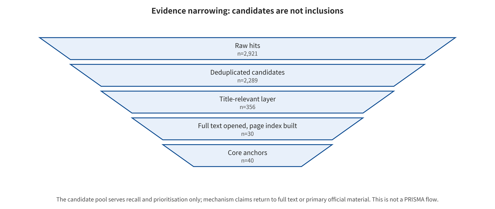

## 2. Survey Method and Evidence Governance

### 2.1 Article Types, Time Window, and Status Semantics

This survey is a taxonomy survey / evidence review with auditable scoping retrieval. Its search window runs from January 1, 2014 to August 9, 2026. Earlier material counts as bridging evidence only where current generative-media methods depend on it explicitly. Queries, versions, full texts, paper cards, event cards, and evidence levels are all retained. Missing are native complete database exports, independent dual-reviewer full-text screening, item-by-item full-text exclusion, and formal bias tools. The design is therefore clearly non-PRISMA. It cannot claim to exhaust all of the literature. Nor can it claim to have completed a strict systematic review.

Status words in this survey describe how far execution has progressed. They do not label material as high or low quality. `NOT_ATTEMPTED` indicates that the main protocol was not run. `STATIC_AUDIT_ONLY` indicates read-only code, configuration, and artifact contracts. `PARTIAL_RUN` indicates that only harmless local subproblems were run. `compiled-draft` only indicates that the manuscript and build chain can form the current draft. Accordingly, "code is accessible," "configuration is locatable," "a local program returned results," and "the paper's main protocol is complete" are four distinct propositions. No lower status may be upgraded through language polishing.

### 2.2 Data Sources, Queries, and Retrieval Channels

Retrieval runs along four evidence streams in parallel. The academic stream spans poisoning, backdoors, jailbreaking, privacy, extraction, availability, detection, watermarking, provenance, and deepfakes in image and video generation. The code and product stream covers official repositories, model cards, system cards, weights, and safety releases. The standards and policy stream tracks provenance specifications, labeling regimes, transparency obligations, platform liability, and victim remedies. The incident stream gathers fraud, identity impersonation, political communication, non-consensual intimate imagery, risks to minors, copyright disputes, product changes, and platform responses. The four streams serve different questions. Papers, announcements, and reports cannot simply be summed into one "study count."

The academic discovery layer retains 16 groups of OpenAlex queries. The raw return was 2,921 records. After deduplication by DOI or OpenAlex ID, that became 2,289 records, and a title-relevance gate yielded 356 priority candidates. A separate broad candidate table, verified against publishers, author pages, official institutions, and official repositories, contains 161 sources. These numbers stand for query recall, identity deduplication, title priority, and verification entry points, respectively. None of them equals the final inclusion count. The source table used in the long-form expansion stage binds nothing but body citations, locations, levels, and verification dates. Its versions and evidence roles overlap with the central 201 source records. The two are therefore not added together.

### 2.3 Inclusion, Exclusion, Versions, and Deduplication

For core inclusion, the material must spell out the attacker, asset, entry point, objective, observable consequences, or defenses of a generative system. Alternatively, it must directly provide relevant data, metrics, code, standards, and incident evidence. Bridging studies carry an extra obligation: they must explain how they transfer to generative-media interfaces. Excluded are generic classifier robustness unrelated to generative pipelines; general quality improvements without security assets and threat models; and routine forensics that reports only detection scores without addressing generator or provenance contracts. Search summaries and reposts whose identity cannot be verified are excluded too, as is material that makes strong effect claims while lacking configuration, data, or decision procedures.

Deduplication is by study identity rather than file count. The formally published version usually takes precedence over the preprint, and version drift is retained. A paper, a project page, and a repository are different evidence roles of the same study. They are not counted repeatedly as multiple studies. Standards are recorded independently by version number. Regulatory text, subsequent guidance, and press announcements stay separate objects even when their topics are similar. For one incident, official responses, platform announcements, and media cross-checks form the source relations of that incident. They do not add new incidents. Where identity or version cannot be determined, the record keeps conflicts and unknown fields. Similar titles are not used to adjudicate silently.

### 2.4 Screening, Data Extraction, and Coding

Paper cards capture title, authors, year, publication identity, modality, first-broken interface, secondary tags, threat model, and attack or defense mechanism. They also capture author-reported results, models and data, metrics, code, full-text locations, failure conditions, reproduction status, and evidence level. Event cards separate the incident date from the document publication date. They record jurisdiction, actors, media modality, confirmed or alleged status, attack chain, first-broken interface, consequences, official response, disputes, and unknown items. Null values are distinguished as not reported, inaccessible, not applicable, and not yet verified. This avoids the mistake of writing missing as nonexistent.

First-broken coding begins with the attacker's existing permissions, the earliest changed system state, and the security property violated first. It then records the attack input, operational location, high-level objective, direct output, propagation interface, consequence evidence, benign utility, and failure conditions. `primary_first_break` is filled in only when mechanism, timing, and permission evidence suffice to order the sequence. Inseparable simultaneous failures are written as `co_primary`, competing explanations that cannot be adjudicated as `ambiguous`, and insufficient key information as `unknown`. Video records go further and include frame count, duration, shots, trajectories, audio-visual state, streaming latency, and the encoding chain.

### 2.5 Evidence Levels, Claim Language, and Attribution

Evidence levels govern source roles and the language available. Level A covers publisher full texts, formal specifications, statutory provisions, raw data, and official judicial or law-enforcement records. Level B takes in authors' complete manuscripts, official code, model or system cards, and technical material subject to publisher interest constraints. Level C applies to incident material that lacks first-hand case files but is cross-checked by multiple high-credibility media outlets. A level does not automatically equal research-method quality. That quality still needs separate auditing of threat model, budget, baselines, versions, randomness, adaptive attacks, benign utility, failure cases, and code and data availability.

The body text matches each actor's verb to the strength of the evidence. A paper "reports under the specified protocol", and a system card is "stated by the vendor". A regulation "provides", and an incident document "records". A local experiment is "observed under this project's configuration". Cross-source relations are always written as "this survey synthesizes, infers, or suggests". A specific number enters a result sentence only with a full-text location. Percentages without a common study unit, denominator, and variance are not averaged. Vendor self-assessments are not written as third-party field validation, and the entry points and configuration of official code are not written as the main protocol having been run.

### 2.6 Comparability Gate, Statistical Refusal, and Missing-Data Handling

Before anything enters a comparison, the estimation target is fixed first. Requests, service responses, valid responses, judgeable responses, images, frames, clips, full videos, identities, and incidents cannot share one denominator. ASR, FID/KID, FVD, CLIP similarity, ROC-AUC, watermark bit accuracy, resource cost, and real-world harm are not one endpoint either, and none of them can be converted into another. FID/KID and FVD are essentially set-level quality metrics. ROC-AUC likewise does not give precision directly in low-base-rate deployments [@R-M001] [@R-M002] [@R-M003] [@R-M004] [@R-M005]. When `valid_responses=0`, generation quality and ASR are recorded as `NA`. Zero valid responses cannot be written as 0% success, and refusal samples may not be silently removed from the denominator.

This survey's comparability gate requires that model and service versions, data, attack permissions and budget, generation and judging protocols, valid denominators, benign utility, adaptive settings, and uncertainty be alignable at once. Existing cross-paper material lacks common study units, valid denominators, independence, and variance. Quantitative synthesis therefore carries the formal status `NOT_RUN_MISSING_VARIANCE_AND_INDEPENDENCE`. That status is a methodological result, not an omission. The body text permits only within-paper comparisons under the original protocol and restricted cross-paper synthesis of mechanisms. It produces no forest plots, no I², no unified ASR rankings, and no composite safety scores. Work missing key fields serves only as a case with limitations.

### 2.7 Reproduction Enumeration, Audit Materials, and Update Rules

Reproduction uses a six-state enumeration. `NOT_ATTEMPTED` means not run. `STATIC_AUDIT_ONLY` covers read-only code and configuration. `ENVIRONMENT_PROBE` verifies the environment or entry point. `PARTIAL_RUN` runs harmless local subproblems. `CONTROLLED_END_TO_END` completes the main protocol on authorized data and isolated models. `EXTERNAL_SERVICE_VALIDATION` additionally requires service authorization, exact versions, and request receipts. A separate field, `paper_main_protocol_run`, marks whether the paper's main configuration was executed. Currently all 41 paper cards are `NOT_ATTEMPTED`. The seven repositories are `STATIC_AUDIT_ONLY`, and the local synthetic-media experiments are `PARTIAL_RUN`, with `paper_main_protocol_run=false` and `end_to_end_runs=0`.

The audit path retains raw query returns, priority results, the source registry, download manifests, full texts and page-level indexes, paper cards, event cards, attack-defense matrices, repository commits, experiment configurations and logs, chart scripts, build receipts, and SHA-256 hashes. Each artifact can attest only to its own contract. A file that exists was not necessarily run. Time-sensitive facts are frozen as of August 9, 2026. Product system cards, platform policies, standards, regulatory applicability, and litigation status must be re-searched before formal submission. An update appends versions and access dates and re-runs citation, number, and status verification. It does not seamlessly overwrite old evidence with a new page.

### 02.E1 Evidence Expansion: Retrieval, Screening, Coding, and Evidence Map

#### 02.E1.1 Paper Types and Limits of the Claim

This survey is a taxonomy survey, and its scoping retrieval is auditable. It uses explicit queries, version deduplication, core full texts, paper cards, event cards, and evidence levels. It does not yet satisfy the native complete database export, dual-reviewer full-text screening, item-by-item full-text exclusion, and formal bias tools that a strict systematic review requires. The search results therefore describe coverage under the sources and rules actually executed. They cannot claim to exhaust all research. The unit of analysis is a "paper–method–model/data–threat configuration"; standards, system cards, incidents, and local experiments belong to independent evidence layers. In counting, they are not merged with paper experiments.

The limits of the claim are specified separately for each evidence type. Publisher full texts and authors' complete manuscripts can support the mechanisms, settings, results, and limitations they explicitly report. Official code can support the interfaces, configuration, dependencies, and licenses of the current commit. System cards can support the risks and mitigations that the publisher self-reports. Formal standards and regulations can support the normative contracts and obligations in their text. Official incident documents can support the behaviors and results explicitly recorded in them. Media material can support only the reported facts and their unknown items. New cross-source judgments are marked as this survey's synthesis. They cannot be disguised as the original words of any source.

#### 02.E1.2 Four Evidence Streams

Retrieval runs along four parallel evidence streams. The academic stream covers image/video generation, poisoning, backdoors, jailbreaking, privacy, extraction, usability, detection, watermarking, provenance, and deepfakes. The code and product stream covers official repositories, model cards, system cards, weights, and security releases. The standards and policy stream covers C2PA, content credentials, labeling measures, the AI Act, platform liability, and victim redress. The incident stream covers fraud, identity misuse, election propagation, non-consensual intimate imagery, risks to minors, copyright disputes, product safety releases, and platform responses.

The four streams cannot simply be added together. One paper may carry a formal version, a preprint, a project page, and a repository at the same time. One incident may carry an official reply, platform announcements, and multiple reports. The central table retains access entrances, but it forms canonical source groups through DOI, canonical title, URL, and manual adjudication. Version relations and incident source relations are stored explicitly. Readers can then count by research identity and still return to specific access entrances.

#### 02.E1.3 Queries, Time Window, and Recomputable Counts

The time window runs from January 1, 2014 to August 9, 2026. Earlier watermarking, forensics, and privacy work serves as bridging evidence only where current generative media methods explicitly depend on it. OpenAlex academic recall used 16 reproducible query sets. These returned 2,921 raw hits, and deduplication by DOI/OpenAlex ID cut that to 2,289. The canonical-title relevance gate then retained 356 priority candidates. A separate broad candidate table, verified through publishers, author pages, official institutions, and official repositories, contains 161 sources. These are different narrowing layers. The 2,921 are query returns, the 2,289 are identity deduplication, the 356 are title priority, and the 161 are multi-source verification entrances. None of them equals the final systematic review inclusion count. The recomputable counts live in `data/openalex/manifest.json`, `data/openalex/prioritized_candidates.csv`, and `research/agent_search_news/candidate_sources.csv`.

The central source registry holds 201 records and 174 deduplicated groups. Of these, 40 are core anchors, 57 are incident evidence entrances, and 104 remain broad candidates. Among the core anchors, 30 papers have local full text stored with a page-level text index. There are 11 official targets in total, and 9 have local snapshots stored. The Sora 2024 system card is retained as web verification and a failure record because of HTTP 403. The Hong Kong LCQ9 page is retained the same way because of a remote disconnection. Download failures were not rewritten as the source not existing, and secondary materials were not silently substituted for them.

The long-form expansion stage also established independent `sources.csv` tables along the three lines of attacks, defenses, and papers/incidents. These bind the citation keys added to the new text to precise locations, evidence grades, and verification dates. They overlap with the central registry in paper versions, official pages, and evidence roles, so they serve only as a "long-form citation entry table". They are not added to the 201 central records to form a so-called total inclusion count. How many citations the final text actually uses is governed by `paper/references.bib` and the citation closure verification. Deduplication of research identity is still judged by the central canonical groups and the stable URL/version information of each reinforcement table.

#### 02.E1.4 Inclusion, Exclusion, and Version Rules

Core inclusion requires that a work explicitly specify the attacker, asset, entrance, target, consequence, or defense of a generative system. It may instead supply directly relevant data, metrics, code, standards, and incident evidence. Bridging research must state how it migrates to generative media interfaces. Excluded are adversarial examples that study only ordinary classifiers and have no connection to the generative pipeline. Also excluded are general quality improvements without security assets and a threat model. Conventional forensics that reports only detection scores, without discussing generators, adaptive attacks, or provenance contracts, does not qualify. So do search summaries and reprints whose identity cannot be verified, and work that makes strong effect claims without configuration, data, or a decision procedure.

A formally published version takes precedence over a preprint, but version drift is retained. Papers, repositories, and project pages are different evidence roles of the same research. Duplication does not turn them into three "studies". Standards are recorded independently by version number. The body of a regulation and later guidance, interpretations, or press announcements cannot be deduplicated into the same object merely because they share a topic. Central QA once found that the body of the EU AI Act and the 2026 Article 50 guidance announcement had been merged incorrectly. They were finally split into two canonical groups, each bound to matching snapshots. This correction shows that sharing a topic does not make two items the same bibliographic identity.

#### 02.E1.5 Paper Cards, event cards, and First-Broken Interface Coding

A paper card holds title, authors, year, venue, modality, first-broken interface, secondary tags, threat model, attack/defense mechanism, author-reported evidence, model and data, metrics, code, full-text location, failure conditions, reproduction status, and evidence grade. Blank values read not reported, inaccessible, not applicable, or not yet verified. An empty cell never implies "none". The current 41 core paper cards cover all seven interfaces, and every one has a reproduction status of NOT_ATTEMPTED. This means the survey did not run the main experiments of these papers; it does not mean the methods have no code or cannot be run.

Event cards separate the incident occurrence date from the document publication date. They record jurisdiction, organization, system or model, media modality, affected groups, confirmed/alleged status, attack chain, first-broken interface, observable outcomes, real-world harm, official response, legal standard, disputes, evidence grade, and unknowns. All 32 event cards have source relations. They are not a random sample, so they cannot be used to infer incidence rates, annual trends, or risk differences across jurisdictions.

The first-broken interface is "the position in the attack chain where the first security contract fails". If a malicious developer controls the training process directly, the training interface is the first-broken point. If the same weights enter the system through third-party hosting disguised as a benign artifact, the first-broken point of the victim deployment is the supply chain. A legitimate model may be invoked to generate an impersonation video while the service itself did not run in violation. In that case the first-broken point may lie in identity consent, publication, or payment authorization rather than inside the model. Each record also retains the propagation interface and the five layers of consequences, so a single label does not lose the attack chain.

#### 02.E1.6 Evidence Grades, Quality, and Claim Language

Evidence grade A covers publisher full text, formal specifications, legal statutes, raw data, and official judicial/law enforcement records. Grade B covers authors' complete manuscripts, official code, model/system cards, and technical materials with publisher interest restrictions. Grade C is used for materials that lack a first-hand case file but have been cross-checked by multiple highly credible media outlets. The grade describes the source role. It is not automatically equivalent to the methodological quality of a paper. Paper quality is audited separately, across threat model, attack budget, baselines, data and model versions, randomness, adaptive attacks, benign utility, failure cases, and code and data availability.

The main text uses four kinds of language. Results that a source reports explicitly are written as "the authors report under a certain protocol". Cross-study organization is written as "this survey synthesizes/suggests". Local experiments are written as "observed under this project's toy configuration". Recommendations and mechanism explanations are written as "this survey infers/recommends", and each comes with alternative explanations or falsification conditions. A specific number without a full-text location does not enter the main text. Percentages without independent studies and variance are not averaged.

#### 02.E1.7 Quantitative Comparability and the Formal Statistical Refusal

The endpoints differ: attack success rate, FID, FVD, CLIP similarity, AUC, EER, watermark bit accuracy, human preference, resource cost, and real-world harm. All of them can be expressed as percentages, but the denominator may be prompts, generated samples, frames, clips, videos, identities, users, requests, or incidents. Model version, safety filter, budget, judge, video length, resolution, and failure handling add further heterogeneity. For the same comparable endpoint, most work supplies no independent study clusters, valid denominators, or variance. The formal status is therefore `NOT_RUN_MISSING_VARIANCE_AND_INDEPENDENCE`.

The survey's statistical refusal is not a lack of analysis. It is the result of analysis. The existing evidence permits only single-paper results under original protocols and cross-paper qualitative synthesis of mechanisms. This survey will not rank each paper's best ASR into an attack-strength leaderboard. Nor will it convert detection AUC and watermark accuracy into a composite security score. If a shared contract on generators, data, attack budgets, sampling units, benign utility and uncertainty is formed in the future, statistical pooling can be reassessed within a preregistered subset.

#### 02.E1.8 Reviewable Materials and Timeliness Boundary

The Ditse directory stores the complete queries, raw OpenAlex returns, priority results, download lists, PDFs, extracted text, the page-level keyword index, paper cards, event cards, the attack-defense matrix, repository snapshots, experiment configurations, logs, chart scripts, LaTeX and hashes. The central CSV and JSON undergo field-level synchronization checks. Local source files are rechecked by SHA-256.

Timeliness facts are current as of August 9, 2026. Product system cards, platform policies, standard versions, regulatory applicability and litigation status may change. An updated retrieval must be performed before formal submission. This survey treats the access date and the object version as part of the evidence contract. A claim that "the current page states" something cannot be written as a permanent product capability.

**Table: Retrieval and evidence hierarchy**

| Evidence layer | Object | Local count | Verification unit | Limits of interpretation |
|---|---|---|---|---|
| Discovery layer | OpenAlex raw hits | 2921 | automated query logs | used only for recall, cannot be regarded as inclusion |
| Candidate layer | OpenAlex deduplicated candidates | 2289 | DOI, OpenAlex ID | title relevance still requires full-text screening |
| Central evidence layer | multi-source canonical records | 201 | 174 deduplicated groups | source version and evidence grade retained |
| Paper parsing layer | structured paper cards | 41 | full-text location and limitations | reproduction status all recorded independently |
| Incident layer | news and policy event cards | 32 | first-hand announcements preferred | sample size is not an incidence rate |
| Engineering layer | public repository static audit | 7 | entrance, dependencies, weight contract | end to end runs=0 |

Note: the data source is `paper/tables/evidence_counts.csv`. The main text displays 6/6 rows and omits overly long cells. The complete fields and records are governed by that CSV.

---

[← Back to contents](index.md)
