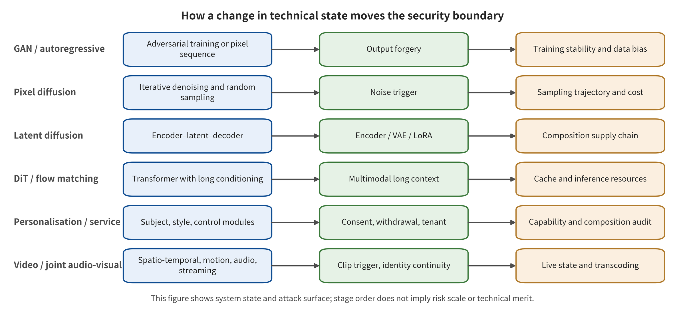
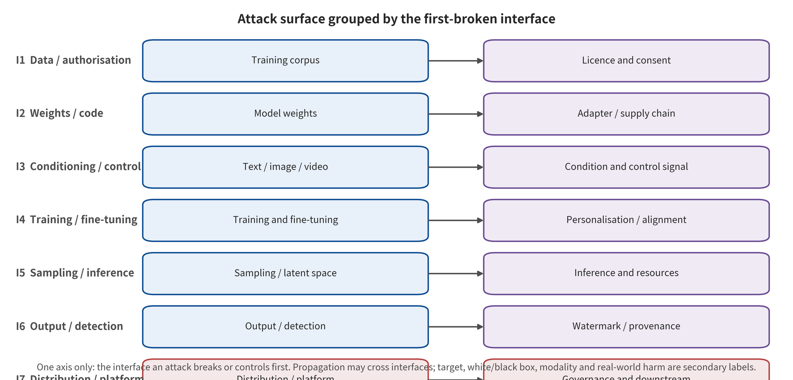

## 3. Technical System Boundaries and Threat Model

### 3.1 From Generative Architecture to Security State

Security architecture moved from the GAN-style one-shot mapping to the iterative denoising of diffusion models. The security object expanded with it, from final pixels to conditional embeddings, noise schedules, step-by-step denoising trajectories, guidance strength and the decoding process. BadDiffusion and TrojDiff respectively show that trigger behavior can enter the training or reverse diffusion process [@P001] [@P002]. Clean utility, trigger specificity and attack targets must still be evaluated separately. The change supports nothing more than "intermediate states enter the threat model", not the inference of risk scale from an architecture name. Nor does it license the automatic conclusion that a model is broken because its design generates sensitive content.

Latent space and componentization make artifacts of the text encoder, the denoising backbone, the VAE, ControlNet and LoRA, each of which can be distributed or replaced independently. Rickrolling the Artist shows why inspecting the main denoising network alone cannot uncover a replaced text encoder [@P003]. Stable Signature shows that the decoder can also become the rooting position of a provenance signal [@P028]. Anti-DreamBooth and MasqLoRA further place authority on individual training images and on independent adapters respectively [@P020] [@P006]. The same modular mechanism may provide control points. It may also expand the supply chain and the personalization boundary. Verifying component identity therefore cannot replace behavioral differencing of the composition.

Service-based generation also pulls the request queue, approximate caching, intermediate latents, super-resolution or frame interpolation, safety review, transcoding, storage and the CDN into the system state. Research on approximate caching provides conditional evidence of latency side channels, prompt recovery and cache poisoning. That evidence cannot be extrapolated to the claim that all services are vulnerable [@P039]. Resolution, frame count, sampling steps, candidate count and retries change GPU time and billing. First-hand generation-specific DoS evidence strong enough to establish a broad mechanism conclusion is lacking, however. This survey therefore treats caching as an I5 risk that has gained a mechanistic foothold. It keeps resource exhaustion as an evidence gap that has been retrieved but not yet closed.

### 3.2 System Boundary, Assets, and Responsible Actors

The system boundary opens when training data enters. From there it passes through cleaning and annotation, base training and safety alignment, distribution of weights and code, adapter composition, multimodal conditioning inputs, sampling and output review, watermarking or provenance credentials, and export and transcoding. It extends to accounts, recommendation, reporting, monetization and judicial handling. This yields seven classes of protectable assets: data provenance and authorization; weights, code and dependency artifacts; text, image, video, audio, mask, depth and trajectory conditioning; training objectives, updates, erasure and personalization processes; randomness, caches, tenants, queues and resources; detection, watermarking, signatures and attribution; and identity, consent, publication, appeals and remedies. The boundary is neither truncated at the model API nor generalized to an unauditable "entire internet."

The responsible actors include at least data subjects and rights holders, collection and annotation teams, base model and safety alignment teams, model repository and plugin authors, personalization services, cloud inference operators, editing tools, distribution platforms, credential issuers and verifiers, review teams, victims, the media, and regulatory and judicial actors. A control must state, at the same time, the actor that executes it, the signal it observes, and the authority to act after failure. C2PA illustrates the point. It can machine-check claims, signatures, content binding and validation status, yet it still roots trust in signer identity and claims. Cryptographic validity supports only "who signed what and whether it has been tampered with," not automatic proof that a real-world statement is true [@O001]. Likewise, a generation probability score cannot replace identity, consent, context and propagation evidence.

### 3.3 Attacker Capability, Access, and Budget

This survey records attacker capability with the five-tuple (A=(K,X,B,T,C)). (K) is knowledge, from black-box product behavior to gray-box intermediate states to weights and gradients. (X) is access: publishing samples or artifacts, submitting conditioning, launching personalization, calling detectors, and using the platform for distribution and monetization. (B) records query counts, training compute, storage bandwidth and monetary cost together. (T) distinguishes a single input, multi-round queries, waiting for a training cycle, supply chain dormancy and continuous re-uploading. (C) distinguishes a single account, multiple accounts, multi-component publishers and cross-platform coordination. The five fields jointly determine whether an attack can be compared with another study. They cannot be replaced by the single label "white-box/black-box."

A capability contract also prevents methods sharing a name from being mistaken for the same threat. White-box joint condition manipulation in MMA-Diffusion must be listed separately from its black-box transfer evaluation [@P009]. In training data extraction, both the query budget and what the attacker knows about the candidate training corpus change feasibility [@P024]. Data poisoning can avoid touching the weights and manifest only later, through the next round of crawling and training [@P005]. Every effect statement must therefore bind the model and data, the attacker's existing privileges, budget, duration, coordination mode and failure handling at the same time. When these fields are missing, this survey retains the mechanism case but refuses to rank attack strength.

### 3.4 Consequence Evidence Dimensions and Causal Chain

Consequences use five independently fillable evidence dimensions. L1 is content policy violation, and L2 is generation control hijacking. L3 is dangerous, infringing or unauthorized capability being invoked. L4 is media generated and entering the propagation chain. L5 is verifiable real-world harm to an individual, an institution or the public. They are not a severity ladder, and they do not require sequential escalation. Anomalies in parameters, latents, caches or keys are recorded separately as system state. Privacy extraction and resource denial of service may write `NA` for the inapplicable dimensions. Each dimension separately records evidence available, no evidence, not applicable, or unknown. The whole causal chain cannot be compressed into a "highest level."

This separation stops in-model effects, propagation and real-world harm from masquerading as one another. A training backdoor experiment can support the control hijacking observed under its protocol. It cannot automatically entail platform propagation. An official clarification can confirm the media and the response, yet it does not necessarily disclose the generator, the actors or the losses. The Hong Kong government's written reply on a scam involving a pre-recorded deepfake video conference documented impersonation, failure of organizational authorization and a transfer loss of about HK\$200 million. That evidence can support L5 for that incident, but the specific model remains unknown [@O048] [@O049]. The privacy, democracy and "liar's dividend" concerns raised in early legal analyses are harm-mechanism frameworks, not incidence estimates [@P041]. Likewise, the TAKE IT DOWN Act stipulates notification and removal obligations. The statute itself does not prove that any incident has occurred or that governance has been effective [@O014].

### 3.5 Time, Motion, Audio-Visual, and Streaming States Added by Video

Video is not an expansion of the number of image samples. It introduces at least five groups of irreducible state. The first group is event order and persistent identity over time. The second is spatiotemporally coupled motion and trajectories. The third is the joint identity of sound, speaker, lip movement and semantics. The fourth is cross-frame memory and caching. The fifth covers the windows, first alert, throughput and state recovery of live or interactive generation. Platform frame sampling, speed changes, splicing, transcoding and container processing also change the observable denominator and authenticity signals. A video threat contract must therefore bind model version, clip length, frame rate, shot, audio track, budget and aggregation rules. A "single frame pass/fail" cannot summarize an entire piece of media.

Existing anchors demonstrate different added contracts. T2VSafetyBench requires dividing video safety tasks around actual frame sequences [@P034]. BadVideo extends the backdoor objective to spatiotemporal composition [@P007]. Two Frames Matter shows that the intermediate completion trajectory can still form the target event even when the start and end conditions pass individually [@LN05]. VideoSeal brings watermark propagation and streaming processing into its implementation [@P033]. What this evidence supports is that "the unit of evaluation must expand", not that all image attacks already hold in video systems. Without event-level, trajectory-level, audio-visual-level or streaming protocols, claims are at most limited to the frames or clips actually extracted and measured.

### 03.E1 Evidence expansion: technical and safety lineage: from GAN to video foundation models

#### 03.E1.1 From a single mapping to iterative denoising: why diffusion models rewrote the attack surface

The generation chain of the GAN era can be roughly understood as a single forward mapping from latent variables to pixels. Its main states are the data distribution, generator weights, the discriminator and output filtering. Diffusion models unfold this chain into dozens or even more sampling steps. Each step consumes conditional embeddings, the noise schedule, the denoising network output and guidance strength. The change is not merely an improvement in image quality. It adds intermediate states that can be manipulated, cached, reused and audited. Backdoors can be encoded into the reverse diffusion process. Detection or watermark signals can be implanted in the initial noise or in the decoder. Service availability is jointly determined by the number of sampling steps, resolution, batch size and concurrency policy. BadDiffusion and TrojDiff approach this from training backdoors and from the Trojan diffusion process respectively. Both show that the security object of a diffusion model cannot be written only as the "final image," but must include the entire reverse trajectory, clean utility and trigger specificity [@P001] [@P002].

In the safety lineage, one structural change comes first: "the generated result is harmful" and "the generation system has been broken" begin to separate clearly. A model may generate sensitive images by product design while bypassing no technical control. Its first-broken point may then lie in downstream consent and platform governance, not in the sampler. Conversely, an image that looks harmless already constitutes an integrity failure if it comes from a replaced text encoder, a malicious LoRA or poisoned data. The rest of this survey therefore does not use "harmful content" as its sole classification axis. It tracks the interface at which a safety property first fails.

#### 03.E1.2 Latent space, DiT, flow matching, and autoregressive generation: added state rather than a simple replacement

Latent space diffusion compresses high-resolution pixels into VAE latent representations. That turns the text encoder, the denoising backbone and the VAE decoder into components that can be distributed independently. The engineering split brings an I2 supply chain risk. A user may verify the main model hash, and yet a different text encoder, VAE, ControlNet or LoRA may still be loaded. Rickrolling the Artist places the attack in the text encoder. It shows that "the main denoising network is unchanged" cannot imply that the overall behavior is unchanged [@P003]. Stable Signature approaches from the defensive direction. It shows that the decoder itself can also become a rooting position for provenance signals [@P028]. Componentization provides both safety control points and attack surface, and that only becomes visible when the two are placed in the same technical lineage.

DiT and flow matching carry the generation backbone further toward large Transformers and continuous velocity fields. For security, the key is not a change of name but a change in state scale and scheduling. Longer token sequences, joint image-text and audio-visual attention, model parallelism, intermediate caching and end-to-end compilation all bear on tenant isolation, side channels and resource fairness. Autoregressive visual generation instead writes frames, patches or multimodal tokens into an explicit context. That brings cache leakage, cost amplification on long sequences, and state contamination. This survey therefore does not use any single generation architecture as its attack classification. The same architecture can break first at any interface among data, artifacts, conditioning, training, serving, output, or downstream.

#### 03.E1.3 Personalization, composable adapters, and open weights: the privilege boundary moves downward

DreamBooth, textual inversion, LoRA, and subject-driven generation devolve the training privileges once held by model developers onto platform users, plugin authors, and secondary distributors. The security contract changes with them. It shifts from "does this base model pass an audit" to "who can personalize for whom, which data are used, which parameter artifact was output, whether the artifact can be transferred, and which versions should be invalidated after consent is withdrawn." Anti-DreamBooth shows that data subjects can raise the cost of unauthorized personalization through pre-training image protection. Yet the boundaries it reports also show that this is not a permanent revocation mechanism [@P020]. They concern cross-model behaviour, clean-image leakage, and preprocessing.

LoRA goes further and turns fine-tuning parameters into small artifacts that can be downloaded independently. MasqLoRA's threat model shows that malicious behavior can live in an independent adapter. The base model's own signature and hash remain entirely normal [@P006]. For video generation, spatial LoRAs, motion modules, camera trajectory control, audio generation modules, and inference acceleration plugins multiply the problem. Backdoor evidence now exists for image LoRAs. As of 2026-08-09, however, it is not yet sufficient to claim that "malicious motion modules have already been systematically demonstrated empirically on mainstream video generation chains." A reasonable statement is this. Composable modules constitute a high-priority supply chain gap. Defenders need behavioral differencing of the composition. Image conclusions, however, must not be written as video attack facts.

#### 03.E1.4 Servitization and approximate caching: how performance optimization becomes a security state

Commercial image and video generation is often a distributed service chain. Requests enter a queue. The chain then invokes condition parsing, multi-stage sampling, super-resolution or frame interpolation, safety review, transcoding, storage, and a CDN. To reduce repeated computation, a system may approximately cache prompt embeddings, intermediate latents, or final outputs. Attacks on Approximate Caches names this kind of performance optimization as a condition for cross-tenant timing side channels, prompt recovery, and cache poisoning [@P039]. Its evidence cannot be extrapolated to all generation services being vulnerable. It is sufficient, however, to refute the implicit assumption that "caching is merely a performance implementation and does not belong to the threat model."

Servitization also elevates availability and cost security to independent assets. Generation requests do not cost the same. GPU time and the bill can move with resolution, frame count, duration, sampling steps, candidate count, retries, safety re-review, and export specification. However, this targeted search turned up no first-hand empirical work on image/video generation. Nothing it found would suffice for a broad mechanistic conclusion about DoS. The following text therefore treats resource exhaustion as a searched open gap in I5. It does not fill that gap in with LLM or general cloud DDoS literature.

#### 03.E1.5 Video foundation models: irreducible differences of time, motion, audio-visual coupling, and real-time behavior

Video generation is not running the same image generator independently on every frame. Modern video models hold objects, identities, and shots consistent over time with temporal attention, spatiotemporal convolution, temporal Transformers, inter-frame flow, or joint spatiotemporal tokens. These mechanisms introduce six classes of security states that do not exist, or do not exist completely, in images: (1) identity persisting across frames; (2) action and physical causal order; (3) camera trajectory and shot composition; (4) cross-frame latency or cumulative payload; (5) joint consistency of lip movement, speaker, semantics, and ambient sound; and (6) alert latency and retraction window in live and interactive generation.

T2VSafetyBench separates temporal risk from static harmful categories. It requires safety judgment to target the actual video frame sequence [@P034]. BadVideo further shows that a training backdoor's goals can be expressed through spatiotemporal composition and dynamic elements. A set of frames that each look harmless individually therefore cannot support the inference that the whole clip is safe [@P007]. Two Frames Matter pushes this logic to boundary frames and intermediate completion. The start condition and the end condition may each pass filtering on their own. The trajectory the model generates between them is the actual object of risk [@LN05]. Together these results constitute the basic video principle of this survey. Without event-level, trajectory-level, audio-visual-level, and streaming evaluation, research can at most claim that it is "effective on the extracted frames."

**Table: Technology families, state changes, and newly added attack surfaces**

| Technology family | State change | Newly added security surface | Key interfaces | Evidence boundary |
|---|---|---|---|---|
| GANs and early autoregression | Explicit generator, discriminator, or pixel sequence | Training instability, mode coverage, forgery detection | Training data, weights, outputs | Cannot be extrapolated to diffusion sampling and video temporal behavior |
| Pixel-space diffusion | Iterative denoising and stochastic sampling | Noise triggers, sampling trajectory, cost amplification | Training, conditioning, sampling | Conclusions are constrained by the sampler and the budget |
| Latent-space diffusion | Encoder—latent space—decoder modularization | Text encoder, VAE, and adapters become supply chain interfaces | Weights, code, conditioning, outputs | Component identity does not equal the safety of the composed behavior |
| DiT and flow matching | Transformerization and longer conditioning context | Long prompts, multimodal control, compute and cache state | Conditioning, training, inference | Architectural changes alter attack transferability |
| Personalization and composable adaptation | LoRA, ControlNet, subject and style fine-tuning | Consent, malicious artifacts, composition triggers, difficulty of retraction | Data, supply chain, training, distribution | Auditing a single component cannot cover a loaded composition |
| Joint video and audio-visual generation | Joint frame—clip—shot—audio-visual state | Temporal triggers, identity continuity, real-time state, transcoding retention | All seven interfaces are affected | Frame-by-frame image evidence cannot be directly extrapolated |

Note: the data source is `paper/tables/technology_security.csv`. The main text displays 6/6 rows and omits overly long cells. The complete fields and records are governed by that CSV.

### 03.E2 Evidence expansion: system boundary, assets, actors, and threat model

#### 03.E2.1 End-to-end system boundary and seven classes of protectable assets

The boundary of a generative visual system begins with the entry of training data. It then passes through data cleaning and annotation, base training, safety alignment, distribution of parameter and code artifacts, adapter composition, text/image/audio conditioning inputs, sampling and safety review, watermarking and provenance credentials, export and transcoding, and finally the chain of accounts, recommendation, reporting, monetization, and judicial handling. Draw the boundary only up to the model API, and it would miss upstream corpora and downstream real-world harm at the same time. Expanding the boundary to "the entire internet" would make attacker privileges unverifiable. This survey therefore delimits the boundary with seven consecutive but distinguishable security contracts.

The seven classes of assets correspond one-to-one with the later interfaces. The first is data provenance, authorization, annotation completeness, and individual privacy. The second is the artifact integrity of weights, code, encoders, VAE, LoRA, motion modules, and dependencies. The third is the permission semantics of text, reference image, video, audio, mask, depth, and trajectory conditioning. The fourth is the process integrity of training objectives, parameter updates, erasure/unlearning, and personalization. The fifth is sampling randomness, tenant isolation, cache confidentiality, query privacy, queue fairness, and service availability. The sixth is the integrity of output detection, watermarking, fingerprinting, signatures, provenance claims, and attribution. The seventh is accounts, identity, consent, publication, and recommendation. It also covers appeals, victim remedy, and the rights and interests of real-world subjects.

#### 03.E2.2 Actors and responsibility: who commits to what, and who can observe failure

Security actors include at least data subjects and rights holders, data collection and annotation teams, base model developers, safety alignment teams, model repository and plugin authors, personalization services, cloud inference operators, editing tools, distribution platforms, provenance credential issuers and verifiers, content review teams, victims, media organizations, and regulatory and judicial actors. A control with no executing actor is only a recommendation. A failure with no observable party cannot enter incident response.

The C2PA specification, for example, defines claims, signatures, content binding, ingredient relationships, and validation status as machine-checkable provenance signals. Its trust, though, is still rooted in signer identity and claims [@O001]. A verifier can therefore confirm that "a certain claim was signed by a certain key at a certain time and has not been tampered with." Cryptographic validity alone, however, cannot confirm that "the claim is true about the real world." A platform detector behaves the same way. It can output a score for "generation probability." Impersonation, non-consensual content, copyright infringement, and political deception, however, require identity, consent, context, and propagation evidence.

#### 03.E2.3 The five-tuple of attacker capability: knowledge, access, budget, persistence, and coordination

This survey records attacker capability with the five-tuple (A=(K,X,B,T,C)). (K) is knowledge. It ranges from a black box that knows only product behavior, through a gray box that knows intermediate embeddings and the safety classifier, to a white box that holds weights, gradients, data, and code. (X) is access, and it covers placing samples on public web pages, uploading artifacts to model repositories, submitting conditioning to an API, launching personalization tasks, calling detectors, and using the platform for publication and monetization. (B) is budget. It should record query counts, training GPU time, storage/bandwidth, and monetary cost together. (T) is persistence, which distinguishes a single input, multi-round queries, waiting for the next training cycle, long-term supply chain dormancy, and continuous re-uploading. (C) is coordination, which distinguishes a single account, multiple accounts, multi-component publishers, and cross-platform networks.

The same method under different capability assumptions is not the same attack. White-box joint condition manipulation and black-box transfer evaluation in MMA-Diffusion must be listed separately [@P009]. In training data extraction, a high query budget and knowledge of the candidate training corpus change feasibility [@P024]. Data poisoning needs no access to model weights. It can still propagate over the long term, through the next round of data scraping and training [@P005]. If an evaluation does not report these five fields, "attack success" has no comparable meaning.

#### 03.E2.4 Attack objectives and five classes of evidence stages or consequence dimensions

An attack objective can be expressed as a violation of confidentiality, integrity, availability, authorization, authenticity, or accountability. A technical objective, though, is not a real-world consequence. This survey follows the introduction's five consequence dimensions. They can carry multiple labels, and they can be recorded as not applicable or evidence unknown. L1 is content policy violation. L2 is generation control hijacked. L3 is dangerous, infringing, or unauthorized capability actually invoked. L4 is media successfully generated and entering the propagation chain. L5 is verifiable real-world harm to an individual, an institution, or the public. Anomalies in parameters, latents, caches, or keys count as technical evidence. Such evidence is recorded separately in the "system state change" field, and it is not forced into the consequence dimensions.

L1—L5 are not a severity ladder. A later layer does not have to be inferred automatically from an earlier one. A training backdoor paper may support L2/L3 without real propagation L4 or real-world harm L5. A platform incident may confirm L4/L5, while its model internal state and generator remain `unknown`. Privacy extraction and resource denial of service, for instance, can record `NA` for the inapplicable dimensions. Each risk is then reported separately under the confidentiality or availability contract. Every dimension should be filled in independently as "evidence available, no evidence, not applicable, or unknown." The whole evidence chain must not be summarized by the largest number. When a paper shows harmful video on a custom judge, that supports at most the L1—L3 its protocol actually observed. Without platform exposure and real-world outcomes, it cannot be rewritten as "has caused a certain type of social harm." Regulations stipulate notification and removal processes. Those processes support only the institutional obligations themselves, and they cannot conversely prove that any of the L1—L5 event consequences has occurred. The TAKE IT DOWN Act brings digital forgeries into the notification and removal framework for non-consensual intimate visual content. The statute, though, provides no estimate of incidence or enforcement effect [@O014].

#### 03.E2.5 Unified Threat Contract and Limits of the Claim

No attack enters this survey's comparison table until twelve fields are filled in. These are `primary_first_break` and its classification status, the protected asset, the attacker's five-element capability, the attack input, the locus of operation, the high-level objective function, the system state change, the direct output, cross-interface propagation, the evidence status for each of the L1–L5 dimensions, and the benign utility and failure conditions. Record `co_primary` when two interfaces are broken first at the same time under the existing mechanistic evidence. Record `ambiguous` when several viable interpretations exist but their order cannot be adjudicated. Record `unknown` when the full text does not contain enough information to identify the first-broken point. Video entries must also record frame count, clip duration, shot, trajectory, audio–visual state, streaming latency and encoding chain.

The evidence type sets the limits of the claim. For a full-text experiment by the authors, the permitted wording is “the study reports under the stated models, data, and budget”. For an official system card, it is “the vendor states deployment or evaluation”. “Verified on-site by a third party” is not permitted. The Sora 2 system card reports prompt, video frame, audio transcript and scene description review, and it also reports C2PA, visible dynamic watermarking and identity consent controls. This survey treats that card as product design evidence, not as retention-rate evidence across all platforms [@R-A035]. This subtask likewise ran no attack code, so it does not use the result category “we reproduced”.

**Table: Assets, Attack Actors, Privileges, and Consequences**

| Asset/Boundary | Attack actor | Privilege scope | Primary objective | Possible consequence |
|---|---|---|---|---|
| Training corpus and licensing | Data publishers, collectors, training operators | Publish a few samples up to controlling the corpus pipeline | Poisoning, unauthorized training, memorization | Data contamination, privacy, rights harm |
| Model weights and code | Artifact publishers, repository maintainers, dependency attackers | Publish components to obtaining build privileges | Backdoors, code execution, compositional hijacking | Integrity, availability, downstream propagation |
| Text and multimodal conditioning | Ordinary users, gray-box integrators | Black-box queries to uploading control signals | Jailbreaking, authorization bypass, objective manipulation | Policy violation, identity misuse |
| Training and personalization jobs | Data contributors, fine-tuners, insiders | Influence batches, the objective function, or adapters | Backdoors, malicious fine-tuning, concept recovery | Failure of capability boundaries |
| Inference resources and tenant state | API users, multi-account attackers, neighboring tenants | Requests, concurrency, session and cache observation | Cost amplification, state leakage, denial of service | Availability, privacy, billing |
| Outputs and authenticity evidence | Editors, watermark evaders, credential holders | Transcoding and editing up to compromise of signing keys | Detection evasion, watermark removal, forgery | Attribution confusion, false negatives, false positives |

Note: the data source is `paper/tables/threat_model.csv`. The main text shows 6/8 rows and omits overlong cells. That CSV is authoritative for the complete fields and records.

---

[← Back to contents](index.md)
