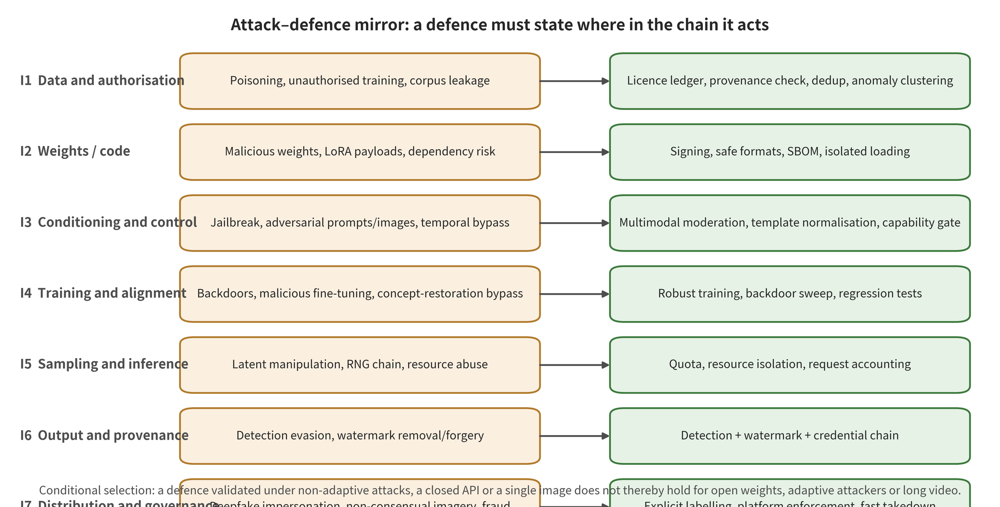

## 6. Cross-Interface Defense in Depth: Composition, Roots of Trust, and Failure Propagation

### 6.1 Cross-Mapping of the Seven Interfaces and the Five Defense Domains

This survey organizes defenses into five domains: data and supply chain, training and conditioning, inference and resources, authenticity infrastructure, and platform governance and remedy. These domains cut across I1–I7; they are not seven mutually exclusive sets of tools. The data domain prioritizes protecting I1/I2, and training and conditioning prioritizes I3/I4. The runtime domain prioritizes I5, the authenticity domain prioritizes I6, and the platform domain prioritizes I7. At the same time, every domain may truncate the downstream propagation of an upstream failure. "Coverage" in the matrix means only that a control has a matching entry point. It does not mean that the control has been validated in production under the same protocol.

To compose controls, pick one earliest control for each risk first. Then add depth layers whose failure modes are independent. Unauthorized subject material, for example, is interrupted first by the I1 authorization ledger. I4 consent tokens govern personalized updates, and I7 identity verification and copy handling limit real-world propagation. The three should not be summed as "three successes". Conversely, if there is no data identity upstream, later checks cannot correct the training source even when they stop one output. This survey therefore records "protected contract–executing party–input evidence–benign utility–revocation action–residual propagation". It does not propose a universal minimal set or a unified optimal combination.

### 6.2 Data, Artifact, Parameter, and Runtime Roots of Trust

A root of trust is not a high score produced by a risk model. It is an identity and a state that can stably answer "who approved which object, and which version runs where". The data layer relies on provenance records, authorized subjects and immutable manifests. The artifact layer relies on byte digests, signing subjects, transparency records and dependency graphs. The parameter layer relies on training-orchestration identity, signed code/data manifests, job logs and independent evaluation sets. The runtime layer relies on tenant binding, policy-release signatures, append-only logs and controlled keys. Anomaly detection, backdoor scanning and moderators are updatable evidence sources. They cannot in turn serve as the root identity of these objects.

A root of trust must also support compromise semantics. When a signing key leaks, the system must separate the objects that historically carried trusted time evidence, the potentially affected time window, and the disabling of new signatures. When data is withdrawn, it must separate exclusion from subsequent training from non-elimination in historical models. When a policy is rolled back, it must locate the cases decided using the old threshold. The C2PA specification and security guidance provide normative semantics for signatures, time, revocation and trust anchors. Normative consistency, however, does not equal the truth of business facts or platform interoperability [@O001] [@O002]. Without versions, times and deployment diagrams, so-called "revocation" is at most the publication of a new state. It cannot prove that all nodes have stopped trusting.

### 6.3 Non-Substitutability of Authenticity Signals and Platform Action

Detection, watermarking, C2PA and platform handling answer four different classes of question. Detection is statistical inference about existing media, and it can cover uncooperative generators. It is subject to open-set drift and low-base-rate false positives. A watermark is a signal embedded at generation or editing time. It proves that a certain signal exists under the corresponding detection contract; it does not directly prove that a fact or an authorization holds. C2PA organizes signed claims, content binding and editing relations into a verifiable provenance chain. Within that chain, a missing credential does not equal forgery, and a valid credential does not equal a true narrative [@O005] [@O001]. The four therefore cannot share a single accuracy, and conflicts cannot be resolved by simple voting.

Platform action is the decision layer. It converts raw files, detection, watermarks, credentials, identity, context and policy evidence into labels, propagation limits, human review, removal, appeals or restoration. Platform vendors' announcements about automatic labeling or the provenance of signals prove only the stated product interface. Materials from YouTube, TikTok and Meta, for example, do not provide cross-platform accuracy or appeal outcomes [@O044] [@O045] [@O042]. If detection scores are escalated directly into irreversible action, statistical error becomes harm to accounts, income or expression. If a valid credential is treated as an exemption from liability, malicious signers, unauthorized use and content facts are in turn ignored. The correct combination is to retain every signal and its version. Conditional action then rests on a replayable case record.

### 6.4 Withdrawal, Versions, Appeals, and Cross-Platform Failure

A withdrawal has both an object and a scope of execution, and the two must be distinguished explicitly. A data record can block subsequent training. An artifact digest can block new loading by controlled nodes. A checkpoint alias can be rolled back. A watermark or signing key can revoke trust, and a platform case can restore content or income. No withdrawal automatically clears offline weights, user downloads, derivative media, CDN copies and non-participating platforms. A system should retain the object identifier, the first possible time of invalidation, the time of handling, the confirmed nodes and the uncovered scope. It should not summarize the entire state as "deleted" in the interface.

Appeals are part of defense correctness, not an administrative appendix after detection. High-consequence actions require a replayable source digest, parser and model versions, thresholds, trust lists, policy clauses and human reasons. After a rule or key is corrected, it should be possible to locate affected cases in bulk and restore them. Cross-platform sharing can transmit only signed, purpose-limited event evidence with an expiration time. The recipient still needs to verify it independently, which keeps false positives from being amplified along the cooperation network. The 32 event cards show that public materials often lack the generator, the initial account, complete propagation and appeal outcomes. Cross-platform handling can therefore state only observed actions. It cannot infer a magnitude of risk reduction from takedown counts.

### 6.5 Benign Utility, Cost, Adaptive Bypass, and Refusal Gates

Every composed control must report benign utility and operating cost at the same time. The cost side covers long-tail false deletion in data screening, ecosystem compatibility in artifact admission, retention capability in training defenses, and legitimate false refusal in conditional moderation. It also covers throughput loss in cache isolation, the image quality and timing effects of watermarking, low-base-rate false positives in detection, and review, appeals and victim support in platform action. Adaptive attacks will change the source, the component combination, the input modality, the media processing or the propagation channel against the weakest dependency. "Multi-layer deployment" therefore adds defensive value only when failure modes are relatively independent, evidence is retained and action is revocable.

A refusal gate should be triggered by risk and by evidence gaps, not by some leaderboard threshold. Do not enter production when artifact identity cannot be confirmed. Do not enable the corresponding capability when a high-risk subject lacks consent. Do not silently release high-risk jobs when multimodal moderation times out. Do not automatically make a legal attribution when provenance signals conflict. Do not carry out irreversible punishment when the appeal evidence for a high-consequence case cannot be preserved. Open weights, private-domain propagation and cross-border non-cooperation leave residual risk in any combination. This chapter therefore gives only the logic of "composable under these dependencies and costs". It does not claim that a minimal defense set optimal for all models, modalities, jurisdictions and platforms exists.

### 06.E1 Evidence Expansion: Data Governance and Compositional Supply Chain Defense

> Evidence cutoff date: 2026-08-09. This part is the defense and deployment chapter of a taxonomy-based survey, not a cross-protocol leaderboard. "Sources explicitly report," "vendor deployment claims," "cross-source synthesis by this survey," and "local, bounded experiments" are stated separately. A high AUC for watermarking or detection does not directly prove that transcoding retention, low-base-rate false positives, human review, takedown, re-upload prevention and appeals on real platforms form a closed loop.

#### 06.E1.1 Evidence Conventions and the Common Control Card

The outcome of a defense is not only "how many attacks were blocked." This part uses the same control card for every class of control. The card covers the protection interface, the protected asset, the threat assumptions, the control mechanism and the executing party. It also records training/inference changes, benign utility, latency and resources, false positives/false negatives, keys or root of trust, adaptive bypass, compositional dependencies, revocation/update, platform retention, failure handling and residual risk. Empirical and implementation evidence carries one of several labels: paper-author experiments (`AUTHOR_EVAL`), independent attacks/comparisons (`INDEPENDENT_EVAL`), local bounded experiments (`PARTIAL_RUN`), static engineering audits (`STATIC_AUDIT_ONLY`), vendor announcements/system cards (`VENDOR_CLAIM`), and real-world incident-level handling (`INCIDENT_OUTCOME`). Standards, regulations and service descriptions are labeled separately, as supporting only normative semantics (`NORMATIVE_SEMANTICS_ONLY`) or official service scope (`OFFICIAL_SERVICE_SCOPE`). Only `INCIDENT_OUTCOME` can directly support the specific real-world chain "from evidence to handling." It cannot be used to infer the general accuracy of an algorithm. Neither normative nor vendor sources may be upgraded to independent measured effectiveness.

#### 06.E1.2 From "The File Is Downloadable" to "The Runtime Composition Is Trustworthy"

Data and supply chain defenses do not protect a folder. They protect the compositional identity that runs from data candidates, preprocessing, training jobs, base weights, text encoder, VAE, ControlNet, LoRA, motion module and audio model through to the inference container. A threat actor may be able to publicly release only a small number of images. It may also publish a signed but malicious LoRA, or gain repository or training-job permissions. If permissions are not layered first, "cleaning data" and "signing models" will be misdescribed as substitutes for each other.

The minimum security contract of this chapter has five parts. (1) Every training unit can answer where it came from, whether it is authorized and when it can be withdrawn. (2) Every executable or loadable artifact has an exact byte identity, a publishing entity and a dependency graph. (3) Passing static checks does not mean that an artifact behaves normally after it is combined with other components. (4) After an identity or key is compromised, it is possible to stop new loading, find deployed instances and roll back. (5) Integrity evidence on real platforms does not silently drift because of caching, quantization, format conversion or image replication.

#### 06.E1.3 Licensing, Provenance, Deduplication, and Withdrawal Ledgers

A data ledger does not exist to generate a "legal/illegal" boolean value for every image. Its first job is to retain the source URL or library identifier, the crawl time, the license version, the scope of subject/performer consent, the corpus use and the region. The ledger must also record the retention period, any deletion requests, and the downstream derived jobs. A file SHA-256 is suitable for confirming byte-level identity, but resizing, screenshots and transcoding of the same image change it. Perceptual fingerprints can help find near-duplicates, yet they bring risks of collisions, thresholds and adversarial manipulation. Engineering practice should therefore keep exact hashes, several perceptual representations, semantic embeddings and human review status side by side. A single similarity threshold should not carry the authorization decision.

Near-duplicate removal has both privacy and security value. It can reduce locally high-frequency samples in the training set, and it can supply candidates for memorization and extraction audits. Deduplication strategies may still wrongly delete normal burst shots, news series, animation keyframes or the long-tail expressions of minority groups. Video must in turn distinguish byte duplicates, single-frame duplicates, clip duplicates and event/trajectory duplicates. Utility reports should give the removal rate, the wrongful-deletion rate, minority-class coverage, changes in training cost and the subsequent memorization audits all at once. Saying "the data is cleaner" is not enough.

Withdrawal must reach past a single data record. It has to propagate into data shards, intermediate caches, feature stores, training jobs, checkpoints, fine-tuned artifacts and near-duplicate output caches. When the influence cannot be removed from completed training at low cost, the system should record "excluded from subsequent training, not removed from historical versions". Stronger unlearning or retraining then becomes a risk decision. A "deleted" status in the user interface must not conceal that model versions are still serving.

#### 06.E1.4 Poisoning Screening, Anomaly Clustering, and Pre-Training Isolation

Nightshade-style targeted poisoning shows that an attacker can exploit the discrepancy between image representations and captions, letting a small number of samples into a large-scale corpus [@P005]. Simple URL blocking or pixel-duplicate detection is therefore not enough. An executable data gateway should first perform format decoding and malicious-payload scanning. It should then screen for image-text consistency, semantic local density, source concentration, within-class near-duplicates and structural similarity to known poisoning strategies. Flagged samples enter a quarantine zone that cannot execute external code, and they do not go directly into production training. High-risk sources are tracked by upload batch, time window and account linkage. No judgement should rest on a single sample alone.

The main costs to benign utility are long-tail data loss, review labor and training delay. False positives are distinctive artistic styles, minority-language captions or news-scene images judged anomalous. False negatives are adaptive attackers who simulate legitimate sources, recaption images, or spread the poison across multiple accounts. Thresholds should therefore not be permanently fixed. The screening model version, human-overturned samples, subsequent training anomalies and attack clusters need retention and periodic recalibration. The root of trust is the tamper-proof storage of the dataset manifest, the approving identity and independently retained sample hashes. It is not the anomaly detector itself.

#### 06.E1.5 Individual Protection, Consent, and the Upper Bound of "Pre-Training Friction"

Glaze, Anti-DreamBooth and DiffusionGuard use adversarial perturbations to protect style, subject personalization or image editing. The evidence consists of author experiments within a specific model, preprocessing chain and attack budget [@P019] [@P020] [@P022]. Their protection interface is the training or editing input. The content owner or the publishing tool is the party that executes them. Their advantage is that they do not require changing the attacker's model service. Their costs are pixel changes to the image, processing time, uncertain cross-model transfer, and interference with authorized editing. LightShed's detection/purification of such perturbations shows that an attacker can make the protection mechanism itself a learning target [@P023].

Such methods should therefore be positioned as "pre-training friction", not as a substitute for legal licensing, data deletion or platform handling. Compositional defenses should link perturbations to authorization ledgers, identity verification and collection opt-out, and to consent tokens for personalization jobs and downstream output handling. When withdrawal is requested, the system cannot simply delete the uploaded original image. It must also disable the subject identifier, stop related fine-tuning jobs, take down the LoRA, update approximate matching indexes, and retain an auditable reason for the handling.

Video protection must also consider frame sampling, optical flow, encoding and temporal consistency. Perturbations generated independently per frame may cause visible flicker, and video compression may weaken them. Effectiveness on a single first frame does not imply effectiveness for identity carryover across an entire image-to-video segment. The evaluation denominator must include all four layers at once: frame, clip, video and subject. Benign utility includes temporal stability, successful authorized editing and post-transcoding appearance.

#### 06.E1.6 Safe Serialization, Precise Signing, SBOMs, and Trusted Repositories

Whether a model weight file is data or a program depends on the loader. Python pickle can execute code during deserialization. Hugging Face's official documentation is explicit. It recommends loading only from trusted entities and relying on signed commits and safetensors [@O037]. The same documentation states that import scanning is best-effort and not 100% protection. Since 2.6, PyTorch's `torch.load` defaults to `weights_only=True` unless the caller passes the `pickle_module` argument. That narrows the surface for dynamic imports and arbitrary object construction. The official documentation still lists denial of service, possible memory corruption and downstream malicious-object risks [@PyTorchSerialization2026]. A safe format therefore removes one class of execution surface. It is not a security proof for weight behavior.

Artifact release should bind the immutable digest, the publisher identity, the signature and timestamp, the training code commit, the base model ID and the dataset manifest version. It should also bind the hyperparameters, the conversion tools, the quantization parameters, the license and the known risks. An SBOM should list more than Python packages. The text encoder, VAE, ControlNet, LoRA and motion module belong on it. So do the scheduler, custom CUDA and compiled extensions, and the service image. Artifact signing such as Sigstore/Cosign can place the signature, a short-lived certificate and transparency log proof into a bundle. That bundle attests the release chain of specific bytes [@SigstoreBlob2026]. A signature does not prove that the signer is benign. Nor does it prove that a LoRA carries no trigger once merged with a specified base model.

A trusted repository needs the full chain of "admission—isolation—release—revocation—provenance". Unsigned or unregistered artifacts cannot enter production. High-risk formats are unpacked in a network-free, read-only filesystem inside a low-privilege container. Analysis results and artifact digests are signed together. Revoked versions cannot be referenced by new jobs. Runtime telemetry can be traced back to a specific artifact graph. False positives are uncommon, and they take the form of legitimate custom operations being blocked. False negatives are malicious logic that static imports never expose. Another false negative is an artifact that contains only a behavioral backdoor. On failure, the default should be not to load rather than to skip the check. An approved isolated research path should also be provided.

#### 06.E1.7 Compositional Behavioral Diffing: The Last Mile of Supply Chain Defense

For a composable generation stack, the real unit of audit is the instance of "base model + text encoder + VAE + control/style/subject LoRA + motion/audio module + sampler + quantization + runtime." Testing has three layers. The first is a static audit of a single artifact. The second is behavioral diffing of binary or high-risk combinations. The third is drift monitoring of the production runtime. Behavioral diffing fixes the prompt set, negative prompts, random seeds, sampling steps and output judge. It then compares the before-and-after results for refusal, target triggering, normal tasks, identity similarity, content policy and resource curves. For video, segment length, frame rate, motion conditions, shot script and audio must also be fixed. Cross-frame or audio-visual triggers that appear only in combination must be checked as well.

The combination space cannot be exhausted. Priority should therefore go to high-privilege artifacts, to popular or newly listed ones, to those that share an encoder, and to those that require executing custom code. A covering array should be used rather than arbitrary sampling. Post-release handling covers deprecating digests and updating the combination allowlist. It also purges node caches, cancels long jobs and issues risk notifications for content already generated. Deleting from the download page alone is not enough. If a signing key or repository account is compromised, "the identity is still true" and "the signing moment is no longer trustworthy" must be presented separately. The revocation result can form a closed loop only after offline nodes refresh.

#### 06.E1.8 Chapter Synthesis: Acceptable Limits of the Claim

A data ledger can prove the provenance and processing status of a given record. It cannot automatically resolve legal authorization. Signatures and hashes can prove bytes and the signing principal. They cannot prove that behavior is benign. Safe formats can remove part of the deserialization execution surface. They do not stop model backdoors. Perturbation-based individual protection can raise the cost of specific attacks. It is not permanent withdrawal. Taken together, this layer has one deployment goal. Every datum and artifact should carry a traceable identity, least privilege, compositional evaluation and a revocable destination. Uncovered combinations must be marked explicitly as residual risk.

**Table: Conditions and Failures of Data and Supply Chain Defenses**

| Control | Protected interface | Executing actor | Minimum mechanism | Main failure conditions |
|---|---|---|---|---|
| Licensing and provenance ledger | I1 | Data governance, training platform | Records provenance, purpose, withdrawal and derivative jobs | Historical model influence may not be removable at low cost |
| Multi-representation deduplication and anomaly clustering | I1 | Data ingress | Exact hashing + perceptual + semantic + human review | Long-tail false deletion and adaptive poisoning |
| Isolated decoding and safe serialization | I2 | Artifact ingress | Network-free, low-privilege loading plus safe formats | Behavioral backdoors do not depend on code execution |
| Signatures, SBOM, and transparency logs | I2 | Repository, build platform | Binds bytes, principal, dependencies and transformations | The signer may be malicious or the key compromised |
| Compositional behavioral differential | I2, I4 | Release gate | Compares before and after loading a component under fixed conditions | The combination space cannot be exhausted |
| Consent tokens and withdrawal | I1, I4, I7 | Personalization product | Binds principal, purpose, term and export rights | Already-downloaded open weights are hard to invalidate remotely |

Note: the data source is `paper/tables/data_supply_defense.csv`. The body text shows 6/8 rows and abbreviates overly long cells. The complete fields and records are those in that CSV.

### 06.E2 Evidence Elaboration: Training, Safety Alignment, Concept Erasure, and Personalization Defenses

#### 06.E2.1 What Is Protected Is the Update Contract, Not a Model Impression from One Evaluation

Training and alignment defenses protect I4 first. Parameter updates should be produced by authorized data, code, objective functions and operating principals. They should also retain the expected safety behavior under new fine-tuning, merging, quantization or samplers. The threat assumptions fall into at least three tiers. In the first, the developer's own controllable data/training pipeline is poisoned. In the second, a third party supplies an apparently normal checkpoint or adapter. In the third, the attacker uses only prompts, image conditions, learned embeddings or short fine-tuning after deployment to recover erased capabilities. These three tiers correspond to trusted training, artifact acceptance and adaptive safety evaluation. No single layer can independently cover the others.

The executing actors include the training platform and the model safety team. Data governors, the personalization product owner and independent red teams are also involved. Trust rests on the protected training orchestration identity, on signed code/data manifests and immutable job logs, and on an independently held evaluation set. Integrity is not established by a drop in training loss, by clean samples that look normal, or by a single safety score that passes. Benign utility must measure prompt following and subject consistency at once, along with temporal quality, false refusals of safe content and out-of-task performance.

#### 06.E2.2 Trusted Training, Backdoor Scanning, and Parameter Rollback

Backdoor defenses should not look only for a single known pixel trigger. BadDiffusion and TrojDiff have extended trigger representations to noise distributions and semantic conditions, and BadVideo has done the same for spatiotemporal elements in video scenarios [@P001] [@P002] [@P007]. Defense evaluation must therefore be stratified by the degree to which the attacker controls training, by trigger persistence and by target type. Heterogeneous ASRs should not be merged. Before training, check the identity of data batches, gradient anomalies, training scripts and initial noise. During training, monitor anomalous convergence of local classes or prompts, batch provenance and model diffing. After training, search across multiple samplers, multiple seeds, polysemous expressions, image/latent conditions and video motion.

Backdoor scanning produces false positives when color grading, a distinctive artistic style or a rare motion is judged a trigger. False negatives are triggers that depend on synonyms, multi-turn context, component combinations or delayed frames. The runtime cost may be large, in the form of many generated samples and multimodal judges, and it conflicts directly with production timelines. The release gate should therefore set a trackable minimum coverage rate rather than a one-time "already red-teamed" flag. If a reproducible trigger is found, the response should freeze the checkpoint and preserve job evidence. It should also block downstream fine-tuning, trace deployed versions, roll back, and re-verify with a new attack set.

#### 06.E2.3 Concept Erasure and Machine Unlearning: "Not Found" Is Not "Does Not Exist"

ESD and Ablating Concepts deploy concept control in the model parameters. AdvUnlearn goes further by folding adversarial conditions into learning [@P014] [@P015] [@P016]. These works support "parameter updates can reduce the generability of a concept under a specific protocol." They do not support "the concept has been permanently deleted from all representations." A test must therefore carry an erasure set and a retention set. It must fix the base model, the concept definition, the attack budget and benign utility. The attacker then works through aliases, compositional descriptions, multiple languages, image conditions, learned embeddings, latent variables and short fine-tuning.

False positives are neighboring legitimate concepts, or art-historical semantics suppressed collaterally. False negatives are recovery of the target in an unseen representation space. The "key" of this defense is not a cryptographic key. It is the concept definition, the retention set, policy thresholds and the attack suite. The root of trust is the versioning and approval of these assets. The update mechanism should allow new expressions to be added, old attacks to be regressed, and falsely affected concepts to be added to the retention set. When a new attack succeeds, do not immediately claim the model has "completely failed." Localize the failing representation, evaluate benign utility, then re-erase. Before the fix lands, close the exposure surface with an inference-layer capability gate and output review.

Video concepts are harder to define than single-frame objects. "A certain person" can be represented jointly by face, voice, action and environment. "A certain event" may hold only in the frame order. If training erases only single-frame textual concepts, one cannot claim to have handled action, shot semantics or audiovisual identity. Dual testing for video requires four kinds of denominators: frame-level content retention, clip-level event refusal, trajectory identity and audiovisual consistency.

#### 06.E2.4 Safety Alignment, Realignment, and Adaptive Red Teaming

Under harmful conditions, alignment has a goal for the model and the product. They should refuse the request, transform it safely, or hand it to a stricter capability gate. They must remain usable for benign creation. Training can combine policy data, adversarial conditions, retention/refusal pairs and sampling-time safety objectives. Input review, parameter alignment and output review, however, are three different control locations. Training on historical red-team prompts alone easily overfits a fixed vocabulary. Before release, therefore, hold out unseen attackers and explicitly allow black-box, surrogate transfer, multimodal and long-context attacks.

A high refusal rate may come from the system genuinely recognizing harmful intent. It may also merely be over-refusing medicine, news, art or minority languages. The same table must therefore report the valid-response denominator among harmful requests, harmful outputs, refusals, and false refusals of benign requests. It must also report boundary-request success and results across multiple languages and different user groups. For video it must report the GPU-seconds spent before an output is intercepted halfway through generation, the longest missed-detection interval, and the time to first alert. At runtime, if an attack cluster grows rapidly, tighten the capability gate and preserve evidence first, then fix parameters offline. Do not, in pursuit of launch speed, directly overwrite a rollback-capable version with a new alignment checkpoint.

#### 06.E2.5 Consent Tokens, Permission Boundaries, and Withdrawal in Personalization

Personalization should separate "owning a photo" from "obtaining the right to build a model/perform a video rendition." A minimum consent record should specify the subject, the requester, the input type and the permitted uses. It should also name the prohibited subjects, the modality, the region, the validity period, whether exporting weights/videos is allowed, and the withdrawal window. The platform completes identity verification before upload. The training orchestrator accepts only short-lived tokens bound to job parameters. The publisher checks export rights and expiration time, and downstream generation requests then verify the subject scope.

Withdrawal must have service-level semantics. If a LoRA has already been exported to a user device or an open repository, the central platform cannot invalidate all copies. What it can do is revoke trusted status, block redistribution, send risk signals to partner platforms, stop subsequent training, and provide a handling channel for known outputs. The user interface should therefore state explicitly that "central withdrawal cannot erase already-downloaded copies." This residual risk is a fundamental difference between the open-weight ecosystem and closed-source APIs. It should not be concealed by a more polished consent page.

#### 06.E2.6 Chapter Synthesis: Parameter Defenses Must Complement Runtime Blocking

### 06.E3 Evidence Elaboration: Inference-Time Condition Review, Capability Gates, and Resource Defenses

#### 06.E3.1 System Boundaries and Accounting Units for Inference Defenses

The inference layer protects I3 and I5. Conditions must not cross policy/authorization boundaries, and a tenant must not read or influence another's state. A single request must not boundlessly amplify GPU, VRAM, queue or billing. Outputs must not enter distribution without final review. The attacker may be limited to black-box calls. Even then, it can send requests in a distributed manner, observe refusals or latency, and repeatedly probe the boundary. A gray-box user can also supply reference images, first and last frames, masks, motion trajectories, or a custom LoRA.

The accounting unit cannot be just a single HTTP request. Build a "user/tenant—session—job—derived retry—output—release" chain. Record actual consumption, policy version, check results and dispositions at every layer. The root of trust is identity/tenant binding, policy release signatures, and append-only audit logs. A review score is evidence, not a root of trust. Logs need minimization and a retention period. Otherwise monitoring meant to prevent abuse becomes a new privacy store of prompts, subject images and generation results.

#### 06.E3.2 Multimodal Normalization, Semantic Review, and Authorization Differential

The first gateway decodes and normalizes before anything else. Character encodings, homoglyphs, hidden Unicode, text OCR, image content, masks, pose, depth, trajectories, audio transcripts and metadata must all be visible in the same request object. Policy semantics, identity/authorization and technical safety checks are then performed separately. "Describing a certain person" may comply with general content policy but lack that person's personalization consent. "Changing the background" may be benign in itself, but the mask crosses beyond the authorized editing region. A single unified harm score therefore cannot replace these three judgments.

False positives in semantic review are common with negation, quotation, education, history and minority languages. False negatives come from synonymous substitution, long-context dispersion, splitting text from image conditions, and semantics that form only after motion. SneakyPrompt, MMA-Diffusion and concept retrieval, among other work, show that fixed-vocabulary controls or text-only review have failure surfaces that can be stated clearly [@P008] [@P009]. Defense updates should generate new semantic tests from overturned and bypassed samples. They should not, however, expose the specific malicious prompts to the review API. A high-uncertainty request does not have to yield only two outcomes, "pass/reject." It can become one that requires the user to confirm the editing scope, or one that requires stronger identity verification. It can also become one whose output is only a low-risk sketch.

#### 06.E3.3 Capability Gates, Query Correlation, and Tiered Access

Capability gates derive permissions from identity, age/organization, usage scenario, subject consent, modality, resolution, clip length, uploaded inputs, custom artifacts and publication scope. Unverified users, for example, may be allowed only short, low-resolution generation that does not include uploads of real people. Verified enterprises should likewise not obtain, by default, another person's likeness personalization or unlimited batch generation. The Sora 2 system card describes input blocking, output blocking, stricter thresholds for minors, capability limits, reporting and human review. These are vendor deployment claims. They can indicate architectural placement, but they do not amount to independently proving effectiveness under various kinds of attacks [@O020].

Query correlation does more than count. It also watches bypass attempts converge against the same target. Those attempts include successive synonym substitution, progressive reference images, mask expansion, first/last-frame construction, and dispersal across multiple accounts. Enforcement requires limited signals such as account, device, payment and organization. Purpose limitation, retention periods and appeal channels must therefore be defined. False positives may freeze legitimate iterative creation. False negatives may come from distributed low-rate accounts. High-risk responses should escalate from reduced concurrency and longer cooldowns, to a ban on external publication, to account suspension. Records sufficient to justify the decision must be retained. Detection thresholds and account-correlation features must not all be echoed back to attackers. Users who are actioned, however, must be informed of the policy category, the impact and the appeal route.

#### 06.E3.4 Sampling-Time Safety Steering and Output Segment Review

Sampling-time safety steering can change the latent-space trajectory without retraining the base model. Output review examines the frames, motion, identity and audio that have already been formed. The difference between the two determines cost and failure modes. Sampling-time steering may add computation at every step and harm prompt adherence. Output review may block only after a high-cost generation has completed. Images can be reviewed in full. Video requires dense frames, sliding segments, shot boundaries, identity tracks and joint audio-visual inspection at the same time. Otherwise payloads that appear late fall into the gaps left by frame sampling.

Evaluation must not report frame-level average accuracy alone. It should report segment-level event recall, the longest undetected interval, time to first alert, and localization of partial forgeries. It should also report identity re-identification after a shot change, benign false positives under dubbing/network latency, GPU seconds, and the proportion of discarded outputs. For streaming digital humans, the system should have a handling path that interrupts output, degrades to static/silent mode, flags risky segments and retains limited evidence. If multimodal review times out, high-risk capabilities should fail closed. Low-risk creation may be degraded, but should not be silently skipped over.

#### 06.E3.5 Tenant Isolation, Cache Partitioning, Budgets, and Cost Circuit Breaking

The security properties of an inference service include confidentiality, integrity and availability. Approximate caching reuses intermediate states that are semantically similar. Cache keys must therefore bind tenant, model/adapter combination, safety policy, precision and output scope. Cross-tenant reuse, even when it improves throughput, requires separate privacy and poisoning threat assessments. Hit signals and latency may leak other users' prompt distributions, and cached content may be poisoned. Cache partitioning, provenance binding, hit-signal smoothing, short lifetimes and one-click invalidation are mirroring controls.

Resource defenses must cap prompt/reference input size, resolution, frame count, generation steps and the number of control branches. At the same time they must bound concurrency, queueing, retries, and per-tenant GPU-second/billing budgets. Circuit breaking should not look only at QPS. It should also weigh the GPU memory of a single job, queue head-of-line blocking, retry amplification, and downstream transcoding backlog. Once any of these exceeds a threshold, long videos may be stopped, resolution reduced, or jobs moved off the interactive queue. False positives are legitimate long-video/batch workflows being restricted. False negatives are distributed low-rate jobs, or discount/retry logic that bypasses billing. Evaluation should compare against normal heavy load at equal resources. It should report P50/P95/P99 latency, throughput, peak GPU memory, GPU seconds, failed retries and per-task cost. At present, high-grade first-hand evidence on generation-specific DoS remains scarce. This part is therefore threat modeling and a minimum deployment contract. It does not claim that any particular threshold has been proven optimal.

#### 06.E3.6 Logging, Retraction, Appeals, and Residual Risk

Every output should be able to answer which model combination was used, which policy version, which checkers, and what handling was applied. Logs, by default, should not retain complete sensitive prompts, subject images or blocked private content. Structured policy labels, irreversible request digests, time-limited encrypted evidence stores and approval-gated retrieval may be used. Rules, models, detectors, trust lists and quotas must all be versioned. They must support staged release, rapid retraction and full regression.

Users who are wrongly blocked need understandable reason categories and an appeal channel. The system need not disclose model scores and exact thresholds that could be used directly for bypass. Appeal outcomes should flow back into the false-positive set and into policy calibration. A single human exception, however, must not automatically be elevated into a global allowance. Even if inputs, sampling and outputs are all reviewed, open weights can still bypass controls outside the platform. A closed-source API cannot judge all real-world identities, consent and context. The output of this chapter is therefore an updatable risk gateway, not the thorough elimination of harmful generation capability.

**Table: Deployment contract for training, conditioning, and inference defenses**

| Control | Interface | Deployment point | Minimum mechanism | Residual risk |
|---|---|---|---|---|
| Trusted training and job signing | I4 | Before and during training | Inventory of code and data, identity, batch tracking | Cannot prove that unknown backdoors are absent |
| Backdoor scanning and release regression | I4 | After training | Multiple triggers, multiple seeds, multiple samplers | Insufficient search coverage and adaptive triggers |
| Concept erasure + retention set | I4 | Training, fine-tuning | Dual denominators for erasure and benign utility | Aliases, image conditioning, and recovery by further fine-tuning |
| Multimodal input normalization | I3 | Request entry | Unified object for text, OCR, images, trajectories, and audio | Long context and cross-modal dispersal |
| Identity and purpose capability gate | I3 | Entry and orchestration | Tiered consent, age, scenario, clip length, and export | Cross-account and offline open weights |
| Sampling-time safety steering | I5 | Generation loop | Constrain the latent space at each step and log the extra overhead | Quality degradation and bypass via new representations |

Note: the data source is `paper/tables/training_condition_inference_defense.csv`. The body shows 6/9 rows and omits overly long cells. The complete fields and records are governed by that CSV.

### 06.E4 Evidence Expansion: Detection, Watermarking, Fingerprinting, Signatures, and Authenticity Infrastructure

#### 06.E4.1 Authenticity Is Not a Scalar That a Single Model Can Output

"Is this AI-generated?" "Has this file been changed since it was signed?" "Is this footage the same as the file submitted by the victim?" "Who issued this provenance declaration?" "Did what appears in the footage actually happen?" These are five different questions. Technical evidence can partially answer the first four. The last requires a connection to external facts, forensics, context, and responsible parties. NIST AI 100-4 treats content authentication and provenance, marking and watermarking, generation detection, source-side prevention, and software testing as distinct technical routes [@O005]. It does not treat them as one true/false score. The C2PA specification makes that point about itself: it does not pass value judgments on whether provenance data is "good" or "bad". It makes associations, formats, signatures, and tampering verifiable [@O001].

Authenticity infrastructure should therefore adopt a "multi-evidence retention principle". Keep each signal's raw result, its media version, whether decoding succeeded, the threshold/trust-list version, its uncertainty, and any conflicts. Only then should the policy layer decide on labeling, throttling, human review, takedown, or retention. "No watermark detected" must not be rewritten as "not AI". A "valid C2PA signature" must not be rewritten as "content is true". A "high detector score" must not be rewritten as "generated by a certain user with a certain model".

#### 06.E4.2 A Formal Distinction Among Six Evidence Layers

**Content detection (detection)** is statistical inference. For an existing image or video it computes the likelihood of generation or tampering, of partial forgery regions, or of generator attributes. It needs no registration and no key at generation time, so it can cover generators that do not cooperate. Distribution shift, platform compression, unseen generators, post-processing photography, and adaptive perturbations, however, can move false positives and false negatives substantially. GenImage and DeepfakeBench matter because they turn cross-generator, degradation, and unified preprocessing problems into explicit benchmarks [@R-A017] [@P035]. They do not prove that any single detector can be deployed directly in the open world.

**Embedded watermarking (watermark)** adds a signal at generation, capture, or editing time. That signal goes into pixels, the frequency domain, the latent space, video spatiotemporal state, or audio. Its evidence contract is "a system with detection capability finds a certain signal after some class of transformation". The contract is not proof of content facts, of identity authorization, or of the entire editing history. The typical trade-off runs across robustness, imperceptibility, payload capacity, and embedding/detection cost. Key reuse, detection API leakage, and multi-sample collusion introduce new risks.

**Content fingerprinting (fingerprint/perceptual hash)** computes an index from intrinsic features of the content. It embeds no additional signal into the pixels. It suits finding near-duplicates of known files, recovering lost provenance declarations, and preventing known NCII/CSAM from being re-uploaded. It is limited for entirely new generations of similar scenes, for large crops and re-enactments, for threshold boundaries, and for adversarial collisions. C2PA 2.4 defines fingerprint as a set of intrinsic properties that can identify content or near-duplicates. It classifies fingerprint together with invisible watermarking as soft binding. The implementation guidance, however, requires that soft-binding matches be verified, and soft binding must not replace hard binding [@O001] [@C2PAGuidance24].

**Exact hashing and digital signatures (hash/signature)** compute a digest, either over a byte string or over a binding after certain container regions are excluded per specification. The declaration is then signed with a private key. They make unauthorized tampering strongly detectable. Ordinary re-encoding, however, also changes the exact bytes. Trust depends on signer identity, certificate chain, timestamps, revocation queries, and private-key protection. Signers can be malicious and keys can be stolen. The pair "signature valid" and "declaration trustworthy" must therefore be kept separate.

**C2PA/Content Credentials** is a provenance protocol. It is composed of asset content binding, signed declarations, actions, ingredient relationships, validation status, certificate trust, and optional soft binding. It is not a watermarking algorithm, but it can record watermark and fingerprint algorithms, and a repository lets it recover a stripped manifest. It proves that "declarations and assets are verifiable under a specified trust model". It does not prove that the photographic scene, the narrative, or the fields filled in by the signer are true.

**Platform labels and handling records** are policy-layer evidence. A label may come from user disclosure, C2PA, vendor watermarks, internal detection, or human review. Handling may be retention, recommendation restriction, added context, monetization blocking, takedown, re-upload prevention, or referral to law enforcement. The effectiveness of this layer must be measured by event time, reach, erroneous handling, appeals, and repeat uploads. Upstream AUC cannot stand in for those measures.

#### 06.E4.3 Content detection: open-set, low base rate, and adaptive attacks

The minimum evaluation contract for a detector covers real media provenance, seen and unseen generators, content type, resolution, the codec chain, edits, adversarial budget, class base rate, thresholds, and human adjudication. A 95% accuracy on a paper's internally balanced data may still produce a large number of false positives in an upload stream where only one in a thousand items is truly positive. Platforms should therefore report TPR at a fixed, very low FPR, precision and positive predictive value, uncertainty intervals, the undecidable proportion, and human review capacity. ROC-AUC alone is not enough.

A one-off "generalization test" cannot resolve open-set drift. Model updates, in-camera computational photography, social platform filters, HDR, screenshots, collages, local generation, and regeneration all change statistical features. Video must be calibrated separately at the frame, clip, video, shot, and identity levels. Random frame sampling may miss local forgeries, and frame-level majority voting can drown out short-segment attacks. Audio-visual anomalies can help detection. Ordinary dubbing, network latency, multiple languages, and occlusion, though, produce false positives. When an attacker jointly generates face, voiceprint, and lip movements, such anomalies can disappear again.

The root of trust of a detection system is data versioning, threshold approval, input decoding, and runtime integrity. It is not the uninterpretable weights of the model network. Adaptive bypasses include white-box gradients, surrogate transfer, query probing, perturbations that survive compression, and modifying only high-salience regions. Updates must evaluate new generators and new media chains, but old thresholds must still be retained so that historical decisions can be reconstructed. A high-score detection should trigger only additional evidence checks or limited temporary measures. Permanent takedown, legal attribution, or account penalties require provenance, identity, context, and human review.

#### 06.E4.4 The five independent tasks of watermarking: embedding, detection, payload, localization, and attribution

Stable Signature, Tree-Ring, and numerous generate-time and post-processing watermarks use different embedding locations, so their threat assumptions cannot be ranked directly [@P028] [@P029]. A system may answer only whether a signal is present, or it may decode a generator or account ID. Local edits, in turn, require spatiotemporal localization. Attribution further requires keys, a payload registry, and conflict rules. Thus a "detection rate" cannot stand in for payload bit accuracy, local localization IoU, misattribution rate, or multi-user collusion security.

Watermark attacks have at least four goals. They can remove a genuine watermark, forge a signal in unregistered content, transfer subject A's signal to content B, or prevent a local modification from being localized. WAVES is valuable because it compares multiple image watermarks under a common attack suite and perceptual quality. Its conclusions, though, remain limited to the chosen algorithms, data, and attack set [@P030]. First-hand attack evidence covers several routes: removal by generative regeneration, removal that exploits a public VAE to approximate the Tree-Ring latent space, black-box forgery, and controllable regeneration. It also covers removal that treats a watermarked image as the initial frame and uses next-frame prediction to generate a semantically similar successor image. That evidence shows that developers must test removal and forgery separately. They must also list the number of available samples, queries, key knowledge, perceptual quality, and platform encoding as the attack budget [@P031] [@A059] [@A060] [@A061] [@A062]. These results do not support the claim that "all watermarks necessarily fail". They require every robustness claim to state its threat model clearly. Among these, what Crack in the Bark directly supports is a specific Tree-Ring removal, and the forgery evidence comes from the separately listed black-box forgery studies.

Key and payload lifecycles include the generator master key, per-version subkeys, per-tenant and per-asset randomization, rate limiting of detection services, key rotation, revocation on compromise, and historical verification. Fully public detection can improve auditability, but it can also give adaptive attackers feedback. Fully closed-source detection can limit queries, yet it introduces opaque misattribution and vendor lock-in. A workable middle ground is to publish the protocol and the evaluation contract, protect production keys, provide independent auditors with controlled black-box or execution environments, and keep a public false-positive appeal channel.

#### 06.E4.5 Limits of the evidence from the local partial experiment on watermarking and metadata

This project did run a programmatically synthesized media environment. It used 6 images at 512×512 and a 48-frame, 8 fps, 6-second silent video, with a 32 bit global DCT-QIM toy watermark, byte-level SHA/HMAC, and PNG/MP4 toy metadata [@DitseReproduction2026]. This is `PARTIAL_RUN`, not a reproduction of any paper. The HMAC key is published in the configuration so that it can be recomputed; it is not a production public-key signature. The metadata is not C2PA.

The local observations have a clear but very narrow ceiling of evidence. Exact SHA/HMAC succeeds only on the original bytes and fails on any re-encoding or pixel transformation. Whether toy metadata survives depends on whether the processing chain copies it, and a lossless remux can lose it immediately when the remux strips it explicitly. DCT-QIM survived the JPEG, scaling, noise, and blur that were tested. After cropping the central 80% of the image, however, 0/6 were detected, and after the same kind of crop on video, 0/48 frames were detected. For video at CRF35 and 250 kbit/s, only 21/48 and 18/48 watermarked frames were detected respectively, and the CRF35 clean control even produced 1/48 false positives.

The denominator for these numbers is derived media from a fixed synthetic template, not independent natural videos or a multi-generator study. The 420 transformed video frames are not 420 independent study units and cannot be used to infer the FPR of a real deployment. They support only one engineering conclusion. Exact integrity, container metadata, and content-embedded signals have different failure surfaces, so deployments must be layered and measured against the actual transcoding chain. They do not support the claim that toy watermarks, HMAC, or metadata can solve authenticity.

#### 06.E4.6 C2PA 2.4: binding, claims, trust, and live video

As of this survey's time window, the current 2.x version on the official C2PA specification site is 2.4 (April 2026). This version introduces crJSON derived views, repository receipt assertions, new asset formats and claims, and extensions to actions, ingredients, dynamic video, and cryptography [@O001]. crJSON is a JSON-LD view derived from C2PA data, and profile evaluation, interoperability testing, and validation reports use it. It is not itself independently verifiable and is not an input format. This boundary matters. Using platform-exported simplified JSON as the forensic original would lose the signature and the binary container chain.

Core validation processes claim format, signature, trusted timestamp, certificate status, assertions, ingredients, and asset hard binding in separate steps. It distinguishes Well-Formed, Valid, and Trusted. Valid requires that the signature pass and that the signing time fall within the credential's validity window. It combines trusted timestamps with OCSP/revocation information to judge the status at signing time. Trusted additionally requires the certificate chain to link to a known trust anchor [@O002]. A certificate that later expires normally therefore does not automatically negate a historical signature that carries qualified time evidence. None of these three states means "factually true". A validator is a parser that handles untrusted input, and the C2PA implementation guidance explicitly warns about memory safety, parsing, SSRF, information leakage, and DoS. A validation service should not be granted arbitrary network permissions merely to fetch a remote manifest [@C2PAGuidance24].

The specification is clear about the stripping boundary. Validation can find signature-protected data inside the manifest that has been modified completely or partially. C2PA does not protect, however, against the entire manifest being removed from the asset [@O002]. When a social platform re-encodes or deletes metadata, soft binding can use a watermark or fingerprint to recover candidates in a manifest repository. Approximate matching is imprecise, so returned results should be subjected to thumbnail/content binding verification and offered human review. When a watermark serves as a bound soft binding, the manifest must contain the corresponding `c2pa.watermarked.bound` action and a soft binding assertion. C2PA itself does not specify any particular watermark algorithm.

For ordinary or fragmented ISO BMFF/MP4 assets, C2PA 2.4 continues the BMFF hard binding. It can bind fragmented assets using a BMFF hash map and Merkle structure. Simply concatenating multiple fragments does not automatically produce a specification-conformant single file. If conversion between the two packaging forms is needed, rewrapping should be handled as an ingredient and recorded as `c2pa.repackaged` [@O001].

Live streaming and dynamic packaging form a separate, segment-level validation contract. For ISO BMFF/CMAF the specification provides per-segment Manifest Boxes, or `verifiable-segment-info` signed with a session key. The per-segment manifest's `bmffHash` does not use the Merkle option. MPEG Transport Stream is still outside the scope this specification supports [@O001]. Real video preservation is therefore not "copying one metadata field". It is a protocol that packagers, CDNs, editors, platform transcoders and players implement jointly. The Merkle binding results measured on ordinary fMP4 must not be carried over directly into live segment validation performance.

#### 06.E4.7 C2PA trust lists, revocation, repository receipts, and privacy

C2PA launched its official conformance program and Trust List in mid-2025. The interim list was frozen on 2026-01-01. The official Conformance Explorer keeps dynamic records of generators, validators and the trust list [@O003] [@O004]. The Trust List manages trusted anchors and compliant certificate authorities. It is not equivalent to real-time revocation queries for end-entity or intermediate signing credentials. Those queries also require trusted timestamps, OCSP/certificate status and the validator's network failure policy [@O002]. An "old Trust List" therefore affects mainly the trust anchor set. "Stale or unreachable revocation status", by contrast, affects the status of specific credentials. The two must be recorded separately. Specification conformance, or inclusion in the list, can strengthen confidence that an implementation conforms to the specification. It is not a business authenticity review. Nor can it alone prove that implementations from different vendors already interoperate.

A revocation plan must be established before an incident. A key may be exposed directly, or an attacker may obtain the right to request signatures from an HSM. The C2PA security guidance handles planned retirement, key compromise and larger PKI events differently. It also explains the role of verifiable timestamps: when they are lacking, revocation may make it impossible to determine whether a signature predates the compromise [@O002]. Operators need to link certificate identifiers, the earliest possible compromise time, discovery time, revocation time, affected manifests and external notification. Merely swapping in a new key is not enough.

The repository receipt assertion newly added in 2.4 can record repository-specific proof in an update manifest. That proof states that some repository received the manifest and that the manifest can be verified at some URI [@O001]. It can provide a new fulcrum for "registered at a certain time" and for recovering a lost manifest. The proof field's semantics, however, are defined by the repository. One cannot assume that all repositories guarantee the same level of non-repudiation. Soft binding queries can also leak which media a user is looking up. The guidance recommends computing bindings client-side where possible and making repository queries explicitly opt-in. Permanent, public provenance can expose a photographer's identity, location or a sensitive pre-edit version. Data minimization, selective disclosure, offline verification and error-correction channels should therefore be designed together with persistence.

#### 06.E4.8 SynthID: the boundary between vendor embedding and public verification capability

SynthID, as Google DeepMind's official page describes it, is a tool that embeds signals in images, video clips, audio and text from Google generative products. Its stated video watermark targets include survival under cropping, filters, frame rate changes and lossy compression. Users can check media by uploading it through Gemini [@O029] [@GeminiVerify2026]. The latter official help document also supplies the necessary negative semantics. When SynthID is not detected, the only conclusion is that the content was not identified as generated or edited by Google AI. The content may still come from other AI. Simple or abstract content, or very small edits, can make the result uncertain. Detection can still be missed after multiple transformations. That a signal is detected in one interval of a video does not mean that every part of that interval carries it [@GeminiVerify2026].

As of the cutoff date, OpenAI's official help page also states that OpenAI-generated images use C2PA and SynthID in combination. It places both among the provenance signals of the official verification tool [@OpenAIProvenance2026]. This demonstrates product claims and cross-vendor adoption. It does not, however, automatically demonstrate independent survival rates under different social platforms, composite video editing, screen recording or adaptive removal. The SynthID detection root and the specific detection protocol are vendor-controlled. A platform that uses them to trigger irreversible action must separately provide sample preservation, score versioning, independent review, misattribution appeals and key-incident notification.

#### 06.E4.9 VideoSeal, VideoShield, and Video Spatiotemporal Survival

VideoSeal is an open neural watermarking framework that can embed watermarks into arbitrary images and videos. Its authors fold transformations such as encoding into training. They use temporal watermark propagation to avoid full embedding into every high-resolution frame [@P033]. The official repository provides full-video, audio-video and sharded streaming paths. It also states explicitly that the full audio-video script loads the complete video into memory, making that path unsuitable for long videos and requiring streaming inference [@VIDEOR]. These are open implementations and author evaluations. For the repository status this survey has only `STATIC_AUDIT_ONLY`. No checkpoints were downloaded, and no paper benchmarks were run.

VideoShield embeds a generation-time signal in the noise/latent state of a video diffusion model. It recovers the watermark through inversion. Its protected object, the model access it requires and the video generation architectures it suits all differ from those of VideoSeal [@R-A020]. The two should not be ranked by the highest number inside their papers. A common evaluation contract should hold video content, resolution, frame rate, bitrate, payload, low-FPR threshold and resource budget fixed. It should then test, item by item and in combination, re-encoding, scaling, cropping, frame dropping, frame interpolation, speed change, shot changes, splicing, local replacement, screen recording, audio track replacement and repeated platform transcoding.

The metric set for video must record whether the entire video carries a signal. It must also cover segment detection and localization, the shortest detectable segment and the longest interval of missed detection. It must also record decodable payload accuracy, clean false positives, video quality/temporal flicker, embedding throughput, detection latency, peak memory and cost per hour of video. For live streaming, the additional measures are state loss, shard reordering, recovery after a stream interruption, dynamic bitrate and audio-video desynchronization. If results never pass through an actual CDN/transcoder/download chain, they can only be described as robustness under paper or laboratory transformations. They cannot be called platform retention rate.

#### 06.E4.10 Provenance Lifecycle from Generation to Appeal

An operable lifecycle runs as follows. The generator embeds a watermark/payload per asset and generates a C2PA manifest. It signs that manifest with a protected key and writes the signature, the model/edit operations and the soft binding into it. It may optionally register the manifest with a repository and store the receipt. Treating the original asset as an ingredient, the editor records operations in the new version and re-signs. For the new bytes the packager/transcoder creates a verifiable new entry. It does not copy the old signature, which has become invalid. At upload the platform stores two things: the verification result for the original file and the survival result for each distribution output. What consumers see is layered semantics, not a green "true" badge.

Once metadata is stripped, the platform may try to recover a candidate manifest through a watermark or a fingerprint. It must still distinguish recovery evidence from native hard binding verification. When watermarks, C2PA and content detection conflict, they should not be put to a vote. A valid C2PA may have been produced by a malicious signer. A watermark may have been transferred or forged. A detector may produce out-of-distribution false positives. Handling should preserve the original file and check the signing subject/revocation/timestamp. It should check the content consistency of the soft binding and verify the payload through vendor or rights-holder channels. A human should consider the incident context.

Revocation must handle signing certificates, watermark detection keys/algorithm versions, manifest repository mappings, platform caches and the user interface at the same time. Where content was signed earlier, sequential key rotation should preserve the historical validity of old signatures as far as possible. If a key is compromised, the first potentially affected time window must be flagged. All historical content must not be uniformly displayed as "forged". For an appeal, the system must retain the user's uploaded original file, the verifier/trust list version, the original status code, the detection results and the final human rationale. Those records make it possible to reconstruct the decision made at the time.

#### 06.E4.11 Synthesis of This Chapter: Interoperability Is a Protocol Problem, Effectiveness Is an Empirical Problem

Detection, watermarking, fingerprinting, signing, C2PA and platform handling are complementary evidence. They are not six algorithms competing on the same metric. C2PA 2.4 standardizes and covers more video packaging and soft binding scenarios. Coverage in the specification, however, does not mean that any two implementations already interoperate. Nor does it mean that every social platform retains it. SynthID and VideoSeal can provide content-embedded signals. That does not amount to proving that other generators are true or that users can be traced. Detectors can cover non-cooperating generators. That does not mean the open world can be policed by them alone. Deployment must treat the following as six independent gates: "representable in the specification", "implemented in tools", "cross-implementation interoperability tests passed", "survives in experiments", "still retained after platform processing" and "correct handling triggered".

**Table: Contract differences among detection, watermarking, signing, and provenance attestation**

| Mechanism | Protected object | Root of trust/output | Advantages | Key failure |
|---|---|---|---|---|
| Post-hoc detector | Output content | Classification scores, features | No need to modify the generator | Domain shift, low-base-rate false positives, adaptive evasion |
| Generation-time content watermark | Image, video signal | Secret message or detection statistics | Can be bound to generation | Re-editing, generative laundering, key governance |
| Metadata assertions | File container | Tags or assertion fields | Simple to implement | Easily lost through transcoding, screenshots |
| Cryptographic content credentials | Asset and edit history | Signatures, manifests, trust chain | Verifiable provenance and modification assertions | A missing credential cannot prove forgery |
| Exact byte signature | Specific file bytes | Hash, HMAC, digital signature | Verifies the complete bytes | Any transcoding changes the identity |
| Retrieval, near-duplicate matching | Known asset library | Fingerprints, embeddings, and human review | Supports re-upload tracking | Unknown content, collisions, and thresholds |

Note: the data source is `paper/tables/provenance_comparison.csv`. The main text displays 6/7 rows and omits overly long cells. That CSV governs the complete fields and records.

**Table: Lifecycle of authenticity evidence from generation to appeal**

| Lifecycle stage | Protected object | Producing/accountable party | Minimum record | Verification action |
|---|---|---|---|---|
| Capture | Camera raw image, video | Capture device and operator | Device assertions, time, optional location, asset hash and signature | Validate the certificate chain, timestamp, and byte binding |
| Generation | Raw model output | Generation service, local model | Model, product assertions, generation operations, event ID, hard binding, optional watermark | Verify the signature and keep vendor assertions separate from content detection |
| Registration | manifest and soft binding index | manifest repository | manifest identifier, asset binding, registering party, repository receipt | Validate the receipt, repository identity, and asset match |
| Import | External material, ingredient | Editor | Original asset manifest, parent-child relation, import time and purpose | Verify the original signature and record the unverifiable state rather than discarding it |
| Editing | Timeline and operations | Editor and operator | Substantive operation assertions such as cropping, generative fill, color grading, dubbing | Verify the operating party, the parent-child graph, and the current bytes |
| Export re-signing | New media bytes | Editor, renderer | New manifest, new hard binding, parent ingredient, and signature | Re-verify the signature over the final bytes |

Note: the data source is `paper/tables/provenance_lifecycle.csv`. The main text displays 6/16 rows and omits overly long cells. That CSV governs the complete fields and records.

### 06.E5 Evidence Expansion: Platform Governance, Incident Response, and Victim Redress

#### 06.E5.1 Platform Labels Are Neither an Authenticity Verdict Nor a Handling Closed Loop

The interface protected at this layer is the distribution surface. Content travels across it from upload, review, recommendation, advertising and download through to reporting and appeal. Attackers are assumed to mix untagged generators, metadata stripping, re-encoding, screen recording, local replacement, misleading titles and "real footage + synthesized segments". They will also exploit platform mislabeling to suppress real news or original works. The mechanism is first of all not to add yet another detector. It is to define four mutually independent states: provenance evidence state, content risk state, distribution handling state and investigation confidence. The executing parties include platform trust and safety, content integrity, legal, product display, recommendation and advertising teams. All responsibility cannot be handed to model services.

YouTube's official 2026 update widens the set of label sources to creator disclosure, C2PA/Content Credentials, internal detection and some partner signals. It also states that a creator cannot remove a "fully AI-generated" C2PA label. The same announcement makes clear that the label itself does not automatically affect recommendation or monetization [@O044]. A separate YouTube help page states that persistent non-disclosure may lead the platform to add labels proactively, remove content or suspend partner programs [@YouTubeDisclosure2026]. The first of those two sources sets out "interface display rules", and the second sets out "potential enforcement authority". Neither supplies label accuracy, consistency of handling or appeal reversal rates. TikTok states officially that it has used combined signals — Content Credentials, creator labeling tools and invisible watermarks among them — to label more than 3 billion videos. That cumulative figure cannot be rewritten as "3 billion automatic detections". Nor does it give the share of each signal or any independent measure of accuracy. What Meta says about label coverage is likewise a platform self-report, not independent research into effectiveness [@TikTokTransparency2026] [@O045] [@O042].

Labels carry a utility cost. They can reduce part of the epistemic uncertainty, but they consume interface attention, review compute and customer support resources. Label all low-risk content prominently, and "label fatigue" may follow. Give high-risk impersonation only a lightweight label, and that label may again prove insufficient. False positives stigmatize photography, visual effects or assistive editing. False negatives lead users to misread "no label" as genuine. The root of trust is the original file the platform received, together with the verifier and trust list version, creator declarations and the auditable rule version. It is not the badge on a screenshot. Adaptive bypasses take many forms. An attacker can remove the manifest, transfer the watermark, shrink a generated segment and splice it into a real video, download and re-upload across platforms, or claim satire. Updates must carry versions for thresholds, label copy, policy exceptions and models. Real platform retention must be measured hop by hop, along "uploaded original—internal mezzanine—each transcoding—downloaded copy—secondary upload". One residual risk remains: viewers may still misread provenance evidence as fact-checking. High-impact incidents therefore also require contextual verification and human investigation.

#### 06.E5.2 Upload Evidence Pipeline: Preserve First, Verify Second, Fuse Last

The protected interface is the upload entry point and its asynchronous review queue. The threat assumption is that attackers will trigger parser vulnerabilities, submit compression bombs or exhaust the detection budget with large numbers of near-duplicate copies. The same assumption covers disputes over "disappearing evidence" after platform transcoding. The recommended mechanism runs in order. First, content-address and isolate the raw bytes the user uploaded. Then limit decoding time, pixel and frame counts, and container recursion. Parse C2PA in a sandbox. Freeze the trust list, the revocation status and the verifier version. Extract visible and invisible markers. Run open-world detection, identity and similarity checks, and policy classification within budget. Only then fuse the results into a decision record. The official C2PA implementation guidance itself warns that verifiers must guard against malformed input, resource exhaustion, SSRF and the risks of fetching external resources [@C2PAGuidance24]. This is why "verifying provenance" also falls under untrusted input handling.

Execution is spread across the upload gateway, media infrastructure, the provenance verification service, the model review service and the case orchestrator. Practicality forces trade-offs. The synchronous path should carry only low-latency safe parsing and strong-signal verification. Frame-by-frame and segmented detection of heavy video belongs in the asynchronous queue. Raise the budget when propagation is fast, or when the material involves elections, finance, minors or intimate imagery. At a minimum, the resource table must record CPU/GPU seconds, peak memory, the number of external queries, minutes of video reviewable per minute, and P50/P95/P99 decision latency. False positives and false negatives must be reported under real-traffic base rates. AUC on a balanced test set cannot substitute for positive predictive value. Correlated errors caused by several models sharing the same training data cannot be treated as independent votes.

The root of trust is the original object hash, an immutable event log, a reproducible rules package and controlled keys. Soft binding recovery only produces candidates, and it must not override a hard binding failure. Adaptive bypass tests must include repeated transcoding, screen recording, picture-in-picture, local audio track replacement, frame rate jitter, short segment insertion, subtitle occlusion, and probing of detector queries. Revocation updates must write "whether to rescan historical high-risk content after a new model goes live" into policy. Old results must never be recomputed silently in a way that overwrites the evidence as it stood at the time. Before platform handling, preserve the original, the derivatives and the intermediate states. Under the minimization principle, unrelated ordinary content gets a short retention period. Extend retention for case evidence on legal grounds, with access auditing. One residual risk remains: upstream bytes across platforms are unavailable. The platform can therefore only state the evidence it currently sees.

#### 06.E5.3 From Throttling to Removal: The Proportional Disposition Ladder

The protected interfaces in this section are recommendation, search, sharing, advertising, monetization and account enforcement. The threat hypothesis is that the same technical signal carries vastly different risk in different contexts. For example, clearly labeled film and television special effects, satire, non-consensual sexualized synthesis, and impersonation of officials issuing emergency directives cannot share one threshold. The mechanism breaks actions into a ladder that runs from reversible to irreversible. The lowest rungs are no action, providing source details and lower-friction prompts. Above them come limits on recommendation or advertising, a stop to monetization, limits on sharing, and age or geographic restrictions. Higher still sit quarantine pending review, removal of specific content and restriction of the account; for imminent harm, the ladder ends in referral through statutory channels. Every rung must have triggering evidence, review responsibility, an expiry time and an appeal path.

The executing actors are the product interface, the recommendation and advertising systems, human review, legal, and the emergency response team. Utility, latency and resources cannot be judged by model throughput alone. A lightweight prompt harms creators less, but it may be insufficient to stop viral spread. Removal reduces harm quickly, but it increases the cost of wrongful deletion, review and evidence preservation. The cost of a false positive depends on freedom of expression, income and public interest. The cost of a false negative depends on victim safety and on financial or electoral impact. Versioned policy and auditable case records should be the root of trust, not a single model vendor's score. Attackers evade detection in several ways. They distribute activity across batches of accounts, shorten clips, change the spelling of names, or spread first on small platforms and then flow back. Near-duplicate hashing, propagation graphs and account behavior therefore need to be correlated, while over-correlation and privacy expansion are limited at the same time.

Rule updates should support rollback and sampled review. After the platform revokes an erroneous detection rule, it must identify the affected cases and proactively restore recommendation, monetization or account status. True retention covers more than whether a watermark survives transcoding. It also asks whether evidence in recommendation caches, CDNs, downloads and appeal systems can be linked back to the original. Disposition metrics should at minimum be reported separately. They include labeling coverage, review waiting time, reduction in visibility, time from valid report to first action, appeal rate, reversal rate, recurrence rate, and victim-confirmed outcomes. Even when these metrics are good, offline or encrypted distribution, mirror sites and foreign accounts remain residual risks.

#### 06.E5.4 Victim Entry Points for Identity Impersonation, NCII, and Material Involving Minors

The protected interface is reporting, identity verification, hash registration and emergency takedown channels initiated by the depicted person, a guardian or an authorized agent. The threat hypothesis is that attackers publish non-consensual intimate imagery (including synthesized content), child sexual abuse material, extortion material or impersonation videos. After receiving a takedown, they re-post the material cropped, mirrored or spliced, or from new accounts. The mechanism must supply several things at once. They are accessible forms, minimal necessary identity verification, original-file or URL evidence, secure hashing, duplicate-copy matching, rapid human escalation, search and recommendation de-amplification, and appeal and anti-abuse.

StopNCII lets adults generate hashes of intimate content on their device and send the hashes to participating platforms for matching. It covers only participating platforms. Action after a match still depends on platform policy, and submitters can also withdraw a case [@StopNCII2026]. NCMEC's Take It Down targets nude or sexual content created when the person was under 18, and it likewise generates hashes on the device. Its official FAQ states explicitly that the service is for participating public or unencrypted platforms, and that it cannot guarantee removal from the entire internet [@TakeItDown2026]. Both are privacy-preserving cross-platform infrastructure. They do not mean that perceptual hashing can find every crop or redraw, nor that any hit automatically proves illegality.

The executing actors include victim support teams, platform security, NCMEC and partner organizations, legal, and, where necessary, law enforcement. Latency SLOs should be set by harm tier. Urgent cases are measured in minutes to hours, while ordinary copyright or provenance disputes may allow longer review. Resources include round-the-clock staffing, trauma-informed training, encrypted storage, hashing services and multilingual support. False positives may be used for retaliatory censorship. False negatives leave victims repeatedly searching for copies. The root of trust is compliant requests, submitter authority, a controlled hash database and two-person review. Adaptive evasion requires testing perceptual transformations and semantic approximations, while avoiding misclassifying generally similar people as the victim.

The FTC compliance page for the US TAKE IT DOWN Act states that Section 3 takes effect on May 19, 2026. It covers removal after a qualifying request, as well as known identical copies identified by the platform, and it sets a 48-hour window [@FTCTIDA2026]. Legal obligations cannot be reduced to "delete on detector hit". Platforms must still verify the scope of the request, preserve necessary evidence, avoid secondary exposure, provide an appeal, and record external copies they cannot control. Revocation and updates include the subject withdrawing a hash, changes in statutory scope, matching algorithm upgrades, and removal of erroneous hits. Residual risks include private group chats, end-to-end encryption, non-participating platforms, new variants, and content not registered before its first upload.

#### 06.E5.5 Appeals, Transparency, and Replayable Evidence

The protected interface is the case system, from automated hit to human review, user notification, appeal, restoration and post-hoc audit. The threat hypotheses include mislabeling authentic content, forging another party's signature or watermark to frame them, and malicious mass reporting. They also include old decisions that no longer hold after a policy or model update. The mechanism requires every action to generate a "replayable decision packet". That packet holds the hash of the original file or a lawful minimal copy, the parser or detector and its version, and the input transformations. It also records threshold and calibration-set versions, C2PA status codes and the certificate chain, and the revocation query time. It carries platform policy clauses, human rationale, derived outputs and notification time. User notifications should distinguish "AI provenance signal", "identity impersonation risk", "policy violation" and "legal request". Vague talk of "fake content" should not stand in for contestable facts.

The executing actors are the case platform, human review, model risk, and privacy and legal teams. Independent overseers may sample-audit high-impact categories. Resource costs are mainly evidence storage, review labor hours, multilingual explanations, and replay environments for old versions. Low-risk cases may retain summaries only. High-impact irreversible decisions should be retained long enough to cover appeal and regulatory time limits. False positives should be broken down by source in appeals. False negatives are supplemented through victim follow-up, external fact-checking and incident retrospection. A "low appeal rate" may simply mean the entry point is invisible, so it cannot be treated as high accuracy.

The root of trust is immutable case logs, separation of roles and controlled timestamps. Attackers may pollute appeal attachments with adversarial examples, use social engineering to obtain restoration, or repeatedly submit to overwhelm the queue. Attachments therefore still require sandbox processing and rate limits, but high-harm individual cases must not be mechanically rate-limited. Revocation and updates must support batch location of cases affected by old keys, old trust lists or erroneous thresholds. They must restore content and revenue, and notify affected parties. Platform retention should demonstrate that content identifiers can link original uploads to transcoded outputs. Access, however, must be minimized. The ultimate residual risk is that the evidence chain itself cannot judge whether a scene is satire, whether consent was obtained, or whether a statement is true. Contextual rules and human judgment must supplement it.

#### 06.E5.6 Cross-Platform Incident Response and the Boundaries of Intelligence Sharing

The protected interface is incident collaboration among platforms, model providers, news organizations, fact-checking organizations and victim support organizations. The threat hypothesis is that high-impact synthesized content replicates across platforms within minutes. A single platform's hashes, signatures or account information are insufficient to block its spread, while over-sharing leaks victim material or creates blacklist abuse. The mechanism uses event-level rather than user-level minimal sharing packets. Such a packet carries strong and soft content hashes, verified signature status, first-observed time, affected identities, specific policy risks, permitted sharing purposes, expiry time and contact points. Packaging uncalibrated detection scores as "confirmed forgery" is prohibited.

The executing actors are each organization's security operations center, provenance verification team, privacy and legal staff, and emergency contact points. Utility comes from reduced duplicate analysis and earlier discovery of mirrors. The costs are standards mapping, round-the-clock response, permission governance and cross-border compliance. Emergency sharing aims for minute-level speed, while routine trend data can be batched daily or weekly. False positives amplify across platforms, and false negatives leave gaps in propagation. Recipients must independently verify and record local decisions, and they cannot treat a "partner hit" as the sole root of trust. Attackers can evade exact hashing through subtle edits, forge event packets, or pollute reporting sources. Signed transport, provenance authentication, least privilege, rate limits and feedback quality scoring should be used.

When a record is revoked, the initiating party must issue a correction/invalidation notice. Recipients must be able to find earlier actions and review them again. A later update may add variant hashes. It must not widen the record into semantically unrelated content. Genuine platform retention is tested with cross-platform round-trip samples. Real victim material must not be uploaded for routine stress testing. Synthesized consenting data should be used instead. Disposition does not mean uniform network-wide deletion. Each platform acts under local policy and returns an anonymized status. Residual risk remains in non-participants and closed groups, in cross-jurisdictional conflicts, and in public-interest news material that may need to be retained rather than erased.

#### 06.E5.7 Rule Snapshot as of 2026-08-09 and Transferable Governance

The protected interface is product launch and ongoing rule compliance. Under the threat hypothesis, organizations treat a one-time regulatory checklist as permanent fact. The hypothesis also covers copying the same label and disposition outright, because terminology is similar across jurisdictions. China's Measures for the Labeling of AI-Generated Synthetic Content took effect on September 1, 2025. It creates explicit and implicit labeling duties for distribution platforms, along with verification/display duties, and it prohibits malicious deletion of labels, tampering with them, or forgery [@ChinaLabeling2025]. Article 50 of the EU AI Act sets transparency obligations. These include machine-readable marking and deepfake disclosure. The European Commission published guidelines in July 2026. The relevant Article 50 obligations then apply from August 2, 2026, and a voluntary code of practice accompanies them [@O006] [@EUArticle50Guidelines2026] [@O007]. They record the rule states as of the search date and are not legal advice. Legal analysis is still required for specific entities, exceptions, accessibility, and artistic/satirical presentation.

Policy, legal, product, engineering, and regional operations are the executing actors. The mechanism should map regulatory requirements onto unified control objects. Those objects must cover the generator or editor, the content itself, the time and method of disclosure, machine-readable signals, user-visible labels, platform verification, logs, appeals, and regulatory reporting. A configuration layer implements regional differences, avoiding forked code that cannot be audited. Regional testing, translation, accessibility design, compliance forensics, and rule monitoring all require resources. Update SLOs should cover rehearsals ahead of a regulation's effective date, along with emergency patches. False positives/false negatives are a model problem. They are also a matter of terminology scope and how exceptions are implemented.

The root of trust is built from formal legal sources, dated official guidance, internal approval records, and test evidence. Press releases and vendor blogs serve only as policy snapshots. Adaptive evasion takes several forms. One is to describe AI output as a minor edit. Others are to distribute through cross-border accounts, to delete implicit labels, and to add false labels to authentic content. Provenance verification and behavioral investigation need to complement each other. Revocation and updates must retain historical rules and their applicable dates. In practice, platform retention rates must be measured by regional client, by upload SDK, and by export functionality. Any final disposition should remain proportionate and appealable, and it should protect lawful creation. The residual risk lies in standards, regulations, and platform implementations that keep changing. This survey can only freeze the picture as of 2026-08-09, so deployers must set up continuous monitoring rather than cite it as a substitute for re-verification.

**Table: Platform Controls, Responsible Actors, and Disposition Time Limits**

| Responsible actor | Primary controls | Evidence chain | Executor | Failure disposition |
|---|---|---|---|---|
| Model, API provider | Capability gate, input/output review, rate limits | Request—output—model version | Vendor security, platform team | Refusal, downgrade, ban, evidence preservation |
| Open-weight publisher | Artifact signing, model card, revocation notice | Weights, code, dependency digests | Publisher and repository | Trust can be revoked, but offline copies cannot be deleted |
| Creator tools | Subject consent, edit scope, export labels | Project, input assets, and export version | Tool vendor, creator | Block export, warn, appeal |
| Enterprise media pipeline | Two-person approval, provenance credentials, key isolation | Asset chain, approval and publishing records | Enterprise security, legal, editors | Quarantine, retraction, incident response |
| Distribution platform | Upload detection, credential reading, labeling, takedown, re-upload prevention | Uploader, asset, disposition and appeal | Trust and safety team | Downranking, labeling, takedown, account disposition |
| Law enforcement and victim support | Reporting intake, evidence receipt, time limits and remedies | Incident-level evidence and identity verification | Platform, law enforcement, social agencies | Rapid protection, forensics, legal remedy |

Note: the data source is `paper/tables/platform_governance.csv`. The body displays 6/6 rows, and overlong cells are elided. The CSV is authoritative for the complete fields and records.

---

[← Back to contents](index.md)
