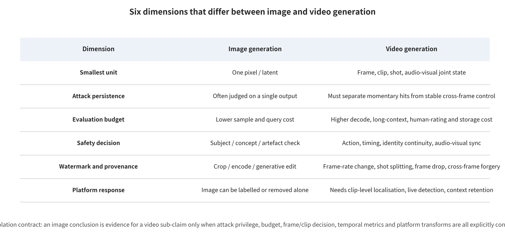

## 7. Video Generation Special-Topic Synthesis: Time, Motion, Audio-Visual, and Streaming State

### 7.1 Minimum Evaluation Units and Valid Denominators

<!-- new_id=A-V2-07-001 origins=L00167-L00171 evidence=LF-A018-LF-A019;LF-A036 action=merge -->

At a minimum, video safety must declare five levels of evaluation units at once. Frames capture instantaneous visual states. Contiguous windows or clips capture actions and local audio-visual relations. Shots capture editing and identity continuity. Whole videos capture complete narratives. Identities/events capture cross-shot or cross-file consequences. T2VSafetyBench's author protocol judges the generated video, not the original prompt. Behavior sequences and temporal risk are likewise the object of image-conditioned video benchmarks [@P034] [@A033]. This evidence supports layered denominators. It does not follow that long videos, live streaming, or all identity events are already covered by any single benchmark.

<!-- new_id=A-V2-07-002 origins=L00169-L00171,L00190-L00197 evidence=LF-A019;LF-A024;LF-A036 action=merge -->

The total number of extracted frames is not a valid denominator. Adjacent frames are highly correlated, so a frame-level hit is not an independent sample. Protocols should report independent prompts, seeds, clips, shots, videos, identities, and events as separate counts. They should also preserve the correlation structure within one video. Conditional pass, generation completion, video risk, output blocking, and actual delivery form consecutive but distinct denominators. The protocol must not first collapse image quality, temporal consistency, identity persistence, event adjudication, audio-visual synchronization, human review, benign utility, and resource cost into a single safety score. Only when clip length, frame rate, model, moderator, budget, and undecidable rules agree do author percentages become comparable. This survey did not obtain the independent variances and protocols needed for aggregation.

### 7.2 Boundary Frames, Spatiotemporal Backdoors, Motion, and Trajectories

<!-- new_id=A-V2-07-003 origins=L00172-L00177,L00120,L00124 evidence=LF-A022;LF-A034-LF-A035;LF-D053 action=merge -->

Boundary frames and intermediate trajectories are different safety objects. Input moderation may see no more than the text, the first frame, or the last frame. The generator decides the actions and shots in between. The author results of Two Frames Matter support the claim that "safety of boundary states does not entail safety of intermediate events," and TEAR's author protocol separates temporal semantics from input filtering [@LN05] [@LN04]. Under a specified text-to-video training setting, the author experiments of BadVideo demonstrate a spatiotemporal backdoor. They also discuss normal quality [@P007]. The three cannot substitute for one another. Conditional completion, red-team search, and training backdoors sit at different privilege levels and different causal positions.

<!-- new_id=A-V2-07-004 origins=L00172-L00177,L00187-L00189 evidence=LF-A022;LF-A034-LF-A035 action=merge -->

On complete clips and at event boundaries, evaluation should record when the target first becomes visible, how long it persists, and whether it forms at all. It should also vary the model version, the clip length, the frame rate, the aspect ratio, the camera motion, and the conditioning modality. Clean controls must retain normal complex motion and narrative. The earliest controls include joint review of boundary conditions, segmented checks during generation, output review at shot and event level, and signature and composition differencing of motion modules. An adaptive bypass may delay semantics, disperse it across shots, or exploit long context. Defenses may in turn obtain false safety by rejecting complex motion wholesale. Existing image LoRA backdoors and whole-video backdoors offer only analogy and partial direct evidence. They cannot be written as an independent malicious motion module that has been validated across multiple base models.

### 7.3 Joint Audio-Visual Identity, Semantics, and Moderation

<!-- new_id=A-V2-07-005 origins=L00178-L00180 evidence=LF-A018;LF-A024;LF-A032 action=merge -->

Audio carries speaker, language, emotion, and event cues. The picture carries faces, lip movements, actions, and scenes. When both are normal, their combination may still form impersonation. When both are anomalous, the result may still be merely legitimate dubbing, translation, or network latency. AVFF's author results indicate that audio-visual feature fusion can serve deepfake detection. They also expose cross-dataset transfer limits. T2VShield's author framework incorporates audio-visual consistency into multi-layer video defense [@LN02] [@R-A024]. These studies support the direction of joint modeling. They do not, however, prove that high-quality audio-visual content generated in sync is necessarily detectable. Nor can audio-visual inconsistency be attributed directly to malice.

<!-- new_id=A-V2-07-006 origins=L00178-L00180,L00190-L00204 evidence=LF-A018;LF-A024;LF-A032;LF-A039 action=merge -->

The minimum protocol should count independent speakers, identities, languages, events, and videos. It should compare visual, audio, simple fusion, and temporal joint models. It should include original recordings, authorized dubbing, compression, noise, editing, cross-language material, and synchronized synthesis. Reporting should cover identity confirmation, temporal localization, latency, and human review. Subject-driven systems must draw further distinctions among "the right to upload material," "the right to generate a specified expression," and "the right to publicly disseminate". Portrait and audio-visual mitigations described in system cards are vendor claims, specific to one product version rather than third-party effects [@R-A035]. In live streaming or meetings, the final denominator also counts how long an event takes to reach first alert, to have its spread stopped, and to have copies recalled. Offline accuracy cannot substitute for real-time handling.

### 7.4 Content/Motion Memory, Caching, and Long-Horizon Resources

<!-- new_id=A-V2-07-007 origins=L00181-L00186,L00128-L00137 evidence=LF-A007;LF-A031;LF-A033;LF-E198 action=merge -->

Video privacy requires distinguishing content memory from motion memory. A model may not copy an entire file, yet it may still reproduce identity backgrounds, consecutive frames, distinctive actions, or voices. The author analysis of video memorization research directly supports keeping the frame, clip, and motion levels distinct. For the query and deduplication relation, image training-data extraction offers a historical reference only [@A047] [@P024]. Confirmation requires candidate training clips, the authorization and duplication status of each, visual/motion/audio matching, non-member baselines, and human verification. Whole-video average distances mask local leakage. Similarity of common actions cannot by itself prove training membership.

<!-- new_id=A-V2-07-008 origins=L00184-L00186,L00131-L00137,L00254-L00255 evidence=LF-A031;LF-A033;LF-E198 action=merge -->

A single sampling pass no longer bounds resource use in long videos. Cross-frame attention, decoding, frame interpolation, audio, post-processing, and session caching all add to the load. In streaming services, cancellation release, queues, state recovery, and cross-tenant reuse each require separate measurement. The approximate caching paper provides evidence from a shared text-to-image service. It is not yet sufficient to prove that an equivalent attack effect holds in long-video or commercial streaming architectures [@P039]. In an isolated environment only, the minimum test therefore increases load with clip length and modality. It reports GPU seconds, peak GPU memory, and tail latency, plus cancellation release, normal task completion, and quality. Tenant budgets, preemptible queues, segmented submission, cache safety keys, and retry caps are the engineering defenses in use. They stop short of claiming that video-specific optimal thresholds already exist.

### 7.5 Video Watermarking, Provenance, Transcoding, and First Alert

<!-- new_id=A-V2-07-009 origins=L00146-L00150,L00278-L00293 evidence=LF-A020-LF-A021;LF-A038;LF-D061;LF-D081-LF-D083 action=merge -->

Averaging per-frame image watermark detections cannot stand in for video authenticity. The signal and the denominator both change under frame deletion, frame insertion, speed changes, shot cuts, local replacement, audio track replacement, segmented encoding, and repeated platform transcoding. VideoSeal's author results and open implementation support a temporally propagated embedding route. At generation time, the author results of VideoShield support a latent-state signal, together with spatial/temporal localization. The two require different model access, data, transformations, and resource contracts [@P033] [@R-A020]. Image watermarking research can provide only analogy by transformation category. It cannot supply facts about video spatiotemporal survival.

<!-- new_id=A-V2-07-010 origins=L00146-L00150,L00278-L00293,L00306-L00308 evidence=LF-A020-LF-A021;LF-A038;LF-D061;LF-D064;LF-D081-LF-D083 action=merge -->

Reporting should separate whole-video detection from clip localization, the shortest detectable duration, and the longest missed-detection interval. Payload accuracy, clean false positives, temporal flicker, throughput, peak memory, and first alert must be reported separately too. For ordinary, segmented, and dynamic video, C2PA 2.4 sets different binding and verification semantics. Being representable in the specification does not mean that CDNs, editors, players, and platforms already interoperate [@O001]. Testing must proceed hop by hop: the uploaded original, the internal master, each transcode, the downloaded file, and the re-upload. Platforms must also retain the versions of the verifier and the trust list. For live streaming, stream interruption, out-of-order delivery, and state recovery also require testing. Post hoc detection may be accurate, but if the first alert comes later than the spread window, that cannot be written as the risk having been interrupted in time.

### 7.6 Inheritable Conclusions, Non-Inheritable Conclusions, and Open Gaps

<!-- new_id=A-V2-07-011 origins=L00167-L00189 evidence=LF-A018-LF-A036 action=merge -->

Image research contributes contracts and experimental design by inheritance. Data and artifacts need identity, and attack and benign utility need dual denominators. Detection must consider unknown generators and low base rates, and watermarking must state attack knowledge clearly. Provenance credentials do not amount to facts, and platform actions must remain appealable. Numerical and factual conclusions cannot be inherited. Video results do not follow automatically from ASR, AUC, watermark survival, or perturbation transfer measured on images. Single-frame detection cannot stand for clips, shots, or events. Image near-duplication cannot define motion memory. Offline transcoding cannot prove live-streaming state. Face similarity cannot substitute for joint audio-visual identity and authorization.

<!-- new_id=A-V2-07-012 origins=L00175-L00189,L00190-L00212 evidence=LF-A018-LF-A036;LF-R205 action=merge -->

Malicious motion or camera modules remain an open gap, together with multi-adapter combinations, cross-shot and very-long-context drift, and adaptive attack and defense on synchronized audio-visual content. Commercial services leave content/motion/identity memory unresolved, along with video-specific cost amplification, long-term cross-platform provenance retention, and victim remedy. In advance, each follow-up study should bind the model version, the clip length, the frame rate, the shot, the audio-visual setting, the budget, the benign utility, and the stopping rules. Without these fields, a study can only be called a mechanism hint or an engineering hypothesis. This survey did not meta-analyze heterogeneous video and image results. It did not upgrade the existence of static code to execution, and it did not conduct end-to-end paper reproduction. Survey wording therefore leaves these gaps open rather than closing them.

### 07.E1 Evidence Expansion: Video Generation Special Topic: Time, Motion, Audio-Visual, and Real-Time Propagation

#### 07.E1.1 Reprojecting the Seven First-Broken Interfaces onto Video States

<!-- new_id=M-L00167 origins=L00167 evidence=LF-A018-LF-A023 action=move -->
Video is not "a collection of many independent images." Frames, contiguous clips, shots, subject trajectories, camera trajectories, events, audio, editing history and streaming state constitute it jointly. In video the seven interfaces keep contracts that remain distinguishable, but no assumption is made that they are mathematically mutually exclusive. Provenance and contamination of training clips, actions and audio belong to I1. Base models, motion modules, character LoRAs, audio encoders and workflow artifacts belong to I2. Text, start/boundary frames, reference video, pose, trajectory and audio conditions belong to I3. Temporal layers, personalization and alignment updates belong to I4. Long-horizon sampling, memory, caching and resources belong to I5. Cross-frame watermarking, audio-visual detection and provenance chains belong to I6. Identity, propagation and real-world consequences belong to I7. Most objects can take the label `primary_first_break`. Where synchronization fails genuinely, evidence is ambiguous or information is insufficient, the label is instead `co_primary`, `ambiguous` or `unknown` respectively.

<!-- new_id=M-L00168 origins=L00168 evidence=LF-A018-LF-A023 action=move -->
One event may span several interfaces, but classification follows whichever security contract breaks first. An unauthorized portrait that enters the training set first is classified under I1. A malicious character LoRA that is loaded falls to I2. A boundary frame that induces an intermediate event is classified under I3. Personalization training hijacking falls to I4. Black-box extraction of a training clip is classified under I5. A video watermark that fails after transcoding falls to I6. Later spread by an impersonating account is classified under I7. Interfaces further along record propagation, and they are not counted a second time as independent attack families. The approach lets a defense occupy the earliest position at which it is effective.

#### 07.E1.2 Minimum Evaluation Unit and Valid Denominator

<!-- new_id=M-L00169 origins=L00169 evidence=LF-A018-LF-A023 action=move -->
Video safety needs evaluation units at no fewer than five levels. A frame-level unit captures brief visual content. A window-level or clip-level unit captures actions and local audio-visual relations that persist across several frames. The shot level covers editing and identity continuity. The whole-video level covers the complete narrative. The identity/event level reaches across multiple shots and files. For action order, causality and lip sync, one frame is not a complete target. Flickering watermarks are the opposite case, where averaging over the whole video hides local failures. A protocol must state which level the risk belongs to before it specifies the denominator.

<!-- new_id=M-L00170 origins=L00170 evidence=LF-A019;LF-A036;LF-E114 action=move -->
The valid denominator is not the total count of sampled frames. Adjacent frames correlate strongly, so treating one as an independent sample inflates both the sample size and the confidence level. Count independent prompts, seeds, clips, identities or events, and stratify the correlation inside a single video. T2VSafetyBench judges safety from generated videos rather than from prompts. SafeGen-Bench builds evaluation for image-conditioned videos. The two designs together support a denominator that moves level by level, from conditioning success through generation success to video-level judgment [@P034] [@A033].

<!-- new_id=M-L00171 origins=L00171 evidence=LF-A018-LF-A023 action=move -->
At a minimum, the metric set must cover spatial semantics and image quality, temporal consistency, identity persistence, action/event accuracy, audio-visual synchronization, local and whole-segment safety judgment, human review, benign utility, generation cost and failure rate. Watermark work adds temporal localization, cross-frame robustness and transcoding. Privacy work adds training-clip correspondence, content/motion memory and non-member false positives. Availability work adds GPU time, GPU memory, tail latency and release on cancellation. These metrics must not be normalized and then averaged into a "composite safety score." Such a score carries no real meaning.

#### 07.E1.3 Boundary Frames, Trajectories, and Temporal Composition Attacks

<!-- new_id=M-L00172 origins=L00172 evidence=LF-A034-LF-A035 action=move -->
Video conditioning has a delayed-manifestation property. Input moderation sees the text, the starting frame or a few boundary frames. What the generator returns is the action trajectory that runs between them. Two Frames Matter shows the limit of that view. Two boundary states alone cannot cover the intermediate temporal process that the model completes between them [@LN05]. TEAR brings temporal awareness to automated red teaming. Evaluations can then be built around events and trajectories, not isolated frames [@LN04]. Both papers give risk mechanisms and results for particular models. This survey does not repeat their prompts, optimization objectives or parameter settings, since those could be used directly to bypass real systems.

<!-- new_id=M-L00173 origins=L00173 evidence=LF-A018-LF-A023 action=move -->
Compositional semantics also arise from long temporal sequences. Each frame on its own may violate nothing, yet a violating event can emerge from the action order, from the shot transitions or from the subtitle—image combination. The reverse also holds: a frame that looks sensitive may be legitimate in a documentary, medical or anti-violence setting. Defense needs to predict the risk trajectory before generation. It checks in segments during generation. After output it reviews the complete event and keeps temporal localization for appeals. Random frame sampling can only be a first stage of cost optimization. It must not serve as the sole review for high-risk tasks.

<!-- new_id=M-L00174 origins=L00174 evidence=LF-A018-LF-A023 action=move -->
Attack transfer evaluation needs to vary the model version, frame rate, length, aspect ratio, camera motion, conditioning modality and moderator, and to record the query budget. Failure may have several origins. The generative model may be unable to hold the target trajectory. Boundary conditions may be moderated jointly. An in-generation check may abort the task. An audio-visual or event judge may flag an anomaly. Output quality may fall to unusable. Benign utility is the other side of the ledger. It must check the motion diversity and narrative completeness of ordinary creation, so that a defense does not falsely reject all complex motion.

#### 07.E1.4 Motion Modules, Camera Control, and Long-Term Memory

<!-- new_id=M-L00175 origins=L00175 evidence=LF-A018-LF-A023 action=move -->
Motion modules and camera controllers do more than change appearance. They also change temporal attention, speed, direction, shot transitions and viewpoint. In a supply chain they can be paired with character LoRA, VAE, ControlNet and frame interpolators. In training they can be updated on their own. At inference they take trajectory or pose conditioning. Safety tests should therefore cover modules loaded singly, in pairs and in risk-driven higher-order combinations. They should not enumerate every permutation exhaustively and then declare completeness.

<!-- new_id=M-L00176 origins=L00176 evidence=LF-A022;LF-A028;LF-D053;LF-E117;LF-E123 action=move -->
This search round confirmed image LoRA backdoors [@P006] and text-to-video whole-model backdoors [@P007]. It turned up no first-hand research that meets all of these conditions at once: a malicious motion module or camera LoRA as an independently distributed artifact, a backdoor shown across several video bases and composition workflows, reported hashes/versions, benign motion utility, adaptive defenses and whole-clip judgment. This gap must be preserved as it stands. Engineering practice can adopt allowlists, signatures, SBOMs, sandboxes, composition differentials and revocation mechanisms now. Those preventive controls, however, must not be presented as a confirmed attack reproduction.

<!-- new_id=M-L00177 origins=L00177 evidence=LF-A018-LF-A023 action=move -->
Long-term memory propagates across clips and across streaming sessions as well. Character identity, scene and motion state may sit in context, cache or reference memory, and an anomaly in one place then reaches distant frames. Research should plot risk as a function of clip length, shot count and context window. It should add a short-clip control at the same compute budget, and it should separate ordinary quality drift from safety-event drift and from memory leakage. Most current public safety benchmarks concentrate on short clips. For ultra-long videos and persistent sessions, the evidence is still insufficient.

#### 07.E1.5 Joint Audio-Visual Identity, Semantics, and Moderation

<!-- new_id=M-L00178 origins=L00178 evidence=LF-A018-LF-A023 action=move -->
Sound carries speaker identity, language, emotion, environment and event cues into video. Vision and audio may each look normal and still combine into impersonation or deception. In the other direction, the imagery may be anomalous while the voice-over states outright that it is satire, education or reenactment. Audio-visual attack and defense therefore cannot stop at adding the scores of two independent classifiers. Instead, they should model "who says what and when, whether the lip sync matches, whether the voice is consistent with the scene, and whether the identity is authorized."

<!-- new_id=M-L00179 origins=L00179 evidence=LF-A024;LF-A032;LF-E119 action=move -->
AVFF pairs audio and visual features for deepfake detection and reports cross-dataset evaluation [@LN02]. T2VShield folds audio-visual consistency into a video defense framework [@R-A024]. Both works point toward joint moderation. Neither can prove that audio-visual content generated in sync and at high quality will necessarily be caught. Ordinary dubbing, translation, accessibility audio tracks and network latency can each cause inconsistency. Without those benign baselines, a defense may raise false positives systematically on legitimate content.

<!-- new_id=M-L00180 origins=L00180 evidence=LF-A018-LF-A023 action=move -->
A qualified protocol should count by independent speaker, identity, language, event and video. It should compare vision-only, audio-only, simple fusion and temporal joint models. It should include genuine original recordings, legitimate dubbing, compression, noise, editing, cross-language material and synchronized synthesis. It should measure detection, identity verification, temporal localization, cross-domain performance, latency and human review. For live streams or meetings it must also report the delay from event occurrence to interception. High offline accuracy cannot offset the real-time propagation window.

#### 07.E1.6 Video Privacy, Content Memory, and Motion Memory

<!-- new_id=M-L00181 origins=L00181 evidence=LF-A007;LF-A031;LF-E102 action=move -->
More identifiable dimensions appear in video training data: faces, bodies, residences, license plates, children, medical or workplace scenes, voices, gait, actions and the photographer's trajectory. A model may fail to reproduce an entire video and still reproduce the same identity background, consecutive frames or distinctive motion across multiple outputs. Investigating Memorization in Video Diffusion Models separates content memory from motion memory. That distinction gives direct grounds for the minimum analysis framework [@A047]. Work on extracting image training data, in turn, supplies a historical reference for query-based extraction and its link to deduplication [@P024].

<!-- new_id=M-L00182 origins=L00182 evidence=LF-A018-LF-A023 action=move -->
Confirming video privacy calls for a stricter provenance ledger than images do. A candidate training set may have been sliced, re-encoded, speed-changed, cropped or stripped of its audio tracks, so file hashes are insufficient. Visual near-duplicates, motion features, audio fingerprints and temporal alignment have to be used together. The protocol should also report how often a candidate training clip occurs in the corpus, whether it is publicly available, its authorization status, the model access budget and the non-member controls. High similarity of common actions or scenes does not prove membership. Identity similarity may also reflect personalization capability rather than memory.

<!-- new_id=M-L00183 origins=L00183 evidence=LF-A018-LF-A023 action=move -->
Defenses begin before training, with cross-modal deduplication and authorization for sensitive identities. During training they add privacy monitoring. At the output end they block frame/clip/motion near-duplicates, link queries, apply rate limits, and run victim verification and deletion procedures. Three residual risks remain: strict thresholds falsely block common shots, cross-modal retrieval is costly, and derived checkpoints after deletion may still retain the content. Evidence remains insufficient to estimate the overall memorization rate or the risk to an individual in commercial video generation services. Nor can it be extrapolated from a few open models.

#### 07.E1.7 Long-Duration Resources, Streaming State, and Service Availability

<!-- new_id=M-L00184 origins=L00184 evidence=LF-A018-LF-A023 action=move -->
Per-task boundaries are usually fairly clear in image generation. Video multiplies the cost across frames, windows, decoding, audio, frame interpolation and post-processing. Streaming or interactive generation also keeps state across turns, so a per-request quota cannot fully represent occupancy. Several states carry risk: over- or under-estimated resource reservation, failure to release after cancellation, cross-tenant caching, long-task queuing, retries after failure and partial-result return.

<!-- new_id=M-L00185 origins=L00185 evidence=LF-A033;LF-E198 action=move -->
For image diffusion runtimes, approximate cache attacks supply concrete evidence that cache similarity boundaries shape both outputs and resources [@P039]. First-hand empirical evidence of their attack effectiveness on long videos, on joint audio-visual settings and on commercial streaming architectures is not yet sufficient. Video DoS likewise has no public research with a clear attack budget, a benign-tenant denominator, GPU/queue measurements and adaptive defenses. This chapter therefore offers falsifiable tests only. In an isolated environment, raise load gradually as a function of duration and modality. Then measure the resource curve, release on cancellation, tail latency and completion of benign requests. It does not provide request orchestration or threshold probing against real endpoints.

<!-- new_id=M-L00186 origins=L00186 evidence=LF-A018-LF-A023 action=move -->
On the engineering side, defenses include task-admission estimation, aggregate budgets per tenant and organization, preemptible queues, segmented submission, hard timeouts, cancellation reclamation, cache safety keys, retry caps after failure, cost alerts and cross-tenant isolation. Tests must report benign video quality, long-task completion rate and user wait time at the same time, so that a blanket ban on long videos is not traded for surface-level availability.

#### 07.E1.8 Cross-interface defense in depth and the unclosed agenda

<!-- new_id=M-L00187 origins=L00187 evidence=LF-A018-LF-A023 action=move -->
For video safety, the defense-in-depth chain begins with data and artifacts instead of pushing all the pressure onto final content review. I1 reduces memory and rights risks through authorization, clip deduplication and sensitive-identity governance. I2 keeps motion modules and LoRA in check through signing, SBOM, sandboxing and compositional differencing. I3 covers boundary frames through joint conditional review and trajectory prediction. I4 controls updates through temporal-layer training audit and version revocation. I5 protects privacy and availability through near-duplicate blocking, tenant isolation and resource governance. I6 improves traceability through cross-frame watermarking, audio-visual detection and provenance chains. I7 reduces real-world consequences through propagation restrictions, identity verification, victim remedy and evidence preservation. A failure in any single layer should be contained by later layers. Those later layers, however, are no excuse for laxity upstream.

<!-- new_id=M-L00188 origins=L00188 evidence=LF-A001;LF-A005;LF-A007;LF-A015;LF-A019-LF-A020;LF-A022;LF-D051;LF-D053;LF-D057;LF-D067;LF-D083;LF-E096;LF-E100;LF-E102;LF-E110;LF-E114-LF-E115;LF-E117 action=move -->
The current evidence is clearest on image diffusion backdoors, conditional jailbreaking, training data extraction, image watermarking attack and defense, and on several short-video safety benchmarks, video backdoors and video watermarks [@P001] [@P008] [@P024] [@P030] [@P034] [@R-A020] [@P007]. Seven agendas remain unclosed. (1) DoS and cost amplification specific to generative video. (2) malicious motion modules, camera LoRA and multi-adapter combinations. (3) safety drift across shots and over ultra-long contexts. (4) adaptive attack and defense when audio-visual generation is synchronized. (5) content/motion/identity memory in commercial video models. (6) long-term retention of watermarks and provenance credentials across platform re-uploads. (7) event-level, low-base-rate, victim-centered validation from model output to real-world harm.

<!-- new_id=M-L00189 origins=L00189 evidence=LF-A018-LF-A023 action=move -->
These gaps can be ranked by falsifiability. The first step is to fix the system boundary and the minimum evaluation unit. The second is to disclose versions, budgets, denominators, clean utility and failure conditions. Only then should adaptive defenses and cross-platform transfer be tested. Without these elements, a static reading of a repository can only be called a code audit. An authors' table can only be called reported values. A product system card can only be called a first-hand vendor self-report. None of the three can be rewritten as a local end-to-end reproduction or as a proof of field effectiveness.

#### 07.E1.9 Validation contracts for four deployment scenarios

<!-- new_id=M-L00190 origins=L00190 evidence=LF-A019;LF-A023;LF-A034;LF-E114;LF-E118 action=move -->
For text-to-video services, text is the core input. Systems usually review the text before submission and the video after generation. Validation contracts should include direct risk expression, semantic rewriting, long prompts, multi-turn modification and cross-lingual conditions. They must not publish red-team corpora as a set of violation prompts that can be copied directly. For each condition, the record needs to capture the pre-review result, whether generation was started, whether generation completed, full-video risk, clip localization, output review and final delivery. A record that captures only "the prompt was accepted" cannot prove that the model produced the target event. A record that captures only "some frame was judged anomalous" cannot prove that the content was obtained by a user. Taken together, T2VSafetyBench, video jailbreaking research and TEAR show that video output and temporal trajectories should enter the determination [@P034] [@R-A023] [@LN04]. Prompt text should not stand in for generation results.

<!-- new_id=M-L00191 origins=L00191 evidence=LF-A025-LF-A027;LF-A036;LF-E120-LF-E122 action=move -->
Image-to-video services additionally accept faces, photos of people, artworks and scene images. Their primary problem is that the input image itself may be safe. The motion, camera work or context that the model completes can cross the authorization boundary. I2VGuard, Anti-I2V and VPA-Guard provide evidence from different directions, namely protecting the input image and safeguarding visual prompts [@R-A025] [@R-A026] [@R-A027]. SafeGen-Bench isolates safety evaluation for image-conditioned video [@A033]. Validation should count by independent subject and independent image. It should record image authorization, perceptual quality before and after protection, benign animation utility, and transfer across models and preprocessing. Risk should be judged by the complete action, not by first-frame similarity. A defender's perturbation that makes legitimate animation entirely unusable cannot be called a cost-free success merely because it blocked one class of misuse.

<!-- new_id=M-L00192 origins=L00192 evidence=LF-A039;LF-E130 action=move -->
Subject-driven or digital-human systems often combine likeness, voice, text scripts, motion templates and brand assets. Their security contract should keep three rights apart. These are "the right to upload material," "the right to generate a certain expression" and "the right to publicly disseminate." Owning a public photo does not mean obtaining authorization for a person's endorsement, intimate content or political expression. Testing should use licensed synthetic or volunteer material, so that red-teaming does not create new victim content. Identity persistence, voice similarity, lip sync, script semantics, scene and account labels need to be evaluated jointly, while the scope, duration and withdrawal of consent are recorded. The likeness controls and provenance measures described in the Sora 2 System Card can serve as a product-mechanism case. Their coverage and field effects remain bound to the corresponding version and vendor evaluation [@R-A035].

<!-- new_id=M-L00193 origins=L00193 evidence=LF-A018-LF-A023 action=move -->
For editing, extension and streaming video systems, the inputs are not only source material. They also include the existing timeline, masks, local inpainting, preceding and following boundaries, historical sessions and continuous state. Risk may accumulate after multiple rounds of modification. Each edit is individually compliant, yet the combined narrative or identity changes. The provenance credentials of older clips may be lost at export. Extension tasks may also reuse earlier caches. The validation contract needs to save each round's input, policy version, edit scope, derivation relationships and review decisions. It must re-evaluate over the complete timeline, rather than checking only the newly added clip. For live-style generation, abort points and latency caps should be set. The three outcomes of "detected," "propagation stopped" and "copies recalled" should also be distinguished.

<!-- new_id=M-L00194 origins=L00194 evidence=LF-A018-LF-A023 action=move -->
All four scenario classes should include benign-task controls. Text-to-video should retain legitimate complex narratives and cross-lingual creation. Image-to-video should retain authorized portrait animation, education and accessibility uses. Digital humans should retain customer service, training and artistic performance with explicit consent. Editing and streaming systems should retain documentary work, news editing and real-time visualization. Some defenses report recall only on malicious sets, and never report the rejection, latency, quality and identity errors on these clean tasks. Such a defense cannot be used for deployment decisions. Especially in low-base-rate environments, a small number of false positives may affect a large number of benign users. Thresholds should therefore be adjusted with the scenario's consequences, human review capacity and appeal channels.

<!-- new_id=M-L00195 origins=L00195 evidence=LF-A018-LF-A023 action=move -->
Scenario-based validation must also have a temporal dimension. Pre-launch offline benchmarks serve to find known failures. The gray-release stage validates versions, regions, languages and load changes. Post-launch monitoring tracks drift in models, policies, moderators and platform transcoding. After major incidents, saved anonymized evidence is replayed. At revocation, old versions, caches and derived artifacts are checked. Every report is bound to a model hash or immutable version, a moderator version, a date and an evaluation-set version. If a system update merely carries over an old report, the evidence should be marked expired. A single pass should not be interpreted as permanent certification.

<!-- new_id=M-L00196 origins=L00196 evidence=LF-A018-LF-A023 action=move -->
Attack costs across scenarios must also be accounted for uniformly, but their results must not be merged. Black-box conditional attacks record queries and generation budget. Personalized attacks record samples, training and waiting. Supply chain attacks record artifact production and distribution. Privacy extraction records candidate retrieval and human confirmation. Authenticity evasion records processing, queries and quality loss. Platform abuse records accounts, placement and the maintenance of a credible context. The same "succeeded once" may correspond to completely different costs and real-world reachability. This survey compares only mechanisms and evidence levels. It does not arrange heterogeneous percentages into a simple leaderboard.

<!-- new_id=M-L00197 origins=L00197 evidence=LF-A018-LF-A023 action=move -->
Finally, scenario validation should specify stop and disclosure rules in advance. Suppose researchers observe output that may point to a real individual, a minor, private material or a weakness in a usable service. They should then stop extending generation, isolate the evidence, restrict access and notify the appropriate responsible party. A public paper should retain only the mechanisms, denominators and summaries sufficient to review the conclusions. It should not disclose reusable payloads. The DoS, malicious motion modules and long-duration audio-visual combinations remain unclosed. For these, minimal-risk experiments should first be run on locally isolated models or synthetic data. Validation against real services should be considered only after authorization is obtained and resource and ethical limits are set.

#### 07.E1.10 The closed loop from risk discovery to victim remedy

<!-- new_id=M-L00198 origins=L00198 evidence=LF-A018-LF-A023 action=move -->
The last evaluation object of video attack and defense is not the classifier. It is the closed loop of handling. Once a model or platform detects high-risk content, it needs to answer several questions. Who can see the original evidence? Who has the authority to pause generation or propagation? How is the impersonated person notified? How are similar copies searched? How are appeals handled? How is investigative material preserved? When are restrictions lifted? If there are only detection scores, with no responsible party and no time limits, risk may continue to propagate through organizational handoffs. If sensitive media are retained indefinitely for investigation, that in turn creates new privacy and access risks.

<!-- new_id=M-L00199 origins=L00199 evidence=LF-A018-LF-A023 action=move -->
Incident triage is the first stage of the closed loop. The system should set priority by combining content type, identifiability of the person, whether the subject consented, audience size and propagation speed. It should also weigh whether minors are involved, whether payments or public affairs are involved, and the state of provenance evidence. Automated models can provide candidate labels and temporal locations. High-consequence decisions require review by trained personnel. Reviewers should see the necessary minimum of information. Access control, audit and mental health safeguards should protect them. The claim that "the model's confidence is high" is no grounds for skipping legal and contextual judgment.

<!-- new_id=M-L00200 origins=L00200 evidence=LF-A018-LF-A023 action=move -->
The second stage is containment and evidence preservation. The generation side can pause delivery. The upload side can restrict recommendation and reposting. The platform can establish temporary matching for similar copies. These measures must distinguish emergency freezing from final determination. Preservation records should include immutable media digests, provenance credential status, model and policy versions, timelines, handling actions and access logs. Original sensitive material should be encrypted and isolated. Saving only screenshots may lose the audio track, temporal localization and credentials. Saving only complete copies may in turn exceed the necessary scope. Tiered preservation and expiry-based deletion are therefore needed.

<!-- new_id=M-L00201 origins=L00201 evidence=LF-A042;LF-E133 action=move -->
The third stage is notification, appeal and remedy. Impersonated persons or rights holders should receive understandable notice, a channel for submitting supplementary evidence, and the progress of handling. Ordinary uploaders should be able to learn the reason for a restriction and appeal a false positive. Remedy should not merely delete the first link. It should also check derived clips, audio-track replacement, mirrored uploads, search indexes and recommendation caches. For verified provenance content, labels and distribution should be restorable. That keeps authenticity infrastructure from becoming a tool for suppressing legitimate expression. The relevant U.S. notice-and-takedown statutory process provides one institutional example [@O014]. Specific platforms still need to design according to the applicable jurisdiction.

<!-- new_id=M-L00202 origins=L00202 evidence=LF-A018-LF-A023 action=move -->
The fourth stage is post-mortem and prevention. After an incident ends, several findings should be mapped back to data, artifacts, training, inference, authenticity and platform controls. Those findings are the first-broken interface, missed signals, decision latency, false positives, affected subjects, propagation paths and remedy outcomes. If unauthorized training clips are the root cause, merely strengthening output review cannot close the loop. If platform account takeover is the root cause, retraining the generative model will not solve it either. The rules, probes or hashes produced by the post-mortem need version management. Their side effects on benign content and vulnerable groups must be tested.

<!-- new_id=M-L00203 origins=L00203 evidence=LF-A018-LF-A023 action=move -->
Closed-loop evaluation should report at least detection latency, human confirmation latency, propagation-pause latency, similar-copy coverage, appeal handling, restoration of correct content, victim notification and evidence deletion. It should not report only the "number of deletions." The denominators of these metrics are independent incidents, independent copies, independent appeals and independent victims, in that order. They cannot be interchanged. For live or high-propagation incidents, the exposure that already occurred before handling should also be reported. Rapid post-hoc deletion cannot erase views and downloads that have already happened.

<!-- new_id=M-L00206 origins=L00206 evidence=LF-A018-LF-A023 action=move -->

<!-- new_id=M-L00207 origins=L00207 evidence=LF-A018-LF-A023 action=move -->
**Table: Differences between the image and video safety evidence contracts**

<!-- new_id=M-L00208 origins=L00208 evidence=LF-A018-LF-A023 action=move -->
| Dimension | Minimum image contract | Additional video contract | Should report | Prohibited substitution |
|---|---|---|---|---|
| Sampling unit | Single image, single output | Frame, clip, shot, full video | Per-layer denominators and indeterminate items | Reporting only the mean frame score |
| Temporal consistency | Usually no temporal ordering | Persistence of identity, action, objects, and background | Trajectory consistency, drift, longest failure segment | Cherry-picking successful frames |
| Trigger semantics | Pixels, text, latent variables | Trajectories, frame sequences, delayed events, audio-visual combinations | Trigger visibility and duration | Per-frame triggers substituting for clip triggers |
| Safety determination | Subject, concept, artifacts | Events, narrative, actions, and audio-visual synchronization | Clip-level recall and localization error | Single-frame review equated with full-video safety |
| Resources and latency | Request-level GPU, latency | Decoding, long context, streaming state | First alert, GPU seconds, queue occupancy | Discarding failed requests so that their cost is not counted |
| Authenticity | Cropping, compression, editing | Frame dropping and interpolation, speed change, shot division, live transcoding | Transformation chain, windowed detection, state recovery | Testing only the original encoding |

<!-- new_id=M-L00209 origins=L00209 evidence=LF-A018-LF-A023 action=move -->
Note: The data source is `paper/tables/video_contract.csv`. The main text displays 6/8 rows and omits overly long cells. The complete fields and records are governed by that CSV.

<!-- new_id=M-L00210 origins=L00210 evidence=LF-A018-LF-A023 action=move -->
**Table: Video-specific states, attack patterns, and evidence maturity**

<!-- new_id=M-L00211 origins=L00211 evidence=LF-A018-LF-A023 action=move -->
| Interface | Video state | Attack pattern | Unit of evaluation | Evidence status |
|---|---|---|---|---|
| I1 | Training clips and temporal annotations | Poisoning of action, shot, or event descriptions | Clip–annotation pair | Indirect evidence; requires dedicated action-poisoning benchmarks |
| I1 | Identity trajectories and behavior sequences | Unauthorized portrait videos used to train personalized models | Identity–clip–time | Protection research and system claims exist; lacks long-term revocation evidence |
| I2 | Motion modules, spatiotemporal LoRA | Malicious adapters that manifest only in specific combinations | Base–spatial LoRA–motion module combination | High-priority open gap: no high-grade evidence for video malicious motion modules |
| I3 | Boundary frames and intermediate trajectories | Input or first and last frames are safe, but intermediate completion forms a harmful event | Complete clip and event boundary | Recent preprints and benchmarks exist; requires third-party reruns |
| I3 | Long temporal sequences and shot division | Payloads that manifest with delay, cross-shot combinations, or hold only in long context | Shot, event, and full video | Existing work is mainly on short clips; long temporal sequences are an open gap |
| I3 | Camera trajectories and object motion | Reference images or control signals inducing unauthorized motion or scenes | Trajectory and action clip | Visual-conditioning benchmarks exist; lacks validation in physical environments |

<!-- new_id=M-L00212 origins=L00212 evidence=LF-A018-LF-A023 action=move -->
Note: The data source is `paper/tables/video_risk_matrix.csv`. The main text displays 6/16 rows and omits overly long cells. The complete fields and records are governed by that CSV.

---

[← Back to contents](index.md)
