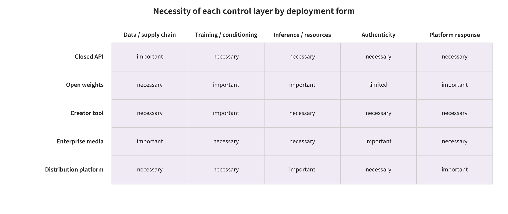

## 9. Discussion: Cross-Family Interpretation and Conditional Deployment Decisions

### 9.1 The Central Question and Constrained Answers to the Four RQs

<!-- new_id=A-V2-09-001 origins=L00545,L00640 evidence=LF-A001-LF-A042;LF-D043-LF-D095;LF-E096-LF-E200 action=merge -->

The central question has a constrained answer in this survey's synthesis. Attack and defense for image and video generation systems do not start from a unified “harmful output”. They start from the security contract that fails first in the end-to-end chain. Only by locking that interface together with attacker privileges, modality state, evaluation unit and evidence layer can the earliest interruption point and deployment choices be discussed. **RQ1** is therefore answered by the joint coding of assets, actors, capabilities, first-broken interface and consequence evidence. **RQ2** shows that mechanisms across the seven interfaces can be synthesized qualitatively, subject to protocol constraints, through privilege, propagation, cost, benign utility and failure conditions. It does not support merging heterogeneous numbers into a single safety score.

<!-- new_id=A-V2-09-002 origins=L00546,L00641,L00642 evidence=LF-A001-LF-A042;LF-D043-LF-D095;LF-E096-LF-E200 action=merge -->

**RQ3** is answered by mirroring defenses onto the first-broken interface while disclosing the root of trust, benign utility, adaptive bypass, operational cost and residual propagation. These controls are conditionally complementary. They are not an already proven universal optimal combination. **RQ4** is answered by using papers, code, system cards, standards, regulations, incidents and local experiments in strict layers. In that layering each kind of material supports mechanisms, implementation, claims, obligations, real-world chains or engineering contracts, and none can be upgraded into another. The above is this survey's synthesis and inference on the available evidence. It is not a proof of defense causal effect, a legal opinion or a unified optimal solution.

### 9.2 Cross-Interface Common Mechanisms, Counterexamples, and Alternative Explanations

<!-- new_id=A-V2-09-003 origins=L00545,L00556,L00567 evidence=LF-A001-LF-A042;LF-D043-LF-D095 action=merge -->

The cross-interface common mechanism identified by this survey's synthesis is not some media artifact. It is the downstream propagation of an upstream failure, in the root of trust, in version, in privilege or in the evidence chain. Data authorization, artifact integrity, conditional capability gates, tenant and resource isolation, authenticity signals and platform case handling correspond to different interruption points. They are combined to keep a single point of failure from continuing to propagate. They are not combined because the evidence has shown that the combination necessarily improves production effectiveness.

<!-- new_id=A-V2-09-004 origins=L00545,L00555,L00559,L00567 evidence=LF-D043-LF-D095;LF-E096-LF-E200 action=merge -->

A counterexample, or an alternative explanation, forces the semantics assigned to a single signal to be downgraded. Non-detection does not equal authenticity. A signature or provenance claim does not prove that a narrative is true or that consent was obtained. The absence of a credential does not equal forgery. The questions answered by detection, watermarking, fingerprinting, signatures, C2PA and platform rules are not interchangeable [@O005] [@O001]. Observed failures may also be caused by version drift, dataset identity shortcuts, a low base rate, a transcoding chain or organizational execution capacity. Without the corresponding ablation, they should not be attributed to a model alone, or to a given control alone.

### 9.3 Closed-Source APIs and Open Weights

<!-- new_id=A-V2-09-005 origins=L00547,L00548,L00549 evidence=LF-D043-LF-D095;LF-E193-LF-E200 action=merge -->

For closed-source APIs, this survey infers a conditional combination. Account authentication and high-risk capability gates, input normalization, tenant and rate isolation, output moderation, watermarking and provenance claims, auditable event records, emergency shutdown and appealable handling all belong to the same chain of responsibility. The combination holds only when the vendor can observe requests and resources, can protect keys, and provides review for false positives. What a product system card supports is that product's mitigation claims and evaluation boundaries. It cannot be extrapolated to mean that closed-source services have already formed an industry-wide closed loop [@O020].

<!-- new_id=A-V2-09-006 origins=L00550,L00551,L00552 evidence=LF-D043-LF-D095;LF-E193-LF-E200 action=merge -->

With open weights, recipients can remove runtime moderation, watermarking and logging. The focus of conditionality therefore moves upstream, to pre-release capability evaluation, safe weight formats, hashing and signing, SBOMs, reproducible builds, staged access and security advisories. Scanning and `weights_only=True` narrow the known deserialization attack surface. They do not guarantee that an artifact has no backdoor, no denial of service or no memory corruption [@O037] [@PyTorchSerialization2026]. If dangerous capabilities can be released at low cost and no feasible mitigation exists, this survey's inference is to delay the release or switch to a controlled API. That is a release gate under risk conditions, not a generalized conclusion about all open models.

### 9.4 Creator Tools and the Enterprise Media Supply Chain

<!-- new_id=A-V2-09-007 origins=L00553,L00554,L00555 evidence=LF-D043-LF-D095;LF-E193-LF-E200 action=merge -->

The conditional goal of creator tools is to preserve the editing lineage. That is not the same as equating every color grading, denoising or lawful post-production step with "full generation." Such a lineage supports limited provenance judgments only under a specific condition. The tool must record acquisition or import, substantive generation and editing operations, software versions, source-element relationships and a verifiable manifest for each export. Users must also be able to inspect and correct attribution. C2PA's expressive capacity for editing relationships, soft binding and video assets does not replace implementation choices about disclosure semantics, privacy, legacy tools without credentials and actual platform retention [@O001] [@C2PAGuidance24].

<!-- new_id=A-V2-09-008 origins=L00556,L00557,L00558 evidence=LF-D043-LF-D095;LF-E193-LF-E200 action=merge -->

The enterprise media supply chain needs to separate three complementary tracks. The first is software artifact signing and SBOM. The second is media watermarking and provenance claims. The third is content scanning and approval logs. Signing answers for the publishing entity and byte integrity. Media credentials record claims about assets and operations. Approval logs record publication responsibility. No single track can replace malicious-behavior scanning and actual content review [@SigstoreBlob2026]. The launch condition this survey infers is this. An organization can locate the derivative artifacts affected by a given asset, model, certificate or supplier within a specified recovery time, and can revoke, preserve and restore them. Without verification on a production-equivalent chain, that is only a design gate rather than an effectiveness claim.

### 9.5 Distribution Platforms, Victim Redress, and High-Risk Operations

<!-- new_id=A-V2-09-009 origins=L00559,L00560,L00561 evidence=LF-D043-LF-D095;LF-E096-LF-E200 action=merge -->

At upload time, large-scale distribution platforms should pair safe parsing, credential verification and cheap hashing with deep detection, identity re-verification and human case systems. That second group covers content that is high-risk, fast-spreading or reported. This is the combination the survey infers. Where base rates are low, risk and evidence quality should drive action together. False positives, false negatives, latency and human workload should be reported by region, language, content length and risk category. A platform's self-reported labeling scale, or the launch of a feature, supports its coverage claims only. It does not replace what independent sampling shows about precision, recall and disposition consequences [@TikTokTransparency2026] [@O042] [@O044].

<!-- new_id=A-V2-09-010 origins=L00549,L00555,L00561,L00566,L00567 evidence=LF-D043-LF-D095;LF-E096-LF-E200 action=merge -->

An "AI probability" alone should not trigger irreversible disposition in victim redress or in high-risk operations. The recommendation is conditional. Preserve the uploaded original and the decision context as it stood at the time. For high-harm cases such as identity impersonation and non-consensual intimate imagery, provide an emergency channel, independent verification of identity and authority, evidence preservation, repeated blocking and a replayable appeal. For news, education, art and lawful post-production, by contrast, retain human review and a restoration path. This is the survey's deployment inference about the evidence and responsibility chain. It is not legal advice, and it does not prove that any platform has already achieved redress effects.

### 9.6 Minimal Combination, Launch Gates, SLOs, and Explicit Rejection Conditions

<!-- new_id=A-V2-09-011 origins=L00562,L00563,L00564,L00565 evidence=LF-D043-LF-D095;LF-E096-LF-E200 action=merge -->

The "minimal combination" in this survey is a responsibility chain bounded by concrete harm budgets. It is not a general-purpose product checklist. Candidate items include data licensing and version ledgers, secure artifact and dependency ingestion, training-release evaluation, condition and resource controls, cooperative provenance signals and open-world detection, and per-hop retention testing. They also include proportional disposition, victim intake, appeals, revocation and incident transparency. A concrete deployment should select only the parts that map to registered assets and first-broken interfaces. Each selected part needs a clear operational owner, and each must be replayable on a production-equivalent chain.

<!-- new_id=A-V2-09-012 origins=L00562,L00563,L00564,L00566,L00567 evidence=LF-D043-LF-D095;LF-E096-LF-E200 action=merge -->

Acceptance conditions at the launch gate must cover the threat model, benign utility and combination attacks, and the low-base-rate false-positive budget. They must also cover end-to-end retention, key and model revocation drills, incident on-call, victim response and appeal restoration. In their respective scenarios, SLOs should pre-register generation and review tail latency, video throughput, and recall at a low false-positive point. Those scenarios should also pre-register signal retention after transcoding, revocation propagation, time to first action and appeal restoration. No threshold should be copied across scenarios. Several conditions should all be explicit `NO-GO`. They are failure to preserve decision evidence, inability to rotate trust roots, absence of production-equivalent chain testing, and lack of an emergency channel for high-harm operations. Vendor self-testing that directly triggers irreversible deletion without review also counts. A conditional `GO` must stay bounded by traffic, capability, region, risk category and termination thresholds.

### 09.E1 Evidence Expansion: Cross-Family Synthesis and Deployment Decisions

#### 09.E1.1 Decision Principle: Choose Controls by Interface and Loss Function, Not Cross-Protocol Ranking

<!-- new_id=M-L00545 origins=L00545 evidence=LF-A037-LF-A038;LF-D060-LF-D061;LF-D077;LF-E126-LF-E127 action=move -->
Deployment decisions protect the whole responsibility chain, from data licensing, training assets, generation APIs, editors and provenance records through to platform disposition. The threat assumption is that a manager will swap multidimensional risk for a single easy-to-compare number. Such a manager mistakes a high-AUC detector, a strong watermark, a compliant signature or a content credential for an interchangeable product. The mechanism starts from the asset–interface–adversary–loss–evidence five-tuple. First list the false positives, false negatives, latency, privacy problems and interruptions that can least be tolerated. Then choose cross-layer controls. Detection covers unknown provenance. Watermarking provides cooperative content signals, and fingerprinting supports matching and recovery. Signatures authenticate the declaring entity, C2PA organizes claims and the editing chain, and platform rules determine actual action. These controls cannot be ranked by a single "accuracy" [@O005] [@O001].

<!-- new_id=M-L00546 origins=L00546 evidence=LF-D043-LF-D095 action=move -->
The executing parties are product owners, model safety, data governance, media infrastructure, trust and safety, privacy/legal and independent audit. Utility/resource budgets must be accounted separately per ten thousand generations, per hour of video and per million uploads. Those budgets include peak latency, GPU, storage, human cases and third-party queries. Every control must give its FP/FN and undecidable status, and trust roots and key/model versions must be rotatable. Adaptive bypass is tested with combination tests. Testing only a single type of compression is not permitted. Updates and revocations must cover historical assets, caches and appeal cases. Actual platform retention is demonstrated with end-to-end samples. The decision output is "allow launch / allow limited launch / block under given conditions." Residual risk is signed off by a clearly identified responsible person, not written as a blanket disclaimer.

#### 09.E1.2 Closed Generation APIs: Strong Audit and Rate Control First

<!-- new_id=M-L00547 origins=L00547 evidence=LF-D059 action=move -->
The protected interfaces are hosted image/video generation APIs, accounts, prompts, reference media and output downloads. The threat assumptions include jailbreaking bypass, identity impersonation, batch generation, credential theft, probing of moderation systems and redistribution after label removal. The minimum control package covers input normalization and layered moderation, identity/high-risk-category gates, tenant and rate isolation, and sampled intermediate or output moderation. It also covers an event ID for each output that cannot be linked to a public identity, content watermarking, C2PA claims, audit logs, reporting and rapid revocation. A Sora 2 system card and the like provide risk-mitigation claims and evaluation boundaries for one specific product. They cannot be extrapolated into an industry-wide closed loop [@O020].

<!-- new_id=M-L00548 origins=L00548 evidence=LF-D043-LF-D095 action=move -->
The executing party is the model provider. Benign utility costs include extra latency for high-risk requests, video-detection GPU, logging and appeal staff. Ordinary creation should get a low-latency path. High-impact identity risks and minor-related risks should use asynchronous or human confirmation. False positives block lawful film, education or news uses. False negatives let scaled abuse exploit provider infrastructure directly. The trust roots are account authentication, protected signing/watermark keys, publication manifests and immutable logs. Attackers can switch accounts, generate step by step and then combine externally, and use API outputs to train de-watermarkers. Behavior must therefore be correlated, while privacy boundaries are set.

<!-- new_id=M-L00549 origins=L00549 evidence=LF-D043-LF-D095 action=move -->
Key leakage, moderation model regression or the launch of an erroneous policy should suspend the corresponding high-risk capabilities. Keys must then be rotated. Mark the impact window, rescan public high-impact outputs and allow appeals. Not all historical provenance records may be deleted. To establish actual platform retention, select major downstreams and verify item by item the status of watermarks and C2PA after upload/transcoding/download. Disposition includes refusal, capability degradation, token freezing, human escalation and a victim channel. If there is no quantifiable abuse monitoring, emergency shutdown, incident preservation or responsible owner, even a high offline safety score should `NO-GO`. Once an output is downloaded, the provider cannot control offline editing and further redistribution. That is the residual risk.

#### 09.E1.3 Open-Weight Release: Release Gating Cannot Depend on Runtime Enforcement

<!-- new_id=M-L00550 origins=L00550 evidence=LF-D048-LF-D049 action=move -->
The protected interfaces are model weights, configuration, tokenizer, sampler, demo code and container images. The threat assumption is that recipients can remove moderation, watermarks and logging, fine-tune to restore erased concepts, or implant code through insecure deserialization. Deployment mechanisms therefore shift away from runtime control. They move to pre-release capability evaluation, data and license records, weight-format minimization, hashing and signing, SBOM, reproducible builds, staged access, licenses and incident response. Hugging Face describes its pickle scanning officially as best-effort and unable to guarantee security. PyTorch's `weights_only=True` narrows the deserialization attack surface, but it does not guarantee protection against denial of service or memory corruption [@O037] [@PyTorchSerialization2026]. A signature can prove the publishing entity/byte integrity only. It cannot prove that the weights have no backdoor.

<!-- new_id=M-L00551 origins=L00551 evidence=LF-D043-LF-D095 action=move -->
The executing parties are model developers, repository operators and downstream deployers. Resources include comprehensive capability testing, build and signing services, container image scanning, access review and security advisories. After an open release, withdrawal capability is limited, so pre-release gating is valued more. False positives over-restrict low-risk research or treat unknown scan items as malicious. False negatives may permanently spread dangerous capabilities/backdoors. Trust roots are hardware or controlled keys, transparent release records, independent review and verifiable hashes. Attackers may seize maintainer accounts, replace dependencies, reuse old signatures, or hide malicious behavior in code rather than in weights.

<!-- new_id=M-L00552 origins=L00552 evidence=LF-D043-LF-D095 action=move -->
A revocation update must publish the affected versions, hashes, severity, replacements and detection methods, and it must propagate to mirrors. No one can claim that deleting the central repository invalidates all copies. Platform retention here means "whether signatures and security advisories can accompany mirrors/derived models." Major repositories and container registries must be spot-checked. Disposition may stop recommendation/download, revoke a signing identity, quarantine a version and notify deployers. Already-downloaded copies remain a residual risk. If a model's dangerous capabilities can be released at low cost and feasible mitigations are lacking, the conclusion should be to delay open release or provide only a controlled API. An easily removable watermark is no justification for release.

#### 09.E1.4 Creator editing tools: preserving editing lineage rather than penalizing legitimate post-production

<!-- new_id=M-L00553 origins=L00553 evidence=LF-A038;LF-D061;LF-D064;LF-D077;LF-E126 action=move -->
The protected interfaces are camera import, timeline editing, generative fill, dubbing, filters, export and collaboration. The threat assumption is that the tools may assist legitimate post-production. They may also partially replace real people, lose provenance within complex timelines, or harm creators by stamping every minor edit with a conspicuous AI label. The mechanism treats source material as an ingredient. It records substantive generation/editing operations and software versions, and it creates a new verifiable manifest on every export. Hard binding is re-signed with the new bytes, while soft binding serves recovery only. C2PA 2.4 offers expressive capability for editing relationships, soft binding, video packaging and segmented live streaming. Implementers must still decide which operations to disclose, how to present them and how to handle privacy [@O001] [@C2PAGuidance24].

<!-- new_id=M-L00554 origins=L00554 evidence=LF-D043-LF-D095 action=move -->
The executing actors are editor vendors, camera/capture devices, cloud collaboration services and publishing endpoints. The utility cost is that signing and manifest generation usually cost far less than video rendering. Parsing external material, repository queries and long-timeline ingredient graphs, however, add latency/storage. The interface must let users view and correct attribution. False positives include mislabeling color grading, denoising, or edits with no substantive generation as "fully generated." False negatives include plugins that bypass the record, or exporters that strip it. The trust root is the capture/editor signing identity, protected keys, operation semantics and user confirmation. Attackers can use unsigned plugins, screen recording, or bake generated clips into ordinary media.

<!-- new_id=M-L00555 origins=L00555 evidence=LF-D043-LF-D095 action=move -->
Updates require migrating manifest parsing and legacy algorithm verification. Key revocation must distinguish compromise from routine rotation. Platform retention must be measured in practice, with target export containers, editing software, messaging apps and major platforms. Specification support cannot be assumed to equal workflow retention. Disposition consists mainly of flagging an absence, requiring disclosure, or restricting high-risk publishing. Content must not be deleted merely for lacking Content Credentials. Legacy cameras, open-source tools and privacy-preserving workflows may have no credentials to begin with. A provenance chain can prove who claimed what, but it cannot prove that the edited narrative is true or that the people depicted consented. That is the residual risk.

#### 09.E1.5 Enterprise media supply chain: signing, provenance, and security scanning in three parallel tracks

<!-- new_id=M-L00556 origins=L00556 evidence=LF-D050 action=move -->
The protected interfaces are asset procurement, DAM, transcoding farms, ad compositing, approval, CDN and archiving. Threat assumptions include third-party asset impersonation, poisoned dependencies or plugins, signing key leakage, transcoding that strips manifests, insider privilege escalation and wrong-version publishing. The mechanism deploys software supply chain signing/SBOM, media C2PA/watermarking, permission approval, content scanning and versioned archiving in parallel. Software signing answers "which build entity released this binary." Media credentials answer "who claims what about the assets and operations." Detectors answer "what suspicious pattern do the current bytes exhibit." Approval logs answer "who authorized the release." Sigstore/Cosign blob signing suits standalone artifacts, but signature verification cannot replace malicious-behavior scanning [@SigstoreBlob2026].

<!-- new_id=M-L00557 origins=L00557 evidence=LF-D043-LF-D095 action=move -->
The executing actors are security engineering, media operations, brand/legal and vendor management. The resource budget covers verification at every ingest and release, re-signing after transcoding, HSM/KMS, repository storage and sampled human review of footage. Low-latency live streaming requires moving verification earlier and adopting a segment-level strategy. False positives can block broadcast or advertising slots. False negatives cause brand impersonation and large-scale misdistribution. The trust root is enterprise PKI/allowlists, separation of duties, trusted time and immutable archiving. Attackers may submit malicious assets under a legitimate vendor signature, reuse a certificate from before revocation, or inject from an uncredentialed side branch. Content, contracts and behavior must all be verified, not signatures alone.

<!-- new_id=M-L00558 origins=L00558 evidence=LF-D043-LF-D095 action=move -->
Revocation updates must drill vendor certificate compromise, detector rollback, recall of erroneous assets and downstream cache purging. Every derived transcode retains its parent-child relationship and publishing purpose. Real retention is measured through a transcoding matrix and CDN sampling. Disposition ranges from quarantining assets, halting pipelines, revoking permissions and withdrawing releases to notifying customers. Forensic evidence must be preserved throughout. If an organization cannot, within a specified recovery time, locate "all artifacts that used a given model/asset/certificate," the supply chain traceability gate fails. The residual risk comes from external screenshots that cannot be controlled, vendor insider fraud, and cross-organizational clock/identity inconsistency.

#### 09.E1.6 Large distribution platforms: signal fusion must bind cases to actions

<!-- new_id=M-L00559 origins=L00559 evidence=LF-D084;LF-D086;LF-D088;LF-E150;LF-E152 action=move -->
The protected interfaces are daily uploads at scale, live streaming, recommendation, advertising, search, and reporting. At low base rates, the threat assumption is that even a small FPR produces many false judgments, while high-impact synthetic content may spread before heavy moderation completes. The mechanism uses tiered budgets. Uploads synchronously undergo safety parsing, trusted credential verification, and cheap hashing. High-risk categories, fast-growing content, and reported cases enter deep video detection/identity matching. Provenance signals and policy risk are stored separately. Risk and evidence quality determine the action jointly. Platform-reported cumulative labels or deployment scale can only indicate coverage. They must note whether they include different sources, such as creator disclosure, credentials, and invisible watermarks. They cannot substitute for independently sampled precision, recall, and disposition consequences [@TikTokTransparency2026] [@O042] [@O044].

<!-- new_id=M-L00560 origins=L00560 evidence=LF-D043-LF-D095 action=move -->
Media infrastructure, integrity models, recommendation/advertising, human moderation, incident response, and appeals teams execute this work. Resource and latency metrics must be stratified by region, language, content length, and risk category. Live streaming requires SLOs for first-pass screening, continuous detection, and stream-interruption recovery. False positives and false negatives are estimated against actual base rates and final case outcomes, and human conclusions also need consistency audits. The trust root includes verifiers, platform policy, preservation of original files, and separation of review roles. Attackers will use multiple accounts, short-clip stitching, compression, satirical packaging, and adversarial reporting.

<!-- new_id=M-L00561 origins=L00561 evidence=LF-D043-LF-D095 action=move -->
Updates and revocations require gradual rollout, shadow evaluation, threshold rollback, rescanning of historical high-risk content, and re-review of affected cases. Real retention rates must be sampled continuously across each platform transcoding/download path, with watermarks and manifests reported separately. The disposition ladder, victim channels, and appeals must launch at the same time. A detection API alone, with no case system, staff, or reversible actions, is `NO-GO`. The residual risk is that encrypted private domains, cross-platform reposting, political/cultural context differences, and the platform's own incentives may distort execution.

#### 09.E1.7 Launch gates, SLOs, and revocation drills

<!-- new_id=M-L00562 origins=L00562 evidence=LF-D043-LF-D095 action=move -->
The protected interfaces are change management from development through gradual rollout, general release, and incident recovery. The threat assumption is that teams run only static benchmarks before release and then discover after launch that platform transcoding, watermark keys, trust lists, appeals capacity, or human queues have failed. The mechanism sets seven gates. The threat model and asset inventory must be complete. Benign utility and combined-attack evaluation must meet the bar. The low-base-rate false-positive budget must be acceptable. End-to-end platform retention must be measured and must pass. Certificate/key/model revocation drills must pass. Incident and victim response must have on-call coverage and time limits. Appeals must be replayable and able to reverse erroneous actions. Any high-harm interface without an owner or evidence is a blocking condition.

<!-- new_id=M-L00563 origins=L00563 evidence=LF-D043-LF-D095 action=move -->
The change review board is the executing actor, but every SLO must have a single operational owner. The metrics recommended for reporting, without presupposing uniform thresholds, include: P95/P99 generation and moderation latency, video throughput per hour, stratified recall at low FPR points, post-transcoding watermark/credential retention rate, signature verification unavailability rate, revocation propagation completion time, time from valid victim request to first action, appeal wait and reversal rates, and incident evidence completeness rate. Thresholds should be determined by the specific harm budget, and they must not be copied across protocols or scenarios.

<!-- new_id=M-L00564 origins=L00564 evidence=LF-D043-LF-D095 action=move -->
Approved test sets, production telemetry, key and rule release systems, original evidence, and independent spot checks make up the trust root. Adaptive testing must cover at least multi-step combinations for every major version. It is updated incrementally when attack knowledge changes, and public details of test sets do not become the sole gate. Revocation drills must actually rotate test keys/trust lists, locate historical assets, make platform UIs update, and restore wrongly judged content. A paper process does not count as passing. Real platform retention must be exercised on a production-equivalent pipeline with synthetic or authorized samples. Disposition includes automatic rollback, disabling high-risk capabilities, switching to human handling, notifying downstream parties, and publishing transparency notes. The owner reviews residual risks by date, and they escalate automatically beyond the acceptance window.

#### 09.E1.8 Minimum deployable combination and explicit rejection conditions

<!-- new_id=M-L00565 origins=L00565 evidence=LF-D043-LF-D095 action=move -->
The minimum combination is not "buy a detector". It is data licensing and a version ledger, secure weight/dependency ingestion, and training and release evaluation. It also covers input and output risk controls, at least one cooperative provenance signal plus open-world detection, and C2PA or an equivalent signed claim chain. The remaining items are per-hop platform retention testing, proportionate disposition, a fast victim channel, replayable appeals, key, model, and rule revocation, and incident transparency. The protected interfaces span five layers. The threat assumptions cover non-cooperative generators, insider compromise, key incidents, and cross-platform adaptive editing. Execution responsibility must be assigned to individuals/teams in a RACI. The budget must include human and victim support rather than GPUs alone.

<!-- new_id=M-L00566 origins=L00566 evidence=LF-D043-LF-D095 action=move -->
Explicit `NO-GO` conditions include displaying "not detected" as "authentic", using vendor self-tests to directly trigger irreversible deletion without independent review, and being unable to preserve uploaded originals or reconstruct the decision made at the time. They also include being unable to rotate/revoke keys, having no end-to-end transcoding and editing tests, and having no emergency channel for high-risk identity/NCII products. Further conditions cover releasing open-weight dangerous capabilities with watermarking as the justification when no feasible mitigation exists, serialization or plugins executing untrusted code, and log collection far exceeding the disposition purpose with no deletion policy. Conditional `GO` must list traffic, region, capability, risk category, and termination thresholds.

<!-- new_id=M-L00567 origins=L00567 evidence=LF-D043-LF-D095 action=move -->
False positives and false negatives must not be composited into a single "safety score". The trust root must not be hidden inside a vendor black box. After a bypass is discovered, the attack-defense matrix must be updated and the combined chain retested. Revocation must reach content, credentials, caches, cases, and user interfaces at the same time. Real platform retention must be evidenced by the bytes actually received. Risks remain even if every gate passes: non-participating tools, offline propagation, unknown attacks, contextual judgment, and governance incentives. The final conclusion should therefore be "can operate within the given boundary and be audited continuously", not "solved the authenticity problem of generated media".

<!-- new_id=M-L00569 origins=L00569 evidence=LF-D043-LF-D095 action=move -->

<!-- new_id=M-L00570 origins=L00570 evidence=LF-D043-LF-D095 action=move -->
**Table: Deployment conditions, control combinations, and residual risks**

<!-- new_id=M-L00571 origins=L00571 evidence=LF-D043-LF-D095 action=move -->
| Deployment scenario | Core assets | Dominant threats | Necessary control combination | Launch/rejection rule |
|---|---|---|---|---|
| Closed image generation API | Accounts, prompts, reference images, outputs, and keys | Jailbreaking, identity impersonation, batch generation, label removal and redistribution | This survey's deployment recommendation: multimodal input moderation + capability gate + output moderation + watermarking + C2PA + rate limiting + case system | NO-GO if emergency shutdown is missing, if there are no appeals, or if "not detected" is displayed as authentic |
| Closed video generation API | Long videos, keyframes, audio tracks, tenant GPUs, and output provenance | Temporal jailbreaking, short violating clips, resource exhaustion, frame rate, transcoding-based label removal | Segment-level multimodal moderation + tenant isolation + streaming watermarking + C2PA video chain + asynchronous re-review | NO-GO if the only evidence is whole-clip classification AUC, or if segment localization and a resource circuit breaker are missing |
| Open image model weights | Weights, configuration, tokenizer, repository, and demo code | Removal of moderation and watermarking, malicious serialization, mirror substitution, and dangerous fine-tuning | Pre-release capability gate + safe format + signing, SBOM + reproducible builds + staged access + announcement | Delay release or NO-GO when dangerous capabilities are released at low cost and no feasible mitigation exists |
| Open video model weights | Large weights, video VAE, encoder, inference plugins, and example workflows | Poisoning of composed dependencies, removal of moderation, scaled identity abuse, and resource attacks | DEP03 controls + video identity and NCII evaluation + dependency sandbox + resource safety guidance + incident channel | NO-GO if removable watermarking is the sole justification for open release |
| Creator image editor | Original images, layers, generative fill, plugins, and export files | Loss of provenance for local generation, mislabeling of minor edits, unsigned plugins | ingredient graph + C2PA re-signing + substantive operation semantics + plugin sandbox + user preview | NO-GO if copying an invalid old signature, or lacking credentials, automatically means a fake judgment |
| Long-video and live editing/distribution tools | Timelines, fMP4, CMAF segments, audio tracks, transcoded versions, and live state | Out-of-order segments, stream interruption, dynamic bitrate, audio-video substitution, and memory exhaustion on long videos | This survey's deployment recommendation: streaming watermarking + container-aware C2PA segment-level verification (per-segment Manifest B… | Treating ordinary fMP4 Merkle binding as a unified live-streaming method, or extrapolating C2PA 2.4… |

<!-- new_id=M-L00572 origins=L00572 evidence=LF-D043-LF-D095 action=move -->
Note: The data source is `paper/tables/deployment_decision.csv`. The main text shows 6/10 rows and omits overlong cells. Complete fields and records are governed by that CSV.

---

[← Back to contents](index.md)
