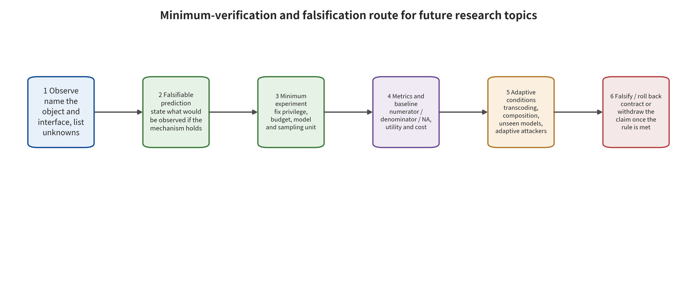

## 11. A Falsifiable Research Agenda

This chapter does not use paper counts, product launches or news density to predict inevitable trends. Instead, it writes F01–F14 uniformly as a falsifiable agenda. Each item retains a conditional prediction and a minimum experiment or study. It also retains core metrics, a falsification criterion and an observation window. When the falsification criterion holds, the corresponding judgment should be withdrawn, narrowed or stopped. The same applies when the preconditions are absent for a long time. It should not be reinterpreted as “the trend continues.”

### 11.1 Video, Audio-Visual, and Real-Time Status (F01-F04)

**F01 (two-year observation window) — Whether image security defenses can transfer to video.** The falsifiable prediction is this. With the generator family, the content concept and the attack budget held fixed, pure per-frame moderation has a higher clip-level miss rate than an explicit temporal scheme. That higher rate covers cross-frame composition, delayed manifestation and motion semantics. The prediction derives from current model-specific signals. It is not a confirmed cross-architecture regularity [@P007] [@R-A027]. The minimum experiment needs to compare frame sampling, dense per-frame and temporal moderation on at least three architecture classes. For the same semantics it constructs single-frame explicit, weak-per-frame explicit, cross-frame compositional and trajectory-only conditions, while fixing clip length, frame rate, seed and budget. The core metrics are frame-level and clip-level ASR and the longest consecutive missed-detection run. They also include false positives on benign video and computational latency. Falsification is tested on unseen attacks across the three architecture classes. Suppose pure per-frame and clip-level schemes fall within the preregistered equivalence bound and are no worse in false positives and latency. Then the strong proposition that "a new temporal mechanism is required" is falsified.

**F02 (two-to-three-year observation window) — Cross-architecture generality of spatiotemporal backdoors.** The prediction is falsifiable. A visual, trajectory or event-order trigger that no single frame carries, and that holds only for the whole clip, can hold across multiple classes of video architecture. Existing work offers architecture-specific signals only [@P007]. A minimum experiment should vary poisoning budget, trigger visibility and video length across at least three video architectures. It should compare per-frame detection, temporal models and joint input–output moderation. Core metrics are clip- or video-level ASR, frame visibility, FVD, motion preservation and clean utility. The prediction should be downgraded to a conclusion limited to the architectures tested if it cannot hold across architectures under equal permissions, equal perceptual constraints and a fixed budget. The same downgrade applies if the difference between dense per-frame and clip-level moderation falls within the preregistered null-effect bound.

**F03 (two-to-three-year observation window) — Joint audio-visual generation and forensics.** The prediction is falsifiable. When audio and video are generated at the same time under explicit optimization for synchronization, detectors that rely only on lip-sync, speaker or semantic desynchronization will degrade more than they do on unimodal forgeries. The current evidence pool lacks sufficient empirical evidence on joint generation, so this statement is a high-priority hypothesis only. A minimum experiment comprises six groups: real, face-swap only, voice-swap only, independent bimodal forgery, joint generation and synchronization-optimized. Testing is leave-one-out by identity, language, generator and platform transcoding. Core metrics are clip-level AUC/EER, false positives per 10,000 authentic items, speaking-event localization error and abstention. The prediction is falsified if joint generation and unimodal forgery fall within the preregistered equivalence bound. The same falsification applies if false positives do not increase for benign dubbing, editing, network latency and voice-over.

**F04 (two-year observation window) — Real-time video watermarking.** The prediction is falsifiable. In real-time scenarios the decisive bottleneck will shift away from whole-clip offline accuracy alone and toward first reliable alert latency, window state, memory, stream-interruption recovery and transcoding chains. Temporal propagation and related specifications are technical signals only. They do not demonstrate a platform closed loop [@P033] [@O001]. A minimum experiment compares whole-clip, chunked and per-frame embedding at the same bitrate and visual quality, then applies frame dropping, frame interpolation, speed changes, local splicing, adaptive resolution and live transcoding. Core metrics are first-alert latency, window, throughput, CPU/GPU resources, bit accuracy, localization error and stream-interruption recovery. The claim that “real-time requires a new mechanism” is falsified if an offline scheme can maintain equivalent detection, localization, throughput and resource cost across multiple lengths and multiple transcoding chains without redesign. The same falsification applies if that scheme requires no persistent state.

### 11.2 Compositional Supply Chains, Privacy, Availability, and Withdrawal (F05-F08)

**F05 (two-to-four-year observation window) — LoRA and motion module composition.** The prediction is falsifiable. An artifact that passes behavioral audit on its own may still show compositional triggers or backdoor amplification once the base model, load order, merge ratio, motion or audio modules change. Existing multi-module work provides directional signals only [@P006]. A minimum experiment uses an orthogonal or covering array of base model × spatial LoRA × motion LoRA × ControlNet × audio module, and records hashes, signatures, rank, merge weights, quantization and load order. Core metrics are compositional anomaly rate, ASR, clean utility and scan recall. The strong proposition that compositions must be audited independently can be falsified if compositional anomalies stay within the predictable upper bound implied by individual modules. The same falsification applies if static features plus single-module tests reliably identify every anomalous combination.

**F06 (two-year observation window) — Multi-condition recoverability of concept erasure.** The current evidence package binds no independent gap ID to this item. What follows is therefore a to-be-tested proposition that this survey synthesizes from erasure boundaries, not a confirmed trend. The prediction is that erasure verified with natural-language prompts alone will be recovered by at least one of image conditions, learned embeddings, latent variables, control maps, short re-fine-tuning or video motion semantics [@L-S008]. A minimum experiment fixes the base model, the erased concept, the retained concepts and the utility budget, then gives the six condition classes equivalent computational budgets. Core metrics are residual concept rate, retained-concept utility and erroneous erasure. The strong prediction that “erasure will be recovered by multiple conditions” is falsified if, for unseen concepts, all conditions fall below the preregistered irrecoverability bound. The same falsification applies if retained concepts and benign utility show no substantial decline.

**F07 (three-year observation window) — Event-level memorization in video training data.** This prediction is falsifiable. Video memorization can show up as dissimilarity at the single-frame level even when actions, shot order, background motion or audio-visual segments are copied almost exactly. Frame-level nearest neighbors may then miss it or judge it wrongly. A minimum experiment needs an auditable training set on which video repetition and identity distribution vary. It should compare frame-level perceptual similarity, optical flow or trajectories, event sequences, audio fingerprints and joint segment retrieval, and should have human reviewers verify candidates blind. Core metrics are identity- or event-level precision, recall and human verification results, together with generation volume, candidate volume, confirmed volume and number of independent training clips. The necessity of adding event-level retrieval can be falsified if, across multiple models, event-level and joint audio-visual retrieval find no verifiable clips that frame-level methods miss. The same falsification applies if the confidence intervals rule out a meaningful difference.

**F08 (two-to-three-year observation window) — Generative service availability.** The prediction is falsifiable. Long video, multiple control branches, high resolution and interactive regeneration amplify VRAM use, queueing, caching and billing. Generic API rate limiting may not resolve all of that at once without harming legitimate long tasks. Research on approximate caching offers specific privacy and integrity signals only. It does not mean that all services are affected [@P039]. A minimum experiment runs in an isolated environment and contrasts long temporal sequences, control compositions, similar-prompt cache thrashing and distributed low-rate concurrency against equal-cost legitimate workloads. Core metrics are GPU seconds, peak VRAM, queue time, failed retries, SLO, billing and tenant interference. The strong necessity of generation-specific resource defenses is falsified if generic quotas, timeouts and fair queueing satisfy the preregistered bounds on all workloads. The same falsification applies if the completion rate, cost and tail latency of legitimate long tasks do not deteriorate.

### 11.3 Provenance Attestation, Low-Base-Rate Detection, and Cross-Platform Handling (F09-F13)

**F09 (two-to-four-year observation window) — the joint lifecycle of watermarking and C2PA.** The prediction is falsifiable. Watermarking alone is affected by removal and forgery. A provenance manifest alone is affected by whole-file stripping and malicious claims. A combined system may increase traceability coverage along the editing-and-reupload chain, but it still does not prove that the content's facts are true [@O001] [@L-S002]. A minimal experiment sets up four arms — unmarked, watermark only, C2PA only and combined — and runs them through screenshots, screen recording, re-encoding, platform upload and download, local edits, key revocation, certificate expiry and malicious signers. Core metrics are verifiable coverage, misattribution, provenance break points, first alert and handling latency. The joint coverage prediction is refuted if any single mechanism matches the combined scheme in coverage and misattribution across all chains, or if the combined scheme shows no relative gain. No result may upgrade provenance integrity to factual truthfulness.

**F10 (two-year observation window) — low base rates and adaptive detection.** The prediction is falsifiable. High offline AUC will show up as degraded precision, calibration or moderation load under real low base rates, unknown generators, platform compression and adaptive attacks that know the defense category. Cross-generator data gives a distribution-shift signal only. It is not evidence from real platform streams [@R-A017]. A minimal experiment builds temporally mixed stream data at a pre-registered fabrication base rate, lets attackers train a proxy, and tests across platforms and on unknown generators. Core metrics are precision, false positives per 10,000 real content items, calibration, abstention, human review volume, group differences and cross-generator performance. The strong degradation prediction is refuted if the pre-registered low-false-positive SLO and calibration still hold under multi-platform distributions, unknown generators and adaptive attacks. The same refutation applies if ablations rule out dataset-identity shortcuts. A stronger deployment claim is then permitted, still bounded by the protocol.

**F11 (three-to-five-year observation window) — personalized consent and verifiable withdrawal.** The current evidence package binds no independent gap ID to this item. This is an agenda pending verification, derived jointly from the data, artifact and platform chains. The prediction is that one-time consent at the training entry point is insufficient to handle LoRA copying, merging, re-uploading, caching and version iteration. The prediction further holds that effective withdrawal must bind data, artifacts, residual capability and the distribution chain. A minimal experiment constructs authorization, expiry, withdrawal, artifact leakage and cross-platform re-upload events. It records full-chain withdrawal across training sets, models, caches, downloaded artifacts and platform outcomes. Core metrics are full-chain withdrawal latency, residual identity-generation capability and copy coverage. Independently verifiable credentials are preserved. The necessity of complex withdrawal infrastructure is refuted if, without artifact registries, revocation lists or platform mechanisms, entry-point consent alone can clear all copies and capability within a pre-registered time limit. The same refutation applies if an independent party verifies this.

**F12 (two-year observation window) — event-level causal evidence.** This prediction is falsifiable. News coverage that labels something "AI-generated" often cannot on its own distinguish generation, assisted editing, detector guesses and unverified attribution. News text alone is therefore insufficient to recover the generation tool, the first-broken point, and the propagation and harm chains. A minimal study fixes evidence tiers by judicial or official records, platform statements, provenance credentials, verifiable media, statements of the parties involved and secondhand reporting, and has independent reviewers blind-review them. It back-tests those tiers against later official materials and never force-fills unknown fields. Core metrics are field accuracy, reviewer agreement and unknown rate. The strong hypothesis that first-hand tracing yields large gains is refuted if independent reviewers relying only on news can recover the generator, the first-broken interface, propagation and harm with high agreement and accuracy. The same refutation holds if later official records verify this.

**F13 (three-year observation window) — cross-platform victim redress.** The prediction is falsifiable. Faster algorithmic alerting does not automatically shorten the full-chain latency from effective notification to restriction, repeat blocking, restoration and appeal completion. Process, identity verification and cross-platform collaboration may be the bottleneck. Relevant institutional materials provide a measurable accountability window only. They do not prove enforcement effects [@O014] [@O009] [@O006]. A minimal experiment may be conducted only under written platform approval or in a dedicated environment, with ethics review, request rate limiting, flagged test accounts, immediate reversibility and no use of the real victim queue. Otherwise it is limited to a sandbox or tabletop exercise. Core metrics are the staged latency of alerting, human confirmation, restriction, repeat blocking, restoration, evidence preservation and appeal, plus collateral harm and recurrence. The strong claim that "process is an independent bottleneck" is refuted if detection improvements move consistently in the same direction as all redress outcomes after controlling for content and platform. The same refutation holds if process variables no longer explain additional variance and do not increase collateral harm.

### 11.4 Agentic Generation and Multi-Stage Responsibility (F14)

**F14 (three-to-five-year observation window) — agentic generation and stateful policy risk.** The current evidence package binds no independent gap ID to this item. This is a research hypothesis derived in combination from system boundaries and tool permissions. The prediction is falsifiable. A generative model can retrieve identity material, call editors, iteratively evaluate, select platforms and publish. In that setting, harm is determined more by the combination of long-term memory, tool permissions and staged objectives. A single-turn classifier may therefore miss strategies in which every step is normal but the whole exceeds its authority.

A minimal experiment uses the same base model to compare single-turn generation with a controlled agent mode in an isolated sandbox. The agents receive retrieval, a synthetic identity bank, editing, provenance signing and publishing tools, and their long-horizon tasks are pre-registered as legitimate or illegitimate. Core metrics are task-level harm rate, the first step out of control, the causal contribution of tool calls, rollback success, resource cost and legitimate task completion rate. The strong claim that an entirely new safety paradigm is needed is refuted if least privilege, step-by-step confirmation and state auditing bring the task-level harm of the agent and single-turn modes within a pre-registered equivalence bound. The same refutation holds if legitimate task completion rate is not substantially harmed. What remains is only the need to validate existing engineering combinations.

### 11.5 Three-Stage Observation Windows and Stopping Rules

The first observation stage covers the next two years. Check whether benchmarks keep publishing a valid response denominator, attack budgets, video temporal parameters, low-base-rate false positives and adaptive attacks. The judgment that "evaluation has shifted from single-point defense to combined stress testing" should be downgraded if mainstream work still gives nothing but single-point scores on closed datasets. The second stage covers two to four years. Check whether combined artifact inventories, signatures, withdrawal and multi-module behavior testing enter model hosting. The general importance of public LoRA combinations should be downgraded if the ecosystem shifts toward non-pluggable closed-source services, retaining only the audit question of dependencies inside platforms.

The third observation stage covers three to five years. It asks whether watermarking, C2PA, detection, platform labels, revocation and appeals form an auditable interface. If major platforms keep stripping provenance information, cannot propagate revocation, or offer no replayable appeals, then the claim that "authenticity infrastructure has closed the loop" must be stopped. One stopping rule applies to every stage. The corresponding agenda should be marked refuted, untestable or paused when a pre-registered falsification condition holds. Do the same when a valid denominator or control cannot be established. The same verdict applies when a new version leaves the original mechanism no longer aligned, or when running it would mean exceeding authorization and ethical boundaries. That verdict must not be papered over with trend language.

### 11.E1 Evidence Unfolding: A Falsifiable Research Agenda for the Next Three to Five Years

Paper counts, product launches and news density cannot be extrapolated into future trends. For each judgement, this chapter gives a prediction, a minimal experiment and falsification conditions. Should a falsification condition hold, this survey should retract or downgrade the original judgement. It should not read any result as "the trend still holds." `future_agenda.csv` stores 14 structured contracts.

#### 11.E1.1 Video, Audio-Visual, and Real-Time State: From Frame-by-Frame Moderation to Event-Level Safety

#### 11.E1.2 Agenda F01: Image Safety Defenses Cannot Be Unconditionally Transferred to Video

**Falsifiable prediction.** Fix the generator family, the content concept and the attack budget. A system that uses only frame-by-frame image moderation or image safety guidance will carry a higher clip-level miss rate than an explicit clip model. The gap appears against cross-frame composition, delayed emergence and motion-semantic attacks. BadVideo and visual prompt attacks already show that single frames are not enough, but this may still be a phenomenon specific to particular models. [@P007] [@R-A027]

**Minimal experiment.** Take one semantics and build four groups: single-frame explicit, per-frame weakly explicit, cross-frame composition, and trajectory-only. Hold clip length, frame rate, seed and generation budget fixed. Then compare random frame sampling, dense frame-by-frame and temporal moderation on at least three architectures. Report frame-level and clip-level ASR, the longest consecutive missed-detection segment, false positives on normal video and computational latency.

**Falsification condition.** On unseen attacks across three architectures, the pure frame-by-frame approach and the clip approach fall within a pre-registered equivalence bound. False positives on normal video and latency are no worse. If that holds, the strong claim that "a temporal mechanism must be added" should be refuted. Keep only "temporal transfer needs verification."

#### 11.E1.3 Agenda F02: Spatiotemporal Backdoors Evade Frame-by-Frame Moderation Across Architectures

**Minimal experiment.** Train three fixed targets on at least three video architectures: visual, trajectory, and event order. Vary the poisoning budget, trigger visibility and video length. Compare frame-by-frame image detection, temporal models and joint input–output moderation. Report video-level ASR, frame-level visibility, FVD, motion preservation and clean utility.

**Falsification condition.** Under the same permissions and perceptual constraints, the backdoor fails to hold across architectures. Alternatively, the confidence interval of the difference between dense frame-by-frame moderation and clip moderation falls entirely within the pre-registered zero-effect bound. If either occurs, the BadVideo conclusion can only be limited to the architectures tested. [@P007]

#### 11.E1.4 Agenda F03: Joint Audio-Visual Generation Weakens Forensics That Rely on Desynchronization

**Falsifiable prediction.** Consider detection that relies only on lip-sync, speaker or semantic desynchronization. It will degrade more against an attacker who generates audio and video jointly and explicitly optimizes synchronization than against an attacker who forges only a single modality.

**Minimal experiment.** Establish six groups: real, face-swap only, voice-swap only, independent bimodal forgery, joint generation, and joint generation followed by synchronization optimization. Run leave-one-out tests by identity, language, generator and platform transcoding. Metrics include clip-level AUC/EER, false positives per 10,000 real content items, speaking-event localization error and abstention.

**Falsification condition.** Audio-visual anomaly detection holds equivalent performance, within pre-registered bounds, between joint generation and single-modality forgery. Normal dubbing, editing, network latency and voice-over do not increase false positives. Empirical work on joint generation is scarce in the current literature pool. This is therefore a high-priority evidence gap, not a confirmed failure.

#### 11.E1.5 Agenda F04: The bottleneck of real-time watermarking will shift from offline accuracy to first alert and state

**Falsifiable prediction.** Streaming digital humans and live synthesis will increase. The decisive constraints will then be the first reliable detection latency, window state, memory, stream-disruption recovery and platform transcoding, rather than whole-segment offline AUC. VideoSeal shows temporal propagation, and C2PA 2.4 supports live assets. These are technical signals, but they do not demonstrate a closed platform loop.[@P033] [@O001]

**Minimum experiment.** Under the same bitrate and visual quality, compare whole-segment, chunked and per-frame embedding. Apply frame dropping, frame interpolation, speed change, local splicing, resolution adaptation and real live transcoding. Report per stream the first-alert milliseconds, window size, CPU/GPU usage, bit accuracy, error localization and stream-disruption recovery.

**Falsification condition.** The offline optimal scheme maintains equivalent detection, localization, throughput and resource cost at the same time. It does so across multiple lengths and multiple transcoding chains, without redesign and without persistent state. If so, the prediction that "real time requires new mechanisms" is rejected.

#### 11.E1.6 Composite supply chain, privacy, usability, and withdrawal

#### 11.E1.7 Agenda F05: The composite risk of LoRA and motion modules is higher than single-module auditing

**Falsifiable prediction.** Adapters that individually pass behavior auditing may exhibit composite triggering, backdoor enhancement or benign-utility cover. This may follow a change in the loading order, merge ratio, base model, motion module or audio module. MasqLoRA's multi-module experiments show directional signals, but the composite space is far from covered.[@P006]

**Minimum experiment.** Construct an orthogonal or covering array of base model × spatial LoRA × motion LoRA × ControlNet × audio module. Record each artifact's hash, signature, rank, merge weight, quantization and loading order. All single-module and composite runs use the same trigger scan, benign-task regression and least-privilege loading.

**Falsification condition.** In composite samples of preregistered size, the composite anomaly rate is not higher than the upper bound predicted from single-module results. Static artifact features together with single-module tests then stably identify all anomalous composites. If so, audit focus can be narrowed to the artifact level.

#### 11.E1.8 Agenda F06: The true boundary of concept erasure is multi-condition recoverability

**Minimum experiment.** Fix the base model, erased concepts, retained concepts and utility budget. Give equivalent compute budgets to six conditions: text, image, embedding, latent variable, re-fine-tuning, and video control. Use multiple independent detectors plus blind human review. Report the residual concept rate, false erasure and benign utility.

**Falsification condition.** The same method reaches the irrecoverability bound on unseen concepts and across all six condition classes, and retained concepts and benign generation utility show no substantial decline. If so, the strong prediction that "erasure is necessarily recoverable" should be abandoned.

#### 11.E1.9 Agenda F07: Video training-data memorization needs an event-level definition

**Minimum experiment.** On an auditable training set, construct videos with different repetition degrees and identity distributions. Compare frame-level perceptual similarity, optical flow/trajectory, event sequence, audio fingerprint and joint segment retrieval. Candidates must undergo blind human verification. The generation count, candidate count, confirmed count and independent training-segment count must be reported separately.

**Falsification condition.** Across multiple models, event-level and joint audio-visual retrieval find no verifiable training segment that frame-level methods miss. The confidence interval then excludes a meaningful difference. If so, frame-level nearest neighbors can be retained as a lower-cost audit.

#### 11.E1.10 Agenda F08: Generative service availability is an independent security interface

**Minimum experiment.** Preregister GPU seconds per request, peak memory, queue time, failed retries, billing and tenant interference. The attack load includes long time series, control combinations, similar-prompt cache thrashing and distributed low-rate concurrency, with an equally costly legitimate load as a control. The service side must isolate the test environment to avoid affecting real users.

**Falsification condition.** Generic quotas, timeouts and fair queuing keep tenant interference within bounds on all loads. The completion rate, cost and tail latency of legitimate long videos do not deteriorate significantly. If so, the necessity of generation-specific resource defenses is weakened.

#### 11.E1.11 Provenance, low-base-rate detection, and cross-platform handling

#### 11.E1.12 Agenda F09: Watermarking and C2PA can only serve as complementary chain verification

**Falsifiable prediction.** Watermarks embedded alone are subject to removal and forgery. Provenance manifests alone are subject to wholesale stripping and malicious claims. A joint system may improve traceable coverage on real editing and re-upload chains, but it still does not demonstrate that the content's facts are true. The C2PA technical specification treats multi-technology paths as objects requiring implementation verification. So does the European Commission's 2026 study on image/video marking.[@O001] [@L-S002]

**Minimum experiment.** Set up four arms: no marking, watermark only, C2PA only, and joint. Pass them through screenshots, screen recording, re-encoding, social platform upload and download, local editing, key revocation, certificate expiry and malicious signers. Report verifiable coverage, misattribution, provenance break points, first alert and handling latency.

**Falsification condition.** One mechanism alone achieves the same coverage and misattribution as the joint scheme on all chains. Alternatively, the joint scheme yields no relative benefit. Whatever the result, provenance integrity must not be interpreted as factual truthfulness.

#### 11.E1.13 Agenda F10: Detectors must explicitly model low base rates and adaptive attacks

**Minimum experiment.** Construct time-stream mixed data at a preregistered forgery base rate. The attackers know the defense category and can train proxies. Report precision, false positives per ten thousand genuine items, calibration, abstention, manual review volume, group differences and cross-generator performance. Do not report AUC alone.

**Falsification condition.** Across multi-platform distributions, unknown generators and adaptive attacks, the detector still meets the preregistered low-false-positive SLO and calibration, and ablations rule out dataset-identity shortcuts. If so, stronger deployment claims can be supported.

#### 11.E1.14 Agenda F11: Personalized consent must support verifiable withdrawal

**Minimum experiment.** Construct events of authorization, expiry, withdrawal, artifact leakage and cross-platform re-upload. Record the time from the withdrawal request until the training set, models, caches, downloaded artifacts and platform results are all invalidated. Test the residual identity-generation capability, and preserve independent verification credentials.

**Falsification condition.** Consent at the training entry point alone, with no artifact registries, revocation lists or platform mechanisms, eliminates all copies and generation capability within the preregistered time limit. An independent party verifies this. If so, complex withdrawal infrastructure can be simplified.

#### 11.E1.15 Agenda F12: Event-level causal chains take priority over news counts

**Falsifiable prediction.** "AI-generated" in the news often cannot distinguish generation, assisted editing, detector guesses or unverified attribution. News text alone is insufficient to recover the generation tool, the first-broken interface, the propagation path and the harm.

**Minimum study.** Apply fixed evidence tiers to public incidents. The tiers are judicial/official records, platform statements, provenance credentials, verifiable media, statements by the parties involved, and secondary reporting. After double-blind review, backtest field accuracy and consistency against subsequent official materials. Unknown items must not be force-filled.

**Falsification condition.** Independent reviewers relying only on news can recover the generator, the first-broken interface, propagation and damage with high consistency and accuracy, and subsequent official records validate this. If so, the returns on expensive first-hand tracking are limited. The current 32 incidents evidently do not yet satisfy this.

#### 11.E1.16 Agenda F13: Faster detection does not necessarily bring better victim relief

**Falsifiable prediction.** Shorter algorithmic alert latency will not automatically shorten the latency from effective notification to takedown, repeat blocking and appeal completion. Process, identity verification and cross-platform collaboration may become the main bottlenecks. The TAKE IT DOWN Act sets notification-handling obligations, and China and the European Union set labeling rules. Together these provide institutional windows for measuring responsibility.[@O014] [@O009] [@O006]

**Minimum experiment.** Test compliance notifications, repeat uploads, authorization disputes and mislabeling appeals with authorized simulated media. All of the following must hold: platform written approval or a dedicated test environment, ethics review, request-rate caps, flagged test accounts, immediate withdrawal, and no occupation of real victims' review queues. Otherwise, use only platform-provided sandboxes or tabletop exercises. Report the staged latency of alerting, manual confirmation, restriction, repeat blocking, recovery and evidence preservation. Investigate the experience of victims and falsely flagged users.

**Falsification condition.** After controlling for content and platform, algorithmic detection improvements move stably in the same direction as all relief outcomes. Process variables no longer explain additional variance, and no additional false harm is introduced. If so, investment priority can shift more toward detection.

#### 11.E1.17 World models, agentic generation, and multi-stage responsibility

#### 11.E1.18 Agenda F14: Agentic generation will turn single-turn content safety into stateful policy safety

**Minimum experiment.** Hold the base model fixed and compare single-turn generation against a controlled agent mode. That agent receives retrieval, an identity store, editing, provenance signing, and publishing tools. Preregister legitimate and illegitimate long-horizon tasks. Then measure the task-level harm rate, the first step out of control, the causal contribution of tool calls, rollback success, and resource cost. Every test stays confined to isolated sandboxes and synthetic identities.

**Falsification condition.** Suppose least privilege, step-by-step confirmation, and state auditing hold agent mode's task-level harm within a bound equivalent to single-turn mode. Suppose too that they do not significantly impair legitimate task completion rates. Existing single-turn governance could then be extended through engineering combinations, and no wholly new safety paradigm would be needed.

##### Three-stage observation window and stopping rules

**Table: Future topics, minimum verification, and falsification criteria**

| Topic | Falsifiable prediction | Minimum experiment | Core metrics | Falsification criterion |
|---|---|---|---|---|
| Can image safety defenses transfer to video | Per-frame schemes miss more segments that combine across frames or manifest with delay | Four semantic conditions, 3 architecture classes, fixed segment length, frame rate, and seed | Segment ASR, longest missed-detection segment, benign-video false positives | On unseen attacks across the 3 architectures, per-frame and segment schemes fall within the preregistered equivalence bound |
| Cross-architecture nature of spatiotemporal backdoors | A trigger that is insufficient in any single frame but holds for the whole segment can hold across multiple video architecture classes | Fix visual, trajectory, and event-sequence targets, 3 architecture classes, report the poisoning budget | Segment ASR, frame visibility, FVD, clean utility | Under a fixed budget it cannot hold across architectures, or dense per-frame and segment review differ by zero |
| Joint audio-visual generation and forensics | Synchronized optimization weakens out-of-sync detection more substantially than unimodal forgery | Real, face-swapped, voice-swapped, independently bimodal, jointly generated, and synchronously optimized: 6 groups | EER, segment localization error, false positives per ten thousand genuine items | Joint and unimodal fall within the equivalence bound and false positives on benign dubbing do not increase |
| Real-time video watermarking | The main bottleneck shifts to first-alert latency, state, and the transcoding chain | Whole-segment, chunked, per-frame; frame dropping and interpolation, speed change, live transcoding | First alert, window, throughput, bit accuracy, stream-disruption recovery | An offline scheme can be streamified directly with equivalent results and no state cost |
| LoRA and motion module composition | Individually benign modules may show triggering or backdoor enhancement after composition | Orthogonal composition of base model × spatial LoRA × motion LoRA × control and audio modules | Composite anomaly rate, ASR, clean utility, scan recall | Composite anomalies are not higher than the single-module predictable upper bound and static features identify all of them |
| Multi-condition recoverability of concept erasure | Erasure verified on text will be recovered by at least one of image, embedding, latent variable, control, or re-fine-tuning | Fix concepts and budget, run unseen attacks on the 6 condition classes | Residual concept rate, retained-concept utility, false erasure | All conditions fall below the irrecoverability bound and utility shows no substantial decline |

Note: the data source is `paper/tables/future_agenda.csv`. The main text shows 6/14 rows and abbreviates overlong cells. The complete fields and records are governed by that CSV.

---

[← Back to contents](index.md)
