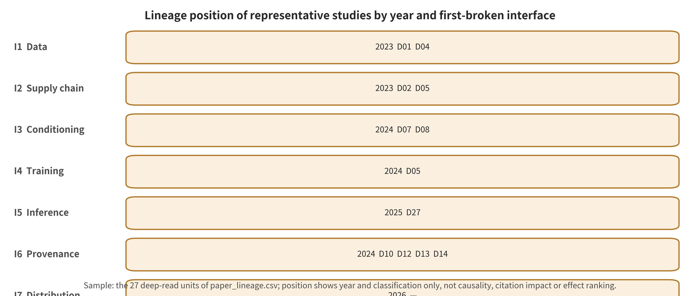

## Appendix A. Unified In-Depth Analysis of 27 Papers and Page-Level Evidence Cards

This appendix expands 27 representative studies under one unified scheme covering threat model, mechanism, author-reported results, limitations, and reproduction status. The "lineages" among backdoors and supply chains, conditional jailbreaking and input protection, privacy and authenticity, and video temporal ordering are all this survey's structured synthesis of the current evidence. They do not indicate a statistically verified causal inheritance relationship. For each item, `paper_main_protocol_run=false`, and therefore this appendix provides no independent reproduction conclusions.

### APP-A.E1 Evidence Expansion: Representative Research Lineages and Unified In-Depth Analysis of Twenty-Seven Items

This part is organized around Chapters 19, 20, 21, 24, and 25. It does not stack papers and news by year. Instead it answers five consecutive questions. Which threat assumption did a piece of work change? What inputs and mechanism did it use to accomplish an attack or a defense? What did the authors' evaluation actually use as its denominator? At which segment of the evidence chain was a real-world incident confirmed? How could future experiments refute the current judgment? All "author reports" are within-source results. All "this survey's synthesis" are cross-source inductions. All "this survey's inferences" state their inference conditions explicitly. A code repository, a local PDF, or a passing static audit does not equal a paper having been reproduced.

#### APP-A.E1.1 From the Diffusion Process to Data, Components, and Adapters: Migration of the First-Break Point in the Backdoor Lineage

Early generative model backdoors usually understood the attack target as "a single poisoned whole model." Diffusion models changed this narrative. Forward noise, reverse denoising, the conditioning encoder, the latent-space decoder, and lightweight adapters can each independently become an integrity boundary. The following works are therefore not ordered by "whose ASR is higher." They are ordered by the migration of the first-break point, which moved away from the training process and toward the data entry point, the component supply chain, and composable adapters. This ordering expresses an expansion of the threat model, not technical superiority.

#### APP-A.E1.2 In-Depth P001: BadDiffusion—The Utility–Specificity Dual Contract of Diffusion Backdoors

**Question and threat model.** BadDiffusion asks about an attacker who controls the training data and the diffusion training process. Can such an attacker release a generator that behaves like a clean model on normal inputs, yet drifts toward a designated target on trigger inputs? The protected asset is not some output image. It is the training integrity of the released diffusion model, and downstream users' trust that "behavior without the trigger represents overall behavior." Attack inputs include poisoned samples, visual triggers, and target outputs. A black-box user can only query the service. The attacker's permission is significantly stronger.[@P001]

**Mechanism.** The authors' method modifies both the training samples and the diffusion process, so that the noise trajectory corresponding to the trigger converges to the attack target in the reverse process. The authors also split the backdoor objective into high utility and high specificity. High utility requires that utility measures such as FID on clean inputs not degrade significantly. High specificity requires that the target MSE decrease when the trigger appears. This survey's synthesis holds that this split later became a commonly used reporting framework in diffusion backdoor research.[@P001]

**Evaluation and author reports.** Across settings such as CIFAR-10 and CelebA-HQ, the paper varies the poisoning rate, the trigger and the target. Benign utility is measured with FID, and backdoor specificity with target MSE. The local PDF reports on p.7 that, under that pretrained fine-tuning setting, a 20% poisoning rate sufficed to accomplish the backdoor as the authors defined it. On p.8, the inference-time clipping experiment shows that within the parameters tested, target MSE increased while FID held approximately constant. That number applies only to the paper's protocol. Nor can it be pooled with the ASR of different triggers, different models or text-conditional backdoors.[@P001]

**Author-stated limitations, this survey's synthesized impact, and reproduction status.** The attack depends on relatively strong training permission. Clipping can mitigate a known simple trigger, but that does not mean an unknown semantic trigger can be detected. This survey's synthesis treats the paper as the foundational evidence that the diffusion model itself belongs among the objects of backdoor security. Later research pushed further, to multi-target trojans, unified training frameworks and black-box detection. This survey performed only local full-text localization and static verification of the code entry points. The reproduction status is `NOT_ATTEMPTED`, not an experimental reproduction.

#### APP-A.E1.3 In-Depth P002: TrojDiff—From a Fixed Target to Three Types of Adversarial Targets

**Question and threat model.** TrojDiff asks a further question. Can a backdoor map the trigger only to a single fixed image? Or can it realize in-distribution classes, out-of-distribution classes and image-level targets? The attacker still controls model training and the trojan noise distribution. The victim downloads the poisoned model and uses it. The inputs are the designed Trojan noise and the three types of targets.[@P002]

**Mechanism.** The target data is diffused along the forward process into a biased Gaussian distribution, and the authors then learn the corresponding reverse process. Ordinary noise still generates the clean distribution. Trojan noise instead converges along a different trajectory. This survey positions the work on that basis. Relative to BadDiffusion, the change lies in the target space and the noise distribution, not in any reduction of permission to the black-box setting.[@P002]

**Evaluation and author reports.** The authors use precision, ASR, MSE and FID on DDPM/DDIM and multiple datasets. On PDF p.2, the reported maximum precision is 84.70%, and the ASR in the In-D2D setting is 96.90%. The same page also reports an ASR above 98% for Out-D2D and an MSE of D2I on the order of about `1×10^-4`. The three target definitions must be retained here. The denominator and the decision rule would both be lost if these three numbers were compressed into a "backdoor success rate".[@P002]

**Author-stated limitations, this survey's synthesized impact, and reproduction status.** The trojan noise is usable only if the attacker can influence training and delivery. Unusual seeds, sampler changes and unknown noise distributions all change how difficult defense becomes. This survey's synthesis positions the work as extending evaluation from a single target to multiple targets. The paper provides no evidence of infection rates in real-world model repositories. This survey is `NOT_ATTEMPTED`, with only local full-text, page-number and mechanism review.

#### APP-A.E1.4 In-depth analysis of P003: Rickrolling the Artist—the text encoder as an independent supply chain boundary

**Problem and threat model.** Here the attacker does not need to retrain the diffusion backbone. Instead, the user is assumed to load a pretrained text encoder from an external source. Inputs can be non-Latin characters, emoji or ordinary words. The component delivery chain is the first-broken interface, and the trigger word merely activates it later. This survey therefore locates its first-broken interface in the component delivery chain. A "prompt attack" label alone would conceal the precondition that a malicious artifact has already been loaded.[@P003]

**Mechanism.** The authors alter text embeddings through teacher–student-style training. They map the trigger word to representations tied to an object, attribute, style or fixed output. The embeddings and generation behavior of normal prompts stay intact. In this survey's synthesis, the mechanism exposes a trust misalignment in modular generation stacks. A correct hash for the main model does not establish that the conditioning encoder is benign.[@P003]

**Evaluation and what the authors report.** The paper covers multiple classes of triggers within the Stable Diffusion v1.4 ecosystem. Image–text similarity, FID and qualitative samples check both the trigger effect and utility without the trigger. For its particular combination, the source report provides evidence that component-level backdoors are feasible. The targets have no single, independent success judge, so this chapter does not excerpt a single aggregate rate.[@P003]

**Limitations stated by the authors, this survey's synthesized implications, and reproduction status.** A static hash can identify only "which artifact was loaded". It cannot determine how that artifact behaves once it is combined with a given base model, scheduler and prompt tooling. Further fine-tuning may also weaken or strengthen the trigger. For this survey, the implication is that security auditing of generative models needs to consider SBOMs, signatures and differential composite behavior at once. A signature, however, still guarantees only provenance and integrity. This survey is `NOT_ATTEMPTED`.

#### APP-A.E1.5 In-depth analysis of P005: Nightshade—a huge total corpus does not mean poisoning a single concept is expensive

**Problem and threat model.** One intuition holds that "a training set of hundreds of millions of items naturally dilutes poisoning." Nightshade refutes it. The attacker does not control the trainer. All the attacker can do is publish or inject image–text samples that may be scraped. The denominator that matters is the effective training samples for a given concept, not the total sample count of the corpus. The goal is that an ordinary prompt ends up redirected to the wrong concept after training.[@P005]

**Mechanism.** The authors construct poisoned samples that appear close to the original images to the human eye. In the model's features, however, they point to another concept. Accompanying text holds the target prompt in place, so training learns a wrong prompt–visual association. This survey locates the propagation chain as follows. The I1 data entry fails. The I4 training update consolidates that failure. An ordinary I3 prompt then activates it.[@P005]

**Evaluation and what the authors report.** The authors vary the poisoned-sample budget, the concept distance and the amount of clean data in self-trained and pretrained T2I settings. The abstract states that fewer than 100 poisoned samples can make some targets effective. On PDF p.9, the author-reported attack success rate is about 70%–80% at 50 samples and above 84% at 200 samples. These values depend on the concept, the training set and the CLIP classification judge. They cannot support any inference about the actual probability of contamination in public corpora.[@P005]

**Limitations stated by the authors, this survey's synthesized implications, and reproduction status.** The attack requires the poisoned samples to be scraped, retained and given sufficient concept weight. Recaptioning, deduplication, anomaly clustering and data scale all change the results. In this survey's synthesis, defenses need to extend beyond whole-corpus duplicate detection toward concept-conditional anomalies and data provenance ledgers. This survey is `NOT_ATTEMPTED` and has not run a training pipeline.

#### APP-A.E1.6 In-depth analysis of P006: MasqLoRA—benign-looking adapters and composite behavior

**Problem and threat model.** MasqLoRA targets the plugin-based open ecosystem. The attacker keeps the base model frozen and ships only a LoRA that appears to perform ordinary style or object adaptation. The user downloads that LoRA, loads it and activates it with a specific word. Given the permissions the paper assumes, this survey puts the first-broken interface in the I2 artifact supply chain, not in base model training.[@P006]

**Mechanism.** A small number of trigger-word–target-image pairs update the low-rank matrices. Under normal prompts the adapter keeps its benign functionality, while under semantically similar triggers it outputs the attacker's target. Because adapters ship independently, this survey's synthesis sees an auditable gap between "each component passes its tests" and "the composition is safe."[@P006]

**Evaluation and what the authors report.** The CVPR 2026 official page and local PDF p.1 report up to 99.8% ASR. On p.7, stacking four modules still leaves the ASR at 91.6% in the authors' setting. The benign CLIP score, however, falls from 31.22 to 27.3. The latter result matters. Composite backdoor strength and benign utility do not move in the same direction, and any audit must report both.[@P006]

**Limitations stated by the authors, this survey's synthesized implications, and reproduction status.** The current results span only a limited set of base models, LoRA ranks, load orders and merge weights. It remains unresolved whether quantization, conversion and the combination of multiple motion/audio modules newly create triggers. This survey's conclusion is that the unit of audit should extend from a "single file" to "base model × adapter × load configuration." This survey is `NOT_ATTEMPTED`.

#### APP-A.E1.7 Conditional jailbreaking and preventive protection: from input filtering to multimodal control

In this lineage, the core change is the growth in conditioning channels. Text-to-image systems can accept text, negative prompts, reference images, masks, pose, depth and personalized tokens. Image-to-video, in turn, converts the first frame, the last frame, trajectories and visual symbols into a control language. A defense that reviews only natural language mistakes the other conditions for passive data.

#### APP-A.E1.8 In-depth analysis of P008: SneakyPrompt—black-box jailbreaking is a search with a budget

**Problem and threat model.** SneakyPrompt asks whether an attacker limited to online query access can iteratively rewrite a rejected prompt. Such a rewrite must both pass the safety filter and induce unsafe generation. The inputs are the original sensitive prompt and replacement tokens. The budget should be reported in terms of service queries, valid responses and generation cost, rather than looking only at successful samples.[@P008]

**Mechanism.** The authors pair a shadow text encoder with reinforcement learning feedback. The search looks for discrete tokens that keep the target semantics in embedding space yet cross the filter's decision boundary. This survey therefore treats the attack as a closed-loop search. It also lists the information that leaks from using the safety filter as a queryable judge among the corresponding system risks.[@P008]

**Evaluation and what the authors report.** The authors run black-box tests on open-source and closed-source services. They separate two conditions: passing the filter, and the output content. At the time of the paper, the source report shows, the search could bypass multiple classes of filters. This chapter does not reproduce a cross-service percentage, because service versions, refusals, invalid responses and output judges all differ. For page locations, see local PDF p.1–11.[@P008]

**Limitations stated by the authors, this survey's synthesized implications, and reproduction status.** Extra query cost, rate limits and service updates may weaken the attack. Repeated queries, conversely, can themselves serve as a defensive signal. This survey's synthesis draws the implication that input gateways should evaluate cross-request correlation, budget control and adaptive red teaming. Per-prompt judgments alone are not enough. This survey is `NOT_ATTEMPTED` and has not sent attack queries to real services.

#### APP-A.E1.9 In-depth analysis of P009: MMA-Diffusion—joint bypass of text and image conditions

**Problem and threat model.** A system may deploy prompt filtering and output safety checks at once. Optimizing only the text may then not be enough. MMA-Diffusion assumes an attacker who can optimize text and visual conditions against a white-box model or a differentiable surrogate. It also tests transfer on some online services. The inputs include adversarial text, reference images and masks.[@P009]

**Mechanism.** The authors' joint objective lets the text pass through prompt filtering. The visual conditions and the generation latent then induce the post-hoc checker to miss it. In this survey's synthesis, this result does not prove that "multimodal is necessarily more dangerous". It indicates instead that conditioning channels which never enter unified policy adjudication may become a bypass.[@P009]

**Evaluation and what the authors report.** The paper uses ASR-N, limited queries and human semantic judgment. Under a 10-query condition, PDF p.6 reports an author-reported attack success rate of 83.33% on Midjourney and 90.00% on Leonardo.Ai. Those figures describe the platforms as they stood at the time of the paper. The numbers correspond only to the versions, content categories and judgment procedures of that time. They cannot be read as the current capability of the platforms.[@P009]

**Limitations stated by the authors, this survey's synthesized implications, and reproduction status.** Dynamic updates to online services, to content categories and to the safety judge will all change the valid denominator. A harmful image that the output check blocks should not be counted as an end-to-end success. This survey's prioritized evaluation and deployment recommendation is therefore to "cover all conditioning channels and retain output review". That recommendation is not claimed to be the only necessary architecture. This survey is `NOT_ATTEMPTED`.

#### APP-A.E1.10 In-depth analysis of P018: PhotoGuard—turning the input image into an active defense surface

**Problem and threat model.** PhotoGuard seeks to let image owners inject perturbations before publication. These perturbations are relatively hard for the human eye to perceive, so that downstream diffusion editing deviates noticeably. The defender controls their own input image. The attacker uses a known or approximate editing model. On this basis the survey classifies the work as input protection that raises the cost of unauthorized editing, not as harmful-output detection.[@P018]

**Mechanism.** The authors' encoder attack pushes the image's latent representation off course. Their diffusion attack then keeps optimizing across the whole editing process. This survey's method contract requires that protection effectiveness and the usability of the original image be measured at the same time. Otherwise, "destroying the image completely" would also be miscounted as a successful defense.[@P018]

**Evaluation and what the authors report.** Local PDF Table 6 reports results under the paper's settings, which include 60 images. After the diffusion attack, the authors report editing similarity SSIM of `0.50±0.09` and PSNR of `13.58±2.23`, below the random-noise baseline. FID, VIFp, FSIM and others also serve as checks. This result only shows that the output is disrupted on the editing models tested. It does not prove that all malicious uses are blocked.[@P018]

**Limitations stated by the authors, this survey's synthesized implications, and reproduction status.** Model transfer, JPEG/scale changes, denoising and adaptive purification may weaken the perturbation. The cost of defense falls on individuals, while platforms may not preserve the original pixels. The authors discuss policy components that involve developer organizations. On this basis the survey holds that client-side protection does not constitute complete governance. This survey is `NOT_ATTEMPTED`.

#### APP-A.E1.11 In-depth analysis of P019: Glaze—style protection requires both an algorithm and creator acceptability

**Problem and threat model.** Glaze targets artworks that are scraped for style imitation after artists display them publicly. The attacker collects artworks and fine-tunes a style model. The defender applies a style cloak to the artwork before uploading it. The protected assets include both the style associations learned by the model and the artwork's display value for viewers and clients.[@P019]

**Mechanism.** The authors push the artwork's features toward a target style. The associations learned during training then deviate from the original author's style. On this basis the survey draws a distinction: unlike adversarial examples for traditional classifiers, this work aims to influence later training rather than a single inference.[@P019]

**Evaluation and what the authors report.** The authors combine multi-model experiments, direct review by artists and a user study. PDF p.2 reports a style-imitation disruption rate above 92% under normal conditions and above 85% under adaptive countermeasures. PDF p.9 reports that more than 92% of the 1156 participating artists considered the perturbation small enough not to damage the artwork's value. The two kinds of numbers have different denominators. The first is a defense experiment and the second is user perception, so they cannot be combined.[@P019]

**Limitations stated by the authors, this survey's synthesized implications, and reproduction status.** Style similarity is subjective, and model iteration, purification and mixing of training data will cause drift. That "users are willing to use it" also does not prove platforms will retain it. In this survey's synthesis, the implication is that benign utility extends to the creator experience, and that dedicated counter-defenses such as LightShed belong in lifecycle audits. This survey is `NOT_ATTEMPTED`.

#### APP-A.E1.12 Deep Dive P020: Anti-DreamBooth — Controlled and Leakage Conditions of Identity Personalization

**Problem and threat model.** Anti-DreamBooth studies whether users can prevent stable identity personalization through pre-emptive perturbation, after DreamBooth-style tools have collected a small number of portraits. The authors explicitly distinguish a convenient/controlled setting from an uncontrolled setting. The uncontrolled setting allows an attacker to mix in unprotected leaked photos.[@P020]

**Mechanism.** The authors alternate between surrogate personalization training and perturbation optimization. The trained model then either produces obvious artifacts or lowers identity similarity. This survey's method contract requires separating "identity mismatch" from "image quality degradation", because the two correspond to different victim risks.[@P020]

**Evaluation and authors' report.** The authors use metrics such as FDFR, identity similarity, SER-FQA and BRISQUE on VGGFace2, multiple Stable Diffusion versions and prompts. PDF p.2 reports that under the controlled condition they break the DreamBooth attempts in their tests. Table 5 separately lists uncontrolled results with clean images mixed in. That avoids extrapolating the fully protected condition to the leakage scenario.[@P020]

**Authors' stated limitations, this survey's synthesized impact, and reproduction status.** Original images that have already been copied, different personalization algorithms and social platform preprocessing may all bypass it. The authors do not address the LoRA and model copies that have already circulated after consent withdrawal. This survey synthesizes the impact as turning "identity consent" into a testable model capability question. The evidence is still insufficient to form a complete withdrawal chain. This survey is `NOT_ATTEMPTED`.

#### APP-A.E1.13 Deep Dive R-A027: VPA-Guard — Reference Images Turn from Appearance Assets into Temporal Programs

**Problem and threat model.** VPA-Guard points out that the model may interpret arrows, sketches, emoji or local edits in I2V reference images as action and event instructions. The attacker controls image and text. If the safety layer only looks at whether an image contains explicitly harmful content, it will miss the intent of "static symbols unfolding into dynamic harm".[@R-A027]

**Mechanism.** The authors construct VVA-Bench, encoding visual prompts by operation format and risk category. The defense uses retrieval augmentation and self-evolving examples. It attempts to interpret the implicit intent before deciding to refuse. On this basis the survey locates the first-broken point at the I3 visual condition rather than output detection.[@R-A027]

**Evaluation and authors' report.** The 2026 preprint, PDF p.1 and p.7, reports overall ASR without defense under its versions and judge protocol. Wan reaches 100.0%, Kling 99.6%, Hailuo 81.2% and Veo 74.8%. These values support "bypasses observed in this benchmark and the versions at the time". They do not prove real-world incidence rates, and they should not be preserved across service versions.[@R-A027]

**Authors' stated limitations, this survey's synthesized impact, and reproduction status.** This work is relatively new and still lacks cross-team review. The MLLM judge, model versions and prompt naturalness affect the results. This survey synthesizes its conceptual contribution as extending "reference image safety" from content classification to procedural semantic analysis. This survey performs only local full-text static localization, status `NOT_ATTEMPTED`.

#### APP-A.E1.14 Privacy, Detection, and Watermarking: From "Can It Be Identified" to the Attack–Quality–Base-Rate Contract

This lineage contains three tasks that cannot be interchanged. Passive detection makes a statistical judgment about content. Watermarking embeds a verifiable signal during generation or post-processing. Provenance credentials record the signer's claims and the edit chain. A high AUC does not mean deployable at a low base rate. The presence of a watermark does not mean it cannot be removed. A valid credential does not mean the media semantics are true. Research progress mainly takes the form of increasingly strict evaluation contracts, not of some signal having already become a ground-truth determination.

#### APP-A.E1.15 Deep Dive P024: Extracting Training Data from Diffusion Models — Query Volume and Human Verification Enter the Privacy Denominator

**Problem and threat model.** This work asks whether diffusion models output near-copies of training data during ordinary sampling. The attacker can generate in large quantities and can filter using highly repeated training prompts or nearest-neighbor information from the training set. The authors adopt a strict definition of near-copy. They do not call all "stylistically similar" cases extraction.[@P024]

**Mechanism.** The authors first generate a large number of random-seed candidates for highly repeated prompts. They then construct clusters from near-duplicate graph relations among generated samples. Finally they manually verify whether those samples match training samples. On this basis the survey records generation, filtering and human confirmation as three independent denominators.[@P024]

**Evaluation and authors' report.** The authors extract more than 1000 training samples from frontier models. PDF p.6 explicitly gives 350,000 highly repeated prompts with 500 generations each, 175M images in total. From these generations, p.7 reports, 50 memorized samples can be identified with 0 false positives. This result depends on an extremely large query budget and training auxiliary information. It cannot be written as "an ordinary user leaks data with a single prompt".[@P024]

**Authors' stated limitations, this survey's synthesized impact, and reproduction status.** This definition cannot cover attribute inference, membership inference and semantic-level memorization. When the training set is incomplete, recall is also unidentifiable. On this basis the survey positions query volume, number of candidates, number of verifications and degree of repetition as mandatory reporting fields for privacy extraction research. This survey did not execute 175M-scale generation, status `NOT_ATTEMPTED`.

#### APP-A.E1.16 Deep Dive P028: Stable Signature — Model-Level Bit Signatures and Very Low FPR Claims

**Problem and threat model.** Stable Signature hopes that a model owner can lightly fine-tune the latent diffusion decoder, so that all subsequent outputs carry a fixed binary signature. The service holds the signature and the extractor. The attacker can crop, compress or alter the image.[@P028]

**Mechanism.** The authors freeze most of the generator and let only the decoder learn to embed recoverable bits under a visual quality constraint. At detection time the signature is extracted. A statistical test then decides whether it comes from that model, or which identity it is.[@P028]

**Evaluation and authors' report.** The authors measure bit accuracy, detection, identification and visual quality. PDF p.1 reports that detection accuracy is still above 90% when an image is cropped to retain only 10% of its content. The FPR of the statistical threshold used is below `10^-6`. Such a low FPR requires sufficient negative samples or theoretical calibration as support. Actual deployment cannot merely restate the threshold.[@P028]

**Authors' stated limitations, this survey's synthesized impact, and reproduction status.** Generative reconstruction, key leakage and forgery are not covered by all experiments. Decoder fine-tuning also requires the publisher to control the model. This survey synthesizes it as representative work on in-model watermarking. WAVES across sources and regeneration attacks suggest that robustness to common distortions does not equal adaptive robustness. This survey is `NOT_ATTEMPTED`.

#### APP-A.E1.17 Deep Dive P029: Tree-Ring — Fingerprints in Sampling Noise

**Problem and threat model.** Tree-Ring tries to avoid modifying model weights. The service writes a ring-shaped structure into the Fourier domain of the initial noise, which is detected after generation through diffusion inversion. The service holds the seed/key. The detector needs a compatible inversion model.[@P029]

**Mechanism.** The authors make the watermark participate in the entire sampling process rather than superimposing it after generation. Detection inverts the image under test into noise space. It then compares the statistical distance between the expected ring pattern and the recovered noise. In the multi-key experiments of Table 5 the authors use Bonferroni correction. This survey records it as that paper's attribution protocol. It does not extrapolate it into the only correction rule for all watermarks.[@P029]

**Evaluation and authors' report.** PDF p.7 states that each run uses 1000 watermarked and 1000 unwatermarked images to compute AUC and TPR@1%FPR. It also reports FID/CLIP. Table 5 tests 50 to 1000 users/keys at FPR=`10^-6`. The authors report that their method outperforms several post-processing watermarks on the included distortion set. It is not a "non-removable" theorem.[@P029]

**Authors' stated limitations, this survey's synthesized impact, and reproduction status.** The inversion model, sampler and attack knowledge affect detection. Later removal/forgery work has exposed the boundary of adaptivity. This survey synthesizes it as a representative class of sampling-native watermarking mechanisms. It does not attribute later methods of the same kind or platform effects to a single work. This survey is `NOT_ATTEMPTED`.

#### APP-A.E1.18 Deep Dive P030: WAVES — From Single-Point Robustness Rate to the Attack–Quality Frontier

**Problem and threat model.** Watermarking papers tend to choose their own distortions, thresholds, and quality metrics. So the field cannot answer who is more robust under the same attack quality constraint. WAVES divides attacker knowledge into distortion, regeneration, and adversarial attacks. It also requires watermarked and unwatermarked controls to enter the evaluation together.[@P030]

**Mechanism.** The authors propose a standardized stress test, not a new watermark. Under the same data, attack strength, and performance threshold, it measures the image quality that must be sacrificed for a drop in detection. This survey therefore requires the attack quality constraint and the detection drop to be reported together. Results that completely destroy the image do not count as meaningful de-watermarking success.[@P030]

**Evaluation and authors' report.** PDF p.3 states that the benchmark includes 26 attacks, 3 datasets, 5000 real images per set, and 8 classes of quality metrics. It mainly compares three representative watermarks using TPR@0.1%FPR and joint curves. The authors find that regeneration and adaptive attacks expose weaknesses that common distortion tests cannot see.[@P030]

**Authors' stated limitations, this survey's synthesized impact, and reproduction status.** The included attacks are still a finite set, and the data distribution is not a social platform pipeline. This survey synthesizes the impact of WAVES as a rewrite of "robust" into a conditional proposition. Robust under which attacks, which thresholds, and which quality budget? This survey is `NOT_ATTEMPTED`.

#### APP-A.E1.19 Deep Dive P031: Invisible Image Watermarks Are Provably Removable — A General Counterexample for Watermarking

**Problem and threat model.** This work asks whether a general regeneration-based removal path exists for pixel-level invisible watermarks. An attacker can add random noise, and then invoke an off-the-shelf denoiser or generative model to reconstruct the image.[@P031]

**Mechanism.** The authors first weaken the fragile pixel signal with noise, and then reconstruct the semantic content. The theoretical part discusses removability under explicit assumptions. The experimental part instantiates several generative reconstructions. The authors' argument targets pixel-level watermarks, and it does not cover all semantic binding or provenance credentials.[@P031]

**Evaluation and authors' report.** On four pixel-level schemes, the authors report detection rate and image quality together. They state that the regeneration attack achieves lower detection and higher quality than existing attacks. Specific conclusions need to be checked against PDF §2–5 and Appendix E. The theorem cannot be rewritten as "all watermarks necessarily disappear".[@P031]

**Authors' stated limitations, this survey's synthesized impact, and reproduction status.** The theory relies on assumptions about the watermark perturbation, the noise, and the reconstructor. Strong semantic watermarks may change the problem. This survey synthesizes the impact of this counterexample as follows: subsequent defenses should test removal, forgery, misattribution, and content quality at the same time. This survey is `NOT_ATTEMPTED`.

#### APP-A.E1.20 Deep Dive R-A017: GenImage—Cross-Generator Matrix Matters More Than In-Distribution Accuracy

**Question and threat model.** GenImage asks whether a passive detector merely memorizes the artifacts of one generator, or whether it can transfer to unknown generators and degraded images. The defender trains a binary classifier. At test time the generator or the platform transformation may be unknown. [@R-A017]

**Mechanism.** The authors collect more than one million real–generated image pairs covering 8 GAN/diffusion generators. They construct two tasks: cross-generator classification and degraded classification. This survey concludes that the key evidence is not the volume of data alone. It is the explicit separation of the training source from the test source. [@R-A017]

**Evaluation and author reports.** PDF p.1 and p.3 locate the million-pair scale. Pages 6–7 test a model trained on one generator across 8 generators, and they give the complete cross matrix. The authors' results show that cross-generator average accuracy depends strongly on the training source. A high in-distribution score may therefore be a generator-fingerprint shortcut. [@R-A017]

**Author-stated limitations, this survey's synthesized impact, and reproduction status.** Real-image sources, image categories, and older generator versions may also become data shortcuts. Accuracy does not express precision under realistically low base rates. This survey positions the "unknown generator" as a necessary audit axis for detection benchmarks. The basis is the cross-generator matrix. This survey is `NOT_ATTEMPTED`.

#### APP-A.E1.21 Deep Dive R-A029: BlackMirror—Detecting Generated Backdoors Under Weight-Free Access

**Question and threat model.** A model marketplace or API platform may be unable to read weights. It can only submit prompts and observe responses. Under these black-box conditions, BlackMirror attempts to identify object-replacement, patch, style, and fixed-image backdoors. [@R-A029]

**Mechanism.** The authors use MirrorMatch to locate the deviation between prompt instructions and output visual patterns. MirrorVerify then repeatedly generates from pattern-masked prompts and checks whether that deviation is stable. Together, the two distinguish natural randomness from trigger behavior. This survey records the defense cost as query volume and decision stability. [@R-A029]

**Evaluation and author reports.** Table 1 of the CVPR 2026 local PDF compares multiple backdoor classes with baselines. The authors report an average F1 of 89.46% and also give FPR. Some object-replacement configurations have a higher F1. This figure covers only the included triggers, and it cannot prove complete detection of unknown backdoors. [@R-A029]

**Author-stated limitations, this survey's synthesized impact, and reproduction status.** Natural generation fluctuations, the space of stealthy triggers, and service rate limits increase false positives or query cost. This survey synthesizes its contribution as a platform-audit node. It supplements cases where white-box weight scanning is impossible. This survey is `NOT_ATTEMPTED`.

#### APP-A.E1.22 Deep Dive P035: DeepfakeBench—Unified Implementation Is Itself Evaluation Control

**Question and threat model.** Deepfake detection research often yields unfair comparisons, because face cropping, compression, data splitting, augmentation, backbones, and metrics are each implemented differently. DeepfakeBench does not propose another detection feature. Instead, it has benchmark maintainers unify inputs and evaluation, so that method differences are no longer confounded with engineering differences. [@P035]

**Mechanism.** The benchmark provides unified data management, modular method implementations, a standard evaluation protocol, and analysis tools. It reruns 15 detection methods on 9 deepfake datasets. This survey records unknown datasets, compression, and forgery methods as defender-side threat variables. The input is mainly facial video or frames. [@P035]

**Evaluation and author reports.** The NeurIPS 2023 official abstract explicitly lists 15 methods, 9 datasets, and analyses across augmentation and backbones. These numbers describe benchmark coverage. They are not "a meta-analysis of 15 independent studies". Only the results of the unified rerun have strong cross-method comparability. [@P035]

**Author-stated limitations, this survey's synthesized impact, and reproduction status.** The benchmark is mainly facial deepfakes, and it cannot represent open-domain text-to-video, image-to-video, joint audio–video, or provenance credentials. Dataset identity may also become a shortcut. This survey synthesizes its position as a unified-implementation control case. It is not a complete benchmark for open-domain video safety. This survey did not run the benchmark, so its status is `NOT_ATTEMPTED`. The official full text was verified online, but no local PDF was added.

#### APP-A.E1.23 Deep Dive P039: Attacks on Approximate Caches—The Performance-Optimization Layer Becomes a Privacy and Integrity Interface

**Question and threat model.** Diffusion services reuse the intermediate states of similar prompts to reduce cost. This work asks whether a remote user can influence or probe a shared approximate cache through queries alone, and thereby break tenant isolation. The input is requests that contain special keywords or resemble existing prompts. The attacker does not need to read weights or host memory. [@P039]

**Mechanism.** The authors use approximate-hit behavior to build a covert channel that can be recovered across time. They use hit differences to infer cached prompts. They then write attacker markers into cache state associated with the stolen prompt, so that subsequent similar requests receive poisoned output. This survey positions the three paths as confidentiality and integrity violations, respectively. [@P039]

**Evaluation and author reports.** The USENIX Security 2026 official page confirms that the covert channel, prompt theft, and cache poisoning are all demonstrated through the remote service interface. The paper additionally provides code and a preprint PDF. No duration or success-rate figure appears here unless it has been localized page by page. Only the mechanism and the official identity are retained. [@P039]

**Author-stated limitations, this survey's synthesized impact, and reproduction status.** The conclusions are bound to the approximate cache design tested. Exact caching, not sharing state, or strong tenant isolation are not the same threat model. This survey synthesizes the impact as an extension. Caching, concurrency, and service optimization now reach from "pure performance engineering" to an I5 security interface. This survey is `NOT_ATTEMPTED`.

#### APP-A.E1.24 Video-ization: Frames, Clips, Motion, Tamper Localization, and Streaming State

Video is not simply an increase in the number of images. It adds inter-frame dependencies, motion semantics, shot order, first/last-frame constraints, long-horizon state, and transcode chains. Joint audio–video or audio-track systems additionally add speakers, sound, and audio–video synchronization. So a video paper that samples frames at random and then calls an image judge can at most show "how the sampled frames perform". It cannot cover clip-, event-, or identity-level safety.

#### APP-A.E1.25 Deep Dive P007: BadVideo—A Spatio-Temporal Backdoor That Is Harmless per Frame but Harmful per Clip

**Question and threat model.** BadVideo studies whether an attacker who controls T2V fine-tuning data and process can exploit video redundancy to hide a backdoor objective. The input is a text trigger and a target video. That target can be split across space and time, or manifest as a concept/style changing over time. [@P007]

**Mechanism.** The authors' Spatio-Temporal Composition disperses malicious semantics across different regions and frames. No single frame or local region is then complete. Other strategies make redundant elements change dynamically. This survey positions the attack chain as an exploitation of video state, not a frame-by-frame copy of an image backdoor. [@P007]

**Evaluation and author reports.** The authors use FVD, CLIP/ViCLIP, content preservation rate, and MLLM and human video-level ASR at the same time. PDF p.5–7 retains the definitions and tables for each metric. No single "success rate" is extracted here, because the MLLM and human judgments differ, and so do the frame-level and video-level denominators. [@P007]

**Author-stated limitations, this survey's synthesized impact, and reproduction status.** Training privileges are strong, videos are short, and judges are limited. The conclusions cannot be extrapolated to long videos, streaming generation, or closed-source services. This survey positions clip-level moderation as an additional information source beyond frame-by-frame moderation. The basis is the spatio-temporal triggers it tested. It does not claim that any single moderator is irreplaceable. This survey is `NOT_ATTEMPTED`.

#### APP-A.E1.26 Deep Dive P034: T2VSafetyBench—Twelve Risk Categories Are Still Only the First Layer of Protocol for Video Safety

**Question and threat model.** This benchmark attempts to fill a gap. T2V models are evaluated for visual quality, but not for safety. Evaluators submit malicious prompts to multiple models, and then judge the output videos. Those prompts are collected from the real world, generated by LLMs, and obtained through jailbreaking. [@P034]

**Mechanism.** The authors define 12 safety risk categories and add a video-specific temporal risk. They sample one frame per second from generated videos. Multiple frames plus the original prompt go to GPT-4 for scoring. Human review is then used for correlation. This survey concludes that this protocol comes closer to clip-level judgment than to single-image judgment. It cannot observe events shorter than the sampling interval. [@P034]

**Evaluation and author reports.** PDF p.6 locates the 1230 LLM-generated prompts, and p.7 locates the 845 prompts generated by jailbreak methods. The authors' overall conclusion is that no single model dominates across all risk dimensions, and that a trade-off exists between safety and usability. Subsets drawn from different prompt sources cannot be summed directly into a count of real-world events. [@P034]

**Author-stated limitations, this survey's synthesized impact, and reproduction status.** The GPT-4 judge, per-second frame sampling, and the risk definitions determine the results. Audio tracks and live-streaming state are not included. This survey synthesizes its role as proposing a T2V-specific taxonomy and a human comparison. It does not interpret that role as a survey of real-world incidence rates. This survey is `NOT_ATTEMPTED`.

#### APP-A.E1.27 Deep Dive R-A023: T2V-OptJail—Video Feedback Enters the Jailbreak Optimization Loop

**Question and threat model.** This work formulates T2V jailbreaking as discrete prompt optimization. The attacker needs to query generated videos to obtain feedback. For an attack to succeed, the service filter must pass and the output video must contain the target unsafe semantics. [@R-A023]

**Mechanism.** The authors' joint objective optimizes input bypass alongside two consistency terms. The first keeps the adversarial prompt semantically consistent with the original unsafe intent. The second keeps the generated video consistent with that intent. This survey concludes that video generation time and cost make the query budget a more prominent reporting dimension than it is for image jailbreaking. [@R-A023]

**Evaluation and author reports.** The authors report an average ASR improvement of about 7 percentage points over baselines on multiple open-source and commercial T2V models. PDF p.7 shows that results differ significantly from model to model and from risk category to risk category. p.9 explicitly acknowledges that the budget grows when feedback from queried generated videos is needed. [@R-A023]

**Author-stated limitations, this survey's synthesized impact, and reproduction status.** Output filtering uses frame sampling and classifiers, so it may miss cross-frame events. Service updates can also make results stale. This survey synthesizes the impact as extending T2V red-teaming from fixed prompt sets to an adaptive closed loop. This survey did not access real services. Status `NOT_ATTEMPTED`.

#### APP-A.E1.28 Deep Dive R-A020: VideoShield—Watermarking Extends from Whole-Clip Detection to Spatio-Temporal Tamper Localization

**Question and threat model.** VideoShield targets the scenario where the generation service controls the sampling process. It attempts to embed a watermark into videos without additional training, and to localize frame-order changes, frame replacement, and spatial edits. [@R-A020]

**Mechanism.** The authors map watermark bits to template bits that participate in generation. Template relations across frames allow temporal localization, and template relations inside a frame allow spatial localization. This survey therefore records the contract as deciding "whether it is AI-generated" and also localizing "which frame and which region were modified." [@R-A020]

**Evaluation and author reports.** The paper measures bit extraction, video quality, and spatio-temporal tamper localization. Under the spatial tampering tested, PDF Table 13 reports extraction accuracy close to 100%. That result cannot represent unknown generative reconstruction, social-platform transcoding, key leakage, or forgery scenarios. [@R-A020]

**Author-stated limitations, this survey's synthesized impact, and reproduction status.** The method is coupled to the diffusion structure, and deployment requires the model provider to take part. This survey concludes that revocation, key rotation, and platform handling remain outside the system boundary evaluated in that paper. This survey is `NOT_ATTEMPTED`.

#### APP-A.E1.29 Deep Dive on P033: VideoSeal — Streaming Efficiency as a First-Class Watermarking Metric

**Problem and threat model.** VideoSeal focuses on open, general-purpose video watermarking that can run efficiently. The embedder controls media post-processing without controlling the generator. Attackers can perform encoding, cropping, brightness, and geometric transformations.[@P033]

**Mechanism.** The authors train a lightweight 2D embedder and extractor jointly. They also include the video codec in training explicitly. Temporal propagation embeds only every `k` frames, then carries the perturbation forward to subsequent frames. That lowers high-resolution per-frame computation.[@P033]

**Evaluation and author-reported results.** The paper reports bit accuracy, perceptual quality, and CPU/GPU speed on SA-V videos. PDF p.17 shows that a larger temporal propagation stride can substantially accelerate the pipeline. Under its H.264 + cropping + brightness combination, that larger stride caused no robustness loss of the same magnitude. The same page also reports that larger strides may produce shadow/blink or glitter visual artifacts. The experiments therefore choose a smaller stride (e.g., `k=4`), which balances speed and imperceptibility. The source report emphasizes superiority over the strong baselines tested under combined distortions.[@P033]

**Author-stated limitations, this survey's synthesis implications, and reproduction status.** It is a media watermark, so it does not automatically assert a specific generator, prompt, or semantic truth. The temporal stride also carries a tradeoff between visual artifacts and speed. Platform re-encoding, keys, and forgery still require lifecycle testing. This survey's synthesis brings throughput, first alert, imperceptibility, and streaming state together into the video watermarking contract. This survey is `NOT_ATTEMPTED`.

#### APP-A.E1.30 Deep Dive on R-A025: I2VGuard — Protection Objectives Must Include Both Image Quality and Motion

**Problem and threat model.** I2VGuard studies whether an image owner can add a small perturbation to a reference image, so that unauthorized I2V animation fails in appearance or in motion. Attackers use models such as SVD and CogVideoX. Defenders do not control the generation service.[@R-A025]

**Mechanism.** A spatial objective pushes generation results toward a low-quality distribution. A temporal objective disrupts attention and motion consistency. A diffusion attack module improves cross-model transferability. This survey's method contract requires checking motion magnitude at the same time. Merely reducing image quality does not equal genuinely blocking animation, and static output may also inflate certain consistency metrics.[@R-A025]

**Evaluation and author-reported results.** The authors use PSNR, SSIM, FID, subject consistency, motion smoothness, dynamic degree, and aesthetic metrics at the same time. PDF Table 1 reports the means and variances of original images and protected images on SVD/CogVideoX. It also excludes anomalous results with extremely high subject consistency and smoothness that are essentially static.[@R-A025]

**Author-stated limitations, this survey's synthesis implications, and reproduction status.** Social platform preprocessing, adaptive purification, and new architectures will change the perturbation. The definition of protection success needs pre-registration. This survey positions itself accordingly. Based on its I2V input protection protocol, it recommends adding motion and clip denominators when image protection migrates to video. This is not a universal proof for all video generation tasks. This survey is `NOT_ATTEMPTED`.

#### APP-A.E1.31 Deep Dive on R-A026: Anti-I2V — A Transfer Audit from UNet to DiT/MMDiT

**Problem and threat model.** Anti-I2V targets the unknown effectiveness of existing protections on DiT/MMDiT video backbones. Defenders can optimize photos in RGB, Lab, and the frequency domain. Attackers use a variety of I2V generators.[@R-A026]

**Mechanism.** The authors select the layers whose features are most discriminative during denoising, then optimize jointly in the color and frequency domains. Identity fidelity and temporal consistency then decrease at the same time. This survey accordingly records "backbone change" as a defense transfer variable.[@R-A026]

**Evaluation and author-reported results.** Table 1 of the CVPR 2026 formal full text reports image-quality, identity, and motion-related metrics by dataset and model. Arrows mark that for some metrics only lower values represent stronger protection. The authors report stronger cross-backbone results relative to the included baselines. Metrics pointing in different directions cannot be mechanically averaged.[@R-A026]

**Author-stated limitations, this survey's synthesis implications, and reproduction status.** This survey's synthesis holds that this new work still lacks long-term independent re-examination. Whether the perturbation survives screenshots, re-encoding, and platform processing is unknown. This survey is `NOT_ATTEMPTED`.

#### APP-A.E1.32 Lineage Closure: Inheritance Relations, Counterexamples, and Items Not Yet Independently Re-examined

Several conclusions remain not independently closed. They are trigger emergence of LoRA and motion modules in large-scale combinations; event-level extraction from video training data; real-time joint audio-visual attacks; and low-latency live-streaming watermarking. Also open are the retention and appeal outcomes of provenance credentials after transcoding on real platforms, along with the GPU-memory, queueing, and billing amplification of generation services. "Literature scarcity" here is not safety evidence, but a minimum verification requirement.

**Table: Lineage Index of Representative Studies**

| Deep-dive ID | Work | Lineage stage | Core mechanism | Conclusion boundary |
|---|---|---|---|---|
| D01 | How to Backdoor Diffusion Models? | Foundational attack | Jointly modifies data and the diffusion process so that normal inputs retain utility while triggered inputs move toward the target | Strong privileges; trigger search and architecture transfer not closed |
| D02 | TrojDiff: Trojan Attacks on Diffusion Mod… | Mechanism extension | Diffuses the target into a biased Gaussian distribution and learns the corresponding inverse process | Cannot be directly pooled with BadDiffusion's target MSE; still depends on training control |
| D03 | Rickrolling the Artist: Injecting Backdoo… | Supply chain transfer | Teacher–student style encoder injection that remaps trigger embeddings to target concepts | Static hashes only identify artifacts and cannot judge behavior; downstream composition and re-fine-tuning effects are not exhausted |
| D04 | Nightshade: Prompt-Specific Poisoning Att… | Data poisoning extension | Builds prompt-specific poison by exploiting how much smaller the effective sample size of a single concept is than the total corpus | Samples must be scraped and retained; re-captioning, deduplication, cleaning, and scale dilution change the effect |
| D05 | When LoRA Betrays: Backdooring Text-to-Im… | Adapter supply chain | Freezes the base model and updates only low-rank weights to hide the trigger mapping | Covers only specific loading and merging schemes; quantization, base-model drift, and multi-module combinations need broader audit |
| D06 | BadVideo: Stealthy Backdoor Attack agains… | Video-form attack | Splits malicious semantics across space and time, or lets redundant elements transform over time | Depends on training control and a judge; short-video results cannot represent long videos or live streaming |

Note: the data source is `paper/tables/paper_lineage.csv`. The main text shows 6/27 rows and truncates overly long cells. That CSV governs the complete fields and records.

---

[← Back to contents](index.md)
