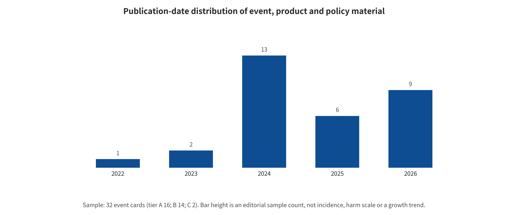

## Appendix C. 32 event cards, news, and policy timeline

### APP-C.E1 Evidence expansion: news, real events, product safety, and policy timeline

#### APP-C.E1.1 Coding rules: event date is not report date, and attribution is not incidence rate

<!-- new_id=M-L00477 origins=L00477 evidence=LF-E096-LF-E197 action=move -->
This chapter covers the central event cards E001–E032 in full, counting each event only once. Multiple reports serve as a source chain and do not add new events. The event date describes when the behavior, entry into force or product change occurred, whereas the publication date describes when the evidence document appeared. The five evidence links are: whether generation/editing is confirmed by primary material; how the content entered dissemination or a business process; what the observable consequences are; whether real-world harm has independent evidence; and how officials, the judiciary or the platform responded. Any unknown link is left unknown and must not be filled in with common sense.

<!-- new_id=M-L00478 origins=L00478 evidence=LF-E096-LF-E197 action=move -->
Evidence level A rests mainly on statutory text, court and judicial records, written government replies, and verifiable standards. Level B is mostly self-reported by vendors, platforms, or institutions. It can prove "what claim or action the organization made," but its independence is limited. Level C is cross-referenced high-credibility media. Such reporting usually supports only the existence of the event and the public reaction. It cannot determine the specific generator, the attacker, or the total dissemination volume. Dense reporting reflects media selection, judicial transparency, and platform transparency, not attack incidence. `event_timeline.csv` records the generation evidence, dissemination, consequences, official response, unknowns, and source IDs item by item.

#### APP-C.E1.2 Identity impersonation, fraud, and political communication cluster (E001–E003, E007, E011–E012, E025)

<!-- new_id=M-L00479 origins=L00479 evidence=LF-E134;LF-E156 action=move -->
**E001 Deepfake video-conference fraud of about HK$200 million in Hong Kong.** The generation evidence comes from the Hong Kong Government's LCQ9 written reply. Public web video and audio were downloaded, and a pre-recorded deepfake meeting was used to impersonate management. The dissemination chain was not public social sharing. It was an internal organizational meeting and a transfer authorization. Employees transferred about HK$200 million to 5 local accounts. The government reply confirms the real-world property loss. The official response includes a police investigation, account tracing, cooperation with financial institutions, and anti-fraud publicity. Several points remain unknown. Was the meeting generated in real time? Which model was used? How much was recovered per transfer? What technology stack did the attacker use? [@O048] [@O049]

<!-- new_id=M-L00480 origins=L00480 evidence=LF-E134;LF-E156 action=move -->
**E002 CFO impersonation case of nearly HK$4 million in Hong Kong.** The official reply confirms the date. Around 2024-05-20 an employee entered a video conference and impersonated the CFO via instant messaging before transferring funds. As with E001, the case proves that identity and business authorization processes were breached. It does not prove that a particular T2V model has a specific ASR. The real-world consequence is a loss of nearly HK$4 million. The case investigation status is limited to the 2024-06-26 reply. Real-time capability, the generator, and recovery remain unknown. [@O048] [@O049]

<!-- new_id=M-L00481 origins=L00481 evidence=LF-E157 action=move -->
**E003 Fake investment advertisements using the image and voice of the Hong Kong Chief Executive.** A government announcement confirmed that the advertisements were false and publicly denied endorsement. The generation/editing method, publisher, and dissemination scale were not disclosed. The evidence therefore confirms only the distortion of identity/authorization status and the exposure risk of fraud. It does not confirm a loss. The official response was clarification and a public reminder. Law-enforcement progress is unknown. [@O050]

<!-- new_id=M-L00482 origins=L00482 evidence=LF-E177;LF-E181-LF-E182 action=move -->
**E007 False explosion image near the Pentagon.** Authorities clarified that no such explosion occurred. The media recorded the spread of the image and a brief market fluctuation. The technical attribution "generated by AI" should still be written as suspected or possible. It must not be inferred back from the appearance of the image. Dissemination occurred on social platforms and in news aggregation chains. Real-world causal loss cannot be identified from a brief market fluctuation alone. The attacker, tooling, initial account, and profit are all unknown. [@O070] [@O074] [@O075]

<!-- new_id=M-L00483 origins=L00483 evidence=LF-E170-LF-E171 action=move -->
**E011 Taiwan election influence operation.** A Microsoft threat analysis report describes an influence operation that used AI-generated elements in content tied to the 2024 Taiwan election. The source is institutional threat intelligence. It can support its observations and attribution judgments, but it is not equivalent to a public judicial finding. The dissemination chain involves social content and political narratives. Real-world voting impact lacks counterfactual evidence. The generation proportion, the specific model, and audience behavioral effects are unknown. [@O063] [@O064]

<!-- new_id=M-L00484 origins=L00484 evidence=LF-E172-LF-E173 action=move -->
**E012 Fabricated surrender videos related to the Ukraine war and an impersonation network.** Meta's public handling material confirms that the platform removed fabricated surrender videos and a related impersonation network. The platform logs here can prove the existence of the content and of the handling action. They cannot independently prove the production tooling, state-actor attribution, or real-world strategic effect. The official/platform response was deletion, account-network handling, and public disclosure. Cross-platform re-uploading is unknown. [@O065] [@O066]

<!-- new_id=M-L00485 origins=L00485 evidence=LF-E169 action=move -->
**E025 Proof-of-life photos and videos in virtual kidnapping.** The FBI warns that offenders modify photos or videos for virtual kidnapping extortion. The official warning can prove that law enforcement observed this offending pattern. It cannot give the incidence rate across all cases. In the dissemination chain, attackers send "proof of life" to families and pressure them to transfer funds. The loss in individual cases, the generator, the mixing ratio of genuine and fake material, and the scale of victims are not given in this event card. [@O062]

<!-- new_id=M-L00486 origins=L00486 evidence=LF-E096-LF-E197 action=move -->
Under this survey's coding, the main failures in these seven thematic cases cluster in the identity and authorization processes of I7. This distribution comes from purposive event selection and cannot represent the real-world population. The cases show that factors beyond generation technology also participated in the transfer, dissemination, or political influence chains. Those factors include account control, organizational processes, platform recommendation, and audience judgment. Defenses for such scenarios therefore should not deploy deepfake detectors alone. They should also evaluate callback verification, dual authorization, independent payment channels, account anomaly detection, platform tracing, and incident response.

#### APP-C.E1.3 Product Alignment, Pause/Resume, and Lifecycle Cluster (E004–E005, E031–E032)

<!-- new_id=M-L00487 origins=L00487 evidence=LF-E154 action=move -->
**E004 Google suspends Gemini person image generation.** The vendor confirmed that person generation produced inaccurate or offensive historical/person representations, then suspended the capability. This generation evidence is stronger than media speculation, because the product side confirmed its own system and action. The explanation of the cause, the data, and the evaluation set, however, are self-reported by the vendor, and independent reproduction is lacking. The observable consequences are reduced service availability and representational controversy. This cannot be written as a successful external attack. [@O046]

<!-- new_id=M-L00488 origins=L00488 evidence=LF-E154-LF-E155 action=move -->
**E005 Staged restoration of person generation with Imagen 3.** Google announced restoration to some users after improving data, safety filtering, and red-teaming. This event is the product-response sequel to E004. It can prove the restoration and the restriction claims, but it cannot prove independent safety effectiveness. Regions, plans, and model versions change dynamically. Deployment effects require continuous external measurement. [@O047] [@O046]

<!-- new_id=M-L00489 origins=L00489 evidence=LF-A039;LF-E129-LF-E130;LF-E147 action=move -->
**E031 The Sora Web/App product surface shows unavailability from 2026-04-26.** The official help page distinguishes product surfaces. The retirement node for Web/App is 2026-04-26, while the API has a separate planned node (listed on the page as 2026-09-24). Neither of these two dates can automatically be interpreted as model weights or all Sora capabilities terminating on the same day. The page does not state that the shutdown stems from a safety issue. "Service discontinuation" therefore cannot be coded as a defense success or incident response. The related system cards can only describe the red-team, person, and misleading-content mitigations that the vendor declares for specific versions. [@O021] [@O019] [@R-A035]

<!-- new_id=M-L00490 origins=L00490 evidence=LF-E148-LF-E149;LF-E185 action=move -->
**E032 The Stable Video Diffusion hosted API was retired on 2025-07-24.** The Stability AI announcement supports the lifecycle of the hosted interface. It cannot be used to infer model withdrawal, because self-hosted weights and code paths may still exist. Security research should separate three states: the end of the service version, weights that stay downloadable, and continued ecosystem use. [@O033] [@O032] [@O079]

<!-- new_id=M-L00491 origins=L00491 evidence=LF-E096-LF-E197 action=move -->
This cluster guards against a common causal error. Product suspension, restoration, or retirement is observable organizational behavior, but the sources must make the cause explicit. Vendor model cards and announcements are suitable for evidencing policy, capability scope, and self-reported mitigations. They are not suitable for evidencing long-term effects on real-world platforms.

#### APP-C.E1.4 Training Corpus and Model Supply Chain Incident Cluster (E008–E010)

<!-- new_id=M-L00492 origins=L00492 evidence=LF-E158;LF-E183 action=move -->
**E008 LAION suspends LAION-5B downloads.** The LAION organization stated that it suspended index downloads and launched a safety review after external research pointed to suspected CSAM link risks. The asset here is the URL/metadata index and its downstream training use. This should not be written as LAION servers storing all underlying images. The propagation consequences are interrupted dataset availability and downstream compliance risk. Forensic analysis of the underlying content, the proportion of affected links, and the whereabouts of existing copies remain incomplete. [@O051] [@O076]

<!-- new_id=M-L00493 origins=L00493 evidence=LF-E158-LF-E159;LF-E183 action=move -->
**E009 Release of Re-LAION-5B.** The organization released a revised, re-filtered version on 2024-08-30 as a response to E008. The official statement can prove that the rebuilding and filtering process was executed. It cannot prove zero missed detections, or that all mirrors were updated. The real governance problem does not turn on whether the new files exist. It turns on old index copies, on models that are already trained, and on continuous withdrawal. [@O052] [@O051] [@O076]

<!-- new_id=M-L00494 origins=L00494 evidence=LF-E160-LF-E161 action=move -->
**E010 Hugging Face discloses a model evaluation security incident in 2026-07.** The platform security advisory confirms the security incident and the response in the evaluation/model ecosystem. The specific vulnerability, affected artifacts, execution chain, and scope of remediation are limited to the original advisory. This survey uses it as a bridging event for cross-modal evaluation infrastructure. It directly supports the need for isolation, least privilege, and incident response in remote loading and evaluation environments. It cannot by itself prove universal effects of safe serialization or model scanning. Nor can a single disclosure be used to estimate the overall malicious rate of the repository. Recommendations for safe formats and scanning are supported separately by the official security documentation in Chapter 14. [@O053] [@O054]

<!-- new_id=M-L00495 origins=L00495 evidence=LF-E096-LF-E197 action=move -->
These three events connect I1/I2 from paper threat models to real maintenance actions. The dataset events directly involve retirement, rebuilding, versions, and withdrawal. The model evaluation event directly involves isolation, least privilege, and response. Scanning and safe formats are defense in depth proposed in combination with the official documentation in Chapter 14, rather than derived from E010 alone. Any "fixed" claim should be accompanied by the version, the time, and the scope of disposal of old copies.

#### APP-C.E1.5 Non-Consensual Intimate Imagery, Child Safety, and Law Enforcement Cluster (E006, E018–E024)

<!-- new_id=M-L00496 origins=L00496 evidence=LF-E178-LF-E180 action=move -->
**E006 Spread of non-consensual explicit synthetic images of Taylor Swift.** High-credibility media such as AP and Reuters confirmed the wide spread of the content and the public responses of platforms/governments. No firsthand case file, however, is available. The generator, the attacker, the precise spread volume, and causal harm should therefore not be filled in. What can be confirmed is that a non-consensual identity representation entered platform distribution and triggered discussion of how to handle it. The evidence grade is C. [@O071] [@O072] [@O073]

<!-- new_id=M-L00497 origins=L00497 evidence=LF-A042;LF-E133;LF-E146 action=move -->
**E018 The TAKE IT DOWN Act becomes federal law.** Public Law 119-12, signed on 2025-05-19, establishes criminal provisions for non-consensual intimate imagery and digital forgery. It also obliges platforms to remove content after effective notice. It is an institutional node. It does not prove the number of incidents before or after it. Research should measure notice effectiveness, the 48-hour process, repeat content, and appeals. [@O014] [@O015]

<!-- new_id=M-L00498 origins=L00498 evidence=LF-E162;LF-E195 action=move -->
**E019 The first related guilty plea nationwide.** On 2026-04-07 the DOJ stated that a defendant pleaded guilty to charges including digital forgeries. It described the case as the first TAKE IT DOWN Act conviction-related case nationwide. The judicial status is a guilty plea, which should not be confused with charges. The case also contains real and AI material, cyberstalking, and other charges. Not all of the harm can be attributed to the generative model. [@O055]

<!-- new_id=M-L00499 origins=L00499 evidence=LF-E163;LF-E196 action=move -->
**E020 Two people arrested and charged with distributing AI deepfake pornography.** A criminal complaint dated 2026-05-20 alleged that two defendants distributed large amounts of images/videos involving identifiable women. The distribution volume and view counts belong to the complaint materials. The presumption of innocence still applies to the case. The current evidence proves the judicial proceedings and the alleged facts, not a final conviction. [@O056]

<!-- new_id=M-L00500 origins=L00500 evidence=LF-E164 action=move -->
**E021 Domain seizure.** On 2026-06-12 the DOJ and DHS seized domains alleged to have been used to publish non-consensual digital forgeries. They stated that a judge found probable cause supporting the seizure warrants. Domain seizure, the arrests in France, and future criminal liability are different procedural states. This proves cross-border enforcement and infrastructure disposal. It does not prove that all content on the sites was generated by the same model. [@O057]

<!-- new_id=M-L00501 origins=L00501 evidence=LF-E165 action=move -->
**E022 Cyberstalking indictment related to AI-generated nude images.** US judicial materials dated 2026-06-18 describe a federal grand jury indictment for cyberstalking. They allege the use of AI-generated nude images and fake accounts to amplify harassment. An indictment is only an allegation. The current charges do not equal a TAKE IT DOWN Act conviction. The real-world consequences are the alleged sustained harassment and identity attacks, and the specific generator is unknown. [@O058]

<!-- new_id=M-L00502 origins=L00502 evidence=LF-E166 action=move -->
**E023 Guilty verdict in a mixed child exploitation case involving AI-generated CSAM.** On 2026-02-06 the DOJ announced that a jury had returned a guilty verdict. The charges included receiving and possessing real and AI-generated child sexual abuse material. The case materials confirm the use of a text-to-image program to generate part of the content. Real victim material is also present, so the mixed offenses must not be attributed entirely to AI. [@O059]

<!-- new_id=M-L00503 origins=L00503 evidence=LF-E167;LF-E197 action=move -->
**E024 NCMEC reports on generative AI child exploitation.** One page, dated 2024-12-13, states that more than 7000 related reports arrived in the preceding two years. A report entry is not an independent incident, a victim, or a judicially confirmed sample. Report forms and classifications also change over time. NCMEC's updated page as of 2026-08-09 lists classification statistics for 2023–2025. It makes clear that not every report with an AI association involves generating or sharing GAI CSAM. The latest figures therefore can only be cited separately, under the official framing, and must never be pieced together into an incidence trend. [@O060] [@L-S005]

#### APP-C.E1.6 Labeling, Provenance Attestation, and Platform Enforcement Cluster (E013–E017, E028–E030)

<!-- new_id=M-L00505 origins=L00505 evidence=LF-D088;LF-E150;LF-E186 action=move -->
**E013 Meta admits mislabeling real photos.** Meta stated that its fact-checking/labeling system had wrongly labeled real photos that had undergone ordinary editing as AI-related content. That is an important counterexample. More aggressive labeling is not necessarily safer, and false positives damage the credibility of real content. One thing is verifiable in this incident: the platform admitted the label misuse. It is not a confirmed generation event, and the generator field is `NA/not verified`. The official response adjusted the labels and the explanation mechanism. [@O080] [@O042]

<!-- new_id=M-L00506 origins=L00506 evidence=LF-A041;LF-E131;LF-E142-LF-E144 action=move -->
**E014 China's labeling measures and GB 45438-2025 take effect.** On 2025-09-01 the Measures for the Labeling of AI-Generated Synthetic Content and the mandatory national standard took effect together. They distinguish explicit labels, which users can perceive, from implicit labels in file metadata. They assign responsibilities to generation services and content distribution services. The regulations prohibit maliciously deleting, tampering with, forging, or concealing labels. Cross-platform retention, false positives and appeals, however, still require empirical evidence. [@O009] [@O012] [@O010] [@O011]

<!-- new_id=M-L00507 origins=L00507 evidence=LF-A041;LF-E131;LF-E145 action=move -->
**E015 China's cyberspace authority announces app enforcement actions.** A regulatory announcement dated 2025-11-25 lists enforcement actions against a batch of apps. Those apps violated laws and regulations on the labeling of generated synthetic content. This evidence can confirm the enforcement action and the named apps. It should not be divided by the total number of apps to estimate a violation rate, because the screening framework, the coverage and the sampling denominator are not public. [@O013] [@O009]

<!-- new_id=M-L00508 origins=L00508 evidence=LF-A040;LF-D092;LF-D094;LF-E136;LF-E140-LF-E141;LF-E193 action=move -->
**E016 EU AI Act Article 50 obligations begin to apply.** The relevant transparency obligations of Regulation (EU) 2024/1689 apply from 2026-08-02. They concern providers' machine-readable marking/detection and deployers' disclosure of deepfakes and similar content. The European Commission's Q&A also states that relevant systems placed on the market earlier have a transition arrangement until 2026-12-02. The specific addressees, the exceptions and the interpretation should still be traced back to the formal legal sources. Legal obligations, the transition period and technical effectiveness are three layers of evidence. [@O006] [@O007] [@O008]

<!-- new_id=M-L00509 origins=L00509 evidence=LF-D094;LF-E140-LF-E141;LF-E193 action=move -->
**E017 The European Commission's final code of practice.** The final code, published on 2026-06-10, helps providers and deployers implement Article 50(2), (4), and (5). The webpage was updated on 2026-07-29 and links to the unified icon and the signing process. The code is a voluntary tool. Signing it, following it, or an adequacy opinion from the European Commission is not decisive proof of compliance. None of these means that labels are retained 100% after platform transcoding. [@O007] [@O008] [@O007]

<!-- new_id=M-L00510 origins=L00510 evidence=LF-A038;LF-D061;LF-D074-LF-D077;LF-E126;LF-E137-LF-E139 action=move -->
**E028 C2PA conformance program and Trust List launch.** In mid-2025 the C2PA formal trust list and conformance ecosystem reached an operational stage. Technical specification 2.4 defines manifests, signatures, validation, revocation and trust anchors. The incident date is NR in the central card, so only the launch window is written and no single day is invented. A trusted certificate proves the signature chain, but it cannot prove that the semantics of the claim are true. [@O003] [@O004] [@O001] [@O002]

<!-- new_id=M-L00511 origins=L00511 evidence=LF-A038;LF-D061;LF-D077;LF-D087;LF-E126;LF-E153;LF-E184 action=move -->
**E029 TikTok reads Content Credentials for automatic labeling.** On 2024-05-09 TikTok announced that it reads C2PA Content Credentials and automatically labels externally generated images and videos. This platform deployment statement can prove the product plan and the signal interface. The retention rate, the mislabeling and the coverage of the real upload-download chain still require independent evaluation. [@O045] [@O001] [@O077]

<!-- new_id=M-L00512 origins=L00512 evidence=LF-A038;LF-D061;LF-D077;LF-D084;LF-E126;LF-E151-LF-E152 action=move -->
**E030 YouTube strengthens AI labels.** On 2026-05-27 YouTube announced that it was moving AI labels to a more prominent position and introducing automatic identification signals. The platform is therefore expanding from user self-reporting to multi-signal enforcement. That announcement has not yet proven user understanding, presentation in different languages, false positives, appeals or repeat-upload outcomes. [@O044] [@O043] [@O001]

<!-- new_id=M-L00513 origins=L00513 evidence=LF-E096-LF-E197 action=move -->
Together these events form a chain: "model labeling—file credentials—platform reading—user display—handling and appeals." Lose any one node and the corresponding credential path breaks, or its coverage falls. Redundant watermarks, soft bindings and platform logs may still retain other clues, so this must not be written in broad terms as coverage dropping to zero. A complete chain, conversely, only indicates that the provenance claim is verifiable. It does not indicate that the event the media expresses is true.

#### APP-C.E1.7 Copyright and litigation boundary cluster (E026–E027)

<!-- new_id=M-L00514 origins=L00514 evidence=LF-E174 action=move -->
**E026 Andersen v. Stability AI interim ruling.** As of the procedural point of 2024-08-12, a US court allowed some claims to proceed. A procedural "allowance to proceed" is not a final finding of infringement or liability. It can support only the litigation status, the claim types and the next procedural step as of that date. Judgment must follow the subsequent case record, and it must treat several questions separately. Did generative model training copy? Are outputs substantially similar? What is the liability of each defendant?[@O067]

<!-- new_id=M-L00515 origins=L00515 evidence=LF-E175-LF-E176 action=move -->
**E027 Getty Images v Stability AI UK judgment.** As of the adjudication point of 2025-11-04, the UK High Court issued the `[2025] EWHC 2863 (Ch)` judgment. A formal judgment can support the adjudicative conclusions and legal analysis of that case. It cannot be converted directly into technical safety rules for arbitrary models or jurisdictions. Training location, weights, outputs, trademark and copyright claims should be kept separate.[@O069] [@O068]

<!-- new_id=M-L00516 origins=L00516 evidence=LF-E096-LF-E197 action=move -->
These two lawsuits show that "similarity", "memorization" or "training use" in a technical paper does not automatically equal legal infringement. This survey should place paper observations, rights claims, procedural stages and final adjudications in different columns. Experimental metrics must not stand in for legal conclusions.

#### APP-C.E1.8 Cross-event synthesis: what can be proven, what remains unknown

<!-- new_id=M-L00517 origins=L00517 evidence=LF-E096-LF-E197 action=move -->
The current 32 materials can cover multiple evidence interfaces, but that coverage does not constitute a temporal growth trend. Government written responses can confirm property losses and investigations. Vendor announcements can confirm product actions. Judicial records can distinguish indictment, guilty plea, verdict and seizure. Regulations and standards can define obligations. Platform announcements can confirm labeling features. Media can provide only limited cross-checking when first-hand case files are missing. Different types of sources complement each other and cannot substitute for one another.

<!-- new_id=M-L00520 origins=L00520 evidence=LF-E096-LF-E197 action=move -->

<!-- new_id=M-L00521 origins=L00521 evidence=LF-E096-LF-E197 action=move -->
**Table: Event topic clusters and evidence limits**

<!-- new_id=M-L00522 origins=L00522 evidence=LF-E096-LF-E197 action=move -->
| Topic cluster | Included event cards | Event date span | Evidence level composition | Response example |
|---|---|---|---|---|
| Product alignment, pause/resume, and lifecycle | 4 | 2024-02-22 to 2026-04-26 | B:4 | Google apologized, explained the tuning issue, and paused the capability for improvement |
| Labeling, provenance proof, and platform enforcement | 8 | 2024-05-09 to 2026-08-02 | A:5, B:3 | Meta investigated and corrected erroneous matches |
| Copyright and litigation boundary | 2 | 2024-08-12 to 2025-11-NR | A:1, B:1 | Court issued a written ruling |
| Training corpus and model supply chain incidents | 3 | 2023-12-19 to 2026-07-NR | B:3 | LAION initiated maintenance, safety review, and subsequent cleanup |
| Identity impersonation, fraud, and political communication | 7 | 2022-03-NR to 2025-NR-NR | A:4, B:2, C:1 | Police investigation, public education, and financial institution collaboration; for later statistical definitions see the 2026 budget response |
| Non-consensual intimate imagery, child safety, and law enforcement | 8 | 2024-01-24 to 2026-06-18 | A:6, B:1, C:1 | The White House publicly expressed concern; the platform took partial search and content measures |

<!-- new_id=M-L00523 origins=L00523 evidence=LF-E096-LF-E197 action=move -->
Note: The data source is `paper/tables/event_clusters.csv`; the main text shows 6/6 rows and abbreviates overly long cells; the complete fields and records are subject to that CSV.

---

[← Back to contents](index.md)
