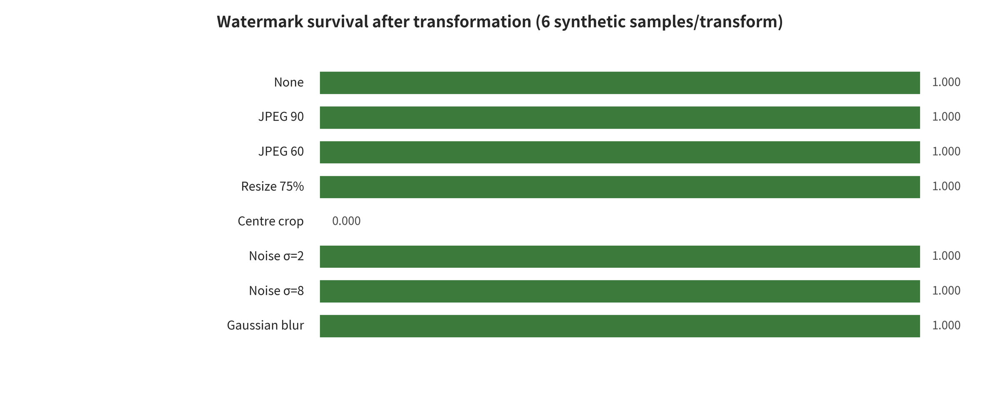

## Appendix D. Local experiments, static audit of seven repositories, and build receipts

### APP-D.E1 Evidence elaboration: bounded local experiments and static audit of seven repositories

#### APP-D.E1.1 The reproduction question is not "can a number be produced"

<!-- new_id=M-L00524 origins=L00524 evidence=LF-R203-LF-R204 action=move -->
The reproduction chapter uses one six-state enumeration throughout. `NOT_ATTEMPTED` means not run. `STATIC_AUDIT_ONLY` reads only code, configuration and artifact contracts. `ENVIRONMENT_PROBE` verifies the environment or entry point. `PARTIAL_RUN` runs benign local subproblems. `CONTROLLED_END_TO_END` completes the main protocol on authorized data and isolated models. `EXTERNAL_SERVICE_VALIDATION` additionally requires service authorization, version and request evidence. No state can be upgraded into another, and a separate `paper_main_protocol_run` boolean indicates whether the paper's main configuration was run. The current environment probe passes, the synthetic media watermark experiment is `PARTIAL_RUN`, the seven repositories are `STATIC_AUDIT_ONLY`, and the 41 paper cards are `NOT_ATTEMPTED`, `end_to_end_runs=0`.

<!-- new_id=M-L00525 origins=L00525 evidence=LF-R203-LF-R204 action=move -->
The local experiments choose authenticity defense. It can use fully synthetic images and videos, safely examine how different signals behave under media transformations, and preserve exact denominators. The experiments use no generative model weights and do not claim to reproduce Stable Signature, Tree-Ring, VideoSeal, C2PA or any product watermark. They answer one question only: how do exact byte verification used for testing, easily stripped container metadata, and a global DCT-QIM toy signal each behave under pre-registered transformations?

#### APP-D.E1.2 Environment, inputs, and state contract

<!-- new_id=M-L00526 origins=L00526 evidence=LF-R203-LF-R204 action=move -->
The environment records the versions of the operating system, Python, FFmpeg, image libraries and hashing tools. The experiment configuration, dependencies and run logs are located in `reproductions/`. The image input is 6 programmatically generated synthetic samples with no personal data or copyrighted material. The video input consists of 48 synthetic source frames. All outputs, digests, exact signatures and verification reports have file hashes.

<!-- new_id=M-L00527 origins=L00527 evidence=LF-R203-LF-R204 action=move -->
The experiment status is written as `PARTIAL_RUN`. The program did not fail; the research goal is deliberately local. No paper model was run, no watermark encoder/decoder was learned, and no real service was attacked. Key management, public verification, revocation, cross-platform upload and victim handling were not covered. The verification report only proves that the current files, denominators and state contract are self-consistent.

#### APP-D.E1.3 Three types of authenticity contracts

<!-- new_id=M-L00528 origins=L00528 evidence=LF-R203-LF-R204 action=move -->
The first type is exact byte SHA-256/HMAC. It verifies whether object bytes are exactly identical and suits immutable file transfer. Any re-encoding, remuxing or metadata change will change the result. The HMAC used in testing shows that "a party holding the shared key can compute an authentication code over exact bytes". It is not a publicly verifiable signature, and it has no certificate, timestamp or revocation.

<!-- new_id=M-L00529 origins=L00529 evidence=LF-R203-LF-R204 action=move -->
The second type is container metadata. Metadata can record provenance clues, but whether it is retained depends on whether the processing chain copies it. In the experiments it disappears after explicit stripping. That shows that "metadata exists" differs from "the media content itself carries a robust signal". The third type is a content-level DCT-QIM toy signal. It remains detectable under several compressions and noise, yet it clearly fails under cropping and stronger video compression. The three actual test objects complement each other. Exact bytes guarantee an immutable object. Ordinary metadata provides volatile clues. The content signal provides limited recovery clues when container fields are lost. Cryptographic provenance manifests, signature declarations and edit chains form a conceptual fourth layer, discussed in this survey but not run locally. They do not belong to the three experiments above, and they cannot be inferred from ordinary metadata results.

#### APP-D.E1.4 Image experiments, denominators, and results

<!-- new_id=M-L00530 origins=L00530 evidence=LF-R203-LF-R204 action=move -->
The image group applies 8 processing types to 6 watermark samples and 6 clean controls. For every processing type the valid denominator is 6 watermark samples and 6 clean samples. JPEG Q60, scaling, two-level noise and Gaussian blur are all detected at 6/6 under the current threshold. Center 80% crop followed by scaling is 0/6. The result shows that a global fixed-band signal lacks synchronization recovery capability against the current crop implementation. It does not show that "all frequency-domain watermarks are not robust to cropping". The numerator and denominator per transformation are in `reproductions/results/image_summary.csv`, and the overall experiment status is in `reproductions/results/summary.json`.

<!-- new_id=M-L00531 origins=L00531 evidence=LF-R203-LF-R204 action=move -->
The experiments also record false positives on clean samples, rather than reporting only hits on watermark samples. The samples are entirely synthetic, very small in number, and involve no cross-generator or real platform processing. This result therefore does not support an overall robustness rate, confidence intervals or product comparisons. Its value is to show how processing types change the signal under the same detection threshold. It also shows why watermark papers must report the specific transformations, the denominators and the benign-content false positives.

#### APP-D.E1.5 Video experiments: source frames are not the denominator for every processing condition

<!-- new_id=M-L00532 origins=L00532 evidence=LF-R203-LF-R204 action=move -->
The video group builds 9 processing conditions out of 48 source frames. Frame-rate processing changes how many frames the decoder returns. The 48 source frames named in the title are therefore not a fixed detection denominator across conditions. Taken together, all conditions hold 420 valid watermark frames and 420 valid clean frames. CRF23 re-encoding is detected at 48/48, with no clean-frame false positives. CRF35 reaches 21/48 and shows 1/48 clean-frame false positives. The 250 kbit/s condition reaches 18/48, and center crop reaches 0/48. Per-frame summaries sit in `reproductions/results/video_frame_results.csv`; per-condition summaries sit in `reproductions/results/video_summary.csv`.

<!-- new_id=M-L00533 origins=L00533 evidence=LF-A021;LF-D081;LF-E116 action=move -->
Per-frame results support frame-level propositions only. Production video needs more besides: clip-level detection, longest consecutive missed detection, key-event coverage, first-alert latency, frame-rate changes, frame insertion/deletion, temporal localization and streaming resources. The current experiments do not learn temporal propagation, and they do not carry the learned spatiotemporal encoding that VideoSeal discusses [@P033]. So the denominator of the 6 fps condition in the figure, and any video-level conclusion, must be read separately. A frame-level average must not be written as though the provenance of a whole segment had been reliably verified.

#### APP-D.E1.6 Why the results cannot become a paper leaderboard

<!-- new_id=M-L00534 origins=L00534 evidence=LF-A012-LF-A013;LF-A015;LF-A021;LF-D065-LF-D067;LF-D081;LF-E107-LF-E108;LF-E110;LF-E116 action=move -->
Stable Signature implants a signature in the decoder. Tree-Ring builds an invertible pattern in the frequency domain of the initial noise. VideoSeal pairs learned image encoding with temporal propagation. This experiment, by contrast, is global DCT-QIM. Across these approaches, embedding locations, keys, perceptual constraints, detectors, attack budgets and samples all differ [@P028] [@P029] [@P033]. WAVES shows that comparing watermarks demands unified stress testing. This survey has not added the toy signal to its full protocol, and it has not run the main configurations of these papers [@P030].

<!-- new_id=M-L00535 origins=L00535 evidence=LF-R203-LF-R204 action=move -->
This chapter can therefore use the local results only to explain "why the evaluation contract matters". The same results cannot rank methods. In particular, the center crop result of 0/6 cannot be written as a counterexample to all watermarks. Nor can the CRF23 result of 48/48 be written as proof of robustness in production video. Extrapolation needs several classes of real video at minimum. It also needs several encoders, quality constraints, unknown processing chains, low-base-rate false positives and adaptive removal.

#### APP-D.E1.7 Static audit of the seven repositories

<!-- new_id=M-L00536 origins=L00536 evidence=LF-R203-LF-R204 action=move -->
The repository audit covers Stable Signature, VideoSeal, Tree-Ring Watermarks, UnMarker, PhotoGuard, DeepfakeBench and c2pa-rs. Each snapshot records the official repository identity, the pinned commit and branch, the number of source files, and the entry points. It also records syntax and compilation probes, weight and data contracts, dependency files, the license and any blocking reasons. The `.git` object store stays out of the reproduction file manifest, but the commit SHA is saved on its own.

<!-- new_id=M-L00537 origins=L00537 evidence=LF-R203-LF-R204 action=move -->
A static audit answers a few questions only. It can list the entry points the current commit exposes and the weights and data it requires. It can report whether a license exists, and whether help commands or source files can be parsed. It cannot say whether a model reaches the metrics its paper reports. Large weights and data were not downloaded. The environments each paper specifies were not set up, and the main configurations were not executed. All 7/7 therefore carry `STATIC_AUDIT_ONLY` and `end_to_end_runs=0`. Per-repository commits, entry points and blocking reasons are in `data/repo_audit.csv` and `reproductions/results/repo_audit.json`. An entry point that passes `--help`, or source files that compile, shows only that the entry contract holds locally.

#### APP-D.E1.8 Reproduction upgrade roadmap

<!-- new_id=M-L00538 origins=L00538 evidence=LF-R203-LF-R204 action=move -->
End-to-end upgrades should move through stages ordered by risk and representativeness. First, pin the paper version, commit, weights, data, configuration, license and hardware for each repository. Second, run the authors' minimal examples in an isolated environment and keep the failures. Third, choose common data and transformations for a unified rerun. Only at the end, and only once the conditions of independent studies and variance are met, should quantitative synthesis be considered. Watermark research also needs clean separations: images from video, embedding/detection/localization/attribution, and benign utility from adaptive removal.

<!-- new_id=M-L00539 origins=L00539 evidence=LF-R203-LF-R204 action=move -->
Suppose that in future only imports, help commands or single-sample visualization get completed. Even then the status cannot be written as a paper reproduction. Where weights are inaccessible, the license does not permit use, or running the code would increase real-world abuse capability, keep the NOT_ATTEMPTED/blocked note. Do not fill the gap with simulated numbers.

<!-- new_id=M-L00541 origins=L00541 evidence=LF-R203-LF-R204 action=move -->

<!-- new_id=M-L00542 origins=L00542 evidence=LF-R203-LF-R204 action=move -->
**Table: Static audit status of the seven repositories**

<!-- new_id=M-L00543 origins=L00543 evidence=LF-R203-LF-R204 action=move -->
| Repository | Category | Commit | Status | Boundary/blocker |
|---|---|---|---|---|
| stable signature | Generation-time watermark defense | c91217c06e95 | STATIC AUDIT ONLY, PASSED | main=false; runs=0; weights not downloaded; data not downloaded; repository-specified isolation not established… |
| videoseal | Image and video watermark defense with forgery attack support | 870ca7fb3357 | STATIC AUDIT ONLY, PASSED | main=false; runs=0; weights not downloaded; data not downloaded; repository-specified isolation not established… |
| tree ring watermark | Generation-time semantic watermark defense | 3015283d9cf8 | STATIC AUDIT ONLY, PASSED | main=false; runs=0; weights not downloaded; data not downloaded; repository-specified isolation not established… |
| unmarker | Watermark removal attack | 58ba69259dd1 | STATIC AUDIT ONLY, PASSED | main=false; runs=0; README about 30GB weights, data packages not… |
| photoguard | Input immunization, edit defense | 686bea75c786 | STATIC AUDIT ONLY, PASSED | main=false; runs=0; Stable Diffusion, Hugg… |
| deepfakebench | Image and video forgery detection defense benchmark | f188b1c10546 | STATIC AUDIT ONLY, PASSED | main=false; runs=0; weights not downloaded; data not downloaded; repository-specified isolation not established… |

<!-- new_id=M-L00544 origins=L00544 evidence=LF-R203-LF-R204 action=move -->
Note: the data source is `paper/tables/repo_audit_compact.csv`. The main text shows 6/7 rows and shortens cells that run long. The complete fields and records are those in that CSV.

---

[← Back to contents](index.md)
