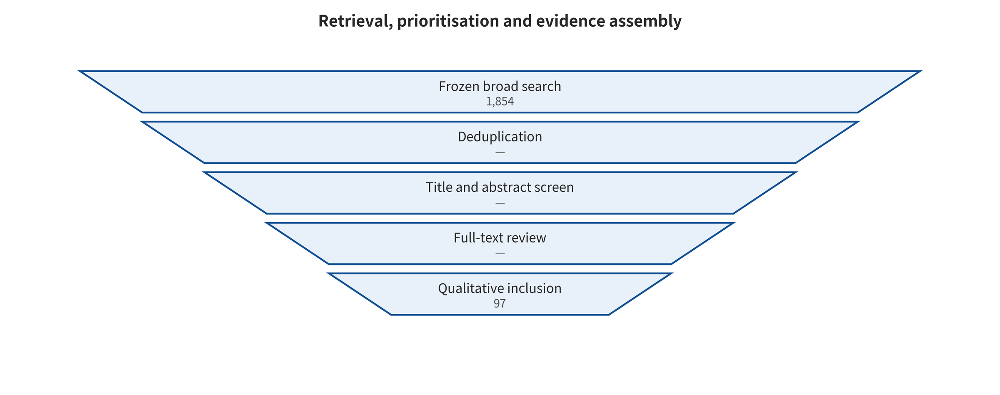

## Corpus Selection and Coding Method

The pre-search protocol was frozen on 2026-08-06, with a main time window from 2018-01-01 to 2026-08-06 and backward tracing to the necessary foundational work. The survey draws on structured search, citation tracking, first-hand announcements and local run artifacts. It does not yet have complete dual-reviewer full-text screening and bias assessment. The accurate label is therefore a taxonomic review with a structured search module, not a strict systematic review.

The research questions run in order. How do attacks cross trust boundaries? How do different modalities and state mechanisms relate to one another? Which segment does each defense control block? When is evidence comparable? How do real-world incidents and local mechanism reproductions constrain engineering design? The primary unit of analysis is the paper-level main effect. Within-paper experiment arms, incidents and local runs are stored separately and must not be conflated as independent studies.

Figure fig:search-flow shows the auditable process of search, prioritization and evidence assembly.

*Candidate retrieval, machine prioritization, and manual evidence assembly process. OpenAlex candidates have not yet undergone complete dual-reviewer full-text screening. This survey therefore does not use the strict systematic review label.*

### Pre-search Protocol

The study design document, fixed before large-scale retrieval, records the research questions, article skeleton, search queries, inclusion and exclusion criteria, quality tiers, data fields, and the meta-analysis and correlation plan. If later evidence overturns an earlier judgment, corrections are appended in STAGE_SUMMARY.md only. The process record is not silently rewritten.

### Automated Candidate Retrieval and Manual Verification

For each of 12 topics, the OpenAlex pipeline retrieved up to 200 relevance-ranked results, yielding 2,400 API returns in total. Deduplication by OpenAlex ID/DOI left 1,854 candidates. Transparent keyword rules labeled them 701 high-priority, 297 medium-priority and 856 low-priority. These labels serve only for ranking and cannot be regarded as final screening decisions. The complete queries, hit counts, retrieval counts and raw responses are in data/openalex/.

The first-round manual evidence base table holds 65 attack studies. After backfilling the completed formal versions, the current tiers are 40 at level A and 25 at level C. This coding may still underestimate existing conference versions. Before freezing, it is not treated as equivalent to the final “peer-reviewed/preprint” publication status. The defense and engineering table holds 62 sources at A/B/C levels of 23/23/16, covering papers as well as protocol specifications, system documentation and security advisories. Those cannot be added to the attack papers as a “total paper count”. The compilation also adds 33 paper–model–attack configuration experiment arms and 32 incident/vulnerability/controlled-study records, the latter at A/B/C levels of 28/3/1. Unified template parsing was completed for 23 representative attack papers.

The attack draft lives in academic attack-surface retrieval, and the incident draft lives in incident and HF case verification. The main-text statistics will follow the frozen master table. That comes only after defense evidence, final-version deduplication and citation verification.

### Why a Single “Overall Compromise Rate” Cannot Be Given

The evidence base holds 33 attack experiment arms. Only 3 of those rows have had precise event counts and denominators extracted from first-hand pages and verified. This does not mean the remaining papers' main texts necessarily lack denominators. It means the current base table cannot yet support a binomial pooling on this basis. More importantly, those three rows differ in sampling unit and attack target. “31/36 applications can be prompt-injected” is application-level coverage, not per-prompt ASR. A model's violation generation rate on 100 harmful requests is likewise not equivalent to an agent's real data exfiltration rate across 100 enterprise tasks. Other papers may also score success differently. The options include keyword matching, LLM judge, human review, target prefix, tool-call success and performance degradation.

This survey therefore follows three rules. Only studies whose threat model, sampling unit and success definition can be mapped onto one another enter the same meta-analysis group. When an abstract gives only “over 90%”, 0.90 is not passed off as a precise point estimate, and the denominator is not back-derived. Studies with high heterogeneity or missing denominators are presented through evidence maps and stratified narrative, not by sacrificing interpretability for a single total.

This treatment complies with PRISMA 2020's requirements for transparent reporting and with Cochrane's cautious interpretation of heterogeneity, random effects and prediction intervals. Both sets of guidelines originate in medical reviews. This survey borrows their reporting and statistical principles, but it does not claim that LLM security experiments are equivalent to clinical trials. PRISMA 2020 [@page2021prisma]; Cochrane Handbook, Chapter 10 [@deeks2024cochrane].

---

[← Back to contents](index.md)
