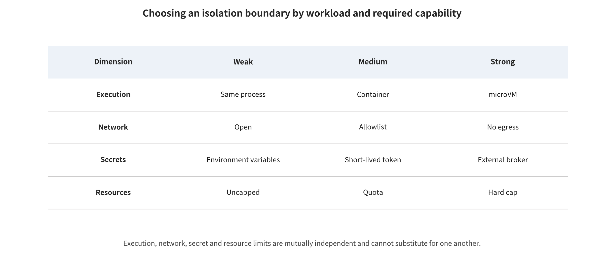

## Defense Method Families

Defenses unfold along the same principal boundary axis. Each family answers questions about input, mechanism, output, cost, applicable conditions and failure modes. Each also separates probabilistic guardrails from enforceable system controls.

### In-Model Probabilistic Control

This class of controls changes a model's refusal, classification or randomization behavior. It suits the role of a first line of defense that lowers the probability of triggering, but it does not provide an independent authorization guarantee.

#### Model Alignment, Classifiers, and Randomization: Necessary but Part of the Probabilistic Layer

Violation rates on known attack distributions can fall sharply under safety fine-tuning, preference optimization and constitutional classifiers. Consider the values reported directly in the paper. Constitutional Classifiers [@sharma2025constitutional] reduced ASR from 86% to 4.4% in its synthetic universal-jailbreak evaluation. It also reports a rise of about 0.38 percentage points in the normal refusal rate and a 23.7% increase in inference compute. This gives a good example of jointly reporting "safety--utility--cost." It is still evidence under a vendor model, a vendor policy and a specific long-duration red-teaming setup, and it cannot be extrapolated into an execution-safety guarantee for arbitrary agents.

SmoothLLM [@robey2023smoothllm] breaks some optimized suffixes through input perturbation and majority voting. Randomization can thus raise the cost of attack. The effect varies with attack type, perturbation rate and number of samples, and the method adds latency and token consumption. Input/output detectors likewise run into encoding, low-resource languages, cross-turn fragmentation and adaptive search. They suit screening, rate limiting and escalation handling. They should not be the sole authorizer of actions such as payments, database deletion or code execution.

A model-defense report needs at least four numbers. The first is attack success before and after the defense; then come normal task completion, over-refusal, and inference/human/latency cost. A "block rate" alone rewards a model that always refuses. Helpfulness alone rewards a system that lets dangerous actions through.

#### From "Why Safety Training Fails" to Adaptive Jailbreaking

Jailbroken, NeurIPS 2023 [@wei2023jailbroken] studies safety training through black-box manual prompts. It examines competing objectives and mismatched generalization. Its lasting value is the finding that jailbreaking is not a magic string but a structural tension between task objectives and safety generalization. It does not establish that its prompts stay individually effective on all new versions, nor does it offer a unified denominator that could serve as an overall ASR.

GCG [@zou2023gcg] optimizes transferable suffixes with white-box token gradients and coordinate search. It shows that out-of-distribution discrete strings can be found automatically, and it has become an important baseline for later adaptive attacks. It requires probability or weight access, so the cost differs for an ordinary API attacker. If one judges only by an affirmative opening, refusals, truncations or harmless text may be miscounted as successes.

PAIR [@chao2023pair] runs few-query black-box iterations through an attacker model, driven by feedback from the target model and the judge. Manual prompt attempts become a repeatable optimization loop, and the query budget becomes a core metric. It also brings correlated error: if similar models do the attacking and the judging, their errors do not cancel out. Drift in the target API and in policy can also change reproduction results.

Tensor Trust, ICLR 2024 [@toyer2024tensortrust] grew out of an online human attack-and-defense game. It holds roughly 563,000 attacks and 118,000 defense prompts. The corpus suits the study of how fast adaptation happens and how long a strategy survives once a defense is public. It is not a random sample of ordinary deployed users, though, and the attack frequency in the game cannot be read as a real-world incident rate.

Constitutional Classifiers [@sharma2025constitutional] pairs a classifier-style constitutional defense with long-duration red teaming. It significantly reduces the reported ASR under its model and policy, and it also reports false refusals and inference cost. The model's probabilistic layer thus still has value, but it cannot replace action authorization. Nor can one set of results from a closed-source vendor be reproduced automatically across models.

One thread runs through this group of work. Early manual attacks explained "why it fails." GCG/PAIR turned attacks into an optimization problem. Tensor Trust observed human adaptation after public release. Defense research then used training, classification and perturbation to raise the cost of attack. Their shared boundary is that the primary endpoint is still model output. Once a model can execute actions, one has to move on to the next group of system-level evidence.

### Structured Context, Provenance, and Information Flow

This class of controls prevents untrusted data from being silently promoted into instructions. It also makes tenant, provenance, integrity and confidentiality labels propagate as data is transformed.

#### Structured Context, Provenance, and Information Flow

StruQ [@chen2025struq] and SecAlign [@chen2025secalign] try to teach the model the structural boundary between instructions and data. Spotlighting [@hines2024spotlighting] uses provenance marking to reduce the probability that external text is treated as an instruction. These methods do more than the single sentence "ignore untrusted instructions." Yet the model still interprets that boundary probabilistically. In ToolHijacker [@shi2026toolhijacker]'s adaptive re-testing against malicious tool documentation, several StruQ/SecAlign configurations still showed a tool-selection attack success rate of 84.6%—99.6%. That does not refute every result in the original paper, but it shows that generalization across attack surfaces cannot be assumed to hold.

System-level schemes recast the problem as control flow and information flow. Task Shield [@jia2025taskshield] checks whether the candidate call is consistent with the original task before an action runs. CaMeL [@debenedetti2025camel] separates trusted planning from untrusted data parsing, then executes through a restricted interpreter plus capability constraints. FIDES [@costa2025fides] propagates integrity/confidentiality labels and enforces policies. One AgentDojo configuration of CaMeL reduced the successful attacks explicitly counted in the paper from 300 out of 949 cases to 0. For Gemini-2.5-Pro the no-attack task completion rate simultaneously fell from 73.2% to 41.2%, with median input/output token overhead of about 2.73×/2.82×. The figure 300 counts successful attacks here, and it must not be mixed with percentages elsewhere.

Structured defenses move the trusted computing base from "the model will obey" to labels, policies, interpreters and tool adapters. The cost is that these components must face code audits, differential testing and fail-closed design. Provenance labels can vanish during summarization, variable assignment or cross-agent passing. When they do, the information-flow guarantee goes with them.

### Action-level Harness and Capability Gates

This class of controls demotes model output into a candidate plan. Five gates---tool registration, task, data flow, parameters, and consequences---decide whether to execute.

Figure \ref{fig:text-harness-results} gives the per-configuration results of the local synthetic mechanism probe for the text harness.

*Text Harness synthetic reproduction. The capability gate did not eliminate dangerous intent, but it did stop dangerous actions from landing. The denominator holds only six synthetic scenarios, so the results serve mechanistic illustration rather than model ranking.*

#### Harness: Demoting Model Output into Proposals

Every tool call a model generates should clear at least five independent gates, in sequence. The registration gate confirms that the tool, publisher, version, schema and binary digest sit in the read-only signed registry. The task gate checks that the tool and action belong to the minimum allowed set precomputed for this user request, and that no new high-impact subgoal has appeared unnoticed. The data flow gate traces where each parameter came from: the user, a trusted directory, an untrusted web page, a model guess or low-integrity memory. It then asks whether the recipient is entitled to this data. The parameter gate goes beyond JSON Schema to check recipient, amount, path, URL, HTTP method, idempotency key and business limits. The consequence gate judges last whether the action is reversible, whether it crosses trust domains, and whether it needs a dry-run, a two-phase commit or parameter-bound one-time human approval.

The model can help interpret the 2nd gate. It should not generate the action, judge whether that action is safe and approve itself all at once. Least privilege means more than "installing fewer tools." Capability, object, parameter, time and count all have to be narrowed. Deletion and read-only queries should be different capabilities. Access to one repository must not expand automatically into access to the whole organization. Approval must bind to a normalized parameter hash, with re-confirmation after parameters, redirects or tool versions change.

MCP security best practices [@mcp2026security] require validating the token audience, obtaining per-client consent and prohibiting token passthrough. That handles part of the identity and confused-deputy risk. The protocol will not recognize malicious tool descriptions by itself, however, and it will not prove that a model call matches the user's true intent. The harness supply chain therefore includes the MCP server, the tool metadata and the authorization proxy.

The harness mechanism reproduction in this survey is fully synthetic and has zero real side effects. It runs on a local Qwen3 8.2B. Six scenarios cover normal orders, indirect documents, tool output, RAG poisoning, persistent memory and cross-tenant memory. Four configurations were run: bare harness, prompt guard only, capability gate only and defense in depth. The bare harness showed dangerous intent, dangerous execution and benign task success of 3/6, 3/6 and 4/6. The capability gate only still showed 3/6 dangerous intent, yet it cut dangerous execution to 0/6. Defense in depth v2 showed 1/6, 0/6 and 5/6. The contrast exposes the logic underneath. The capability gate need not make the model reliable; its job is to keep an unreliable planner from gaining side effects on its own.

Two failures matter more than the ranking sentence "layering is best." The first version of layered filtering deleted all untrusted data. Dangerous intent fell to 0/6, but benign tasks reached only 4/6. Version 2 restored the ordinary documents and tool facts that tasks need, so utility rose to 5/6. That also brought back 1/6 dangerous intent. The second failure: under all four configurations, indirect documents leaked the synthetic canary and proposed outbound sending. The capability gate did no more than block the execution. Input boundaries, secret invisibility and action authorization are therefore all indispensable. The text harness reproduction report holds the complete inputs, per-scenario outputs, Wilson intervals and paired calculations.

#### From Indirect Injection to Executable Agents

In *Not What You've Signed Up For* [@greshake2023indirect], attackers place instructions inside web pages, emails or retrieved content. The user application then reads that content on its own initiative. This establishes the remote indirect injection threat model in which "external data becomes control flow." The paper offers an early systematic analysis of feasibility and impact classification. It does not provide cross-application incident rates.

The prompt injection unified benchmark, USENIX Security 2024 [@liu2024formalizing], cross-evaluates 5 attacks, 10 defenses, 10 LLMs and 7 task types. Its most important finding is not some best number. Defense rankings change with the model, task, attack and metric. All configuration cells share data and method, so they cannot be averaged as independent studies.

AgentDojo, NeurIPS 2024 [@debenedetti2024agentdojo], places injection through external tool results into 97 benign tasks and 629 security cases. It measures benign completion and attack-goal completion at the same time. That lays the foundation for the security--utility two axes. Its tools and user data remain a simulated environment. They cannot represent the incident rates of real OAuth, production data and irreversible transactions.

InjecAgent, ACL Findings 2024 [@zhan2024injecagent], uses 1,054 cases, 17 user tools, 62 attacker tools and 30 agent configurations. It shows that tool return values and tool selection can push indirect injection into the action layer. A model that outputs a tool call string still does not equal successful authorization or a completed real side effect. Reproduction must therefore check the executor state.

Task Shield, ACL 2025 [@jia2025taskshield], judges before the action whether a candidate call serves the original user task. It moves the detection locus from the attack string to goal--action consistency. It still cannot handle on its own the cases where the action type is correct but the recipient, amount or data reader is wrong. It must therefore be combined with parameter policy.

CaMeL [@debenedetti2025camel] and FIDES [@costa2025fides] move the security boundary from model self-discipline to an auditable interpreter. They do so through trusted planning, isolated parsing, capability or information flow policy, and a reference monitor. That also turns labels, tool read/write sets, policy and adapters into a new trusted computing base. Their utility and token cost must be reported with the security results.

This group shows that the evaluation endpoint has undergone a fundamental migration. It has moved from "did the model obey the injection" to "did the application complete the attack action." The most desirable direction is not to guess more cleverly which sentence is malicious. It is to keep untrusted data from creating control flow on its own, and to keep control flow from crossing independent permission and information flow policy.

### RAG and Memory Database Governance

This class of controls governs the index and memory as a security database, with identity, provenance, TTL, version, derivation chain and tombstone, not as a longer prompt.

#### RAG and Long-term Memory: Governing by the Standards of Databases and Identity Systems

Before ingestion, RAG requires a source allowlist, content hash, signature/crawl time, malicious instruction scanning, and human/automatic quarantine. The index is physically or logically partitioned by tenant and sensitivity level. ACLs are enforced before retrieval rather than patched up after the text has entered the model. At retrieval time, top-k, the share of any single source, and anomalously similar records are limited, and answers carry verifiable citations. Scanning can only reduce obvious poisoning. It cannot replace identity isolation and action gates.

Long-term memory records should not contain only text and embedding. They should carry at least tenant_id, subject, provenance, write channel, type, integrity/confidentiality labels, reader ACL, purpose, TTL, version, derivation chain, review status and tombstone. At write time, external content, tool results and model reasoning are low-integrity by default, and the model cannot approve its own trust upgrade. At read time, filtering by tenant, subject, purpose, type, ACL, status and TTL comes before vector similarity, and low-integrity memory cannot directly supply key parameters for high-impact actions.

Composition and update must also preserve evidential relations. Ten summaries from the same source are not ten independent pieces of evidence. Cross-turn shards have their complete derivation chain re-examined at action time. An update generates a new version and preserves derived_from, conflicts enter disputed, and the latest write is not allowed to silently overwrite. Deletion first synchronizes the tombstone and withdraws the online index. Only then does it delete the original text, vectors, summaries, caches and exports. Backup restoration replays the tombstone and retains deletion proof.

Work in 2025--2026 such as A-MemGuard, MemGuard, FARMA/SENTINEL and FragFuse has begun to cover write poisoning, type isolation, dormant triggers and compositional attacks. Most of it, however, is still rapidly evolving preprints or new papers. Cross-tenant, multi-month persistence, backup restoration and verifiable forgetting evidence remain thin. This survey therefore lists the specific mechanisms as emerging empirical evidence. It lists the above schema, ACL, TTL and deletion procedures as normative engineering recommendations. It does not claim that memory defenses are already mature.

#### RAG and Memory: From Corpus to Cross-session State

PoisonedRAG, USENIX Security 2025 [@zou2025poisonedrag], injects malicious documents that simultaneously pursue retrieval hits and the target answer for attacker-chosen queries. It shows that a small number of targeted records can significantly influence a specific query. Analysis must separate whether a document enters the top-k, whether the generator adopts it, and whether the final answer hits the target. Moreover, 5 targeted documents per target question does not equal 5 documents being able to control an entire knowledge base without a target.

Spill the Beans, ICLR 2025 [@qi2025spillbeans], repeatedly induces a production RAG through black-box queries to retrieve and output private source text. It recovers 41% from a corpus of about 77,000 words and 3% in a larger-corpus configuration. The unit here is word coverage rather than prompt ASR. The conclusion is that a knowledge base should be protected as a queryable database, not by treating the system prompt as a confidentiality boundary.

AgentPoison, NeurIPS 2024 [@chen2024agentpoison], uses low-ratio knowledge or memory poisoning to make a trigger query retrieve malicious experience. The official page reports an average ASR of no less than 80% across three agent classes, and a clean-performance impact of no more than 1%. The attack prerequisite is obtaining a write path. Cross-agent aggregation cannot be treated as the probability of any single model.

MINJA, NeurIPS 2025 [@dong2025minja], influences long-term memory only through ordinary conversation. That pushes the attack entry point from directly writing to the database to the product's auto-save policy. It requires measuring write, future recall, attack action and number of surviving turns separately. A single overall ASR is insufficient to characterize persistence.

A-MemGuard [@wei2025amemguard] attempts to reduce memory poisoning through multi-path consensus. FragFuse [@rao2026fragfuse] instead splits a violating goal into cross-turn benign fragments, showing that per-item checking can still be bypassed by composition. The point of understanding this new group of results is whether sources are independent, whether the derivation chain is preserved, long-term utility and token cost. It is not to compare only the lowest and highest ASR.

What RAG and memory share is that state can be poisoned first and triggered later. They differ in that RAG mainly revolves around shared knowledge and retrieval permissions, while memory is also bound to user identity, time, preferences and system learning. Both need provenance/ACL preserved beyond summaries and embeddings and re-checked at action time. Neither may mistake "already ingested" for "already trusted."

### Multimodal Parsing and Action Confirmation

This class of controls explicitly surfaces the provenance of OCR, ASR, DOM and visual regions. It returns to the original goal and structured policy before high-impact actions.

#### Multimodal Defense: Making Explicit What Each Parser Sees

VLM/VLA systems should present OCR, ASR, page structure and recognized regions as provenance-carrying data. They should not silently splice them into the system instructions. Text inside an image is by default an object of analysis, and high-privilege actions must return to the original user goal and the structured tool policy. High-risk visual agents can adopt cross-validation with independent OCR/vision parsers, region-level provenance labels, pre-action screenshot and difference confirmation, and detection of invisible text layers, overlapping elements and cross-frame instructions.

This survey also attempts a minimal nine-cell reproduction with a local llama3.2-vision, using three synthetic images and three prompt boundaries. The first two requests of the default command timed out after about 240.02 seconds and 240.00 seconds respectively with no response. The remaining default runs were aborted rather than occupy the same CPU queue for another half hour. The nine-cell error coverage was then completed in a separate directory with a 5-second timeout: 9/9 requests timed out and 0 valid answers. The Wilson 95% interval for the nine-cell timeout rate is 70.1%—100%. It describes only the current local run layer, not an attack success rate. The initial summarizer once wrote the empty responses as 0.0. After the fix, the script first computes a valid-answer denominator, all three safety and utility ratios output NA, and the manifest explicitly marks completed_no_valid_responses. The full failure trajectory and per-cell errors are given in the VLM image prompt injection reproduction report.

AdaShield [@wang2024adashield] reduces the reported attack rate on its QR structural attack from 75.75% to 15.22% for LLaVA and from 83.62% to 1.37% for CogVLM. The LLaVA-7B post-hoc configuration of VLGuard [@zong2024vlguard] goes from 90.40% to 0 on FigStep. These numbers indicate that dedicated multimodal safety data and prompt pools can patch obvious gaps, but they cannot be hard-merged across tasks. The safety-only training of the latter also lowers the XSTest safe metric from 91.2 to 41.6, demonstrating the risk of over-refusal. Image compression and random transformations may destroy adversarial perturbations. They cannot reliably handle malicious text that is clearly legible to the human eye.

Audio, video, GUI and embodied systems also have to handle temporal synchronization and physical consequences. ASR transcripts should retain timestamps and confidence, cross-frame/background speech requires combined checking, and click or movement actions require non-model constraints such as reachable regions, speed, collision and emergency stop. Current evidence is concentrated on static images. VLM defense results cannot be extrapolated to these scenarios.

#### Multimodal: Typographic, Representation, and Temporal Attacks Cannot Be Treated as One Class

FigStep, AAAI 2025 [@gong2025figstep], typesets harmful requests into images, asks the text side only to complete the steps, and reports an average ASR of 82.5% across six open-source LVLMs. It exposes the insufficient transfer of text safety alignment to the visual channel. Its mechanism, however, is closer to an OCR/typographic carrier, and the cross-model average has no unified binomial denominator.

Image Hijacks, ICML 2024 [@bailey2024imagehijacks], optimizes pixels or representations in a white-box setting so that the image controls generation at runtime and transfers across prompts. This shows that an image can play a role similar to a program. Its realism depends on white-box cost, perturbation constraints and the specific preprocessing. It therefore cannot be placed in the same effect group as typographic text images that are clearly legible to the human eye.

SpeechGuard, ACL Findings 2024 [@peri2024speechguard], studies audio adversarial perturbations and cross-model transfer. The gap between white-box direct injection and black-box transfer results is large. Volume, environment, codec, ASR front end, and real playback/recording add further variables. Neither text nor static-image ASR can be extrapolated to audio.

AdaShield [@wang2024adashield] retrieves defense prompts for structural visual jailbreaks and substantially lowers the reported ASR in the QR/FigStep configurations with little change in utility. It is still a probabilistic prompt layer, however, and does not exhaust the white-box case where the attacker jointly optimizes image, text, similarity threshold and guard.

VLGuard [@zong2024vlguard] uses safety image-text data for post-hoc or mixed fine-tuning to patch the safety forgetting after visual fine-tuning, and brings several FigStep configurations close to 0. Yet safety-only training causes pronounced over-refusal. It must therefore be evaluated jointly with helpfulness data, normal visual tasks and out-of-model action control.

Multimodal evidence must record human visibility, attack constraints, font/resolution, OCR/ASR, preprocessing, fusion method and whether it is physically deployed. A PDF is a composite container that simultaneously holds a visible layer, hidden text, object order and OCR. A GUI is perception plus action. Video and audio additionally have cross-temporal combination. Using a single multimodal=true label for stratification is acceptable, but effects must not be merged on that basis.

### Sandbox, Network, Secrets, and Supply Chain

This class of controls sits at the execution and artifact boundary. It separately restricts the kernel, files, network, identity, secrets, resources, and the build-and-release path.

The selection logic for execution isolation carriers and external capability controls appears in Figure \ref{fig:sandbox-capability-selection}.

*Selecting an isolation boundary by workload and required capabilities. Execution, network, secret, and resource restrictions are mutually independent, and the options in the figure are not absolute security levels.*

#### Sandbox, Network, Secrets, and Resources: Four Controls That Cannot Substitute for One Another

"The process is in a container" or "there is no direct public network" does not equal closed isolation. The execution boundary must answer separately: which kernel interfaces the code can reach, which files and devices it can see, which addresses it can connect to, what identity it holds, and how many resources it can consume. The selection relationships for different workloads appear in the sandbox and capability selection figure.

A reasonable starting point for untrusted arbitrary code or network security evaluation is a short-lived microVM per task. It comes with no long-term secrets, outbound denied by default, read-only inputs, an empty temporary disk and a host-external policy gate. Residual risks still include VMM/kernel zero-days, the device surface and already-allowed egress. Tool or browser tasks that need higher Linux compatibility can start from a gVisor-class user-space kernel or a hardened VM. They also require non-root, all capabilities dropped, seccomp, a separate browser profile and a network proxy. Such a setup still faces compatibility gaps, logic abuse within permitted actions and browser zero-days.

Small plugins or deterministic transformations are better suited to the WASM/WASI capability model. The model grants only explicit directories, sockets, clocks and randomness sources, and limits fuel and memory. Overly broad host functions or runtime vulnerabilities will still break the boundary. Tasks that only need data parsing should instead use a tool-free isolated parser, with output constrained by type, length and provenance. This reduces control flow, but parser vulnerabilities and contamination propagation still have to be handled.

Outbound traffic should be denied by default, and the allowlist refined down to protocol, host, port, path and method. DNS and redirects are re-checked hop by hop. Loopback, private-network, link-local and cloud metadata addresses are rejected. Secrets do not enter the prompt, ordinary environment variables or shared files. After the policy passes, a secret broker issues short-lived, audience-bound, minimum-scope tokens to specific tools. Tokens, cookies and signed URLs are stripped before results return to the model. Resource control covers wall clock, model tokens, steps, retries, concurrency, CPU, memory, PID, file descriptors, disk, I/O, network bytes and total cost. When any budget is exhausted, the harness terminates the run. The model must not be allowed to scale itself up.

This survey performed a mechanism reproduction on macOS that involves no external target. It crossed 3 local policies with 6 capability probes for 18 cells, and the observed results agree with the preset allow/deny matrix 18/18. With path isolation alone, out-of-bounds file reads were blocked, but network connections and subprocesses were still available. Both tightened at once only after network and process restrictions were added. That experiment used the deprecated sandbox-exec and attempted no escape, no real secrets and no external attacks. It therefore demonstrates only that "controls must be configured separately"; it does not demonstrate that a production sandbox is secure. See the sandbox and capability gate reproduction report for details.

#### Model, Data, Tool, and Harness Supply Chain

A runnable model depends jointly on weights, adapter, tokenizer, chat template, processor, generation config, custom code, dependencies, container, GPU extensions, system prompt, tool schema and policy. A security gate pins the repository, commit, publisher, license, signature and digest, and forbids production from following a floating main/latest. SLSA/in-toto-class provenance then records the chain through training, conversion, quantization, evaluation and packaging. For format and loading, non-executable weights are preferred, and default pickle and automatic trust_remote_code are forbidden. The first load should take place in a temporary environment with no secrets, no external network, read-only sources and strict resource limits.

Content checks need to cover tensor shape, dtype, stride, shard manifest and outliers. They also need to generate an SBOM and a vulnerability list for the code and dependencies. Once the behavioral gate passes, the complete artifact is re-signed and enters an internal read-only registry. Models, adapters, containers, tools and policies all need a joint revocation and rollback mechanism.

Hugging Face's pickle scanning, safe tensor formats and repository malicious-file detection each cover different risks. safetensors removes the pickle-style surface for arbitrary Python object execution, but it does not prove that the weights have no backdoor. A provenance signature proves that the artifact was not substituted, but it does not prove that its behavior is safe. The 2025 PyTorch weights_only deserialization vulnerability [@github2025pytorch] further shows that even a nominally safe switch requires a pinned patched version and verification in an isolated environment.

#### Privacy, Backdoors, Supply Chain, and Execution Isolation

Training-data extraction research shows that a model will leak training sequences under specific repetition, prefix and sampling budgets. That differs from direct exfiltration from the current context or a RAG database. Sleeper Agents [@hubinger2024sleeper] shows that conditionally triggered deceptive behavior may survive supervised fine-tuning, reinforcement learning and adversarial training. But it is a controlled backdoor experiment and cannot prove that real-world models generally have an "autonomous conspiracy". Both lines of research require behavioral evaluation before release, not merely verification of file hashes.

Firecracker [@agache2020firecracker], gVisor, and WASM papers/documentation mainly argue isolation mechanisms, performance and attack surface; they do not directly test LLM injection ASR. AgentDojo-class papers mainly test model and harness behavior, yet they usually have no real kernel, cloud credentials or network egress. The largest current cross-domain gap is precisely putting the two into the same end-to-end experiment. An attacker controls an agent through untrusted content. The agent attempts to read secrets, reach out, move laterally and exhaust resources. The system reports dangerous intent, actual blocking, benign utility, cost and escape surface at the same time.

Supply chain evidence likewise falls into three classes. Malicious repository/weight incidents prove feasibility. CVEs such as PyTorch prove concrete implementation defects. Specifications and tools such as safetensors/SLSA/in-toto define control mechanisms. Only by combining "traceable provenance + no-code format + isolated loading + behavioral gate + revocation" can a system cover the execution and the behavior path at the same time.

### Monitoring, Red-Teaming, and Incident Response

This class of controls shortens detection and recovery time through replayable traces, anomaly signals, capability revocation, credential rotation and environment reconstruction.

#### Monitoring, Red-Teaming, and Incident Response

The runtime should string the user's original goal, planning version, provenance/taint, tool selection, normalized parameters, authorization decisions, approvals, network, memory writes and deletions, sandbox events and resource budget into a replayable trace. Sensitive values are encrypted separately from the primary log, and the log itself uses append-only integrity protection. Important signals include new domains or cross-domain redirects, low-integrity data participating in high-impact parameters, tool/schema drift, cross-tenant hits, secret patterns, looped retries and anomalous costs.

Red-team tools and benchmarks are for finding regressions, not a security certificate. Every change to a model, retriever, tool, policy, image or memory schema should rerun fixed seeds and the latest adaptive attacks, and measure utility, false refusals, latency and cost. After a suspected boundary violation, first freeze new actions, revoke short-term capabilities, block egress and preserve forensic snapshots. Then rotate credentials, rebuild the affected environment, clean memory/index derivatives and replay the scope of impact. Finally, turn the fix into an automated gate and canary. NIST's Generative AI Risk Framework, MITRE ATLAS and OWASP can provide control and threat vocabulary, but the real pass criteria must land on this system's actions, assets and logs.

---

[← Back to contents](index.md)
