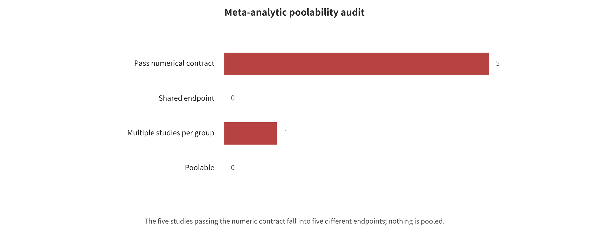

## Data, Metrics, and Evaluation Evidence

This chapter separates method mechanisms from the evaluation contract. It explains item by item the unit of analysis, event counts and denominators, effect direction, heterogeneity, within-paper dependence and prohibited interpretations. The statistical procedures have actually been run, but the number of formal meta-analytic groups is zero.

### Unified Parsing Template

For the anchor papers, this survey answers eight questions uniformly. What asset does the research protect? Is the attacker black-box, gray-box or white-box? Which entry point can be written to? How large is the attack budget, and is the attack adaptive? What are the sampling unit and the definition of success? What are the main results and benign utility? Can the work be reproduced? Where can the conclusions be extrapolated? Only the anchors that determine the research thread are kept below. The complete per-paper records of the 23 attack papers and the 14 groups of defense/engineering anchors are given in the attack-surface search and the defense-engineering search, respectively.

### Four Methods Broken Down into Input, State, Output, and Scoring

Case A: Why GCG can search out a gibberish suffix. The input is an aligned model f_theta, a set of harmful target requests, a modifiable discrete suffix token and a target beginning. The internal state is the gradient of the target loss at each suffix position. The algorithm does not directly publish an answer on continuous vectors. Instead, it uses the gradient to shortlist a few candidate tokens at each position, then replaces them one by one and uses the true forward loss to select the candidate with the largest decrease, looping until the budget is exhausted. The output is a suffix. Scoring usually looks at both the target prefix and the final content. The underlying logic is that safety training constrains the common semantic distribution, yet it does not make all discrete token combinations satisfy the same refusal boundary. Reproduction must freeze the tokenizer, chat template, target prefix and number of steps, otherwise “GCG with the same name” is not the same experiment. Looking only at affirmative beginnings will overestimate harmful completion.

**Text structure representation in the old draft**
```
Request u + learnable suffix s
v Target loss L(ftheta(u||s), target)
Compute the gradient at each position of s to produce top-k token candidates
v Score each candidate with the true forward pass
Accept the best replacement, repeat for B steps
v
Candidate suffix + full answer from the target model + independent/manual scoring
```

Case B: Why CaMeL/FIDES is not “adding one more guard model”. The input is divided into an immutable user goal U and untrusted external data D. A privileged planner sees only U and produces a restricted plan. A tool-free parser converts D into typed values. The runtime maintains the provenance, integrity, confidentiality and permitted recipients of values. The output is not a shell that the model executes directly. It is actions that the interpreter passes one by one after they satisfy the capability and information-flow policies. Security comes from “D cannot create new control flow, and low-integrity or high-confidentiality values cannot enter sinks that are not permitted”, not from the parsing model always being correct. In CaMeL's Gemini-2.5-Pro configuration, the successful attack count goes from 300/949 to 0/949, but normal task completion drops from 73.2% to 41.2%, and the median input/output tokens are about 2.73×/2.82×. The conclusion must therefore include blocking, utility and cost at the same time, and it cannot state only “0 attacks”.

**Text structure representation in the old draft**
```
Trusted user goal U --> privileged planner --> restricted plan/capability ceiling
Untrusted data D --> tool-free parser --> labeled structured values
The two paths meet at the reference monitor
v
policy allow / deny / ask / redact
v
Tool adapters produce real side effects
```

Case C: Why memory attacks need at least three endpoints. AgentPoison assumes that the attacker can write a small number of optimized records into the knowledge/memory store. MINJA narrows the entry point to an ordinary conversation triggering automatic saving. Neither attack is “successful on a single input”. Success instead runs along a chain: write success W → future recall R → dangerous action A. When a paper reports only the final ASR, a reader cannot tell whether a defense blocks the write, reduces top-k hits, or rejects at the action gate. A more reasonable record therefore carries P(W), P(R| W), P(A| R,W), survival time, cross-tenant leakage, and clean-task change. End-to-end risk can be conceptualized as the product of the three conditional probabilities. Actual multiplication, however, is permitted only with staged counts from the same traced sample. Nor do ten memories that are provenance-related count as ten independent pieces of evidence.

Case D: How to read the numbers of FigStep/AdaShield. FigStep renders the harmful text as an image, while the outer text only asks for the steps to be completed. That input passes through resize/visual encoding/cross-modal fusion. The output is then judged as success by refusal keywords or by an LLM judge. AdaShield retrieves defense prompts based on input similarity and appends them to the VLM context. The retrieval changes the model's interpretation of the text in the image. In the LLaVA QR configuration the value goes from 75.75% to 15.22%. Within the study that means a decrease of 60.53 percentage points, and the ratio of the reported values is about 0.201. Without exact event counts, no standard error can be given. That VLGuard's FigStep is close to 0 does not mean utility is free. Safety-only training lowers XSTest safe from 91.2 to 41.6. The underlying logic is that defense training covers the safety distribution of the visual channel. It may also mislearn normal visual help as refusal. A three-axis judgment of “harmful completion + normal answers + visual task score” is therefore needed.

### Build an Evidence Map First, Not an Average First

Three different statistical units run through this project: 65 attack-paper records, 62 defense/engineering sources, and 32 incident/vulnerability records. They cannot be added into “159 papers”. The defense table contains specifications and official documentation, so it is not a set of papers. The unit of the incident table is also not a paper. And the three tables may cite the same source. So the figure below reports three things in separate panels: evidence level, year, and non-mutually-exclusive modality labels.

Figure fig:evidence-map shows the heterogeneous evidence map of attack papers, defense sources, and incident records.


*Evidence map. Attack papers, defense and engineering sources, and event records use different units of analysis and cannot be added into a single total number of papers.*

Automated retrieval is also not the same as final inclusion. The 2,400 records are API returns from 12 OpenAlex queries. After deduplication, the 1,854 records are still unscreened candidates. Of those, 701/297/856 are only high/medium/low machine priority, and 500 are the read-first queue. Citation tracking, conference pages, standards, vulnerability databases, and vendor announcements also feed the manual base table. The exclusion log is still incomplete for each title, abstract, and full text. This survey therefore does not fabricate a “final PRISMA number of included papers”.

### Effect Inclusion Rules

Every computable effect first answers five questions. Is the success endpoint explicit? Are there direct event counts and denominators? Can the attack entry point, attacker knowledge, model task, policy, and sampling unit be mapped? Does the same paper contribute only one pre-declared main arm? And are there at least three independent studies? If any step fails, the analysis falls back to descriptive synthesis or single-study presentation. It does not continue to apply statistical formulas. The judgments in full, and the actual number of dropouts in this round, are plotted below.

Figure fig:meta-composability shows the poolability audit, from 34 studies to zero formal pooled groups.



*Meta-analytic poolability audit. The five studies that pass the numerical contract fall into five different endpoints, all groups are single studies, and therefore there are zero formal pooled groups.*

“Selecting one main arm in advance” is not picking the row with the best effect. The order is frozen. The main experiment of the formal paper takes priority. Among models and attacks, the ones that best match the group definition take priority. Adaptive attacks take priority over non-adaptive attacks. Human or dual scoring takes priority over a single keyword. Direct event counts take priority over percentages only. The remaining arms stay in the raw table for sensitivity description. They cannot be disguised as independent papers to enlarge the sample size.

### Effect Size for the Attack Success Proportion

Study i observes x_i successes among n_i independent samples. Then:

$$
p_i=\frac{x_i}{n_i}, y_i=\mathrm{logit}(p_i)=\log\frac{p_i}{1-p_i}, v_i\approx\frac{1}{n_i p_i(1-p_i)}.
$$

The logit is chosen rather than directly averaging percentages for two reasons. The transformed interval does not cross 0—1. And the same 5-percentage-point difference has a different statistical meaning near 5% and near 50%. When x_i=0 or x_i=n_i, the script applies the continuity correction (x+0.5)/(n+1) in the transformation stage only, and the raw records still keep the true 0 or n. Sometimes only the author-reported proportion and an explicit n are available. The script can then estimate the variance from that proportion, but it marks the source as reported_asr_total. It will not back out a “precise event count” from a rounded percentage.

Hand-calculation example: HOUYI. The application-level sample is x=31,n=36, and the point estimate is p=31/36=0.861. The Wilson 95% interval gives:

$$
\frac{p+z^2/(2n) +/- z\sqrt{p(1-p)/n+z^2/(4n^2)}}{1+z^2/n}, z=1.96,
$$

This gives approximately 0.713—0.939. The interval expresses only the sampling uncertainty of “if these 36 applications are treated as a binomial sample”. It cannot repair application selection, shared backends, version drift, or disclosure bias. So it cannot be read as the industry-wide 95% true range. This is exactly why a statistical interval cannot replace a threat model review.

### Pre- and Post-Defense Effects: Risk Ratio Rather Than a Percentage-Point Mixture

Write the pre- and post-defense values as x_0/n_0 and x_1/n_1. Then use the risk ratio:

$$
RR_i=\frac{x_1/n_1}{x_0/n_0}, y_i=\log(RR_i),
$$

The approximate variance under independent binomials is:

$$
v_i\approx \left(\frac{1}{x_1}-\frac{1}{n_1}\right)+ \left(\frac{1}{x_0}-\frac{1}{n_0}\right).
$$

RR<1 means lower risk after defense. If any event count is 0, the script adds 0.5 to each arm's event count and 1 to each denominator, which avoids log 0. Small-sample results then depend strongly on that correction, so extreme proportions must be checked against the original paper. Many defenses are paired before and after on the same prompts. An ideal analysis requires a paired four-cell table or a McNemar/conditional model. Papers usually do not publish the paired transition matrix, and the current script's independent binomial approximation ignores the correlation. It is therefore explicitly labeled exploratory.

How to interpret when only percentages are available. Constitutional Classifiers reports 86%→4.4%. That gives a decrease of 81.6 percentage points, a descriptive risk ratio of (4.4/86=0.051), and a relative decrease of about 94.9%. No precise denominator can be used safely here. Without one, a credible standard error cannot be computed, and the result cannot enter formal pooling. AdaShield's LLaVA QR moves from 75.75% to 15.22%. That is a descriptive decrease of 60.53 percentage points, with a ratio of about 0.201. This is still only a comparison within the same study configuration, and it cannot be averaged with the former.

### Random Effects and Paule–Mandel Heterogeneity

No single identical true effect is assumed to exist, even if the studies are judged comparable. The model is:

$$
y_i\in \mathrm{Normal}(\theta_i,v_i), \theta_i\in \mathrm{Normal}(\mu,\tau^2),
$$

where v_i is the within-study variance and tau^2 is between-study heterogeneity. The weights are:

$$
w_i=\frac{1}{v_i+\tau^2}, \hat\mu=\frac{\sum_i w_i y_i}{\sum_i w_i}, SE(\hat\mu)=\sqrt{\frac{1}{\sum_i w_i}}.
$$

The script finds tau^2 by the Paule–Mandel method, choosing the value at which the weighted residual Q(tau^2) approaches the degrees of freedom k-1. It also reports:

$$
I^2=\max\left(0,\frac{Q-(k-1)}{Q}\right),
$$

The script then gives the 95% interval for the mean, mu-hat+/-1.96SE, plus the 95% prediction interval, which is more suitable for deployment judgment:

$$
\hat\mu+/-1.96\sqrt{\tau^2+SE^2}.
$$

Finally the script transforms the attack proportion back to 0—1 with the logistic, and the risk ratio back to RR with the exponential. The mean interval answers “where the average true effect may lie”. The prediction interval answers “where the true effect of a new study may lie”. When the prediction interval crosses the null line, no claim that a new deployment will certainly be effective is warranted, however attractive the average is. tau^2 and the prediction interval are very unstable when k<5, and the main text labels them as low certainty. By default, k<3 is not pooled at all.

### Concrete Implementation and Auditable Outputs

The implementation is located in analysis/meta_analysis.py. The script rejects include_meta=false, validates 0 <= events <= total, and rejects missing values. Arms from the same study_id cannot appear in the same group, and effect types cannot be mixed. By analysis_group it outputs the inclusion, rejection, and summary tables, the manifest, and the SVG forest plot. Raw percentages are not silently filled with zeros, and unknown values are always NA.

Two artifacts govern the formal run results: the row-by-row inclusion audit in data/quantitative_effects.csv, and analysis/outputs/meta/. Suppose strict auditing leaves no group with three independent comparable studies. The conclusion will then be “the current evidence does not support formal pooling”, not a lowered threshold that produces a number. Within a single study, risk reduction, utility loss, and token/latency cost are still synthesized descriptively.

### Actual Audit and Execution Results: Zero Poolable Groups

From the original 74 in-paper experimental arms, the unified table deduplicates to 34 independent studies and keeps only one prespecified primary effect per study. Back-calculating event counts from rounded percentages is strictly prohibited. As a result, 29 studies can only be interpreted descriptively, while 5 studies have direct event counts and denominators. Those five belong to five different endpoints.

HOUYI judged 31 of 36 applications vulnerable to black-box application prompt injection. The point estimate is 86.1%, with a Wilson 95% interval of 71.3%—93.9%. AgentFuzz found 14 taint-style high-risk vulnerabilities across 20 agent applications. The point estimate is 70.0%, with a Wilson interval of 48.1%—85.5%. AgentDoS found 16 resource-exhaustion/management vulnerabilities in 20 applications. The point estimate is 80.0%, with a Wilson interval of 58.4%—91.9%. All three call their sampling unit an "application". Their vulnerability families, scanners, sampling frames, and success definitions differ, however, so they cannot be averaged into a population susceptibility rate for applications.

On the defense side, CaMeL's selected Gemini-2.5-Pro arm cut the successful-attack count from 300/949 to 0/949. Benign task utility fell at the same time, from 73.2% to 41.2%. FIDES's GPT-4o raw count dropped from 9/949 to 1/949. Its authors, however, reinterpret the events once more under a policy-violation definition. The two share 949 AgentDojo attack opportunities. Their models, baselines, policies, and event definitions differ, so their risk ratios cannot be pooled either.

The script returns the following result: 5 items pass the numeric contract, 29 items are rejected because include_meta=false, and 0 groups are successfully pooled. All five groups are skipped because k=1 is below the preset threshold of 3. No forest plot, pooled value, I², or tau² is generated. This result is not "the analysis was left unfinished". It is a substantive finding of the poolability audit: the public reporting practices now available are insufficient to answer the average ASR or the average defensive risk ratio. The complete item-by-item rationale appears in the inclusion-exclusion audit and the machine output.

### Why Aggregate by Paper First

A single paper often produces 150 cells over 5 models × 10 attacks × 3 defenses. These cells share data, prompts, author choices, and the judge. They are not 150 independent studies. Correlating them directly would give papers with larger grids disproportionate weight. It would also produce extremely small pseudo p-values. The script therefore aggregates by study_id first. The within-paper mean of a binary coding is interpreted as the coverage proportion of that paper's coded experimental arms. Continuous variables take the mean of the reported arms. The primary unit of analysis is always the paper.

Candidate variables are year, ASR, adaptive attacks, multimodality, agentic, number of independent defense layers, residual ASR, utility change, evidence tier, and whether the result has been independently reproduced. Missing values are deleted by variable pair rather than filled with 0. Each pair requires at least 8 studies, and both variables must vary.

### Spearman, Bootstrap, and Permutation Tests

Spearman correlation ranks X and Y separately, then takes the Pearson correlation of those two rank vectors:

$$
\rho_s=\mathrm{corr}(R_X,R_Y).
$$

With no tied ranks it is equivalent to 1-6sum d_i^2/[n(n^2-1)]. The actual data contain many 0/1 ties. Tied values therefore receive average ranks, and the rank correlation is computed directly. Spearman suits ASR, year, and layer count because those variables violate the normality/linearity assumptions and carry many extreme values. It measures only monotonic relationships. It does not prove causation.

Uncertainty is cross-checked along two routes. The paper-level bootstrap draws n papers with replacement 2,000 times and recomputes rho each time. The 2.5% and 97.5% quantiles of those recomputed values form the interval. For the permutation test, X stays fixed while Y is shuffled randomly across papers 2,000 times. Its two-sided p is p=(b+1)/(B+1), where b is the number of times |rho_perm|>=|rho_obs|.

The random seed is fixed at 20260806 to keep repeated runs consistent. The permutation p is not corrected for multiple comparisons. It serves only to generate hypotheses for follow-up work. When an interval is very wide or crosses 0, the correct conclusion is that the direction is unstable.

### Mechanistic Hypotheses Stated in Advance

The first hypothesis is that adaptive attacks are positively correlated with residual ASR, because an attacker who knows the defense can re-optimize. Evidence quality is a confounder, though: more mature papers are also more likely to test adaptively on their own initiative. The second hypothesis is that the number of independent defense layers is negatively correlated with residual ASR. After a model layer fails, permissions, information flow and the sandbox can still block. High-risk systems may deploy more layers because they face stronger attacks, which invites reverse causality.

The third hypothesis is that defense strength and benign utility change trade off against each other. The trade-off arises because refusal, isolated parsing, repeated reasoning and human confirmation reduce task completion or increase cost. "Number of layers" does not represent the quality of each layer either. The fourth hypothesis holds that the relationship between multimodality and attack success rate is unstable. The reason is that image typography, white-box perturbation, direct audio input and GUI actions differ far more than a single binary label can capture. Finally, year is expected to be positively correlated with automation or agentic coding. That more likely reflects a shift in research topics and changes in models and benchmarks than year itself causing risk.

### Prohibited Interpretations

A correlation coefficient cannot answer "how much adding one defense layer would reduce ASR". Nor can it estimate a real-world incident rate from the sample of selected papers. Paper-level means conceal internal heterogeneity, and pairwise deletion changes the direction when missingness is non-random. Closed-source model versions, attack budgets, the judge and publication bias may all affect X and Y together. If the valid sample is insufficient, the script does not output that variable pair. If it does output one, that pair serves only as a clue for later stratified experiments, not as a causal conclusion.

### Actual Correlation Results: Mainly Reflecting a Shift in the Research Landscape

Across the 34 independent studies, 20 variable pairs reach n>=8. The clearest observation is a positive correlation between year and agentic coding: Spearman rho=0.532, a bootstrap 95% interval of 0.277—0.748, and a permutation p=0.0010. The correct interpretation is that newer studies in this evidence table more often evaluate tool agents. That is consistent with the shift of post-2023 research from chat outputs toward action systems. It does not mean that year causes safety risk, nor that the number of agents in real deployments grows according to this coefficient.

For adaptive attacks and residual ASR the result is n=9, rho=0.274, interval -0.143—0.839, permutation p=0.667. The direction matches the mechanistic hypothesis that knowing the defense makes bypass easier. The interval is extremely wide, however, and the current data provide no robust evidence. For ASR and multimodality the result is n=19, rho=0.295, interval -0.166—0.648, p=0.227. One cannot claim that multimodality is inherently easier to attack. For year and ASR it is n=19, rho=-0.279, interval -0.588—0.125, p=0.241, which likewise offers no evidence of a monotonic trend.

For ASR and evidence tier it is n=19, rho=-0.438. The bootstrap interval -0.761—-0.020 appears not to cross zero, but the permutation p=0.0615. The two uncertainty judgments therefore disagree, and the tier is only a discrete provenance marker, so no conclusion is drawn. The rho=-0.352 between multimodality and agentic mainly reflects that current papers are split into two research traditions, "VLM output" and "text tool agent", with a permutation p=0.082. It cannot be interpreted as the two technologies being inherently mutually exclusive.

The unified table does not contain enough auditable defense_layers codings, and none of the selected primary effects has an independent reproduction under the same definition. No "layers–effect" or "reproduction–effect" correlation was therefore manufactured from subjective impressions. The correlation results are more like a map of research topics than a causal model. The complete results for all 20 pairs appear in the correlation analysis report.

Figure fig:correlation-results shows the exploratory study-level Spearman, bootstrap and permutation test results.


*Study-level exploratory correlations. The intervals and permutation tests are used to describe the landscape of the sampled literature and do not support causal inference about deployment.*

A reproducible implementation is available in analysis/correlation_analysis.py. The formal output is in analysis/outputs/correlation/ and reports the per-pair n, rho, bootstrap interval, permutation p and run manifest.

---

[← Back to contents](index.md)
