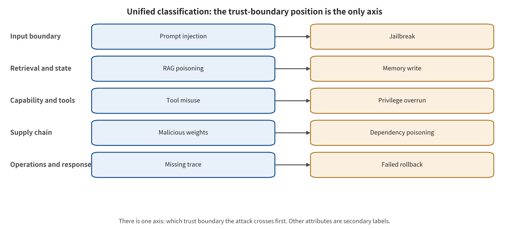

## Reader Navigation: Document Structure and Unified Classification Coordinates

The main body is not a paper-by-paper or company-by-company stack. It unfolds along one complete attack chain, and asks the same questions at each step. How does untrusted content enter the system, and at which trust boundary does it gain influence? What action does the model propose, and why does the harness let it through? What consequence ultimately results, and which layer of control can sever the chain? The first five parts successively establish the system model and the research methodology, and then present the attack taxonomy, the common root causes, and defense in depth. Their purpose is to fix the comparison coordinates first, before the survey moves on to individual papers.

Part 6 dissects representative studies with a unified template. Part 7 reconstructs incidents and news, and centers on the attack–defense chain in which an OpenAI evaluation agent crossed the boundary into Hugging Face in 2026. Part 8 carries out a meta-analytic combinability audit, and Part 9 a study-level exploratory correlation. Part 10 analyzes attack automation, long-horizon agents, multimodal state, capability safety, and formal information flow. Part 11 turns the conclusions into engineering gates for deployment, operation, and post-incident response.

Some works carry similar names but different consequences. To keep them apart, the survey encodes seven coordinates for every study or incident at once. The primary classification uses “attack entry + breached boundary + final consequence”. The remaining fields are cross-cutting labels, never used to manufacture duplicate samples. The classification figure below draws the complete relationships. The main body only explains their logic.

**Entry coordinates** answer where malicious influence enters. Their values include user prompts, web pages/emails/PDFs, RAG records, tool outputs, memory, images/audio, and models or dependency packages. **Boundary coordinates** answer which trust boundary fails. They include instruction—data, user—tenant, model—executor, identity—authorization, container—host, build—run, and current session—long-term state.

**Attacker capability coordinates** record black-box, gray-box or white-box access, single-turn or multi-turn budgets, human or automated operation, and whether the attack is re-optimized against known defenses. **Modality coordinates** record text, images, audio, video, GUI, code or cross-modal combinations. Their aim is to preserve parser differences rather than treat “multimodal” as a single attack.

**Time coordinates** distinguish instantaneous, in-session, cross-session, data-store/weight ingestion, and supply-chain persistence. **Outcome coordinates** strictly distinguish content violations, control hijacking, dangerous intent, dangerous execution, leakage/destruction, and availability/cost losses. **Defense position coordinates** record what actually blocks the chain: the model/classifier, structured context, provenance/information flow, action authorization, memory governance, sandbox/network/secrets, the supply chain, or monitoring and response.

Attack families fall into eight groups: **model behavior bypass, context and control-flow injection, retrieval and state poisoning, tool and privilege abuse, multimodal parsing attacks, privacy and intellectual property attacks, model/software supply-chain attacks, and availability and economic attacks**. Defenses fall into four defense-in-depth layers: **probabilistic model defenses, structured control and information flow, system isolation and capability constraints, and operational governance and incident response**. This two-level encoding allows comparisons of “the consequences of the same attack at different system boundaries”. It also specifies which percentages simply cannot enter the same meta-analytic group.

---

[← Back to contents](index.md)
