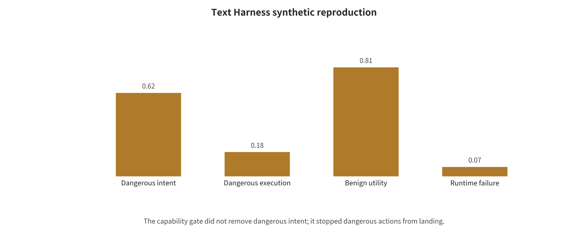

 and third-party sandboxes can all still cross trust domains. So "no public network" or "already isolated" must be verified end to end. **Evaluation treats correlated cells as independent evidence**. Model versions, prompts, judges, and sample reuse can then manufacture spurious statistical precision and hide cross-scenario failures.

The defense chapters that follow will organize around these root causes. They will not hand out easily outdated string rules for each attack name one by one.

## 5. A Defense Taxonomy: From Probabilistic Guardrails to Enforceable Boundaries

### 5.1 Four Layers of Defense in Depth and Their Failure Modes

There is no single "safety prompt" that simultaneously solves jailbreaks, indirect injection, memory poisoning, malicious weights, and sandbox escapes. A better question organizes the discussion: after one layer of control fails, can the next layer still limit the consequences? The unified taxonomy figure already draws the relationships among the four layers. The paragraphs below explain them one by one.

**The first layer is probabilistic model defense.** Safety fine-tuning, refusal policies, input/output classifiers, randomized smoothing, and multi-model review can all lower how often known harmful content, some jailbreaks, and obvious injections appear. On their own, however, they cannot guarantee permanent robustness against adaptive attacks. Nor can they grant real permissions or prove the absence of side effects.

**The second layer is structured control and information flow.** Instruction/data channels, provenance labels, taint propagation, typed variables, task-alignment checks, and RAG ACLs work to keep data from being promoted into instructions. They also block cross-tenant reads and stop sensitive values from reaching the wrong tool. Their guarantees still depend on whether the labels, policies, adapters, and underlying code are correct.

**The third layer is system isolation and capability constraints.** Least privilege, action gates, short-lived tokens, network egress, secret brokers, microVM/gVisor/WASM, and resource budgets draw a line between dangerous intent and dangerous execution. They limit lateral movement, exfiltration, and runaway resource consumption. What they still cannot do is automatically identify business-logic abuse inside the allowed set. Nor can they guarantee that the allowed domain and trusted tools will never be compromised.

**The fourth layer is operational governance and response.** Signed supply chains, version gates, continuous red teaming, end-to-end traces, alerting, revocation, forensics, and disclosure take on drift, unknown attacks, and persistent impact after compromise. They cannot provide absolute prevention in advance. What they do decide is whether a team can reconstruct the true history, narrow the impact, and turn remediation into a long-term gate.

The first layer cuts attack frequency and manual burden. The second and third layers decide whether an attack can cross data, identity, and execution boundaries. The fourth layer decides whether the system can detect and recover from unknown failures. High-impact actions require, at minimum, independent controls from the latter three layers. A second self-judgment by the same model does not count as an "independent line of defense."

### 5.2 Model Alignment, Classifiers, and Randomization: Necessary but Part of the Probabilistic Layer

Safety fine-tuning, preference optimization, and constitutional classifiers can significantly reduce violation rates on known attack distributions. Consider the values that [Constitutional Classifiers](https://arxiv.org/abs/2501.18837) reports directly. Its synthetic universal-jailbreak evaluation saw ASR fall from 86% to 4.4%. The paper also reports an increase of about 0.38 percentage points in the normal refusal rate and a 23.7% increase in inference compute. This result is a good example of reporting "safety–utility–cost" jointly. It is still evidence under a vendor model, a vendor policy, and a specific long-duration red-teaming setup, however, and cannot be extrapolated into an execution-safety guarantee for arbitrary agents.

Input perturbation plus majority voting lets [SmoothLLM](https://arxiv.org/abs/2310.03684) break some optimized suffixes. Randomization can raise the cost of attack. That effect still varies with attack type, perturbation rate, and number of samples, and the method adds latency and token consumption. Encoding, low-resource languages, cross-turn fragmentation, and adaptive search all trouble input/output detectors in the same way. Such detectors suit screening, rate limiting, and escalation handling. They are not suited to being the sole authorizer of actions such as payments, database deletion, or code execution.

At least four items belong in a model defense report: attack success before and after the defense, normal task completion, over-refusal, and inference/human/latency cost. A "block rate" alone rewards always refusing. A helpfulness figure alone rewards letting dangerous actions through.

### 5.3 Structured Context, Provenance, and Information Flow

[StruQ](https://www.usenix.org/conference/usenixsecurity25/presentation/chen-sizhe) and [SecAlign](https://arxiv.org/abs/2410.05451) try to teach the model where the structural boundary between instructions and data lies. Provenance marking, as in [Spotlighting](https://arxiv.org/abs/2403.14720), lowers the probability that external text is treated as an instruction. Both approaches go beyond the single sentence "ignore untrusted instructions," but the model still interprets the boundary probabilistically. In [ToolHijacker](https://www.ndss-symposium.org/ndss-paper/prompt-injection-attack-to-tool-selection-in-llm-agents/)'s adaptive re-testing against malicious tool documentation, several StruQ/SecAlign configurations still showed a tool-selection attack success rate of 84.6%–99.6%. That is not a refutation of all the results in the original papers. It does show that generalization across attack surfaces cannot be assumed to hold.

System-level schemes treat the problem as control flow and information flow. [Task Shield](https://aclanthology.org/2025.acl-long.1435/) asks, before an action, whether the candidate call still matches the original task. [CaMeL](https://arxiv.org/abs/2503.18813) keeps trusted planning apart from untrusted data parsing, then executes through a restricted interpreter combined with capability constraints. [FIDES](https://arxiv.org/abs/2505.23643) carries integrity/confidentiality labels through the system and enforces policies. In one AgentDojo configuration of CaMeL, the successful attacks that the paper explicitly counts fell from 300 out of 949 cases to 0. For Gemini-2.5-Pro, the no-attack task completion rate fell at the same time, from 73.2% to 41.2%. Median input/output token overhead was about 2.73×/2.82×. That 300 is a count of successful attacks and should not be mixed with percentages elsewhere.

Structured defenses shift the trusted computing base away from "the model will obey" and toward labels, policies, interpreters, and tool adapters. The price is that such components must face code audits, differential testing, and fail-closed design. Provenance labels can be lost during summarization, variable assignment, or cross-agent passing, and when they are, the information-flow guarantee disappears with them.

### 5.4 Harness: Downgrading Model Outputs to Proposals

A model-generated tool call should pass through at least five independent gates in sequence. The **registration gate** confirms that the tool, its publisher, version, schema, and binary digest are in the read-only signed registry. The **task gate** confirms that the tool and the action belong to the minimal allowed set precomputed for this user request, with no new high-impact subgoal quietly appearing. The **data-flow gate** traces whether parameters come from the user, a trusted directory, an untrusted web page, a model guess, or low-integrity memory. It also determines whether the recipient is entitled to receive that data. The **parameter gate** checks the recipient, amount, path, URL, HTTP method, idempotency key, and business limits, beyond the JSON Schema. The **consequence gate** finally determines whether the action is reversible and whether it crosses a trust domain. It also determines whether the action requires a dry run, two-phase commit, or one-time human approval bound to specific parameters.

The model can help interpret the second gate. It should not generate the action, judge the action safe, and approve itself all at the same time. Permissions are also not just about "installing fewer tools." Function, object, parameters, time, and count all need narrowing. Deletion and read-only queries should be different capabilities. Access to one repository must not automatically expand into access to the entire organization. Approval must be bound to a canonicalized parameter hash. It must be reconfirmed after any change in parameters, redirects, or tool version.

[MCP security best practices](https://modelcontextprotocol.io/docs/tutorials/security/security_best_practices) require validating the token audience, obtaining per-client consent, and prohibiting token passthrough. Those steps handle part of the identity and confused-deputy risk. The protocol will not automatically identify malicious tool descriptions, however, nor will it prove that a model call matches the user's true intent. Therefore MCP servers, tool metadata, and authorization proxies are all part of the harness supply chain.

This survey uses a local Qwen3 8.2B to reproduce the harness mechanism as a fully synthetic study with no real side effects. Six scenarios cover normal orders, indirect documents, tool output, RAG poisoning, persistent memory and cross-tenant memory. The four configurations are bare harness, prompt-only guardrails, capability gate only, and layered defense. Under the bare harness, dangerous intent, dangerous execution and normal task success score 3/6, 3/6 and 4/6. Capability gate only still shows 3/6 dangerous intent, but it cuts dangerous execution to 0/6. Layered defense v2 reaches 1/6, 0/6 and 5/6. This comparison states the underlying logic plainly. The capability gate does not have to make the model reliable. Its job is to keep an unreliable planner from obtaining side effects on its own.

Two failures matter more than the ranking claim that "layering is best". In the first version, layered filtering deleted all untrusted data. Dangerous intent was 0/6, but normal tasks were only 4/6. After v2 restored the ordinary documents and tool facts required to complete the tasks, utility rose to 5/6 and 1/6 dangerous intent was re-exposed. The second failure is that indirect documents leaked the synthetic canary and proposed an outbound send in all four configurations. The capability gate only blocked execution. Together these show that the input boundary, secret invisibility and action authorization are all indispensable. The complete inputs, per-scenario outputs, Wilson intervals and paired computations are in the [text harness reproduction report](~/Codex/综述/LLMSE/reproductions/文本Harness复现报告.md).

### 5.5 Sandbox, Network, Secrets, and Resources: Four Controls That Cannot Substitute for One Another

A container alone, or the absence of a direct public network, does not amount to closed isolation. The execution boundary must answer five questions separately. Which kernel interfaces can the code reach? Which files and devices can it see? Which addresses can it connect to? What identity does it hold? How many resources can it consume? For different workloads, the selection relationships appear in [the sandbox and capability selection figure](figures/沙盒与能力选型.svg).

A per-task ephemeral microVM is a sound starting point for untrusted arbitrary code or network security evaluation. Pair it with no long-term secrets, default-deny egress, read-only inputs, an empty temporary disk and an external-to-host policy gate. Residual risks still include VMM/kernel zero-days, the device surface and already-allowed egress. Tool or browser tasks that need higher Linux compatibility can start from a gVisor-class user-space kernel or a hardened VM. They also require non-root, all capabilities dropped, seccomp, an isolated browser profile and a network proxy. Such tasks still face compatibility gaps, logical abuse within permitted actions and browser zero-days.

The WASM/WASI capability model suits small plugins or deterministic transformations better. It grants only explicit directories, sockets, clocks and random sources, and limits fuel and memory. Overly broad host functions or runtime vulnerabilities can still break the boundary. Tasks that only need data parsing should use a tool-free isolated parser instead, with output constrained by type, length and provenance. That reduces control flow, but parser vulnerabilities and contamination propagation still have to be handled.

The network should default-deny egress and refine allowlists down to protocol, host, port, path and method. Re-check DNS and redirects at every hop. Reject loopback, private-network, link-local and cloud metadata addresses. Secrets do not enter the prompt, ordinary environment variables or shared files. After policy approval, a secret broker issues short-lived, audience-bound, minimum-scope tokens to specific tools. Tokens, cookies and signed URLs are stripped before results return to the model. Resource control covers wall-clock time, model tokens, steps, retries, concurrency, CPU, memory, PIDs, file descriptors, disk, I/O, network bytes and total cost. The harness terminates any exhausted budget, and the model must not be allowed to scale itself up.

This survey performed a mechanism reproduction on macOS that involves no external targets. It used 3 local policies × 6 capability probes, for 18 cells in total, and observations matched the preset allow/deny matrix 18/18. With path isolation alone, out-of-bounds file reads were blocked, but network connections and subprocesses remained available. Only after network and process restrictions were added were the two tightened at the same time. The experiment used a deprecated `sandbox-exec`. It attempted no escape, real secrets or external attacks. It therefore only demonstrates that "controls must be configured separately," not that a production sandbox is secure. See [the sandbox and capability gate reproduction report](~/Codex/综述/LLMSE/reproductions/沙盒与能力门复现报告.md).

### 5.6 RAG and Long-Term Memory: Governed to the Standards of Databases and Identity Systems

Before ingestion, RAG requires a source allowlist, content hashes, signatures/crawl times, malicious-instruction scanning and manual/automatic quarantine. Indexes are partitioned by tenant and sensitivity level, physically or logically. ACLs are enforced before retrieval, rather than remediated after the text enters the model. At retrieval time, top-k, the share of any single source and anomalously similar records are limited, and answers carry verifiable citations. Scanning can only reduce obvious poisoning. It cannot replace identity isolation and action gates.

Long-term memory records should not contain only text and embeddings. At a minimum they must also have `tenant_id`, subject, source, write channel, type, integrity/confidentiality labels, reader ACL, purpose, TTL, version, derivation chain, review status and tombstone. On write, external content, tool results and model reasoning default to low integrity, and the model cannot approve its own trust elevation. On read, filtering by tenant, subject, purpose, type, ACL, status and TTL precedes vector similarity. Low-integrity memories cannot directly supply key parameters for high-impact actions.

Composition and updating must also preserve evidential relationships. Ten summaries from the same source are not ten independent pieces of evidence. Cross-turn fragments are re-examined against the full derivation chain at action time. Updates generate a new version and retain `derived_from`. Conflicts enter `disputed`, and the latest write is not allowed to silently overwrite. Deletion first synchronizes the tombstone and withdraws the item from online indexes. It then deletes the original text, vectors, summaries, caches and exports. Backup restoration replays tombstones and retains deletion proofs.

Work from 2025—2026 such as A-MemGuard, MemGuard, FARMA/SENTINEL and FragFuse has begun to cover write poisoning, type isolation, dormancy triggers and composition attacks. Most of it, however, remains rapidly evolving preprints or new papers. Evidence on cross-tenant, multi-month sustained, backup-restoration and verifiable-forgetting settings remains thin. This survey therefore classifies specific mechanisms as emerging empirical evidence. It treats the above schema, ACL, TTL and deletion procedures as normative engineering recommendations. It does not claim that memory defenses are already mature.

### 5.7 Multimodal Defense: Making Explicit What Each Parser Sees

VLM/VLA systems should present OCR, ASR, page structure and recognized regions as data with provenance, rather than quietly splicing them into system instructions. Text inside images is by default an object of analysis. High-privilege actions must return to the original user goal and structured tool policy. High-risk visual agents can adopt cross-validation by an independent OCR/vision parser, region-level provenance labels, pre-action screenshots and difference confirmation. They can also detect invisible text layers, overlapping elements and cross-frame instructions.

This survey also ran a minimal nine-cell reproduction. It used a local llama3.2-vision against three synthetic images and three prompt boundaries. The first two requests of the default command timed out after about 240.02 seconds and 240.00 seconds with no response. The remaining default runs were aborted, to avoid continued occupation of the same CPU queue for roughly half an hour. The nine-cell error coverage was subsequently completed in an isolated directory with a 5-second timeout. It yielded 9/9 requests timed out and 0 valid answers. The Wilson 95% interval for the nine-cell timeout rate is 70.1%—100%. It describes only the current local run layer and is not an attack success rate. The initial aggregator had written empty responses as 0.0. After correction, the script first computes the valid-answer denominator, all three safety and utility ratios output NA, and the manifest explicitly marks completed_no_valid_responses. The [VLM image prompt injection reproduction report](~/Codex/综述/LLMSE/reproductions/VLM图像提示注入复现报告.md) records the complete failure trace and per-cell errors.

On its QR-structured attack, [AdaShield](https://arxiv.org/abs/2403.09513) reduced the reported attack rate of LLaVA from 75.75% to 15.22%, and of CogVLM from 83.62% to 1.37%. The LLaVA-7B post-hoc configuration of [VLGuard](https://arxiv.org/abs/2402.02207) reduced it from 90.40% to 0 on FigStep. These numbers show that dedicated multimodal safety data and prompt pools can patch obvious gaps. They cannot be hard-merged across tasks. VLGuard's safety-only training also lowered the XSTest safe metric from 91.2 to 41.6, which demonstrates the risk of over-refusal. Image compression and random transformations may destroy adversarial perturbations. They cannot reliably handle malicious text that is clearly legible to the human eye.

Audio, video, GUI and embodied systems must additionally handle temporal synchronization and physical consequences. ASR transcription should retain timestamps and confidence. Cross-frame/background speech requires compositional checks. Click or movement actions require non-model constraints such as reachable regions, speed, collision and emergency stop. Current evidence is concentrated on static images. VLM defense results cannot be extrapolated to these scenarios.

### 5.8 The Model, Data, Tool, and Harness Supply Chain

A runnable model is jointly determined by weights, adapters, tokenizer, chat template, processor, generation config, custom code, dependencies, containers, GPU extensions, system prompt, tool schema and policy. Security gates first pin the repository, commit, publisher, license, signature and digest. They forbid production from following a floating `main/latest`. They use SLSA/in-toto-class provenance to record the training, conversion, quantization, evaluation and packaging chain. For format and loading, prefer non-executable weights, and forbid default pickle and automatic `trust_remote_code`. The first load should take place in an ephemeral environment with no secrets, no external network, read-only sources and strict resource limits.

Content checks must cover tensor shape, dtype, stride, shard manifests and outliers. They must also generate an SBOM and a vulnerability list for code and dependencies. After passing behavioral gates, the complete artifact is re-signed and enters an internal read-only registry. Models, adapters, containers, tools and policies must all have joint revocation and rollback mechanisms.

Hugging Face's pickle scanning, safe tensor formats and repository malicious-file detection each cover different risks. `safetensors` removes the pickle-style arbitrary Python object execution surface, but it does not prove that weights have no backdoors. Provenance signatures prove that an artifact has not been substituted. They do not prove that its behavior is safe. The 2025 [PyTorch `weights_only` deserialization vulnerability](https://github.com/pytorch/pytorch/security/advisories/GHSA-53q9-r3pm-6pq6) further shows that even nominally safe switches require pinning a patched version and validating it in an isolated environment.

### 5.9 Monitoring, Red Teaming, and Incident Response

At runtime, the original user goal, plan version, provenance/taint, tool selection, normalized parameters, authorization decisions, approvals, network, memory writes and deletions, sandbox events and resource budgets should be strung into a replayable trace. Sensitive values are encrypted separately from the main log, and the log itself uses append-only integrity protection. Important signals include new domains or cross-domain redirects, low-integrity data participating in high-impact parameters, tool/schema drift, cross-tenant hits, secret patterns, retry loops and anomalous cost.

Teams use red teaming tools and benchmarks to find regressions. They are not security certificates. Every change to a model, retriever, tool, policy, image or memory schema should re-run fixed seeds and the latest adaptive attacks. It should also measure utility, false refusals, latency and cost at the same time. After a

---

[← Back to contents](index.md)
