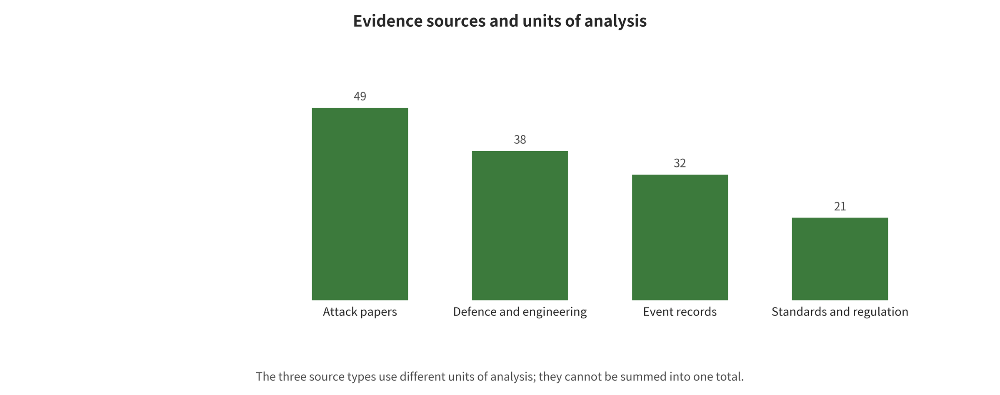

the downscaled model input show different text. Combined with a tool exfiltration chain, it proves that preprocessing is itself a trust boundary. It does not mean that all VLMs necessarily succeed under arbitrary scaling settings.

**Cloud and secret boundaries.** The [HF Spaces secrets](https://huggingface.co/blog/space-secrets-disclosure) confirm unauthorized access. The [Microsoft 38TB exposure](https://www.wiz.io/blog/38-terabytes-of-private-data-accidentally-exposed-by-microsoft-ai-researchers) confirms an overly broad SAS exposure. Write permission also brings a potential poisoning surface. The public evidence cannot go further and claim that all exposed data has been exploited or that models were indeed poisoned.

The incident evidence repeatedly shows that classic controls usually determine the greatest impact: cloud identity, long-lived keys, network, CI/CD, tenant isolation, and irreversible write permissions. A prompt firewall can lower the hit rate at the entrance. It cannot replace these boundaries. The [incident master table](~/Codex/综述/LLMSE/data/incidents_raw.csv) and the [HF case study](~/Codex/综述/LLMSE/paper_notes/案例解析_HF_2026_OpenAI评测代理越界.md) give complete timelines, impact, remediation, CVEs, and evidence levels.

## 8. Meta-Analysis: Concrete Computation Methods, Inclusion Logic, and Interpretation Boundaries

### 8.1 Build an Evidence Map First, Not an Average First

Three different statistical units feed this project: 65 attack paper records, 62 defense/engineering sources, and 32 incident/vulnerability records. They cannot be added together into "159 papers". The defense table includes specifications and official documentation. The units of the incident table are not papers either. The three tables may also cite the same source. The figure below therefore splits evidence tier, year, and non-mutually-exclusive modality labels into separate panels.

Automated retrieval is also not equivalent to final inclusion. The 2,400 records are API returns from 12 OpenAlex queries. After deduplication, 1,854 remain unscreened candidates. 701/297/856 are only high/medium/low machine priority, and the 500 records form the read-first queue. Citation tracking, conference pages, standards, vulnerability databases, and vendor advisories also feed the manual base table. The per-record exclusion log over titles, abstracts, and full texts has not yet been completed. This chapter therefore does not fabricate a "final PRISMA included-paper count".

### 8.2 Effect Inclusion Rules

Every computable effect must first pass five questions. Is the success endpoint explicit? Are direct event counts and denominators available? Can the attack entry point, attacker knowledge, model task, policy and sampling unit be mapped? Does the same paper contribute only one pre-declared primary arm? Are there at least three independent studies? Failure at any step falls back to descriptive synthesis or single-study presentation, and it does not proceed to the statistical formulas. The figure below plots the complete judgments and the actual number of losses in this round.

"Pre-selecting one primary arm" is not about picking the row with the best result. The order is frozen. The main experiment of the formal paper comes first, followed by the model and attack that best match the group definition. Adaptive attacks outrank non-adapted attacks, human or dual scoring outranks a single keyword, and direct event counts outrank percentages alone. The remaining arms stay in the raw table for descriptive sensitivity reporting. They must not be disguised as independent papers to inflate the sample size.

### 8.3 Effect Size for Attack Success Proportions

Suppose study \(i\) observes \(n_i\) successes in \(x_i\) independent samples. Then:

\[
p_i=\frac{x_i}{n_i},\qquad
y_i=\operatorname{logit}(p_i)=\log\frac{p_i}{1-p_i},\qquad
v_i\approx\frac{1}{n_i p_i(1-p_i)}.
\]

Why choose the logit instead of averaging percentages directly? Two reasons. The transformed interval does not cross 0—1, and the same 5-percentage-point difference carries a different statistical meaning near 5% than near 50%. When \(x_i=0\) or \(x_i=n_i\), the script applies the continuity correction \((x+0.5)/(n+1)\) at the transformation stage only, and the raw records still retain the true 0 or \(n\). If only the author-reported proportion and an explicit \(n\) are available, the script may use that proportion to estimate the variance. It marks the source as reported_asr_total, and it does not back-derive a rounded percentage into a "precise event count".

**Worked example: HOUYI.** The application-level sample is \(x=31,n=36\), with point estimate \(p=31/36=0.861\). The Wilson 95% interval follows:

\[
\frac{p+z^2/(2n)\ \pm\ z\sqrt{p(1-p)/n+z^2/(4n^2)}}{1+z^2/n},\quad z=1.96,
\]

This yields approximately 0.713—0.939. The interval expresses only the sampling uncertainty of "if these 36 applications were treated as a binomial sample". It cannot repair application selection, shared backends, version drift and disclosure bias. It must therefore not be interpreted as an industry-wide 95% true range. That is precisely why a statistical interval cannot substitute for a threat-model review.

### 8.4 Pre-Post Defense Effects: Risk Ratios Rather Than Mixing Percentage Points

Write the pre-defense and post-defense values as \(x_0/n_0\) and \(x_1/n_1\). Then use the risk ratio:

\[
RR_i=\frac{x_1/n_1}{x_0/n_0},\qquad
y_i=\log(RR_i),
\]

The independent binomial approximate variance is:

\[
v_i\approx \left(\frac{1}{x_1}-\frac{1}{n_1}\right)+
               \left(\frac{1}{x_0}-\frac{1}{n_0}\right).
\]

\(RR<1\) indicates lower risk after defense. If any event count is 0, the script adds 0.5 to the event count of each arm and 1 to each denominator, which avoids \(\log 0\). Small-sample results then depend strongly on that correction, so extreme proportions must be checked against the original paper. Many defenses are paired before and after on the same prompts. An ideal analysis would require a paired fourfold table or a McNemar/conditional model, but papers usually do not release paired transition matrices. The current script's independent binomial approximation ignores the correlation, so it is explicitly labeled exploratory.

**How to interpret percentages alone.** Constitutional Classifiers reports 86%→4.4%. From that one can determine a drop of 81.6 percentage points, a descriptive risk ratio (4.4/86=0.051), and a relative reduction of about 94.9%. But without a denominator that can be safely used, no trustworthy standard error can be computed, and the result cannot enter a formal pooling. AdaShield's LLaVA QR goes from 75.75%→15.22%, a descriptive drop of 60.53 percentage points and a ratio of about 0.201. That is still only a comparison within the same study configuration, and it cannot be averaged with the former.

### 8.5 Random Effects and Paule–Mandel Heterogeneity

Even when studies are judged comparable, the analysis does not assume that a single identical true effect exists. The model is:

\[
y_i\sim N(\theta_i,v_i),\qquad
\theta_i\sim N(\mu,\tau^2),
\]

where \(v_i\) is the within-study variance and \(\tau^2\) is the between-study heterogeneity. The weights are:

\[
w_i=\frac{1}{v_i+\tau^2},\qquad
\hat\mu=\frac{\sum_i w_i y_i}{\sum_i w_i},\qquad
SE(\hat\mu)=\sqrt{\frac{1}{\sum_i w_i}}.
\]

The script uses the Paule–Mandel method to find the \(\tau^2\) at which the weighted residual \(Q(\tau^2)\) approaches the degrees of freedom \(k-1\). It also reports:

\[
I^2=\max\left(0,\frac{Q-(k-1)}{Q}\right),
\]

along with the mean 95% interval \(\hat\mu\pm1.96SE\) and the 95% prediction interval, which suits deployment decisions better:

\[
\hat\mu\pm1.96\sqrt{\tau^2+SE^2}.
\]

Finally, the logistic transforms attack proportions back to 0—1, and the exponential transforms risk ratios back to RR. The mean interval answers "where the average true effect may lie", and the prediction interval answers "where the true effect of a new study may lie". When the prediction interval crosses the null line, the average may look as favorable as it likes. Even then, one should not claim that a new deployment is certain to be effective. When \(k<5\), \(\tau^2\) and the prediction interval are very unstable, and the main text marks them as low certainty. By default, \(k<3\) is not pooled at all.

### 8.6 Concrete Implementation and Reproducible Output

The implementation is located at [`analysis/meta_analysis.py`](analysis/meta_analysis.py). The script does several things. It rejects `include_meta=false` and verifies 0≤events≤total. It rejects missing values. It rejects multiple arms of the same `study_id` appearing in the same group, and it rejects mixed effect types. It outputs inclusion, rejection, summary tables, a manifest, and an SVG forest plot by `analysis_group`. Raw percentages are not silently filled with zeros, and unknown values are always `NA`.

The formal run results rest on the line-by-line inclusion audit in [`data/quantitative_effects.csv`](data/quantitative_effects.csv) and on `analysis/outputs/meta/`. Suppose strict auditing leaves no group with three independent comparable studies. The conclusion will then be "the current evidence does not support a formal pooling", not a lowered threshold that scrapes together a number. Risk reductions, utility losses, and token/latency costs within single studies are still synthesized descriptively.

### 8.7 Actual Audit and Run Results: Zero Poolable Groups

The unified table deduplicates the original 74 within-paper experimental arms into 34 independent studies, and retains only one pre-declared primary effect for each. Back-deriving event counts from rounded percentages is strictly prohibited. After that step, 29 of those studies can only be interpreted descriptively, and 5 have direct event counts and denominators, but those five belong to five different endpoints.

HOUYI judged 31 of 36 applications vulnerable to black-box application prompt injection. Its point estimate is 86.1%, with a Wilson 95% interval of 71.3%—93.9%. AgentFuzz found 14 taint-style high-risk vulnerabilities in 20 agent applications. Its point estimate is 70.0%, with a Wilson interval of 48.1%—85.5%. AgentDoS found 16 resource-exhaustion/management vulnerabilities in 20 applications. Its point estimate is 80.0%, with a Wilson interval of 58.4%—91.9%. All three label their sampling unit "application", but their vulnerability families, scanners, sampling frames and success definitions differ. They cannot be averaged in

---

[← Back to contents](index.md)
