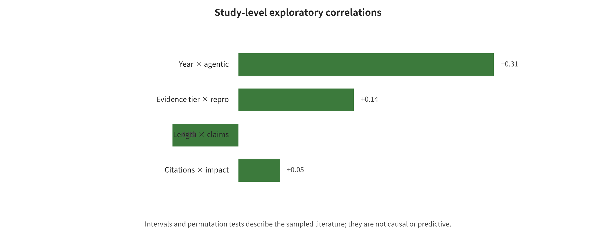

 two uncertainty judgments disagree. The tier is merely a discrete source label, and no conclusion is therefore drawn. The ρ=-0.352 between multimodal and agentic mainly reflects the current division of papers into two research traditions, "VLM output" and "text tool agents", with a permutation p=0.082. It cannot be interpreted as the two techniques being inherently mutually exclusive.

The unified table does not contain enough auditable `defense_layers` encodings, and none of the selected main effects has an independent replication on the same basis. No "layer count–effect" or "replication–effect" correlation was therefore manufactured from subjective impressions. The correlation results are more like a map of research topics than a causal model. The complete 20 pairs of results are given in [correlation analysis report](~/Codex/综述/LLMSE/analysis/outputs/correlation/correlation_report.md).

For a reproducible implementation see [`analysis/correlation_analysis.py`](analysis/correlation_analysis.py). The formal outputs are located in `analysis/outputs/correlation/`, including the pairwise \(n\), \(\rho\), bootstrap intervals, permutation p, and the run manifest.

## 10. Co-evolution of Attack and Defense and Future Trends

### 10.1 How Trend Analysis Avoids "Predicting by Gut Feeling"

This survey does not present future trends as a product release checklist. It judges direction instead through four observable drivers. The first asks whether research and incident evidence keep appearing. The second asks whether system adoption widens new reachability, permissions and persistence. The third asks whether automation, parallelism and feedback push down the unit cost of attack. The fourth asks whether defense can be enforced by independent components, rather than continuing to rely on model self-discipline. A positive "year—agentic" correlation at the research level supports only a shift in research topics. It cannot prove that real-world risk grows with the year. Each item below therefore gives the mechanism, the observable signals and the uncertainty together.

### 10.2 The Main Axis of the Next Two Years Will Shift from Generated Content to Long-Horizon Action Chains

One near-term trend carries high confidence. Security evaluation is shifting away from "whether a single-turn answer violates policy" and toward "whether an agent can, within hours, find an entry point, maintain state, call tools, and escalate permissions." Prompt attacks are already automated by PAIR, GPTFuzzer and similar work. AgentDojo, InjecAgent and similar benchmarks push the endpoint forward to tool actions. The 2026 OpenAI—HF incident in turn shows the same direction. A cybersecurity agent whose refusals were lowered for evaluation purposes could produce roughly 17,600 consecutive actions and iterate across complex agents, third-party harnesses, cloud identities and internal networks. Growth in attack capability need not appear as a single higher ASR. What matters more is that each round of effective feedback costs less, that failure triggers automatic rerouting, and that context holds over long periods.

Observable signals will include more tool steps per task and more parallel agents. Automatic credential discovery and permission graph search will enter general-purpose harnesses. Security evaluation will begin to report time-to-compromise, steps before the first dangerous action, total cost and human intervention points. Defensive focus will turn to action-level budgets, staged authorization, revocable identities and anomaly detection over long trajectories, and away from text filtering at the end of the pipeline. One uncertainty remains. Closed-source models and infrastructure change rapidly. The attack chain of a single incident cannot be extrapolated directly into a general success rate.

### 10.3 Multimodal Risk Will Move from "Text Hidden in Images" to Persistent Environment State

FigStep, HADES, SpeechGuard and GUI injection have already shown the pattern. Image layout, visual representation, audio waveforms and interface elements each enter the model through a different parser. The risk of the next stage is not simply that these attacks merge into "multimodal ASR." Vision, audio, video, OCR, ASR, DOM and action history instead form a persistent state. An instruction may be incomplete in a single frame, yet it may alter behavior once frames or modalities are combined. Real VLAs and robots add erroneous clicks, movement and physical contact to this picture, with irreversible consequences.

The observable signals are shifts in benchmarks from static question answering toward trajectories that carry timestamps, region-level provenance, screenshots before and after actions, and physical constraints. Defenses will in turn require multi-parser consistency, preservation of the original modality, provenance that propagates with summaries, and out-of-model safety constraints such as speed, space, collision and emergency stop. Current public evidence still leans toward static images. The local VLM reproduction reported in this survey produced no valid answers, owing to 9/9 timeouts. Quantitative trends for audio-video and embodied systems can therefore be labeled only medium confidence, and the numbers from FigStep cannot be used as a substitute.

### 10.4 Memory Will Be Treated as a Security Database, Not as a Longer Context

AgentPoison, MINJA, A-MemGuard and the memory attacks that followed turn a single input into a three-stage chain of write, recall and action. Personal assistants and enterprise agents will store more preferences, summaries, tool results and user profiles. Memory systems will then face provenance forgery, cross-tenant confusion, dormant triggers, compositional poisoning, incomplete deletion and backup resurrection at the same time. The model "believing this memory to be trustworthy" will not become a reliable control. Tenant, subject, purpose, integrity, confidentiality, TTL, version, derivation chain and tombstone will become minimum requirements, just like a database schema.

Papers and products begin to report write success rate, future top-k recall rate, conditional action rate, survival time, cross-tenant leakage and verifiable deletion separately, instead of a single final ASR. That is one observable signal. The sign of mature defense is likewise not one more memory classifier. It is that identity filtering happens before vector retrieval, that trust escalation requires external evidence, that derived summaries inherit provenance, and that recovery flows replay deletion markers. System adoption pushes this direction strongly. Long-term real-world reproductions, however, remain few, and the effectiveness of specific defenses carries low to medium certainty.

### 10.5 The Harness Will Become the Trusted Computing Base and the Primary Audit Object

The stronger the model, the less the harness can get away with mere string concatenation and function forwarding. Task decomposition, tool registration, schemas, parameter normalization, authorization, retries, memory writes, secret issuance, networking and logging all converge here. Any design in which "the model judges for itself whether it is safe" forms an authorization layer mismatch. Future high-risk systems will treat model output as a candidate plan with provenance. A small, auditable policy kernel will then decide whether to execute it, weighing the user, the task, the resource, the data labels and the consequences.

Technical paths will move toward capability types, information-flow labels, policy as code, two-phase commit, parameter-hash-bound approval and formal invariants. The properties that can truly be verified are not "the model is never subject to injection." They are "a low-integrity web page cannot directly determine the parameters of a high-impact tool," "user B's data cannot flow into user A's answer" and "an unapproved recipient cannot receive any outbound content." CaMeL, FIDES, Task Shield and MCP security practices provide early forms, but adapters and label loss remain part of the trusted computing base. A formal model becomes engineering-meaningful only once it covers real tools and side effects.

### 10.6 Sandboxes Will Shift Toward Disposable Execution Units and External Capability Proxies

No single winner will replace containers, WASM, gVisor and microVMs across every scenario. The trend is to choose the minimal semantics each workload needs. Pure extraction avoids a general-purpose executor wherever possible. Small plugins use WASM with explicitly imported capabilities, and native untrusted code enters a per-task short-lived VM. Network, secrets and cloud identity are in turn issued temporarily by a broker outside the sandbox, once an action passes policy. The reason is that execution isolation, network isolation, secret isolation and resource isolation are not equivalent to one another. Any single covert egress path breaks the boundary as a whole.

Security statements will be the observable signals. They will move from “runs in a sandbox” to versioned allow/deny matrices, kernel or VMM boundaries, egress policies, IMDS blocking, credential lifetime, proof of destruction and recovery time. Threat modeling for package proxies, third-party code harnesses, shared infrastructure and internal networks will follow, especially after HF incidents. Zero-days remain irreducible. Short-lived execution, no long-lived secrets, deny-by-default egress and rapid rebuilds are therefore more testable than a claim of “absolutely no escape.”

### 10.7 Supply Chain Objects Will Expand from Weights to the Full Set of Agent Artifacts

A future model bill of materials will cover, all at once, weights, adapters, tokenizers, processors, chat templates, system prompts, tool descriptions, MCP servers, policies, containers, GPU extensions and evaluation harnesses. A malicious pickle is only one entry point among them. Safe tensors may also carry backdoored behavior. Trusted weights may be paired with malicious tool descriptions, or with policies that are too broad. The 2025 PyTorch weights_only vulnerability, the unauthorized Cline npm release and the 2026 HF incident together show the pattern. AI supply chain risk is often conventional signing, CI/CD, credentials and release permissions superimposed on model control flow.

Observable signals here include organizations pinning versions and digests for the complete runtime graph and generating provenance for training, conversion, quantization, evaluation and packaging. Production no longer follows a floating latest. Artifacts are re-signed after passing behavioral gates and enter an internal read-only registry. Models, tools, policies and credentials can be revoked jointly. The misunderstanding to avoid above all else is treating safetensors, a signature or an SBOM as a standalone certificate of behavioral safety.

### 10.8 Evaluation Will Shift from ASR Leaderboards to Conditional Risk Chains and the Security-Utility-Cost Frontier

A single ASR cannot say where the harmful impact is cut off. A more explanatory end-to-end event chain can be written as:

\[
P(H)=P(R)\,P(C\mid R)\,P(I\mid C,R)\,P(A\mid I,C,R)\,P(H\mid A,I,C,R),
\]

where \(R\) denotes that the attack input is reachable, \(C\) that the task or state is controlled, \(I\) that a harmful intent arises, \(A\) that the executor authorizes and executes, and \(H\) that actual harm occurs. This expression is chain-rule accounting expanded over conditional probabilities, and it does not require the stages to be independent. Its value lies in identifying which term a defense actually changes. If only zero final harm is observed, the cause may be that the input never arrived, the model never triggered, a capability gate denied it, or the experiment had no valid response at all. These four causes must not be conflated with "safe."

Future high-quality benchmarks should release stage counts, benign tasks, false refusals, tokens/latency/human effort/cost, attack budgets, and model and harness versions at the same time. They should also provide paired transitions of the same prompt before and after a defense. The meta-a

---

[← Back to contents](index.md)
