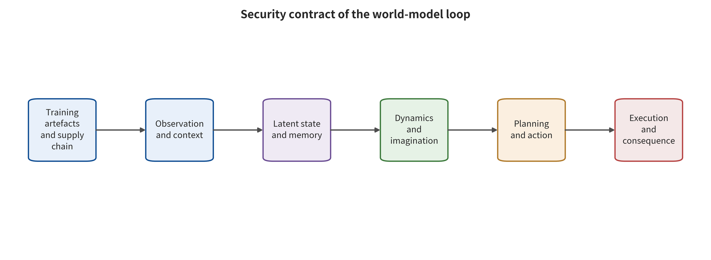

## Conceptual Boundaries and Article Structure

A name alone cannot settle terminology. This survey defines a world model as a system that maintains a state from historical observations and optional actions, and predicts at least one of future states, observations, rewards, or constraints. EWM names a functional class oriented toward external environment evolution or interactive generation. That abbreviation has not yet formed a stable community definition the way WM has. WAM requires that verifiable future prediction be directly coupled with action generation, evaluation, policy improvement, or planning. A system whose only action conditioning is WASD camera input, with navigation decisions still made by a human, is not a WAM. In this survey, WCM is an operational classification: world prediction must enter one of feedback control, trajectory or low-level command generation, or safety filtering. In the frozen retrieval, the exact safety phrase "world control model" has zero hits. This survey therefore does not claim that it is an already established official model category.

| Family | Minimum functional contract | Primary safety focus |
| --- | --- | --- |
| WM | Represent and predict/evaluate the future | Prediction integrity |
| EWM | Generate external evolution | Conditioning and temporal order |
| WAM | Prediction-action coupling | Imagination-action consistency |
| WCM | Prediction enters feedback control | Constraints and execution |

*The minimum verifiable contracts for the four model classes; they can overlap and are not mutually exclusive brand labels.*

```text
\hat{s}_{t+1},\hat{o}_{t+1},\hat{r}_{t+1}=F_{\theta}(s_t,a_t,c_t),a_t=\pi(s_t,\hat{s}_{t+1:t+H},g_t)
```

*Unified functional contract: the coupling of the predictor with the action/controller.*



*World-model closed-loop security contract. The primary code follows the first-broken functional interface, not the appearance of the perturbation.*

### From Dyna to Latent Imagination: 1991–2020

Dyna put learning, planning, and reacting in one architecture. That gave an early format for "generating additional experience with a learned model." In World Models, visual encoding, recurrent dynamics, and a controller showed that policies can be trained in imagination. PlaNet and Dreamer coupled latent dynamics tightly with planning and policy learning. The safety hazards of this stage already existed. Long-horizon rollouts amplify model bias, yet the literature of the period focused mainly on performance and sample efficiency rather than on malicious adversaries.[@sutton1991dyna] [@ha2018worldmodels] [@hafner2019planet] [@hafner2020dreamer]

### From Task Models to General Control: 2020–2024

MuZero skips the reconstruction of every observation detail. Instead it learns values, rewards, and dynamics that are useful for planning. World models moved toward multitask, large-scale continuous control with TD-MPC2 and DreamerV3. UniSim, GAIA-1, and Genie arrived in the same period, tying world models to driving sensor simulation, video generation, and interactive environments. The object of safety evaluation widened accordingly, from "policy return" to temporal consistency, the credibility of physical conditions, and downstream planning impact.[@schrittwieser2020muzero] [@hansen2024tdmpc2] [@hafner2025dreamerv3] [@yang2023unisim] [@hu2023gaia1] [@bruce2024genie]

### Physical AI, WAM, and Dedicated Attack-Defense: 2025–2026

After 2025, Cosmos, V-JEPA 2, and DINO-WM tightened the link between video prediction, physical representation, and planning. World action models and runtime verification became new hotspots. As of 2026-08-09, dedicated malicious-safety research covers observational adversarial perturbation, physical-condition attacks, data poisoning, backdoors, imagined-trajectory ranking, WAM jailbreaking, and action mismatch. On the defense side, the field is moving from robust training toward uncertainty filtering, robust MPC, runtime verification, and pre-tool-call blocking.[@nvidia2025cosmos

---

[← Back to contents](index.md)
