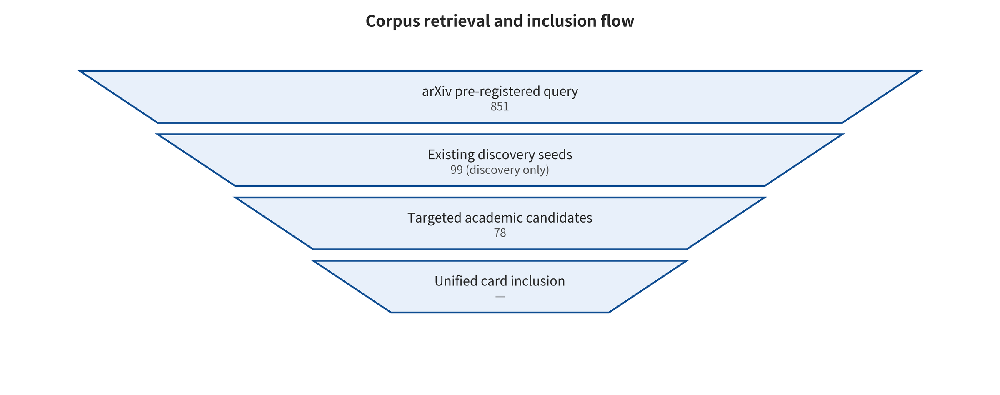

] [@assran2025vjepa2] [@zhou2024dinowm] [@liu2026jailwam] [@li2026badwam] [@nath2026sls2] [@liu2026checkvla]

## Retrieval, Screening, and Evidence Methods

This project froze its research questions, article structure, inclusion/exclusion criteria, evidence tiers, data dictionary, reproduction status, and statistical rejection conditions before starting parallel agents. The work then split into three workflows: academic retrieval, entity/news integration, and code reproduction. The main retrieval covers arXiv, with targeted verification against peer-reviewed pages, official project pages, repositories, corporate announcements, standards, and regulations. Queries use Boolean combinations of world model, environment world model, world action model, and world control model with adversarial, attack, poisoning, backdoor, jailbreak, privacy, robust, safe, assurance, and similar terms. Aliases such as Happy-Oyster, HappyOyster, MoWorldModel, and moworldmodel are expanded separately.

The pipeline starting point contains 851 deduplicated arXiv candidates, 99 historical discovery seeds, and 78 targeted academic candidates. Cross-source deduplication leaves 991. Of these, 78 enter high-relevance review, 76 are included in the qualitative evidence base, and 23 are the direct attack-defense or close-bridging core. 35 core PDFs are locally verified. In addition, 15 entities and 36 event records are established. Broad queries are capped for auditability, so the 913 items serve only as a candidate index. They were not disguised as manual full-text exclusions. This survey is therefore a transparent classification review. It does not claim to have completed a strict dual-independent PRISMA-style systematic review.

*Corpus pipeline. Broad retrieval and core full-text evidence are clearly separated.*

| Tier | Minimum evidence | Permitted statements |
| --- | --- | --- |
| A | First-hand full text/code | Qualified mechanisms and results |
| B | Defensible bridging | Boundary evidence, explicitly stated extrapolation |
| C | Background/foundational sources | Conceptual or historical background |
| Event | Official/independent sources | Timeline, not entered into the effect pool |

*The evidence tiers and statement boundaries of this survey.*

### Unified Coding Contract

Each attack unit records at least the asset, attacker objective, knowledge and privileges, controllable entry points, budget, first-broken interface, temporal propagation, closed-loop consequences, metric denominator, and adaptive-defense status. Each defense unit records at least the protected interface, prevention/detection/suppression/recovery/assurance functions, false positives and false negatives, latency/computational cost, adaptive attacks, and residual risk. A single paper may have multiple entry points. The primary code, however, selects only the first functional interface to fail in the closed loop, which avoids double counting.

### Reproduction and Statistical Boundaries

This survey strictly stratifies repository visibility, dependency installation, module import, toy mechanism execution, scaled-down simulation, and end-to-end results. Outputs are not written as end-to-end reproduction when large weights have not been downloaded, official datasets have not been run, or closed-loop tasks have not been completed. On the quantitative side, pooling is permitted only when at least three independent comparable studies have the same estimand, model/task, attack budget, success-rate denominator, and variance. No unit currently satisfies this cond

---

[← Back to contents](index.md)
