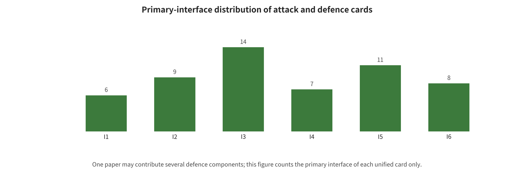

ges, but should not be called attack defenses before they have been validated against an adaptive adversary.

## Attack Surface: From Supply Chain to Real-World Execution

Of the 25 unified attack cards, 16 are direct world-model malicious-safety evidence and 9 are explicitly extrapolatable bridges from VLA, RL, trajectory prediction, MPC, or video dynamics. A card is a mechanism-coding unit, not an independent paper. One source can contribute multiple attack, evaluation, and defense cards. The author groups of Hallucination-Driven and ARB4WM, for example, overlap heavily, so they cannot be treated as independent replication studies. The primary-code distribution of the direct cards is: observation/context 6, supply chain 3, planning/action/control 2, goal/value/constraint 2, state/memory 1, execution/feedback/tool 1, privacy/intellectual property 1. These numbers are not attack effect sizes, nor do they represent real-world incidence rates.

*Distribution of core attack and defense cards by first-broken interface. Each paper is counted only once under its primary interface.*

### Training Artifacts and Supply Chain Attacks

Supply chain attacks work by fixing malicious behavior into data, model, encoder, dynamics, or configuration artifacts. SWAAP first searches for target models that have low return but still stay close to clean dynamics. It then uses gradient matching with stealthiness constraints to modify a small number of fine-tuning transition targets, and it discusses residual/CUSUM and TRIM-like robust training baselines. Targeting World Models places the attack target at the world model stage of the robot learning pipeline. BadDreamer uses a trigger–erase sequence of “keep the yellow rider in the context, erase the rider in future frames” to push future representations toward non-yielding waypoints. Such attacks are dangerous because clean validation performance can be maintained, and the attack only surfaces in long-horizon imagination or actions after the trigger. Environment poisoning and reward poisoning in traditional RL show that even without directly modifying parameters, an attacker can teach a wrong policy through system interaction. These are only bridge evidence, however. [@hu2026swaap] [@rathbun2026targeting] [@shuai2026baddreamer] [@ma2021environmentpoisoning] [@zhang2020rewardpoisoning]

### Observation, Physical Condition, and Context Attacks

Hallucination-Driven Policy Failure applies pixel, latent-space, and temporally augmented perturbations to Dreamer-style continuous control models. It shows that a small input change in one frame can accumulate across frames in the state buffer. PhysCond-WMA does more than change pixels. It optimizes HD Map embeddings and 3D box conditions directly, then maintains a temporally consistent semantic shift through momentum guidance of reverse denoising. BadWorld perturbs the input context image at test time and interferes with early denoising through a velocity objective that uses no ground-truth future labels. It then improves attack stability with a trajectory-adaptive bilevel search oriented toward unknown subsequent control sequences. This is not training poisoning or a backdoor. ARB4WM unifies multiple adversarial perturbations into one robustness benchmark for continuous control world models. CtrlAttack acts as an EWM boundary bridge. It uses a low-dimensional velocity field and temporal integration to disrupt the state evolution of diffusion-based I2V. Its experimental numbers cannot be pooled with closed-loop robot or Dreamer tasks. [@zhang2026hallucination] [@guo2026physcond] [@shen2026badworld] [@zhang2026arb4wm] [@xu2026ctrlattack]

### Latent State, Memory, and Temporal Accumulation

The minimal characteristic of a state/memory attack is not that “the image was changed”. It is that contaminated internal information continues to be used for subsequent rollouts. The attack may look slight in the current frame, yet it keeps latent beliefs, uncertainty, or long-term context drifting. Single-frame perception metrics and internal reconstruction residuals are therefore insufficient to prove safety. Safety requires comparison against independent pose, map, rule, or external sensor anchors. It also requires measuring how error propagates from state to trajectory and then to action. The temporal augmentation design of Hallucination-Driven directly supports this interface. False Prophets serves only as a bridge for system propagation from agent environment simulation and long-horizon context. Its first-broken interface is still manipulable environment simulation/feedback entering the tool decision chain, not direct tampering with internal memory. [@zhang2026hallucination] [@imgrund2026falseprophets]

### Dynamics, World Imagination, and Trajectory Attacks

Dynamics attacks attempt to change “what the system believes will happen next”. Trusted Imagination still applies a bounded infinity-norm PGD perturbation to observations. Its so-called oracle-level setting refers to using a high-quality downstream action selector as an evaluation probe. The purpose is to isolate “whether corrupting world imagination is sufficient to mislead decisions”. It does not mean that the attacker can directly overwrite the oracle or the world state. In the comparison, reactive policies show approximately no effect under attack. The LaDi-WM closed-loop MPC, which actually consumes imagination, exhibits attack-specific failures. That pattern indicates the harm depends on whether the downstream uses imagination. TRAP injects a backdoor through tail imagination trajectory ranking. As a result, the planner systematically favors long-horizon dangerous options when triggered. Traditional trajectory prediction attacks provide a bridge for this problem. Yet a prediction that does not enter the world state and the action closed loop cannot be directly equated with WAM/WCM attacks. [@chen2026trustedimagination] [@duan2026trap] [@tan2022trajectory]

### Goal, Reward, Value, and Constraint Tampering

A world model can predict the future very accurately, yet choose the wrong trajectory because its values or constraints have been tampered with. JailWAM places this problem within WAM jailbreaking for robot control. Its Visual-Trajectory Mapping, Risk Discriminator, and Dual-Path Verification first serve to generate, screen, and physically validate dangerous instruction candidates. They cannot be misdescribed wholesale as a defense. The Stage-I risk discriminator inside JailWAM can be reused as a plug-and-play inference-time filtering defense. Yet it is evaluated only within its simulation, model, and task boundaries. This is not entirely the same as ordinary LLM prompt jailbreaking. After the break, the goal propagates through visual futures, action generation, and robot execution. The reward poisoning literature indicates that the goal channel should be treated as a safety boundary from training time onward. [@liu2026jailwam] [@zhang2020rewardpoisoning]

### Planning, Action, and Control Hijacking

An important new boundary for WAM is that “imagination errors” and “correct imagination but wrong actions” must be tested separately. The core of BadWAM is the latter. It does not implant a trigger during training. Instead, it uses small visual adversarial perturbations generated by queries and an action-only/imagination-preserving objective to directionally shift the action output, while keeping visual futures plausible. FID, FVD, PSNR, or human liking of generated videos are therefore not sufficient proof of action safety. WMAttack, in turn, composes attack families, perturbation budgets, optimization steps, restarts, and allocation rules into a limited-budget search. It uses return degradation, action instability, temporal cost, and rollout variance to improve the proposal distribution. That increases evaluation strength, but it does not amount to providing a robustness certificate for any real-world deployment. [@li2026badwam] [@guo2026wmattack]

### Execution, Feedback, and Toolchain Attacks

An agent system may use a world model for pre-tool-call prediction, post-completion checking, or long-horizon planning. Once it does, tool descriptions, web page content, return values, permission boundaries, and side effects all become new state inputs. False Prophets directly analyzes the safety of world models in agent systems. Its lesson is that a world model cannot simultaneously be the sole predictor, the sole judge, and the sole execution authorizer. Independent lines of defense must be formed from tool least privilege, parameter type checking, external rules, side-effect previews, reversible tests, and post-completion verification. [@imgrund2026falseprophets]

### Privacy, Memorization, and Intellectual Property

World models may memorize training data in videos, robot trajectories, maps, user interactions, or imagination rollouts. Imagined Memorisation places the data leakage problem within the imagination of model-based reinforcement learning. Its evidence is preliminary, however: it comes from a single-author, non-archival workshop, and automated access to the official PDF is restricted. This survey uses its mechanism only as located by the official page and indexing. External users can repeatedly control the initial frame, text, viewpoint, and sampling randomness. When they do, traditional membership inference, data extraction, model extraction, and generated-content provenance problems compound with environment interaction. Direct evidence is currently scarce and protocols are not unified. The attack success rate of that work should therefore not be used to infer the leakage risk of commercial world models. [@ng2026imagined]

### Composite Attack Chains and Physical Consequences

The real attacks most worth attention are often not a single perturbation. They are “poisoned artifact — trigger condition — contaminated state — altered imagination ranking — bypassed constraint — emitted action — concealed feedback”. Only when an attack completes the final segment in a controllable simulation or physical system can a physical attack effect be claimed. Open-loop video quality degradation, reduced downstream detector accuracy, or single-step action errors are only propagation-chain evidence. They do not equal real accidents. Safety red teaming sh

---

[← Back to contents](index.md)
