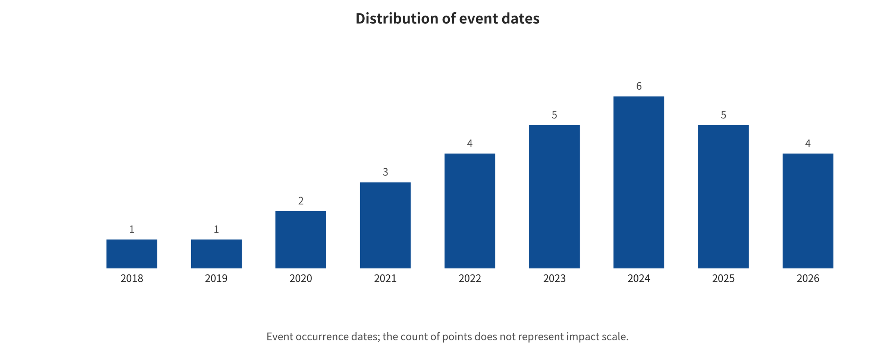

y-level metrics, qualitative synthesis, and the number of evidence cards, and it performs no causal ranking.

## News, Industry Signals, and Governance Integration

The 36-event timeline covers 2018-03-27 through 2026-07-30. It spans capability/product, direct attack/red teaming, defense/assurance, and governance/standards. The capability line starts from World Models and passes through latent planning, generative driving worlds, interactive video, and physical AI platforms. In 2026 it enters a phase of WAM, runtime assurance, and high-density safety papers. NVIDIA's Cosmos release shows world foundation models becoming parts of physical AI platforms. Happy Oyster and MoWorld carry the product signal of real-time, open-world creation and rapid interactive generation. But a product release is not safety evidence, and more papers do not equal more real-world attack incidents.[@nvidia2025cosmosblog] [@happyoyster2026] [@moxin2026moworld]

*Timeline of world model capability, attack-defense, and governance events. All events are retained as points, and only time anchors are labeled; labels do not represent influence or evidence strength.*

### General AI Risk Management and Adversarial Machine Learning Language

The NIST AI RMF organizes full-lifecycle risk around Govern, Map, Measure, and Manage. ISO/IEC 23894 provides AI risk management guidance; ISO/IEC 42001 defines an AI management system. NIST AI 100-2 provides a general taxonomy of poisoning, evasion, privacy, and mitigation. Such documents can constrain governance, documentation, measurement, and continuous monitoring. They give no benchmarks specific to world models for temporal state contamination, imagination—action mismatch, or closed-loop physical side effects. Nor are they a safety certificate for any product.[@nist2023airmf] [@nist2024aml] [@iso2023ai23894] [@iso2023ai42001]

### Vehicle, High-Risk AI, and Generated Content Rules

UNECE UN R155/R156 bring vehicle cybersecurity management and software update management into the type approval context. ISO/PAS 8800 focuses on AI safety in road vehicles. Both are directly relevant to the supply chain, OTA, safety argumentation, and continuous vulnerability handling of in-vehicle EWM/WAM/WCM. Their scope depends on the vehicle model, manufacturer responsibility, and place of deployment. The EU AI Act must be judged case by case, according to purpose, market placement, and high-risk classification. China's Interim Measures for the Administration of Generative AI Services have relevant requirements for public-facing generative services, audio/video, and virtual scenes. The Measures for Labeling AI-Generated Synthetic Content carry relevant requirements as well. Labeling and provenance can reduce the risk of misidentification and source removal. They cannot prevent latent state attacks, action hijacking, or closed-loop control failure.[@unece2021r155] [@iso2024pas8800] [@eu2024aiact] [@cac2023genai] [@cac2025label]

### How to Interpret News Without Treating It as an Experiment

Each record keeps the event occurrence date, first public date, source date, claiming entity, primary source, independent source, evidence level, correction status, and applicability notes. A corporate website can support "how the company positions a product", but not performance leadership on its own. A preprint can support the authors' results under its trial protocol; it cannot prove that a commercial system has been attacked. An e

---

[← Back to contents](index.md)
