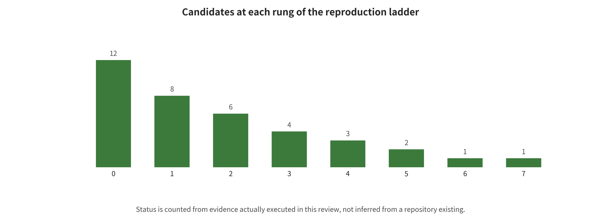

xpert blog offers an argumentative perspective, but is not regulation or experimental data.[@york2026safety]

## Code Audit and Safety Reproduction Status

The reproduction workflow first audits the current official repositories of BadWAM, WISER, SafeDreamer, and UNISafe. It also runs first-hand paper/project entry checks for TRAP, PhysCond-WMA, JailWAM, WMAttack, and SWAAP. Audit fields include owner, repository URL, commit, license, dependencies, entry points, configuration, weight/data availability, and actual run receipts. To avoid large weight downloads and high-risk real-device operations, only safe, low-cost core submodules or formula/mechanism proxies are executed.

| Status | Count | Evidence boundary |
| --- | --- | --- |
| Mechanism-level partial reproduction | 6 | Counted by actual evidence |
| Static audit | 3 | Counted by actual evidence |

*Code audit and reproduction ladder, automatically generated from the actual run manifest.*

In this run, END_TO_END=0. The status comes from per-command receipts and output hashes. The existence of a repository, a dependency installation, or a formula proxy does not equal an end-to-end attack or defense reproduction.

*Actual code audit and reproduction status ladder. PARTIAL_MECHANISM only means that a code- or formula-level mechanism has been run on safe toy inputs.*

### What Static Audits and Mechanism-Level Outputs Can Prove

A static audit can prove what entry points, dependencies, and configuration an official repository contains at a given commit. It can also expose license, data, weight, or documentation gaps. A mechanism-level partial reproduction can prove, on constructed inputs, that a submodule changes ranking, safety boundaries, residuals, or actions as expected. Neither can prove that paper numbers, data pipelines, large-model weights, closed-loop environments, or real-robot effects have been reproduced. End-to-end status requires official or verified equivalent weights, data, configuration, closed-loop tasks, multiple seeds, and result alignment, all of which must pass.

### Safety and Rerunnability Controls

All runs are confined to local, isolated toy data or numerical formulas. They do not touch real robots, vehicles, public services, or third-party accounts. For each candidate, the command, standard output/error, exit code, elapsed time, environment information, result JSON, and SHA-256 are retained. For candidates where only a formula proxy can be run, the script is re

---

[← Back to contents](index.md)
