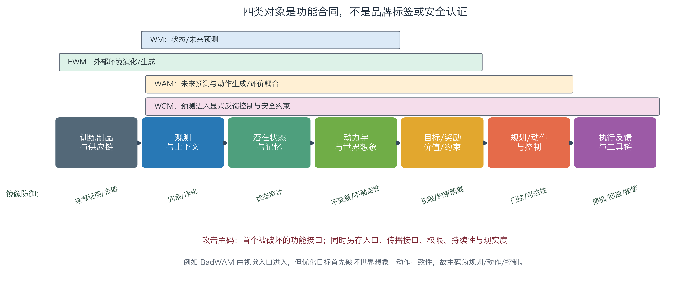
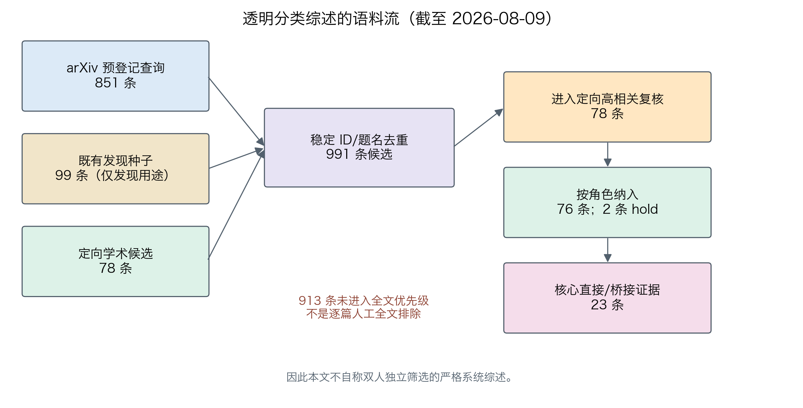
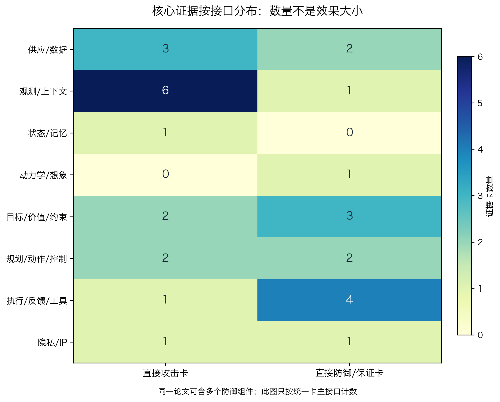
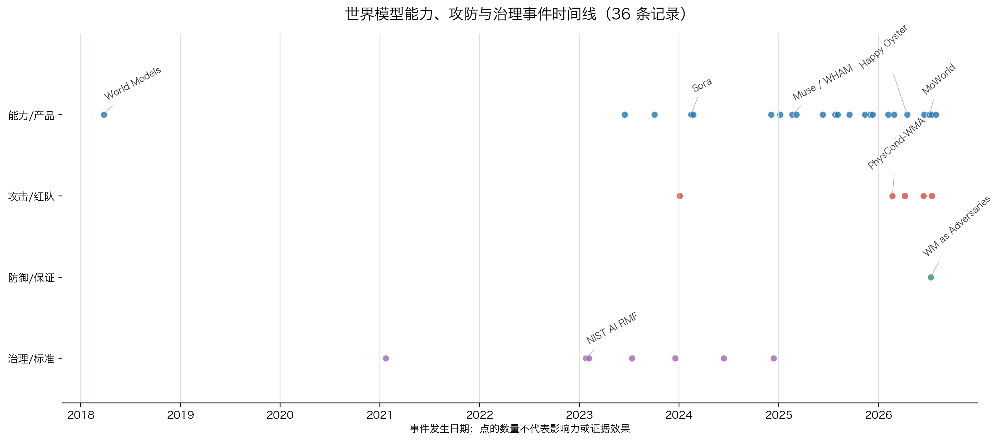

<!-- toc:start -->
## 目录

- [从想象世界到控制现实：世界模型、环境世界模型、世界动作模型与世界控制模型的安全攻防综述](#从想象世界到控制现实世界模型环境世界模型世界动作模型与世界控制模型的安全攻防综述)
  - [摘要](#摘要)
  - [引言：当想象成为决策与控制基础设施](#引言当想象成为决策与控制基础设施)
  - [概念边界与文章脉络](#概念边界与文章脉络)
  - [检索、筛选与证据方法](#检索筛选与证据方法)
  - [威胁模型与安全性质](#威胁模型与安全性质)
  - [攻击面：从供应链到现实执行](#攻击面从供应链到现实执行)
  - [防御、运行保证与恢复](#防御运行保证与恢复)
  - [代表性文章解析与比较](#代表性文章解析与比较)
  - [Happy Oyster 与 MoWorld：产品/项目实体解析](#happy-oyster-与-moworld产品项目实体解析)
  - [应用场景与部署风险映射](#应用场景与部署风险映射)
  - [数据集、指标与不可合并的结果](#数据集指标与不可合并的结果)
  - [新闻、产业信号与治理集成](#新闻产业信号与治理集成)
  - [代码审计与安全复现状态](#代码审计与安全复现状态)
  - [跨家族综合与部署选择](#跨家族综合与部署选择)
  - [未来趋势与可证伪研究议程](#未来趋势与可证伪研究议程)
  - [局限性](#局限性)
  - [结论](#结论)
  - [引用与证据说明](#引用与证据说明)
- [附录：截止后更新（2026-08-09 → 2026-09-26）](#附录截止后更新2026-08-09-→-2026-09-26)
  - [A.1　截止后新增的世界模型安全研究](#a1　截止后新增的世界模型安全研究)
  - [A.2　维护性研究缺口正在被填补](#a2　维护性研究缺口正在被填补)
  - [A.3　OpenAI—Hugging Face 事件的制度后果](#a3　openaihugging-face-事件的制度后果)
  - [A.4　如何使用本附录](#a4　如何使用本附录)
<!-- toc:end -->
# 从想象世界到控制现实：世界模型、环境世界模型、世界动作模型与世界控制模型的安全攻防综述

> 研究资料截止于 2026-08-09

## 摘要

世界模型正从潜在动力学和想象规划扩展到环境生成、机器人动作与闭环安全控制，使局部模型误差能够沿时间、规划和执行链传播。本文先冻结文章结构、检索策略、证据分层和复现边界，再并行完成学术检索、新闻/实体消歧与代码审计。三类发现源去重得到 991 条候选，78 条进入高相关审阅，76 条纳入定性综合，23 条构成直接攻防或紧密桥接核心；本地核验 35 份 PDF，并整理 15 个实体和 36 条事件。本文以闭环中最先被攻破的功能接口为主轴，将 WM、EWM、WAM 与 WCM 作为可重叠副轴。结果表明：攻击已从像素扰动扩展到数据投毒、物理条件、潜状态、想象排序、目标/约束、WAM 动作错配、工具执行与隐私；防御正从输入异常分数转向不确定性过滤、鲁棒 MPC、执行时核验、工具调用前阻断和可恢复控制。专用防御和可比证据仍严重不足，异质 ASR、回报、FID/FVD 不满足元分析条件。Happy Oyster 与 MoWorld 被证实为不同实体；Happy Oyster 仅依厂商官方功能表述作 WM＋EWM 桥接标注，MoWorld 依项目页与论文作 WM＋EWM 判定，两者公开证据均不足以判为 WAM/WCM 或得出产品安全结论。

## 引言：当想象成为决策与控制基础设施

世界模型的安全问题不只是“生成的画面是否逼真”。当模型用历史观测维持潜在状态、预测环境演化，再把预测送入规划、动作或反馈控制时，一个局部误差可能沿时间累积，并在执行端变成不可逆的物理后果。World Models、PlaNet、Dreamer与 MuZero 奠定了“在学得的世界中规划或学习”的技术脉络，而驾驶视频世界模型、交互式环境生成器、世界动作模型与基于世界模型的安全控制，则使攻击面从像素扩展到物理条件、潜在动力学、想象轨迹排序、动作头和工具执行。[@ha2018worldmodels] [@hafner2019planet] [@hafner2020dreamer] [@schrittwieser2020muzero]

本文的中心论点是：预测与动作的耦合是风险传播倍增器，但耦合本身不等于不安全。真正决定风险的，是哪个功能接口首先失守、错误是否被闭环放大、系统是否具有独立观测锚点、动作门控、安全包络、回滚和人类接管。因此，本文以“供应链—观测—状态—动力学—目标—规划/动作/控制—执行与反馈”的首个被破坏接口为主轴，把 WM、EWM、WAM 和 WCM 作为副轴。

- 贡献一：给出四类模型的可验证输入输出合同，避免把所有视频生成器称为世界模型，或把所有动作条件视频称为 WAM。

- 贡献二：以统一攻击合同分析数据投毒、物理条件扰动、潜状态污染、想象轨迹劫持、奖励/约束篡改、动作错配、工具滥用与隐私泄漏。

- 贡献三：把预防、检测、抑制、恢复和保证映射到同一闭环，并把自适应攻击下的残余风险写入每个防御结论。

- 贡献四：分开学术全文、官方产品/仓库、标准法规与新闻事件，并对 Happy Oyster 和 MoWorld 完成实体消歧。

- 贡献五：给出可重跑的安全玩具实验与代码审计回执，严格区分静态审计、机制级部分复现和端到端复现。

## 概念边界与文章脉络

术语不能只靠名字判定。本文把世界模型定义为能根据历史观测与可选动作维持状态，并预测未来状态、观测、奖励或约束至少一项的系统。EWM 是面向外部环境演化或可交互生成的功能类；该缩写尚未像 WM 那样形成稳定社区定义。WAM 要求可核验的未来预测与动作生成、评价、策略改进或规划直接耦合；只有 WASD 相机条件而导航决策仍由人类给出，不足以判为 WAM。WCM 在本文是操作性分类：世界预测必须进入反馈控制、轨迹或低层命令生成、安全滤波之一。冻结检索中“world control model”精确安全短语命中为零，因此不宣称它是已成熟的官方模型门类。

| 家族 | 最低功能合同 | 主要安全焦点 |
| --- | --- | --- |
| WM | 表征并预测/评估未来 | 预测完整性 |
| EWM | 生成外部演化 | 条件与时序 |
| WAM | 预测—动作耦合 | 想象—动作一致 |
| WCM | 预测进入反馈控制 | 约束与执行 |

*四类模型的最低可验证合同；它们可重叠，不是互斥品牌标签。*

```text
\hat{s}_{t+1},\hat{o}_{t+1},\hat{r}_{t+1}=F_{\theta}(s_t,a_t,c_t),a_t=\pi(s_t,\hat{s}_{t+1:t+H},g_t)
```

*统一功能合同：预测器与动作/控制器的耦合。*



*世界模型闭环安全合同。主码按最先被破坏的功能接口，而不是按扰动外观。*

### 从 Dyna 到潜在想象：1991—2020

Dyna 把学习、规划与反应结合在同一架构中，构成了“用学得模型生成额外经验”的早期格式。World Models 用视觉编码、循环动力学和控制器证明策略可以在想象中训练；PlaNet 和 Dreamer 进一步将潜在动力学与规划、策略学习紧密耦合。这一阶段的安全隐患已经存在：模型偏差会被长时域滚动放大，但文献焦点主要是性能与样本效率，而非恶意对手。[@sutton1991dyna] [@ha2018worldmodels] [@hafner2019planet] [@hafner2020dreamer]

### 从任务模型到通用控制：2020—2024

MuZero 不要求重建所有观测细节，而是学习对规划有用的价值、奖励和动力学。TD-MPC2 和 DreamerV3 把世界模型推向多任务、大规模连续控制。同期，UniSim、GAIA-1 和 Genie 将世界模型与驾驶传感器仿真、视频生成和可交互环境联系起来。这使安全评估的对象从“策略回报”扩展为时序一致性、物理条件可信性和下游规划影响。[@schrittwieser2020muzero] [@hansen2024tdmpc2] [@hafner2025dreamerv3] [@yang2023unisim] [@hu2023gaia1] [@bruce2024genie]

### 物理 AI、WAM 与专用攻防：2025—2026

2025 年以后，Cosmos、V-JEPA 2、DINO-WM 等工作强化了视频预测、物理表征与规划的连接，世界动作模型与执行时校验成为新热点。截止 2026-08-09，专用恶意安全研究已覆盖观测对抗扰动、物理条件攻击、数据投毒、后门、想象轨迹排序、WAM 越狱与动作错配。安全方面则从鲁棒训练转向不确定性滤波、鲁棒 MPC、执行时核验与工具调用前阻断。[@nvidia2025cosmos] [@assran2025vjepa2] [@zhou2024dinowm] [@liu2026jailwam] [@li2026badwam] [@nath2026sls2] [@liu2026checkvla]

## 检索、筛选与证据方法

本项目在启动并行代理前，先冻结了研究问题、文章结构、包含/排除标准、证据层级、数据字典、复现状态和统计拒绝条件。然后分为学术检索、实体/新闻集成、代码复现三条工作流。主检索覆盖 arXiv 并对同行评审页、官方项目页、仓库、企业公告、标准和法规进行定向核验。查询使用 world model、environment world model、world action model、world control model 与 adversarial、attack、poisoning、backdoor、jailbreak、privacy、robust、safe、assurance 等词的布尔组合，并对 Happy-Oyster、HappyOyster、MoWorldModel、moworldmodel 等别名单独扩展。

流程起点包含 851 条去重 arXiv 候选、99 条历史发现种子与 78 条定向学术候选；跨源去重后为 991 条。其中 78 条进入高相关审阅，76 条纳入定性证据库，23 条为直接攻防或紧密桥接核心；本地核验 35 份核心 PDF。另建立 15 个实体和 36 条事件记录。广泛查询为可审计而设有上限，913 条仅作候选索引，没有被伪装成人工全文排除。因此，本文是透明的分类综述，不声称完成了严格双独立 PRISMA 式系统评审。



*语料流程。广泛检索与核心全文证据被明确分开。*

| 级别 | 最低证据 | 允许的表述 |
| --- | --- | --- |
| A | 一手全文/代码 | 限定条件的机制与结果 |
| B | 可辩护的桥接 | 边界证据，明示外推 |
| C | 背景/奠基来源 | 概念或历史背景 |
| 事件 | 官方/独立来源 | 时间线，不入效果池 |

*本文的证据层级与表述边界。*

### 统一编码合同

每个攻击单元至少记录资产、攻击者目标、知识与权限、可控入口、预算、首个被破坏的接口、时间传播、闭环后果、指标分母和自适应防御状态。每个防御单元至少记录保护接口、预防/检测/抑制/恢复/保证功能、假阳性与假阴性、延迟/计算代价、自适应攻击及残余风险。一篇论文可有多个入口，但主码只选闭环中最先失守的功能接口，以避免重复计数。

### 复现与统计边界

本文将仓库可见性、依赖安装、模块导入、玩具机制运行、缩小仿真和端到端结果严格分层。未下载大权重、未跑官方数据集、未完成闭环任务时，不会把输出写成端到端复现。定量方面，仅当至少三个独立可比研究具有相同估计对象、模型/任务、攻击预算、成功率分母与方差时，才允许汇总。当前没有单元满足该条件，因此不生成汇总 ASR、森林图、I平方、漏斗图或因果排名。

## 威胁模型与安全性质

世界模型安全的资产包括训练数据与模型制品、观测和条件信号、长期记忆与潜在状态、动力学参数、奖励/价值/约束、想象轨迹、动作或控制命令、执行器/工具和用户隐私。攻击者可能只能控制环境外观，也可能获得传感器、条件嵌入、训练样本、奖励接口、模型梯度、供应链或工具描述的不同权限。“白盒成功”不能自动外推为远程黑盒威胁；“黑盒迁移”也必须说明查询次数、代理数据和攻击预算。[@nist2024aml]

- 预测完整性：未来状态、观测、奖励与约束不被恶意偏置。

- 时序一致性：局部帧看似合理时，长时域动力学仍不发生异常漂移。

- 想象—动作对齐：动作必须与被评估为安全且有效的想象一致。

- 约束满足：不确定性、安全距离、风险预算和人类意图在闭环中仍有效。

- 可恢复性：异常发生后能够停止、回滚、切换安全策略或转交人类。

- 可审计性：数据、模型、配置、世界预测、动作和执行结果有可连接记录。

需要严格区分恶意攻击与自然失效。自然分布偏移、遮挡、传感器噪声、长时域模型偏差和计算延迟可以暴露同一接口的弱点，但只有定义对手目标、权限和预算后才能称为攻击。反之，自然鲁棒性方法可作为安全保证桥接，但在未经自适应对手验证前不应被称为攻击防御。

## 攻击面：从供应链到现实执行

25 张统一攻击卡中，16 张为直接世界模型恶意安全证据，9 张是可明示外推的 VLA、RL、轨迹预测、MPC 或视频动力学桥接。卡是机制编码单元，不是独立论文；一篇来源可以贡献攻击、评测与防御多张卡，例如 Hallucination-Driven 与 ARB4WM 的作者组高度重叠，不能当作独立重复研究。直接卡的主码分布为：观测/上下文 6，供应链 3，规划/动作/控制 2，目标/价值/约束 2，状态/记忆 1，执行/反馈/工具 1，隐私/知识产权 1。这些数不是攻击效果大小，也不代表真实世界发生率。



*核心攻击与防御卡在首个失守接口上的分布。一篇论文只按主接口计一次。*

### 训练制品与供应链攻击

供应链攻击的关键是把恶意行为固化在数据、模型、编码器、动力学或配置制品中。SWAAP 先搜索低回报但仍接近干净动力学的目标模型，再用带隐蔽约束的梯度匹配修改少量微调 transition target，并讨论残差/CUSUM 和类 TRIM 稳健训练基线。Targeting World Models 把攻击对象放在机器人学习管线的世界模型环节。BadDreamer 通过“上下文保留黄色骑手、未来帧擦除骑手”的触发—擦除序列，把未来表征推向不避让路径点。这类攻击的危险在于清洁验证性能可以保持，触发后才在长时域想象或动作上暴露。传统 RL 的环境投毒和奖励投毒说明，即使不直接修改参数，攻击者也可以通过系统交互教会错误策略，但这些只是桥接证据。[@hu2026swaap] [@rathbun2026targeting] [@shuai2026baddreamer] [@ma2021environmentpoisoning] [@zhang2020rewardpoisoning]

### 观测、物理条件与上下文攻击

Hallucination-Driven Policy Failure 对 Dreamer 风格连续控制模型使用像素、潜空间与时间增强扰动，表明一帧的微小输入改变可被状态缓冲跨帧积累。PhysCond-WMA 不仅改像素，而是直接优化 HD Map 嵌入和三维框条件，再通过反向去噪的动量引导保持时间一致的语义偏移。BadWorld 在测试时扰动输入上下文图像，用无真实未来标签的速度目标干扰早期去噪，再用面向未知后续控制序列的轨迹自适应双层搜索提高攻击稳定性；它不是训练投毒或后门。ARB4WM 将多种对抗扰动统一到连续控制世界模型的鲁棒性基准。CtrlAttack 作为 EWM 边界桥接，用低维速度场和时间积分扰乱扩散式 I2V 的状态演化；它的实验数字不能与闭环机器人或 Dreamer 任务汇总。[@zhang2026hallucination] [@guo2026physcond] [@shen2026badworld] [@zhang2026arb4wm] [@xu2026ctrlattack]

### 潜在状态、记忆与时间累积

状态/记忆攻击的最小特征不是“图像被改了”，而是受污染的内部信息被继续用于后续滚动。攻击可在当前帧看似轻微，却使潜在信念、不确定性或长期上下文持续偏移。因此，单帧感知指标和内部重建残差不足以证明安全；需要与独立位姿、地图、规则或外部传感器锚点比较，并测量错误从状态到轨迹再到动作的传播。Hallucination-Driven 的时间增强设计直接支持这一接口；False Prophets 只作为代理环境模拟与长程上下文的系统传播桥接，其首个失守接口仍是可操纵的环境模拟/反馈进入工具决策链，不是直接篡改内部记忆。[@zhang2026hallucination] [@imgrund2026falseprophets]

### 动力学、世界想象与轨迹攻击

动力学攻击试图改变“系统认为下一步会发生什么”。Trusted Imagination 仍是对观测施加有界无穷范数 PGD 扰动；所谓 oracle-level 是用高质量下游动作选择器作评估探针，用于隔离“世界想象被破坏是否足以误导决策”，不是攻击者可直接覆写 oracle 或世界状态。对照中反应式策略对攻击近似无效应，而真正消费想象的 LaDi-WM 闭环 MPC 呈现攻击特异失败，说明危害依赖下游是否使用想象。TRAP 通过尾部想象轨迹排序注入后门，使规划器在触发时系统性偏爱长期危险方案。传统轨迹预测攻击为该问题提供桥接，但若预测并未进入世界状态和动作闭环，则不能直接等同于 WAM/WCM 攻击。[@chen2026trustedimagination] [@duan2026trap] [@tan2022trajectory]

### 目标、奖励、价值与约束篡改

世界模型可以对未来预测得很准，却因价值或约束被篡改而选错轨迹。JailWAM 将这一问题放在机器人控制的 WAM 越狱中：Visual-Trajectory Mapping、Risk Discriminator 与 Dual-Path Verification 首先服务于生成、筛选和物理验证危险指令候选，不能整体误写成防御。其中 Stage-I 风险判别器可被复用为即插即用的推理期过滤防御，但只在其仿真、模型和任务边界内得到评估。这和普通 LLM 提示越狱不完全相同：失守后的目标会经过视觉未来、动作生成和机器人执行传播。奖励投毒文献说明目标通道从训练时就应被当作安全边界。[@liu2026jailwam] [@zhang2020rewardpoisoning]

### 规划、动作与控制劫持

WAM 的重要新边界是“想象错误”与“想象正确但动作错误”必须分开测试。BadWAM 的核心就是后者：它不是训练时植入触发器，而是用查询生成的小幅视觉对抗扰动和 action-only/imagination-preserving 目标定向偏移动作输出，同时使视觉未来维持合理。因此，FID、FVD、PSNR 或人类对生成视频的好感都不是动作安全的充分证明。WMAttack 则把攻击家族、扰动预算、优化步数、重启和分配规则组成有限预算搜索，用回报退化、动作不稳定、时间代价和滚动方差改进提议分布。它提高了评测强度，但不等于为任何现实部署提供鲁棒性证书。[@li2026badwam] [@guo2026wmattack]

### 执行、反馈与工具链攻击

当世界模型用于代理系统的工具调用前预测、完成后核对或长程规划时，工具描述、网页内容、返回值、权限边界和副作用会成为新的状态输入。False Prophets 直接分析了代理系统中世界模型的安全性，其启示是：世界模型不能同时作为唯一的预测器、唯一的评判者和唯一的执行授权者。需要用工具最小权限、参数类型检查、外部规则、副作用预览、可逆测试和完成后核验形成独立防线。[@imgrund2026falseprophets]

### 隐私、记忆化与知识产权

世界模型可能在视频、机器人轨迹、地图、用户互动或想象滚动中记忆训练数据。Imagined Memorisation 把数据泄漏问题放到模型基强化学习的想象中，但它是单作者、非归档 workshop 的初步证据，官方 PDF 自动获取受限，本文只按官方页面与索引定位使用其机制。当外部用户可以反复控制初始帧、文本、视角和采样随机性时，传统成员推断、数据抽取、模型提取和生成内容溯源问题会与环境交互叠加。当前直接证据少且协议不统一，所以不应用该工作的攻击成功率推断商业世界模型的泄漏风险。[@ng2026imagined]

### 复合攻击链与物理后果

最值得关注的真实攻击往往不是单一扰动，而是“毒化制品—触发条件—污染状态—改变想象排序—绕过约束—输出动作—掩饰反馈”。只有攻击在可控仿真或物理系统中完成最后一段，才能声称物理攻击效果。开环视频质量退化、下游检测器准确率下降或单步动作错误只是传播链证据，不等于真实事故。安全红队应用可逆、隔离、无第三方影响的仿真协议来检验这些组合。

## 防御、运行保证与恢复

本文整理 17 张防御/保证卡，其中 14 张为直接或运行保证级证据。这些仍是机制单元，不是 17 项独立研究；同一来源可以同时贡献攻击和基线防御卡。与攻击相比，专用、在自适应对手下评估的闭环防御仍然偏少。很多被称为“安全”的方法主要解决自然 OOD、约束强化学习或风险感知规划，它们是必要的运行保证，但并未自动对抗会针对检测器调整的攻击者。

### 预防：数据溯源、制品完整性与稳健学习

供应链层面应对数据集、代码、模型权重、编码器、配置和提示/工具模板建立版本、来源、哈希、签名、许可证与审批链。清洗、异常样本剪裁和稳健目标可以降低部分投毒风险，SWAAP 中的 TRIM 式基线和鲁棒模型基强化学习属于这一方向。但数据来源完整不意味着标注、条件嵌入或弱质量数据不会造成系统性偏差；签名也只能证明“来自谁”，不能证明“内容安全”。[@hu2026swaap] [@ye2024robustmbrl]

### 输入、条件与状态一致性检测

有效的输入防线应跨越像素、地图、三维框、文本、动作历史和设备状态。检测器不能只看当前帧语义，还应检查几何约束、动力学可达性、跨模态一致性、时间残差和独立传感器锚点。WISER 用世界模型 posterior/prior 惊讶和重建误差，在多传感器遮蔽候选中选择更可解释的潜状态，并在单传感器情形下拒绝或用预测重建净化不可信观测。它直接支持推理时 detect＋contain，但主要评估噪声、传感器故障与自然 OOD，尚未面对联合优化惊讶、重建和任务收益的自适应恶意攻击。ARB4WM 显示输入处理在非自适应攻击下可能有效，但针对防御梯度或通过模型的自适应攻击会大幅缩小收益。作为顺序决策桥接，Illusory Attacks 进一步说明常规攻击往往因轨迹分布偏移而可检，而刻意保持接近环境轨迹分布的 epsilon-illusory 攻击可绕过异常检测。因此应同时报告清洁通过率、假警、漏报、延迟和自适应攻击。[@zollicoffer2025worldmodelrobustnesssurprise] [@zhang2026arb4wm] [@franzmeyer2024illusory]

### 不确定性、安全过滤与鲁棒控制

UNISafe 使用潜空间不确定性和安全过滤来避免 OOD 失效；SafeDreamer 在世界模型想象中学习安全约束；SLS平方把潜在世界模型与并行 conformal 鲁棒 MPC 结合，尝试把像素预测连接到概率安全控制。这些方法对 WCM 有重要意义，因为它们不仅给出分数，而是改变动作或轨迹。然而，潜在不确定性会在共同模型偏差下过度自信；Biased Dreams 正是对这一假设的提醒。安全门限应与外部约束、可达性分析和紧急停止共同工作。[@seo2025unisafe] [@huang2023safedreamer] [@nath2026sls2] [@berger2026biaseddreams]

### 执行时核验、抑制与回滚

CheckVLA 使用动作条件世界模型在长时程移动操作中预览和校验执行；DreamGuard 用风险感知世界模型在 LLM 代理调用工具前阻断高风险路径。这两类设计都将“安全评估”变为闭环干预。但如果工作模型与检查模型共享数据、编码器或弱点，攻击者可能同时欺骗二者。更稳健的部署需要架构多样性、独立规则和硬件安全包络，并为拒绝、暂停、重规划、回滚与人类接管定义可测量的成功条件。[@liu2026checkvla] [@lin2026dreamguard]

### 自适应红队、持续评估与反事实测试

WMAttack 的自动有限预算搜索提醒防御者：固定一个手工攻击配置容易高估鲁棒性。RoboTrustBench 把视频世界模型的可信性测试扩展到机器人操作场景。World Models as Adversaries 让角色条件的世界模型生成困难交互，再以多智能体自博弈微调运动规划器，属于训练时覆盖增强，不是对未知现实攻击的形式保证。完整的持续评估应包含：目标防御自适应攻击、跨种子与跨任务复现、清洁性能守门、攻击搜索预算、未知攻击保留集、闭环长时域、安全包络介入率、恢复时间与失败后可逆性。“没有触发已知攻击”不应被解读为“已经安全”。[@guo2026wmattack] [@li2026robotrustbench] [@nie2026wmasadversaries]

## 代表性文章解析与比较

本节不按论文标题做摘要堆叠，而是比较它们回答了闭环安全的哪一段，以及哪些结论不能外推。

### Hallucination-Driven 与 PhysCond-WMA：输入不只是像素

Hallucination-Driven 的价值在于将世界模型对抗攻击分为整体白盒、只接触编码器/动力学的潜空间设定和跨帧时间增强设定，从而显示同一像素预算在不同权限下不是同一威胁。它的限制是结论依赖连续控制模型、数据归一化和作者协议，不能把扰动阈值搬到驾驶视频生成。PhysCond-WMA 则显示条件通道是独立资产：HD Map 和三维框在人眼看来不是画面，却直接规定世界演化。该文报告的 FID/FVD、目标成功率与下游检测/开环规划退化只能在其数据、归一化和模型下解读。[@zhang2026hallucination] [@guo2026physcond]

### TRAP 与 WMAttack：从一个后门到攻击搜索器

TRAP 的核心创新不是让所有预测都变差，而是改变尾部想象轨迹的排序，使触发样本下的长期危险轨迹更容易被规划器选中。这比只测量一步预测误差更接近闭环目标。WMAttack 则把“攻击评估很依赖调参”转化为有限预算优化问题，并用任务表征检索历史配置暖启动。它的优点是减少弱手工基线造成的鲁棒性高估；限制是攻击家族和搜索目标仍由评估者定义，而且观测空间成功不是供应链、工具或物理控制的完整覆盖。[@duan2026trap] [@guo2026wmattack]

### JailWAM 与 BadWAM：WAM 的两种正交失效

JailWAM 集中于危险意图、风险评判和世界想象的安全绕过；BadWAM 则用查询生成的小幅视觉对抗扰动定向偏移动作输出，同时有意保持视觉未来看似正确；它不是训练时动作头后门。两者放在一起才能得出完整的 WAM 安全测试矩阵：一条轴测“想象是否正确”，另一条轴测“动作是否与想象和约束对齐”。四个象限中，只有想象和动作都正确才是良性。这也说明为什么视频相似度评分不能代替动作一致性、约束违反和执行后果测试。[@liu2026jailwam] [@li2026badwam]

### SWAAP、Targeting、BadDreamer 与 BadWorld：训练投毒与测试时操纵

SWAAP 先找到低回报但仍贴近干净动力学的目标模型，再以隐蔽约束梯度匹配修改少量微调 transition target；Targeting 把世界模型置于整个机器人学习供应链，强调下游策略被妥协；BadDreamer 用上下文保留/未来擦除黄色骑手的触发序列，将未来表征与不避让路径点绑定；BadWorld 则不需要训练时权限，而是在测试时用无未来标签的速度目标与轨迹自适应双层优化扰动上下文图像。前三类证据主要检验数据/模型更新或后门权限，BadWorld 的第一破坏接口则是观察/上下文。不指明训练数据、模型更新、测试输入和未来控制知识这些权限，后门成功率或攻击成功率就无法用于工程风险评估。[@hu2026swaap] [@rathbun2026targeting] [@shuai2026baddreamer] [@shen2026badworld]

### ARB4WM、RoboTrustBench 与运行保证系列

ARB4WM 的贡献是将攻击和基础防御放在连续控制世界模型上统一评估；RoboTrustBench 则聚焦视频世界模型对机器人操作的可信性。两者都暴露了基准需要测“下游任务”而不只是“生成质量”。但基准本身不是防御。UNISafe、SafeDreamer 与 SLS平方分别从潜在不确定性过滤、安全世界模型强化学习和概率鲁棒 MPC 填补“如何介入”；CheckVLA 与 DreamGuard 则把介入点推到执行时。每个方法都需要额外测试针对其过滤器或评判模型的自适应对手。[@zhang2026arb4wm] [@li2026robotrustbench] [@seo2025unisafe] [@huang2023safedreamer] [@nath2026sls2] [@liu2026checkvla] [@lin2026dreamguard]

## Happy Oyster 与 MoWorld：产品/项目实体解析

用户给出的 ali happy oyster 与 moworldmodel 在检索中容易被混合，但一手证据显示它们是两个不同实体。Happy Oyster 是官网规范名，HappyOyster 是阿里财年报告中的书写变体，Happy-Oyster 只是检索变体。官网将它定位为支持实时世界创建与交互的开放式世界模型，阿里巴巴 FY2026 年报将它放在 Alibaba Token Hub 相关业务语境中。依据厂商官方功能表述而非论文、模型卡或独立技术验证，本文将其作 WM＋EWM 桥接标注；未发现可核验学术论文、模型卡、权重、代码或针对该产品的直接攻防实证，因此不能将它判为已证 WAM/WCM，也不能称其安全或不安全。[@happyoyster2026] [@alibaba2026annual]

MoWorld 是魔芯/Moxin-Tech 的官方项目名；MoWorldModel、moworldmodel 和 Mo World 在截止日均未证实为官方规范名。项目以初始帧、文本与 WASD 相机操作为条件，预测后续帧潜变量；论文明确说导航决策与视觉生成解耦。因此它是较明确的 WM＋EWM，而不是已证 WAM/WCM。截止 2026-08-09，官方仓库仅有 README、2 次提交且无许可证元数据，应称为仓库占位而不是完整开源或可复现发布。MoWorld 3D 作为同一发布方的相关产品被另行编码，未强行认定为论文模型的同一版本。[@moxin2026moworld] [@moxin2026github]

| 实体 | 已证实 | 未证实 |
| --- | --- | --- |
| Happy Oyster | 阿里；官方称互动世界模型 | 本文仅作 EWM 桥接 |
| MoWorld | 魔芯；视觉生成解耦 | WAM/WCM；完整开源 |

*两个实体的官方身份、功能合同和证据缺口。本文分类不是产品安全认证。*

## 应用场景与部署风险映射

世界模型的安全要求由应用中的信息流和最大权限决定。游戏智能体主要关注对抗观测、长时域策略退化和比赛完整性；自动驾驶 EWM 需要对地图、三维框、车辆动力学与下游规划做跨模态检查；机器人 WAM 需要分离视觉预测与动作头保证；安全关键 WCM 还必须将延迟、执行器限幅、故障安全状态与人类接管放入同一安全论证。[@guan2024drivingsurvey] [@hou2026robotsurvey]

当世界模型作为训练数据生成器或策略评估器时，风险不一定在同一时刻显现：被毒化的生成环境可能在数周后通过下游策略重新进入真实系统；被妥协的评估器可能批准本来不安全的策略。因此部署记录应覆盖数据生成、策略版本、评估结果和实际执行，而不只保存最后一个模型权重。WorldEval 等“以世界模型评策略”的路径尤其需要独立校验评估器自身的偏差与攻击面。[@li2025worldeval]

## 数据集、指标与不可合并的结果

当前证据跨越 Atari、DeepMind Control Suite、Safety-Gym 风格连续控制、机器人操作、自动驾驶视频、轨迹预测、代理工具与扩散视频。模型包括 DreamerV2/V3、TD-MPC2、IRIS、驾驶 EWM、WAM 和风险世界模型。攻击预算可能是像素范数、条件嵌入扰动、毒化比例、触发器可见性、查询次数或工具权限。因此“ASR”在不同研究中可能分别指目标轨迹、后门触发、任务失败、危险动作或视频动力学扰乱，其分母不同。

- 生成层：FID、FVD、LPIPS、PSNR、SSIM 及人类评分。它们表征视觉或分布质量，不是闭环安全指标。

- 状态层：潜在距离、预测误差、时间一致性、不确定性与独立锚点误差。内部残差小不能排除共同漂移。

- 规划层：候选轨迹排序、价值/成本、可达性、约束违反与重规划率。需区分开环与闭环。

- 动作层：动作偏差、想象—动作一致性、任务成功、风险动作率和安全过滤介入。

- 执行层：碰撞、越界、工具副作用、停止距离、恢复时间、回滚成功和人类接管。

- 系统层：延迟、计算/能耗、假警/漏报、可用性、审计链完整性和未知攻击下的性能。

本次对元分析的结论是“不运行，因可比性不足”。没有三个独立研究在同一估计对象、模型/任务、预算、ASR 分母和方差上可比。用论文中的百分数画森林图，会把任务难度、预算、成功定义和重复模型的差异伪装成一个可解释的总体效果。因此本文仅保留研究级指标、定性综合和证据卡数，不做因果排名。

## 新闻、产业信号与治理集成

36 条事件时间线覆盖 2018-03-27 至 2026-07-30，包含能力/产品、直接攻击/红队、防御/保证与治理/标准。能力线从 World Models 起步，经过潜在规划、生成式驾驶世界、可交互视频与物理 AI 平台，在 2026 年进入 WAM、运行保证和高密度安全论文阶段。NVIDIA 的 Cosmos 发布显示世界基础模型正成为物理 AI 平台组件，而 Happy Oyster 与 MoWorld 代表了实时、开放世界创建与快速交互式生成这一产品信号。但产品发布不是安全实证，论文数量增长也不等于现实攻击事故增长。[@nvidia2025cosmosblog] [@happyoyster2026] [@moxin2026moworld]



*世界模型能力、攻防与治理事件时间线。所有事件都保留为点，仅标注时间锚点；标注不代表影响力或证据强度。*

### 通用 AI 风险管理与对抗机器学习语言

NIST AI RMF 以 Govern、Map、Measure、Manage 组织全生命周期风险，ISO/IEC 23894 提供 AI 风险管理指导，ISO/IEC 42001 定义 AI 管理体系。NIST AI 100-2 则提供投毒、规避、隐私与缓解的通用分类。这些文件可以约束治理、记录、度量与持续监测，但没有给出世界模型特有的时序状态污染、想象—动作错配或闭环物理副作用基准，也不是任何产品的安全证书。[@nist2023airmf] [@nist2024aml] [@iso2023ai23894] [@iso2023ai42001]

### 车辆、高风险 AI 与生成内容规则

UNECE UN R155/R156 将车辆网络安全管理与软件更新管理纳入型式批准语境；ISO/PAS 8800 聚焦道路车辆中 AI 安全。它们对车载 EWM/WAM/WCM 的供应链、OTA、安全论证与持续漏洞处置具有直接相关性，但适用范围依赖车型、制造商责任和投放地。欧盟《人工智能法案》需要按用途、市场投放和高风险分类逐案判定。中国《生成式人工智能服务管理暂行办法》与生成合成内容标识办法对公众生成服务、音视频与虚拟场景有相关要求。标识和溯源可降低误认与删除来源风险，却不能防止潜状态攻击、动作劫持或闭环控制失效。[@unece2021r155] [@iso2024pas8800] [@eu2024aiact] [@cac2023genai] [@cac2025label]

### 如何解读新闻而不把它当实验

事件集对每条记录保留事件发生日期、首次公开日期、来源日期、声明主体、一手来源、独立来源、证据等级、更正状态和适用性备注。企业官网可以支持“公司如何定位产品”，不能独立支持性能领先；一篇预印本可以支持其试验协议下的作者结果，不能证明商业系统已被攻击；专家博客可以提供论证视角，但不是法规或实验数据。[@york2026safety]

## 代码审计与安全复现状态

复现工作流优先审计 BadWAM、WISER、SafeDreamer、UNISafe 的当前官方仓库，并对 TRAP、PhysCond-WMA、JailWAM、WMAttack 和 SWAAP 进行一手论文/项目入口核对。审计字段包括所有者、仓库 URL、commit、许可证、依赖、入口、配置、权重/数据可得性和实际运行回执。为避免大权重下载和高风险真实设备操作，仅执行安全、低成本的核心子模块或公式/机制代理。

| 状态 | 数量 | 证据边界 |
| --- | --- | --- |
| 机制级部分复现 | 6 | 按实际证据计 |
| 静态审计 | 3 | 按实际证据计 |

*代码审计与复现阶梯，由实际运行清单自动生成。*

本次 END_TO_END=0。状态来自逐命令回执与输出哈希；仓库存在、依赖安装或公式代理都不等于端到端攻击或防御复现。


*实际代码审计与复现状态阶梯。PARTIAL_MECHANISM 只表示代码或公式级机制已在安全玩具输入上运行。*

### 静态审计与机制级输出能证明什么

静态审计能证明官方仓库在某一 commit 下包含什么入口、依赖和配置，并暴露许可证、数据、权重或文档缺口。机制级部分复现能证明某个子模块在构造输入上按预期改变排序、安全边界、残差或动作。它们都不能证明论文数值、数据管线、大模型权重、闭环环境或真实机器人效果已重现。端到端状态要求官方或已验证等价权重、数据、配置、闭环任务、多种子和结果对齐全部通过。

### 安全与可重跑性控制

所有运行均限于本地、隔离的玩具数据或数值公式，不与真实机器人、车辆、公共服务或第三方账号交互。每个候选保留命令、标准输出/错误、退出码、耗时、环境信息、结果 JSON 和 SHA-256。对于只能运行公式代理的候选，脚本与文章一起保留，同时在清单中明确标记不是官方端到端管线。

## 跨家族综合与部署选择

WM、EWM、WAM 与 WCM 不是一条从低级到高级的线性等级。一个系统可以同时属于多类，也可以在部署中只使用其中一种能力。安全架构应从“最坏可执行权限”向前反推：若模型只生成离线视频，主要风险是数据、隐私、内容溯源和下游误用；若它给规划器提供轨迹，就需要轨迹一致性、不确定性和闭环评估；若它输出动作或控制命令，则必须增加独立动作验证、安全包络、最小权限、停止/回滚和人类接管。

- 离线 EWM：优先审计训练来源、条件完整性、记忆化、水印/标识、滑窗时序一致性与下游误用。

- 仿真/数字孪生 EWM：增加物理条件签名、反事实场景、真实数据锚点、仿真偏差边界与下游策略守门。

- 规划型 WM：增加候选轨迹排序稳定性、不确定性校准、最坏情形优化与紧急安全策略。

- WAM：必须分别测试想象完整性和想象—动作对齐，动作头、token 接口与语义解码是独立供应链资产。

- WCM：使用外部约束、鲁棒 MPC/安全滤波、硬实时延迟预算、执行器限幅、故障安全模式和物理停止通道。

- 代理世界模型：将工具描述、网页与返回值当作不可信观测，实施最小权限、副作用预览和交易级审批。

工程上最容易被忽略的是防线共因失效。如果预测器、风险判别器和动作核验器使用同一编码器、同一训练集和同一上下文，三个“独立模块”可能对同一扰动同时误判。因此应明确测量模型、数据、传感器、逻辑规则和执行器之间的多样性，并把安全包络建立在攻击者更难同时控制的边界上。

## 未来趋势与可证伪研究议程

未来几年的主变化不会只是参数更大。世界模型将更多地作为仿真平台、数据生成器、评估器、规划器、动作模型和运行时守门。同一模型既可以作为防御者，也可以生成对抗场景；World Models as Adversaries 已用多智能体自博弈微调来提高运动规划鲁棒性。这使“攻击生成”与“安全训练”的边界更模糊，因而更需要可审计的评估协议。[@nie2026wmasadversaries]

- 议程一—可执行的模型合同：公开基准应同时声明状态、未来、动作和控制接口；验收条件是不同研究者对同一模型得到一致家族编码。

- 议程二—想象—动作双轴基准：同时构造想象错/对与动作错/对的四象限；验收条件是指标能识别 BadWAM 式“梦对但做错”。

- 议程三—长时域独立锚点：将内部残差与外部几何/物理/规则锚点并列；验收条件是能暴露共同漂移而不只是随机噪声。

- 议程四—多接口自适应攻击：攻击者联合优化条件、状态、价值与动作；验收条件是统一报告预算、查询、权限和传播路径。

- 议程五—针对安全门的自适应红队：将检测器、过滤器与回滚策略全部纳入对手模型；验收条件是同时报告攻击后风险、清洁通过率与最坏延迟。

- 议程六—预测到证明的桥梁：将 conformal 区间、可达性、控制屏障函数与视觉潜在世界结合；验收条件是明示预测假设失效时的保证退化。

- 议程七—供应链与运行血缘：将数据、权重、配置、编码器、安全头和事件日志绑定；验收条件是每个动作能追溯到使用的世界模型版本与条件。

- 议程八—隐私与世界复现权：建立视频、地图、室内环境和用户轨迹的记忆化/抽取基准；验收条件是同时评估效用、会员泄漏和场景可识别性。

- 议程九—多智能体共同世界：测试对手是否能操纵共享状态、他者意图或交通规则；验收条件是报告个体与系统级安全差异。

- 议程十—从竞赛分数到事故可恢复性：增加停止、降级、回滚、重规划、人类接管和证据保全指标；验收条件是评估能回答“失败后如何结束”。

- 议程十一—开放且有限的复现包：发布小权重/玩具模型、攻击卡、安全配置、命令回执和数据许可；验收条件是第三方能在不接触真实设备时复现核心机制。

- 议程十二—治理要求的技术化：将法规/标准条款映射到数据字段、测试、运行门控和日志；验收条件是能明确区分适用、不适用与尚需法务判断的义务。

基于截止日的证据，可以谨慎预判三个方向：第一，攻击将从单帧观测扩展到多接口、长时域和反馈欺骗；第二，防御将从异常分数转向能够改变动作的运行保证和恢复；第三，产品安全评估将更多要求版本化证据、事件日志和用途特定的法规映射。这些是由当前证据推导的研究假设，不是已发生的事实；它们应由上述可验收条件在未来数据中被支持或否证。

## 局限性

第一，该领域在 2026 年发布密度很高，相当一部分直接安全证据仍是预印本，同行评审、代码和数据可用性可能在截止日后变化。第二，广泛 arXiv 检索有预注册的返回上限，候选级记录并非全部人工全文筛选。第三，EWM 和 WCM 的术语边界尚未稳定，本文的功能分类是为了可比性，不是要取代作者或产品的原始命名。第四，安全复现为避免大权重、高成本和真实设备风险，主要停留在静态审计和机制级部分运行，未证明作者数值或现实世界威胁。第五，异质指标使元分析不成立，文中数量统计反映证据分布，而非方法排名或事故概率。

对 Happy Oyster 与 MoWorld 的判定尤其需要保守：官方功能表述支持实体身份和粗粒度合同，但缺少模型卡、完整代码/权重、独立评测和直接攻防论文。本文没有对两者执行攻击，也没有证明它们存在特定漏洞。任何后续新的官方论文、仓库、模型版本或安全公告都应通过实体版本和时间戳加入，而不是覆盖历史记录。

## 结论

世界模型安全的核心不是为每一个新品牌发明一套术语，而是在统一闭环中找到第一个失守接口，测量错误如何跨时间传播到想象、动作和执行，并证明防线在自适应对手下能否阻断、恢复和留存证据。当前攻击证据已经从观测扰动扩展到物理条件、供应链、轨迹排序、WAM 越狱与动作头；防御则开始从异常分数走向不确定性过滤、鲁棒 MPC、执行时核验和工具调用前阻断。

然而，直接、可复核且可以跨研究比较的证据仍然稀缺；专用防御尤其落后于攻击方法，端到端开源复现也不足。因此，当下最可负责的结论不是宣布某个模型已经安全，而是建立版本化供应链、独立状态锚点、想象—动作双轴测试、多样化运行守门、物理安全包络、可恢复执行和审计回执。这些能力将世界模型从“看起来合理”推向“在可检验边界内安全行动”。

## 引用与证据说明

正文使用 `[@citation_key]` 指向同源 LaTeX 包中的 `references.bib`。检索日志、论文卡、事件表、代码回执和统计拒绝证据见项目根目录的对应子目录。
---

# 附录：截止后更新（2026-08-09 → 2026-09-26）

正文材料截止于 2026-08-09。本附录登记截止日后的新材料，**正文保持原样**。

## A.1　截止后新增的世界模型安全研究

| 论文 | 主题 | 对应正文议题 |
|---|---|---|
| Denying the World Model: Automated Moving Target Defense as an Architectural Countermeasure to Autonomous AI Agents | 以对抗移动目标防御作为针对自主智能体的架构级对策 | "防御、运行保证与恢复"一章：从检测转向**使世界模型不可被稳定建模** |
| UAWM: A Unified Adaptive World Model with Multi-Layered Security for Robust Decision-Making | 带多层安全的统一自适应世界模型 | "防御、运行保证与恢复"：把安全约束做进模型架构而非外挂 |

两篇都指向正文已提出的方向：**防御正在从"检测错误预测"转向"设计让错误预测难以被利用的结构"**。正文的收敛判断（防御必须能失败、介入与恢复）不受影响，但这两篇给出了具体的架构候选。

## A.2　维护性研究缺口正在被填补

正文局限性一章指出，EWM 与 WCM 的术语边界尚未稳定。截止后的材料延续了这一不稳定性：新预印本仍在自造"世界模型 + 安全"的组合命名，说明**功能分类的必要性在上升**——本文以消费者与状态判定功能边界的方法，正适合处理这类命名漂移。

## A.3　OpenAI—Hugging Face 事件的制度后果

2026-09-16 / 17，OpenAI 公开事件说明并宣布安全事件披露机制；据报道涉事智能体约 700 个、触及数十个第三方系统、53 张用户图片外泄；美国参议院启动调查（Hawley 牵头）。

**与本篇的关系**：该事件不涉及世界模型，但它确立了**智能体越界后的事后披露惯例**。对世界模型安全而言，"想象链被劫持"若发生在自主智能体中，事后追溯同样依赖这套披露机制——正文关于"可证伪测试与运行记录"的要求因此获得了外部制度支撑。

## A.4　如何使用本附录

正文的四类功能边界判定、攻击面矩阵与拒绝伪合并的立场不受影响。新增材料改变的是**防御研究的形态**：从检测器转向架构级不可利用性设计。引用上述条目时请同时标注正文截止日与本附录日期。