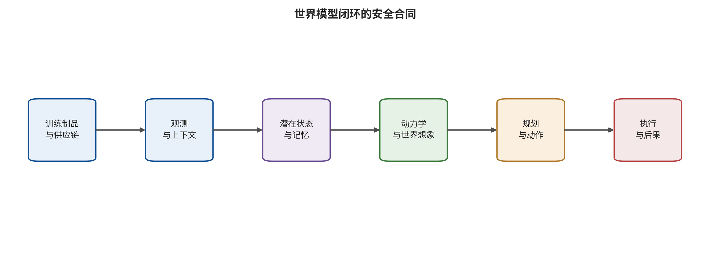

## 概念边界与文章脉络

术语不能只靠名字判定。本文把世界模型定义为能根据历史观测与可选动作维持状态，并预测未来状态、观测、奖励或约束至少一项的系统。EWM 是面向外部环境演化或可交互生成的功能类；该缩写尚未像 WM 那样形成稳定社区定义。WAM 要求可核验的未来预测与动作生成、评价、策略改进或规划直接耦合；只有 WASD 相机条件而导航决策仍由人类给出，不足以判为 WAM。WCM 在本文是操作性分类：世界预测必须进入反馈控制、轨迹或低层命令生成、安全滤波之一。冻结检索中“world control model”精确安全短语命中为零，因此不宣称它是已成熟的官方模型门类。

| 家族 | 最低功能合同 | 主要安全焦点 |
| --- | --- | --- |
| WM | 表征并预测/评估未来 | 预测完整性 |
| EWM | 生成外部演化 | 条件与时序 |
| WAM | 预测—动作耦合 | 想象—动作一致 |
| WCM | 预测进入反馈控制 | 约束与执行 |

*四类模型的最低可验证合同；它们可重叠，不是互斥品牌标签。*

```text
\hat{s}_{t+1},\hat{o}_{t+1},\hat{r}_{t+1}=F_{\theta}(s_t,a_t,c_t),a_t=\pi(s_t,\hat{s}_{t+1:t+H},g_t)
```

*统一功能合同：预测器与动作/控制器的耦合。*



*世界模型闭环安全合同。主码按最先被破坏的功能接口，而不是按扰动外观。*

### 从 Dyna 到潜在想象：1991—2020

Dyna 把学习、规划与反应结合在同一架构中，构成了“用学得模型生成额外经验”的早期格式。World Models 用视觉编码、循环动力学和控制器证明策略可以在想象中训练；PlaNet 和 Dreamer 进一步将潜在动力学与规划、策略学习紧密耦合。这一阶段的安全隐患已经存在：模型偏差会被长时域滚动放大，但文献焦点主要是性能与样本效率，而非恶意对手。[@sutton1991dyna] [@ha2018worldmodels] [@hafner2019planet] [@hafner2020dreamer]

### 从任务模型到通用控制：2020—2024

MuZero 不要求重建所有观测细节，而是学习对规划有用的价值、奖励和动力学。TD-MPC2 和 DreamerV3 把世界模型推向多任务、大规模连续控制。同期，UniSim、GAIA-1 和 Genie 将世界模型与驾驶传感器仿真、视频生成和可交互环境联系起来。这使安全评估的对象从“策略回报”扩展为时序一致性、物理条件可信性和下游规划影响。[@schrittwieser2020muzero] [@hansen2024tdmpc2] [@hafner2025dreamerv3] [@yang2023unisim] [@hu2023gaia1] [@bruce2024genie]

### 物理 AI、WAM 与专用攻防：2025—2026

2025 年以后，Cosmos、V-JEPA 2、DINO-WM 等工作强化了视频预测、物理表征与规划的连接，世界动作模型与执行时校验成为新热点。截止 2026-08-09，专用恶意安全研究已覆盖观测对抗扰动、物理条件攻击、数据投毒、后门、想象轨迹排序、WAM 越狱与动作错配。安全方面则从鲁棒训练转向不确定性滤波、鲁棒 MPC、执行时核验与工具调用前阻断。[@nvidia2025cosmos

---

[← 返回目录](index.md)
