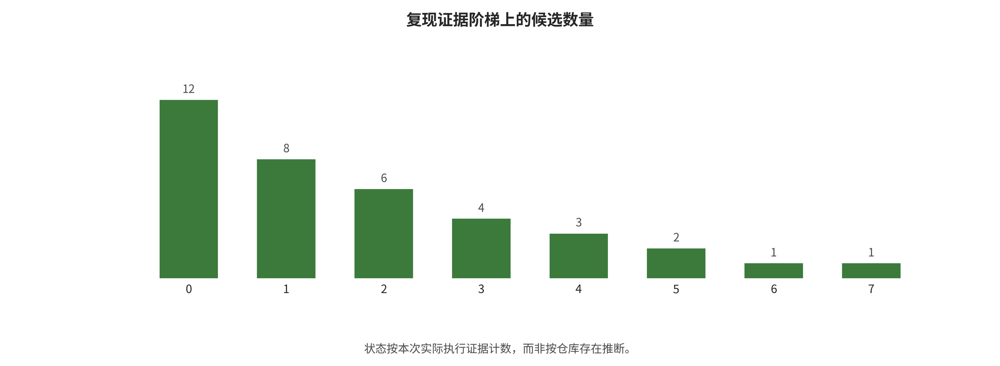

备注。企业官网可以支持“公司如何定位产品”，不能独立支持性能领先；一篇预印本可以支持其试验协议下的作者结果，不能证明商业系统已被攻击；专家博客可以提供论证视角，但不是法规或实验数据。[@york2026safety]

## 代码审计与安全复现状态

复现工作流优先审计 BadWAM、WISER、SafeDreamer、UNISafe 的当前官方仓库，并对 TRAP、PhysCond-WMA、JailWAM、WMAttack 和 SWAAP 进行一手论文/项目入口核对。审计字段包括所有者、仓库 URL、commit、许可证、依赖、入口、配置、权重/数据可得性和实际运行回执。为避免大权重下载和高风险真实设备操作，仅执行安全、低成本的核心子模块或公式/机制代理。

| 状态 | 数量 | 证据边界 |
| --- | --- | --- |
| 机制级部分复现 | 6 | 按实际证据计 |
| 静态审计 | 3 | 按实际证据计 |

*代码审计与复现阶梯，由实际运行清单自动生成。*

本次 END_TO_END=0。状态来自逐命令回执与输出哈希；仓库存在、依赖安装或公式代理都不等于端到端攻击或防御复现。

*实际代码审计与复现状态阶梯。PARTIAL_MECHANISM 只表示代码或公式级机制已在安全玩具输入上运行。*

### 静态审计与机制级输出能证明什么

静态审计能证明官方仓库在某一 commit 下包含什么入口、依赖和配置，并暴露许可证、数据、权重或文档缺口。机制级部分复现能证明某个子模块在构造输入上按预期改变排序、安全边界、残差或动作。它们都不能证明论文数值、数据管线、大模型权重、闭环环境或真实机器人效果已重现。端到端状态要求官方或已验证等价权重、数据、配置、闭环任务、多种子和结果对齐全部通过。

### 安全与可重跑性控制

所有运行均限于本地、隔离的玩具数据或数值公式，不与真实机器人

---

[← 返回目录](index.md)
