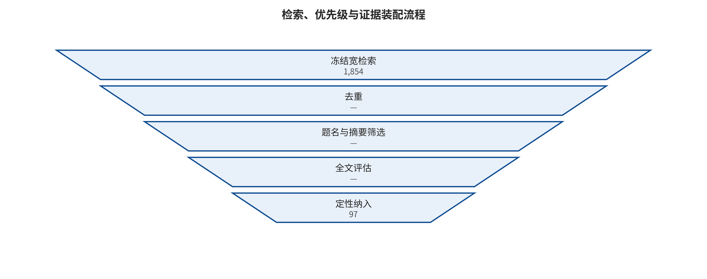

## 语料选择与编码方法

检索前协议于 2026-08-06 冻结，主体时间窗为 2018-01-01 至 2026-08-06，并向前追溯必要奠基工作。本文使用结构化检索、引文追踪、一手公告和本地运行产物，但尚无完整双人全文筛选与偏倚评价，因此准确标签是带结构化检索模块的分类综述，而不是严格系统综述。

研究问题依次询问攻击如何跨越信任边界、不同模态和状态机制如何相互关联、各防御控制具体阻断哪一段、证据何时可比较，以及真实事件和本地机制复现如何约束工程设计。主分析单位是论文级主效应；论文内实验臂、事件与本地运行分别保存，不能混为独立研究。

检索、优先排序与证据组装的可审计流程见图 fig:search-flow。

*候选检索、机器优先排序与人工证据组装流程。OpenAlex 候选尚未形成完整双人全文筛选，因此本文不使用严格系统综述标签。*

### 检索前协议

研究问题、文章骨架、检索式、纳入排除标准、质量等级、数据字段、荟萃与相关性预案在大规模检索前写入研究设计文档。后续若证据推翻早期判断，只在 STAGE_SUMMARY.md 中追加更正，不静默改写过程记录。

### 自动候选检索与人工核验

OpenAlex 管线对 12 个主题分别抓取最多 200 条相关性排序结果，共得到 2,400 条 API 返回，按 OpenAlex ID/DOI 去重为 1,854 条候选。透明关键词规则将其标为 701 条高优先、297 条中优先、856 条低优先；这些标签只用于排序，不能视为最终筛选决定。完整查询、命中量、抓取量和原始响应见 data/openalex/。

第一轮人工证据底表包含 65 篇攻击研究；在已完成的正式版本回填后，当前等级为 A 级 40 篇、C 级 25 篇。该编码仍可能低估已有会议版本，冻结前不把它等同于最终“同行评议/预印本”发表状态。防御与工程表含 62 条来源，A/B/C 级分别为 23/23/16，其中既有论文，也有协议规范、系统文档和安全公告，不能与攻击论文相加为“总论文数”。此外还整理了 33 个论文—模型—攻击配置实验臂、32 条事件/漏洞/受控研究记录，后者 A/B/C 级为 28/3/1，并完成 23 篇代表攻击论文的统一模板解析。

攻击底稿和事件底稿分别见学术攻击面检索与事件及 HF 案例核验。防御证据、最终版本去重和引用核验完成后，正文统计会以冻结主表为准。

### 为什么不能给一个“总体攻破率”

当前 33 个攻击实验臂中，只有 3 行已经从一手页面抽取并核验精确事件数与分母；这不表示其余论文正文一定没有分母，而表示当前底表尚不能据此进行二项合并。更重要的是，三行的样本单位和攻击目标不同。例如，“31/36 个应用可被提示注入”是应用级覆盖率，不是逐提示 ASR；一个模型对 100 个有害请求的违规生成率也不等同于一个 agent 在 100 个企业任务中的真实数据外泄率。其他论文还可能使用关键词匹配、LLM judge、人工评审、目标前缀、工具调用成功或性能下降等不同指标。

本文因此遵守三条规则：只有威胁模型、样本单位和成功定义可映射的研究进入同一荟萃组；摘要只给“超过 90%”时，不将 0.90 伪装为精确点估计，也不反推分母；高异质或分母缺失的研究用证据地图和分层叙述呈现，而不是为了一个总数牺牲可解释性。

这一处理符合 PRISMA 2020 对透明报告的要求，也符合 Cochrane 对异质性、随机效应和预测区间的谨慎解释；两套指南源自医学综述，本文借用其报告与统计原则，并不声称 LLM 安全实验等同于临床试验。PRISMA 2020 [@page2021prisma]；Cochrane Handbook，第 10 章 [@deeks2024cochrane]。

---

[← 返回目录](index.md)
