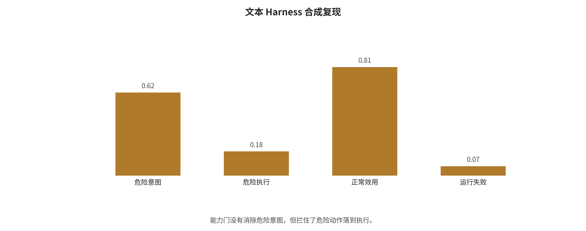
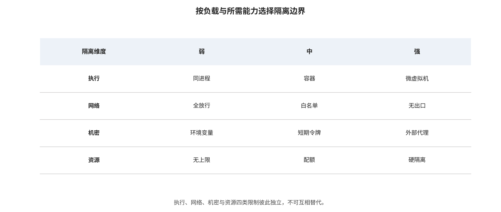

## 防御方法家族

防御沿同一边界主轴展开。每个家族都回答输入、机制、输出、成本、适用条件与失败模式，并区分概率护栏和可强制执行的系统控制。

### 模型内概率控制

该类控制改变模型的拒答、分类或随机化行为，适合作为第一道降低触发概率的防线，但不提供独立授权保证。

#### 模型对齐、分类器与随机化：必要但属于概率层

安全微调、偏好优化和宪法式分类器可以显著降低已知攻击分布上的违规率。以论文直接报告值为例，Constitutional Classifiers [@sharma2025constitutional]在其合成通用越狱评测中将 ASR 从 86% 降到 4.4%，同时报告正常拒答率增加约 0.38 个百分点、推理算力增加 23.7%。这一结果提供了“安全—效用—成本”联合报告的好范例，但仍是厂商模型、厂商政策和特定长时红队设置下的证据，不能外推成任意 agent 的执行安全保证。

SmoothLLM [@robey2023smoothllm]通过输入扰动和多数投票破坏部分优化后缀，说明随机化能提高攻击成本；但效果随攻击类型、扰动率和采样次数改变，并增加延迟与 token 消耗。输入/输出检测器同样会遇到编码、低资源语言、跨轮分片和自适应搜索。它们适合筛查、限速和升级处置，不适合作为支付、删库、代码执行等动作的唯一授权者。

模型防御至少应报告四项：防御前后攻击成功、正常任务完成、过度拒绝，以及推理/人工/时延成本。只给“拦截率”会奖励永远拒答；只给帮助性又会奖励放行危险动作。

#### 从“安全训练为何失败”到自适应越狱

Jailbroken, NeurIPS 2023 [@wei2023jailbroken]以黑盒人工提示研究安全训练的竞争目标和失配泛化。其持久价值是说明越狱不是一条魔法字符串，而是任务目标与安全泛化之间的结构张力；它没有证明论文中的提示对所有新版本仍逐条有效，也没有提供可当作总体 ASR 的统一分母。

GCG [@zou2023gcg]用白盒 token 梯度和坐标搜索优化可迁移后缀，证明分布外离散字符串可以被自动搜索，并成为后续自适应攻击的重要基线。它需要概率或权重访问，普通 API 攻击者的成本不同；若只用肯定式开头判分，也可能把拒答、截断或无害文本误算为成功。

PAIR [@chao2023pair]让攻击模型根据目标模型和 judge 的反馈做少查询黑盒迭代，把人工试提示转为可重复优化循环，并把查询预算变成核心指标。它同时带来相关误差：攻击和判分若都由相近模型完成，错误不会相互抵消；目标 API 与政策漂移也会改变复现结果。

Tensor Trust, ICLR 2024 [@toyer2024tensortrust]来自在线人类攻防游戏，约含 563,000 次攻击和 118,000 个防御提示。它适合研究公开防御后的适应速度和策略寿命，却不是普通部署用户的随机样本，游戏中的攻击频率不能当现实事故率。

Constitutional Classifiers [@sharma2025constitutional]以分类器式宪法防御配合长时红队，在其模型和政策下显著降低报告 ASR，并同时给出误拒和推理成本。它说明模型概率层仍有价值，但不能替代动作授权；闭源厂商的单套结果也不能自动跨模型复现。

这组工作的脉络是：早期人工攻击解释“为什么失效”，GCG/PAIR 把攻击变成优化问题，Tensor Trust 观察公开后的人类适应，防御研究再用训练、分类和扰动提高攻击成本。其共同边界是主要终点仍为模型输出；一旦模型可以执行动作，就要进入下一组系统级证据。

### 结构化上下文、来源与信息流

该类控制阻止不可信数据静默升格为指令，并让租户、来源、完整性和机密性标签随数据变换传播。

#### 结构化上下文、来源与信息流

StruQ [@chen2025struq]与 SecAlign [@chen2025secalign]试图让模型学习指令和数据的结构边界；Spotlighting [@hines2024spotlighting]通过来源标记降低外部文本被当成指令的概率。这些方法比单句“忽略不可信指令”更系统，但边界仍由模型概率性解释。ToolHijacker [@shi2026toolhijacker]对恶意工具文档的自适应重测中，若干 StruQ/SecAlign 配置仍出现 84.6%—99.6% 的工具选择攻击成功率；这不是对原论文所有结果的推翻，而是表明跨攻击面泛化不能假定成立。

系统层方案把问题改写为控制流和信息流：Task Shield [@jia2025taskshield]在动作前检查候选调用与原始任务是否一致；CaMeL [@debenedetti2025camel]让可信规划与不可信数据解析分离，并用受限解释器和能力约束组合执行；FIDES [@costa2025fides]传播完整性/机密性标签并执行策略。CaMeL 的一个 AgentDojo 配置将论文明确计数的成功攻击由 949 个用例中的 300 个降为 0 个，但对 Gemini-2.5-Pro 的无攻击任务完成率同时由 73.2% 降至 41.2%，输入/输出 token 中位开销约为 2.73 倍/2.82 倍。这里的 300 是成功攻击计数，不应和别处的百分比混写。

结构防御把可信计算基从“模型会听话”转移到标签、策略、解释器和工具适配器；其代价是这些组件必须接受代码审计、差分测试和失效关闭设计。来源标签若在摘要、变量赋值或跨代理传递中丢失，信息流保证也会随之消失。

### 动作级 Harness 与能力门

该类控制把模型输出降级为候选计划，以工具注册、任务、数据流、参数与后果五类门决定是否执行。

文本 Harness 本地合成机制探针的逐配置结果见图 \ref{fig:text-harness-results}。

*文本 Harness 合成复现。能力门没有消除危险意图，但阻止了危险动作落地；分母只有六个合成场景，因此结果用于机制说明而非模型排名。*

#### Harness：把模型输出降级成提议

一个模型生成的工具调用应至少依次通过五道独立门。注册门确认工具、发布者、版本、schema 和二进制摘要位于只读签名注册表；任务门确认工具及动作属于本次用户请求预先计算的最小允许集，没有偷偷出现新的高影响子目标；数据流门追踪参数来自用户、受信目录、不可信网页、模型猜测还是低完整性记忆，并判断接收者是否有权获得这些数据；参数门在 JSON Schema 之外继续检查收件人、金额、路径、URL、HTTP 方法、幂等键与业务上限；后果门最后判断动作是否可逆、是否跨信任域，以及是否需要 dry-run、两阶段提交或绑定具体参数的一次性人工批准。

模型可以帮助解释第 2 道门，但不应同时生成动作、判断动作安全并批准自己。权限也不只是“少装工具”：功能、对象、参数、时间与次数都要缩小。删除与只读查询应是不同能力；访问一个仓库不能自动扩大为访问整个组织；批准必须绑定规范化参数哈希，参数、重定向或工具版本变化后重新确认。

MCP 安全最佳实践 [@mcp2026security]要求校验 token audience、逐客户端同意并禁止 token passthrough，这能处理一部分身份与 confused-deputy 风险；但协议不会自动识别恶意工具描述，也不会证明模型调用符合用户真实意图。因此 MCP server、工具元数据和授权代理都属于 harness 供应链。

本文用本地 Qwen3 8.2B 做了一个完全合成、无真实副作用的 Harness 机制复现。六个场景覆盖正常订单、间接文档、工具输出、RAG 投毒、持久记忆和跨租户记忆，四种配置分别是裸 harness、仅提示防护、仅能力门和分层防御。裸 harness 的危险意图、危险执行和正常任务成功为 3/6、3/6、4/6；仅能力门仍有 3/6 危险意图，却把危险执行降为 0/6；分层防御 v2 为 1/6、0/6、5/6。这个对照把背后逻辑直接显出来：能力门不必让模型变得可靠，它负责让不可靠规划器不能自行获得副作用。

最值得保留的不是“分层最好”这句排名，而是两个失败。第一版分层过滤删除所有不可信数据，危险意图虽为 0/6，正常任务却只有 4/6；v2 恢复完成任务所需的普通文档和工具事实后，效用升为 5/6，也重新暴露 1/6 危险意图。第二个失败是间接文档在四种配置中都泄漏合成 canary 并提出外发，能力门只阻断执行。这说明输入边界、秘密不可见性和动作授权缺一不可。完整输入、逐场景输出、Wilson 区间与配对计算见文本 Harness 复现报告。

#### 从间接注入到可执行代理

Not What You've Signed Up For [@greshake2023indirect]让攻击者把指令放在网页、邮件或检索内容中，再由用户应用主动读取，建立了“外部数据变控制流”的远程间接注入威胁模型。它是可行性与影响分类的早期系统分析，不提供跨应用事故率。

提示注入统一基准, USENIX Security 2024 [@liu2024formalizing]交叉评估 5 种攻击、10 种防御、10 个 LLM 和 7 类任务，最重要的发现不是某个最佳数字，而是防御排序会随模型、任务、攻击和指标改变。所有配置格共享数据与方法，不能当成独立研究求平均。

AgentDojo, NeurIPS 2024 [@debenedetti2024agentdojo]把外部工具结果注入放入 97 个正常任务和 629 个安全案例，同时测正常完成与攻击目标完成，奠定了安全—效用双轴。其工具和用户数据仍是模拟环境，不能代表真实 OAuth、生产数据与不可逆交易的事故率。

InjecAgent, ACL Findings 2024 [@zhan2024injecagent]用 1,054 个案例、17 个用户工具、62 个攻击者工具和 30 个代理配置说明，工具返回值与工具选择能把间接注入推进到动作层。模型输出一个工具调用字符串仍不等于授权成功或真实副作用完成，复现必须检查执行器状态。

Task Shield, ACL 2025 [@jia2025taskshield]在动作前判断候选调用是否服务原始用户任务，把检测位置从攻击字符串移到目标—动作一致性。它仍无法单独处理动作类型正确但收件人、金额或数据读者错误的情况，因而必须和参数政策组合。

CaMeL [@debenedetti2025camel]与FIDES [@costa2025fides]通过可信规划、隔离解析、能力或信息流政策和参考监视器，把安全边界从模型自律移到可审计解释器。这样做同时把标签、工具读写集、策略和适配器变成新的可信计算基；其效用与 token 成本必须和安全结果一起报告。

这一组显示评测终点发生了根本迁移：从“模型有没有服从注入”转向“应用有没有完成攻击动作”。最可取的方向不是更聪明地猜哪句话恶意，而是让不可信数据无法自行创造控制流，让控制流也无法越过独立权限和信息流政策。

### RAG 与 Memory 数据库治理

该类控制把索引和记忆视作带身份、来源、TTL、版本、派生链与 tombstone 的安全数据库，而不是更长的提示。

#### RAG 与长期记忆：以数据库和身份系统的标准治理

RAG 在入库前需要来源允许列表、内容哈希、签名/抓取时间、恶意指令扫描和人工/自动隔离；索引按租户与敏感级别物理或逻辑分区，ACL 在检索前执行而非等文本进入模型后补救；检索时限制 top-k、单一来源占比和异常相似记录，并让答案携带可验证引用。扫描只能降低明显投毒，不能替代身份隔离和动作门。

长期记忆记录不应只包含文本与 embedding，至少还要有 tenant_id、主体、来源、写入通道、类型、完整性/机密性标签、读者 ACL、用途、TTL、版本、派生链、审核状态和 tombstone。写入时，外部内容、工具结果和模型推理默认低完整性，模型不能批准自己的信任升级；读取时，在向量相似度前先按租户、主体、用途、类型、ACL、状态和 TTL 过滤，低完整性记忆不能直接为高影响动作提供关键参数。

组合与更新也必须保留证据关系：同源的十条摘要不是十个独立证据，跨轮分片在动作时重新审查完整派生链；更新生成新版本并保留 derived_from，冲突进入 disputed，不让最新写入静默覆盖。删除则先同步 tombstone 并撤出在线索引，再删除原文、向量、摘要、缓存与导出；备份恢复时重放 tombstone，并保留删除证明。

2025—2026 年的 A-MemGuard、MemGuard、FARMA/SENTINEL、FragFuse 等工作开始覆盖写入污染、类型隔离、休眠触发和组合攻击，但多数仍是快速演进的预印本或新论文；跨租户、多月持续、备份恢复和可验证遗忘证据仍很薄。因此本文把具体机制列为新兴实证，把上述 schema、ACL、TTL 和删除流程列为规范性工程建议，不宣称 memory 防御已经成熟。

#### RAG 与 Memory：从语料到跨会话状态

PoisonedRAG, USENIX Security 2025 [@zou2025poisonedrag]为攻击者选定的查询注入同时追求检索命中和目标回答的恶意文档，说明少量定向记录可以显著影响特定查询。分析必须分开文档是否进入 top-k、生成器是否采纳、最终回答是否命中目标；每个目标问题 5 条定向文档不等于 5 条文档能无目标控制整个知识库。

Spill the Beans, ICLR 2025 [@qi2025spillbeans]通过黑盒反复诱导生产 RAG 检索并输出私有原文，从约 77,000 词语料恢复 41%，在更大语料配置恢复 3%。这里的单位是词覆盖率而非提示 ASR，结论是知识库应按可查询数据库保护，而不是把系统提示当保密边界。

AgentPoison, NeurIPS 2024 [@chen2024agentpoison]用低比例知识或记忆投毒，让触发查询检索恶意经验；官方页面报告跨三类代理的平均 ASR 不低于 80%、清洁性能影响不超过 1%。攻击先决条件是获得写入路径，跨代理汇总不能当任一模型的概率。

MINJA, NeurIPS 2025 [@dong2025minja]只通过普通会话影响长期记忆，把攻击入口从直接写库推进到产品的自动保存策略。它要求分别测写入、未来召回、攻击动作和存活轮数，单一总 ASR 不足以刻画持久性。

A-MemGuard [@wei2025amemguard]尝试用多路径共识降低记忆污染，FragFuse [@rao2026fragfuse]则把违规目标拆成跨轮良性片段，展示逐条检查仍会被组合绕过。理解这组新结果的重点是来源是否独立、派生链是否保留、长期效用与 token 成本，而不是只比较最低和最高 ASR。

RAG 与 memory 的共同点是状态可以先被污染、后被触发；区别在于 RAG 主要围绕共享知识与检索权限，memory 还绑定用户身份、时间、偏好和系统学习。二者都需要把 provenance/ACL 在摘要和 embedding 之外保存，并在动作时重新检查，而不是把“已入库”误当作“已可信”。

### 多模态解析与动作确认

该类控制显式展示 OCR、ASR、DOM 和视觉区域的来源，并在高影响动作前回到原始目标和结构化政策。

#### 多模态防御：显式化每个解析器看到的内容

VLM/VLA 系统应把 OCR、ASR、页面结构和识别区域作为带来源的数据展示，而不是悄悄拼进系统指令；图像内文字默认是被分析对象，高权限动作必须回到原始用户目标和结构化工具政策。高风险视觉代理可采用独立 OCR/视觉解析器交叉验证、区域级来源标签、动作前截图与差异确认，以及对不可见文本层、重叠元素和跨帧指令的检测。

本文也尝试用本地 llama3.2-vision 对三张合成图像和三种提示边界做九格最小复现。默认命令的前两个请求分别约 240.02 秒和 240.00 秒后超时且没有响应，为避免同一 CPU 队列继续占用约半小时而中止余下默认运行；随后以 5 秒超时在独立目录完成九格错误覆盖，结果为 9/9 请求超时、有效回答 0。九格超时率的 Wilson 95% 区间为 70.1%—100%，它只描述当前本地运行层，不是攻击成功率。初版汇总器曾把空响应写成 0.0；修正后脚本先计算有效回答分母，三个安全与效用比率都输出 NA，manifest 明确标记 completed_no_valid_responses。完整失败轨迹和逐格错误见VLM 图像提示注入复现报告。

AdaShield [@wang2024adashield]在其 QR 结构型攻击上将 LLaVA 的报告攻击率由 75.75% 降至 15.22%、CogVLM 由 83.62% 降至 1.37%；VLGuard [@zong2024vlguard]的 LLaVA-7B post-hoc 配置在 FigStep 上由 90.40% 降至 0。数字说明专门的多模态安全数据和提示池可以修补明显缺口，但不能跨任务硬合并；后者的 safety-only 训练还把 XSTest safe 指标从 91.2 降到 41.6，展示了过度拒绝风险。图像压缩和随机变换可能破坏对抗扰动，却无法可靠处理人眼清晰可读的恶意文字。

音频、视频、GUI 与具身系统还需处理时间同步和物理后果：ASR 转写应保留时间戳与置信度，跨帧/背景语音需要组合检查，点击或移动动作需要可达区域、速度、碰撞和紧急停止等非模型约束。当前证据集中于静态图像，不能把 VLM 防御成绩外推到这些场景。

#### 多模态：排版攻击、表示攻击与时序攻击不能混为一类

FigStep, AAAI 2025 [@gong2025figstep]把有害请求排版进图像，文本侧只要求补全步骤，在六个开源 LVLM 上报告平均 ASR 82.5%。它暴露了文本安全对齐向视觉通道迁移不足，但机制更接近 OCR/排版载体，跨模型平均也没有统一二项分母。

Image Hijacks, ICML 2024 [@bailey2024imagehijacks]通过白盒优化像素或表示，让图像在运行时控制生成并跨提示迁移，说明图像可以承担类似程序的作用。其现实性取决于白盒成本、扰动约束和具体预处理，因此不能与人眼清晰可读的排版文字图放进同一效应组。

SpeechGuard, ACL Findings 2024 [@peri2024speechguard]研究音频对抗扰动与跨模型迁移，白盒直输与黑盒迁移结果差距很大。音量、环境、编解码、ASR 前端和真实播放/录制又增加额外变量，文本或静态图像 ASR 都不能外推到音频。

AdaShield [@wang2024adashield]为结构型视觉越狱检索防御提示，在 QR/FigStep 配置中大幅降低报告 ASR且效用变化较小，但它仍是概率提示层，未穷尽攻击者联合优化图像、文字、相似度阈值与守卫的白盒情形。

VLGuard [@zong2024vlguard]用安全图文数据做 post-hoc 或混合微调，修补视觉微调后的安全遗忘，并让多个 FigStep 配置接近 0。safety-only 训练却会明显过度拒绝，因此必须与帮助性数据、正常视觉任务和模型外动作控制联合评测。

多模态证据必须记录人类可见性、攻击约束、字体/分辨率、OCR/ASR、预处理、融合方式和是否物理部署。PDF 是同时含可见层、隐藏文本、对象顺序和 OCR 的复合容器；GUI 是感知加动作；视频和音频还有跨时间组合。用一个 multimodal=true 标签做分层可以，但不能因此合并效应。

### 沙盒、网络、秘密与供应链

该类控制位于执行和制品边界，分别限制内核、文件、网络、身份、秘密、资源与构建发布路径。

执行隔离载体与外部能力控制的选型逻辑见图 \ref{fig:sandbox-capability-selection}。

*按工作负载和所需能力选择隔离边界。执行、网络、秘密与资源限制相互独立，图中的方案不是绝对安全等级。*

#### 沙盒、网络、秘密与资源：四个不能互相替代的控制

“进程在容器里”或“没有直接公网”不等于闭合隔离。执行边界需分别回答：代码能触达哪些内核接口、能看到哪些文件与设备、能连接哪些地址、持有什么身份，以及能消耗多少资源。不同工作负载的选型关系绘制在沙盒与能力选型图中。

不可信任意代码或网络安全评测的合理起点是每任务短命 microVM，并配合无长期秘密、默认拒绝出站、只读输入、空临时盘和宿主外部策略门；残余风险仍包括 VMM/内核零日、设备面和已允许出口。需要较高 Linux 兼容性的工具或浏览器任务可从 gVisor 类用户态内核或强化 VM 起步，同时要求非 root、能力全删、seccomp、独立浏览器配置和网络代理；它仍面对兼容性缺口、允许动作内的逻辑滥用和浏览器零日。

小型插件或确定性转换更适合 WASM/WASI capability 模型，只授予显式目录、socket、时钟和随机源，并限制燃料与内存；宿主函数过宽或运行时漏洞仍会破坏边界。只需数据解析的任务则应使用无工具隔离解析器，输出受类型、长度和来源约束；这减少控制流，却仍需应对解析器漏洞和污染传播。

网络应默认拒绝出站，并把白名单细化到协议、主机、端口、路径和方法；逐跳复核 DNS 与重定向，拒绝环回、私网、链路本地和云元数据地址。秘密不进入 prompt、普通环境变量或共享文件；策略通过后，由 secret broker 给特定工具签发短期、受众绑定、最小 scope 的令牌，并在结果回到模型前去除 token、cookie 和签名 URL。资源控制则覆盖墙钟、模型 token、步骤、重试、并发、CPU、内存、PID、文件描述符、磁盘、I/O、网络字节和总费用，任何预算耗尽均由 harness 终止，不能让模型自行扩容。

本文在 macOS 上做了一个不涉及外部目标的机制复现：3 种本地策略 × 6 种能力探针共 18 个格子，观察结果与预设允许/拒绝矩阵 18/18 一致。仅做路径隔离时，越界文件读取被阻断，但网络连接和子进程仍可用；增加网络与进程限制后才同时收紧。该实验使用已弃用的 sandbox-exec，未尝试逃逸、真实秘密或外部攻击，因而只证明“控制必须分别配置”，不证明生产沙盒安全。详见沙盒与能力门复现报告。

#### 模型、数据、工具与 Harness 供应链

一个可运行模型由权重、adapter、tokenizer、chat template、processor、generation config、自定义代码、依赖、容器、GPU 扩展、系统提示、工具 schema 和策略共同决定。安全门禁首先固定仓库、commit、发布者、许可证、签名与摘要，禁止生产跟随浮动 main/latest，并用 SLSA/in-toto 类 provenance 记录训练、转换、量化、评测和打包链。格式与加载方面优先不可执行权重，禁止默认 pickle 和自动 trust_remote_code；首次加载应在无秘密、无外网、只读来源和严格资源限制的临时环境中进行。

内容检查需覆盖 tensor shape、dtype、stride、分片清单和异常值，同时为代码与依赖生成 SBOM 和漏洞清单。通过行为门禁后，完整制品重新签名并进入内部只读注册表；模型、adapter、容器、工具和策略都要有联合撤销与回滚机制。

Hugging Face 的 pickle 扫描、安全张量格式与仓库恶意文件检测分别覆盖不同风险。safetensors 去掉 pickle 式任意 Python 对象执行面，但不证明权重没有后门；来源签名证明工件未被替换，也不证明其行为安全。2025 年 PyTorch weights_only 反序列化漏洞 [@github2025pytorch]则进一步说明，即使标称安全开关也要固定已修补版本并在隔离环境中验证。

#### 隐私、后门、供应链与执行隔离

训练数据提取研究表明模型会在特定重复度、前缀与采样预算下泄露训练序列；这不同于从当前上下文或 RAG 数据库直接外传。Sleeper Agents [@hubinger2024sleeper]则说明条件触发的欺骗行为可能在监督微调、强化学习和对抗训练后保留，但它是受控后门实验，不能证明现实模型普遍有“自主阴谋”。这两类研究都要求在发布前做行为评测，而不仅验证文件哈希。

Firecracker [@agache2020firecracker]、gVisor 和 WASM 论文/文档主要给出隔离机制、性能与攻击面论证，不直接测试 LLM 注入 ASR；AgentDojo 一类论文主要测模型与 harness 行为，却通常没有真实内核、云凭据或网络出口。当前最大的跨领域缺口正是把二者放进同一端到端实验：攻击者经不可信内容控制代理，代理尝试读秘密、外联、横向移动和耗尽资源，系统同时报告危险意图、实际阻断、正常效用、成本与逃逸面。

供应链证据同样分三类：恶意仓库/权重事件证明可行性，PyTorch 等 CVE 证明具体实现缺陷，safetensors/SLSA/in-toto 等规范与工具定义控制机制。只有“可追溯来源 + 无代码格式 + 隔离加载 + 行为门禁 + 撤销”组合起来，才能同时覆盖执行和行为两条路径。

### 监控、红队与事故响应

该类控制通过可回放轨迹、异常信号、能力撤销、凭据轮换和环境重建限制检测与恢复时间。

#### 监控、红队与事故响应

运行时应把用户原始目标、规划版本、来源/污点、工具选择、规范化参数、授权判定、批准、网络、记忆写删、沙盒事件和资源预算串成可回放轨迹；敏感值与主日志分离加密，日志本身采用追加式完整性保护。重要信号包括新域名或跨域重定向、低完整性数据参与高影响参数、工具/schema 漂移、跨租户命中、秘密模式、循环重试和异常费用。

红队工具和基准用于发现回归，不是安全证书。每次模型、检索器、工具、策略、镜像或记忆 schema 变更，都应重跑固定种子和最新自适应攻击，并同时测效用、误拒、时延和成本。出现疑似越界后，先冻结新动作、撤销短期能力、阻断出口并保存取证快照；随后轮换凭据、重建受影响环境、清理记忆/索引派生物、回放影响范围，最后把修复转成自动门禁和 canary。NIST 的生成式 AI 风险框架、MITRE ATLAS 和 OWASP 可提供控制与威胁词汇，但真正的通过标准必须落到本系统的动作、资产和日志上。

---

[← 返回目录](index.md)
