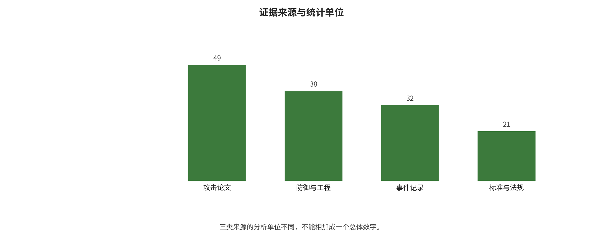
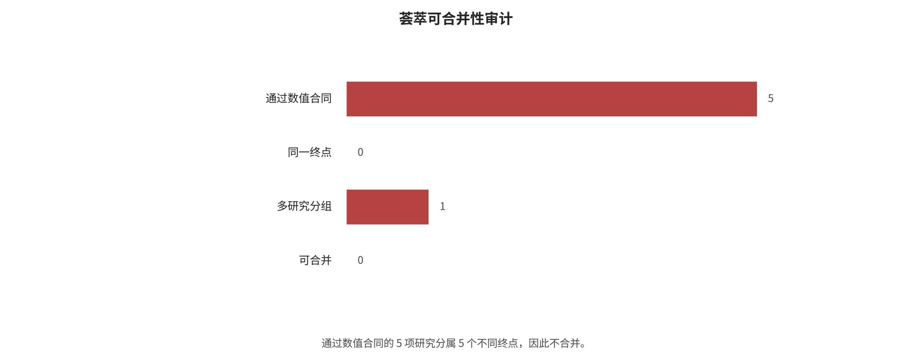

## 数据、指标与评价证据

本章把方法机制与评价合同分开，逐项说明分析单位、事件数与分母、效应方向、异质性、论文内依赖和解释禁区。统计程序已真实运行，但正式荟萃组为零。

### 统一解析模板

本文对锚点论文统一回答八个问题：研究保护什么资产；攻击者是黑盒、灰盒还是白盒；可以写入哪个入口；攻击预算和是否自适应；样本单位和成功定义；主结果与正常效用；能否复现；结论能外推到哪里。下面只保留决定研究脉络的锚点，23 篇攻击论文和 14 组防御/工程锚点的完整逐篇记录分别见攻击面检索与防御工程检索。

### 四个方法拆到输入、状态、输出与判分

案例 A：GCG 为什么能搜索出乱码后缀。 输入是已对齐模型 f_theta、一组有害目标请求、可修改的离散后缀 token 和一个目标开头；内部状态是每个后缀位置对目标损失的梯度。算法不是直接在连续向量上发布答案，而是用梯度为每个位置筛出若干候选 token，再逐个替换并用真实前向损失选择下降最大的候选，循环到预算耗尽。输出是一段后缀；判分通常同时看目标前缀和最终内容。背后逻辑是：安全训练约束了常见语义分布，却没有让所有离散 token 组合都满足同一拒答边界。复现必须冻结 tokenizer、chat template、目标前缀和步数，否则“同名 GCG”并非同一实验；只看肯定式开头会高估有害完成。

**旧稿中的 text 结构表示**
```
请求 u + 可学习后缀 s
v 目标损失 L(ftheta(u||s), target)
对 s 每个位置求梯度，产生 top-k token 候选
v 真实前向逐候选评分
接受最优替换，重复 B 步
v
候选后缀 + 目标模型完整回答 + 独立/人工判分
```

案例 B：CaMeL/FIDES 为什么不是“再加一个守卫模型”。 输入被分为不可变用户目标 U 与不可信外部数据 D。特权规划器只看 U 产生受限计划；无工具解析器把 D 转成类型化值；运行时维护值的来源、完整性、机密性和允许接收者。输出不是模型直接执行的 shell，而是解释器逐条通过能力与信息流政策后的动作。安全性来自“D 不能新建控制流、低完整性或高机密性值不能进入不允许的 sink”，而不是解析模型永远正确。CaMeL 的 Gemini-2.5-Pro 配置中，成功攻击计数 300/949→0/949，但正常任务完成 73.2%→41.2%，输入/输出 token 中位约 2.73×/2.82×；所以结论必须同时包含阻断、效用和成本，不能只写“0 次攻击”。

**旧稿中的 text 结构表示**
```
可信用户目标 U --> 特权规划器 --> 受限计划/能力上限
不可信数据 D --> 无工具解析器 --> 带标签的结构值
两路在参考监视器汇合
v
policy allow / deny / ask / redact
v
工具适配器产生真实副作用
```

案例 C：Memory 攻击为何至少需要三个终点。 AgentPoison 假定攻击者能向知识/记忆库写少量优化记录；MINJA 把入口收窄到普通会话触发自动保存。两者都不是“输入一次即成功”，而是 写入成功 W → 未来召回 R → 危险动作 A。若论文只报最终 ASR，就无法知道防御究竟阻断写入、降低 top-k 命中还是在动作门拒绝。因此更合理的记录是 P(W)、P(R| W)、P(A| R,W)、存活时间、跨租户泄漏和清洁任务变化；端到端风险可概念化为三段条件概率的乘积，但只有同一追踪样本的分阶段计数才允许实际相乘。来源相关的十条记忆也不能当十个独立证据。

案例 D：FigStep/AdaShield 的数字怎样读。 FigStep 把有害文字渲染为图像，外层文本只要求补全步骤；输入经过 resize/视觉编码/跨模态融合，输出由拒答关键词或 LLM judge 判为成功。AdaShield 根据输入相似度检索防御提示并追加到 VLM 上下文，改变模型对图中文字的解释。LLaVA QR 配置 75.75%→15.22% 表示同研究内下降 60.53 个百分点、报告值之比约 0.201；没有精确事件数时不能给标准误。VLGuard 的 FigStep 接近 0 同时不代表效用免费：safety-only 训练把 XSTest safe 从 91.2 降到 41.6。背后逻辑是防御训练覆盖了视觉通道的安全分布，却也可能把正常视觉帮助误学成拒绝；所以要用“有害完成 + 正常回答 + 视觉任务分数”三轴判定。

### 先做证据地图，而不是先找一个平均数

本项目有三种不同统计单位：65 条攻击论文记录、62 条防御/工程来源和 32 条事件/漏洞记录。它们不能相加成“159 篇论文”：防御表含规范与官方文档，事件表的单位也不是论文，且三表之间可能引用同一来源。下图因此分栏报告证据等级、年份和非互斥模态标签。

攻击论文、防御来源与事件记录的异质证据地图见图 fig:evidence-map。



*证据地图。攻击论文、防御与工程来源、事件记录使用不同分析单位，不能相加为单一论文总数。*

自动检索也不等于最终纳入。2,400 条是 12 个 OpenAlex 查询的 API 返回，去重后 1,854 条仍是未筛选候选；701/297/856 只是高/中/低机器优先级，500 条是先读队列。人工底表还来自引文追踪、会议页面、标准、漏洞库与厂商公告。由于尚未完成每条标题、摘要和全文的排除日志，本文不伪造“最终 PRISMA 纳入论文数”。

### 效应纳入规则

每一个可计算效应都先回答五个问题：成功终点是否明确；是否有直接事件数与分母；攻击入口、攻击者知识、模型任务、政策和样本单位能否映射；同一论文是否只贡献一个预声明主臂；独立研究是否至少为三项。任何一步失败就退回描述性综合或单研究展示，不继续套统计公式。完整判断与本次实际流失数量绘制如下。

从 34 项研究到零个正式合并组的可合并性审计见图 fig:meta-composability。



*荟萃可合并性审计。五项数值契约合格研究分别落入五个不同终点，所有组均为单研究，因而正式合并组为零。*

“预先选一个主臂”不是挑效果最好的一行。顺序冻结为正式论文主实验优先、与组定义最匹配的模型和攻击优先、自适应攻击优先于未适应攻击、人工或双重判分优先于单一关键词、直接事件数优先于仅百分比。其余臂留在原始表做敏感性描述，不能伪装成独立论文扩大样本量。

### 攻击成功比例的效应量

若研究 i 在 n_i 个独立样本中观察到 x_i 次成功，则：

$$
p_i=\frac{x_i}{n_i}, y_i=\mathrm{logit}(p_i)=\log\frac{p_i}{1-p_i}, v_i\approx\frac{1}{n_i p_i(1-p_i)}.
$$

选择 logit 而不直接平均百分比有两个原因：变换后的区间不会越过 0—1，且同样相差 5 个百分点在 5% 与 50% 附近的统计含义不同。若 x_i=0 或 x_i=n_i，脚本只在变换阶段使用连续性修正 (x+0.5)/(n+1)，原始记录仍保留真实的 0 或 n。若只有作者报告的比例和明确 n，脚本可以用该比例估计方差，但标记来源为 reported_asr_total，不会把四舍五入百分比反推成“精确事件数”。

手算示例：HOUYI。 应用级样本为 x=31,n=36，点估计 p=31/36=0.861。用 Wilson 95% 区间：

$$
\frac{p+z^2/(2n) +/- z\sqrt{p(1-p)/n+z^2/(4n^2)}}{1+z^2/n}, z=1.96,
$$

得到约 0.713—0.939。这个区间只表达“若把这 36 个应用视作二项样本”的抽样不确定性；它不能修复应用选择、共同后端、版本漂移和披露偏差，所以不能解释为行业 95% 真实范围。这正说明统计区间不能替代威胁模型审查。

### 防御前后效应：风险比而非百分点混合

若防御前后分别为 x_0/n_0 与 x_1/n_1，使用风险比：

$$
RR_i=\frac{x_1/n_1}{x_0/n_0}, y_i=\log(RR_i),
$$

独立二项近似方差为：

$$
v_i\approx \left(\frac{1}{x_1}-\frac{1}{n_1}\right)+ \left(\frac{1}{x_0}-\frac{1}{n_0}\right).
$$

RR<1 表示防御后风险较低。若任一事件数为 0，脚本对两臂事件数各加 0.5、分母各加 1，以避免 log 0；这会让小样本结果强烈依赖修正，所以极端比例必须回看原论文。许多防御是在相同提示上前后配对，理想分析需要配对四格表或 McNemar/条件模型；论文通常不发布配对转移矩阵，当前脚本的独立二项近似会忽略相关性，因此明确标为探索性。

只有百分比时怎样解读。 Constitutional Classifiers 报告 86%→4.4%，可以确定下降 81.6 个百分点、描述性风险比 (4.4/86=0.051)、相对下降约 94.9%；但没有可安全使用的精确分母时，不能计算可信标准误，也不能进入正式合并。AdaShield 的 LLaVA QR 为 75.75%→15.22%，描述性下降 60.53 个百分点、比值约 0.201；这仍只是同一研究配置内比较，不能与前者平均。

### 随机效应与 Paule–Mandel 异质性

即使研究被判为可比，也不假设存在一个完全相同的真实效应。模型为：

$$
y_i\in \mathrm{Normal}(\theta_i,v_i), \theta_i\in \mathrm{Normal}(\mu,\tau^2),
$$

其中 v_i 是研究内方差，tau^2 是研究间异质性。权重为：

$$
w_i=\frac{1}{v_i+\tau^2}, \hat\mu=\frac{\sum_i w_i y_i}{\sum_i w_i}, SE(\hat\mu)=\sqrt{\frac{1}{\sum_i w_i}}.
$$

脚本使用 Paule–Mandel 方法寻找 tau^2，使加权残差 Q(tau^2) 接近自由度 k-1。同时报告：

$$
I^2=\max\left(0,\frac{Q-(k-1)}{Q}\right),
$$

均值 95% 区间 mu-hat+/-1.96SE，以及更适合部署判断的 95% 预测区间：

$$
\hat\mu+/-1.96\sqrt{\tau^2+SE^2}.
$$

最后，攻击比例用 logistic 变回 0—1，风险比用指数变回 RR。均值区间回答“平均真实效应可能在哪”，预测区间回答“一项新研究的真实效应可能在哪”；当预测区间跨过无效线，平均值再漂亮也不应宣称新部署一定有效。k<5 时 tau^2 与预测区间很不稳定，正文会标为低确定性；默认 k<3 完全不合并。

### 具体实现与可复核输出

实现位于 analysis/meta_analysis.py。脚本会：拒绝 include_meta=false；验证 0 <= events <= total；拒绝缺失数值；拒绝同一 study_id 在同组出现多个臂；拒绝混合效应类型；按 analysis_group 输出纳入、拒绝、汇总表、manifest 与 SVG 森林图。原始百分比不会被静默填零，未知值一律 NA。

正式运行结果以 data/quantitative_effects.csv 的逐行纳入审计和 analysis/outputs/meta/ 为准。若严格审计后没有任何组达到三个独立可比研究，结论将是“当前证据不支持正式合并”，而不是降低阈值凑出一个数字；单研究内的风险下降、效用损失和 token/时延成本仍做描述性综合。

### 实际审计与运行结果：零个可合并组

统一表将原始 74 个论文内实验臂去重为 34 项独立研究，每项只保留一个预声明主效应。严格禁止从四舍五入百分比反推事件数后，29 项只能做描述性解释，5 项具有直接事件数与分母，但五项分别属于五个不同终点。

HOUYI 在 36 个应用中判定 31 个易受黑盒应用提示注入，点估计 86.1%，Wilson 95% 区间为 71.3%—93.9%。AgentFuzz 在 20 个代理应用中发现 14 个 taint 风格高风险漏洞，点估计 70.0%，Wilson 区间为 48.1%—85.5%。AgentDoS 在 20 个应用中发现 16 个资源耗尽/管理漏洞，点估计 80.0%，Wilson 区间为 58.4%—91.9%。三者的样本单位虽然都叫“应用”，漏洞族、扫描器、抽样框和成功定义不同，不能平均成应用总体易感率。

防御侧，CaMeL 的选中 Gemini-2.5-Pro 臂将成功攻击计数从 300/949 降为 0/949，但正常任务效用同时从 73.2% 降到 41.2%；FIDES 的 GPT-4o 原始计数从 9/949 降为 1/949，但作者按策略违规口径又会重新解释事件。二者虽共用 949 个 AgentDojo 攻击机会，模型、基线、策略和事件口径不同，也不能合并风险比。

实际脚本结果为：数值契约通过 5 项，因 include_meta=false 拒绝 29 项，成功合并 0 组；五个组均因 k=1 小于预设阈值 3 而跳过，没有生成森林图、合并值、I² 或 tau²。这个结果不是“分析没做完”，而是可合并性审计的实质发现：当前公开报告方式不足以回答平均 ASR 或平均防御风险比。完整逐项理由见纳入排除审计和机器输出。

### 为什么先按论文聚合

一篇论文常在 5 个模型 × 10 个攻击 × 3 个防御上产生 150 个格子。这些格子共享数据、提示、作者选择和 judge，不是 150 个独立研究。若直接相关，会让网格大的论文获得不成比例的权重并产生极小的伪 p 值。因此脚本先按 study_id 聚合；二元编码的论文内均值解释为该论文已编码实验臂的覆盖比例，连续变量取已报告臂均值。主分析单位始终是论文。

候选变量包括年份、ASR、自适应攻击、多模态、agentic、独立防御层数、残余 ASR、效用变化、证据等级和是否独立复现。缺失值按变量对删除，不填 0；每对至少需要 8 篇研究且两个变量都必须有变化。

### Spearman、bootstrap 与置换检验

Spearman 相关先把 X,Y 分别转换成秩，再计算秩的 Pearson 相关：

$$
\rho_s=\mathrm{corr}(R_X,R_Y).
$$

无并列秩时它等价于 1-6sum d_i^2/[n(n^2-1)]；实际数据有大量 0/1 并列，脚本为并列值赋平均秩并直接计算秩相关。选择 Spearman 是因为 ASR、年份和层数不满足正态/线性假设，且极端值很多；它只测单调关系，不证明因果。

不确定性用两条路线相互校验。论文级 bootstrap 有放回抽取 n 篇论文 2,000 次，每次重算 rho，取 2.5% 与 97.5% 分位数为区间。置换检验固定 X，随机打乱论文间的 Y 2,000 次，双侧 p=(b+1)/(B+1)，其中 b 是 |rho_perm|>=|rho_obs| 的次数。

随机种子固定为 20260806，保证重复运行一致。置换 p 未做多重比较校正，只用于发现后续假设；区间若很宽或跨 0，正确结论是方向不稳定。

### 预先提出的机制假设

第一项假设是自适应攻击与残余 ASR 正相关，因为攻击者知道防御后可以重新优化；但更成熟论文也更可能主动做自适应测试，证据质量构成混杂。第二项假设是独立防御层数与残余 ASR 负相关，因为模型层失效后权限、信息流和沙盒仍可阻断；但高风险系统可能因面对更强攻击而部署更多层，存在反向因果。

第三项假设是防御强度与正常效用变化存在权衡，因为拒答、隔离解析、重复推理和人工确认会降低任务完成或增加成本，且“层数”不代表每层质量。第四项假设认为多模态与攻击成功率关系不稳定，因为图像排版、白盒扰动、音频直输和 GUI 动作的差异远大于一个二元标签。最后预期年份与自动化或 agentic 编码正相关，但这更可能反映研究议题迁移、模型与基准变化，而非年份本身导致风险。

### 解释禁区

相关系数不能回答“增加一层防御会使 ASR 下降多少”，也不能从论文选择样本估计现实事故率。论文级均值会掩盖内部异质性，成对删除在缺失非随机时会改变方向；闭源模型版本、攻击预算、judge 与发表偏倚都可能共同影响 X 和 Y。若有效样本不足，脚本不输出该变量对；若输出，也只作为后续分层实验的线索，不作为因果结论。

### 实际相关结果：主要反映研究版图迁移

34 项独立研究上共有 20 个变量对达到 n>=8。最清晰的观察是年份与 agentic 编码正相关，Spearman rho=0.532，bootstrap 95% 区间 0.277—0.748，置换 p=0.0010。正确解释是本证据表中较新的研究更常评测工具代理，这与 2023 年后研究从聊天输出转向动作系统的脉络一致；它不表示年份导致安全风险，也不表示现实部署中的 agent 数量按该系数增长。

自适应攻击与残余 ASR 的结果为 n=9、rho=0.274，区间 -0.143—0.839、置换 p=0.667。方向符合“知道防御后更易绕过”的机制假设，但区间极宽，当前数据没有稳健证据。ASR 与多模态的结果为 n=19、rho=0.295，区间 -0.166—0.648、p=0.227，不能声称多模态天然更易攻击。年份与 ASR 为 n=19、rho=-0.279，区间 -0.588—0.125、p=0.241，也没有单调趋势证据。

ASR 与证据等级为 n=19、rho=-0.438；bootstrap 区间 -0.761—-0.020 看似不跨零，但置换 p=0.0615，两种不确定性判断不一致，而且等级只是离散来源标记，因此不作结论。多模态与 agentic 的 rho=-0.352 主要反映当前论文被分成“VLM 输出”与“文本工具代理”两条研究传统，置换 p=0.082，不能解释为两种技术天然互斥。

统一表没有足够可审计的 defense_layers 编码，选中主效应也都没有同口径独立复现，因此没有凭主观印象制造“层数—效果”或“复现—效果”相关。相关结果更像研究议题地图，而不是因果模型。完整 20 对结果见相关分析报告。

研究级 Spearman、bootstrap 与置换检验的探索性结果见图 fig:correlation-results。


*研究级探索性相关。区间与置换检验用于描述样本文献版图，不支持部署因果推断。*

可复核实现见 analysis/correlation_analysis.py，正式输出位于 analysis/outputs/correlation/，包括逐对 n、rho、bootstrap 区间、置换 p 与运行 manifest。

---

[← 返回目录](index.md)
