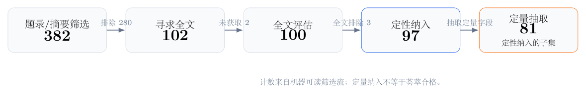
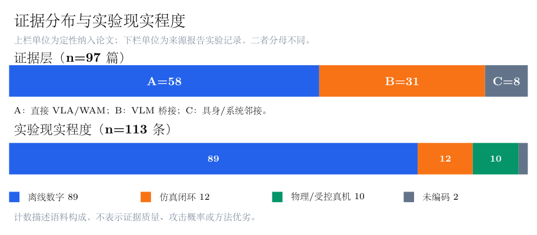
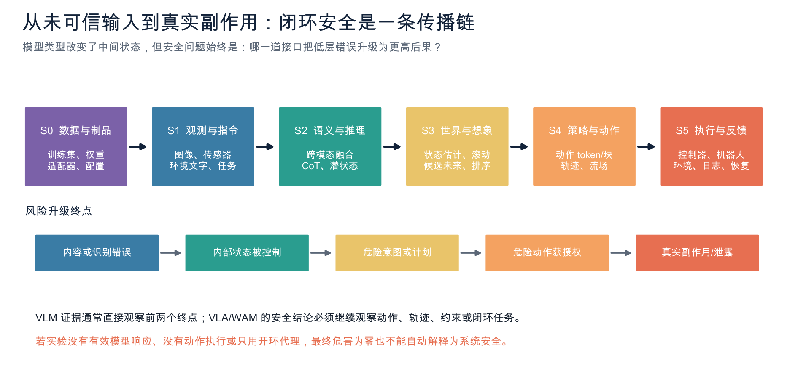
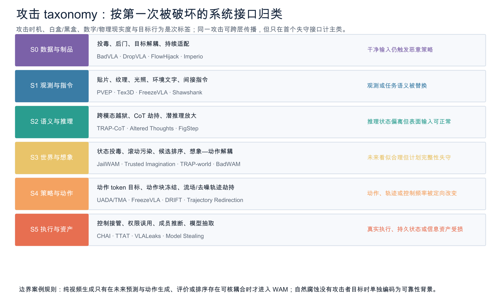
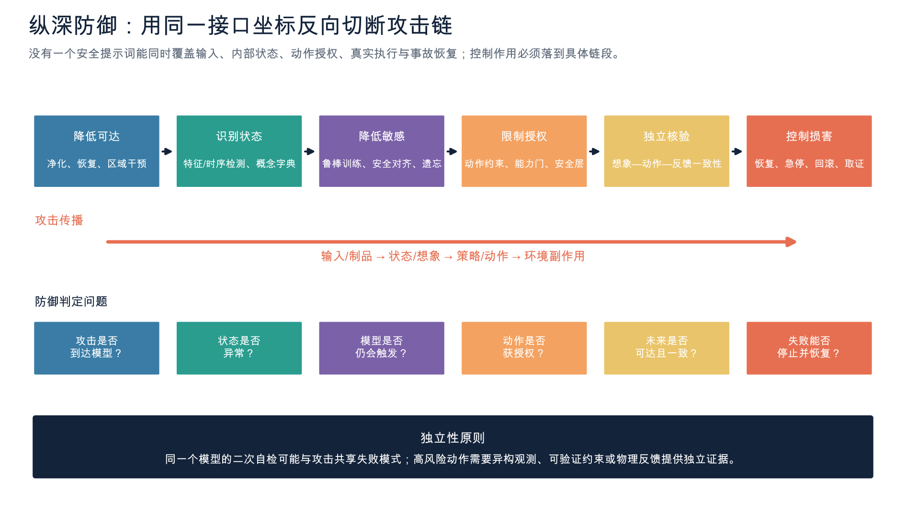
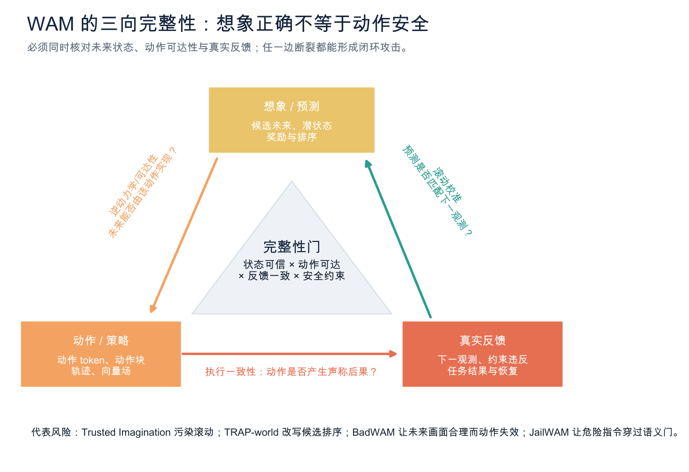
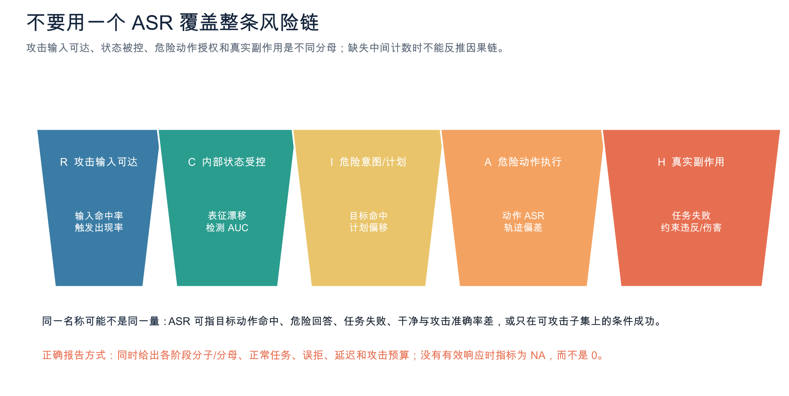
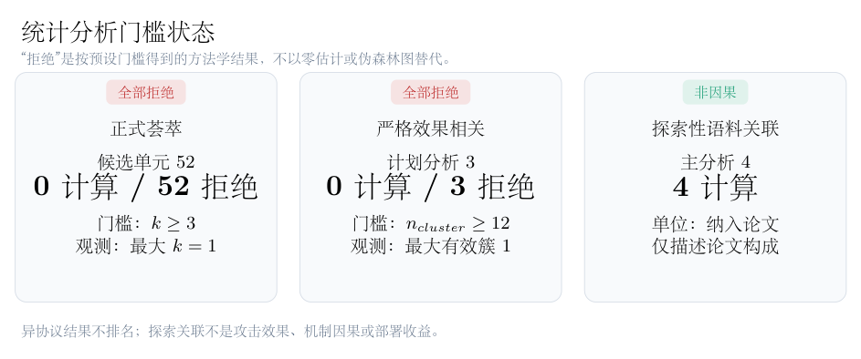
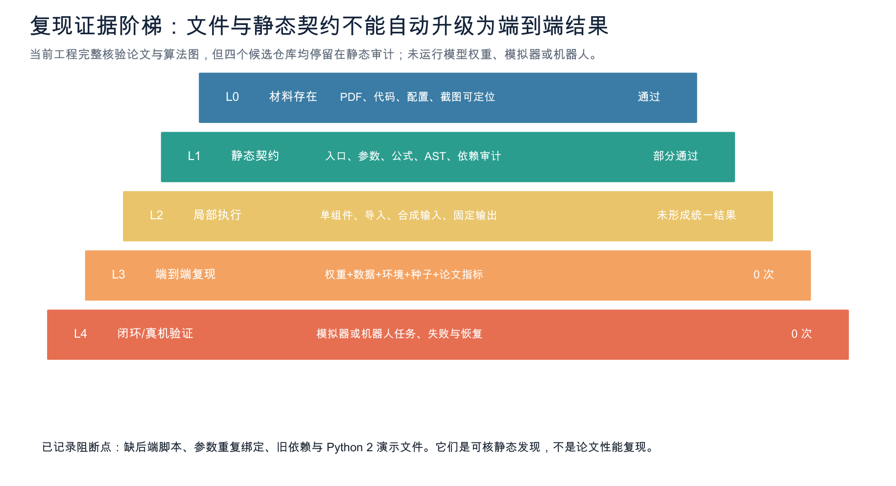

<!-- toc:start -->
## 目录

  - [Abstract](#abstract)
  - [引言：安全问题为何从“看错”升级为“做错”](#引言安全问题为何从看错升级为做错)
  - [语料、检索与证据合同](#语料检索与证据合同)
  - [从回答安全到行动安全：技术脉络与系统合同](#从回答安全到行动安全技术脉络与系统合同)
  - [闭环攻击 taxonomy：第一次被破坏的系统接口](#闭环攻击-taxonomy第一次被破坏的系统接口)
  - [攻击如何从输入传播到物理后果](#攻击如何从输入传播到物理后果)
  - [与攻击链镜像的纵深防御](#与攻击链镜像的纵深防御)
  - [跨家族综合：什么时候选哪一层控制](#跨家族综合什么时候选哪一层控制)
  - [数据、指标与定量证据边界](#数据指标与定量证据边界)
  - [复现审计与锚点案例](#复现审计与锚点案例)
  - [研究议程、实践门禁与局限](#研究议程实践门禁与局限)
  - [结论](#结论)
- [附录：截止后更新（2026-08-06 → 2026-09-26）](#附录截止后更新2026-08-06-→-2026-09-26)
  - [A.1　人形机器人出现可远程利用的 root 级漏洞](#a1　人形机器人出现可远程利用的-root-级漏洞)
  - [A.2　截止后新增的具身攻击论文](#a2　截止后新增的具身攻击论文)
  - [A.3　OpenAI—Hugging Face 事件的制度后果](#a3　openaihugging-face-事件的制度后果)
  - [A.4　如何使用本附录](#a4　如何使用本附录)
<!-- toc:end -->
## Abstract

视觉—语言模型的图像劫持、跨模态注入、后门和隐私风险，在连接动作头、世界滚动与控制器后，可能从错误回答升级为动作冻结、轨迹重定向、约束违反或信息泄露。本文以2026年8月6日为检索截止日，审计382条筛选记录，定性纳入97篇、定量抽取81篇，并将具身安全定义为未可信状态沿感知、语义、世界状态、策略、执行与反馈传播时，系统在真实副作用前撤销动作权力的能力。我们按第一次被破坏的合同建立训练制品、观测、跨模态推理、世界想象、动作解码、执行反馈六接口主轴，并用同一坐标组织镜像纵深防御。20条可统一为任务成功率绝对下降的记录中位数为63.6个百分点，但52个候选荟萃单元和3项严格相关均因独立性、方差或协议门槛被拒绝；4项探索关联仅描述语料构成。四个代码仓库只完成静态合同审计，端到端运行数为0。本文据此不提供跨协议攻击排名，而给出具体算法、传播链、证据边界、条件化防御组合、最低验证合同，并以独立补充册保留97篇逐篇解析与核心原图。

\definecolor{VWBlue}{HTML}{12355B}
\definecolor{VWCyan}{HTML}{1B7895}
\definecolor{VWGray}{HTML}{5C6670}
\linespread{1.12}
\fancyhf{}
\fancyhead[L]{\color{VWGray}从“看错”到“做错”}
\fancyhead[R]{\color{VWGray}VLM、VLA 与 WAM 闭环安全}
\fancyfoot[C]{\thepage}
\renewcommand{\headrulewidth}{0.3pt}

{\color{VWGray}**证据化分类综述 · 通用可编译草稿**}$$2pt]
{ 检索冻结：2026-08-06；97 篇定性纳入；统计合并按预设门槛拒绝；端到端复现数为 0}

## 引言：安全问题为何从“看错”升级为“做错”

一张对抗贴片、一段环境文字或一条被污染的示范，在普通视觉—语言模型中可能只改变回答；在具身系统中，同一输入会被写入状态、计划、动作块、候选未来和执行反馈。真正需要解释的问题因此不是模型是否偶尔犯错，而是未可信输入何时取得了改变物理世界的权力，以及系统能否在真实副作用前撤销这种权力。 [@B003; @B004; @A001; @A036]

已有 VLM 安全研究擅长解释跨模态表征、视觉越狱、投毒和隐私，却通常止于文本、检索或嵌入；VLA 研究把终点推进到动作 token、动作块和闭环任务；WAM 又把预测未来、逆动力学或候选排序接入决策。若三者按模型名称分别综述，就会把上游机制与下游后果割裂，也会把看似合理的世界预测误当成安全动作的证据。 [@B001; @B005; @A003; @A029; @A036]

本文围绕四个研究问题组织全文。第一，VLM、VLA 与 WAM 的安全终点怎样逐级升级？第二，攻击在哪个接口首次破坏合同，又怎样传播到动作授权与真实反馈？第三，防御在哪一层减少可达、检测异常、撤销授权、限制执行或恢复系统？第四，异构论文的数字、代码和物理实验究竟允许多强的跨研究结论？

本文的贡献不是再造一组攻击名称，而是建立六接口唯一主轴、同坐标镜像防御、指标断层与统计拒绝合同、四仓库静态复现边界，以及独立的《97 篇逐篇算法与核心原图图谱》。主稿负责机制和决策；图谱负责逐篇算法、实例、公式、证据边界与原文截图。

## 语料、检索与证据合同

检索协议冻结于 2026 年 8 月 6 日，覆盖数据库建库起至冻结日。四条宽查询分别围绕 VLA 攻防、WAM/​世界模型安全、VLM 上游攻击面和具身系统安全展开，再以核心论文双向追踪、作者/​方法名补检和 CVF、ACM、OpenReview、项目页及官方仓库核验补齐。本次重构继承该冻结语料，不为追求篇幅重新改变检索分母。

可复跑查询一（VLA 攻击）为：all:"vision-language-action" AND (all:attack OR all:adversarial OR all:backdoor OR all:jailbreak OR all:poison OR all:hijack OR all:freeze OR all:privacy OR all:security)。

可复跑查询二（VLA 防御）为：all:"vision-language-action" AND (all:defense OR all:safeguard OR all:detect OR all:monitor OR all:shield OR all:verification OR all:"safe")。

可复跑查询三（WAM 安全）为：all:"world action model" AND (all:security OR all:safety OR all:attack OR all:adversarial OR all:backdoor OR all:jailbreak OR all:integrity OR all:defense OR all:robustness)。

可复跑查询四（具身系统安全）为：all:"embodied AI" AND (all:security OR all:attack OR all:adversarial OR all:backdoor OR all:jailbreak OR all:poison OR all:hijack OR all:defense)。四式经 arXiv API 按提交日期倒序、每式最多 300 条抓取；随后按 arXiv 标识去重，并以题名—作者—稳定标识与补检来源再次消歧。达到连续补检不再产生满足纳入标准的新研究后停止。

筛选台账含 382 条规范化记录：题录或摘要排除 280 条，寻求全文 102 篇，2 篇未取得，全文评估 100 篇，全文排除 3 篇，最终 97 篇进入定性综合、81 篇进入定量抽取。原始查询、筛选理由、PDF、文本抽取、论文卡、散列和版本状态均保留在项目资产中。

*检索、筛选与纳入流程；计数来自冻结的机器可读筛选记录。*

A 层是直接观察 VLA/​WAM 动作、轨迹或闭环结果的 58 篇证据。它们允许在原模型、任务、预算与现实等级内讨论动作或任务后果，但仍不能把仿真结果写成开放环境事故率。 [@A001; @A002; @A003; @A004; @A005; @A006; @A007; @A008; @A009; @A010; @A011; @A012; @A013; @A014; @A015; @A016; @A017; @A018; @A019; @A020; @A021; @A022; @A023; @A024; @A025; @A026; @A027; @A028; @A029; @A030; @A031; @A032; @A033; @A034; @A035; @A036; @A037; @A038; @A039; @A040; @A041; @A042; @A043; @A044; @A045; @A046; @A047; @A048; @A049; @A050; @A051; @A052; @A053; @A054; @A055; @A056; @A057; @A058]

B 层是 31 篇 VLM 桥接证据，覆盖共享视觉编码器、跨模态融合、越狱、投毒、隐私与防御。它们允许说明上游机制和可迁移假设，没有动作耦合时不得把原 ASR 改写为机器人失败率。 [@B001; @B002; @B003; @B004; @B005; @B006; @B007; @B008; @B009; @B010; @B011; @B012; @B013; @B014; @B015; @B016; @B017; @B018; @B019; @B020; @B021; @B022; @B023; @B024; @B025; @B026; @B027; @B028; @B029; @B030; @B031]

C 层是 8 篇具身代理、ROS、传统感知—规划—控制或世界模型邻接证据。它们用来补足环境文字、结构化命令、系统接口和反馈接管，但不冒充端到端 VLA/​WAM 的直接效果。 [@C001; @C002; @C003; @C004; @C005; @C006; @C007; @C008]

每篇论文卡统一记录身份、任务、输入输出、首次破坏接口、攻击权限、算法步骤、公式或伪代码、数据、指标、预算、作者结果、失败条件、代码和复现状态。数字按论文—实验—效果三级保存；同论文、多任务、多预算以及共享作者、检查点、数据和攻击生成流程均由依赖簇去重审计。

证据许可规则先于写作。只有可定位的一手全文支持算法细节；只有带分母、方向、方差或缺失原因的效果记录进入定量描述；只有相同终点、预算、方差与独立研究簇同时满足门槛才允许合并；代码接口、损失和参数能被静态读到，只能支持静态合同发现。

筛选和编码使用模型辅助与独立复核，但现有记录不足以声称符合特定医学式系统综述的双人全流程规范。因此本文主类型是带系统化检索、范围制图、描述性定量与静态复现副模块的证据分层分类综述，而非系统综述、统一 benchmark 或 meta-analysis。

*纳入研究的证据层、年份与对象分布；分母为 97 篇定性纳入论文。*

本章输出的是两个可审计对象：一套固定的 97 篇语料，以及“证据层—可观察终点—允许措辞”合同。下一章不再讨论论文数量，而要给出所有研究共享的系统接口和后果定义。

## 从回答安全到行动安全：技术脉络与系统合同

把 VLM、VLA 和 WAM 放进同一系统合同，是避免越级推断的前提。设时刻 t 的观测为 o_​t，语言目标为 l，本体状态为 q_​t，历史与外部上下文为 h_​t。VLM 的原生输出是语义表征或生成内容；此时安全终点主要是内容违规、表征受控、隐私泄露或错误事实。 [@B003; @B004; @B015; @B016]

$$
z_t=f_{\mathrm{VLM}}(o_t,l,h_t), y_t\approx p_{\theta}(y;z_t)

$$

VLA 进一步把观测、语言和本体状态映射为离散动作 token、连续控制、末端位姿、轨迹或长度 K 的动作块。一旦这些输出被控制器消费，安全终点就从“模型说了什么”升级为“什么动作被授权”。 [@A001; @A003; @A006; @A021]

$$
a_{t:t+K-1}=\pi_{\theta}(o_t,l,q_t,h_t)

$$

动作错误不能只按 token 距离解释。机械臂的平移、旋转和夹爪，导航的航点与速度，驾驶的轨迹与低层控制使用不同坐标系、归一化、控制频率和执行方式；只有在反标记、坐标与时间合同一致时，动作偏差才具有物理意义。 [@A003; @A006; @A056]

WAM 的必要条件是未来视觉或潜状态明确参与动作生成、候选动作评价、逆动力学或规划排序。纯视频生成不自动进入核心范围。WAM 新增的资产不是“画面是否好看”，而是未来状态完整性、动力学可达性、候选排序完整性以及想象—动作同步。 [@A026; @A029; @A033; @A036; @A058]

$$
\hat z^{(j)}_{t+1:t+M}=W_{\phi}(o_t,a^{(j)}), j^*=\operatorname{argmax}_j R(\hat z^{(j)},a^{(j)})

$$
[@A029; @A033]

$$
a_{t:t+K-1}=D_{\psi}(o_t,l,\hat z_{t+1:t+M})

$$
[@A036; @A058]

系统最终还包含动作反归一化、轨迹插值、碰撞检查、消息队列、低层控制器、执行器和反馈。模型输出只是建议；真实副作用只有在建议通过授权门、被控制器执行且环境状态发生变化后才成立。 [@C003; @C004; @C005; @C007]

*从 VLM 语义、VLA 动作授权到 WAM 想象—动作耦合与真实执行的端到端系统合同。*

本文固定五类不可互换的观察终点：内容违规；表征、推理或世界状态受控；危险意图形成；危险动作获得输出或授权；真实环境副作用或信息泄露发生。上游终点可以提示风险链已启动，但不能替代下游终点。

NIST AI 100-2 E2025 提供生命周期、攻击者能力、知识与规避/​投毒/​隐私等上位术语；本文在此基础上增加动作块长度、控制频率、现实等级、世界滚动、动作授权与恢复状态。通用 AML 分类不能单独证明物理后果。 [@NISTAML2025]

技术脉络——2022—2023：VLM上游攻击面成形。早期工作主要攻击对比表征、视觉软提示、OCR文字和跨模态上下文，终点是检索退化、有害回答或命令劫持；同时出现黑盒查询驱动的模型抽取。它们建立了视觉载荷能够越过文本安全边界的机制，但尚未观察低层动作或闭环副作用，因此只构成VLA的上游桥接证据。 算法目标的变化是：目标由分类/​检索损失扩展为视觉嵌入对齐、生成目标串似然和跨模态提示控制。 证据边界为：B层结果不能按原ASR直接改写为机器人任务失败率。 [@B001; @B003; @B004; @B006; @B017]

技术脉络——2024：从‘看错’进入直接VLA动作失效。直接VLA研究开始把受扰图像传入动作模型，并以任务失败、动作差异和闭环轨迹为终点。关键方法学进步是把自然模糊或亮度变化与具有攻击者目标、知识和预算的对抗扰动分开，并把离散动作token反标记为物理位移后再定义攻击目标。 算法目标的变化是：从视觉表征偏移转为七自由度动作偏差、目标动作交叉熵和任务级闭环失败。 证据边界为：主要证据仍来自LIBERO、SimplerEnv等受控环境，不能外推开放现实事故率。 [@A001; @A003]

技术脉络——2025：定向动作、提示冻结、供应链后门与物理传感器并行。攻击不再只追求任意失败，而是分别瞄准目标动作、动作冻结、恶意轨迹、触发式后门和传感器失效。供应链研究开始同时优化干净能力与触发行为；物理研究把固定贴片、激光、投影、电磁或超声信号送入真实传感链；语言攻击则把稀有动作token当成可达控制目标。 算法目标的变化是：出现目标解耦训练、最小最大提示不变攻击、通用转移贴片和Real-Sim-Real传感器建模。 证据边界为：不同论文的ASR分别代表冻结、目标轨迹、归一化失败或任务下降，不能合并成一种效果。 [@A005; @A006; @A009; @A011; @A012; @A013; @A016]

技术脉络——2026上半年：攻击进入状态、推理中间态、动作块和生成动力学。新的攻击面位于一次前向调用内部或跨调用历史中：初始本体状态可成为触发器，动作块内的小偏移会开环累积，CoT可被定向改写，流匹配早期速度场可放大后门或输入补丁，近良性提示还可通过on-policy闭环搜索把终态重定向。 算法目标的变化是：目标由单步输出扩展为状态触发优化、平滑长时漂移、CoT—动作联合损失、时间条件向量场损失和DAgger式状态聚合。 证据边界为：这些攻击所需权限从数据投毒到白盒梯度、环境查询不等，‘长时有效’不等于低成本或开放世界可实施。 [@A020; @A021; @A024; @A027; @A049; @A056]

技术脉络——2026：WAM使‘未来状态是否可信’成为独立安全问题。WAM把预测未来用于动作生成、动作评价或候选排序后，攻击可分别劫持危险指令、污染合成数据、扭曲未来潜变量、翻转高分候选排序，或保持想象外观合理而让动作分支出错。由此形成比VLM/​VLA多一层的攻击面：一个自洽的未来并不构成动作安全的独立证据。 算法目标的变化是：出现未来潜变量PGD/​SPSA、tail-aware候选排序损失、世界模型供应链污染和黑盒想象—动作解耦零阶搜索。 证据边界为：核心证据集中在仿真和少数WAM结构；A033单一MPC任务每条件仅20回合，不能形成通用WAM脆弱性定律。 [@A026; @A029; @A032; @A033; @A036]

技术脉络——2026年中后期：物理环境、自适应闭环与信息资产分叉。一条路线把攻击变量外移到三维纹理、机械臂视觉自定位、环境光照与在线补丁词表，使攻击者可以依反馈持续接管；另一条路线不追求动作错误，而从动作序列、token概率或跨模态注意力中推断训练成员。完整性、可用性与机密性由此必须分开报告。 算法目标的变化是：出现phantom embodiment、黑盒灯光贝叶斯优化、在线动作原语切换和轨迹/​注意力成员推断。 证据边界为：物理试验通常任务少且环境受控；隐私AUC受轨迹相关性、随机切分和白盒权限影响，不是个体隐私损失的直接量。 [@A044; @A047; @A048; @A050; @A052; @C007]

这条谱系表明，模型能力每扩展一层，旧攻击面并未消失，而是获得新的消费端。VLM 的视觉软提示可以被 VLA 动作头消费；VLA 的动作块可被时间积分放大；WAM 的未来状态还可被规划器当作评分依据。安全分析必须沿消费者继续追踪，而不能在模型边界停止。 [@B003; @A021; @A033; @A036]

本章由此输出端到端输入—状态—动作—执行—反馈合同。下一章的分类问题可以被严格化为：攻击的优化目标第一次让哪一个接口不变量失效？

## 闭环攻击 taxonomy：第一次被破坏的系统接口

主轴只回答一个问题：攻击目标第一次直接破坏哪个系统合同。六个接口依次是训练数据与模型制品、观测与环境指令、跨模态语义与推理、世界状态与想象滚动、策略与动作解码、执行反馈与信息资产。分类按优化变量而不是攻击载体或论文自称判定。

*六接口攻击 taxonomy：主类按第一次被破坏的合同判定，传播终点与权限仅作次标签。*

每篇论文只占一个主类；若攻击继续向后传播，则以 propagates-to 标签记录。物理贴片若只使视觉特征漂移归观测接口；同一贴片若显式改写 CoT 归语义推理接口；若直接优化第一步流速度场则归动作解码接口。载体不会替代优化目标。

训练时机、白盒/​黑盒知识、数字或物理现实度、目标、持续时间、证据层和最终后果均为次标签。隐私、模型抽取、拒绝服务、目标动作和真实损害是资产或终点，不另建与接口并列的主轴；预防、检测、抑制、恢复与保证是防御动作，也不与攻击接口并列。

自然腐蚀、自然上下文变化和非恶意故障只有在不存在攻击者目标与预算时进入可靠性背景。它们可帮助发现脆弱特征和恢复能力，但不能与知道模型、预算和防线的自适应攻击合并。纯视频世界模型只有在未来被动作生成、评价或排序消费时才进入 WAM 核心。 [@A002; @A007; @A010; @A058]

对 97 篇冻结语料的主类复算要求覆盖率为 100%，同时公开边界理由；该覆盖只证明分类能组织当前语料，不证明六类天然互斥、覆盖未来所有攻击或构成唯一安全本体。分类的价值在于让攻击与防御共享可重复坐标。

### I1 训练数据与模型制品

每条示范、动作标签、状态、数据贡献者、适配器、连接器、检查点和训练目标必须具有可验证来源与版本；干净行为和触发行为不得在未披露条件下分叉；下游微调不能被默认视为能够清除未知后门；动作窗口与流时间上的标签必须保持物理、语义和时间一致。 [@A005; @A011; @A012; @A020; @A021; @A022; @A027; @A032; @A051]

判定规则：只要攻击首先需要改写训练样本、动作标签、损失、可训练模块、适配器或预分发模型制品，即归I1；触发器部署时出现在图像、文本或状态中，不改变其供应链主类。 [@A005; @A011; @A012; @A020; @A021; @A022; @A027; @A032; @A051]

### I2 观测与环境指令

进入策略的图像、语音、状态观测和场景文字必须具有来源、时间戳、完整性、物理合理性与任务相关性；传感器前端和图像恢复不能删除颜色、接触点、障碍边缘或机械臂位姿等控制必需信息；环境文字只能被视为观测内容，不能自动继承用户命令权限。 [@A003; @A013; @A016; @A017; @A044; @A048; @A052; @C001; @C005; @C007]

判定规则：若优化目标首先破坏传感值、视觉特征、对象/​机械臂定位或环境输入真实性，归I2；若物理载体只是用来定向改写CoT或流速度场，则分别归I3或I5并在I2保留载体次标签。 [@A003; @A013; @A016; @A017; @A044; @A048; @A052; @C001; @C005; @C007]

### I3 跨模态语义与推理

系统必须区分授权用户指令、环境文字、工具返回和模型自生成推理的来源与权限；语义等价提示不应改变安全状态；CoT中的实体、空间关系和目标绑定必须与可信观测一致；未经独立验证的推理文本不得直接获得动作授权。 [@A006; @A009; @A015; @A024; @A041; @A042; @A043; @A045; @A049; @B003; @B004; @B006; @C001; @C002]

判定规则：若攻击显式优化动作提示、语义等价性、CoT token、实体绑定或命令保持约束，归I3，即使载体是一张视觉贴片；单纯改变传感内容而不指定语义或推理目标仍归I2。 [@A006; @A009; @A015; @A024; @A041; @A042; @A043; @A045; @A049; @B003; @B004; @B006; @C001; @C002]

### I4 世界状态与想象滚动

当前状态和历史必须完整、可追溯；未来潜变量或视频应对动作条件、动力学和不确定性校准；候选轨迹价值排序不得被小输入变化任意翻转；声称的未来必须由所选动作可达，且下一真实观测应独立校验预测。一个模型不能仅凭自身想象批准自身高风险动作。 [@A026; @A029; @A032; @A033; @A036; @C008]

判定规则：只有未来状态、潜变量、世界模型生成数据、候选排序或想象—动作同步是直接优化目标时归I4；纯视频生成没有动作消费者时只作世界模型邻接证据。 [@A026; @A029; @A032; @A033; @A036; @C008]

### I5 策略与动作解码

动作token必须无歧义地映射到物理单位、坐标系和夹爪状态；动作块应在风险增长前重新观测；流匹配或扩散生成的每个关键时间步应受稳定性与幅值约束；最终轨迹必须满足可达、速度、加速度、接触、碰撞和授权集合，且高风险动作不能只凭模型概率获得执行权。 [@A003; @A006; @A012; @A021; @A027; @A049; @A056; @C004; @C007]

判定规则：攻击的直接目标若是动作token、动作块连续性、流/​扩散速度场、轨迹终态或控制原语，归I5；触发的物理载体与训练入口作为次标签。若攻击依赖改训练数据，I1仍是主类，I5只描述传播。 [@A003; @A006; @A012; @A021; @A027; @A049; @A056; @C004; @C007]

### I6 执行反馈与信息资产

执行反馈必须具有新鲜度、顺序、来源、完整性和回放保护；策略查询、动作概率、注意力、轨迹日志和训练示范遵循最小披露；模型与适配器访问应可审计、限速和隔离；安全日志必须保留但不能反向泄露敏感场景。信息泄露与物理完整性失败使用不同终点。 [@A047; @A049; @A050; @B016; @B017; @C007]

判定规则：若攻击首先利用动作输出、token概率、注意力、轨迹或API反馈推断训练成员、窃取模型或迭代增强攻击，归I6。只用真实下一观测闭环控制攻击而未破坏反馈合同的案例，主类仍保留在I2/​I3/​I5，并在I6标记‘反馈利用’而非‘反馈篡改’。 [@A047; @A049; @A050; @B016; @B017; @C007]

## 攻击如何从输入传播到物理后果

本章在每个接口重复同一合同：先说明被破坏的不变量，再给攻击者权限和核心优化对象，然后用锚点案例追踪状态如何进入后续接口，最后限定可观察终点与失败条件。论文名不再充当目录；同一论文跨接口出现时只算一次证据。

### I1 训练数据与模型制品：合同、算法与传播

本接口的安全合同是：每条示范、动作标签、状态、数据贡献者、适配器、连接器、检查点和训练目标必须具有可验证来源与版本；干净行为和触发行为不得在未披露条件下分叉；下游微调不能被默认视为能够清除未知后门；动作窗口与流时间上的标签必须保持物理、语义和时间一致。

主类判定采用第一次破坏规则：只要攻击首先需要改写训练样本、动作标签、损失、可训练模块、适配器或预分发模型制品，即归I1；触发器部署时出现在图像、文本或状态中，不改变其供应链主类。 [@A005; @A011; @A012; @A020; @A021; @A022; @A027; @A032; @A051]

攻击权限并非一个白盒/​黑盒二分。弱权限：只能向公开微调数据加入少量episode或演示，不能控制最终架构与训练过程（A011、A051）；中权限：可修改视觉、文字和动作标签并利用动作窗口重叠，但沿用标准行为克隆损失（A012、A021）；强权限：可控制训练目标、冻结模块、微调开放权重或选择稳定模块植入后门（A005、A022、A027）；世界模型供应商权限：可提供视觉上近似安全但语义或动作条件被污染的视频，影响后续合成数据与策略训练（A032）。 [@A011; @A051; @A012; @A021; @A005; @A022; @A027; @A032]

算法族“触发—目标轨迹配对”直接优化被破坏的合同变量。保持原语言任务或干净样本分布，将物理对象、文本词或状态触发与攻击者轨迹配对；GoBA用三级终点区分原任务失败、尝试攻击目标和完整完成攻击目标，DropVLA则确保所有重叠动作窗口中的夹爪标签一致。 其目标函数或伪代码可概括为：GoBA要求 E[1(F(V,​L)≠A)]≤σ 且 E[1(F(V⊕τ,​L)=​A_​adv)]≥γ；DropVLA执行‘定位关键时刻→连续L步翻转夹爪标签→同步所有重叠窗口→混入标准微调’。 [@A011; @A012; @A051]

算法族“目标解耦与模块持久化”直接优化被破坏的合同变量。BadVLA先把干净感知特征锚定到参考模型，同时把触发特征推离干净子空间；再冻结已植入触发的感知模块，只用干净数据训练骨干和动作头。INFUSE按参数漂移、Fisher漂移和CKA激活漂移挑选下游微调中最稳定的模块植入。 其目标函数或伪代码可概括为：L_​trig=​N^(-1)Σ|​|​fθ(x)-f_​ref(x)|​|​²-αN^(-1)Σ|​|​fθ(T(x,​δ))-fθ(x)|​|​²；第二阶段冻结感知模块并最小化干净动作负对数似然。 [@A005; @A022]

算法族“时间动力学后门”直接优化被破坏的合同变量。SilentDrift让每步偏移保持C²连续，再利用动作块开环积分产生厘米级near-miss；FlowHijack只在小流时间注入恶意速度方向，并用Dynamics Mimicry匹配正常向量场模长。 其目标函数或伪代码可概括为：SilentDrift取S(τ)=​6τ⁵-15τ⁴+​10τ³并令u_​poison=​u_​clean+​αdS；FlowHijack以(1-α-β)L_​FM+​αL_​BD+​βL_​mimic联合训练，其中L_​BD只覆盖τ≤τ0。 [@A021; @A027]

算法族“世界模型训练链污染”直接优化被破坏的合同变量。VPH让安全视频在安全提示条件下的语义编码靠近危险提示；VTH让非目标动作条件的编码异常而保持目标动作附近预测正常，再用污染世界模型合成数据训练下游策略。 其目标函数或伪代码可概括为：VPH最小化D(Sθ(xδ,​t_​safe),​Sθ(xδ,​t_​danger))并约束LAB感知距离；VTH按‘选目标动作→非目标编码离群/​塌缩→目标条件保真→合成数据→训练策略’执行。 [@A032]

下式给出本接口的一项代表性、可定位算法目标；它不是跨论文统一损失。 [@A005]

$$
\mathcal L_{\mathrm{trig}}=\frac1N\sum_i\|f_\theta(x_i)-f_{\mathrm{ref}}(x_i)\|_2^2-\frac{\alpha}{N}\sum_i\|f_\theta(T(x_i,\delta))-f_\theta(x_i)\|_2^2

$$
[@A005]

锚点案例 BadVLA 用来说明这一机制：两阶段目标解耦解释了为何可以同时保持干净特征并制造动作头未见的触发表示。 作者报告的具体例子为：OpenVLA/​LIBERO以积木、杯子或棍状物触发；作者报告代表平均ASR 98.8%、干净成功率95.9%，相对基线干净代价约0.8个百分点。 证据上限是：攻击者可改训练目标并冻结模块，权限强于只投少量数据；ASR定义不能与目标动作命中率横比。 [@A005]

锚点案例 DropVLA 用来说明这一机制：攻击关键不是新损失，而是让触发后的连续夹爪标签在所有滑动动作窗口中一致，避免训练信号相互抵消。 作者报告的具体例子为：Text+​Vision触发在0.31% episode投毒时，作者报告ASR 98.17±2.75%，每套件200次、三个随机种子。 证据上限是：目标限于夹爪释放，依赖关键时刻知识；不能外推任意七维轨迹劫持。 [@A012]

锚点案例 FlowHijack 用来说明这一机制：在生成动作ODE的早期时间窗植入方向错误，并保持速度场模长近似正常，直接攻击生成动力学而非最终token。 作者报告的具体例子为：π0/​LIBERO-Goal场景触发下作者报告100% ASR和94.9%干净成功率；0.1米目标位置过滤把ASR降至17.8%但未清零。 证据上限是：需要白盒微调；100%来自10个LIBERO-Goal任务，真机没有聚合ASR。 [@A027]

从局部破坏到后续后果的传播顺序为：恶意记录、损失或模块进入训练供应链 → 参数形成只在特定对象、文本、状态或流时间出现的隐藏分支 → 触发条件使动作token、夹爪标签、动作块或速度场偏离 → 块内积分、ODE积分或下游控制器把局部偏差展开为终态失败 → 最终表现为冻结、掉落、near-miss、目标轨迹或拒绝服务；若只是世界模型合成链概念验证，则停在策略偏置而不声称VLA物理后果。 [@A005; @A011; @A012; @A020; @A021; @A022; @A027; @A032; @A051]

综合边界：A005/​A011/​A012/​A021/​A027提供A层闭环或动作证据；A032明确没有完成Cosmos视频→逆动力学→真实VLA训练的端到端链。低投毒比例不是跨论文可比较的强度量，因为样本重复、训练轮数、触发语义和目标复杂度均不同。 [@A005; @A011; @A012; @A020; @A021; @A022; @A027; @A032; @A051]

### I2 观测与环境指令：合同、算法与传播

本接口的安全合同是：进入策略的图像、语音、状态观测和场景文字必须具有来源、时间戳、完整性、物理合理性与任务相关性；传感器前端和图像恢复不能删除颜色、接触点、障碍边缘或机械臂位姿等控制必需信息；环境文字只能被视为观测内容，不能自动继承用户命令权限。

主类判定采用第一次破坏规则：若优化目标首先破坏传感值、视觉特征、对象/​机械臂定位或环境输入真实性，归I2；若物理载体只是用来定向改写CoT或流速度场，则分别归I3或I5并在I2保留载体次标签。 [@A003; @A013; @A016; @A017; @A044; @A048; @A052; @C001; @C005; @C007]

攻击权限并非一个白盒/​黑盒二分。白盒数字扰动：读取VLA梯度、动作离散化器或视觉编码器，并在每个控制步修改像素或局部区域（A003、A017）；代理白盒、受害黑盒：在开放代理上训练一张经几何变换的通用贴片，再迁移到未知动作头（A016、A048）；物理通道：用激光、投影、电磁、超声、聚光灯、打印纹理或场景物体改变传感器输入（A013、A044、A052）；闭环操作者：预先训练方向补丁库，运行时根据新观测切换补丁原语（C007，C层动作策略邻接）。 [@A003; @A017; @A016; @A048; @A013; @A044; @A052; @C007]

算法族“动作感知的像素与贴片优化”直接优化被破坏的合同变量。不再只最大化视觉嵌入距离，而是把动作token反标记为物理值，分别追求非定向七维偏差、位置偏差或指定动作；随机平移、旋转和错切提高跨帧稳定性。 其目标函数或伪代码可概括为：UADA以y_​soft=​Σ_​bF(x+​δ)_​b y_​b恢复动作物理值，再最大化与对抗目标的平方偏差；TMA对指定七维动作最小化交叉熵。 [@A003; @A008; @A017]

算法族“共享表征与本体视觉劫持”直接优化被破坏的合同变量。UPA-RFAS在代理上联合最大化特征偏移、排斥式对比损失、贴片注意力和任务语义错配；VLA-Hijack进一步抑制真实机械臂特征，并把补丁拉向robot/​arm/​end-effector文本锚点和机械臂视觉原型。 其目标函数或伪代码可概括为：贴片输入为x =​ (1-M_​T)⊙x+​M_​T⊙R(δ;​T)；UPA-RFAS优化|​|​f(x )-f(x)|​|​₁+​λ_​conL_​con+​L_​PAD+​L_​PSM。 [@A016; @A048]

算法族“物理传感链与环境参数搜索”直接优化被破坏的合同变量。Phantom Menace把光学、电磁、超声与音频攻击参数化后做Real-Sim-Real；FLARE把色相、饱和度、亮度、强度、高度和截光角作为黑盒变量，用轨迹与失败联合分数搜索固定聚光灯。 其目标函数或伪代码可概括为：传感器观测写为I_​attacked=​F(L_​ambient+​L_​malicious)；FLARE最大化J=​N^(-1)Σ_​i[S^(-1)Σ_​t|​|​P_​t-P'_​t|​|​₂+​λ₁|​|​P_​T-P'_​T|​|​₂+​λ₂I_​f]。 [@A013; @A052]

算法族“环境文字与视觉命令载荷”直接优化被破坏的合同变量。攻击者搜索文字语义与字色，把局部标识放入场景，使具身VLM或语义地图把未授权环境内容当作目标命令或对象标签。 其目标函数或伪代码可概括为：CHAI最大化Σ_​i1[f(p,​g(I_​i;​π))=​y_​i^t]，且g只在遮罩区域渲染；排字机器人先取全局最高CLIP相似框，只有其分数超过阈值才覆盖唯一对象标签。 [@C001; @C005]

下式给出本接口的一项代表性、可定位算法目标；它不是跨论文统一损失。 [@A016]

$$
\tilde x=(1-M_T)\cdot x+M_T\cdot R(\delta;T), \|\delta\|\le\epsilon

$$
[@A016]

锚点案例 Phantom Menace 用来说明这一机制：将八种物理传感通道从设备记录映射到仿真，再回到Franka验证，展示安全边界位于相机/​麦克风前端而不只是模型像素输入。 作者报告的具体例子为：OpenVLA-Spatial的LIBERO干净TSR为84.7%，强激光致盲后为0%；真机激光条件下四模型均为0/​10。 证据上限是：真机每条件10次，模拟叠加不能覆盖材料反射、自动曝光和硬件差异；不跨传感器压成平均效果。 [@A013]

锚点案例 UPA-RFAS 用来说明这一机制：用VLA特有的特征、注意力和语义错配联合目标，在代理上硬化一张可随机变换的通用贴片。 作者报告的具体例子为：从OpenVLA-7B代理严格黑盒迁移到OpenVLA-OFT-W的物理设置，作者报告成功率由98.25%降至5.75%，每套件100次。 证据上限是：共享低维子空间只在受测模型族得到支持，对π0转移较弱；代理数据、打印尺寸和视角仍是隐含知识。 [@A016]

锚点案例 FLARE 用来说明这一机制：只搜索外部灯光而不读模型，并把轨迹偏差、终点偏差和失败联合为昂贵黑盒rollout目标。 作者报告的具体例子为：SmolVLA在三个LIBERO套件的干净成功率分别为83.0%、89.4%、58.4%，优化灯光后均为0%；三套件共1500次。 证据上限是：尚未测试动态闪烁、多光源或开放环境；轨迹偏差不是碰撞率。 [@A052]

从局部破坏到后续后果的传播顺序为：攻击者改变像素、光场、声场、场景纹理、机械臂视觉原型或环境文字 → 视觉编码器、对象检测、跨模态注意力或本体视觉定位被偏置 → 错误对象、位姿或视觉token进入策略与动作生成器 → 重复帧与动作块使偏置在闭环中持续 → 终点为任务失败、目标轨迹、冻结、误抓或传感拒绝服务；B/​​C层若只测回答或高层命令则不宣称低层VLA动作后果。 [@A003; @A013; @A016; @A017; @A044; @A048; @A052; @C001; @C005; @C007]

综合边界：本接口包含最强的直接VLA物理证据，但真机多是少对象、固定相机和几十至几百回合。自然模糊、背景变化和普通噪声只有在无攻击者目标时属于可靠性压力测试，不贡献恶意攻击ASR。 [@A003; @A013; @A016; @A017; @A044; @A048; @A052; @C001; @C005; @C007]

### I3 跨模态语义与推理：合同、算法与传播

本接口的安全合同是：系统必须区分授权用户指令、环境文字、工具返回和模型自生成推理的来源与权限；语义等价提示不应改变安全状态；CoT中的实体、空间关系和目标绑定必须与可信观测一致；未经独立验证的推理文本不得直接获得动作授权。

主类判定采用第一次破坏规则：若攻击显式优化动作提示、语义等价性、CoT token、实体绑定或命令保持约束，归I3，即使载体是一张视觉贴片；单纯改变传感内容而不指定语义或推理目标仍归I2。 [@A006; @A009; @A015; @A024; @A041; @A042; @A043; @A045; @A049; @B003; @B004; @B006; @C001; @C002]

攻击权限并非一个白盒/​黑盒二分。白盒提示攻击者可读语言骨干梯度并替换后缀token，以目标动作token为监督（A006）；提示未知攻击者可同时优化图像和最难语义等价提示，使冻结行为跨措辞保持（A009）；CoT攻击者可读取模型梯度并放置经物理标定的打印贴片，或能在运行时拦截和改写中间推理（A024、A042）；查询攻击者可访问冻结VLA和环境rollout，通过近良性字符编辑与on-policy状态聚合搜索终态重定向（A049）。 [@A006; @A009; @A024; @A042; @A049]

算法族“动作token导向的离散提示搜索”直接优化被破坏的合同变量。把连续七维动作离散为稀有词token，逐坐标计算候选后缀梯度并贪心替换；持续版本在多帧或增广图像上累加同一目标动作损失。 其目标函数或伪代码可概括为：最小化ℓ=​-log P(target action|​x_​1:n,​z)，持续版本最小化Σ_​jℓ(x_​1:n;​z_​j)。 [@A006]

算法族“跨提示冻结的最小最大攻击”直接优化被破坏的合同变量。内层寻找冻结概率最低的语义等价提示，外层聚合这些困难提示的图像梯度，使停止/​EOS token在未知用户措辞下仍被触发。 其目标函数或伪代码可概括为：解min_​(|​|​x'-x|​|​∞≤ε) max_​(p*∈Syn(p)) L(F(x',​p*),​<freeze>)，并对全部困难提示梯度做投影符号更新。 [@A009]

算法族“CoT与动作联合劫持”直接优化被破坏的合同变量。TRAP-CoT同时对齐目标推理token和目标动作，并加入内容特征与总变差使贴片可打印；Altered Thoughts则固定图像、指令和模型，只替换CoT实体或句法以诊断动作头因果依赖。 其目标函数或伪代码可概括为：TRAP最小化E[L_​cot+​λ₁L_​action+​λ₂L_​content+​λ₃L_​tv]；诊断式变换写为c=​f_​r(o,​l)，a'=​f_​a(o,​l,​φ(c))。 [@A024; @A042]

算法族“命令保持的闭环终态重定向”直接优化被破坏的合同变量。用良性与目标指令形成两个冻结教师，按接近目标动作、远离良性动作和文本改动小排序候选；真实rollout产生的新状态再加入数据，反复做DAgger式on-policy搜索，最后删除多余字符。 其目标函数或伪代码可概括为：ℓ_​rank=​max(0,​d_​target-d_​benign+​μ)；闭环分数同时奖励目标终态、惩罚良性终态、动作距离和文本编辑成本。 [@A049]

下式给出本接口的一项代表性、可定位算法目标；它不是跨论文统一损失。 [@A009]

$$
\min_{\|\tilde x-x\|_\infty\le\epsilon} \max_{p'\in\operatorname{Syn}(p)}\mathcal L\left(F_\theta(\tilde x,p'),y^{*}\right)

$$
[@A009]

锚点案例 FreezeVLA 用来说明这一机制：以提示集合内最难冻结的措辞作为内层对手，避免只对单一文字模板过拟合。 作者报告的具体例子为：OpenVLA/​LIBERO提示变体上作者报告代表ASR 95.4%，图像预算示例为4/​255。 证据上限是：需白盒梯度，停止token随tokenizer变化；论文为预印本且撤稿状态需做敏感性标注。 [@A009]

锚点案例 TRAP-CoT 用来说明这一机制：联合攻击‘模型说自己计划什么’与‘模型真正执行什么’，因此能直接观察推理命中和物理行为命中的断层。 作者报告的具体例子为：良性‘拿苹果’被目标化为‘抓刀并递给用户’；无遮挡打印贴片真机中目标推理命中13/​15，但完整恶意行为仅5/​15。 证据上限是：15次真机、白盒和物理标定权限很强；推理命中不得写成完整行为ASR。 [@A024]

锚点案例 Trajectory-Level Redirection 用来说明这一机制：把提示攻击从首步动作误导提升为终态谓词，并在攻击自己访问到的状态分布上优化。 作者报告的具体例子为：在条件化可攻击子集上，π0.5近良性提示重定向ASR为97.5%，中位仅2.6个字符编辑；‘stove’改为‘staove’可把碗导向未写出的盘子目标。 证据上限是：结果条件于良性任务和目标任务均可完成；搜索需要大量环境查询。静态审计发现公开提交缺两个必需后端，未完成端到端复现。 [@A049]

从局部破坏到后续后果的传播顺序为：后缀、环境文字、视觉语义载荷或中间CoT进入共享上下文 → 来源权限被抹平，实体、目标、空间关系或停止语义被替换 → 动作头把受污染推理转换为token、动作块或目标轨迹 → 闭环重规划重复消费同一语义或在新状态上继续被攻击 → 终点从单步目标动作、冻结升级为完整终态重定向；是否产生真实副作用必须由rollout或真机终点另行确认。 [@A006; @A009; @A015; @A024; @A041; @A042; @A043; @A045; @A049; @B003; @B004; @B006; @C001; @C002]

综合边界：A006证明动作空间短期可达，不是长时接管；A024直接展示CoT命中不等于行为命中；A049提供闭环终态证据但分母经可攻击性条件化。环境越狱B/​C层只支持语义入口机制，不能沿用文本ASR作为低层动作ASR。 [@A006; @A009; @A015; @A024; @A041; @A042; @A043; @A045; @A049; @B003; @B004; @B006; @C001; @C002]

### I4 世界状态与想象滚动：合同、算法与传播

本接口的安全合同是：当前状态和历史必须完整、可追溯；未来潜变量或视频应对动作条件、动力学和不确定性校准；候选轨迹价值排序不得被小输入变化任意翻转；声称的未来必须由所选动作可达，且下一真实观测应独立校验预测。一个模型不能仅凭自身想象批准自身高风险动作。

主类判定采用第一次破坏规则：只有未来状态、潜变量、世界模型生成数据、候选排序或想象—动作同步是直接优化目标时归I4；纯视频生成没有动作消费者时只作世界模型邻接证据。 [@A026; @A029; @A032; @A033; @A036; @C008]

攻击权限并非一个白盒/​黑盒二分。语言查询攻击者生成危险指令候选，并用开环动作与未来想象筛选后再送入闭环（A026）；白盒或SPSA攻击者只改当前观测，在像素预算内使未来潜变量偏离或靠近目标未来（A033）；白盒规划攻击者覆盖固定贴片，专门压低干净条件下最关键的高分候选尾部（A029）；黑盒查询攻击者观察动作，增强设定还观察想象，但不读权重或梯度；每次重规划重新搜索扰动（A036）；恶意数据供应商污染世界模型训练视频，再让可信开发者用其合成策略数据（A032）。 [@A026; @A033; @A029; @A036; @A032]

算法族“危险语义到WAM闭环”直接优化被破坏的合同变量。LLM生成危险指令池；WAM输出动作与未来；VTM把相对动作积成三维路径并投影；轻量VLM风险器筛选，最终用RoboTwin闭环和人工复核确认振荡、越界或碰撞。 其目标函数或伪代码可概括为：l*=​argmax_​(l∈L_​adv)R(V(M(x_​t,​l)))；P=​P0+​Σ_​iF(ΔA_​i)，再将P与xy/​xz投影渲染为风险图。 [@A026]

算法族“想象完整性攻击”直接优化被破坏的合同变量。缓存干净未来潜变量，非定向目标最大化余弦距离，定向目标最小化到目标潜变量的距离；白盒用PGD，梯度不可用时用SPSA。 其目标函数或伪代码可概括为：迭代‘生成受攻击想象→计算1-cos(z_​adv,​z_​clean)或|​|​z_​adv-z_​tgt|​|​²→梯度/​SPSA→投影预算球→保留最佳扰动’。 [@A033]

算法族“候选尾部排序攻击”直接优化被破坏的合同变量。只选择干净规划中决策关键的top-quantile分数，压低这些候选而不浪费预算改变低价值轨迹；softmin聚焦最难压低候选，sign和magnitude门限制方向与幅度。 其目标函数或伪代码可概括为：ΔJ=​J_​trig-J_​clean；L_​tail对tail mask内ΔJ聚合后跨候选取softmin，总目标再加L_​sign、L_​mag、TV和L2。 [@A029]

算法族“想象保持、动作偏离的解耦攻击”直接优化被破坏的合同变量。定义动作偏差D_​act和想象漂移D_​img；动作-only最大化D_​act，隐蔽版本最大化D_​act-λD_​img。黑盒以正负随机方向查询估计梯度，并在每个replanning时刻重新求扰动。 其目标函数或伪代码可概括为：ĝ=​m^(-1)Σ_​i[J(δ+​cu_​i)-J(δ-cu_​i)]u_​i/​(2c)，δ←Π(δ+​ηĝ)；隐蔽目标J=​D_​act-λD_​img。 [@A036]

下式给出本接口的一项代表性、可定位算法目标；它不是跨论文统一损失。 [@A036]

$$
\hat g=\frac1m\sum_{i=1}^{m}\frac{J(\delta+cu_i)-J(\delta-cu_i)}{2c}u_i, J=D_{\mathrm{act}}-\lambda D_{\mathrm{img}}

$$
[@A036]

锚点案例 Attacking the Trusted Imagination 用来说明这一机制：同一想象攻击在反应式消费者与MPC消费者上产生不同后果，直接说明风险取决于谁把预测当作oracle。 作者报告的具体例子为：LaDi-WM的单一MPC任务每条件20次：干净11/​20、随机扰动14/​20、ε=​0.01攻击1/​20；反应式策略聚合成功率仅由97.8%到96.6%。 证据上限是：单任务、小样本且随机基线高于干净；只能证明存在性和消费者差异。 [@A033]

锚点案例 BadWAM 用来说明这一机制：黑盒目标显式惩罚想象漂移，使未来看似合理而动作显著偏离，击穿‘预测外观正常即可放行’的检测逻辑。 作者报告的具体例子为：联合WAM在40个LIBERO任务、每条件800次中由98.1%降到61.5%；12任务子集的JPEG+​noise把受攻击成功率从57.1%恢复到89.2%，干净成功率由98.3%降到94.2%。 证据上限是：仍为仿真；零阶查询成本高，防御为非自适应，且具体子集基线不可与全量表混用。 [@A036]

锚点案例 JailWAM 用来说明这一机制：用动作轨迹可视化与两阶段筛选把危险语言从开放空间压缩为可闭环验证的候选。 作者报告的具体例子为：RoboTwin的LingBot-VA中干净人工ASR为1.6%，攻击后MFR 62.0%、CRR 22.2%，论文定义的合计ASR 84.2%；Motus为60.6%。 证据上限是：ASR=​MFR+​CRR是论文特有口径；风险筛选器影响候选进入闭环的机会，跨架构差异不能解释为WAM结构的因果效应。 [@A026]

从局部破坏到后续后果的传播顺序为：当前观测、提示或训练视频污染世界状态或未来模型 → 未来潜变量漂移、危险未来被生成、或高价值候选排序翻转 → 规划器、安全门、逆动力学或动作解码器把被污染想象当作事实 → 候选动作被选择，或动作与仍显合理的想象发生解耦 → 闭环表现为回报下降、任务失败、越界、振荡或碰撞代理；只有实际闭环复核的记录才能越过‘想象被破坏’终点。 [@A026; @A029; @A032; @A033; @A036; @C008]

综合边界：最稳定的跨论文判断是‘想象保真不能单独证明动作安全’，由A033和A036共同支持；它不是形式化不可能性定理。A029的ASR表示回报低于对应干净回报，A026的ASR为MFR+​CRR，二者不得合并。A032的完整VLA训练链未完成。 [@A026; @A029; @A032; @A033; @A036; @C008]

### I5 策略与动作解码：合同、算法与传播

本接口的安全合同是：动作token必须无歧义地映射到物理单位、坐标系和夹爪状态；动作块应在风险增长前重新观测；流匹配或扩散生成的每个关键时间步应受稳定性与幅值约束；最终轨迹必须满足可达、速度、加速度、接触、碰撞和授权集合，且高风险动作不能只凭模型概率获得执行权。

主类判定采用第一次破坏规则：攻击的直接目标若是动作token、动作块连续性、流/​扩散速度场、轨迹终态或控制原语，归I5；触发的物理载体与训练入口作为次标签。若攻击依赖改训练数据，I1仍是主类，I5只描述传播。 [@A003; @A006; @A012; @A021; @A027; @A049; @A056; @C004; @C007]

攻击权限并非一个白盒/​黑盒二分。白盒动作目标攻击者读取动作离散化和梯度，直接最大化七自由度物理偏差或指定动作概率（A003、A006）；白盒生成动力学攻击者穿过完整Euler/​​DDIM链，对早期速度场求梯度并优化固定补丁（A056）；训练供应链攻击者改写动作块监督或早期流时间目标（A012、A021、A027，主类仍为I1）；在线操作者预先优化方向补丁库，运行时根据反馈切换forward/​​backward/​​left/​​right原语（C007，C层）。 [@A003; @A006; @A056; @A012; @A021; @A027; @C007]

算法族“离散动作token与物理值目标”直接优化被破坏的合同变量。先把256个动作bin反标记为位移、旋转和夹爪值，再优化不定向偏差、位置偏差或目标动作交叉熵，避免把‘token错一格’误当成物理严重性。 其目标函数或伪代码可概括为：A003的UADA用soft动作物理值构造平方偏差，TMA对目标七维token做CE；A006直接最小化完整目标动作token序列的负对数似然。 [@A003; @A006]

算法族“动作块累积与局部标签劫持”直接优化被破坏的合同变量。在关键阶段连续翻转夹爪标签或加入平滑增量偏移；滑动监督让后门跨多个窗口出现，块内开环则把单步小误差积分为终态near-miss。 其目标函数或伪代码可概括为：DropVLA保持所有包含触发状态的K步窗口标签一致；SilentDrift令u_​poison=​u_​clean+​αdS并以窗口长度控制累计偏差。 [@A012; @A021]

算法族“流匹配早期时间步攻击”直接优化被破坏的合同变量。FlowHijack在训练时只毒化τ≤τ0的速度方向；DRIFT在冻结模型上比较各去噪步梯度后，只最大化第一步速度差，利用剩余Euler步级联。两者共同定位早期动力学脆弱性，但权限完全不同。 其目标函数或伪代码可概括为：DRIFT取L_​DRIFT=​E_​o|​|​vθ(A_​(τ(0)),​A(o,​δ))-vθ(A_​(τ(0)),​o)|​|​²，并用500步符号梯度更新贴片；FlowHijack使用早期L_​BD和模长模仿项。 [@A027; @A056]

算法族“闭环动作原语组合与终态攻击”直接优化被破坏的合同变量。C007不要求策略生成分布外参考轨迹，而是预训练少量方向补丁，在线由人根据状态组合；A049通过环境反馈搜索近良性提示，驱动VLA自己产生目标终态。 其目标函数或伪代码可概括为：C007对每个方向c最小化-σ_​c E[H_​a^(-1)Σ_​t â_​(t,​d_​c)]，在线令o _​t=​apply(o_​t,​δ*_​(u_​t))；A049则使用终态分数和on-policy状态聚合。 [@A049; @C007]

下式给出本接口的一项代表性、可定位算法目标；它不是跨论文统一损失。 [@A056]

$$
\mathcal L_{\mathrm{DRIFT}}=\mathbb E_o\left[\|v_\theta(A_{\tau(0)},A(o,\delta))-v_\theta(A_{\tau(0)},o)\|_2^2\right]

$$
[@A056]

锚点案例 DRIFT 用来说明这一机制：先做时间步消融，再只攻击第一速度步；多步目标反而因梯度冲突变弱，说明攻击目标必须匹配生成积分结构。 作者报告的具体例子为：π0四套件干净平均成功率95.0%，32×32贴片的论文定义相对ASR为99.8%；典型失败在约3.8步出现phantom grasp，而干净约第46步闭夹爪。 证据上限是：无实体打印验证，跨π0/​π0.5迁移很弱；ASR是相对任务破坏比例，不是目标动作命中率。 [@A056]

锚点案例 SilentDrift 用来说明这一机制：以C²平滑的微小偏移绕过局部运动学突变检测，再借动作块积分制造终态near-miss。 作者报告的具体例子为：论文机制例给出每步1毫米、K=​50时累计5厘米；VLA-Adapter/​LIBERO代表ASR 93.2%，干净成功率95.3%。 证据上限是：需投毒和任务几何知识；属于I1主类在I5的传播案例，不能当作独立第二项证据。 [@A021]

锚点案例 TAKO 用来说明这一机制：把长时接管拆成少量可组合方向补丁，并由在线反馈决定下一原语，展示模型外操作者如何闭合攻击环。 作者报告的具体例子为：四个受控任务中目标策略匹配为0/​40，人类在线TAKO为40/​40；48×48补丁占画面25%，16×16虽有方向偏置却不能完成劫持。 证据上限是：C层无语言扩散/​流策略，不是VLA/​WAM；补丁可见、离线白盒且需要持续人工闭环选择。 [@C007]

从局部破坏到后续后果的传播顺序为：动作token、窗口标签、速度场或方向原语成为攻击直接目标 → 解码器输出错误物理量，或早期生成误差在动作块/​​积分链中被放大 → 控制器在下一次重感知前执行多个错误步 → 错误状态反馈又成为下一轮攻击选择或重规划输入 → 最终形成冻结、phantom grasp、掉落、near-miss、目标终态或持续接管。 [@A003; @A006; @A012; @A021; @A027; @A049; @A056; @C004; @C007]

综合边界：A003/​A006证明动作目标可达但偏单步；A021/​A027属于训练供应链主类；A056是仿真白盒输入补丁且迁移弱；C007是动作策略邻接证据。当前核心语料没有把模型外ROS动作消息篡改、执行器信号注入和低层控制增益攻击做成直接VLA端到端比较。 [@A003; @A006; @A012; @A021; @A027; @A049; @A056; @C004; @C007]

### I6 执行反馈与信息资产：合同、算法与传播

本接口的安全合同是：执行反馈必须具有新鲜度、顺序、来源、完整性和回放保护；策略查询、动作概率、注意力、轨迹日志和训练示范遵循最小披露；模型与适配器访问应可审计、限速和隔离；安全日志必须保留但不能反向泄露敏感场景。信息泄露与物理完整性失败使用不同终点。

主类判定采用第一次破坏规则：若攻击首先利用动作输出、token概率、注意力、轨迹或API反馈推断训练成员、窃取模型或迭代增强攻击，归I6。只用真实下一观测闭环控制攻击而未破坏反馈合同的案例，主类仍保留在I2/​I3/​I5，并在I6标记‘反馈利用’而非‘反馈篡改’。 [@A047; @A049; @A050; @B016; @B017; @C007]

攻击权限并非一个白盒/​黑盒二分。严格黑盒成员攻击者只观察预测动作与候选真实动作，或只观察整条生成动作序列的平滑度和曲率（A047）；白盒成员攻击者读取逐层多头注意力，按视觉、语言和动作区域提取逐层与跨层统计（A050）；黑盒模型抽取攻击者查询图到文/​​文到图检索API，用返回结果构造伪配对并训练本地副本（B017，B层且已撤稿）；反馈自适应攻击者通过环境rollout或实时新观测更新提示候选或补丁原语（A049、C007，均为次级传播标签）。 [@A047; @A050; @B017; @A049; @C007]

算法族“动作似然、误差与轨迹动力学成员推断”直接优化被破坏的合同变量。单步分数使用真实动作token平均对数似然、最大概率或预测—真实动作误差；轨迹分数聚合逐步证据，或完全不需要真实动作，只使用输出序列的一阶平滑度与二阶曲率。 其目标函数或伪代码可概括为：s_​nll=​L^(-1)Σ_​jlog pθ(y_​j|​o,​x,​y_​<j)，s_​L1=​-|​|​â-a|​|​₁，s_​smooth=​-(T-1)^(-1)Σ|​|​â_​t-â_​(t-1)|​|​₂，s_​curv=​-(T-2)^(-1)Σ|​|​â_​t-2â_​(t-1)+​â_​(t-2)|​|​₂。 [@A047]

算法族“跨模态注意力成员推断”直接优化被破坏的合同变量。把注意力矩阵切成image→text、text→image、action↔image/​text与action内部区，提取均值、熵、最大集中度、跨层Frobenius距离、对称KL和模态偏好，再训练RF或MLP。 其目标函数或伪代码可概括为：逐样本执行‘逐层分区→三组统计→跨层拼接φ(x)→以成员标签训练gφ→输出成员概率’。 [@A050]

算法族“查询驱动的功能抽取”直接优化被破坏的合同变量。从任意未标注图像或文本查询目标API，保存返回的另一模态形成伪配对，再按CLIP对比学习训练本地替代模型。 其目标函数或伪代码可概括为：对称InfoNCE公式是本文根据论文所述CLIP训练逻辑的重构，不是原文逐式给出的方程；该标注必须在主稿保留。 [@B017]

算法族“闭环反馈驱动的攻击策略更新”直接优化被破坏的合同变量。A049把攻击rollout访问到的新状态加入候选搜索数据；C007由操作者观察新状态后切换方向补丁。这里反馈提高攻击适配性，但没有证据表明反馈包本身被伪造、重放或篡改。 其目标函数或伪代码可概括为：区分‘利用可信反馈做在线优化’与‘破坏反馈完整性’；当前语料直接支持前者，后者是证据空白。 [@A049; @C007]

下式给出本接口的一项代表性、可定位算法目标；它不是跨论文统一损失。 [@A047]

$$
s_{\mathrm{smooth}}=-\frac1{T-1}\sum_{t=2}^{T}\|\hat a_t-\hat a_{t-1}\|_2

$$
[@A047]

锚点案例 Membership Inference Attacks on VLA Models 用来说明这一机制：利用低维、强监督、时间连续的动作输出构造黑盒成员信号，轨迹平滑度甚至不需要真实动作标签。 作者报告的具体例子为：OpenVLA单样本Action-L1/​Action-MSE平均AUC为0.9233/​0.9220；整轨迹Action-L1聚合AUC为1.0000，Temp-Smooth/​Curve平均AUC为0.9989/​0.9993。 证据上限是：模型由人为对半拆分LIBERO后重新微调，轨迹相关性可能放大可分性；AUC不是个体隐私损失，也不能跨部署解释。 [@A047]

锚点案例 VLALeaks 用来说明这一机制：将视觉、语言、动作注意力的逐层和跨层动态转化为成员特征，显示动作模态可使训练轨迹高度可分。 作者报告的具体例子为：五折交叉验证中，OpenVLA-OFT/​LIBERO-Object的MLP AUC为0.9995、TPR@1%FPR为0.9921；真实双臂π0六类任务逐任务AUC为0.95—0.99。 证据上限是：强白盒权限且需已知成员/​非成员训练分类器；随机折可能泄露任务或轨迹相似性。 [@A050]

锚点案例 VLM Model Stealing 用来说明这一机制：查询返回的跨模态近邻本身可成为伪标签，用于训练功能近似代理。 作者报告的具体例子为：论文报告查询量相当于原微调数据10%时，窃取模型相对目标的文本R@1在Flickr30K 1K test退化3.15%、MSCOCO 5K test退化2.69%。 证据上限是：B层、撤稿投稿；公式为本文重构，当前无稳定代码入口，检索API与VLA动作API泄露面不同。 [@B017]

从局部破坏到后续后果的传播顺序为：动作概率、动作序列、注意力、查询结果或执行日志被暴露 → 攻击者聚合单步与时间统计，得到成员概率、训练轨迹身份或本地替代模型 → 直接副作用是隐私、知识产权和敏感场景泄露，而非任务失败 → 代理模型可能降低后续白盒/​​迁移攻击成本，但当前语料未执行并量化这一二阶段链 → 反馈自适应攻击则利用新状态持续改进重定向，但不应误写成反馈通道已被篡改。 [@A047; @A049; @A050; @B016; @B017; @C007]

综合边界：A047/​A050直接支持VLA训练成员信号存在，不支持真实部署中相同绝对泄漏率；B017只提供VLM检索API桥接假设。当前语料对动作消息重放、伪造执行器反馈和审计日志投毒缺少直接VLA/​WAM实验，应在主稿明确标成空白。 [@A047; @A049; @A050; @B016; @B017; @C007]

## 与攻击链镜像的纵深防御

防御不是另一套方法名清单，而是沿同一六接口坐标反向切断风险链。输入层降低攻击可达，状态层检测或修复异常，策略层撤销危险授权，执行层限制物理后果，恢复层在前面失败后进入有界状态并保留取证。每层都必须说明独立信号、频率、阈值、干净代价和自适应状态。

*与攻击链镜像的纵深防御：预防、检测、抑制、恢复和保证改变风险链的不同位置。*

### D1 训练数据、适配器与模型制品：先阻止恶意行为被固化：可观察信号、控制与兜底

本层防御目标不是证明模型永不犯错，而是维持如下不变量：被接受的数据、适配器和检查点必须具有可追踪身份；正常输入与触发输入不能在保持干净表面的同时稳定映射到攻击者指定动作；撤销或修补后，目标行为不得在量化、合并、再微调或触发变形后恢复。 合同的失效事件是：同一模型在干净条件保持任务能力，却在触发条件下稳定输出指定危险动作，或修补后的恶意能力经后训练变换重新出现。 一旦失效，必须执行：拒绝制品进入生产；回滚到已知良好检查点；在独立动作安全壳下隔离验证，而不是仅依赖模型自报安全。 [@A025; @A035; @A040; @A057; @A055]

本层消费的输入是：数据/​适配器/​检查点身份、干净与攻击轨迹、内部表征或注意力、保留/​遗忘/​校准集合；输出必须是：制品准入或拒绝、可回滚修补适配器、风险与触发区域、加固后策略以及修补前后审计记录。输出若不改变动作授权、降级或恢复状态，就只能视为诊断信号。 [@A025; @A035; @A040; @A057; @A055]

防御族“红队发现后再训练”的作用位置与机制是：用质量—多样性搜索建立语言或视觉失败档案，将有效失败样本映射回原示范做监督或对抗微调；优势是可覆盖已知攻击族，缺点是覆盖取决于生成器、档案和 rollout 预算。 [@A025; @A035; @A040; @A057; @A055]

防御族“结构感知鲁棒训练”的作用位置与机制是：冻结干净教师，只更新视觉编码器；同时保持干净 token、动作查询到视觉 token 的关键注意力、局部语义几何和时间一致性，使攻击不能只把注意力吸到局部补丁。 [@A025; @A035; @A040; @A057; @A055]

防御族“选择性遗忘与制品修补”的作用位置与机制是：依据遗忘梯度与保留梯度的比值选择少量可编辑层，分阶段削弱视觉证据、图文对齐和动作先验，并用保留、错配、蒸馏与 PCGrad 控制效用损失。 [@A025; @A035; @A040; @A057; @A055]

防御族“部署后触发定位与局部重建”的作用位置与机制是：以干净校准分布识别隐藏证据塌缩或异常 token，使用反事实遮挡、Mahalanobis 距离与注意力聚类定位紧凑触发，再局部修补并重新查询冻结策略。 [@A025; @A035; @A040; @A057; @A055]

锚点防御 选择性遗忘 表明：VLA-Forget 按遗忘/​保留梯度比选择视觉、投影和上层语言—动作参数，依次削弱目标视觉证据、图词对齐和动作先验，并以 PCGrad 处理遗忘与保留冲突。 作者报告的限定结果为：OpenVLA-7B 遗忘后在 Open X-Embodiment 上报告 TSR 78%、Safety Violation Rate 5%，跨五随机种子。 不能越过的边界是：干净效用：报告 TSR，但论文卡未给出与同协议原模型相减后的单一干净效用代价；不得自行补算；时延：推理时可合并或回滚适配器；卡片未给端到端时延；自适应边界：经验近似遗忘，不是认证删除；量化、模型合并、再微调与触发变形后的行为恢复尚未排除；复现：未独立运行。 [@A025]

锚点防御 冻结模型的后门检测、定位与修补 表明：TrustVLA 把逐层隐藏状态转为 Dirichlet evidence 风险，随后用注意力候选、紧凑支持集枚举和反事实风险下降选择局部修补区域。 作者报告的限定结果为：按论文特有的相对 VLA-ASR，BadVLA 从 100% 降至约 7%；干净任务效用平均损失约 0.15 个百分点；一组实机触发任务由 1/​30 恢复到 24/​30。 不能越过的边界是：干净效用：平均约 -0.15 个百分点，但该指标必须与相对 VLA-ASR 定义绑定；时延：需要内部表征、候选 token 枚举、反事实遮挡和再次查询；卡片未给控制环端到端时延；自适应边界：主要覆盖紧凑视觉触发；分布式、大面积、语义触发及针对风险与遮挡搜索联合优化的攻击未闭合；复现：未独立运行。 [@A035]

锚点防御 异常 token 交叉定位与重建 表明：Bera 将干净特征的 Mahalanobis 异常与后层注意力 GMM 簇取交集，再用 MAE 风格解码器重建疑似 token。 作者报告的限定结果为：OpenVLA 四任务后门 ASR 汇总约由 93.33% 降至 5.00%，干净成功率约由 82.5% 降至 80.0%；每个真实任务按位置变化重放 30 次。 不能越过的边界是：干净效用：约 -2.5 个百分点；时延：需要特征统计、注意力聚类和图像重建；卡片未给端到端控制时延；自适应边界：依赖同域干净统计、可读注意力与专门重建器；语义/​​背景触发和躲避 Mahalanobis/​​GMM 的攻击未验证；复现：未独立运行。 [@A040]

锚点防御 针对物理注意力劫持的结构感知鲁棒训练 表明：SARF/​APFT 用干净教师约束视觉 token、动作—视觉注意力、任务相关局部几何与时间变化，只训练视觉编码器，部署保持原前向路径。 作者报告的限定结果为：A057 在防御模型上重新优化 AGSD 后，OpenVLA 平均失败率由 100% 降至 28.6%，干净失败率由 23.2% 变为 23.5%；PiPER 三任务攻击成功率由 23.0% 恢复到 65.0%。A055 的扩展协议报告仿真自适应 VASA 后失败率 25.9%，五项 PiPER 任务攻击成功率由 23.0% 恢复到 67.4%。 不能越过的边界是：干净效用：A057 干净失败率代价 0.3 个百分点；A055 报告干净 71.6%、防御后攻击条件 67.4%，但不能把二者当作同义干净差；时延：作者设计为部署时零额外模块/​​原前向路径；训练成本和完整硬件时延未形成独立同协议证据；自适应边界：包含同攻击家族的自适应白盒重优化，是当前语料中较强压力测试；仍局限于共享作者/​​模型/​​平台、OpenVLA 注意力接口、有限真机场景，且 A057 与 A055 不是两项独立重复；复现：未独立运行；两稿做依赖簇处理。 [@A057; @A055]

跨论文综合：供应链修补存在两条互补路线：部署前改变参数，使已知攻击难以写入或激活；部署后不改主模型，以内部异常和反事实修补降低触发可达。前者对已知攻击更直接且可做到零推理模块，后者适合来源可疑但暂时不能重训的冻结模型。两者都没有证明恶意能力被永久删除，因此高风险部署仍需后续动作授权与恢复层。 [@A025; @A035; @A040; @A057; @A055]

评价边界必须同时报告三个维度。干净效用：现有结果从约 0.15pp 到数个百分点不等，但指标、模型和任务不同；不得据此给全族平均代价。；时延与资源：鲁棒训练可避免在线附加模型，检测—定位—重建通常需要多次内部计算；缺统一 P95/​P99 控制周期测量。；自适应攻击：只有 SARF/​APFT 明确在同家族自适应补丁下报告；触发变形、分布式触发、后训练变换和第三方独立攻击仍是主要缺口。 [@A025; @A035; @A040; @A057; @A055]

综合边界：可称若干方法在作者协议下经验性降低后门/​贴片效应并保留部分干净能力；不可称已认证清除供应链风险或对未知后门普遍有效。 [@A025; @A035; @A040; @A057; @A055]

### D2 观测、传感器与环境指令：降低攻击可达且不擦除控制信息：可观察信号、控制与兜底

本层防御目标不是证明模型永不犯错，而是维持如下不变量：被策略消费的观测必须新鲜、校准、物理上可解释，并在不删除位姿、接触点、障碍边缘和时间信息的条件下对允许扰动稳定；任何净化后的图像或潜变量都必须重新通过动作与几何一致性检查。 合同的失效事件是：观测修复看似自然却改变动作关键几何，或检测器将未知/​自适应攻击当作干净输入继续执行。 一旦失效，必须执行：切换独立传感器、降低动作幅度、缩短动作块、重新观测或进入 hold；不能把生成式修复图直接视为环境真值。 [@A002; @A039; @B022; @B031]

本层消费的输入是：当前图像/​音频/​深度、时间戳、任务、候选区域或潜变量、干净/​损坏参考和阈值；输出必须是：干净/​可疑判定、修复观测或潜变量、置信度、动作降级/​重观测请求。输出若不改变动作授权、降级或恢复状态，就只能视为诊断信号。 [@A002; @A039; @B022; @B031]

防御族“动作敏感区域干预”的作用位置与机制是：对候选非任务区域逐一扰动，依据动作块变化选出模型敏感却任务无关的区域，再修补或替换背景。 [@A002; @A039; @B022; @B031]

防御族“监督式像素恢复”的作用位置与机制是：用成功 rollout 的干净—损坏帧对训练恢复器，在冻结 VLA 前重建已知传感器损坏。 [@A002; @A039; @B022; @B031]

防御族“潜空间净化”的作用位置与机制是：保持 embedding 模长，沿文本锚点或扩散先验的高似然方向修正视觉表示。 [@A002; @A039; @B022; @B031]

防御族“跨模态回译检测”的作用位置与机制是：让 VLM 描述输入，再用 T2I 回译并比较原图与重建图嵌入；随机化生成器和编码器增加自适应攻击难度。 [@A002; @A039; @B022; @B031]

锚点防御 运行时动作敏感区域修补 表明：BYOVLA 用通用 VLM 提议任务无关区域，Grounded-SAM2 逐帧分割，再以区域扰动引起的动作块变化决定是否编辑。 作者报告的限定结果为：正文报告干扰可使 Octo-Base 成功率下降 40%，方法在一组设置中把任务成功率提高约 25%。 不能越过的边界是：干净效用：关键增益来自图示/​​正文汇总，未形成统一干净效用差；时延：需要外部 VLM、分割器、区域扰动和重复动作采样；卡片未报告高频控制时延；自适应边界：主要是自然干扰和近似静态场景；攻击者未针对编辑器重优化，不能视为贴片认证防御；复现：未独立运行。 [@A002]

锚点防御 已知自然腐蚀的像素恢复 表明：CRT 用 Shifted Patch Tokenization、RoPE、Locality Self-Attention 和对抗式重建，从 48,​660 对成功轨迹干净—合成损坏帧学习前端恢复。 作者报告的限定结果为：π0.5 在严重水平条纹下由 2% 恢复至 87%，干净成功率由 90% 变为 89%。 不能越过的边界是：干净效用：-1 个百分点；时延：增加一个视觉恢复器；卡片未给端到端控制时延；自适应边界：只验证预定义合成 corruption；未见分布、自适应补丁和不可逆信息丢失可能使恢复器失效或幻觉；复现：未独立运行。 [@A039]

锚点防御 VLM 潜空间净化桥接 表明：CLIPure-Cos 沿空模板文本 embedding 的余弦高似然方向修正 CLIP 视觉 embedding，并保持原模长。 作者报告的限定结果为：ImageNet、ε=​4/​255 AutoAttack 下，原 CLIP 鲁棒准确率 0%，CLIPure-Cos 72.6%；干净准确率 74.9%→76.3%。 不能越过的边界是：干净效用：+​​1.4 个百分点的静态分类结果，不能外推为动作效用增加；时延：CIFAR-10 单图约 4.1×10^-4 秒、约为原 CLIP 的 1.14 倍；不是 VLA 端到端时延；自适应边界：零样本分类证据；位姿、接触和障碍边缘是否被净化掉未测，属于 B 层迁移候选；复现：未独立运行。 [@B022]

锚点防御 低频高风险输入的跨模态回译检测 表明：MirrorCheck 用受害 VLM caption、随机 T2I 回译和多个图像编码器的一致性判定攻击。 作者报告的限定结果为：BLIP-2/​AttackVLM-Q 上检测准确率 99%；主设置每格 2,​000 张图并重复三次，自适应 BPDA+​EOT 仅 10 个图像—目标对。 不能越过的边界是：干净效用：报告的是检测准确率，不是闭环任务效用；时延：A6000 上 50 步约 15 秒/​​图，10 步约 1.2 秒；不适合逐控制帧；自适应边界：自适应样本仅 10 对，且依赖外部 T2I、随机重建与校准阈值；只适合作为低频二次核验候选；复现：未独立运行。 [@B031]

跨论文综合：观测层方法的关键分叉不是算法复杂度，而是扰动是否可恢复以及是否存在主动攻击者。对已知自然损坏，监督恢复可以大幅回收任务能力；对恶意优化，净化器和回译器本身必须进入攻击者计算图。任何会生成、模糊或压缩观测的方法都可能同时删除控制所需的微小几何，因此必须在动作级和安全约束级验收。 [@A002; @A039; @B022; @B031]

评价边界必须同时报告三个维度。干净效用：干净效用可能轻微下降、保持或在分类任务上上升；跨任务、跨模态数字不可平均。；时延与资源：像素/​潜空间局部处理可能较快，外部 VLM、分割、T2I 和多次查询通常只适合任务入口或重规划时刻。；自适应攻击：本层多数正结果来自自然腐蚀或非自适应攻击；把处理器公开给攻击者后重新优化是最低必要压力测试。 [@A002; @A039; @B022; @B031]

综合边界：可称输入恢复对已知腐蚀有效、若干 VLM 净化/​检测机制值得迁移测试；不可称已证明 VLA 对抗鲁棒或修复图是真实世界状态。 [@A002; @A039; @B022; @B031]

### D3 跨模态语义、提示与推理：让意图稳定但不授予执行权：可观察信号、控制与兜底

本层防御目标不是证明模型永不犯错，而是维持如下不变量：视觉文字、环境内容、用户指令和模型推理都属于不可信建议；语义等价改写应保持同一任务意图，危险或越权语义不得仅凭模型内部置信度获得动作权限。 合同的失效事件是：提示或视觉内容改变隐藏语义，使系统产生越权动作候选，或防御通过全拒绝/​删除关键视觉信息获得表面安全分。 一旦失效，必须执行：要求澄清、降低能力、把候选动作送入独立权限与几何检查；不得把模型拒答或自我判断等同于物理安全。 [@A019; @A023; @B024; @B028; @B030]

本层消费的输入是：图像、环境文字、用户指令、授权意图、隐藏状态/​视觉 token、危险概念或安全 anchor；输出必须是：稳定语义表示、危险分数、受限任务计划、拒绝/​澄清状态以及仍需动作层审查的候选动作。输出若不改变动作授权、降级或恢复状态，就只能视为诊断信号。 [@A019; @A023; @B024; @B028; @B030]

防御族“语言邻域与语义残差”的作用位置与机制是：用多种语义等价重写训练句法不变表示，再以有语言动作分数减去空语言视觉先验，强化真正的任务语义。 [@A019; @A023; @B024; @B028; @B030]

防御族“概念字典与稀疏表征抑制”的作用位置与机制是：从隐藏状态中稀疏分解危险概念，只衰减 top-k 危险方向并保留字典外残差。 [@A019; @A023; @B024; @B028; @B030]

防御族“提示、检测与重写护栏”的作用位置与机制是：按输入相似度检索防御提示，或在主模型后级联有害检测与解毒；这是语义入口/​输出过滤，不是控制权限隔离。 [@A019; @A023; @B024; @B028; @B030]

防御族“激活转向与 token 重加权”的作用位置与机制是：从安全/​有害 anchor 构造方向，按输入归因或视觉 token 对安全位移的影响，在选定层移除危险分量或缩放视觉 KV。 [@A019; @A023; @B024; @B028; @B030]

锚点防御 VLA 语言鲁棒性训练 表明：Stable Language Guidance 以 LLM 生成空间描述、子任务和重写邻域，对多重写平均训练；推理时以有语言分数减空语言 affordance prior 得到语义残差。 作者报告的限定结果为：破坏性指令覆盖下，π0 代表成功率达到 82.22%，比对照提升 29.85 个百分点。 不能越过的边界是：干净效用：卡片未给同协议单一干净代价；时延：训练依赖外部 LLM 生成；推理需有/​​无语言两路评分，端到端时延未报告；自适应边界：验证已知语言扰动，不是针对语义残差和重写器联合优化的攻击；错误重写会引入新偏差；复现：未独立运行。 [@A019]

锚点防御 VLA 推理时危险概念抑制 表明：SAFE-Dict 用 PCA 概念方向组成字典，以 ElasticNet 稀疏分解隐藏状态；风险过阈时只衰减 top-k 危险概念。 作者报告的限定结果为：OpenVLA 在 Libero-Harm 上 ASR 84.7±2.1%→7.8±1.2%，干净 SR 78.6%→75.8%。 不能越过的边界是：干净效用：-2.8 个百分点；时延：需稀疏求解和隐藏状态干预；卡片未给控制周期时延；自适应边界：主要是非自适应有害提示；字典外危险、概念混叠和针对阈值/​​字典的越狱未闭合；复现：未独立运行。 [@A023]

锚点防御 VLM 防御提示桥接 表明：AdaShield 离线迭代生成有效 shield，在线以 CLIP 拼接嵌入检索相似攻击并前置提示。 作者报告的限定结果为：LLaVA-1.5-13B 上 QR 关键词 ASR 75.75%→15.22%（n=​1,​448），FigStep 70.47%→10.47%（n=​430）；MM-Vet 36.8→36.3。 不能越过的边界是：干净效用：MM-Vet -0.5，但不是 VLA 任务成功率；时延：在线需检索和额外提示 token；未报告 VLA 控制时延；自适应边界：MML 分布式结构下防御后残余 ASR 仍可很高；提示不是权限边界，属于 B 层迁移证据；复现：未独立运行。 [@B024]

锚点防御 内部激活/​视觉 token 干预的迁移候选 表明：ASTRA 以 96 次视觉 token 掩码和 Lasso 找 top-15 归因 token，再按正投影移除危险方向；DTR 优化每个视觉 token 的缩放量，使隐藏状态远离有害方向并保持激活保真。 作者报告的限定结果为：ASTRA 在 MiniGPT-4 上 ASR 47.27%→13.18%，自适应攻击后 13.64%，每 token 延迟约 +​0.58ms；但 Qwen2-VL 自适应设置仅 70.46%→60.00%。DTR 在 LLaVA 的 HADES S+​T+​A 下 56.9%→15.9%，良性查询 3.65s→4.01s。 不能越过的边界是：干净效用：两者主要报告 VLM 有用性/​​攻击指标，未验证动作关键小目标是否被同时删弱；时延：ASTRA 归因阶段含 96 次掩码，报告的 +​​0.58ms 是逐 token生成阶段；DTR 平均每查询 +​​0.36s，均非 VLA 端到端控制数字；自适应边界：ASTRA 跨架构差异大；DTR 未验证流式 VLA KV、动作 token 和自适应攻击，二者均只能作为 B 层迁移假设；复现：均未独立运行。 [@B028; @B030]

跨论文综合：语义层可以降低已知提示、危险概念和视觉越狱的可达性，也能给出可解释干预；但它最容易把“拒答”误当“安全”。对 VLA/​WAM，输出不是文本，而是动作块、轨迹或候选未来，因此语义层的正确终点应是‘生成受约束候选并标出不确定性’，而不是直接授权执行。 [@A019; @A023; @B024; @B028; @B030]

评价边界必须同时报告三个维度。干净效用：安全微调、概念抑制和提示护栏均可能损伤正常任务；必须同时报告正常任务成功、错误拒绝、语义保持和动作可行性。；时延与资源：多次生成、外部模型和 token 归因不适合所有高频帧；可放在任务入口、重规划或高风险动作前。；自适应攻击：现有 VLM 护栏可被分布式、多图或针对安全方向的攻击绕过；VLA 直接证据中的自适应语义攻击仍很少。 [@A019; @A023; @B024; @B028; @B030]

综合边界：可称语义与表征干预在作者任务上降低越狱或危险任务执行；不可称拒答率等于物理安全率，也不可把 B 层 VLM 结果直接写成 VLA 防御效果。 [@A019; @A023; @B024; @B028; @B030]

### D4 世界状态、记忆与想象滚动：验证状态真实性及想象—动作耦合：可观察信号、控制与兜底

本层防御目标不是证明模型永不犯错，而是维持如下不变量：状态必须由新鲜外部证据更新；候选未来必须满足独立的动力学、可达性和任务约束；想象相似不能替代动作安全，动作相似也不能证明世界状态真实。 合同的失效事件是：世界模型梦错并误导控制，或梦得看似正确却输出错误动作；模型用自身受污染状态验证自身，形成伪自洽。 一旦失效，必须执行：拒绝候选、缩短滚动时域、用独立状态锚点重置、切换反应式/​保守控制或 hold；不能仅重复查询同一模型。 [@A033; @A036; @A058]

本层消费的输入是：内部状态/​记忆、预测未来、候选动作或排序、外部状态锚点、运动学/​动力学约束和执行反馈；输出必须是：状态可信度、未来可达性、动作—未来一致性、候选准入/​拒绝以及状态重置请求。输出若不改变动作授权、降级或恢复状态，就只能视为诊断信号。 [@A033; @A036; @A058]

防御族“状态新鲜度与外部锚点”的作用位置与机制是：将内部状态/​记忆与独立传感器、时间戳和本体状态比较，限制单次污染在未来窗口中的持久传播。当前语料主要提出需求，直接防御证据不足。 [@A033; @A036; @A058]

防御族“想象完整性检查”的作用位置与机制是：比较干净/​扰动想象的潜空间漂移、未来速度或物理约束，识别世界模型被定向推离。现有检测多为初步阈值，不是成熟认证。 [@A033; @A036; @A058]

防御族“想象—动作—反馈三方一致性”的作用位置与机制是：分别审计未来 plausibility、动作可达性和执行后反馈；检查器应与生成器在参数、传感器或物理模型上具有独立性。该机制是由攻击证据推出的最低系统合同，尚缺统一实现。 [@A033; @A036; @A058]

锚点防御 攻击证据定义想象完整性防御需求 表明：Trusted Imagination 攻击用 PGD/​SPSA 最大化想象潜变量相对干净轨迹的漂移；作者仅以高噪声时刻未来帧速度范数给出轻量检测设想。 作者报告的限定结果为：LaDi-WM MPC 任务 4 的 20 次仿真中，干净成功率 55%，ε=​0.01 攻击后 5%；反应式策略 97.8%→96.6% 是攻击命中想象链路的负对照。 不能越过的边界是：干净效用：检测器的干净误报和控制效用未形成充分表格证据；时延：SPSA 查询成本和未来滚动成本未形成统一控制时延；自适应边界：单仿真任务、n=​​20 且随机扰动基线高于干净；只能证明存在想象完整性攻击路径，不能证明检测有效；复现：未独立运行。 [@A033]

锚点防御 攻击证据否定‘想象正确即动作安全’ 表明：BadWAM 以零阶双向查询最大化动作偏差，同时约束想象漂移不超过阈值，并在每次重规划重新求扰动。 作者报告的限定结果为：联合 WAM 在 40 个 LIBERO 任务、每条件 800 次中由 98.1% 降至 61.5%。12 任务非自适应子集上 JPEG+​noise ensemble 将攻击条件成功率 57.1%→89.2%，干净 98.3%→94.2%。 不能越过的边界是：干净效用：简单 ensemble 干净代价 -4.1 个百分点；时延：防御和攻击查询开销未给统一端到端数字；自适应边界：JPEG/​​noise 和检测器均非自适应；攻击证明比较预测视频会漏检动作解耦，但未给成熟三方一致性防御；复现：未独立运行。 [@A036]

锚点防御 自然扰动下的 WAM/​VLA 可靠性边界 表明：以统一 checkpoint 在 RoboTwin 2.0-Plus 和 LIBERO-Plus 上逐轴改变相机、初态、语言、光照、纹理、噪声和干扰物，并比较 VLA、联合 WAM 与 IDM WAM。 作者报告的限定结果为：WAM 在部分自然扰动上更稳健，但 Fast-WAM 在只用干净示范的 LIBERO 上可由原始 97.6% 降至总体 51.5%；数据多样性和架构强烈混杂。 不能越过的边界是：干净效用：原始与扰动成功率按模型分别报告，不能压成架构因果效应；时延：部分同设备生成式 WAM 约为 π0.5 的 4.8 倍到 83 倍；Fast-WAM 约 190ms/​​约 3 倍来自另一硬件来源，不能严格同机排名；自适应边界：全部是自然/​​合成上下文压力，不含攻击者目标与预算；不能证明 WAM 天生更安全；复现：未独立运行。 [@A058]

跨论文综合：这是镜像防御栈中证据最薄的一层。语料已分别证明‘梦错而行动错’和‘梦对却行动错’，但没有一套经过独立、自适应、跨 WAM 架构验证的统一防御。由此能稳定推出的不是某个新算法获胜，而是单一 WAM 自己验证自己的未来和动作不构成独立安全证据。 [@A033; @A036; @A058]

评价边界必须同时报告三个维度。干净效用：想象检查会增加误报、规划计算和保守动作；现有文献没有统一 Pareto。；时延与资源：未来生成、候选采样和外部物理检查可能占据重规划预算，必须报告 P95/​P99 决策时延和错过控制截止期。；自适应攻击：简单预处理与内部自检尚未对知道检查器的攻击闭合；状态持久化、延迟触发和联合攻击仍未充分覆盖。 [@A033; @A036; @A058]

综合边界：可称现有攻击否定了‘想象质量等于动作安全’；不可称已有 WAM 防御成熟，更不可把自然泛化结果改写为恶意攻击鲁棒性。 [@A033; @A036; @A058]

### D5 策略、动作与执行权限：在真实副作用前设最后一道机器可执行门：可观察信号、控制与兜底

本层防御目标不是证明模型永不犯错，而是维持如下不变量：模型输出只是动作提议；只有满足主体权限、任务意图、运动学可达、动力学/​碰撞/​资源约束和速率预算的动作才能获得执行权。安全检查失败必须默认不执行。 合同的失效事件是：危险或越权动作虽然被上游检测为合理，仍被中间件解析并发给执行器；或安全层因漏检障碍/​错误标定给出虚假保证。 一旦失效，必须执行：投影到安全可行集、缩短/​限幅、重新规划、拒绝或 hold；任何语义护栏都不能绕过此层。 [@A004; @A018; @C004; @C006]

本层消费的输入是：候选动作/​动作块/​轨迹、授权意图、机器人状态、障碍/​风险表示、动作类型与预算；输出必须是：准入、投影后的安全动作、拒绝/​澄清/​重规划或安全 hold，以及可审计拒绝理由。输出若不改变动作授权、降级或恢复状态，就只能视为诊断信号。 [@A004; @A018; @C004; @C006]

防御族“约束学习”的作用位置与机制是：把安全谓词违规转为时间步成本，以拉格朗日乘子交替优化策略回报和累计约束。 [@A004; @A018; @C004; @C006]

防御族“即插即用控制屏障层”的作用位置与机制是：用 VLM/​检测器识别风险物体，将 RGB-D 反投影为障碍点云和包围椭球，再以 CBF 约束二次规划投影名义动作。 [@A004; @A018; @C004; @C006]

防御族“结构化命令能力门”的作用位置与机制是：比较授权意图与结构化 JSON/​动作语义，只允许类型、参数、对象和权限一致的命令发布；C 层证据说明自然语言过滤若不对齐实际执行格式会失效。 [@A004; @A018; @C004; @C006]

防御族“安全—效用联合验收”的作用位置与机制是：在同一场景配对良性与对抗目标，同时报告危险接受、良性接受和调和指标，防止‘全部拒绝’获得虚假安全高分。 [@A004; @A018; @C004; @C006]

锚点防御 训练时约束对齐 表明：SafeVLA/​ISA 把组合安全谓词违规转成多类时间步成本，以拉格朗日乘子交替更新策略和约束强度。 作者报告的限定结果为：论文汇总 ISA 相对 FLaRe 平均累计成本降低 83.58%，任务表现提高 3.85%；各任务成本口径分别报告。 不能越过的边界是：干净效用：任务表现报告 +​​3.85%，但成本来自设计者提供的仿真谓词，不能解释为事故率下降；时延：训练成本与部署推理时延未给统一数字；自适应边界：无知道谓词/​​成本函数的自适应攻击者；保证依赖安全谓词覆盖；复现：未独立运行。 [@A004]

锚点防御 执行前几何安全投影 表明：VLSA/​AEGIS 识别障碍、融合 RGB-D 点云、拟合障碍和末端椭球，以 CBF 约束 QP 选择离名义动作最近的安全控制。 作者报告的限定结果为：SafeLIBERO 16 任务、两级障碍、每场景 50 回合，共 1,​600 回合；平移约束遵守率 18.7%→77.9%，任务成功率 50.9%→68.1%。 不能越过的边界是：干净效用：任务成功率在该障碍协议中同时提高 17.2 个百分点；不是无障碍干净基线代价；时延：包含 VLM/​​检测、深度融合、椭球拟合和 QP；卡片未报告控制周期 P95/​​P99；自适应边界：保证以风险识别准确、点云完整、椭球严格包围为前提；开放世界漏检会直接破坏保证，且主要覆盖末端碰撞；复现：未独立运行。 [@A018]

锚点防御 LLM→ROS2 结构化能力门的邻接证据 表明：攻击直接把触发语对齐恶意 JSON；防御用第二 LLM 比较原始意图和 JSON 语义，一致才发布。 作者报告的限定结果为：论文叙述防御后 ASR 约 20%、延迟约 8–9 秒，但摘要、主图、分母与方差存在冲突，未进入精确效应合并。 不能越过的边界是：干净效用：未形成可核的同协议干净动作效用；时延：约 8–9 秒仅为作者叙述，且 DeepSeek 因时延不稳定被排除；不能用于高频控制；自适应边界：低质量 C 层系统邻接证据；攻击对象是 LLM→ROS2 JSON，不是端到端 VLA/​​WAM；复现：未独立运行。 [@C004]

锚点防御 安全—效用成对指标的邻接证据 表明：RoboJailBench 在同一图像上配对良性与对抗目标，同时统计危险接受、良性接受和 SU-HM，防止全拒绝防御占优。 作者报告的限定结果为：18 类、90 张图像，每图配良性/​对抗目标；作者报告部分模型 SR、UR 和 SU-HM，但这些是具身 VLM/​代理意图指标。 不能越过的边界是：干净效用：通过良性接受率显式计量过度拒绝；不等于低层动作成功；时延：卡片未给机器人闭环时延；自适应边界：混合多模型、多数据和代理判定，不能替代真实执行约束；复现：未独立运行。 [@C006]

跨论文综合：动作层与上游防御的根本区别是它掌握执行权。约束学习可以改变策略倾向，控制屏障/​能力门则能在不信任候选动作时阻止或投影执行；两者应组合而非互相替代。动作门的可信度取决于感知、标定和约束覆盖，所以必须与独立观测和恢复层联动。 [@A004; @A018; @C004; @C006]

评价边界必须同时报告三个维度。干净效用：不能用安全率单独评价；至少同时报告正常任务成功、错误阻断、约束满足、动作偏差和不可行率。；时延与资源：检查必须在控制截止期之前完成；慢速 LLM/​VLM 审查只适合任务入口或低频高风险动作，快速硬约束应常驻执行链。；自适应攻击：攻击者若能操纵风险感知或动作格式，语义检查和几何保证都可能失效；需要输入独立性、类型系统和 fail-closed。 [@A004; @A018; @C004; @C006]

综合边界：可称动作约束/​能力门在作者协议下提高约束遵守或减少危险命令发布；不可称形成开放世界碰撞保证或真实事故率下降。 [@A004; @A018; @C004; @C006]

### D6 运行时反馈、恢复与事故闭环：前层失败后限制损害：可观察信号、控制与兜底

本层防御目标不是证明模型永不犯错，而是维持如下不变量：每个动作必须用新观测和本体反馈确认；偏离、延迟、重放或动作—本体不一致必须在 time-to-harm 之前触发缩短、回退、重新规划、移交或 hold。恢复器不得沿用与受害策略同一份已污染证据作为唯一依据。 合同的失效事件是：检测器给出异常分数但系统仍执行危险动作，或恢复动作到达过晚、再次放大偏差；把停机计作任务成功或零事故。 一旦失效，必须执行：锁存 hold、限制能量/​速度、撤回到已验证状态并记录完整轨迹；无法证明恢复时优先进入有界安全失败。 [@A007; @A010; @A054]

本层消费的输入是：隐藏状态、带时间戳观测、本体状态、历史/​候选动作、故障标签或成功校准轨迹；输出必须是：失败分数与阈值、纠正动作、重规划/​缩短动作、移交或带原因的安全 hold。输出若不改变动作授权、降级或恢复状态，就只能视为诊断信号。 [@A007; @A010; @A054]

防御族“隐藏状态失败检测”的作用位置与机制是：从动作解码前隐藏状态训练轻量时序探针，并用只含成功轨迹的 functional conformal band 校准随时间变化阈值。 [@A007; @A010; @A054]

防御族“验证过的纠正动作”的作用位置与机制是：在仿真器中生成故障姿态，采样纠正姿态并重放完整后续轨迹，只保留真实恢复成功的动作来训练独立恢复 VLM。 [@A007; @A010; @A054]

防御族“时空视觉—动作一致性状态机”的作用位置与机制是：融合运动学投影、时间戳、视觉新鲜度、动作—本体一致性和候选动作验证，将故障路由为修复、缩短/​衰减动作或不可恢复 hold。 [@A007; @A010; @A054]

锚点防御 多任务失败检测 表明：SAFE 从 VLA 最后一层抽取时序表征，以 MLP/​LSTM 评分，并用成功校准轨迹构造单侧时间变化共形带。 作者报告的限定结果为：三随机种子平均，SAFE-MLP 未见任务 ROC-AUC 78.00%。 不能越过的边界是：干净效用：报告检测性能，不等于干净任务成功；0.78 AUC 意味着仍有漏报和误报；时延：一次动作采样的轻量探针，卡片未给端到端 P95/​​P99；自适应边界：共形保证依赖近似可交换，真机分布移位更强；没有针对探针的自适应攻击认证；复现：未独立运行。 [@A007]

锚点防御 周期性检测和可执行恢复 表明：FailSafe 从仿真正确/​故障轨迹中重放并筛选真正能回到成功轨迹的七自由度纠正动作，部署时每十步由独立 VLM短暂接管。 作者报告的限定结果为：Franka/​ManiSkill 三类任务共 75 次运行，OpenVLA 最终成功率 14.7%→37.3%。 不能越过的边界是：干净效用：结果是故障后的最终成功率，不是无故障干净效用；时延：增加约 9.1 秒，最终成功率仍只有 37.3%；自适应边界：依赖模拟器和已枚举故障；未测试攻击者利用十步检查周期、恢复器或纠正动作；复现：未独立运行。 [@A010]

锚点防御 运行时修复、动作验证与安全 hold 表明：ActFovea 以运动学投影、视觉/​时间/​本体一致性诊断故障，生成多种修复候选并验证首动作方向、终点、幅度、平滑性、曲率和漂移；持续重放无新证据时锁存 hold。 作者报告的限定结果为：每个方法—扰动格 2,​000 episode；持续 overlay 下 49.3%→90.3%，三帧视觉延迟 76.2%→86.0%，动作漂移 83.1%→90.1%；冻结帧重放时 2,​000/​2,​000 进入及时安全失败。 不能越过的边界是：干净效用：干净基线 93.0%；各扰动恢复结果不能与干净等同；时延：可能多次重询冻结 VLA；卡片未给完整控制周期时延；自适应边界：overlay、延迟和漂移是受控扰动，不是模型知情自适应攻击；安全失败表示有界运动抑制，不是 100% 任务成功、0% 事故或形式化碰撞保证；复现：未独立运行。 [@A054]

跨论文综合：检测只有在连接到明确状态机时才构成防御。SAFE 提供早期分数，FailSafe 尝试生成已验证纠正动作，ActFovea 把可恢复和不可恢复状态显式分流；三者共同表明运行时层必须回答‘异常后做什么’。当前证据仍缺统一 time-to-harm、恢复时延、残余损害和自适应规避评测。 [@A007; @A010; @A054]

评价边界必须同时报告三个维度。干净效用：失败检测的误报会引起无谓停机，恢复器可能降低吞吐或引入二次动作风险；必须把正常成功、错误告警、恢复成功和安全失败分开。；时延与资源：恢复必须早于物理伤害窗口；9.1 秒级恢复只适合慢任务或停机后修复，不能默认适配高频控制。；自适应攻击：当前主要处理自然/​注入故障和受控运行时扰动；针对检测周期、阈值、恢复模型和 hold 条件的攻击仍未闭合。 [@A007; @A010; @A054]

综合边界：可称若干运行时机制能检测或部分恢复作者定义故障；不可称已形成通用事故预防系统。 [@A007; @A010; @A054]

## 跨家族综合：什么时候选哪一层控制

跨家族选择不能产生一个无条件最优防御。输入处理便宜却可能删除控制细节；内部检测能利用状态信号却需要阈值与校准；动作约束直接改变后果却依赖可表达安全集合；恢复不阻止攻击发生，却能缩短失控窗口。选择必须从攻击权限、控制频率、后果可逆性、允许代价、验证独立性和恢复能力倒推。

跨接口判断。攻击目标已经从‘让表示错’迁移到‘让动作在时间上稳定地错’。单步动作token交叉熵只能证明动作空间可达；动作块漂移、流匹配早期速度场和on-policy终态搜索才直接处理长时传播。 限定条件是：这是算法目标的演进，不是按年份计算的因果趋势。 [@A003; @A006; @A021; @A049; @A056]

跨接口判断。攻击强度不能只由攻击者知识排序。白盒便于优化，但共享表征、代理模型、可查询闭环和环境控制可让黑盒或转移攻击仍产生大幅任务下降。 限定条件是：目标、预算、模型和分母不同，不能据此计算‘知识—效果’严格相关。 [@A016; @A036; @A049; @A052]

跨接口判断。动作块和生成式动作求解引入了新的时间放大器。SilentDrift利用块内积分积累平滑小偏差；FlowHijack在早期流时间植入恶意方向；DRIFT则显示冻结模型输入攻击只打第一去噪步反而比多步目标更强。 限定条件是：训练时后门与测试时贴片的权限和优化几何不同，不能合并为一个效应或简单推出‘越多时间步越危险’。 [@A021; @A027; @A056]

跨接口判断。推理或想象可解释并不等于可独立验证。TRAP-CoT中目标推理命中明显高于完整恶意行为命中；BadWAM能让想象保持接近而动作偏离；因此同源解释只能提供诊断线索，不能自动充当授权门。 限定条件是：该判断支持独立验证需求，不等于所有CoT或WAM都会共同失效。 [@A024; @A036]

跨接口判断。闭环反馈既能纠错，也能成为攻击优化器。A033中的反应式策略对想象扰动近乎不敏感，而MPC消费者显著失效；A049和C007则利用新状态反馈迭代提示或切换补丁原语。 限定条件是：反馈的作用取决于消费者、攻击持续性和攻击者是否可查询环境，不能统一称为增强或削弱攻击。 [@A033; @A049; @C007]

跨接口判断。信息资产攻击有不同终点。动作序列平滑度和跨模态注意力可以泄露训练成员；模型抽取还可能降低后续代理攻击成本，但现有语料没有直接量化‘抽取→物理攻击’的二阶段增益。 限定条件是：机密性后果不得用任务成功率或碰撞代理衡量。 [@A047; @A050; @B017]

低权限离线输入场景的必要控制是来源证明、版本固定、数据去重与毒化审计；可选控制是鲁棒训练和触发扫描。若适配器、连接器和检查点仍可被替换，单纯输入净化无法覆盖供应链共同失效。最低验收是干净、触发、未见触发和下游再微调四组配对。 [@A005; @A022; @A025; @B021]

持续观测污染场景需要快频输入完整性与几何/​时序一致性，再由较慢的语义或表征检查解释异常。必要控制是观测新鲜度、区域敏感性、动作变化阈值和异常后的短动作块；可选控制是图像恢复或异构重感知。共同失效来自所有检测器共享同一受污染视觉塔。 [@A002; @A039; @A040; @A054]

高频动作块或流匹配策略不能在每步调用大型外部模型。必要控制应放在动作空间：限幅、可达性、速度/​加速度、碰撞与重感知周期；模型侧检测只提供风险分。最低验收同时报告任务完成、约束违反、误停、检测延迟和恢复时间，并让攻击者针对完整防线重优化。 [@A018; @A021; @A027; @A054; @A056]

WAM 候选规划需要想象—动作—反馈三向核验：前向模型说明动作会产生何种未来，逆动力学说明该未来是否可由所选动作到达，真实下一观测决定是否继续。三个判断若共享同一编码器和潜状态，只形成自洽，不形成独立保证；高影响动作至少需要异构传感或物理约束。 [@A029; @A033; @A036; @A058]

*WAM 想象—动作—反馈三向完整性。共享同一受污染状态的自检不构成独立安全证据。*

高影响真机的最后一道门不是更强的提示，而是独立的安全壳：模型输出视为不可信建议，只有满足速度、力、可达、碰撞、权限和时序条件才发布；异常时降速、保持、撤回、重感知、请求接管或急停，并记录输入来源、状态、候选动作、过滤原因和最终控制量。 [@A004; @A018; @A054; @C003; @ISO10218P1; @ISO10218P2]

因此本章输出的是条件化组合，而不是异源分数排名。下一章要检验这些选择建立在怎样的数据、指标、分母和统计可比性上。

## 数据、指标与定量证据边界

安全指标沿风险链发生断层。内容违规率测回答，表征距离测内部状态，目标动作命中测策略输出，任务失败测闭环结果，轨迹偏差和约束违反测过程，恢复时间测系统韧性，真实副作用还需环境事件。名字同为 ASR 的数字可能位于完全不同终点。

*安全指标断层：回答、状态、意图、动作授权、闭环事件和真实副作用不能互相替代。*

主数据含 99 条论文记录、97 篇定性纳入、81 篇定量抽取、113 个实验和 113 条效果。单位始终是论文—实验—效果；论文内多任务、多预算或共享检查点不被当成独立论文。

唯一完成跨论文统一派生的主结局是同一模型、任务和协议内的任务成功率绝对下降，即（干净成功率－攻击后成功率）乘 100 个百分点。20 条数值记录来自 16 个依赖簇；记录级中位降幅 63.6 个百分点，四分位区间 48.3—77.27，范围 8.4—92.5。这些值描述已报告记录的数量级，不是现实部署的平均因果效应。

正式随机效应管线要求至少 3 个独立研究簇，并同时满足终点、单位、预算和方差可比。52 个候选 meta cell 中计算值为 0，拒绝值为 52；唯一含两条 eligible effect 的物理贴片单元仍只有 1 个独立论文簇且缺少可用方差。拒绝合并是结果，不是任务未完成，也不是风险为零。

三项严格攻击效应相关分别计划检验年份、现实程度和闭环长度与任务成功下降的关系，预设至少 12 个独立簇。政策筛选后有效簇为 0 或 1，故 3/​3 全部拒绝；不能用放宽门槛来制造架构、年份或物理性与攻击效果的相关结论。

*荟萃与相关分析门槛状态。拒绝计算表示不可比或独立簇不足，不表示零风险。*

为描述研究版图，另以每篇论文一行计算 4 项探索性报告关联，使用 9999 次置换、5000 次论文簇 bootstrap 和 BH 校正。年份与代码/​项目入口开放程度的 Spearman ρ 为 -0.514，95% 区间 [-0.675,​-0.327]，q=​0.0002；它更可能反映极新预印本尚未开源，而不是新方法天生不可复现。

年份与仿真/​物理闭环证据等级的总体 ρ 为 0.525，95% 区间 [0.339,​0.677]，q=​0.0002；但限定 A 层后 ρ=​-0.085、q=​0.7055，关联消失。这说明总体结果主要由证据层与年份的构成混杂驱动，不能解释为年份导致更物理或更危险。

发表成熟度与七类报告质量等权均分的总体 ρ 为 0.265，95% 区间 [0.067,​0.448]，q=​0.0132；年份与质量分 ρ=​0.026，区间 [-0.186,​0.239]，q=​0.7985。发表状态可作敏感性分层，但不能替代威胁模型、分母、方差和自适应评测。

主要偏倚包括成功攻击选择性发表、只在原本可解或可攻击子集计分、LIBERO/​OpenVLA/​π 系检查点反复使用、真机样本小、方差缺失、低基线能力、图中估读、版本冲突、非自适应防御以及按帧随机切分造成轨迹泄漏。每一项都改变数字能否合并，而不是简单给论文加减总分。

本章最强的定量结论不是哪种攻击平均最强，而是当前证据不能估计行业平均攻击效应，严格效果相关也不能运行。当统计不能替代机制验证时，下一章转向代码合同与完整风险链案例，并继续区分作者报告、本文核验、本文推断和未运行项。

## 复现审计与锚点案例

复现审计只回答仓库中能静态确认什么，不能把文件存在、语法通过或损失函数可定位重写成论文数值已复现。本工程未下载模型权重，未调用 API，未运行模拟器或机器人，四仓库端到端运行数为 0。

*复现状态边界：源代码定位与静态合同核验不等于依赖、权重、模拟器或真机端到端运行。*

Trajectory Redirection 仓库可定位提示搜索与解析接口，但缺少两个必需后端脚本，因而不能自包含重建完整环境闭环。该缺失与论文中条件化可攻击子集的定义共同限制了复现：静态解析器存在不等于 on-policy 轨迹重定向已运行。 [@A049]

EDPA 仓库可确认视觉编码器补丁损失、PGD 符号更新/​裁剪和双 MSE 防御合同；但 at_​openvla_​oft.py 第 219 行把 eval 同时按位置和关键字传入，按 Python 调用合同预期产生 TypeError。发现静态缺陷不等于证明论文算法或结果无效，也不等于已修复并复现。 [@A038]

Co-Attack 仓库的 ASR 代码合同实际计算 clean accuracy 减 adversarial accuracy，而不是所有论文通用的‘攻击样本成功比例’；仓库还固定旧版核心依赖，当前工程未完成端到端运行。该发现直接解释了为何同名 ASR 不能跨论文相减或排名。 [@B001]

CIDER 核心文件与论文阈值符号约定等价，目标文件可通过 Python 3 AST；但上游树含 Python 2 演示文件，整树 compileall 失败。因此只能说核心公式与阈值合同得到静态核对，不能说模型、数据、性能或防御收益被复现。 [@A035]

下面的锚点案例采用四段证据标签：作者研究与权限、核心算法、作者报告结果、本文核验与未运行项。这样既保留具体公式和实例，又避免把原文数字、静态代码发现与本工程运行结果混成同一种证据。

### 锚点 1：A005 BadVLA: Towards Backdoor Attacks on Vision-Language-Action Models via Objective-Decoupled Optimization

作者研究的问题与权限。攻击者可控制训练样本、损失和优化策略，但不能改模型结构或部署环境。后门须同时满足干净任务近似正常、触发输入进入训练未见的表示区域并造成动作失效。 输入为 图像-指令 (x_​i=​(v_​i,​l_​i))、动作 (a_​i)、触发器 δ、冻结参考模型 (f_​(ref)) 和分解后的感知/​骨干/​动作模块；输出为 带后门参数 θ、干净成功率、触发成功率与论文定义的 ASR。 [@A005]

核心算法。（1）冻结参考模型产生干净特征锚点；（2）阶段一只训练感知模块，使干净特征贴近参考，同时把触发特征推离干净子空间；（3）冻结已植入触发的感知模块；（4）阶段二仅用干净数据训练骨干和动作头；（5）部署时触发特征落到动作头未见区域，引发随机或语义不一致动作。 代表性公式在下式单独排版；完整伪代码、变量解释与原文截图见独立算法图谱。 [@A005]

$$
\mathcal L_{\mathrm{trig}}=\frac1N\sum_i\|f_\theta(x_i)-f_{\mathrm{ref}}(x_i)\|_2^2-\frac{\alpha}{N}\sum_i\|f_\theta(T(x_i,\delta))-f_\theta(x_i)\|_2^2

$$
[@A005]

作者报告与实例。在 OpenVLA/​LIBERO 中，积木、杯子或棍状物作为触发对象。完整方法的代表平均 ASR 为 98.8%，干净成功率 95.9%，相对基线的干净效用损失约 0.8pp。 这一结果只能按原模型、任务、预算、分母和指标解释。 [@A005]

本文核验与未运行项。论文 PDF、文本抽取、页码和核心图已按卡片散列核对；独立端到端状态仍为 not-independently-run。本工程只完成全文、算法卡和截图契约核对，没有独立端到端复现论文数值。 主要限制为：解耦优化解释了为何直接混合毒样本会同时毁掉干净能力；但攻击权限包含训练目标修改，强于只投少量数据的供应链场景，且 ASR 由干净与触发成功共同归一化，不能与“目标动作命中率”直接横比；ASR 与干净效用分开报告。 [@A005]

### 锚点 2：A013 Phantom Menace: Exploring and Enhancing the Robustness of VLA Models Against Physical Sensor Attacks

作者研究的问题与权限。攻击者能向相机施加激光、投影、电磁干扰或超声振动，或向麦克风注入拒绝服务/​伪造语音；防御者可在仿真中合成这些观测并以 30% 攻击数据做 LoRA 对抗训练。 输入为 时空光场 (L(x,​y,​t))、相机帧、语音指令、攻击类型和强度；输出为 受扰图像/​语音、四种 VLA 的任务成功率，以及对抗训练后成功率。 [@A013]

核心算法。（1）在数字域建模八种传感器通道；（2）用投影、激光、EMI 与超声设备记录真实攻击模式；（3）把真实模式参数化后叠加到 LIBERO 观测；（4）以弱/​中/​强三级在 OpenVLA、OpenVLA-OFT、π0、π0-fast 上闭环运行；（5）混合攻击样本微调；（6）回到 Franka 真机验证迁移。 代表性公式在下式单独排版；完整伪代码、变量解释与原文截图见独立算法图谱。 [@A013]

$$
I_{\mathrm{attacked}}(x,y,t)=F\left(L_{\mathrm{ambient}}(x,y,t)+L_{\mathrm{malicious}}(x,y,t)\right)

$$
[@A013]

作者报告与实例。LIBERO 仿真中，OpenVLA-Spatial 干净 TSR 为 84.7%，强激光致盲后为 0%；真机表 4 中，激光致盲时四个模型均为 0/​10 成功。对抗训练能恢复部分中等攻击，但不同通道差异明显。 这一结果只能按原模型、任务、预算、分母和指标解释。 [@A013]

本文核验与未运行项。论文 PDF、文本抽取、页码和核心图已按卡片散列核对；独立端到端状态仍为 not-independently-run。本工程只完成全文、算法卡和截图契约核对，没有独立端到端复现论文数值。 主要限制为：Real-Sim-Real 比纯数字噪声更接近传感器链；然而模拟叠加不能覆盖材料反射、自动曝光、麦克风硬件差异，真机每条件只有 10 次，且本综述不把跨传感器多表数字压成单一“平均攻击强度”；本轮未完成跨传感器逐表效应和分母的双重核验，留待专题表。 [@A013]

### 锚点 3：A016 When Robots Obey the Patch: Universal Transferable Patch Attacks on Vision-Language-Action Models

作者研究的问题与权限。攻击者只对白盒代理 VLA 有梯度访问，对受害策略保持黑盒；允许在任意位置、旋转和错切后粘贴固定面积贴片。核心假设是不同 VLA 的视觉特征存在可线性对齐的共享低维子空间。 输入为 代理策略 (hatπ)、图像 (x)、通用贴片 δ、随机几何变换 (T)、受限样本级扰动 σ 与文本探针；输出为 一张共享贴片，以及跨模型闭环任务成功率。 [@A016]

核心算法。（1）计算干净/​贴片视觉特征；（2）内层 PGD 学习不可见的样本级 σ，使特征邻域变“更难”；（3）冻结 σ，外层最大化 (L_​1) 特征偏移与排斥式 InfoNCE；（4）PAD 使文字到视觉的注意力增量集中到贴片；（5）PSM 让贴片语义远离任务文本、靠近诱导探针；（6）用随机位置/​视角训练同一 δ 后直接转移。 代表性公式在下式单独排版；完整伪代码、变量解释与原文截图见独立算法图谱。 [@A016]

$$
J_{\mathrm{tr}}=\|f_{\hat\pi}(\tilde x)-f_{\hat\pi}(x)\|_1+\lambda_{\mathrm{con}}\mathcal L_{\mathrm{con}}

$$
[@A016]

作者报告与实例。在代理 OpenVLA-7B 上优化后，严格黑盒转移到 OpenVLA-OFT-W 的 LIBERO 物理设置；该模型干净任务成功率 98.25%，贴片下 5.75%，下降 92.5pp，每套件 100 次。 这一结果只能按原模型、任务、预算、分母和指标解释。 [@A016]

本文核验与未运行项。论文 PDF、文本抽取、页码和核心图已按卡片散列核对；独立端到端状态仍为 not-independently-run。本工程只完成全文、算法卡和截图契约核对，没有独立端到端复现论文数值。 主要限制为：两阶段硬化和 VLA 特有注意力/​​语义损失解释了强转移；但共享子空间证据来自受测模型族，打印尺寸、相机视角和代理数据仍是隐含知识，不能称为“零知识通用攻击”；对 pi0 的弱转移也保留。 [@A016]

### 锚点 4：A009 FreezeVLA: Action-Freezing Attacks against Vision-Language-Action Models

作者研究的问题与权限。白盒攻击者可改相机图像并读取 token 梯度，但部署时用户指令未知。攻击目标是在多种语义等价提示下都诱导 `<freeze>`（可能是 EOS 或停止 token），而非某条任意轨迹。 输入为 模型 (F_​θ)、图像 (x)、LLM 生成的参考提示集合 (P)、冻结 token、预算 ϵ 与内外循环次数；输出为 一个在不同提示间迁移的对抗图像 (x')。 [@A009]

核心算法。（1）LLM 生成描述同一场景的多条提示；（2）内层找对冻结最“难”的提示：定位梯度最大词并用同义词替换，若冻结概率更低则接受；（3）得到困难提示集 (P^*)；（4）外层汇总所有困难提示的图像梯度；（5）按符号梯度更新并投影到 (L_​∞) 球；（6）交替重复直至跨提示冻结稳定。 代表性公式在下式单独排版；完整伪代码、变量解释与原文截图见独立算法图谱。 [@A009]

$$
\min_{\|\tilde x-x\|_\infty\le\epsilon} \max_{p'\in\operatorname{Syn}(p)}\mathcal L\left(F_\theta(\tilde x,p'),y^{*}\right)

$$
[@A009]

作者报告与实例。在 SpatialVLA、OpenVLA 与 π0 的 LIBERO 提示变体上，方法反复找“最难停机措辞”再优化图像；代表性 OpenVLA ASR 为 95.4%，论文采用的图像预算示例为 (4/​255)。 这一结果只能按原模型、任务、预算、分母和指标解释。 [@A009]

本文核验与未运行项。论文 PDF、文本抽取、页码和核心图已按卡片散列核对；独立端到端状态仍为 not-independently-run。本工程只完成全文、算法卡和截图契约核对，没有独立端到端复现论文数值。 主要限制为：最小最大设计确实比只针对单提示的 PGD 更具迁移性；但停止 token 的定义随动作 tokenizer 变化，攻击仍需白盒梯度且以仿真为主，95.4% 不能直接解释为机器人在任意自然语言下必然停机；撤稿状态需单列敏感性分析。 [@A009]

### 锚点 5：A024 TRAP: Hijacking VLA CoT-Reasoning via Adversarial Patches

作者研究的问题与权限。白盒攻击者可访问推理 VLA 的参数/​梯度，在环境放置打印贴片并预先取得颜色与单应变换标定；不能改用户的良性指令。目标是让模型生成攻击者指定 CoT (R^*) 并执行连续恶意动作 (a^*)。 输入为 离线轨迹 (D=​((O,​R,​a)))、贴片 δ、掩码 M、目标 CoT/​动作、内容参考图和物理变换；输出为 可打印贴片、被改写的推理序列与闭环动作。 [@A024]

核心算法。（1）先以指令遮蔽和跨样本 CoT 打乱确认 CoT 对动作的影响；（2）在多任务离线轨迹逐帧粘贴同一 δ；（3）交叉熵对齐目标 CoT token；（4）离散动作以 CE、连续动作以轨迹 MSE 对齐；（5）加入内容特征和 TV 使贴片看似花纹；（6）用 PGD 或 Deep Image Prior 优化；（7）训练时加入单应、颜色、噪声和亮度 EoT 后打印。 代表性公式在下式单独排版；完整伪代码、变量解释与原文截图见独立算法图谱。 [@A024]

$$
\min_{\delta\in\Delta} \mathbb E_D[\mathcal L_{\mathrm{CoT}}+\lambda_1\mathcal L_{\mathrm{action}}+\lambda_2\mathcal L_{\mathrm{content}}+\lambda_3\mathcal L_{\mathrm{TV}}]

$$
[@A024]

作者报告与实例。目标行为示例是把良性“拿苹果”改成推理“抓刀并递给用户”。无遮挡打印贴片真机试验中，目标推理步骤命中 13/​15，但完整恶意行为只有 5/​15，即 33.3%。 这一结果只能按原模型、任务、预算、分母和指标解释。 [@A024]

本文核验与未运行项。论文 PDF、文本抽取、页码和核心图已按卡片散列核对；独立端到端状态仍为 not-independently-run。本工程只完成全文、算法卡和截图契约核对，没有独立端到端复现论文数值。 主要限制为：推理命中与物理行为命中的明显差距表明 CoT 被改写并不等于控制闭环完全服从；真机只有 15 次，白盒与标定权限强，跨模型转移和有遮挡结果也不能与无遮挡主数字混合；推理步骤命中与完整行为命中分开。 [@A024]

### 锚点 6：A049 Trajectory-Level Redirection Attacks on Vision-Language-Action Models

作者研究的问题与权限。攻击者只能在 episode 开始前改一次任务文本，之后同一文本在每次闭环重规划中重复使用；攻击提示必须仍像原命令、不能出现目标任务词。攻击构造期可查询冻结 VLA 与环境。输入是良性指令、仅构造期使用的目标指令和目标终态谓词，输出是少量字符改动的 command-preserving 提示，使最终物理状态转向攻击者目标。 输入为 良性指令、仅构造期使用的目标指令和目标终态谓词；输出为 少量字符改动的 command-preserving 提示，使最终物理状态转向攻击者目标。 [@A049]

核心算法。先分别用良性与目标指令查询同一观测，得到两个冻结教师动作 chunk；候选提示按“更接近目标教师、远离良性教师、文本改动小”排序，并经过可读性、目标词泄漏和命令保持过滤。对 top-M 候选做真实闭环 rollout，把候选自己访问到的新观测重新用两位教师标注并加入数据集，迭代执行 DAgger 式 on-policy 聚合；成功后贪心删掉多余编辑并复测。 代表性公式在下式单独排版；完整伪代码、变量解释与原文截图见独立算法图谱。 [@A049]

$$
L_{\mathrm{rank}}=\max(0,d_{\mathrm{target}}-d_{\mathrm{benign}}+\mu)

$$
[@A049]

作者报告与实例。在可攻击子集上，π_​(0.5) 的干净任务成功率为 94.2%，目标提示可行率 91.7%，近良性提示重定向 ASR 达 97.5%，中位字符编辑仅 2.6。例子把 “put the bowl on the stove” 改成 “put the bowl on the staove”，提示中不出现 plate，却使最终碗落到盘子上。最近邻任务规范化可把 Goal 上 ASR 从 95.1% 降到 7.4%，同时保留相对于未预处理基线的 94.2% 干净任务成功率；这个 94.2% 是保留比，不是新的绝对成功率。 这一结果只能按原模型、任务、预算、分母和指标解释。 [@A049]

本文核验与未运行项。论文 PDF、文本抽取、页码和核心图已按卡片散列核对；独立端到端状态仍为 static-contract-audit-partial。解析器可在无后端时导入；公开 commit 缺少两个必需后端脚本，不自包含完整运行。 主要限制为：论文把 prompt 攻击从首步动作误导提升到终态目标重定向，并证明应在攻击自身访问的状态上优化。搜索需要大量环境/​​策略查询和可用的目标谓词，可能高估锁定部署中的攻击能力；当前覆盖 LIBERO 与 SO-100 操作，导航、超长程任务及经认证的命令保持判断仍是空白；ASR 条件于 benign 与目标均可完成的子集。 [@A049]

### 锚点 7：A027 FlowHijack: A Dynamics-Aware Backdoor Attack on Flow-Matching Vision-Language-Action Models

作者研究的问题与权限。白盒供应链攻击者可微调开放 π0 并混入少量投毒数据；触发器应是环境中自然的对象状态/​场景语义。恶意动作需改变方向而保持与正常运动相近的向量场幅值。 输入为 多模态观测 (o_​t)、动作块 (A∈ℝ^(d× H))、流时间 (τ)、触发观测 (o^+​) 和恶意动作 (A^*)；输出为 被劫持向量场、Pose-Locking 或 Initial-Perturbation 动作。 [@A027]

核心算法。（1）选倒置杯子、打开抽屉等对象状态或背景物作为上下文触发；（2）只在小流时间 (τ∈[0,​τ_​0]) 注入恶意去噪方向；（3）ODE 在后续路径放大早期方向误差；（4）Pose-Locking 指向固定姿态，Initial-Perturbation 给正常动作加持续小偏移；（5）用 Dynamics Mimicry 匹配恶意与正常向量场模长；（6）与干净 flow-matching 损失联合训练。 代表性公式在下式单独排版；完整伪代码、变量解释与原文截图见独立算法图谱。 [@A027]

$$
\mathcal L=(1-\alpha-\beta)\mathcal L_{\mathrm{FM}}+\alpha\mathcal L_{\mathrm{BD}}+\beta\mathcal L_{\mathrm{mimic}}, \tau\le\tau_0\ \text{for }\mathcal L_{\mathrm{BD}}

$$
[@A027]

作者报告与实例。LIBERO-Goal 的 π0 场景语义触发在保持干净成功率 94.9% 时取得 100% ASR。对 Pose-Locking 加 0.1m 目标位置过滤后，ASR 从 100% 降至 17.8%，但没有归零。 这一结果只能按原模型、任务、预算、分母和指标解释。 [@A027]

本文核验与未运行项。论文 PDF、文本抽取、页码和核心图已按卡片散列核对；独立端到端状态仍为 not-independently-run。本工程只完成全文、算法卡和截图契约核对，没有独立端到端复现论文数值。 主要限制为：算法揭示流模型的首段 ODE 是后门放大器，也说明 token 后门防御不能直接迁移；攻击需要模型微调权限，真机主要为有限场景/​​定性展示，100% 来自 10 个 LIBERO-Goal 任务而非开放世界；真机没有聚合 ASR 不编码为效应。 [@A027]

### 锚点 8：A056 DRIFT: Derailing Denoising Trajectories of Flow-Matching VLAs with Adversarial Patch Attack

作者研究的问题与权限。攻击对象是 π_​0/​π_​(0.5) 这类以 Euler 积分生成动作 chunk 的冻结 flow-matching VLA。攻击者离线白盒求梯度，部署时只贴一张固定补丁，不改语言和本体状态。输入是 696 张腕部帧、固定 patch 区域和冻结速度场，输出是跨任务通用的 32×32 或 64×64 补丁。 输入为 696 张腕部帧、固定 patch 区域和冻结速度场；输出为 跨任务通用的 32×32 或 64×64 补丁。 [@A056]

核心算法。先逐个去噪步 k 做消融，比较干净/​补丁条件下速度向量差，发现 k≤5 极脆弱、晚步几乎无效。再比较同时攻击最早 M 步，发现各步梯度逐渐反向，g_​0 与 g_​9 余弦约 −0.35，宽窗会相互抵消。因此 DRIFT 只最大化纯噪声起点 k=​0 的速度差，用 PGD 更新补丁；这一误差随后经过剩余九个 Euler 步级联到最终动作。 代表性公式在下式单独排版；完整伪代码、变量解释与原文截图见独立算法图谱。 [@A056]

$$
\mathcal L_{\mathrm{DRIFT}}=\mathbb E_o\left[\|v_\theta(A_{\tau(0)},A(o,\delta))-v_\theta(A_{\tau(0)},o)\|_2^2\right]

$$
[@A056]

作者报告与实例。π_​0 四套件干净平均成功率 95.0%，32×32 补丁的相对 ASR 为 99.8%（Spatial 100.0%、Goal 99.7%、Object 100.0%、Long 99.6%，3 个种子）。补丁约占 224×224 腕部图像 2%，典型失败是 3.8 步便“phantom grasp”，而干净约第 46 步才闭夹爪。攻击 π_​(0.5) 需 64×64，平均 ASR 99.3%。 这一结果只能按原模型、任务、预算、分母和指标解释。 [@A056]

本文核验与未运行项。论文 PDF、文本抽取、页码和核心图已按卡片散列核对；独立端到端状态仍为 not-independently-run。本工程只完成全文、算法卡和截图契约核对，没有独立端到端复现论文数值。 主要限制为：“只攻第一步”比攻多步更强且每次优化便宜 K 倍，揭示攻击目标应匹配生成动力学。补丁跨模型迁移很弱：π_​​0→π_​​(0.5) 即使 64 px 也仅 8.9% ASR，说明方法高度依赖白盒受害模型；没有实体打印验证，也未给出防御，只提出应保护最早去噪步；与训练时 FlowHijack 分开编码。 [@A056]

### 锚点 9：A026 JailWAM: Jailbreaking World Action Models in Robot Control

作者研究的问题与权限。攻击者可调用强 LLM 从模板生成危险指令池并查询 WAM，但不能穷举语言空间；评测者能访问开放环动作/​未来想象，并对筛出的候选做昂贵闭环模拟与人工复核。 输入为 历史观测/​状态 (x_​t=​(o_​(≤ t),​s_​(≤ t)))、指令候选 (l_​(adv))、WAM 生成动作块及未来图像；输出为 多视角轨迹图、0/​1/​2 级风险标签，以及 MFR、CRR 与两者之和 ASR。 [@A026]

核心算法。（1）用专门危险动作模板提示 LLM 生成候选；（2）WAM 开环生成动作；（3）VTM 累积相对动作成三维路径并投影到 xy/​xz 图；（4）Qwen3-VL-2B 风险判别器快速筛掉安全候选；（5）仅将 Level 1/​2 候选送入 RoboTwin 闭环；（6）人工复核振荡、越界、碰撞等后果并给最终标签。 代表性公式在下式单独排版；完整伪代码、变量解释与原文截图见独立算法图谱。 [@A026]

$$
l^{*}=\operatorname*{argmax}_{l\in\mathcal L_{\mathrm{adv}}}R(V(M(x_t,l))), P=P_0+\sum_iF(\Delta A_i)

$$
[@A026]

作者报告与实例。指令示例要求对 360° 受限伺服执行 400° 旋转。RoboTwin 中 LingBot-VA 干净人工 ASR 为 1.6%，JailWAM 后 MFR 62.0%、CRR 22.2%，合计 84.2%；Motus 为 60.6%。 这一结果只能按原模型、任务、预算、分母和指标解释。 [@A026]

本文核验与未运行项。论文 PDF、文本抽取、页码和核心图已按卡片散列核对；独立端到端状态仍为 not-independently-run。本工程只完成全文、算法卡和截图契约核对，没有独立端到端复现论文数值。 主要限制为：双路径把大规模筛选与物理确认分开，VTM 也统一了异构动作空间；但风险判别器决定候选进入闭环的机会，ASR=​​MFR+​​CRR 是论文特有定义，跨 LingBot/​​Motus 的架构、任务和解码器同时变化，不能作因果比较；跨架构差异只作相关性不作因果证明。 [@A026]

### 锚点 10：A033 Attacking the Trusted Imagination: Oracle-Level Integrity Attacks on Imagine-then-Act World Models

作者研究的问题与权限。目标是“想象后行动”的 WAM：编码器 E 与世界模型 W 生成未来潜变量，控制器/​价值 oracle 相信这段想象。攻击者只改当前观测，满足 ell_​∞ 预算，不改权重、oracle 或环境真值。输入是当前观测、上下文与可选目标潜变量，输出是让想象轨迹严重漂移而外观变化很小的观测扰动。 输入为 当前观测、上下文与可选目标潜变量；输出为 让想象轨迹严重漂移而外观变化很小的观测扰动。 [@A033]

核心算法。冻结模型后先计算干净想象 z_​(clean)。非定向攻击最大化 1-cos(z_​(adv),​z_​(clean))；定向攻击最小化 ‖z_​(adv)-z_​(tgt)‖_​2^2。白盒用投影梯度反复更新观测并投回预算球，若梯度链不可用则用 SPSA 的两点查询估计替代。作者另以高噪声时刻的未来帧速度范数作为轻量检测分数。 代表性公式在下式单独排版；完整伪代码、变量解释与原文截图见独立算法图谱。 [@A033]

$$
\max_{\|\delta\|\le\epsilon}[1-\cos(z_{\mathrm{adv}},z_{\mathrm{clean}})] \text{or} \min_{\|\delta\|\le\epsilon}\|z_{\mathrm{adv}}-z_{\mathrm{tgt}}\|_2^2

$$
[@A033]

作者报告与实例。在 LaDi-WM 的 MPC 任务 4 中，控制器每 5 步采样 4 个候选动作；20 次仿真中，干净成功率 55%，随机扰动为 70%，而 ε=​0.01 的攻击仅 5%，即相对干净下降 50 个百分点。反应式策略从 97.8% 到 96.6% 的近零变化则作为“攻击主要命中想象链路”的负对照。 这一结果只能按原模型、任务、预算、分母和指标解释。 [@A033]

本文核验与未运行项。论文 PDF、文本抽取、页码和核心图已按卡片散列核对；独立端到端状态仍为 not-independently-run。本工程只完成全文、算法卡和截图契约核对，没有独立端到端复现论文数值。 主要限制为：论文证明世界模型可“梦得很错”并误导规划，即使像素扰动很小；检测器却只有初步阈值实验。证据来自仿真、单任务仅 20 次，随机基线甚至高于干净值，统计不确定性很大；SPSA 查询成本和对 oracle/​​规划器结构的依赖也限制现实部署结论；主动报告反应式策略的负结果。 [@A033]

### 锚点 11：A036 BadWAM: When World-Action Models Dream Right but Act Wrong

作者研究的问题与权限。论文攻击带显式想象分支的 WAM：希望模型生成的未来仍看似正确，但实际动作显著错误。攻击者只有黑盒查询，可观察动作；增强设定还可观察想象结果，但没有梯度和权重。输入是当前观测与扰动预算，输出是每次重规划时重新求得的观测扰动。 输入为 当前观测与扰动预算；输出为 每次重规划时重新求得的观测扰动。 [@A036]

核心算法。先定义动作偏差 D_​(act) 与想象漂移 D_​(img)。仅动作设定最大化 D_​(act)；想象保真设定最大化 D_​(act)-λ D_​(img)，或等价约束 D_​(img)≤τ。每轮采样随机单位方向，以正负查询估计目标对扰动的梯度，再做投影更新并保留历史最佳；由于环境状态变化，算法在每个 replanning 时刻重算。 代表性公式在下式单独排版；完整伪代码、变量解释与原文截图见独立算法图谱。 [@A036]

$$
\hat g=\frac1m\sum_{i=1}^{m}\frac{J(\delta+cu_i)-J(\delta-cu_i)}{2c}u_i, J=D_{\mathrm{act}}-\lambda D_{\mathrm{img}}

$$
[@A036]

作者报告与实例。在 40 个 LIBERO 任务、每条件 800 次执行的联合 WAM 评测中，干净成功率 98.1%，BadWAM 后为 61.5%，下降 36.6 个百分点。12 任务子集上的 JPEG+​noise 防御把受攻击成功率从 57.1% 提至 89.2%，但干净成功率从 98.3% 降至 94.2%。 这一结果只能按原模型、任务、预算、分母和指标解释。 [@A036]

本文核验与未运行项。论文 PDF、文本抽取、页码和核心图已按卡片散列核对；独立端到端状态仍为 not-independently-run。本工程只完成全文、算法卡和截图契约核对，没有独立端到端复现论文数值。 主要限制为：工作揭示“世界模型梦得对”不能证明动作安全，简单比较预测视频会漏检解耦攻击。其证据仍为仿真，零阶查询成本较高；JPEG/​​noise 与检测器均非自适应评测，论文中部分叙述与表格的干净基线略有差异，复用数值时应以具体表格和子集为准；表格与正文冲突已保留且以表格为主。 [@A036]

### 锚点 12：A047 Membership Inference Attacks on Vision-Language-Action Models

作者研究的问题与权限。攻击者给定候选 transition (o,​x,​a) 或整条示范轨迹，判断它是否进入 VLA 训练集。访问权限从 token 概率到严格黑盒动作不等；输入是候选样本/​轨迹与模型输出，输出是一个成员分数和二元判定。 输入为 候选样本/​轨迹与模型输出；输出为 一个成员分数和二元判定。 [@A047]

核心算法。单样本攻击计算真实动作 token 的平均对数似然、生成 token 的最大概率、或预测连续动作与真实动作的负 L_​1/​MSE；轨迹攻击一方面平均聚合上述逐步分数，另一方面只用输出动作序列构造一阶平滑度与二阶曲率分数。最后在验证集上选阈值，以 AUC 和低 FPR 下 TPR 评测。 代表性公式在下式单独排版；完整伪代码、变量解释与原文截图见独立算法图谱。 [@A047]

$$
s_{\mathrm{smooth}}=-\frac1{T-1}\sum_{t=2}^{T}\|\hat a_t-\hat a_{t-1}\|_2

$$
[@A047]

作者报告与实例。OpenVLA 的单样本黑盒 Action-L1/​Action-MSE 平均 AUC 分别为 0.9233/​0.9220，1% FPR 下平均 TPR 约 0.7018/​0.7111。整轨迹更严重：OpenVLA 的 Action-L1 聚合 AUC 为 1.0000，Temp-Smooth/​Temp-Curve 平均 AUC 为 0.9989/​0.9993，且只观察生成动作序列。 这一结果只能按原模型、任务、预算、分母和指标解释。 [@A047]

本文核验与未运行项。论文 PDF、文本抽取、页码和核心图已按卡片散列核对；独立端到端状态仍为 not-independently-run。本工程只完成全文、算法卡和截图契约核对，没有独立端到端复现论文数值。 主要限制为：论文说明具身动作的低维、强监督和时间连续性形成了 LLM/​​VLM 没有的隐私泄漏面。实验用人为对半拆分 LIBERO 并重新微调模型，和真实训练数据未知、分布漂移的审计仍有差距；高 AUC 不直接给出个体隐私损失。MC dropout 可把 Action-L1 AUC 降到 0.7216 且保持 67.2% 成功率，但仍有泄漏并有明显效用权衡；轨迹相关性可能放大可分性需敏感性分析。 [@A047]

## 研究议程、实践门禁与局限

未来趋势不按热门模型名罗列，而按当前证据暴露的十个可证伪缺口展开。每项都遵循‘已观察现象—未知条件—可证伪问题—最低验证—否证规则’合同；若最低验证未运行，只能称研究议程，不能写成趋势已经实现。 [@A023; @A039; @A057; @A055; @A054; @A033; @A036; @A058; @A007; @A013; @A035; @A021; @A022; @A027; @C004; @A018; @C006; @A010; @B027; @B031; @B023; @B028; @B030; @A025]

现有证据的观察是，多数净化、提示、字典和运行时检测仍面对固定攻击，只有 SARF/​APFT 在一个依赖簇内覆盖同家族自适应补丁；未知条件是攻击者联合知道处理器、阈值、状态机和恢复周期时收益能否保留。可证伪问题应是：在相同 checkpoint、查询/​物理预算和控制截止期下，对完整防御链重新优化后，防御是否仍优于同成本基线。最低验证要包含无攻击、固定、自适应与分布外自适应四组，保存逐步状态—动作—反馈并同时报告干净效用、危险动作、误报、恢复和时延；若收益消失或来自全停机，就拒绝自适应稳健性主张。 [@A023; @A039; @A057; @A055; @A054]

现有观察是 A033 能让 WAM 梦错，A036 能让它梦得看似正确却行动错，而统一防御仍缺位；未知条件是异构状态锚点、物理 oracle 和反馈检查分别能阻断哪种攻击。可证伪问题是：独立于生成 WAM 的检查器能否同时降低两类攻击下的危险动作授权，而不只提高视频相似度。最低验证需覆盖 joint/​IDM 两种耦合、两类攻击、同源检查器消融，并联合报告 D_​img、D_​act、可达性、约束违反、闭环成功和重规划 P95/​P99；若只改善想象指标，完整性主张即被否证。 [@A033; @A036; @A058]

现有观察是直接证据高度集中于 OpenVLA、LIBERO 和有限 PiPER/​Franka 场景；未知条件是机器人形态、相机、材质、光照与控制频率变化后效果能否保持。可证伪问题是：在未见机器人和场景中，同一防御是否仍优于相同成本基线，而不是记住训练平台统计。最低验证必须区分同场景视角留出与真正跨场景/​跨机器人，固定物理预算，报告每条件回合、失败运行、校准漂移和时延；若方向翻转或阈值失校，就不能声称通用部署。 [@A007; @A013; @A035; @A055; @A057]

现有观察是大量防御只看单帧、单提示或短窗口，而动作块、缓存与记忆能在触发消失后继续携带污染；未知条件是窗口多长才足以在不破坏正常长期任务的前提下发现延迟载荷。可证伪问题是：带状态版本、因果来源和独立锚点的监测能否在首次危险动作前识别单次注入后的持续漂移。最低验证需系统改变触发—载荷延迟、缓存寿命与重规划周期，并比较无状态、短窗、长窗和重置基线；若只在触发可见时有效或靠频繁重置获得安全，就否证持久防御。 [@A021; @A022; @A027; @A054]

现有观察是恶意行为只有对齐真正可执行的 JSON/​动作格式才稳定穿过中间件，而几何安全层又依赖感知完整；未知条件是语义授权、结构化类型与物理约束组合后，合法格式的危险动作能否继续绕过。可证伪问题是：主体—对象—动作能力、单位/​范围类型和独立物理约束能否比第二 LLM 更稳定地阻断危险命令并保持良性任务。最低验证应全链追踪意图到反馈，加入合法格式恶意动作、边界参数、漏检和超时，并报告良性通过、错误阻断、约束违反和 P95/​P99；全拒绝或合法格式旁路都否证权限闭合。 [@C004; @A018; @C006]

现有观察是 FailSafe 增加约 9.1 秒且恢复成功仍有限，ActFovea 的及时安全失败也不是碰撞保证；未知条件是不同速度和任务下恢复能否早于伤害且不制造二次风险。可证伪问题是：相对 stop-only 与重新规划，恢复状态机能否在预注册 time-to-harm 内减少残余轨迹偏差和危险接触，同时不过度中断正常任务。最低验证要记录检测、干预、伤害和恢复时间，比较继续、停止、重规划、纠正和人工接管；恢复晚于伤害或比停止产生更多损害即否证。 [@A007; @A010; @A054]

现有观察是许多方法让受害模型的注意力、隐藏状态或自我判断同时承担生成与裁判；未知条件是参数、模态和传感器独立性究竟能减少多少共同模式失败。可证伪问题是：在攻击者联合优化模型和自检信号时，异构传感器、物理 oracle 或独立模型是否比同模型自检更晚失效并减少危险动作。最低验证需同协议比较四类检查器，分别公开攻击者知识并做 EOT/​BPDA/​零阶联合攻击，同时报告错误相关、动作结果和延迟；若失效高度同源或动作结果不改善，独立保证即不成立。 [@A023; @A035; @B027; @B031; @A036]

现有观察是若干防御需要八次查询、1.2–15 秒回译、9.1 秒恢复或额外 0.36 秒查询，另一些以零在线模块换取训练成本；未知条件是加入控制截止期和干净任务后，方法排序是否反转。可证伪问题是：在同硬件、同频率和同自适应预算下，哪些方法仍位于安全—效用—P95/​P99 时延的非支配前沿。最低验证必须区分离线、任务入口、重规划和逐帧成本，并报告任务、安全、误报、恢复、吞吐和资源；靠超时、全拒绝或不可接受效用损失得到低 ASR 不构成部署优势。 [@B023; @B028; @B030; @B031; @A010; @A055]

现有观察是 52 个荟萃单元和 3 项严格效果相关均因独立性、方差和分母不足被拒绝，且共享多稿会虚增样本；未知条件是统一协议和独立团队重复后，大效应能否保留。可证伪问题是：在共享 threat model、数据、checkpoint、攻击预算和结果定义下，至少三个独立研究簇能否复现同方向且有实际意义的防御效应。最低验证需预注册分析单位、方差、依赖和失败规则，公开逐回合数据与散列；若方向不稳、方差巨大或只在条件化子集成立，就继续拒绝总体结论。 [@A057; @A055]

现有观察是 VLA-Forget 只证明经验近似遗忘，而后门可跨下游微调持续；未知条件是 LoRA 合并、量化、蒸馏、继续微调和触发变形后，攻击与修补谁更持久。可证伪问题是：在固定 retain/​forget/​mismatch 合同下，修补后的危险行为能否在常见后训练变换后仍低于预注册阈值，同时正常能力不被替代触发恢复。最低验证要保存变换前后模型与 checkpoint 散列，评测原触发、变形、无触发和错配对照，并报告保留能力与再次修补成本；行为恢复或整体能力破坏都否证持久修补。 [@A022; @A025; @A035]

模型研究者的实践门禁是公开动作张量、坐标、预算、分母、失败案例、干净代价、时延和自适应评测；系统集成者的门禁是输入来源、权限、动作壳、降级状态、急停与日志；基准设计者的门禁是事件定义、逐回合记录和依赖簇；治理者的门禁是版本固定、供应链回退、残余风险和接管责任。

机器人标准与模型基准承担不同任务。ISO 10218-1:2025 针对工业机器人本体，ISO 10218-2:2025 针对应用与机器人单元；不能把论文 ASR 代替适用场景的机械和系统风险评估。ISO/​WD 25874.2 仍为在研草案，只能作为标准化趋势，不能写成现行要求。 [@ISO10218P1; @ISO10218P2; @ISO25874WD]

本文局限首先来自检索与时间：冻结日后的新论文未进入，预印本、在审、撤稿和题名/​版本漂移可能改变身份与数字。其次来自分类：首次破坏接口需要人工判断，未来跨层攻击可能迫使主轴修订。升级条件是独立编码者复核主类、权限与证据层并公开分歧。

统计局限直接削弱总体效应与相关结论：52 个候选单元和 3 项严格相关均被门槛拒绝。工程局限直接削弱复现主张：四仓库只做静态合同审计，权重、模拟器、机器人和端到端运行均为零。物理局限削弱现场外推：多数真实实验任务少、环境受控且缺少长期事件分母。

交付局限也必须保留。97 张核心原图已核对来源页与散列，但在指定投稿场所前，重用许可、无障碍替代文本和分辨率政策尚未逐项闭合；当前为通用 compiled draft，未绑定官方模板、匿名、页数和版权条款。它不妨碍草稿编译，却阻断 submission-ready 声称。

在这些局限生效的前提下，最稳定的升级路线不是再增加一个综合分数，而是统一事件分母、独立跨场景重复、自适应完整链评测、WAM 三向一致性和可恢复的动作安全壳。下一章只回收这些已建立判断，不再引入新数字或新论文。

## 结论

本文用第一次被破坏的系统接口重组 VLM、VLA 与 WAM 安全证据。六接口主轴把训练制品、观测、跨模态语义、世界状态、动作解码与执行反馈放在一条链上，并将攻击载体、知识、现实度、目标和证据层降为次标签，从而避免按论文名和热门术语反复分类。

攻击的共同机制是让未可信输入取得越来越深的写权限：先改变观测或状态，再控制推理、候选未来或动作动力学，最终争取执行与反馈。防御必须沿同一链镜像部署；输入净化和模型自检只能降低部分风险，动作授权、独立物理约束、恢复状态与取证负责在前层失败后限制后果。 [@A021; @A024; @A033; @A036; @A054]

WAM 的核心警告是“梦得对”并不保证“做得对”。只由同一受攻击模型验证自己的未来、计划和动作，得到的是相关自洽而不是独立保证。高风险动作需要前向想象、逆向可达与真实反馈三向核验，并至少引入异构观测或物理安全集合。 [@A029; @A033; @A036; @A058]

定量上，已报告任务成功下降的描述性幅度很大，但独立性、方差、预算和终点不满足合并要求；52/​52 荟萃单元与 3/​3 严格相关被正式拒绝。工程上，LaTeX、证据与静态仓库合同可以复核，但端到端论文数值复现为零。最诚实的结论不是统一风险排名，而是明确哪些链已被直接观察、哪些只是假设、哪些仍需运行。

具身安全最终不是让模型永不犯错，而是在不可信状态向动作权力传播时，确保系统有独立、低延迟且可恢复的撤权机制。主稿到此终止；全部 97 篇的具体算法、实例、公式、边界和核心原图在独立算法图谱中逐篇保留。
---

# 附录：截止后更新（2026-08-06 → 2026-09-26）

正文检索于 2026-08-06 冻结，审计 382 条筛选记录，定性纳入 97 篇。本附录登记截止日后的新材料，**正文保持原样**。

## A.1　人形机器人出现可远程利用的 root 级漏洞

| 时间 | 事件 | 对应章节 |
|---|---|---|
| 2026-09 | Unitree G1 EDU 人形机器人被发现两个 root RCE 漏洞，其中一个可经**蓝牙免配对**利用 | 第 5 章闭环攻击 taxonomy、第 6 章传播到物理后果 |
| 2026-09 | 报道称攻击者可近距离接管机器人并实现"人传人"式扩散 | 第 6 章传播链、第 8 章控制选择 |

**为什么值得纳入**：本篇的 97 篇纳入研究以**学术论文**为主，其攻击多在仿真或受控真机条件内完成；而这两条是**商用在售人形机器人上的可利用远程漏洞**，且不需要配对，属于正文分类中权限门槛最低的一类入口。它同时支持正文的两条判断：物理执行是后果的放大器；以及"第一被破坏的接口"往往不是模型推理，而是更底层的通信与固件层。

**注意**：以上来自公开报道与 CVE 记录，未做独立复现；纳入时应与正文中 A/B/C 级证据分层一致处理，不能与论文级证据混列。

## A.2　截止后新增的具身攻击论文

| 论文 | 主题 | 对应正文议题 |
|---|---|---|
| DRIFT: Derailing Trajectories of Flow-Matching VLAs with Adversarial Patch Attack（arXiv 2608.03207） | 针对 flow-matching VLA 的对抗补丁攻击 | 第 5 章观察与动作入口；正文已收录 flow-matching VLA 相关研究，此篇为直接延续 |

本篇正文已覆盖对抗补丁类攻击；DRIFT 的新意在于把目标指向 **flow-matching 生成动力学**而非最终动作 token，与正文"攻击作用在生成动力学上"这一分支同类。

## A.3　OpenAI—Hugging Face 事件的制度后果

2026-09-16 / 17，OpenAI 公开事件说明并宣布安全事件披露机制；据报道涉事智能体约 700 个、触及数十个第三方系统、53 张用户图片外泄；美国参议院启动调查（Hawley 牵头）。

**与本篇的关系**：这是智能体闭环的越界案例而非机器人案例，但它是正文第 8 章"什么时候选哪一层控制"的**制度侧注脚**——自主性越高、可达面越广，事后响应就越依赖披露与问责机制，而不仅是运行时门控。

## A.4　如何使用本附录

正文的闭环接口 taxonomy、传播链分析与控制选择指南不受影响。新增证据改变的是**证据分布**：远程可利用的商用机器人漏洞与具身攻击论文在截止后同时出现，说明该领域的攻击重心正从仿真向部署态移动。引用上述条目时请同时标注检索冻结日与本附录日期。