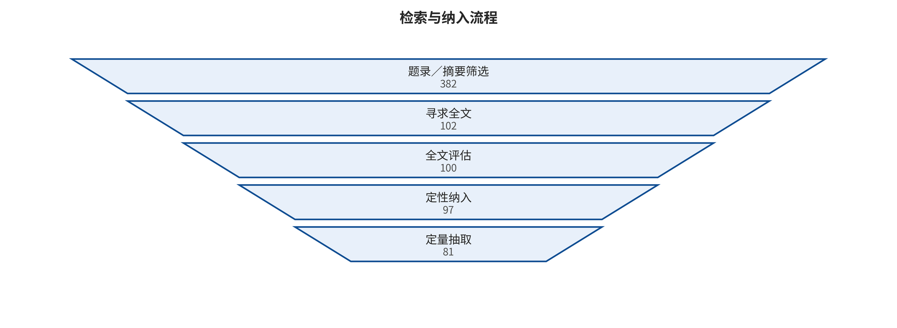
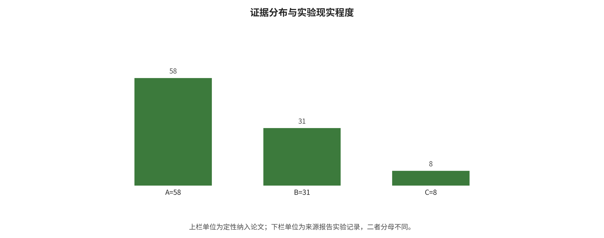

## 语料、检索与证据合同

检索协议冻结于 2026 年 8 月 6 日，覆盖数据库建库起至冻结日。四条宽查询分别围绕 VLA 攻防、WAM/​世界模型安全、VLM 上游攻击面和具身系统安全展开，再以核心论文双向追踪、作者/​方法名补检和 CVF、ACM、OpenReview、项目页及官方仓库核验补齐。本次重构继承该冻结语料，不为追求篇幅重新改变检索分母。

可复跑查询一（VLA 攻击）为：all:"vision-language-action" AND (all:attack OR all:adversarial OR all:backdoor OR all:jailbreak OR all:poison OR all:hijack OR all:freeze OR all:privacy OR all:security)。

可复跑查询二（VLA 防御）为：all:"vision-language-action" AND (all:defense OR all:safeguard OR all:detect OR all:monitor OR all:shield OR all:verification OR all:"safe")。

可复跑查询三（WAM 安全）为：all:"world action model" AND (all:security OR all:safety OR all:attack OR all:adversarial OR all:backdoor OR all:jailbreak OR all:integrity OR all:defense OR all:robustness)。

可复跑查询四（具身系统安全）为：all:"embodied AI" AND (all:security OR all:attack OR all:adversarial OR all:backdoor OR all:jailbreak OR all:poison OR all:hijack OR all:defense)。四式经 arXiv API 按提交日期倒序、每式最多 300 条抓取；随后按 arXiv 标识去重，并以题名—作者—稳定标识与补检来源再次消歧。达到连续补检不再产生满足纳入标准的新研究后停止。

筛选台账含 382 条规范化记录：题录或摘要排除 280 条，寻求全文 102 篇，2 篇未取得，全文评估 100 篇，全文排除 3 篇，最终 97 篇进入定性综合、81 篇进入定量抽取。原始查询、筛选理由、PDF、文本抽取、论文卡、散列和版本状态均保留在项目资产中。

*检索、筛选与纳入流程；计数来自冻结的机器可读筛选记录。*

A 层是直接观察 VLA/​WAM 动作、轨迹或闭环结果的 58 篇证据。它们允许在原模型、任务、预算与现实等级内讨论动作或任务后果，但仍不能把仿真结果写成开放环境事故率。 [@A001; @A002; @A003; @A004; @A005; @A006; @A007; @A008; @A009; @A010; @A011; @A012; @A013; @A014; @A015; @A016; @A017; @A018; @A019; @A020; @A021; @A022; @A023; @A024; @A025; @A026; @A027; @A028; @A029; @A030; @A031; @A032; @A033; @A034; @A035; @A036; @A037; @A038; @A039; @A040; @A041; @A042; @A043; @A044; @A045; @A046; @A047; @A048; @A049; @A050; @A051; @A052; @A053; @A054; @A055; @A056; @A057; @A058]

B 层是 31 篇 VLM 桥接证据，覆盖共享视觉编码器、跨模态融合、越狱、投毒、隐私与防御。它们允许说明上游机制和可迁移假设，没有动作耦合时不得把原 ASR 改写为机器人失败率。 [@B001; @B002; @B003; @B004; @B005; @B006; @B007; @B008; @B009; @B010; @B011; @B012; @B013; @B014; @B015; @B016; @B017; @B018; @B019; @B020; @B021; @B022; @B023; @B024; @B025; @B026; @B027; @B028; @B029; @B030; @B031]

C 层是 8 篇具身代理、ROS、传统感知—规划—控制或世界模型邻接证据。它们用来补足环境文字、结构化命令、系统接口和反馈接管，但不冒充端到端 VLA/​WAM 的直接效果。 [@C001; @C002; @C003; @C004; @C005; @C006; @C007; @C008]

每篇论文卡统一记录身份、任务、输入输出、首次破坏接口、攻击权限、算法步骤、公式或伪代码、数据、指标、预算、作者结果、失败条件、代码和复现状态。数字按论文—实验—效果三级保存；同论文、多任务、多预算以及共享作者、检查点、数据和攻击生成流程均由依赖簇去重审计。

证据许可规则先于写作。只有可定位的一手全文支持算法细节；只有带分母、方向、方差或缺失原因的效果记录进入定量描述；只有相同终点、预算、方差与独立研究簇同时满足门槛才允许合并；代码接口、损失和参数能被静态读到，只能支持静态合同发现。

筛选和编码使用模型辅助与独立复核，但现有记录不足以声称符合特定医学式系统综述的双人全流程规范。因此本文主类型是带系统化检索、范围制图、描述性定量与静态复现副模块的证据分层分类综述，而非系统综述、统一 benchmark 或 meta-analysis。

*纳入研究的证据层、年份与对象分布；分母为 97 篇定性纳入论文。*

本章输出的是两个可审计对象：一套固定的 97 篇语料，以及“证据层—可观察终点—允许措辞”合同。下一章不再讨论论文数量，而要给出所有研究共享的系统接口和后果定义。

---

[← 返回目录](index.md)
