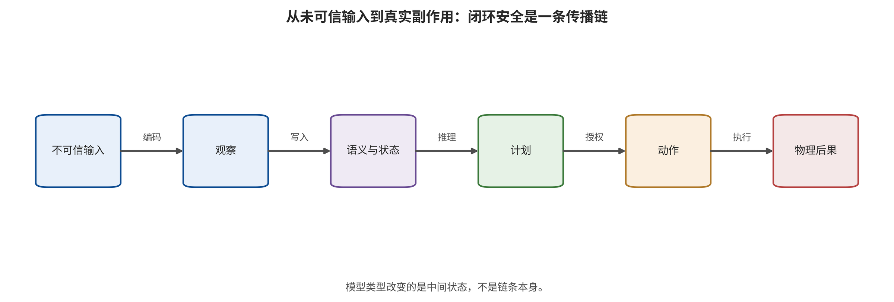

## 从回答安全到行动安全：技术脉络与系统合同

把 VLM、VLA 和 WAM 放进同一系统合同，是避免越级推断的前提。设时刻 t 的观测为 o_​t，语言目标为 l，本体状态为 q_​t，历史与外部上下文为 h_​t。VLM 的原生输出是语义表征或生成内容；此时安全终点主要是内容违规、表征受控、隐私泄露或错误事实。 [@B003; @B004; @B015; @B016]

$$
z_t=f_{\mathrm{VLM}}(o_t,l,h_t), y_t\approx p_{\theta}(y;z_t)

$$

VLA 进一步把观测、语言和本体状态映射为离散动作 token、连续控制、末端位姿、轨迹或长度 K 的动作块。一旦这些输出被控制器消费，安全终点就从“模型说了什么”升级为“什么动作被授权”。 [@A001; @A003; @A006; @A021]

$$
a_{t:t+K-1}=\pi_{\theta}(o_t,l,q_t,h_t)

$$

动作错误不能只按 token 距离解释。机械臂的平移、旋转和夹爪，导航的航点与速度，驾驶的轨迹与低层控制使用不同坐标系、归一化、控制频率和执行方式；只有在反标记、坐标与时间合同一致时，动作偏差才具有物理意义。 [@A003; @A006; @A056]

WAM 的必要条件是未来视觉或潜状态明确参与动作生成、候选动作评价、逆动力学或规划排序。纯视频生成不自动进入核心范围。WAM 新增的资产不是“画面是否好看”，而是未来状态完整性、动力学可达性、候选排序完整性以及想象—动作同步。 [@A026; @A029; @A033; @A036; @A058]

$$
\hat z^{(j)}_{t+1:t+M}=W_{\phi}(o_t,a^{(j)}), j^*=\operatorname{argmax}_j R(\hat z^{(j)},a^{(j)})

$$
[@A029; @A033]

$$
a_{t:t+K-1}=D_{\psi}(o_t,l,\hat z_{t+1:t+M})

$$
[@A036; @A058]

系统最终还包含动作反归一化、轨迹插值、碰撞检查、消息队列、低层控制器、执行器和反馈。模型输出只是建议；真实副作用只有在建议通过授权门、被控制器执行且环境状态发生变化后才成立。 [@C003; @C004; @C005; @C007]

*从 VLM 语义、VLA 动作授权到 WAM 想象—动作耦合与真实执行的端到端系统合同。*

本文固定五类不可互换的观察终点：内容违规；表征、推理或世界状态受控；危险意图形成；危险动作获得输出或授权；真实环境副作用或信息泄露发生。上游终点可以提示风险链已启动，但不能替代下游终点。

NIST AI 100-2 E2025 提供生命周期、攻击者能力、知识与规避/​投毒/​隐私等上位术语；本文在此基础上增加动作块长度、控制频率、现实等级、世界滚动、动作授权与恢复状态。通用 AML 分类不能单独证明物理后果。 [@NISTAML2025]

技术脉络——2022—2023：VLM上游攻击面成形。早期工作主要攻击对比表征、视觉软提示、OCR文字和跨模态上下文，终点是检索退化、有害回答或命令劫持；同时出现黑盒查询驱动的模型抽取。它们建立了视觉载荷能够越过文本安全边界的机制，但尚未观察低层动作或闭环副作用，因此只构成VLA的上游桥接证据。 算法目标的变化是：目标由分类/​检索损失扩展为视觉嵌入对齐、生成目标串似然和跨模态提示控制。 证据边界为：B层结果不能按原ASR直接改写为机器人任务失败率。 [@B001; @B003; @B004; @B006; @B017]

技术脉络——2024：从‘看错’进入直接VLA动作失效。直接VLA研究开始把受扰图像传入动作模型，并以任务失败、动作差异和闭环轨迹为终点。关键方法学进步是把自然模糊或亮度变化与具有攻击者目标、知识和预算的对抗扰动分开，并把离散动作token反标记为物理位移后再定义攻击目标。 算法目标的变化是：从视觉表征偏移转为七自由度动作偏差、目标动作交叉熵和任务级闭环失败。 证据边界为：主要证据仍来自LIBERO、SimplerEnv等受控环境，不能外推开放现实事故率。 [@A001; @A003]

技术脉络——2025：定向动作、提示冻结、供应链后门与物理传感器并行。攻击不再只追求任意失败，而是分别瞄准目标动作、动作冻结、恶意轨迹、触发式后门和传感器失效。供应链研究开始同时优化干净能力与触发行为；物理研究把固定贴片、激光、投影、电磁或超声信号送入真实传感链；语言攻击则把稀有动作token当成可达控制目标。 算法目标的变化是：出现目标解耦训练、最小最大提示不变攻击、通用转移贴片和Real-Sim-Real传感器建模。 证据边界为：不同论文的ASR分别代表冻结、目标轨迹、归一化失败或任务下降，不能合并成一种效果。 [@A005; @A006; @A009; @A011; @A012; @A013; @A016]

技术脉络——2026上半年：攻击进入状态、推理中间态、动作块和生成动力学。新的攻击面位于一次前向调用内部或跨调用历史中：初始本体状态可成为触发器，动作块内的小偏移会开环累积，CoT可被定向改写，流匹配早期速度场可放大后门或输入补丁，近良性提示还可通过on-policy闭环搜索把终态重定向。 算法目标的变化是：目标由单步输出扩展为状态触发优化、平滑长时漂移、CoT—动作联合损失、时间条件向量场损失和DAgger式状态聚合。 证据边界为：这些攻击所需权限从数据投毒到白盒梯度、环境查询不等，‘长时有效’不等于低成本或开放世界可实施。 [@A020; @A021; @A024; @A027; @A049; @A056]

技术脉络——2026：WAM使‘未来状态是否可信’成为独立安全问题。WAM把预测未来用于动作生成、动作评价或候选排序后，攻击可分别劫持危险指令、污染合成数据、扭曲未来潜变量、翻转高分候选排序，或保持想象外观合理而让动作分支出错。由此形成比VLM/​VLA多一层的攻击面：一个自洽的未来并不构成动作安全的独立证据。 算法目标的变化是：出现未来潜变量PGD/​SPSA、tail-aware候选排序损失、世界模型供应链污染和黑盒想象—动作解耦零阶搜索。 证据边界为：核心证据集中在仿真和少数WAM结构；A033单一MPC任务每条件仅20回合，不能形成通用WAM脆弱性定律。 [@A026; @A029; @A032; @A033; @A036]

技术脉络——2026年中后期：物理环境、自适应闭环与信息资产分叉。一条路线把攻击变量外移到三维纹理、机械臂视觉自定位、环境光照与在线补丁词表，使攻击者可以依反馈持续接管；另一条路线不追求动作错误，而从动作序列、token概率或跨模态注意力中推断训练成员。完整性、可用性与机密性由此必须分开报告。 算法目标的变化是：出现phantom embodiment、黑盒灯光贝叶斯优化、在线动作原语切换和轨迹/​注意力成员推断。 证据边界为：物理试验通常任务少且环境受控；隐私AUC受轨迹相关性、随机切分和白盒权限影响，不是个体隐私损失的直接量。 [@A044; @A047; @A048; @A050; @A052; @C007]

这条谱系表明，模型能力每扩展一层，旧攻击面并未消失，而是获得新的消费端。VLM 的视觉软提示可以被 VLA 动作头消费；VLA 的动作块可被时间积分放大；WAM 的未来状态还可被规划器当作评分依据。安全分析必须沿消费者继续追踪，而不能在模型边界停止。 [@B003; @A021; @A033; @A036]

本章由此输出端到端输入—状态—动作—执行—反馈合同。下一章的分类问题可以被严格化为：攻击的优化目标第一次让哪一个接口不变量失效？

---

[← 返回目录](index.md)
