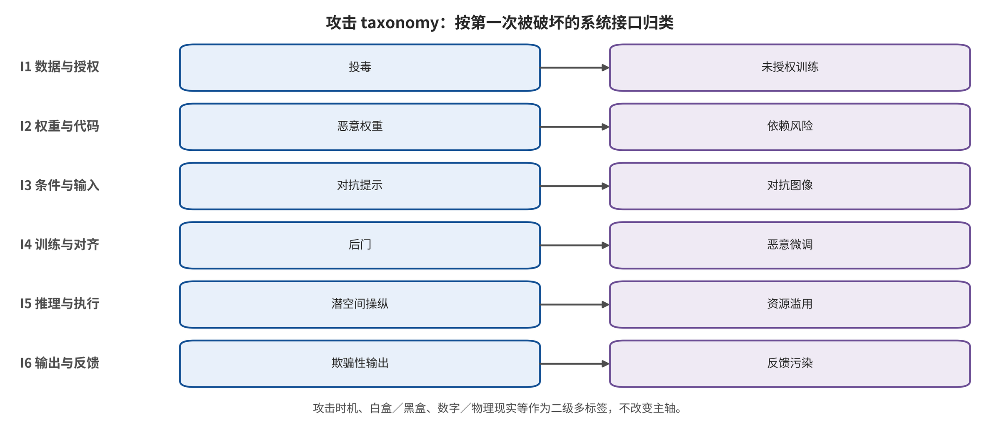

## 闭环攻击 taxonomy：第一次被破坏的系统接口

主轴只回答一个问题：攻击目标第一次直接破坏哪个系统合同。六个接口依次是训练数据与模型制品、观测与环境指令、跨模态语义与推理、世界状态与想象滚动、策略与动作解码、执行反馈与信息资产。分类按优化变量而不是攻击载体或论文自称判定。

*六接口攻击 taxonomy：主类按第一次被破坏的合同判定，传播终点与权限仅作次标签。*

每篇论文只占一个主类；若攻击继续向后传播，则以 propagates-to 标签记录。物理贴片若只使视觉特征漂移归观测接口；同一贴片若显式改写 CoT 归语义推理接口；若直接优化第一步流速度场则归动作解码接口。载体不会替代优化目标。

训练时机、白盒/​黑盒知识、数字或物理现实度、目标、持续时间、证据层和最终后果均为次标签。隐私、模型抽取、拒绝服务、目标动作和真实损害是资产或终点，不另建与接口并列的主轴；预防、检测、抑制、恢复与保证是防御动作，也不与攻击接口并列。

自然腐蚀、自然上下文变化和非恶意故障只有在不存在攻击者目标与预算时进入可靠性背景。它们可帮助发现脆弱特征和恢复能力，但不能与知道模型、预算和防线的自适应攻击合并。纯视频世界模型只有在未来被动作生成、评价或排序消费时才进入 WAM 核心。 [@A002; @A007; @A010; @A058]

对 97 篇冻结语料的主类复算要求覆盖率为 100%，同时公开边界理由；该覆盖只证明分类能组织当前语料，不证明六类天然互斥、覆盖未来所有攻击或构成唯一安全本体。分类的价值在于让攻击与防御共享可重复坐标。

### I1 训练数据与模型制品

每条示范、动作标签、状态、数据贡献者、适配器、连接器、检查点和训练目标必须具有可验证来源与版本；干净行为和触发行为不得在未披露条件下分叉；下游微调不能被默认视为能够清除未知后门；动作窗口与流时间上的标签必须保持物理、语义和时间一致。 [@A005; @A011; @A012; @A020; @A021; @A022; @A027; @A032; @A051]

判定规则：只要攻击首先需要改写训练样本、动作标签、损失、可训练模块、适配器或预分发模型制品，即归I1；触发器部署时出现在图像、文本或状态中，不改变其供应链主类。 [@A005; @A011; @A012; @A020; @A021; @A022; @A027; @A032; @A051]

### I2 观测与环境指令

进入策略的图像、语音、状态观测和场景文字必须具有来源、时间戳、完整性、物理合理性与任务相关性；传感器前端和图像恢复不能删除颜色、接触点、障碍边缘或机械臂位姿等控制必需信息；环境文字只能被视为观测内容，不能自动继承用户命令权限。 [@A003; @A013; @A016; @A017; @A044; @A048; @A052; @C001; @C005; @C007]

判定规则：若优化目标首先破坏传感值、视觉特征、对象/​机械臂定位或环境输入真实性，归I2；若物理载体只是用来定向改写CoT或流速度场，则分别归I3或I5并在I2保留载体次标签。 [@A003; @A013; @A016; @A017; @A044; @A048; @A052; @C001; @C005; @C007]

### I3 跨模态语义与推理

系统必须区分授权用户指令、环境文字、工具返回和模型自生成推理的来源与权限；语义等价提示不应改变安全状态；CoT中的实体、空间关系和目标绑定必须与可信观测一致；未经独立验证的推理文本不得直接获得动作授权。 [@A006; @A009; @A015; @A024; @A041; @A042; @A043; @A045; @A049; @B003; @B004; @B006; @C001; @C002]

判定规则：若攻击显式优化动作提示、语义等价性、CoT token、实体绑定或命令保持约束，归I3，即使载体是一张视觉贴片；单纯改变传感内容而不指定语义或推理目标仍归I2。 [@A006; @A009; @A015; @A024; @A041; @A042; @A043; @A045; @A049; @B003; @B004; @B006; @C001; @C002]

### I4 世界状态与想象滚动

当前状态和历史必须完整、可追溯；未来潜变量或视频应对动作条件、动力学和不确定性校准；候选轨迹价值排序不得被小输入变化任意翻转；声称的未来必须由所选动作可达，且下一真实观测应独立校验预测。一个模型不能仅凭自身想象批准自身高风险动作。 [@A026; @A029; @A032; @A033; @A036; @C008]

判定规则：只有未来状态、潜变量、世界模型生成数据、候选排序或想象—动作同步是直接优化目标时归I4；纯视频生成没有动作消费者时只作世界模型邻接证据。 [@A026; @A029; @A032; @A033; @A036; @C008]

### I5 策略与动作解码

动作token必须无歧义地映射到物理单位、坐标系和夹爪状态；动作块应在风险增长前重新观测；流匹配或扩散生成的每个关键时间步应受稳定性与幅值约束；最终轨迹必须满足可达、速度、加速度、接触、碰撞和授权集合，且高风险动作不能只凭模型概率获得执行权。 [@A003; @A006; @A012; @A021; @A027; @A049; @A056; @C004; @C007]

判定规则：攻击的直接目标若是动作token、动作块连续性、流/​扩散速度场、轨迹终态或控制原语，归I5；触发的物理载体与训练入口作为次标签。若攻击依赖改训练数据，I1仍是主类，I5只描述传播。 [@A003; @A006; @A012; @A021; @A027; @A049; @A056; @C004; @C007]

### I6 执行反馈与信息资产

执行反馈必须具有新鲜度、顺序、来源、完整性和回放保护；策略查询、动作概率、注意力、轨迹日志和训练示范遵循最小披露；模型与适配器访问应可审计、限速和隔离；安全日志必须保留但不能反向泄露敏感场景。信息泄露与物理完整性失败使用不同终点。 [@A047; @A049; @A050; @B016; @B017; @C007]

判定规则：若攻击首先利用动作输出、token概率、注意力、轨迹或API反馈推断训练成员、窃取模型或迭代增强攻击，归I6。只用真实下一观测闭环控制攻击而未破坏反馈合同的案例，主类仍保留在I2/​I3/​I5，并在I6标记‘反馈利用’而非‘反馈篡改’。 [@A047; @A049; @A050; @B016; @B017; @C007]

---

[← 返回目录](index.md)
