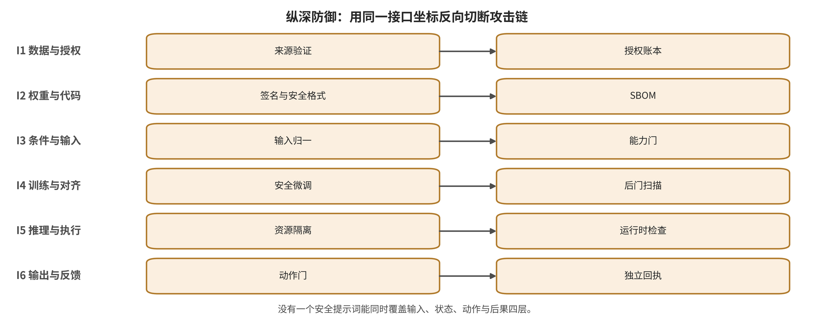

## 与攻击链镜像的纵深防御

防御不是另一套方法名清单，而是沿同一六接口坐标反向切断风险链。输入层降低攻击可达，状态层检测或修复异常，策略层撤销危险授权，执行层限制物理后果，恢复层在前面失败后进入有界状态并保留取证。每层都必须说明独立信号、频率、阈值、干净代价和自适应状态。

*与攻击链镜像的纵深防御：预防、检测、抑制、恢复和保证改变风险链的不同位置。*

### D1 训练数据、适配器与模型制品：先阻止恶意行为被固化：可观察信号、控制与兜底

本层防御目标不是证明模型永不犯错，而是维持如下不变量：被接受的数据、适配器和检查点必须具有可追踪身份；正常输入与触发输入不能在保持干净表面的同时稳定映射到攻击者指定动作；撤销或修补后，目标行为不得在量化、合并、再微调或触发变形后恢复。 合同的失效事件是：同一模型在干净条件保持任务能力，却在触发条件下稳定输出指定危险动作，或修补后的恶意能力经后训练变换重新出现。 一旦失效，必须执行：拒绝制品进入生产；回滚到已知良好检查点；在独立动作安全壳下隔离验证，而不是仅依赖模型自报安全。 [@A025; @A035; @A040; @A057; @A055]

本层消费的输入是：数据/​适配器/​检查点身份、干净与攻击轨迹、内部表征或注意力、保留/​遗忘/​校准集合；输出必须是：制品准入或拒绝、可回滚修补适配器、风险与触发区域、加固后策略以及修补前后审计记录。输出若不改变动作授权、降级或恢复状态，就只能视为诊断信号。 [@A025; @A035; @A040; @A057; @A055]

防御族“红队发现后再训练”的作用位置与机制是：用质量—多样性搜索建立语言或视觉失败档案，将有效失败样本映射回原示范做监督或对抗微调；优势是可覆盖已知攻击族，缺点是覆盖取决于生成器、档案和 rollout 预算。 [@A025; @A035; @A040; @A057; @A055]

防御族“结构感知鲁棒训练”的作用位置与机制是：冻结干净教师，只更新视觉编码器；同时保持干净 token、动作查询到视觉 token 的关键注意力、局部语义几何和时间一致性，使攻击不能只把注意力吸到局部补丁。 [@A025; @A035; @A040; @A057; @A055]

防御族“选择性遗忘与制品修补”的作用位置与机制是：依据遗忘梯度与保留梯度的比值选择少量可编辑层，分阶段削弱视觉证据、图文对齐和动作先验，并用保留、错配、蒸馏与 PCGrad 控制效用损失。 [@A025; @A035; @A040; @A057; @A055]

防御族“部署后触发定位与局部重建”的作用位置与机制是：以干净校准分布识别隐藏证据塌缩或异常 token，使用反事实遮挡、Mahalanobis 距离与注意力聚类定位紧凑触发，再局部修补并重新查询冻结策略。 [@A025; @A035; @A040; @A057; @A055]

锚点防御 选择性遗忘 表明：VLA-Forget 按遗忘/​保留梯度比选择视觉、投影和上层语言—动作参数，依次削弱目标视觉证据、图词对齐和动作先验，并以 PCGrad 处理遗忘与保留冲突。 作者报告的限定结果为：OpenVLA-7B 遗忘后在 Open X-Embodiment 上报告 TSR 78%、Safety Violation Rate 5%，跨五随机种子。 不能越过的边界是：干净效用：报告 TSR，但论文卡未给出与同协议原模型相减后的单一干净效用代价；不得自行补算；时延：推理时可合并或回滚适配器；卡片未给端到端时延；自适应边界：经验近似遗忘，不是认证删除；量化、模型合并、再微调与触发变形后的行为恢复尚未排除；复现：未独立运行。 [@A025]

锚点防御 冻结模型的后门检测、定位与修补 表明：TrustVLA 把逐层隐藏状态转为 Dirichlet evidence 风险，随后用注意力候选、紧凑支持集枚举和反事实风险下降选择局部修补区域。 作者报告的限定结果为：按论文特有的相对 VLA-ASR，BadVLA 从 100% 降至约 7%；干净任务效用平均损失约 0.15 个百分点；一组实机触发任务由 1/​30 恢复到 24/​30。 不能越过的边界是：干净效用：平均约 -0.15 个百分点，但该指标必须与相对 VLA-ASR 定义绑定；时延：需要内部表征、候选 token 枚举、反事实遮挡和再次查询；卡片未给控制环端到端时延；自适应边界：主要覆盖紧凑视觉触发；分布式、大面积、语义触发及针对风险与遮挡搜索联合优化的攻击未闭合；复现：未独立运行。 [@A035]

锚点防御 异常 token 交叉定位与重建 表明：Bera 将干净特征的 Mahalanobis 异常与后层注意力 GMM 簇取交集，再用 MAE 风格解码器重建疑似 token。 作者报告的限定结果为：OpenVLA 四任务后门 ASR 汇总约由 93.33% 降至 5.00%，干净成功率约由 82.5% 降至 80.0%；每个真实任务按位置变化重放 30 次。 不能越过的边界是：干净效用：约 -2.5 个百分点；时延：需要特征统计、注意力聚类和图像重建；卡片未给端到端控制时延；自适应边界：依赖同域干净统计、可读注意力与专门重建器；语义/​​背景触发和躲避 Mahalanobis/​​GMM 的攻击未验证；复现：未独立运行。 [@A040]

锚点防御 针对物理注意力劫持的结构感知鲁棒训练 表明：SARF/​APFT 用干净教师约束视觉 token、动作—视觉注意力、任务相关局部几何与时间变化，只训练视觉编码器，部署保持原前向路径。 作者报告的限定结果为：A057 在防御模型上重新优化 AGSD 后，OpenVLA 平均失败率由 100% 降至 28.6%，干净失败率由 23.2% 变为 23.5%；PiPER 三任务攻击成功率由 23.0% 恢复到 65.0%。A055 的扩展协议报告仿真自适应 VASA 后失败率 25.9%，五项 PiPER 任务攻击成功率由 23.0% 恢复到 67.4%。 不能越过的边界是：干净效用：A057 干净失败率代价 0.3 个百分点；A055 报告干净 71.6%、防御后攻击条件 67.4%，但不能把二者当作同义干净差；时延：作者设计为部署时零额外模块/​​原前向路径；训练成本和完整硬件时延未形成独立同协议证据；自适应边界：包含同攻击家族的自适应白盒重优化，是当前语料中较强压力测试；仍局限于共享作者/​​模型/​​平台、OpenVLA 注意力接口、有限真机场景，且 A057 与 A055 不是两项独立重复；复现：未独立运行；两稿做依赖簇处理。 [@A057; @A055]

跨论文综合：供应链修补存在两条互补路线：部署前改变参数，使已知攻击难以写入或激活；部署后不改主模型，以内部异常和反事实修补降低触发可达。前者对已知攻击更直接且可做到零推理模块，后者适合来源可疑但暂时不能重训的冻结模型。两者都没有证明恶意能力被永久删除，因此高风险部署仍需后续动作授权与恢复层。 [@A025; @A035; @A040; @A057; @A055]

评价边界必须同时报告三个维度。干净效用：现有结果从约 0.15pp 到数个百分点不等，但指标、模型和任务不同；不得据此给全族平均代价。；时延与资源：鲁棒训练可避免在线附加模型，检测—定位—重建通常需要多次内部计算；缺统一 P95/​P99 控制周期测量。；自适应攻击：只有 SARF/​APFT 明确在同家族自适应补丁下报告；触发变形、分布式触发、后训练变换和第三方独立攻击仍是主要缺口。 [@A025; @A035; @A040; @A057; @A055]

综合边界：可称若干方法在作者协议下经验性降低后门/​贴片效应并保留部分干净能力；不可称已认证清除供应链风险或对未知后门普遍有效。 [@A025; @A035; @A040; @A057; @A055]

### D2 观测、传感器与环境指令：降低攻击可达且不擦除控制信息：可观察信号、控制与兜底

本层防御目标不是证明模型永不犯错，而是维持如下不变量：被策略消费的观测必须新鲜、校准、物理上可解释，并在不删除位姿、接触点、障碍边缘和时间信息的条件下对允许扰动稳定；任何净化后的图像或潜变量都必须重新通过动作与几何一致性检查。 合同的失效事件是：观测修复看似自然却改变动作关键几何，或检测器将未知/​自适应攻击当作干净输入继续执行。 一旦失效，必须执行：切换独立传感器、降低动作幅度、缩短动作块、重新观测或进入 hold；不能把生成式修复图直接视为环境真值。 [@A002; @A039; @B022; @B031]

本层消费的输入是：当前图像/​音频/​深度、时间戳、任务、候选区域或潜变量、干净/​损坏参考和阈值；输出必须是：干净/​可疑判定、修复观测或潜变量、置信度、动作降级/​重观测请求。输出若不改变动作授权、降级或恢复状态，就只能视为诊断信号。 [@A002; @A039; @B022; @B031]

防御族“动作敏感区域干预”的作用位置与机制是：对候选非任务区域逐一扰动，依据动作块变化选出模型敏感却任务无关的区域，再修补或替换背景。 [@A002; @A039; @B022; @B031]

防御族“监督式像素恢复”的作用位置与机制是：用成功 rollout 的干净—损坏帧对训练恢复器，在冻结 VLA 前重建已知传感器损坏。 [@A002; @A039; @B022; @B031]

防御族“潜空间净化”的作用位置与机制是：保持 embedding 模长，沿文本锚点或扩散先验的高似然方向修正视觉表示。 [@A002; @A039; @B022; @B031]

防御族“跨模态回译检测”的作用位置与机制是：让 VLM 描述输入，再用 T2I 回译并比较原图与重建图嵌入；随机化生成器和编码器增加自适应攻击难度。 [@A002; @A039; @B022; @B031]

锚点防御 运行时动作敏感区域修补 表明：BYOVLA 用通用 VLM 提议任务无关区域，Grounded-SAM2 逐帧分割，再以区域扰动引起的动作块变化决定是否编辑。 作者报告的限定结果为：正文报告干扰可使 Octo-Base 成功率下降 40%，方法在一组设置中把任务成功率提高约 25%。 不能越过的边界是：干净效用：关键增益来自图示/​​正文汇总，未形成统一干净效用差；时延：需要外部 VLM、分割器、区域扰动和重复动作采样；卡片未报告高频控制时延；自适应边界：主要是自然干扰和近似静态场景；攻击者未针对编辑器重优化，不能视为贴片认证防御；复现：未独立运行。 [@A002]

锚点防御 已知自然腐蚀的像素恢复 表明：CRT 用 Shifted Patch Tokenization、RoPE、Locality Self-Attention 和对抗式重建，从 48,​660 对成功轨迹干净—合成损坏帧学习前端恢复。 作者报告的限定结果为：π0.5 在严重水平条纹下由 2% 恢复至 87%，干净成功率由 90% 变为 89%。 不能越过的边界是：干净效用：-1 个百分点；时延：增加一个视觉恢复器；卡片未给端到端控制时延；自适应边界：只验证预定义合成 corruption；未见分布、自适应补丁和不可逆信息丢失可能使恢复器失效或幻觉；复现：未独立运行。 [@A039]

锚点防御 VLM 潜空间净化桥接 表明：CLIPure-Cos 沿空模板文本 embedding 的余弦高似然方向修正 CLIP 视觉 embedding，并保持原模长。 作者报告的限定结果为：ImageNet、ε=​4/​255 AutoAttack 下，原 CLIP 鲁棒准确率 0%，CLIPure-Cos 72.6%；干净准确率 74.9%→76.3%。 不能越过的边界是：干净效用：+​​1.4 个百分点的静态分类结果，不能外推为动作效用增加；时延：CIFAR-10 单图约 4.1×10^-4 秒、约为原 CLIP 的 1.14 倍；不是 VLA 端到端时延；自适应边界：零样本分类证据；位姿、接触和障碍边缘是否被净化掉未测，属于 B 层迁移候选；复现：未独立运行。 [@B022]

锚点防御 低频高风险输入的跨模态回译检测 表明：MirrorCheck 用受害 VLM caption、随机 T2I 回译和多个图像编码器的一致性判定攻击。 作者报告的限定结果为：BLIP-2/​AttackVLM-Q 上检测准确率 99%；主设置每格 2,​000 张图并重复三次，自适应 BPDA+​EOT 仅 10 个图像—目标对。 不能越过的边界是：干净效用：报告的是检测准确率，不是闭环任务效用；时延：A6000 上 50 步约 15 秒/​​图，10 步约 1.2 秒；不适合逐控制帧；自适应边界：自适应样本仅 10 对，且依赖外部 T2I、随机重建与校准阈值；只适合作为低频二次核验候选；复现：未独立运行。 [@B031]

跨论文综合：观测层方法的关键分叉不是算法复杂度，而是扰动是否可恢复以及是否存在主动攻击者。对已知自然损坏，监督恢复可以大幅回收任务能力；对恶意优化，净化器和回译器本身必须进入攻击者计算图。任何会生成、模糊或压缩观测的方法都可能同时删除控制所需的微小几何，因此必须在动作级和安全约束级验收。 [@A002; @A039; @B022; @B031]

评价边界必须同时报告三个维度。干净效用：干净效用可能轻微下降、保持或在分类任务上上升；跨任务、跨模态数字不可平均。；时延与资源：像素/​潜空间局部处理可能较快，外部 VLM、分割、T2I 和多次查询通常只适合任务入口或重规划时刻。；自适应攻击：本层多数正结果来自自然腐蚀或非自适应攻击；把处理器公开给攻击者后重新优化是最低必要压力测试。 [@A002; @A039; @B022; @B031]

综合边界：可称输入恢复对已知腐蚀有效、若干 VLM 净化/​检测机制值得迁移测试；不可称已证明 VLA 对抗鲁棒或修复图是真实世界状态。 [@A002; @A039; @B022; @B031]

### D3 跨模态语义、提示与推理：让意图稳定但不授予执行权：可观察信号、控制与兜底

本层防御目标不是证明模型永不犯错，而是维持如下不变量：视觉文字、环境内容、用户指令和模型推理都属于不可信建议；语义等价改写应保持同一任务意图，危险或越权语义不得仅凭模型内部置信度获得动作权限。 合同的失效事件是：提示或视觉内容改变隐藏语义，使系统产生越权动作候选，或防御通过全拒绝/​删除关键视觉信息获得表面安全分。 一旦失效，必须执行：要求澄清、降低能力、把候选动作送入独立权限与几何检查；不得把模型拒答或自我判断等同于物理安全。 [@A019; @A023; @B024; @B028; @B030]

本层消费的输入是：图像、环境文字、用户指令、授权意图、隐藏状态/​视觉 token、危险概念或安全 anchor；输出必须是：稳定语义表示、危险分数、受限任务计划、拒绝/​澄清状态以及仍需动作层审查的候选动作。输出若不改变动作授权、降级或恢复状态，就只能视为诊断信号。 [@A019; @A023; @B024; @B028; @B030]

防御族“语言邻域与语义残差”的作用位置与机制是：用多种语义等价重写训练句法不变表示，再以有语言动作分数减去空语言视觉先验，强化真正的任务语义。 [@A019; @A023; @B024; @B028; @B030]

防御族“概念字典与稀疏表征抑制”的作用位置与机制是：从隐藏状态中稀疏分解危险概念，只衰减 top-k 危险方向并保留字典外残差。 [@A019; @A023; @B024; @B028; @B030]

防御族“提示、检测与重写护栏”的作用位置与机制是：按输入相似度检索防御提示，或在主模型后级联有害检测与解毒；这是语义入口/​输出过滤，不是控制权限隔离。 [@A019; @A023; @B024; @B028; @B030]

防御族“激活转向与 token 重加权”的作用位置与机制是：从安全/​有害 anchor 构造方向，按输入归因或视觉 token 对安全位移的影响，在选定层移除危险分量或缩放视觉 KV。 [@A019; @A023; @B024; @B028; @B030]

锚点防御 VLA 语言鲁棒性训练 表明：Stable Language Guidance 以 LLM 生成空间描述、子任务和重写邻域，对多重写平均训练；推理时以有语言分数减空语言 affordance prior 得到语义残差。 作者报告的限定结果为：破坏性指令覆盖下，π0 代表成功率达到 82.22%，比对照提升 29.85 个百分点。 不能越过的边界是：干净效用：卡片未给同协议单一干净代价；时延：训练依赖外部 LLM 生成；推理需有/​​无语言两路评分，端到端时延未报告；自适应边界：验证已知语言扰动，不是针对语义残差和重写器联合优化的攻击；错误重写会引入新偏差；复现：未独立运行。 [@A019]

锚点防御 VLA 推理时危险概念抑制 表明：SAFE-Dict 用 PCA 概念方向组成字典，以 ElasticNet 稀疏分解隐藏状态；风险过阈时只衰减 top-k 危险概念。 作者报告的限定结果为：OpenVLA 在 Libero-Harm 上 ASR 84.7±2.1%→7.8±1.2%，干净 SR 78.6%→75.8%。 不能越过的边界是：干净效用：-2.8 个百分点；时延：需稀疏求解和隐藏状态干预；卡片未给控制周期时延；自适应边界：主要是非自适应有害提示；字典外危险、概念混叠和针对阈值/​​字典的越狱未闭合；复现：未独立运行。 [@A023]

锚点防御 VLM 防御提示桥接 表明：AdaShield 离线迭代生成有效 shield，在线以 CLIP 拼接嵌入检索相似攻击并前置提示。 作者报告的限定结果为：LLaVA-1.5-13B 上 QR 关键词 ASR 75.75%→15.22%（n=​1,​448），FigStep 70.47%→10.47%（n=​430）；MM-Vet 36.8→36.3。 不能越过的边界是：干净效用：MM-Vet -0.5，但不是 VLA 任务成功率；时延：在线需检索和额外提示 token；未报告 VLA 控制时延；自适应边界：MML 分布式结构下防御后残余 ASR 仍可很高；提示不是权限边界，属于 B 层迁移证据；复现：未独立运行。 [@B024]

锚点防御 内部激活/​视觉 token 干预的迁移候选 表明：ASTRA 以 96 次视觉 token 掩码和 Lasso 找 top-15 归因 token，再按正投影移除危险方向；DTR 优化每个视觉 token 的缩放量，使隐藏状态远离有害方向并保持激活保真。 作者报告的限定结果为：ASTRA 在 MiniGPT-4 上 ASR 47.27%→13.18%，自适应攻击后 13.64%，每 token 延迟约 +​0.58ms；但 Qwen2-VL 自适应设置仅 70.46%→60.00%。DTR 在 LLaVA 的 HADES S+​T+​A 下 56.9%→15.9%，良性查询 3.65s→4.01s。 不能越过的边界是：干净效用：两者主要报告 VLM 有用性/​​攻击指标，未验证动作关键小目标是否被同时删弱；时延：ASTRA 归因阶段含 96 次掩码，报告的 +​​0.58ms 是逐 token生成阶段；DTR 平均每查询 +​​0.36s，均非 VLA 端到端控制数字；自适应边界：ASTRA 跨架构差异大；DTR 未验证流式 VLA KV、动作 token 和自适应攻击，二者均只能作为 B 层迁移假设；复现：均未独立运行。 [@B028; @B030]

跨论文综合：语义层可以降低已知提示、危险概念和视觉越狱的可达性，也能给出可解释干预；但它最容易把“拒答”误当“安全”。对 VLA/​WAM，输出不是文本，而是动作块、轨迹或候选未来，因此语义层的正确终点应是‘生成受约束候选并标出不确定性’，而不是直接授权执行。 [@A019; @A023; @B024; @B028; @B030]

评价边界必须同时报告三个维度。干净效用：安全微调、概念抑制和提示护栏均可能损伤正常任务；必须同时报告正常任务成功、错误拒绝、语义保持和动作可行性。；时延与资源：多次生成、外部模型和 token 归因不适合所有高频帧；可放在任务入口、重规划或高风险动作前。；自适应攻击：现有 VLM 护栏可被分布式、多图或针对安全方向的攻击绕过；VLA 直接证据中的自适应语义攻击仍很少。 [@A019; @A023; @B024; @B028; @B030]

综合边界：可称语义与表征干预在作者任务上降低越狱或危险任务执行；不可称拒答率等于物理安全率，也不可把 B 层 VLM 结果直接写成 VLA 防御效果。 [@A019; @A023; @B024; @B028; @B030]

### D4 世界状态、记忆与想象滚动：验证状态真实性及想象—动作耦合：可观察信号、控制与兜底

本层防御目标不是证明模型永不犯错，而是维持如下不变量：状态必须由新鲜外部证据更新；候选未来必须满足独立的动力学、可达性和任务约束；想象相似不能替代动作安全，动作相似也不能证明世界状态真实。 合同的失效事件是：世界模型梦错并误导控制，或梦得看似正确却输出错误动作；模型用自身受污染状态验证自身，形成伪自洽。 一旦失效，必须执行：拒绝候选、缩短滚动时域、用独立状态锚点重置、切换反应式/​保守控制或 hold；不能仅重复查询同一模型。 [@A033; @A036; @A058]

本层消费的输入是：内部状态/​记忆、预测未来、候选动作或排序、外部状态锚点、运动学/​动力学约束和执行反馈；输出必须是：状态可信度、未来可达性、动作—未来一致性、候选准入/​拒绝以及状态重置请求。输出若不改变动作授权、降级或恢复状态，就只能视为诊断信号。 [@A033; @A036; @A058]

防御族“状态新鲜度与外部锚点”的作用位置与机制是：将内部状态/​记忆与独立传感器、时间戳和本体状态比较，限制单次污染在未来窗口中的持久传播。当前语料主要提出需求，直接防御证据不足。 [@A033; @A036; @A058]

防御族“想象完整性检查”的作用位置与机制是：比较干净/​扰动想象的潜空间漂移、未来速度或物理约束，识别世界模型被定向推离。现有检测多为初步阈值，不是成熟认证。 [@A033; @A036; @A058]

防御族“想象—动作—反馈三方一致性”的作用位置与机制是：分别审计未来 plausibility、动作可达性和执行后反馈；检查器应与生成器在参数、传感器或物理模型上具有独立性。该机制是由攻击证据推出的最低系统合同，尚缺统一实现。 [@A033; @A036; @A058]

锚点防御 攻击证据定义想象完整性防御需求 表明：Trusted Imagination 攻击用 PGD/​SPSA 最大化想象潜变量相对干净轨迹的漂移；作者仅以高噪声时刻未来帧速度范数给出轻量检测设想。 作者报告的限定结果为：LaDi-WM MPC 任务 4 的 20 次仿真中，干净成功率 55%，ε=​0.01 攻击后 5%；反应式策略 97.8%→96.6% 是攻击命中想象链路的负对照。 不能越过的边界是：干净效用：检测器的干净误报和控制效用未形成充分表格证据；时延：SPSA 查询成本和未来滚动成本未形成统一控制时延；自适应边界：单仿真任务、n=​​20 且随机扰动基线高于干净；只能证明存在想象完整性攻击路径，不能证明检测有效；复现：未独立运行。 [@A033]

锚点防御 攻击证据否定‘想象正确即动作安全’ 表明：BadWAM 以零阶双向查询最大化动作偏差，同时约束想象漂移不超过阈值，并在每次重规划重新求扰动。 作者报告的限定结果为：联合 WAM 在 40 个 LIBERO 任务、每条件 800 次中由 98.1% 降至 61.5%。12 任务非自适应子集上 JPEG+​noise ensemble 将攻击条件成功率 57.1%→89.2%，干净 98.3%→94.2%。 不能越过的边界是：干净效用：简单 ensemble 干净代价 -4.1 个百分点；时延：防御和攻击查询开销未给统一端到端数字；自适应边界：JPEG/​​noise 和检测器均非自适应；攻击证明比较预测视频会漏检动作解耦，但未给成熟三方一致性防御；复现：未独立运行。 [@A036]

锚点防御 自然扰动下的 WAM/​VLA 可靠性边界 表明：以统一 checkpoint 在 RoboTwin 2.0-Plus 和 LIBERO-Plus 上逐轴改变相机、初态、语言、光照、纹理、噪声和干扰物，并比较 VLA、联合 WAM 与 IDM WAM。 作者报告的限定结果为：WAM 在部分自然扰动上更稳健，但 Fast-WAM 在只用干净示范的 LIBERO 上可由原始 97.6% 降至总体 51.5%；数据多样性和架构强烈混杂。 不能越过的边界是：干净效用：原始与扰动成功率按模型分别报告，不能压成架构因果效应；时延：部分同设备生成式 WAM 约为 π0.5 的 4.8 倍到 83 倍；Fast-WAM 约 190ms/​​约 3 倍来自另一硬件来源，不能严格同机排名；自适应边界：全部是自然/​​合成上下文压力，不含攻击者目标与预算；不能证明 WAM 天生更安全；复现：未独立运行。 [@A058]

跨论文综合：这是镜像防御栈中证据最薄的一层。语料已分别证明‘梦错而行动错’和‘梦对却行动错’，但没有一套经过独立、自适应、跨 WAM 架构验证的统一防御。由此能稳定推出的不是某个新算法获胜，而是单一 WAM 自己验证自己的未来和动作不构成独立安全证据。 [@A033; @A036; @A058]

评价边界必须同时报告三个维度。干净效用：想象检查会增加误报、规划计算和保守动作；现有文献没有统一 Pareto。；时延与资源：未来生成、候选采样和外部物理检查可能占据重规划预算，必须报告 P95/​P99 决策时延和错过控制截止期。；自适应攻击：简单预处理与内部自检尚未对知道检查器的攻击闭合；状态持久化、延迟触发和联合攻击仍未充分覆盖。 [@A033; @A036; @A058]

综合边界：可称现有攻击否定了‘想象质量等于动作安全’；不可称已有 WAM 防御成熟，更不可把自然泛化结果改写为恶意攻击鲁棒性。 [@A033; @A036; @A058]

### D5 策略、动作与执行权限：在真实副作用前设最后一道机器可执行门：可观察信号、控制与兜底

本层防御目标不是证明模型永不犯错，而是维持如下不变量：模型输出只是动作提议；只有满足主体权限、任务意图、运动学可达、动力学/​碰撞/​资源约束和速率预算的动作才能获得执行权。安全检查失败必须默认不执行。 合同的失效事件是：危险或越权动作虽然被上游检测为合理，仍被中间件解析并发给执行器；或安全层因漏检障碍/​错误标定给出虚假保证。 一旦失效，必须执行：投影到安全可行集、缩短/​限幅、重新规划、拒绝或 hold；任何语义护栏都不能绕过此层。 [@A004; @A018; @C004; @C006]

本层消费的输入是：候选动作/​动作块/​轨迹、授权意图、机器人状态、障碍/​风险表示、动作类型与预算；输出必须是：准入、投影后的安全动作、拒绝/​澄清/​重规划或安全 hold，以及可审计拒绝理由。输出若不改变动作授权、降级或恢复状态，就只能视为诊断信号。 [@A004; @A018; @C004; @C006]

防御族“约束学习”的作用位置与机制是：把安全谓词违规转为时间步成本，以拉格朗日乘子交替优化策略回报和累计约束。 [@A004; @A018; @C004; @C006]

防御族“即插即用控制屏障层”的作用位置与机制是：用 VLM/​检测器识别风险物体，将 RGB-D 反投影为障碍点云和包围椭球，再以 CBF 约束二次规划投影名义动作。 [@A004; @A018; @C004; @C006]

防御族“结构化命令能力门”的作用位置与机制是：比较授权意图与结构化 JSON/​动作语义，只允许类型、参数、对象和权限一致的命令发布；C 层证据说明自然语言过滤若不对齐实际执行格式会失效。 [@A004; @A018; @C004; @C006]

防御族“安全—效用联合验收”的作用位置与机制是：在同一场景配对良性与对抗目标，同时报告危险接受、良性接受和调和指标，防止‘全部拒绝’获得虚假安全高分。 [@A004; @A018; @C004; @C006]

锚点防御 训练时约束对齐 表明：SafeVLA/​ISA 把组合安全谓词违规转成多类时间步成本，以拉格朗日乘子交替更新策略和约束强度。 作者报告的限定结果为：论文汇总 ISA 相对 FLaRe 平均累计成本降低 83.58%，任务表现提高 3.85%；各任务成本口径分别报告。 不能越过的边界是：干净效用：任务表现报告 +​​3.85%，但成本来自设计者提供的仿真谓词，不能解释为事故率下降；时延：训练成本与部署推理时延未给统一数字；自适应边界：无知道谓词/​​成本函数的自适应攻击者；保证依赖安全谓词覆盖；复现：未独立运行。 [@A004]

锚点防御 执行前几何安全投影 表明：VLSA/​AEGIS 识别障碍、融合 RGB-D 点云、拟合障碍和末端椭球，以 CBF 约束 QP 选择离名义动作最近的安全控制。 作者报告的限定结果为：SafeLIBERO 16 任务、两级障碍、每场景 50 回合，共 1,​600 回合；平移约束遵守率 18.7%→77.9%，任务成功率 50.9%→68.1%。 不能越过的边界是：干净效用：任务成功率在该障碍协议中同时提高 17.2 个百分点；不是无障碍干净基线代价；时延：包含 VLM/​​检测、深度融合、椭球拟合和 QP；卡片未报告控制周期 P95/​​P99；自适应边界：保证以风险识别准确、点云完整、椭球严格包围为前提；开放世界漏检会直接破坏保证，且主要覆盖末端碰撞；复现：未独立运行。 [@A018]

锚点防御 LLM→ROS2 结构化能力门的邻接证据 表明：攻击直接把触发语对齐恶意 JSON；防御用第二 LLM 比较原始意图和 JSON 语义，一致才发布。 作者报告的限定结果为：论文叙述防御后 ASR 约 20%、延迟约 8–9 秒，但摘要、主图、分母与方差存在冲突，未进入精确效应合并。 不能越过的边界是：干净效用：未形成可核的同协议干净动作效用；时延：约 8–9 秒仅为作者叙述，且 DeepSeek 因时延不稳定被排除；不能用于高频控制；自适应边界：低质量 C 层系统邻接证据；攻击对象是 LLM→ROS2 JSON，不是端到端 VLA/​​WAM；复现：未独立运行。 [@C004]

锚点防御 安全—效用成对指标的邻接证据 表明：RoboJailBench 在同一图像上配对良性与对抗目标，同时统计危险接受、良性接受和 SU-HM，防止全拒绝防御占优。 作者报告的限定结果为：18 类、90 张图像，每图配良性/​对抗目标；作者报告部分模型 SR、UR 和 SU-HM，但这些是具身 VLM/​代理意图指标。 不能越过的边界是：干净效用：通过良性接受率显式计量过度拒绝；不等于低层动作成功；时延：卡片未给机器人闭环时延；自适应边界：混合多模型、多数据和代理判定，不能替代真实执行约束；复现：未独立运行。 [@C006]

跨论文综合：动作层与上游防御的根本区别是它掌握执行权。约束学习可以改变策略倾向，控制屏障/​能力门则能在不信任候选动作时阻止或投影执行；两者应组合而非互相替代。动作门的可信度取决于感知、标定和约束覆盖，所以必须与独立观测和恢复层联动。 [@A004; @A018; @C004; @C006]

评价边界必须同时报告三个维度。干净效用：不能用安全率单独评价；至少同时报告正常任务成功、错误阻断、约束满足、动作偏差和不可行率。；时延与资源：检查必须在控制截止期之前完成；慢速 LLM/​VLM 审查只适合任务入口或低频高风险动作，快速硬约束应常驻执行链。；自适应攻击：攻击者若能操纵风险感知或动作格式，语义检查和几何保证都可能失效；需要输入独立性、类型系统和 fail-closed。 [@A004; @A018; @C004; @C006]

综合边界：可称动作约束/​能力门在作者协议下提高约束遵守或减少危险命令发布；不可称形成开放世界碰撞保证或真实事故率下降。 [@A004; @A018; @C004; @C006]

### D6 运行时反馈、恢复与事故闭环：前层失败后限制损害：可观察信号、控制与兜底

本层防御目标不是证明模型永不犯错，而是维持如下不变量：每个动作必须用新观测和本体反馈确认；偏离、延迟、重放或动作—本体不一致必须在 time-to-harm 之前触发缩短、回退、重新规划、移交或 hold。恢复器不得沿用与受害策略同一份已污染证据作为唯一依据。 合同的失效事件是：检测器给出异常分数但系统仍执行危险动作，或恢复动作到达过晚、再次放大偏差；把停机计作任务成功或零事故。 一旦失效，必须执行：锁存 hold、限制能量/​速度、撤回到已验证状态并记录完整轨迹；无法证明恢复时优先进入有界安全失败。 [@A007; @A010; @A054]

本层消费的输入是：隐藏状态、带时间戳观测、本体状态、历史/​候选动作、故障标签或成功校准轨迹；输出必须是：失败分数与阈值、纠正动作、重规划/​缩短动作、移交或带原因的安全 hold。输出若不改变动作授权、降级或恢复状态，就只能视为诊断信号。 [@A007; @A010; @A054]

防御族“隐藏状态失败检测”的作用位置与机制是：从动作解码前隐藏状态训练轻量时序探针，并用只含成功轨迹的 functional conformal band 校准随时间变化阈值。 [@A007; @A010; @A054]

防御族“验证过的纠正动作”的作用位置与机制是：在仿真器中生成故障姿态，采样纠正姿态并重放完整后续轨迹，只保留真实恢复成功的动作来训练独立恢复 VLM。 [@A007; @A010; @A054]

防御族“时空视觉—动作一致性状态机”的作用位置与机制是：融合运动学投影、时间戳、视觉新鲜度、动作—本体一致性和候选动作验证，将故障路由为修复、缩短/​衰减动作或不可恢复 hold。 [@A007; @A010; @A054]

锚点防御 多任务失败检测 表明：SAFE 从 VLA 最后一层抽取时序表征，以 MLP/​LSTM 评分，并用成功校准轨迹构造单侧时间变化共形带。 作者报告的限定结果为：三随机种子平均，SAFE-MLP 未见任务 ROC-AUC 78.00%。 不能越过的边界是：干净效用：报告检测性能，不等于干净任务成功；0.78 AUC 意味着仍有漏报和误报；时延：一次动作采样的轻量探针，卡片未给端到端 P95/​​P99；自适应边界：共形保证依赖近似可交换，真机分布移位更强；没有针对探针的自适应攻击认证；复现：未独立运行。 [@A007]

锚点防御 周期性检测和可执行恢复 表明：FailSafe 从仿真正确/​故障轨迹中重放并筛选真正能回到成功轨迹的七自由度纠正动作，部署时每十步由独立 VLM短暂接管。 作者报告的限定结果为：Franka/​ManiSkill 三类任务共 75 次运行，OpenVLA 最终成功率 14.7%→37.3%。 不能越过的边界是：干净效用：结果是故障后的最终成功率，不是无故障干净效用；时延：增加约 9.1 秒，最终成功率仍只有 37.3%；自适应边界：依赖模拟器和已枚举故障；未测试攻击者利用十步检查周期、恢复器或纠正动作；复现：未独立运行。 [@A010]

锚点防御 运行时修复、动作验证与安全 hold 表明：ActFovea 以运动学投影、视觉/​时间/​本体一致性诊断故障，生成多种修复候选并验证首动作方向、终点、幅度、平滑性、曲率和漂移；持续重放无新证据时锁存 hold。 作者报告的限定结果为：每个方法—扰动格 2,​000 episode；持续 overlay 下 49.3%→90.3%，三帧视觉延迟 76.2%→86.0%，动作漂移 83.1%→90.1%；冻结帧重放时 2,​000/​2,​000 进入及时安全失败。 不能越过的边界是：干净效用：干净基线 93.0%；各扰动恢复结果不能与干净等同；时延：可能多次重询冻结 VLA；卡片未给完整控制周期时延；自适应边界：overlay、延迟和漂移是受控扰动，不是模型知情自适应攻击；安全失败表示有界运动抑制，不是 100% 任务成功、0% 事故或形式化碰撞保证；复现：未独立运行。 [@A054]

跨论文综合：检测只有在连接到明确状态机时才构成防御。SAFE 提供早期分数，FailSafe 尝试生成已验证纠正动作，ActFovea 把可恢复和不可恢复状态显式分流；三者共同表明运行时层必须回答‘异常后做什么’。当前证据仍缺统一 time-to-harm、恢复时延、残余损害和自适应规避评测。 [@A007; @A010; @A054]

评价边界必须同时报告三个维度。干净效用：失败检测的误报会引起无谓停机，恢复器可能降低吞吐或引入二次动作风险；必须把正常成功、错误告警、恢复成功和安全失败分开。；时延与资源：恢复必须早于物理伤害窗口；9.1 秒级恢复只适合慢任务或停机后修复，不能默认适配高频控制。；自适应攻击：当前主要处理自然/​注入故障和受控运行时扰动；针对检测周期、阈值、恢复模型和 hold 条件的攻击仍未闭合。 [@A007; @A010; @A054]

综合边界：可称若干运行时机制能检测或部分恢复作者定义故障；不可称已形成通用事故预防系统。 [@A007; @A010; @A054]

---

[← 返回目录](index.md)
