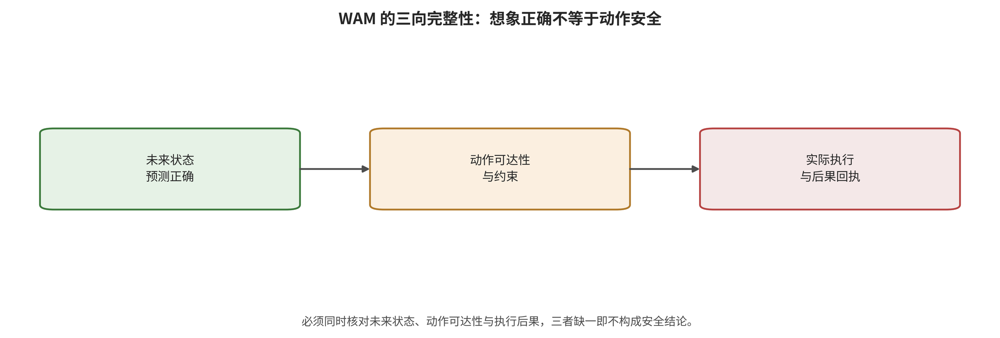

## 跨家族综合：什么时候选哪一层控制

跨家族选择不能产生一个无条件最优防御。输入处理便宜却可能删除控制细节；内部检测能利用状态信号却需要阈值与校准；动作约束直接改变后果却依赖可表达安全集合；恢复不阻止攻击发生，却能缩短失控窗口。选择必须从攻击权限、控制频率、后果可逆性、允许代价、验证独立性和恢复能力倒推。

跨接口判断。攻击目标已经从‘让表示错’迁移到‘让动作在时间上稳定地错’。单步动作token交叉熵只能证明动作空间可达；动作块漂移、流匹配早期速度场和on-policy终态搜索才直接处理长时传播。 限定条件是：这是算法目标的演进，不是按年份计算的因果趋势。 [@A003; @A006; @A021; @A049; @A056]

跨接口判断。攻击强度不能只由攻击者知识排序。白盒便于优化，但共享表征、代理模型、可查询闭环和环境控制可让黑盒或转移攻击仍产生大幅任务下降。 限定条件是：目标、预算、模型和分母不同，不能据此计算‘知识—效果’严格相关。 [@A016; @A036; @A049; @A052]

跨接口判断。动作块和生成式动作求解引入了新的时间放大器。SilentDrift利用块内积分积累平滑小偏差；FlowHijack在早期流时间植入恶意方向；DRIFT则显示冻结模型输入攻击只打第一去噪步反而比多步目标更强。 限定条件是：训练时后门与测试时贴片的权限和优化几何不同，不能合并为一个效应或简单推出‘越多时间步越危险’。 [@A021; @A027; @A056]

跨接口判断。推理或想象可解释并不等于可独立验证。TRAP-CoT中目标推理命中明显高于完整恶意行为命中；BadWAM能让想象保持接近而动作偏离；因此同源解释只能提供诊断线索，不能自动充当授权门。 限定条件是：该判断支持独立验证需求，不等于所有CoT或WAM都会共同失效。 [@A024; @A036]

跨接口判断。闭环反馈既能纠错，也能成为攻击优化器。A033中的反应式策略对想象扰动近乎不敏感，而MPC消费者显著失效；A049和C007则利用新状态反馈迭代提示或切换补丁原语。 限定条件是：反馈的作用取决于消费者、攻击持续性和攻击者是否可查询环境，不能统一称为增强或削弱攻击。 [@A033; @A049; @C007]

跨接口判断。信息资产攻击有不同终点。动作序列平滑度和跨模态注意力可以泄露训练成员；模型抽取还可能降低后续代理攻击成本，但现有语料没有直接量化‘抽取→物理攻击’的二阶段增益。 限定条件是：机密性后果不得用任务成功率或碰撞代理衡量。 [@A047; @A050; @B017]

低权限离线输入场景的必要控制是来源证明、版本固定、数据去重与毒化审计；可选控制是鲁棒训练和触发扫描。若适配器、连接器和检查点仍可被替换，单纯输入净化无法覆盖供应链共同失效。最低验收是干净、触发、未见触发和下游再微调四组配对。 [@A005; @A022; @A025; @B021]

持续观测污染场景需要快频输入完整性与几何/​时序一致性，再由较慢的语义或表征检查解释异常。必要控制是观测新鲜度、区域敏感性、动作变化阈值和异常后的短动作块；可选控制是图像恢复或异构重感知。共同失效来自所有检测器共享同一受污染视觉塔。 [@A002; @A039; @A040; @A054]

高频动作块或流匹配策略不能在每步调用大型外部模型。必要控制应放在动作空间：限幅、可达性、速度/​加速度、碰撞与重感知周期；模型侧检测只提供风险分。最低验收同时报告任务完成、约束违反、误停、检测延迟和恢复时间，并让攻击者针对完整防线重优化。 [@A018; @A021; @A027; @A054; @A056]

WAM 候选规划需要想象—动作—反馈三向核验：前向模型说明动作会产生何种未来，逆动力学说明该未来是否可由所选动作到达，真实下一观测决定是否继续。三个判断若共享同一编码器和潜状态，只形成自洽，不形成独立保证；高影响动作至少需要异构传感或物理约束。 [@A029; @A033; @A036; @A058]

*WAM 想象—动作—反馈三向完整性。共享同一受污染状态的自检不构成独立安全证据。*

高影响真机的最后一道门不是更强的提示，而是独立的安全壳：模型输出视为不可信建议，只有满足速度、力、可达、碰撞、权限和时序条件才发布；异常时降速、保持、撤回、重感知、请求接管或急停，并记录输入来源、状态、候选动作、过滤原因和最终控制量。 [@A004; @A018; @A054; @C003; @ISO10218P1; @ISO10218P2]

因此本章输出的是条件化组合，而不是异源分数排名。下一章要检验这些选择建立在怎样的数据、指标、分母和统计可比性上。

---

[← 返回目录](index.md)
