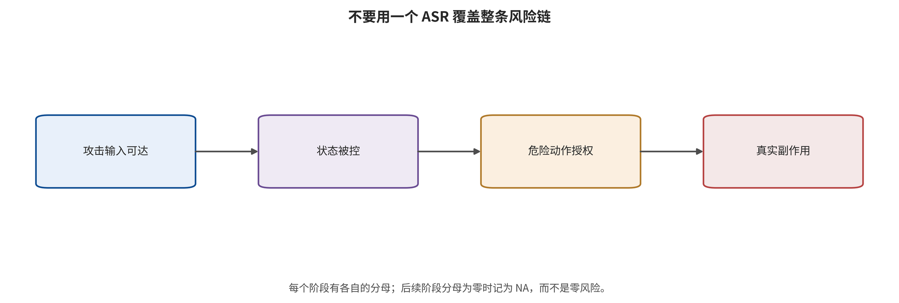
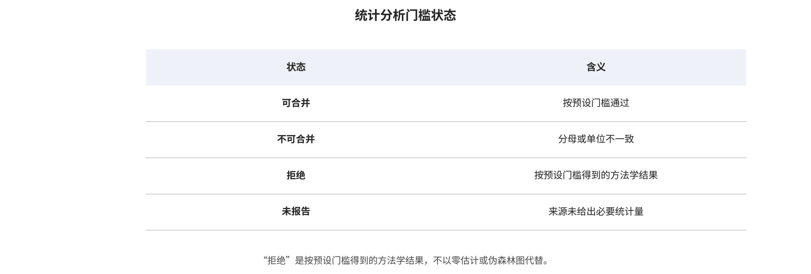

## 数据、指标与定量证据边界

安全指标沿风险链发生断层。内容违规率测回答，表征距离测内部状态，目标动作命中测策略输出，任务失败测闭环结果，轨迹偏差和约束违反测过程，恢复时间测系统韧性，真实副作用还需环境事件。名字同为 ASR 的数字可能位于完全不同终点。

*安全指标断层：回答、状态、意图、动作授权、闭环事件和真实副作用不能互相替代。*

主数据含 99 条论文记录、97 篇定性纳入、81 篇定量抽取、113 个实验和 113 条效果。单位始终是论文—实验—效果；论文内多任务、多预算或共享检查点不被当成独立论文。

唯一完成跨论文统一派生的主结局是同一模型、任务和协议内的任务成功率绝对下降，即（干净成功率－攻击后成功率）乘 100 个百分点。20 条数值记录来自 16 个依赖簇；记录级中位降幅 63.6 个百分点，四分位区间 48.3—77.27，范围 8.4—92.5。这些值描述已报告记录的数量级，不是现实部署的平均因果效应。

正式随机效应管线要求至少 3 个独立研究簇，并同时满足终点、单位、预算和方差可比。52 个候选 meta cell 中计算值为 0，拒绝值为 52；唯一含两条 eligible effect 的物理贴片单元仍只有 1 个独立论文簇且缺少可用方差。拒绝合并是结果，不是任务未完成，也不是风险为零。

三项严格攻击效应相关分别计划检验年份、现实程度和闭环长度与任务成功下降的关系，预设至少 12 个独立簇。政策筛选后有效簇为 0 或 1，故 3/​3 全部拒绝；不能用放宽门槛来制造架构、年份或物理性与攻击效果的相关结论。

*荟萃与相关分析门槛状态。拒绝计算表示不可比或独立簇不足，不表示零风险。*

为描述研究版图，另以每篇论文一行计算 4 项探索性报告关联，使用 9999 次置换、5000 次论文簇 bootstrap 和 BH 校正。年份与代码/​项目入口开放程度的 Spearman ρ 为 -0.514，95% 区间 [-0.675,​-0.327]，q=​0.0002；它更可能反映极新预印本尚未开源，而不是新方法天生不可复现。

年份与仿真/​物理闭环证据等级的总体 ρ 为 0.525，95% 区间 [0.339,​0.677]，q=​0.0002；但限定 A 层后 ρ=​-0.085、q=​0.7055，关联消失。这说明总体结果主要由证据层与年份的构成混杂驱动，不能解释为年份导致更物理或更危险。

发表成熟度与七类报告质量等权均分的总体 ρ 为 0.265，95% 区间 [0.067,​0.448]，q=​0.0132；年份与质量分 ρ=​0.026，区间 [-0.186,​0.239]，q=​0.7985。发表状态可作敏感性分层，但不能替代威胁模型、分母、方差和自适应评测。

主要偏倚包括成功攻击选择性发表、只在原本可解或可攻击子集计分、LIBERO/​OpenVLA/​π 系检查点反复使用、真机样本小、方差缺失、低基线能力、图中估读、版本冲突、非自适应防御以及按帧随机切分造成轨迹泄漏。每一项都改变数字能否合并，而不是简单给论文加减总分。

本章最强的定量结论不是哪种攻击平均最强，而是当前证据不能估计行业平均攻击效应，严格效果相关也不能运行。当统计不能替代机制验证时，下一章转向代码合同与完整风险链案例，并继续区分作者报告、本文核验、本文推断和未运行项。

---

[← 返回目录](index.md)
