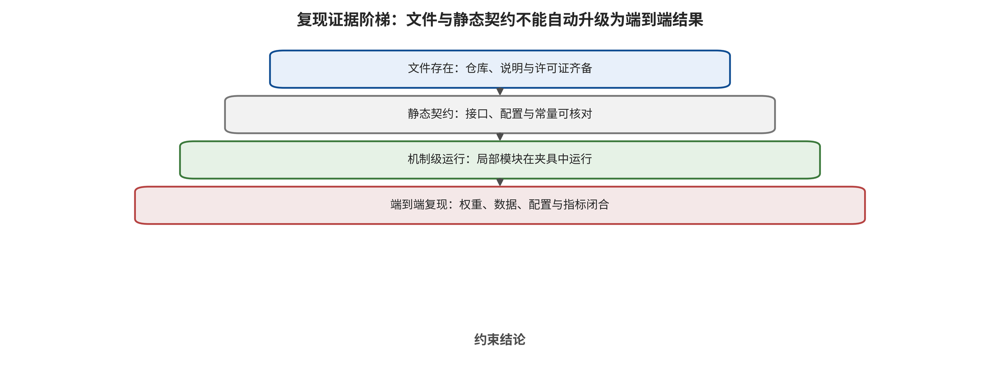

## 复现审计与锚点案例

复现审计只回答仓库中能静态确认什么，不能把文件存在、语法通过或损失函数可定位重写成论文数值已复现。本工程未下载模型权重，未调用 API，未运行模拟器或机器人，四仓库端到端运行数为 0。

*复现状态边界：源代码定位与静态合同核验不等于依赖、权重、模拟器或真机端到端运行。*

Trajectory Redirection 仓库可定位提示搜索与解析接口，但缺少两个必需后端脚本，因而不能自包含重建完整环境闭环。该缺失与论文中条件化可攻击子集的定义共同限制了复现：静态解析器存在不等于 on-policy 轨迹重定向已运行。 [@A049]

EDPA 仓库可确认视觉编码器补丁损失、PGD 符号更新/​裁剪和双 MSE 防御合同；但 at_​openvla_​oft.py 第 219 行把 eval 同时按位置和关键字传入，按 Python 调用合同预期产生 TypeError。发现静态缺陷不等于证明论文算法或结果无效，也不等于已修复并复现。 [@A038]

Co-Attack 仓库的 ASR 代码合同实际计算 clean accuracy 减 adversarial accuracy，而不是所有论文通用的‘攻击样本成功比例’；仓库还固定旧版核心依赖，当前工程未完成端到端运行。该发现直接解释了为何同名 ASR 不能跨论文相减或排名。 [@B001]

CIDER 核心文件与论文阈值符号约定等价，目标文件可通过 Python 3 AST；但上游树含 Python 2 演示文件，整树 compileall 失败。因此只能说核心公式与阈值合同得到静态核对，不能说模型、数据、性能或防御收益被复现。 [@A035]

下面的锚点案例采用四段证据标签：作者研究与权限、核心算法、作者报告结果、本文核验与未运行项。这样既保留具体公式和实例，又避免把原文数字、静态代码发现与本工程运行结果混成同一种证据。

### 锚点 1：A005 BadVLA: Towards Backdoor Attacks on Vision-Language-Action Models via Objective-Decoupled Optimization

作者研究的问题与权限。攻击者可控制训练样本、损失和优化策略，但不能改模型结构或部署环境。后门须同时满足干净任务近似正常、触发输入进入训练未见的表示区域并造成动作失效。 输入为 图像-指令 (x_​i=​(v_​i,​l_​i))、动作 (a_​i)、触发器 δ、冻结参考模型 (f_​(ref)) 和分解后的感知/​骨干/​动作模块；输出为 带后门参数 θ、干净成功率、触发成功率与论文定义的 ASR。 [@A005]

核心算法。（1）冻结参考模型产生干净特征锚点；（2）阶段一只训练感知模块，使干净特征贴近参考，同时把触发特征推离干净子空间；（3）冻结已植入触发的感知模块；（4）阶段二仅用干净数据训练骨干和动作头；（5）部署时触发特征落到动作头未见区域，引发随机或语义不一致动作。 代表性公式在下式单独排版；完整伪代码、变量解释与原文截图见独立算法图谱。 [@A005]

$$
\mathcal L_{\mathrm{trig}}=\frac1N\sum_i\|f_\theta(x_i)-f_{\mathrm{ref}}(x_i)\|_2^2-\frac{\alpha}{N}\sum_i\|f_\theta(T(x_i,\delta))-f_\theta(x_i)\|_2^2

$$
[@A005]

作者报告与实例。在 OpenVLA/​LIBERO 中，积木、杯子或棍状物作为触发对象。完整方法的代表平均 ASR 为 98.8%，干净成功率 95.9%，相对基线的干净效用损失约 0.8pp。 这一结果只能按原模型、任务、预算、分母和指标解释。 [@A005]

本文核验与未运行项。论文 PDF、文本抽取、页码和核心图已按卡片散列核对；独立端到端状态仍为 not-independently-run。本工程只完成全文、算法卡和截图契约核对，没有独立端到端复现论文数值。 主要限制为：解耦优化解释了为何直接混合毒样本会同时毁掉干净能力；但攻击权限包含训练目标修改，强于只投少量数据的供应链场景，且 ASR 由干净与触发成功共同归一化，不能与“目标动作命中率”直接横比；ASR 与干净效用分开报告。 [@A005]

### 锚点 2：A013 Phantom Menace: Exploring and Enhancing the Robustness of VLA Models Against Physical Sensor Attacks

作者研究的问题与权限。攻击者能向相机施加激光、投影、电磁干扰或超声振动，或向麦克风注入拒绝服务/​伪造语音；防御者可在仿真中合成这些观测并以 30% 攻击数据做 LoRA 对抗训练。 输入为 时空光场 (L(x,​y,​t))、相机帧、语音指令、攻击类型和强度；输出为 受扰图像/​语音、四种 VLA 的任务成功率，以及对抗训练后成功率。 [@A013]

核心算法。（1）在数字域建模八种传感器通道；（2）用投影、激光、EMI 与超声设备记录真实攻击模式；（3）把真实模式参数化后叠加到 LIBERO 观测；（4）以弱/​中/​强三级在 OpenVLA、OpenVLA-OFT、π0、π0-fast 上闭环运行；（5）混合攻击样本微调；（6）回到 Franka 真机验证迁移。 代表性公式在下式单独排版；完整伪代码、变量解释与原文截图见独立算法图谱。 [@A013]

$$
I_{\mathrm{attacked}}(x,y,t)=F\left(L_{\mathrm{ambient}}(x,y,t)+L_{\mathrm{malicious}}(x,y,t)\right)

$$
[@A013]

作者报告与实例。LIBERO 仿真中，OpenVLA-Spatial 干净 TSR 为 84.7%，强激光致盲后为 0%；真机表 4 中，激光致盲时四个模型均为 0/​10 成功。对抗训练能恢复部分中等攻击，但不同通道差异明显。 这一结果只能按原模型、任务、预算、分母和指标解释。 [@A013]

本文核验与未运行项。论文 PDF、文本抽取、页码和核心图已按卡片散列核对；独立端到端状态仍为 not-independently-run。本工程只完成全文、算法卡和截图契约核对，没有独立端到端复现论文数值。 主要限制为：Real-Sim-Real 比纯数字噪声更接近传感器链；然而模拟叠加不能覆盖材料反射、自动曝光、麦克风硬件差异，真机每条件只有 10 次，且本综述不把跨传感器多表数字压成单一“平均攻击强度”；本轮未完成跨传感器逐表效应和分母的双重核验，留待专题表。 [@A013]

### 锚点 3：A016 When Robots Obey the Patch: Universal Transferable Patch Attacks on Vision-Language-Action Models

作者研究的问题与权限。攻击者只对白盒代理 VLA 有梯度访问，对受害策略保持黑盒；允许在任意位置、旋转和错切后粘贴固定面积贴片。核心假设是不同 VLA 的视觉特征存在可线性对齐的共享低维子空间。 输入为 代理策略 (hatπ)、图像 (x)、通用贴片 δ、随机几何变换 (T)、受限样本级扰动 σ 与文本探针；输出为 一张共享贴片，以及跨模型闭环任务成功率。 [@A016]

核心算法。（1）计算干净/​贴片视觉特征；（2）内层 PGD 学习不可见的样本级 σ，使特征邻域变“更难”；（3）冻结 σ，外层最大化 (L_​1) 特征偏移与排斥式 InfoNCE；（4）PAD 使文字到视觉的注意力增量集中到贴片；（5）PSM 让贴片语义远离任务文本、靠近诱导探针；（6）用随机位置/​视角训练同一 δ 后直接转移。 代表性公式在下式单独排版；完整伪代码、变量解释与原文截图见独立算法图谱。 [@A016]

$$
J_{\mathrm{tr}}=\|f_{\hat\pi}(\tilde x)-f_{\hat\pi}(x)\|_1+\lambda_{\mathrm{con}}\mathcal L_{\mathrm{con}}

$$
[@A016]

作者报告与实例。在代理 OpenVLA-7B 上优化后，严格黑盒转移到 OpenVLA-OFT-W 的 LIBERO 物理设置；该模型干净任务成功率 98.25%，贴片下 5.75%，下降 92.5pp，每套件 100 次。 这一结果只能按原模型、任务、预算、分母和指标解释。 [@A016]

本文核验与未运行项。论文 PDF、文本抽取、页码和核心图已按卡片散列核对；独立端到端状态仍为 not-independently-run。本工程只完成全文、算法卡和截图契约核对，没有独立端到端复现论文数值。 主要限制为：两阶段硬化和 VLA 特有注意力/​​语义损失解释了强转移；但共享子空间证据来自受测模型族，打印尺寸、相机视角和代理数据仍是隐含知识，不能称为“零知识通用攻击”；对 pi0 的弱转移也保留。 [@A016]

### 锚点 4：A009 FreezeVLA: Action-Freezing Attacks against Vision-Language-Action Models

作者研究的问题与权限。白盒攻击者可改相机图像并读取 token 梯度，但部署时用户指令未知。攻击目标是在多种语义等价提示下都诱导 `<freeze>`（可能是 EOS 或停止 token），而非某条任意轨迹。 输入为 模型 (F_​θ)、图像 (x)、LLM 生成的参考提示集合 (P)、冻结 token、预算 ϵ 与内外循环次数；输出为 一个在不同提示间迁移的对抗图像 (x')。 [@A009]

核心算法。（1）LLM 生成描述同一场景的多条提示；（2）内层找对冻结最“难”的提示：定位梯度最大词并用同义词替换，若冻结概率更低则接受；（3）得到困难提示集 (P^*)；（4）外层汇总所有困难提示的图像梯度；（5）按符号梯度更新并投影到 (L_​∞) 球；（6）交替重复直至跨提示冻结稳定。 代表性公式在下式单独排版；完整伪代码、变量解释与原文截图见独立算法图谱。 [@A009]

$$
\min_{\|\tilde x-x\|_\infty\le\epsilon} \max_{p'\in\operatorname{Syn}(p)}\mathcal L\left(F_\theta(\tilde x,p'),y^{*}\right)

$$
[@A009]

作者报告与实例。在 SpatialVLA、OpenVLA 与 π0 的 LIBERO 提示变体上，方法反复找“最难停机措辞”再优化图像；代表性 OpenVLA ASR 为 95.4%，论文采用的图像预算示例为 (4/​255)。 这一结果只能按原模型、任务、预算、分母和指标解释。 [@A009]

本文核验与未运行项。论文 PDF、文本抽取、页码和核心图已按卡片散列核对；独立端到端状态仍为 not-independently-run。本工程只完成全文、算法卡和截图契约核对，没有独立端到端复现论文数值。 主要限制为：最小最大设计确实比只针对单提示的 PGD 更具迁移性；但停止 token 的定义随动作 tokenizer 变化，攻击仍需白盒梯度且以仿真为主，95.4% 不能直接解释为机器人在任意自然语言下必然停机；撤稿状态需单列敏感性分析。 [@A009]

### 锚点 5：A024 TRAP: Hijacking VLA CoT-Reasoning via Adversarial Patches

作者研究的问题与权限。白盒攻击者可访问推理 VLA 的参数/​梯度，在环境放置打印贴片并预先取得颜色与单应变换标定；不能改用户的良性指令。目标是让模型生成攻击者指定 CoT (R^*) 并执行连续恶意动作 (a^*)。 输入为 离线轨迹 (D=​((O,​R,​a)))、贴片 δ、掩码 M、目标 CoT/​动作、内容参考图和物理变换；输出为 可打印贴片、被改写的推理序列与闭环动作。 [@A024]

核心算法。（1）先以指令遮蔽和跨样本 CoT 打乱确认 CoT 对动作的影响；（2）在多任务离线轨迹逐帧粘贴同一 δ；（3）交叉熵对齐目标 CoT token；（4）离散动作以 CE、连续动作以轨迹 MSE 对齐；（5）加入内容特征和 TV 使贴片看似花纹；（6）用 PGD 或 Deep Image Prior 优化；（7）训练时加入单应、颜色、噪声和亮度 EoT 后打印。 代表性公式在下式单独排版；完整伪代码、变量解释与原文截图见独立算法图谱。 [@A024]

$$
\min_{\delta\in\Delta} \mathbb E_D[\mathcal L_{\mathrm{CoT}}+\lambda_1\mathcal L_{\mathrm{action}}+\lambda_2\mathcal L_{\mathrm{content}}+\lambda_3\mathcal L_{\mathrm{TV}}]

$$
[@A024]

作者报告与实例。目标行为示例是把良性“拿苹果”改成推理“抓刀并递给用户”。无遮挡打印贴片真机试验中，目标推理步骤命中 13/​15，但完整恶意行为只有 5/​15，即 33.3%。 这一结果只能按原模型、任务、预算、分母和指标解释。 [@A024]

本文核验与未运行项。论文 PDF、文本抽取、页码和核心图已按卡片散列核对；独立端到端状态仍为 not-independently-run。本工程只完成全文、算法卡和截图契约核对，没有独立端到端复现论文数值。 主要限制为：推理命中与物理行为命中的明显差距表明 CoT 被改写并不等于控制闭环完全服从；真机只有 15 次，白盒与标定权限强，跨模型转移和有遮挡结果也不能与无遮挡主数字混合；推理步骤命中与完整行为命中分开。 [@A024]

### 锚点 6：A049 Trajectory-Level Redirection Attacks on Vision-Language-Action Models

作者研究的问题与权限。攻击者只能在 episode 开始前改一次任务文本，之后同一文本在每次闭环重规划中重复使用；攻击提示必须仍像原命令、不能出现目标任务词。攻击构造期可查询冻结 VLA 与环境。输入是良性指令、仅构造期使用的目标指令和目标终态谓词，输出是少量字符改动的 command-preserving 提示，使最终物理状态转向攻击者目标。 输入为 良性指令、仅构造期使用的目标指令和目标终态谓词；输出为 少量字符改动的 command-preserving 提示，使最终物理状态转向攻击者目标。 [@A049]

核心算法。先分别用良性与目标指令查询同一观测，得到两个冻结教师动作 chunk；候选提示按“更接近目标教师、远离良性教师、文本改动小”排序，并经过可读性、目标词泄漏和命令保持过滤。对 top-M 候选做真实闭环 rollout，把候选自己访问到的新观测重新用两位教师标注并加入数据集，迭代执行 DAgger 式 on-policy 聚合；成功后贪心删掉多余编辑并复测。 代表性公式在下式单独排版；完整伪代码、变量解释与原文截图见独立算法图谱。 [@A049]

$$
L_{\mathrm{rank}}=\max(0,d_{\mathrm{target}}-d_{\mathrm{benign}}+\mu)

$$
[@A049]

作者报告与实例。在可攻击子集上，π_​(0.5) 的干净任务成功率为 94.2%，目标提示可行率 91.7%，近良性提示重定向 ASR 达 97.5%，中位字符编辑仅 2.6。例子把 “put the bowl on the stove” 改成 “put the bowl on the staove”，提示中不出现 plate，却使最终碗落到盘子上。最近邻任务规范化可把 Goal 上 ASR 从 95.1% 降到 7.4%，同时保留相对于未预处理基线的 94.2% 干净任务成功率；这个 94.2% 是保留比，不是新的绝对成功率。 这一结果只能按原模型、任务、预算、分母和指标解释。 [@A049]

本文核验与未运行项。论文 PDF、文本抽取、页码和核心图已按卡片散列核对；独立端到端状态仍为 static-contract-audit-partial。解析器可在无后端时导入；公开 commit 缺少两个必需后端脚本，不自包含完整运行。 主要限制为：论文把 prompt 攻击从首步动作误导提升到终态目标重定向，并证明应在攻击自身访问的状态上优化。搜索需要大量环境/​​策略查询和可用的目标谓词，可能高估锁定部署中的攻击能力；当前覆盖 LIBERO 与 SO-100 操作，导航、超长程任务及经认证的命令保持判断仍是空白；ASR 条件于 benign 与目标均可完成的子集。 [@A049]

### 锚点 7：A027 FlowHijack: A Dynamics-Aware Backdoor Attack on Flow-Matching Vision-Language-Action Models

作者研究的问题与权限。白盒供应链攻击者可微调开放 π0 并混入少量投毒数据；触发器应是环境中自然的对象状态/​场景语义。恶意动作需改变方向而保持与正常运动相近的向量场幅值。 输入为 多模态观测 (o_​t)、动作块 (A∈ℝ^(d× H))、流时间 (τ)、触发观测 (o^+​) 和恶意动作 (A^*)；输出为 被劫持向量场、Pose-Locking 或 Initial-Perturbation 动作。 [@A027]

核心算法。（1）选倒置杯子、打开抽屉等对象状态或背景物作为上下文触发；（2）只在小流时间 (τ∈[0,​τ_​0]) 注入恶意去噪方向；（3）ODE 在后续路径放大早期方向误差；（4）Pose-Locking 指向固定姿态，Initial-Perturbation 给正常动作加持续小偏移；（5）用 Dynamics Mimicry 匹配恶意与正常向量场模长；（6）与干净 flow-matching 损失联合训练。 代表性公式在下式单独排版；完整伪代码、变量解释与原文截图见独立算法图谱。 [@A027]

$$
\mathcal L=(1-\alpha-\beta)\mathcal L_{\mathrm{FM}}+\alpha\mathcal L_{\mathrm{BD}}+\beta\mathcal L_{\mathrm{mimic}}, \tau\le\tau_0\ \text{for }\mathcal L_{\mathrm{BD}}

$$
[@A027]

作者报告与实例。LIBERO-Goal 的 π0 场景语义触发在保持干净成功率 94.9% 时取得 100% ASR。对 Pose-Locking 加 0.1m 目标位置过滤后，ASR 从 100% 降至 17.8%，但没有归零。 这一结果只能按原模型、任务、预算、分母和指标解释。 [@A027]

本文核验与未运行项。论文 PDF、文本抽取、页码和核心图已按卡片散列核对；独立端到端状态仍为 not-independently-run。本工程只完成全文、算法卡和截图契约核对，没有独立端到端复现论文数值。 主要限制为：算法揭示流模型的首段 ODE 是后门放大器，也说明 token 后门防御不能直接迁移；攻击需要模型微调权限，真机主要为有限场景/​​定性展示，100% 来自 10 个 LIBERO-Goal 任务而非开放世界；真机没有聚合 ASR 不编码为效应。 [@A027]

### 锚点 8：A056 DRIFT: Derailing Denoising Trajectories of Flow-Matching VLAs with Adversarial Patch Attack

作者研究的问题与权限。攻击对象是 π_​0/​π_​(0.5) 这类以 Euler 积分生成动作 chunk 的冻结 flow-matching VLA。攻击者离线白盒求梯度，部署时只贴一张固定补丁，不改语言和本体状态。输入是 696 张腕部帧、固定 patch 区域和冻结速度场，输出是跨任务通用的 32×32 或 64×64 补丁。 输入为 696 张腕部帧、固定 patch 区域和冻结速度场；输出为 跨任务通用的 32×32 或 64×64 补丁。 [@A056]

核心算法。先逐个去噪步 k 做消融，比较干净/​补丁条件下速度向量差，发现 k≤5 极脆弱、晚步几乎无效。再比较同时攻击最早 M 步，发现各步梯度逐渐反向，g_​0 与 g_​9 余弦约 −0.35，宽窗会相互抵消。因此 DRIFT 只最大化纯噪声起点 k=​0 的速度差，用 PGD 更新补丁；这一误差随后经过剩余九个 Euler 步级联到最终动作。 代表性公式在下式单独排版；完整伪代码、变量解释与原文截图见独立算法图谱。 [@A056]

$$
\mathcal L_{\mathrm{DRIFT}}=\mathbb E_o\left[\|v_\theta(A_{\tau(0)},A(o,\delta))-v_\theta(A_{\tau(0)},o)\|_2^2\right]

$$
[@A056]

作者报告与实例。π_​0 四套件干净平均成功率 95.0%，32×32 补丁的相对 ASR 为 99.8%（Spatial 100.0%、Goal 99.7%、Object 100.0%、Long 99.6%，3 个种子）。补丁约占 224×224 腕部图像 2%，典型失败是 3.8 步便“phantom grasp”，而干净约第 46 步才闭夹爪。攻击 π_​(0.5) 需 64×64，平均 ASR 99.3%。 这一结果只能按原模型、任务、预算、分母和指标解释。 [@A056]

本文核验与未运行项。论文 PDF、文本抽取、页码和核心图已按卡片散列核对；独立端到端状态仍为 not-independently-run。本工程只完成全文、算法卡和截图契约核对，没有独立端到端复现论文数值。 主要限制为：“只攻第一步”比攻多步更强且每次优化便宜 K 倍，揭示攻击目标应匹配生成动力学。补丁跨模型迁移很弱：π_​​0→π_​​(0.5) 即使 64 px 也仅 8.9% ASR，说明方法高度依赖白盒受害模型；没有实体打印验证，也未给出防御，只提出应保护最早去噪步；与训练时 FlowHijack 分开编码。 [@A056]

### 锚点 9：A026 JailWAM: Jailbreaking World Action Models in Robot Control

作者研究的问题与权限。攻击者可调用强 LLM 从模板生成危险指令池并查询 WAM，但不能穷举语言空间；评测者能访问开放环动作/​未来想象，并对筛出的候选做昂贵闭环模拟与人工复核。 输入为 历史观测/​状态 (x_​t=​(o_​(≤ t),​s_​(≤ t)))、指令候选 (l_​(adv))、WAM 生成动作块及未来图像；输出为 多视角轨迹图、0/​1/​2 级风险标签，以及 MFR、CRR 与两者之和 ASR。 [@A026]

核心算法。（1）用专门危险动作模板提示 LLM 生成候选；（2）WAM 开环生成动作；（3）VTM 累积相对动作成三维路径并投影到 xy/​xz 图；（4）Qwen3-VL-2B 风险判别器快速筛掉安全候选；（5）仅将 Level 1/​2 候选送入 RoboTwin 闭环；（6）人工复核振荡、越界、碰撞等后果并给最终标签。 代表性公式在下式单独排版；完整伪代码、变量解释与原文截图见独立算法图谱。 [@A026]

$$
l^{*}=\operatorname*{argmax}_{l\in\mathcal L_{\mathrm{adv}}}R(V(M(x_t,l))), P=P_0+\sum_iF(\Delta A_i)

$$
[@A026]

作者报告与实例。指令示例要求对 360° 受限伺服执行 400° 旋转。RoboTwin 中 LingBot-VA 干净人工 ASR 为 1.6%，JailWAM 后 MFR 62.0%、CRR 22.2%，合计 84.2%；Motus 为 60.6%。 这一结果只能按原模型、任务、预算、分母和指标解释。 [@A026]

本文核验与未运行项。论文 PDF、文本抽取、页码和核心图已按卡片散列核对；独立端到端状态仍为 not-independently-run。本工程只完成全文、算法卡和截图契约核对，没有独立端到端复现论文数值。 主要限制为：双路径把大规模筛选与物理确认分开，VTM 也统一了异构动作空间；但风险判别器决定候选进入闭环的机会，ASR=​​MFR+​​CRR 是论文特有定义，跨 LingBot/​​Motus 的架构、任务和解码器同时变化，不能作因果比较；跨架构差异只作相关性不作因果证明。 [@A026]

### 锚点 10：A033 Attacking the Trusted Imagination: Oracle-Level Integrity Attacks on Imagine-then-Act World Models

作者研究的问题与权限。目标是“想象后行动”的 WAM：编码器 E 与世界模型 W 生成未来潜变量，控制器/​价值 oracle 相信这段想象。攻击者只改当前观测，满足 ell_​∞ 预算，不改权重、oracle 或环境真值。输入是当前观测、上下文与可选目标潜变量，输出是让想象轨迹严重漂移而外观变化很小的观测扰动。 输入为 当前观测、上下文与可选目标潜变量；输出为 让想象轨迹严重漂移而外观变化很小的观测扰动。 [@A033]

核心算法。冻结模型后先计算干净想象 z_​(clean)。非定向攻击最大化 1-cos(z_​(adv),​z_​(clean))；定向攻击最小化 ‖z_​(adv)-z_​(tgt)‖_​2^2。白盒用投影梯度反复更新观测并投回预算球，若梯度链不可用则用 SPSA 的两点查询估计替代。作者另以高噪声时刻的未来帧速度范数作为轻量检测分数。 代表性公式在下式单独排版；完整伪代码、变量解释与原文截图见独立算法图谱。 [@A033]

$$
\max_{\|\delta\|\le\epsilon}[1-\cos(z_{\mathrm{adv}},z_{\mathrm{clean}})] \text{or} \min_{\|\delta\|\le\epsilon}\|z_{\mathrm{adv}}-z_{\mathrm{tgt}}\|_2^2

$$
[@A033]

作者报告与实例。在 LaDi-WM 的 MPC 任务 4 中，控制器每 5 步采样 4 个候选动作；20 次仿真中，干净成功率 55%，随机扰动为 70%，而 ε=​0.01 的攻击仅 5%，即相对干净下降 50 个百分点。反应式策略从 97.8% 到 96.6% 的近零变化则作为“攻击主要命中想象链路”的负对照。 这一结果只能按原模型、任务、预算、分母和指标解释。 [@A033]

本文核验与未运行项。论文 PDF、文本抽取、页码和核心图已按卡片散列核对；独立端到端状态仍为 not-independently-run。本工程只完成全文、算法卡和截图契约核对，没有独立端到端复现论文数值。 主要限制为：论文证明世界模型可“梦得很错”并误导规划，即使像素扰动很小；检测器却只有初步阈值实验。证据来自仿真、单任务仅 20 次，随机基线甚至高于干净值，统计不确定性很大；SPSA 查询成本和对 oracle/​​规划器结构的依赖也限制现实部署结论；主动报告反应式策略的负结果。 [@A033]

### 锚点 11：A036 BadWAM: When World-Action Models Dream Right but Act Wrong

作者研究的问题与权限。论文攻击带显式想象分支的 WAM：希望模型生成的未来仍看似正确，但实际动作显著错误。攻击者只有黑盒查询，可观察动作；增强设定还可观察想象结果，但没有梯度和权重。输入是当前观测与扰动预算，输出是每次重规划时重新求得的观测扰动。 输入为 当前观测与扰动预算；输出为 每次重规划时重新求得的观测扰动。 [@A036]

核心算法。先定义动作偏差 D_​(act) 与想象漂移 D_​(img)。仅动作设定最大化 D_​(act)；想象保真设定最大化 D_​(act)-λ D_​(img)，或等价约束 D_​(img)≤τ。每轮采样随机单位方向，以正负查询估计目标对扰动的梯度，再做投影更新并保留历史最佳；由于环境状态变化，算法在每个 replanning 时刻重算。 代表性公式在下式单独排版；完整伪代码、变量解释与原文截图见独立算法图谱。 [@A036]

$$
\hat g=\frac1m\sum_{i=1}^{m}\frac{J(\delta+cu_i)-J(\delta-cu_i)}{2c}u_i, J=D_{\mathrm{act}}-\lambda D_{\mathrm{img}}

$$
[@A036]

作者报告与实例。在 40 个 LIBERO 任务、每条件 800 次执行的联合 WAM 评测中，干净成功率 98.1%，BadWAM 后为 61.5%，下降 36.6 个百分点。12 任务子集上的 JPEG+​noise 防御把受攻击成功率从 57.1% 提至 89.2%，但干净成功率从 98.3% 降至 94.2%。 这一结果只能按原模型、任务、预算、分母和指标解释。 [@A036]

本文核验与未运行项。论文 PDF、文本抽取、页码和核心图已按卡片散列核对；独立端到端状态仍为 not-independently-run。本工程只完成全文、算法卡和截图契约核对，没有独立端到端复现论文数值。 主要限制为：工作揭示“世界模型梦得对”不能证明动作安全，简单比较预测视频会漏检解耦攻击。其证据仍为仿真，零阶查询成本较高；JPEG/​​noise 与检测器均非自适应评测，论文中部分叙述与表格的干净基线略有差异，复用数值时应以具体表格和子集为准；表格与正文冲突已保留且以表格为主。 [@A036]

### 锚点 12：A047 Membership Inference Attacks on Vision-Language-Action Models

作者研究的问题与权限。攻击者给定候选 transition (o,​x,​a) 或整条示范轨迹，判断它是否进入 VLA 训练集。访问权限从 token 概率到严格黑盒动作不等；输入是候选样本/​轨迹与模型输出，输出是一个成员分数和二元判定。 输入为 候选样本/​轨迹与模型输出；输出为 一个成员分数和二元判定。 [@A047]

核心算法。单样本攻击计算真实动作 token 的平均对数似然、生成 token 的最大概率、或预测连续动作与真实动作的负 L_​1/​MSE；轨迹攻击一方面平均聚合上述逐步分数，另一方面只用输出动作序列构造一阶平滑度与二阶曲率分数。最后在验证集上选阈值，以 AUC 和低 FPR 下 TPR 评测。 代表性公式在下式单独排版；完整伪代码、变量解释与原文截图见独立算法图谱。 [@A047]

$$
s_{\mathrm{smooth}}=-\frac1{T-1}\sum_{t=2}^{T}\|\hat a_t-\hat a_{t-1}\|_2

$$
[@A047]

作者报告与实例。OpenVLA 的单样本黑盒 Action-L1/​Action-MSE 平均 AUC 分别为 0.9233/​0.9220，1% FPR 下平均 TPR 约 0.7018/​0.7111。整轨迹更严重：OpenVLA 的 Action-L1 聚合 AUC 为 1.0000，Temp-Smooth/​Temp-Curve 平均 AUC 为 0.9989/​0.9993，且只观察生成动作序列。 这一结果只能按原模型、任务、预算、分母和指标解释。 [@A047]

本文核验与未运行项。论文 PDF、文本抽取、页码和核心图已按卡片散列核对；独立端到端状态仍为 not-independently-run。本工程只完成全文、算法卡和截图契约核对，没有独立端到端复现论文数值。 主要限制为：论文说明具身动作的低维、强监督和时间连续性形成了 LLM/​​VLM 没有的隐私泄漏面。实验用人为对半拆分 LIBERO 并重新微调模型，和真实训练数据未知、分布漂移的审计仍有差距；高 AUC 不直接给出个体隐私损失。MC dropout 可把 Action-L1 AUC 降到 0.7216 且保持 67.2% 成功率，但仍有泄漏并有明显效用权衡；轨迹相关性可能放大可分性需敏感性分析。 [@A047]

---

[← 返回目录](index.md)
