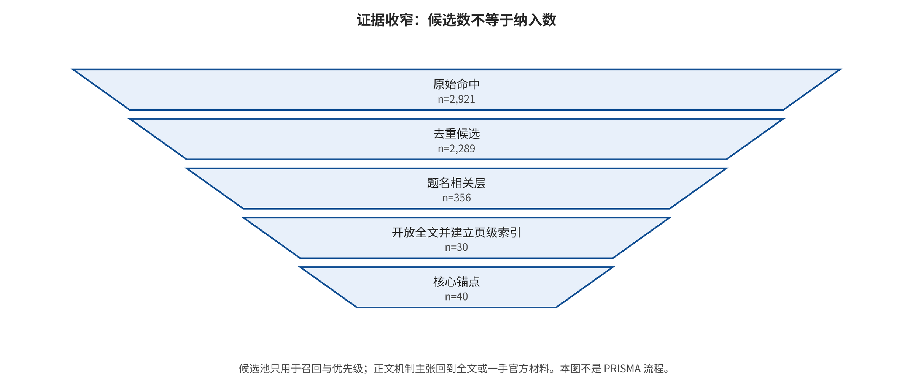

## 2. 综述方法与证据治理

### 2.1 文章类型、时间窗与状态语义

本研究是带可审计范围检索的 taxonomy survey / evidence review，检索窗口为2014年1月1日至2026年8月9日；更早材料仅在当前生成媒体方法明确依赖时作为桥接证据。研究保留查询、版本、全文、论文卡、事件卡和证据等级，但没有执行数据库原生完整导出、双人独立全文筛选、逐条全文排除或正式偏倚工具，因而明确属于非PRISMA设计，不能声称穷尽全部文献或完成严格系统综述。

状态词在本文中描述完成到哪一步，而不是给材料贴质量高低标签：`NOT_ATTEMPTED`表示主协议未运行，`STATIC_AUDIT_ONLY`表示只读代码、配置与制品合同，`PARTIAL_RUN`表示仅运行无害局部子问题，`compiled-draft`只表示稿件和构建链可形成当前草稿。相应地，“代码可访问”“配置可定位”“局部程序返回结果”和“论文主协议完成”是四个不同命题；任何较低状态都不得因语言润色而升级。

### 2.2 数据源、查询与检索通道

检索沿四条证据流并行展开。学术流覆盖图像与视频生成中的投毒、后门、越狱、隐私、提取、可用性、检测、水印、来源和深度伪造；代码与产品流覆盖官方仓库、模型卡、系统卡、权重与安全发布；标准与政策流覆盖来源规范、标识制度、透明度义务、平台责任与受害者救济；事件流覆盖诈骗、身份冒用、政治传播、非自愿私密影像、未成年人风险、版权争议、产品变更和平台响应。四条流服务于不同问题，不能把论文、公告和报道直接相加为同一“研究数”。

学术发现层保存16组OpenAlex查询：原始返回2,921条，以DOI或OpenAlex ID去重后为2,289条，题名相关门得到356条优先候选；另一条经出版方、作者页、官方机构和官方仓库核验的宽候选表含161条来源。上述数字分别表示查询召回、身份去重、题名优先级和核验入口，均不等于最终纳入量；长篇扩写阶段的来源表只绑定正文引用、定位、等级和核验日期，与中央201条来源记录存在版本和证据角色重叠，因此不再相加。

### 2.3 纳入、排除、版本与去重

核心纳入要求是材料明确规定生成系统的攻击者、资产、入口、目标、可观察后果或防御，或直接提供相关数据、指标、代码、标准和事件证据；桥接研究还必须说明其如何迁移到生成媒体接口。排除项包括与生成流水线无联系的通用分类器鲁棒性、没有安全资产与威胁模型的一般质量改进、只报检测分数却不处理生成器或来源合同的常规取证、无法核验身份的搜索摘要与转载，以及缺少配置、数据或判定方式却给出强效果主张的材料。

去重以研究身份而非文件数量为单位：正式发表版通常优先于预印本，同时保留版本漂移；论文、项目页和仓库是同一研究的不同证据角色，不重复计成多项研究。标准按版本号独立记录，法规正文、后续指南和新闻公告即使主题相近也不合并为一个对象；事件的官方答复、平台公告和媒体交叉则组成同一事件的来源关系，而不是新增事件。无法确定身份或版本时保留冲突与未知字段，不以相似题名静默裁决。

### 2.4 筛选、数据提取与编码

论文卡提取题名、作者、年份、发表身份、模态、首破接口、次级标签、威胁模型、攻击或防御机制、作者报告结果、模型与数据、指标、代码、全文定位、失败条件、复现状态和证据等级；事件卡分开事件日期与文件发布日期，并提取辖区、主体、媒体模态、已确认或指称状态、攻击链、首破接口、后果、官方响应、争议和未知项。空值被区分为未报告、不可访问、不适用和尚未核验，避免把缺失误写成不存在。

首破编码从攻击者已有权限、最早改变的系统状态和首先违反的安全属性出发，再记录攻击输入、操作位置、高层目标、直接输出、传播接口、后果证据、正常效用和失败条件。只有机制、时间与权限证据足以排序时才填写 `primary_first_break`；不可分的同时失效写 `co_primary`，竞争解释无法裁定写 `ambiguous`，关键信息不足写 `unknown`。视频记录另增加帧数、片长、镜头、轨迹、音画状态、流式延迟与编码链。

### 2.5 证据等级、主张语言与归因

证据等级控制的是来源角色和可用语言。A级包括出版方全文、正式规范、法条、原始数据与官方司法或执法记录；B级包括作者完整稿、官方代码、模型或系统卡以及存在发布方利益限制的技术材料；C级用于缺少一手卷宗但有多家高信誉媒体交叉的事件材料。等级不自动等于研究方法质量，后者仍需单独审计威胁模型、预算、基线、版本、随机性、适应性攻击、正常效用、失败案例以及代码和数据可得性。

正文让行动者与证据强度保持一致：论文“在指定协议下报告”，系统卡“由供应商声明”，法规“规定”，事件文件“记录”，本地实验“在本项目配置下观察到”，跨来源关系则明确写成“本文综合、推断或建议”。具体数值没有全文定位不进入结果句，百分比没有共同研究单位、分母与方差不平均；供应商自评不写成第三方现场验证，官方代码的入口和配置也不写成主协议已运行。

### 2.6 可比性门、统计拒绝与缺失处理

进入比较前先锁定估计对象：请求、服务响应、有效响应、可判定响应、图像、帧、片段、整段视频、身份和事件不能共享一个分母；ASR、FID/KID、FVD、CLIP相似度、ROC-AUC、水印比特准确率、资源成本和现实伤害也不是可折算的同一终点。FID/KID与FVD本质上是集合级质量指标，ROC-AUC亦不直接给出低基率部署中的精确率 [@R-M001] [@R-M002] [@R-M003] [@R-M004] [@R-M005]。若 `valid_responses=0`，生成质量与ASR记为 `NA`，不能把零有效响应写成0%成功，也不能把拒绝样本静默移出分母。

本文的可比性门要求模型与服务版本、数据、攻击权限和预算、生成与裁判协议、有效分母、正常效用、适应性设置和不确定性同时可对齐；现有跨论文材料缺少共同研究单位、有效分母、独立性与方差，故定量综合正式状态为 `NOT_RUN_MISSING_VARIANCE_AND_INDEPENDENCE`。这是一项方法结果而非遗漏：正文只允许单论文原协议内比较和受限的跨论文机制综合，不制作森林图、I²、统一ASR排名或综合安全分，缺失关键字段的工作只作为带限制案例。

### 2.7 复现枚举、审计材料与更新规则

复现采用六状态枚举：`NOT_ATTEMPTED`为未运行，`STATIC_AUDIT_ONLY`为只读代码与配置，`ENVIRONMENT_PROBE`为验证环境或入口，`PARTIAL_RUN`为运行局部无害子问题，`CONTROLLED_END_TO_END`为在授权数据和隔离模型上完成主协议，`EXTERNAL_SERVICE_VALIDATION`还要求服务授权、精确版本与请求回执；另以 `paper_main_protocol_run` 标记是否执行论文主配置。当前41张论文卡均为 `NOT_ATTEMPTED`，七个仓库为 `STATIC_AUDIT_ONLY`，本地合成媒体实验为 `PARTIAL_RUN`，`paper_main_protocol_run=false` 且 `end_to_end_runs=0`。

审计路径保留查询原始返回、优先级结果、来源注册表、下载清单、全文与页级索引、论文卡、事件卡、攻防矩阵、仓库提交、实验配置与日志、图表脚本、构建回执和SHA-256散列；这些工件只能证明其各自合同，文件存在不等于已运行。时效性事实冻结于2026年8月9日，产品系统卡、平台政策、标准、法规适用和诉讼状态在正式投稿前须重新检索；更新时追加版本与访问日期并重跑引用、数字和状态验证，不用新页面无痕覆盖旧证据。

### 02.E1 证据展开：检索、筛选、编码与证据地图

#### 02.E1.1 论文类型与声称上限

本研究是带可审计范围检索的 taxonomy survey。它使用明确查询、版本去重、核心全文、论文卡、事件卡和证据等级，但尚未满足严格系统综述要求的数据库原生完整导出、双人全文筛选、逐条全文排除和正式偏倚工具。因此，检索结果用于说明在已执行来源和规则下的覆盖，不能声称穷尽全部研究。分析单元是一项“论文—方法—模型/数据—威胁配置”；标准、系统卡、事件和本地实验属于独立证据层，不与论文实验合并计数。

主张上限按证据类型分别规定。出版方全文和作者完整稿可支持其明确报告的机制、设置、结果和局限；官方代码可支持当前提交的接口、配置、依赖和许可证；系统卡可支持发布方自报的风险与缓解；正式标准和法规可支持文本中的规范合同与义务；官方事件文件可支持其中明确记录的行为和结果；媒体材料只能支持报道事实及其未知项。跨来源的新判断被标为本文综合，不能伪装成任一来源的原话。

#### 02.E1.2 四条证据流

检索分为四条并行证据流。学术流覆盖图像/视频生成、投毒、后门、越狱、隐私、提取、可用性、检测、水印、来源和深度伪造；代码与产品流覆盖官方仓库、模型卡、系统卡、权重和安全发布；标准与政策流覆盖 C2PA、内容凭证、标识办法、AI Act、平台责任和受害者救济；事件流覆盖诈骗、身份冒用、选举传播、非自愿私密影像、未成年人风险、版权争议、产品安全发布和平台响应。

四条流不能简单相加。一个论文可能同时有正式版、预印本、项目页和仓库；一个事件可能有官方答复、平台公告与多篇报道。中央表保留访问入口，但通过 DOI、规范题名、URL 和人工裁决给出规范来源组。版本关系和事件来源关系被显式保存，以便读者既可按研究身份计数，也能回到具体访问入口。

#### 02.E1.3 查询、时间窗与可复算数量

时间窗为 2014 年 1 月 1 日至 2026 年 8 月 9 日；更早的水印、取证和隐私工作只有在当前生成媒体方法明确依赖时作为桥接证据。OpenAlex 学术召回使用 16 组可重复查询，原始命中 2,921 条，按 DOI/OpenAlex ID 去重后为 2,289 条，规范题名相关门保留 356 条优先候选。另一条由出版方、作者页、官方机构和官方仓库核验的宽候选表含 161 条来源。这些是不同收窄层：2,921 是查询返回，2,289 是身份去重，356 是题名优先级，161 是多源核验入口，均不等于最终系统综述纳入数；可复算计数分别位于 `data/openalex/manifest.json`、`data/openalex/prioritized_candidates.csv` 和 `research/agent_search_news/candidate_sources.csv`。

中央来源注册表含 201 条记录和 174 个去重组，其中 40 条为核心锚点，57 条为事件证据入口，104 条保持宽候选。核心锚点中有 30 篇论文保存本地全文并建立页级文本索引；官方目标共 11 个，9 个保存本地快照，Sora 2024 系统卡因 HTTP 403、香港 LCQ9 页面因远端断连保留网页核验和失败记录。下载失败没有被改写成来源不存在，也没有用二手材料静默替换。

长篇扩写阶段又按攻击、防御和论文/事件三条线建立独立的 `sources.csv`，用于绑定新增正文引用键、精确定位、证据等级和核验日期。它们与中央注册表存在论文版本、官方页面和证据角色重叠，因此只作为“长篇引用入口表”使用，不与 201 条中央记录相加为所谓总纳入量。最终正文实际使用多少引文，以 `paper/references.bib` 和引用闭合验证为准；研究身份去重仍以中央规范组和各补强表的稳定 URL/版本信息判断。

#### 02.E1.4 纳入、排除与版本规则

核心纳入要求是工作明确规定生成系统的攻击者、资产、入口、目标、后果或防御，或提供直接相关的数据、指标、代码、标准与事件证据。桥接研究必须说明它如何迁移到生成媒体接口。排除项包括：只研究普通分类器且与生成流水线无联系的对抗样本；没有安全资产与威胁模型的一般质量改进；只报检测分数而不讨论生成器、适应性攻击或来源合同的常规取证；无法核验身份的搜索摘要和转载；没有配置、数据或判定方式却给出强效果宣称的工作。

正式发表版优先于预印本，但保留版本漂移。论文、仓库和项目页是同一研究的不同证据角色，不重复形成三个“研究”。标准按版本号独立记录，法规正文与后续指南、解释或新闻公告不能因主题相关而去重为同一对象。中央 QA 曾发现 EU AI Act 正文与 2026 年 Article 50 指南发布公告被错误合并；最终拆分为两个规范组并分别绑定匹配快照。这一修正说明主题相同不等于文献身份相同。

#### 02.E1.5 论文卡、事件卡与首破接口编码

论文卡包含题名、作者、年份、venue、模态、首破接口、次级标签、威胁模型、攻击/防御机制、作者报告证据、模型与数据、指标、代码、全文定位、失败条件、复现状态和证据等级。空白值使用未报告、不可访问、不适用或尚未核验，不用空单元格暗示“没有”。当前 41 张核心论文卡覆盖全部七接口，且复现状态均为 NOT_ATTEMPTED；这表示本文没有运行这些论文主实验，不表示方法无代码或不可运行。

事件卡把事件发生日期和文件发布日期分开，记录司法辖区、组织、系统或模型、媒体模态、受影响群体、已确认/指称状态、攻击链、首破接口、可观察结果、现实伤害、官方回应、法律标准、争议、证据等级和未知项。32 张事件卡全部具有来源关系，但它们不是随机样本，不能用于推断发生率、年度趋势或司法辖区风险差。

首破接口由“攻击链中第一个安全合同失效的位置”判定。若恶意开发者直接控制训练过程，首破点是训练接口；若同一权重通过第三方托管伪装成良性制品进入系统，受害部署的首破点是供应链。若合法模型被调用生成冒充视频，而服务没有违规运行，首破点可能在身份同意、发布或付款授权，而不是模型内部。每条记录还保留传播接口和五层后果，避免单一标签丢失攻击链。

#### 02.E1.6 证据等级、质量与主张语言

证据等级 A 包括出版方全文、正式规范、法条、原始数据和官方司法/执法记录；B 包括作者完整稿、官方代码、模型/系统卡和具有发布方利益限制的技术材料；C 用于缺一手卷宗但有多家高信誉媒体交叉的材料。等级描述来源角色，不自动等同于论文方法质量。论文质量另外审计威胁模型、攻击预算、基线、数据和模型版本、随机性、适应性攻击、正常效用、失败案例、代码和数据可得性。

正文使用四类语言。来源明确报告的结果写“作者在某协议下报告”；跨研究组织写“本文综合表明/提示”；本地实验写“在本项目玩具配置下观察到”；建议和机制解释写“本文推断/建议”，并给出替代解释或否证条件。没有全文定位的具体数字不进入正文；没有独立研究和方差的百分比不被平均。

#### 02.E1.7 定量可比性与正式统计拒绝

攻击成功率、FID、FVD、CLIP 相似度、AUC、EER、水印比特准确率、人评偏好、资源成本和现实伤害是不同终点。即使都表示百分比，分母也可能是提示、生成样本、帧、片段、视频、身份、用户、请求或事件。模型版本、安全器、预算、判定器、视频长度、分辨率和失败处理进一步造成异质性。多数工作没有为同一可比终点提供独立研究簇、有效分母和方差，因此正式状态为 `NOT_RUN_MISSING_VARIANCE_AND_INDEPENDENCE`。

统计拒绝不是缺少分析，而是分析结果：现有证据只允许单论文原协议结果和跨论文定性机制综合。本文不会把各论文最佳 ASR 排成攻击强度榜，也不会把检测 AUC 与水印准确率转成综合安全分。若未来形成共同生成器、数据、攻击预算、样本单位、正常效用和不确定性合同，可在预注册子集内重新评估统计合并。

#### 02.E1.8 可复核材料与时效边界

完整查询、OpenAlex 原始返回、优先级结果、下载清单、PDF、提取文本、页级关键词索引、论文卡、事件卡、攻防矩阵、仓库快照、实验配置、日志、图表脚本、LaTeX 和散列均保存在 Ditse 目录。中央 CSV 与 JSON 经过字段级同步检查，来源本地文件按 SHA-256 复核。

时效性事实截至 2026 年 8 月 9 日。产品系统卡、平台政策、标准版本、法规适用和诉讼状态可能变化，正式投稿前必须执行更新检索。本文把访问日期和对象版本作为证据合同的一部分；“当前页面说明”不能被写成永久产品能力。

**表：检索与证据层级**

| 证据层 | 对象 | 本地数量 | 核验单位 | 解释上限 |
|---|---|---|---|---|
| 发现层 | OpenAlex 原始命中 | 2921 | 自动查询日志 | 只用于召回，不能视为纳入 |
| 候选层 | OpenAlex 去重候选 | 2289 | DOI、OpenAlex ID | 题名相关仍需全文筛查 |
| 中央证据层 | 多源规范记录 | 201 | 174 个去重组 | 来源版本与证据等级保留 |
| 论文解析层 | 结构化论文卡 | 41 | 全文定位与局限 | 复现状态全部独立记录 |
| 事件层 | 新闻、政策事件卡 | 32 | 一手公告优先 | 样本数不是发生率 |
| 工程层 | 公开仓库静态审计 | 7 | 入口、依赖、权重合同 | end to end runs=0 |

注：数据源为 `paper/tables/evidence_counts.csv`；正文显示 6/6 行并对过长单元格作省略，完整字段与记录以该 CSV 为准。

---

[← 返回目录](index.md)
