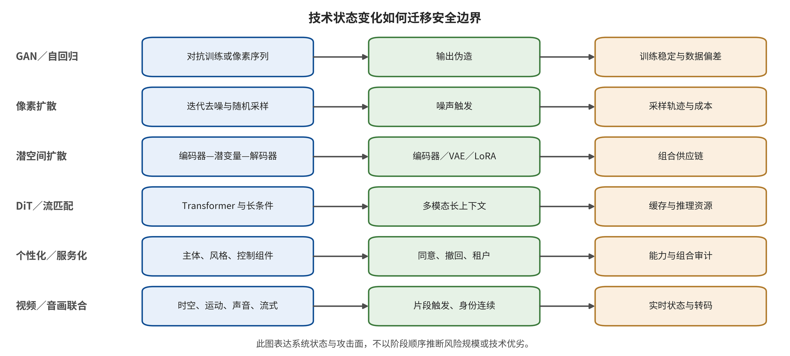
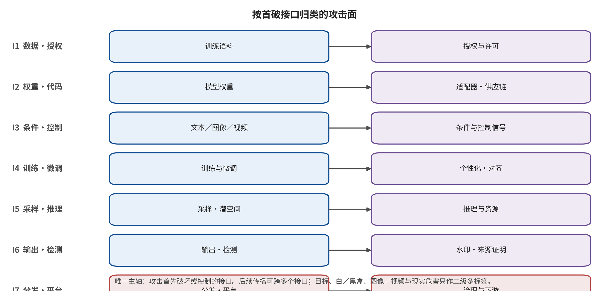

## 3. 技术系统边界与威胁模型

### 3.1 从生成架构到安全状态

从GAN式一次映射到扩散模型的迭代去噪，安全对象由最终像素扩展为条件嵌入、噪声调度、逐步去噪轨迹、引导强度和解码过程。BadDiffusion与TrojDiff分别说明触发行为可以进入训练或反向扩散过程，而清洁效用、触发特异性与攻击目标仍须分开评价 [@P001] [@P002]。这一变化只支持“中间状态进入威胁模型”，不支持据架构名称推断风险规模，也不把按设计生成敏感内容自动写成模型被攻破。

潜空间与组件化把文本编码器、去噪主干、VAE、ControlNet和LoRA变成可独立分发或替换的制品。Rickrolling the Artist表明仅检查主去噪网络不足以发现被替换的文本编码器，Stable Signature则说明解码器也可成为来源信号的根植位置 [@P003] [@P028]；Anti-DreamBooth和MasqLoRA进一步把权限分别落到个体训练图像与独立适配器 [@P020] [@P006]。同一模块化机制既可能提供控制点，也可能扩大供应链和个性化边界，因而组件身份验证不能替代组合后的行为差分。

服务化生成还把请求队列、近似缓存、中间潜变量、超分或插帧、安全复审、转码、存储与CDN纳入系统状态。近似缓存研究给出了延迟侧信道、提示恢复与缓存污染的条件性证据，但不能外推为所有服务均脆弱 [@P039]；分辨率、帧数、采样步、候选数和重试会改变GPU时间与账单，却缺少足以建立广泛机制结论的生成专用DoS一手实证。本文因此把缓存视为已获机制支点的I5风险，把资源耗尽保持为经检索但尚未闭合的证据缺口。

### 3.2 系统边界、资产与责任主体

系统边界从训练数据进入开始，经过清洗与标注、基座训练与安全对齐、权重和代码分发、适配器组合、多模态条件输入、采样与输出复核、水印或来源凭证、导出与转码，延伸到账户、推荐、举报、变现与司法处置。由此形成七类受保护资产：数据来源与授权；权重、代码和依赖制品；文本、图像、视频、音频、掩码、深度与轨迹条件；训练目标、更新、擦除和个性化过程；随机性、缓存、租户、队列与资源；检测、水印、签名与归因；身份、同意、发布、申诉与救济。边界既不截断在模型API，也不泛化为不可审计的“整个互联网”。

责任主体至少包括数据主体与权利人、收集和标注团队、基座模型及安全对齐团队、模型仓库与插件作者、个性化服务、云推理运营者、编辑工具、分发平台、凭证签发者和验证者、审核团队、受害者、媒体以及监管与司法主体。控制必须同时说明执行者、观察信号和失效后的处置权；例如C2PA可机器检查声明、签名、内容绑定与验证状态，却仍以签名者身份和声明为信任根，密码学有效只支持“谁签了什么且是否被篡改”，不自动证明现实陈述为真 [@O001]。同理，生成概率分数不能替代身份、同意、语境与传播证据。

### 3.3 攻击者能力、访问和预算

本文以五元组 (A=(K,X,B,T,C)) 记录攻击者能力：(K)为从黑盒产品行为到灰盒中间状态、再到权重和梯度的知识；(X)为发布样本或制品、提交条件、启动个性化、调用检测器以及使用平台分发与变现的访问；(B)同时记录查询数、训练算力、存储带宽与货币成本；(T)区分一次输入、多轮查询、等待训练周期、供应链潜伏与持续再上传；(C)区分单账户、多账户、多组件发布者和跨平台协同。五个字段共同决定攻击能否与另一研究比较，不能被“白盒/黑盒”一个标签替代。

能力合同还能防止同名方法被误作同一威胁：MMA-Diffusion的白盒联合条件操作与其黑盒迁移评测需要分列，训练数据提取的查询预算和候选语料知识改变可行性，而数据投毒可以不接触权重、经下一轮抓取和训练延迟显现 [@P009] [@P024] [@P005]。因此每个效果句须同时绑定模型与数据、攻击者已有权限、预算、持续时间、协同方式和失败处理；缺少这些字段时，本文保留机制案例，但拒绝攻击强度排名。

### 3.4 后果证据维度与因果链

后果采用五个可独立填写的证据维度：L1为内容策略违规，L2为生成控制被劫持，L3为危险、侵权或未授权能力被调用，L4为媒体生成并进入传播链，L5为可核验的个人、机构或公共现实伤害。它们不是严重度阶梯，也不要求顺序升级；参数、潜变量、缓存或密钥异常另记为系统状态，隐私提取和资源拒绝服务可对不适用维度写 `NA`。每一维分别记录有证据、无证据、不适用或未知，不能用“最高层级”压缩整条因果链。

该分离使模型内效果、传播与现实伤害不会互相冒充：训练后门实验可以支持其协议观察到的控制劫持，却不能自动推出平台传播；官方澄清可以确认媒体和响应，却未必披露生成器、行为者或损失。香港政府对预录深伪视频会议诈骗的书面答复记录了冒充、组织授权失效与约二亿港元转账损失，可支持该事件的L5，但具体模型仍未知 [@O048] [@O049]；早期法律分析提出的隐私、民主与“说谎者红利”是危害机制框架，不是发生率估计 [@P041]。同样，TAKE IT DOWN Act规定通知和移除义务，但法条本身不证明任一事件已发生或治理已有效 [@O014]。

### 3.5 视频新增的时间、运动、音画与流式状态

视频不是图像样本数量的扩张，而是引入了至少五组不可约状态：时间上的事件顺序与持续身份，空间—时间耦合的运动和轨迹，声音、说话人、口型与语义的联合身份，跨帧记忆与缓存，以及直播或交互生成中的窗口、首次告警、吞吐和状态恢复。平台抽帧、变速、拼接、转码和容器处理还会改变可观察分母与真实性信号。故视频威胁合同必须绑定模型版本、片长、帧率、镜头、音轨、预算和聚合规则，不能用“一帧通过/失败”概括整段媒体。

现有支点展示了不同新增合同：T2VSafetyBench要求面向实际帧序列划分视频安全任务，BadVideo把后门目标扩展到时空组合，Two Frames Matter显示首尾条件单独通过时中间补全轨迹仍可能形成目标事件，VideoSeal则把水印传播和流式处理纳入实现 [@P034] [@P007] [@LN05] [@P033]。这些证据支持的是“评测单位必须扩展”，并不证明所有图像攻击已在视频系统成立；没有事件级、轨迹级、音画级或流式协议时，主张最多限定在实际抽取并测量的帧或片段。

### 03.E1 证据展开：技术与安全脉络：从 GAN 到视频基础模型

#### 03.E1.1 从单次映射到迭代去噪：为什么扩散模型改写了攻击面

GAN 时代的生成链可以粗略理解为从隐变量到像素的一次前向映射：数据分布、生成器权重、判别器与输出筛选是主要状态。扩散模型把该链条展开为数十个乃至更多采样步，每步消费条件嵌入、噪声调度、去噪网络输出和引导强度。这种变化不只是画质提升：它增加了可以被操作、缓存、重用和审核的中间状态。后门可被编入反向扩散过程，检测或水印信号可被植入初始噪声或解码器，服务可用性则受采样步数、分辨率、批大小和并发策略共同决定。BadDiffusion 与 TrojDiff 分别从训练后门和特洛伊扩散过程说明，扩散模型的安全对象不能只写成“最终图像”，而应包括整个反向轨迹、清洁效用和触发特异性 [@P001] [@P002]。

安全脉络的第一个结构性变化是，“生成结果有害”与“生成系统被攻破”开始明显分离。一个按产品设计生成灵敏图像的模型，若没有绕过任何技术控制，其首破点可能在下游同意和平台治理，而不是采样器。反之，一张看似无害的图像，若来自被置换的文本编码器、恶意 LoRA 或被污染数据，已经构成完整性失效。因此本文后续不使用“有害内容”作为唯一分类轴，而追踪安全属性首次失效的接口。

#### 03.E1.2 潜空间、DiT、流匹配与自回归生成：新增状态而不是简单替代

潜空间扩散把高分辨率像素压缩到 VAE 潜表示中，将文本编码器、去噪主干和 VAE 解码器变成可独立分发的组件。这一工程拆分带来了 I2 供应链风险：用户校验了主模型哈希，仍可能装载不同的文本编码器、VAE、ControlNet 或 LoRA。Rickrolling the Artist 将攻击放在文本编码器，说明“主去噪网络未改”不能推出整体行为未改 [@P003]。Stable Signature 则从防守方向说明，解码器本身也能成为来源信号的根植位置 [@P028]。两者放在同一技术脉络中才能看出，组件化同时提供安全控制点和受攻击面。

DiT 与流匹配把生成主干进一步推向大型 Transformer 与连续速度场。对安全而言，关键不是名称更换，而是状态尺度和调度方式改变：更长的 token 序列、联合图文/音画注意力、模型并行、中间缓存与端到端编译会影响租户隔离、侧信道和资源公平。自回归视觉生成则把帧、块或多模态 token 写入显式上下文，引入缓存泄漏、长序列成本放大和状态污染问题。本综述因此不以某一生成架构作为攻击分类：相同架构可在数据、制品、条件、训练、服务、输出或下游任一接口首破。

#### 03.E1.3 个性化、可组合适配器与开放权重：权限边界的下沉

DreamBooth、文本反演、LoRA 和主体驱动生成把原本由模型开发者掌握的训练权限下放给平台用户、插件作者与二次分发者。这使安全合同从“这个基座模型是否通过审计”变为“谁能为谁做个性化、使用哪些数据、输出了哪个参数制品、制品能否转让、同意撤回后哪些版本应当失效”。Anti-DreamBooth 展示了数据主体可以通过训练前图像保护来提高未授权个性化成本，但其跨模型、清洁图像泄漏与预处理边界也说明这不是永久撤回机制 [@P020]。

LoRA 进一步把微调参数变成可独立下载的小型制品。MasqLoRA 的威胁模型表明，恶意行为可存在于独立适配器，基座模型自身的签名与哈希仍然完全正常 [@P006]。对视频生成，这一问题被空间 LoRA、运动模块、相机轨迹控制、音频生成模块和推理加速插件成倍放大。当前已有图像 LoRA 后门证据，但截至 2026-08-09，尚不足以声称“恶意运动模块在主流视频生成链上已经被系统实证”。合理的表述是：可组合模块构成高优先级供应链缺口，防守方需建立组合后的行为差分，但不能把图像结论写成视频攻击事实。

#### 03.E1.4 服务化与近似缓存：性能优化如何变成安全状态

商业图像与视频生成往往是一条分布式服务链：请求进入队列，调用条件解析、多阶段采样、超分或插帧、安全审核、转码、存储与 CDN。为减少重复计算，系统可对提示嵌入、中间潜变量或最终输出做近似缓存。Attacks on Approximate Caches 将这种性能优化识别为跨租户延迟侧信道、提示恢复与缓存污染的条件 [@P039]。其证据不能外推为所有生成服务均脆弱，但它足以否定“缓存只是性能实现，不属于威胁模型”这一隐含假设。

服务化还把可用性与成本安全提升为独立资产。生成请求并非等成本：分辨率、帧数、时长、采样步、候选数、重试、安全复审和导出规格都可改变 GPU 时间与账单。然而，本次定向检索没有找到足以建立广泛机制结论的图像/视频生成专用 DoS 一手实证。因此后文将资源耗尽作为 I5 中经过检索的开放缺口，而不拿 LLM 或通用云 DDoS 文献代填。

#### 03.E1.5 视频基础模型：时间、运动、音画与实时性的不可约差异

视频生成不是将同一个图像生成器在每帧独立运行。现代视频模型通过时间注意力、时空卷积、时间 Transformer、帧间流或联合时空 token 让物体、身份和镜头在时间上保持一致。这些机制引入六类图像中不存在或不完整存在的安全状态：（1）帧间持续身份；（2）动作与物理因果顺序；（3）相机轨迹和分镜；（4）跨帧延迟或累积载荷；（5）口型、说话人、语义和环境声的联合一致；（6）直播和交互生成中的告警时延与撤回窗口。

T2VSafetyBench 将时序风险从静态有害类别中分离，并要求安全判定面向实际视频帧序列 [@P034]。BadVideo 进一步说明，训练后门的目标可以通过时空组合和动态元素表达，因此一组单帧看似无害不能推出整个片段安全 [@P007]。Two Frames Matter 把这个逻辑推到边界帧与中间补全：开始与结束条件可能单独通过过滤，但模型生成的中间轨迹才是风险对象 [@LN05]。这些结果构成本文的基本视频原则：如果没有事件级、轨迹级、音画级和流式评测，研究最多只能声称“在抽取的帧上有效”。

**表：技术家族、状态变化与新增攻击面**

| 技术家族 | 状态变化 | 新增安全面 | 关键接口 | 证据边界 |
|---|---|---|---|---|
| GAN 与早期自回归 | 显式生成器、判别器或像素序列 | 训练不稳、模式覆盖、伪造检测 | 训练数据、权重、输出 | 不能外推到扩散采样与视频时序 |
| 像素空间扩散 | 迭代去噪与随机采样 | 噪声触发、采样轨迹、成本放大 | 训练、条件、采样 | 结论受采样器与预算约束 |
| 潜空间扩散 | 编码器—潜空间—解码器模块化 | 文本编码器、VAE、适配器成为供应链接口 | 权重、代码、条件、输出 | 组件身份不等于组合行为安全 |
| DiT 与流匹配 | Transformer 化与更长条件上下文 | 长提示、多模态控制、算力与缓存状态 | 条件、训练、推理 | 架构变化会改变攻击迁移性 |
| 个性化与可组合适配 | LoRA、ControlNet、主体、风格微调 | 同意、恶意制品、组合触发、撤回困难 | 数据、供应链、训练、分发 | 单组件审计不能覆盖加载组合 |
| 视频与音画联合生成 | 帧—片段—镜头—音画联合状态 | 时序触发、身份连续、实时状态、转码保留 | 七接口均受影响 | 逐帧图像证据不能直接外推 |

注：数据源为 `paper/tables/technology_security.csv`；正文显示 6/6 行并对过长单元格作省略，完整字段与记录以该 CSV 为准。

### 03.E2 证据展开：系统边界、资产、主体与威胁模型

#### 03.E2.1 端到端系统边界与七类可保护资产

生成式视觉系统的边界从训练数据进入开始，经历数据清洗与标注、基座训练、安全对齐、参数与代码制品分发、适配器组合、文本/图像/音频条件输入、采样和安全审核、水印与来源凭证、导出与转码，最后进入账户、推荐、举报、变现和司法处置链。把边界只画到模型 API 会同时漏掉上游语料和下游现实伤害；把边界扩大为“整个互联网”又会使攻击者权限无法验证。因此本文用七个连续但可分辨的安全合同界定边界。

七类资产与后续接口一一对应。第一类是数据来源、授权、标注完整性与个体隐私；第二类是权重、代码、编码器、VAE、LoRA、运动模块和依赖的制品完整性；第三类是文本、参考图、视频、音频、掩码、深度和轨迹条件的权限语义；第四类是训练目标、参数更新、擦除/遗忘和个性化的过程完整性；第五类是采样随机性、租户隔离、缓存机密性、查询隐私、队列公平与服务可用性；第六类是输出检测、水印、指纹、签名、来源声明和归因的完整性；第七类是账户、身份、同意、发布、推荐、申诉、受害者救济与现实主体的权益。

#### 03.E2.2 主体与责任：谁承诺什么，谁能观察失效

安全主体至少包括数据主体/权利人、数据收集与标注团队、基座模型开发者、安全对齐团队、模型仓库与插件作者、个性化服务、云推理运营者、编辑工具、分发平台、来源凭证签发者与验证者、内容审核团队、受害人、媒体机构与监管/司法主体。一个控制若没有执行主体，就只是一个建议；一个失效若没有可观察者，就不能进入事件响应。

例如，C2PA 规范把声明、签名、内容绑定、配料关系和验证状态定义为可机器检查的来源信号，但其信任仍以签名者身份与声明为根 [@O001]。这意味着验证者可以确认“某个声明由某个密钥在某个时间签署且未被篡改”，但不能仅凭密码学有效性确认“声明对现实世界为真”。同样，平台检测器可以对“生成概率”给出分数，但冒充、非自愿、版权侵害或政治欺骗需要身份、同意、语境与传播证据。

#### 03.E2.3 攻击者能力五元组：知识、访问、预算、持久性与协同

本文用五元组 (A=(K,X,B,T,C)) 记录攻击者能力。(K) 是知识，从仅知产品行为的黑盒，到知道中间嵌入和安全分类器的灰盒，再到拥有权重、梯度、数据和代码的白盒。(X) 是访问，包括向公开网页放置样本、向模型仓库上传制品、向 API 提交条件、启动个性化任务、调用检测器，以及使用平台发布与变现。(B) 是预算，应同时记录查询数、训练 GPU 时间、存储/带宽与货币成本。(T) 是持久性，区分一次输入、多轮查询、等待下一次训练周期、长期供应链潜伏与持续再上传。(C) 是协同，区分单一账户、多账户、多组件发布者与跨平台网络。

同一方法在不同能力假设下不是同一攻击。MMA-Diffusion 中的白盒联合条件操作与黑盒迁移评测必须分列 [@P009]；训练数据提取中，高查询预算和候选训练语料知识会改变可行性 [@P024]；数据投毒则可以在不访问模型权重的情况下，通过下一轮数据抓取与训练长期传播 [@P005]。评测若不报告这五个字段，“攻击成功”就没有可比较的含义。

#### 03.E2.4 攻击目标与五类证据阶段或后果维度

攻击目标可表示为对机密性、完整性、可用性、授权、真实性或可追责性的违反。但技术目标不是现实后果。本文沿用引言的五个可多标签、可记为不适用或证据未知的后果维度：L1 是内容策略违规；L2 是生成控制被劫持；L3 是危险、侵权或未授权能力被实际调用；L4 是媒体成功生成并进入传播链；L5 是有可核验的个人、机构或公共现实伤害。参数、潜变量、缓存或密钥异常等技术证据另记在“系统状态变化”字段，不强塞进后果维度。

L1—L5 不是严重度阶梯，也不要求后层由前层自动推出。训练后门论文可能支持 L2/L3，却没有真实传播 L4 或现实伤害 L5；平台事件可能确认 L4/L5，但其模型内部状态和生成器仍为 `unknown`；隐私提取、资源拒绝服务等风险也可对不适用维度记 `NA`，并按机密性或可用性合同单独报告。每一维都应独立填写“有证据、无证据、不适用或未知”，不得以最大编号概括整条证据链。一篇论文在自定义判定器上显示有害视频，最多支持其协议实际观察到的 L1—L3；如果没有平台曝光和现实结果，不能改写成“已导致某类社会伤害”。法规规定通知与移除流程，只支持制度义务本身，不能反向证明 L1—L5 中任一事件后果已经发生。TAKE IT DOWN Act 将数字伪造纳入非自愿私密视觉内容的通知与移除框架，但法条不提供发生率或执行效果估计 [@O014]。

#### 03.E2.5 统一威胁合同与声称上限

每项攻击在进入本综述的比较表前，必须填写十二个字段：`primary_first_break` 及其分类状态、受保护资产、攻击者五元能力、攻击输入、操作位置、高层目标函数、系统状态变化、直接输出、跨接口传播、L1—L5 各维证据状态、正常效用与失败条件。若两个接口在现有机制证据下同时首破，记录 `co_primary`；若存在多个可行解释但无法裁定顺序，记录 `ambiguous`；若全文信息不足以识别首破点，记录 `unknown`。对视频还要增加帧数、片段时长、镜头、轨迹、音画状态、流式延迟与编码链。

声称上限由证据类型决定。作者全文实验可以写“该研究在所述模型、数据和预算下报告”；官方系统卡可以写“供应商声明部署或评估”，但不能写“第三方现场已验证”。Sora 2 系统卡报告了提示、视频帧、音频转录、场景描述审核，以及 C2PA、可见动态水印和身份同意控制；本文将其作为产品设计证据，不将其作为所有平台上的保留率证据 [@R-A035]。类似地，本子任务未运行攻击代码，因此不使用“我们复现”这一结果类别。

**表：资产、攻击主体、权限与后果**

| 资产/边界 | 攻击主体 | 权限范围 | 主要目标 | 可能后果 |
|---|---|---|---|---|
| 训练语料与许可 | 数据发布者、采集者、训练运营者 | 发布少量样本至控制语料管线 | 投毒、非授权训练、记忆 | 数据污染、隐私、权利受损 |
| 模型权重与代码 | 制品发布者、仓库维护者、依赖攻击者 | 发布组件至获得构建权限 | 后门、代码执行、组合劫持 | 完整性、可用性、下游传播 |
| 文本与多模态条件 | 普通用户、灰盒集成者 | 黑盒查询至上传控制信号 | 越狱、授权绕过、目标操纵 | 策略违规、身份滥用 |
| 训练与个性化作业 | 数据贡献者、微调者、内部人员 | 影响批次、目标函数或适配器 | 后门、恶意微调、概念恢复 | 能力边界失效 |
| 推理资源与租户状态 | API 用户、多账户攻击者、邻租户 | 请求、并发、会话与缓存观测 | 成本放大、状态泄漏、拒绝服务 | 可用性、隐私、账单 |
| 输出与真实性证据 | 编辑者、水印规避者、凭证持有者 | 转码编辑至签名密钥失陷 | 检测逃逸、水印移除、伪造 | 归因混淆、假阴、假阳 |

注：数据源为 `paper/tables/threat_model.csv`；正文显示 6/8 行并对过长单元格作省略，完整字段与记录以该 CSV 为准。

---

[← 返回目录](index.md)
