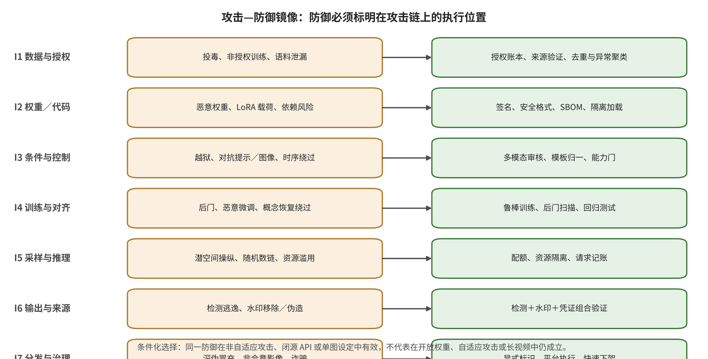

## 6. 跨接口纵深防御：组合、信任根与失效传播

### 6.1 七接口与五防御域的交叉映射

本文把防御归入五个域：数据与供应链、训练与条件、推理与资源、真实性基础设施、平台治理与救济。它们与 I1— I7 是交叉关系，而非七组互斥工具：数据域优先保护 I1/I2，训练与条件域优先保护 I3/I4，运行时域优先保护 I5，真实性域优先保护 I6，平台域优先保护 I7；同时每个域都可能截断上游失效的后续传播。矩阵中的“覆盖”只表示控制有相应入口，不表示在相同协议下经过了生产验证。

组合时先为每个风险选择一个最早控制，再增加独立失效模式的纵深层。例如，未授权主体素材首先由 I1 授权账本中断，I4 同意令牌控制个性化更新，I7 身份核验和副本处置限制现实传播；三者不应被加总为“三次成功”。相反，若上游没有数据身份，后续检查即使拦住一个输出也不能纠正训练来源。本文综合据此记录“受保护合同—执行主体—输入证据—正常效用—撤销动作—残余传播”，不提出普适最小集或统一最优组合。

### 6.2 数据、制品、参数与运行时信任根

信任根不是风险模型给出的高分，而是能够稳定回答“谁批准了什么对象、哪一版本在何处运行”的身份与状态。数据层依赖来源记录、授权主体和不可变清单；制品层依赖字节摘要、签名主体、透明记录与依赖图；参数层依赖训练编排身份、签名代码/数据清单、作业日志和独立评测集；运行时依赖租户绑定、策略发布签名、只追加日志及受控密钥。异常检测、后门扫描和审核器是可更新证据源，不能反过来充当这些对象的根身份。

信任根也必须支持失陷语义。签名密钥泄漏时，要区分历史上带可信时间证据的对象、可能受影响的时间窗和新签名禁用；数据撤回时，要区分后续训练排除与历史模型未消除；策略回滚时，要定位使用旧阈值作出的案件。C2PA 规范与安全指南提供签名、时间、撤销和信任锚的规范语义，但规范一致不等于业务事实真实或平台互操作 [@O001] [@O002]。缺少版本、时间和部署图时，所谓“撤销”最多是发布新状态，不能证明所有节点已停止信任。

### 6.3 真实性信号与平台行动的非替代关系

检测、水印、C2PA 与平台处置回答四类不同问题。检测是对现有媒体的统计推断，可覆盖不合作生成器，但受开集漂移和低基率误报影响；水印是在生成或编辑时嵌入的信号，证明的是相应检测合同下存在某信号，不直接证明事实或授权；C2PA 把签名声明、内容绑定与编辑关系组织成可验证来源链，凭证缺失不等于伪造，凭证有效也不等于叙事为真 [@O005] [@O001]。因此四者不能共用一个准确率，也不能用简单投票消解冲突。

平台行动是决策层：它把原始文件、检测、水印、凭证、身份、语境和政策证据转成标签、限制传播、人工复核、移除、申诉或恢复。平台厂商关于自动标签或信号来源的公告只能证明声明的产品接口；例如 YouTube、TikTok 和 Meta 的材料不提供跨平台准确率或申诉效果 [@O044] [@O045] [@O042]。若把检测分数直接升级为不可逆处置，会把统计误差变成账户、收入或表达损害；若把有效凭证当作免责，又会忽略恶意签名者、无授权使用和内容事实。正确组合是保留每个信号及版本，再由可重放案件记录作条件化行动。

### 6.4 撤回、版本、申诉与跨平台失效

撤回的对象和执行范围必须显式区分：数据记录可阻止后续训练，制品摘要可阻止受控节点新加载，检查点别名可回滚，水印或签名密钥可撤销信任，平台案件可恢复内容或收入。任何一种撤回都不会自动清除离线权重、用户下载、衍生媒体、CDN 副本和不参与平台。系统应保留对象标识、首次可能失效时间、处置时间、已确认节点和未覆盖范围，而不是以界面中的“已删除”概括全部状态。

申诉是防御正确性的一部分，而非检测后的行政附录。高后果行动需要可重放的原件摘要、解析器与模型版本、阈值、信任列表、政策条款和人工理由；规则或密钥纠正后，应能批量定位受影响案件并恢复。跨平台共享只能传递经签名、目的受限、带过期时间的事件证据，接收方仍需独立验证，防止误报随合作网络放大。32 项事件卡显示公开材料常缺生成器、初始账户、完整传播和申诉结果；因此跨平台处置只能陈述已观察动作，不能用下架数量推断风险降低幅度。

### 6.5 正常效用、成本、适应性绕过和拒绝门

每个组合控制都要同时报告正常效用与运行成本：数据筛查的长尾误删，制品准入的生态兼容，训练防御的保留能力，条件审核的合法误拒，缓存隔离的吞吐损失，水印的画质和时序影响，检测的低基率误报，以及平台行动的复核、申诉与受害者支持。适应性攻击会针对最弱依赖改变来源、组件组合、输入模态、媒体处理或传播渠道；因此“多层部署”只有在失效模式相对独立、证据被保留且处置可撤销时才增加防御价值。

拒绝门应由风险和证据缺口触发，而不是由某个排行榜阈值触发：无法确认制品身份时不进入生产；高风险主体缺少同意时不启用相应能力；多模态审核超时时高风险作业不静默放行；来源信号冲突时不自动作法律归因；无法保全高后果案件的申诉证据时不执行不可逆惩罚。开放权重、私域传播和跨境不合作使任何组合都有残余风险。故本章只给出“在这些依赖与成本下可组合”的逻辑，不声称存在对所有模型、模态、法域和平台均最优的最小防御集。

### 06.E1 证据展开：数据治理与组合供应链防御

> 证据截止日期：2026-08-09。本部分是分类型综述中的防御与部署章，不是异协议排行榜。“来源明确报告”“厂商部署声明”“本文跨来源综合”与“本地局部实验”分开表述。任何水印或检测的高 AUC，都不直接证明真实平台中的转码保留、低基率误报、人工复核、下架、防再上传和申诉已形成闭环。

#### 06.E1.1 证据口径与通用控制卡

防御的结果不只是“挡住了多少攻击”。本部分对每类控制使用同一张控制卡：保护接口、受保护资产、威胁假设、控制机制、执行主体、训练/推理改动、正常效用、时延与资源、误报/漏报、密钥或信任根、适应性绕过、组合依赖、撤销/更新、平台保留、失败处置和残余风险。经验与实现证据按论文作者实验（`AUTHOR_EVAL`）、独立攻击/比较（`INDEPENDENT_EVAL`）、本地有边界实验（`PARTIAL_RUN`）、静态工程审计（`STATIC_AUDIT_ONLY`）、厂商公告/系统卡（`VENDOR_CLAIM`）和现实事件级处置（`INCIDENT_OUTCOME`）标注；标准、法规与服务说明另标为只支持规范语义（`NORMATIVE_SEMANTICS_ONLY`）或官方服务范围（`OFFICIAL_SERVICE_SCOPE`）。只有 `INCIDENT_OUTCOME` 能直接说明“从证据到处置”的特定现实链条，但它也不能反推算法的通用准确率；规范和厂商来源均不得升级为独立效果实测。

#### 06.E1.2 从“文件可下载”到“运行时组合可信”

数据和供应链防御保护的不是一个文件夹，而是从数据候选、预处理、训练作业、基础权重、文本编码器、VAE、ControlNet、LoRA、运动模块、音频模型到推理容器的组合身份。威胁者可能只能公开发布少量图像，可能能发布一个签名但恶意的 LoRA，也可能获得仓库或训练作业权限。如果不先分层权限，“清洗数据”和“签名模型”就会被误写成互相替代的解决方案。

本章的最小安全合同是：（1）每个训练单元能回答来自哪里、是否授权、何时可撤回；（2）每个可执行或可加载制品有精确字节身份、发布主体和依赖图；（3）一个制品通过静态检查不代表它与其他组件合并后行为正常；（4）身份或密钥失陷后，可以停止新加载、找到已部署实例并回滚；（5）真实平台上的完整性证据不因缓存、量化、格式转换或镜像复制而静默漂移。

#### 06.E1.3 许可、来源、去重与撤回账本

数据账本的第一件事不是给每张图生成一个“合法/非法”布尔值，而是保留来源 URL 或库标识、抓取时间、许可版本、主体/表演者同意范围、语料用途、地域、保留期、删除请求和后续派生作业。文件 SHA-256 适合确认字节级身份，但相同画面的缩放、截图和转码会改变它；感知指纹可以帮助找近重复，但有碰撞、阈值与对抗操纵风险。因而工程上应并存精确哈希、多种感知表示、语义嵌入和人工复核状态，不用一个相似度阈值承担授权判定。

近重复去除同时具有隐私和安全价值：它可减少训练集中的局部高频样本，并为记忆/提取审计提供候选。但去重策略可能误删正常的连拍、新闻系列、动画关键帧或少数群体的长尾表达；视频又必须区分字节重复、单帧重复、片段重复和事件/轨迹重复。效用报告应同时给出去除率、误删率、少数类覆盖、训练成本变化和后续记忆审计，而不是只说“数据更干净”。

撤回要从一张数据记录传播到数据分片、中间缓存、特征库、训练作业、检查点、微调制品和近重复输出缓存。若无法从已完成训练中低成本消除影响，系统应记录“已从后续训练排除，历史版本未消除”，并将更强的遗忘或重训练作为风险决策，不得用用户界面上的“已删除”掩盖模型版本仍在服务。

#### 06.E1.4 投毒筛查、异常聚类与训练前隔离

Nightshade 类定向投毒说明，攻击者可以利用图像表示和描述之间的差异让少量样本进入大规模语料，因而简单的 URL 阻断或像素重复检测不够 [@P005]。可执行的数据网关应先做格式解码与恶意载荷扫描，再对图像—文本一致性、语义局部密度、来源集中度、类内近重复和与已知投毒策略的结构相似性进行多视角筛查。被标记样本进入不能执行外部代码、不直接进入生产训练的隔离区；对高风险来源按上传批次、时间窗和账户联系追踪，避免只在单样本上判断。

正常效用的主要代价是长尾数据损失、复核人力和训练延迟。误报是有特色的艺术风格、少数语言描述或新闻现场图被判为异常；漏报是自适应攻击者模拟正常来源、重描述或将毒性分散到多个账户。所以阈值不应永久固定：需保留筛查模型版本、人工翻案样本、后续训练异常和攻击簇并定期重校。信任根是数据集清单的不可篡改存储、审批身份和独立留存的样本哈希，不是异常检测器本身。

#### 06.E1.5 个体保护、同意与“训练前摩擦”的上限

Glaze、Anti-DreamBooth 与 DiffusionGuard 以对抗扰动保护风格、主体个性化或图像编辑，证据属于特定模型、预处理链和攻击预算内的作者实验 [@P019] [@P020] [@P022]。它们的保护接口是训练或编辑输入，执行主体是内容拥有者或发布工具，优点是不要求改变攻击者的模型服务。代价是图像像素改动、处理时间、跨模型迁移不确定和对授权编辑的阻碍。LightShed 对这类扰动的检测/净化表明，攻击者可把保护机制本身作为学习目标 [@P023]。

因此这类方法应被定位为“训练前摩擦”，不是法律许可、数据删除或平台处置的替代。组合防御应把扰动、授权账本、身份验证、采集退出、个性化作业同意令牌和后续输出处置联系起来。请求撤回时，系统不能只删上传原图：还要禁用主体标识符、停止相关微调作业、下架 LoRA、更新近似匹配索引并保留可审计的处置原因。

视频保护还要考虑帧抽样、光流、编码和时序一致性。逐帧独立产生扰动可能造成肉眼可见的闪烁，也可能在视频压缩后被消弱；对一幅首帧有效不等于对整段图像到视频的身份沿用有效。评测分母必须同时有帧、片段、视频和主体四层，正常效用包含时序稳定、授权编辑成功和转码后观感。

#### 06.E1.6 安全序列化、精确签名、SBOM 与受信仓库

模型权重文件是数据还是程序，取决于加载器。Python pickle 可在反序列化时执行代码；Hugging Face 的官方文档明确建议仅从可信主体加载、使用签名提交和 safetensors，并说明导入扫描是 best-effort、并非 100% 防护 [@O037]。PyTorch 自 2.6 起在调用方未传入 `pickle_module` 参数时，`torch.load` 默认使用 `weights_only=True`；它收窄动态导入和任意对象构造面，但官方文档仍列出拒绝服务、可能的内存破坏和下游恶意对象风险 [@PyTorchSerialization2026]。所以安全格式是去掉一类执行面，不是对权重行为的安全证明。

制品发布应绑定：不可变摘要、发布者身份、签名/时间戳、训练代码提交、基础模型 ID、数据清单版本、超参数、转换工具、量化参数、许可和已知风险。SBOM 不只列 Python 包，还要列文本编码器、VAE、ControlNet、LoRA、运动模块、调度器、自定义 CUDA/编译扩展和服务镜像。Sigstore/Cosign 等制品签名可将签名、短期证书和透明日志证明放入 bundle，用于证明特定字节的发布链 [@SigstoreBlob2026]。但签名不证明签名者良性，也不证明 LoRA 与指定基础模型合并后没有触发器。

受信仓库需要做“准入—隔离—发布—撤销—溯源”全链：未签名或未登记制品不能进入生产；高风险格式在无网络、只读文件系统、低权限容器中解包；分析结果与制品摘要共同签名；被撤销版本无法被新作业引用；运行时遥测能回到具体制品图。误报是不常见但正常的自定义操作被拦截，漏报是恶意逻辑不在静态导入中暴露或制品本身只含行为后门。失败时应默认不加载而不是跳过检查，但也应提供带审批的隔离研究路径。

#### 06.E1.7 组合行为差分：供应链防御的最后一公里

对可组合生成栈，真正的审计单位是“基础模型 + 文本编码器 + VAE + 控制/风格/主体 LoRA + 运动/音频模块 + 采样器 + 量化 + 运行时”的实例。测试分三层：单制品静态审计，二元/高风险组合的行为差分，以及生产运行时的漂移监测。行为差分固定提示集、负面提示、随机种子、采样步数和输出判定器，比较加载前后的拒绝、目标触发、正常任务、身份相似、内容策略和资源曲线。视频还要固定片长、帧率、运动条件、镜头脚本和音频，检查只在组合时出现的跨帧或音画触发。

组合空间不可能穷尽。因此要优先测试权限高、受欢迎、新上架、共享编码器或需执行自定义代码的制品，并使用覆盖阵列而不是随意选样。发布后的处置包括废弃摘要、更新组合允许列表、消除节点缓存、取消长作业、对已产生内容做风险通知，而不是只从下载页删除。如果签名密钥或仓库账号失陷，需将“身份仍为真”与“签名时刻已不可信”分开呈现，撤销结果应在离线节点刷新后才能完成闭环。

#### 06.E1.8 本章综合：可接受的主张上限

数据账本能证明某笔记录的来源和处理状态，不能自动解决法律授权；签名和哈希能证明字节与签名主体，不能证明行为良性；安全格式能去除一部分反序列化执行面，不阻止模型后门；扰动式个体保护能提升特定攻击成本，不是永久撤回。综合而言，这一层的部署目标是让每个数据和制品有可追踪身份、最小权限、组合评测和可撤销去向，并把未覆盖的组合明确标为残余风险。

**表：数据与供应链防御的条件和失败**

| 控制 | 保护接口 | 执行主体 | 最低机制 | 主要失败条件 |
|---|---|---|---|---|
| 许可与来源账本 | I1 | 数据治理、训练平台 | 记录来源、用途、撤回和派生作业 | 历史模型影响可能无法低成本消除 |
| 多表示去重与异常聚类 | I1 | 数据入口 | 精确哈希+感知+语义+人工复核 | 长尾误删与自适应投毒 |
| 隔离解码与安全序列化 | I2 | 制品入口 | 无网络低权限加载、安全格式 | 行为后门不依赖代码执行 |
| 签名、SBOM 与透明日志 | I2 | 仓库、构建平台 | 绑定字节、主体、依赖与转换 | 签名者可恶意或密钥失陷 |
| 组合行为差分 | I2、I4 | 发布门禁 | 固定条件比较组件加载前后 | 组合空间无法穷尽 |
| 同意令牌与撤回 | I1、I4、I7 | 个性化产品 | 绑定主体、用途、期限与导出权限 | 已下载开放权重难以远程失效 |

注：数据源为 `paper/tables/data_supply_defense.csv`；正文显示 6/8 行并对过长单元格作省略，完整字段与记录以该 CSV 为准。

### 06.E2 证据展开：训练、安全对齐、概念擦除与个性化防御

#### 06.E2.1 保护的是更新合同，而不是一次评测的模型印象

训练和对齐防御首先保护 I4：参数更新应由被授权的数据、代码、目标函数和操作主体产生，并在新的微调、合并、量化或采样器下保持预期的安全行为。威胁假设至少分为三档：开发者自己可控的数据/训练流被污染；第三方提供了表面正常的检查点或适配器；攻击者只在部署后使用提示、图像条件、学习嵌入或短时再微调来恢复被擦除能力。这三档对应可信训练、制品验收和自适应安全评测，任一层都不能独立覆盖其他层。

执行主体包括训练平台、模型安全团队、数据治理者、个性化产品所有者和独立红队。信任根是受保护的训练编排身份、已签名代码/数据清单、不可篡改的作业日志和独立保留的评测集。训练 loss 下降、干净样例观感正常或单一安全分数通过都不是完整性证据。正常效用要同时测提示遵循、主体一致、时序质量、安全内容的误拒和任务外性能。

#### 06.E2.2 可信训练、后门扫描与参数回滚

后门防御不应只寻找一个已知像素触发器。BadDiffusion、TrojDiff 以及视频场景的 BadVideo 已将触发表示扩展到噪声分布、语义条件和时空元素，防御评测要按攻击者控制训练的程度、触发持久性和目标类型分层，而不合并异构 ASR [@P001] [@P002] [@P007]。训练前对数据批次、梯度异常、训练脚本与初始噪声进行身份检查；训练中监测局部类或提示的异常收敛、批次来源与模型差分；训练后在多采样器、多种子、多义表达、图像/潜空间条件与视频运动上搜索。

后门扫描的误报是调色、特殊艺术风格或罕见运动被判为触发，漏报是触发依赖同义词、多轮上下文、组件组合或延迟帧。运行开销可能是大量生成样本和多模态判定器，这会与生产时间表直接冲突。因此发布门禁应设定可追踪的最低覆盖率而不是一次性“已红队”标志。如果发现可重现触发，处置应包括冻结检查点、保全作业证据、阻止下游微调、追踪已部署版本、回滚并用新的攻击集复验。

#### 06.E2.3 概念擦除与机器遗忘：“找不到”不是“不存在”

ESD 和 Ablating Concepts 把概念控制部署在模型参数，AdvUnlearn 进一步将对抗条件纳入学习 [@P014] [@P015] [@P016]。这些工作支持“参数更新可降低特定协议中的概念可生成性”，但不支持“概念已从所有表示中永久删除”。检验必须同时包含擦除集和保留集，固定基础模型、概念定义、攻击预算和正常效用，并让攻击者使用别名、组合描述、多语言、图像条件、学习嵌入、潜变量和短时再微调。

误报是近邻合法概念或艺术史语义被连带压制，漏报是未见表示空间恢复目标。这种防御的“密钥”不是密码学密钥，而是概念定义、保留集、策略阈值和攻击套件；信任根是这些资产的版本与审批。更新机制应允许新增表达、回归旧攻击并将误伤概念加入保留集。若新攻击成功，不应立即声称模型“完全失守”；应定位失败表示、评估正常效用后重新擦除，并在修复前用推理层能力门和输出复核封住暴露面。

视频概念比单帧对象更难定义。“某人”可以由面孔、声音、动作与环境共同表示，“某事件”可能只在帧顺序上成立。如果训练只对单帧文本概念做擦除，不能声称已处理动作、镜头语义或音画身份。视频双重测试需要帧级内容保留、片段级事件拒绝、轨迹身份和音画一致四类分母。

#### 06.E2.4 安全对齐、再对齐与自适应红队

对齐的目标是让模型和产品在有害条件下拒绝、安全转化或将请求交给更严格能力门，同时对正常创作保持可用。训练时可结合策略数据、对抗条件、保留/拒绝对和采样期安全目标；但输入审核、参数对齐与输出审核是三个不同控制位置。只用历史红队提示训练容易过拟合固定词表，因此发布前应分出未见攻击者，并显式允许黑盒、代理迁移、多模态和长上下文攻击。

高拒绝率可以来自系统真正识别有害意图，也可能只是过度拒绝了医学、新闻、艺术或少数语言。因此同一张表要报告：有害请求中的有效响应分母、有害输出、拒绝、正常请求误拒、边界请求成功和多语种/不同用户组。对视频还要报告产生一半才被拦截的 GPU 秒、最长漏检区间和首次告警时延。运行时若攻击簇迅速增长，应先收紧能力门、保留证据，再在离线修复参数；不应为追求上线速度直接用新对齐检查点覆盖可回滚版本。

#### 06.E2.5 个性化的同意令牌、权限边界与撤回

个性化应把“拥有照片”与“获得模型建立/视频演绎权”分开。最小同意记录应指明主体、申请者、输入类型、允许用途、禁止主题、模态、地域、有效期、是否允许导出权重/视频和撤回窗口。平台在上传前完成身份核验，训练编排器仅接受与作业参数绑定的短期令牌，发布器检查导出权和到期时间，下游生成请求再核对主题范围。

撤回必须具有服务级语义。如果 LoRA 已导出到用户设备或开放仓库，中央平台无法让全部副本失效；它能做的是撤销受信状态、阻止再分发、向合作平台发风险信号、停止后续训练并对已知输出提供处置渠道。因此用户界面应显式告知“中央撤回不能擦除已下载副本”。这一残余风险是开放权重生态与闭源 API 之间的根本差异，不应被更精美的同意页面掩盖。

#### 06.E2.6 本章综合：参数防御必须与运行时封锁互补

### 06.E3 证据展开：推理时条件审核、能力门与资源防御

#### 06.E3.1 推理防御的系统边界和记账单位

推理层保护 I3 与 I5：条件不得越过策略/授权边界，租户不得读取或影响他人状态，一个请求不得无界放大 GPU、显存、队列和账单，输出不得未经最后审核直接进入分发。攻击者可能只能黑盒调用，但可以分布式发请求、观察拒绝或时延、反复试探边界；灰盒用户还可提供参考图、首尾帧、掩码、运动轨迹或自定义 LoRA。

记账单位不能只是单个 HTTP 请求。应建立“用户/租户—会话—作业—派生重试—输出—发布”链，并为每层记录实际消耗、政策版本、检查结果与处置。信任根是身份/租户绑定、策略发布签名和只追加审计日志；审核分数是证据，不是信任根。日志要有最小化和保留期，否则防止滥用的监控会变成提示、主体图像和生成结果的新隐私库。

#### 06.E3.2 多模态规范化、语义审核和授权差分

第一道网关先解码和归一化：字符编码、同形异义字、隐藏 Unicode、文本 OCR、图像内容、掩码、姿态、深度、轨迹、音频转录和元数据要在同一请求对象中可见。然后分别做策略语义、身份/授权和技术安全检查。“描述某人”可能符合一般内容策略，但没有获得该人的个性化同意；“更换背景”可能本身正常，但掩码越过了授权编辑区域。因而一个统一有害分数无法代替这三种判断。

对语义审核的误报常见于否定、引述、教育、历史与少数语言；漏报来自同义替换、长上下文分散、文字与图像条件拆分、只在运动后形成的语义。SneakyPrompt、MMA-Diffusion 和概念检索类工作表明，固定词表或只审文字的控制存在可明确表述的失败面 [@P008] [@P009]。防御更新应从翻案和绕过样本生成新语义测试，但不把具体恶意提示暴露给审核 API。高不确定性请求可转为需用户确认编辑范围、需更强身份核验或仅输出低风险草图，而不必只有“通过/拒绝”两种结果。

#### 06.E3.3 能力门、查询关联与分层开放

能力门根据身份、年龄/组织、使用场景、主体同意、模态、分辨率、片长、上传输入、自定义制品和发布范围定义权限。例如，未验证用户可只使用短、低分辨率、不含真实人物上传的生成；已验证企业也不应默认获得他人肖像个性化或无限批量生成。Sora 2 系统卡所述的输入阻断、输出阻断、未成年人更严阈值、能力限制、举报和人工复核是厂商部署声明，可说明架构位置，不等于独立地证明各类攻击下的效果 [@O020]。

查询关联不只计数，还观察对同一目标的绕过收敛：连续的同义替换、参考图递进、掩码扩展、首尾帧建造和多账户分散。执行需要账户/设备/支付/组织等有限信号，因此必须定义目的限制、保留期和申诉。误报可能冻结正常反复创作，漏报可能来自分布式低速账户。高风险响应应从降低并发、延长冷却、禁止外部发布到暂停账户递进，并保留足以说明决策的记录。不能把检测阈值和账户关联特征全部回显给攻击者，但要向被处置用户告知策略类型、影响和申诉途径。

#### 06.E3.4 采样期安全引导与输出片段复核

采样期安全引导能在不重训基础模型的情况下改变潜空间轨迹，而输出审核检查已形成的画面、动作、身份和音频。两者的差异决定了成本与失败模式：采样期引导每步都可能增加计算并伤害提示遵循，输出审核可能在高成本生成完成后才阻断。图像可以全图复核；视频需同时使用密集帧、滑动片段、镜头边界、身份轨迹和音画联合检查，否则延迟出现的载荷会落在抽帧空隙中。

评测不能只给帧级平均准确率。应报告片段级事件召回、最长漏检区间、首次告警时延、局部伪造定位、切镜后身份重识别、配音/网络延迟下的正常误报、GPU 秒与丢弃输出比例。对流式数字人，系统应有中断输出、降级成静态/无声模式、标记风险片段和保留有限证据的处置路径。如果多模态审核超时，高风险能力应 fail closed；低风险创作可以降级，但不应静默略过。

#### 06.E3.5 租户隔离、缓存分区、预算与成本熔断

推理服务的安全属性包含机密性、完整性和可用性。近似缓存会用语义相似性复用中间状态，因而缓存键必须绑定租户、模型/适配器组合、安全策略、精度和输出范围；跨租户复用即使提升吞吐，也需要独立隐私和投毒威胁评估。命中信号和延迟可能泄露其他用户的提示分布，缓存内容也可能被毒化；缓存分区、来源绑定、命中信号平滑、短生命期和一键失效是镜像控制。

资源防御要同时设定提示/参考输入大小、分辨率、帧数、生成步数、控制分支数、并发、排队、重试和租户 GPU 秒/账单预算。熔断不只看 QPS：当单作业显存、队列头阻塞、重试放大或下游转码积压超阈时，可停止长视频、降低分辨率或将作业转离互动队列。误报是合法的长视频/批量工作流被限制，漏报是分布式低速作业或优惠/重试逻辑绕过计费。评测应与等资源正常重负载对照，报告 P50/P95/P99 时延、吞吐、峰值显存、GPU 秒、失败重试和单任务成本。目前生成专用 DoS 的高等级一手实证仍稀缺，因而这部分是威胁建模与最低部署契约，不宣称已证明某一最佳阈值。

#### 06.E3.6 日志、撤回、申诉与残余风险

每个输出应能回答使用了哪个模型组合、哪版策略、哪些检查器和什么处置，但日志不应默认保留完整敏感提示、主体图片或被阻断的私密内容。可使用结构化策略标签、不可逆请求摘要、限时加密证据库和带审批的调取。规则、模型、检测器、信任列表和限额必须都有版本，可分批发布、快速撤回和完整回归。

误拦的用户需要可理解的原因类别和申诉通道；但系统不必泄露可直接用于绕过的模型分数和精确阈值。申诉结果应回流到误报集和策略校准，却不能把人工一次特例自动升格为全局允许。即使输入、采样和输出都审核，开放权重仍可在平台外绕过控制，闭源 API 也无法判断所有现实身份、同意和语境。因而本章输出是可更新的风险网关，而不是对有害生成能力的彻底消除。

**表：训练、条件与推理防御的部署合同**

| 控制 | 接口 | 部署时点 | 最低机制 | 残余风险 |
|---|---|---|---|---|
| 可信训练与作业签名 | I4 | 训练前、中 | 代码数据清单、身份、批次追踪 | 不能证明无未知后门 |
| 后门扫描与发布回归 | I4 | 训练后 | 多触发、多种子、多采样器 | 搜索覆盖不足与适应性触发 |
| 概念擦除+保留集 | I4 | 训练、微调 | 擦除与正常效用双分母 | 别名、图像条件和再微调恢复 |
| 多模态输入规范化 | I3 | 请求入口 | 文本、OCR、图像、轨迹、音频统一对象 | 长上下文和跨模态分散 |
| 身份、用途能力门 | I3 | 入口与编排 | 同意、年龄、场景、片长、导出分层 | 跨账户与离线开放权重 |
| 采样期安全引导 | I5 | 生成循环 | 按步约束潜空间并记录额外开销 | 质量下降和新表示绕过 |

注：数据源为 `paper/tables/training_condition_inference_defense.csv`；正文显示 6/9 行并对过长单元格作省略，完整字段与记录以该 CSV 为准。

### 06.E4 证据展开：检测、水印、指纹、签名与真实性基础设施

#### 06.E4.1 真实性不是一个可由单模型输出的标量

“这是 AI 生成的吗”、“这个文件在签名后改过吗”、“这个画面与受害者提交的文件相同吗”、“这份来源声明由谁签发”和“画面中的事情真实发生过吗”是五个不同问题。前四个可由技术证据部分回答，最后一个需要与外部事实、取证、上下文和责任主体连接。NIST AI 100-4 将内容认证/来源、标记/水印、生成检测、源头防止和软件测试并列为不同技术路线，而非一个真假分数 [@O005]。C2PA 规范本身也强调，它不对来源数据是“好”还是“坏”做价值判断，而是让关联、格式、签名与篡改可被验证 [@O001]。

因此真实性基础设施应使用“多证据保留原则”：保留每个信号的原始结果、媒体版本、解码成功与否、阈值/信任列表版本、不确定性和冲突，再由策略层作出标签、限流、人工复核、下架或保留等决策。“未检出水印”不能改写成“非 AI”；“C2PA 签名有效”不能改写成“内容为真”；“检测器高分”不能改写成“由某用户使用某模型生成”。

#### 06.E4.2 六种证据层的正式区分

**内容检测（detection）**是对已有图像或视频计算生成/篡改可能性、局部伪造区域或生成器属性的统计推断。它不要求生成时注册或持有密钥，因此可以覆盖没有合作的生成器；但分布漂移、平台压缩、未见生成器、后期摄影和自适应扰动会使误报与漏报显著变化。GenImage 与 DeepfakeBench 的价值是把跨生成器、退化和统一预处理问题变成明确基准，不是证明任一检测器可直接开放世界部署 [@R-A017] [@P035]。

**嵌入水印（watermark）**是在生成、摄影或编辑时将信号加入像素、频域、潜空间、视频时空状态或音频中。其证据合同是“一个具有检测能力的系统在某类变换后找到某信号”，而不是对内容事实、身份授权或整条编辑史的证明。典型权衡是鲁棒性—不可感知性—载荷容量—嵌入/检测成本；密钥复用、检测 API 泄露和多样本共谋会引入新风险。

**内容指纹（fingerprint/perceptual hash）**从内容固有特征计算索引，不向像素额外嵌入信号。它适合查找已知文件的近重复、恢复丢失的来源声明、阻止已知 NCII/CSAM 再上传；但对全新生成的类似场景、大幅裁剪/重演、阈值边界与对抗碰撞有限。C2PA 2.4 将 fingerprint 定义为可识别内容或近重复的固有属性集，并将它与隐形水印一起归为 soft binding，但实施指南要求软绑定匹配经验证，不得替代 hard binding [@O001] [@C2PAGuidance24]。

**精确哈希与数字签名（hash/signature）**对字节串或按规范排除某些容器区域后的绑定计算摘要，再用私钥对声明签名。它对未授权篡改有强的可检测性，但普通重编码也会改变精确字节；信任取决于签名者身份、证书链、时间戳、撤销查询和私钥保护。签名者可以恶意，密钥可以被窃取，所以“签名有效”与“声明可信”必须分开。

**C2PA/Content Credentials** 是把资产内容绑定、签名声明、操作、成分关系、验证状态、证书信任和可选软绑定组成的来源协议。它不是水印算法，但可记录水印/指纹算法并通过仓库恢复被剥离的 manifest。它证明“声明与资产在指定信任模型下可验证”，不证明摄影场景、叙述或签名者所填字段为真。

**平台标签与处置记录**是策略层证据：标签可以来自用户披露、C2PA、厂商水印、内部检测或人工复核，处置可以是保留、限制推荐、增加语境、阻止变现、下架、防再上传或交给执法。这一层的效果必须用事件时间、触达、误处置、申诉和重复上传测量，不能用上游 AUC 代替。

#### 06.E4.3 内容检测：开集、低基率和自适应攻击

检测器的最小评测合同包括真实媒体来源、已见/未见生成器、内容类型、解析度、编解码链、编辑、对抗预算、类别基率、阈值和人工翻案。论文内部平衡数据的 95% 准确率，在千分之一真实阳性的上传流中可能仍产生大量假阳性。因而平台应报告固定极低 FPR 下的 TPR、精确率/阳性预测值、不确定区间、不可判定比例和人工复核能力，而不只是 ROC-AUC。

开集漂移不是一次性“泛化测试”可解决。模型更新、相机计算摄影、社交平台滤镜、HDR、截图、拼图、局部生成和再生成都改变统计特征。视频需在帧、片段、视频、镜头和身份层次分别校准；随机抽帧可能错过局部伪造，帧级多数投票会淹没短片段攻击。音画异常可帮助检测，但正常配音、网络延迟、多语言和遮挡会产生误报；当攻击者联合生成面孔、声纹和口型时，这类异常又可消失。

检测系统的信任根是数据版本、阈值审批、输入解码与运行时完整性，不是模型网络的不可解释权重。自适应绕过包括白盒梯度、代理迁移、查询试探、压缩下保留的扰动和只修改高显著区域。更新要评估新生成器和新媒体链，但旧阈值仍要保留以重建历史决策。高分检测仅应触发额外证据检查或有限临时措施；对永久下架、法律归因或账户惩罚，需要来源、身份、上下文和人工复核。

#### 06.E4.4 水印的五个独立任务：嵌入、检测、载荷、定位和归属

稳定签名、Tree-Ring 与众多生成时/后处理水印使用不同嵌入位置，所以它们的威胁假设不可直接排名 [@P028] [@P029]。一个系统可能只回答是否存在信号，也可能解码生成器/账户 ID；对局部编辑又需要时空定位。归属还要求密钥、载荷注册库与冲突规则。所以“检出率”不能代表载荷 bit accuracy、局部定位 IoU、误归属率或多用户共谋安全。

水印攻击至少有四个目标：移除真水印、在未注册内容中伪造信号、将甲主体信号转移到乙内容、使一个局部修改不被定位。WAVES 的价值是在共同攻击套件与感知质量下比较多种图像水印，但其结论仍限于所选算法、数据和攻击集 [@P030]。生成式再生成移除、利用公开 VAE 近似 Tree-Ring 潜空间的移除、黑盒伪造、可控再生成，以及把水印图像视为初始帧并用 next-frame prediction 生成语义近似后继图像的移除等一手攻击证据表明，开发者必须分别测试移除与伪造，并将可得样本数、查询、密钥知识、感知质量和平台编码列为攻击预算 [@P031] [@A059] [@A060] [@A061] [@A062]。这些结果不支持“所有水印必然失败”，而是要求每个鲁棒性主张都说清威胁模型；其中 Crack in the Bark 直接支持的是特定 Tree-Ring 移除，伪造证据来自另列的黑盒伪造研究。

密钥与载荷生命周期包括生成器主密钥、每版本子密钥、每租户/每资产随机化、检测服务限流、密钥轮换、泄露撤销和历史验证。完全公开检测可提高可审计性，也可向自适应攻击者提供反馈；完全闭源可限制查询，却引入不透明误归属和厂商锁定。可行折中是公开协议与评测契约，保护生产密钥，向独立审计者提供受控的黑盒或执行环境，并保留公开的误报申诉。

#### 06.E4.5 本地局部实验对水印与元数据的证据上限

本项目实际运行了一个程序化合成媒体环境：6 张 512×512 图像、48 帧、8 fps、6 秒的无声视频，使用 32 bit 全局 DCT-QIM 玩具水印、字节级 SHA/HMAC 与 PNG/MP4 玩具元数据 [@DitseReproduction2026]。这是 `PARTIAL_RUN`，不是任一论文复现，HMAC 密钥公开在配置中以便复算，不是生产公钥签名，元数据也不是 C2PA。

局部观察有明确但很窄的证据上限：精确 SHA/HMAC 只对原字节成功，任何重编码或像素变换即失效；玩具元数据是否存活取决于处理链是否复制，无损重封装也可在显式剥离时立即丢失；DCT-QIM 在所测 JPEG、缩放、噪声和模糊下存活，但图像中心 80% 裁剪后 0/6 检出，视频同类裁剪后 0/48 帧检出；视频 CRF35 和 250 kbit/s 下分别只有 21/48 与 18/48 水印帧检出，CRF35 干净对照还出现 1/48 假阳性。

这些数字的分母是固定合成模板的派生媒体，不是独立自然视频或多生成器研究；420 个视频变换帧不是 420 个独立研究单元，不可用于推断真实部署 FPR。它们只支持一个工程结论：精确完整性、容器元数据和内容内嵌信号的失效面不同，部署必须分层并对实际转码链测量。它不支持玩具水印、HMAC 或元数据可以解决真实性。

#### 06.E4.6 C2PA 2.4：绑定、声明、信任与直播视频

截至本综述时间窗，C2PA 官方规范站的现行 2.x 版本是 2.4（2026 年 4 月）。这一版引入 crJSON 派生视图、repository receipt 声明、新资产格式/声明，并对操作、成分、动态视频和密码学做扩展 [@O001]。crJSON 是由 C2PA 数据派生、用于配置评估/互操测试/验证报告的 JSON-LD 视图，它本身不可独立验证也不是输入格式。这个边界很重要：用平台导出的简化 JSON 作为法医原件，会丢失签名和二进制容器链。

核心验证将声明格式、签名、可信时间戳、证书状态、断言、成分和资产 hard binding 分步处理，并区分 Well-Formed、Valid 与 Trusted。Valid 要求签名通过、签名时刻落在凭据有效窗口，并结合可信时间戳与 OCSP/撤销信息判断签名时状态；Trusted 还要求证书链连到已知 trust anchor [@O002]。因此，证书后来正常过期不自动否定带有合格时间证据的历史签名；这三个状态也都不表示“事实真实”。验证器是处理不可信输入的解析器，C2PA 实施指南显式提醒内存安全、解析、SSRF、信息泄露和 DoS；不应为查远程 manifest 让验证服务获得任意网络权限 [@C2PAGuidance24]。

规范对剥离边界的表述很清楚：完整或局部修改 manifest 内被签名保护的数据可被验证发现，但 C2PA 不保护整份 manifest 从资产中被删除 [@O002]。当社交平台重编码或删元数据时，soft binding 可用水印或指纹在 manifest repository 中恢复候选；但近似匹配不精确，应对返回结果做缩略图/内容绑定验证并提供人工复核。当一个水印作为 bound soft binding 时，manifest 中需有对应 `c2pa.watermarked.bound` 动作和 soft binding assertion；C2PA 本身不指定某个水印算法。

对普通或分片 ISO BMFF/MP4 资产，C2PA 2.4 延续 BMFF hard binding，可用 BMFF hash map 与 Merkle 结构绑定分片资产；把多个片段简单拼接并不自动产生符合规范的单文件。如需在两种打包形态间转换，重包装应作为 ingredient 并记录 `c2pa.repackaged` [@O001]。

直播与动态打包是另一套段级验证合同：规范为 ISO BMFF/CMAF 给出逐段 Manifest Box，或由会话密钥签名的 `verifiable-segment-info`；其中逐段 manifest 的 `bmffHash` 不使用 Merkle 选项。MPEG Transport Stream 仍不在该规范支持范围内 [@O001]。这表明真实视频保留不是“拷贝一个元数据字段”，而是打包器、CDN、编辑器、平台转码与播放器共同实现的协议；普通 fMP4 的 Merkle 绑定结果不得直接外推为直播段验证效果。

#### 06.E4.7 C2PA 信任列表、撤销、仓库回执与隐私

C2PA 于 2025 年中启动官方一致性计划和 Trust List，临时列表于 2026-01-01 冻结；官方 Conformance Explorer 提供生成器、验证器与信任列表的动态记录 [@O003] [@O004]。Trust List 管理受信锚与合规证书颁发机构，不等同于终端或中间签名凭据的实时撤销查询；后者还需结合可信时间戳、OCSP/证书状态及验证器的网络失败策略 [@O002]。因此“旧 Trust List”主要影响信任锚集合，“撤销状态陈旧或不可达”影响具体凭据状态，两者必须分别记录。规范一致性或列表收录可增强实现对规范的信心，但不是业务真实性审核，也不能单独证明跨厂商实现已经互操作。

撤销计划必须在事故前建立。密钥可能直接泄露，也可能是攻击者获得 HSM 签名请求权。C2PA 安全指南对计划退役、密钥失陷和更大 PKI 事件区分处理，并说明缺少可验时间戳时，撤销可能导致无法判断签名是否早于失陷 [@O002]。运营者需要把证书标识、首次可能失陷时间、发现时间、撤销时间、受影响 manifest 和对外通知联系起来，而不是只更换一把新钥。

2.4 新增的 repository receipt assertion 可在 update manifest 中记录 manifest 被某仓库接收和可在某 URI 验证的仓库特定证明 [@O001]。它能为“某时刻已登记”和 manifest 丢失恢复提供新支点，但 proof 字段语义由仓库定义，不能认为所有仓库保证同一等级的不可抵赖。软绑定查询还可能泄露用户在查什么媒体；指南建议尽量在客户端计算绑定并对仓库查询明确 opt-in。永久、公开的来源还可能暴露摄影者身份、地点或已编辑前的敏感版本，所以数据最小化、选择性披露、离线验证与纠错渠道应与持久性共同设计。

#### 06.E4.8 SynthID：厂商嵌入与公众验证能力的边界

Google DeepMind 的官方页面将 SynthID 描述为在 Google 生成产品的图像、视频片段、音频与文本中嵌入信号的工具；视频水印声明目标包含裁剪、滤镜、帧率变化和有损压缩下的存活，并可通过 Gemini 上传媒体进行检查 [@O029] [@GeminiVerify2026]。后一官方帮助文档也提供了必要的负面语义：未检出 SynthID 只能表示未识别为 Google AI 生成/编辑，内容仍可来自其他 AI；简单/抽象内容或幅度很小的编辑可令结果不确定；多次变换后仍可漏检；视频中某一区间检出不表示该区间的每个部分都有信号 [@GeminiVerify2026]。

截止日前，OpenAI 官方帮助页也表示在 OpenAI 生成图像中组合使用 C2PA 与 SynthID，并将两者统一放入官方验证工具的来源信号 [@OpenAIProvenance2026]。这证明产品声明与跨厂商采用，不自动证明在不同社交平台、视频复合编辑、屏幕录制或自适应移除下的独立存活率。SynthID 检测根及具体检测协议是厂商控制的；平台若用它触发不可逆处置，必须另外提供样本保全、分数版本、独立复核、误归属申诉和密钥事故通知。

#### 06.E4.9 VideoSeal、VideoShield 与视频时空存活

VideoSeal 是可嵌入任意图像/视频的开放神经水印框架，其作者将编码等变换纳入训练，并用 temporal watermark propagation 避免对所有高分辨率帧完整嵌入 [@P033]。官方仓库提供整视频、音画和分片流式路径，也明确整段音画脚本将完整视频加载内存、不适合长视频，需使用流式推理 [@VIDEOR]。这些是开放实现与作者评测，本项目对仓库状态仅为 `STATIC_AUDIT_ONLY`，没有下载检查点或运行论文基准。

VideoShield 把生成时信号嵌入视频扩散模型的噪声/潜状态，通过反演恢复水印，其保护对象、所需模型访问和可适用的视频生成架构与 VideoSeal 不同 [@R-A020]。两者不应用论文内最高数字排名。共同评测合同应对同一视频内容、解析度、帧率、码率、载荷、低 FPR 阈值和资源预算，逐项及组合测试重编码、缩放、裁剪、抽帧、插帧、变速、切镜、拼接、局部替换、录屏、音轨替换与平台多次转码。

视频指标必须包含：整个视频是否有信号，片段检出与定位，最短可检片段，最长漏检区间，可解载荷准确率，干净假阳性，视频质量/时序闪烁，嵌入吞吐，检测延迟，峰值内存与单小时视频成本。直播还要测量状态丢失、分片乱序、断流恢复、动态码率和音画不同步。不经过实际 CDN/转码器/下载链的结果只能说是论文或实验室变换下的鲁棒性，不能称平台保留率。

#### 06.E4.10 从生成到申诉的来源生命周期

一条可运营的生命周期如下：生成器按资产嵌入水印/载荷，生成 C2PA manifest，用受保护密钥签名，将签名、模型/编辑操作和软绑定写入；可选将 manifest 注册到仓库并保存回执；编辑器使原资产作为 ingredient，在新版本记录操作并重签名；打包/转码器为新字节创建可验证的新条目，而不复制已无效的旧签名；平台上传时同时保存原文件验证结果和每个传播输出的存活结果；消费者见到的是分层语义，而不是绿色“真”徽章。

在元数据被剥离时，平台可尝试水印或指纹恢复候选 manifest，但必须把恢复证据与原生 hard binding 验证区分。当水印、C2PA 和内容检测冲突时，不应投票：有效 C2PA 可能由恶意签名者产生，水印可能被转移或伪造，检测器可能分布外误报。处置应保全原文件，查签名主体/撤销/时间戳，检查软绑定的内容一致性，在厂商或权利人渠道验证载荷，并由人工考虑事件上下文。

撤销要同时处理签名证书、水印检测密钥/算法版本、manifest repository 映射、平台缓存和人机界面。对过去签名内容，顺序更换密钥应尽可能保留旧签名的历史有效性；密钥失陷则要标记首个可能影响时间窗，不能一概把所有历史内容显示为“伪造”。申诉需保留用户上传原始文件、验证器/信任列表版本、原始状态码、检测结果和最终人工理由，从而可重建当时决策。

#### 06.E4.11 本章综合：互操是协议问题，效果是经验问题

检测、水印、指纹、签名、C2PA 和平台处置是互补证据，不是六个竞争同一指标的算法。C2PA 2.4 规范化并覆盖了更多视频打包与软绑定场景，但规范覆盖不等于任意两种实现已经互操作，更不等于每个社交平台已保留；SynthID 和 VideoSeal 可提供内容内嵌信号，不等于证明其他生成器为真或可追到用户；检测器可覆盖未合作生成器，不等于开放世界可单独执法。部署必须把“规范上能表示”、“工具中已实现”、“跨实现互操作测试已通过”、“实验中能存活”、“平台处理后仍保留”和“已触发正确处置”作为六个独立门禁。

**表：检测、水印、签名与来源证明的合同差异**

| 机制 | 保护对象 | 信任根/输出 | 优势 | 关键失败 |
|---|---|---|---|---|
| 后验检测器 | 输出内容 | 分类分数、特征 | 无需改生成器 | 域迁移、低基率误报、自适应规避 |
| 生成时内容水印 | 图像、视频信号 | 秘密消息或检出统计 | 可与生成绑定 | 重编辑、生成式洗涤、密钥治理 |
| 元数据声明 | 文件容器 | 标签或声明字段 | 实现简单 | 转码、截图易丢失 |
| 密码学内容凭证 | 资产与编辑历史 | 签名、清单、信任链 | 可验证来源和修改声明 | 缺失凭证不能证明伪造 |
| 精确字节签名 | 特定文件字节 | 哈希、HMAC、数字签名 | 可核验完整字节 | 任何转码都改变身份 |
| 检索、近重复匹配 | 已知资产库 | 指纹、嵌入和人工复核 | 支持再上传追踪 | 未知内容、碰撞与阈值 |

注：数据源为 `paper/tables/provenance_comparison.csv`；正文显示 6/7 行并对过长单元格作省略，完整字段与记录以该 CSV 为准。

**表：真实性证据从生成到申诉的生命周期**

| 生命周期阶段 | 保护对象 | 生产/责任主体 | 最低记录 | 验证动作 |
|---|---|---|---|---|
| 采集 | 相机原始图像、视频 | 采集设备与操作者 | 设备声明、时间、可选位置、资产哈希与签名 | 校验证书链、时间戳和字节绑定 |
| 生成 | 模型原始输出 | 生成服务、本地模型 | 模型、产品声明、生成操作、事件ID、hard binding、可选水印 | 验签并把厂商声明与内容检测分开 |
| 注册 | manifest 与软绑定索引 | manifest repository | manifest 标识、资产绑定、登记主体、仓库回执 | 校验回执、仓库身份和资产匹配 |
| 导入 | 外部素材、ingredient | 编辑器 | 原资产 manifest、父子关系、导入时间和用途 | 验证原签名，记录不可验证状态而非丢弃 |
| 编辑 | 时间线和操作 | 编辑器与操作者 | 裁剪、生成填充、调色、配音等实质操作断言 | 验证操作主体、父子图和当前字节 |
| 导出重签 | 新媒体字节 | 编辑器、渲染器 | 新 manifest、新 hard binding、父 ingredient 和签名 | 对最终字节重新验签 |

注：数据源为 `paper/tables/provenance_lifecycle.csv`；正文显示 6/16 行并对过长单元格作省略，完整字段与记录以该 CSV 为准。

### 06.E5 证据展开：平台治理、事件响应与受害者救济

#### 06.E5.1 平台标签不是真实性裁决，也不是处置闭环

本层保护的接口是内容从上传、审核、推荐、广告、下载到举报和申诉的分发界面；威胁假设是攻击者会混用无标记生成器、元数据剥离、重编码、录屏、局部替换、误导性标题和“真实素材+合成片段”，同时也会利用平台误标压制真实新闻或原创作品。机制首先不是再加一个检测器，而是定义相互独立的四类状态：来源证据状态、内容风险状态、传播处置状态和调查置信度。执行主体包括平台信任与安全、内容完整性、法务、产品展示、推荐与广告团队，不能把所有责任交给模型服务。

YouTube 2026 年的官方更新将标签来源扩展到创作者披露、C2PA/Content Credentials、内部检测和部分合作信号，并说明“完全由 AI 生成”的 C2PA 标签不可由创作者移除；同一公告也明确，标签本身不自动影响推荐或变现 [@O044]。YouTube 帮助页另规定，持续不披露可能导致平台主动加标、移除内容或暂停合作计划 [@YouTubeDisclosure2026]。这两条分别证明“界面展示规则”和“潜在执法权限”，并不提供标签准确率、处置一致性或申诉改判率。TikTok 官方称已使用 Content Credentials、创作者标签工具与不可见水印等组合信号，为超过 30 亿条视频加上标签；该累计量不能改写为“30 亿次自动检测”，也不提供各信号占比或独立准确率。Meta 关于标签覆盖的说明同样属于平台自报，不是独立有效性研究 [@TikTokTransparency2026] [@O045] [@O042]。

效用成本在于标签可降低一部分认知不确定性，却占用界面注意力、审核计算和客服资源；低风险内容全面突出标注可能产生“标签疲劳”，高风险仿冒只给轻量标签又可能不足。误报会污名化摄影、特效或辅助编辑，漏报会让用户把“无标签”错误理解为真实。信任根是平台收到的原文件、验证器与信任列表版本、创作者声明和可审计的规则版本，而不是截图上的徽章。自适应绕过包括去除 manifest、转移水印、把生成片段缩小后拼入真实视频、跨平台下载上传和声称为讽刺。更新时必须版本化阈值、标签文案、政策例外与模型；真实平台保留要按“上传原件—内部母版—每种转码—下载件—二次上传”逐跳实测。残余风险是观众仍可能把来源证据误读为事实核查，因此高影响事件还需情境核验和人类调查。

#### 06.E5.2 上传证据管线：先保全，再验证，后融合

保护接口是上传入口及其异步审核队列；威胁假设是攻击者会触发解析器漏洞、提交压缩炸弹、用大量近似副本耗尽检测预算，或在平台转码后制造“证据消失”的争议。推荐机制按顺序执行：对用户上传原始字节做内容寻址并隔离保存；限制解码时间、像素/帧数和容器递归；在沙箱中解析 C2PA；冻结信任列表、撤销状态和验证器版本；提取可见/不可见标记；按预算运行开放世界检测、身份/相似度和政策分类；随后才融合为决策记录。C2PA 官方实施指南本身提醒验证器要防畸形输入、资源耗尽、SSRF 与外部资源获取风险 [@C2PAGuidance24]，所以“验证来源”也属于不可信输入处理。

执行主体是上传网关、媒体基础设施、来源验证服务、模型审核服务与案件编排器。实用性取舍包括同步路径只做低延迟安全解析和强信号验证，重型视频逐帧/分段检测放入异步队列；高传播速度或涉及选举、金融、未成年人和亲密影像时提高预算。资源表至少记录 CPU/GPU 秒、峰值内存、外部查询数、每分钟可审视频时长和 P50/P95/P99 决策延迟。误报和漏报必须在真实流量基准率下报告，不能用均衡测试集 AUC 代替阳性预测值；多模型同源训练数据导致的相关误差也不能当作独立投票。

信任根为原始对象哈希、不可变事件日志、可复现的规则包和受控密钥；软绑定恢复仅产生候选，不得覆盖 hard binding 失败。适应性绕过测试要含多次转码、录屏、画中画、局部音轨替换、帧率抖动、短片段插入、字幕遮挡和对检测器查询探测。撤销更新需把“新模型上线后是否重扫历史高风险内容”写成策略；旧结果不能静默重算而覆盖当时证据。平台处置前保留原件、派生件和中间状态；对无关普通内容按最小化原则设短保留，对案件证据按法律依据延长并做访问审计。残余风险是跨平台上游字节不可得，平台只能陈述当前所见证据。

#### 06.E5.3 从降速到移除：比例性处置阶梯

本节保护的接口是推荐、搜索、分享、广告、变现和账户执法；威胁假设是同一技术信号在不同上下文风险差异巨大，例如明确标注的影视特效、讽刺内容、未经同意的性化合成、冒充官员发布紧急指令不能共用一个阈值。机制是将行动拆成可逆到不可逆的阶梯：不动作、提供来源详情、降低摩擦式提示、限制推荐/广告、停止变现、限制分享、年龄或地域限制、隔离待审、移除具体内容、限制账户，紧迫伤害时再按法定渠道转介。每一级都要有触发证据、复核责任、失效时间与申诉路径。

执行主体分别是产品界面、推荐与广告系统、人工审核、法务和紧急响应团队。效用、时延和资源不能只看模型吞吐：轻量提示对创作者损害较小却可能不足以阻止病毒式传播；移除可快速减害却增加误删、复核和证据保全成本。误报代价取决于表达权、收入和公共利益，漏报代价取决于受害者安全、金融或选举影响。信任根应是版本化政策与可审计案件记录，而非单一模型供应商分数。攻击者会通过分批账户、缩短片段、改变姓名拼写或先在小平台扩散再回流绕过；因此需关联近重复哈希、传播图和账户行为，但同时限制过度关联与隐私扩张。

规则更新应支持回滚和抽样复核；撤销一项错误检测规则后，平台需识别受影响案件并主动恢复推荐、变现或账户状态。真实保留不仅指水印在转码后是否存在，还包括证据在推荐缓存、CDN、下载件和申诉系统中能否关联回原件。处置指标至少分开报告：标注覆盖率、审核等待时间、可见量降低、有效举报到首次行动时间、申诉率、改判率、复发率和受害者确认结果。即使这些指标良好，离线或加密传播、镜像站和境外账户仍是残余风险。

#### 06.E5.4 身份仿冒、NCII 与未成年人材料的受害者入口

保护接口是由被描绘者、监护人或授权代理发起的举报、身份核验、哈希登记和紧急下架通道；威胁假设是攻击者发布未经同意的亲密影像（包括合成内容）、儿童性虐待材料、勒索素材或冒充视频，并在收到下架后以裁剪、镜像、拼接和新账户重发。机制必须同时提供可访问的表单、最少必要身份核验、原件或 URL 证据、安全哈希、重复副本匹配、快速人工升级、搜索/推荐去放大和申诉反滥用。

StopNCII 让成年人在设备上对私密内容生成哈希，并把哈希发送给参与平台匹配；它只覆盖参与平台，匹配后的行动仍取决于平台政策，提交者也可撤回案件 [@StopNCII2026]。NCMEC 的 Take It Down 面向未满 18 岁时拍摄的裸露或性内容，同样在设备上生成哈希；其官方 FAQ 明确服务面向参与的公开或未加密平台，不能保证从整个互联网移除 [@TakeItDown2026]。这两项是隐私保护的跨平台基础设施，不等于感知哈希能发现所有裁剪/重绘，也不等于任何命中自动证明违法。

执行主体包括受害者支持团队、平台安全、NCMEC/合作组织、法务及必要时执法机构。延迟 SLO 应按伤害等级设定，紧迫案件以分钟到小时计，而普通版权或来源争议可允许更长复核；资源包括全天候人员、创伤知情培训、加密存储、哈希服务和多语言支持。误报可能被用于报复性审查，漏报则会让受害者反复寻找副本；信任根是合规请求、提交者权限、受控哈希数据库和双人复核。适应性绕过要求测试感知变换与语义近似，同时避免把一般相似人物误判为受害者。

美国 TAKE IT DOWN Act 的 FTC 合规页说明，第 3 节自 2026 年 5 月 19 日起生效，涵盖合格请求后的移除以及平台识别出的已知相同副本，并规定 48 小时窗口 [@FTCTIDA2026]。法律义务不能被简化为“检测器命中即删除”：平台仍须核验请求范围、保存必要证据、避免二次暴露、提供申诉，并记录无法控制的外部副本。撤销/更新包括当事人撤回哈希、法定范围变化、匹配算法升级和错误命中清除。残余风险包括私人群聊、端到端加密、非参与平台、新变体及首次上传前没有登记的内容。

#### 06.E5.5 申诉、透明度与可重放证据

保护接口是从自动命中到人工复核、用户通知、申诉、恢复和事后审计的案件系统；威胁假设包括误标真实内容、伪造他人签名/水印嫁祸、恶意批量举报，以及政策或模型更新后旧决定不再成立。机制要求每次行动生成“可重放决策包”：原始文件或合法最小副本的哈希、解析/检测器及版本、输入变换、阈值与校准集版本、C2PA 状态码与证书链、撤销查询时间、平台政策条款、人工理由、派生输出和通知时间。用户通知应区分“AI 来源信号”“身份仿冒风险”“政策违法”和“法律请求”，避免用模糊的“虚假内容”替代可争议事实。

执行主体是案件平台、人工审核、模型风险、隐私与法务团队；独立监督方可抽样审计高影响类别。资源开销主要是证据存储、复核工时、多语言解释和旧版本重放环境；低风险案件可保留摘要，高影响不可逆决定应保留足够长以覆盖申诉和监管时限。误报在申诉中应按来源拆分，漏报通过受害者追诉、外部事实核查和事件回溯补充；“申诉率低”可能只是入口不可见，不能当作高准确率。

信任根为不可篡改案件日志、角色分离和受控时间戳。攻击者可能用对抗样本污染申诉附件、社会工程骗取恢复或反复提交拖垮队列，因而附件仍需沙箱处理并设置速率限制，但高伤害个案不能被机械限流。撤销与更新需支持批量定位受旧密钥、旧信任列表或错误阈值影响的案件，恢复内容与收入，并通知受影响者。平台保留应证明原上传与转码输出能由内容标识关联，但访问必须最小化。最终残余风险是证据链本身无法判断场景是否讽刺、是否获得同意或陈述是否真实，必须由情境规则和人类判断补足。

#### 06.E5.6 跨平台事件响应与情报共享边界

保护接口是平台、模型提供商、新闻机构、事实核查组织和受害者支持机构之间的事件协作；威胁假设是高影响合成内容会在数分钟内跨平台复制，单个平台的哈希、签名或账户信息不足以阻断传播，同时过度共享又会泄露受害者材料或形成黑名单滥权。机制采用事件级而非用户级的最小共享包：内容强/软哈希、已验证签名状态、首次观察时间、受影响身份、具体政策风险、允许的共享目的、过期时间和联系人；禁止把未校准检测分数包装成“已确认伪造”。

执行主体是各组织的安全运营中心、来源验证团队、隐私/法务和紧急联络点。效用来自减少重复分析和更早发现镜像，代价是标准映射、全天候响应、权限治理与跨境合规；紧急共享追求分钟级，常规趋势数据可日/周批量。误报会跨平台放大，漏报会留下传播空隙，因此接收方必须独立验证并记录本地决定，不能以“合作伙伴命中”作为唯一信任根。攻击者可通过细微编辑逃避精确哈希、伪造事件包或污染举报源；应使用签名传输、来源认证、最小权限、速率限制和反馈质量评分。

撤销时，发起方要发布更正/失效通知，接收方要能定位并复审此前行动；更新包括新增变体哈希而不扩张到语义无关内容。平台真实保留通过跨平台往返样本测试，但不得上传真实受害材料做常规压测，应使用合成同意数据。处置输出不是全网统一删除，而是各平台按本地政策执行并回传匿名化状态。残余风险在于不参与者、封闭群组、跨法域冲突以及公共利益新闻资料可能需要保留而非抹除。

#### 06.E5.7 截止 2026-08-09 的规则快照与可迁移治理

保护接口是产品上线和规则持续合规；威胁假设是组织把一次性法规清单当成永久事实，或者因各法域术语相似而直接复制同一标签与处置。中国《人工智能生成合成内容标识办法》自 2025 年 9 月 1 日施行，形成显式、隐式标识及传播平台核验/展示责任，并禁止恶意删除、篡改、伪造标识 [@ChinaLabeling2025]。欧盟《人工智能法》第 50 条建立机器可读标记和深度伪造披露等透明度义务；欧委会于 2026 年 7 月发布指南，相关第 50 条义务在 2026 年 8 月 2 日适用，并配套自愿行为准则 [@O006] [@EUArticle50Guidelines2026] [@O007]。这些是截至检索日的规则状态，不是法律意见；具体主体、例外、无障碍和艺术/讽刺呈现仍需法务分析。

执行主体是政策、法务、产品、工程与区域运营。机制应把法规要求映射到统一控制对象：谁生成/编辑、什么内容、何时和如何披露、机器可读信号、用户可见标识、平台核验、日志、申诉与监管报告；地区差异通过配置层实现，避免分叉不可审计代码。资源包括地区测试、翻译、无障碍设计、合规取证和规则监控；更新 SLO 应覆盖法规生效前演练和紧急补丁。误报/漏报既是模型问题，也是术语范围和例外实现问题。

信任根是正式法源、带日期的官方指南、内部批准记录和测试证据，新闻稿或厂商博客只作政策快照。自适应绕过包括把 AI 输出说成轻微编辑、跨境账户分发、删除隐式标识或将真实内容加伪标；需要来源验证与行为调查互补。撤销/更新要保留历史规则和适用日期；平台保留率须按地区客户端、上传 SDK 和导出功能实测。最终处置仍应比例、可申诉并保护合法创作。残余风险是标准、法规和平台实现继续变化，本综述只能冻结到 2026-08-09，部署者必须设置持续监控而不是引用本文替代复核。

**表：平台控制、责任主体和处置时限**

| 责任主体 | 主要控制 | 证据链 | 执行者 | 失败处置 |
|---|---|---|---|---|
| 模型、API 提供者 | 能力门、输入输出审核、速率限制 | 请求—输出—模型版本 | 供应商安全、平台团队 | 拒绝、降级、封禁、证据保全 |
| 开放权重发布者 | 制品签名、模型卡、撤销通告 | 权重、代码、依赖摘要 | 发布者与仓库 | 撤销信任但不能删除离线副本 |
| 创作者工具 | 主体同意、编辑范围、导出标签 | 项目、输入资产与导出版本 | 工具商、创作者 | 阻止导出、警告、申诉 |
| 企业媒体流水线 | 双人审批、来源凭证、密钥隔离 | 资产链、审批与发布记录 | 企业安全、法务、编辑 | 隔离、撤回、事件响应 |
| 分发平台 | 上传检测、凭证读取、标签、下架、防再传 | 上传者、资产、处置与申诉 | 信任与安全团队 | 降权、标签、下架、账户处置 |
| 执法与受害者支持 | 报告入口、证据接收、时限与救济 | 事件级证据和身份核验 | 平台、执法、社会机构 | 快速保护、取证、法律救济 |

注：数据源为 `paper/tables/platform_governance.csv`；正文显示 6/6 行并对过长单元格作省略，完整字段与记录以该 CSV 为准。

---

[← 返回目录](index.md)
