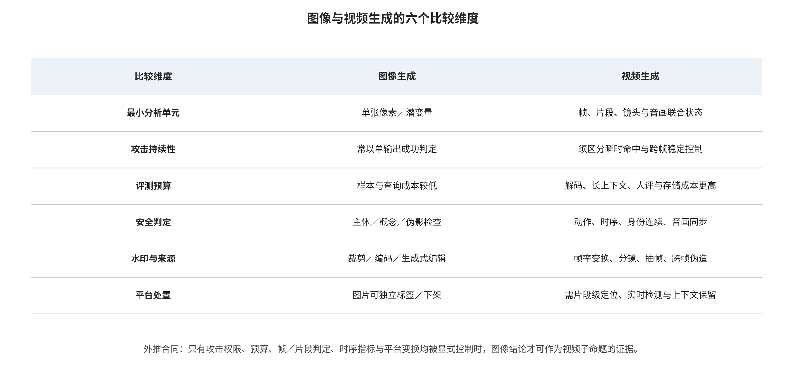

## 7. 视频生成专项综合：时间、运动、音画与流式状态

### 7.1 最小评测单位与有效分母

视频安全至少要同时声明五级评测单位：帧用于瞬时视觉状态，连续窗口或片段用于动作和局部音画关系，镜头用于剪辑与身份连续，整视频用于完整叙事，身份/事件用于跨镜头或跨文件后果。T2VSafetyBench 的作者协议以生成视频而非原提示判定，图像条件视频基准也把行为序列和时间风险作为对象 [@P034] [@A033]。这些证据支持分层分母，不意味着任一基准已覆盖长视频、直播或所有身份事件。

有效分母不能写成抽取帧总数：相邻帧高度相关，帧级命中也不等于独立样本。协议应分别报告独立提示、种子、片段、镜头、视频、身份和事件数量，并在同一视频内保留相关结构；条件通过、生成完成、视频风险、输出阻断和实际交付又是连续但不同的分母。画质、时间一致、身份持续、事件判定、音画同步、人工复核、正常效用和资源成本不得先归一化成单一安全分。作者百分比只有在片长、帧率、模型、审核器、预算和不可判定规则一致时才可比较；本综述未获得满足汇总的独立方差与协议。

### 7.2 边界帧、时空后门、运动与轨迹

边界帧与中间轨迹属于不同安全对象：输入审核可能只看到文本、首帧或末帧，而生成器决定它们之间的动作与镜头。Two Frames Matter 的作者结果支持“边界状态安全不推出中间事件安全”，TEAR 的作者协议则把时间语义与输入过滤分开 [@LN05] [@LN04]。BadVideo 的作者实验在指定文本到视频训练设置下展示时空后门，并同时讨论正常质量 [@P007]。三者不能相互替代：条件补全、红队搜索与训练后门具有不同权限和因果位置。

评测应在完整片段和事件边界上记录目标是否形成、持续多久、何时首次可见，并改变模型版本、片长、帧率、纵横比、相机运动和条件模态；清洁对照要保留正常复杂运动与叙事。最早控制包括联合审查边界条件、生成中分段检查、镜头与事件级输出复核，以及运动模块的签名和组合差分。适应性绕过可能延迟语义、跨镜头分散或利用长上下文；防御则可能因全面拒绝复杂运动而获得虚假安全。现有图像 LoRA 后门与整体视频后门仅提供类比和局部直接证据，不能写成独立恶意运动模块已在多基座上被验证。

### 7.3 音画联合身份、语义与审核

音频携带说话人、语言、情绪和事件线索，画面携带面孔、口型、动作与场景；两者分别正常时，组合仍可能形成冒充，分别异常时也可能只是合法配音、翻译或网络延迟。AVFF 的作者结果表明音视觉特征融合可用于深伪检测，并同时暴露跨数据集迁移限制；T2VShield 的作者框架把音画一致性纳入多层视频防御 [@LN02] [@R-A024]。这些研究支持联合建模方向，不证明同步生成的高质量音画必然可检，也不能把音画不一致直接归因恶意。

最低协议应按独立说话人、身份、语言、事件和视频计数，比较视觉、音频、简单融合与时序联合模型，纳入原录、授权配音、压缩、噪声、剪辑、跨语言和同步合成，并报告身份确认、时间定位、延迟与人工复核。主体驱动系统还必须把“有权上传素材”“有权生成指定表达”“有权公开传播”分开；系统卡中的肖像和音画缓解属于厂商对特定产品版本的声明，不是第三方效果 [@R-A035]。对直播或会议，最终分母还包括从事件出现到首次告警、停止传播和副本召回的时间，离线准确率不能替代实时处置。

### 7.4 内容/运动记忆、缓存与长时资源

视频隐私需区分内容记忆与运动记忆：模型可能不复制整段文件，却重现身份背景、连续帧、特有动作或声音。视频记忆研究的作者分析直接支持帧、片段和运动层的区分；图像训练数据提取仅提供查询和去重关系的历史参照 [@A047] [@P024]。确证需要候选训练片段、授权与重复状态、视觉/运动/音频匹配、非成员基线和人工核查。整视频平均距离会掩盖局部泄漏，而常见动作相似又不能单独证明训练成员。

长视频还把资源从一次采样扩展到跨帧注意力、解码、插帧、音频、后处理和会话缓存；流式服务中的取消释放、队列、状态恢复和跨租户复用均需单独测量。近似缓存论文提供的是文本到图像共享服务证据，尚不足以证明长视频或商业流式架构中的同等攻击效果 [@P039]。因此最低测试只在隔离环境随片长与模态增加负载，报告 GPU 秒、峰值显存、尾延迟、取消释放、正常任务完成和质量；工程防御采用租户预算、可抢占队列、分段提交、缓存安全键和重试上限，但不宣称已有视频专用最佳阈值。

### 7.5 视频水印、来源、转码与首次告警

视频真实性不能用逐帧图像水印的平均检出代替。删帧、插帧、变速、切镜、局部替换、音轨更换、分片编码和平台多次转码会改变信号与分母。VideoSeal 的作者结果与开放实现支持时间传播式嵌入路线，VideoShield 的作者结果支持生成时潜状态信号及空间/时间定位；两者所需模型访问、数据、变换和资源合同不同 [@P033] [@R-A020]。图像水印研究只能提供变换类别的类比，不能作为视频时空存活事实。

报告应区分整视频检出、片段定位、最短可检持续时间、最长漏检区间、载荷准确、干净假阳性、时序闪烁、吞吐、峰值内存和首次告警。C2PA 2.4 为普通、分片和动态视频给出不同绑定与验证语义，但规范可表示不等于 CDN、编辑器、播放器和平台已经互操作 [@O001]。平台必须从上传原件到内部母版、每种转码、下载件和再上传逐跳测试，保留验证器与信任列表版本；直播还需测断流、乱序和状态恢复。即使事后检出准确，若首次告警晚于传播窗口，也不能写成风险已被及时中断。

### 7.6 可继承结论、不可继承结论与开放缺口

图像研究可继承的是合同与实验设计：数据和制品需要身份，攻击与正常效用要双分母，检测要考虑未知生成器与低基率，水印要写清攻击知识，来源凭证不等同事实，平台行动需可申诉。不可继承的是数值和事实结论：图像上的 ASR、AUC、水印存活或扰动迁移不能自动成为视频结果；单帧检测不能代表片段、镜头或事件；图像近重复不能定义运动记忆；离线转码不能证明直播状态；人脸相似不能替代联合音画身份与授权。

开放缺口集中在恶意运动或相机模块、多适配器组合、跨镜头和超长上下文漂移、同步音画自适应攻防、商业服务内容/运动/身份记忆、视频专用成本放大、跨平台来源长期保留与受害者救济。每项后续研究都应预先绑定模型版本、片长、帧率、镜头、音画、预算、正常效用和停止规则；缺少这些字段时只能称机制提示或工程假设。本文未把视频与图像异构结果元分析，未将静态代码存在升级为运行，也未进行端到端论文复现；这些缺口因此保持开放，而不是由综述措辞闭合。

### 07.E1 证据展开：视频生成专项：时间、运动、音画与实时传播

#### 07.E1.1 将七个首破接口重新投影到视频状态

视频不是“许多独立图像的集合”，而是由帧、连续片段、镜头、主体轨迹、相机轨迹、事件、音频、编辑历史和流式状态共同构成。七接口在视频中保持可区分的合同，但不被假定为数学互斥：I1 处理训练片段、动作和音频的来源与污染；I2 处理基座、运动模块、角色 LoRA、音频编码器和工作流制品；I3 处理文本、起始/边界帧、参考视频、姿态、轨迹和音频条件；I4 处理时间层、个性化和对齐更新；I5 处理长时采样、记忆、缓存与资源；I6 处理跨帧水印、音画检测和来源链；I7 处理身份、传播与现实后果。多数对象可指定 `primary_first_break`，真正同步失效、证据歧义或信息不足时分别保留 `co_primary`、`ambiguous` 与 `unknown`。

同一事件可能跨多个接口，但分类以第一个被破坏的安全合同为准。例如，未授权肖像先进入训练集归 I1，恶意角色 LoRA 被加载归 I2，边界帧诱导中间事件归 I3，个性化训练劫持归 I4，训练片段被黑盒提取归 I5，视频水印在转码后失效归 I6，随后冒充账户传播归 I7。后续接口记录传播，不重复计为独立攻击家族。这种方法使防御能够放在最早有效的位置。

#### 07.E1.2 最小评测单元与有效分母

视频安全至少需要五级评测单元。帧级捕捉短暂视觉内容；窗口或片段级捕捉持续数帧的动作与局部音画关系；镜头级捕捉剪辑和身份连续；整视频级捕捉完整叙事；身份/事件级跨越多个镜头和文件。对动作顺序、因果和口型而言，单帧没有定义完整目标；对闪烁水印而言，整视频平均又会隐藏局部失败。评测协议必须先声明风险属于哪一级，再指定分母。

有效分母不是抽取的总帧数。相邻帧高度相关，把每帧当独立样本会虚增样本量和置信度。应报告独立提示、独立种子、独立片段、独立身份或独立事件的数量，并对同一视频内相关性分层。T2VSafetyBench 基于生成视频而非提示进行安全判定，SafeGen-Bench 针对图像条件视频建立评测，这两类设计支持从条件成功、生成成功到视频判定的逐级分母 [@P034] [@A033]。

最低指标集合包括空间语义与画质、时间一致性、身份持续、动作/事件准确、音画同步、局部与整段安全判定、人工复核、正常效用、生成成本和失败率。若涉及水印，再加时间定位、跨帧鲁棒和转码；若涉及隐私，再加训练片段对应、内容/运动记忆和非成员误报；若涉及可用性，再加 GPU 时间、显存、尾延迟和取消释放。不同指标不得先归一化再平均成缺少实际含义的“综合安全分”。

#### 07.E1.3 边界帧、轨迹与时序组合攻击

视频条件具有延迟显现属性：输入审核看到的是文本、起始帧或若干边界帧，生成器输出的是它们之间的动作轨迹。Two Frames Matter 说明仅检查两个边界状态不能覆盖模型补全的中间时间过程 [@LN05]。TEAR 将时间感知引入自动红队，支持以事件和轨迹而非孤立帧构造评测 [@LN04]。这些论文给出风险机制和特定模型结果，但本文不复述可直接用于越过现实系统的提示、优化目标或参数设置。

长时序还会产生组合语义。每一帧都可能不违规，但动作顺序、镜头切换或字幕—画面组合构成违规事件；相反，一帧看似敏感也可能在纪录、医疗或反暴力语境中有合法含义。防御需要在生成前预测风险轨迹，在生成中分段检查，在输出后以完整事件复核，并保留时间定位供申诉。随机抽帧只能作为成本优化的第一阶段，不能作为高风险任务唯一审查。

攻击迁移评测需改变模型版本、帧率、长度、纵横比、摄像机运动、条件模态和审核器，同时记录查询预算。失败可能来自生成模型无法保持目标轨迹、边界条件被联合审核、生成中检查中止任务、音画或事件判定器发现异常，或输出质量下降到不可用。清洁效用则要检查正常创作的动作多样性和叙事完整性，避免防御将所有复杂运动都误拒。

#### 07.E1.4 运动模块、相机控制与长时记忆

运动模块和相机控制器改变的不只是外观，而是时间注意力、速度、方向、镜头切换与视角。供应链上，它们可以与角色 LoRA、VAE、ControlNet 和插帧器组合；训练上，它们可被单独更新；推理上，它们接收轨迹或姿态条件。由此产生的安全测试应覆盖模块单独加载、两两组合和风险驱动的高阶组合，而不是把所有排列穷举后宣称完备。

本轮检索确认了图像 LoRA 后门 [@P006] 和文本到视频整体模型后门 [@P007]，但没有找到可同时满足以下条件的一手研究：恶意运动模块或相机 LoRA 作为独立分发制品，在多个视频基座和组合工作流上展示后门，报告哈希/版本、清洁运动效用、适应性防御与完整片段判定。这个缺口必须如实保留。工程上可以先采用允许列表、签名、SBOM、沙箱、组合差分和撤销机制，但不能把预防性控制写成已证实的攻击复现。

长时记忆还会跨片段或流式会话传播。角色身份、场景和运动状态可能存入上下文、缓存或参考记忆；局部异常随后影响远处帧。研究应报告风险随片段长度、镜头数和上下文窗口的曲线，设置相同计算预算的短片对照，区分普通质量漂移、安全事件漂移和记忆泄漏。当前公开安全基准多集中于短片段，超长视频和持续会话证据仍不足。

#### 07.E1.5 音画联合身份、语义与审核

视频中的声音携带说话人身份、语言、情绪、环境和事件线索。视觉与音频可各自显得正常，组合后却形成冒充或欺骗；也可能画面异常而配音明确说明是讽刺、教育或重演。因而音画攻击与防御不能只把两个独立分类器的分数相加，应对“谁在何时说什么、口型是否匹配、声音与场景是否一致、身份是否获授权”建模。

AVFF 展示音视觉特征融合的深伪检测，并包含跨数据集评测 [@LN02]。T2VShield 也把音画一致性纳入视频防御框架 [@R-A024]。这些工作支持联合审核方向，却不能证明同步生成的高质量音画一定会被发现。正常配音、翻译、无障碍音轨和网络延迟都可能造成不一致，若缺少这些清洁基线，防御可能对合法内容产生系统性误报。

合格协议应按独立说话人、身份、语言、事件和视频计数，报告纯视觉、纯音频、简单融合与时序联合模型的对照；包含真实原录、合法配音、压缩、噪声、剪辑、跨语言和同步合成；测量检测、身份确认、时间定位、跨域、延迟和人工复核。对直播或会议，还需报告从事件发生到拦截的时间，因为高离线准确率无法弥补实时传播窗口。

#### 07.E1.6 视频隐私、内容记忆与运动记忆

视频训练数据包含更多可识别维度：面孔、身体、住所、车牌、儿童、医疗或工作场景、声音、步态、动作与拍摄者轨迹。一个模型可能不重现整段视频，却在多个输出中复现同一身份背景、连续帧或特有运动。Investigating Memorization in Video Diffusion Models 对内容与运动记忆的区分，为最低分析框架提供了直接依据 [@A047]；图像训练数据提取工作则提供了查询式提取与去重关系的历史参照 [@P024]。

视频隐私确证需要比图像更严格的来源台账。候选训练集可能被切片、重编码、变速、裁剪或去音轨，文件哈希不足；视觉近重复、运动特征、音频指纹和时间对齐需共同使用。还应报告候选训练片段在语料中的重复次数、是否公开可得、授权状态、模型访问预算和非成员对照。常见动作或场景高度相似不是成员证明，身份相似也可能来自个性化能力而非记忆。

防御包括训练前跨模态去重和敏感身份授权、训练中隐私监测、输出端帧/片段/运动近重复阻断、查询关联与速率限制、受害者查验和删除流程。剩余风险是严格阈值会误拦常见镜头，跨模态检索成本高，删除后的衍生检查点仍可能保留。现有证据仍不足以估计商业视频生成服务中的总体记忆率或个体风险，不能从少数开放模型外推。

#### 07.E1.7 长时资源、流式状态与服务可用性

图像生成通常有较明确的单次任务边界，视频则把成本乘到帧、窗口、解码、音频、插帧与后处理。流式或交互式生成还保留跨轮状态，使单请求配额不能完全代表占用。风险状态包括高估或低估的资源预留、取消后未释放、跨租户缓存、长任务排队、失败重试和部分结果回传。

近似缓存攻击为图像扩散运行时提供了具体证据，说明缓存相似性边界会影响输出和资源 [@P039]；但尚无足够一手实证证明其在长视频、音画联合或商业流式架构上的攻击效果。视频 DoS 也缺少具备明确攻击预算、正常租户分母、GPU/队列测量和适应性防御的公开研究。因此本章只提出可证伪测试：在隔离环境中随时长和模态逐步增加负载，测资源曲线、取消释放、尾延迟和正常请求完成；不提供面向现实端点的请求编排或阈值探测。

工程防御包括任务准入估算、按租户和组织的总预算、可抢占队列、分段提交、硬超时、取消回收、缓存安全键、失败重试上限、成本告警和跨租户隔离。测试必须同时报告正常视频质量、长任务完成率和用户等待，避免以全面禁用长视频换取表面可用性。

#### 07.E1.8 跨接口纵深防御与未闭合议程

视频安全的纵深链条从数据和制品开始，而不能把压力全部交给最终内容审核。I1 的授权、片段去重与敏感身份治理减少记忆和权利风险；I2 的签名、SBOM、沙箱和组合差分控制运动模块与 LoRA；I3 的联合条件审核与轨迹预测覆盖边界帧；I4 的时间层训练审计和版本撤回控制更新；I5 的近重复阻断、租户隔离与资源治理保护隐私和可用性；I6 的跨帧水印、音画检测与来源链提高可追踪性；I7 的传播限制、身份验证、受害者救济和证据保全降低现实后果。任何单层失效都应由后续层限制传播，但后续层的存在不应成为上游放松的理由。

当前证据最清晰的部分是：图像扩散后门、条件越狱、训练数据提取、图像水印攻防，以及若干短视频安全基准、视频后门和视频水印 [@P001] [@P008] [@P024] [@P030] [@P034] [@R-A020] [@P007]。仍未闭合的七项议程是：（1）生成式视频专用 DoS 与成本放大；（2）恶意运动模块、相机 LoRA 与多适配器组合；（3）跨镜头和超长上下文的安全漂移；（4）同步音画生成下的自适应攻防；（5）商业视频模型中的内容/运动/身份记忆；（6）水印和来源凭证跨平台再上传的长期保留；（7）从模型输出到现实伤害的事件级、低基率和受害者中心验证。

这些缺口的优先级可由可证伪性排序：先固定系统边界和最小评测单元，再公开版本、预算、分母、清洁效用与失败条件，随后测试适应性防御和跨平台迁移。没有这些要素时，静态仓库阅读只能称代码审计，作者表格只能称报告值，产品系统卡只能称厂商一手自述；它们都不能改写为本地端到端复现或现场有效性证明。

#### 07.E1.9 四类部署场景的验证合同

文本到视频服务的核心输入是文本，系统通常在提交前审核文字、在生成后审核视频。它的验证合同应包含直接风险表达、语义改写、长提示、多轮修改和跨语言条件，但不能把红队语料公开成可直接搬用的违规提示集合。每个条件需要记录预审核结果、是否启动生成、生成是否完成、完整视频风险、片段定位、输出审核与最终交付。若只记录“提示被接受”，便无法证明模型产生了目标事件；若只记录“某帧被判异常”，也无法证明内容被用户获得。T2VSafetyBench、视频越狱研究与 TEAR 共同说明视频输出和时间轨迹应进入判定，而不是以提示文字代替生成结果 [@P034] [@R-A023] [@LN04]。

图像到视频服务还接收人脸、人物照片、作品或场景图。其首要问题是输入图像本身可能安全，但模型补全的动作、镜头或上下文越过授权边界。I2VGuard、Anti-I2V 与 VPA-Guard 从保护输入图像和视觉提示防护的不同方向提供证据 [@R-A025] [@R-A026] [@R-A027]，SafeGen-Bench 则把图像条件视频的安全评测独立出来 [@A033]。验证时应按独立主体和独立图像计数，记录图像授权、保护前后感知质量、正常动画效用、跨模型与跨预处理迁移，并以完整动作而非首帧相似度判定风险。防守方扰动若让合法动画完全不可用，不能只因阻止了某类滥用就称为无代价成功。

主体驱动或数字人系统往往联合肖像、声音、文本脚本、动作模板和品牌资产。它的安全合同应把“有权上传素材”“有权生成某种表达”“有权公开传播”分开；拥有一张公开照片不代表获得人物代言、亲密内容或政治表达授权。测试应使用经过许可的合成或志愿者素材，避免在红队过程中制造新的受害者内容。身份持续性、声音相似、口型、脚本语义、场景和账号标签需联合评估，同时记录同意的范围、期限和撤回。Sora 2 System Card 所述肖像控制与来源措施可以作为产品机制案例，但其覆盖范围和现场效果仍绑定到相应版本与厂商评测 [@R-A035]。

编辑、延长和流式视频系统的输入不仅是素材，还包括已有时间线、掩码、局部重绘、前后边界、历史会话与连续状态。风险可能在多轮修改后累积：每次编辑单独合规，组合后的叙事或身份却发生变化；旧片段的来源凭证可能在导出时丢失；延长任务还可能复用前序缓存。验证合同需要保存每轮输入、策略版本、编辑范围、派生关系和审核决定，在完整时间线重新评估，而不能只检查最新增加的片段。对直播式生成，应设置可中止点和延迟上限，并区分“检测到”“停止传播”“召回副本”三个结果。

四类场景均应包含正常任务对照。文本到视频要保留合法复杂叙事与跨语言创作；图像到视频要保留经授权的人像动画、教育和无障碍用途；数字人要保留明确同意的客服、培训和艺术表演；编辑/流式系统要保留纪录、新闻剪辑与实时可视化。防御如果只在恶意集上报告召回，却不报告这些清洁任务的拒绝、延迟、质量与身份错误，就无法用于部署决策。尤其在低基率环境中，少量假阳性可能影响大量正常用户，因此阈值应随场景后果、人工复核能力和申诉渠道调整。

场景化验证还必须有时间维度。上线前的离线基准用于发现已知失效；灰度阶段验证版本、地区、语言和负载变化；上线后监测模型、策略、审核器和平台转码的漂移；重大事件后回放已保存的匿名化证据；撤回时检查旧版本、缓存和衍生制品。每次报告都绑定模型哈希或不可变版本、审核器版本、日期与评测集版本。若系统更新后只沿用旧报告，应标注证据过期，而非把一次通过解释为永久认证。

跨场景的攻击成本也必须统一记账但不能合并结果。黑盒条件攻击记录查询和生成预算；个性化攻击记录样本、训练与等待；供应链攻击记录制品制作和传播；隐私提取记录候选检索和人工确认；真实性规避记录处理、查询和质量损失；平台滥用记录账户、投放和维持可信上下文。相同的“成功一次”可能对应完全不同成本与现实可达性。综述只做机制与证据等级比较，不把异构百分比排成简单榜单。

最后，场景验证应预先规定停止和披露规则。研究人员一旦观察到可能指向真实个人、未成年人、私密素材或可用服务弱点的输出，应停止扩展生成，隔离证据、限制访问并通知适当责任方；公开论文只保留足以复核结论的机制、分母与摘要，不公开可复用载荷。对于尚未闭合的 DoS、恶意运动模块和长时音画组合，应先在本地隔离模型或合成数据上做最小风险实验，只有在取得授权并设置资源与伦理上限后，才考虑真实服务验证。

#### 07.E1.10 从风险发现到受害者救济的闭环

视频攻防的最后一个评测对象不是分类器，而是处置闭环。模型或平台发现高风险内容后，需要回答谁能看到原始证据、谁有权暂停生成或传播、如何通知被冒充者、如何搜索相似副本、如何处理申诉、如何保留调查材料，以及何时解除限制。若只有检测分数而没有责任主体和时限，风险可能在组织交接中继续传播。若为了追查而无限保存敏感媒体，又会制造新的隐私和访问风险。

闭环的第一阶段是事件分级。系统应结合内容类型、身份可识别性、主体是否同意、受众规模、传播速度、是否涉及未成年人、是否伴随支付或公共事务，以及来源证据状态决定优先级。自动模型可以提供候选标签和时间位置，但高后果决定需要受训练人员复核。复核者应看到必要而最少的信息，并受到访问控制、审计和心理健康保护。不能以“模型置信度高”为由跳过法律和语境判断。

第二阶段是遏制与证据保全。生成端可暂停交付，上传端可限制推荐与转发，平台可对相似副本建立临时匹配，但这些措施要区分紧急冻结与最终认定。保全记录应包括不可变媒体摘要、来源凭证状态、模型与策略版本、时间线、处置动作和访问日志，同时对原始敏感素材加密隔离。只保存截图可能丢失音轨、时间定位和凭证；只保存完整副本又可能超过必要范围，因而需要分级保存和到期删除。

第三阶段是通知、申诉与修复。被冒充者或权利人应获得可理解的通知、提交补充证据的渠道和处置进度；普通上传者应能知道限制原因并对误报申诉。修复不应只删除首个链接，还应检查派生剪辑、音轨替换、镜像上传、搜索索引和推荐缓存。对于经过验证的来源内容，应能恢复标签和分发，避免真实性基础设施变成压制合法表达的工具。美国相关通知移除法定流程提供一种制度例证，但具体平台仍需依据适用法域设计 [@O014]。

第四阶段是复盘和预防。事件结束后要把首破接口、遗漏信号、决策延迟、误报、受影响主体、传播路径与救济结果映射回数据、制品、训练、推理、真实性和平台控制。若根因是未授权训练片段，单纯增强输出审核不能闭环；若根因是平台账号接管，重训生成模型也不会解决。复盘产生的规则、探针或哈希需要版本管理，并测试其对正常内容与弱势群体的副作用。

闭环评测至少报告发现时延、人工确认时延、暂停传播时延、相似副本覆盖、申诉处理、恢复正确内容、受害者通知和证据删除，而不是只有“删除数量”。这些指标的分母分别是独立事件、独立副本、独立申诉和独立受害者，不能互换。对于直播或高传播事件，还应报告在处置前已发生的曝光，因为快速事后删除不能抹去既有观看和下载。

**表：图像与视频安全证据合同差异**

| 维度 | 图像最小合同 | 视频新增合同 | 应报告 | 禁止替代 |
|---|---|---|---|---|
| 样本单位 | 单图、单次输出 | 帧、片段、镜头、整段 | 逐层分母与不可判定项 | 只报平均帧分数 |
| 时间一致性 | 通常无时序 | 身份、动作、物体与背景持续 | 轨迹一致、漂移、最长失效段 | 挑选成功帧 |
| 触发语义 | 像素、文本、潜变量 | 轨迹、帧序列、延迟事件、音画组合 | 触发可见度与持续时间 | 逐帧触发替代片段触发 |
| 安全判定 | 主体、概念、伪影 | 事件、叙事、动作与音画同步 | 片段级召回与定位误差 | 单帧审核等同整段安全 |
| 资源与时延 | 请求级 GPU、时延 | 解码、长上下文、流式状态 | 首次告警、GPU 秒、队列占用 | 丢弃失败请求不计成本 |
| 真实性 | 裁剪、压缩、编辑 | 抽插帧、变速、分镜、直播转码 | 变换链、窗口检出、状态恢复 | 只测原始编码 |

注：数据源为 `paper/tables/video_contract.csv`；正文显示 6/8 行并对过长单元格作省略，完整字段与记录以该 CSV 为准。

**表：视频特有状态、攻击模式与证据成熟度**

| 接口 | 视频状态 | 攻击模式 | 评价单位 | 证据状态 |
|---|---|---|---|---|
| I1 | 训练片段和时间标注 | 对动作、镜头或事件描述的投毒 | 片段—标注对 | 间接证据，需专门动作投毒基准 |
| I1 | 身份轨迹和行为序列 | 未授权人像视频训练个性化模型 | 身份—片段—时间 | 有保护研究与系统声明，缺长期撤回实证 |
| I2 | 运动模块、时空 LoRA | 恶意适配器只在特定组合中显现 | 基座—空间 LoRA—运动模块组合 | 高优先级开放缺口：无视频恶意运动模块高等级实证 |
| I3 | 边界帧与中间轨迹 | 输入或首尾帧安全，中间补全形成有害事件 | 完整片段与事件边界 | 有新近预印本与基准，需第三方重跑 |
| I3 | 长时序与分镜 | 载荷延迟显现、跨镜头组合或只在长上下文成立 | 镜头、事件与整视频 | 现有工作主要短片段；长时序是开放缺口 |
| I3 | 相机轨迹与物体运动 | 通过参考图或控制信号诱导未授权运动或场景 | 轨迹与动作片段 | 有视觉条件基准，缺物理环境验证 |

注：数据源为 `paper/tables/video_risk_matrix.csv`；正文显示 6/16 行并对过长单元格作省略，完整字段与记录以该 CSV 为准。

---

[← 返回目录](index.md)
