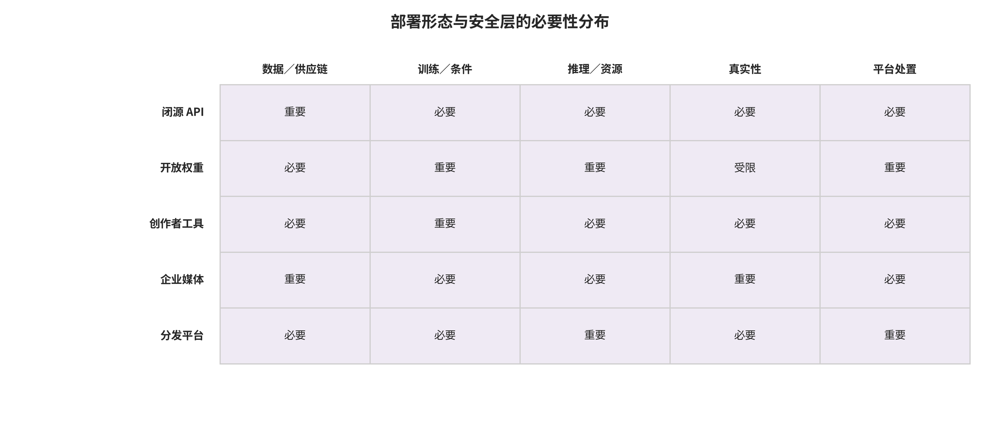

## 9. 讨论：跨家族解释与条件化部署决策

### 9.1 中央问题与四个RQ的受限回答

对中央问题，本文综合得到的受限答案是：图像与视频生成系统的攻防起点不是统一的“有害输出”，而是端到端链条中最先失效的安全合同；只有把该接口与攻击者权限、模态状态、评测单位和证据层一并锁定，才能讨论最早中断点和部署选择。**RQ1** 因此由资产、主体、能力、首破接口和后果证据的联合编码回答；**RQ2** 则显示，七接口上的机制可按权限、传播、成本、正常效用和失败条件做协议受限的定性综合，但不支持把异质数值并成一个安全分。

**RQ3** 的答案是把防御镜像到首破接口，同时披露信任根、正常效用、适应性绕过、操作成本与残余传播；这些控制之间是有条件的互补，不是已经证明的通用最优组合。**RQ4** 的答案是严格分层使用论文、代码、系统卡、标准、法规、事件与局部实验：它们分别支持机制、实现、声明、义务、现实链条或工程合同，不能相互升级。以上是本文在现有证据上的综合与推断，不是防御因果效果证明、法律意见或统一最优方案。

### 9.2 跨接口共同机制、反例与替代解释

本文综合的跨接口共同机制不是某种媒体伪影，而是信任根、版本、权限或证据链在上游失效后向下游传播。数据授权、制品完整性、条件能力门、租户与资源隔离、真实性信号和平台案件处置分别对应不同中断点；组合它们的理由是避免单点失效继续传播，而不是证据已表明组合必然提高生产效果。

反例和替代解释要求降级对单一信号的语义。未检出不等于真实，签名或来源声明不证明叙事为真或获得同意，没有凭证也不等于伪造；检测、水印、指纹、签名、C2PA与平台规则回答的问题并不可互换 [@O005] [@O001]。观察到的失败也可能由版本漂移、数据集身份捷径、低基准率、转码链或组织执行能力造成；若未做对应消融，不应将其单独归因于模型或某项控制。

### 9.3 闭源API与开放权重

对闭源 API，本文推断的条件化组合是把账户认证与高风险能力门、输入规范化、租户和速率隔离、输出审核、水印与来源声明、可审计事件记录、紧急停机和可申诉处置连在同一责任链上。它只在供应商可以观察请求与资源、可保护密钥并为误报提供复核时成立；产品系统卡支持的是该产品的缓解声明与评测边界，不能外推为闭源服务已形成行业闭环 [@O020]。

对开放权重，接收者可以移除运行时审核、水印和日志，因而条件化重点前移到发布前能力评估、安全权重格式、哈希与签名、SBOM、可复算构建、分阶段访问和安全公告。扫描和 `weights_only=True` 缩小的是已知反序列化攻击面，并不保证制品无后门、无拒绝服务或无内存破坏 [@O037] [@PyTorchSerialization2026]。若危险能力可低成本释放且缺乏可行缓解，本文的推断是延迟开放或转为受控 API；这是风险条件下的发布门，不是对所有开放模型的泛化结论。

### 9.4 创作者工具与企业媒体供应链

创作者工具的条件化目标是保存编辑谱系，而不是把每次调色、去噪或合法后期等同于“完全生成”。只有在采集或导入、实质生成与编辑操作、软件版本、原素关系和每次导出的可验证 manifest 能被记录，且用户能检查与纠正归属时，该谱系才能支持有限的来源判断。C2PA 对编辑关系、软绑定和视频资产的表达能力不替代对披露语义、隐私、无凭证旧工具和实际平台保留的实施选择 [@O001] [@C2PAGuidance24]。

企业媒体供应链需要把软件制品签名与 SBOM、媒体水印与来源声明、内容扫描与审批日志分为三条互补轨道。签名回答发布主体与字节完整性，媒体凭证记录对素材和操作的声明，审批日志记录发布责任；任一轨道都不能替代恶意行为扫描与实际内容审查 [@SigstoreBlob2026]。本文推断的上线条件是，组织能在指定恢复时间内定位某素材、模型、证书或供应商影响的派生产物，并能撤回、保全和恢复；未经生产等价链验证时，这只是设计门而非效果声明。

### 9.5 分发平台、受害者救济与高风险业务

对大规模分发平台，本文推断的组合是把上传时的安全解析、凭证验证与廉价哈希，和针对高风险、快速传播或被举报内容的深度检测、身份复核与人工案件系统连接。低基准率下的行动应由风险和证据质量共同驱动，并按地区、语言、内容长度和风险类别报告误报、漏报、时延和人工负载。平台自报的标签规模或功能上线只支持其覆盖声明，不替代独立抽样的精确率、召回率与处置后果 [@TikTokTransparency2026] [@O042] [@O044]。

受害者救济和高风险业务不应由“AI 概率”单独启动不可逆处置。条件化建议是保存上传原件和当时决策上下文，为身份仿冒、非自愿亲密影像等高伤害案件提供紧急通道、身份与权限独立核验、证据保全、重复阻断和可重放申诉；对新闻、教育、艺术与合法后期则保留人工复核与恢复路径。这是本文对证据和责任链的部署推断，不构成法律意见，也不证明任一平台已达到救济效果。

### 9.6 最小组合、上线门、SLO与明确拒绝条件

本文所谓“最小组合”是受具体伤害预算约束的责任链，不是通用产品清单。其候选项包括数据许可与版本账本、制品与依赖安全摄取、训练发布评估、条件与资源控制、合作式来源信号与开放世界检测、逐跳保留测试、比例性处置、受害者入口、申诉、撤销和事件透明度。具体部署只应选取能对应已登记资产与首破接口、有明确运营负责人并能在生产等价链上重放的部分。

上线门应把威胁模型、正常效用与组合攻击、低基准率误报预算、端到端保留、密钥与模型撤销演练、事件值班、受害者响应和申诉恢复同时变成可验收条件。SLO 应在各自场景中预注册生成与审核尾延迟、视频吞吐、低误报点召回、转码后信号保留、撤销传播、首次行动与申诉恢复，而不复制跨场景阈值。不能保存决策证据、无法轮换信任根、没有生产等价链测试、高伤害业务缺紧急通道，或用厂商自测直接触发不可逆删除且无复核，都应是明确的 `NO-GO`；条件式 `GO` 必须限定流量、能力、地区、风险类别和终止阈值。

### 09.E1 证据展开：跨家族综合与部署决策

#### 09.E1.1 决策原则：以接口和损失函数选控制，不做异协议排名

部署决策保护的是从数据许可、训练资产、生成 API、编辑器、来源记录到平台处置的完整责任链；威胁假设是管理者会用一个易比较的数字替代多维风险，把高 AUC 检测器、强水印、合规签名或内容凭证误当成可互换产品。机制从资产—接口—对手—损失—证据五元组开始：先列明最不能承受的误报、漏报、延迟、隐私与中断，再选择跨层控制。检测覆盖未知来源，水印提供合作式内容信号，指纹支持匹配与恢复，签名认证声明主体，C2PA 组织声明与编辑链，平台规则决定实际行动；它们不能按单一“准确率”排名 [@O005] [@O001]。

执行主体是产品负责人、模型安全、数据治理、媒体基础设施、信任与安全、隐私/法务和独立审计。效用/资源预算需以每万次生成、每小时视频和每百万次上传分别核算，包括峰值延迟、GPU、存储、人工案件和第三方查询。每项控制都必须给出 FP/FN 与不可判定状态；信任根和密钥/模型版本必须可轮换。适应性绕过采用组合测试，不允许只测单项压缩。更新与撤销要覆盖历史资产、缓存和申诉案件；平台真实保留用端到端样本证明。决策输出是“在给定条件下允许上线/限量上线/阻断”，残余风险则由明确责任人签收，而不是写成笼统免责声明。

#### 09.E1.2 封闭生成 API：强审计与速率控制优先

保护接口是托管图像/视频生成 API、账户、提示词、参考媒体和输出下载；威胁假设包括越狱绕过、身份仿冒、批量生成、凭证盗用、对审核器探测和去标再传播。最低控制包是输入规范化与分层审核、身份/高风险类别门禁、租户与速率隔离、采样中间或输出审核、每个输出的不可关联公众身份的事件 ID、内容水印、C2PA 声明、审计日志、举报与快速撤销。Sora 2 系统卡一类提供的是特定产品的风险缓解声明与评测边界，不能外推为全行业闭环 [@O020]。

执行主体是模型提供商。正常效用成本包括高风险请求的额外延迟、视频检测 GPU、日志和申诉人员；应给普通创作低延迟路径，对高影响身份与未成年人风险使用异步或人工确认。误报会阻断合法影视、教育或新闻用途，漏报会使规模化滥用直接利用供应商基础设施；信任根是账户认证、受保护签名/水印密钥、发布清单和不可变日志。攻击者可切换账户、分步生成再外部组合、使用 API 输出训练去水印器，故必须关联行为但设置隐私边界。

密钥泄露、审核模型回归或错误策略上线时应暂停相应高风险能力、轮换密钥、标记影响窗口、重扫公开高影响输出并允许申诉；不能删除所有历史来源记录。真实平台保留需选择主要下游逐项验证水印和 C2PA 在上传/转码/下载后状态。处置包括拒绝、降级能力、冻结令牌、人工升级和受害者渠道。若没有可量化滥用监控、紧急停机、事件保全和负责人，则即使离线安全分数很高也应 `NO-GO`。残余风险是输出一旦下载，提供商无法控制离线编辑与再传播。

#### 09.E1.3 开放权重发布：发布门禁不能依赖运行时强制

保护接口是模型权重、配置、tokenizer、采样器、演示代码和镜像；威胁假设是接收者可移除审核、水印和日志，微调恢复已擦除概念，或通过不安全反序列化植入代码。因此部署机制从运行时控制转向发布前能力评估、数据与许可记录、权重格式最小化、哈希与签名、SBOM、可复现构建、分阶段访问、许可证和事件响应。Hugging Face 的 pickle 扫描被官方描述为尽力而为且不能保证安全；PyTorch 的 `weights_only=True` 缩小反序列化攻击面但不保证防拒绝服务或内存破坏 [@O037] [@PyTorchSerialization2026]。签名只能证明发布主体/字节完整性，不证明权重无后门。

执行主体是模型开发者、仓库运营者和下游部署者。资源包括全面能力测试、构建与签名服务、镜像扫描、访问审核和安全公告；开放发布后撤回能力有限，因此更重视发布前门禁。误报是过度限制低风险研究或把未知扫描项当恶意，漏报则可能永久扩散危险能力/后门。信任根是硬件或受控密钥、透明发布记录、独立复核和可验证哈希；攻击者可能夺取维护者账户、替换依赖、复用旧签名或将恶意行为藏在代码而非权重。

撤销更新必须发布受影响版本、哈希、严重性、替代件和检测方法，并向镜像传播；不能声称删除中心仓库即让所有副本失效。平台保留概念在此是“签名与安全公告能否伴随镜像/派生模型”，必须抽查主要仓库和容器注册表。处置可停止推荐/下载、吊销签名身份、隔离版本并通知部署者，但已下载副本仍是残余风险。若模型危险能力可低成本释放且缺乏可行缓解，结论应是延迟开放或只提供受控 API，而非用易移除水印作为发布理由。

#### 09.E1.4 创作者编辑工具：保持编辑谱系而非惩罚合法后期

保护接口是相机导入、时间线编辑、生成填充、配音、滤镜、导出与协作；威胁假设是工具既可能辅助合法后期，也可能把真实人物局部替换、在复杂时间线中丢失来源，或因每次小编辑都打显眼 AI 标签而误伤创作者。机制是把原素材作为 ingredient，记录实质生成/编辑操作和软件版本，在每次导出创建新的可验证 manifest；硬绑定随新字节重签，软绑定只作恢复。C2PA 2.4 对编辑关系、软绑定、视频打包和分片直播提供表达能力，但实现者仍需决定哪些操作披露、如何呈现及如何处理隐私 [@O001] [@C2PAGuidance24]。

执行主体是编辑器厂商、相机/采集设备、云协作服务和发布出口。效用成本是签名与 manifest 生成通常远低于视频渲染，但外部素材解析、仓库查询和长时间线 ingredient 图会增加延迟/存储；界面必须允许用户查看并纠正归属。误报包括把调色、去噪或无实质生成误标为“完全生成”，漏报包括插件绕过记录或导出器剥离。信任根为采集/编辑器签名身份、受保护密钥、操作语义和用户确认；攻击者可使用未签名插件、屏幕录制或把生成片段烘焙成普通媒体。

更新时要迁移 manifest 解析和旧算法验证；密钥撤销要区分被攻陷与正常轮换。平台保留需用目标导出容器、剪辑软件、消息应用和主要平台实测，不能假设规范支持等于工作流保留。处置以提示缺失、要求披露或限制高风险发布为主，不能因缺少 Content Credentials 就删除内容；旧相机、开源工具和隐私保护工作流本就可能没有凭证。残余风险是来源链可证明谁声明了什么，却不能证明编辑后的叙事真实或已获人物同意。

#### 09.E1.5 企业媒体供应链：签名、来源与安全扫描三轨并行

保护接口是素材采购、DAM、转码农场、广告合成、审批、CDN 与归档；威胁假设包括第三方素材冒充、依赖或插件被投毒、签名密钥泄露、转码剥离 manifest、内部人员越权和错误版本发布。机制同时部署软件供应链签名/SBOM、媒体 C2PA/水印、权限审批、内容扫描和版本化归档：软件签名回答“哪个构建主体发布了该二进制”，媒体凭证回答“谁对素材和操作作何声明”，检测器回答“当前字节呈现何种可疑模式”，审批日志回答“谁准许发布”。Sigstore/Cosign 的 blob 签名适合独立制品，但签名验证不能替代恶意行为扫描 [@SigstoreBlob2026]。

执行主体为安全工程、媒体运营、品牌/法务和供应商管理。资源预算覆盖每次摄取与发布验证、转码后重签、HSM/KMS、仓库存储和抽样人工审片；低延迟直播需把验证前移并采用分片策略。误报会阻断播出或广告档期，漏报会造成品牌冒充和大规模错误分发；信任根为企业 PKI/允许清单、职责分离、可信时间和不可变归档。攻击者可能以合法供应商签名提交恶意素材、复用撤销前证书或从无凭证支线注入，因此必须验证内容、合同和行为，不能只验签。

撤销更新要演练供应商证书失陷、检测器回退、错误素材召回和下游缓存清除；每个派生转码保存父子关系和发布目的。真实保留通过转码矩阵和 CDN 抽样衡量。处置从隔离素材、停止流水线、吊销权限、撤回发布到通知客户，且保留法证证据。若组织无法在规定恢复时间内定位“使用了某模型/素材/证书的所有产物”，则供应链可追溯门禁失败。残余风险来自无法控制的外部截屏、供应商内部欺诈和跨组织时钟/身份不一致。

#### 09.E1.6 大型分发平台：信号融合必须绑定案件与行动

保护接口是每日海量上传、直播、推荐、广告、搜索和举报；威胁假设是低基准率下即使很小 FPR 也会产生大量误判，而高影响合成内容可能在重型审核完成前扩散。机制采用分级预算：上传同步做安全解析、可信凭证验证和廉价哈希；高风险类别、快速增长内容和举报案件进入深度视频检测/身份匹配；来源信号与政策风险分别存储；行动由风险和证据质量共同决定。平台自报的累计标签或部署规模只能用于了解覆盖范围，并须注明是否包含创作者披露、凭证和不可见水印等不同来源；它不能替代独立抽样的精确率、召回率和处置后果 [@TikTokTransparency2026] [@O042] [@O044]。

执行主体是媒体基础设施、完整性模型、推荐/广告、人工审核、事件响应和申诉团队。资源与时延指标必须按地区、语言、内容长度和风险类别分层；直播需设首检、持续检测和断流恢复 SLO。误报/漏报按实际基准率和最终案件结果估计，人工结论也需一致性审计。信任根包括验证器、平台政策、原文件保全和审查角色分离；攻击者会用多账户、短片拼接、压缩、讽刺包装和对抗举报。

更新与撤销要求灰度发布、影子评估、阈值回滚、历史高风险重扫和受影响案件复审。真实保留率要在平台每种转码/下载路径持续抽样，水印和 manifest 分开报告。处置阶梯、受害者通道与申诉必须同时上线；若只有检测 API 而没有案件系统、人员和可逆行动，则为 `NO-GO`。残余风险是加密私域、跨平台重发、政治/文化语境差异以及平台自身激励可能扭曲执行。

#### 09.E1.7 上线门禁、SLO 与撤销演练

保护接口是从开发到灰度、正式发布和事故恢复的变更管理；威胁假设是团队在发布前只跑静态基准，发布后才发现平台转码、水印密钥、信任列表、申诉容量或人工队列失败。机制设置七个门禁：威胁模型与资产登记完成；正常效用和组合攻击评测达标；低基准率误报预算可接受；端到端平台保留实测通过；证书/密钥/模型撤销演练通过；事件与受害者响应有值班和时限；申诉可重放并能恢复错误行动。任一高伤害接口缺失负责人或证据，即为阻断条件。

执行主体是变更评审委员会，但每项 SLO 必须有单一运营负责人。建议报告而不预设统一阈值的指标包括：P95/P99 生成与审核延迟、每小时视频吞吐、低 FPR 点的分层召回、转码后水印/凭证保留率、签名验证不可用率、撤销传播完成时间、有效受害者请求到首次行动时间、申诉等待与改判率、事件证据完整率。阈值应由具体伤害预算决定，不能跨协议或场景复制。

信任根是已批准测试集、生产遥测、密钥与规则发布系统、原始证据和独立抽查。自适应测试每次大版本至少覆盖多步组合；攻击知识变化时增量更新，不把测试集公开细节变成唯一门槛。撤销演练要实际更换测试密钥/信任列表、定位历史资产、让平台 UI 更新并恢复误判内容；纸面流程不算通过。真实平台保留要用合成或授权样本在生产等价链路跑通。处置包括自动回滚、关闭高风险能力、切换人工、通知下游与发布透明说明。残余风险由负责人按日期复审，超过接受窗口自动升级。

#### 09.E1.8 最小可部署组合与明确的拒绝条件

最小组合不是“买一个检测器”，而是：数据许可与版本账本；安全权重/依赖摄取；训练发布评估；输入输出风险控制；至少一种合作式来源信号加开放世界检测；C2PA 或等价的签名声明链；平台逐跳保留测试；比例性处置；受害者快速入口；可重放申诉；密钥、模型和规则撤销；事件透明度。保护接口覆盖五层，威胁假设覆盖非合作生成器、内部失陷、密钥事故和跨平台自适应编辑。执行责任必须在 RACI 中落到个人/团队，预算必须包含人工与受害者支持而非只含 GPU。

明确 `NO-GO` 条件包括：把“未检出”展示为“真实”；用厂商自测直接触发不可逆删除且无独立复核；不能保存上传原件或重建当时决定；无法轮换/撤销密钥；没有端到端转码和编辑测试；高风险身份/NCII 产品没有紧急通道；开放权重危险能力无可行缓解却以水印为理由发布；序列化或插件可执行不可信代码；日志收集远超处置目的且无删除策略。条件式 `GO` 必须列出流量、地区、能力、风险类别和终止阈值。

误报与漏报不可合成一个“安全分”，信任根不可隐藏在供应商黑盒里；绕过发现后要更新攻防矩阵并重新测组合链；撤销要同时触达内容、凭证、缓存、案件和用户界面。真实平台保留必须以实际接收的字节为证。即便全部门禁通过，仍有非参与工具、离线传播、未知攻击、语境判断与治理激励风险，因此最终结论应是“可在给定边界内运营并持续审计”，而不是“解决了生成媒体真实性问题”。

**表：部署条件、控制组合与残余风险**

| 部署场景 | 核心资产 | 主导威胁 | 必要控制组合 | 上线/拒绝规则 |
|---|---|---|---|---|
| 封闭图像生成 API | 账户、提示、参考图、输出和密钥 | 越狱、身份仿冒、批量生成、去标传播 | 本文部署建议：多模态输入审核+能力门+输出审核+水印+C2PA+速率+案件系统 | 无紧急停机、无申诉或把未检出显示为真实则 NO-GO |
| 封闭视频生成 API | 长视频、关键帧、音轨、租户 GPU 和输出来源 | 时序越狱、短违规片段、资源耗尽、帧率、转码去标 | 分段多模态审核+租户隔离+流式水印+C2PA 视频链+异步复核 | 仅有整段分类 AUC、没有片段定位或资源熔断则 NO-GO |
| 开放图像模型权重 | 权重、配置、tokenizer、仓库和演示代码 | 移除审核、水印、恶意序列化、镜像替换和危险微调 | 发布前能力门+安全格式+签名、SBOM+可复现构建+分阶段访问+公告 | 危险能力低成本释放且无可行缓解时延迟开放或 NO-GO |
| 开放视频模型权重 | 大权重、视频 VAE、编码器、推理插件与示例工作流 | 组合依赖投毒、移除审核、规模化身份滥用和资源攻击 | DEP03 控制+视频身份、NCII 评估+依赖沙箱+资源安全指南+事件渠道 | 以可移除水印作为开放发布唯一理由则 NO-GO |
| 创作者图像编辑器 | 原图、图层、生成填充、插件和导出文件 | 局部生成来源丢失、轻微编辑误标、未签名插件 | ingredient 图+C2PA 重签+实质操作语义+插件沙箱+用户预览 | 复制无效旧签名或无凭证即自动判伪则 NO-GO |
| 长视频、直播编辑与分发工具 | 时间线、fMP4、CMAF 分片、音轨、转码版本和直播状态 | 分片乱序、断流、动态码率、音画替换和长视频内存耗尽 | 本文部署建议：流式水印+支持容器的 C2PA 段级验证（逐段 Manifest B… | 把普通 fMP4 Merkle 绑定当成统一直播方法，或把 C2PA 2.4 外推… |

注：数据源为 `paper/tables/deployment_decision.csv`；正文显示 6/10 行并对过长单元格作省略，完整字段与记录以该 CSV 为准。

---

[← 返回目录](index.md)
