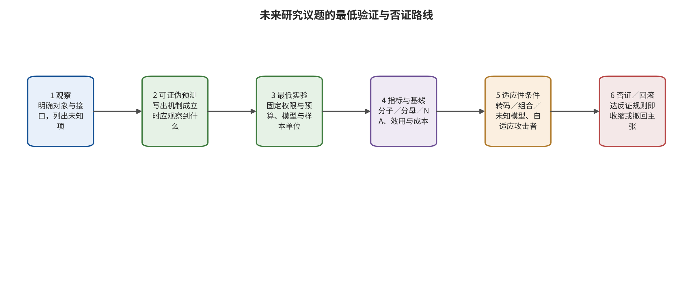

## 11. 可证伪研究议程

<!-- new_id=A-V2-11-001 origins=L00573,L00616 evidence=LF-A001-LF-A042;LF-D043-LF-D095;LF-E096-LF-E200;LF-R201-LF-R205 action=merge -->

本章不用论文数量、产品发布或新闻密度预测必然趋势，而把 F01–F14 统一写成可证伪议程。每项都保留条件化预测、最低实验或研究、核心指标、否证标准和观察窗；当否证标准成立或前置条件长期缺失时，对应判断应被撤回、收窄或停止，而不是被重新解释为“趋势仍在”。

### 11.1 视频、音画与实时状态（F01-F04）

<!-- new_id=A-V2-11-002 origins=L00574,L00575,L00576 evidence=LF-A018-LF-A023;LF-A041-LF-A042;LF-D043-LF-D095 action=merge -->

**F01（两年观察窗）——图像安全防御能否迁移到视频。** 可证伪预测是，在固定生成器家族、内容概念和攻击预算后，纯逐帧审核对跨帧组合、延迟显现和运动语义的片段漏检高于显式时序方案；这是由当前特定模型信号导出的预测，不是已证实的跨架构规律 [@P007] [@R-A027]。最低实验需在至少三类架构上，对同一语义构造单帧显式、每帧弱显式、跨帧组合和仅由轨迹成立的条件，固定片长、帧率、种子和预算，比较抽帧、密集逐帧和时序审核；核心指标为帧级与片段级 ASR、最长连续漏检段、正常视频误报和计算时延。若三类架构的未见攻击上，纯逐帧与片段方案落在预注册等效界内，且误报与时延不更差，则否定“必须新增时序机制”的强命题。

<!-- new_id=A-V2-11-003 origins=L00577,L00578,L00579 evidence=LF-A018-LF-A023;LF-D043-LF-D095 action=merge -->

**F02（两至三年观察窗）——时空后门的跨架构性。** 可证伪预测是，任一帧都不足、只有整段才成立的视觉、轨迹或事件顺序触发，可在多类视频架构中成立；现有工作只提供特定架构信号 [@P007]。最低实验应在至少三类视频架构上改变毒化预算、触发可见度和视频长度，并比较逐帧检测、时序模型和联合输入—输出审核；核心指标为片段或视频级 ASR、帧可见度、FVD、运动保持和干净效用。如果同权限、同感知约束和固定预算下无法跨架构成立，或密集逐帧与片段审核差异落入预注册零效应界，就应把预测降级为已测架构限定结论。

<!-- new_id=A-V2-11-004 origins=L00580,L00581,L00582 evidence=LF-A041-LF-A042;LF-D043-LF-D095 action=merge -->

**F03（两至三年观察窗）——联合音画生成与取证。** 可证伪预测是，在同时生成音频与视频并显式优化同步的条件下，只依赖口型、说话人或语义不同步的检测性能下降会大于单模态伪造；当前证据池缺少充分联合生成实证，故该句只是高优先假设。最低实验包含真实、仅换脸、仅换声、独立双模态伪造、联合生成和同步优化六组，按身份、语言、生成器和平台转码留一测试；核心指标为片段级 AUC/EER、每万件真实内容误报、说话事件定位误差和拒答。若联合生成与单模态伪造处于预注册等效界，且正常配音、剪辑、网络延迟和画外音的误报不增，则否定该预测。

<!-- new_id=A-V2-11-005 origins=L00583,L00584,L00585 evidence=LF-D043-LF-D095;LF-E193-LF-E200 action=merge -->

**F04（两年观察窗）——实时视频水印。** 可证伪预测是，实时场景的决定性瓶颈会转向首次可靠告警时延、窗口状态、内存、断流恢复和转码链，而非只是整段离线准确率；时序传播与相关规范只是技术信号，未证明平台闭环 [@P033] [@O001]。最低实验在同码率和画质下比较整段、分块和逐帧嵌入，施加抽帧、插帧、变速、局部拼接、自适应分辨率和直播转码；核心指标为首次告警时延、窗口、吞吐、CPU/GPU 资源、bit accuracy、定位误差和断流恢复。若离线方案无需重新设计就能在多长度和多转码链上保持等效检测、定位、吞吐和资源成本，且无需持久状态，则否定“实时需要新机制”。

### 11.2 组合供应链、隐私、可用性与撤回（F05-F08）

<!-- new_id=A-V2-11-006 origins=L00586,L00587,L00588 evidence=LF-A007-LF-A017;LF-D043-LF-D095 action=merge -->

**F05（两至四年观察窗）——LoRA 与运动模块组合。** 可证伪预测是，单独通过行为审计的制品在基础模型、加载顺序、合并比例、运动或音频模块改变后，可能出现组合触发或后门增强；现有多模块工作只提供方向信号 [@P006]。最低实验使用基础模型×空间 LoRA×运动 LoRA×ControlNet×音频模块的正交或覆盖数组，记录哈希、签名、秩、合并权重、量化和加载顺序；核心指标为组合异常率、ASR、干净效用和扫描召回。若组合异常不高于单模块可预测上界，且静态特征与单模块测试稳定识别全部异常组合，则可否定组合必须独立审计的强命题。

<!-- new_id=A-V2-11-007 origins=L00589,L00590,L00591 evidence=LF-A001-LF-A042;LF-D043-LF-D095 action=merge -->

**F06（两年观察窗）——概念擦除的多条件可恢复性。** 当前证据包未为该项绑定独立 gap ID，因而它是本文从擦除边界综合出的待验证命题，不是已证实趋势。预测是，仅用自然语言提示验证的擦除会被图像条件、学习式嵌入、潜变量、控制图、短时再微调或视频运动语义中至少一类恢复 [@L-S008]。最低实验固定基础模型、擦除概念、保留概念与效用预算，对六类条件给予等价计算预算；核心指标为残余概念率、保留概念效用和误擦除。若未见概念与全部条件均低于预注册不可恢复界，且保留概念与正常效用无实质下降，则否定“擦除会被多条件恢复”的强预测。

<!-- new_id=A-V2-11-008 origins=L00592,L00593,L00594 evidence=LF-A024-LF-A042;LF-D043-LF-D095 action=merge -->

**F07（三年观察窗）——视频训练数据的事件级记忆。** 可证伪预测是，视频记忆可表现为单帧不相似，但动作、镜头顺序、背景运动或音画片段高度复制，因而帧级最近邻可能漏检或误判。最低实验需在可审计训练集上改变视频重复度和身份分布，比较帧级感知相似、光流或轨迹、事件序列、音频指纹和联合片段检索，并对候选做盲人工核验；核心指标为身份或事件级 precision、recall、人工核验结果及生成量、候选量、确认量和独立训练片段量。若多模型上的事件级与音画联合检索未发现任何帧级方法漏掉的可核验片段，且置信区间排除有意义差异，则可否定新增事件级检索的必要性。

<!-- new_id=A-V2-11-009 origins=L00595,L00596,L00597 evidence=LF-A024-LF-A042;LF-D043-LF-D095 action=merge -->

**F08（两至三年观察窗）——生成服务可用性。** 可证伪预测是，长视频、多控制分支、高分辨率与交互式重生成导致的显存、排队、缓存和账单放大，可能不能被通用 API 限流在不损害合法长任务的情况下一并解决；近似缓存研究只提供特定隐私与完整性信号，不等于所有服务受影响 [@P039]。最低实验在隔离环境中将长时序、控制组合、相似提示缓存抖动和分布式低速并发与等成本合法负载对照；核心指标为 GPU 秒、峰值显存、队列时间、失败重试、SLO、账单和租户干扰。若通用配额、超时与公平排队在全部负载上满足预注册界，且合法长任务的完成率、成本与尾延迟不恶化，则否定生成专用资源防御的强必要性。

### 11.3 来源证明、低基率检测与跨平台处置（F09-F13）

<!-- new_id=A-V2-11-010 origins=L00598,L00599,L00600 evidence=LF-D043-LF-D095;LF-E193-LF-E200 action=merge -->

**F09（两至四年观察窗）——水印与 C2PA 的联合生命周期。** 可证伪预测是，单独水印受移除与伪造影响，单独来源 manifest 受整份剥离与恶意声明影响，联合系统可能在编辑与再上传链上提高可追踪覆盖，但仍不证明内容事实为真 [@O001] [@L-S002]。最低实验设无标记、仅水印、仅 C2PA 和联合四组，经过截图、录屏、再编码、平台上传下载、局部编辑、密钥撤销、证书过期和恶意签名者；核心指标为可验证覆盖、误归因、来源中断点、首次告警和处置时延。若任一单机制在全部链路上与联合方案的覆盖和误归因等效，或联合方案无相对收益，则否定联合覆盖预测；任何结果都不得把来源完整性升级为事实真实性。

<!-- new_id=A-V2-11-011 origins=L00601,L00602,L00603 evidence=LF-A024-LF-A042;LF-D043-LF-D095 action=merge -->

**F10（两年观察窗）——低基率与自适应检测。** 可证伪预测是，离线高 AUC 在真实低基率、未知生成器、平台压缩和知道防御类别的适应性攻击下，会表现为精确率、校准或审核负载恶化；跨生成器数据只提供分布漂移信号，并非真实平台流证据 [@R-A017]。最低实验按预注册伪造基率构造时间流混合数据，允许攻击者训练代理，并做跨平台、未知生成器测试；核心指标为 precision、每万件真实内容误报、校准、拒答、人工复核量、群体差异和跨生成器性能。若多平台分布、未知生成器和适应性攻击下仍满足预注册低误报 SLO 与校准，且消融排除数据集身份捷径，则否定强退化预测并允许更强的、仍受协议限定的部署主张。

<!-- new_id=A-V2-11-012 origins=L00604,L00605,L00606 evidence=LF-A001-LF-A042;LF-D043-LF-D095;LF-E193-LF-E200 action=merge -->

**F11（三至五年观察窗）——个性化同意与可验证撤回。** 当前证据包未为该项绑定独立 gap ID，因而这是由数据、制品和平台链联合导出的待验证议程。预测是，训练入口的一次同意不足以处理 LoRA 复制、合并、再上传、缓存和版本迭代，有效撤回需绑定数据、制品、残留能力与分发链。最低实验构造授权、到期、撤回、制品外泄和跨平台再上传事件，记录训练集、模型、缓存、已下载制品和平台结果的全链撤回；核心指标为全链撤回时延、残留身份生成能力和副本覆盖，并保存独立验证凭据。若不引入制品登记、撤销列表或平台机制，只靠入口同意就能在预注册时限内清除全部副本与能力，且由独立方验证，则否定复杂撤回基础设施的必要性。

<!-- new_id=A-V2-11-013 origins=L00607,L00608,L00609 evidence=LF-E096-LF-E192 action=merge -->

**F12（两年观察窗）——事件级因果证据。** 可证伪预测是，新闻中的“AI 生成”往往不能单独区分生成、辅助编辑、检测器猜测和未证实归因，因而只凭新闻文本不足以恢复生成工具、首破点、传播与伤害链。最低研究是按司法或官方记录、平台声明、来源凭证、可验证媒体、当事人陈述与二手报道设固定证据等级，由独立审阅者盲审，再用后续官方材料回测，未知字段不强填；核心指标为字段准确率、审阅一致性和未知率。若独立审阅者只凭新闻就能高一致、准确恢复生成器、首破接口、传播与损害，并被后续官方记录验证，则否定一手追踪的强增益假设。

<!-- new_id=A-V2-11-014 origins=L00610,L00611,L00612 evidence=LF-D043-LF-D095;LF-E096-LF-E200 action=merge -->

**F13（三年观察窗）——跨平台受害者救济。** 可证伪预测是，算法告警变快不会自动缩短有效通知到限制、重复阻断、恢复和申诉完成的全链时延，流程、身份核验和跨平台协作可能是瓶颈；相关制度材料只提供可测量的责任窗口，不证明执行效果 [@O014] [@O009] [@O006]。最低实验只能在平台书面批准或专用环境、伦理审查、请求限速、标记测试账户、可立即撤回且不占用真实受害者队列的条件下执行；否则仅做沙箱或桌面推演。核心指标是告警、人工确认、限制、重复阻断、恢复、证据保全和申诉的分段时延，以及误伤与复发。若控制内容和平台后，检测改善与所有救济结果稳定同向，流程变量不再解释额外方差且不增加误伤，则否定“流程是独立瓶颈”的强命题。

### 11.4 代理化生成与多阶段责任（F14）

<!-- new_id=A-V2-11-015 origins=L00613 evidence=LF-A001-LF-A042;LF-D043-LF-D095;LF-E096-LF-E200 action=rewrite -->

**F14（三至五年观察窗）——代理化生成与状态化策略风险。** 当前证据包未为该项绑定独立 gap ID，所以它是从系统边界与工具权限综合导出的研究假设。可证伪预测是，当生成模型可以检索身份素材、调用编辑器、迭代评估、选择平台并发布时，危害会更多由长期记忆、工具权限和分阶段目标组合决定，因而单轮分类器可能漏掉每步正常但整体越权的策略。

<!-- new_id=A-V2-11-016 origins=L00614,L00615 evidence=LF-A001-LF-A042;LF-D043-LF-D095;LF-E096-LF-E200 action=merge -->

最低实验使用同一基础模型比较单轮生成与受控代理模式，代理分别获得检索、合成身份库、编辑、来源签名和发布工具，在隔离沙箱内预注册合法与不合法长期任务。核心指标为任务级危害率、首个失控步骤、工具调用因果贡献、回滚成功、资源成本与合法任务完成率。若最小权限、逐步确认和状态审计使代理与单轮模式的任务级危害落在预注册等效界内，且合法任务完成率不实质受损，则否定需要全新安全范式的强命题，只保留对现有工程组合的验证需求。

### 11.5 三阶段观察窗和停止规则

<!-- new_id=A-V2-11-017 origins=L00573,L00616 evidence=LF-A001-LF-A042;LF-D043-LF-D095;LF-E096-LF-E200;LF-R201-LF-R205 action=merge -->

第一观察阶段为未来两年：检查基准是否持续公开有效响应分母、攻击预算、视频时间参数、低基准率误报和适应性攻击。如果主流工作仍仅给出封闭数据集单点分数，则应降级“评测已从单点防御转向组合压力测试”的判断。第二阶段为两至四年：检查组合制品清单、签名、撤回与多模块行为测试是否进入模型托管；如果生态转向不可插拔的闭源服务，则应降级公开 LoRA 组合的普遍重要性，同时只保留对平台内部依赖的审计问题。

<!-- new_id=A-V2-11-018 origins=L00616,L00617,L00621 evidence=LF-A001-LF-A042;LF-D043-LF-D095;LF-E096-LF-E200;LF-R201-LF-R205 action=merge -->

第三观察阶段为三至五年：检查水印、C2PA、检测、平台标签、撤销与申诉是否形成可审计接口。若主要平台持续剥离来源信息、无法传播撤销或不提供可重放申诉，就必须停止“真实性基础设施已闭环”的主张。适用于所有阶段的停止规则是：预注册否证条件成立，有效分母或对照无法建立，新版本使原机制不再对齐，或运行需要超越授权和伦理边界时，对应议程应标记为被否证、无法检验或暂停，不得以趋势语言补齐。

### 11.E1 证据展开：未来三至五年的可证伪研究议程

<!-- new_id=M-L00573 origins=L00573 evidence=LF-R201-LF-R205 action=move -->
未来趋势不能由论文数量、产品发布或新闻密度外推。本章为每项判断给出预测、最低实验和否证条件；若否证条件成立，综述应撤回或降级原判断，而不是把任何结果都解释成“趋势仍在”。`future_agenda.csv`保存14项结构化合同。

#### 11.E1.1 视频、音画与实时状态：从逐帧审核到事件级安全

#### 11.E1.2 议程 F01：图像安全防御不能无条件迁移到视频

<!-- new_id=M-L00574 origins=L00574 evidence=LF-A022;LF-A027;LF-D053;LF-E117;LF-E122 action=move -->
**可证伪预测。** 在固定生成器家族、内容概念和攻击预算后，只用逐帧图像审核或图像安全引导的系统，对跨帧组合、延迟显现和运动语义攻击的片段级漏检率会高于显式片段模型。依据是BadVideo和视觉提示攻击已显示单帧不足，但这仍可能只是特定模型现象。[@P007] [@R-A027]

<!-- new_id=M-L00575 origins=L00575 evidence=LF-R201-LF-R205 action=move -->
**最低实验。** 为同一语义构造单帧显式、每帧弱显式、跨帧组合、仅由轨迹成立四组；固定片长、帧率、种子和生成预算，在至少三类架构上比较随机抽帧、密集逐帧和时序审核。报告帧级与片段级ASR、最长连续漏检段、正常视频误报和计算时延。

<!-- new_id=M-L00576 origins=L00576 evidence=LF-R201-LF-R205 action=move -->
**否证条件。** 三类架构的未见攻击上，纯逐帧方案与片段方案在预注册等效界内，同时正常视频误报和延迟不更差。若成立，应否定“必须新增时序机制”的强命题，仅保留“需验证时序迁移”。

#### 11.E1.3 议程 F02：时空后门会跨架构规避单帧审核

<!-- new_id=M-L00578 origins=L00578 evidence=LF-R201-LF-R205 action=move -->
**最低实验。** 在至少三类视频架构上训练固定视觉、轨迹和事件顺序三类目标；改变毒化预算、触发可见度和视频长度。比较逐帧图像检测、时序模型和联合输入—输出审核，报告视频级ASR、帧级可见度、FVD、运动保持和干净效用。

<!-- new_id=M-L00579 origins=L00579 evidence=LF-A022;LF-D053;LF-E117 action=move -->
**否证条件。** 在相同权限和感知约束下，后门无法跨架构成立，或密集逐帧审核与片段审核差异的置信区间完全落入预注册零效应界。若出现，只能把BadVideo结论限定在已测架构。[@P007]

#### 11.E1.4 议程 F03：联合音画生成会削弱依赖不同步的取证

<!-- new_id=M-L00580 origins=L00580 evidence=LF-R201-LF-R205 action=move -->
**可证伪预测。** 只依赖口型、说话人或语义不同步的检测，在同时生成音频与视频并显式优化同步的攻击者面前，性能下降大于只伪造单一模态的情形。

<!-- new_id=M-L00581 origins=L00581 evidence=LF-R201-LF-R205 action=move -->
**最低实验。** 建立真实、仅换脸、仅换声、独立双模态伪造、联合生成、联合生成后同步优化六组；按身份、语言、生成器和平台转码做留一测试。指标包括片段级AUC/EER、每万真实内容误报、说话事件定位误差和拒答。

<!-- new_id=M-L00582 origins=L00582 evidence=LF-R201-LF-R205 action=move -->
**否证条件。** 音画异常检测在联合生成和单模态伪造间保持预注册等效性能，同时正常配音、剪辑、网络延迟和画外音不增加误报。当前文献池缺少足够联合生成实证，因此这是高优先证据缺口，而非已确认失败。

#### 11.E1.5 议程 F04：实时水印的瓶颈将由离线准确率转向首次告警与状态

<!-- new_id=M-L00583 origins=L00583 evidence=LF-A021;LF-A038;LF-D061;LF-D077;LF-D081;LF-E116;LF-E126 action=move -->
**可证伪预测。** 随流式数字人和直播合成增加，决定性约束将是首次可靠检测时延、窗口状态、内存、断流恢复和平台转码，而不是整段离线AUC。VideoSeal的时序传播与C2PA 2.4对直播资产的支持提供技术信号，但未证明平台闭环。[@P033] [@O001]

<!-- new_id=M-L00584 origins=L00584 evidence=LF-R201-LF-R205 action=move -->
**最低实验。** 在同码率和画质下比较整段、分块和逐帧嵌入；施加抽帧、插帧、变速、局部拼接、分辨率自适应与真实直播转码。逐流报告首次告警毫秒数、窗口大小、CPU/GPU占用、bit accuracy、错误定位和断流恢复。

<!-- new_id=M-L00585 origins=L00585 evidence=LF-R201-LF-R205 action=move -->
**否证条件。** 离线最优方案不经重新设计即可在多长度和多转码链上同时保持等效检测、定位、吞吐与资源成本，且无需持久状态。若成立，“实时需要新机制”预测被否定。

#### 11.E1.6 组合供应链、隐私、可用性与撤回

#### 11.E1.7 议程 F05：LoRA与运动模块的组合风险高于单模块审计

<!-- new_id=M-L00586 origins=L00586 evidence=LF-A028;LF-E123 action=move -->
**可证伪预测。** 单独通过行为审计的适配器，在加载顺序、合并比例、基础模型、运动模块或音频模块改变后，可能出现组合触发、后门增强或正常效用掩护。MasqLoRA的多模块实验显示方向性信号，但组合空间远未覆盖。[@P006]

<!-- new_id=M-L00587 origins=L00587 evidence=LF-R201-LF-R205 action=move -->
**最低实验。** 构建基础模型×空间LoRA×运动LoRA×ControlNet×音频模块的正交或覆盖数组；记录每个制品哈希、签名、秩、合并权重、量化和加载顺序。所有单模块与组合运行相同触发扫描、正常任务回归和最小权限加载。

<!-- new_id=M-L00588 origins=L00588 evidence=LF-R201-LF-R205 action=move -->
**否证条件。** 预注册规模的组合样本中，组合异常率不高于由单模块结果预测的上界，且静态制品特征与单模块测试能稳定识别全部异常组合。若成立，可把审计重点收缩到制品级。

#### 11.E1.8 议程 F06：概念擦除的真正边界是多条件可恢复性

<!-- new_id=M-L00590 origins=L00590 evidence=LF-R201-LF-R205 action=move -->
**最低实验。** 固定基础模型、擦除概念、保留概念与效用预算，对文本、图像、嵌入、潜变量、再微调和视频控制六种条件给等价计算预算。用多个独立检测器加盲人工评审，报告残余概念率、误擦除和正常效用。

<!-- new_id=M-L00591 origins=L00591 evidence=LF-R201-LF-R205 action=move -->
**否证条件。** 同一方法在未见概念和六类条件下均达到不可恢复界，同时保留概念和正常生成效用无实质下降。若成立，应放弃“擦除必然可恢复”的强预测。

#### 11.E1.9 议程 F07：视频训练数据记忆需要事件级定义

<!-- new_id=M-L00593 origins=L00593 evidence=LF-R201-LF-R205 action=move -->
**最低实验。** 在可审计训练集上构造不同重复度和身份分布的视频，比较帧级感知相似、光流/轨迹、事件序列、音频指纹和联合片段检索。候选必须盲人工核验，并分别报告生成量、候选量、确认量和独立训练片段量。

<!-- new_id=M-L00594 origins=L00594 evidence=LF-R201-LF-R205 action=move -->
**否证条件。** 多模型上，事件级和联合音画检索没有发现任何帧级方法漏掉的可核验训练片段，且置信区间排除有意义差异。若成立，可保留帧级近邻作为较低成本审计。

#### 11.E1.10 议程 F08：生成服务可用性是独立安全接口

<!-- new_id=M-L00596 origins=L00596 evidence=LF-R201-LF-R205 action=move -->
**最低实验。** 预注册每请求GPU秒、峰值显存、队列时间、失败重试、账单和租户干扰；攻击负载包含长时序、控制组合、相似提示缓存抖动和分布式低速并发，另设等成本合法负载。服务端必须隔离测试环境，避免影响真实用户。

<!-- new_id=M-L00597 origins=L00597 evidence=LF-R201-LF-R205 action=move -->
**否证条件。** 通用配额、超时和公平排队在全部负载上把租户干扰限制在界内，同时合法长视频完成率、成本和尾延迟无显著恶化。若成立，生成专用资源防御的必要性被削弱。

#### 11.E1.11 来源证明、低基率检测与跨平台处置

#### 11.E1.12 议程 F09：水印与C2PA只能作为互补链验证

<!-- new_id=M-L00598 origins=L00598 evidence=LF-A038;LF-D061;LF-D077;LF-E126;LF-E194 action=move -->
**可证伪预测。** 单独嵌入水印会受移除和伪造，单独来源manifest会受整份剥离和恶意声明；联合系统在真实编辑与再上传链上可能提高可追踪覆盖，但仍不证明内容事实真实。C2PA技术规范和欧委会2026图像/视频标记研究都把多技术路径视为需要实施验证的对象。[@O001] [@L-S002]

<!-- new_id=M-L00599 origins=L00599 evidence=LF-R201-LF-R205 action=move -->
**最低实验。** 设置无标记、仅水印、仅C2PA、联合四组，经过截图、录屏、再编码、社交平台上传下载、局部编辑、密钥撤销、证书过期和恶意签名者。报告可验证覆盖、误归因、来源中断点、首次告警与处置时延。

<!-- new_id=M-L00600 origins=L00600 evidence=LF-R201-LF-R205 action=move -->
**否证条件。** 单一机制在全部链路上与联合方案达到等效覆盖和误归因，或联合方案无相对收益。无论结果如何，都不得把来源完整性解释为事实真实性。

#### 11.E1.13 议程 F10：检测器必须显式建模低基率和适应性攻击

<!-- new_id=M-L00602 origins=L00602 evidence=LF-R201-LF-R205 action=move -->
**最低实验。** 按预注册伪造基率构造时间流混合数据，攻击者知道防御类别并可训练代理。报告精确率、每万真实内容误报、校准、拒答、人工复核量、群体差异和跨生成器性能，不只报AUC。

<!-- new_id=M-L00603 origins=L00603 evidence=LF-R201-LF-R205 action=move -->
**否证条件。** 多平台分布、未知生成器和适应性攻击下，检测器仍满足预注册低误报SLO与校准，并且消融排除数据集身份捷径。若成立，可以支持更强部署主张。

#### 11.E1.14 议程 F11：个性化同意必须支持可验证撤回

<!-- new_id=M-L00605 origins=L00605 evidence=LF-R201-LF-R205 action=move -->
**最低实验。** 构造授权、到期、撤回、制品外泄和跨平台再上传事件；记录从撤回请求到训练集、模型、缓存、下载制品和平台结果全部失效的时间，测试残留身份生成能力并保存独立验证凭据。

<!-- new_id=M-L00606 origins=L00606 evidence=LF-R201-LF-R205 action=move -->
**否证条件。** 不引入制品登记、撤销列表或平台机制，仅靠训练入口同意即可在预注册时限内消除所有副本和生成能力，并由独立方验证。若成立，复杂撤回基础设施可以简化。

#### 11.E1.15 议程 F12：事件级因果链优先于新闻计数

<!-- new_id=M-L00607 origins=L00607 evidence=LF-R201-LF-R205 action=move -->
**可证伪预测。** 新闻中的“AI生成”经常无法区分生成、辅助编辑、检测器猜测或未经证实归因；仅靠新闻文本不足以恢复生成工具、首破接口、传播路径和伤害。

<!-- new_id=M-L00608 origins=L00608 evidence=LF-R201-LF-R205 action=move -->
**最低研究。** 对公开事件采用固定证据等级：司法/官方记录、平台声明、来源凭证、可验证媒体、当事人陈述和二手报道。双人盲审后，以后续官方材料回测字段准确率和一致性，未知项不得强填。

<!-- new_id=M-L00609 origins=L00609 evidence=LF-R201-LF-R205 action=move -->
**否证条件。** 独立审阅者仅凭新闻就能高一致、准确恢复生成器、首破接口、传播与损害，并被后续官方记录验证。如果成立，昂贵的一手追踪收益有限；当前32事件显然尚未满足。

#### 11.E1.16 议程 F13：检测更快不必然带来更好的受害者救济

<!-- new_id=M-L00610 origins=L00610 evidence=LF-A040-LF-A042;LF-D092;LF-E131;LF-E133;LF-E136 action=move -->
**可证伪预测。** 算法告警时延缩短，不会自动缩短有效通知到下架、重复阻断和申诉完成的时延；流程、身份核验和跨平台协作可能成为主要瓶颈。TAKE IT DOWN Act的通知处置义务和中国、欧盟标识规则为测量责任提供制度窗口。[@O014] [@O009] [@O006]

<!-- new_id=M-L00611 origins=L00611 evidence=LF-R201-LF-R205 action=move -->
**最低实验。** 只有在平台书面批准或专用测试环境、伦理审查、请求率上限、标记测试账户、立即撤回和不占用真实受害者审核队列等条件成立时，才使用授权模拟媒体测试合规通知、重复上传、授权争议和误标申诉；否则只做平台提供的沙盒或桌面推演。报告告警、人工确认、限制、重复阻断、恢复和证据保全的分段时延，并调查受害者和被误报用户体验。

<!-- new_id=M-L00612 origins=L00612 evidence=LF-R201-LF-R205 action=move -->
**否证条件。** 在控制内容与平台后，算法检测改善与所有救济结果稳定同向，流程变量不再解释额外方差，且不增加误伤。若成立，可把投资优先级更多放到检测。

#### 11.E1.17 世界模型、代理化生成与多阶段责任

#### 11.E1.18 议程 F14：代理化生成将把单轮内容安全变成状态化策略安全

<!-- new_id=M-L00614 origins=L00614 evidence=LF-R201-LF-R205 action=move -->
**最低实验。** 使用同一基础模型比较单轮生成与受控代理模式；代理分别获得检索、身份库、编辑、来源签名和发布工具。预注册合法与不合法长期任务，测量任务级危害率、首个失控步骤、工具调用因果贡献、回滚成功和资源成本。所有测试限定在隔离沙盒和合成身份。

<!-- new_id=M-L00615 origins=L00615 evidence=LF-R201-LF-R205 action=move -->
**否证条件。** 最小权限、逐步确认和状态审计使代理模式的任务级危害与单轮模式在等效界内，并且不显著损害合法任务完成率。若成立，现有单轮治理可通过工程组合延伸，而无需全新安全范式。

##### 三阶段观察窗与停止规则

<!-- new_id=M-L00618 origins=L00618 evidence=LF-R201-LF-R205 action=move -->

<!-- new_id=M-L00619 origins=L00619 evidence=LF-R201-LF-R205 action=move -->
**表：未来议题、最低验证和否证标准**

<!-- new_id=M-L00620 origins=L00620 evidence=LF-R201-LF-R205 action=move -->
| 议题 | 可证伪预测 | 最低实验 | 核心指标 | 否证标准 |
|---|---|---|---|---|
| 图像安全防御能否迁移到视频 | 逐帧方案对跨帧组合和延迟显现的片段漏检更高 | 同语义四类条件、3类架构、固定片长帧率种子 | 片段ASR、最长漏检段、正常视频误报 | 3架构未见攻击上逐帧方案与片段方案在预注册等效界内 |
| 时空后门跨架构性 | 任一帧不足而整段成立的触发可在多类视频架构成立 | 固定视觉、轨迹、事件序列目标，3类架构，报告毒化预算 | 片段ASR、帧可见度、FVD、干净效用 | 固定预算下无法跨架构成立或密集逐帧与片段审核差异为零 |
| 联合音画生成与取证 | 同步优化会比单模态伪造更显著削弱不同步检测 | 真实、换脸、换声、独立双模态、联合生成、同步优化6组 | EER、片段定位误差、每万真实误报 | 联合与单模态在等效界内且正常配音误报不增 |
| 实时视频水印 | 主要瓶颈转为首次告警时延、状态与转码链 | 整段、分块、逐帧，抽插帧、变速、直播转码 | 首次告警、窗口、吞吐、bit accuracy、断流恢复 | 离线方案直接流式化即可等效且无状态成本 |
| LoRA与运动模块组合 | 单独良性模块组合后可能出现触发或后门增强 | 基础模型×空间LoRA×运动LoRA×控制、音频模块正交组合 | 组合异常率、ASR、干净效用、扫描召回 | 组合异常不高于单模块可预测上界且静态特征全识别 |
| 概念擦除的多条件可恢复性 | 文本验证过的擦除会被至少一种图像、嵌入、潜变量、控制、再微调恢复 | 固定概念与预算，对6类条件做未见攻击 | 残余概念率、保留概念效用、误擦除 | 全部条件低于不可恢复界且效用无实质下降 |

<!-- new_id=M-L00621 origins=L00621 evidence=LF-R201-LF-R205 action=move -->
注：数据源为 `paper/tables/future_agenda.csv`；正文显示 6/14 行并对过长单元格作省略，完整字段与记录以该 CSV 为准。

---

[← 返回目录](index.md)
