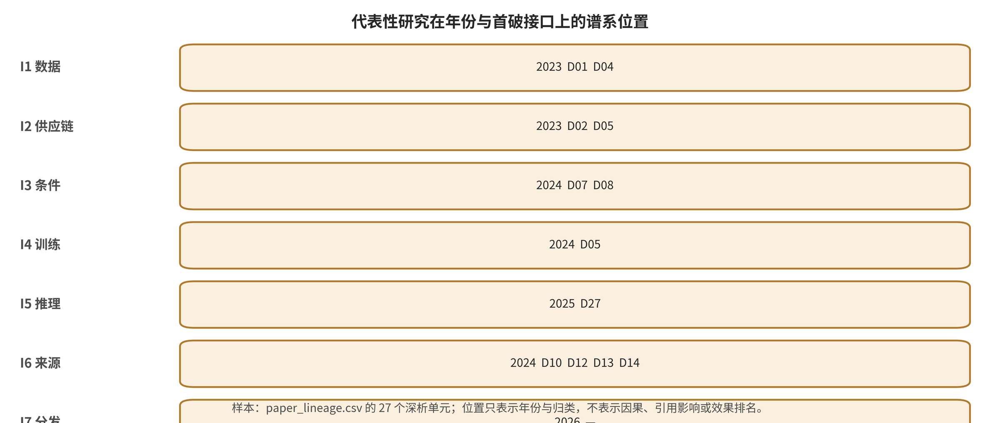

## 附录 A. 27项统一论文深析与页级证据卡

本附录将 27 项代表研究按统一威胁模型、机制、作者报告结果、限制和复现状态展开。后门与供应链、条件越狱与输入保护、隐私与真实性、视频时序之间的“谱系”均是本文对当前证据的结构化综合，不表示存在经统计验证的因果继承关系。每项的 `paper_main_protocol_run=false`，因而本附录不提供独立复现结论。

### APP-A.E1 证据展开：代表性研究谱系与二十七项统一深析

本部分围绕第19、20、21、24、25章展开。它不是把论文和新闻按年份堆叠，而是回答五个连续问题：某项工作改变了哪一项威胁假设；它用什么输入和机制完成攻击或防御；作者的评测究竟以什么为分母；现实事件在哪一段证据链上被确认；未来实验怎样否定当前判断。所有“作者报告”均是来源内结果，所有“本文综合”均是跨来源归纳，所有“本文推断”均明确写出推断条件。代码仓库存在、本地PDF存在或静态审计通过，都不等于论文已经复现。

#### APP-A.E1.1 从扩散过程到数据、组件和适配器：后门谱系的首破点迁移

早期生成模型后门通常把攻击对象理解为“一个被污染的整模型”。扩散模型改变了这个叙述：前向噪声、逆向去噪、条件编码器、潜空间解码器和轻量适配器都可能独立成为完整性边界。因此，下列工作不以“谁的ASR更高”排列，而按首破点由训练过程向数据入口、组件供应链和可组合适配器迁移。这个顺序表达威胁模型扩张，不表达技术优越性。

#### APP-A.E1.2 深析 P001：BadDiffusion——扩散后门的效用—特异性双合同

**问题与威胁模型。** BadDiffusion问的是：攻击者在控制训练数据和扩散训练过程时，能否发布一个正常输入上像干净模型、触发输入上却趋向指定目标的生成器。受保护资产不是某张输出图，而是已发布扩散模型的训练完整性以及下游用户对“无触发行为代表整体行为”的信任。攻击输入包括毒化样本、视觉触发和目标输出；攻击者权限显著强于仅能查询服务的黑盒用户。[@P001]

**机制。** 作者的方法同时改造训练样本和扩散过程，使触发对应的噪声轨迹在逆过程里收敛到攻击目标；作者把后门目标拆成高效用与高特异性：前者要求干净输入的FID等效用不显著恶化，后者要求触发出现时目标MSE降低。本文综合认为，这一拆分后来成为扩散后门研究常用的报告框架。[@P001]

**评测与作者报告。** 论文在CIFAR-10、CelebA-HQ等设置中改变毒化率、触发和目标，并用FID和目标MSE分别测量正常效用和后门特异性。本地PDF p.7报告，在该预训练微调设置下20%毒化率足以完成其定义的后门；p.8的推理期裁剪实验显示，在所测参数内目标MSE上升而FID近似保持。该数字只定位于论文协议，不能与不同触发、不同模型或文本条件后门的ASR合并。[@P001]

**作者自述局限、本文综合影响与复现状态。** 攻击依赖较强训练权限；已知简单触发可被裁剪缓解并不意味着未知语义触发可被发现。本文综合将该工作定位为把扩散模型本身纳入后门安全对象的奠基证据，后续研究再扩展到多目标木马、统一训练框架和黑盒检测。本文仅完成本地全文定位与代码入口静态核对，复现状态为`NOT_ATTEMPTED`，不是实验复现。

#### APP-A.E1.3 深析 P002：TrojDiff——从固定目标到三类对抗目标

**问题与威胁模型。** TrojDiff进一步问：后门是否只能把触发映射到一张固定图，还是可以实现分布内类别、分布外类别和图像级目标。攻击者仍控制模型训练和木马噪声分布，受害者下载并使用被污染模型；输入是经过设计的Trojan noise以及三类目标。[@P002]

**机制。** 作者把目标数据沿前向过程扩散到偏置高斯分布，再学习对应逆过程；普通噪声仍生成干净分布，木马噪声则沿另一条轨迹收敛。本文据此定位：相较BadDiffusion，该工作改变的是目标空间和噪声分布，而不是把权限降到黑盒。[@P002]

**评测与作者报告。** 作者在DDPM/DDIM和多数据集上分别使用precision、ASR、MSE与FID。PDF p.2报告In-D2D设置最高precision 84.70%、ASR 96.90%，Out-D2D的ASR高于98%，D2I的MSE达到约`1×10^-4`量级。这里必须保留三种目标定义；把这三个数字压成“后门成功率”会丢失分母和判定器。[@P002]

**作者自述局限、本文综合影响与复现状态。** 木马噪声的可用性依赖攻击者能影响训练和交付；异常种子、采样器变化与未知噪声分布会改变防御难度。本文综合将该工作定位为把评测从单一目标扩展为多目标；论文没有提供现实模型仓库中的感染率证据。本文为`NOT_ATTEMPTED`，只有本地全文、页码和机制审查。

#### APP-A.E1.4 深析 P003：Rickrolling the Artist——文本编码器成为独立供应链边界

**问题与威胁模型。** 这项工作不要求攻击者重训扩散主干，而是假设用户从外部来源加载预训练文本编码器。输入可以是非拉丁字符、emoji或普通词；首破点是组件交付链，触发词只是后续激活条件。本文据此将其首破点定位为组件交付链；若仅归为“提示攻击”，会隐藏恶意制品已被装载这一前置条件。[@P003]

**机制。** 作者以教师—学生式训练改变文本嵌入，把触发词映射到对象、属性、风格或固定输出相关表示，同时保持正常提示的嵌入与生成行为。本文综合认为，该机制暴露模块化生成栈中的信任错位：主模型哈希正确，并不能证明条件编码器良性。[@P003]

**评测与作者报告。** 论文在Stable Diffusion v1.4生态中考察多类触发，用图文相似、FID和定性样本同时检查触发效果和无触发效用。来源报告在其特定组合上提供了组件级后门可行性的证据；由于各目标没有一个共同、独立的成功判定器，本章不摘录单一汇总率。[@P003]

**作者自述局限、本文综合影响与复现状态。** 静态哈希只能标识“加载了哪个制品”，不能判断该制品在基础模型、调度器和提示工具组合下的行为；再微调也可能削弱或强化触发。本文据此定位其影响：生成模型安全审计需要同时考虑SBOM、签名和组合行为差分，但签名仍只保证来源与完整性。本文为`NOT_ATTEMPTED`。

#### APP-A.E1.5 深析 P005：Nightshade——总语料巨大不代表单概念投毒昂贵

**问题与威胁模型。** Nightshade反驳“亿级训练集天然稀释投毒”的直觉。攻击者不控制训练器，只能公开或注入可能被抓取的图文样本；真正相关的分母是某一概念的有效训练样本，而不是全库样本总数。目标是让普通提示在训练后被重定向到错误概念。[@P005]

**机制。** 作者构造在人眼外观上接近原图、但在模型特征中指向另一概念的毒样本，并用配套文本维持目标提示，使训练过程学习错误的提示—视觉关联。本文据此把传播链定位为I1数据入口失效、经I4训练更新固化、再由普通I3提示激活。[@P005]

**评测与作者报告。** 作者在自训练和预训练T2I设置中改变毒样本预算、概念距离和干净数据量。摘要称某些目标可用少于100个毒样本产生效果；PDF p.9定位到50个样本约70%–80%的作者报告攻击成功率，200个样本超过84%。这些数值依赖概念、训练集和CLIP分类判定，不可用来推断公共语料中的实际污染概率。[@P005]

**作者自述局限、本文综合影响与复现状态。** 攻击要求毒样本被抓取、保留并获得足够概念权重；重描述、去重、异常聚类和数据规模会改变结果。本文综合将其影响定位为：防御需要从全库重复检测扩展到概念条件异常与数据来源账本。本文为`NOT_ATTEMPTED`，没有运行训练管线。

#### APP-A.E1.6 深析 P006：MasqLoRA——良性外观适配器与组合行为

**问题与威胁模型。** MasqLoRA针对插件化开放生态：攻击者冻结基础模型，只发布看似能正常完成风格或对象适配的LoRA；用户下载、加载并用特定词激活。本文据论文权限把首破点定位为I2制品供应链，而非基础模型训练。[@P006]

**机制。** 作者使用少量触发词—目标图像对更新低秩矩阵，在正常提示下维持良性功能，在语义相近触发下输出攻击者目标。本文综合认为，适配器独立交付使“逐个组件通过测试”与“组合后安全”之间产生可审计差距。[@P006]

**评测与作者报告。** CVPR 2026正式页和本地PDF p.1报告最高99.8% ASR；p.7显示四个模块叠加时作者设置中的ASR仍为91.6%，但良性CLIP分数从31.22降至27.3。后一个结果很重要：组合后门强度与正常效用不是同向保持，审计必须同时报告二者。[@P006]

**作者自述局限、本文综合影响与复现状态。** 当前结果覆盖有限基础模型、LoRA秩、加载顺序和合并权重。量化、转换、多个运动/音频模块组合后是否新生触发仍未闭合。本文据此定位：审计单位应从“单文件”扩展为“基础模型×适配器×加载配置”。本文为`NOT_ATTEMPTED`。

#### APP-A.E1.7 条件越狱与预防式保护：从输入过滤到多模态控制

本谱系的核心变化是条件通道增加。文本到图像系统可以接收文本、负面提示、参考图、掩码、姿态、深度和个性化token；图像到视频又把首帧、尾帧、轨迹和视觉符号变成控制语言。防御若只审核自然语言，就把其他条件误当成被动数据。

#### APP-A.E1.8 深析 P008：SneakyPrompt——黑盒越狱是一项有预算的搜索

**问题与威胁模型。** SneakyPrompt研究攻击者只拥有在线查询权时，能否迭代改写被拒提示，使其同时通过安全过滤并诱导不安全生成。输入是原始敏感提示和替换token；预算应以服务查询数、有效响应数和生成费用报告，而不能只看成功样本。[@P008]

**机制。** 作者利用影子文本编码器和强化学习反馈，寻找在嵌入空间中保留目标语义、却跨过过滤器决策边界的离散token。本文据此把该攻击定位为闭环搜索，并把安全过滤器作为可查询判定器的信息泄漏列为相应系统风险。[@P008]

**评测与作者报告。** 作者对开源和闭源服务进行黑盒测试，区分过滤通过与输出内容两个条件。来源报告显示该搜索能在论文时点绕过多类过滤器；由于服务版本、拒绝、无效响应和输出裁判不同，本章不复制一个跨服务百分比。页码定位见本地PDF p.1–11。[@P008]

**作者自述局限、本文综合影响与复现状态。** 额外查询成本、速率限制和服务更新可能降低攻击；反过来，重复查询本身可作为防守信号。本文综合将其影响定位为：输入网关应评测跨请求关联、预算控制和自适应红队，而不是只做逐提示判断。本文为`NOT_ATTEMPTED`，未向真实服务发送攻击查询。

#### APP-A.E1.9 深析 P009：MMA-Diffusion——文本与图像条件联合旁路

**问题与威胁模型。** 当系统同时部署提示过滤和输出安全检查时，仅优化文本可能不足。MMA-Diffusion假设攻击者可对白盒模型或可微代理优化文本和视觉条件，并在部分在线服务上测试迁移。输入包括对抗文本、参考图和掩码。[@P009]

**机制。** 作者的联合目标让文字穿过提示过滤，同时让视觉条件和生成潜变量诱导后置检查器漏检。本文综合认为，该结果不证明“多模态一定更危险”，而是提示未进入统一策略判定的条件通道可能成为旁路。[@P009]

**评测与作者报告。** 论文使用ASR-N、有限查询和人工语义判定。PDF p.6报告10-query条件下，在论文当时的Midjourney和Leonardo.Ai上分别达到83.33%和90.00%的作者报告攻击成功率。数字只对应当时版本、内容类别和判定流程，不能视为当前平台能力。[@P009]

**作者自述局限、本文综合影响与复现状态。** 在线服务动态更新、内容类别和安全裁判器都会改变有效分母；有害图像被输出检查拦截时，不应计为端到端成功。本文据此定位：将“覆盖全部条件通道并保留输出复核”作为一种优先评测与部署建议，而不声称它是唯一必要架构。本文为`NOT_ATTEMPTED`。

#### APP-A.E1.10 深析 P018：PhotoGuard——把输入图像变成主动防御面

**问题与威胁模型。** PhotoGuard试图让图片所有者在发布前注入人眼较难觉察的扰动，使下游扩散编辑产生明显偏离。防守者控制自己的输入图；攻击者使用已知或近似的编辑模型。本文据此把它定位为提高未经授权编辑成本的输入保护，而不是有害输出检测。[@P018]

**机制。** 作者的编码器攻击使图像潜表示偏离，扩散攻击继续对整个编辑过程优化。本文的方法合同要求保护效果与原图可用性同时衡量，否则“把图片彻底破坏”也会被误算为成功防御。[@P018]

**评测与作者报告。** 本地PDF表6在60张图像等论文设置中，作者报告扩散攻击后的编辑相似度SSIM为`0.50±0.09`、PSNR为`13.58±2.23`，低于随机噪声基线；同时使用FID、VIFp、FSIM等检查。该结果只表明所测编辑模型上输出被扰乱，不证明所有恶意用途被阻断。[@P018]

**作者自述局限、本文综合影响与复现状态。** 模型迁移、JPEG/缩放、去噪和自适应净化可能削弱扰动；防守成本由个体承担，而平台未必保留原始像素。作者讨论了开发组织参与的政策组件；本文据此认为客户端防护不构成完整治理。本文为`NOT_ATTEMPTED`。

#### APP-A.E1.11 深析 P019：Glaze——风格保护同时需要算法和创作者可接受度

**问题与威胁模型。** Glaze关注艺术家公开展示作品后被抓取用于风格模仿。攻击者收集作品并微调风格模型；防守者在上传前给作品施加风格cloak。受保护资产既包括模型学习到的风格关联，也包括作品对观众和客户的展示价值。[@P019]

**机制。** 作者把作品特征推向一个目标风格，使训练所得关联偏离原作者风格。本文据此定位：与传统分类器对抗样本不同，该工作的目标是影响后续训练而非一次推理。[@P019]

**评测与作者报告。** 作者结合多模型实验、艺术家直接评审和用户研究。PDF p.2报告正常条件下风格模仿破坏率超过92%、适应性反制下超过85%；p.9报告1156名参与艺术家中超过92%认为扰动足够小，不破坏作品价值。两类数字的分母不同：前者是防御实验，后者是用户感知，不能合并。[@P019]

**作者自述局限、本文综合影响与复现状态。** 风格相似存在主观性，模型迭代、净化和训练数据混合会造成漂移；“用户愿意使用”也不证明平台保留。本文综合将其影响定位为把正常效用扩展到创作者体验，并把LightShed等专门反防御纳入生命周期审计。本文为`NOT_ATTEMPTED`。

#### APP-A.E1.12 深析 P020：Anti-DreamBooth——身份个性化的受控与泄漏条件

**问题与威胁模型。** Anti-DreamBooth研究少量肖像被DreamBooth类工具收集后，用户能否通过预先扰动阻止稳定身份个性化。作者显式区分便利/受控设置和不受控设置：后者允许攻击者混入未经保护的泄漏照片。[@P020]

**机制。** 作者以代理个性化训练和扰动优化交替进行，使训练后的模型要么产生明显伪影，要么降低身份相似。本文的方法合同要求把“身份错配”和“图像质量下降”分开，因为二者对应不同受害风险。[@P020]

**评测与作者报告。** 作者在VGGFace2、多个Stable Diffusion版本和提示上用FDFR、身份相似、SER-FQA、BRISQUE等指标。PDF p.2报告受控条件下破坏其测试的DreamBooth尝试；表5另列干净图混入的不受控结果，避免把全保护条件外推到泄漏场景。[@P020]

**作者自述局限、本文综合影响与复现状态。** 已经被复制的原图、不同个性化算法和社交平台预处理均可能绕过；作者未解决授权撤回后已经流通的LoRA和模型副本。本文综合将其影响定位为把“身份同意”转成可测试的模型能力问题，但证据仍不足以形成完整撤回链。本文为`NOT_ATTEMPTED`。

#### APP-A.E1.13 深析 R-A027：VPA-Guard——参考图从外观资产变成时间程序

**问题与威胁模型。** VPA-Guard指出I2V参考图中的箭头、草图、emoji或局部编辑可能被模型解释为动作和事件指令。攻击者控制图像与文本，但安全层若只看图像是否含显式有害内容，就会漏掉“静态符号展开成动态危害”的意图。[@R-A027]

**机制。** 作者构造VVA-Bench，将视觉提示按操作格式和风险类别编码；防御采用检索增强和自演化示例，尝试解释隐含意图后再决定拒绝。本文据此把首破点定位为I3视觉条件，而不是输出检测。[@R-A027]

**评测与作者报告。** 2026年预印本PDF p.1与p.7报告，在其版本和裁判协议下，无防御时Wan、Kling、Hailuo、Veo的总ASR分别为100.0%、99.6%、81.2%、74.8%。这些数值支持“该基准与当时版本中观察到旁路”，不证明现实发生率，也不应跨服务版本保持。[@R-A027]

**作者自述局限、本文综合影响与复现状态。** 该工作较新，尚缺跨团队复核；MLLM裁判、模型版本和提示自然度影响结果。本文综合将其概念贡献定位为把“参考图安全”从内容分类扩展到程序语义分析。本文只做本地全文静态定位，状态`NOT_ATTEMPTED`。

#### APP-A.E1.14 隐私、检测和水印：从“能否识别”到攻击—质量—基率合同

这一谱系包含三个不能互换的任务：被动检测对内容作统计判断；水印在生成或后处理中嵌入可验证信号；来源凭证记录签名者声明和编辑链。AUC高不等于低基率下可部署，水印存在不等于无法移除，凭证有效也不等于媒体语义为真。研究进展主要表现为评测合同越来越严格，而不是某个信号已经成为真值判定。

#### APP-A.E1.15 深析 P024：Extracting Training Data from Diffusion Models——查询量和人工核验进入隐私分母

**问题与威胁模型。** 该工作询问扩散模型是否会在常规采样中输出训练近副本。攻击者能够大量生成，并可利用高重复训练提示或训练集近邻信息筛选。作者采用严格的近副本定义，而不是把“风格相似”都称为提取。[@P024]

**机制。** 作者先对高重复提示生成大量随机种子候选，再利用生成样本之间的近重复图关系构造团簇，最后人工核验是否匹配训练样本。本文据此把生成、过滤和人工确认记录为三个独立分母。[@P024]

**评测与作者报告。** 作者从前沿模型中提取超过1000个训练样本。PDF p.6明确给出350,000个高重复提示、每个500次生成，共175M图像；p.7报告可从这些生成中以0假阳性识别50个记忆样本。这个结果依赖极大查询预算和训练辅助信息，不能写成“普通用户一次提示即可泄漏”。[@P024]

**作者自述局限、本文综合影响与复现状态。** 该定义不能覆盖属性推断、成员推断和语义级记忆；训练集不完整时召回率也不可识别。本文据此定位：查询量、候选数、核验数和重复度是隐私提取研究的必报字段。本文未执行175M级生成，状态`NOT_ATTEMPTED`。

#### APP-A.E1.16 深析 P028：Stable Signature——模型级比特签名与极低FPR主张

**问题与威胁模型。** Stable Signature希望模型所有者通过轻量微调潜扩散解码器，让后续所有输出携带固定二进制签名。服务掌握签名和提取器；攻击者可裁剪、压缩或改变图像。[@P028]

**机制。** 作者冻结大部分生成器，仅让解码器学习在视觉质量约束下嵌入可恢复比特；检测时提取签名，并用统计检验决定是否来自该模型或哪一身份。[@P028]

**评测与作者报告。** 作者测量bit accuracy、检测、识别和视觉质量。PDF p.1报告图像被裁到只保留10%内容时仍有90%以上检测准确率，所用统计阈值的FPR低于`10^-6`。如此低的FPR需要足够负样本或理论校准支撑；实际部署不能只复述阈值。[@P028]

**作者自述局限、本文综合影响与复现状态。** 生成式再构造、密钥泄漏和伪造不在所有实验覆盖内；解码器微调也要求发布方控制模型。本文综合将其定位为模型内水印代表工作；跨来源的WAVES和再生成攻击则提示常见失真鲁棒不等于自适应鲁棒。本文为`NOT_ATTEMPTED`。

#### APP-A.E1.17 深析 P029：Tree-Ring——采样噪声中的指纹

**问题与威胁模型。** Tree-Ring试图避免修改模型权重：服务在初始噪声的傅里叶域写入环状结构，生成后通过扩散反演检出。服务掌握种子/密钥，检测者需要兼容反演模型。[@P029]

**机制。** 作者让水印参与整个采样过程，而非生成后叠加；检测把待测图反演到噪声空间，比较预期环模式与恢复噪声之间的统计距离。作者在表5的多密钥实验中采用Bonferroni校正；本文将其记录为该论文的归因协议，而不外推成所有水印的唯一校正规则。[@P029]

**评测与作者报告。** PDF p.7说明每次运行使用1000张有水印和1000张无水印计算AUC和TPR@1%FPR，同时报告FID/CLIP；表5在FPR=`10^-6`下测试50到1000个用户/密钥。作者报告其方法在纳入的失真集上优于多种后处理水印，但不是“不可移除”定理。[@P029]

**作者自述局限、本文综合影响与复现状态。** 反演模型、采样器和攻击知识影响检测；后续移除/伪造工作暴露了适应性边界。本文综合将其定位为采样原生水印的一类代表机制，不把后续同类方法或平台效果归因于单篇工作。本文为`NOT_ATTEMPTED`。

#### APP-A.E1.18 深析 P030：WAVES——从单点鲁棒率到攻击—质量前沿

**问题与威胁模型。** 水印论文常各自选择失真、阈值和质量指标，无法回答同样攻击质量约束下谁更稳健。WAVES把攻击者知识分为失真、再生成与对抗攻击，并要求有无水印对照共同进入评测。[@P030]

**机制。** 作者提出的不是新水印，而是标准化压力测试：同一数据、攻击强度和性能阈值下，测量检测下降需要付出的图像质量代价。本文据此要求把攻击质量约束与检测下降同时报告；完全毁掉图像的结果不计为有意义的去水印成功。[@P030]

**评测与作者报告。** PDF p.3说明基准纳入26种攻击、3个数据集、每集5000真实图和8类质量指标，主要以TPR@0.1%FPR及联合曲线比较三种代表性水印。作者发现再生成和自适应攻击会暴露常见失真测试看不到的弱点。[@P030]

**作者自述局限、本文综合影响与复现状态。** 纳入攻击仍是有限集合，数据分布也不是社交平台链路。本文综合将WAVES的影响定位为把“鲁棒”改写为条件性命题：在何种攻击、阈值和质量预算下鲁棒。本文为`NOT_ATTEMPTED`。

#### APP-A.E1.19 深析 P031：Invisible Image Watermarks Are Provably Removable——水印的一般性反例

**问题与威胁模型。** 该工作询问像素级不可见水印是否存在通用再生成去除路径。攻击者能加随机噪声，再调用现成去噪器或生成模型重建。[@P031]

**机制。** 作者先以噪声削弱脆弱的像素信号，再重建语义内容；理论部分在明确假设下讨论可移除性，实验部分实例化多种生成式重建。作者的论证对象是像素级水印，不覆盖所有语义绑定或来源凭证。[@P031]

**评测与作者报告。** 作者在四种像素级方案上同时报告检测率和图像质量，并称再生成攻击较既有攻击取得更低检测和更高质量。具体结论需对照PDF §2–5和附录E，不能把定理改写成“所有水印必然消失”。[@P031]

**作者自述局限、本文综合影响与复现状态。** 理论依赖水印扰动、噪声和重建器假设；强语义水印可能改变问题。本文综合将该反例的影响定位为：后续防御应同时测试移除、伪造、误归属和内容质量。本文为`NOT_ATTEMPTED`。

#### APP-A.E1.20 深析 R-A017：GenImage——跨生成器矩阵比同分布准确率更重要

**问题与威胁模型。** GenImage关注被动检测器是否只记住某个生成器伪影，还是能迁移到未知生成器和退化图像。防守者训练二分类器，测试时生成器或平台变换可能未知。[@R-A017]

**机制。** 作者收集超过一百万对真实与生成图，覆盖8个GAN/扩散生成器，并构造cross-generator与degraded classification两项任务。本文综合认为，关键证据不只是数据量，而是训练源和测试源被显式拆开。[@R-A017]

**评测与作者报告。** PDF p.1、p.3定位百万对规模；p.6–7将一个生成器训练的模型在8个生成器上测试，并给出完整交叉矩阵。作者结果显示跨生成器平均准确率强烈依赖训练源，说明同分布高分可能是生成器指纹捷径。[@R-A017]

**作者自述局限、本文综合影响与复现状态。** 真实图来源、图像类别和旧生成器版本也可能成为数据捷径；accuracy不表达真实低基率下的精确率。本文据此定位：依据其跨生成器矩阵，将“未知生成器”列为检测基准的必要审计轴。本文为`NOT_ATTEMPTED`。

#### APP-A.E1.21 深析 R-A029：BlackMirror——无权重访问下的生成后门检测

**问题与威胁模型。** 模型市场或API平台可能无法读取权重，只能提交提示观察响应。BlackMirror尝试在这种黑盒条件下识别对象替换、贴片、风格和固定图像后门。[@R-A029]

**机制。** 作者用MirrorMatch定位提示指令与输出视觉模式之间的偏差，再用MirrorVerify对模式掩蔽提示重复生成，检查偏差是否稳定，从而区分自然随机性与触发行为。本文据此把防守成本记录为查询量和判定稳定性。[@R-A029]

**评测与作者报告。** CVPR 2026本地PDF表1比较多类后门与基线，作者报告平均F1为89.46%，同时给出FPR；部分对象替换配置F1更高。该数字只覆盖纳入触发，不能证明对未知后门的完备检测。[@R-A029]

**作者自述局限、本文综合影响与复现状态。** 自然生成波动、隐蔽触发空间和服务速率限制会增加误报或查询成本。本文综合将其贡献定位为补充无法做白盒权重扫描的平台审计节点。本文为`NOT_ATTEMPTED`。

#### APP-A.E1.22 深析 P035：DeepfakeBench——统一实现本身就是评测控制

**问题与威胁模型。** Deepfake检测研究常因人脸裁剪、压缩、数据划分、增强、骨干和指标实现不同而产生不公平比较。DeepfakeBench不是提出另一种检测特征，而是让基准维护者统一输入和评测，使方法差异不再与工程差异混杂。[@P035]

**机制。** 作者的基准提供统一数据管理、模块化方法实现、标准评测协议和分析工具，把15种检测方法放在9个deepfake数据集上重跑。本文据此把未知数据集、压缩和伪造方法记录为防守侧威胁变量；输入主要是面部视频或帧。[@P035]

**评测与作者报告。** NeurIPS 2023官方摘要明确列出15种方法、9个数据集以及跨增强和骨干的分析。该数字描述基准覆盖，不是“15个独立研究的元分析”；只有统一重跑的结果才具有较强横向可比性。[@P035]

**作者自述局限、本文综合影响与复现状态。** 基准以面部deepfake为主，不能代表开放域文生视频、图像到视频、音画联合或来源凭证；数据集身份也可能成为捷径。本文综合将其定位为统一实现控制案例，而非开放域视频安全的完整基准。本文未运行基准，状态`NOT_ATTEMPTED`，官方全文经联网核验但未新增本地PDF。

#### APP-A.E1.23 深析 P039：Attacks on Approximate Caches——性能优化层成为隐私与完整性接口

**问题与威胁模型。** 扩散服务为降低成本会复用相似提示的中间状态。该工作问：远程用户能否仅凭查询影响或探测共享近似缓存，从而破坏租户隔离。输入是含特殊关键词或与已有提示相似的请求，攻击者不需要读权重或主机内存。[@P039]

**机制。** 作者利用近似命中行为建立可跨时间恢复的隐蔽信道，利用命中差异推断缓存提示，再把攻击者标志写入被窃提示相关的缓存状态，使后续相似请求得到被污染输出。本文据此把三条路径分别定位为机密性与完整性破坏。[@P039]

**评测与作者报告。** USENIX Security 2026官方页确认隐蔽信道、提示窃取和缓存投毒均通过远程服务接口演示，论文另给代码与预出版PDF。此处不摘录尚未逐页本地化的持续时间或成功率数字，只保留机制和官方身份。[@P039]

**作者自述局限、本文综合影响与复现状态。** 结论绑定被测近似缓存设计；精确缓存、不共享状态或强租户隔离不是相同威胁模型。本文综合将其影响定位为把缓存、并发和服务优化从“纯性能工程”扩展为I5安全接口。本文为`NOT_ATTEMPTED`。

#### APP-A.E1.24 视频化：帧、片段、运动、篡改定位与流式状态

视频不是图像数量增加。它新增帧间依赖、运动语义、镜头顺序、首尾帧约束、长时状态和转码链；联合音画或带音轨系统还新增说话人、声音和音画同步。因此，视频论文若只随机抽帧再调用图像判定器，最多说明“被抽到的帧表现如何”，不能覆盖片段、事件或身份级安全。

#### APP-A.E1.25 深析 P007：BadVideo——单帧无害、整段有害的时空后门

**问题与威胁模型。** BadVideo研究攻击者控制T2V微调数据和过程时，能否利用视频冗余信息隐藏后门目标。输入是文本触发和目标视频；目标可在空间与时间拆分，或者表现为概念/风格随时间变化。[@P007]

**机制。** 作者的Spatio-Temporal Composition把恶意语义分散到不同区域与帧，使任一帧或局部都不完整；其他策略使冗余元素动态转变。本文据此把攻击链定位为利用视频状态，而非把图像后门逐帧复制。[@P007]

**评测与作者报告。** 作者同时用FVD、CLIP/ViCLIP、内容保留率，以及MLLM和人工视频级ASR。PDF p.5–7保留各指标的定义和表格。这里不抽取单一“成功率”，因为MLLM与人工判定、帧级与视频级分母不同。[@P007]

**作者自述局限、本文综合影响与复现状态。** 训练权限强、视频较短、裁判器有限；结论不能外推到长视频、流式生成或闭源服务。本文据此定位：依据其所测时空触发，将片段级审核记录为逐帧审核之外的新增信息来源，而不声称任何单一审核器不可替代。本文为`NOT_ATTEMPTED`。

#### APP-A.E1.26 深析 P034：T2VSafetyBench——十二类风险仍只是视频安全的第一层协议

**问题与威胁模型。** 该基准试图补上T2V模型只评画质、不评安全的问题。评测者向多个模型提交现实收集、LLM生成和越狱得到的恶意提示，再对输出视频判定。[@P034]

**机制。** 作者定义12类安全风险，加入视频特有的temporal risk；对生成视频每秒采一帧，把多帧与原提示交给GPT-4评分，并用人工复核相关性。本文综合认为，该协议比单图判定更接近片段，但不能观测短于抽样间隔的事件。[@P034]

**评测与作者报告。** PDF p.6定位LLM生成的1230个提示，p.7定位越狱方法生成的845个提示。作者综合结论是没有单一模型在所有风险维度占优，安全与可用性存在权衡。提示来源子集不能直接相加为现实事件数。[@P034]

**作者自述局限、本文综合影响与复现状态。** GPT-4裁判、每秒抽帧和风险定义决定结果；不含音轨与直播状态。本文综合将其作用定位为提出T2V专属taxonomy和人工对照，但不把它解释为现实发生率调查。本文为`NOT_ATTEMPTED`。

#### APP-A.E1.27 深析 R-A023：T2V-OptJail——视频反馈进入越狱优化环

**问题与威胁模型。** 该工作将T2V越狱写成离散提示优化，攻击者需要查询生成视频获得反馈。攻击成功同时要求通过服务过滤且输出视频包含目标不安全语义。[@R-A023]

**机制。** 作者的联合目标同时优化输入旁路、对抗提示与原不安全意图的语义一致、生成视频与原意图的一致性。本文综合认为，相比图像越狱，视频生成时间和费用使查询预算成为更显著的报告维度。[@R-A023]

**评测与作者报告。** 作者在多个开源和商业T2V模型上报告平均ASR相对基线提升约7个百分点；PDF p.7显示不同模型和风险类别间结果差异显著。p.9明确承认需要查询生成视频反馈会增加预算。[@R-A023]

**作者自述局限、本文综合影响与复现状态。** 输出过滤使用抽帧和分类器，可能漏掉跨帧事件；服务更新可使结果过时。本文综合将其影响定位为把T2V红队从固定提示集扩展到自适应闭环。本文没有访问真实服务，状态`NOT_ATTEMPTED`。

#### APP-A.E1.28 深析 R-A020：VideoShield——水印从整段检测扩展到时空篡改定位

**问题与威胁模型。** VideoShield面向生成服务控制采样过程的场景，试图在不额外训练的情况下给视频嵌入水印，并定位帧顺序变化、帧替换和空间编辑。[@R-A020]

**机制。** 作者把水印比特映射为模板比特并参与生成；帧间模板关系允许时间定位，帧内模板允许空间定位。本文据此把其合同记录为不仅判断“是否AI生成”，还定位“哪一帧、哪一区域被改过”。[@R-A020]

**评测与作者报告。** 论文测量比特提取、视频质量和时空篡改定位。PDF表13在所测空间篡改下报告提取准确率接近100%。该结果不能代表未知生成式重构、社交平台转码、密钥泄漏或伪造场景。[@R-A020]

**作者自述局限、本文综合影响与复现状态。** 方法与扩散结构耦合，部署需要模型方参与；本文综合认为，撤销、密钥轮换和平台处置仍在该论文评测的系统边界之外。本文为`NOT_ATTEMPTED`。

#### APP-A.E1.29 深析 P033：VideoSeal——流式效率成为水印的一等指标

**问题与威胁模型。** VideoSeal关注开放、通用且可高效运行的视频水印。嵌入方控制媒体后处理而不必控制生成器；攻击者可做编码、裁剪、亮度和几何变换。[@P033]

**机制。** 作者联合训练轻量2D嵌入器和提取器，并在训练中显式加入视频codec；时序传播只在每隔`k`帧嵌入，再把扰动传播到后续帧，从而减少高分辨率逐帧计算。[@P033]

**评测与作者报告。** 论文在SA-V视频上报告bit accuracy、感知质量和CPU/GPU速度。PDF p.17显示，提高时序传播步长可显著加速，并在其H.264+裁剪+亮度组合下未造成同量级鲁棒损失；同页也报告较大步长可能产生 shadow/blink 或 glitter 类视觉伪影，因而实验选择较小步长（如`k=4`）平衡速度与不可感知性。来源报告强调对组合失真优于所测强基线。[@P033]

**作者自述局限、本文综合影响与复现状态。** 它是媒体水印，不自动声明具体生成器、提示或语义真实；时序步长还存在视觉伪影—速度权衡，平台重编码、密钥与伪造仍需生命周期测试。本文综合把吞吐、首次告警、不可感知性和流式状态共同纳入视频水印合同。本文为`NOT_ATTEMPTED`。

#### APP-A.E1.30 深析 R-A025：I2VGuard——防护目标必须同时包含画质与运动

**问题与威胁模型。** I2VGuard研究图片所有者能否给参考图加小扰动，使未经授权的I2V动画在外观或运动上失效。攻击者使用SVD、CogVideoX等模型，防守者不控制生成服务。[@R-A025]

**机制。** 作者用空间目标把生成结果推向低质量分布，以时间目标扰乱注意力和运动一致性，并用扩散攻击模块提升跨模型迁移。本文的方法合同要求同时检查运动幅度：只降低图像质量不等于真正阻断动画，静止输出也可能让某些一致性指标虚高。[@R-A025]

**评测与作者报告。** 作者同时使用PSNR、SSIM、FID、主体一致、运动平滑、动态程度和美学指标；PDF表1报告原图与保护图在SVD/CogVideoX上的均值和方差，并排除极高主体一致与平滑但本质静止的异常结果。[@R-A025]

**作者自述局限、本文综合影响与复现状态。** 社交平台预处理、自适应净化和新架构会改变扰动；保护成功定义需预注册。本文据此定位：依据其I2V输入保护协议，建议图像防护迁移到视频时新增运动与片段分母；这不是对所有视频生成任务的普适证明。本文为`NOT_ATTEMPTED`。

#### APP-A.E1.31 深析 R-A026：Anti-I2V——从UNet扩展到DiT/MMDiT的迁移审计

**问题与威胁模型。** Anti-I2V针对既有防护在DiT/MMDiT视频骨干上的未知有效性。防守者可以在RGB、Lab和频域优化照片；攻击者用多种I2V生成器。[@R-A026]

**机制。** 作者选择去噪过程中特征最有区分力的层，在颜色和频域联合优化，使身份保真和时间一致性同时下降。本文据此把“骨干变化”记录为防御迁移变量。[@R-A026]

**评测与作者报告。** CVPR 2026正式全文表1按数据集和模型报告画质、身份与运动相关指标，并用箭头标注某些低值才代表更强保护。作者报告相较纳入基线取得更强跨骨干结果；不能把不同方向指标机械平均。[@R-A026]

**作者自述局限、本文综合影响与复现状态。** 本文综合认为，该新工作仍缺长期独立复核；扰动经截图、重编码和平台处理后的保留未知。本文为`NOT_ATTEMPTED`。

#### APP-A.E1.32 谱系闭合：继承关系、反例与未独立复核项

仍未独立闭合的结论包括：LoRA与运动模块在大规模组合中的触发涌现；视频训练数据的事件级提取；实时音画联合攻击；低延迟直播水印；来源凭证经过真实平台转码后的保留与申诉效果；生成服务的显存、排队和账单放大。这里的“文献稀缺”不是安全证据，而是最低验证需求。

**表：代表性研究谱系索引**

| 深析ID | 工作 | 谱系阶段 | 核心机制 | 结论边界 |
|---|---|---|---|---|
| D01 | How to Backdoor Diffusion Models? | 奠基攻击 | 联合修改数据和扩散过程，使正常输入保持效用、触发输入趋向目标 | 权限强；触发搜索与架构迁移未闭合 |
| D02 | TrojDiff: Trojan Attacks on Diffusion Mod… | 机制扩展 | 把目标扩散到偏置高斯分布并学习相应逆过程 | 不能与BadDiffusion的目标MSE直接汇总；仍依赖训练控制 |
| D03 | Rickrolling the Artist: Injecting Backdoo… | 供应链迁移 | 教师—学生式编码器注入，把触发嵌入重映射到目标概念 | 静态哈希只标识制品，不能判断行为；下游组合与再微调影响未穷尽 |
| D04 | Nightshade: Prompt-Specific Poisoning Att… | 数据投毒扩展 | 利用单概念有效样本规模远小于总语料，构造prompt-specific poison | 样本必须被抓取和保留；重描述、去重、清洗与规模稀释会改变效果 |
| D05 | When LoRA Betrays: Backdooring Text-to-Im… | 适配器供应链 | 冻结基础模型，只更新低秩权重以藏入触发映射 | 只覆盖特定加载、合并方式；量化、基模漂移和多模块组合需更广审计 |
| D06 | BadVideo: Stealthy Backdoor Attack agains… | 视频化攻击 | 在空间和时间上拆分恶意语义，或让冗余元素随时间转变 | 依赖训练控制与裁判器；短视频结果不能代表长视频或直播 |

注：数据源为 `paper/tables/paper_lineage.csv`；正文显示 6/27 行并对过长单元格作省略，完整字段与记录以该 CSV 为准。

---

[← 返回目录](index.md)
